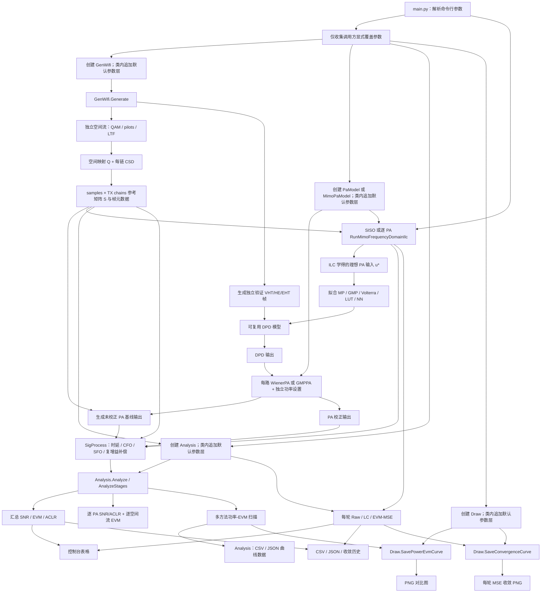
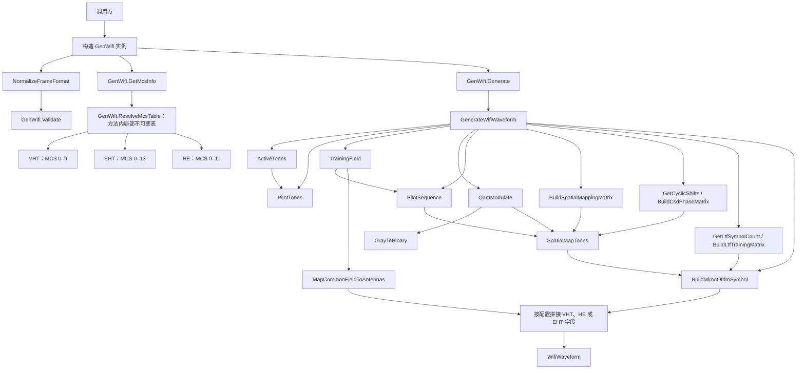
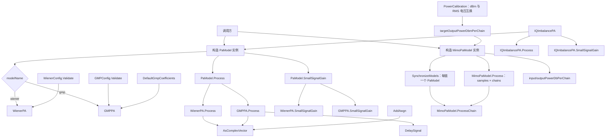
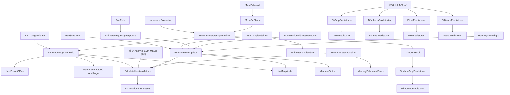
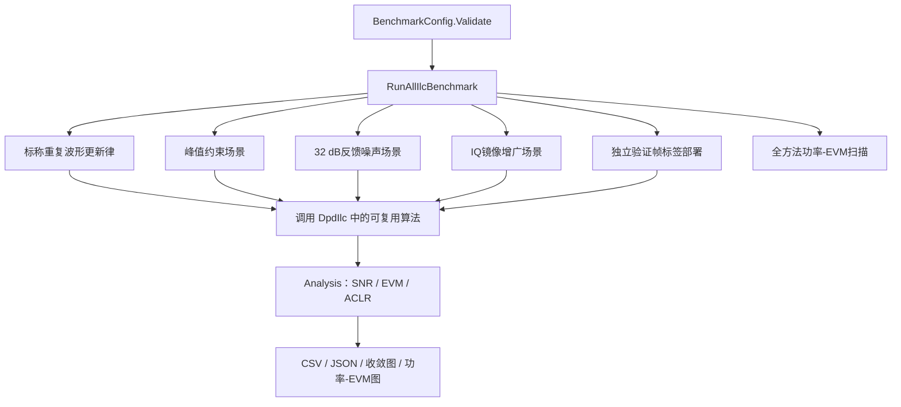
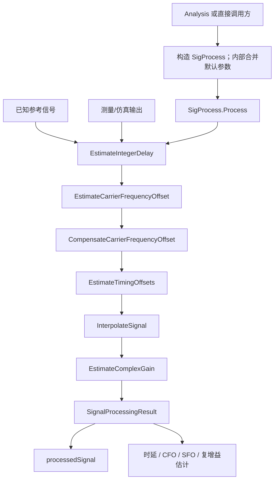
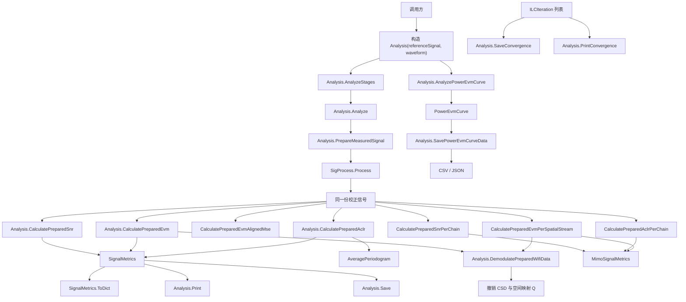
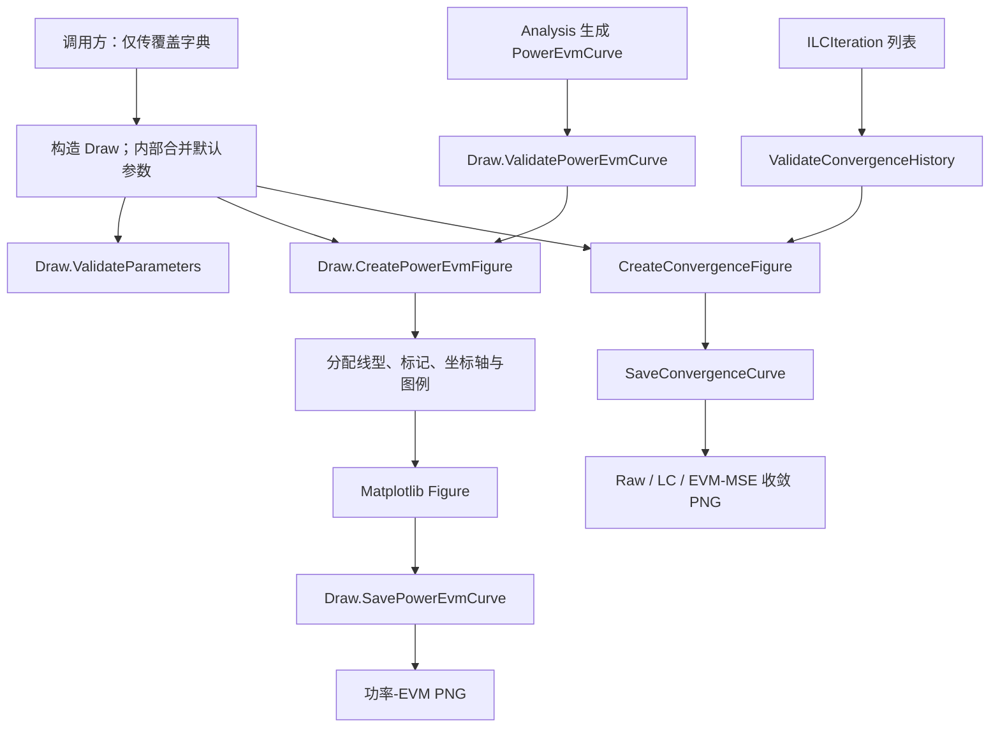
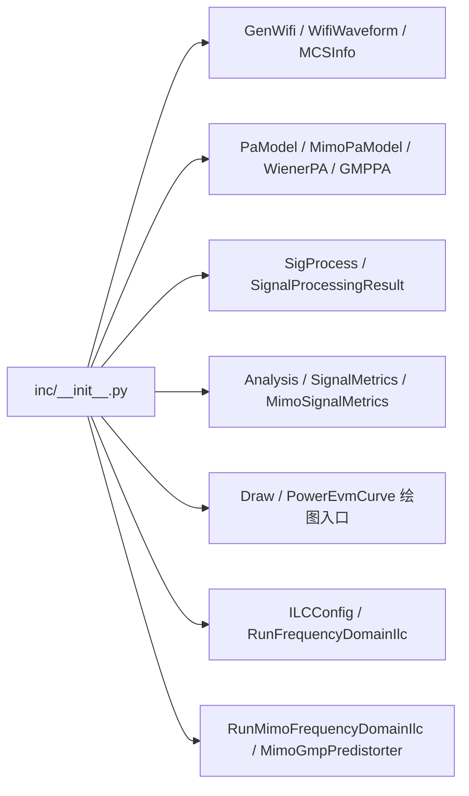

# DPD-ILC VHT/HE/EHT Wi-Fi 仿真工程

本工程按照 `doc/DPD-ILC.md` 的推荐路线实现：通过 `GenWifi` 实例生成 802.11ac/VHT、802.11ax/HE 或 802.11be/EHT Wi-Fi 复基带训练波形，支持 1–8 条空间流及物理发射链，经每路独立的 Wiener 或 GMP 功放模型后，使用正则化频域 ILC 学习理想 PA 输入，再以每路 GMP 拟合可复用的 DPD，并输出汇总及逐 PA/逐空间流 SNR、EVM、ACLR，以及多方法功率-EVM 对比曲线。

## 理论文档

- [Wi-Fi 帧生成物理原理与推导](doc/WaveGen.md)：复基带、OFDM 正交性、QAM 归一化、MCS、循环前缀、VHT/HE/EHT 字段和 PAPR。
- [PA 模型物理原理与推导](doc/PaModel.md)：Wiener、Rapp AM-AM、AM-PM、GMP、频谱再生、IQ 失衡和反馈噪声。
- [信号同步与补偿物理原理](doc/SigProcess.md)：整数/分数时延、载波频偏、采样频偏、Lanczos-sinc 重采样和复增益补偿。
- [结果计算物理原理与推导](doc/Analysis.md)：同步后 SNR、EVM、Welch PSD、ACLR 和功率-EVM 曲线。
- [DPD-ILC 原理与算法](doc/DPD-ILC.md)：各类 ILC 更新律、部署模型和工程实践。
- [全工程函数与物理原理覆盖审计](doc/FunctionPrinciples.md)：逐项索引 `main.py` 与 `inc` 中全部函数，区分物理模型、数值实现和工程编排，并链接到对应推导。

安装依赖：

```powershell
python -m pip install -r requirements.txt
```

工程使用 NumPy 完成信号处理；Matplotlib 只由 `inc/Draw.py` 调用，用于生成 PNG 曲线图。

## 工程结构

```text
main.py                 命令行主程序
inc/waveGen.py          GenWifi 类、VHT/HE/EHT 波形、别名归一化与 MCS 调制
inc/PaModel.py          SISO/MIMO Wiener 和 GMP 非线性 PA、每路功率控制
inc/DpdIlc.py           全部可复用 ILC 更新律、SISO/MIMO 与标签部署模型
inc/SigProcess.py       时延、载波/采样频偏和复增益估计与补偿
inc/Analysis.py         SNR、EVM、ACLR、功率-EVM 数据计算及结果输出
inc/Draw.py             功率-EVM 多方法同图绘制与 PNG 输出
inc/__init__.py         公共接口汇总
tests/TestProject.py    自包含验证脚本
tests/BenchMark.py      分类场景 ILC 性能基准、结果保存和功率-EVM比较
doc/BenchMark.md        各 benchmark 场景的构造、预期和参考仿真结果
```

所有代码注释与文档字符串均为英文；除 Python 协议强制要求的 `__init__` 等双下划线方法外，所有函数（包括内部辅助函数）都使用大驼峰命名。变量和对外对象属性使用小驼峰命名；属性底层访问器使用大驼峰函数名，并通过小驼峰属性别名保持调用接口一致。

## 工程工作流程图



**图示说明：**

1. `main.py` 首先读取帧格式、带宽、MCS、PA 类型、驱动电平和 ILC 参数，只把调用方明确指定的覆盖值传给 `GenWifi`、`PaModel`、`Analysis` 和 `Draw`。每个类在自己的构造函数内部定义不可变默认参数，并建立 `ChainMap`，因此调用处不需要导入、复制或显式拼接默认参数。
2. 调用 `GenWifi.Generate()` 后，每条空间流拥有独立随机 QAM 与导频；空间映射矩阵 `Q` 把空间流映射到物理发射链，并叠加每链循环移位分集（CSD）。SISO 返回向量，MIMO 返回形状为 `samples × numTransmitAntennas` 的矩阵。
3. `MimoPaModel` 为每个矩阵列建立独立 PA，可分别设置输入驱动增益 dB、相对输出功率 dB 或绝对输出功率 dBm。`PowerCalibration` 按用户配置的端口电阻把 dBm 换算成 PA 模型使用的复包络 RMS 电压。单方案模式对每个 PA 独立执行正则化频域 ILC，再对各路 ILC 标签分别拟合 GMP；全方案基准当前仅用于 SISO。
4. 收敛后的 `u*` 可直接用于重复波形测试，也可作为监督标签拟合 MP、GMP、Volterra、LUT 或 NN，从而形成可用于其他帧的部署模型。
5. 所有输出最终传给同一个 `Analysis` 实例；MIMO 时每条物理链分别调用 `SigProcess` 完成整数/分数时延、载波频偏、采样频偏和复增益补偿。ACLR 对各链 PSD 求和形成汇总值，同时保留每链结果；EVM 在撤销 CSD 和空间映射后按空间流统计。`AnalyzePowerEvmCurve` 在多个绝对 dBm 输入功率点调用各方法，生成不包含绘图逻辑的 `PowerEvmCurve` 数据对象。
6. `Analysis.PrintConvergence` 在控制台逐轮显示 Raw MSE、去公共复增益后的 LC-MSE 和严格的 EVM 对齐 MSE；`Analysis.SaveConvergence` 保存相同数据。`Draw.SaveConvergenceCurve` 把三种归一化指标绘制在同一张收敛图中，`Draw.SavePowerEvmCurve` 则单独绘制多方法功率-EVM 图。

图中从“生成独立验证 VHT/HE/EHT 帧”开始的支路专门验证部署模型的泛化能力；它使用相同格式配置和不同随机种子的载荷，不与 ILC 训练帧重复。

## `inc` 模块与函数结构图

以下结构图中，箭头 `A → B` 表示 `A` 调用、创建或依赖 `B`；以类名标记的节点保存配置或运行状态，以函数名标记的节点执行具体算法。

### `inc/waveGen.py`



**图示说明：**

- 调用方必须先构造 `GenWifi`，再调用实例方法；`NormalizeFrameFormat` 先把 `11ac/11ax/11be` 等效归一化为 `VHT/HE/EHT`，`GenWifi.Validate` 再检查带宽、格式对应的 MCS 范围、GI、符号数和采样率兼容性。
- `GenWifi.GetMcsInfo` 调用 `GenWifi.ResolveMcsTable`，在方法内部构造局部不可变 MCS 表并根据规范化后的 `frameFormat` 选择范围；VHT 支持 MCS 0–9、HE 支持 MCS 0–11、EHT 支持 MCS 0–13，不使用模块级查表变量。
- `ActiveTones` 与 `PilotTones` 决定不同带宽下的数据、导频和空子载波位置；`QamModulate` 完成 Gray 编码星座映射。
- `BuildSpatialMappingMatrix` 产生 direct、DFT 或调用方自定义的正交映射；`SpatialMapTones` 为每个子载波执行空间映射并叠加 CSD，`BuildMimoOfdmSymbol` 再完成各发射链 IFFT 和循环前缀。
- `BuildLtfTrainingMatrix` 产生跨 LTF 符号的正交训练码；LTF 数量随空间流增加。公共字段由 `MapCommonFieldToAntennas` 复制到各链并保留 CSD。
- `GenWifi.Generate` 是面向调用方的波形入口，并由内部辅助函数 `GenerateWifiWaveform` 完成组帧，最终返回 `WifiWaveform`；其中既有时域样本，也有后续 EVM 解调所需的格式、字段切片和参考星座。

### `inc/PaModel.py`



**图示说明：**

- 调用方先创建 `PaModel(modelName="wiener" 或 "gmp")`；统一类根据名称持有 `WienerPA` 或 `GMPPA` 实现，并可接收对应的配置对象。
- `PaModel.Process` 与 `PaModel.SmallSignalGain` 将调用委托给当前实现，因此主程序和 ILC 无须包含模型类型分支。
- `WienerPA.Process` 依次执行线性记忆滤波、Rapp AM-AM 压缩和 AM-PM 相位旋转。
- `GMPPA.Process` 使用 `DelaySignal` 构造主项、滞后包络项和超前包络项；未提供系数时由 `DefaultGmpCoefficients` 创建稳定的默认模型。
- `IQImbalancePA` 在已有 PA 输出上增加共轭镜像，用于测试增广 ILC；`AddAwgn` 模拟反馈接收链噪声。
- `SmallSignalGain` 为复增益归一化和频率响应估计提供线性工作点参考。
- `PowerCalibration` 使用 $P=V_{\mathrm{RMS}}^2/R$ 在 dBm 与复包络 RMS 电压之间换算；默认端口电阻为 50 Ω。
- `MimoPaModel` 不在链间引入隐含耦合：每一列进入独立 `PaModel`。`ProcessChain` 是单路 ILC 看到的真实 plant；相对 dB 与绝对 dBm 功率设置均在该路径中生效。

### `inc/DpdIlc.py`



**图示说明：**

- `DpdIlc.py` 是工程中唯一的可复用 ILC 算法文件，集中保存公共配置和收敛记录、全部更新律、SISO/MIMO执行及ILC标签部署模型。
- 频域 ILC 和其他波形更新律共享 `ILCConfig`、`CalculateIterationMetrics`、`LimitAmplitude` 与 `ILCResult`。`ILCConfig` 只保存算法和反馈参数；严格EVM-MSE由 `Analysis` 作为独立评估器传给ILC入口。
- 标量 P、复增益、FIR、方向 Gauss-Newton 和增广 IQ 路线通过 `RunWaveformUpdate` 复用测量与迭代骨架；参数域 ILC 使用 `MemoryPolynomialBasis` 直接更新可部署系数。
- GMP、Volterra、LUT 和神经网络拟合都消费收敛标签 `u*`。各 `Fit...` 函数负责训练，相应 `...Predistorter.Process` 方法负责在独立验证帧上推理。
- MIMO 路线用 `MimoPaChain` 将每个物理 PA 暴露给同一频域 ILC，再按链保存历史并分别拟合 GMP；当前模型假设 PA 之间没有隐藏耦合。
- 测试波形、特殊损伤、方法组合、结果文件和功率扫描全部移到 `tests/BenchMark.py`，因此生产算法不依赖任何 benchmark 流程。

### `tests/BenchMark.py`



**图示说明：**`BenchMark.py` 只负责场景编排和结果呈现，不重新实现任何ILC更新律。场景分类、预期趋势和本机参考结果见[BenchMark场景说明](doc/BenchMark.md)。

### `inc/SigProcess.py`



**图示说明：**

- `SigProcess` 使用已知参考做数据辅助同步；正整数时延表示测量信号晚于参考。
- CFO 由多个时间窗口的复增益相位斜率估计，避免逐样点 PA 相位扰动产生明显假频偏。
- 多窗口局部相关峰的截距给出分数时延，随时间的斜率给出采样频偏 ppm。
- `InterpolateSignal` 使用有限长度 Lanczos-sinc 核把测量记录重采样到参考网格，随后除去最小二乘公共复增益。
- `SignalProcessingResult` 同时保存校正样点和所有标量估计，`ToDict()` 可用于记录估计结果。

### `inc/Analysis.py`



**图示说明：**

- `Analysis` 构造时保存参考信号和 `WifiWaveform` 元数据；后续每个待测输出只需传给 `Analyze`，多个命名阶段可一次传给 `AnalyzeStages`。
- 每次 `Analyze` 只调用一次 `SigProcess.Process`，整数/分数时延、CFO、SFO 和公共复增益补偿后的同一份信号被三个指标复用。
- SNR 直接计算校正后数据字段与参考的残差功率；EVM 根据 `WifiWaveform` 的数据字段位置去循环前缀并 FFT，再与采用相同 FFT 路径得到的参考星座比较。
- ACLR 通过 `AveragePeriodogram` 获得平均功率谱，然后分别积分主信道、下邻道和上邻道功率。
- 三类指标封装为 `SignalMetrics`，由同一实例的 `Print` 输出到终端，或由 `Save` 写入 JSON/CSV。
- `CalculateEvmAlignedMse` 使用与 EVM 完全相同的同步、去 CP、FFT、空间解映射和数据音调选择；其结果严格等于 RMS EVM 的平方。
- `Analysis.PrintConvergence` 和 `Analysis.SaveConvergence` 逐轮呈现 Raw MSE/NMSE、LC-MSE/NMSE、EVM-MSE/EVM dB、公共复增益幅相和输入峰值。
- MIMO 输入按列分别同步；`DemodulatePreparedWifiData` 在 FFT 后撤销每链 CSD 相位和空间映射矩阵。`MimoSignalMetrics` 保存逐 PA SNR/ACLR 与逐空间流 EVM，`PrintMimo` 和 `Save` 分别打印并写入 JSON/CSV。
- `AnalyzePowerEvmCurve` 接收一组严格递增的绝对 dBm 输入功率点和多个方法求值器，先按 `loadResistanceOhm` 换算复包络 RMS 电压，再在每个功率点使用相同参考信号计算 EVM；`SavePowerEvmCurveData` 只保存原始 CSV/JSON 数据，不导入或调用任何绘图库。

### `inc/Draw.py`



**图示说明：**

- `Draw` 只接收已经算好的 `PowerEvmCurve` 或 `ILCIteration` 历史，不计算 SNR、EVM、MSE 或 ACLR，也不负责 CSV/JSON 数据序列化。
- `ValidatePowerEvmCurve` 在创建图形前检查功率坐标、各方法数据长度和有限性，防止产生缺失或错位曲线。
- `CreatePowerEvmFigure` 把所有方法绘制在同一坐标系中；方法较多时图例自动移到绘图区外，避免遮挡数据。
- `SavePowerEvmCurve` 读取 `Draw` 在类内部解析后的绘图参数并仅输出 PNG；图形尺寸、DPI、线宽、标记大小、标题和坐标轴文字均可由外部覆盖。
- `SaveConvergenceCurve` 在同一 dB 轴上绘制 Raw NMSE、LC-NMSE 和可用的 EVM-MSE/EVM dB，便于定位原始 MSE 停滞但 EVM 继续改善的原因。

### `inc/__init__.py`

`__init__.py` 不实现算法函数，只汇总工程的公共入口：



**图示说明：**

- `inc/__init__.py` 是包的公共门面，不包含算法计算。
- 外部调用者可以从 `inc` 直接导入波形生成、PA、分析和频域ILC入口；基准测试入口位于 `tests.BenchMark`，明确与生产API隔离。
- 未在此处导出的下划线私有函数只供模块内部复用，避免将实现细节暴露为稳定接口。

## 802.11ac/ax/be 与 VHT/HE/EHT 支持范围

标准名称和 PHY 格式名称采用以下等效输入关系；`WifiWaveform.frameFormat` 始终返回右侧规范名称：

| 标准代际输入 | 等效 PHY 输入 | 规范化结果 |
| --- | --- | --- |
| `11ac`、`802.11ac` | `VHT` | `VHT` |
| `11ax`、`802.11ax` | `HE` | `HE` |
| `11be`、`802.11be` | `EHT` | `EHT` |

- 带宽：20、40、80、160 MHz。
- VHT MCS：0–9，即 BPSK、QPSK、16/64/256-QAM 及对应码率。
- EHT MCS：0–13，即 BPSK、QPSK、16/64/256/1024/4096-QAM 及对应码率。
- HE MCS：0–11，即 BPSK、QPSK、16/64/256/1024-QAM 及对应码率。
- VHT 字段：L-STF、L-LTF、L-SIG、VHT-SIG-A、VHT-STF、VHT-LTF、VHT-SIG-B、VHT-Data。
- EHT 字段：L-STF、L-LTF、L-SIG、RL-SIG、U-SIG、EHT-SIG、EHT-STF、EHT-LTF、EHT-Data。
- HE-SU 字段：L-STF、L-LTF、L-SIG、RL-SIG、HE-SIG-A、HE-STF、HE-LTF、HE-Data。
- VHT 数据子载波间隔为 312.5 kHz；20/40/80/160 MHz 分别使用 64/128/256/512 点基础 FFT，数据音调数为 52/108/234/468。
- HE/EHT 数据子载波间隔为 78.125 kHz；全带宽 RU 分别采用 242、484、996 和 2×996 tones。
- VHT 数据 GI 支持 0.4、0.8 μs；HE/EHT 支持 0.8、1.6、3.2 μs。
- VHT/HE/EHT 支持 1–8 条空间流和发射链，且 `numSpatialStreams <= numTransmitAntennas`。
- 每条空间流具有独立 QAM 与导频；支持 direct、DFT 和 Python API 自定义正交空间映射、每链 CSD 以及随空间维度增加的正交 LTF 训练。

完整 MCS 映射如下：

| MCS | 调制方式 | 码率 | 支持格式 |
| ---: | --- | ---: | --- |
| 0 | BPSK | 1/2 | VHT、HE、EHT |
| 1 | QPSK | 1/2 | VHT、HE、EHT |
| 2 | QPSK | 3/4 | VHT、HE、EHT |
| 3 | 16-QAM | 1/2 | VHT、HE、EHT |
| 4 | 16-QAM | 3/4 | VHT、HE、EHT |
| 5 | 64-QAM | 2/3 | VHT、HE、EHT |
| 6 | 64-QAM | 3/4 | VHT、HE、EHT |
| 7 | 64-QAM | 5/6 | VHT、HE、EHT |
| 8 | 256-QAM | 3/4 | VHT、HE、EHT |
| 9 | 256-QAM | 5/6 | VHT、HE、EHT |
| 10 | 1024-QAM | 3/4 | HE、EHT |
| 11 | 1024-QAM | 5/6 | HE、EHT |
| 12 | 4096-QAM | 3/4 | 仅 EHT |
| 13 | 4096-QAM | 5/6 | 仅 EHT |

波形用于 PA/DPD 激励与指标评估，载荷采用随机 post-FEC 比特。MIMO 的空间维度、正交映射、CSD 和多 LTF 结构可用于多链 PA/DPD 研究；它不包含可用于协议一致性测试的完整 LDPC 编解码、MAC/A-MPDU 组帧、标准 P 矩阵逐元素复刻或 SIG 字段逐比特编码。

## 参数参考

### 命令行参数

以下参数均由 `main.py` 支持；未指定参数时使用表中的默认值。

| 参数 | 可选值或类型 | 默认值 | 说明 |
| --- | --- | --- | --- |
| `-h`, `--help` | 开关 | — | 显示完整命令行帮助。 |
| `--format` | `VHT/11ac`、`HE/11ax`、`EHT/11be`，也接受 `802.11ac/ax/be` | `EHT` | 输入不区分大小写并规范化为 VHT、HE 或 EHT。 |
| `--bandwidth` | `20`、`40`、`80`、`160` | `80` | 信道带宽，单位 MHz。 |
| `--mcs` | VHT：`0–9`；HE：`0–11`；EHT：`0–13` | `9` | 调制编码方案索引；默认值对三种格式都有效。 |
| `--pa` | `wiener`、`gmp` | `wiener` | 非线性 PA 模型。 |
| `--tx-antennas` | `1–8` | `1` | VHT/HE/EHT 物理发射链及独立 PA 数量。 |
| `--spatial-streams` | 正整数且不大于发射链数 | `1` | 独立空间流数，VHT/HE/EHT 最大 8。 |
| `--spatial-mapping` | `direct`、`dft` | `direct` | 空间流到发射链的正交映射。自定义矩阵通过 Python API 设置。 |
| `--pa-input-power-db` | 逗号分隔浮点数 | 每路 `0` | 每路进入非线性 PA 前的独立驱动增益 dB，元素数必须等于发射链数。 |
| `--pa-output-power-db` | 逗号分隔浮点数 | 每路 `0` | 每路 PA 后的独立相对输出功率调整 dB。 |
| `--pa-output-power-dbm` | 逗号分隔 dBm 数值或 `none` | 每路 `none` | 每路 PA 后的绝对输出功率目标，单位 dBm；按 `--load-resistance-ohm` 换算。 |
| `--pa-output-rms` | 逗号分隔正数或 `none` | 每路 `none` | 旧接口：每路复包络输出 RMS 电压目标；不能与 `--pa-output-power-dbm` 同时使用。 |
| `--symbols` | 正整数 | `20` | 数据 OFDM 符号数。 |
| `--guard-interval` | `0.4`、`0.8`、`1.6`、`3.2` | `0.8` | VHT 使用 0.4/0.8 μs；HE/EHT 使用 0.8/1.6/3.2 μs。 |
| `--sample-rate-hz` | 正浮点数 | 未显式设置时由兼容参数推导 | 用户指定的复基带采样率，单位 Hz；提供后优先于 `--oversampling`。采样率必须使所选PHY的FFT、GI和传统前导时长对应整数采样点。 |
| `--oversampling` | `4`、`8` | `4` | 旧接口兼容项；仅在未提供 `--sample-rate-hz` 时按 `带宽×倍率` 推导采样率。 |
| `--input-power-dbm` | 有限浮点数 | `0.615 dBm`（50 Ω） | PA 输入端口的绝对平均功率；默认值等效于 50 Ω 下 `0.24 V RMS`。 |
| `--power-start-dbm` | 有限浮点数 | `−8.928 dBm`（50 Ω） | 功率-EVM 扫描的起始绝对输入功率。 |
| `--power-stop-dbm` | 大于 `--power-start-dbm` 的浮点数 | `5.051 dBm`（50 Ω） | 功率-EVM 扫描的结束绝对输入功率。 |
| `--load-resistance-ohm` | 正浮点数 | `50.0` | dBm 与复包络 RMS 电压换算所用的纯电阻端口，单位 Ω。 |
| `--power-points` | 不小于 2 的整数 | `7` | 在起止功率之间按等 dBm 间隔生成的扫描点数。 |
| `--skip-power-evm-curve` | 开关 | 关闭 | 跳过功率-EVM 扫描及 PNG/CSV/JSON 输出。 |
| `--iterations` | 正整数 | `8` | ILC 迭代次数。 |
| `--learning-rate` | `0 < μ < 2` | `0.15` | ILC 学习增益。 |
| `--regularization` | 正浮点数 | `1e-3` | 逆响应计算的正则化系数。 |
| `--max-amplitude` | 正浮点数 | `2.0` | ILC 学习输入和部署 DPD 输入的峰值限制。 |
| `--feedback-snr` | 浮点数或省略 | `None` | 反馈链 SNR，单位 dB；省略时使用无噪反馈。 |
| `--feedback-averages` | 正整数 | `1` | 每轮 ILC 重复采集并平均的反馈次数。 |
| `--seed` | 整数 | `7` | Wi-Fi 数据、训练字段及相关随机过程的种子。 |
| `--output-dir` | 路径 | `results` | JSON、CSV、收敛历史和可选波形文件的输出目录。 |
| `--save-waveforms` | 开关 | 关闭 | 额外保存 `waveforms.npz`。 |

### `GenWifi` 参数

调用方先构造 `GenWifi(...)`，再调用 `Generate()`。

| 参数 | 类型或可选值 | 默认值 | 说明 |
| --- | --- | --- | --- |
| `parameters` | `Mapping` | `None` | 调用方只传需要修改的键；缺少的键由 `GenWifi` 构造函数内部的不可变默认参数补齐。 |
| `frameFormat` | `"VHT"/"11ac"`、`"HE"/"11ax"`、`"EHT"/"11be"`，并接受带 `802.` 前缀的名称 | `"EHT"` | 不区分大小写；生成后规范化为 VHT、HE 或 EHT。 |
| `bandwidthMhz` | `20`、`40`、`80`、`160` | `80` | 信道带宽，单位 MHz。 |
| `mcs` | VHT：`0–9`；HE：`0–11`；EHT：`0–13` | `9` | MCS 索引；默认值对三种格式都有效。 |
| `numDataSymbols` | 正整数 | `20` | 数据 OFDM 符号数。 |
| `guardIntervalUs` | VHT：`0.4/0.8`；HE/EHT：`0.8/1.6/3.2` | `0.8` | 数据 GI，单位 μs。 |
| `sampleRateHz` | 正数或 `None` | `None` | 用户直接配置的复基带采样率，单位 Hz；`None` 时才使用旧 `oversampling` 推导。必须不低于信道带宽，并保证OFDM各时长对应整数采样点。 |
| `oversampling` | 正整数 | `4` | 旧接口兼容项；`sampleRateHz=None` 时采样率等于 `bandwidthMhz×1e6×oversampling`。生成后该属性表示实际采样率与带宽之比，允许为非整数。 |
| `seed` | 整数 | `7` | 载荷、导频和训练字段随机种子。 |
| `numTransmitAntennas` | `1–8` | `1` | VHT/HE/EHT 物理发射链数量；MIMO 输出矩阵的列数。 |
| `numSpatialStreams` | `1..numTransmitAntennas` | `1` | 独立 QAM、导频和训练流数量。 |
| `spatialMapping` | `"direct"`、`"dft"`、`"custom"` | `"direct"` | 每个子载波采用的空间映射方式。 |
| `spatialMappingMatrix` | 复矩阵或 `None` | `None` | 仅 custom 使用，形状为 `numTransmitAntennas × numSpatialStreams`，列必须正交归一。 |
| `cyclicShiftEnabled` | `bool` | `True` | 是否对各物理链施加格式相关的循环移位分集相位。 |

`Generate()` 返回 `WifiWaveform`。SISO 的 `samples` 是一维数组，MIMO 是 `samples × numTransmitAntennas` 矩阵；元数据还包含 `numSpatialStreams`、`spatialMappingMatrix`、`cyclicShiftsSeconds`、`ltfSymbolCount` 及三维参考空间流星座。

`sampleRateHz` 是采样时钟的权威输入。例如：

```python
wifiGenerator = GenWifi(
    frameFormat="EHT",
    bandwidthMhz=20,
    sampleRateHz=50.0e6,
)
waveform = wifiGenerator.Generate()

assert waveform.sampleRateHz == 50.0e6
assert waveform.fftLength == 640
assert waveform.oversampling == 2.5
```

采样率与带宽的比值可以是非整数，但采样率必须让有效OFDM符号、GI和传统前导时长得到整数采样点。若未提供 `sampleRateHz`，旧 `oversampling` 参数仍可兼容现有调用。

### `PowerCalibration` 参数与方法

`PowerCalibration(parameters=None, **parameterOverrides)` 负责绝对功率标定。工程约定复包络的 RMS 幅度等于电阻端口上的 RF RMS 电压，因此

```text
P(W) = Vrms² / R
P(dBm) = 10 log10(P(W) / 0.001)
```

| 参数 | 默认值 | 说明 |
| --- | --- | --- |
| `loadResistanceOhm` | `50.0` | PA 输入、输出端口的纯电阻负载，单位 Ω，必须为正数。 |

| 方法 | 参数 | 返回值或作用 |
| --- | --- | --- |
| `DbmToRms(inputPowerDbm)` | 任意有限 dBm 数值 | 返回该功率在所配置端口上的复包络 RMS 电压。 |
| `RmsToDbm(signalRms)` | 正的有限 RMS 电压 | 返回对应的绝对功率 dBm。 |
| `GetParameters()` | 无 | 返回当前解析参数。 |
| `UpdateParameters(**parameterOverrides)` | 支持的任意配置 | 事务式更新覆盖层。 |

例如在 50 Ω 端口上，`0 dBm = 1 mW` 对应约 `0.223607 V RMS`。因此 dBm 不是给归一化幅度换一个标签；端口阻抗是完成物理换算所必需的标定量。

### `PaModel` 参数

| 参数 | 类型或可选值 | 默认值 | 说明 |
| --- | --- | --- | --- |
| `parameters` | `Mapping` | `None` | 调用方只传需要修改的键；缺少的键由 `PaModel` 构造函数内部的不可变默认参数补齐。 |
| `modelName` | `"wiener"`、`"gmp"`，不区分大小写 | `"wiener"` | 选择内部 PA 实现。 |
| `wienerConfig` | `WienerConfig` 或 `None` | `None` | Wiener 模式的配置；`None` 使用默认配置。 |
| `gmpConfig` | `GMPConfig` 或 `None` | `None` | GMP 模式的配置；`None` 使用默认配置。 |

`WienerConfig` 支持：

| 参数 | 默认值 | 约束或含义 |
| --- | --- | --- |
| `linearTaps` | `(1+0j, 0.055-0.025j, -0.018+0.012j)` | 非空复数 FIR 系数元组。 |
| `linearGain` | `1.0` | 正数；线性增益。 |
| `saturationAmplitude` | `1.0` | 正数；Rapp 饱和幅度。 |
| `rappSmoothness` | `3.0` | 正数；Rapp 平滑度。 |
| `ampmCoefficient` | `0.18` | AM-PM 相位旋转强度。 |

`GMPConfig` 支持：

| 参数 | 默认值 | 约束或含义 |
| --- | --- | --- |
| `nonlinearOrders` | `(1, 3, 5, 7)` | 非空正奇数阶元组。 |
| `memoryDepth` | `3` | 正整数；主分支记忆深度。 |
| `crossMemoryDepth` | `2` | 非负整数；交叉包络记忆深度。 |
| `mainCoefficients` | `None` | 主项系数字典，键为 `(order, memoryIndex)`；`None` 使用内置稳定系数。 |
| `laggingCoefficients` | `None` | 滞后交叉项字典，键为 `(order, memoryIndex, crossIndex)`。 |
| `leadingCoefficients` | `None` | 超前交叉项字典，键为 `(order, memoryIndex, crossIndex)`。 |

`PaModel.Process(inputSignal)` 返回 PA 复基带输出；`SmallSignalGain()` 返回当前模型的 DC 小信号复增益。

`MimoPaModel(parameters=None, **parameterOverrides)` 在构造函数内部使用 `ChainMap` 管理以下参数：

| 参数 | 默认值 | 说明 |
| --- | --- | --- |
| `numTransmitChains` | `1` | 独立 PA 数，范围 1–16。 |
| `paParametersPerChain` | `None` | 每路一个普通 `PaModel` 覆盖字典；`None` 表示每路使用 `PaModel` 内部默认值。 |
| `inputPowerDbPerChain` | `None` | 每路输入驱动 dB；`None` 展开为全 0。 |
| `outputPowerDbPerChain` | `None` | 每路相对输出 dB；`None` 展开为全 0。 |
| `targetOutputPowerDbmPerChain` | `None` | 每路绝对输出功率 dBm 或 `None`；整个参数为 `None` 时全部禁用。 |
| `loadResistanceOhm` | `50.0` | 绝对 dBm 目标与实测输出功率换算所用的端口电阻。 |
| `targetOutputRmsPerChain` | `None` | 旧接口：每路复包络输出 RMS 电压或 `None`；同一链不能同时设置 RMS 与 dBm 目标。 |

`Process(matrix)` 逐列处理；`ProcessChain(vector, chainIndex)` 供单路测量或 ILC 使用；`SetOutputPowerDb`、`SetTargetOutputPowerDbm` 可在运行时只修改一路；`GetOutputPowerDbmPerChain` 返回最近一次矩阵处理测得的各路绝对功率。`SetTargetOutputRms` 和 `GetOutputRmsPerChain` 仅作为旧接口保留。

PA 辅助接口还包括：

| 接口 | 参数 | 默认值或说明 |
| --- | --- | --- |
| `WienerPA(config)` | `config` | 默认使用 `WienerConfig()`；通常建议通过 `PaModel` 构造。 |
| `GMPPA(config)` | `config` | 默认使用 `GMPConfig()`；通常建议通过 `PaModel` 构造。 |
| `IQImbalancePA(paModel, directCoefficient, imageCoefficient)` | `paModel`、直通系数、镜像系数 | `directCoefficient=1+0j`，`imageCoefficient=0.045·exp(j·0.35)`。 |
| `AddAwgn(inputSignal, snrDb, randomGenerator)` | 输入、反馈 SNR、NumPy 随机数生成器 | `snrDb=None` 时原样复制输入，否则加入复高斯白噪声。 |

### `SigProcess` 参数与方法

构造函数 `SigProcess(referenceSignal, sampleRateHz, parameters=None, **parameterOverrides)` 保存已知参考和采样率；全部默认值定义在构造函数内部，调用方只传覆盖字典。

| 配置参数 | 默认值 | 说明 |
| --- | --- | --- |
| `enableIntegerDelayCompensation` | `True` | 估计并补偿整数样点时延。 |
| `enableFractionalDelayCompensation` | `True` | 估计并补偿 `[-0.5, 0.5)` 范围内的残余分数时延。 |
| `enableCarrierFrequencyOffsetCompensation` | `True` | 通过分块复增益相位斜率估计并补偿 CFO。 |
| `enableSamplingFrequencyOffsetCompensation` | `True` | 通过局部时延随时间的斜率估计并补偿 SFO。 |
| `enableComplexGainCompensation` | `True` | 估计并除去最小二乘公共复增益。 |
| `maxIntegerDelaySamples` | `None` | 整数时延搜索半径；`None` 自动选择且最大为 4096 样点。 |
| `maxCarrierFrequencyOffsetHz` | `None` | CFO 估计绝对值上限；`None` 使用内部安全范围。 |
| `maxSamplingFrequencyOffsetPpm` | `200.0` | 采样频偏估计绝对值上限。 |
| `timingWindowCount` | `9` | CFO 和时变时延估计使用的窗口数。 |
| `timingWindowLength` | `2048` | 每个局部估计窗口的目标样点数。 |
| `interpolationHalfLength` | `12` | Lanczos-sinc 插值核的单侧支持长度。 |

| 方法 | 参数 | 返回值或作用 |
| --- | --- | --- |
| `Process(measuredSignal, estimationSlice=None)` | 测量信号、可选增益估计区间 | 返回 `SignalProcessingResult`。 |
| `EstimateIntegerDelay(measuredSignal)` | 测量信号 | 返回有符号整数时延。 |
| `EstimateCarrierFrequencyOffset(integerAlignedSignal)` | 粗对齐信号 | 返回 CFO，单位 Hz。 |
| `EstimateTimingOffsets(signal, integerDelay)` | CFO 校正信号、粗时延 | 返回整数时延、分数时延和 SFO ppm。 |
| `InterpolateSignal(inputSignal, samplePositions)` | 输入信号、浮点采样位置 | 返回 Lanczos-sinc 重采样信号。 |
| `EstimateComplexGain(referenceSignal, measuredSignal)` | 等长对齐信号 | 返回最小二乘复增益。 |
| `GetParameters()` | 无 | 返回当前解析后的参数快照。 |
| `UpdateParameters(**parameterOverrides)` | 支持的任意配置 | 事务式更新最高优先级参数层。 |

`SignalProcessingResult` 包含 `processedSignal`、`integerDelaySamples`、`fractionalDelaySamples`、`carrierFrequencyOffsetHz`、`samplingFrequencyOffsetPpm` 和 `complexGain`。

### `Analysis` 参数与方法

构造函数 `Analysis(referenceSignal, waveform, parameters=None, **parameterOverrides)` 要求参考信号为非空有限复数组，且形状与 `WifiWaveform.samples` 相同；MIMO 采用 `samples × transmitChains`。传入的待测信号可以在同步前具有不同样点数，但列数必须保持一致。

| 配置参数 | 默认值 | 说明 |
| --- | --- | --- |
| `parameters` | `None` | 外部 `Mapping` 覆盖层；未提供的键使用 `Analysis` 构造函数内部默认值。 |
| `maxSegmentLength` | `16384` | Welch PSD 的最大分段长度，必须是不小于 16 的整数。 |
| `minimumAclrOversampling` | `3.0` | ACLR 所需最低过采样倍率，不允许小于 3。 |
| `powerEvmFileStem` | `"power_evm_curve"` | 功率–EVM 的 CSV、JSON 默认文件名前缀。 |
| `loadResistanceOhm` | `50.0` | 功率扫描中 dBm 与参考波形 RMS 电压换算所用的端口电阻。 |
| `signalProcessingParameters` | `None` | 传给 `SigProcess` 的普通覆盖字典；`None` 使用其内部默认值。 |

| 方法 | 参数 | 返回值或作用 |
| --- | --- | --- |
| `Analyze(measuredSignal)` | PA/DPD 输出或采集信号 | 先调用 `SigProcess`，再返回一个 `SignalMetrics`。 |
| `AnalyzeStages(stageSignals)` | `{阶段名称: 输出数组}` 映射 | 批量计算并保存各阶段指标。 |
| `PrepareMeasuredSignal(measuredSignal)` | 原始待测信号 | 返回与参考等长的同步、频偏和复增益校正信号。 |
| `GetLastSignalProcessingResult()` | 无 | 返回最近一次第一路 `SignalProcessingResult`，尚未分析时返回 `None`。 |
| `GetLastSignalProcessingResults()` | 无 | 返回最近一次所有物理链的同步结果元组。 |
| `GetLastMimoMetrics()` | 无 | 返回最近一次逐 PA/逐空间流 `MimoSignalMetrics`。 |
| `GetStageSignalProcessingResults()` | 无 | 返回 `AnalyzeStages` 保存的各阶段逐链同步估计。 |
| `GetStageMimoMetrics()` | 无 | 返回各阶段详细 MIMO 指标。 |
| `CalculateSnr(measuredSignal)` | 待测输出 | 返回数据字段 SNR，单位 dB。 |
| `CalculateEvmAlignedMse(measuredSignal)` | 待测输出 | 返回与 EVM 接收链完全一致的归一化 MSE；该值等于 RMS EVM 的平方。 |
| `CalculateEvm(measuredSignal)` | 待测输出 | 返回 `(evmDb, evmPercent)`。 |
| `CalculateAclr(measuredSignal)` | 待测输出 | 返回 `(aclrLowerDb, aclrUpperDb, aclrWorstDb)`。 |
| `DemodulateWifiData(measuredSignal)` | 待测输出 | 返回 VHT/HE/EHT 数据子载波星座。 |
| `Print(stageMetrics=None)` | 可选指标映射 | 打印指标表；省略时使用最近一次 `AnalyzeStages` 的结果。 |
| `PrintMimo(stageMimoMetrics=None)` | 可选详细指标映射 | 打印逐 PA SNR/ACLR 与逐空间流 EVM。 |
| `PrintConvergence(ilcHistory, historyName="ILC convergence")` | ILC 历史、可选标题 | 逐轮打印 Raw MSE、LC-MSE、EVM-MSE、复增益幅相和输入峰值。 |
| `Save(outputDirectory, runMetadata, stageMetrics=None)` | 输出路径、元数据、可选指标映射 | 写入 `metrics.json` 和 `metrics.csv`，并附带可用的各阶段同步估计。 |
| `SaveConvergence(ilcHistory, outputDirectory)` | ILC 历史、输出路径 | 写入包含三级 MSE 和线性项诊断的 `ilc_convergence.csv`。 |
| `AnalyzePowerEvmCurve(inputPowerDbmValues, methodEvaluators)` | 递增 dBm 点、`{方法名: 求值器}` 映射 | 计算并保存一个 `PowerEvmCurve`；求值器接收当前参考信号和绝对输入功率 dBm。 |
| `SavePowerEvmCurveData(outputDirectory, powerEvmCurve=None, fileStem=None)` | 输出路径、可选曲线、文件名前缀 | `fileStem=None` 时读取实例解析后的 `powerEvmFileStem`，并只写入 CSV 和 JSON。 |

`SignalMetrics` 字段包括 `snrDb`、`evmDb`、`evmPercent`、`aclrLowerDb`、`aclrUpperDb` 和 `aclrWorstDb`。`PowerEvmCurve` 保存用户指定的 `inputPowerDbmValues`、内部换算得到的 `driveRmsValues` 以及各方法的 EVM dB/百分比数组。

### `Draw` 参数与方法

构造函数 `Draw(parameters=None, **parameterOverrides)` 在内部使用 `ChainMap` 管理绘图配置，并且不持有或重新计算分析指标；调用方只需提供覆盖字典。

| 配置参数 | 默认值 | 说明 |
| --- | --- | --- |
| `parameters` | `None` | 外部 `Mapping` 覆盖层；未提供的键使用 `Draw` 构造函数内部默认值。 |
| `powerEvmFileStem` | `"power_evm_curve"` | PNG 默认文件名前缀。 |
| `convergenceFileStem` | `"ilc_convergence"` | 每轮 MSE 收敛 PNG 的默认文件名前缀。 |
| `figureWidthInches` | `10.5` | 图像宽度，单位英寸，必须为正数。 |
| `figureHeightInches` | `6.2` | 图像高度，单位英寸，必须为正数。 |
| `figureDpi` | `180` | PNG 分辨率，必须为正整数。 |
| `lineWidth` | `1.8` | 方法曲线线宽。 |
| `markerSize` | `5.0` | 数据点标记大小。 |
| `legendColumnThreshold` | `6` | 方法数超过该值时，将图例移到绘图区右侧。 |
| `plotTitle` | `"Power-EVM comparison"` | 图标题。 |
| `convergencePlotTitle` | `"ILC MSE convergence"` | 每轮 MSE 收敛图标题。 |
| `xAxisLabel` | `"PA input power (dBm)"` | 横轴标题。 |
| `yAxisLabel` | `"RMS EVM (dB, lower is better)"` | 纵轴标题。 |
| `convergenceXAxisLabel` | `"ILC iteration"` | 收敛图横轴标题。 |
| `convergenceYAxisLabel` | `"Normalized error / EVM (dB, lower is better)"` | 收敛图纵轴标题。 |

| 方法 | 参数 | 返回值或作用 |
| --- | --- | --- |
| `GetParameters()` | 无 | 返回当前解析后的绘图参数快照。 |
| `UpdateParameters(**parameterOverrides)` | 任意受支持的绘图参数 | 事务式更新最高优先级层。 |
| `ValidatePowerEvmCurve(powerEvmCurve)` | `PowerEvmCurve` | 检查曲线长度、方法名和有限性。 |
| `CreatePowerEvmFigure(powerEvmCurve)` | `PowerEvmCurve` | 返回包含所有方法的 Matplotlib Figure。 |
| `SavePowerEvmCurve(powerEvmCurve, outputDirectory, fileStem=None)` | 曲线、输出目录、可选文件名前缀 | 只生成并返回 PNG 路径。 |
| `ValidateConvergenceHistory(ilcHistory)` | 每轮历史 | 检查轮次顺序以及 Raw/LC/EVM 序列完整性。 |
| `CreateConvergenceFigure(ilcHistory)` | 每轮历史 | 返回三级 MSE 同轴对比的 Matplotlib Figure。 |
| `SaveConvergenceCurve(ilcHistory, outputDirectory, fileStem=None)` | 每轮历史、输出目录、可选文件名前缀 | 生成并返回每轮 MSE 收敛 PNG 路径。 |

### `ILCConfig` 与算法参数

| 参数 | 默认值 | 约束或含义 |
| --- | --- | --- |
| `numIterations` | `8` | 正整数；迭代次数。 |
| `learningRate` | `0.15` | `0 < μ < 2`；更新增益。 |
| `regularization` | `1e-3` | 正数；逆响应或正规方程正则化。 |
| `maxAmplitude` | `2.0` | 正数；学习输入峰值限制。 |
| `feedbackSnrDb` | `None` | 反馈 SNR；`None` 表示无噪声。 |
| `feedbackAverages` | `1` | 正整数；反馈平均次数。 |
| `projectionBandwidthFactor` | `1.6` | 大于 1；频域 ILC 更新投影带宽相对信道带宽的倍率。 |
| `responseFloorDb` | `-45.0` | 频率响应估计的低激励置信度门限。 |
| `randomSeed` | `19` | 反馈噪声及算法随机过程种子。 |

`ILCConfig` 只包含学习算法、约束和反馈测量参数，不包含 EVM、SNR 或 ACLR 计算器。所有SISO ILC入口都可以独立接收可选的 `evmMseEvaluator` 参数；通常传入 `resultAnalysis.CalculateEvmAlignedMse`，只用于逐轮EVM-MSE记录和最佳轮选择。最终PA输出的SNR、EVM和ACLR统一通过 `resultAnalysis.Analyze(paOutputSignal)` 计算。

所有 ILC 入口都接收 `referenceSignal`、`paModel` 和 `ILCConfig`。附加参数如下：

| 算法入口 | 附加参数及默认值 |
| --- | --- |
| `RunFrequencyDomainIlc` | `sampleRateHz`、`channelBandwidthHz`、独立的 `evmMseEvaluator=None`。 |
| `RunScalarPIlc` | 独立的 `evmMseEvaluator=None`。 |
| `RunComplexGainIlc` | 独立的 `evmMseEvaluator=None`。 |
| `RunFirIlc` | `firLength=17`、独立的 `evmMseEvaluator=None`。 |
| `RunDirectionalGaussNewtonIlc` | `finiteDifferenceRms=1e-3`、独立的 `evmMseEvaluator=None`。 |
| `RunParameterDomainIlc` | `nonlinearOrders=(1,3,5,7)`、`memoryDepth=3`、独立的 `evmMseEvaluator=None`。 |
| `RunAugmentedIqIlc` | 独立的 `evmMseEvaluator=None`。 |

部署模型拟合入口支持：

| 拟合入口 | 可配置参数及默认值 |
| --- | --- |
| `FitGmpPredistorter` | `nonlinearOrders=(1,3,5,7)`、`memoryDepth=3`、`crossMemoryDepth=2`、`ridgeFactor=1e-6`、`chunkSize=8192`。 |
| `RunMimoFrequencyDomainIlc` | 接收矩阵与 `MimoPaModel`，其余参数同 `RunFrequencyDomainIlc`；逐 PA 返回独立历史。 |
| `FitMimoGmpPredistorter` | GMP 参数同 `FitGmpPredistorter`；逐列拟合并返回 `MimoGmpPredistorter`。 |
| `FitVolterraPredistorter` | `memoryDepth=3`、`ridgeFactor=1e-6`。 |
| `FitLutPredistorter` | `binCount=64`、`ridgeFactor=1e-8`。 |
| `FitNeuralPredistorter` | `memoryDepth=4`、`hiddenUnitCount=32`、`ridgeFactor=1e-5`、`randomSeed=71`。 |

### `tests/BenchMark.py` 中的 `BenchmarkConfig` 参数

| 参数 | 默认值 | 说明 |
| --- | --- | --- |
| `frameFormat` | `"EHT"` | `VHT/11ac`、`HE/11ax` 或 `EHT/11be` 及其 `802.` 别名。 |
| `bandwidthMhz` | `20` | 20、40、80 或 160 MHz。 |
| `mcs` | `7` | VHT 0–9，HE 0–11，EHT 0–13。 |
| `numDataSymbols` | `10` | 数据 OFDM 符号数。 |
| `sampleRateHz` | `None` | 用户指定采样率；`None` 时由兼容 `oversampling` 推导。benchmark要求实际采样率不低于3倍带宽。 |
| `oversampling` | `4` | 旧接口兼容项；仅在 `sampleRateHz=None` 时生效。 |
| `guardIntervalUs` | `0.8` | VHT 为 0.4/0.8；HE/EHT 为 0.8/1.6/3.2 μs。 |
| `inputPowerDbm` | `0.614525` | PA 输入端口绝对功率，单位 dBm；50 Ω 下等效于 `0.24 V RMS`。 |
| `loadResistanceOhm` | `50.0` | dBm 与复包络 RMS 电压换算所用端口电阻。 |
| `numIterations` | `10` | 每种 ILC 的迭代预算。 |
| `paModelName` | `"wiener"` | `"wiener"` 或 `"gmp"`。 |
| `seed` | `101` | 训练帧随机种子；验证帧自动使用 `seed + 97`。 |
| `powerStartDbm` | `−8.927900` | 全方法功率-EVM 扫描起点，单位 dBm。 |
| `powerStopDbm` | `5.051500` | 全方法功率-EVM 扫描终点，单位 dBm。 |
| `powerPointCount` | `5` | 基准模式的扫描点数。 |
| `generatePowerEvmCurve` | `True` | 是否生成全方法功率-EVM PNG/CSV/JSON。 |
| `outputDirectory` | `results/all_ilc_benchmark` | 全方案 CSV、JSON 和各算法收敛历史目录。 |

## 默认参数由类内部 ChainMap 管理

`GenWifi`、`PaModel`、`MimoPaModel`、`Analysis` 和 `Draw` 都在各自构造函数内部定义不可变默认参数，并在内部建立 `ChainMap`。调用方不导入默认参数表，也不显式构造 `ChainMap`，只传需要修改的普通字典。解析优先级为：

```text
构造函数关键字或 UpdateParameters 覆盖
        ↓ 高优先级
调用方拥有的外部覆盖字典
        ↓
类构造函数内部的只读默认参数
```

调用方省略的键会自动从对应类的内部默认层读取。外部字典仍是活动映射：构造实例后继续修改它，下一次 `Generate()`、`Process()`、分析计算或绘图会读取新值。

```python
from inc.Analysis import Analysis
from inc.Draw import Draw
from inc.PaModel import PaModel
from inc.waveGen import GenWifi

# Only externally changed values are placed in the first mapping.
wifiOverrides = {
    "bandwidthMhz": 40,
    "mcs": 9,
    "numDataSymbols": 12,
}
wifiGenerator = GenWifi(parameters=wifiOverrides)
firstWaveform = wifiGenerator.Generate()

# The existing instance sees this external change on the next Generate call.
wifiOverrides["mcs"] = 11
secondWaveform = wifiGenerator.Generate()

paOverrides = {"modelName": "gmp"}
paModel = PaModel(parameters=paOverrides)

analysisOverrides = {
    "maxSegmentLength": 8192,
    "powerEvmFileStem": "eht_mcs11_power_evm",
}
resultAnalysis = Analysis(
    0.24 * secondWaveform.samples,
    secondWaveform,
    parameters=analysisOverrides,
)

drawOverrides = {
    "powerEvmFileStem": "eht_mcs11_power_evm",
    "figureDpi": 240,
}
resultDraw = Draw(parameters=drawOverrides)
```

也可以通过 `UpdateParameters(...)` 写入实例自己的最高优先级层：

```python
wifiGenerator.UpdateParameters(seed=101, guardIntervalUs=1.6)
paModel.UpdateParameters(modelName="wiener")
resultAnalysis.UpdateParameters(maxSegmentLength=4096)
resultDraw.UpdateParameters(lineWidth=2.2, markerSize=6.0)
```

最高优先级覆盖会遮蔽外部字典中的同名键。`GetParameters()` 返回当前解析结果的普通字典快照，便于记录实验配置；修改该快照不会反向修改实例。

## 典型使用方式

### 示例一：使用默认参数快速运行

默认生成 EHT 80 MHz、MCS 9 波形，使用 Wiener PA 和 8 次频域 ILC，并输出 7 点三方法功率-EVM 曲线：

```powershell
python main.py
```

### 示例二：使用 11ac 别名生成 VHT + Wiener PA

```powershell
python main.py --format 11ac --bandwidth 80 --mcs 9 --guard-interval 0.4 --pa wiener --symbols 20 --iterations 8
```

### 示例三：EHT 160 MHz + 4096-QAM + GMP PA

```powershell
python main.py --format EHT --bandwidth 160 --sample-rate-hz 640000000 --mcs 13 --pa gmp --symbols 20
```

### 示例四：指定功率范围、带噪反馈并保存波形

```powershell
python main.py --input-power-dbm 1.0 --power-start-dbm -10 --power-stop-dbm 6 --power-points 9 --feedback-snr 45 --feedback-averages 4 --save-waveforms --output-dir results/noisy_feedback
```

### 示例五：EHT 4×4 MIMO，并独立设置每路 PA 输出功率

下面生成 4 条独立空间流，经 DFT 空间映射送入 4 个独立 Wiener PA。相对输出功率依次为 0、−1.5、−3 和 −4.5 dB；每一路独立执行 ILC，结果同时输出汇总指标、逐 PA SNR/ACLR 和逐空间流 EVM。

```powershell
python main.py --format 11be --bandwidth 80 --mcs 11 --tx-antennas 4 --spatial-streams 4 --spatial-mapping dft --pa-output-power-db 0,-1.5,-3,-4.5 --iterations 8 --output-dir results/eht_4x4
```

若要直接规定每路绝对输出功率，可使用 dBm 目标：

```powershell
python main.py --format EHT --bandwidth 20 --tx-antennas 4 --spatial-streams 2 --pa-output-power-dbm 0,-1,-2,-3 --load-resistance-ohm 50 --skip-power-evm-curve
```

### 示例六：Python API 构造 4×2 MIMO 和独立 PA

```python
from inc.Analysis import Analysis
from inc.PaModel import MimoPaModel, PowerCalibration
from inc.waveGen import GenWifi

wifiGenerator = GenWifi(
    frameFormat="11ax",
    bandwidthMhz=40,
    mcs=9,
    numTransmitAntennas=4,
    numSpatialStreams=2,
    spatialMapping="dft",
)
waveform = wifiGenerator.Generate()
powerCalibration = PowerCalibration(loadResistanceOhm=50.0)
inputPowerDbm = 0.0
referenceSignal = powerCalibration.DbmToRms(inputPowerDbm) * waveform.samples

mimoPaModel = MimoPaModel(
    numTransmitChains=4,
    paParametersPerChain=(
        {"modelName": "wiener"},
        {"modelName": "wiener"},
        {"modelName": "gmp"},
        {"modelName": "gmp"},
    ),
    outputPowerDbPerChain=(0.0, -1.0, -2.0, -3.0),
    loadResistanceOhm=50.0,
)
paOutput = mimoPaModel.Process(referenceSignal)
print(mimoPaModel.GetOutputPowerDbmPerChain())

# Runtime changes affect only the selected physical PA.
mimoPaModel.SetOutputPowerDb(chainIndex=2, outputPowerDb=-4.0)
mimoPaModel.SetTargetOutputPowerDbm(
    chainIndex=3,
    targetOutputPowerDbm=-3.0,
)

resultAnalysis = Analysis(referenceSignal, waveform)
resultAnalysis.AnalyzeStages({"MIMO PA": paOutput})
resultAnalysis.Print()
resultAnalysis.PrintMimo()
```

### 示例七：使用 Python 实例接口完成 PA 和指标分析

```python
from inc.Analysis import Analysis
from inc.PaModel import PaModel
from inc.waveGen import GenWifi

wifiGenerator = GenWifi(
    parameters={
        "frameFormat": "11ax",
        "bandwidthMhz": 80,
        "mcs": 11,
        "numDataSymbols": 20,
    }
)
waveform = wifiGenerator.Generate()
referenceSignal = 0.24 * waveform.samples

paModel = PaModel(parameters={"modelName": "wiener"})
paOutput = paModel.Process(referenceSignal)

resultAnalysis = Analysis(
    referenceSignal,
    waveform,
    parameters={
        "signalProcessingParameters": {
            "maxIntegerDelaySamples": 256,
            "maxSamplingFrequencyOffsetPpm": 100.0,
        }
    },
)
metrics = resultAnalysis.Analyze(paOutput)
print(metrics.ToDict())
print(resultAnalysis.GetLastSignalProcessingResult().ToDict())
```

### 示例八：自定义 Wiener PA

```python
from inc.PaModel import PaModel, WienerConfig
from inc.waveGen import GenWifi

wifiGenerator = GenWifi(
    parameters={
        "frameFormat": "EHT",
        "bandwidthMhz": 20,
        "mcs": 7,
        "numDataSymbols": 10,
    }
)
waveform = wifiGenerator.Generate()
referenceSignal = 0.24 * waveform.samples

wienerConfig = WienerConfig(
    linearTaps=(1.0 + 0.0j, 0.04 - 0.02j),
    linearGain=1.05,
    saturationAmplitude=0.9,
    rappSmoothness=2.5,
    ampmCoefficient=0.12,
)
paModel = PaModel(
    parameters={
        "modelName": "wiener",
        "wienerConfig": wienerConfig,
    }
)
paOutput = paModel.Process(referenceSignal)
```

### 示例九：程序化运行频域 ILC 并批量分析

```python
from inc.Analysis import Analysis
from inc.DpdIlc import ILCConfig, RunFrequencyDomainIlc
from inc.PaModel import PaModel
from inc.waveGen import GenWifi

wifiGenerator = GenWifi(
    parameters={
        "frameFormat": "EHT",
        "bandwidthMhz": 20,
        "mcs": 9,
        "numDataSymbols": 10,
        "sampleRateHz": 80.0e6,
        "seed": 21,
    }
)
waveform = wifiGenerator.Generate()
referenceSignal = 0.24 * waveform.samples
paModel = PaModel(parameters={"modelName": "gmp"})
baselineOutput = paModel.Process(referenceSignal)
resultAnalysis = Analysis(referenceSignal, waveform)

ilcConfig = ILCConfig(
    numIterations=10,
    learningRate=0.15,
    regularization=1e-3,
    maxAmplitude=2.0,
)
ilcResult = RunFrequencyDomainIlc(
    referenceSignal,
    paModel,
    waveform.sampleRateHz,
    waveform.bandwidthHz,
    ilcConfig,
    evmMseEvaluator=resultAnalysis.CalculateEvmAlignedMse,
)

stageMetrics = resultAnalysis.AnalyzeStages(
    {
        "PA baseline": baselineOutput,
        "Frequency-domain ILC": ilcResult.outputSignal,
    }
)
resultAnalysis.Print()
print(stageMetrics["Frequency-domain ILC"].ToDict())
```

### 示例十：程序化保存功率-EVM 数据并单独绘图

以下代码接续示例七中的 `resultAnalysis` 和 `paModel`。`Analysis` 负责扫描及保存数值数据，`Draw` 只消费 `PowerEvmCurve` 并生成 PNG：

```python
from pathlib import Path

from inc.Draw import Draw

outputDirectory = Path("results/programmatic_curve")
powerEvmCurve = resultAnalysis.AnalyzePowerEvmCurve(
    inputPowerDbmValues=(-9.0, -6.0, -3.0, 0.0, 3.0),
    methodEvaluators={
        "PA baseline": lambda pointReference, inputPowerDbm: paModel.Process(
            pointReference
        ),
    },
)
powerCsvPath, powerJsonPath = resultAnalysis.SavePowerEvmCurveData(
    outputDirectory,
    powerEvmCurve,
    fileStem="programmatic_power_evm",
)

resultDraw = Draw(
    parameters={
        "powerEvmFileStem": "programmatic_power_evm",
        "figureDpi": 240,
        "plotTitle": "Programmatic power-EVM comparison",
    }
)
powerFigurePath = resultDraw.SavePowerEvmCurve(
    powerEvmCurve,
    outputDirectory,
)
```

### 示例十一：运行全部 ILC 与部署模型

```powershell
python tests\BenchMark.py --bandwidth 20 --mcs 7 --pa wiener --symbols 10 --iterations 10
```

也可通过 Python 配置：

```python
from pathlib import Path

from tests.BenchMark import BenchmarkConfig, RunAllIlcBenchmark

benchmarkConfig = BenchmarkConfig(
    frameFormat="HE",
    bandwidthMhz=20,
    mcs=7,
    numDataSymbols=10,
    numIterations=10,
    paModelName="wiener",
    inputPowerDbm=0.615,
    loadResistanceOhm=50.0,
    powerStartDbm=-9.0,
    powerStopDbm=5.0,
    powerPointCount=5,
    outputDirectory=Path("results/he_all_ilc"),
)
benchmarkRows = RunAllIlcBenchmark(benchmarkConfig)
```

查看命令行参数的实时帮助：

```powershell
python tests\BenchMark.py --help
```

上述benchmark命令的结果保存在 `results/all_ilc_benchmark/`，其中 `all_ilc_metrics.csv` 和
`all_ilc_metrics.json` 包含每种方案的 SNR、EVM、ACLR 及相对基线改善量；
每种迭代更新律还会生成独立的 `convergence_*.csv`。全部方法的功率-EVM 对比输出为
`all_ilc_power_evm_curve.png`、`all_ilc_power_evm_curve.csv` 和
`all_ilc_power_evm_curve.json`。

每个测试场景的分类、构造方法、控制变量、结果预期和固定配置仿真结果见[BenchMark场景说明](doc/BenchMark.md)。

全方案测试包括：

- 标量 P 型 ILC；
- 复增益归一化 ILC；
- FIR 学习滤波器 ILC；
- 正则化频域 ILC；
- 方向投影 Gauss-Newton ILC；
- 参数域 Memory Polynomial ILC；
- 峰值约束 CFR-ILC；
- 反馈噪声感知与多次平均 ILC；
- 含 IQ 镜像误差的增广 ILC；
- ILC 标签结合 MP、GMP、简化复 Volterra、LUT 和轻量时延 NN。

Gauss-Newton 使用误差方向的有限差分 Jacobian 投影，避免为长 Wi-Fi
波形构造不可接受的完整 Jacobian 矩阵。增广方案以 IQ 镜像为代表场景；
其共轭误差路径与扩展到 MIMO/crosstalk 时采用相同的增广矩阵思想。
标签部署模型全部在相同 VHT/HE/EHT 格式、不同随机种子的帧上验证，而非在训练帧上评分。

默认在 `results/` 生成：

- `metrics.json`：运行配置及各阶段指标；
- `metrics.csv`：便于 Excel 或脚本统计的指标表；
- `ilc_convergence.csv`：每轮 ILC 的 Raw MSE/NMSE、LC-MSE/NMSE、EVM-MSE/EVM dB、公共复增益幅相和输入峰值；
- `ilc_convergence.png`：在同一 dB 坐标中比较 Raw NMSE、LC-NMSE 与 EVM-MSE/EVM dB；
- `waveforms.npz`：仅在指定 `--save-waveforms` 时输出。
- `power_evm_curve.png`：PA 基线、频域 ILC、拟合 GMP DPD 的同图功率-EVM 曲线；
- `power_evm_curve.csv`：每个绝对输入功率 dBm 点、对应 RMS 电压及各方法 EVM dB 和百分比；
- `power_evm_curve.json`：与曲线对应的结构化数据。

## 指标定义

- SNR：`SigProcess` 完成时延、CFO、SFO 和公共复增益补偿后，数据字段参考功率与残差功率之比。
- EVM：使用同一份 `SigProcess` 校正信号，对当前格式的 `VHT-Data`、`HE-Data` 或 `EHT-Data` 去循环前缀、FFT 后，在数据子载波上相对同路径参考星座计算 RMS EVM，同时输出 dB 与百分比。
- 每轮 MSE：Raw MSE 保留绝对增益、相位及整帧误差；LC-MSE 删除最优公共复增益，是一般复基带的 EVM 代理；EVM-MSE 使用完整 Wi-Fi 接收链，并严格满足 `EVM-MSE = EVM_rms²` 与 `EVM(dB) = 10·log10(EVM-MSE)`。详细推导见 [结果计算物理原理与推导](doc/Analysis.md#55-为什么原始-mse-不能总是反映-evm)。
- ACLR：主信道功率与上下相邻同带宽信道功率之比，输出上下邻道和较差值。为完整覆盖两个邻道，命令行采样倍率限制为 4 或 8。
- 功率-EVM：横轴为 PA 端口绝对输入功率 dBm；`Analysis` 按 `P=Vrms²/R` 将其换算为仿真参考波形的 RMS 电压。纵轴为 RMS EVM dB，数值越低表示性能越好。普通模式比较 PA 基线、每个功率点重新学习的频域 ILC、以及复用标称功率训练系数的 GMP DPD。

## 验证

```powershell
python tests/TestProject.py
```

分类性能基准使用独立入口：

```powershell
python tests\BenchMark.py
```

验证内容包括 11ac/VHT、11ax/HE、11be/EHT 名称等效性、三套字段结构和 MCS 映射、四种带宽、格式专用 GI、理想链路 EVM、Raw/LC/EVM-MSE 数学关系、每轮 CSV/PNG、两类 PA 的 ILC 改善，以及多方法功率-EVM 数据与 PNG/CSV/JSON 输出。
