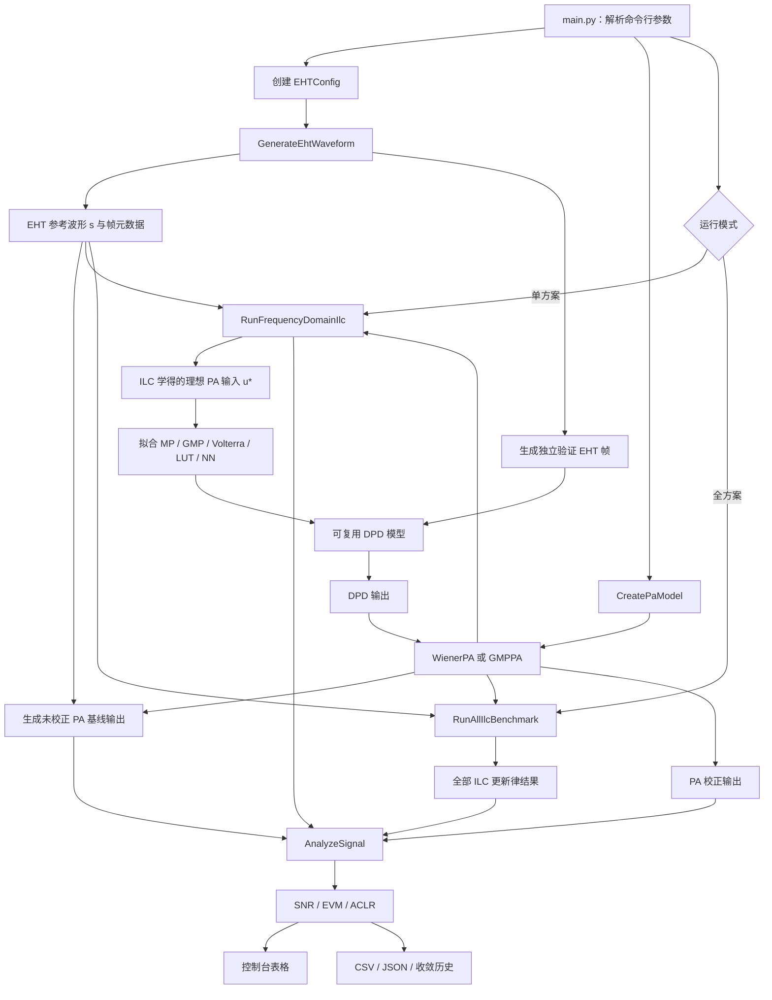
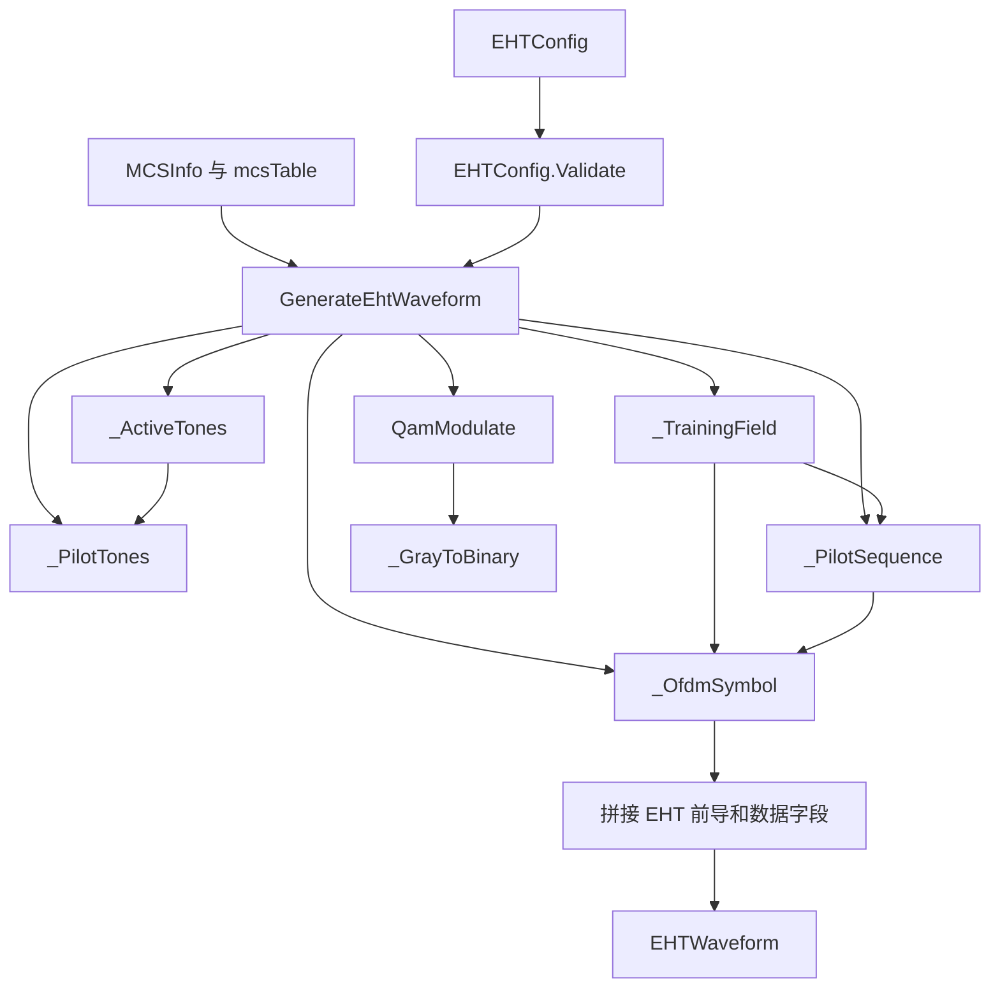
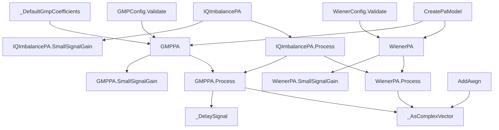
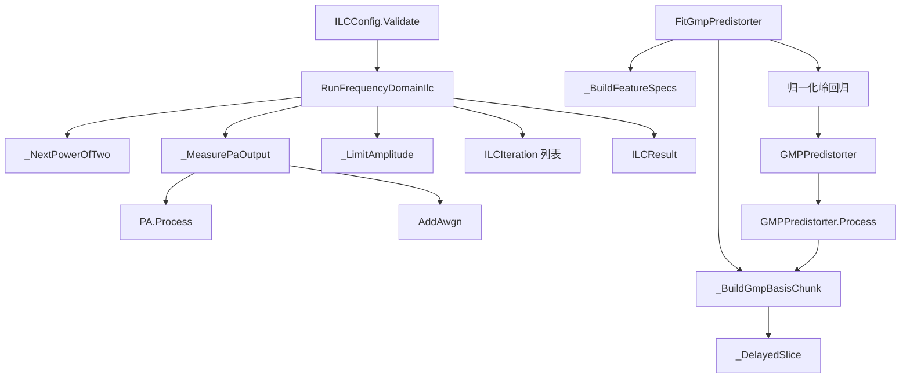
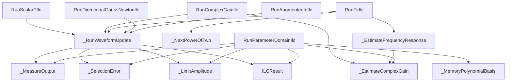
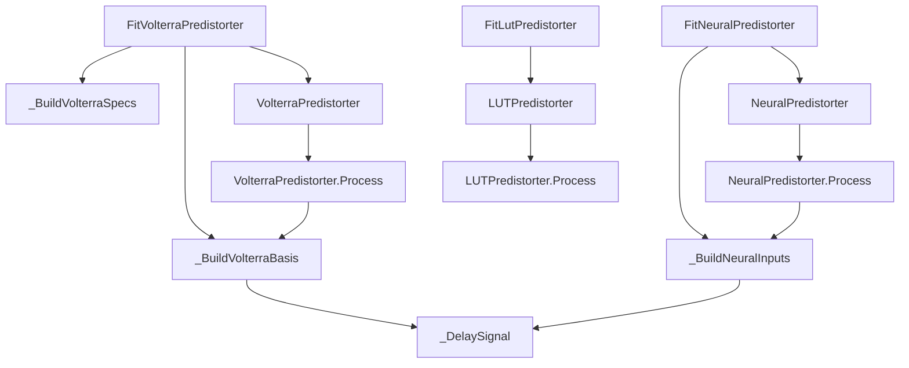
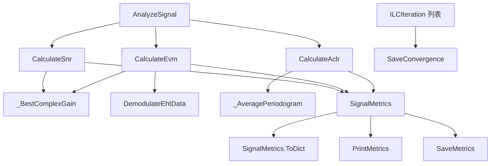
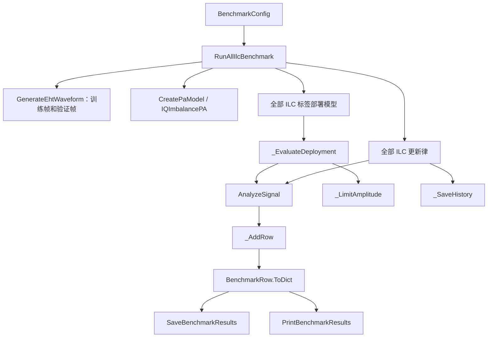
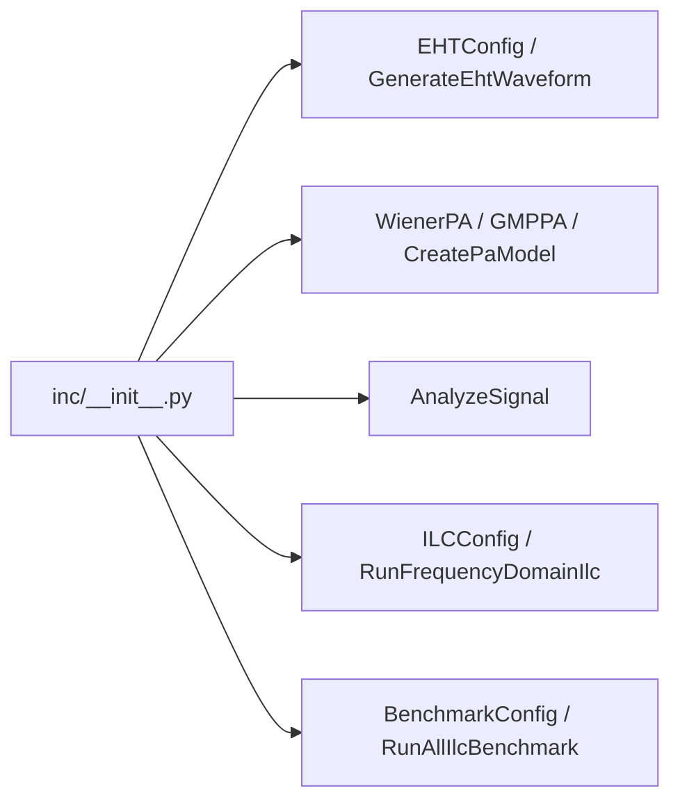

# DPD-ILC EHT Wi-Fi 仿真工程

本工程按照 `doc/DPD-ILC.md` 的推荐路线实现：生成 EHT Wi-Fi 复基带训练波形，经 Wiener 或 GMP 功放模型后，使用正则化频域 ILC 学习理想 PA 输入，再以 GMP 拟合可复用的 DPD，并输出 SNR、EVM 和 ACLR。

## 工程结构

```text
main.py                 命令行主程序
inc/waveGen.py          EHT 波形与 MCS 0–13 调制
inc/PaModel.py          Wiener 和 GMP 非线性 PA
inc/DpdIlc.py           频域 ILC 与 GMP DPD 拟合
inc/IlcVariants.py      其他 ILC 更新律
inc/DeploymentModels.py Volterra、LUT 和 NN 部署模型
inc/Analysis.py         SNR、EVM、ACLR 及 CSV/JSON 输出
inc/Benchmark.py        全 ILC 方案统一基准测试
inc/__init__.py         公共接口汇总
tests/TestProject.py    自包含验证脚本
```

所有代码注释与文档字符串均为英文；函数使用大驼峰命名，变量和对象属性使用小驼峰命名。

## 工程工作流程图



单方案模式执行“频域 ILC → GMP 拟合 → 指标分析”；全方案模式同时运行所有更新律，并使用独立 EHT 帧验证各类 ILC 标签部署模型。

## `inc` 模块与函数结构图

### `inc/waveGen.py`



### `inc/PaModel.py`



### `inc/DpdIlc.py`



### `inc/IlcVariants.py`



### `inc/DeploymentModels.py`



### `inc/Analysis.py`



### `inc/Benchmark.py`



### `inc/__init__.py`

`__init__.py` 不实现算法函数，只汇总工程的公共入口：



## EHT 支持范围

- 带宽：20、40、80、160 MHz。
- MCS：0–13，即 BPSK、QPSK、16/64/256/1024/4096-QAM 及对应码率。
- 帧字段：L-STF、L-LTF、L-SIG、RL-SIG、U-SIG、EHT-SIG、EHT-STF、EHT-LTF、EHT-Data。
- EHT 数据子载波间隔为 78.125 kHz；全带宽 RU 分别采用 242、484、996 和 2×996 tones。
- 数据 GI 支持 0.8、1.6、3.2 μs。

波形用于 PA/DPD 激励与指标评估，载荷采用随机 post-FEC 比特。它不包含可用于协议一致性测试的完整 LDPC 编解码、MAC/A-MPDU 组帧或 SIG 字段逐比特编码。

## 快速运行

```powershell
python main.py
```

指定 160 MHz、MCS 13 和 GMP PA：

```powershell
python main.py --bandwidth 160 --mcs 13 --pa gmp --symbols 20
```

加入 45 dB 反馈噪声，并对每轮反馈平均 4 次：

```powershell
python main.py --feedback-snr 45 --feedback-averages 4
```

查看完整参数：

```powershell
python main.py --help
```

运行文档中的全部 ILC 更新律和 ILC 标签部署模型：

```powershell
python main.py --benchmark-all-ilc --bandwidth 20 --mcs 7 --pa wiener --symbols 10 --iterations 10
```

结果保存在 `results/all_ilc_benchmark/`，其中 `all_ilc_metrics.csv` 和
`all_ilc_metrics.json` 包含每种方案的 SNR、EVM、ACLR 及相对基线改善量；
每种迭代更新律还会生成独立的 `convergence_*.csv`。

全方案测试包括：

- 标量 P 型 ILC；
- 复增益归一化 ILC；
- FIR 学习滤波器 ILC；
- 正则化频域 ILC；
- 方向投影 Gauss-Newton ILC；
- 参数域 Memory Polynomial ILC；
- 峰值约束 CFR-ILC；
- 反馈噪声感知与多次平均 ILC；
- 含 IQ 镜像误差的增广 ILC；
- ILC 标签结合 MP、GMP、简化复 Volterra、LUT 和轻量时延 NN。

Gauss-Newton 使用误差方向的有限差分 Jacobian 投影，避免为长 Wi-Fi
波形构造不可接受的完整 Jacobian 矩阵。增广方案以 IQ 镜像为代表场景；
其共轭误差路径与扩展到 MIMO/crosstalk 时采用相同的增广矩阵思想。
标签部署模型全部在不同随机种子的 EHT 帧上验证，而非在训练帧上评分。

默认在 `results/` 生成：

- `metrics.json`：运行配置及各阶段指标；
- `metrics.csv`：便于 Excel 或脚本统计的指标表；
- `ilc_convergence.csv`：每轮 ILC 的 NMSE、误差 RMS 和输入峰值；
- `waveforms.npz`：仅在指定 `--save-waveforms` 时输出。

## 指标定义

- SNR：数据字段上去除最佳复增益后的重构信噪比。
- EVM：对 EHT-Data 去循环前缀、FFT 后，在数据子载波上相对理想 QAM 星座计算 RMS EVM，同时输出 dB 与百分比。
- ACLR：主信道功率与上下相邻同带宽信道功率之比，输出上下邻道和较差值。为完整覆盖两个邻道，命令行采样倍率限制为 4 或 8。

## 验证

```powershell
python tests/TestProject.py
```

验证内容包括全部 MCS 映射、四种带宽的 EHT 参数、理想链路 EVM，以及两类 PA 的 ILC 改善。
