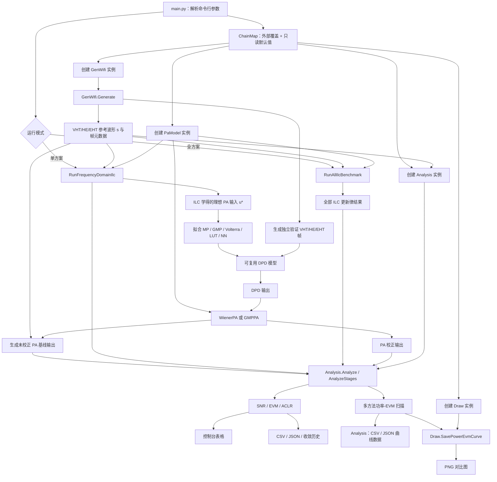
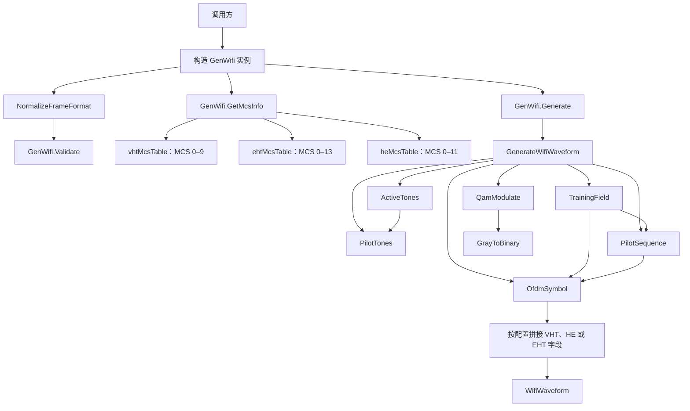
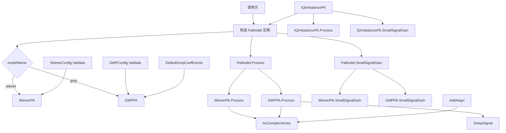
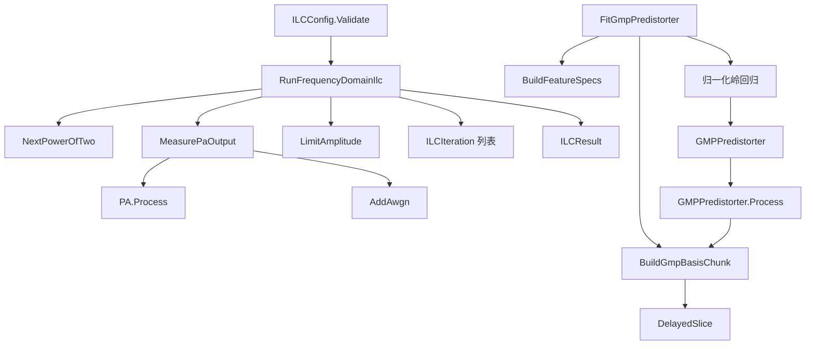
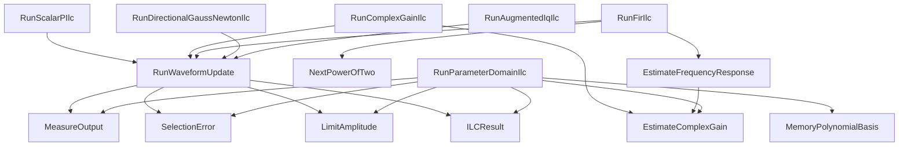
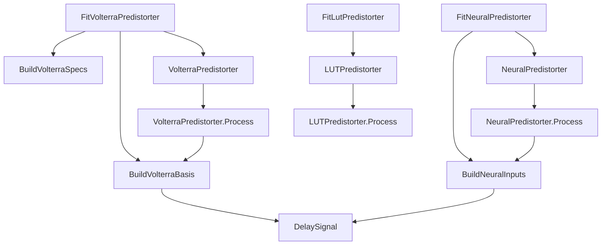
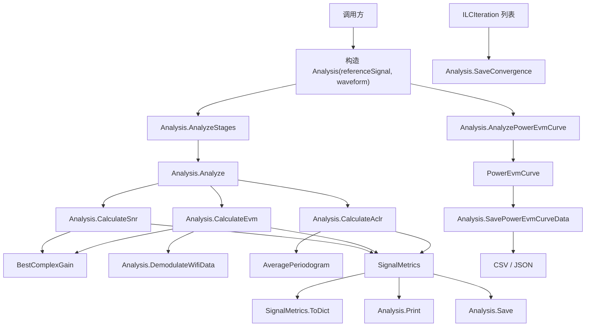
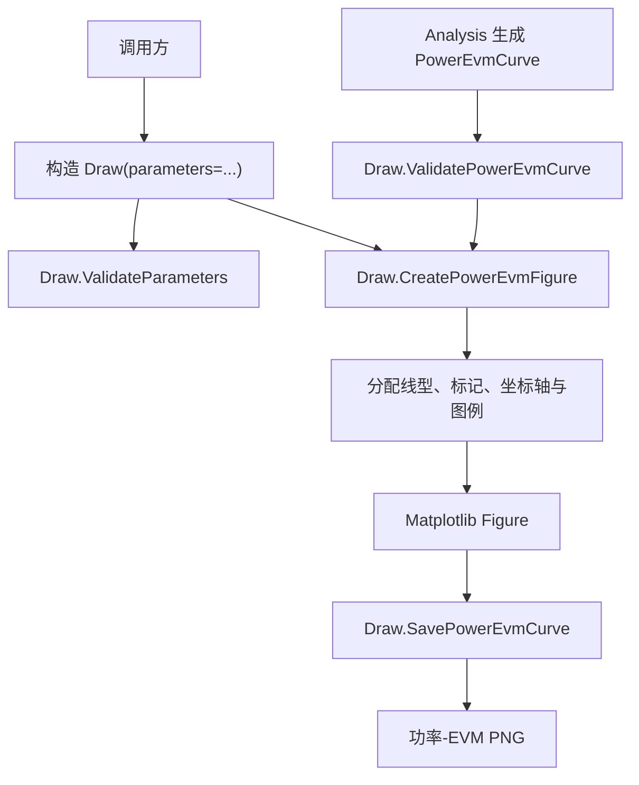
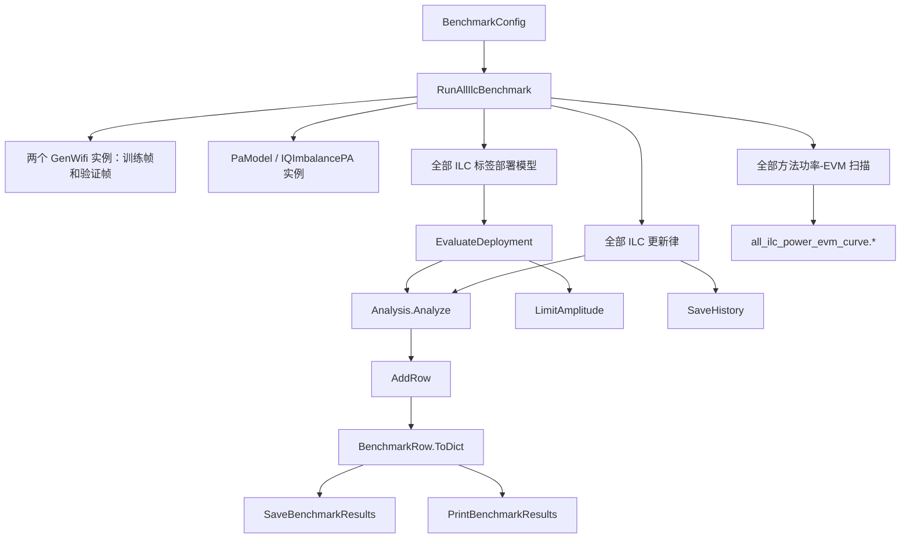
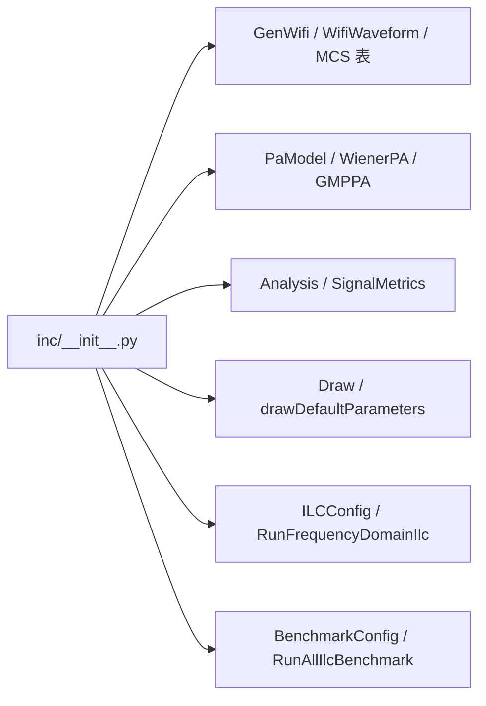

# DPD-ILC VHT/HE/EHT Wi-Fi 仿真工程

本工程按照 `doc/DPD-ILC.md` 的推荐路线实现：通过 `GenWifi` 实例生成 802.11ac/VHT、802.11ax/HE 或 802.11be/EHT Wi-Fi 复基带训练波形，经 Wiener 或 GMP 功放模型后，使用正则化频域 ILC 学习理想 PA 输入，再以 GMP 拟合可复用的 DPD，并输出 SNR、EVM、ACLR 以及多方法功率-EVM 对比曲线。

## 理论文档

- [Wi-Fi 帧生成物理原理与推导](doc/WaveGen.md)：复基带、OFDM 正交性、QAM 归一化、MCS、循环前缀、VHT/HE/EHT 字段和 PAPR。
- [PA 模型物理原理与推导](doc/PaModel.md)：Wiener、Rapp AM-AM、AM-PM、GMP、频谱再生、IQ 失衡和反馈噪声。
- [结果计算物理原理与推导](doc/Analysis.md)：最小二乘复增益、SNR、EVM、Welch PSD、ACLR 和功率-EVM 曲线。
- [DPD-ILC 原理与算法](doc/DPD-ILC.md)：各类 ILC 更新律、部署模型和工程实践。

安装依赖：

```powershell
python -m pip install -r requirements.txt
```

工程使用 NumPy 完成信号处理；Matplotlib 只由 `inc/Draw.py` 调用，用于生成 PNG 曲线图。

## 工程结构

```text
main.py                 命令行主程序
inc/waveGen.py          GenWifi 类、VHT/HE/EHT 波形、别名归一化与 MCS 调制
inc/PaModel.py          Wiener 和 GMP 非线性 PA
inc/DpdIlc.py           频域 ILC 与 GMP DPD 拟合
inc/IlcVariants.py      其他 ILC 更新律
inc/DeploymentModels.py Volterra、LUT 和 NN 部署模型
inc/Analysis.py         SNR、EVM、ACLR、功率-EVM 数据计算及结果输出
inc/Draw.py             功率-EVM 多方法同图绘制与 PNG 输出
inc/Benchmark.py        全 ILC 方案统一基准测试
inc/__init__.py         公共接口汇总
tests/TestProject.py    自包含验证脚本
```

所有代码注释与文档字符串均为英文；除 Python 协议强制要求的 `__init__` 等双下划线方法外，所有函数（包括内部辅助函数）都使用大驼峰命名。变量和对外对象属性使用小驼峰命名；属性底层访问器使用大驼峰函数名，并通过小驼峰属性别名保持调用接口一致。

## 工程工作流程图



**图示说明：**

1. `main.py` 首先读取帧格式、带宽、MCS、PA 类型、驱动电平和 ILC 参数，将外部值与模块内置默认值组成 `ChainMap`，再构造 `GenWifi(parameters=...)`、`PaModel(parameters=...)`、`Analysis(..., parameters=...)` 和 `Draw(parameters=...)` 实例。
2. 调用 `GenWifi.Generate()` 后得到参考复基带波形 `s` 及字段边界、FFT、数据子载波等元数据；同一波形直接通过 PA 后形成未校正基线。
3. 单方案模式执行正则化频域 ILC，寻找使 PA 输出逼近参考波形的理想输入 `u*`；全方案模式则调用统一基准测试，逐一运行所有 ILC 更新律。
4. 收敛后的 `u*` 可直接用于重复波形测试，也可作为监督标签拟合 MP、GMP、Volterra、LUT 或 NN，从而形成可用于其他帧的部署模型。
5. 所有输出最终传给同一个 `Analysis` 实例，由 `Analyze` 或 `AnalyzeStages` 统一计算 SNR、EVM 和 ACLR；`AnalyzePowerEvmCurve` 在多个 RMS 驱动点调用各方法，生成不包含绘图逻辑的 `PowerEvmCurve` 数据对象。
6. `Analysis.Print`、`Analysis.Save`、`Analysis.SaveConvergence` 和 `Analysis.SavePowerEvmCurveData` 分别输出控制台表格、指标文件、收敛历史以及功率-EVM CSV/JSON；独立的 `Draw.SavePowerEvmCurve` 将全部方法绘制在一张 PNG 图中。

图中从“生成独立验证 VHT/HE/EHT 帧”开始的支路专门验证部署模型的泛化能力；它使用相同格式配置和不同随机种子的载荷，不与 ILC 训练帧重复。

## `inc` 模块与函数结构图

以下结构图中，箭头 `A → B` 表示 `A` 调用、创建或依赖 `B`；以类名标记的节点保存配置或运行状态，以函数名标记的节点执行具体算法。

### `inc/waveGen.py`



**图示说明：**

- 调用方必须先构造 `GenWifi`，再调用实例方法；`NormalizeFrameFormat` 先把 `11ac/11ax/11be` 等效归一化为 `VHT/HE/EHT`，`GenWifi.Validate` 再检查带宽、格式对应的 MCS 范围、GI、符号数和过采样倍率。
- `GenWifi.GetMcsInfo` 根据规范化后的 `frameFormat` 选择 `vhtMcsTable`、`heMcsTable` 或 `ehtMcsTable`，其中 VHT 支持 MCS 0–9、HE 支持 MCS 0–11、EHT 支持 MCS 0–13。
- `ActiveTones` 与 `PilotTones` 决定不同带宽下的数据、导频和空子载波位置；`QamModulate` 完成 Gray 编码星座映射。
- `TrainingField` 生成前导训练字段，`OfdmSymbol` 负责频域装载、IFFT 和循环前缀拼接。
- `GenWifi.Generate` 是面向调用方的波形入口，并由内部辅助函数 `GenerateWifiWaveform` 完成组帧，最终返回 `WifiWaveform`；其中既有时域样本，也有后续 EVM 解调所需的格式、字段切片和参考星座。

### `inc/PaModel.py`



**图示说明：**

- 调用方先创建 `PaModel(modelName="wiener" 或 "gmp")`；统一类根据名称持有 `WienerPA` 或 `GMPPA` 实现，并可接收对应的配置对象。
- `PaModel.Process` 与 `PaModel.SmallSignalGain` 将调用委托给当前实现，因此主程序和 ILC 无须包含模型类型分支。
- `WienerPA.Process` 依次执行线性记忆滤波、Rapp AM-AM 压缩和 AM-PM 相位旋转。
- `GMPPA.Process` 使用 `DelaySignal` 构造主项、滞后包络项和超前包络项；未提供系数时由 `DefaultGmpCoefficients` 创建稳定的默认模型。
- `IQImbalancePA` 在已有 PA 输出上增加共轭镜像，用于测试增广 ILC；`AddAwgn` 模拟反馈接收链噪声。
- `SmallSignalGain` 为复增益归一化和频率响应估计提供线性工作点参考。

### `inc/DpdIlc.py`



**图示说明：**

- 上半部分是波形 ILC：`RunFrequencyDomainIlc` 根据低功率探测结果构造正则化逆频响，反复测量 PA、计算误差、更新输入并执行峰值投影。
- 每轮状态记录为 `ILCIteration`，完整输出封装为 `ILCResult`，包含最佳学习输入、对应 PA 输出和收敛历史。
- 下半部分是标签拟合：`FitGmpPredistorter` 先枚举 GMP 基函数，再分块累计岭回归矩阵，避免宽带长帧占用过多内存。
- `GMPPredistorter.Process` 使用同一组基函数和拟合系数，将新的 EHT 波形转换为可部署的 DPD 输出。

### `inc/IlcVariants.py`



**图示说明：**

- 标量 P 型、复增益、FIR、方向 Gauss-Newton 和增广 IQ ILC 共用 `RunWaveformUpdate`，因此具有一致的测量、最佳迭代选择、峰值限制和历史记录逻辑。
- `RunComplexGainIlc` 使用 `EstimateComplexGain` 补偿平均增益和相位；`RunFirIlc` 进一步估计频率响应并截取有限长度学习滤波器。
- `RunDirectionalGaussNewtonIlc` 通过 PA 有限差分计算误差方向上的 Jacobian 投影，不构造完整的大型 Jacobian 矩阵。
- `RunAugmentedIqIlc` 同时使用误差与共轭误差，补偿 IQ 镜像；扩展到 MIMO 时可将同一结构推广为多通道增广矩阵。
- 参数域 ILC 不经过通用波形更新核心，而是用 `MemoryPolynomialBasis` 直接更新 DPD 系数。

### `inc/DeploymentModels.py`



**图示说明：**

- Volterra 路线先枚举一阶和三阶复基带项，再由 `BuildVolterraBasis` 构建设计矩阵并完成岭回归；运行时使用相同基函数求输出。
- LUT 路线按输入幅度分箱，为每个区间拟合一个复增益；空分箱使用最近的有效系数填充。
- NN 路线把当前及历史 I/Q/包络样本组成时延输入，经标准化和 `tanh` 隐层后拟合复数输出层。
- 三个 `Fit...` 函数负责训练，三个 `...Predistorter.Process` 方法负责在验证帧或实际输入上推理。

### `inc/Analysis.py`



**图示说明：**

- `Analysis` 构造时保存参考信号和 `WifiWaveform` 元数据；后续每个待测输出只需传给 `Analyze`，多个命名阶段可一次传给 `AnalyzeStages`。
- SNR 在移除最佳复增益后计算残差功率；EVM 先由 `Analysis.DemodulateWifiData` 根据 `WifiWaveform` 的数据字段位置去循环前缀并 FFT，再与发送星座比较。
- ACLR 通过 `AveragePeriodogram` 获得平均功率谱，然后分别积分主信道、下邻道和上邻道功率。
- 三类指标封装为 `SignalMetrics`，由同一实例的 `Print` 输出到终端，或由 `Save` 写入 JSON/CSV。
- `Analysis.SaveConvergence` 独立保存每轮 ILC 的误差 RMS、NMSE 和输入峰值。
- `AnalyzePowerEvmCurve` 接收一组严格递增的 RMS 驱动点和多个方法求值器，在每个功率点使用相同参考信号计算 EVM；`SavePowerEvmCurveData` 只保存原始 CSV/JSON 数据，不导入或调用任何绘图库。

### `inc/Draw.py`



**图示说明：**

- `Draw` 只接收已经算好的 `PowerEvmCurve`，不计算 SNR、EVM 或 ACLR，也不负责 CSV/JSON 数据序列化。
- `ValidatePowerEvmCurve` 在创建图形前检查功率坐标、各方法数据长度和有限性，防止产生缺失或错位曲线。
- `CreatePowerEvmFigure` 把所有方法绘制在同一坐标系中；方法较多时图例自动移到绘图区外，避免遮挡数据。
- `SavePowerEvmCurve` 读取 `Draw` 的 `ChainMap` 绘图参数并仅输出 PNG；图形尺寸、DPI、线宽、标记大小、标题和坐标轴文字均可由外部覆盖。

### `inc/Benchmark.py`



**图示说明：**

- `RunAllIlcBenchmark` 是全方案编排入口：生成训练帧与独立验证帧，创建 PA，并按相同迭代预算运行所有算法。
- 常规 ILC 在重复训练波形上测试；增广 ILC 使用 IQ 镜像场景；噪声感知 ILC 使用带噪多次反馈；标签模型在独立验证帧上测试。
- `EvaluateDeployment` 对每个部署模型执行“DPD → 峰值限制 → PA → 指标分析”。
- `AddRow` 将指标及相对基线改善量写入 `BenchmarkRow`，`SaveHistory` 为各更新律保留独立收敛曲线数据。
- `SaveBenchmarkResults` 与 `PrintBenchmarkResults` 分别负责机器可读文件和控制台汇总表。
- 基准模式默认在同一张图中比较标称 PA、全部 ILC 更新律、IQ 场景以及 MP/GMP/Volterra/LUT/NN 部署模型；每个 ILC 更新律在各功率点重新学习，部署模型则复用标称驱动点训练得到的固定系数。

### `inc/__init__.py`

`__init__.py` 不实现算法函数，只汇总工程的公共入口：



**图示说明：**

- `inc/__init__.py` 是包的公共门面，不包含算法计算。
- 外部调用者可以从 `inc` 直接导入波形生成、PA、分析、频域 ILC 和全方案基准测试入口，不需要了解各实现文件的位置。
- 未在此处导出的下划线私有函数只供模块内部复用，避免将实现细节暴露为稳定接口。

## 802.11ac/ax/be 与 VHT/HE/EHT 支持范围

标准名称和 PHY 格式名称采用以下等效输入关系；`WifiWaveform.frameFormat` 始终返回右侧规范名称：

| 标准代际输入 | 等效 PHY 输入 | 规范化结果 |
| --- | --- | --- |
| `11ac`、`802.11ac` | `VHT` | `VHT` |
| `11ax`、`802.11ax` | `HE` | `HE` |
| `11be`、`802.11be` | `EHT` | `EHT` |

- 带宽：20、40、80、160 MHz。
- VHT MCS：0–9，即 BPSK、QPSK、16/64/256-QAM 及对应码率。
- EHT MCS：0–13，即 BPSK、QPSK、16/64/256/1024/4096-QAM 及对应码率。
- HE MCS：0–11，即 BPSK、QPSK、16/64/256/1024-QAM 及对应码率。
- VHT 字段：L-STF、L-LTF、L-SIG、VHT-SIG-A、VHT-STF、VHT-LTF、VHT-SIG-B、VHT-Data。
- EHT 字段：L-STF、L-LTF、L-SIG、RL-SIG、U-SIG、EHT-SIG、EHT-STF、EHT-LTF、EHT-Data。
- HE-SU 字段：L-STF、L-LTF、L-SIG、RL-SIG、HE-SIG-A、HE-STF、HE-LTF、HE-Data。
- VHT 数据子载波间隔为 312.5 kHz；20/40/80/160 MHz 分别使用 64/128/256/512 点基础 FFT，数据音调数为 52/108/234/468。
- HE/EHT 数据子载波间隔为 78.125 kHz；全带宽 RU 分别采用 242、484、996 和 2×996 tones。
- VHT 数据 GI 支持 0.4、0.8 μs；HE/EHT 支持 0.8、1.6、3.2 μs。

完整 MCS 映射如下：

| MCS | 调制方式 | 码率 | 支持格式 |
| ---: | --- | ---: | --- |
| 0 | BPSK | 1/2 | VHT、HE、EHT |
| 1 | QPSK | 1/2 | VHT、HE、EHT |
| 2 | QPSK | 3/4 | VHT、HE、EHT |
| 3 | 16-QAM | 1/2 | VHT、HE、EHT |
| 4 | 16-QAM | 3/4 | VHT、HE、EHT |
| 5 | 64-QAM | 2/3 | VHT、HE、EHT |
| 6 | 64-QAM | 3/4 | VHT、HE、EHT |
| 7 | 64-QAM | 5/6 | VHT、HE、EHT |
| 8 | 256-QAM | 3/4 | VHT、HE、EHT |
| 9 | 256-QAM | 5/6 | VHT、HE、EHT |
| 10 | 1024-QAM | 3/4 | HE、EHT |
| 11 | 1024-QAM | 5/6 | HE、EHT |
| 12 | 4096-QAM | 3/4 | 仅 EHT |
| 13 | 4096-QAM | 5/6 | 仅 EHT |

波形用于 PA/DPD 激励与指标评估，载荷采用随机 post-FEC 比特。它不包含可用于协议一致性测试的完整 LDPC 编解码、MAC/A-MPDU 组帧或 SIG 字段逐比特编码。

## 参数参考

### 命令行参数

以下参数均由 `main.py` 支持；未指定参数时使用表中的默认值。

| 参数 | 可选值或类型 | 默认值 | 说明 |
| --- | --- | --- | --- |
| `-h`, `--help` | 开关 | — | 显示完整命令行帮助。 |
| `--format` | `VHT/11ac`、`HE/11ax`、`EHT/11be`，也接受 `802.11ac/ax/be` | `EHT` | 输入不区分大小写并规范化为 VHT、HE 或 EHT。 |
| `--bandwidth` | `20`、`40`、`80`、`160` | `80` | 信道带宽，单位 MHz。 |
| `--mcs` | VHT：`0–9`；HE：`0–11`；EHT：`0–13` | `9` | 调制编码方案索引；默认值对三种格式都有效。 |
| `--pa` | `wiener`、`gmp` | `wiener` | 非线性 PA 模型。 |
| `--symbols` | 正整数 | `20` | 数据 OFDM 符号数。 |
| `--guard-interval` | `0.4`、`0.8`、`1.6`、`3.2` | `0.8` | VHT 使用 0.4/0.8 μs；HE/EHT 使用 0.8/1.6/3.2 μs。 |
| `--oversampling` | `4`、`8` | `4` | 过采样倍率；至少 4 倍时可完整计算上下邻道 ACLR。 |
| `--drive` | 正浮点数 | `0.24` | 相对单位饱和幅度的 PA 输入 RMS 驱动电平。 |
| `--power-start` | 正浮点数 | `0.08` | 功率-EVM 扫描的起始 RMS 驱动。 |
| `--power-stop` | 大于 `--power-start` 的浮点数 | `0.40` | 功率-EVM 扫描的结束 RMS 驱动。 |
| `--power-points` | 不小于 2 的整数 | `7` | 在起止 RMS 之间按对数间隔生成的扫描点数。 |
| `--skip-power-evm-curve` | 开关 | 关闭 | 跳过功率-EVM 扫描及 PNG/CSV/JSON 输出。 |
| `--iterations` | 正整数 | `8` | ILC 迭代次数。 |
| `--learning-rate` | `0 < μ < 2` | `0.15` | ILC 学习增益。 |
| `--regularization` | 正浮点数 | `1e-3` | 逆响应计算的正则化系数。 |
| `--max-amplitude` | 正浮点数 | `2.0` | ILC 学习输入和部署 DPD 输入的峰值限制。 |
| `--feedback-snr` | 浮点数或省略 | `None` | 反馈链 SNR，单位 dB；省略时使用无噪反馈。 |
| `--feedback-averages` | 正整数 | `1` | 每轮 ILC 重复采集并平均的反馈次数。 |
| `--seed` | 整数 | `7` | Wi-Fi 数据、训练字段及相关随机过程的种子。 |
| `--output-dir` | 路径 | `results` | JSON、CSV、收敛历史和可选波形文件的输出目录。 |
| `--save-waveforms` | 开关 | 关闭 | 额外保存 `waveforms.npz`。 |
| `--benchmark-all-ilc` | 开关 | 关闭 | 运行全部 ILC 更新律及全部 ILC 标签部署模型。 |

### `GenWifi` 参数

调用方先构造 `GenWifi(...)`，再调用 `Generate()`。

| 参数 | 类型或可选值 | 默认值 | 说明 |
| --- | --- | --- | --- |
| `parameters` | `Mapping` 或 `ChainMap` | `None` | 外部参数层；缺少的键回退到 `genWifiDefaultParameters`。 |
| `frameFormat` | `"VHT"/"11ac"`、`"HE"/"11ax"`、`"EHT"/"11be"`，并接受带 `802.` 前缀的名称 | `"EHT"` | 不区分大小写；生成后规范化为 VHT、HE 或 EHT。 |
| `bandwidthMhz` | `20`、`40`、`80`、`160` | `80` | 信道带宽，单位 MHz。 |
| `mcs` | VHT：`0–9`；HE：`0–11`；EHT：`0–13` | `9` | MCS 索引；默认值对三种格式都有效。 |
| `numDataSymbols` | 正整数 | `20` | 数据 OFDM 符号数。 |
| `guardIntervalUs` | VHT：`0.4/0.8`；HE/EHT：`0.8/1.6/3.2` | `0.8` | 数据 GI，单位 μs。 |
| `oversampling` | 正整数 | `4` | Python 接口允许任意正整数；进行 ACLR 分析时采样率必须不低于 3 倍带宽，建议使用 4 或 8。 |
| `seed` | 整数 | `7` | 载荷、导频和训练字段随机种子。 |

`Generate()` 返回 `WifiWaveform`，其中包含 `samples`、采样率、带宽、FFT/CP 长度、数据和导频子载波、参考星座、字段切片、MCS 信息及帧格式。

### `PaModel` 参数

| 参数 | 类型或可选值 | 默认值 | 说明 |
| --- | --- | --- | --- |
| `parameters` | `Mapping` 或 `ChainMap` | `None` | 外部参数层；缺少的键回退到 `paModelDefaultParameters`。 |
| `modelName` | `"wiener"`、`"gmp"`，不区分大小写 | `"wiener"` | 选择内部 PA 实现。 |
| `wienerConfig` | `WienerConfig` 或 `None` | `None` | Wiener 模式的配置；`None` 使用默认配置。 |
| `gmpConfig` | `GMPConfig` 或 `None` | `None` | GMP 模式的配置；`None` 使用默认配置。 |

`WienerConfig` 支持：

| 参数 | 默认值 | 约束或含义 |
| --- | --- | --- |
| `linearTaps` | `(1+0j, 0.055-0.025j, -0.018+0.012j)` | 非空复数 FIR 系数元组。 |
| `linearGain` | `1.0` | 正数；线性增益。 |
| `saturationAmplitude` | `1.0` | 正数；Rapp 饱和幅度。 |
| `rappSmoothness` | `3.0` | 正数；Rapp 平滑度。 |
| `ampmCoefficient` | `0.18` | AM-PM 相位旋转强度。 |

`GMPConfig` 支持：

| 参数 | 默认值 | 约束或含义 |
| --- | --- | --- |
| `nonlinearOrders` | `(1, 3, 5, 7)` | 非空正奇数阶元组。 |
| `memoryDepth` | `3` | 正整数；主分支记忆深度。 |
| `crossMemoryDepth` | `2` | 非负整数；交叉包络记忆深度。 |
| `mainCoefficients` | `None` | 主项系数字典，键为 `(order, memoryIndex)`；`None` 使用内置稳定系数。 |
| `laggingCoefficients` | `None` | 滞后交叉项字典，键为 `(order, memoryIndex, crossIndex)`。 |
| `leadingCoefficients` | `None` | 超前交叉项字典，键为 `(order, memoryIndex, crossIndex)`。 |

`PaModel.Process(inputSignal)` 返回 PA 复基带输出；`SmallSignalGain()` 返回当前模型的 DC 小信号复增益。

PA 辅助接口还包括：

| 接口 | 参数 | 默认值或说明 |
| --- | --- | --- |
| `WienerPA(config)` | `config` | 默认使用 `WienerConfig()`；通常建议通过 `PaModel` 构造。 |
| `GMPPA(config)` | `config` | 默认使用 `GMPConfig()`；通常建议通过 `PaModel` 构造。 |
| `IQImbalancePA(paModel, directCoefficient, imageCoefficient)` | `paModel`、直通系数、镜像系数 | `directCoefficient=1+0j`，`imageCoefficient=0.045·exp(j·0.35)`。 |
| `AddAwgn(inputSignal, snrDb, randomGenerator)` | 输入、反馈 SNR、NumPy 随机数生成器 | `snrDb=None` 时原样复制输入，否则加入复高斯白噪声。 |

### `Analysis` 参数与方法

构造函数 `Analysis(referenceSignal, waveform, parameters=None, **parameterOverrides)` 要求参考信号为非空有限复数组，且长度与 `WifiWaveform.samples` 相同。

| 配置参数 | 默认值 | 说明 |
| --- | --- | --- |
| `parameters` | `None` | 外部 `Mapping` 或 `ChainMap` 参数层。 |
| `maxSegmentLength` | `16384` | Welch PSD 的最大分段长度，必须是不小于 16 的整数。 |
| `minimumAclrOversampling` | `3.0` | ACLR 所需最低过采样倍率，不允许小于 3。 |
| `powerEvmFileStem` | `"power_evm_curve"` | 功率–EVM 的 CSV、JSON 默认文件名前缀。 |

| 方法 | 参数 | 返回值或作用 |
| --- | --- | --- |
| `Analyze(measuredSignal)` | 与参考信号等长的 PA/DPD 输出 | 返回一个 `SignalMetrics`。 |
| `AnalyzeStages(stageSignals)` | `{阶段名称: 输出数组}` 映射 | 批量计算并保存各阶段指标。 |
| `CalculateSnr(measuredSignal)` | 待测输出 | 返回数据字段 SNR，单位 dB。 |
| `CalculateEvm(measuredSignal)` | 待测输出 | 返回 `(evmDb, evmPercent)`。 |
| `CalculateAclr(measuredSignal)` | 待测输出 | 返回 `(aclrLowerDb, aclrUpperDb, aclrWorstDb)`。 |
| `DemodulateWifiData(measuredSignal)` | 待测输出 | 返回 VHT/HE/EHT 数据子载波星座。 |
| `Print(stageMetrics=None)` | 可选指标映射 | 打印指标表；省略时使用最近一次 `AnalyzeStages` 的结果。 |
| `Save(outputDirectory, runMetadata, stageMetrics=None)` | 输出路径、元数据、可选指标映射 | 写入 `metrics.json` 和 `metrics.csv`。 |
| `SaveConvergence(ilcHistory, outputDirectory)` | ILC 历史、输出路径 | 写入 `ilc_convergence.csv`。 |
| `AnalyzePowerEvmCurve(driveRmsValues, methodEvaluators)` | 递增驱动点、`{方法名: 求值器}` 映射 | 计算并保存一个 `PowerEvmCurve`；求值器接收当前参考信号和 RMS 驱动。 |
| `SavePowerEvmCurveData(outputDirectory, powerEvmCurve=None, fileStem=None)` | 输出路径、可选曲线、文件名前缀 | `fileStem=None` 时读取 ChainMap 中的 `powerEvmFileStem`，并只写入 CSV 和 JSON。 |

`SignalMetrics` 字段包括 `snrDb`、`evmDb`、`evmPercent`、`aclrLowerDb`、`aclrUpperDb` 和 `aclrWorstDb`。`PowerEvmCurve` 保存 `driveRmsValues`、`inputPowerDb` 以及各方法的 EVM dB/百分比数组。

### `Draw` 参数与方法

构造函数 `Draw(parameters=None, **parameterOverrides)` 使用 `ChainMap` 管理绘图配置，并且不持有或重新计算分析指标。

| 配置参数 | 默认值 | 说明 |
| --- | --- | --- |
| `parameters` | `None` | 外部 `Mapping` 或 `ChainMap` 参数层。 |
| `powerEvmFileStem` | `"power_evm_curve"` | PNG 默认文件名前缀。 |
| `figureWidthInches` | `10.5` | 图像宽度，单位英寸，必须为正数。 |
| `figureHeightInches` | `6.2` | 图像高度，单位英寸，必须为正数。 |
| `figureDpi` | `180` | PNG 分辨率，必须为正整数。 |
| `lineWidth` | `1.8` | 方法曲线线宽。 |
| `markerSize` | `5.0` | 数据点标记大小。 |
| `legendColumnThreshold` | `6` | 方法数超过该值时，将图例移到绘图区右侧。 |
| `plotTitle` | `"Power-EVM comparison"` | 图标题。 |
| `xAxisLabel` | `"Input RMS power relative to unit saturation (dB)"` | 横轴标题。 |
| `yAxisLabel` | `"RMS EVM (dB, lower is better)"` | 纵轴标题。 |

| 方法 | 参数 | 返回值或作用 |
| --- | --- | --- |
| `GetParameters()` | 无 | 返回当前解析后的绘图参数快照。 |
| `UpdateParameters(**parameterOverrides)` | 任意受支持的绘图参数 | 事务式更新最高优先级层。 |
| `ValidatePowerEvmCurve(powerEvmCurve)` | `PowerEvmCurve` | 检查曲线长度、方法名和有限性。 |
| `CreatePowerEvmFigure(powerEvmCurve)` | `PowerEvmCurve` | 返回包含所有方法的 Matplotlib Figure。 |
| `SavePowerEvmCurve(powerEvmCurve, outputDirectory, fileStem=None)` | 曲线、输出目录、可选文件名前缀 | 只生成并返回 PNG 路径。 |

### `ILCConfig` 与算法参数

| 参数 | 默认值 | 约束或含义 |
| --- | --- | --- |
| `numIterations` | `8` | 正整数；迭代次数。 |
| `learningRate` | `0.15` | `0 < μ < 2`；更新增益。 |
| `regularization` | `1e-3` | 正数；逆响应或正规方程正则化。 |
| `maxAmplitude` | `2.0` | 正数；学习输入峰值限制。 |
| `feedbackSnrDb` | `None` | 反馈 SNR；`None` 表示无噪声。 |
| `feedbackAverages` | `1` | 正整数；反馈平均次数。 |
| `projectionBandwidthFactor` | `1.6` | 大于 1；频域 ILC 更新投影带宽相对信道带宽的倍率。 |
| `responseFloorDb` | `-45.0` | 频率响应估计的低激励置信度门限。 |
| `randomSeed` | `19` | 反馈噪声及算法随机过程种子。 |

所有 ILC 入口都接收 `referenceSignal`、`paModel` 和 `ILCConfig`。附加参数如下：

| 算法入口 | 附加参数及默认值 |
| --- | --- |
| `RunFrequencyDomainIlc` | `sampleRateHz`、`channelBandwidthHz`。 |
| `RunScalarPIlc` | 无。 |
| `RunComplexGainIlc` | 无。 |
| `RunFirIlc` | `firLength=17`。 |
| `RunDirectionalGaussNewtonIlc` | `finiteDifferenceRms=1e-3`。 |
| `RunParameterDomainIlc` | `nonlinearOrders=(1,3,5,7)`、`memoryDepth=3`。 |
| `RunAugmentedIqIlc` | 无。 |

部署模型拟合入口支持：

| 拟合入口 | 可配置参数及默认值 |
| --- | --- |
| `FitGmpPredistorter` | `nonlinearOrders=(1,3,5,7)`、`memoryDepth=3`、`crossMemoryDepth=2`、`ridgeFactor=1e-6`、`chunkSize=8192`。 |
| `FitVolterraPredistorter` | `memoryDepth=3`、`ridgeFactor=1e-6`。 |
| `FitLutPredistorter` | `binCount=64`、`ridgeFactor=1e-8`。 |
| `FitNeuralPredistorter` | `memoryDepth=4`、`hiddenUnitCount=32`、`ridgeFactor=1e-5`、`randomSeed=71`。 |

### `BenchmarkConfig` 参数

| 参数 | 默认值 | 说明 |
| --- | --- | --- |
| `frameFormat` | `"EHT"` | `VHT/11ac`、`HE/11ax` 或 `EHT/11be` 及其 `802.` 别名。 |
| `bandwidthMhz` | `20` | 20、40、80 或 160 MHz。 |
| `mcs` | `7` | VHT 0–9，HE 0–11，EHT 0–13。 |
| `numDataSymbols` | `10` | 数据 OFDM 符号数。 |
| `oversampling` | `4` | 过采样倍率。 |
| `guardIntervalUs` | `0.8` | VHT 为 0.4/0.8；HE/EHT 为 0.8/1.6/3.2 μs。 |
| `driveRms` | `0.24` | PA 输入 RMS 驱动电平。 |
| `numIterations` | `10` | 每种 ILC 的迭代预算。 |
| `paModelName` | `"wiener"` | `"wiener"` 或 `"gmp"`。 |
| `seed` | `101` | 训练帧随机种子；验证帧自动使用 `seed + 97`。 |
| `powerStartRms` | `0.08` | 全方法功率-EVM 扫描起点。 |
| `powerStopRms` | `0.40` | 全方法功率-EVM 扫描终点。 |
| `powerPointCount` | `5` | 基准模式的扫描点数。 |
| `generatePowerEvmCurve` | `True` | 是否生成全方法功率-EVM PNG/CSV/JSON。 |
| `outputDirectory` | `results/all_ilc_benchmark` | 全方案 CSV、JSON 和各算法收敛历史目录。 |

## 使用 ChainMap 覆盖默认参数

四个主要面向对象入口都使用 `ChainMap` 管理参数，解析优先级为：

```text
构造函数关键字或 UpdateParameters 覆盖
        ↓ 高优先级
调用方拥有的外部字典 / ChainMap
        ↓
模块内置只读默认参数
```

内置后备层分别为 `genWifiDefaultParameters`、`paModelDefaultParameters`、`analysisDefaultParameters` 和 `drawDefaultParameters`。调用方只需要提供想修改的键；其他键自动读取默认值。外部字典是活动映射，构造实例后继续修改它，下一次 `Generate()`、`Process()`、分析计算或绘图会读取新值。

```python
from collections import ChainMap

from inc.Analysis import Analysis, analysisDefaultParameters
from inc.Draw import Draw, drawDefaultParameters
from inc.PaModel import PaModel, paModelDefaultParameters
from inc.waveGen import GenWifi, genWifiDefaultParameters

# Only externally changed values are placed in the first mapping.
wifiOverrides = {
    "bandwidthMhz": 40,
    "mcs": 9,
    "numDataSymbols": 12,
}
wifiParameters = ChainMap(wifiOverrides, genWifiDefaultParameters)
wifiGenerator = GenWifi(parameters=wifiParameters)
firstWaveform = wifiGenerator.Generate()

# The existing instance sees this external change on the next Generate call.
wifiOverrides["mcs"] = 11
secondWaveform = wifiGenerator.Generate()

paOverrides = {"modelName": "gmp"}
paParameters = ChainMap(paOverrides, paModelDefaultParameters)
paModel = PaModel(parameters=paParameters)

analysisOverrides = {
    "maxSegmentLength": 8192,
    "powerEvmFileStem": "eht_mcs11_power_evm",
}
analysisParameters = ChainMap(
    analysisOverrides,
    analysisDefaultParameters,
)
resultAnalysis = Analysis(
    0.24 * secondWaveform.samples,
    secondWaveform,
    parameters=analysisParameters,
)

drawOverrides = {
    "powerEvmFileStem": "eht_mcs11_power_evm",
    "figureDpi": 240,
}
drawParameters = ChainMap(drawOverrides, drawDefaultParameters)
resultDraw = Draw(parameters=drawParameters)
```

也可以通过 `UpdateParameters(...)` 写入实例自己的最高优先级层：

```python
wifiGenerator.UpdateParameters(seed=101, guardIntervalUs=1.6)
paModel.UpdateParameters(modelName="wiener")
resultAnalysis.UpdateParameters(maxSegmentLength=4096)
resultDraw.UpdateParameters(lineWidth=2.2, markerSize=6.0)
```

最高优先级覆盖会遮蔽外部字典中的同名键。`GetParameters()` 返回当前解析结果的普通字典快照，便于记录实验配置；修改该快照不会反向修改实例。

## 典型使用方式

### 示例一：使用默认参数快速运行

默认生成 EHT 80 MHz、MCS 9 波形，使用 Wiener PA 和 8 次频域 ILC，并输出 7 点三方法功率-EVM 曲线：

```powershell
python main.py
```

### 示例二：使用 11ac 别名生成 VHT + Wiener PA

```powershell
python main.py --format 11ac --bandwidth 80 --mcs 9 --guard-interval 0.4 --pa wiener --symbols 20 --iterations 8
```

### 示例三：EHT 160 MHz + 4096-QAM + GMP PA

```powershell
python main.py --format EHT --bandwidth 160 --mcs 13 --pa gmp --symbols 20 --oversampling 4
```

### 示例四：指定功率范围、带噪反馈并保存波形

```powershell
python main.py --power-start 0.06 --power-stop 0.45 --power-points 9 --feedback-snr 45 --feedback-averages 4 --save-waveforms --output-dir results/noisy_feedback
```

### 示例五：使用 Python 实例接口完成 PA 和指标分析

```python
from collections import ChainMap

from inc.Analysis import Analysis, analysisDefaultParameters
from inc.PaModel import PaModel, paModelDefaultParameters
from inc.waveGen import GenWifi, genWifiDefaultParameters

wifiParameters = ChainMap(
    {
        "frameFormat": "11ax",
        "bandwidthMhz": 80,
        "mcs": 11,
        "numDataSymbols": 20,
    },
    genWifiDefaultParameters,
)
wifiGenerator = GenWifi(parameters=wifiParameters)
waveform = wifiGenerator.Generate()
referenceSignal = 0.24 * waveform.samples

paParameters = ChainMap(
    {"modelName": "wiener"},
    paModelDefaultParameters,
)
paModel = PaModel(parameters=paParameters)
paOutput = paModel.Process(referenceSignal)

analysisParameters = ChainMap({}, analysisDefaultParameters)
resultAnalysis = Analysis(
    referenceSignal,
    waveform,
    parameters=analysisParameters,
)
metrics = resultAnalysis.Analyze(paOutput)
print(metrics.ToDict())
```

### 示例六：自定义 Wiener PA

```python
from collections import ChainMap

from inc.PaModel import PaModel, WienerConfig, paModelDefaultParameters
from inc.waveGen import GenWifi, genWifiDefaultParameters

wifiParameters = ChainMap(
    {
        "frameFormat": "EHT",
        "bandwidthMhz": 20,
        "mcs": 7,
        "numDataSymbols": 10,
    },
    genWifiDefaultParameters,
)
wifiGenerator = GenWifi(parameters=wifiParameters)
waveform = wifiGenerator.Generate()
referenceSignal = 0.24 * waveform.samples

wienerConfig = WienerConfig(
    linearTaps=(1.0 + 0.0j, 0.04 - 0.02j),
    linearGain=1.05,
    saturationAmplitude=0.9,
    rappSmoothness=2.5,
    ampmCoefficient=0.12,
)
paParameters = ChainMap(
    {
        "modelName": "wiener",
        "wienerConfig": wienerConfig,
    },
    paModelDefaultParameters,
)
paModel = PaModel(parameters=paParameters)
paOutput = paModel.Process(referenceSignal)
```

### 示例七：程序化运行频域 ILC 并批量分析

```python
from collections import ChainMap

from inc.Analysis import Analysis, analysisDefaultParameters
from inc.DpdIlc import ILCConfig, RunFrequencyDomainIlc
from inc.PaModel import PaModel, paModelDefaultParameters
from inc.waveGen import GenWifi, genWifiDefaultParameters

wifiParameters = ChainMap(
    {
        "frameFormat": "EHT",
        "bandwidthMhz": 20,
        "mcs": 9,
        "numDataSymbols": 10,
        "oversampling": 4,
        "seed": 21,
    },
    genWifiDefaultParameters,
)
wifiGenerator = GenWifi(parameters=wifiParameters)
waveform = wifiGenerator.Generate()
referenceSignal = 0.24 * waveform.samples
paParameters = ChainMap(
    {"modelName": "gmp"},
    paModelDefaultParameters,
)
paModel = PaModel(parameters=paParameters)
baselineOutput = paModel.Process(referenceSignal)

ilcConfig = ILCConfig(
    numIterations=10,
    learningRate=0.15,
    regularization=1e-3,
    maxAmplitude=2.0,
)
ilcResult = RunFrequencyDomainIlc(
    referenceSignal,
    paModel,
    waveform.sampleRateHz,
    waveform.bandwidthHz,
    ilcConfig,
)

analysisParameters = ChainMap({}, analysisDefaultParameters)
resultAnalysis = Analysis(
    referenceSignal,
    waveform,
    parameters=analysisParameters,
)
resultAnalysis.AnalyzeStages(
    {
        "PA baseline": baselineOutput,
        "Frequency-domain ILC": ilcResult.outputSignal,
    }
)
resultAnalysis.Print()
```

### 示例八：程序化保存功率-EVM 数据并单独绘图

以下代码接续示例七中的 `resultAnalysis` 和 `paModel`。`Analysis` 负责扫描及保存数值数据，`Draw` 只消费 `PowerEvmCurve` 并生成 PNG：

```python
from collections import ChainMap
from pathlib import Path

from inc.Draw import Draw, drawDefaultParameters

outputDirectory = Path("results/programmatic_curve")
powerEvmCurve = resultAnalysis.AnalyzePowerEvmCurve(
    driveRmsValues=(0.08, 0.12, 0.18, 0.26, 0.38),
    methodEvaluators={
        "PA baseline": lambda pointReference, driveRms: paModel.Process(
            pointReference
        ),
    },
)
powerCsvPath, powerJsonPath = resultAnalysis.SavePowerEvmCurveData(
    outputDirectory,
    powerEvmCurve,
    fileStem="programmatic_power_evm",
)

drawParameters = ChainMap(
    {
        "powerEvmFileStem": "programmatic_power_evm",
        "figureDpi": 240,
        "plotTitle": "Programmatic power-EVM comparison",
    },
    drawDefaultParameters,
)
resultDraw = Draw(parameters=drawParameters)
powerFigurePath = resultDraw.SavePowerEvmCurve(
    powerEvmCurve,
    outputDirectory,
)
```

### 示例九：运行全部 ILC 与部署模型

```powershell
python main.py --benchmark-all-ilc --bandwidth 20 --mcs 7 --pa wiener --symbols 10 --iterations 10
```

也可通过 Python 配置：

```python
from pathlib import Path

from inc.Benchmark import BenchmarkConfig, RunAllIlcBenchmark

benchmarkConfig = BenchmarkConfig(
    frameFormat="HE",
    bandwidthMhz=20,
    mcs=7,
    numDataSymbols=10,
    numIterations=10,
    paModelName="wiener",
    powerStartRms=0.08,
    powerStopRms=0.40,
    powerPointCount=5,
    outputDirectory=Path("results/he_all_ilc"),
)
benchmarkRows = RunAllIlcBenchmark(benchmarkConfig)
```

查看命令行参数的实时帮助：

```powershell
python main.py --help
```

上述命令行示例的结果保存在 `results/all_ilc_benchmark/`，其中 `all_ilc_metrics.csv` 和
`all_ilc_metrics.json` 包含每种方案的 SNR、EVM、ACLR 及相对基线改善量；
每种迭代更新律还会生成独立的 `convergence_*.csv`。全部方法的功率-EVM 对比输出为
`all_ilc_power_evm_curve.png`、`all_ilc_power_evm_curve.csv` 和
`all_ilc_power_evm_curve.json`。

全方案测试包括：

- 标量 P 型 ILC；
- 复增益归一化 ILC；
- FIR 学习滤波器 ILC；
- 正则化频域 ILC；
- 方向投影 Gauss-Newton ILC；
- 参数域 Memory Polynomial ILC；
- 峰值约束 CFR-ILC；
- 反馈噪声感知与多次平均 ILC；
- 含 IQ 镜像误差的增广 ILC；
- ILC 标签结合 MP、GMP、简化复 Volterra、LUT 和轻量时延 NN。

Gauss-Newton 使用误差方向的有限差分 Jacobian 投影，避免为长 Wi-Fi
波形构造不可接受的完整 Jacobian 矩阵。增广方案以 IQ 镜像为代表场景；
其共轭误差路径与扩展到 MIMO/crosstalk 时采用相同的增广矩阵思想。
标签部署模型全部在相同 VHT/HE/EHT 格式、不同随机种子的帧上验证，而非在训练帧上评分。

默认在 `results/` 生成：

- `metrics.json`：运行配置及各阶段指标；
- `metrics.csv`：便于 Excel 或脚本统计的指标表；
- `ilc_convergence.csv`：每轮 ILC 的 NMSE、误差 RMS 和输入峰值；
- `waveforms.npz`：仅在指定 `--save-waveforms` 时输出。
- `power_evm_curve.png`：PA 基线、频域 ILC、拟合 GMP DPD 的同图功率-EVM 曲线；
- `power_evm_curve.csv`：每个 RMS/功率点的各方法 EVM dB 和百分比；
- `power_evm_curve.json`：与曲线对应的结构化数据。

## 指标定义

- SNR：数据字段上去除最佳复增益后的重构信噪比。
- EVM：对当前格式的 `VHT-Data`、`HE-Data` 或 `EHT-Data` 去循环前缀、FFT 后，在数据子载波上相对理想 QAM 星座计算 RMS EVM，同时输出 dB 与百分比。
- ACLR：主信道功率与上下相邻同带宽信道功率之比，输出上下邻道和较差值。为完整覆盖两个邻道，命令行采样倍率限制为 4 或 8。
- 功率-EVM：横轴为 `20·log10(driveRms)`，即相对单位饱和幅度的 RMS 输入功率 dB；纵轴为 RMS EVM dB，数值越低表示性能越好。普通模式比较 PA 基线、每个功率点重新学习的频域 ILC、以及复用标称功率训练系数的 GMP DPD。

## 验证

```powershell
python tests/TestProject.py
```

验证内容包括 11ac/VHT、11ax/HE、11be/EHT 名称等效性、三套字段结构和 MCS 映射、四种带宽、格式专用 GI、理想链路 EVM、两类 PA 的 ILC 改善，以及多方法功率-EVM 数据与 PNG/CSV/JSON 输出。
