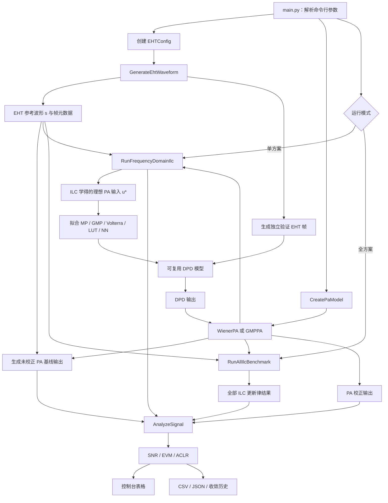
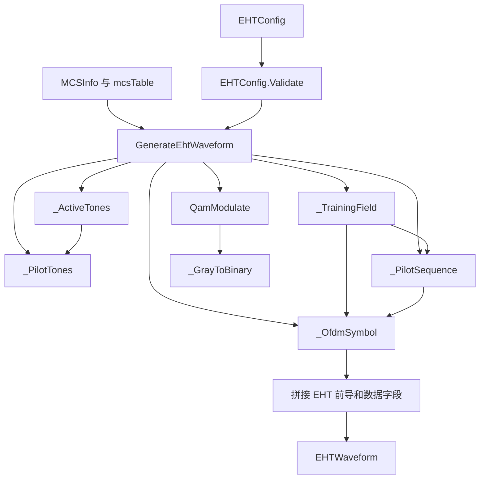
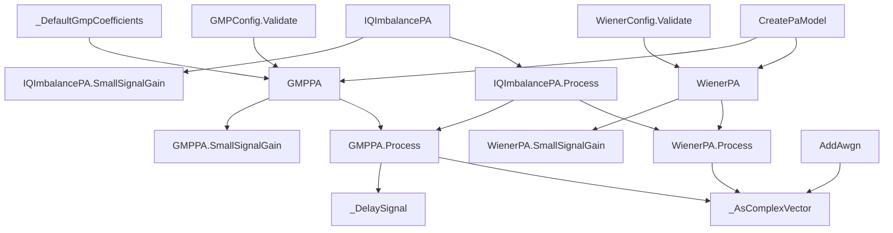
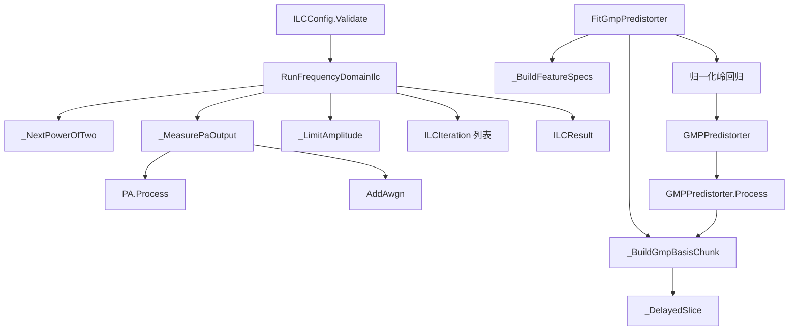
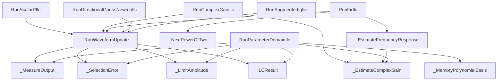
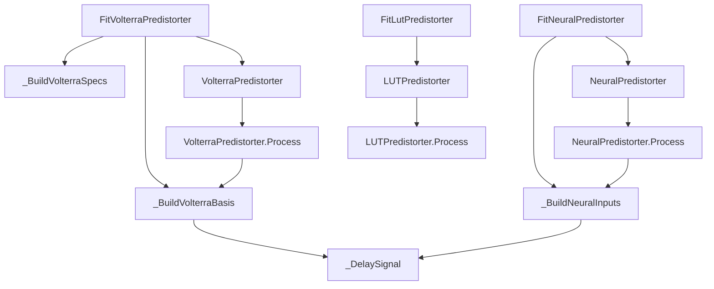
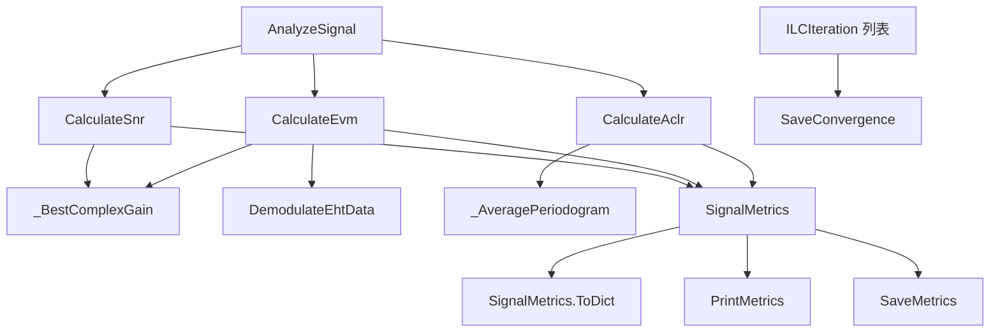
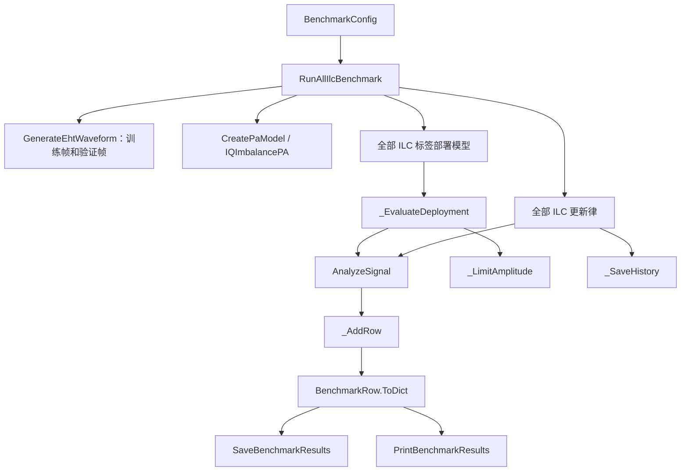
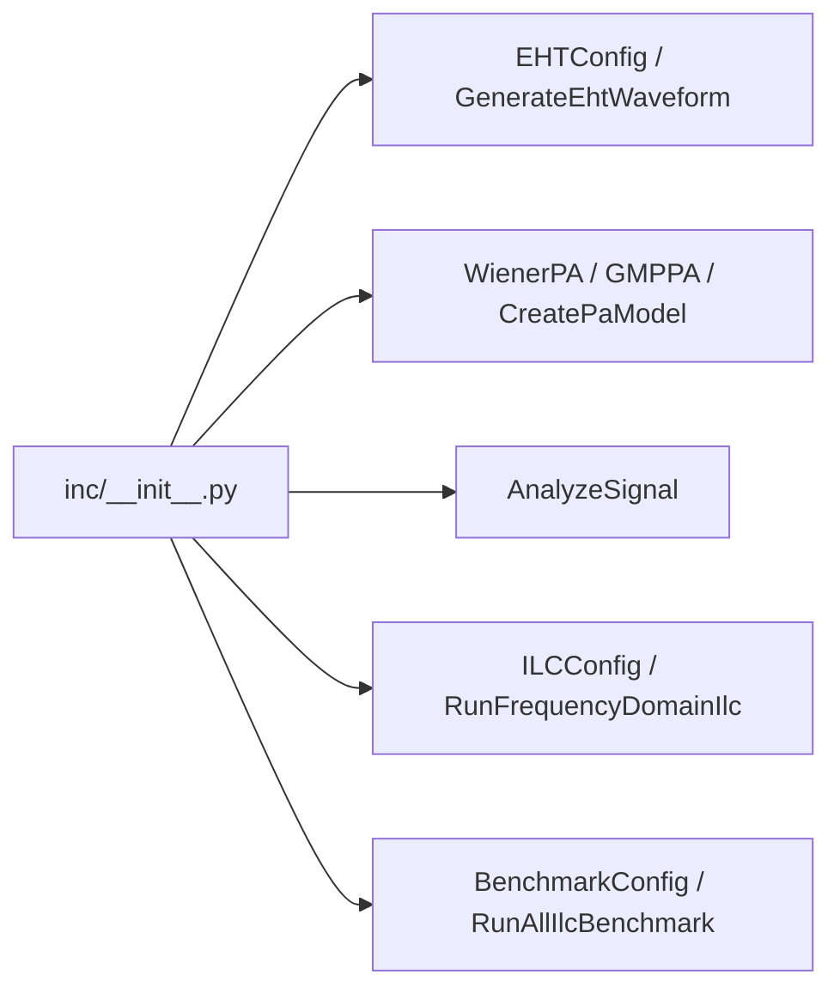

# DPD-ILC EHT Wi-Fi 仿真工程

本工程按照 `doc/DPD-ILC.md` 的推荐路线实现：生成 EHT Wi-Fi 复基带训练波形，经 Wiener 或 GMP 功放模型后，使用正则化频域 ILC 学习理想 PA 输入，再以 GMP 拟合可复用的 DPD，并输出 SNR、EVM 和 ACLR。

## 工程结构

```text
main.py                 命令行主程序
inc/waveGen.py          EHT 波形与 MCS 0–13 调制
inc/PaModel.py          Wiener 和 GMP 非线性 PA
inc/DpdIlc.py           频域 ILC 与 GMP DPD 拟合
inc/IlcVariants.py      其他 ILC 更新律
inc/DeploymentModels.py Volterra、LUT 和 NN 部署模型
inc/Analysis.py         SNR、EVM、ACLR 及 CSV/JSON 输出
inc/Benchmark.py        全 ILC 方案统一基准测试
inc/__init__.py         公共接口汇总
tests/TestProject.py    自包含验证脚本
```

所有代码注释与文档字符串均为英文；函数使用大驼峰命名，变量和对象属性使用小驼峰命名。

## 工程工作流程图



**图示说明：**

1. `main.py` 首先读取带宽、MCS、PA 类型、驱动电平和 ILC 参数，分别创建 EHT 波形配置与 PA 模型。
2. `GenerateEhtWaveform` 输出参考复基带波形 `s` 及字段边界、FFT、数据子载波等元数据；同一波形直接通过 PA 后形成未校正基线。
3. 单方案模式执行正则化频域 ILC，寻找使 PA 输出逼近参考波形的理想输入 `u*`；全方案模式则调用统一基准测试，逐一运行所有 ILC 更新律。
4. 收敛后的 `u*` 可直接用于重复波形测试，也可作为监督标签拟合 MP、GMP、Volterra、LUT 或 NN，从而形成可用于其他帧的部署模型。
5. 所有输出最终进入 `AnalyzeSignal`，统一计算 SNR、EVM 和 ACLR，并写入控制台、CSV、JSON 及迭代收敛文件。

图中从“生成独立验证 EHT 帧”开始的支路专门验证部署模型的泛化能力；它使用不同随机种子的载荷，不与 ILC 训练帧重复。

## `inc` 模块与函数结构图

以下结构图中，箭头 `A → B` 表示 `A` 调用、创建或依赖 `B`；以类名标记的节点保存配置或运行状态，以函数名标记的节点执行具体算法。

### `inc/waveGen.py`



**图示说明：**

- `EHTConfig.Validate` 在分配大数组前检查带宽、MCS、GI、符号数和过采样倍率；`MCSInfo` 与 `mcsTable` 提供调制阶数和编码率。
- `_ActiveTones` 与 `_PilotTones` 决定不同带宽下的数据、导频和空子载波位置；`QamModulate` 完成 Gray 编码星座映射。
- `_TrainingField` 生成前导训练字段，`_OfdmSymbol` 负责频域装载、IFFT 和循环前缀拼接。
- `GenerateEhtWaveform` 是模块主入口，最终返回 `EHTWaveform`；其中既有时域样本，也有后续 EVM 解调所需的字段切片和参考星座。

### `inc/PaModel.py`



**图示说明：**

- `CreatePaModel` 根据字符串选择默认 `WienerPA` 或 `GMPPA`；两种模型均由对应配置类先完成参数校验。
- `WienerPA.Process` 依次执行线性记忆滤波、Rapp AM-AM 压缩和 AM-PM 相位旋转。
- `GMPPA.Process` 使用 `_DelaySignal` 构造主项、滞后包络项和超前包络项；未提供系数时由 `_DefaultGmpCoefficients` 创建稳定的默认模型。
- `IQImbalancePA` 在已有 PA 输出上增加共轭镜像，用于测试增广 ILC；`AddAwgn` 模拟反馈接收链噪声。
- `SmallSignalGain` 为复增益归一化和频率响应估计提供线性工作点参考。

### `inc/DpdIlc.py`



**图示说明：**

- 上半部分是波形 ILC：`RunFrequencyDomainIlc` 根据低功率探测结果构造正则化逆频响，反复测量 PA、计算误差、更新输入并执行峰值投影。
- 每轮状态记录为 `ILCIteration`，完整输出封装为 `ILCResult`，包含最佳学习输入、对应 PA 输出和收敛历史。
- 下半部分是标签拟合：`FitGmpPredistorter` 先枚举 GMP 基函数，再分块累计岭回归矩阵，避免宽带长帧占用过多内存。
- `GMPPredistorter.Process` 使用同一组基函数和拟合系数，将新的 EHT 波形转换为可部署的 DPD 输出。

### `inc/IlcVariants.py`



**图示说明：**

- 标量 P 型、复增益、FIR、方向 Gauss-Newton 和增广 IQ ILC 共用 `_RunWaveformUpdate`，因此具有一致的测量、最佳迭代选择、峰值限制和历史记录逻辑。
- `RunComplexGainIlc` 使用 `_EstimateComplexGain` 补偿平均增益和相位；`RunFirIlc` 进一步估计频率响应并截取有限长度学习滤波器。
- `RunDirectionalGaussNewtonIlc` 通过 PA 有限差分计算误差方向上的 Jacobian 投影，不构造完整的大型 Jacobian 矩阵。
- `RunAugmentedIqIlc` 同时使用误差与共轭误差，补偿 IQ 镜像；扩展到 MIMO 时可将同一结构推广为多通道增广矩阵。
- 参数域 ILC 不经过通用波形更新核心，而是用 `_MemoryPolynomialBasis` 直接更新 DPD 系数。

### `inc/DeploymentModels.py`



**图示说明：**

- Volterra 路线先枚举一阶和三阶复基带项，再由 `_BuildVolterraBasis` 构建设计矩阵并完成岭回归；运行时使用相同基函数求输出。
- LUT 路线按输入幅度分箱，为每个区间拟合一个复增益；空分箱使用最近的有效系数填充。
- NN 路线把当前及历史 I/Q/包络样本组成时延输入，经标准化和 `tanh` 隐层后拟合复数输出层。
- 三个 `Fit...` 函数负责训练，三个 `...Predistorter.Process` 方法负责在验证帧或实际输入上推理。

### `inc/Analysis.py`



**图示说明：**

- `AnalyzeSignal` 是统一分析入口，并行组织 SNR、EVM 和 ACLR 三条计算路径。
- SNR 在移除最佳复增益后计算残差功率；EVM 先由 `DemodulateEhtData` 去循环前缀并 FFT，再与发送星座比较。
- ACLR 通过 `_AveragePeriodogram` 获得平均功率谱，然后分别积分主信道、下邻道和上邻道功率。
- 三类指标封装为 `SignalMetrics`，可由 `PrintMetrics` 输出到终端，也可由 `SaveMetrics` 写入 JSON/CSV。
- `SaveConvergence` 独立保存每轮 ILC 的误差 RMS、NMSE 和输入峰值。

### `inc/Benchmark.py`



**图示说明：**

- `RunAllIlcBenchmark` 是全方案编排入口：生成训练帧与独立验证帧，创建 PA，并按相同迭代预算运行所有算法。
- 常规 ILC 在重复训练波形上测试；增广 ILC 使用 IQ 镜像场景；噪声感知 ILC 使用带噪多次反馈；标签模型在独立验证帧上测试。
- `_EvaluateDeployment` 对每个部署模型执行“DPD → 峰值限制 → PA → 指标分析”。
- `_AddRow` 将指标及相对基线改善量写入 `BenchmarkRow`，`_SaveHistory` 为各更新律保留独立收敛曲线数据。
- `SaveBenchmarkResults` 与 `PrintBenchmarkResults` 分别负责机器可读文件和控制台汇总表。

### `inc/__init__.py`

`__init__.py` 不实现算法函数，只汇总工程的公共入口：



**图示说明：**

- `inc/__init__.py` 是包的公共门面，不包含算法计算。
- 外部调用者可以从 `inc` 直接导入波形生成、PA、分析、频域 ILC 和全方案基准测试入口，不需要了解各实现文件的位置。
- 未在此处导出的下划线私有函数只供模块内部复用，避免将实现细节暴露为稳定接口。

## EHT 支持范围

- 带宽：20、40、80、160 MHz。
- MCS：0–13，即 BPSK、QPSK、16/64/256/1024/4096-QAM 及对应码率。
- 帧字段：L-STF、L-LTF、L-SIG、RL-SIG、U-SIG、EHT-SIG、EHT-STF、EHT-LTF、EHT-Data。
- EHT 数据子载波间隔为 78.125 kHz；全带宽 RU 分别采用 242、484、996 和 2×996 tones。
- 数据 GI 支持 0.8、1.6、3.2 μs。

波形用于 PA/DPD 激励与指标评估，载荷采用随机 post-FEC 比特。它不包含可用于协议一致性测试的完整 LDPC 编解码、MAC/A-MPDU 组帧或 SIG 字段逐比特编码。

## 快速运行

```powershell
python main.py
```

指定 160 MHz、MCS 13 和 GMP PA：

```powershell
python main.py --bandwidth 160 --mcs 13 --pa gmp --symbols 20
```

加入 45 dB 反馈噪声，并对每轮反馈平均 4 次：

```powershell
python main.py --feedback-snr 45 --feedback-averages 4
```

查看完整参数：

```powershell
python main.py --help
```

运行文档中的全部 ILC 更新律和 ILC 标签部署模型：

```powershell
python main.py --benchmark-all-ilc --bandwidth 20 --mcs 7 --pa wiener --symbols 10 --iterations 10
```

结果保存在 `results/all_ilc_benchmark/`，其中 `all_ilc_metrics.csv` 和
`all_ilc_metrics.json` 包含每种方案的 SNR、EVM、ACLR 及相对基线改善量；
每种迭代更新律还会生成独立的 `convergence_*.csv`。

全方案测试包括：

- 标量 P 型 ILC；
- 复增益归一化 ILC；
- FIR 学习滤波器 ILC；
- 正则化频域 ILC；
- 方向投影 Gauss-Newton ILC；
- 参数域 Memory Polynomial ILC；
- 峰值约束 CFR-ILC；
- 反馈噪声感知与多次平均 ILC；
- 含 IQ 镜像误差的增广 ILC；
- ILC 标签结合 MP、GMP、简化复 Volterra、LUT 和轻量时延 NN。

Gauss-Newton 使用误差方向的有限差分 Jacobian 投影，避免为长 Wi-Fi
波形构造不可接受的完整 Jacobian 矩阵。增广方案以 IQ 镜像为代表场景；
其共轭误差路径与扩展到 MIMO/crosstalk 时采用相同的增广矩阵思想。
标签部署模型全部在不同随机种子的 EHT 帧上验证，而非在训练帧上评分。

默认在 `results/` 生成：

- `metrics.json`：运行配置及各阶段指标；
- `metrics.csv`：便于 Excel 或脚本统计的指标表；
- `ilc_convergence.csv`：每轮 ILC 的 NMSE、误差 RMS 和输入峰值；
- `waveforms.npz`：仅在指定 `--save-waveforms` 时输出。

## 指标定义

- SNR：数据字段上去除最佳复增益后的重构信噪比。
- EVM：对 EHT-Data 去循环前缀、FFT 后，在数据子载波上相对理想 QAM 星座计算 RMS EVM，同时输出 dB 与百分比。
- ACLR：主信道功率与上下相邻同带宽信道功率之比，输出上下邻道和较差值。为完整覆盖两个邻道，命令行采样倍率限制为 4 或 8。

## 验证

```powershell
python tests/TestProject.py
```

验证内容包括全部 MCS 映射、四种带宽的 EHT 参数、理想链路 EVM，以及两类 PA 的 ILC 改善。
