# DPD-ILC VHT/HE/EHT Wi-Fi与双音仿真工程

本工程按照 `doc/DPD-ILC.md` 的推荐路线实现：激励既可以由 `WaveGenWifi` 生成802.11ac/VHT、802.11ax/HE或802.11be/EHT Wi-Fi复基带帧，也可以由 `WaveGenTwoTone` 生成双音测试波形。两类信号共用Rapp、Wiener、GMP或Doherty PA、闭环输出功率校准和全部适用ILC更新律。MIMO Channel还可在PA前后加入方向不对称、具有独立FIR和时延的通道耦合。Wi-Fi路径输出功率、SNR、EVM、IRR、ACLR和功率-EVM曲线；双音路径既能比较所有SISO ILC的IM3/IM5/IM7，也能独立扫描四种PA的频率响应、记忆效应和10至25 dBm输出功率特性。

## 理论文档

- [Wi-Fi 帧生成物理原理与推导](doc/WaveGenWifi.md)：复基带、OFDM 正交性、QAM 归一化、MCS、循环前缀、VHT/HE/EHT 字段和 PAPR。
- [双音信号生成物理原理与用法](doc/WaveGenTwoTone.md)：复基带双音、等功率/不等功率选择、固定间隔位置移动、奇数阶互调频率、RMS/定点边界和ILC带宽。
- [FEC编码译码原理与用法](doc/Fec.md)：55/90短块LDPC校验矩阵、系统编码、软输入normalized min-sum译码和调用示例。
- [PA 模型物理原理与推导](doc/PaModel.md)：Rapp无记忆SSPA、Wiener、GMP、Doherty、频谱再生、IQ失衡，以及由功率和占空比驱动的静态/单RC/Foster电热模型、参数图和开环输出漂移。
- [PA温度特性实测、模型辨识与参数回填](doc/PaThermalMeasurement.md)：测试台、TSEP/结温参考面、耗散功率、效率、static/单RC/Foster拟合、温度电参数、MIMO互热和完整数值例。
- [PA双音特性分析](doc/PaAnalyse.md)：小信号频响、双音间隔记忆、动态AM-AM/AM-PM迟滞、IM3/IM5/IM7、输出功率扫描及逐PA的DPD优化建议。
- [PA到接收端Channel物理原理与用法](doc/Channel.md)：I/Q正交调制背景与镜像产生推导、Tx/FB失衡边界、PA前/后多通道耦合、前向仪表/板载反馈采样、反馈链路非理想和联合功率校准。
- [Channel特性测量与耦合感知DPD](doc/ChannelAnalyse.md)：平坦度、耦合增益/相位、群时延、条件数、测量接线以及耦合感知DPD-GMP前后对比。
- [信号同步、补偿与功率标定原理](doc/SigProc.md)：整数/分数时延、载波频偏、采样频偏、Lanczos-sinc 重采样、复增益补偿和 dBm/RMS 换算。
- [Wi-Fi 帧接收处理原理](doc/FrameProcess.md)：循环前缀删除、FFT、CSD 撤销和空间流解映射。
- [仅接收Wi-Fi帧解析原理与用法](doc/ParseWifi.md)：10 bit seed、短块LDPC、历史CRC兼容、包起点、可选发送辅助、NumPy/WifiWaveform统一接口和完整示例。
- [Wi-Fi 元数据契约](doc/WifiMetadata.md)：`MCSInfo` 与 `WifiWaveform` 的字段、数组形状和模块边界。
- [结果计算物理原理与推导](doc/Analysis.md)：同步后 SNR、EVM、Welch PSD、ACLR 和功率-EVM 曲线。
- [双音IM分析与ILC比较](doc/TwoToneAnalysis.md)：精确频率投影、IM3/IM5/IM7专用接口、dBc与绝对dBFS、逐轮选择和全方法Benchmark。
- [定点接口原理与用法](doc/FixedPoint.md)：浮点旁路、公开整数码、内部缩放、舍入、饱和，以及 WaveGenWifi、PaModel、Analysis 的统一数据边界。
- [Analysis、Channel与PaModel性能优化说明](doc/Performance.md)：同步向量化、稳定区间能量、MIMO调用内中间量复用、不可变协议布局缓存、GMP延迟复用、Channel理想级旁路、参考耗时和安全使用边界。
- [DPD-ILC 原理与算法](doc/DPD-ILC.md)：各类 ILC 更新律、部署模型和工程实践。
- [DPD-GMP补偿与系数更新原理](doc/DPD-GMP.md)：GMP主/交叉记忆基函数、峰值/多功率加权、列归一化岭回归和增量系数更新。
- [DpdGmp程序使用手册](doc/DpdGmp.md)：完整参数、直接/ILC/间接学习、多片段训练、定点接口和基准用法。
- [DPD-LMS逐样点补偿原理](doc/DPD-LMS.md)：复数LMS/NLMS推导、逐列尺度、因果样点状态、影子/活动系数、逐样点与批量岭回归的实现差异。
- [DpdLms程序使用手册](doc/DpdLms.md)：完整参数、逐样点和整帧回放接口、间接学习、定点调用、最小移植程序和Benchmark。
- [最小系统隔离测试示例](doc/Example.md)：分别隔离Tx/FB I/Q、固定温度角、动态自热、热阻和占空比，并比较理想、典型与压力参数配置。
- [DPD-ILC 常见问题](doc/FAQ.md)：低功率小信号逆响应、IRR用途/原理/计算与场景、普通/增广GMP的镜像补偿边界、仪表整段采集下的逐样点DPD训练、史密斯圆图，以及整段FFT与分段加窗Welch功率谱的公式、泄漏/方差/分辨率取舍和工程选择。
- [全工程函数与物理原理覆盖审计](doc/FunctionPrinciples.md)：逐项索引 `main.py` 与 `inc` 中全部函数，区分物理模型、数值实现和工程编排，并链接到对应推导。

安装依赖：

```powershell
python -m pip install -r requirements.txt
```

工程使用 NumPy 完成信号处理；Matplotlib 只由 `inc/utils/Draw.py` 调用，用于生成 PNG 曲线图。

工程源代码同时支持Python 3.9和Python 3.12。描述字段LDPC编码器和软输入译码器只依赖NumPy，没有引入要求特定Python小版本的LDPC编译扩展。

## 工程结构

```text
main.py                 命令行主程序
SmallestSISO.py         浮点与16位定点SISO EHT/GMP/ILC对比示例
SmallestLMS.py          不依赖整帧训练器的逐样点GMP-NLMS最小移植参考
inc/lib/Analysis.py         模拟功率、SNR、EVM、IRR、ACLR、逐轮ILC性能分析及结果输出
inc/lib/Channel.py          PA前后多通道耦合、联合功率校准及forward/fb采样链路
inc/lib/ChannelAnalyse.py   MIMO冲激响应、平坦度、耦合、群时延和条件数测量
inc/lib/DpdIlc.py           全部可复用 ILC 更新律、SISO/MIMO 与标签部署模型
inc/lib/DpdGmp.py           SISO普通/增广GMP及测量驱动的耦合感知MIMO DPD
inc/lib/DpdLms.py           GMP-LMS/NLMS逐样点影子系数更新与帧/样点提交
inc/lib/Fec.py              55/90短块LDPC矩阵构造、系统编码和软输入译码
inc/lib/PaModel.py          SISO/MIMO Rapp、Wiener、GMP和Doherty非线性PA
inc/lib/ParseWifi.py        接收帧描述解析、包起点检测与参考波形恢复
inc/lib/WaveGenWifi.py      WaveGenWifi 类、VHT/HE/EHT 波形、别名归一化与 MCS 调制
inc/lib/WaveGenTwoTone.py   WaveGenTwoTone 类、双音波形及IM3/IM5/IM7频率元数据
inc/lib/TwoToneAnalysis.py  双音基波、IM3/IM5/IM7、逐轮ILC分析及结果保存
inc/utils/ConfigUtils.py    ChainMap未知配置警告、过滤与外部活动映射视图
inc/utils/Draw.py           功率-EVM、ILC收敛、双音IMD及PA频响/记忆/功率特性图
inc/utils/FixedPoint.py     浮点旁路、公开有符号整数码与内部归一化转换
inc/utils/FrameProcess.py   Wi-Fi 去 CP、FFT、CSD 撤销与空间流解映射
inc/utils/SigProc.py        SigProc同步补偿、FeedbackIqCalibration、结果类与PowerCalibration
inc/utils/WifiMetadata.py   MCSInfo 与 WifiWaveform 纯数据契约
inc/__init__.py         公共接口汇总
tests/TestProject.py    自包含验证脚本
tests/BenchMark.py      分类ILC基准、PA双音特性测试、结果保存和曲线比较
doc/BenchMark.md        各 benchmark 场景的构造、预期和参考仿真结果
doc/PaAnalyse.md        四种PA特性及PA分析驱动的DPD-GMP逐项改进对比
doc/PaThermalMeasurement.md 实际PA温度测量、热模型辨识、参数回填和独立验证
doc/ChannelAnalyse.md   通道测量原理、用例和耦合感知DPD前后性能
doc/DPD-GMP.md          GMP DPD物理模型和系数更新推导
doc/DpdGmp.md           DpdGmp类参数、方法和完整用例
doc/DPD-LMS.md          GMP-LMS/NLMS逐样点更新推导和批量实现差异
doc/DpdLms.md           DpdLms参数、逐样点移植示例和间接学习用法
doc/FAQ.md              小信号逆响应、IRR、增广GMP、逐样点训练、史密斯圆图和FFT/Welch功率谱常见问题
doc/Fec.md              FEC物理原理、数学推导、接口约束和调用示例
doc/ParseWifi.md        接收帧解析物理原理、参数、限制和完整示例
doc/Performance.md      Analysis、SigProc、PaModel、Channel、FEC与ParseWifi性能优化和验收方法
```

所有代码注释与文档字符串均为英文；除 Python 协议强制要求的 `__init__` 等双下划线方法外，所有函数（包括内部辅助函数）都使用大驼峰命名。变量和对外对象属性使用小驼峰命名；属性底层访问器使用大驼峰函数名，并通过小驼峰属性别名保持调用接口一致。

### Python导入方式

推荐从工程根目录使用完整包名：

```python
from inc.lib.Analysis import Analysis
from inc.lib.Channel import Channel
from inc.lib.ChannelAnalyse import ChannelAnalyse
from inc.lib.DpdGmp import AugmentedDpdGmp, CouplingAwareDpdGmp, DpdGmp
from inc.lib.DpdLms import DpdLms
from inc.lib.Fec import EncodeDescriptorLdpc
from inc.lib.ParseWifi import ParseWifi
from inc.lib.WaveGenWifi import WaveGenWifi
from inc.lib.WaveGenTwoTone import WaveGenTwoTone
from inc.lib.TwoToneAnalysis import TwoToneAnalysis
```

为兼容把 `inc` 目录加入 `sys.path` 的既有工程，也支持：

```python
from lib.Analysis import Analysis
from lib.Channel import Channel
from lib.ChannelAnalyse import ChannelAnalyse
from lib.DpdGmp import AugmentedDpdGmp, CouplingAwareDpdGmp, DpdGmp
from lib.Fec import EncodeDescriptorLdpc
from lib.ParseWifi import ParseWifi
from lib.WaveGenWifi import WaveGenWifi
from lib.WaveGenTwoTone import WaveGenTwoTone
from lib.TwoToneAnalysis import TwoToneAnalysis
```

`lib` 与 `utils` 之间的跨包导入会根据当前包层级选择对应路径，因此第二种方式不会再触发 `attempted relative import beyond top-level package`。推荐方式仍是 `inc.lib.*`，因为它不需要调用方手动修改 `sys.path`。

## 浮点与定点接口

`WaveGenWifi`、`WaveGenTwoTone`、`PaModel`、`MimoPaModel`、`Channel`、`ChannelAnalyse`、`DpdGmp`、`AugmentedDpdGmp`、`CouplingAwareDpdGmp`、`ParseWifi`、`Analysis` 和 `TwoToneAnalysis` 都把 `width` 定义在各自的 `parameters` 配置中。`width=0` 表示浮点旁路；`width>0` 表示每个 I、Q 分量使用有符号整数码。默认值为 `16`。为兼容已有代码，各主类仍保留直接 `width=` 便捷参数，但新代码统一推荐 `parameters={"width": ...}`。

```math
-2^{W-1}\leq q_{\mathrm{I}},q_{\mathrm{Q}}\leq 2^{W-1}-1
```

```math
x_{\mathrm{internal}}=\frac{q}{2^{W-1}}
```

浮点和定点模式的数组形状与 `numpy.complex128` 类型相同，但数值含义不同。定点模式的实部和虚部是整数码：14 位范围为 `-8192…8191`，16 位范围为 `-32768…32767`。模块收到码值后才除以缩放因子，内部 FFT、PA 非线性、同步、ILC 和指标计算始终使用归一化浮点。

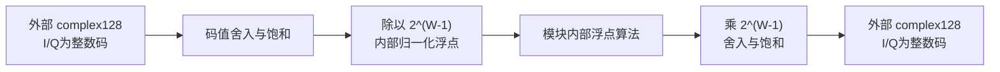
```mermaid
flowchart LR
    input["外部 complex128<br/>I/Q为整数码"] --> quantizer["码值舍入与饱和"]
    quantizer --> floating["除以 2^(W-1)<br/>内部归一化浮点"]
    floating --> algorithm["模块内部浮点算法"]
    algorithm --> outputQuantizer["乘 2^(W-1)<br/>舍入与饱和"]
    outputQuantizer --> output["外部 complex128<br/>I/Q为整数码"]
```

**图说明**：`complex128` 只是统一的存储容器。以14位为例，正满量程公开值是 `8191`；约 `0.999878` 的归一化值只存在于模块内部。物理 dBm 电压标定副本只用于功率报告，不能伪装成整数码重新送进定点接口。完整推导见 [FixedPoint.md](doc/FixedPoint.md)。

统一配置方式如下：

```python
from inc.lib.Analysis import Analysis
from inc.lib.Channel import Channel
from inc.lib.PaModel import MimoPaModel, PaModel
from inc.lib.ParseWifi import ParseWifi
from inc.lib.WaveGenWifi import WaveGenWifi

wifiGenerator = WaveGenWifi(parameters={"width": 16})
paModel = PaModel(
    parameters={"modelName": "gmp", "width": 16}
)
channel = Channel(
    paModel=paModel,
    parameters={
        "sampleMode": "fb",
        "sampleRateHz": 80.0e6,
        "noiseAmpMv": 10.0,
        "width": 16,
    },
)
wifiWaveform = wifiGenerator.Generate()
chOut, fbOut = channel.Process(
    wifiWaveform.samples,
    outputPowerDbm=20.0,
)
mimoPaModel = MimoPaModel(
    parameters={"numTransmitChains": 2, "width": 16}
)
wifiParser = ParseWifi(parameters={"width": 16})
resultAnalysis = Analysis(
    referenceSignal,
    wifiWaveform,
    parameters={"width": 16},
)
```

顶层 [SmallestSISO.py](./SmallestSISO.py) 会用完全相同的 EHT、默认GMP PA、Channel和ILC设置依次运行浮点与16位定点版本。示例直接使用 `DefaultGmpCoefficients`，不再额外缩放非线性支路。默认稳态系数由 $0\leq|x|\leq2$ 内的有界Rapp型曲线拟合得到，并在该归一化范围内保持AM-AM单调；非线性延迟主项和交叉记忆项都按各阶稳态系数比例生成，零延迟项抵消它们对恒包络稳态的贡献。完整默认模型在0.25至2.0幅度扫描中的最大平台纹波为0.3065 dB。非默认阶次集合若含一阶项，会在必要时共同缩小全部非线性稳态项以保持同一区间单调；未知高阶默认值为0。定点闭环的功率可达性由解码后的隐藏模拟驱动保证，不再依赖把公开整数码推到满量程：

```powershell
python SmallestSISO.py
```

浮点结果保存在 `results/smallest_siso/floating`，16位定点结果保存在 `results/smallest_siso/fixed_16`；程序固定运行4轮ILC，使这个确定性最小场景中的两种模式都在局部稳定区同时改善EVM与ACLR，最后打印最佳ILC EVM及定点减浮点的EVM差值。PA的原始输入不要求预先归一化，脚本直接调用 `chOut, fbOut = Channel.Process(waveform.samples, outputPowerDbm=20.0)`；Channel内部按有效Wi-Fi突发区间把干净PA物理输出闭环标定到20 dBm，再执行一次带0度公共移相和10 mV复包络总RMS白噪声的前向主路。这个最小示例显式选择 `sampleMode="forward"`，所以 `fbOut` 是 `chOut` 的数值相同副本，完全绕过FB专用链；ILC同步、MSE和更新使用这个副本，最终EVM/SNR/ACLR/IRR/功率使用 `chOut`。需要研究板载反馈非理想时应改为 `sampleMode="fb"`，此时第二项才经过完整反馈链。接收噪声不进入PA功率设定闭环，前后补零或长占空比静默不进入功率RMS。
脚本还打印两种波形的峰值以及 `waveformMinimumI/MaximumI/MinimumQ/MaximumQ`。定点版本的 I/Q 字段是公开码值，因此16位分量会位于 `-32768…32767`，并不是小于1的归一化数；复数幅度 `waveformPeakAmplitude` 最多可接近 $\sqrt{2}\,32768$。

## 工程工作流程图

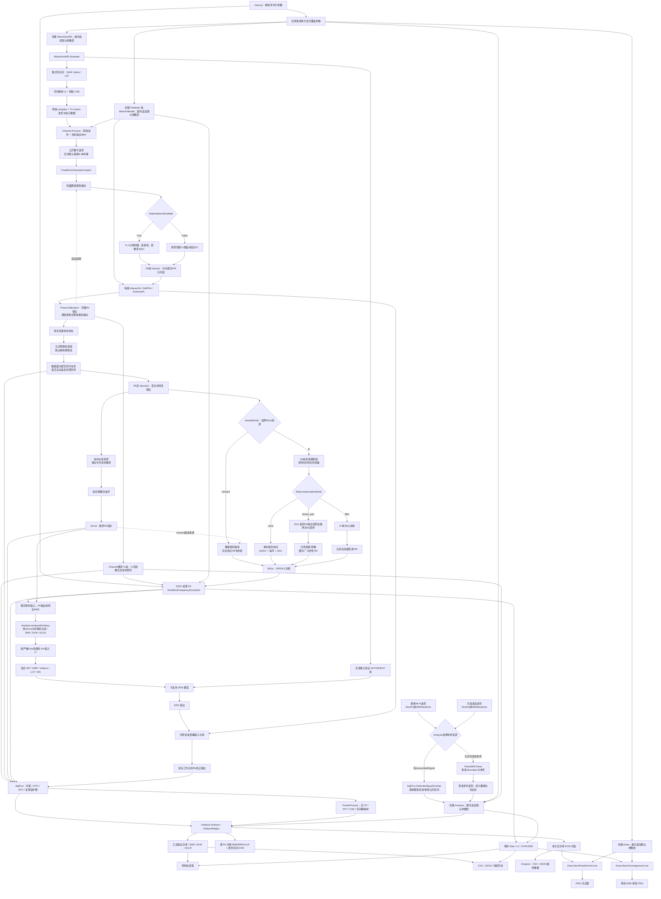
```mermaid
flowchart TD
    start["main.py：解析命令行参数"] --> overrideMap["仅收集调用方显式覆盖参数"]
    overrideMap --> wifiGenerator["创建 WaveGenWifi；类内追加默认参数层"]
    wifiGenerator --> waveGenWifi["WaveGenWifi.Generate"]
    waveGenWifi --> streams["独立空间流：QAM / pilots / LTF"]
    streams --> spatialMap["空间映射 Q + 每链 CSD"]
    spatialMap --> rawReference["原始 samples × TX chains 波形与帧元数据"]

    overrideMap --> paModel["创建 PaModel 或 MimoPaModel；类内追加默认参数层"]
    paModel --> paImplementation["每路 WienerPA / GMPPA / DohertyPA"]
    rawReference --> channel["Channel.Process：原始波形 + 目标输出dBm"]
    paModel --> channel
    channel --> publicCodes["公开数字波形<br/>定点默认保留6 dB余量"]
    publicCodes --> decode["FixedPoint.DecodeComplex"]
    decode --> analogDrive["隐藏逐链模拟驱动"]
    analogDrive --> txIqEnable{"txIqImbalanceEnabled"}
    txIqEnable -->|True| txIq["Tx I/Q调制器：直接项、镜像项与DC"]
    txIqEnable -->|False| txIqBypass["原样旁路Tx增益/相位/DC"]
    txIq --> preCoupling["PA前 Hpre(z)：方向相关FIR与时延"]
    txIqBypass --> preCoupling
    preCoupling --> paImplementation
    paImplementation --> powerCalibration["PowerCalibration：测量PA输出<br/>逐链或联合更新模拟驱动"]
    powerCalibration -. "误差超限" .-> analogDrive
    powerCalibration --> reference["Channel缓存Tx前、Tx后和耦合后参考矩阵"]
    powerCalibration --> restoreThermal["恢复校准前热状态"]
    restoreThermal --> thermalPeriod["正式周期热调度<br/>默认解周期稳态"]
    thermalPeriod --> livePaOutput["数据窗内部空闲可冷却<br/>窗后自动追加外部空闲"]
    livePaOutput --> postCoupling["PA后 Hpost(z)：混合非线性输出"]
    postCoupling --> forwardCapture["前向仪表采样<br/>跳过fb专用非理想"]
    forwardCapture --> forwardNoise["前向物理白噪声"]
    forwardNoise --> channelOutput["chOut：最终RF指标"]
    postCoupling --> sampleMode{"sampleMode：选择fbOut来源"}
    sampleMode -->|forward| forwardCopy["数值相同副本<br/>完全绕过FB专用链"]
    sampleMode -->|fb| feedbackCapture["I/Q前反馈模拟链<br/>频响/非线性/时频偏"]
    channelOutput -. "forward副本来源" .-> forwardCopy
    feedbackCapture --> iqCompMode{"fbIqCompensationMode"}
    iqCompMode -->|none| rawFeedback["单位相位响应<br/>I/Q/DC + 噪声 + ADC"]
    iqCompMode -->|phase_pair| phasePair["r0/r1 旋转PA输出观测支路<br/>两次I/Q采样"]
    phasePair --> separatedFeedback["分离直接/镜像<br/>缓存广义线性FIR"]
    iqCompMode -->|filter| firstPhase["r0 单次I/Q采样"]
    firstPhase --> cachedInverse["应用当前缓存逆FIR"]
    forwardCopy --> feedbackOutput
    rawFeedback --> feedbackOutput["fbOut：DPD/ILC训练"]
    separatedFeedback --> feedbackOutput
    cachedInverse --> feedbackOutput

    start --> frequencyIlc["SISO 或逐 PA RunMimoFrequencyDomainIlc"]
    reference --> frequencyIlc
    paModel --> frequencyIlc
    feedbackOutput --> frequencyIlc

    frequencyIlc --> nativeHistory["保存每轮输入、PA输出和原生MSE"]
    channelOutput --> nativeHistory
    nativeHistory --> ilcAnalysis["Analysis.AnalyzeIlcHistory<br/>用chOut分析每轮功率 / SNR / EVM / ACLR"]
    ilcAnalysis --> learnedInput["按严格EVM选择的 PA 输入 u*"]
    learnedInput --> deployFit["拟合 MP / GMP / Volterra / LUT / NN"]
    deployFit --> deployedDpd["可复用 DPD 模型"]

    waveGenWifi --> validation["生成独立验证 VHT/HE/EHT 帧"]
    validation --> deployedDpd
    deployedDpd --> predistortedInput["DPD 输出"]
    predistortedInput --> deploymentCalibration["闭环校准部署输入功率"]
    paImplementation --> deploymentCalibration
    deploymentCalibration --> correctedOutput["目标工作点的PA校正输出"]

    receiveCapture["接收Wi-Fi波形<br/>NumPy或WifiWaveform"] --> analysisMode{"Analysis选择参考来源"}
    optionalTransmit["可选发送波形<br/>NumPy或WifiWaveform"] --> analysisMode
    analysisMode -->|有transmittedSignal| overlap["SigProc.EstimateSignalOverlap<br/>直接截取发送/接收公共区间"]
    analysisMode -->|无任何发送参考| parser["ParseWifi.Parse<br/>恢复Descriptor与参考"]
    overlap --> analysis
    parser --> parsedContext["恢复参考波形、帧元数据与包起点"]
    parsedContext --> analysis

    overrideMap --> analysis["创建 Analysis；类内追加默认参数层"]
    reference --> analysis
    reference --> sigProc["SigProc：时延 / CFO / SFO / 复增益补偿"]
    livePaOutput --> sigProc
    channelOutput --> sigProc
    frequencyIlc --> sigProc
    correctedOutput --> sigProc
    sigProc --> frameProcess["FrameProcess：去 CP / FFT / CSD / 空间解映射"]
    sigProc --> analysisMethod["Analysis.Analyze / AnalyzeStages"]
    frameProcess --> analysisMethod
    analysis --> analysisMethod
    analysisMethod --> metrics["汇总输出功率 / SNR / EVM / ACLR"]
    analysisMethod --> mimoMetrics["逐 PA 功率/SNR/IRR/ACLR + 逐空间流 EVM"]
    analysisMethod --> powerCurve["多方法功率-EVM 扫描"]
    metrics --> console["控制台表格"]
    metrics --> files["CSV / JSON / 收敛历史"]
    frequencyIlc --> iterationMse["每轮 Raw / LC / EVM-MSE"]
    analysis --> iterationMse
    iterationMse --> console
    iterationMse --> files
    powerCurve --> curveData["Analysis：CSV / JSON 曲线数据"]
    overrideMap --> draw["创建 Draw；类内追加默认参数层"]
    powerCurve --> drawMethod["Draw.SavePowerEvmCurve"]
    draw --> drawMethod
    drawMethod --> curveFigure["PNG 对比图"]
    iterationMse --> convergenceDraw["Draw.SaveConvergenceCurve"]
    draw --> convergenceDraw
    convergenceDraw --> convergenceFigure["每轮 MSE 收敛 PNG"]
```

**图示说明：**

1. `main.py` 首先读取帧格式、带宽、MCS、PA 类型、驱动电平和 ILC 参数，只把调用方明确指定的覆盖值传给 `WaveGenWifi`、`PaModel`、`Analysis` 和 `Draw`；需要接收链路影响时再构造 `Channel`。每个类在自己的构造函数内部定义不可变默认参数，并建立 `ChainMap`，因此调用处不需要导入、复制或显式拼接默认参数。
2. 调用 `WaveGenWifi.Generate()` 后，每条空间流拥有独立随机 QAM 与导频；空间映射矩阵 `Q` 把空间流映射到物理发射链，并叠加每链循环移位分集（CSD）。SISO 返回向量，MIMO 返回形状为 `samples × numTransmitAntennas` 的矩阵。
3. 普通用户只调用 `Channel.Process(rawSignal, outputPowerDbm=...)`。Channel先用 `ValidateThermalReferencePlanes` 保证自身 `sampleRateHz`、`maximumOutputPowerDbm`、`activePowerThresholdDb` 分别等于每路启用热PA的 `sampleRateHz`、`referenceOutputPowerDbm`、`activePowerThresholdDb`；随后 `PowerCalibration.Calibrate` 通过Channel的热事务代理保存并暂停PA热状态，在 `finally` 中恢复。定点模式把保留数字余量的公开码解码后，通过隐藏逐链模拟驱动、Tx I/Q调制器和PA前耦合送入不同PA，并对各PA自身输出计算参考温度有效突发功率。没有PA前耦合时使用逐链闭环；存在耦合时自动用有限差分功率Jacobian联合更新全部模拟驱动。收敛后Channel再按 `thermalRunMode` 执行一个正式周期：默认 `"steady_state"` 先解出周期首尾温度一致的轨迹，`"transient"` 则从当前温度因果推进一周期。数据窗内静默样点与由 `thermalDutyCycle` 自动生成的窗外空闲都以空闲耗散功率冷却，不向返回数组追加零。校准试探不发热，只提交的正式周期推进物理时间。`ThermalConfig.enabled=False` 是硬关闭，会清除热网络、旧热metrics和互热offset，并旁路温度电参数漂移。MIMO正式周期是原子事务，任一路失败会回滚全部PA热状态和旧metrics。`GetActualDutyCycle` 和 `GetThermalMetrics` 分别查询实际RF占空比和完整温度轨迹。
4. `Channel.Process` 固定返回 `(chOut, fbOut)`。`chOut` 始终是跳过全部 `fb...` 参数的VSA前向主路；默认 `sampleMode="forward"` 时，`fbOut` 是 `chOut` 的数值相同副本且完全不执行FB专用链。显式选择 `sampleMode="fb"` 时，两路共享一次PA记忆和热周期。反馈I/Q补偿可保留单状态raw观测，也可在I/Q mixer之前对PA输出的低功率观测支路做0°/90°两状态采样，分离镜像并缓存逆FIR；后续 `filter` 模式只需第一状态。该相位旋转不作用于PA输入，也不是ADC后的数字旋转，`chOut`始终不变。
5. `DpdIlc` 在学习期间不计算EVM、SNR或ACLR；它固定用二元组第二项 `fbOut` 做同步、MSE和更新，同时把同轮 `chOut` 保存到历史，供 `Analysis.AnalyzeIlcHistory` 计算最终参考面的RF指标。因此需要板载反馈链训练的Channel必须显式配置 `sampleMode="fb"`；`forward` 模式表示用前向主路的相同副本训练。现有 `RunMimoFrequencyDomainIlc` 是逐PA独立算法，只适用于关闭或忽略跨通道耦合；启用PA前/后耦合后的联合补偿需要完整矩阵频响或Jacobian的MIMO ILC，文档不会把逐链结果误写成联合补偿结果。
6. `Analysis` 使用三条互相独立的路径。显式参考模式直接保存 `referenceSignal` 与 `WifiWaveform`；发送波形辅助模式对NumPy数组或 `WifiWaveform.samples` 做互相关，直接截取公共区间，绝不解析Descriptor、恢复seed或重新生成参考；只有盲分析模式才调用 `ParseWifi` 恢复包起点、格式、MCS、FFT/GI、空间结构和参考样值。三条路径之后共用 `SigProc`；具备Wi-Fi元数据时再用 `FrameProcess` 计算严格子载波EVM。MIMO时每条物理链分别同步，ACLR汇总各链PSD，EVM按空间流统计。
7. `Analysis.PrintConvergence` 在控制台逐轮显示 Raw MSE、去公共复增益后的 LC-MSE 和严格的 EVM 对齐 MSE；`Analysis.SaveConvergence` 保存相同数据。`Draw.SaveConvergenceCurve` 把三种归一化指标绘制在同一张收敛图中，`Draw.SavePowerEvmCurve` 则单独绘制多方法功率-EVM 图。

图中从“生成独立验证 VHT/HE/EHT 帧”开始的支路专门验证部署模型的泛化能力；它使用相同格式配置和不同随机种子的载荷，不与 ILC 训练帧重复。

## `inc` 模块与函数结构图

以下结构图中，箭头 `A → B` 表示 `A` 调用、创建或依赖 `B`；以类名标记的节点保存配置或运行状态，以函数名标记的节点执行具体算法。

### `inc/utils/ConfigUtils.py`

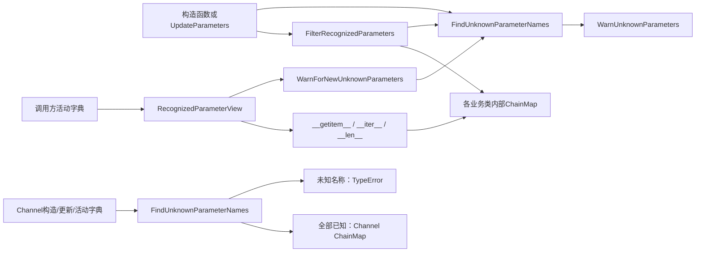
```mermaid
flowchart LR
    caller["构造函数或UpdateParameters"] --> find["FindUnknownParameterNames"]
    find --> warn["WarnUnknownParameters"]
    caller --> filter["FilterRecognizedParameters"]
    filter --> find
    external["调用方活动字典"] --> view["RecognizedParameterView"]
    view --> refresh["WarnForNewUnknownParameters"]
    refresh --> find
    view --> mapping["__getitem__ / __iter__ / __len__"]
    mapping --> chainMap["各业务类内部ChainMap"]
    filter --> chainMap
    channelCaller["Channel构造/更新/活动字典"] --> channelFind["FindUnknownParameterNames"]
    channelFind --> channelReject["未知名称：TypeError"]
    channelFind --> channelMap["全部已知：Channel ChainMap"]
```

**图示说明：**

- 构造函数直接关键字和 `UpdateParameters` 通过 `FilterRecognizedParameters` 复制已识别键；未知键由 `WarnUnknownParameters` 一次汇总报告并被忽略。
- `RecognizedParameterView` 不复制调用方外部字典，因此保留运行期间修改配置的动态语义；视图只向 `ChainMap` 暴露已识别键。
- 外部字典后来加入新的未知键时，`WarnForNewUnknownParameters` 在下一次访问时报告该键。相同未知名称不会在每个采样点重复刷屏。
- `Channel` 是严格模式例外：它直接使用 `FindUnknownParameterNames` 检查构造、更新、活动字典和耦合路径，发现未知名称立即抛出 `TypeError`，不会警告后继续。
- 该模块只处理配置编排，不参与 Wi-Fi、PA、ILC、EVM 或功率计算。

### `inc/lib/WaveGenWifi.py`

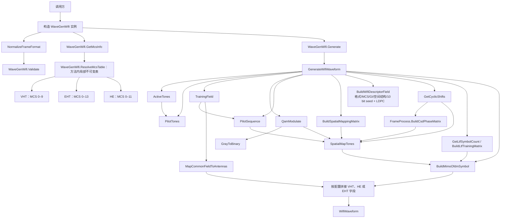
```mermaid
flowchart TD
    caller["调用方"] --> config["构造 WaveGenWifi 实例"]
    config --> normalize["NormalizeFrameFormat"]
    normalize --> validate["WaveGenWifi.Validate"]
    config --> mcs["WaveGenWifi.GetMcsInfo"]
    config --> generate["WaveGenWifi.Generate"]
    mcs --> resolveMcs["WaveGenWifi.ResolveMcsTable：方法内局部不可变表"]
    resolveMcs --> vhtTable["VHT：MCS 0–9"]
    resolveMcs --> ehtTable["EHT：MCS 0–13"]
    resolveMcs --> heTable["HE：MCS 0–11"]
    generate --> privateGenerate["GenerateWifiWaveform"]

    privateGenerate --> active["ActiveTones"]
    privateGenerate --> pilots["PilotTones"]
    active --> pilots
    privateGenerate --> training["TrainingField"]
    privateGenerate --> qam["QamModulate"]
    privateGenerate --> pilotSequence["PilotSequence"]
    privateGenerate --> mapping["BuildSpatialMappingMatrix"]
    privateGenerate --> descriptor["BuildWifiDescriptorField<br/>格式/MCS/GI/空间结构/10 bit seed + LDPC"]
    privateGenerate --> csd["GetCyclicShifts"]
    csd --> csdMatrix["FrameProcess.BuildCsdPhaseMatrix"]
    privateGenerate --> ltf["GetLtfSymbolCount / BuildLtfTrainingMatrix"]
    privateGenerate --> mimoOfdm["BuildMimoOfdmSymbol"]

    qam --> gray["GrayToBinary"]
    training --> pilotSequence
    mapping --> spatialTones["SpatialMapTones"]
    csd --> spatialTones
    csdMatrix --> spatialTones
    qam --> spatialTones
    pilotSequence --> spatialTones
    spatialTones --> mimoOfdm
    ltf --> mimoOfdm
    training --> common["MapCommonFieldToAntennas"]
    common --> packet["按配置拼接 VHT、HE 或 EHT 字段"]
    mimoOfdm --> packet
    packet --> waveform["WifiWaveform"]
```

**图示说明：**

- 调用方必须先构造 `WaveGenWifi`，再调用实例方法；`NormalizeFrameFormat` 先把 `11ac/11ax/11be` 等效归一化为 `VHT/HE/EHT`，`WaveGenWifi.Validate` 再检查带宽、格式对应的 MCS 范围、GI、符号数和采样率兼容性。
- `WaveGenWifi.GetMcsInfo` 调用 `WaveGenWifi.ResolveMcsTable`，在方法内部构造局部不可变 MCS 表并根据规范化后的 `frameFormat` 选择范围；VHT 支持 MCS 0–9、HE 支持 MCS 0–11、EHT 支持 MCS 0–13，不使用模块级查表变量。
- `ActiveTones` 与 `PilotTones` 决定不同带宽下的数据、导频和空子载波位置；`QamModulate` 完成 Gray 编码星座映射。
- `BuildSpatialMappingMatrix` 产生 direct、DFT 或调用方自定义的正交映射；`SpatialMapTones` 为每个子载波执行空间映射并叠加 CSD，`BuildMimoOfdmSymbol` 再完成各发射链 IFFT 和循环前缀。
- `BuildLtfTrainingMatrix` 产生跨 LTF 符号的正交训练码；LTF 数量随空间流增加。公共字段由 `MapCommonFieldToAntennas` 复制到各链并保留 CSD。
- `BuildWifiDescriptorField` 在VHT-SIG-A、HE-SIG-A或U-SIG位置写入两个带导频、跨符号交织和短块LDPC保护的BPSK OFDM符号，使仅接收波形路径能够恢复本工程随机激励所需参数；Parser仍兼容历史CRC描述，但该字段是仿真解析描述，不是bit-exact标准SIG编码器。
- LDPC校验矩阵、系统编码和软输入译码由独立的 `Fec.py` 提供；`WaveGenWifi.py` 与 `ParseWifi.py` 不再定义编译码算法。
- `WaveGenWifi.Generate` 是面向调用方的波形入口，并由内部辅助函数 `GenerateWifiWaveform` 完成组帧，最终返回 `WifiWaveform`；其中既有时域样本，也有后续 EVM 解调所需的格式、字段切片和参考星座。

### `inc/lib/WaveGenTwoTone.py`

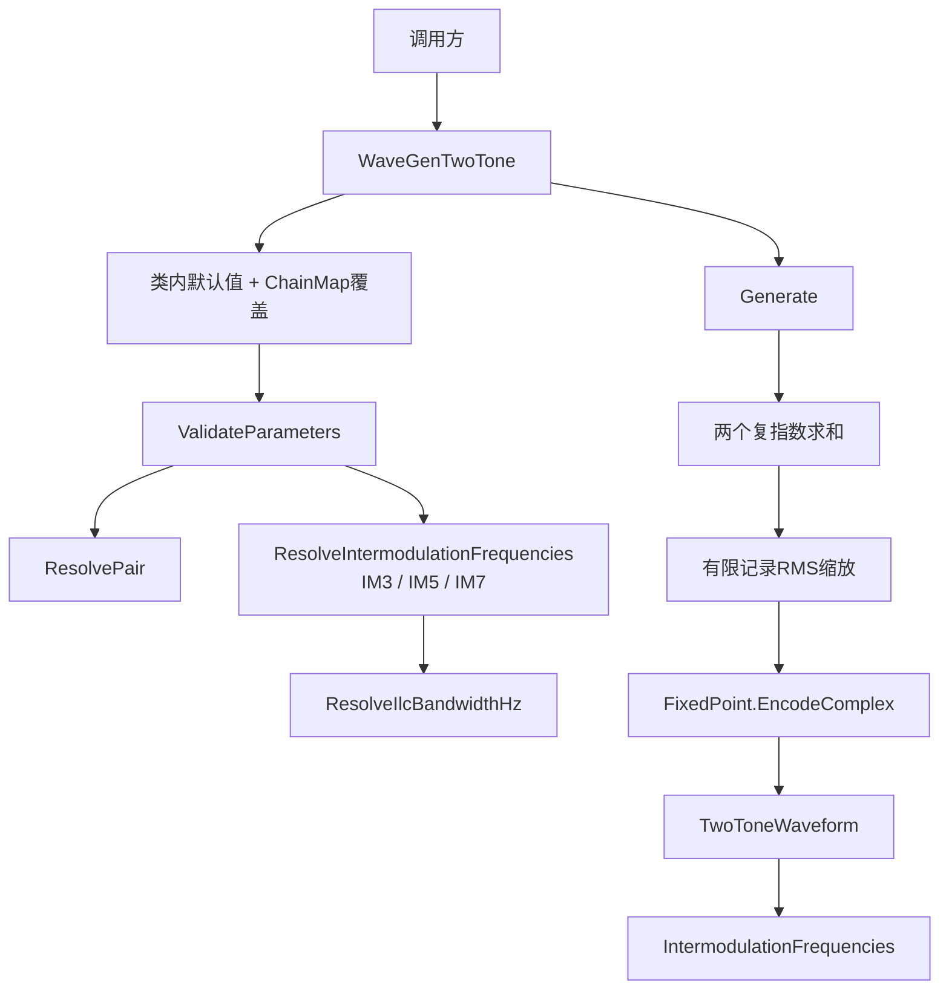
```mermaid
flowchart TD
    caller["调用方"] --> generator["WaveGenTwoTone"]
    generator --> chainMap["类内默认值 + ChainMap覆盖"]
    chainMap --> validate["ValidateParameters"]
    validate --> pairs["ResolvePair"]
    validate --> products["ResolveIntermodulationFrequencies<br/>IM3 / IM5 / IM7"]
    products --> bandwidth["ResolveIlcBandwidthHz"]
    generator --> generate["Generate"]
    generate --> tones["两个复指数求和"]
    tones --> rms["有限记录RMS缩放"]
    rms --> fixed["FixedPoint.EncodeComplex"]
    fixed --> waveform["TwoToneWaveform"]
    waveform --> productsMethod["IntermodulationFrequencies"]
```

**图示说明：**

- `WaveGenTwoTone` 与其他主类相同，默认参数写在构造函数内部；调用方只覆盖采样率、频率、幅相、长度、RMS和位宽。
- `ValidateParameters` 不只检查两个基波，还检查IM3、IM5和IM7均未混叠。
- `ResolveIlcBandwidthHz` 默认把频域ILC更新范围扩展到最外侧IM7，避免算法只能合成IM3抵消分量。
- `Generate` 返回带元数据的 `TwoToneWaveform`，浮点和定点接口规则与Wi-Fi生成器一致。

### `inc/lib/TwoToneAnalysis.py`

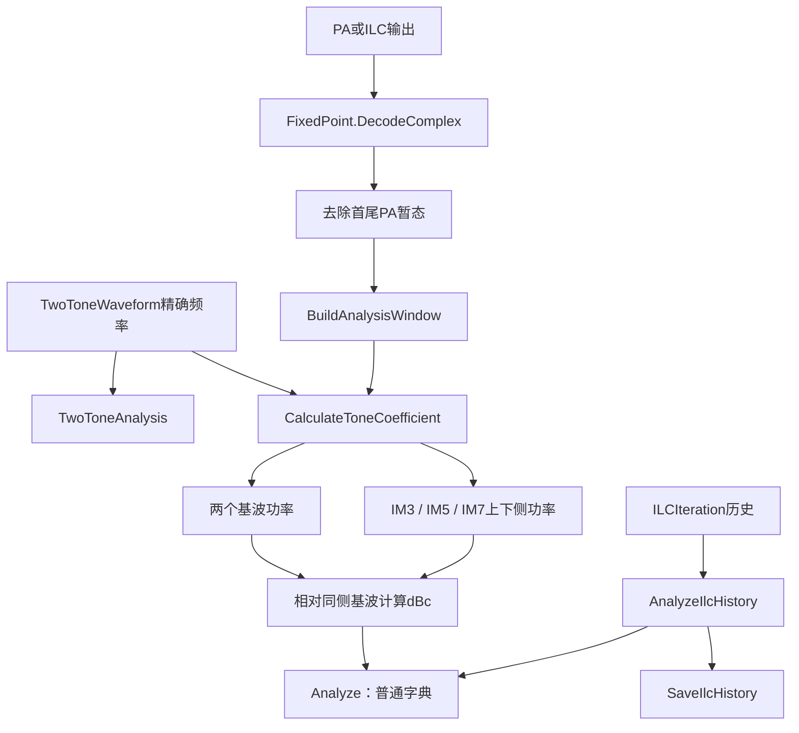
```mermaid
flowchart TD
    waveform["TwoToneWaveform精确频率"] --> analysis["TwoToneAnalysis"]
    measured["PA或ILC输出"] --> decode["FixedPoint.DecodeComplex"]
    decode --> trim["去除首尾PA暂态"]
    trim --> window["BuildAnalysisWindow"]
    window --> projection["CalculateToneCoefficient"]
    waveform --> projection
    projection --> fundamentals["两个基波功率"]
    projection --> products["IM3 / IM5 / IM7上下侧功率"]
    fundamentals --> dbc["相对同侧基波计算dBc"]
    products --> dbc
    dbc --> metrics["Analyze：普通字典"]
    history["ILCIteration历史"] --> historyAnalysis["AnalyzeIlcHistory"]
    historyAnalysis --> metrics
    historyAnalysis --> save["SaveIlcHistory"]
```

**图示说明：**

- 分析器在精确物理频率做Hann窗复投影，不把非整数周期音调强制舍入到最近FFT格点。
- 每种阶次同时保存下侧、上侧和较差侧；dBc越负表示互调越小。
- `AnalyzeIlcHistory` 在ILC结束后独立读取每轮真实PA输出，不向 `DpdIlc.py` 注入指标计算。
- 最佳轮按IM3、IM5、IM7中最大的剩余互调最小来选择，并保留对应输入供同输出功率复测。

### `inc/lib/Fec.py`

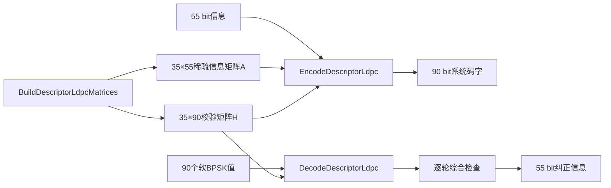
```mermaid
flowchart LR
    build["BuildDescriptorLdpcMatrices"] --> matrixA["35×55稀疏信息矩阵A"]
    build --> matrixH["35×90校验矩阵H"]
    message["55 bit信息"] --> encode["EncodeDescriptorLdpc"]
    matrixA --> encode
    matrixH --> encode
    encode --> codeword["90 bit系统码字"]
    soft["90个软BPSK值"] --> decode["DecodeDescriptorLdpc"]
    matrixH --> decode
    decode --> syndrome["逐轮综合检查"]
    syndrome --> recovered["55 bit纠正信息"]
```

**图示说明：**

- `BuildDescriptorLdpcMatrices` 在函数内部确定性构造稀疏矩阵并缓存结果，不保存模块级数据全局变量。
- `EncodeDescriptorLdpc` 保留55 bit原始信息并递推生成35 bit累加校验位；返回前验证完整综合为零。
- `DecodeDescriptorLdpc` 接收“正值倾向bit 0、负值倾向bit 1”的90个软值，执行normalized min-sum迭代，只有全部35个校验方程通过才返回。
- FEC模块不处理OFDM、导频或帧字段；物理音调布局和语义恢复仍由 `ParseWifi` 负责。完整推导和调用示例见[Fec说明文档](doc/Fec.md)。

### `inc/utils/WifiMetadata.py`

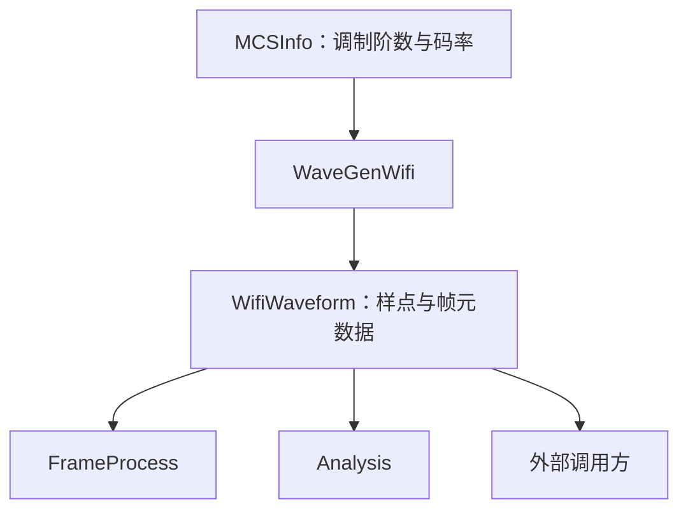
```mermaid
flowchart TD
    mcs["MCSInfo：调制阶数与码率"] --> generator["WaveGenWifi"]
    generator --> waveform["WifiWaveform：样点与帧元数据"]
    waveform --> frameProcessor["FrameProcess"]
    waveform --> analysis["Analysis"]
    waveform --> caller["外部调用方"]
```

**图示说明：**

- `WifiMetadata.py` 只定义数据类，不生成波形、不解调帧，也不计算性能指标。
- `WaveGenWifi` 负责创建 `WifiWaveform`；`FrameProcess` 和 `Analysis` 只消费这份稳定的数据契约，因此不需要导入波形生成算法。
- `WifiWaveform` 保存时域样点、采样率、FFT/GI 参数、数据字段起点、音调索引、空间映射矩阵、CSD、确定性生成种子和参考空间流星座。

### `inc/lib/ParseWifi.py`

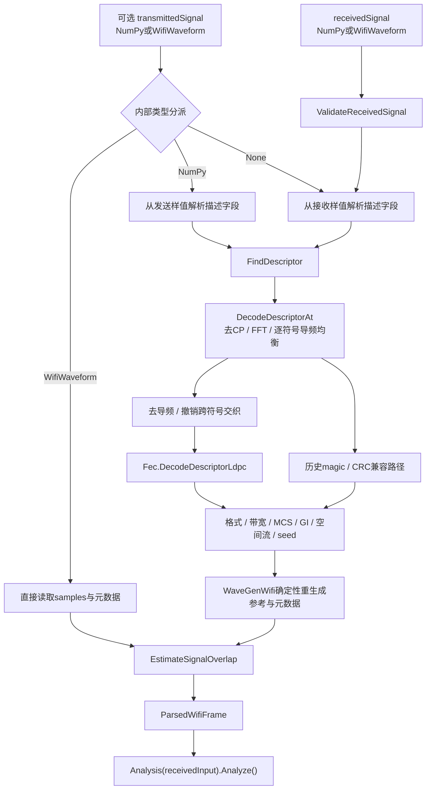
```mermaid
flowchart TD
    receive["receivedSignal<br/>NumPy或WifiWaveform"] --> validate["ValidateReceivedSignal"]
    transmit["可选 transmittedSignal<br/>NumPy或WifiWaveform"] --> dispatch{"内部类型分派"}
    dispatch -->|WifiWaveform| objectPath["直接读取samples与元数据"]
    dispatch -->|NumPy| descriptorSource["从发送样值解析描述字段"]
    dispatch -->|None| receiveDescriptor["从接收样值解析描述字段"]
    validate --> receiveDescriptor
    descriptorSource --> find["FindDescriptor"]
    receiveDescriptor --> find
    find --> decode["DecodeDescriptorAt<br/>去CP / FFT / 逐符号导频均衡"]
    decode --> deinterleave["去导频 / 撤销跨符号交织"]
    deinterleave --> fecDecode["Fec.DecodeDescriptorLdpc"]
    decode --> legacy["历史magic / CRC兼容路径"]
    fecDecode --> parameters
    legacy --> parameters
    parameters["格式 / 带宽 / MCS / GI / 空间流 / seed"]
    parameters --> regenerate["WaveGenWifi确定性重生成参考与元数据"]
    objectPath --> correlate["EstimateSignalOverlap"]
    regenerate --> correlate
    correlate --> parsed["ParsedWifiFrame"]
    parsed --> analysis["Analysis(receivedInput).Analyze()"]
```

**图示说明：**

- 接收输入和可选发送输入都使用统一参数名，并且都支持NumPy数组或 `WifiWaveform`；调用方不需要选择不同函数。
- 没有发送参考时，Parser联合搜索采样率、包起点和格式信令位置；新版字段必须通过导频置信度、LDPC校验和字段语义检查，旧保存波形才进入magic与CRC兼容路径。
- 可选发送输入为NumPy数组时，Parser从发送样值解码元数据并保留原数组作为参考；输入为 `WifiWaveform` 时直接读取完整元数据。
- 发送辅助路径使用逐链能量归一化互相关细化接收包起点，对低SNR、PA压缩和MIMO链间相位差更稳健；相关只处理发送与接收的有效重叠区间，不要求两者长度相等。
- 详细字段布局、相关公式、参数表、适用边界和完整调用示例见[ParseWifi说明文档](doc/ParseWifi.md)。

### `inc/utils/FrameProcess.py`

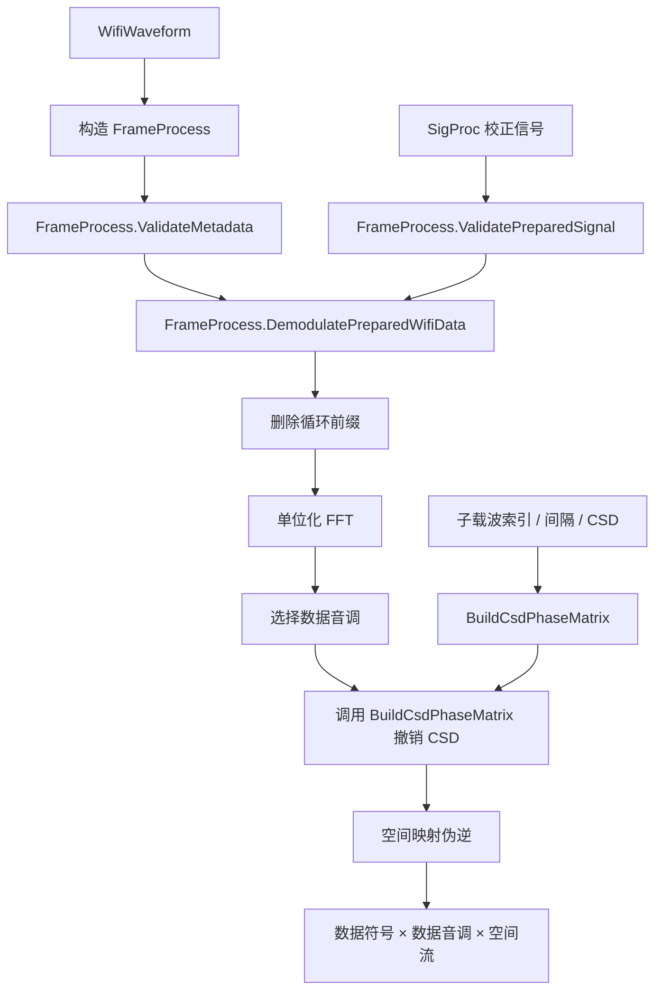
```mermaid
flowchart TD
    tones["子载波索引 / 间隔 / CSD"] --> csd["BuildCsdPhaseMatrix"]
    waveform["WifiWaveform"] --> processor["构造 FrameProcess"]
    processor --> metadata["FrameProcess.ValidateMetadata"]
    prepared["SigProc 校正信号"] --> signalCheck["FrameProcess.ValidatePreparedSignal"]
    metadata --> demod["FrameProcess.DemodulatePreparedWifiData"]
    signalCheck --> demod
    demod --> cp["删除循环前缀"]
    cp --> fft["单位化 FFT"]
    fft --> dataTones["选择数据音调"]
    dataTones --> csdUndo["调用 BuildCsdPhaseMatrix 撤销 CSD"]
    csd --> csdUndo
    csdUndo --> demap["空间映射伪逆"]
    demap --> streams["数据符号 × 数据音调 × 空间流"]
```

**图示说明：**

- `BuildCsdPhaseMatrix` 是发送端和接收端共用的 CSD 相位约定；`WaveGenWifi` 用它施加 CSD，`FrameProcess` 用其共轭撤销 CSD。
- `FrameProcess` 只处理已由 `SigProc` 对齐到参考采样网格的信号，输出空间流域 Wi-Fi 数据星座。
- 未知空口 MIMO 信道估计、均衡和相位噪声跟踪不属于当前类的职责。

### `inc/lib/PaModel.py`


```mermaid
flowchart TD
    caller["调用方"] --> pa["构造 PaModel 实例"]
    caller --> mimo["构造 MimoPaModel 实例"]
    pa --> select{"modelName"}
    select -->|rapp| rapp["RappPA：严格无记忆SSPA"]
    select -->|wiener| wiener["WienerPA"]
    select -->|gmp| gmp["GMPPA"]
    select -->|doherty| doherty["DohertyPA"]
    pa --> paProcess["PaModel.Process"]
    pa --> periodProcess["ProcessThermalPeriodFloating"]
    pa --> paGain["PaModel.SmallSignalGain"]
    thermalConfig["ThermalConfig.Recommended / Validate"] --> thermal["ThermalNetwork"]
    periodProcess --> activeMask["BuildThermalActiveMask<br/>数据窗内活动/空闲"]
    activeMask --> intervals["BuildThermalIntervals"]
    intervals --> periodSim["SimulateThermalPeriod<br/>窗后自动外部空闲"]
    periodSim --> steadySolve["CalculatePeriodicSteadyState<br/>周期首尾闭合"]
    steadySolve --> thermal
    paProcess --> heat["耗散功率"]
    heat --> thermal
    thermal --> drift["温度增益/相位/饱和/非线性漂移"]
    drift --> periodSim
    paProcess --> rappProcess["RappPA.Process：逐样点AM-AM"]
    paProcess --> wienerProcess["WienerPA.Process"]
    paProcess --> gmpProcess["GMPPA.Process"]
    paProcess --> dohertyProcess["Carrier + Peaking + 负载调制"]
    paGain --> rappGain["RappPA.SmallSignalGain"]
    paGain --> wienerGain["WienerPA.SmallSignalGain"]
    paGain --> gmpGain["GMPPA.SmallSignalGain"]

    rappConfig["RappConfig.Validate"] --> rapp
    rappProcess --> asComplex

    wienerConfig["WienerConfig.Validate"] --> wiener
    wienerProcess --> asComplex["AsComplexVector"]

    gmpConfig["GMPConfig.Validate"] --> gmp
    defaults["DefaultGmpCoefficients"] --> gmp
    gmpProcess --> asComplex
    gmpProcess --> delay["DelaySignal"]

    dohertyConfig["DohertyConfig.Validate"] --> doherty
    doherty --> carrier["Carrier：Wiener或GMP"]
    doherty --> peaking["Peaking：Wiener或GMP"]
    dohertyProcess --> delay

    iq["IQImbalancePA"] --> pa
    iq --> wrappedProcess["IQImbalancePA.Process"]
    iq --> wrappedThermal["周期热处理 + 暂停/恢复 + metrics + duty + reset + idle代理"]
    iq --> iqGain["IQImbalancePA.SmallSignalGain"]

    awgn["AddAwgn"] --> asComplex
    mimo --> sync["SynchronizeModels：每链一个 PaModel"]
    sync --> chain["MimoPaModel.ProcessChain"]
    mimo --> matrix["MimoPaModel.Process：samples × chains"]
    matrix --> chain
    mimo --> relative["input/outputPowerDbPerChain"]
    targetPower["目标输出功率 dBm"] --> calibration["PowerCalibration：闭环更新隐藏模拟驱动"]
    calibration --> mimo
    mimo --> measuredPower["测量PA有效突发输出功率"]
    measuredPower --> calibration
```

**图示说明：**

- 调用方创建 `PaModel(modelName="rapp"、"wiener"、"gmp" 或 "doherty")`；统一类根据名称持有对应实现和配置对象。
- `PaModel.Process` 与 `PaModel.SmallSignalGain` 将调用委托给当前实现，因此主程序和 ILC 无须包含模型类型分支。
- `RappPA.Process` 使用经典SSPA软压缩曲线逐样点映射，保留输入相位，不持有FIR、时延或包络历史，是严格无记忆对照模型。
- `WienerPA.Process` 依次执行线性记忆滤波、Rapp AM-AM 压缩和 AM-PM 相位旋转。
- `GMPPA.Process` 使用 `DelaySignal` 构造主项、滞后包络项和超前包络项；未提供系数时，`DefaultGmpCoefficients` 创建在 $0\leq|x|\leq2$ 内单调压缩的默认稳态曲线，再按各阶稳态系数比例生成较小的非线性延迟与交叉项，并从零延迟主项中抵消其总和；一阶线性尾项仍是独立的小信号FIR。非默认阶次组合会自适应保持同一区间单调，未知高阶默认值为0。
- `DohertyPA.Process` 持续驱动Carrier支路，在包络越过门限时平滑开启Peaking支路，并加入支路时延、复合成和简化负载调制；两条支路可分别选择Wiener或GMP。
- 可选 `ThermalConfig` 把输出功率和效率映射为耗散功率；数据窗内活动段发热，内部静默段与Channel自动生成的窗外空闲段按 `idleDissipatedPowerW` 冷却。稳态模式把每个RC支路解到周期首尾闭合，瞬态模式从实时状态推进。`enabled=False` 是硬关闭：PA删除活动热网络、清除热metrics和旧互热offset，并旁路温度电参数漂移；底层 `ThermalNetwork` 只允许用启用配置构造。`Channel.Process(rawSignal, outputPowerDbm=...)` 自动完成“保存热状态→参考温度校准→恢复热状态→正式周期发射”。
- `IQImbalancePA` 在被包装PA的输出上增加共轭镜像，只是用于增广ILC归因测试的参考面无关代数包装器；真实Tx与FB两处I/Q误差应分别使用Channel的 `txIq...` 与 `fbIq...` 参数。它透明代理内部PA的周期热处理、暂停/恢复、metrics、实际占空比、复位和额外空闲接口，因此包装热PA后Channel仍能执行相同热调度与校准事务。`AddAwgn` 模拟反馈接收链噪声。
- `SmallSignalGain` 为复增益归一化和频率响应估计提供线性工作点参考。
- `PowerCalibration` 使用 $P=V_{\mathrm{RMS}}^2/R$ 在 dBm 与复包络 RMS 电压之间换算；默认端口电阻为 50 Ω。`maximumOutputPowerDbm=25.0` 定义每路PA输出参考面的额定上限，20 dBm目标对应的归一化输出RMS是 $10^{(20-25)/20}\approx0.5623$，这个数不是已经求得的PA输入驱动。公开 `Calibrate` 统一执行“热暂停→内部纯电校准→`finally` 恢复”，因此直接绑定热PA也不会让trial发热；`CalibrateElectricalOnly` 只是内部数值内核，事务外直接调用会被 `RuntimeError` 拒绝。闭环反复改变PA前驱动并测量真实输出，不在PA输出端追加常数增益。
- `MimoPaModel` 不在链间引入隐含电信号耦合：每一列进入独立 `PaModel`，可另配互热矩阵。周期热处理以全部PA为一个原子事务；任何后续链失败或互热不收敛都会恢复全部链的热状态、累计时间和旧metrics。运行中把 `thermalCouplingCPerW` 改为全零矩阵时，下一个成功周期清除旧互热offset，失败则仍回滚。`ProcessChain` 是单路 ILC 看到的真实 plant；相对 dB 与绝对 dBm 功率设置均在该路径中生效。

### `inc/lib/Channel.py`

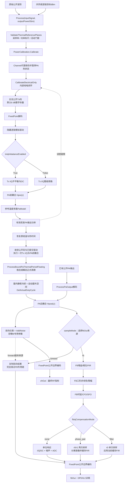
```mermaid
flowchart TD
    raw["原始公开波形"] --> process["Process(inputSignal, outputPowerDbm)"]
    target["共同或逐链目标dBm"] --> process
    process --> referenceCheck["ValidateThermalReferencePlanes<br/>采样率 / 功率标尺 / 活动门限"]
    referenceCheck --> calibration["PowerCalibration.Calibrate"]
    calibration --> suspend["Channel代理保存并暂停PA热状态"]
    suspend --> electrical["CalibrateElectricalOnly<br/>内部纯电闭环"]
    electrical --> publicTx["合法公开Tx码<br/>默认6 dB数字余量"]
    publicTx --> decode["FixedPoint解码"]
    decode --> analogDrive["隐藏逐链模拟驱动"]
    analogDrive --> txIqEnable{"txIqImbalanceEnabled"}
    txIqEnable -->|True| txIq["Tx I/Q不平衡与DC"]
    txIqEnable -->|False| txIqBypass["Tx I/Q整级旁路"]
    txIq --> pre["PA前耦合 Hpre(z)"]
    txIqBypass --> pre
    pre --> pa["参考温度多路PaModel"]
    pa --> detector["有效突发PA输出功率"]
    detector -. "误差超限" .-> electrical
    detector --> restore["恢复原结温与热时间"]
    restore --> liveTx["收敛公开码与已提交驱动<br/>执行一次Tx I/Q与PA前耦合"]
    liveTx --> livePa["ProcessBoundPaThermalPeriodFloating<br/>稳态或瞬态正式周期"]
    livePa --> duty["窗内静默冷却 + 自动窗外空闲<br/>GetActualDutyCycle"]
    duty --> post["PA后耦合 Hpost(z)"]
    post --> forwardNoise["前向仪表 + AddNoise<br/>忽略fb专用参数"]
    post --> sampleMode{"sampleMode：选择fbOut来源"}
    sampleMode -->|forward| forwardCopy["复制前向结果<br/>完全绕过FB专用链"]
    sampleMode -->|fb| fbLinear["FB增益/相位/FIR"]
    forwardNoise -. "forward副本来源" .-> forwardCopy
    fbLinear --> fbNonlinear["FB三阶非线性/限幅"]
    fbNonlinear --> fbSync["FB时延/CFO/SFO"]
    fbSync --> iqCompMode{"fbIqCompensationMode"}
    iqCompMode -->|none| rawFb["单位响应<br/>I/Q/DC + 噪声 + ADC"]
    iqCompMode -->|phase_pair| pairFb["r0/r1 两次采样<br/>分离镜像并缓存FIR"]
    iqCompMode -->|filter| filterFb["r0 单次采样<br/>应用当前缓存FIR"]
    forwardNoise --> encodeCh["FixedPoint公开边界编码"]
    forwardCopy --> encodeFb
    rawFb --> encodeFb["FixedPoint公开边界编码"]
    pairFb --> encodeFb
    filterFb --> encodeFb
    encodeCh --> channelOutput["chOut：最终RF指标"]
    encodeFb --> feedbackOutput["fbOut：DPD/ILC训练"]
    paOutput["已有公开PA输出"] --> paDecode["ProcessPaOutput解码"]
    paDecode --> post
```

**图示说明：**

- 推荐调用 `chOut, fbOut = Process(rawSignal, outputPowerDbm=20.0)`。用户只给原始波形和参考温度目标输出功率；`PowerCalibration.Calibrate` 通过Channel代理暂停热状态并完成干净PA物理输出功率闭环，异常路径也在 `finally` 中恢复。定点模式先产生保留 `calibrationDigitalHeadroomDb` 数字余量的合法公开码，解码后再调节隐藏的逐链模拟驱动，随后依次经过Tx I/Q、PA前耦合和PA。存在PA前串扰时，功率Jacobian联合调整各路模拟驱动。恢复热状态后，Channel只提交一个完整物理周期并生成前向主路；`sampleMode` 决定第二项复制主路还是从同一个无前向噪声的PA后节点进入FB链。两项数据形状不变，而调度空闲仅更新热状态。
- 启用热模型且使用默认 `thermalRunMode="steady_state"` 时，每次 `Process` 都重做参考温度功率校准：首次必须显式给出 `outputPowerDbm`，后续省略时复用最近一次成功目标。只有未启用热模型或显式选择 `thermalRunMode="transient"` 时，`Process(rawSignal)` 才保留不校准功率的单周期链路。`ProcessPaOutput` 用于已有PA输出，不会再次运行PA。
- `chOut` 始终模拟前向VSA/仪表采样并忽略全部 `fb...` 配置。`sampleMode="forward"` 时 `fbOut` 是 `chOut` 的数值相同副本，复用同一噪声实现并完全绕过FB专用链；`sampleMode="fb"` 时 `fbOut` 才进入板载反馈链，并由 `fbIqCompensationMode` 选择raw单状态、0°/90°相位对分离或缓存FIR单状态补偿。相位开关旋转I/Q mixer之前的PA输出低功率观测支路，不重跑PA、不改变前级非线性工作点，也不是ADC后的数字旋转。
- `prePaCouplingPaths` 和 `postPaCouplingPaths` 使用逐方向路径配置，每条路径具有独立增益、相位、复FIR、整数和分数时延；0到1与1到0无需对称。
- `noiseAmpMv` 定义复包络总RMS毫伏数；`noisePwrDbm` 定义端口噪声功率；`noiseSnrDb` 定义每路有效突发信号功率与复噪声功率之比。三者默认都是 `None`，只能选择一个非 `None` 控制量。
- 相位只允许 `-90`、`0`、`90` 度，默认0度不旋转。圆对称复噪声的I/Q分量各承担总方差的一半。
- 浮点和定点公开数据类型都为 `numpy.complex128`；定点模式输出I/Q整数码，物理噪声的电压换算只发生在模块内部。
- 完整公式、参数约束和功率校准接线见 [Channel.md](doc/Channel.md)。参数在链路中的作用位置，以及参数对幅相、星座、时频、噪声和功率收敛的影响见 [Channel 参数示意图](doc/Channel.md#5-参数作用位置与可观测量示意图)。

### `inc/lib/ChannelAnalyse.py`

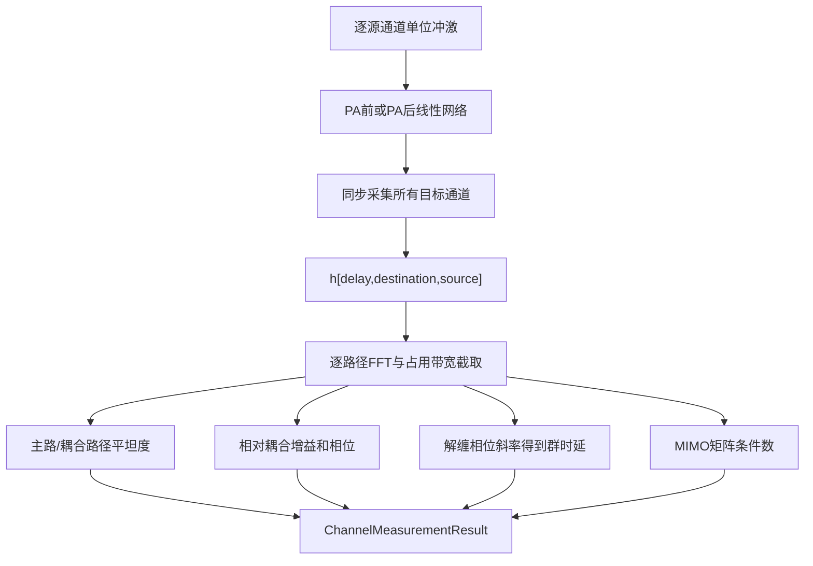
```mermaid
flowchart TD
    probe["逐源通道单位冲激"] --> network["PA前或PA后线性网络"]
    network --> capture["同步采集所有目标通道"]
    capture --> impulse["h[delay,destination,source]"]
    impulse --> response["逐路径FFT与占用带宽截取"]
    response --> flatness["主路/耦合路径平坦度"]
    response --> coupling["相对耦合增益和相位"]
    response --> delay["解缠相位斜率得到群时延"]
    response --> condition["MIMO矩阵条件数"]
    flatness --> result["ChannelMeasurementResult"]
    coupling --> result
    delay --> result
    condition --> result
```

`ChannelAnalyse.Measure` 不读取 `Channel` 的路径配置，而是只通过可调用的被测网络和实际输出恢复响应。`AnalyzeImpulseResponses` 还能直接消费仪表去卷积后、形状为“时延×目标×源”的冲激响应。`ChannelPathMeasurement` 以字典形式输出每条方向路径的中心增益、中心相位、平坦度和群时延；`ChannelMeasurementResult` 另外保存完整频响、最差耦合和带内条件数。

完整参数、测量参考面、实际接线、误差来源和使用示例见 [ChannelAnalyse.md](doc/ChannelAnalyse.md)。测量窗口和频域指标与各配置参数的对应关系见 [ChannelAnalyse 参数示意图](doc/ChannelAnalyse.md#61-参数如何对应测量窗口和频域结果)。

### `inc/lib/DpdIlc.py`

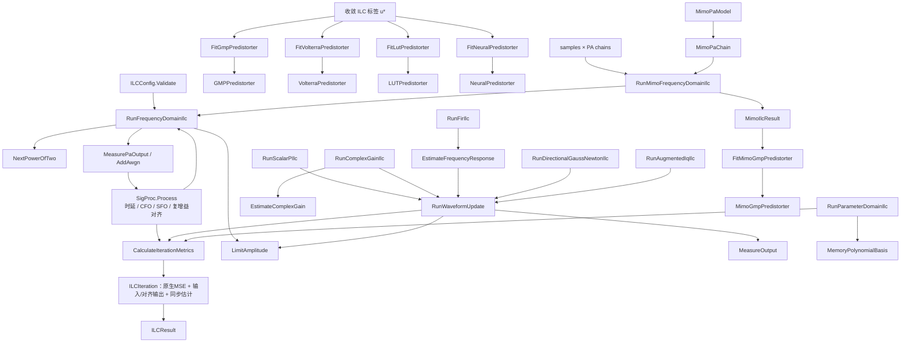
```mermaid
flowchart TD
    config["ILCConfig.Validate"] --> frequency["RunFrequencyDomainIlc"]
    frequency --> fft["NextPowerOfTwo"]
    frequency --> measure["MeasurePaOutput / AddAwgn"]
    measure --> sync["SigProc.Process<br/>时延 / CFO / SFO / 复增益对齐"]
    sync --> metrics["CalculateIterationMetrics"]
    sync --> frequency
    frequency --> limit["LimitAmplitude"]
    metrics --> history["ILCIteration：原生MSE + 输入/对齐输出 + 同步估计"]
    history --> result["ILCResult"]

    scalar["RunScalarPIlc"] --> waveformCore["RunWaveformUpdate"]
    complexGain["RunComplexGainIlc"] --> estimateGain["EstimateComplexGain"]
    complexGain --> waveformCore
    fir["RunFirIlc"] --> response["EstimateFrequencyResponse"]
    response --> waveformCore
    gauss["RunDirectionalGaussNewtonIlc"] --> waveformCore
    augmented["RunAugmentedIqIlc"] --> waveformCore
    waveformCore --> measureVariant["MeasureOutput"]
    waveformCore --> metrics
    waveformCore --> limit
    parameter["RunParameterDomainIlc"] --> mpBasis["MemoryPolynomialBasis"]
    parameter --> metrics

    labels["收敛 ILC 标签 u*"] --> fitGmp["FitGmpPredistorter"]
    labels --> fitVolterra["FitVolterraPredistorter"]
    labels --> fitLut["FitLutPredistorter"]
    labels --> fitNeural["FitNeuralPredistorter"]
    fitGmp --> gmpModel["GMPPredistorter"]
    fitVolterra --> volterraModel["VolterraPredistorter"]
    fitLut --> lutModel["LUTPredistorter"]
    fitNeural --> neuralModel["NeuralPredistorter"]

    mimoReference["samples × PA chains"] --> mimoRun["RunMimoFrequencyDomainIlc"]
    mimoPa["MimoPaModel"] --> chainView["MimoPaChain"]
    chainView --> mimoRun
    mimoRun --> frequency
    mimoRun --> mimoResult["MimoIlcResult"]
    mimoResult --> mimoFit["FitMimoGmpPredistorter"]
    mimoFit --> mimoModel["MimoGmpPredistorter"]

```

**图示说明：**

- `DpdIlc.py` 是工程中唯一的可复用 ILC 算法文件，集中保存公共配置和收敛记录、全部更新律、SISO/MIMO执行及ILC标签部署模型。
- 频域 ILC 和其他波形更新律共享 `ILCConfig`、`CalculateIterationMetrics`、`LimitAmplitude` 与 `ILCResult`。每轮反馈先由 `SigProc` 完成整数/分数时延、CFO、SFO和公共复增益对齐，再构造学习误差；`CalculateIterationMetrics` 记录参考域Raw/LC误差、输入峰值、对齐输出和同步估计，不调用任何RF性能评估器。
- 标量 P、复增益、FIR、方向 Gauss-Newton 和增广 IQ 路线通过 `RunWaveformUpdate` 复用测量与迭代骨架；参数域 ILC 使用 `MemoryPolynomialBasis` 直接更新可部署系数。
- GMP、Volterra、LUT 和神经网络拟合都消费收敛标签 `u*`。各 `Fit...` 函数负责训练，相应 `...Predistorter.Process` 方法负责在独立验证帧上推理。
- MIMO 路线用 `MimoPaChain` 将每个物理 PA 暴露给同一频域 ILC，再按链保存历史并分别拟合 GMP。`Channel` 已能模拟PA前后耦合，但当前逐链 `RunMimoFrequencyDomainIlc` 不经过Channel，因此只适用于无耦合plant；耦合场景需要矩阵/联合更新器，不能把独立链结果误称为耦合MIMO DPD。
- 测试波形、特殊损伤、方法组合、结果文件和功率扫描全部移到 `tests/BenchMark.py`，因此生产算法不依赖任何 benchmark 流程。

### `inc/lib/DpdGmp.py`

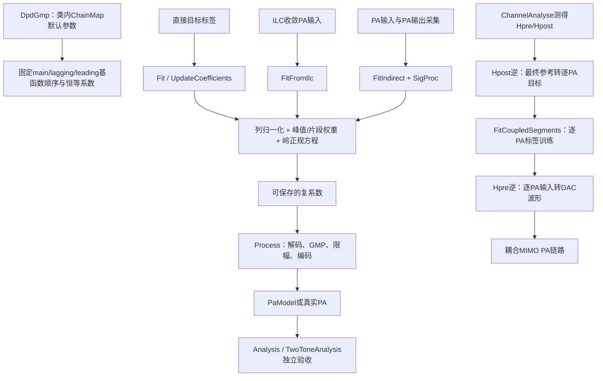
```mermaid
flowchart TD
    config["DpdGmp：类内ChainMap默认参数"] --> identity["固定main/lagging/leading基函数顺序与恒等系数"]
    direct["直接目标标签"] --> fit["Fit / UpdateCoefficients"]
    ilc["ILC收敛PA输入"] --> fitIlc["FitFromIlc"]
    capture["PA输入与PA输出采集"] --> indirect["FitIndirect + SigProc"]
    fit --> solver["列归一化 + 峰值/片段权重 + 岭正规方程"]
    fitIlc --> solver
    indirect --> solver
    solver --> coefficients["可保存的复系数"]
    coefficients --> process["Process：解码、GMP、限幅、编码"]
    process --> pa["PaModel或真实PA"]
    pa --> independent["Analysis / TwoToneAnalysis独立验收"]
    channelMeasurement["ChannelAnalyse测得Hpre/Hpost"] --> postInverse["Hpost逆：最终参考转逐PA目标"]
    postInverse --> coupledFit["FitCoupledSegments：逐PA标签训练"]
    coupledFit --> preInverse["Hpre逆：逐PA输入转DAC波形"]
    preInverse --> coupledPlant["耦合MIMO PA链路"]
```

**图示说明：**`DpdGmp` 是独立可部署的SISO GMP DPD，不包含测试场景或RF指标。`Fit`重置为恒等先验后训练，`UpdateCoefficients`保留当前系数做增量跟踪；多片段版本在帧边界分别建立记忆，避免简单拼接制造错误历史。`CouplingAwareDpdGmp` 组合多个 SISO 模型，并根据 `ChannelAnalyse` 测得的 PA 后响应修改训练目标、根据 PA 前响应修改部署 DAC 波形。

完整参数如下：

| 参数 | 默认值 | 含义 |
|---|---:|---|
| `nonlinearOrders` | `(1,3,5,7)` | 递增奇数阶集合，必须包含1。 |
| `memoryDepth` | `3` | main及交叉复载波支路的记忆深度。 |
| `crossMemoryDepth` | `2` | lagging/leading包络交叉延迟数。 |
| `ridgeFactor` | `1e-6` | 列归一化正规方程的岭正则强度。 |
| `coefficientLearningRate` | `1.0` | 当前系数向新回归解移动的比例。 |
| `chunkSize` | `8192` | 分块构建设计矩阵的样点数。 |
| `peakWeightExponent` | `0.0` | 包络峰值训练权重指数；0关闭。 |
| `maximumOutputMagnitude` | `2.0` | 归一化DPD输出包络上限；`None`关闭。 |
| `width` | `16` | 0为浮点；正数为公开有符号整数I/Q码位宽。 |

主要方法：

| 方法 | 作用 |
|---|---|
| `Fit(referenceSignal, targetSignal, sampleWeights=None)` | 从一对直接标签重置并训练。 |
| `UpdateCoefficients(...)` | 以当前系数为先验增量更新。 |
| `FitSegments(referenceSignals, targetSignals, segmentWeights=None, sampleWeights=None)` | 联合训练多帧或多功率独立片段。 |
| `UpdateCoefficientSegments(...)` | 用多个独立片段增量跟踪。 |
| `FitFromIlc(referenceSignal, learnedInput, sampleWeights=None)` | 把波形专用ILC输入标签压缩为GMP系数。 |
| `FitIndirect(paInputSignal, paOutputSignal, sampleRateHz, ...)` | 同步PA输出后训练后置逆并用于前置DPD。 |
| `Process(inputSignal)` | 保持浮点/定点公开约定地执行DPD。 |
| `CalculateNmse(referenceSignal, targetSignal, sampleWeights=None)` | 计算当前系数的显式权重标签NMSE。 |
| `GetFeatureSpecs()` / `GetCoefficients()` / `SetCoefficients(...)` | 查询结构、保存或恢复系数。 |
| `GetLastTrainingResult()` | 返回训练前后NMSE、条件数和系数变化诊断。 |

耦合感知类的主要方法为：

| 方法 | 作用 |
|---|---|
| `ConfigureChannelMeasurements(pre, post)` | 更新测得的 PA 前和 PA 后冲激响应。 |
| `BuildPaOutputTargets(referenceSignal)` | 对最终端口参考做 PA 后去嵌入。 |
| `FitCoupledSegments(references, labels, ...)` | 用去嵌入目标和实际 PA 输入标签训练各路 GMP。 |
| `BuildDacInput(predistortedPaInput)` | 用 PA 前因果正则逆生成 DAC 波形。 |
| `Process(inputSignal)` | 完成“PA 后目标逆→逐路 GMP→PA 前输入逆”。 |

完整公式、参数边界和示例分别见 [DPD-GMP补偿原理](doc/DPD-GMP.md)、[DpdGmp程序使用手册](doc/DpdGmp.md) 与 [Channel测量及耦合感知DPD](doc/ChannelAnalyse.md)。

### `inc/lib/DpdLms.py`

`DpdLms`继承 `DpdGmp` 的main、lagging、leading GMP结构，但不使用批量正规方程更新。每个时间样点只构造一行GMP特征，用更新前影子系数预测目标，然后执行一次复数LMS或NLMS更新。默认使用影子系数逐样点变化、活动部署系数帧末一次提交，避免Wi-Fi帧内的时变系数产生额外频谱。

新增参数：

| 参数 | 默认值 | 含义 |
|---|---:|---|
| `adaptationMode` | `"nlms"` | 选择普通LMS或NLMS。 |
| `learningRate` | `0.05` | 逐样点更新步长；不同于批量的 `coefficientLearningRate`。 |
| `normalizationEpsilon` | `1e-6` | 特征尺度与NLMS分母保护。 |
| `leakageFactor` | `1e-7` | 把长期漂移缓慢拉回恒等DPD。 |
| `featureScaleMode` | `"frame"` | `"frame"`先统计一帧尺度；`"running"`使用指数功率。 |
| `featurePowerForgettingFactor` | `0.999` | 运行特征功率遗忘因子。 |
| `updateDecimation` | `1` | 1表示每个有效样点都更新。 |
| `coefficientCommitMode` | `"frame"` | 帧末提交；`"sample"`每个样点后立即生效。 |
| `maximumSampleUpdateNorm` | `0.05` | 单样点系数步进范数上限；`None`关闭。 |
| `maximumSampleWeight` | `8.0` | 峰值或外部权重上限。 |

最小逐样点调用：

```python
from inc.lib.DpdLms import DpdLms


dpdLms = DpdLms(
    parameters={
        "nonlinearOrders": (1, 3),
        "memoryDepth": 1,
        "crossMemoryDepth": 0,
        "learningRate": 0.10,
        "featureScaleMode": "frame",
        "coefficientCommitMode": "frame",
        "maximumOutputMagnitude": None,
        "width": 0,
    }
)

dpdLms.BeginFrame(referenceSignal)
for referenceSample, targetSample in zip(
    referenceSignal,
    targetSignal,
):
    dpdLms.UpdateSample(
        complex(referenceSample),
        complex(targetSample),
    )
dpdLms.CommitCoefficients()

predistortedSignal = dpdLms.Process(referenceSignal)
```

`UpdateFromLabels`虽然接收完整数组，内部仍按时间顺序调用逐样点更新，只把完整数组用于公开边界解码、帧尺度统计和更新前后固定NMSE。`UpdateIndirect`允许反馈记录与PA输入长度不同，先由 `SigProc` 对整帧估计时延、CFO、SFO和公共复增益，再逐样点训练后置逆。完整推导、逐样点与批量程序差异、数值保护和移植时序见 [DPD-LMS.md](doc/DPD-LMS.md)，接口与 `SmallestLMS.py` 示例见 [DpdLms.md](doc/DpdLms.md)。

### `tests/BenchMark.py`

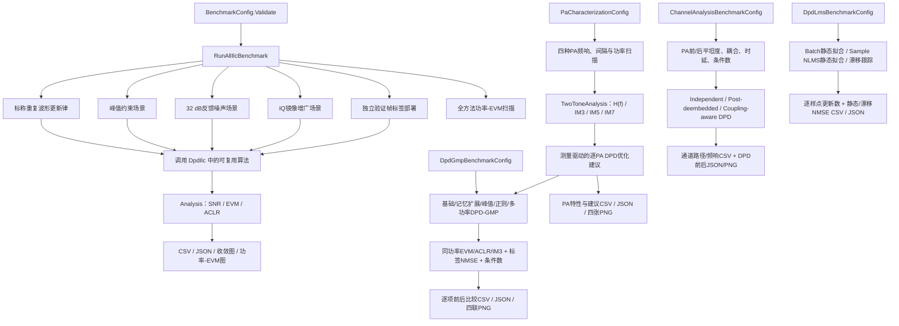
```mermaid
flowchart TD
    config["BenchmarkConfig.Validate"] --> benchmark["RunAllIlcBenchmark"]
    benchmark --> nominal["标称重复波形更新律"]
    benchmark --> constrained["峰值约束场景"]
    benchmark --> noisy["32 dB反馈噪声场景"]
    benchmark --> iq["IQ镜像增广场景"]
    benchmark --> heldout["独立验证帧标签部署"]
    benchmark --> power["全方法功率-EVM扫描"]
    paCharacterization["PaCharacterizationConfig"] --> paSweep["四种PA频响、间隔与功率扫描"]
    dpdGmpConfig["DpdGmpBenchmarkConfig"] --> dpdStages["基础/记忆扩展/峰值/正则/多功率DPD-GMP"]
    dpdLmsConfig["DpdLmsBenchmarkConfig"] --> dpdLmsCompare["Batch静态拟合 / Sample NLMS静态拟合 / 漂移跟踪"]
    channelConfig["ChannelAnalysisBenchmarkConfig"] --> channelMeasure["PA前/后平坦度、耦合、时延、条件数"]
    channelMeasure --> coupledDpd["Independent / Post-deembedded / Coupling-aware DPD"]
    nominal --> algorithms["调用 DpdIlc 中的可复用算法"]
    constrained --> algorithms
    noisy --> algorithms
    iq --> algorithms
    heldout --> algorithms
    algorithms --> analysis["Analysis：SNR / EVM / ACLR"]
    analysis --> report["CSV / JSON / 收敛图 / 功率-EVM图"]
    paSweep --> toneAnalysis["TwoToneAnalysis：H(f) / IM3 / IM5 / IM7"]
    toneAnalysis --> paAdvice["测量驱动的逐PA DPD优化建议"]
    paAdvice --> dpdStages
    dpdStages --> dpdMetrics["同功率EVM/ACLR/IM3 + 标签NMSE + 条件数"]
    dpdMetrics --> dpdReport["逐项前后比较CSV / JSON / 四联PNG"]
    dpdLmsCompare --> dpdLmsReport["逐样点更新数 + 静态/漂移NMSE CSV / JSON"]
    coupledDpd --> channelReport["通道路径/频响CSV + DPD前后JSON/PNG"]
    paAdvice --> paReport["PA特性与建议CSV / JSON / 四张PNG"]
```

**图示说明：**`BenchMark.py` 只负责场景编排和结果呈现，不重新实现任何ILC更新律、GMP基函数、通道测量方程或PA方程。ILC场景分类、预期趋势和本机参考结果见[BenchMark场景说明](doc/BenchMark.md)；PA测试及其驱动的DPD-GMP逐项改进见[PA双音特性分析](doc/PaAnalyse.md)；通道测量和耦合感知DPD前后比较见[ChannelAnalyse](doc/ChannelAnalyse.md)。

### `inc/utils/SigProc.py`

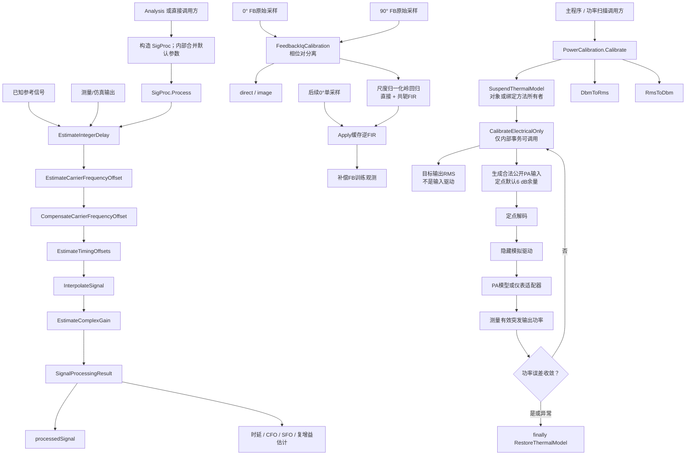
```mermaid
flowchart TD
    caller["Analysis 或直接调用方"] --> processor["构造 SigProc；内部合并默认参数"]
    processor --> process["SigProc.Process"]
    reference["已知参考信号"] --> integer["EstimateIntegerDelay"]
    measured["测量/仿真输出"] --> integer
    process --> integer
    integer --> cfo["EstimateCarrierFrequencyOffset"]
    cfo --> cfoComp["CompensateCarrierFrequencyOffset"]
    cfoComp --> timing["EstimateTimingOffsets"]
    timing --> interpolation["InterpolateSignal"]
    interpolation --> gain["EstimateComplexGain"]
    gain --> result["SignalProcessingResult"]
    result --> corrected["processedSignal"]
    result --> estimates["时延 / CFO / SFO / 复增益估计"]
    phaseZero["0° FB原始采样"] --> iqCalibration["FeedbackIqCalibration<br/>相位对分离"]
    phaseNinety["90° FB原始采样"] --> iqCalibration
    iqCalibration --> directImage["direct / image"]
    iqCalibration --> iqFit["尺度归一化岭回归<br/>直接 + 共轭FIR"]
    nextZero["后续0°单采样"] --> iqApply["Apply缓存逆FIR"]
    iqFit --> iqApply
    iqApply --> correctedFeedback["补偿FB训练观测"]
    powerCaller["主程序 / 功率扫描调用方"] --> calibration["PowerCalibration.Calibrate"]
    calibration --> suspendThermal["SuspendThermalModel<br/>对象或绑定方法所有者"]
    suspendThermal --> electricalCalibration["CalibrateElectricalOnly<br/>仅内部事务可调用"]
    calibration --> dbmToRms["DbmToRms"]
    calibration --> rmsToDbm["RmsToDbm"]
    electricalCalibration --> targetRms["目标输出RMS<br/>不是输入驱动"]
    electricalCalibration --> trialInput["生成合法公开PA输入<br/>定点默认6 dB余量"]
    trialInput --> decodeTrial["定点解码"]
    decodeTrial --> analogDrive["隐藏模拟驱动"]
    analogDrive --> paOrInstrument["PA模型或仪表适配器"]
    paOrInstrument --> activePower["测量有效突发输出功率"]
    activePower --> converged{"功率误差收敛？"}
    converged -->|否| electricalCalibration
    converged -->|是或异常| restoreThermal["finally RestoreThermalModel"]
```

**图示说明：**

- `SigProc` 使用已知参考做数据辅助同步；正整数时延表示测量信号晚于参考。
- CFO 由多个时间窗口的复增益相位斜率估计，避免逐样点 PA 相位扰动产生明显假频偏。
- 多窗口局部相关峰的截距给出分数时延，随时间的斜率给出采样频偏 ppm。
- `InterpolateSignal` 使用有限长度 Lanczos-sinc 核把测量记录重采样到参考网格，随后除去最小二乘公共复增益。
- `SignalProcessingResult` 同时保存校正样点和所有标量估计，`ToDict()` 可用于记录估计结果。
- `FeedbackIqCalibration` 用I/Q mixer之前的两个实测相位响应建立二乘二直接/镜像方程；`Calibrate` 再拟合单状态广义线性逆FIR。Channel内部已解码数据，因此使用 `width=0` 的校准器；直接使用该类时，`width>0` 的公开输入输出仍是 `numpy.complex128` 容器内的整数I/Q码。
- `PowerCalibration` 在同一信号处理模块中集中完成复包络 RMS 电压与绝对功率 dBm 的双向换算，并闭环调整PA前驱动。公开 `Calibrate` 会识别绑定PA、Channel或绑定方法所有者的成对热事务接口，统一完成暂停、内部纯电闭环和 `finally` 恢复；开始事务时会局部捕获原PA的暂停/恢复方法，事务期间禁止 `SetPaModel` 重绑，保证快照一定交还创建它的原owner。普通lambda无法暴露其背后对象的热协议，因此热PA应优先传对象或其绑定 `Process` 方法。定点模式返回保留数字余量的公开输入码，实际驱动增益位于解码之后；最后一次实测PA输出通过 `GetLastPaOutput()` 取得，驱动值可在校准指标的 `analogDriveDbPerChain` 中诊断。

### `inc/lib/Analysis.py`

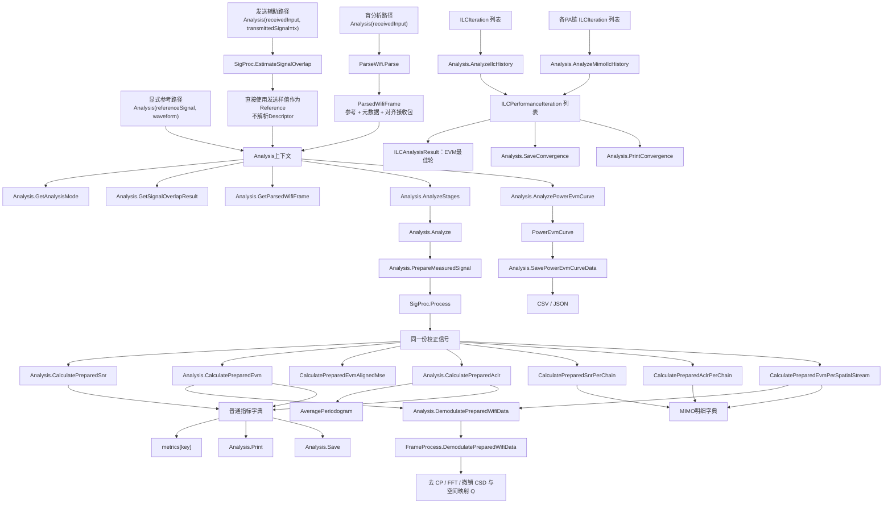
```mermaid
flowchart TD
    aided["显式参考路径<br/>Analysis(referenceSignal, waveform)"] --> context["Analysis上下文"]
    receiveOnly["盲分析路径<br/>Analysis(receivedInput)"] --> parser["ParseWifi.Parse"]
    transmitted["发送辅助路径<br/>Analysis(receivedInput, transmittedSignal=tx)"] --> overlap["SigProc.EstimateSignalOverlap"]
    overlap --> directReference["直接使用发送样值作为Reference<br/>不解析Descriptor"]
    directReference --> context
    parser --> parsed["ParsedWifiFrame<br/>参考 + 元数据 + 对齐接收包"]
    parsed --> context
    context --> mode["Analysis.GetAnalysisMode"]
    context --> overlapResult["Analysis.GetSignalOverlapResult"]
    context --> parsedResult["Analysis.GetParsedWifiFrame"]
    context --> stages["Analysis.AnalyzeStages"]
    stages --> analyze["Analysis.Analyze"]
    analyze --> prepare["Analysis.PrepareMeasuredSignal"]
    prepare --> sigProc["SigProc.Process"]
    sigProc --> prepared["同一份校正信号"]
    prepared --> snr["Analysis.CalculatePreparedSnr"]
    prepared --> evm["Analysis.CalculatePreparedEvm"]
    prepared --> evmMse["CalculatePreparedEvmAlignedMse"]
    prepared --> aclr["Analysis.CalculatePreparedAclr"]
    prepared --> chainSnr["CalculatePreparedSnrPerChain"]
    prepared --> chainAclr["CalculatePreparedAclrPerChain"]
    prepared --> streamEvm["CalculatePreparedEvmPerSpatialStream"]

    evm --> demod["Analysis.DemodulatePreparedWifiData"]
    streamEvm --> demod
    demod --> frameProcess["FrameProcess.DemodulatePreparedWifiData"]
    frameProcess --> undo["去 CP / FFT / 撤销 CSD 与空间映射 Q"]
    aclr --> psd["AveragePeriodogram"]

    snr --> metrics["普通指标字典"]
    evm --> metrics
    aclr --> metrics
    chainSnr --> mimoMetrics["MIMO明细字典"]
    chainAclr --> mimoMetrics
    streamEvm --> mimoMetrics
    metrics --> keys["metrics[key]"]
    metrics --> print["Analysis.Print"]
    metrics --> save["Analysis.Save"]
    nativeHistory["ILCIteration 列表"] --> analyzeHistory["Analysis.AnalyzeIlcHistory"]
    nativeMimoHistory["各PA链 ILCIteration 列表"] --> analyzeMimoHistory["Analysis.AnalyzeMimoIlcHistory"]
    analyzeHistory --> convergence["ILCPerformanceIteration 列表"]
    analyzeMimoHistory --> convergence
    convergence --> bestRound["ILCAnalysisResult：EVM最佳轮"]
    convergence --> saveConvergence["Analysis.SaveConvergence"]
    convergence --> printConvergence["Analysis.PrintConvergence"]
    context --> powerSweep["Analysis.AnalyzePowerEvmCurve"]
    powerSweep --> curve["PowerEvmCurve"]
    curve --> curveSave["Analysis.SavePowerEvmCurveData"]
    curveSave --> curveFiles["CSV / JSON"]
```

**图示说明：**

- 原有显式参考路径保持不变：构造时保存参考信号和 `WifiWaveform`，待测输出传给 `Analyze(measuredSignal)`。
- 传入 `transmittedSignal` 时进入发送辅助路径。发送和接收都可为NumPy数组或 `WifiWaveform`；内部直接取得样值、搜索公共重叠区并将发送样值作为Reference，不调用 `ParseWifi`，也不恢复Descriptor、seed、MCS或GI。发送波形可以被裁剪或前后补零。
- 仅当既没有 `waveform`、也没有 `transmittedSignal` 时进入盲分析路径，第一个输入作为接收帧交给 `ParseWifi`，恢复上下文后允许零参数 `Analyze()`。
- `AnalyzeIlcHistory` 在ILC完成后读取每轮保存的真实输入和PA输出，用普通 `Analyze` 逐轮计算模拟输出功率、SNR、EVM和ACLR；`AnalyzeMimoIlcHistory` 先按轮组合各PA链，再使用完整空间流接收结构分析。主程序和 `SmallestSISO.py` 不再替换或缩放每轮PA输出，因此功率、压缩和EVM变化保持物理一致。两者都在Analysis层按严格EVM返回最佳轮。
- 每次 `Analyze` 只调用一次 `SigProc.Process`，整数/分数时延、CFO、SFO 和公共复增益补偿后的同一份信号被三个指标复用。
- SNR 直接计算校正后数据字段与参考的残差功率；EVM 由 `FrameProcess` 根据 `WifiWaveform` 的数据字段位置去循环前缀、FFT、撤销 CSD 和空间解映射，再与采用相同接收路径得到的参考星座比较。
- ACLR 通过 `AveragePeriodogram` 获得平均功率谱，然后分别积分主信道、下邻道和上邻道功率。
- `Analyze` 直接返回包含模拟输出功率、SNR、EVM、IRR和ACLR的普通Python字典；调用方用 `metrics["outputPowerDbm"]`、`metrics["evmDb"]` 和 `metrics["irrDb"]` 读取结果。`irrDb` 保留兼容字段名，但表示镜像相对期望分量的 dBc，负数越负越好。功率在同步后、公共复增益补偿前计算，并按逐链峰值相对门限只统计有效突发样点；帧外补零和长占空比静默不参与RMS，短暂OFDM过零仍被保留。字典也可以直接交给 `Print`，或由 `Save` 写入JSON/CSV。
- `CalculateEvmAlignedMse` 使用与 EVM 完全相同的同步、去 CP、FFT、空间解映射和数据音调选择；其结果严格等于 RMS EVM 的平方。
- `Analysis.PrintConvergence` 和 `Analysis.SaveConvergence` 逐轮呈现 Raw MSE/NMSE、LC-MSE/NMSE、EVM-MSE/EVM dB、模拟输出功率、公共复增益幅相和输入峰值。
- MIMO 输入按列分别同步；`Analysis.DemodulatePreparedWifiData` 将帧处理委托给 `FrameProcess`，由后者在 FFT 后撤销每链 CSD 相位和空间映射矩阵。MIMO明细同样以普通字典保存逐 PA 输出功率/SNR/ACLR 与逐空间流 EVM，`PrintMimo` 和 `Save` 分别打印并写入 JSON/CSV。
- 当前版本的功率-EVM扫描采用闭环输入功率校准：每个求值器作为完整“DPD+PA”被反复运行，输入驱动由 `PowerCalibration` 隐式调整，直到实测PA输出落入横轴目标容限；不对方法输出做PA后重标定。因此曲线EVM对应真实压缩工作点。

### `inc/utils/Draw.py`

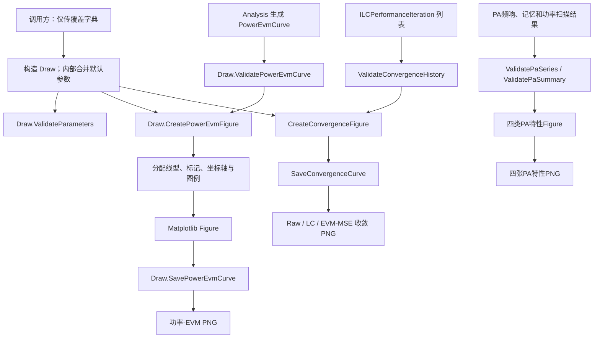
```mermaid
flowchart TD
    caller["调用方：仅传覆盖字典"] --> draw["构造 Draw；内部合并默认参数"]
    draw --> validate["Draw.ValidateParameters"]
    curve["Analysis 生成 PowerEvmCurve"] --> curveValidate["Draw.ValidatePowerEvmCurve"]
    draw --> create["Draw.CreatePowerEvmFigure"]
    curveValidate --> create
    create --> styles["分配线型、标记、坐标轴与图例"]
    styles --> figure["Matplotlib Figure"]
    figure --> save["Draw.SavePowerEvmCurve"]
    save --> png["功率-EVM PNG"]
    history["ILCPerformanceIteration 列表"] --> historyValidate["ValidateConvergenceHistory"]
    historyValidate --> historyCreate["CreateConvergenceFigure"]
    draw --> historyCreate
    historyCreate --> historySave["SaveConvergenceCurve"]
    historySave --> historyPng["Raw / LC / EVM-MSE 收敛 PNG"]
    paSeries["PA频响、记忆和功率扫描结果"] --> paValidate["ValidatePaSeries / ValidatePaSummary"]
    paValidate --> paCreate["四类PA特性Figure"]
    paCreate --> paSave["四张PA特性PNG"]
```

**图示说明：**

- `Draw` 只接收已经算好的 `PowerEvmCurve` 或 `ILCPerformanceIteration` 历史，不计算 SNR、EVM、MSE 或 ACLR，也不负责 CSV/JSON 数据序列化。
- `ValidatePowerEvmCurve` 在创建图形前检查功率坐标、各方法数据长度和有限性，防止产生缺失或错位曲线。
- `CreatePowerEvmFigure` 把所有方法绘制在同一坐标系中；方法较多时图例自动移到绘图区外，避免遮挡数据。
- `SavePowerEvmCurve` 读取 `Draw` 在类内部解析后的绘图参数并仅输出 PNG；图形尺寸、DPI、线宽、标记大小、标题和坐标轴文字均可由外部覆盖。
- `SaveConvergenceCurve` 在同一 dB 轴上绘制 Analysis 已计算好的 Raw NMSE、LC-NMSE 和 EVM-MSE/EVM dB，便于定位原始 MSE 停滞但 EVM 继续改善的原因。
- PA特性绘图读取Benchmark已计算的频率点、双音间隔点、功率点和汇总表，只负责频响、记忆、标称互调和功率特性的视觉比较，不在绘图层运行PA或重算指标。

### `inc/__init__.py`

`__init__.py` 不实现算法函数，只汇总工程的公共入口：

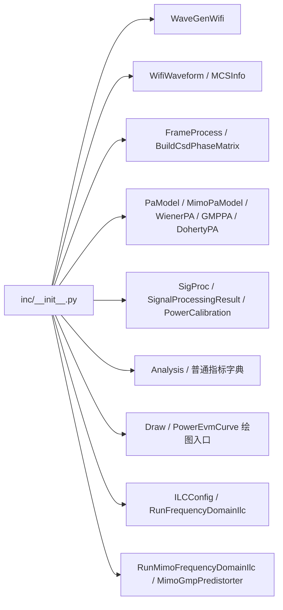
```mermaid
flowchart LR
    init["inc/__init__.py"] --> waveApi["WaveGenWifi"]
    init --> metadataApi["WifiWaveform / MCSInfo"]
    init --> frameApi["FrameProcess / BuildCsdPhaseMatrix"]
    init --> paApi["PaModel / MimoPaModel / WienerPA / GMPPA / DohertyPA"]
    init --> signalApi["SigProc / SignalProcessingResult / PowerCalibration"]
    init --> analysisApi["Analysis / 普通指标字典"]
    init --> drawApi["Draw / PowerEvmCurve 绘图入口"]
    init --> ilcApi["ILCConfig / RunFrequencyDomainIlc"]
    init --> mimoIlcApi["RunMimoFrequencyDomainIlc / MimoGmpPredistorter"]
```

**图示说明：**

- `inc/__init__.py` 是包的公共门面，不包含算法计算。
- 外部调用者可以从 `inc` 直接导入波形生成、PA、分析和频域ILC入口；基准测试入口位于 `tests.BenchMark`，明确与生产API隔离。
- 未在此处导出的下划线私有函数只供模块内部复用，避免将实现细节暴露为稳定接口。

## 802.11ac/ax/be 与 VHT/HE/EHT 支持范围

标准名称和 PHY 格式名称采用以下等效输入关系；`WifiWaveform.frameFormat` 始终返回右侧规范名称：

| 标准代际输入 | 等效 PHY 输入 | 规范化结果 |
| --- | --- | --- |
| `11ac`、`802.11ac` | `VHT` | `VHT` |
| `11ax`、`802.11ax` | `HE` | `HE` |
| `11be`、`802.11be` | `EHT` | `EHT` |

- 带宽：20、40、80、160 MHz。
- VHT MCS：0–9，即 BPSK、QPSK、16/64/256-QAM 及对应码率。
- EHT MCS：0–13，即 BPSK、QPSK、16/64/256/1024/4096-QAM 及对应码率。
- HE MCS：0–11，即 BPSK、QPSK、16/64/256/1024-QAM 及对应码率。
- VHT 字段：L-STF、L-LTF、L-SIG、VHT-SIG-A、VHT-STF、VHT-LTF、VHT-SIG-B、VHT-Data。
- EHT 字段：L-STF、L-LTF、L-SIG、RL-SIG、U-SIG、EHT-SIG、EHT-STF、EHT-LTF、EHT-Data。
- HE-SU 字段：L-STF、L-LTF、L-SIG、RL-SIG、HE-SIG-A、HE-STF、HE-LTF、HE-Data。
- VHT 数据子载波间隔为 312.5 kHz；20/40/80/160 MHz 分别使用 64/128/256/512 点基础 FFT，数据音调数为 52/108/234/468。
- HE/EHT 数据子载波间隔为 78.125 kHz；全带宽 RU 分别采用 242、484、996 和 2×996 tones。
- VHT 数据 GI 支持 0.4、0.8 μs；HE/EHT 支持 0.8、1.6、3.2 μs。
- VHT/HE/EHT 支持 1–8 条空间流和发射链，且 `numSpatialStreams <= numTransmitAntennas`。
- 每条空间流具有独立 QAM 与导频；支持 direct、DFT 和 Python API 自定义正交空间映射、每链 CSD 以及随空间维度增加的正交 LTF 训练。

完整 MCS 映射如下：

| MCS | 调制方式 | 码率 | 支持格式 |
| ---: | --- | ---: | --- |
| 0 | BPSK | 1/2 | VHT、HE、EHT |
| 1 | QPSK | 1/2 | VHT、HE、EHT |
| 2 | QPSK | 3/4 | VHT、HE、EHT |
| 3 | 16-QAM | 1/2 | VHT、HE、EHT |
| 4 | 16-QAM | 3/4 | VHT、HE、EHT |
| 5 | 64-QAM | 2/3 | VHT、HE、EHT |
| 6 | 64-QAM | 3/4 | VHT、HE、EHT |
| 7 | 64-QAM | 5/6 | VHT、HE、EHT |
| 8 | 256-QAM | 3/4 | VHT、HE、EHT |
| 9 | 256-QAM | 5/6 | VHT、HE、EHT |
| 10 | 1024-QAM | 3/4 | HE、EHT |
| 11 | 1024-QAM | 5/6 | HE、EHT |
| 12 | 4096-QAM | 3/4 | 仅 EHT |
| 13 | 4096-QAM | 5/6 | 仅 EHT |

波形用于 PA/DPD 激励与指标评估，载荷采用随机 post-FEC 比特。MIMO 的空间维度、正交映射、CSD 和多 LTF 结构可用于多链 PA/DPD 研究；它不包含可用于协议一致性测试的完整 LDPC 编解码、MAC/A-MPDU 组帧、标准 P 矩阵逐元素复刻或 SIG 字段逐比特编码。

## 参数参考

### 命令行参数

以下参数均由 `main.py` 支持；未指定参数时使用表中的默认值。

| 参数 | 可选值或类型 | 默认值 | 说明 |
| --- | --- | --- | --- |
| `-h`, `--help` | 开关 | — | 显示完整命令行帮助。 |
| `--format` | `VHT/11ac`、`HE/11ax`、`EHT/11be`，也接受 `802.11ac/ax/be` | `EHT` | 输入不区分大小写并规范化为 VHT、HE 或 EHT。 |
| `--bandwidth` | `20`、`40`、`80`、`160` | `80` | 信道带宽，单位 MHz。 |
| `--mcs` | VHT：`0–9`；HE：`0–11`；EHT：`0–13` | `9` | 调制编码方案索引；默认值对三种格式都有效。 |
| `--pa` | `rapp`、`wiener`、`gmp`、`doherty` | `wiener` | 非线性 PA 模型；Rapp为无记忆SSPA，Doherty使用载波与峰值双支路默认配置。 |
| `--tx-antennas` | `1–8` | `1` | VHT/HE/EHT 物理发射链及独立 PA 数量。 |
| `--spatial-streams` | 正整数且不大于发射链数 | `1` | 独立空间流数，VHT/HE/EHT 最大 8。 |
| `--spatial-mapping` | `direct`、`dft` | `direct` | 空间流到发射链的正交映射。自定义矩阵通过 Python API 设置。 |
| `--pa-input-power-db` | 逗号分隔浮点数 | 每路 `0` | 每路进入非线性 PA 前的独立驱动增益 dB，元素数必须等于发射链数。 |
| `--pa-output-power-db` | 逗号分隔浮点数 | 每路 `0` | 每路 PA 后的独立相对输出功率调整 dB。 |
| `--pa-output-power-dbm` | 逗号分隔 dBm 数值或 `none` | 使用全局20 dBm目标 | 独立覆盖每路PA绝对输出功率；`none` 使用全局目标，且不得超过额定极限。 |
| `--pa-output-rms` | 逗号分隔正数或 `none` | 每路 `none` | 旧接口：每路复包络输出 RMS 电压目标；不能与 `--pa-output-power-dbm` 同时使用。 |
| `--symbols` | 正整数 | `20` | 数据 OFDM 符号数。 |
| `--guard-interval` | `0.4`、`0.8`、`1.6`、`3.2` | `0.8` | VHT 使用 0.4/0.8 μs；HE/EHT 使用 0.8/1.6/3.2 μs。 |
| `--sample-rate-hz` | 正浮点数 | 未显式设置时由兼容参数推导 | 用户指定的复基带采样率，单位 Hz；提供后优先于 `--oversampling`。采样率必须使所选PHY的FFT、GI和传统前导时长对应整数采样点。 |
| `--oversampling` | `4`、`8` | `4` | 旧接口兼容项；仅在未提供 `--sample-rate-hz` 时按 `带宽×倍率` 推导采样率。 |
| `--width` | 非负整数 | 类内部默认 `16` | 同时写入WaveGenWifi、PA和Analysis的 `parameters`；`0`为浮点接口，正数为定点接口。 |
| `--output-power-dbm` | 不大于极限的有限浮点数 | `20 dBm` | 每路PA的目标平均输出功率。 |
| `--maximum-output-power-dbm` | 有限浮点数 | `25 dBm` | 每路PA的额定极限输出功率，也是0 dB输出回退参考。 |
| `--power-start-dbm` | 不大于极限的有限浮点数 | `10 dBm` | 功率-EVM扫描的起始PA输出功率。 |
| `--power-stop-dbm` | 大于起点且不大于极限 | `25 dBm` | 功率-EVM扫描的结束PA输出功率。 |
| `--load-resistance-ohm` | 正浮点数 | `50.0` | dBm 与复包络 RMS 电压换算所用的纯电阻端口，单位 Ω。 |
| `--power-points` | 不小于 2 的整数 | `7` | 在起止功率之间按等 dBm 间隔生成的扫描点数。 |
| `--skip-power-evm-curve` | 开关 | 关闭 | 跳过功率-EVM 扫描及 PNG/CSV/JSON 输出。 |
| `--iterations` | 正整数 | `8` | ILC 迭代次数。 |
| `--learning-rate` | `0 < μ < 2` | `0.15` | ILC 学习增益。 |
| `--regularization` | 正浮点数 | `1e-3` | 逆响应计算的正则化系数。 |
| `--max-amplitude` | 正浮点数 | `2.0` | ILC 学习输入和部署 DPD 输入的峰值限制。 |
| `--feedback-snr` | 浮点数或省略 | `None` | 反馈链 SNR，单位 dB；省略时使用无噪反馈。 |
| `--feedback-averages` | 正整数 | `1` | 每轮 ILC 重复采集并平均的反馈次数。 |
| `--seed` | `0–1023` 的整数 | `7` | Wi-Fi 数据、训练字段及相关随机过程的10 bit种子。 |
| `--output-dir` | 路径 | `results` | JSON、CSV、收敛历史和可选波形文件的输出目录。 |
| `--save-waveforms` | 开关 | 关闭 | 额外保存 `waveforms.npz`。 |

### `WaveGenWifi` 参数

当前构造函数签名为
`WaveGenWifi(parameters=None, width=None, **parameterOverrides)`。
调用方先构造实例，再调用 `Generate()`；帧格式、MCS、采样率等受支持配置既可直接使用关键字传入，也可放入 `parameters` 映射。

| 参数 | 类型或可选值 | 默认值 | 说明 |
| --- | --- | --- | --- |
| `parameters` | `Mapping` | `None` | 调用方只传需要修改的键；缺少的键由 `WaveGenWifi` 构造函数内部的不可变默认参数补齐。 |
| `width` | 非负整数 | `16` | 每个I或Q分量的对外位宽；`0`为浮点旁路，正数返回有符号整数码并在内部按 `2^(width-1)` 缩放。 |
| `frameFormat` | `"VHT"/"11ac"`、`"HE"/"11ax"`、`"EHT"/"11be"`，并接受带 `802.` 前缀的名称 | `"EHT"` | 不区分大小写；生成后规范化为 VHT、HE 或 EHT。 |
| `bandwidthMhz` | `20`、`40`、`80`、`160` | `80` | 信道带宽，单位 MHz。 |
| `mcs` | VHT：`0–9`；HE：`0–11`；EHT：`0–13` | `9` | MCS 索引；默认值对三种格式都有效。 |
| `numDataSymbols` | 1至4095 | `20` | 数据OFDM符号数；上限由接收解析描述字段的12位计数决定。 |
| `guardIntervalUs` | VHT：`0.4/0.8`；HE/EHT：`0.8/1.6/3.2` | `0.8` | 数据 GI，单位 μs。 |
| `sampleRateHz` | 正数或 `None` | `None` | 用户直接配置的复基带采样率，单位 Hz；`None` 时才使用旧 `oversampling` 推导。必须不低于信道带宽，并保证OFDM各时长对应整数采样点。 |
| `oversampling` | 正整数 | `4` | 旧接口兼容项；`sampleRateHz=None` 时采样率等于 `bandwidthMhz×1e6×oversampling`。生成后该属性表示实际采样率与带宽之比，允许为非整数。 |
| `seed` | `0–1023` 的整数 | `7` | 载荷、导频和训练字段的10 bit随机种子；描述字段用LDPC保护。 |
| `numTransmitAntennas` | `1–8` | `1` | VHT/HE/EHT 物理发射链数量；MIMO 输出矩阵的列数。 |
| `numSpatialStreams` | `1..numTransmitAntennas` | `1` | 独立 QAM、导频和训练流数量。 |
| `spatialMapping` | `"direct"`、`"dft"`、`"custom"` | `"direct"` | 每个子载波采用的空间映射方式。 |
| `spatialMappingMatrix` | 复矩阵或 `None` | `None` | 仅 custom 使用，形状为 `numTransmitAntennas × numSpatialStreams`，列必须正交归一。 |
| `cyclicShiftEnabled` | `bool` | `True` | 是否对各物理链施加格式相关的循环移位分集相位。 |

`Generate()` 返回 `WifiWaveform`。SISO 的 `samples` 是一维数组，MIMO 是 `samples × numTransmitAntennas` 矩阵；元数据还包含 `numSpatialStreams`、`spatialMappingMatrix`、`cyclicShiftsSeconds`、`ltfSymbolCount`、`seed`、`cyclicShiftEnabled` 及三维参考空间流星座。

`sampleRateHz` 是采样时钟的权威输入。例如：

```python
from inc.lib.WaveGenWifi import WaveGenWifi

wifiGenerator = WaveGenWifi(
    frameFormat="EHT",
    bandwidthMhz=20,
    sampleRateHz=50.0e6,
)
waveform = wifiGenerator.Generate()

assert waveform.sampleRateHz == 50.0e6
assert waveform.fftLength == 640
assert waveform.oversampling == 2.5
```

采样率与带宽的比值可以是非整数，但采样率必须让有效OFDM符号、GI和传统前导时长得到整数采样点。若未提供 `sampleRateHz`，旧 `oversampling` 参数仍可兼容现有调用。

### `PowerCalibration` 参数与方法（位于 `inc/utils/SigProc.py`）

当前构造函数签名为
`PowerCalibration(loadResistanceOhm=None, maximumOutputPowerDbm=None, paModel=None, parameters=None, width=None, **parameterOverrides)`。
该类同时支持归一化公开波形和物理电压波形。`maximumOutputPowerDbm` 定义每路PA输出参考面的额定功率上限；在归一化输出域中，有效区RMS等于1映射到该上限。目标功率对应的归一化**输出**RMS为

```math
A_{\mathrm{target}}
=
10^{(P_{\mathrm{target}}-P_{\max})/20}.
```

例如 `maximumOutputPowerDbm=25.0`、`outputPowerDbm=20.0` 时，$A_{\mathrm{target}}\approx0.5623$。它是功率检测器期望看到的PA输出RMS，并不是应该直接乘到发送波形上的PA输入驱动。PA增益、压缩和记忆都会改变输入输出关系，所以实际输入只能由闭环测量反求。请求目标不得超过额定上限；内置PA与Channel的解码后模拟驱动路径保证低于该上限的目标不会仅因公开定点码满量程而被误判为不可达。

物理电压模式约定复包络的RMS幅度等于电阻端口上的RF RMS电压，因此

```text
P(W) = Vrms² / R
P(dBm) = 10 log10(P(W) / 0.001)
```

| 参数 | 默认值 | 说明 |
| --- | --- | --- |
| `loadResistanceOhm` | `50.0` | PA 输入、输出端口的纯电阻负载，单位 Ω，必须为正数。 |
| `maximumOutputPowerDbm` | `25.0` | 每路PA额定极限输出功率；请求的输出功率不得超过此值。 |
| `outputPowerDbm` | `20.0` | `Calibrate(inputSignal)` 使用的SISO或各路共同目标输出功率。 |
| `outputPowerDbmPerChain` | `None` | MIMO逐路目标dBm；配置后优先于共同的 `outputPowerDbm`。 |
| `calibrationToleranceDb` | `0.25` | 每路实测PA输出功率与目标值允许的最大绝对误差；用户可按仪表精度收紧。 |
| `maximumCalibrationIterations` | `60` | 闭环功率校准最多允许的PA激励与测量次数。 |
| `calibrationLearningRate` | `0.8` | 尚未括住目标时，dB域功率误差转换为驱动修正量的比例。 |
| `maximumDriveAdjustmentDb` | `6.0` | 单轮隐藏驱动预设允许变化的最大dB值。 |
| `calibrationDigitalHeadroomDb` | `6.0` | 定点闭环公开I/Q码相对每分量满量程保留的数字余量，总体范围0至60 dB；默认6 dB对应约50.12%的峰值幅度。低位宽还必须保证峰值至少保留一个非零码，非法组合会报告该位宽的准确上限。剩余驱动放在解码后的隐藏模拟级，不通过越界码实现。浮点模式忽略此参数。 |
| `enableJointCalibration` | `False` | `True`时用逐链功率Jacobian联合更新MIMO驱动；Channel存在PA前耦合时可自动启用。 |
| `calibrationProbeStepDb` | `0.05` | 联合校准估计功率Jacobian时的单链探测步长，必须为正。 |
| `calibrationRegularization` | `1e-6` | 联合线性方程的正则化系数，必须为正。 |
| `activePowerThresholdDb` | `-60.0` | 相对每路峰值的有效样点功率门限；前后补零和低于门限的关断区不进入RMS。 |
| `activeGapToleranceSamples` | `16` | 填充有效区内部短低幅空洞的最大长度；更长静默区按占空比关断处理。 |
| `width` | `16` | 归一化公开波形的I/Q位宽；`0`为浮点，闭环定点校准要求至少2 bit，输入输出仍是整数I/Q码。 |

| 方法 | 参数 | 返回值或作用 |
| --- | --- | --- |
| `SetPaModel(paModel)` | 具有 `Process(inputSignal)` 的PA、测量适配器或绑定方法 | 绑定闭环被测对象并清除上一个PA的隐藏预设。绑定方法会从 `__self__` 自动发现位宽、成对drive协议和成对热事务协议；校准事务进行中禁止重绑，普通lambda无法自动暴露背后热状态，热PA应优先传对象。 |
| `Calibrate(inputSignal)` | 任意初始幅度的SISO/MIMO原始波形 | 若绑定对象支持热事务，先局部捕获原owner的成对方法并暂停热效应，再调用内部纯电闭环，最后用同一owner的方法在 `finally` 中恢复；不允许嵌套校准，定点模式仅在收敛后提交解码后的隐藏模拟drive。 |
| `CalibrateElectricalOnly(inputSignal)` | 仅内部使用 | 只实现闭环数值迭代，不自行管理温度；事务外直接调用会抛出 `RuntimeError`，用户必须使用 `Calibrate`。 |
| `GetLastPaInput()` | 无 | 返回最后一次收敛的公开数字输入副本。定点Channel路径中它位于解码和隐藏模拟驱动之前，不等于真正进入PA晶体管的复包络。 |
| `GetLastPaOutput()` | 无 | 返回闭环最后一次PA实测输出，无需重复激励PA。 |
| `GetLastCalibrationMetrics()` | 无 | 成功或至少得到一次有效测量后，返回目标、最佳实测功率、误差、迭代次数和 `converged`；实现成对trial/commit协议的适配器还返回 `analogDriveDbPerChain`，浮点路径中的0 dB表示总drive已由公开波形承担；失败时增加 `failureReason`。 |
| `DbmToRms(powerDbm)` | 任意有限 dBm 数值 | 返回该功率在所配置端口上的复包络 RMS 电压。 |
| `RmsToDbm(signalRms)` | 正的有限 RMS 电压 | 返回对应的绝对功率 dBm。 |
| `OutputPowerToDriveScale(outputPowerDbm)` | 不大于极限的输出dBm | 按额定输出回退量返回归一化目标输出RMS；它只可作为首次输入试探的近似比例，不是闭环求得的PA输入驱动。 |
| `NormalizedRmsToOutputPowerDbm(normalizedRms)` | 正的归一化有效区RMS | 按额定满量程功率返回对应输出dBm。 |
| `FindActiveSampleMask(inputSignal)` | 任意一致线性尺度的波形 | 逐链返回有效突发布尔掩码，排除前后补零和长静默，保留短过零间隙。 |
| `CalculateActiveRmsPerChain(inputSignal)` | 单路或多路波形 | 仅用每路有效样点能量与样点数计算RMS。 |
| `CalibrateWaveformToOutputPower(inputSignal, outputPowerDbm)` | 任意初始幅度公开波形、共同目标 | 兼容性数值接口：不经过PA测量，直接重标定波形；不能用于设定真实PA压缩工作点。 |
| `CalibrateWaveformToOutputPowers(inputSignal, outputPowerDbmPerChain)` | 任意初始幅度公开波形、逐链目标 | 上述兼容接口的MIMO版本，不用于主流程或Benchmark。 |
| `ScaleSignalToOutputPower(signal, outputPowerDbm)` | 物理电压波形、每路目标dBm | 按有效区RMS用常数增益把单路或全部链标定到相同目标输出功率。 |
| `ScaleSignalToOutputPowers(signal, outputPowerDbmPerChain)` | 物理电压波形、逐链目标 | 按端口阻抗分别标定每路物理电压输出。 |
| `GetParameters()` | 无 | 返回当前解析参数。 |
| `UpdateParameters(**parameterOverrides)` | 支持的任意配置 | 事务式更新覆盖层。 |

定点闭环采用以下参考面顺序：

```text
公开整数I/Q码（默认6 dB数字余量）
    -> DecodeComplex
    -> 隐藏逐链模拟驱动
    -> Tx I/Q
    -> PA前耦合
    -> PA
    -> 有效突发功率检测
```

闭环失败时，异常会同时给出目标功率、找到的最佳实测功率、最佳误差、已执行迭代数和失败原因。只要曾获得有效测量，随后仍可用 `GetLastCalibrationMetrics()` 读取 `converged=False`、`failureReason` 和最佳测量；失败不会提交试探驱动，也不会让 `GetLastPaInput()` 或 `GetLastPaOutput()` 冒充已收敛结果。对于没有实现解码后模拟驱动接口的第三方定点plant，代码保留旧式全数字兼容路径；若连续试探得到相同满量程码，会明确指出数字满量程和适配器能力限制。

`PowerCalibration` 是Channel内部复用的底层工具。普通用户不需要主动构造它，推荐把原始波形与目标输出功率直接交给Channel：

```python
from inc.lib.Channel import Channel


channel = Channel(
    paModel=paModel,
    parameters={
        "maximumOutputPowerDbm": 25.0,
        "width": 0,
    }
)
chOut, fbOut = channel.Process(
    inputWaveform,
    outputPowerDbm=22.0,
)
digitalTxInputWaveform = channel.GetLastPaInput()
txModulatorOutput = channel.GetLastTransmitterOutput()
actualPaInputWaveform = channel.GetLastActualPaInput()
referenceCalibrationPaOutput = channel.GetLastPaOutput()
calibrationMetrics = channel.GetLastCalibrationMetrics()
```

三个输入参考面不能混用：`digitalTxInputWaveform` 是隐藏模拟驱动之前的公开数字波形；`txModulatorOutput` 已经过隐藏模拟驱动和Tx I/Q，但尚未经过PA前耦合；`actualPaInputWaveform` 还包含PA前耦合，是实际进入各路PA模型的浮点复包络。定点模式下即使前者的公开码保持不变，后两者也会随闭环提交的 `analogDriveDbPerChain` 改变。

MIMO独立功率直接调用 `chOut, fbOut = channel.Process(inputWaveform, outputPowerDbm=(22.0, 21.0, 20.0, 19.0))`。只有开发新的PA测量适配器或单独调试功率检测器时，才需要直接使用底层的 `PowerCalibration.Calibrate(inputSignal)`；这个直接入口同样自动保护热状态。启用温度模型时，`referenceCalibrationPaOutput` 和 `calibrationMetrics` 属于暂停温度影响后的参考校准面；函数返回的两项才经过恢复温度后的同一次真实PA/热周期，实际热态输出功率从 `channel.GetThermalMetrics()` 读取。最终Analysis用 `chOut`，DPD/ILC训练用 `fbOut`；需要板载反馈训练时先显式设置 `sampleMode="fb"`，否则第二项是前向副本。温度开关不会清零已提交的模拟drive；比较启用与关闭温度时应保持drive相同，或按同一目标功率规则重新校准。

例如在 50 Ω 端口上，`0 dBm = 1 mW` 对应约 `0.223607 V RMS`。对于带占空比的记录，本工程报告Wi-Fi突发开启期间的平均功率：若有效突发占整段采集的50%，整段平均会额外低3.01 dB，但该关断时间不会进入校准或Analysis的RMS分母。完整门限、短空洞闭合和定点搜索公式见 [SigProc.md](doc/SigProc.md#131-有效信号区间与占空比)。

### `PaModel` 参数

当前构造函数签名为
`PaModel(modelName=None, rappConfig=None, wienerConfig=None, gmpConfig=None, dohertyConfig=None, thermalConfig=None, parameters=None, width=None, **parameterOverrides)`。
模型参数既可以直接传入，也可以放入 `parameters` 映射；直接参数优先级更高。

| 参数 | 类型或可选值 | 默认值 | 说明 |
| --- | --- | --- | --- |
| `parameters` | `Mapping` | `None` | 调用方只传需要修改的键；缺少的键由 `PaModel` 构造函数内部的不可变默认参数补齐。 |
| `width` | 非负整数 | `16` | PA输入、输出I/Q接口位宽；`0`为浮点，正数返回I/Q整数码，容器仍为 `complex128`。 |
| `modelName` | `"rapp"`、`"wiener"`、`"gmp"`、`"doherty"`，不区分大小写 | `"wiener"` | 选择内部PA实现。 |
| `rappConfig` | `RappConfig` 或 `None` | `None` | 无记忆Rapp模式配置；`None`使用默认配置。 |
| `wienerConfig` | `WienerConfig` 或 `None` | `None` | Wiener 模式的配置；`None` 使用默认配置。 |
| `gmpConfig` | `GMPConfig` 或 `None` | `None` | GMP 模式的配置；`None` 使用默认配置。 |
| `dohertyConfig` | `DohertyConfig` 或 `None` | `None` | Doherty载波/峰值双支路配置；`None`使用默认架构。 |
| `thermalConfig` | `ThermalConfig` 或 `None` | `None` | 可选PA自热、占空比、热网络和温度电参数漂移；`None`或 `enabled=False` 都是硬关闭，并清除旧热网络、热metrics和互热offset。 |

`RappConfig` 支持：

| 参数 | 默认值 | 约束或含义 |
| --- | --- | --- |
| `linearGain` | `1.0` | 有限正数；小信号电压增益。 |
| `saturationAmplitude` | `1.0` | 有限正数；输入压缩膝点幅度标尺。 |
| `rappSmoothness` | `3.0` | 有限正数；软压缩过渡平滑度，常用起点为2至3。 |

`WienerConfig` 支持：

| 参数 | 默认值 | 约束或含义 |
| --- | --- | --- |
| `linearTaps` | `(1+0j, 0.055-0.025j, -0.018+0.012j)` | 非空复数 FIR 系数元组。 |
| `linearGain` | `1.0` | 正数；线性增益。 |
| `saturationAmplitude` | `1.0` | 正数；Rapp 饱和幅度。 |
| `rappSmoothness` | `3.0` | 正数；Rapp 平滑度。 |
| `ampmCoefficient` | `0.18` | AM-PM 相位旋转强度。 |

`GMPConfig` 支持：

| 参数 | 默认值 | 约束或含义 |
| --- | --- | --- |
| `nonlinearOrders` | `(1, 3, 5, 7)` | 非空正奇数阶元组；默认生成器会对含一阶的非默认集合共同缩小非线性稳态项以保持0至2内单调，未知高阶默认值为0；无一阶集合只启用最低阶后备项。 |
| `memoryDepth` | `3` | 正整数；主分支记忆深度。 |
| `crossMemoryDepth` | `2` | 非负整数；交叉包络记忆深度。 |
| `mainCoefficients` | `None` | 主项系数字典，键为 `(order, memoryIndex)`；`None` 使用内置Rapp型拟合系数，并自动抵消默认记忆项对稳态曲线的重复贡献。 |
| `laggingCoefficients` | `None` | 滞后交叉项字典，键为 `(order, memoryIndex, crossIndex)`；`None` 生成 $C_p(-0.060+j0.025)(0.22)^m(0.42)^l$。 |
| `leadingCoefficients` | `None` | 超前交叉项字典，键为 `(order, memoryIndex, crossIndex)`；`None` 生成 $C_p(0.040-j0.018)(0.22)^m(0.42)^l$。 |

`DohertyConfig` 支持：

| 参数 | 默认值 | 约束或含义 |
| --- | --- | --- |
| `carrierModelName` | `"wiener"` | Carrier支路选择Wiener或GMP。 |
| `peakingModelName` | `"wiener"` | Peaking支路选择Wiener或GMP。 |
| `carrierWienerConfig`、`carrierGmpConfig` | `None` | Carrier支路对应模型配置。 |
| `peakingWienerConfig`、`peakingGmpConfig` | `None` | Peaking支路对应模型配置。 |
| `carrierInputGain` | `1.0` | Carrier正输入电压增益。 |
| `peakingInputGain` | `1.0` | Peaking正输入电压增益。 |
| `peakingTurnOnAmplitude` | `0.45` | Peaking开始导通的归一化包络。 |
| `peakingTransitionWidth` | `0.15` | 从关闭到完全导通的平滑包络宽度。 |
| `carrierCombineCoefficient` | `1+0j` | Carrier复功率合成系数，不能为零。 |
| `peakingCombineCoefficient` | `0.5+0j` | Peaking复功率合成系数。 |
| `peakingDelaySamples` | `0` | Peaking支路非负整数时延。 |
| `loadModulationStrength` | `0.10` | Carrier包络相关简化负载调制强度。 |

`PaModel.Process(inputSignal)` 返回 PA 复基带输出；`SmallSignalGain()` 返回当前模型的 DC 小信号复增益。
Rapp、Wiener、GMP、Doherty 的静态增益曲线定义、1 dB 压缩点推导、每一个配置值对曲线的移动或变形方式、外部 dBm 工作点与模型曲线的区别，以及恒包络扫幅示例，见
[PaModel.md：配置时如何读取和调节增益曲线](doc/PaModel.md#49-配置时如何读取和调节增益曲线)。

`ThermalConfig` 支持静态温度角、单RC和多极点Foster。完整内容见 [PaModel电热模型](doc/PaModel.md#13-pa电热模型功率占空比与输出漂移)：其中分别推导了静态角、单RC、Foster、Cauer、温度条件化GMP和神经网络电热模型，并直接展示热阻、时间常数、Foster支路、更新间隔、效率上下界、效率膝点、占空比、空闲功耗、温度电参数和MIMO互热的参数效果图。普通温度测试直接调用 `channel.Process(rawSignal, outputPowerDbm=...)`；Channel内部自动隔离校准热量并在恢复温度后真实发射。只有需要显式重设起始结温，或在同一Channel实例中复用冻结的“公开码+已提交模拟drive”时，才调用 `PrepareThermalTest(...)`。

三种已实现热模型均提供可直接运行的完整推荐预设；推荐值是25 dBm级行为仿真的起点，正式器件仍应由热瞬态、DC效率和多温度I/Q实测替换：

| 调用 | 关键模型推荐值 | 适用场景 |
|---|---|---|
| `ThermalConfig.Recommended("static", sampleRateHz=...)` | 固定结温 `55` 摄氏度；建议另扫 `25/55/85`；R与时间常数使用不参与动态的 `(1.0,)` 占位 | 温箱定点或固定温度敏感性 |
| `ThermalConfig.Recommended("single_rc", sampleRateHz=...)` | `R=(20.0,)` 摄氏度/W，`tau=(20e-3,)` s | 最小动态自热验证和单膝点热瞬态 |
| `ThermalConfig.Recommended("foster", sampleRateHz=...)` | `R=(2.0,8.0,20.0)` 摄氏度/W，`tau=(50e-6,5e-3,0.5)` s | 快、中、慢多时间尺度；默认动态推荐 |

三套预设还完整设置 `enabled=True`、真实 `sampleRateHz`、25摄氏度环境与参考温度、256样点热更新、0.15 W空闲耗散、10%至45%功率相关效率、15 dBm效率膝点、25 dBm物理参考输出、-60 dB活动门限、四个温度电参数系数和150摄氏度仿真停止上限。全部21个字段的逐模型推荐值、敏感性范围、替换规则、MIMO互热起点，以及Cauer/温度条件化GMP/神经电热扩展建议见 [ThermalConfig完整推荐表](doc/PaModel.md#1371-三种已实现模型的完整推荐值)。仅修改 `modelName="single_rc"` 不会自动把默认三支Foster向量变成单支，因此应使用 `Recommended` 或同时显式配置单元素R/时间常数向量。

把推荐起点替换为真实器件参数时，请按“校准温度参考面与RF/DC功率 → 拟合空闲耗散和效率 → 拟合单RC或Foster热网络 → 拟合四个温度电参数 → 用留出功率、占空比和温度点验证”的顺序执行。完整接线、TSEP标定、NumPy拟合代码和一套测量值回填示例见 [PA温度特性实测与模型辨识](doc/PaThermalMeasurement.md)。

`MimoPaModel(parameters=None, width=None, **parameterOverrides)` 在构造函数内部使用 `ChainMap` 管理以下参数：

| 参数 | 默认值 | 说明 |
| --- | --- | --- |
| `numTransmitChains` | `1` | 独立 PA 数，范围 1–16。 |
| `width` | `16` | 整个输入矩阵和每路输出的I/Q整数码位宽；内部每路PA解码后仍用浮点计算。 |
| `paParametersPerChain` | `None` | 每路一个普通 `PaModel` 覆盖字典；`None` 表示每路使用 `PaModel` 内部默认值。 |
| `inputPowerDbPerChain` | `None` | 每路输入驱动 dB；`None` 展开为全 0。 |
| `outputPowerDbPerChain` | `None` | 每路相对输出 dB；`None` 展开为全 0。 |
| `targetOutputPowerDbmPerChain` | `None` | 每路绝对输出功率 dBm 或 `None`；整个参数为 `None` 时全部禁用。 |
| `loadResistanceOhm` | `50.0` | 绝对 dBm 目标与实测输出功率换算所用的端口电阻。 |
| `maximumOutputPowerDbm` | `25.0` | 每路PA输出参考面的额定上限；绝对目标不得超过该值。 |
| `thermalCouplingCPerW` | `None` | 可选“受热链×热源链”互热阻矩阵，单位摄氏度/W；对角线由代码置零。 |
| `targetOutputRmsPerChain` | `None` | 旧接口：每路复包络输出 RMS 电压或 `None`；同一链不能同时设置 RMS 与 dBm 目标。 |

`Process(inputSignal)` 对输入矩阵逐列处理；`ProcessChain(inputSignal, chainIndex)` 供单路测量或 ILC 使用；`SetOutputPowerDb`、`SetTargetOutputPowerDbm` 可在运行时只修改一路；`GetOutputPowerDbmPerChain` 返回最近一次矩阵处理测得的各路绝对功率。`SetTargetOutputRms` 和 `GetOutputRmsPerChain` 仅作为旧接口保留。

PA 辅助接口还包括：

| 接口 | 参数 | 默认值或说明 |
| --- | --- | --- |
| `WienerPA(config)` | `config` | 默认使用 `WienerConfig()`；通常建议通过 `PaModel` 构造。 |
| `GMPPA(config)` | `config` | 默认使用 `GMPConfig()`；通常建议通过 `PaModel` 构造。 |
| `DohertyPA(config)` | `config` | 默认使用 `DohertyConfig()`；内部组合Carrier与Peaking行为模型。 |
| `IQImbalancePA(paModel, directCoefficient, imageCoefficient)` | `paModel`、直通系数、镜像系数 | `directCoefficient=1+0j`，`imageCoefficient=0.045·exp(j·0.35)`。 |
| `AddAwgn(inputSignal, snrDb, randomGenerator)` | 输入、反馈 SNR、NumPy 随机数生成器 | `snrDb=None` 时原样复制输入，否则加入复高斯白噪声。 |

### `Channel` 参数与方法

构造函数为：

```python
Channel(paModel=None, parameters=None, width=None, **parameterOverrides)
```

Channel参数按物理模块分类如下，避免把真实Tx失真和FB观测误差混为一类。

#### Channel公共采样与接口参数

| 参数 | 默认值 | 说明 |
| --- | --- | --- |
| `sampleMode` | `"forward"` | 公开 `Process` 始终返回 `(chOut, fbOut)`；`forward` 令第二项成为第一项的数值相同副本并绕过FB链，`fb` 令第二项经过完整反馈链。兼容单输出接口仍按该值选路。 |
| `sampleRateHz` | `1.0` | CFO、SFO、时延和物理时间换算所用采样率。 |
| `phaseDegrees` | `0` | PA后的公共固定移相，仅允许 `-90`、`0`、`90` 度。 |
| `width` | `16` | 公开I/Q位宽；`0`为浮点，正值为整数码。 |

#### Channel周期热调度参数

| 参数 | 默认值 | 说明 |
| --- | --- | --- |
| `thermalRunMode` | `"steady_state"` | `"steady_state"`解周期首尾温度闭合轨迹；`"transient"`从当前热状态推进一周期。 |
| `thermalDutyCycle` | `1.0` | 输入数组所表示的完整数据窗时长与周期时长之比，取值范围 `(0, 1]`；不扣除数据窗内部静默样点。 |
| `thermalSteadyStateToleranceC` | `1e-4` | 稳态求解时每个热支路允许的周期首尾闭合误差，单位摄氏度。 |
| `maximumThermalSteadyStateIterations` | `100` | 温度依赖耗散功率及MIMO互热固定点的最大迭代次数。 |

设输入数据窗时长为 $T_{\mathrm{data}}$，配置占空比为 $D_{\mathrm{cfg}}$，则Channel自动在该窗后模拟一段不追加到返回数组的外部空闲：

```math
T_{\mathrm{period}}
=
\frac{T_{\mathrm{data}}}{D_{\mathrm{cfg}}},
\qquad
T_{\mathrm{idle,outer}}
=
T_{\mathrm{data}}
\left(
\frac{1}{D_{\mathrm{cfg}}}-1
\right).
```

若数据窗内只有比例 $D_{\mathrm{wave}}$ 的样点高于PA热模型活动门限，实际整周期RF占空比为：

```math
D_{\mathrm{actual}}
=
D_{\mathrm{cfg}}D_{\mathrm{wave}}.
```

`GetActualDutyCycle(inputSignal)` 在定点解码、已提交模拟drive、Tx I/Q和PA前耦合之后的真实PA入口参考面预计该值；即使热模型关闭，也会使用Channel的 `activePowerThresholdDb` 逐链分类，而不是返回伪0。完成一次热周期处理后，无参形 `GetActualDutyCycle()` 直接读回已提交metrics。

启用任意PA热模型后，`Channel.ValidateThermalReferencePlanes()` 会在功率校准和周期处理之前强制三个跨模块参考面一致：Channel `sampleRateHz` 等于每路 `ThermalConfig.sampleRateHz`，Channel `maximumOutputPowerDbm` 等于每路 `ThermalConfig.referenceOutputPowerDbm`，Channel与每路热PA的 `activePowerThresholdDb` 相等。任一链不一致都会在校准状态提交前报错，防止时间、实际瓦特和RF活动区采用不同定义。

#### Channel Tx I/Q调制器参数

| 参数 | 默认值 | 说明 |
| --- | --- | --- |
| `txIqImbalanceEnabled` | `True` | Tx I/Q模块硬开关；`False` 时整级旁路增益误差、相位误差和 `txDcOffset`。 |
| `txIqGainImbalanceDb` | `0.0` | PA前Tx I/Q增益比误差；forward与fb均受影响。 |
| `txIqPhaseImbalanceDegrees` | `0.0` | PA前Tx正交相位误差。 |
| `txDcOffset` | `0+0j` | PA前Tx复直流或LO泄漏项。 |

#### Channel PA耦合参数

| 参数 | 默认值 | 说明 |
| --- | --- | --- |
| `prePaCouplingPaths` | `None` | Tx I/Q之后、PA之前的多通道串扰路径。 |
| `postPaCouplingPaths` | `None` | PA之后、采样分支之前的串扰路径。 |

#### Channel FB线性与同步参数

| 参数 | 默认值 | 说明 |
| --- | --- | --- |
| `fbGainDb` / `fbPhaseDegrees` | `0.0` | fb接收链公共增益和相位。 |
| `fbFirTaps` | `None` | fb因果复FIR；`None`为单位抽头。 |
| `fbIntegerDelaySamples` / `fbFractionalDelaySamples` | `0` / `0.0` | fb整数和分数时延。 |
| `fbCarrierFrequencyOffsetHz` | `0.0` | fb载波频偏。 |
| `fbSamplingFrequencyOffsetPpm` | `0.0` | fb采样频偏。 |

#### Channel FB I/Q解调器参数

| 参数 | 默认值 | 说明 |
| --- | --- | --- |
| `fbIqImbalanceEnabled` | `True` | FB I/Q模块硬开关；`False` 时整级旁路增益误差、相位误差和 `fbDcOffset`。 |
| `fbIqGainImbalanceDb` | `0.0` | 只污染fb观测的I/Q增益比误差。 |
| `fbIqPhaseImbalanceDegrees` | `0.0` | 只污染fb观测的正交相位误差。 |
| `fbDcOffset` | `0+0j` | fb接收机复直流偏置。 |

#### Channel 0°/90°反馈I/Q补偿参数

| 参数 | 默认值 | 说明 |
| --- | --- | --- |
| `fbIqCompensationMode` | `"none"` | `none`返回raw单状态；`phase_pair`执行两状态分离并缓存逆FIR；`filter`只采第一状态并应用当前缓存。 |
| `fbPhasePairResponses` | `(1+0j, 0+1j)` | I/Q mixer输入处0°/90°相位状态的两个实测复响应；必须有限、非零且相对相位不能为0°或180°。 |
| `fbIqCompensationFilterLength` | `1` | 直接和共轭逆FIR各自的正整数抽头数。 |
| `fbIqCompensationRegularization` | `1e-6` | 有限正数；按基函数平均能量缩放的岭回归系数。 |

`phase_pair` 必须与 `sampleMode="fb"` 一起使用；它从同一个已完成的PA输出生成两次FB接收采样，接收噪声和ADC各自独立，但PA、记忆状态和热周期只运行一次。成功后只把 `fbIqCompensationMode` 改成 `"filter"`，缓存会保留；替换PA对象，或修改公共相位、确定性FB链、I/Q/DC、相位响应、FIR控制、ADC或公开 `width`，会使缓存失效。`filter` 不会在缺少标定时静默运行。`GetLastFeedbackPhasePair()` 和 `GetFeedbackIqCalibrationMetrics()` 分别读取最近原始相位对与镜像比/拟合NMSE/条件数诊断。

两个开关互相独立，默认均为 `True` 以保持原有配置行为。下面的配置保留非零误差参数但只关闭Tx I/Q；因此PA激励不再含Tx镜像或Tx DC，而在显式 `sampleMode="fb"` 时，fb采样仍会加入FB镜像与FB DC。关闭开关不需要把各误差参数逐项清零，稍后重新置 `True` 时原配置仍可复用。

```python
from inc.lib.Channel import Channel

channel = Channel(
    parameters={
        "sampleMode": "fb",
        "txIqImbalanceEnabled": False,
        "txIqGainImbalanceDb": 0.5,
        "txIqPhaseImbalanceDegrees": 3.0,
        "txDcOffset": 0.01 + 0.002j,
        "fbIqImbalanceEnabled": True,
        "fbIqGainImbalanceDb": 0.3,
        "fbIqPhaseImbalanceDegrees": 2.0,
        "fbDcOffset": -0.002 + 0.001j,
    }
)
```

#### Channel FB非线性与ADC参数

| 参数 | 默认值 | 说明 |
| --- | --- | --- |
| `fbThirdOrderCoefficient` | `0+0j` | fb接收机三阶复非线性。 |
| `fbClipAmplitude` | `None` | fb复包络径向限幅。 |
| `fbAdcWidth` / `fbAdcFullScale` | `None` / `1.0` | fb内部ADC位宽和I/Q满量程。 |

#### Channel接收噪声参数

| 参数 | 默认值 | 说明 |
| --- | --- | --- |
| `noiseAmpMv` / `noisePwrDbm` / `noiseSnrDb` | `None` | 三种互斥噪声强度配置。 |
| `randomSeed` | `1701` | 固定非负整数使噪声序列可复现。 |

#### Channel功率检测与校准参数

| 参数 | 默认值 | 说明 |
| --- | --- | --- |
| `loadResistanceOhm` / `maximumOutputPowerDbm` | `50.0` / `25.0` | 端口阻抗，以及每路PA输出参考面的额定上限和归一化dBm标尺。 |
| `calibrationToleranceDb` / `maximumCalibrationIterations` | `0.25` / `60` | 功率误差容限与最大迭代数。 |
| `calibrationLearningRate` / `maximumDriveAdjustmentDb` | `0.8` / `6.0` | dB域更新比例与单轮最大调整。 |
| `calibrationDigitalHeadroomDb` | `6.0` | 定点公开I/Q码相对每分量满量程的余量；闭环把剩余增益放到解码后的模拟驱动级。 |
| `jointPowerCalibration` | `None` | 有PA前耦合时自动选择联合校准。 |
| `calibrationProbeStepDb` / `calibrationRegularization` | `0.05` / `1e-6` | MIMO Jacobian探测和正则化。 |
| `activePowerThresholdDb` / `activeGapToleranceSamples` | `-60.0` / `16` | 有效突发检测门限和短间隙闭合。 |

#### Channel配置值影响速查

| 模块 | 推荐仿真起点 | 配置值怎样产生影响 |
| --- | --- | --- |
| Tx I/Q | `txIqImbalanceEnabled=True`，`0.3 dB`、`2 degree` | 开关为True时，增益和相位误差变成共轭镜像系数并在PA前注入；约对应 `-35 dBc` 量级的单项 `irrDb`，forward与fb都会变差。False时增益、相位和DC整级旁路。 |
| FB I/Q | `fbIqImbalanceEnabled=True`，`0.3 dB`、`2 degree` | 开关为True时使用相同镜像公式，但只污染fb观测；forward结果不变。False时增益、相位和DC整级旁路。 |
| FB I/Q补偿 | 先 `phase_pair`，再 `filter`；`L=1`、`1e-6` | 相位对从I/Q mixer前旋转PA输出低功率观测支路，分离直接/镜像并拟合广义线性逆FIR；实时filter只需单状态。抽头增多可处理频率选择性镜像但更易病态，岭值增大更稳定但偏差更大。 |
| 通道耦合 | `-30 dB` | 电压泄漏为 `10^(-30/20)=3.16%`；PA前耦合还会进入非线性。 |
| FB CFO | `500 Hz`功能验证、`5 kHz`压力测试 | 累计相位为 `2π·CFO·观测时间`；帧越长旋转越明显。 |
| FB SFO | `5 ppm`功能验证、`50 ppm`压力测试 | 经过N点累计漂移约 `N·ppm·1e-6` 个样点。 |
| FB三阶项 | `-0.01+0.003j` | 相对三阶幅度按 `|c3|·A²` 增长；信号幅度翻倍时相对失真约增加12 dB。 |
| FB ADC | `12...14 bit` | 位宽每增加1 bit，理想量化SNR约改善6 dB；满量程过小削顶、过大量化变粗。 |
| 接收噪声 | `noiseSnrDb=40` | 仅白噪声限制下，EVM地板约为 `-40 dB`。 |
| 功率校准 | 容差 `0.1...0.25 dB`、学习率 `0.5...0.8`、数字余量 `6 dB` | 学习率增大可加快更新但可能振荡；容差增大更易停止但允许更大功率误差；余量增大可降低OFDM峰值削顶风险，但会减少定点有效码利用率。 |
| 周期热调度 | `steady_state`、`thermalDutyCycle=1.0` | 占空比降低会自动增加窗外冷却时间；数据窗内的长静默会继续降低实际RF占空比。稳态模式直接求周期固定点，瞬态模式保留启动过程。 |

完整的推导、分级数值表、DC泄漏、耦合比例、CFO/SFO累计误差、ADC步长和三套可直接使用的配置见 [Channel配置值选择说明](doc/Channel.md#69-配置值如何进入模型以及怎样选择)。

`Process(inputSignal, outputPowerDbm=None)` 执行“Tx I/Q→PA前耦合→不同PA→PA后耦合→前向主路”的完整链路，并返回 `(chOut, fbOut)`。默认稳态热模式的首次调用不能省略 `outputPowerDbm`；成功后可省略，但Channel会复用缓存目标并仍在每次调用重做PA功率设定。`sampleMode="forward"` 时第二项直接复制第一项，因而所有FB参数都被绕过；`sampleMode="fb"` 时第二项才从同一次PA/热周期进入完整反馈链。Tx I/Q参数位于PA之前并影响两种模式；FB I/Q参数仅在 `sampleMode="fb"`、`fbIqImbalanceEnabled=True` 时影响raw接收机，而相位对或filter可从训练观测中去嵌入其共轭镜像。`outputPowerDbm` 始终指干净PA物理输出，不是raw或补偿后 `fbOut` 的表观功率。`ProcessPaOutput(paOutputSignal)` 从已有PA输出开始，是由 `sampleMode` 选路的兼容单输出入口。详细参考面、系数公式、缓存规则和先标定后filter示例见 [Channel.md](doc/Channel.md)。

典型的“先标定、后单采样”调用只在两次处理之间修改模式：

```python
channel.UpdateParameters(
    sampleMode="fb",
    fbIqCompensationMode="phase_pair",
    fbPhasePairResponses=(1.0 + 0.0j, 0.02 + 0.98j),
    fbIqCompensationFilterLength=3,
    fbIqCompensationRegularization=1.0e-6,
)
calibrationChOut, separatedFbOut = channel.Process(
    rawSignal,
    outputPowerDbm=20.0,
)
print(channel.GetFeedbackIqCalibrationMetrics())

# Keep every calibration-sensitive parameter unchanged.
channel.UpdateParameters(fbIqCompensationMode="filter")
measurementChOut, filteredFbOut = channel.Process(
    nextRawSignal,
    outputPowerDbm=20.0,
)
```

用 `filteredFbOut` 做DPD/ILC训练，用 `measurementChOut` 做最终Analysis。相位对处理和缓存FIR都不参与 `PowerCalibration`：20 dBm目标仍在无热、无接收链非理想的干净PA参考面闭环。

诊断接口的参考面也彼此独立：`GetLastPaInput()`为兼容旧名称而保留，返回定点解码和隐藏模拟驱动之前的公开数字输入；`GetLastTransmitterOutput()`返回经过模拟驱动与Tx I/Q之后、PA前耦合之前的波形；`GetLastActualPaInput()`返回耦合后真正进入PA的波形。不要把三者混作同一个DPD训练标签。

温度测试的推荐入口仍是 `Process(inputSignal, outputPowerDbm=...)`：默认稳态模式每次都先校验三个热参考面，再由 `PowerCalibration.Calibrate` 通过Channel代理暂停热网络完成参考温度校准，在 `finally` 中恢复热状态后用周期首尾闭合的温度曲线处理数据窗，并在窗后自动模拟配置占空比对应的空闲。活动配置在校准期间被改成 `enabled=False` 时，以硬关闭为准，旧快照不会重新打开温度。`GetActualDutyCycle` 报告扣除数据窗内部静默后的实际RF占空比；`GetThermalMetrics()` 返回周期首、数据尾和周期尾温度、轨迹、耗散、收敛误差、自然漂移后功率与累计时间。`steadyStateConverged` 只有稳态求解收敛才为 `True`；瞬态模式固定为 `False`，表示该指标不适用而不是运行失败。`AdvanceThermalIdle` 只用于调度周期之外的额外空闲。详见 [Channel周期热运行、自动校准与诊断](doc/Channel.md#10-channel内置无热校准与温度测试)。

| 周期热接口 | 用法 | 结果 |
| --- | --- | --- |
| `Process(rawSignal, outputPowerDbm=target)` | 稳态首次必须传目标；之后可省略并复用最近成功目标 | 每次参考温度功率设定后只提交一个周期，返回 `(chOut, fbOut)` |
| `ValidateThermalReferencePlanes()` | 校准前自动调用，也可手动诊断 | 返回启用链metrics元组；不匹配则不提交校准 |
| `GetActualDutyCycle(rawSignal)` | 处理前预计 | SISO浮点值或MIMO逐链元组 |
| `GetActualDutyCycle()` | 处理后查询 | 最近已提交周期的 `actualDutyCycle` |
| `GetThermalMetrics()` | 处理后查询 | SISO字典，或包含 `chains` 和 `mutualHeating` 的MIMO字典 |

### `SigProc` 参数与方法

构造函数 `SigProc(referenceSignal, sampleRateHz, parameters=None, **parameterOverrides)` 保存已知参考和采样率；全部默认值定义在构造函数内部，调用方只传覆盖字典。

| 配置参数 | 默认值 | 说明 |
| --- | --- | --- |
| `enableIntegerDelayCompensation` | `True` | 估计并补偿整数样点时延。 |
| `enableFractionalDelayCompensation` | `True` | 估计并补偿 `[-0.5, 0.5)` 范围内的残余分数时延。 |
| `enableCarrierFrequencyOffsetCompensation` | `True` | 通过分块复增益相位斜率估计并补偿 CFO。 |
| `enableSamplingFrequencyOffsetCompensation` | `True` | 通过局部时延随时间的斜率估计并补偿 SFO。 |
| `enableComplexGainCompensation` | `True` | 估计并除去最小二乘公共复增益。 |
| `maxIntegerDelaySamples` | `None` | 整数时延搜索半径；`None` 自动选择且最大为 4096 样点。 |
| `maxCarrierFrequencyOffsetHz` | `None` | CFO 估计绝对值上限；`None` 使用内部安全范围。 |
| `maxSamplingFrequencyOffsetPpm` | `200.0` | 采样频偏估计绝对值上限。 |
| `timingWindowCount` | `9` | CFO 和时变时延估计使用的窗口数。 |
| `timingWindowLength` | `2048` | 每个局部估计窗口的目标样点数。 |
| `interpolationHalfLength` | `12` | Lanczos-sinc 插值核的单侧支持长度。 |

| 方法 | 参数 | 返回值或作用 |
| --- | --- | --- |
| `Process(measuredSignal, estimationSlice=None)` | 测量信号、可选增益估计区间 | 返回 `SignalProcessingResult`。 |
| `EstimateIntegerDelay(measuredSignal)` | 测量信号 | 返回有符号整数时延。 |
| `EstimateCarrierFrequencyOffset(integerAlignedSignal)` | 粗对齐信号 | 返回 CFO，单位 Hz。 |
| `EstimateTimingOffsets(frequencyCorrectedSignal, integerDelaySamples)` | CFO 校正信号、粗时延 | 返回整数时延、分数时延和 SFO ppm。 |
| `InterpolateSignal(inputSignal, samplePositions)` | 输入信号、浮点采样位置 | 返回 Lanczos-sinc 重采样信号。 |
| `EstimateComplexGain(referenceSignal, measuredSignal)` | 等长对齐信号 | 返回最小二乘复增益。 |
| `GetParameters()` | 无 | 返回当前解析后的参数快照。 |
| `UpdateParameters(**parameterOverrides)` | 支持的任意配置 | 事务式更新最高优先级参数层。 |

`SignalProcessingResult` 包含 `processedSignal`、`integerDelaySamples`、`fractionalDelaySamples`、`carrierFrequencyOffsetHz`、`samplingFrequencyOffsetPpm` 和 `complexGain`。

同文件的 `FeedbackIqCalibration(parameters=None, width=None, **parameterOverrides)` 独立处理0°/90°反馈I/Q标定：

| 配置参数 | 默认值 | 说明 |
| --- | --- | --- |
| `phaseResponses` | `(1+0j, 0+1j)` | 两个有限非零实测复响应；直接/共轭分离矩阵必须非奇异。 |
| `commonDcOffset` | `0+0j` | 两次采样共有的归一化接收机复DC。 |
| `filterLength` | `1` | 直接与共轭FIR各自的正整数抽头数。 |
| `regularization` | `1e-6` | 有限正岭系数；实现按基函数平均能量缩放。 |
| `width` | `16` | 0为归一化浮点，正值为公开整数I/Q码。 |

| 方法 | 返回值或作用 |
| --- | --- |
| `SeparatePhasePair(zeroCapture, ninetyCapture)` | 返回公开约定下的 `(directSignal, imageSignal)`。 |
| `SeparateAbbaPhasePair(zeroFirst, ninetyFirst, ninetySecond, zeroSecond)` | 用ABBA对称平均抑制一阶慢漂移后分离。 |
| `Calibrate(zeroCapture, ninetyCapture)` | 拟合直接/共轭逆FIR并返回镜像比、拟合NMSE和条件数。 |
| `Apply(nextZeroCapture)` | 要求当前标定有效，对单状态采样应用缓存逆FIR。 |
| `GetFilterTaps()` / `GetCalibrationMetrics()` | 返回防御性副本；未标定或配置已变时报错。 |
| `Invalidate()` | 清除两组抽头、签名和诊断。 |

定点模式下入口先解码一次、内部保持浮点求解、出口编码一次；容器类型仍是 `numpy.complex128`，但I/Q数值是整数码。活动映射或 `UpdateParameters` 改变相位响应、DC、抽头数、岭值或位宽后，旧FIR不能继续使用。Channel的 `phase_pair` / `filter` 集成、缓存失效清单和完整示例见 [Channel.md §7.11](doc/Channel.md#711-先相位对标定再用单采样滤波)，矩阵推导见 [SigProc.md §14](doc/SigProc.md#14-090反馈iq分离与单采样补偿)。

同文件中的 `PowerCalibration` 参数、公式和接口见上方独立小节。

### `FrameProcess` 与 `WifiMetadata`

`FrameProcess(waveform)` 接收 `WifiWaveform` 数据契约并立即验证数组形状与帧元数据，不保存独立可调 RF 参数。

| 接口 | 参数 | 返回值或作用 |
| --- | --- | --- |
| `BuildCsdPhaseMatrix(subcarrierIndices, subcarrierSpacingHz, cyclicShiftsSeconds)` | 音调索引、音调间隔、每链 CSD | 返回 `numTones × numTransmitChains` 复相位矩阵。 |
| `FrameProcess.ValidateMetadata()` | 无 | 检查 FFT/GI、字段起点、音调、空间映射和 CSD 维度。 |
| `FrameProcess.ValidatePreparedSignal(preparedSignal)` | 已同步 SISO/MIMO 信号 | 返回统一为二维的 `samples × transmitChains` 数组。 |
| `FrameProcess.DemodulatePreparedWifiData(preparedSignal, maximumSymbolCount=None)` | 已同步信号、可选最大符号数 | 返回 `symbols × dataTones × spatialStreams` 星座。 |

`MCSInfo` 保存单个 MCS 的调制阶数与码率；`WifiWaveform` 保存波形样点及接收处理所需元数据。二者均是纯数据类，不包含 PA、同步或指标算法。

### `ParseWifi` 参数与方法

构造函数 `ParseWifi(parameters=None, **parameterOverrides)` 在类内定义默认值并通过 `ChainMap` 接收外部覆盖。`Parse(receivedSignal, transmittedSignal=None)` 的接收输入和可选发送输入都可以是NumPy数组或 `WifiWaveform`，Parser在内部自动识别类型。

| 配置参数 | 默认值 | 说明 |
| --- | --- | --- |
| `sampleRateHz` | `None` | 显式接收采样率；`None`时自动尝试候选采样率。 |
| `sampleRateCandidatesHz` | 20至640 MHz常见速率 | 自动解析时按顺序尝试的复基带采样率。 |
| `maximumPacketOffsetSamples` | `2000` | 捕获开头允许的最大前置样点数；不限制发送侧裁剪位置。 |
| `minimumParseConfidence` | `0.80` | 新版描述导频、历史magic或发送接收互相关的最低置信度。 |
| `referenceSearchSamples` | `4096` | 发送辅助归一化互相关使用的参考样点数。 |
| `spatialMappingMatrix` | `None` | 无 `WifiWaveform` 元数据时为custom MIMO映射补充矩阵。 |
| `width` | `16` | 盲解析接收码值与重建参考的I/Q整数码位宽；由 `Analysis.width` 自动传入。 |

| 方法 | 参数 | 返回值或作用 |
| --- | --- | --- |
| `Parse(receivedSignal, transmittedSignal=None)` | 接收输入、可选发送输入 | 返回 `ParsedWifiFrame`；两项输入都自动支持NumPy或 `WifiWaveform`。 |
| `GetParameters()` | 无 | 返回当前解析后的Parser参数。 |
| `UpdateParameters(**parameterOverrides)` | 任意受支持Parser参数 | 事务式更新最高优先级层。 |
| `FindDescriptor(receivedSignal, preferredSampleRateHz=None)` | 已验证样值、可选优先采样率 | 联合搜索采样率、包起点和VHT/HE/EHT描述字段。 |
| `EstimatePacketStartFromReference(receivedSignal, transmittedSignal)` | 接收和发送NumPy样值 | 返回归一化互相关最佳包起点及置信度。 |
| `EstimateSignalOverlap(receivedSignal, transmittedSignal)` | 可不等长的接收和发送NumPy样值 | 返回接收起点、发送起点、公共区间长度和归一化置信度。 |

`ParsedWifiFrame` 包含 `receivedSignal`、`referenceSignal`、`waveform`、`packetStartSample`、`parseConfidence` 和 `detectedParameters`。详细原理和用法见[ParseWifi说明文档](doc/ParseWifi.md)。

发送参考可以包含帧外前后补零，也可以长于实际PA输入或接收捕获。Parser不会把发送长度大于接收长度视为错误，而是在公共有效区间内估计有符号时延。若裁剪删除的只是帧外补零，性能指标保持不变；若裁剪切入OFDM帧内部，缺失样点无法恢复并会反映到EVM中。

当接收数组是 `PaModel.Process(...)` 的输出时，Parser会分别用每个描述OFDM符号的已知导频估计复增益，撤销跨符号交织，再对90 bit短块LDPC码字执行软输入归一化min-sum译码。因此典型20 dBm输出下的Rapp、Wiener、GMP和Doherty输出可以直接使用 `Analysis(paOutput).Analyze()`。Parser仍可读取旧版magic加CRC描述。若PA已进入严重饱和、描述字段相关度低于门限，任何无参考解析都不能可靠恢复随机种子；此时应使用 `Analysis(paOutput, transmittedSignal=transmitSamples)`，其中 `transmitSamples` 可以是原始NumPy发送数组或 `WifiWaveform`。

后一种发送辅助调用不会把 `transmitSamples` 交给Parser。Analysis直接对发送与接收样值做互相关并将公共区间作为Reference，因此Descriptor、seed、MCS、GI和重生成步骤全部被绕过。

```python
from inc.lib.Analysis import Analysis
from inc.lib.PaModel import PaModel
from inc.lib.WaveGenWifi import WaveGenWifi

transmitWaveform = WaveGenWifi(
    frameFormat="EHT",
    bandwidthMhz=20,
    mcs=7,
    sampleRateHz=80.0e6,
).Generate()
driveScale = 10.0 ** ((20.0 - 25.0) / 20.0)
paOutput = PaModel(modelName="gmp").Process(
    driveScale * transmitWaveform.samples
)

# The receive-only path now tolerates bounded PA-induced descriptor errors.
metrics = Analysis(paOutput).Analyze()
print(metrics["evmDb"])

# Use this assisted form when deep saturation destroys the descriptor.
assistedMetrics = Analysis(
    paOutput,
    transmittedSignal=transmitWaveform,
).Analyze()
print(assistedMetrics["evmDb"])
```

### `Analysis` 参数与方法

当前构造函数签名为
`Analysis(referenceSignal=None, waveform=None, parameters=None, parseParameters=None, transmittedSignal=None, signalProcessingParameters=None, sampleRateHz=None, channelBandwidthHz=None, width=None, **parameterOverrides)`。
显式参考方式使用 `Analysis(referenceSignal, waveform, ...)`；若 `WifiWaveform` 已包含原始发送样值，也可以使用 `Analysis(None, waveform, ...)` 或 `Analysis(waveform=waveform, ...)`，内部自动把 `waveform.samples` 作为Reference。发送辅助方式使用 `Analysis(receivedSignal, transmittedSignal=txSignal, ...)`；盲分析方式使用 `Analysis(receivedSignal, ...)`。接收输入和发送输入都可以是NumPy数组或 `WifiWaveform`；MIMO采用 `samples × transmitChains`。发送辅助模式只做类型适配、公共区间搜索与同步，不调用Parser。

`referenceSignal=None` 只在同时提供 `waveform` 的显式参考模式下表示“复用 `waveform.samples`”。发送辅助和盲分析模式的第一个参数代表接收波形；该接收波形不能为 `None`。

| 配置参数 | 默认值 | 说明 |
| --- | --- | --- |
| `parameters` | `None` | 外部 `Mapping` 覆盖层；未提供的键使用 `Analysis` 构造函数内部默认值。 |
| `width` | `16` | 参考和接收波形的I/Q接口位宽；`0`为浮点，正数输入整数码，解码后用 `complex128` 浮点值做同步和指标计算。 |
| `maxSegmentLength` | `16384` | Welch PSD 的最大分段长度，必须是不小于 16 的整数。 |
| `minimumAclrOversampling` | `3.0` | ACLR 所需最低过采样倍率，不允许小于 3。 |
| `powerEvmFileStem` | `"power_evm_curve"` | 功率–EVM 的 CSV、JSON 默认文件名前缀。 |
| `loadResistanceOhm` | `50.0` | 模拟输出功率和功率扫描中 dBm 与复包络 RMS 电压换算所用的端口电阻。 |
| `maximumOutputPowerDbm` | `25.0` | 每路PA输出参考面的额定上限；归一化输出RMS等于1映射到该值，也是功率扫描的0 dB输出回退参考。它不表示公开定点码的幅度。 |
| `activePowerThresholdDb` | `-60.0` | 输出功率有效区检测的逐链峰值相对门限；必须为负数。 |
| `activeGapToleranceSamples` | `16` | 有效区掩码中允许闭合的短低幅间隙；长静默按占空比关断排除。 |
| `signalProcessingParameters` | `None` | 显式构造参数；作为普通覆盖字典传给 `SigProc`，`None` 使用其内部默认值。旧版 `parameters={"signalProcessingParameters": {...}}` 写法仍兼容。 |
| `parseParameters` | `None` | 盲分析路径把完整映射传给 `ParseWifi`；发送辅助路径为兼容旧调用接受其中的 `sampleRateHz` 和 `channelBandwidthHz`，但仍不调用Parser。其他Parser专用键警告后忽略。 |
| `transmittedSignal` | `None` | 可选发送NumPy数组或 `WifiWaveform`；一旦提供就直接作为Reference并彻底绕过 `ParseWifi`。 |
| `sampleRateHz` | `None` | 纯NumPy发送辅助模式的可选物理采样率；未提供时使用归一化采样率1，补偿仍有效，但CFO数值不具有实际Hz单位。 |
| `channelBandwidthHz` | `None` | 纯NumPy发送辅助模式的可选信道带宽；与实际 `sampleRateHz` 同时提供后才计算ACLR，否则三个ACLR键返回 `NaN`。 |
| `assistedMaximumOffsetSamples` | `2000` | 发送辅助相关允许搜索的接收端最大前置偏移样点数。 |
| `assistedReferenceSearchSamples` | `32768` | 每个候选偏移最多参与归一化相关的样点数。 |
| `assistedMinimumCorrelation` | `0.12` | 发送辅助公共区间的最低归一化相关幅度。 |

发送辅助模式推荐直接使用 `sampleRateHz=` 和
`channelBandwidthHz=`。已有程序若把采样率放在 `parseParameters` 中，
也可以继续运行：

```python
resultAnalysis = Analysis(
    receivedSignal,
    transmittedSignal=transmitSamples,
    parseParameters={
        "sampleRateHz": 320.0e6,
        "channelBandwidthHz": 80.0e6,
    },
)
metrics = resultAnalysis.Analyze()
```

该写法只转交两个物理频率参数，不会解析Descriptor，也不会恢复seed。
如果同时给出 `sampleRateHz=` 或 `parameters["sampleRateHz"]`，显式
Analysis配置优先于兼容值。

`width` 既可以作为直接构造参数，也可以与其他配置一起写入 `parameters`。直接参数优先级更高：

```python
from inc.lib.Analysis import Analysis

analysisParameters = {
    "width": 16,
    "maxSegmentLength": 8192,
}
resultAnalysis = Analysis(
    referenceSignal,
    wifiWaveform,
    parameters=analysisParameters,
)

assert resultAnalysis.GetParameters()["width"] == 16
assert resultAnalysis.width == 16
```

| 方法 | 参数 | 返回值或作用 |
| --- | --- | --- |
| `Analyze(measuredSignal=None)` | 显式待测信号或内部保存的辅助/盲接收帧 | 显式参考路径必须传入波形；发送辅助与盲路径可零参数调用；返回普通指标字典。 |
| `GetAnalysisMode()` | 无 | 返回 `explicitReference`、`transmitAssisted` 或 `blind`。 |
| `GetSignalOverlapResult()` | 无 | 发送辅助路径返回接收起点、参考起点、公共长度与相关置信度；其他路径返回 `None`。 |
| `GetParsedWifiFrame()` | 无 | 仅盲分析路径返回 `ParsedWifiFrame`；显式参考和发送辅助路径均返回 `None`。 |
| `AnalyzeStages(stageSignals)` | `{阶段名称: 输出数组}` 映射 | 批量计算并保存各阶段指标。 |
| `PrepareMeasuredSignal(measuredSignal)` | 原始待测信号 | 返回与参考等长的同步、频偏和复增益校正信号。 |
| `GetLastSignalProcessingResult()` | 无 | 返回最近一次第一路 `SignalProcessingResult`，尚未分析时返回 `None`。 |
| `GetLastSignalProcessingResults()` | 无 | 返回最近一次所有物理链的同步结果元组。 |
| `GetLastMimoMetrics()` | 无 | 返回最近一次逐PA/逐空间流明细字典。 |
| `GetStageSignalProcessingResults()` | 无 | 返回 `AnalyzeStages` 保存的各阶段逐链同步估计。 |
| `GetStageMimoMetrics()` | 无 | 返回各阶段详细 MIMO 指标。 |
| `CalculateOutputPower(preparedSignal)` | `PrepareMeasuredSignal` 的输出 | 恢复公共复增益前的幅度，仅统计逐链有效突发样点，并返回 `(汇总dBm, 逐链dBm元组)`；通常由 `Analyze` 内部调用。 |
| `CalculateSnr(measuredSignal)` | 待测输出 | 返回数据字段 SNR，单位 dB。 |
| `CalculateEvmAlignedMse(measuredSignal)` | 待测输出 | 返回与 EVM 接收链完全一致的归一化 MSE；该值等于 RMS EVM 的平方。 |
| `CalculateEvm(measuredSignal)` | 待测输出 | 返回 `(evmDb, evmPercent)`。 |
| `MeasureIrr(measuredSignal=None)` | 可选待测输出 | 对同步后的直接/共轭分量做联合最小二乘，返回含总 `irrDb`、逐链 `irrDb`、镜像幅度比、复系数分量、残差和条件数的普通字典；`irrDb` 为镜像相对期望分量的 dBc，越负越好；发送辅助和盲模式可省略输入。 |
| `CalculateIrr(measuredSignal=None)` | 可选待测输出 | 兼容简洁接口，只返回 `MeasureIrr` 中的总 `irrDb`，单位 dBc。 |
| `MeasurePreparedIrr(preparedSignal)` | 已同步输出 | 不重复同步，返回完整IRR测量字典。 |
| `BuildTwoToneWaveform(measuredSignal, waveform=None, ...)` | `TwoToneWaveform`或原始NumPy/list | 将已有频率元数据保留，或在原始样值模式校验物理频率并构造分析元数据；raw省略位宽时对整数且超出归一化范围的码自动识别为默认16位，否则按浮点处理。 |
| `AnalyzeTwoTone(measuredSignal, waveform=None, ...)` | PA输出和 `TwoToneWaveform`或NumPy/list | 一次返回双音基波、IM3/IM5/IM7的上下侧dBc、每阶较差侧、综合最差互调和模拟PA输出参考面 `outputPowerDbm` 字典；功率先按接收样值位宽解码并排除长静默，原始样值必须提供 `sampleRateHz` 与 `toneFrequenciesHz`。 |
| `CalculateIm3/CalculateIm5/CalculateIm7(measuredSignal, waveform=None, ...)` | PA输出和 `TwoToneWaveform`或NumPy/list | 分别返回该阶上下侧频率、dBc、绝对dBFS、较差侧和同一次分析得到的 `outputPowerDbm`；支持与 `AnalyzeTwoTone` 相同的原始样值参数。 |
| `CalculateAclr(measuredSignal)` | 待测输出 | 返回 `(aclrLowerDb, aclrUpperDb, aclrWorstDb)`。 |
| `DemodulateWifiData(measuredSignal)` | 待测输出 | 返回 VHT/HE/EHT 数据子载波星座。 |
| `AnalyzeIlcHistory(ilcHistory)` | SISO原生ILC历史 | 逐轮计算输出功率/SNR/EVM/ACLR，并返回EVM最佳轮及完整 `ILCPerformanceIteration` 历史。 |
| `AnalyzeMimoIlcHistory(chainHistories)` | 每条PA链的原生ILC历史 | 按轮组合MIMO矩阵、执行空间流性能分析并返回EVM最佳轮。 |
| `Print(stageMetrics=None)` | 可选指标映射 | 打印指标表；省略时使用最近一次 `AnalyzeStages` 的结果。 |
| `PrintMimo(stageMimoMetrics=None)` | 可选详细指标映射 | 打印逐 PA 输出功率/SNR/ACLR 与逐空间流 EVM。 |
| `PrintConvergence(ilcHistory, historyName="ILC convergence")` | Analysis生成的性能历史、可选标题 | 逐轮打印 Raw MSE、LC-MSE、输出功率、SNR、EVM、ACLR、复增益幅相和输入峰值。 |
| `Save(outputDirectory, runMetadata, stageMetrics=None)` | 输出路径、元数据、可选指标映射 | 写入 `metrics.json` 和 `metrics.csv`，并附带可用的各阶段同步估计。 |
| `SaveConvergence(ilcHistory, outputDirectory)` | Analysis生成的性能历史、输出路径 | 写入包含三级MSE、输出功率、SNR、EVM、ACLR和线性项诊断的 `ilc_convergence.csv`。 |
| `AnalyzePowerEvmCurve(outputPowerDbmValues, methodEvaluators)` | 递增输出dBm点、`{方法名: 求值器}` 映射 | 按输出回退驱动PA，把每种方法标定到相同输出功率后计算EVM。 |
| `SavePowerEvmCurveData(outputDirectory, powerEvmCurve=None, fileStem=None)` | 输出路径、可选曲线、文件名前缀 | `fileStem=None` 时读取实例解析后的 `powerEvmFileStem`，并只写入 CSV 和 JSON。 |

`Analyze` 返回字典的固定键包括 `outputPowerDbm`、`snrDb`、`evmDb`、`evmPercent`、`irrDb`、`aclrLowerDb`、`aclrUpperDb` 和 `aclrWorstDb`。其中 `irrDb=10*log10(Pimage/Pdesired)`，单位 dBc，越负越好；传统正值IRR等于它的相反数。SISO的 `outputPowerDbm` 是单端口功率；MIMO的该字段是所有独立PA端口在线性功率域求和后的结果，每路功率和IRR分别位于 `GetLastMimoMetrics()["outputPowerDbmPerChain"]` 与 `GetLastMimoMetrics()["irrDbPerChain"]`。需要IRR拟合质量时使用 `MeasureIrr()`，其结果还包含镜像幅度比、拟合残差和回归条件数。`ILCPerformanceIteration` 把RF性能字段与一轮原生MSE诊断组合起来；`ILCAnalysisResult.bestMetrics` 也保存同一普通指标字典。`PowerEvmCurve` 保存 `outputPowerDbmValues`、`driveScaleValues`、`targetOutputRmsValues` 以及各方法的EVM数组。

### `Draw` 参数与方法

构造函数 `Draw(parameters=None, **parameterOverrides)` 在内部使用 `ChainMap` 管理绘图配置，并且不持有或重新计算分析指标；调用方只需提供覆盖字典。

| 配置参数 | 默认值 | 说明 |
| --- | --- | --- |
| `parameters` | `None` | 外部 `Mapping` 覆盖层；未提供的键使用 `Draw` 构造函数内部默认值。 |
| `powerEvmFileStem` | `"power_evm_curve"` | PNG 默认文件名前缀。 |
| `convergenceFileStem` | `"ilc_convergence"` | 每轮 MSE 收敛 PNG 的默认文件名前缀。 |
| `imdFileStem` | `"two_tone_imd_comparison"` | 双音IM3/IM5/IM7多方法对比PNG前缀。 |
| `paFrequencyFileStem` | `"pa_frequency_response"` | PA小信号增益/相位图前缀。 |
| `paMemoryFileStem` | `"pa_memory_effect"` | PA双音间隔与动态迟滞图前缀。 |
| `paNonlinearityFileStem` | `"pa_nonlinearity_comparison"` | PA标称IM3/IM5/IM7柱状图前缀。 |
| `paPowerFileStem` | `"pa_power_characteristics"` | PA输出功率相关特性图前缀。 |
| `dpdGmpFileStem` | `"dpd_gmp_performance"` | DPD-GMP阶段性能四联图前缀。 |
| `channelAnalysisFileStem` | `"channel_analysis"` | 通道频响、条件数和耦合感知DPD四联图前缀。 |
| `iqGmpFileStem` | `"iq_gmp_comparison"` | 普通/增广GMP功率-EVM/IRR双曲线前缀。 |
| `figureWidthInches` | `10.5` | 图像宽度，单位英寸，必须为正数。 |
| `figureHeightInches` | `6.2` | 图像高度，单位英寸，必须为正数。 |
| `figureDpi` | `180` | PNG 分辨率，必须为正整数。 |
| `lineWidth` | `1.8` | 方法曲线线宽。 |
| `markerSize` | `5.0` | 数据点标记大小。 |
| `legendColumnThreshold` | `6` | 方法数超过该值时，将图例移到绘图区右侧。 |
| `plotTitle` | `"Power-EVM comparison"` | 图标题。 |
| `convergencePlotTitle` | `"ILC MSE convergence"` | 每轮 MSE 收敛图标题。 |
| `imdPlotTitle` | `"Two-tone ILC intermodulation comparison"` | 双音IMD对比图标题。 |
| `paFrequencyPlotTitle` | `"PA small-signal frequency response"` | PA频响图标题。 |
| `paMemoryPlotTitle` | `"PA two-tone memory-effect comparison"` | PA记忆效应图标题。 |
| `paNonlinearityPlotTitle` | `"PA nominal intermodulation comparison"` | PA标称互调图标题。 |
| `paPowerPlotTitle` | `"PA output-power-dependent characteristics"` | PA输出功率特性图标题。 |
| `dpdGmpPlotTitle` | `"PA-analysis-driven DPD-GMP improvements"` | DPD-GMP阶段比较图标题。 |
| `channelAnalysisPlotTitle` | `"Measured MIMO channel and coupling-aware DPD-GMP"` | 通道测量与耦合感知DPD图标题。 |
| `iqGmpPlotTitle` | `"IQ imbalance: conventional versus augmented GMP"` | 增广GMP的EVM/IRR对比图标题。 |
| `xAxisLabel` | `"PA output power per chain (dBm)"` | 横轴标题。 |
| `yAxisLabel` | `"RMS EVM (dB, lower is better)"` | 纵轴标题。 |
| `convergenceXAxisLabel` | `"ILC iteration"` | 收敛图横轴标题。 |
| `convergenceYAxisLabel` | `"Normalized error / EVM (dB, lower is better)"` | 收敛图纵轴标题。 |
| `imdYAxisLabel` | `"Worst-side intermodulation (dBc, lower is better)"` | 双音IMD图纵轴标题。 |

| 方法 | 参数 | 返回值或作用 |
| --- | --- | --- |
| `GetParameters()` | 无 | 返回当前解析后的绘图参数快照。 |
| `UpdateParameters(**parameterOverrides)` | 任意受支持的绘图参数 | 事务式更新最高优先级层。 |
| `ValidatePowerEvmCurve(powerEvmCurve)` | `PowerEvmCurve` | 检查曲线长度、方法名和有限性。 |
| `CreatePowerEvmFigure(powerEvmCurve)` | `PowerEvmCurve` | 返回包含所有方法的 Matplotlib Figure。 |
| `SavePowerEvmCurve(powerEvmCurve, outputDirectory, fileStem=None)` | 曲线、输出目录、可选文件名前缀 | 只生成并返回 PNG 路径。 |
| `ValidateConvergenceHistory(ilcHistory)` | 每轮历史 | 检查轮次顺序以及 Raw/LC/EVM 序列完整性。 |
| `CreateConvergenceFigure(ilcHistory)` | 每轮历史 | 返回三级 MSE 同轴对比的 Matplotlib Figure。 |
| `SaveConvergenceCurve(ilcHistory, outputDirectory, fileStem=None)` | 每轮历史、输出目录、可选文件名前缀 | 生成并返回每轮 MSE 收敛 PNG 路径。 |
| `ValidateTwoToneMetrics(metricsByMethod)` | 方法名到IM指标字典的映射 | 检查每个方法的IM3/IM5/IM7较差侧有限性。 |
| `CreateTwoToneImdFigure(metricsByMethod)` | 多方法IM指标 | 返回IM3/IM5/IM7分组柱状图。 |
| `SaveTwoToneImdComparison(metricsByMethod, outputDirectory, fileStem=None)` | 多方法IM指标、目录、可选文件名 | 保存并返回双音多方法对比PNG路径。 |
| `ValidatePaSeries(seriesByModel, requiredFields, seriesName)` | 按PA分组的数据点、必需字段、序列名 | 检查模型名、非空序列、字段存在性和有限性。 |
| `ValidatePaSummary(summaryByModel)` | 按PA分组的汇总字典 | 检查标称IM3/IM5/IM7字段。 |
| `CreatePaFrequencyResponseFigure(seriesByModel)` | PA频响点 | 返回小信号增益和展开相位双图。 |
| `SavePaFrequencyResponse(seriesByModel, outputDirectory, fileStem=None)` | PA频响点和目录 | 保存并返回频响PNG路径。 |
| `CreatePaMemoryEffectFigure(seriesByModel)` | PA间隔扫描点 | 返回IM3、侧带不对称、动态AM-AM/AM-PM四联图。 |
| `SavePaMemoryEffect(seriesByModel, outputDirectory, fileStem=None)` | PA间隔扫描点和目录 | 保存并返回记忆效应PNG路径。 |
| `CreatePaNonlinearityComparisonFigure(summaryByModel)` | PA汇总指标 | 返回20 dBm标称IM3/IM5/IM7柱状图。 |
| `SavePaNonlinearityComparison(summaryByModel, outputDirectory, fileStem=None)` | PA汇总指标和目录 | 保存并返回标称互调PNG路径。 |
| `CreatePaPowerCharacteristicsFigure(seriesByModel)` | PA功率扫描点 | 返回IM3/IM5/IM7及动态迟滞随实测dBm变化的四联图。 |
| `SavePaPowerCharacteristics(seriesByModel, outputDirectory, fileStem=None)` | PA功率扫描点和目录 | 保存并返回输出功率特性PNG路径。 |
| `ValidateDpdGmpStages(stageResults)` | DPD-GMP阶段字典序列 | 检查EVM、ACLR、IM3、标签NMSE和条件数字段。 |
| `CreateDpdGmpPerformanceFigure(stageResults)` | DPD-GMP阶段字典序列 | 返回EVM、IM3、标签NMSE和条件数四联图。 |
| `SaveDpdGmpPerformance(stageResults, outputDirectory, fileStem=None)` | 阶段结果和目录 | 保存并返回DPD-GMP性能PNG路径。 |
| `ValidateChannelAnalysis(channelMeasurements, stageResults)` | 通道测量映射与阶段字典 | 检查频响矩阵和EVM/NMSE/ACLR/残余耦合字段。 |
| `CreateChannelAnalysisFigure(channelMeasurements, stageResults)` | 通道测量与DPD阶段 | 返回直通频响、耦合频响、条件数和DPD性能四联图。 |
| `SaveChannelAnalysis(channelMeasurements, stageResults, outputDirectory, fileStem=None)` | 通道测量、阶段和目录 | 保存并返回通道分析PNG路径。 |
| `CreateIqGmpComparisonFigure(stageResults)` | 含方法、输出功率、EVM和IRR的阶段字典 | 返回普通/增广GMP的EVM和IRR双面板图。 |
| `SaveIqGmpComparison(stageResults, outputDirectory, fileStem=None)` | IQ-GMP阶段、目录和可选文件名 | 保存并返回增广GMP性能PNG路径。 |

### `ILCConfig` 与算法参数

| 参数 | 默认值 | 约束或含义 |
| --- | --- | --- |
| `numIterations` | `8` | 正整数；迭代次数。 |
| `learningRate` | `0.15` | `0 < μ < 2`；更新增益。 |
| `regularization` | `1e-3` | 正数；逆响应或正规方程正则化。 |
| `maxAmplitude` | `2.0` | 正数；学习输入峰值限制。 |
| `feedbackSnrDb` | `None` | 反馈 SNR；`None` 表示无噪声。 |
| `feedbackAverages` | `1` | 正整数；反馈平均次数。 |
| `projectionBandwidthFactor` | `1.6` | 大于 1；频域 ILC 更新投影带宽相对信道带宽的倍率。 |
| `responseFloorDb` | `-45.0` | 频率响应估计的低激励置信度门限。 |
| `randomSeed` | `19` | 反馈噪声及算法随机过程种子。 |
| `feedbackSynchronizationParameters` | `None` | 可选映射；覆盖ILC内部 `SigProc` 的最大时延、最大CFO、最大SFO、时间窗和补偿开关。 |

`ILCConfig` 只包含学习算法、约束和反馈测量参数，不包含EVM、SNR或ACLR计算器。所有SISO和MIMO ILC入口都完全独立于 `Analysis`。双输出plant每轮返回 `(chOut, fbOut)`：同步、公共复增益对齐、MSE和系数更新固定使用 `fbOut`，`ILCIteration.outputSignal` 保存同轮 `chOut`，`feedbackOutputSignal` 保存raw `fbOut`。Channel若要模拟板载反馈训练，必须显式设置 `sampleMode="fb"`；默认 `forward` 会让 `fbOut` 成为 `chOut` 的相同副本。调用方随后使用 `resultAnalysis.AnalyzeIlcHistory(...)` 或 `AnalyzeMimoIlcHistory(...)` 在 `chOut` 参考面计算每轮RF性能并选择严格EVM最佳轮；最终 `ILCResult.outputSignal` 也是最佳输入对应的 `chOut`。

ILC内部对同步后的反馈 $\bar y_k$ 估计公共复增益 $\hat g_k$，再在与参考相同的幅度域构造误差：

```math
\hat g_k
=
\frac{\sum_n x^*[n]\bar y_k[n]}
     {\sum_n |x[n]|^2},
```

```math
e_k[n]
=
x[n]-\frac{\bar y_k[n]}{\hat g_k}.
```

因此公共增益、公共相位和同步误差不会被学习器错误地当作PA非线性。同步归一化只用于反馈域MSE内部计算；`ILCIteration.outputSignal` 保存同轮raw `chOut`，`feedbackOutputSignal` 保存raw `fbOut`，而反馈同步参数单独保留在诊断字段中。完整推导和配置示例见 [DpdIlc.py 程序使用手册](doc/DpdIlc.md#6-ilcconfig-完整参数)。

所有 ILC 入口都接收 `referenceSignal`、`paModel` 和 `ILCConfig`。附加参数如下：

| 算法入口 | 附加参数及默认值 |
| --- | --- |
| `RunFrequencyDomainIlc` | `sampleRateHz`、`channelBandwidthHz`。 |
| `RunScalarPIlc` | `sampleRateHz=1.0`；真实反馈应传实际采样率。 |
| `RunComplexGainIlc` | `sampleRateHz=1.0`；真实反馈应传实际采样率。 |
| `RunFirIlc` | `firLength=17`、`sampleRateHz=1.0`。 |
| `RunDirectionalGaussNewtonIlc` | `finiteDifferenceRms=1e-3`、`sampleRateHz=1.0`。 |
| `RunParameterDomainIlc` | `nonlinearOrders=(1,3,5,7)`、`memoryDepth=3`、`sampleRateHz=1.0`。 |
| `RunAugmentedIqIlc` | `sampleRateHz=1.0`。 |

部署模型拟合入口支持：

| 拟合入口 | 可配置参数及默认值 |
| --- | --- |
| `FitGmpPredistorter` | `nonlinearOrders=(1,3,5,7)`、`memoryDepth=3`、`crossMemoryDepth=2`、`ridgeFactor=1e-6`、`chunkSize=8192`。 |
| `RunMimoFrequencyDomainIlc` | 接收矩阵与 `MimoPaModel`，其余参数同 `RunFrequencyDomainIlc`；逐 PA 返回独立历史。 |
| `FitMimoGmpPredistorter` | `nonlinearOrders=(1,3,5,7)`、`memoryDepth=3`、`crossMemoryDepth=2`、`ridgeFactor=1e-6`；逐列拟合并返回 `MimoGmpPredistorter`。该接口不包含 `chunkSize`。 |
| `FitVolterraPredistorter` | `memoryDepth=3`、`ridgeFactor=1e-6`。 |
| `FitLutPredistorter` | `binCount=64`、`ridgeFactor=1e-8`。 |
| `FitNeuralPredistorter` | `memoryDepth=4`、`hiddenUnitCount=32`、`ridgeFactor=1e-5`、`randomSeed=71`。 |

### `tests/BenchMark.py` 中的 `BenchmarkConfig` 参数

| 参数 | 默认值 | 说明 |
| --- | --- | --- |
| `frameFormat` | `"EHT"` | `VHT/11ac`、`HE/11ax` 或 `EHT/11be` 及其 `802.` 别名。 |
| `bandwidthMhz` | `20` | 20、40、80 或 160 MHz。 |
| `mcs` | `7` | VHT 0–9，HE 0–11，EHT 0–13。 |
| `numDataSymbols` | `10` | 数据 OFDM 符号数。 |
| `sampleRateHz` | `None` | 用户指定采样率；`None` 时由兼容 `oversampling` 推导。benchmark要求实际采样率不低于3倍带宽。 |
| `oversampling` | `4` | 旧接口兼容项；仅在 `sampleRateHz=None` 时生效。 |
| `width` | `16` | 同时写入WaveGenWifi、PaModel和Analysis的 `parameters`；`0`为浮点模式。 |
| `guardIntervalUs` | `0.8` | VHT 为 0.4/0.8；HE/EHT 为 0.8/1.6/3.2 μs。 |
| `outputPowerDbm` | `20.0` | 标称每路PA输出功率，单位dBm。 |
| `maximumOutputPowerDbm` | `25.0` | 每路PA额定极限输出功率。 |
| `loadResistanceOhm` | `50.0` | dBm 与复包络 RMS 电压换算所用端口电阻。 |
| `numIterations` | `10` | 每种 ILC 的迭代预算。 |
| `paModelName` | `"wiener"` | `"wiener"`、`"gmp"` 或 `"doherty"`。 |
| `seed` | `101` | 训练帧10 bit随机种子，范围0至926；验证帧自动使用 `seed + 97`，因此仍不超过1023。 |
| `powerStartDbm` | `10.0` | 全方法功率-EVM输出功率扫描起点。 |
| `powerStopDbm` | `25.0` | 全方法功率-EVM输出功率扫描终点。 |
| `powerPointCount` | `5` | 基准模式的扫描点数。 |
| `generatePowerEvmCurve` | `True` | 是否生成全方法功率-EVM PNG/CSV/JSON。 |
| `outputDirectory` | `results/all_ilc_benchmark` | 全方案 CSV、JSON 和各算法收敛历史目录。 |

## 默认参数由类内部 ChainMap 管理

`WaveGenWifi`、`PaModel`、`MimoPaModel`、`ParseWifi`、`Analysis` 和 `Draw` 都在各自构造函数内部定义不可变默认参数，并在内部建立 `ChainMap`。调用方不导入默认参数表，也不显式构造 `ChainMap`，只传需要修改的普通字典。解析优先级为：

```text
构造函数关键字或 UpdateParameters 覆盖
        ↓ 高优先级
调用方拥有的外部覆盖字典
        ↓
类构造函数内部的只读默认参数
```

调用方省略的键会自动从对应类的内部默认层读取。外部字典仍是活动映射：构造实例后继续修改它，下一次 `Generate()`、`Process()`、分析计算或绘图会读取新值。但高层同名键始终遮蔽低层键。例如构造 `PaModel(thermalConfig=enabledConfig, parameters=liveParameters)` 后，只把 `liveParameters["thermalConfig"]` 改为禁用不会覆盖直接参数；应调用 `paModel.UpdateParameters(thermalConfig=disabledConfig)`，或从一开始只在 `liveParameters` 中配置温度开关。

### 一般配置容错与Channel严格模式

除 `Channel` 外，面向用户的 `ChainMap` 配置入口采用以下容错规则：

- 未知配置键通过标准 `UserWarning` 报告；
- 未知键不会写入有效参数层，也不会中断函数；
- 同一个外部活动字典在运行期间新加入未知键时，也会在下一次访问时警告并忽略；
- `UpdateParameters(...)` 同样只应用能够识别的键；
- 已识别键如果类型错误、超出范围或违反物理约束，仍然抛出异常。

```python
import warnings

from inc.lib.WaveGenWifi import WaveGenWifi

wifiOverrides = {
    "mcs": 9,
    "unsupportedOption": 123,
}

with warnings.catch_warnings(record=True) as warningRecords:
    warnings.simplefilter("always")
    wifiGenerator = WaveGenWifi(parameters=wifiOverrides)
    waveform = wifiGenerator.Generate()

print(warningRecords[0].message)
# WaveGenWifi ignored unknown configuration parameter(s): unsupportedOption
```

这里 `mcs=9` 正常生效，`unsupportedOption` 被忽略，波形仍会生成。该策略适合长时间 benchmark 和仪表联调：拼写错误或旧版本遗留键不会让整批任务停止，但警告仍会明确记录配置问题。

`Channel` 涉及PA功率标定、Tx/FB参考面和射频非理想配置，错误名称可能让测试在错误物理条件下继续，因此采用严格策略。以下调用会立即抛出 `TypeError`：

```python
from inc.lib.Channel import Channel

channel = Channel(
    parameters={
        "txiqgainimbalancedb": 0.5,
    }
)
```

参数名称区分大小写，正确名称为 `txIqGainImbalanceDb`。异常信息会把该名称排在首位，并在其后按相似度从高到低列出其余全部合法Channel参数；`UpdateParameters()`、运行期加入外部活动字典的未知键以及耦合路径中的未知字段使用相同规则。名称正确但配置值非法时，异常会显示允许类型、离散值、数值区间或参数互斥条件。

```python
from inc.lib.Analysis import Analysis
from inc.lib.PaModel import PaModel
from inc.lib.WaveGenWifi import WaveGenWifi
from inc.utils.Draw import Draw

# Only externally changed values are placed in the first mapping.
wifiOverrides = {
    "bandwidthMhz": 40,
    "mcs": 9,
    "numDataSymbols": 12,
    "width": 16,
}
wifiGenerator = WaveGenWifi(parameters=wifiOverrides)
firstWaveform = wifiGenerator.Generate()

# The existing instance sees this external change on the next Generate call.
wifiOverrides["mcs"] = 11
secondWaveform = wifiGenerator.Generate()

paOverrides = {
    "modelName": "gmp",
    "width": 16,
}
paModel = PaModel(parameters=paOverrides)

analysisOverrides = {
    "maxSegmentLength": 8192,
    "powerEvmFileStem": "eht_mcs11_power_evm",
}
resultAnalysis = Analysis(
    0.24 * secondWaveform.samples,
    secondWaveform,
    parameters=analysisOverrides,
)

drawOverrides = {
    "powerEvmFileStem": "eht_mcs11_power_evm",
    "figureDpi": 240,
}
resultDraw = Draw(parameters=drawOverrides)
```

也可以通过 `UpdateParameters(...)` 写入实例自己的最高优先级层：

```python
wifiGenerator.UpdateParameters(seed=101, guardIntervalUs=1.6)
paModel.UpdateParameters(modelName="wiener")
resultAnalysis.UpdateParameters(maxSegmentLength=4096)
resultDraw.UpdateParameters(lineWidth=2.2, markerSize=6.0)
```

最高优先级覆盖会遮蔽外部字典中的同名键。`GetParameters()` 返回当前解析结果的普通字典快照，便于记录实验配置；修改该快照不会反向修改实例。

## 典型使用方式

### 示例一：使用默认参数快速运行

默认生成 EHT 80 MHz、MCS 9 波形，使用 Wiener PA 和 8 次频域 ILC，并输出 7 点三方法功率-EVM 曲线：

```powershell
python main.py
```

### 示例二：使用 11ac 别名生成 VHT + Wiener PA

```powershell
python main.py --format 11ac --bandwidth 80 --mcs 9 --guard-interval 0.4 --pa wiener --symbols 20 --iterations 8
```

### 示例三：EHT 160 MHz + 4096-QAM + GMP PA

```powershell
python main.py --format EHT --bandwidth 160 --sample-rate-hz 640000000 --mcs 13 --pa gmp --symbols 20
```

### 示例四：指定功率范围、带噪反馈并保存波形

```powershell
python main.py --output-power-dbm 20 --maximum-output-power-dbm 25 --power-start-dbm 10 --power-stop-dbm 25 --power-points 9 --feedback-snr 45 --feedback-averages 4 --save-waveforms --output-dir results/noisy_feedback
```

### 示例五：EHT 4×4 MIMO，并独立设置每路 PA 输出功率

下面生成 4 条独立空间流，经 DFT 空间映射送入 4 个独立 Wiener PA。相对输出功率依次为 0、−1.5、−3 和 −4.5 dB；每一路独立执行 ILC，结果同时输出汇总指标、逐 PA SNR/ACLR 和逐空间流 EVM。

```powershell
python main.py --format 11be --bandwidth 80 --mcs 11 --tx-antennas 4 --spatial-streams 4 --spatial-mapping dft --pa-output-power-db 0,-1.5,-3,-4.5 --iterations 8 --output-dir results/eht_4x4
```

若要直接规定每路绝对输出功率，可使用 dBm 目标：

```powershell
python main.py --format EHT --bandwidth 20 --tx-antennas 4 --spatial-streams 2 --pa-output-power-dbm 22,21,20,19 --maximum-output-power-dbm 25 --load-resistance-ohm 50 --skip-power-evm-curve
```

### 示例六：Python API 构造 4×2 MIMO 和独立 PA

```python
from inc.lib.Analysis import Analysis
from inc.lib.Channel import Channel
from inc.lib.PaModel import DohertyConfig, MimoPaModel
from inc.lib.WaveGenWifi import WaveGenWifi

wifiGenerator = WaveGenWifi(
    frameFormat="11ax",
    bandwidthMhz=40,
    mcs=9,
    numTransmitAntennas=4,
    numSpatialStreams=2,
    spatialMapping="dft",
)
waveform = wifiGenerator.Generate()
outputPowerDbmPerChain = (22.0, 21.0, 20.0, 19.0)

mimoPaModel = MimoPaModel(
    numTransmitChains=4,
    paParametersPerChain=(
        {
            "modelName": "doherty",
            "dohertyConfig": DohertyConfig(
                peakingTurnOnAmplitude=0.45,
            ),
        },
        {"modelName": "wiener"},
        {"modelName": "gmp"},
        {"modelName": "gmp"},
    ),
    maximumOutputPowerDbm=25.0,
    loadResistanceOhm=50.0,
)
channel = Channel(
    paModel=mimoPaModel,
    parameters={
        "sampleRateHz": waveform.sampleRateHz,
        "prePaCouplingPaths": (
            {
                "sourceChain": 0,
                "destinationChain": 1,
                "gainDb": -28.0,
                "phaseDegrees": 20.0,
                "integerDelaySamples": 2,
            },
            {
                "sourceChain": 1,
                "destinationChain": 0,
                "gainDb": -31.0,
                "phaseDegrees": -15.0,
                "integerDelaySamples": 4,
            },
        ),
        "postPaCouplingPaths": (
            {
                "sourceChain": 0,
                "destinationChain": 1,
                "gainDb": -23.0,
                "integerDelaySamples": 1,
            },
        ),
        "loadResistanceOhm": 50.0,
        "maximumOutputPowerDbm": 25.0,
    },
)
chOut, fbOut = channel.Process(
    waveform.samples,
    outputPowerDbm=outputPowerDbmPerChain,
)
referenceSignal = channel.GetLastPaInput()  # Digital target before Tx I/Q.

resultAnalysis = Analysis(referenceSignal, waveform)
resultAnalysis.AnalyzeStages({"MIMO PA + Channel": chOut})
resultAnalysis.Print()
resultAnalysis.PrintMimo()
```

### 示例七：使用 Python 实例接口完成 PA 和指标分析

```python
from inc.lib.Analysis import Analysis
from inc.lib.PaModel import PaModel
from inc.lib.WaveGenWifi import WaveGenWifi

wifiGenerator = WaveGenWifi(
    parameters={
        "frameFormat": "11ax",
        "bandwidthMhz": 80,
        "mcs": 11,
        "numDataSymbols": 20,
    }
)
waveform = wifiGenerator.Generate()
referenceSignal = 0.24 * waveform.samples

paModel = PaModel(parameters={"modelName": "wiener"})
paOutput = paModel.Process(referenceSignal)

resultAnalysis = Analysis(
    referenceSignal,
    waveform,
    signalProcessingParameters={
        "maxIntegerDelaySamples": 256,
        "maxSamplingFrequencyOffsetPpm": 100.0,
    },
)
metrics = resultAnalysis.Analyze(paOutput)
print(metrics)
print(f"Simulated output power: {metrics['outputPowerDbm']:.2f} dBm")
print(metrics["evmDb"])
print(resultAnalysis.GetLastSignalProcessingResult().ToDict())
```

### 示例八：自定义 Wiener PA

```python
from inc.lib.PaModel import PaModel, WienerConfig
from inc.lib.WaveGenWifi import WaveGenWifi

wifiGenerator = WaveGenWifi(
    parameters={
        "frameFormat": "EHT",
        "bandwidthMhz": 20,
        "mcs": 7,
        "numDataSymbols": 10,
    }
)
waveform = wifiGenerator.Generate()
referenceSignal = 0.24 * waveform.samples

wienerConfig = WienerConfig(
    linearTaps=(1.0 + 0.0j, 0.04 - 0.02j),
    linearGain=1.05,
    saturationAmplitude=0.9,
    rappSmoothness=2.5,
    ampmCoefficient=0.12,
)
paModel = PaModel(
    parameters={
        "modelName": "wiener",
        "wienerConfig": wienerConfig,
    }
)
paOutput = paModel.Process(referenceSignal)
```

### 示例九：程序化运行频域 ILC 并批量分析

```python
from inc.lib.Analysis import Analysis
from inc.lib.DpdIlc import ILCConfig, RunFrequencyDomainIlc
from inc.lib.PaModel import PaModel
from inc.lib.WaveGenWifi import WaveGenWifi
from inc.utils.SigProc import PowerCalibration

wifiGenerator = WaveGenWifi(
    parameters={
        "frameFormat": "EHT",
        "bandwidthMhz": 20,
        "mcs": 9,
        "numDataSymbols": 10,
        "sampleRateHz": 80.0e6,
        "seed": 21,
    }
)
waveform = wifiGenerator.Generate()
paModel = PaModel(
    parameters={
        "modelName": "gmp",
        "width": 16,
    }
)
outputPowerDbm = 20.0
powerCalibration = PowerCalibration(
    paModel=paModel,
    parameters={
        "outputPowerDbm": outputPowerDbm,
        "width": 16,
    }
)
referenceSignal = powerCalibration.Calibrate(waveform.samples)
baselineOutput = powerCalibration.GetLastPaOutput()
resultAnalysis = Analysis(referenceSignal, waveform)

ilcConfig = ILCConfig(
    numIterations=10,
    learningRate=0.15,
    regularization=1e-3,
    maxAmplitude=2.0,
)
ilcResult = RunFrequencyDomainIlc(
    referenceSignal,
    paModel,
    waveform.sampleRateHz,
    waveform.bandwidthHz,
    ilcConfig,
)
ilcAnalysisResult = resultAnalysis.AnalyzeIlcHistory(
    ilcResult.history
)
selectedIlcInput = powerCalibration.Calibrate(
    ilcAnalysisResult.bestInputSignal
)
selectedIlcOutput = powerCalibration.GetLastPaOutput()

stageMetrics = resultAnalysis.AnalyzeStages(
    {
        "PA baseline": baselineOutput,
        "Frequency-domain ILC": selectedIlcOutput,
    }
)
resultAnalysis.Print()
resultAnalysis.PrintConvergence(ilcAnalysisResult.history)
print(stageMetrics["Frequency-domain ILC"])
```

### 示例十：程序化保存功率-EVM 数据并单独绘图

以下代码接续示例七中的 `resultAnalysis` 和 `paModel`。`Analysis` 负责扫描及保存数值数据，`Draw` 只消费 `PowerEvmCurve` 并生成 PNG：

```python
from pathlib import Path

from inc.utils.Draw import Draw

outputDirectory = Path("results/programmatic_curve")
powerEvmCurve = resultAnalysis.AnalyzePowerEvmCurve(
    outputPowerDbmValues=(10.0, 15.0, 20.0, 23.0, 25.0),
    methodEvaluators={
        "PA baseline": lambda pointReference, outputPowerDbm: paModel.Process(
            pointReference
        ),
    },
)
powerCsvPath, powerJsonPath = resultAnalysis.SavePowerEvmCurveData(
    outputDirectory,
    powerEvmCurve,
    fileStem="programmatic_power_evm",
)

resultDraw = Draw(
    parameters={
        "powerEvmFileStem": "programmatic_power_evm",
        "figureDpi": 240,
        "plotTitle": "Programmatic power-EVM comparison",
    }
)
powerFigurePath = resultDraw.SavePowerEvmCurve(
    powerEvmCurve,
    outputDirectory,
)
```

### 示例十一：运行全部 ILC 与部署模型

```powershell
python tests\BenchMark.py --bandwidth 20 --mcs 7 --pa wiener --symbols 10 --iterations 10
```

也可通过 Python 配置：

```python
from pathlib import Path

from tests.BenchMark import BenchmarkConfig, RunAllIlcBenchmark

benchmarkConfig = BenchmarkConfig(
    frameFormat="HE",
    bandwidthMhz=20,
    mcs=7,
    numDataSymbols=10,
    width=16,
    numIterations=10,
    paModelName="wiener",
    outputPowerDbm=20.0,
    maximumOutputPowerDbm=25.0,
    loadResistanceOhm=50.0,
    powerStartDbm=10.0,
    powerStopDbm=25.0,
    powerPointCount=5,
    outputDirectory=Path("results/he_all_ilc"),
)
benchmarkRows = RunAllIlcBenchmark(benchmarkConfig)
```

查看命令行参数的实时帮助：

```powershell
python tests\BenchMark.py --help
```

上述benchmark命令的结果保存在 `results/all_ilc_benchmark/`，其中 `all_ilc_metrics.csv` 和
`all_ilc_metrics.json` 包含每种方案的 SNR、EVM、IRR、ACLR 及相对基线改善量；
每种迭代更新律还会生成独立的 `convergence_*.csv`。全部方法的功率-EVM 对比输出为
`all_ilc_power_evm_curve.png`、`all_ilc_power_evm_curve.csv` 和
`all_ilc_power_evm_curve.json`。

每个测试场景的分类、构造方法、控制变量、结果预期和固定配置仿真结果见[BenchMark场景说明](doc/BenchMark.md)。

全方案测试包括：

- 标量 P 型 ILC；
- 复增益归一化 ILC；
- FIR 学习滤波器 ILC；
- 正则化频域 ILC；
- 方向投影 Gauss-Newton ILC；
- 参数域 Memory Polynomial ILC；
- 峰值约束 CFR-ILC；
- 反馈噪声感知与多次平均 ILC；
- 含 IQ 镜像误差的增广 ILC；
- ILC 标签结合 MP、GMP、简化复 Volterra、LUT 和轻量时延 NN。

Gauss-Newton 使用误差方向的有限差分 Jacobian 投影，避免为长 Wi-Fi
波形构造不可接受的完整 Jacobian 矩阵。增广方案以 IQ 镜像为代表场景；
其共轭误差路径与扩展到 MIMO/crosstalk 时采用相同的增广矩阵思想。
标签部署模型全部在相同 VHT/HE/EHT 格式、不同随机种子的帧上验证，而非在训练帧上评分。

### 示例十二：仅输入接收Wi-Fi帧进行Analysis

完全不提供发送参考：

```python
from inc.lib.Analysis import Analysis

resultAnalysis = Analysis(
    receivedInput,
    parseParameters={"sampleRateHz": 80.0e6},
)
metrics = resultAnalysis.Analyze()
parsedFrame = resultAnalysis.GetParsedWifiFrame()

print(parsedFrame.detectedParameters)
print(metrics)
print(f"Simulated output power: {metrics['outputPowerDbm']:.2f} dBm")
print(metrics["evmDb"], metrics["evmPercent"])
```

可选发送输入既可以是NumPy数组，也可以是 `WifiWaveform`，参数名不变：

```python
arrayAssistedAnalysis = Analysis(
    receivedInput,
    transmittedSignal=transmitSamples,
)
arrayMetrics = arrayAssistedAnalysis.Analyze()

objectAssistedAnalysis = Analysis(
    receivedInput,
    transmittedSignal=wifiWaveform,
)
objectMetrics = objectAssistedAnalysis.Analyze()
```

接收输入本身也可以直接使用 `WifiWaveform`：

```python
receiveObjectAnalysis = Analysis(receivedWifiWaveform)
receiveObjectMetrics = receiveObjectAnalysis.Analyze()
```

Analysis会在内部自动提取NumPy样值或 `WifiWaveform.samples`，无需外部指定类型。只有第一段完全盲分析示例调用Parser；两个带 `transmittedSignal` 的示例均绕过Parser。完整盲解析原理和独立 `ParseWifi` 用法见[ParseWifi说明文档](doc/ParseWifi.md)，发送辅助的公共区间原理见[SigProc说明文档](doc/SigProc.md)。

默认在 `results/` 生成：

- `metrics.json`：运行配置及各阶段指标；
- `metrics.csv`：便于 Excel 或脚本统计的指标表；
- `ilc_convergence.csv`：每轮 ILC 的 Raw MSE/NMSE、LC-MSE/NMSE、EVM-MSE/EVM dB、模拟输出功率、公共复增益幅相和输入峰值；
- `ilc_convergence.png`：在同一 dB 坐标中比较 Raw NMSE、LC-NMSE 与 EVM-MSE/EVM dB；
- `waveforms.npz`：仅在指定 `--save-waveforms` 时输出。
- `power_evm_curve.png`：PA 基线、频域 ILC、拟合 GMP DPD 的同图功率-EVM 曲线；
- `power_evm_curve.csv`：每个PA输出功率dBm点、归一化目标输出RMS（兼容字段名为 `driveScaleValues`）、目标输出RMS电压及各方法EVM；该归一化量不是闭环最终PA输入驱动；
- `power_evm_curve.json`：与曲线对应的结构化数据。

## 双音生成、IM分析和ILC对比

### `WaveGenTwoTone` 参数

构造函数为：

```python
WaveGenTwoTone(parameters=None, width=None, **parameterOverrides)
```

| 参数 | 默认值 | 可配置范围或作用 |
|---|---:|---|
| `sampleRateHz` | `100e6` | 正数，复基带采样率 |
| `toneFrequenciesHz` | `(-2e6, 2e6)` | 两个不同频率；IM3/IM5/IM7必须位于Nyquist内 |
| `toneAmplitudes` | `(1.0, 1.0)` | 两个正数，相对幅度 |
| `tonePhasesDegrees` | `(0.0, 0.0)` | 两个有限初相位，单位度 |
| `numSamples` | `32768` | 至少64点 |
| `rmsLevel` | `0.5` | 编码前有限记录RMS，范围 `(0, 1]` |
| `width` | `16` | 0为浮点，大于0为公开有符号I/Q码 |
| `ilcBandwidthHz` | `None` | 频域ILC更新带宽；None自动覆盖到IM7并留保护 |

`Generate()` 返回 `TwoToneWaveform`。该对象除了 `samples`，还保存精确基波频率、采样率、位宽和 `ilcBandwidthHz`；`IntermodulationFrequencies(3/5/7)` 返回对应的下侧、上侧互调频率。

`toneAmplitudes=(1.0, 1.0)` 适合标准PA线性度、IP3和DPD公平对比；不等幅配置适合强阻塞加弱有用信号、非对称载波聚合和交叉调制。幅度比换成功率差使用 `20*log10(A2/A1)`。保持双音间隔不变而整体移动中心频率，在理想平坦无记忆PA中不会改变互调dBc；实际变化可用于暴露PA/通道频响、记忆相位、IQ不平衡和DPD带宽边缘。完整推导见[双音生成文档第4节](doc/WaveGenTwoTone.md#4-两个单音什么时候使用相同功率什么时候使用不同功率)。

### `TwoToneAnalysis` 参数和结果

构造函数为：

```python
TwoToneAnalysis(waveform, parameters=None, width=None, **parameterOverrides)
```

| 参数 | 默认值 | 作用 |
|---|---:|---|
| `windowName` | `"hann"` | 精确频率复投影窗；也支持 `rectangular` |
| `settlingSamples` | `256` | 首尾各去掉的PA记忆暂态点数 |
| `minimumSpectralPower` | `1e-30` | 对数功率下限 |
| `maximumOutputPowerDbm` | `25.0` | PA输出参考面的额定上限；归一化输出RMS为1映射到该功率 |
| `loadResistanceOhm` | `50.0` | 功率换算端口阻抗 |
| `activePowerThresholdDb` | `-60.0` | 相对峰值的活动功率门限；排除长补零和占空比空闲 |
| `activeGapToleranceSamples` | `16` | 活动区中仍并入功率RMS的短过零间隙长度 |
| `width` | 省略时自动识别或继承元数据 | 描述被测 `measuredSignal`；典型16位整数码可从浮点发送元数据中自动识别，也可显式设为与发送波形不同的接收位宽 |

`Analyze(measuredSignal)` 返回普通字典，主要键为：

| 字典键 | 含义 |
|---|---|
| `fundamentalLowerDbfs`, `fundamentalUpperDbfs` | 两个基波的归一化电平 |
| `im3LowerDbc`, `im3UpperDbc`, `im3WorstDbc` | IM3下侧、上侧和较差侧 |
| `im5LowerDbc`, `im5UpperDbc`, `im5WorstDbc` | IM5下侧、上侧和较差侧 |
| `im7LowerDbc`, `im7UpperDbc`, `im7WorstDbc` | IM7下侧、上侧和较差侧 |
| `worstIntermodulationDbc` | IM3/IM5/IM7较差侧中的最大值 |
| `outputPowerDbm` | 解码定点码并排除长静默后的模拟PA输出参考面活动功率 |

上层程序也可以通过 `Analysis.AnalyzeTwoTone(...)` 一次取得全部指标，或通过 `Analysis.CalculateIm3(...)`、`Analysis.CalculateIm5(...)`、`Analysis.CalculateIm7(...)` 分别取得单阶结果。三个单阶结果同样包含 `outputPowerDbm`，并额外包含 `lowerFrequencyHz`、`upperFrequencyHz`、`lowerProductDbfs` 和 `upperProductDbfs`，便于在同一个实际输出功率参考面比较不等功率双音的相对抑制度与绝对干扰电平。

原始NumPy/list调用省略 `width` 时会自动检查I/Q码形态：全部分量均为整数且至少一个分量绝对值大于1时识别为工程默认16位，其他记录按浮点处理；显式配置始终优先，非默认定点位宽必须给出。16位码的分析入口会先除以 $2^{15}=32768$，再计算活动样点RMS。若错误地把码值直接当成归一化浮点或伏特，功率会虚增 $20\log_{10}(32768)\approx90.31$ dB，约20 dBm的正常输出可能被错误显示为110 dBm以上。`outputPowerDbm` 测量传入波形所在参考面，不会复制PA输入功率或闭环目标值；完整参考面与公式见[双音IM分析文档第5节](doc/TwoToneAnalysis.md#5-模拟输出功率参考面和定点换算)。

该自动识别同时适用于raw模式和 `TwoToneWaveform.width=0` 的元数据模式，因此“浮点发送参考 + 典型16位仪表码”省略接收位宽时也不会再产生约90.31 dB的功率尺度错误。若发送元数据已经声明非零位宽，则省略时继承该位宽；低幅整数码、整数值浮点信号以及8、12、24位等非默认格式仍应显式配置，以消除数值形态歧义。

### 典型的单方法ILC调用

```python
from inc.lib.DpdIlc import ILCConfig, RunFrequencyDomainIlc
from inc.lib.PaModel import PaModel
from inc.lib.TwoToneAnalysis import TwoToneAnalysis
from inc.lib.WaveGenTwoTone import WaveGenTwoTone
from inc.utils.SigProc import PowerCalibration

toneWaveform = WaveGenTwoTone(
    parameters={
        "sampleRateHz": 100.0e6,
        "toneFrequenciesHz": (-2.0e6, 2.0e6),
        "numSamples": 32768,
        "width": 0,
    }
).Generate()

paModel = PaModel(parameters={"modelName": "wiener", "width": 0})
powerCalibration = PowerCalibration(
    paModel=paModel,
    parameters={
        "outputPowerDbm": 20.0,
        "maximumOutputPowerDbm": 25.0,
        "width": 0,
    },
)

referenceSignal = powerCalibration.Calibrate(toneWaveform.samples)
baselineOutput = powerCalibration.GetLastPaOutput()

toneAnalysis = TwoToneAnalysis(
    toneWaveform,
    parameters={"maximumOutputPowerDbm": 25.0, "width": 0},
)
baselineMetrics = toneAnalysis.Analyze(baselineOutput)

ilcResult = RunFrequencyDomainIlc(
    referenceSignal,
    paModel,
    toneWaveform.sampleRateHz,
    toneWaveform.ilcBandwidthHz,
    ILCConfig(numIterations=8, learningRate=0.15, maxAmplitude=1.5),
)
analyzedIlc = toneAnalysis.AnalyzeIlcHistory(ilcResult.history)

powerCalibration.Calibrate(analyzedIlc.bestInputSignal)
selectedOutput = powerCalibration.GetLastPaOutput()
selectedMetrics = toneAnalysis.Analyze(selectedOutput)

print(baselineMetrics)
print(selectedMetrics)
print(f"Baseline PA output: {baselineMetrics['outputPowerDbm']:.2f} dBm")
assert abs(baselineMetrics["outputPowerDbm"] - 20.0) <= 0.25
```

最终再次闭环校准，是为了让baseline和ILC在相同实际PA输出dBm下比较。校准器只调整PA输入，不缩放PA输出。

### 全部ILC方法的双音Benchmark

```powershell
python tests\BenchMark.py --two-tone --sample-rate-hz 100000000 --tone-lower-hz -2000000 --tone-upper-hz 2000000 --tone-samples 32768 --output-power-dbm 20 --iterations 10 --pa wiener --output-dir results\two_tone_ilc_benchmark
```

该场景比较 Scalar P、Complex-gain、FIR、Frequency-domain、Directional Gauss-Newton、Parameter-domain MP 和 Augmented IQ 七种适用SISO ILC。输出：

- `all_ilc_two_tone_metrics.csv`；
- `all_ilc_two_tone_metrics.json`；
- `all_ilc_two_tone_imd.png`；
- `histories/` 中每种方法逐轮NMSE和IM3/IM5/IM7数据。

完整物理推导见[双音生成文档](doc/WaveGenTwoTone.md)和[双音IM分析文档](doc/TwoToneAnalysis.md)。

### 四种PA的双音特性Benchmark

该模式不运行ILC，而是在共同条件下独立测试Rapp、Wiener、GMP和Doherty。Rapp提供无记忆参考；频响分支使用相同低RMS输入，避免功率闭环掩盖增益起伏；记忆分支在20 dBm共同实测输出功率下扫描双音间隔；功率分支固定4 MHz双音间隔并扫描10、15、20、23、25 dBm。

`PaCharacterizationConfig` 支持以下全部参数：

| 参数 | 默认值 | 作用 |
|---|---:|---|
| `sampleRateHz` | `200e6` | 复基带采样率。 |
| `frequencyCentersHz` | `(-40,-30,...,40)e6` | 小信号频响的9个双音中心。 |
| `frequencyToneSpacingHz` | `2e6` | 频响探针的双音间隔。 |
| `memoryToneSpacingsHz` | `(0.5,1,2,4,8,12)e6` | 非线性记忆测试的双音间隔。 |
| `dynamicToneSpacingHz` | `4e6` | 动态AM-AM/AM-PM迟滞统计点。 |
| `powerSweepDbm` | `(10,15,20,23,25)` | 输出功率特性扫描点，单位dBm。 |
| `numSamples` | `16384` | 每条双音记录的样点数。 |
| `settlingSamples` | `256` | 精确投影前从首尾排除的PA暂态点数。 |
| `smallSignalRmsLevel` | `0.05` | 频响分支的共同输入RMS。 |
| `nonlinearRmsLevel` | `0.5` | 闭环功率校准前的初始双音RMS。 |
| `outputPowerDbm` | `20.0` | 双音间隔扫描的共同PA输出目标。 |
| `maximumOutputPowerDbm` | `25.0` | PA输出参考面的额定上限；归一化输出RMS为1映射到该功率。 |
| `loadResistanceOhm` | `50.0` | dBm与复包络RMS换算端口。 |
| `width` | `0` | PA特性模式默认浮点；正数为公开定点I/Q码。 |
| `paModelNames` | `("rapp","wiener","gmp","doherty")` | 被测PA集合。 |
| `runDpdGmpBenchmark` | `True` | 特性分析结束后在`dpd_gmp`子目录运行逐项DPD-GMP性能验证。 |
| `outputDirectory` | `results/pa_characterization` | CSV、JSON和PNG输出目录。 |

最简命令行：

```powershell
python tests\BenchMark.py --pa-analyse
```

覆盖共同测试条件：

```powershell
python tests\BenchMark.py --pa-analyse --sample-rate-hz 200000000 --tone-samples 16384 --width 0 --output-power-dbm 20 --maximum-output-power-dbm 25 --load-resistance-ohm 50 --output-dir results\pa_characterization
```

Python接口可以直接修改功率点：

```python
from pathlib import Path

from tests.BenchMark import (
    PaCharacterizationConfig,
    RunPaCharacterizationBenchmark,
)

result = RunPaCharacterizationBenchmark(
    PaCharacterizationConfig(
        outputPowerDbm=20.0,
        powerSweepDbm=(10.0, 15.0, 20.0, 23.0, 25.0),
        width=0,
        outputDirectory=Path("results/pa_characterization"),
    )
)
print([summary.ToDict() for summary in result.summaries])
print(
    [
        recommendation.ToDict()
        for recommendation in result.recommendations
    ]
)
```

输出包括频响、双音间隔记忆、20 dBm标称互调和随实测输出功率变化的四张PNG，以及每个原始点的CSV/JSON。`pa_dpd_recommendations.csv`进一步按“PA模型×测试类别”保存实测依据、DPD结构、初始配置、训练策略和验收条件；默认四种PA、五类测试共20条建议。默认还在`dpd_gmp`子目录保存基础补偿、结构扩展、峰值加权、正则化和多功率训练的改进前后数据及四联图。完整公式、流程、参考数值、逐测试优化建议和图表见[PA双音特性分析](doc/PaAnalyse.md)。

### DPD-GMP分阶段性能Benchmark

最简命令：

```powershell
python tests\BenchMark.py --dpd-gmp
```

Python接口：

```python
from pathlib import Path

from tests.BenchMark import (
    DpdGmpBenchmarkConfig,
    RunDpdGmpBenchmark,
)

result = RunDpdGmpBenchmark(
    DpdGmpBenchmarkConfig(
        optimizedOutputPowerDbm=12.0,
        stressOutputPowerDbm=15.0,
        trainingPowerDbm=(10.0, 12.0, 14.0),
        numIterations=8,
        width=0,
        outputDirectory=Path("results/dpd_gmp_benchmark"),
    )
)

print([stage.ToDict() for stage in result.stages])
print([item.ToDict() for item in result.comparisons])
```

`DpdGmpBenchmarkConfig` 支持以下参数：

| 参数 | 默认值 | 作用 |
|---|---:|---|
| `frameFormat` | `"EHT"` | Wi-Fi帧格式。 |
| `bandwidthMhz` | `20` | 信道带宽。 |
| `sampleRateHz` | `80e6` | 复基带采样率。 |
| `mcs` | `7` | Wi-Fi MCS。 |
| `numDataSymbols` | `4` | Wi-Fi数据符号数。 |
| `seed` | `321` | 10 bit波形随机种子。 |
| `toneFrequenciesHz` | `(-2e6,2e6)` | 双音频率。 |
| `toneNumSamples` | `8192` | 双音记录长度。 |
| `stressOutputPowerDbm` | `15.0` | 深压缩压力测试输出功率。 |
| `optimizedOutputPowerDbm` | `12.0` | 标称局部逆优化功率，必须属于训练功率。 |
| `trainingPowerDbm` | `(10,12,14)` | 多功率ILC标签锚点。 |
| `maximumOutputPowerDbm` | `25.0` | PA输出参考面的额定上限；归一化输出RMS为1映射到该功率。 |
| `loadResistanceOhm` | `50.0` | 功率换算端口。 |
| `numIterations` | `8` | 每个功率的ILC标签迭代数。 |
| `width` | `0` | 公开数据位宽；该性能参考默认浮点。 |
| `outputDirectory` | `results/dpd_gmp_benchmark` | CSV、JSON和PNG输出目录。 |

输出：

- `dpd_gmp_stage_metrics.csv`：每个阶段的Wi-Fi、双音、标签、条件数和多功率指标；
- `dpd_gmp_improvement_comparison.csv`：每项措施的改进前后值、预期方向和通过状态；
- `dpd_gmp_benchmark.json`：完整配置和嵌套结果；
- `dpd_gmp_performance.png`：EVM、IM3、标签NMSE和条件数四联图。

默认基准的每一项改进均有独立目标并要求 `expectationMet=True`。具体方法和参考数值见 [PaAnalyse第12节](doc/PaAnalyse.md#12-pa特性分析后的dpd-gmp改进与实测对比)。

### Channel测量与耦合感知DPD-GMP Benchmark

最简命令：

```powershell
python tests\BenchMark.py --channel-analyse
```

Python接口：

```python
from pathlib import Path

from tests.BenchMark import (
    ChannelAnalysisBenchmarkConfig,
    RunChannelAnalysisBenchmark,
)

result = RunChannelAnalysisBenchmark(
    ChannelAnalysisBenchmarkConfig(
        sampleRateHz=80.0e6,
        bandwidthMhz=20,
        outputPowerDbm=13.0,
        width=0,
        outputDirectory=Path("results/channel_analysis"),
    )
)

print(result.prePaMeasurement.ToDict())
print(result.postPaMeasurement.ToDict())
print([stage.ToDict() for stage in result.stages])
print([item.ToDict() for item in result.improvements])
```

该场景逐路探测 PA 前和 PA 后网络，输出主路/耦合路径平坦度、中心耦合增益与相位、群时延和 MIMO 条件数；随后比较无 DPD、逐路独立 DPD、仅 PA 后目标去嵌入和完整耦合感知 DPD。默认参考结果中，完整方案相对逐路独立方案改善 EVM 10.261 dB、波形 NMSE 6.316 dB、残余耦合 16.479 dB；最差 ACLR 从 20.707 dB 降至 19.876 dB，轻微退化 0.831 dB，但仍通过“不超过 1.0 dB”的护栏。ACLR 的 PASS 是防止明显退化，不代表 ACLR 得到改善。

输出：

- `channel_analysis.json`：配置、测量、训练和性能汇总；
- `channel_path_measurements.csv`：每条有向路径的标量参数；
- `channel_frequency_response.csv`：带内逐频点幅相；
- `channel_dpd_comparison.csv`：四个补偿阶段；
- `channel_dpd_improvements.csv`：修改前后、预期方向与通过状态；
- `channel_analysis.png`：频响、耦合、条件数和DPD性能四联图。

完整原理和图表解释见 [ChannelAnalyse.md](doc/ChannelAnalyse.md)。

## 指标定义

- SNR：`SigProc` 完成时延、CFO、SFO 和公共复增益补偿后，数据字段参考功率与残差功率之比。
- EVM：使用同一份 `SigProc` 校正信号，由 `FrameProcess` 对当前格式的 `VHT-Data`、`HE-Data` 或 `EHT-Data` 去循环前缀、FFT、撤销 CSD 和空间解映射后，在数据子载波上相对同路径参考星座计算 RMS EVM，同时输出 dB 与百分比。
- 每轮 MSE：Raw MSE 保留绝对增益、相位及整帧误差；LC-MSE 删除最优公共复增益，是一般复基带的 EVM 代理；EVM-MSE 使用完整 Wi-Fi 接收链，并严格满足 `EVM-MSE = EVM_rms²` 与 `EVM(dB) = 10·log10(EVM-MSE)`。详细推导见 [结果计算物理原理与推导](doc/Analysis.md#55-为什么原始-mse-不能总是反映-evm)。
- ACLR：主信道功率与上下相邻同带宽信道功率之比，输出上下邻道和较差值。为完整覆盖两个邻道，命令行采样倍率限制为 4 或 8。
- 功率-EVM：横轴为每路PA绝对输出功率dBm，默认扫描10至25 dBm。`PowerCalibration` 把相对25 dBm额定上限的输出回退换成目标输出RMS，再通过PA实测闭环反求输入驱动；`Analysis` 只分析各工作点的实测波形。定点PA码直接用于EVM，物理电压标定不回灌分析接口。纵轴为RMS EVM dB，数值越低表示性能越好。
- 双音IMD：IM3、IM5、IM7分别在解析频率位置做Hann窗精确复投影，并相对同侧基波以dBc表示；越负越好。各方法最终在闭环相同PA输出功率下比较。

## 验证

```powershell
python tests/TestProject.py
```

分类性能基准使用独立入口：

```powershell
python tests\BenchMark.py
```

双音全方法基准：

```powershell
python tests\BenchMark.py --two-tone
```

四种PA的频响、记忆和输出功率特性基准：

```powershell
python tests\BenchMark.py --pa-analyse
```

DPD-GMP分阶段改进基准：

```powershell
python tests\BenchMark.py --dpd-gmp
```

DPD-LMS逐样点更新与漂移跟踪基准：

```powershell
python tests\BenchMark.py --dpd-lms
```

通道测量与耦合感知DPD基准：

```powershell
python tests\BenchMark.py --channel-analyse
```

验证内容包括 11ac/VHT、11ax/HE、11be/EHT 名称等效性、三套字段结构和 MCS 映射、四种带宽、格式专用 GI、理想链路 EVM、Raw/LC/EVM-MSE 数学关系、双音IM3/IM5/IM7频率与定点边界、每轮 CSV/PNG、两类 PA 的 ILC 改善、多方法功率-EVM和双音IMD输出、Rapp/Wiener/GMP/Doherty的频响/间隔记忆/动态迟滞/多输出功率图表、DpdGmp基础补偿/结构扩展/峰值加权/正则化/多功率训练、DpdLms逐样点系数更新/帧提交/样点提交/漂移跟踪，以及PA前后MIMO通道平坦度、耦合参数、群时延、条件数和测量驱动耦合感知DPD的目标指标回归。
