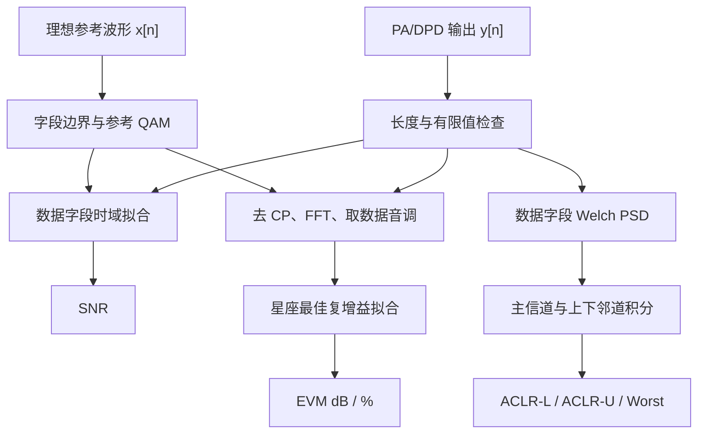
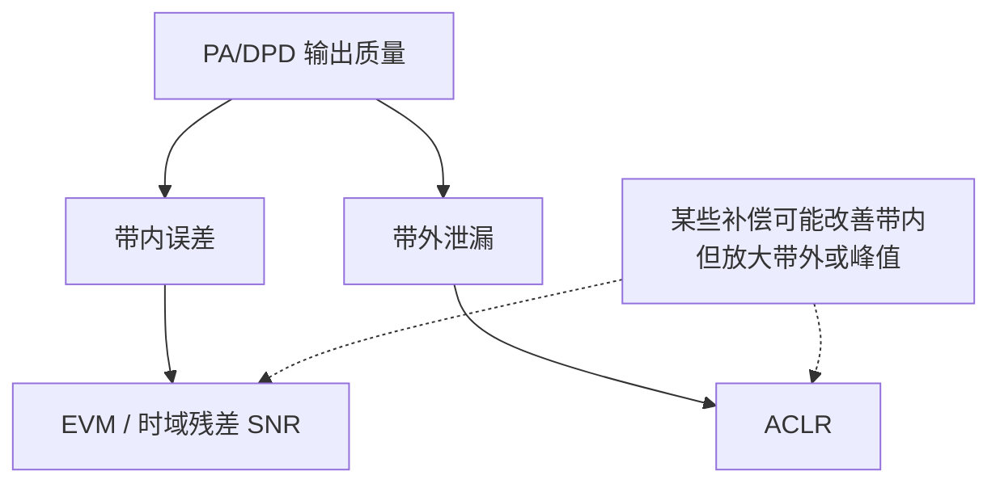
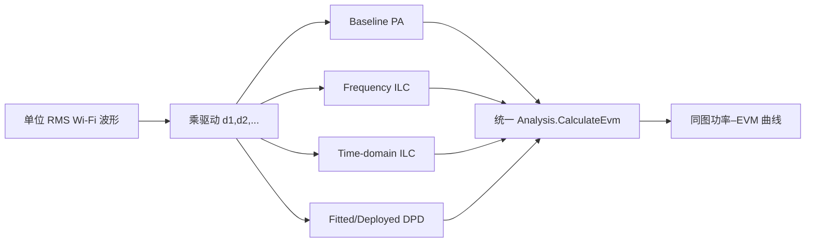

# 结果计算：SNR、EVM、ACLR 与功率–EVM 曲线原理

本文解释 `inc/Analysis.py` 中结果统计的物理含义和公式推导。分析器以理想发送参考波形和 `WifiWaveform` 元数据为基准，对 PA、ILC 或部署型 DPD 输出统一计算：

- 数据字段时域 SNR；
- Wi-Fi 数据子载波 RMS EVM；
- 上、下邻道 ACLR；
- 多方法功率–EVM 曲线。

> **重要定义**：这里的 SNR 实际上是“去除一个最佳公共复增益后，理想信号功率与全部残差功率之比”。残差既可能包含随机噪声，也可能包含 PA 非线性、记忆失真和未校正误差，因此不一定等于仪器意义上的纯热噪声 SNR。

---

## 1. 分析流程



**图 1 说明**：SNR 在数据字段的时域样点上计算；EVM 在去 CP、FFT 后的数据子载波上计算；ACLR 在数据字段的功率谱上计算。三者观察的是不同维度，不能用单一指标替代全部结果。

---

## 2. 所有指标共同的前提：对齐

当前 `Analysis` 假设参考和测量波形：

1. 样本数量相同；
2. 数据字段起点相同；
3. 无整数或分数采样时延；
4. 无载波频偏、采样频偏和随时间相位漂移。

分析器会去除一个**固定公共复增益**，但不会自动搜索时延或校正频偏。若测量信号晚一个样点，OFDM 子载波会出现与频率成比例的相位斜率；若存在载波频偏，相位会随时间旋转。这些误差不能被单个复数完全吸收，会进入 SNR/EVM 残差。

在真实仪器数据进入本分析器之前，推荐先完成：


**图 2 说明**：同步误差应在非线性评价之前处理，否则分析器会把“没有对齐”误判为 PA 或 DPD 失真。仿真中所有模块保持同长度、同采样网格，所以可以直接分析。

---

## 3. 最佳公共复增益的最小二乘推导

设参考向量为 $\mathbf x$，测量向量为 $\mathbf y$。我们希望找到复数 $g$，使 $g\mathbf x$ 尽可能接近 $\mathbf y$：

```math
\hat g=\arg\min_g\|\mathbf y-g\mathbf x\|_2^2.
```

展开目标函数：

```math
\begin{aligned}
J(g)
&=(\mathbf y-g\mathbf x)^H(\mathbf y-g\mathbf x)\\
&=\mathbf y^H\mathbf y-g\mathbf y^H\mathbf x
-g^*\mathbf x^H\mathbf y+|g|^2\mathbf x^H\mathbf x.
\end{aligned}
```

对 $g^*$ 求导并令其为零：

```math
\frac{\partial J}{\partial g^*}
=-\mathbf x^H\mathbf y+g\mathbf x^H\mathbf x=0.
```

得到

```math
\boxed{
\hat g=\frac{\mathbf x^H\mathbf y}{\mathbf x^H\mathbf x}
}
```

这就是 `_BestComplexGain`。

几何上，$\hat g\mathbf x$ 是 $\mathbf y$ 在参考方向上的正交投影，残差

```math
\mathbf e=\mathbf y-\hat g\mathbf x
```

满足

```math
\mathbf x^H\mathbf e=0.
```

因此一个统一的线性增益差和固定相位差不会被计作误差。这样比较 PA 与 DPD 时，指标更关注波形形状失真，而不是无关的标量增益。

---

## 4. SNR 的计算与解释

### 4.1 代码定义

分析器只截取 HE-Data 或 EHT-Data 字段。令

```math
\mathbf s=\hat g\mathbf x,
\qquad
\mathbf e=\mathbf y-\hat g\mathbf x.
```

信号功率和误差功率为

```math
P_s=\frac{1}{N}\sum_{n=0}^{N-1}|s[n]|^2,
```

```math
P_e=\frac{1}{N}\sum_{n=0}^{N-1}|e[n]|^2.
```

于是

```math
\boxed{
\mathrm{SNR}_{\mathrm{dB}}
=10\log_{10}\frac{P_s}{P_e}
}
```

### 4.2 为什么功率比使用 $10\log_{10}$

分贝对功率的定义为

```math
L_{\mathrm{dB}}=10\log_{10}\frac{P_1}{P_0}.
```

若改用 RMS 电压或复幅度比 $A_1/A_0$，在阻抗相同条件下 $P\propto A^2$，因此

```math
10\log_{10}\left(\frac{A_1}{A_0}\right)^2
=20\log_{10}\frac{A_1}{A_0}.
```

### 4.3 这里的残差包含什么

如果

```math
y[n]=gx[n]+w[n],
```

且 $w[n]$ 是与信号不相关的 AWGN，那么此定义接近通常的 SNR。但 PA 输出更可能是

```math
y[n]=gx[n]+d_{\mathrm{NL}}[n]+d_{\mathrm{mem}}[n]+w[n],
```

所以误差功率包含：

```math
P_e\approx P_{\mathrm{NL}}+P_{\mathrm{mem}}+P_n+\text{交叉项}.
```

因此它也可以理解为信号与总失真加噪声之比（接近 SINAD 思想）。指标越大越好。

### 4.4 为什么只分析数据字段

前导、信令和数据的功率统计、子载波占用及训练结构不同。只取数据字段可以：

- 避免字段拼接瞬态影响结果；
- 与数据 EVM 使用相同主要业务区间；
- 比较不同帧格式时减少前导长度差异带来的偏差。

---

## 5. EVM：星座点偏离理想位置的程度

EVM（Error Vector Magnitude）直接在 IQ 平面测量误差矢量。

```text
Q
^                     R：实测点
|                    ●
|                  ↗ │
|       误差向量 e  /  │
|                /    │
|      S：理想点 ●-----┘
+--------------------------------> I
```

**图 3 说明**：理想星座点为 $S$，实测点为 $R$，两者之差 $E=R-\hat gS$ 是误差向量。EVM 将全部数据子载波和 OFDM 符号上的误差能量汇总，再相对理想星座能量归一化。

### 5.1 OFDM 解调步骤

每个数据 OFDM 符号的总长度为

```math
N_s=N_{\mathrm{CP}}+N_{\mathrm{FFT}}.
```

对第 $q$ 个符号：

1. 根据 `dataSymbolStarts[q]` 找到符号起点；
2. 丢弃前 $N_{\mathrm{CP}}$ 个采样；
3. 对后 $N_{\mathrm{FFT}}$ 个样点做能量归一化 FFT；
4. 按 `dataSubcarriers` 取出数据音调，忽略导频和空音调。

公式为

```math
R_q[k]=\frac{1}{\sqrt N}
\sum_{n=0}^{N-1}r_q[n]e^{-j2\pi kn/N}.
```

注意这里 NumPy `fft` 本身没有 $1/N$，除以 $\sqrt N$ 正好与发送端 `ifft × sqrt(N)` 配对。


**图 4 说明**：EVM 不在原始时域直接计算，而是按 Wi-Fi 接收机思路先恢复每个数据子载波。这样指标对应星座判决质量。

### 5.2 RMS EVM 公式

把所有数据符号和数据子载波展平成向量。理想星座为 $\mathbf S$，测量星座为 $\mathbf R$，先求

```math
\hat g=\frac{\mathbf S^H\mathbf R}{\mathbf S^H\mathbf S}.
```

误差为

```math
\mathbf E=\mathbf R-\hat g\mathbf S.
```

RMS EVM 比值为

```math
\boxed{
\mathrm{EVM}_{\mathrm{rms}}
=\sqrt{\frac{\sum_i|E_i|^2}
{\sum_i|\hat gS_i|^2}}
}
```

百分比为

```math
\boxed{
\mathrm{EVM}_{\%}=100\times\mathrm{EVM}_{\mathrm{rms}}
}
```

分贝形式为

```math
\boxed{
\mathrm{EVM}_{\mathrm{dB}}
=20\log_{10}\mathrm{EVM}_{\mathrm{rms}}
}
```

EVM 是幅度比，所以使用 $20\log_{10}$。例如：

| EVM (%) | EVM 比值 | EVM (dB) |
|---:|---:|---:|
| 10% | 0.1 | -20 dB |
| 3.16% | 0.0316 | -30 dB |
| 1% | 0.01 | -40 dB |

EVM dB 越负越好；EVM 百分比越小越好。

### 5.3 EVM 能看到哪些失真

EVM 会综合反映：

- PA AM-AM 压缩；
- AM-PM 幅相转换；
- 记忆引起的子载波相关误差；
- IQ 镜像；
- 噪声；
- 未校正的同步和频率响应误差。

但当前实现会去掉一个统一的复增益，因此不会惩罚全体星座共同的固定缩放和旋转。

### 5.4 EVM 与 SNR 的近似关系

若误差只有与信号不相关的白噪声，且信号归一化一致，则

```math
\mathrm{EVM}_{\mathrm{rms}}^2\approx\frac{P_e}{P_s}.
```

于是

```math
\begin{aligned}
\mathrm{EVM}_{\mathrm{dB}}
&=20\log_{10}\sqrt{\frac{P_e}{P_s}}\\
&=10\log_{10}\frac{P_e}{P_s}\\
&\approx-\mathrm{SNR}_{\mathrm{dB}}.
\end{aligned}
```

这个关系只是理想近似。当前 SNR 在时域数据样点上计算，EVM 在频域数据子载波上计算；空音调、导频、非线性带外能量和记忆失真会使两者不再严格互为相反数。

---

## 6. ACLR：能量泄漏到相邻信道的程度

ACLR（Adjacent Channel Leakage Ratio）比较主信道功率和邻道功率：

```math
\mathrm{ACLR}=10\log_{10}
\frac{P_{\mathrm{main}}}{P_{\mathrm{adjacent}}}.
```

数值越大越好。例如主信道功率比邻道高 $40$ dB，则 ACLR 为 $40$ dB。

### 6.1 本工程的频带划分

设配置带宽为 $B$，复基带中心位于 0 Hz：

```math
\mathcal B_{\mathrm{main}}=\left(-\frac B2,\frac B2\right),
```

```math
\mathcal B_{\mathrm{lower}}=\left[-\frac{3B}{2},-\frac B2\right),
```

```math
\mathcal B_{\mathrm{upper}}=\left(\frac B2,\frac{3B}{2}\right].
```

```text
       下邻道                 主信道                 上邻道
 |<------  B  ------>|<------  B  ------>|<------  B  ------>|
-3B/2                 -B/2       0        B/2                  3B/2
```

**图 5 说明**：三个积分窗口宽度相同，主信道居中，上下邻道紧邻其两侧。窗口外的更远带外能量不参与本次 ACLR。

为观察到 $\pm3B/2$，奈奎斯特频率至少要满足

```math
\frac{f_s}{2}\ge\frac{3B}{2},
```

所以

```math
\boxed{f_s\ge3B}.
```

这就是 `CalculateAclr` 要求至少 3x 过采样的原因。工程默认 4x，可以覆盖两个完整邻道并留出余量。

### 6.2 为什么不直接对一次 FFT 平方

有限长度随机 OFDM 波形的一次周期图方差很大，频谱曲线会很“毛”。分析器使用 Welch 思想：分段、加窗、重叠、平均。

长度为 $L$ 的第 $r$ 段记为 $x_r[n]$，Hann 窗为 $w[n]$。分段周期图为

```math
\hat P_r[k]
=\frac{\left|\sum_{n=0}^{L-1}x_r[n]w[n]e^{-j2\pi kn/L}\right|^2}
{\sum_{n=0}^{L-1}w^2[n]}.
```

对 $R$ 段平均：

```math
\hat P[k]=\frac{1}{R}\sum_{r=0}^{R-1}\hat P_r[k].
```

代码设置：

- 最大分段长度 16384；
- 若数据更短，则取不超过长度的最大 2 的幂；
- Hann 窗；
- 50% 重叠；
- 用窗平方和做功率归一化。

Hann 窗降低矩形截断带来的频谱旁瓣泄漏；分段平均降低估计方差。代价是频率分辨率和统计独立性存在折中。

### 6.3 频带功率和 ACLR

在离散频率网格上，三个频带功率近似为 PSD 样点求和：

```math
P_{\mathrm{main}}=\sum_{k\in\mathcal B_{\mathrm{main}}}\hat P[k],
```

```math
P_{\mathrm{lower}}=\sum_{k\in\mathcal B_{\mathrm{lower}}}\hat P[k],
\qquad
P_{\mathrm{upper}}=\sum_{k\in\mathcal B_{\mathrm{upper}}}\hat P[k].
```

因为各频点间隔相同，严格积分中共同的 $\Delta f$ 在功率比里约掉。于是

```math
\mathrm{ACLR}_{L}=10\log_{10}\frac{P_{\mathrm{main}}}{P_{\mathrm{lower}}},
```

```math
\mathrm{ACLR}_{U}=10\log_{10}\frac{P_{\mathrm{main}}}{P_{\mathrm{upper}}}.
```

最差值定义为

```math
\boxed{
\mathrm{ACLR}_{\mathrm{worst}}
=\min(\mathrm{ACLR}_{L},\mathrm{ACLR}_{U})
}
```

因为较小的比值对应较严重的邻道泄漏。

### 6.4 本 ACLR 与标准一致性测量的区别

本工程采用**等宽矩形频带积分**，适合不同 PA/DPD 方法之间做一致的工程比较。正式射频一致性测试可能规定：

- 特定测量滤波器；
- 信道边缘和频谱模板；
- 仪器 RBW/VBW；
- 突发门控与平均方式；
- 特定制式的相邻信道定义。

因此本结果不应直接宣称为 IEEE Wi-Fi 频谱模板认证值或某台 VSA 的标准化 ACLR 读数。它是透明、可重复的仿真指标。

---

## 7. 为什么 EVM 和 ACLR 必须同时看



**图 6 说明**：EVM 主要关注接收星座，ACLR 主要关注对邻道的干扰。某个算法可能把带内拟合得很好，却产生过高峰值或带外噪声；也可能频谱改善明显但星座仍受记忆误差影响。所以至少需要联合查看 EVM、ACLR 和输入峰值/收敛性。

---

## 8. 功率–EVM 曲线

### 8.1 为什么单个功率点不够

DPD/ILC 在一个标称功率点表现优秀，不代表在低功率和高功率仍然优秀。PA 非线性随幅度变化：

- 低功率：PA 近似线性，EVM 可能由数值误差或噪声主导；
- 中等功率：开始压缩，DPD 能显著改善；
- 高功率：接近不可逆饱和，任何预失真都难以完全恢复。

所以需要扫描驱动 RMS，观察完整曲线。

### 8.2 横坐标推导

Wi-Fi 波形已归一化为单位 RMS。第 $i$ 个驱动点使用

```math
x_i[n]=d_i x_{\mathrm{unit}}[n].
```

若把单位 RMS 对应功率作为 0 dB 参考，则功率比为 $d_i^2$：

```math
\boxed{
P_{\mathrm{in,dB},i}=10\log_{10}(d_i^2)=20\log_{10}d_i
}
```

因此 `driveRmsValues` 必须为正数且严格递增。

### 8.3 公平比较原则

对每个功率点和每种方法，分析器都使用同一个点参考：

```math
\mathbf x_i=d_i\mathbf x_{\mathrm{unit}}.
```

所有方法的输出 $\mathbf y_{i,m}$ 都调用相同的 `CalculateEvm`。这样曲线差异来自方法本身，而不是输入帧、随机种子或指标定义不同。



**图 7 说明**：每个方法必须看到完全相同的驱动点。学习型 ILC 可以在每个点重新迭代；部署型 DPD 可以固定标称点系数并跨功率测试。两者回答的问题不同，应在图例中清楚区分。

### 8.4 曲线怎样阅读

纵坐标是 EVM dB，**越低、越负越好**。

```text
EVM(dB)
 ^                         高功率深压缩
 | Baseline              /
 |        ______________/
 | DPD   _____________/
 |______/________________________________> 输入相对功率(dB)
       低功率       补偿有效区       饱和区
```

**图 8 说明**：低功率区各方法可能接近；进入压缩后，补偿曲线应低于 Baseline；接近饱和时曲线通常快速恶化。曲线间垂直距离表示 EVM 改善量，拐点向右移动表示可用线性输出范围扩大。

### 8.5 学习结果和部署结果不能混为一谈

- **逐功率点重新学习的 ILC**：表示在该输入帧、该功率点上可达到的迭代补偿上限；
- **固定系数部署 DPD**：表示一次训练后跨帧、跨功率泛化能力；
- **Baseline**：表示无补偿 PA 的基准。

直接学习的 ILC 可能利用整段已知目标，结果通常比固定部署模型更理想。工程的详细 ILC 原理见 [DPD-ILC.md](./DPD-ILC.md)。

---

## 9. 输出数据结构和文件

`SignalMetrics` 保存：

| 字段 | 含义 | 趋势 |
|---|---|---|
| `snrDb` | 数据字段拟合后信号/残差功率比 | 越大越好 |
| `evmDb` | RMS EVM 的 dB 值 | 越负越好 |
| `evmPercent` | RMS EVM 百分比 | 越小越好 |
| `aclrLowerDb` | 主信道/下邻道功率比 | 越大越好 |
| `aclrUpperDb` | 主信道/上邻道功率比 | 越大越好 |
| `aclrWorstDb` | 上下邻道较差者 | 越大越好 |

`PowerEvmCurve` 保存：

- `driveRmsValues`：线性 RMS 驱动；
- `inputPowerDb`：$20\log_{10}(d)$；
- `evmDbByMethod`：每种方法的 EVM dB 数组；
- `evmPercentByMethod`：每种方法的 EVM 百分比数组。

`SavePowerEvmCurve` 同时生成：

- CSV：便于表格处理；
- JSON：保留方法分组结构；
- PNG：在一张图中比较全部方法。

---

## 10. 代码入口和典型调用

| 计算步骤 | 方法 |
|---|---|
| 输入检查 | `Analysis._PrepareMeasuredSignal` |
| 最佳复增益 | `_BestComplexGain` |
| 数据字段 SNR | `Analysis.CalculateSnr` |
| OFDM 数据解调 | `Analysis.DemodulateWifiData` |
| RMS EVM | `Analysis.CalculateEvm` |
| Welch PSD | `_AveragePeriodogram` |
| ACLR | `Analysis.CalculateAclr` |
| 三指标汇总 | `Analysis.Analyze` |
| 多阶段批量统计 | `Analysis.AnalyzeStages` |
| 功率扫描 | `Analysis.AnalyzePowerEvmCurve` |
| 曲线保存 | `Analysis.SavePowerEvmCurve` |

```python
from collections import ChainMap

from inc.Analysis import Analysis, analysisDefaultParameters

analysisOverrides = {
    "maxSegmentLength": 8192,
    "powerEvmFileStem": "comparison_curve",
}
analysisParameters = ChainMap(
    analysisOverrides,
    analysisDefaultParameters,
)
resultAnalysis = Analysis(
    referenceSignal,
    wifiWaveform,
    parameters=analysisParameters,
)

metrics = resultAnalysis.Analyze(paOutput)
print(metrics.snrDb)
print(metrics.evmDb, metrics.evmPercent)
print(metrics.aclrLowerDb, metrics.aclrUpperDb, metrics.aclrWorstDb)

stageMetrics = resultAnalysis.AnalyzeStages(
    {
        "Baseline": paOutput,
        "ILC": ilcOutput,
        "Deployed DPD": deployedDpdOutput,
    }
)
resultAnalysis.Print(stageMetrics)
```

未提供的键从 `analysisDefaultParameters` 读取。外部修改 `analysisOverrides` 后，下一次 ACLR 或曲线保存会使用新值；`UpdateParameters(...)` 可设置最高优先级覆盖，`GetParameters()` 用于取得当前配置快照。

功率–EVM 扫描的评估器接口为：

```python
def EvaluateMethod(pointReference, driveRms):
    return paModel.Process(pointReference)

powerEvmCurve = resultAnalysis.AnalyzePowerEvmCurve(
    driveRmsValues=(0.20, 0.30, 0.45, 0.65, 0.85),
    methodEvaluators={"Baseline": EvaluateMethod},
)
resultAnalysis.SavePowerEvmCurve(outputDirectory, powerEvmCurve)
```

---

## 11. 常见误区和数值边界

### 11.1 理想输入得到极端好指标

若把参考波形原样作为测量波形，理论误差为零。代码为防止除零，使用机器最小正数保护分母，因此可能显示非常大的 SNR 或非常负的 EVM。这表示“到达双精度数值极限”，不代表物理系统真的具有几百 dB 性能。

### 11.2 EVM 好不代表 ACLR 一定好

EVM 只看数据子载波；算法可能把误差推到空音调或带外。此时 EVM 很好，但 ACLR 未必满足要求。

### 11.3 ACLR 对帧长度敏感

数据太短时 Welch 平均段数少，邻道功率估计方差较大。比较方法时必须使用同一帧长度和相同 PSD 设置。

### 11.4 频带边界不是活动子载波边缘

主积分带宽使用配置带宽 $B$，而 Wi-Fi 活动音调只占其中一部分。主信道内的保护频带也被纳入积分，这是有意的等宽信道定义。

### 11.5 公共复增益可能掩盖增益变化

EVM/SNR 去除了一个标量增益和相位。如果要研究 AM-AM 平均增益、输出功率或功率附加效率，应另外报告 $\hat g$、输出 RMS、峰值和电源数据。

### 11.6 对真实采集数据先做同步

当前类不执行时延估计、信道均衡或频偏补偿。真实示波器/VSA 波形必须预处理，否则同步误差会主导 EVM。

---

## 12. 指标选择建议

| 目标 | 首要指标 | 同时检查 |
|---|---|---|
| 判断带内调制质量 | EVM | SNR、星座图 |
| 判断邻道干扰 | ACLR | 频谱图、远端带外 |
| 判断 ILC 迭代是否收敛 | EVM/NMSE 历史 | 输入峰值、ACLR |
| 判断跨功率泛化 | 功率–EVM 曲线 | 各点 ACLR、系数稳定性 |
| 判断 IQ 镜像 | 上下邻道不对称、镜像谱 | EVM、镜像抑制度 |
| 判断真实硬件可部署性 | 固定 DPD 曲线 | 温度、功率、不同帧验证 |

没有任何一个指标能够独立证明 DPD“全面有效”。本工程将 SNR、EVM、ACLR 和功率扫描放在同一分析类中，就是为了保持输入、定义和比较条件一致。

---

## 13. 参考资料

- [P. D. Welch, “The Use of Fast Fourier Transform for the Estimation of Power Spectra,” 1967](https://doi.org/10.1109/TAU.1967.1161901)
- [ETSI TS 138 104：ACLR 的滤波平均功率比定义示例，见 6.6.3](https://www.etsi.org/deliver/etsi_TS/138100_138199/138104/16.21.00_60/ts_138104v162100p.pdf)
- [IEEE 802.11ax-2021 标准页面](https://standards.ieee.org/ieee/802.11ax/7180/)
- [IEEE 802.11be-2024 标准页面](https://standards.ieee.org/ieee/802.11be/7516/)

ETSI 链接用于说明 ACLR 的通用物理定义，不表示本工程采用 3GPP 的具体测量滤波器或限值；本工程的实际积分窗口以 `inc/Analysis.py` 为准。
