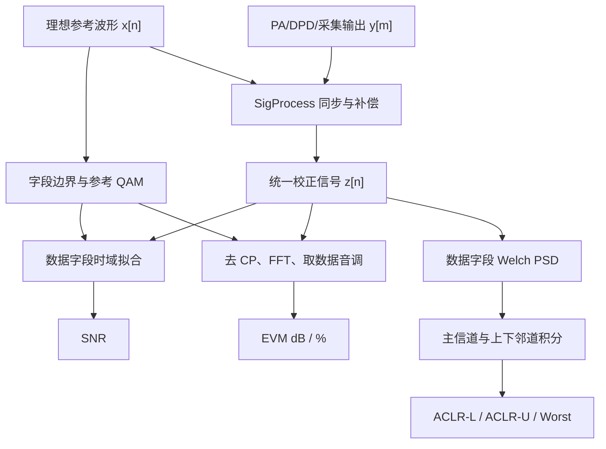
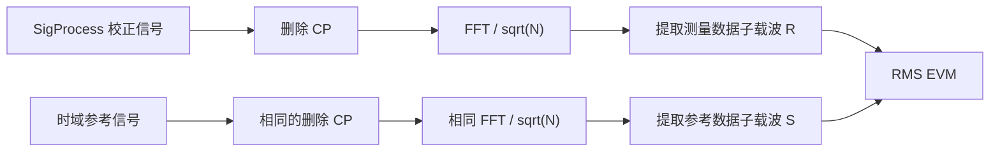
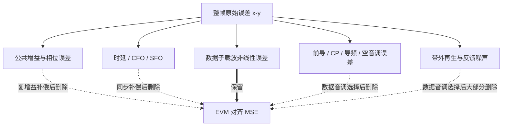
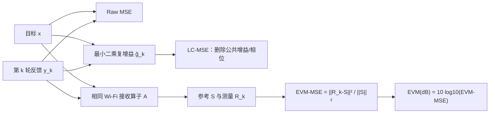
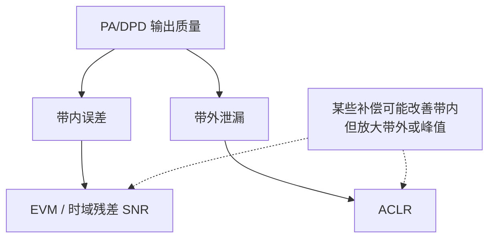
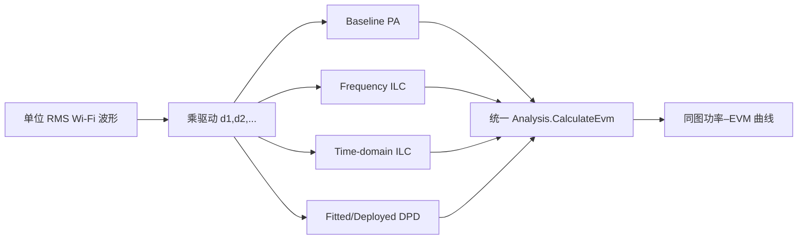
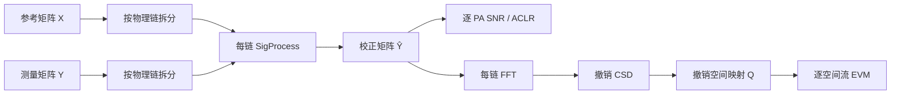

# 结果计算：SNR、EVM、ACLR 与功率–EVM 曲线原理

本文解释 `inc/Analysis.py` 中结果统计的物理含义和公式推导。分析器以理想发送参考波形和 `WifiWaveform` 元数据为基准，对 PA、ILC 或部署型 DPD 输出统一计算：

- 数据字段时域 SNR；
- Wi-Fi 数据子载波 RMS EVM；
- 上、下邻道 ACLR；
- 多方法功率–EVM 曲线。

> **重要定义**：进入指标计算前，`Analysis` 会调用 `SigProcess` 消除整数/分数时延、载波频偏、采样频偏和最佳公共复增益。这里的 SNR 是校正后理想信号功率与全部残差功率之比；残差仍包含随机噪声、PA 非线性、记忆失真和同步估计残差，因此不一定等于仪器意义上的纯热噪声 SNR。

---

## 1. 分析流程



**图 1 说明**：每个待测信号只执行一次 `SigProcess.Process`，SNR、EVM、ACLR 共用完全相同的校正样点。SNR 在数据字段时域样点上计算；EVM 在去 CP、FFT 后的数据子载波上计算；ACLR 在数据字段功率谱上计算。三者观察的是不同维度，不能用单一指标替代全部结果。

---

## 2. 所有指标共同的前提：先同步再分析

`Analysis.PrepareMeasuredSignal` 会构造 `SigProcess` 并执行以下处理：


**图 2 说明**：同步误差必须在非线性评价之前处理，否则分析器会把“没有对齐”误判为 PA 或 DPD 失真。待测数组在同步前可以与参考长度不同；重采样结果固定映射到参考网格。完整估计公式、参数和边界见 [SigProcess.md](./SigProcess.md)。

---

## 3. 最佳公共复增益的最小二乘推导

设参考向量为 $\mathbf x$，测量向量为 $\mathbf y$。我们希望找到复数 $g$，使 $g\mathbf x$ 尽可能接近 $\mathbf y$：

```math
\hat g=\arg\min_g\|\mathbf y-g\mathbf x\|_2^2.
```

展开目标函数：

```math
\begin{aligned}
J(g)
&=(\mathbf y-g\mathbf x)^H(\mathbf y-g\mathbf x)\\
&=\mathbf y^H\mathbf y-g\mathbf y^H\mathbf x
-g^*\mathbf x^H\mathbf y+|g|^2\mathbf x^H\mathbf x.
\end{aligned}
```

对 $g^*$ 求导并令其为零：

```math
\frac{\partial J}{\partial g^*}
=-\mathbf x^H\mathbf y+g\mathbf x^H\mathbf x=0.
```

得到

```math
\boxed{
\hat g=\frac{\mathbf x^H\mathbf y}{\mathbf x^H\mathbf x}
}
```

这就是 `SigProcess.EstimateComplexGain`。`SigProcess.Process` 随后计算 $\mathbf z=\mathbf y/\hat g$，`Analysis` 对 $\mathbf z$ 进行指标统计。

为了避免把文字和公式挤在同一行，几何关系完整写为：

```math
\mathrm{proj}_{\mathrm{span}(\mathbf{x})}(\mathbf{y})
=\hat{g}\,\mathbf{x}
=\frac{\mathbf{x}^{H}\mathbf{y}}
       {\mathbf{x}^{H}\mathbf{x}}\,\mathbf{x}.
```

也就是说，测量向量在参考向量所张成的一维子空间上的正交投影，就是最佳复增益与参考向量的乘积。投影后的残差定义为：

```math
\mathbf{e}=\mathbf{y}-\hat{g}\,\mathbf{x}.
```

残差与参考向量满足正交条件：

```math
\mathbf x^H\mathbf e=0.
```

因此一个统一的线性增益差和固定相位差不会被计作误差。这样比较 PA 与 DPD 时，指标更关注波形形状失真，而不是无关的标量增益。

---

## 4. SNR 的计算与解释

### 4.1 代码定义

分析器只截取当前格式对应的 VHT-Data、HE-Data 或 EHT-Data 字段。令参考数据字段为 $\mathbf x$，`SigProcess` 输出的校正数据字段为 $\mathbf z$，则

```math
\mathbf s=\mathbf x,
\qquad
\mathbf e=\mathbf z-\mathbf x.
```

信号功率和误差功率为

```math
P_s=\frac{1}{N}\sum_{n=0}^{N-1}|s[n]|^2,
```

```math
P_e=\frac{1}{N}\sum_{n=0}^{N-1}|e[n]|^2.
```

于是

```math
\boxed{
\mathrm{SNR}_{\mathrm{dB}}
=10\log_{10}\frac{P_s}{P_e}
}
```

### 4.2 为什么功率比使用 $10\log_{10}$

分贝对功率的定义为

```math
L_{\mathrm{dB}}=10\log_{10}\frac{P_1}{P_0}.
```

若改用 RMS 电压或复幅度比 $A_1/A_0$，在阻抗相同条件下 $P\propto A^2$，因此

```math
10\log_{10}\left(\frac{A_1}{A_0}\right)^2
=20\log_{10}\frac{A_1}{A_0}.
```

### 4.3 这里的残差包含什么

在 `SigProcess` 已消除同步误差和公共复增益后，如果

```math
z[n]=x[n]+w[n],
```

且 $w[n]$ 是与信号不相关的 AWGN，那么此定义接近通常的 SNR。但 PA 输出更可能是

```math
z[n]=x[n]+d_{\mathrm{NL}}[n]+d_{\mathrm{mem}}[n]+w[n],
```

所以误差功率包含：

```math
P_e\approx P_{\mathrm{NL}}+P_{\mathrm{mem}}+P_n+P_{\mathrm{cross}}.
```

因此它也可以理解为信号与总失真加噪声之比（接近 SINAD 思想）。指标越大越好。

### 4.4 为什么只分析数据字段

前导、信令和数据的功率统计、子载波占用及训练结构不同。只取数据字段可以：

- 避免字段拼接瞬态影响结果；
- 与数据 EVM 使用相同主要业务区间；
- 比较不同帧格式时减少前导长度差异带来的偏差。

---

## 5. EVM：星座点偏离理想位置的程度

EVM（Error Vector Magnitude）直接在 IQ 平面测量误差矢量。

```text
Q
^                     R：实测点
|                    ●
|                  ↗ │
|       误差向量 e  /  │
|                /    │
|      S：理想点 ●-----┘
+--------------------------------> I
```

**图 3 说明**：理想星座点为 $S$，实测点为 $R$，两者之差 $E=R-\hat gS$ 是误差向量。EVM 将全部数据子载波和 OFDM 符号上的误差能量汇总，再相对理想星座能量归一化。

### 5.1 OFDM 解调步骤

每个数据 OFDM 符号的总长度为

```math
N_s=N_{\mathrm{CP}}+N_{\mathrm{FFT}}.
```

对第 $q$ 个符号：

1. 根据 `dataSymbolStarts[q]` 找到符号起点；
2. 丢弃前 $N_{\mathrm{CP}}$ 个采样；
3. 对后 $N_{\mathrm{FFT}}$ 个样点做能量归一化 FFT；
4. 按 `dataSubcarriers` 取出数据音调，忽略导频和空音调。

公式为

```math
R_q[k]=\frac{1}{\sqrt N}
\sum_{n=0}^{N-1}r_q[n]e^{-j2\pi kn/N}.
```

注意这里 NumPy `fft` 本身没有 $1/N$，除以 $\sqrt N$ 正好与发送端 `ifft × sqrt(N)` 配对。



**图 4 说明**：EVM 不在原始时域直接计算，而是按 Wi-Fi 接收机思路先恢复每个数据子载波。这样指标对应星座判决质量。

### 5.2 RMS EVM 公式

把所有数据符号和数据子载波展平成向量。理想星座为 $\mathbf S$，校正后的测量星座为 $\mathbf R$。公共复增益已经在时域由 `SigProcess` 去除，因此这里不再执行第二次增益拟合。误差为

```math
\mathbf E=\mathbf R-\mathbf S.
```

RMS EVM 比值为

```math
\boxed{
\mathrm{EVM}_{\mathrm{rms}}
=\sqrt{\frac{\sum_i|E_i|^2}
{\sum_i|S_i|^2}}
}
```

百分比为

```math
\boxed{
\mathrm{EVM}_{\%}=100\times\mathrm{EVM}_{\mathrm{rms}}
}
```

分贝形式为

```math
\boxed{
\mathrm{EVM}_{\mathrm{dB}}
=20\log_{10}\mathrm{EVM}_{\mathrm{rms}}
}
```

EVM 是幅度比，所以使用 $20\log_{10}$。例如：

| EVM (%) | EVM 比值 | EVM (dB) |
|---:|---:|---:|
| 10% | 0.1 | -20 dB |
| 3.16% | 0.0316 | -30 dB |
| 1% | 0.01 | -40 dB |

EVM dB 越负越好；EVM 百分比越小越好。

### 5.3 EVM 能看到哪些失真

EVM 会综合反映：

- PA AM-AM 压缩；
- AM-PM 幅相转换；
- 记忆引起的子载波相关误差；
- IQ 镜像；
- 噪声；
- 同步估计残差和未均衡的频率选择性响应。

`SigProcess` 会去掉一个统一的复增益，因此不会惩罚全体星座共同的固定缩放和旋转；频率选择性幅相起伏仍会进入 EVM。

### 5.4 EVM 与 SNR 的近似关系

若误差只有与信号不相关的白噪声，且信号归一化一致，则

```math
\mathrm{EVM}_{\mathrm{rms}}^2\approx\frac{P_e}{P_s}.
```

于是

```math
\begin{aligned}
\mathrm{EVM}_{\mathrm{dB}}
&=20\log_{10}\sqrt{\frac{P_e}{P_s}}\\
&=10\log_{10}\frac{P_e}{P_s}\\
&\approx-\mathrm{SNR}_{\mathrm{dB}}.
\end{aligned}
```

这个关系只是理想近似。当前 SNR 在时域数据样点上计算，EVM 在频域数据子载波上计算；空音调、导频、非线性带外能量和记忆失真会使两者不再严格互为相反数。

### 5.5 为什么原始 MSE 不能总是反映 EVM

第 $k$ 轮 ILC 的目标时域波形记为参考向量，PA 反馈记为测量向量：

```math
\mathbf{x}\in\mathbb{C}^{N},
\qquad
\mathbf{y}_k\in\mathbb{C}^{N}.
```

最直接的原始 MSE 是：

```math
\boxed{
\mathrm{MSE}_{\mathrm{raw},k}
=\frac{1}{N}\left\|\mathbf{x}-\mathbf{y}_k\right\|_2^2
}
```

对应的归一化值为：

```math
\mathrm{NMSE}_{\mathrm{raw},k}
=\frac{\left\|\mathbf{x}-\mathbf{y}_k\right\|_2^2}
       {\left\|\mathbf{x}\right\|_2^2}.
```

这个定义要求测量波形在**绝对幅度、绝对相位、采样位置以及每个时域样点**上都等于参考。因此它会同时统计：

- PA 或反馈链的公共线性增益；
- 公共相位旋转；
- 整数时延和分数时延；
- 载波频偏和采样频偏；
- 前导、信令、循环前缀、导频和空子载波对应的误差；
- 真正影响数据判决的带内非线性误差；
- 带外频谱再生、反馈噪声和截断误差。

EVM 并不保留上述全部分量。它先执行同步和公共复增益补偿，然后只统计数据 OFDM 符号的数据子载波。因此原始 MSE 与 EVM 的评价空间不同，曲线不要求同步单调。



**图 5-1 说明**：原始 MSE 是所有分量的总观测，而 EVM 对齐 MSE 是经过接收机处理后的子空间观测。ILC 可能继续减小图中的“数据子载波非线性误差”，但公共增益或带外误差已经成为原始 MSE 的主导项，所以会出现原始 MSE 看似不再改善、EVM 却继续改善的现象。

### 5.6 公共线性项怎样形成 MSE 地板

用最小二乘复增益把测量向量精确分解为：

```math
\mathbf{y}_k=\hat{g}_k\mathbf{x}+\mathbf{e}_{\perp,k},
```

其中：

```math
\hat{g}_k
=\frac{\mathbf{x}^{H}\mathbf{y}_k}
       {\mathbf{x}^{H}\mathbf{x}},
\qquad
\mathbf{x}^{H}\mathbf{e}_{\perp,k}=0.
```

因为公共线性项和残差正交，勾股关系给出：

```math
\begin{aligned}
\left\|\mathbf{y}_k-\mathbf{x}\right\|_2^2
&=\left\|(\hat{g}_k-1)\mathbf{x}
          +\mathbf{e}_{\perp,k}\right\|_2^2\\
&=\left|\hat{g}_k-1\right|^2
  \left\|\mathbf{x}\right\|_2^2
  +\left\|\mathbf{e}_{\perp,k}\right\|_2^2.
\end{aligned}
```

所以原始归一化 MSE 可写为：

```math
\boxed{
\mathrm{NMSE}_{\mathrm{raw},k}
=\left|\hat{g}_k-1\right|^2
+\frac{\left\|\mathbf{e}_{\perp,k}\right\|_2^2}
       {\left\|\mathbf{x}\right\|_2^2}
}
```

第一项是公共增益和相位造成的线性误差，第二项才是不能由一个复标量解释的波形形状误差。即使第二项因 ILC 持续下降，只要第一项更大，原始 MSE 曲线就会出现明显地板。

例如一个完全没有非线性失真的输出仅有固定增益：

```math
\mathbf{y}=0.7\mathbf{x}.
```

此时 EVM 在复增益补偿后理论上为零，但原始归一化 MSE 为：

```math
\mathrm{NMSE}_{\mathrm{raw}}
=|0.7-1|^2
=0.09
\approx-10.46\ \mathrm{dB}.
```

因此不能把原始 NMSE 的 −10.46 dB 误认为星座仍有同等大小的非线性误差。

### 5.7 第一级优化：线性补偿 MSE

当调用方只有普通复基带波形、没有 Wi-Fi 字段和子载波元数据时，可以先去除最佳公共复增益。把测量波形折算回参考幅度：

```math
\mathbf{z}_k=\frac{\mathbf{y}_k}{\hat{g}_k}.
```

本工程定义线性补偿 MSE 为：

```math
\boxed{
\mathrm{MSE}_{\mathrm{LC},k}
=\frac{1}{N}
 \left\|\frac{\mathbf{y}_k}{\hat{g}_k}-\mathbf{x}\right\|_2^2
=\frac{\left\|\mathbf{e}_{\perp,k}\right\|_2^2}
       {N\left|\hat{g}_k\right|^2}
}
```

这里最容易产生的疑问是：把 $\mathbf{y}_k$ 的公共复增益去掉之后，测量信号和参考信号的幅度是否仍然一致？答案是肯定的，因为 $\hat{g}_k$ 表示从参考幅度到测量幅度的复比例，即“测量幅度/参考幅度”。所以 $\mathbf{y}_k/\hat{g}_k$ 已经被折算回参考信号的幅度和相位尺度，而不是把两个不同尺度的量直接相减。

把正交分解代入补偿表达式：

```math
\frac{\mathbf{y}_k}{\hat{g}_k}
=\frac{\hat{g}_k\mathbf{x}+\mathbf{e}_{\perp,k}}
       {\hat{g}_k}
=\mathbf{x}+\frac{\mathbf{e}_{\perp,k}}{\hat{g}_k}.
```

因此补偿后的误差为：

```math
\frac{\mathbf{y}_k}{\hat{g}_k}-\mathbf{x}
=\frac{\mathbf{y}_k-\hat{g}_k\mathbf{x}}
       {\hat{g}_k}
=\frac{\mathbf{e}_{\perp,k}}{\hat{g}_k}.
```

这说明代码不必显式计算 $\mathbf{y}_k/\hat{g}_k$。它可以先计算输出尺度的正交残差 $\mathbf{e}_{\perp,k}=\mathbf{y}_k-\hat{g}_k\mathbf{x}$，再把残差功率除以 $|\hat{g}_k|^2$，两种写法严格等价：

```math
\frac{1}{N}
\left\|
\frac{\mathbf{y}_k}{\hat{g}_k}-\mathbf{x}
\right\|_2^2
=
\frac{\left\|\mathbf{y}_k-\hat{g}_k\mathbf{x}\right\|_2^2}
     {N|\hat{g}_k|^2}.
```

如果只计算下面的量，并把它直接称为参考尺度的 LC-MSE，则确实是错误的：

```math
\frac{1}{N}
\left\|\mathbf{y}_k-\hat{g}_k\mathbf{x}\right\|_2^2.
```

原因是该残差仍处于测量输出的幅度尺度；当不同迭代轮次的 $|\hat{g}_k|$ 发生变化时，它不能与参考尺度 MSE 直接比较。本工程的 `CalculateIterationMetrics` 明确除以 $|\hat{g}_k|^2$，因此没有遗漏这一尺度换算。

一个直观例子是只有公共衰减和相移、没有波形失真：

```math
\mathbf{y}
=0.7e^{j30^\circ}\mathbf{x},
\qquad
\hat{g}=0.7e^{j30^\circ}.
```

补偿后得到：

```math
\frac{\mathbf{y}}{\hat{g}}=\mathbf{x},
\qquad
\mathrm{MSE}_{\mathrm{LC}}=0.
```

这里 LC-MSE 为零并不表示 PA 的绝对增益完全正确，而是表示除公共幅度和相位之外没有剩余波形失真。这正是 LC-MSE 的设计目的：Raw MSE 负责保留绝对增益和相位误差，LC-MSE 负责观察去除公共线性项后的波形形状。

再用参考时域平均功率归一化：

```math
\boxed{
\mathrm{NMSE}_{\mathrm{LC},k}
=\frac{\mathrm{MSE}_{\mathrm{LC},k}}
       {\frac{1}{N}\left\|\mathbf{x}\right\|_2^2}
}
```

`CalculateIterationMetrics` 对每轮都输出 `linearCompensatedMse` 和 `linearCompensatedNmseDb`。它们删除了公共幅度和相位项，因此通常比原始 MSE 更接近 EVM 趋势；同时输出的 `complexGainMagnitudeDb` 和 `complexGainPhaseDegrees` 用于确认被删除的线性项是否正在漂移。

线性补偿 MSE 仍然只是 EVM 的**代理指标**，原因是它仍在整帧时域统计，尚未删除同步残差、前导、CP、导频、空音调和带外分量。

此外，当 $|\hat{g}_k|$ 接近零时，除以 $|\hat{g}_k|^2$ 会显著放大反馈噪声和数值误差，此时 LC-MSE 不再具有稳定的工程含义。实际使用时应同时检查公共增益、Raw MSE 和 PA 输出功率；如果目标是评价绝对功率或增益压缩，就不能只使用 LC-MSE。如果目标是评价最终 Wi-Fi 调制质量，则应优先使用下一节定义的 EVM 对齐 MSE。

### 5.8 第二级优化：严格的 EVM 对齐 MSE

定义一个接收处理算子：

```math
\mathcal{A}
=\mathcal{P}_{\mathrm{data}}
 \mathcal{F}_{\mathrm{FFT}}
 \mathcal{R}_{\mathrm{CP}}
 \mathcal{W}_{\mathrm{data\ field}}
 \mathcal{C}_{\mathrm{sync}}.
```

各部分依次表示：同步及公共复增益补偿、数据字段截取、循环前缀删除、FFT 和数据子载波选择。MIMO 时，算子中还包含 CSD 撤销与空间解映射。参考星座和测量星座为：

```math
\mathbf{S}=\mathcal{A}(\mathbf{x}),
\qquad
\mathbf{R}_k=\mathcal{A}(\mathbf{y}_k).
```

先定义星座域的绝对均方误差：

```math
\mathrm{MSE}_{\mathrm{symbol},k}
=\frac{1}{K}\left\|\mathbf{R}_k-\mathbf{S}\right\|_2^2.
```

为了跨 MCS、功率和空间流比较，还必须除以参考星座平均功率。本工程把这个无量纲量称为 EVM 对齐 MSE：

```math
\boxed{
\mathrm{MSE}_{\mathrm{EVM},k}
=\frac{\left\|\mathbf{R}_k-\mathbf{S}\right\|_2^2}
       {\left\|\mathbf{S}\right\|_2^2}
}
```

它与 RMS EVM 不是近似关系，而是严格恒等关系：

```math
\boxed{
\mathrm{MSE}_{\mathrm{EVM},k}
=\mathrm{EVM}_{\mathrm{rms},k}^{2}
}
```

因此：

```math
\boxed{
\mathrm{EVM}_{\mathrm{dB},k}
=10\log_{10}\mathrm{MSE}_{\mathrm{EVM},k}
}
```

注意最后一个公式使用 $10\log_{10}$，因为这里输入的是已经平方后的功率比；它与对 RMS 幅度比使用 $20\log_{10}$ 完全等价：

```math
10\log_{10}(\mathrm{EVM}_{\mathrm{rms}}^2)
=20\log_{10}(\mathrm{EVM}_{\mathrm{rms}}).
```

代码中的 `Analysis.CalculateEvmAlignedMse` 实现上述完整算子，`ILCIteration.evmAlignedMse` 保存每轮的无量纲平方误差，`ILCIteration.evmDb` 保存它的 dB 值。标准 SISO 主流程和全方法 benchmark 会把这个计算器传入 ILC，因此最佳轮次也按照与最终 EVM 相同的目标选择。



**图 5-2 说明**：Raw MSE 用来判断绝对波形是否跟踪目标；LC-MSE 用来快速观察去除公共线性项后的波形形状；EVM-MSE 通过与最终 EVM 完全相同的接收链得到，因此是判断调制质量是否继续改善的首选迭代指标。

### 5.9 三种 MSE 应当怎样联合阅读

| 观察到的曲线 | 最可能的解释 | 建议检查 |
|---|---|---|
| Raw MSE 停滞，LC-MSE 与 EVM-MSE 继续下降 | 公共增益/相位项主导原始误差 | `complexGainMagnitudeDb`、`complexGainPhaseDegrees` |
| Raw MSE 与 LC-MSE 停滞，EVM-MSE 继续下降 | 误差从数据音调转移到前导、CP、导频、空音调或带外 | ACLR、频谱、分字段 MSE |
| LC-MSE 下降，EVM-MSE 变差 | 整帧时域拟合改善，但数据音调被牺牲 | 学习滤波器带宽、数据音调权重 |
| EVM-MSE 到达地板并小幅抖动 | 反馈噪声、量化噪声或同步估计方差开始主导 | 增加反馈平均、固定同步估计、提高采集 SNR |
| 三者同时变差 | 学习率过高、逆模型错误、削顶或 PA 已接近不可逆饱和 | 降低学习率、提高正则化、检查 `inputPeak` |
| EVM-MSE 改善但 ACLR 变差 | 带内目标改善，代价是更强带外抵消分量或谱再生 | 联合查看 ACLR，增加带外约束 |

最稳妥的停止规则不是只判断一种 MSE，而是：

1. 以 `evmAlignedMse` 或 `evmDb` 选择调制质量最佳轮次；
2. 以 `linearCompensatedNmseDb` 判断一般波形形状是否同步改善；
3. 以 `nmseDb`、复增益、`inputPeak` 保证绝对幅度和硬件工作点没有异常；
4. 同时施加 ACLR 与峰值约束，避免用带外性能交换带内 EVM。

### 5.10 每轮结果的工程含义

`Analysis.PrintConvergence`、`Analysis.SaveConvergence` 和 `Draw.SaveConvergenceCurve` 使用同一组 `ILCIteration` 记录。每轮包含：

| 字段 | 数学含义 | 单位/趋势 |
|---|---|---|
| `mse` | 整帧绝对时域 MSE | 线性值，越小越好 |
| `errorRms` | 原始 MSE 的平方根 | 参考幅度单位，越小越好 |
| `nmseDb` | 原始 MSE/参考功率 | dB，越负越好 |
| `linearCompensatedMse` | 删除最佳公共复增益后的输入折算 MSE | 线性值，越小越好 |
| `linearCompensatedNmseDb` | LC-MSE/参考功率 | dB，EVM 代理，越负越好 |
| `evmAlignedMse` | 数据子载波归一化误差，即 RMS EVM 的平方 | 无量纲，越小越好 |
| `evmDb` | EVM 对齐 MSE 的 dB 值 | dB，越负越好 |
| `complexGainMagnitudeDb` | 最佳公共复增益幅度 | dB，用于诊断线性项 |
| `complexGainPhaseDegrees` | 最佳公共相位 | 度，用于诊断线性项 |
| `inputPeak` | 当前 ILC 输入峰值 | 参考幅度单位，防止削顶 |

SISO Wi-Fi 分析能够输出全部字段。当前 MIMO ILC 按每个物理 PA 独立训练；单独一条 PA 链无法完成跨链空间解映射，所以每链仍输出 Raw MSE 和 LC-MSE，而严格的逐空间流 EVM 在组合全部链后由 `Analysis` 计算。这里故意不把单链 LC-MSE 误标成空间流 EVM。

---

## 6. ACLR：能量泄漏到相邻信道的程度

ACLR（Adjacent Channel Leakage Ratio）比较主信道功率和邻道功率：

```math
\mathrm{ACLR}=10\log_{10}
\frac{P_{\mathrm{main}}}{P_{\mathrm{adjacent}}}.
```

数值越大越好。例如主信道功率比邻道高 $40$ dB，则 ACLR 为 $40$ dB。

### 6.1 本工程的频带划分

设配置带宽为 $B$，复基带中心位于 0 Hz：

```math
\mathcal B_{\mathrm{main}}=\left(-\frac B2,\frac B2\right),
```

```math
\mathcal B_{\mathrm{lower}}=\left[-\frac{3B}{2},-\frac B2\right),
```

```math
\mathcal B_{\mathrm{upper}}=\left(\frac B2,\frac{3B}{2}\right].
```

```text
       下邻道                 主信道                 上邻道
 |<------  B  ------>|<------  B  ------>|<------  B  ------>|
-3B/2                 -B/2       0        B/2                  3B/2
```

**图 5 说明**：三个积分窗口宽度相同，主信道居中，上下邻道紧邻其两侧。窗口外的更远带外能量不参与本次 ACLR。

为观察到 $\pm3B/2$，奈奎斯特频率至少要满足

```math
\frac{f_s}{2}\ge\frac{3B}{2},
```

所以

```math
\boxed{f_s\ge3B}.
```

这就是 `CalculateAclr` 要求至少 3x 过采样的原因。工程默认 4x，可以覆盖两个完整邻道并留出余量。

### 6.2 为什么不直接对一次 FFT 平方

有限长度随机 OFDM 波形的一次周期图方差很大，频谱曲线会很“毛”。分析器使用 Welch 思想：分段、加窗、重叠、平均。

长度为 $L$ 的第 $r$ 段记为 $x_r[n]$，Hann 窗为 $w[n]$。分段周期图为

```math
\hat P_r[k]
=\frac{\left|\sum_{n=0}^{L-1}x_r[n]w[n]e^{-j2\pi kn/L}\right|^2}
{\sum_{n=0}^{L-1}w^2[n]}.
```

对 $R$ 段平均：

```math
\hat P[k]=\frac{1}{R}\sum_{r=0}^{R-1}\hat P_r[k].
```

代码设置：

- 最大分段长度 16384；
- 若数据更短，则取不超过长度的最大 2 的幂；
- Hann 窗；
- 50% 重叠；
- 用窗平方和做功率归一化。

Hann 窗降低矩形截断带来的频谱旁瓣泄漏；分段平均降低估计方差。代价是频率分辨率和统计独立性存在折中。

### 6.3 频带功率和 ACLR

在离散频率网格上，三个频带功率近似为 PSD 样点求和：

```math
P_{\mathrm{main}}=\sum_{k\in\mathcal B_{\mathrm{main}}}\hat P[k],
```

```math
P_{\mathrm{lower}}=\sum_{k\in\mathcal B_{\mathrm{lower}}}\hat P[k],
\qquad
P_{\mathrm{upper}}=\sum_{k\in\mathcal B_{\mathrm{upper}}}\hat P[k].
```

因为各频点间隔相同，严格积分中共同的 $\Delta f$ 在功率比里约掉。于是

```math
\mathrm{ACLR}_{L}=10\log_{10}\frac{P_{\mathrm{main}}}{P_{\mathrm{lower}}},
```

```math
\mathrm{ACLR}_{U}=10\log_{10}\frac{P_{\mathrm{main}}}{P_{\mathrm{upper}}}.
```

最差值定义为

```math
\boxed{
\mathrm{ACLR}_{\mathrm{worst}}
=\min(\mathrm{ACLR}_{L},\mathrm{ACLR}_{U})
}
```

因为较小的比值对应较严重的邻道泄漏。

### 6.4 本 ACLR 与标准一致性测量的区别

本工程采用**等宽矩形频带积分**，适合不同 PA/DPD 方法之间做一致的工程比较。正式射频一致性测试可能规定：

- 特定测量滤波器；
- 信道边缘和频谱模板；
- 仪器 RBW/VBW；
- 突发门控与平均方式；
- 特定制式的相邻信道定义。

因此本结果不应直接宣称为 IEEE Wi-Fi 频谱模板认证值或某台 VSA 的标准化 ACLR 读数。它是透明、可重复的仿真指标。

---

## 7. 为什么 EVM 和 ACLR 必须同时看



**图 6 说明**：EVM 主要关注接收星座，ACLR 主要关注对邻道的干扰。某个算法可能把带内拟合得很好，却产生过高峰值或带外噪声；也可能频谱改善明显但星座仍受记忆误差影响。所以至少需要联合查看 EVM、ACLR 和输入峰值/收敛性。

---

## 8. 功率–EVM 曲线

### 8.1 为什么单个功率点不够

DPD/ILC 在一个标称功率点表现优秀，不代表在低功率和高功率仍然优秀。PA 非线性随幅度变化：

- 低功率：PA 近似线性，EVM 可能由数值误差或噪声主导；
- 中等功率：开始压缩，DPD 能显著改善；
- 高功率：接近不可逆饱和，任何预失真都难以完全恢复。

所以需要扫描驱动 RMS，观察完整曲线。

### 8.2 横坐标推导

Wi-Fi 波形已归一化为单位 RMS。第 $i$ 个驱动点使用

```math
x_i[n]=d_i x_{\mathrm{unit}}[n].
```

若把单位 RMS 对应功率作为 0 dB 参考，则功率比为 $d_i^2$：

```math
\boxed{
P_{\mathrm{in,dB},i}=10\log_{10}(d_i^2)=20\log_{10}d_i
}
```

因此 `driveRmsValues` 必须为正数且严格递增。

### 8.3 公平比较原则

对每个功率点和每种方法，分析器都使用同一个点参考：

```math
\mathbf x_i=d_i\mathbf x_{\mathrm{unit}}.
```

所有方法的输出 $\mathbf y_{i,m}$ 都调用相同的 `CalculateEvm`。这样曲线差异来自方法本身，而不是输入帧、随机种子或指标定义不同。



**图 7 说明**：每个方法必须看到完全相同的驱动点。学习型 ILC 可以在每个点重新迭代；部署型 DPD 可以固定标称点系数并跨功率测试。两者回答的问题不同，应在图例中清楚区分。

### 8.4 曲线怎样阅读

纵坐标是 EVM dB，**越低、越负越好**。

```text
EVM(dB)
 ^                         高功率深压缩
 | Baseline              /
 |        ______________/
 | DPD   _____________/
 |______/________________________________> 输入相对功率(dB)
       低功率       补偿有效区       饱和区
```

**图 8 说明**：低功率区各方法可能接近；进入压缩后，补偿曲线应低于 Baseline；接近饱和时曲线通常快速恶化。曲线间垂直距离表示 EVM 改善量，拐点向右移动表示可用线性输出范围扩大。

### 8.5 学习结果和部署结果不能混为一谈

- **逐功率点重新学习的 ILC**：表示在该输入帧、该功率点上可达到的迭代补偿上限；
- **固定系数部署 DPD**：表示一次训练后跨帧、跨功率泛化能力；
- **Baseline**：表示无补偿 PA 的基准。

直接学习的 ILC 可能利用整段已知目标，结果通常比固定部署模型更理想。工程的详细 ILC 原理见 [DPD-ILC.md](./DPD-ILC.md)。

---

## 9. MIMO 的逐链同步、空间解映射与指标

MIMO 参考和测量数组采用

```math
\mathbf X,\mathbf Y\in\mathbb C^{N\times N_{TX}},
```

行对应时间样点，列对应物理 PA/发射链。传导 MIMO 测试中，每条链可能有不同的电缆时延、本振残差、采样时钟残差和复增益，因此 `Analysis.PrepareMeasuredSignal` 对第 $m$ 列独立运行 `SigProcess`：

```math
\hat{\mathbf y}_m
=\mathrm{SigProcess}(\mathbf x_m,\mathbf y_m).
```

这会产生 $N_{TX}$ 个 `SignalProcessingResult`。`GetLastSignalProcessingResult()` 为兼容旧接口返回第一路；`GetLastSignalProcessingResults()` 返回全部链。



**图 8 说明**：SNR 和 ACLR 的物理观测对象是 PA 输出链，EVM 的信息对象是空间流。两者不能简单用同一个索引解释，所以工程分别保存 per-chain 和 per-spatial-stream 结果。

### 9.1 撤销 CSD 和空间映射

发射端对第 $k$ 个子载波执行

```math
\mathbf x[k]
=\mathbf D_{\mathrm{CSD}}[k]\mathbf Q\mathbf s[k],
```

其中 $\mathbf Q^H\mathbf Q=\mathbf I$。传导仿真没有 OTA 信道矩阵时，FFT 后先用共轭相位撤销 CSD，再用 $\mathbf Q^H$ 左逆空间映射：

```math
\hat{\mathbf s}[k]
=\mathbf Q^H\mathbf D_{\mathrm{CSD}}^H[k]\hat{\mathbf x}[k].
```

因此第 $r$ 条流的 EVM 为

```math
\mathrm{EVM}_{r}
=\sqrt{
\frac{\sum_{l,k}|\hat S_r^{(l)}[k]-S_r^{(l)}[k]|^2}
{\sum_{l,k}|S_r^{(l)}[k]|^2}
}.
```

汇总 EVM 则把所有符号、子载波和空间流共同展平后计算能量比，不是逐流 dB 的算术平均。

### 9.2 逐 PA 和汇总 SNR

第 $m$ 条传导链的 SNR 是

```math
\mathrm{SNR}_m
=10\log_{10}
\frac{\sum_n|x_m[n]|^2}
{\sum_n|\hat y_m[n]-x_m[n]|^2}.
```

汇总 SNR 使用全部链信号功率之和与全部链误差功率之和：

```math
\mathrm{SNR}_{\mathrm{all}}
=10\log_{10}
\frac{\sum_m\sum_n|x_m[n]|^2}
{\sum_m\sum_n|\hat y_m[n]-x_m[n]|^2}.
```

所以输出功率较高的链对汇总值权重更大，这符合总传导信号能量的物理含义。

### 9.3 逐 PA 和汇总 ACLR

先对每条链得到 Welch 功率谱 $S_m(f)$。逐链 ACLR 直接积分该链 PSD；汇总 PSD 为非相干功率和：

```math
S_{\mathrm{all}}(f)=\sum_{m=1}^{N_{TX}}S_m(f).
```

再对 $S_{\mathrm{all}}(f)$ 使用与 SISO 相同的主信道/邻信道窗口。这种定义适用于多端口传导功率汇总，不包含天线方向、空间合成相位或 OTA 波束图。若要评价某个远场方向，应先引入信道/阵列响应 $\mathbf h(f)$，计算

```math
Y_{\mathrm{OTA}}(f)=\mathbf h^H(f)\mathbf X(f),
```

再对该方向的合成波形计算 ACLR。

### 9.4 `MimoSignalMetrics` 数据结构

| 字段 | 索引对象 | 含义 |
|---|---|---|
| `snrDbPerChain` | 物理 PA 链 | 每链校正后 SNR |
| `aclrLowerDbPerChain` | 物理 PA 链 | 每链下邻道 ACLR |
| `aclrUpperDbPerChain` | 物理 PA 链 | 每链上邻道 ACLR |
| `aclrWorstDbPerChain` | 物理 PA 链 | 每链较差邻道 ACLR |
| `evmDbPerSpatialStream` | 空间流 | 解映射后每流 RMS EVM dB |
| `evmPercentPerSpatialStream` | 空间流 | 解映射后每流 RMS EVM 百分比 |

`Analysis.Analyze` 仍返回向后兼容的汇总 `SignalMetrics`；MIMO 细节通过 `GetLastMimoMetrics()` 读取。`AnalyzeStages` 同时保存 `stageMimoMetrics`，`PrintMimo()` 打印详情，`Save()` 将其写入 `metrics.json` 的 `mimoMetrics` 节点，并在 CSV 中使用 `mimo.*` 列。

---

## 10. 输出数据结构和文件

`SignalMetrics` 保存：

| 字段 | 含义 | 趋势 |
|---|---|---|
| `snrDb` | 数据字段校正后参考功率/残差功率比 | 越大越好 |
| `evmDb` | RMS EVM 的 dB 值 | 越负越好 |
| `evmPercent` | RMS EVM 百分比 | 越小越好 |
| `aclrLowerDb` | 主信道/下邻道功率比 | 越大越好 |
| `aclrUpperDb` | 主信道/上邻道功率比 | 越大越好 |
| `aclrWorstDb` | 上下邻道较差者 | 越大越好 |

`SignalProcessingResult` 保存校正后的 `processedSignal`，以及整数时延、分数时延、CFO Hz、SFO ppm 和复增益。`ToDict()` 仅输出标量估计；`Analysis.Save` 会把各阶段、各物理链估计写入 `metrics.json` 的 `signalProcessing` 数组，并以 `chain1.*`、`chain2.*` 等列追加到 `metrics.csv`。

`PowerEvmCurve` 保存：

- `driveRmsValues`：线性 RMS 驱动；
- `inputPowerDb`：$20\log_{10}(d)$；
- `evmDbByMethod`：每种方法的 EVM dB 数组；
- `evmPercentByMethod`：每种方法的 EVM 百分比数组。

曲线计算与显示采用职责分离：

- `Analysis.SavePowerEvmCurveData` 生成 CSV 和 JSON，分别用于表格处理和保存方法分组结构；
- `Draw.SavePowerEvmCurve` 位于 `inc/Draw.py`，只负责把全部方法绘制到同一张 PNG 图中。

ILC 每轮收敛结果另外输出：

- `ilc_convergence.csv`：每轮 Raw MSE、Raw NMSE、LC-MSE、LC-NMSE、EVM-MSE、EVM dB、公共复增益和输入峰值；
- `ilc_convergence.png`：把 Raw NMSE、LC-NMSE 和 EVM-MSE/EVM dB 画在同一个 dB 坐标系中；
- MIMO 时每条物理 PA 链写入独立的 `pa_chain_N` 目录；单链没有完整空间流时，EVM-MSE 列为空，图中只画 Raw NMSE 和 LC-NMSE。

---

## 11. 代码入口和典型调用

| 计算步骤 | 方法 |
|---|---|
| 同步与补偿总入口 | `SigProcess.Process` / `Analysis.PrepareMeasuredSignal` |
| 整数时延 | `SigProcess.EstimateIntegerDelay` |
| 分数时延与采样频偏 | `SigProcess.EstimateTimingOffsets` |
| 载波频偏 | `SigProcess.EstimateCarrierFrequencyOffset` |
| 最佳复增益 | `SigProcess.EstimateComplexGain` |
| 数据字段 SNR | `Analysis.CalculateSnr` |
| OFDM 数据解调 | `Analysis.DemodulateWifiData` |
| EVM 对齐 MSE | `Analysis.CalculateEvmAlignedMse` |
| RMS EVM | `Analysis.CalculateEvm` |
| Welch PSD | `AveragePeriodogram` |
| ACLR | `Analysis.CalculateAclr` |
| 三指标汇总 | `Analysis.Analyze` |
| 多阶段批量统计 | `Analysis.AnalyzeStages` |
| 最近/分阶段同步结果 | `GetLastSignalProcessingResult` / `GetStageSignalProcessingResults` |
| 全部链同步结果 | `GetLastSignalProcessingResults` |
| 逐 PA/逐流指标 | `GetLastMimoMetrics` / `GetStageMimoMetrics` / `PrintMimo` |
| 功率扫描 | `Analysis.AnalyzePowerEvmCurve` |
| 曲线数据保存 | `Analysis.SavePowerEvmCurveData` |
| 曲线绘图 | `Draw.SavePowerEvmCurve` |
| 每轮 MSE 控制台表格 | `Analysis.PrintConvergence` |
| 每轮 MSE CSV | `Analysis.SaveConvergence` |
| 每轮 MSE 收敛图 | `Draw.SaveConvergenceCurve` |

```python
import numpy as np

from inc.Analysis import Analysis
from inc.Draw import Draw

analysisOverrides = {
    "maxSegmentLength": 8192,
    "powerEvmFileStem": "comparison_curve",
    "signalProcessingParameters": {
        "maxIntegerDelaySamples": 256,
        "maxCarrierFrequencyOffsetHz": 200000.0,
        "maxSamplingFrequencyOffsetPpm": 100.0,
    },
}
resultAnalysis = Analysis(
    referenceSignal,
    wifiWaveform,
    parameters=analysisOverrides,
)
resultDraw = Draw(
    parameters={"powerEvmFileStem": "comparison_curve"}
)

metrics = resultAnalysis.Analyze(paOutput)
processingResult = resultAnalysis.GetLastSignalProcessingResult()
print(processingResult.ToDict())
print(metrics.snrDb)
print(metrics.evmDb, metrics.evmPercent)
print(metrics.aclrLowerDb, metrics.aclrUpperDb, metrics.aclrWorstDb)

stageMetrics = resultAnalysis.AnalyzeStages(
    {
        "Baseline": paOutput,
        "ILC": ilcOutput,
        "Deployed DPD": deployedDpdOutput,
    }
)
resultAnalysis.Print(stageMetrics)

# The exact normalized MSE below is squared RMS EVM.
evmAlignedMse = resultAnalysis.CalculateEvmAlignedMse(ilcOutput)
assert np.isclose(
    10.0 * np.log10(evmAlignedMse),
    resultAnalysis.CalculateEvm(ilcOutput)[0],
)

# Every ILC round is printed and saved from the same immutable history.
resultAnalysis.PrintConvergence(
    ilcResult.history,
    historyName="Waveform ILC iteration metrics",
)
resultAnalysis.SaveConvergence(ilcResult.history, outputDirectory)
resultDraw.SaveConvergenceCurve(ilcResult.history, outputDirectory)

if wifiWaveform.numTransmitAntennas > 1:
    resultAnalysis.PrintMimo()
    processingResults = resultAnalysis.GetLastSignalProcessingResults()
    mimoMetrics = resultAnalysis.GetLastMimoMetrics()
    print(mimoMetrics.ToDict())
```

`Analysis`、`Draw` 和 `SigProcess` 都在各自构造函数内部定义只读默认参数并建立 `ChainMap`；调用方只传需要修改的普通字典。`signalProcessingParameters` 是传给 `SigProcess` 的嵌套覆盖字典。外部修改对应覆盖字典后，下一次信号处理、指标计算、曲线数据保存或绘图会使用新值；`UpdateParameters(...)` 可设置最高优先级覆盖，`GetParameters()` 用于取得当前配置快照。

功率–EVM 扫描的评估器接口为：

```python
def EvaluateMethod(pointReference, driveRms):
    return paModel.Process(pointReference)

powerEvmCurve = resultAnalysis.AnalyzePowerEvmCurve(
    driveRmsValues=(0.20, 0.30, 0.45, 0.65, 0.85),
    methodEvaluators={"Baseline": EvaluateMethod},
)
resultAnalysis.SavePowerEvmCurveData(outputDirectory, powerEvmCurve)
resultDraw.SavePowerEvmCurve(powerEvmCurve, outputDirectory)
```

---

## 12. 常见误区和数值边界

### 12.1 理想输入得到极端好指标

若把参考波形原样作为测量波形，理论误差为零。代码为防止除零，使用机器最小正数保护分母，因此可能显示非常大的 SNR 或非常负的 EVM。这表示“到达双精度数值极限”，不代表物理系统真的具有几百 dB 性能。

### 12.2 EVM 好不代表 ACLR 一定好

EVM 只看数据子载波；算法可能把误差推到空音调或带外。此时 EVM 很好，但 ACLR 未必满足要求。

### 12.3 ACLR 对帧长度敏感

数据太短时 Welch 平均段数少，邻道功率估计方差较大。比较方法时必须使用同一帧长度和相同 PSD 设置。

### 12.4 频带边界不是活动子载波边缘

主积分带宽使用配置带宽 $B$，而 Wi-Fi 活动音调只占其中一部分。主信道内的保护频带也被纳入积分，这是有意的等宽信道定义。

### 12.5 公共复增益可能掩盖增益变化

EVM/SNR 去除了一个标量增益和相位。如果要研究 AM-AM 平均增益、输出功率或功率附加效率，应另外报告 $\hat g$、输出 RMS、峰值和电源数据。

### 12.6 真实采集数据的同步边界

`Analysis` 已通过 `SigProcess` 对每条传导链执行整数/分数时延、载波频偏、采样频偏和复增益补偿，并能撤销已知发送端 CSD/空间映射；但它不估计未知频率选择性 MIMO 空口信道，不执行相位噪声跟踪或突发时钟跳变修复。真实示波器/VSA 数据应在帧前后保留保护样点；OTA 信号还需要增加 MIMO 信道估计与均衡。

---

## 13. 指标选择建议

| 目标 | 首要指标 | 同时检查 |
|---|---|---|
| 判断带内调制质量 | EVM | SNR、星座图 |
| 判断邻道干扰 | ACLR | 频谱图、远端带外 |
| 判断 ILC 迭代是否收敛 | EVM/NMSE 历史 | 输入峰值、ACLR |
| 判断跨功率泛化 | 功率–EVM 曲线 | 各点 ACLR、系数稳定性 |
| 判断 IQ 镜像 | 上下邻道不对称、镜像谱 | EVM、镜像抑制度 |
| 判断真实硬件可部署性 | 固定 DPD 曲线 | 温度、功率、不同帧验证 |

没有任何一个指标能够独立证明 DPD“全面有效”。本工程将 SNR、EVM、ACLR 和功率扫描放在同一分析类中，就是为了保持输入、定义和比较条件一致。

---

## 14. 参考资料

- [P. D. Welch, “The Use of Fast Fourier Transform for the Estimation of Power Spectra,” 1967](https://doi.org/10.1109/TAU.1967.1161901)
- [ETSI TS 138 104：ACLR 的滤波平均功率比定义示例，见 6.6.3](https://www.etsi.org/deliver/etsi_TS/138100_138199/138104/16.21.00_60/ts_138104v162100p.pdf)
- [IEEE 802.11ax-2021 标准页面](https://standards.ieee.org/ieee/802.11ax/7180/)
- [IEEE 802.11be-2024 标准页面](https://standards.ieee.org/ieee/802.11be/7516/)

ETSI 链接用于说明 ACLR 的通用物理定义，不表示本工程采用 3GPP 的具体测量滤波器或限值；本工程的实际积分窗口以 `inc/Analysis.py` 为准。
