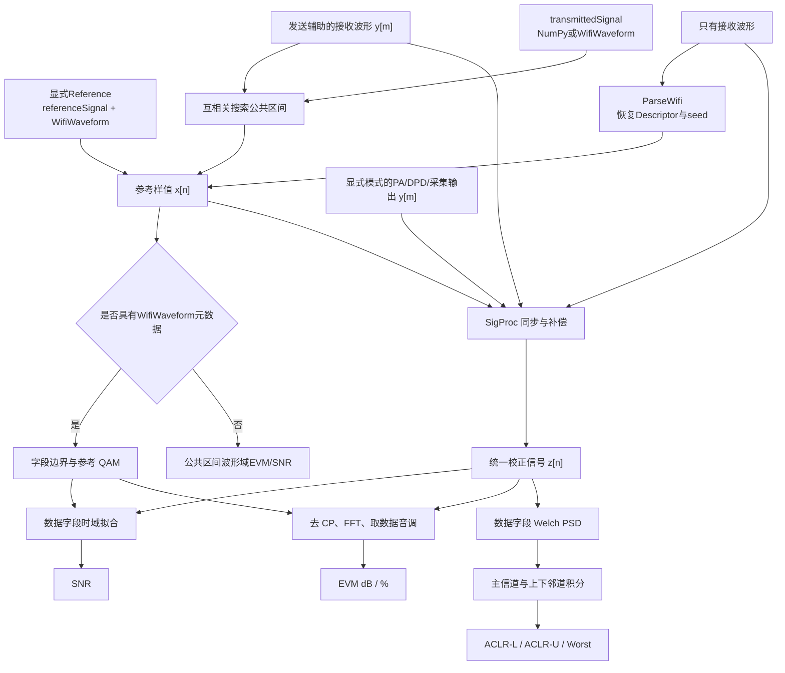
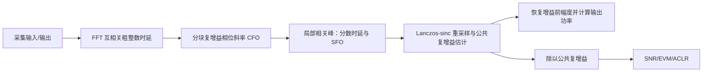
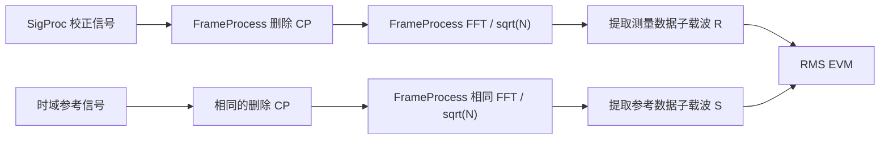
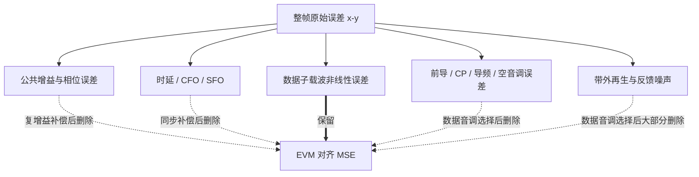
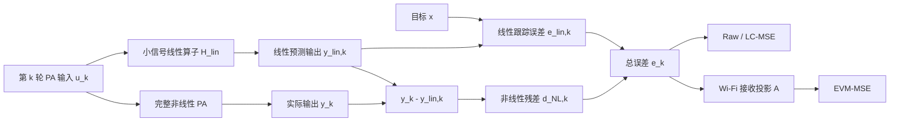
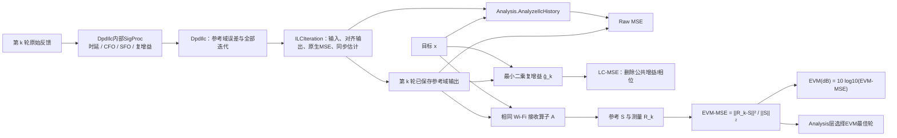
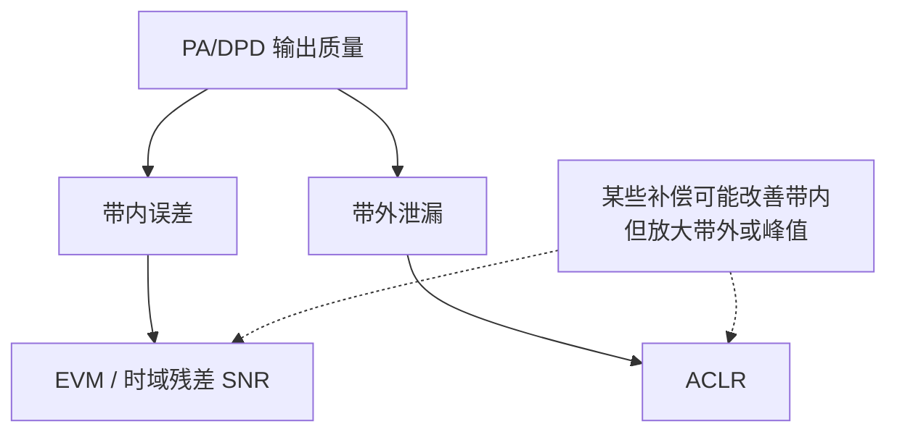
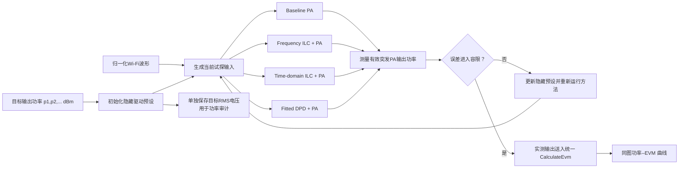
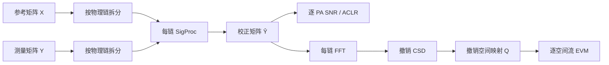

# 结果计算：SNR、EVM、IRR、ACLR 与功率–EVM 曲线原理

本文解释 `inc/lib/Analysis.py` 中结果统计的物理含义和公式推导。分析器始终需要一段发送参考样值，但参考来源有三种：调用方显式提供理想参考、调用方提供实际发送波形，或者在完全盲分析时由 `ParseWifi` 从接收帧恢复。只有严格的Wi-Fi子载波EVM需要 `WifiWaveform` 元数据；已知发送NumPy样值时无需猜测MCS、GI或seed，也能直接计算波形域EVM和SNR。待测信号可以来自PA模型、Channel、线缆、接收机、仪器抓包、普通算法输出、ILC或部署型DPD；Analysis对来源没有强制依赖，统一计算：

- 数据字段时域 SNR；
- Wi-Fi 数据子载波 RMS EVM；
- 上、下邻道 ACLR；
- 多方法功率–EVM 曲线。

> **重要定义**：进入指标计算前，`Analysis` 会调用 `SigProc` 消除整数/分数时延、载波频偏、采样频偏和最佳公共复增益。这里的 SNR 是校正后理想信号功率与全部残差功率之比；残差仍包含随机噪声、PA 非线性、记忆失真和同步估计残差，因此不一定等于仪器意义上的纯热噪声 SNR。

> **性能说明**：一次MIMO `Analyze()`中，汇总/逐流EVM共享各一次参考和测量解调，汇总/逐链ACLR共享每链一次PSD；功率-EVM扫描只计算EVM，ILC最佳轮直接复用逐轮已算指标。公开参考、Wi-Fi元数据、测量波形及最终metrics都不会跨调用缓存，避免调用方修改对象后得到陈旧结果。优化原理、典型耗时和使用建议见 [Performance.md](./Performance.md)。

---

## 1. 分析流程


```mermaid
flowchart TB
    explicit["显式Reference<br/>referenceSignal + WifiWaveform"] --> A["参考样值 x[n]"]
    assistedReceive["发送辅助的接收波形 y[m]"] --> overlap["互相关搜索公共区间"]
    assistedTransmit["transmittedSignal<br/>NumPy或WifiWaveform"] --> overlap
    overlap --> A
    blind["只有接收波形"] --> parser["ParseWifi<br/>恢复Descriptor与seed"]
    parser --> A
    A --> metadata{"是否具有WifiWaveform元数据"}
    metadata -->|是| B["字段边界与参考 QAM"]
    metadata -->|否| waveformMetric["公共区间波形域EVM/SNR"]
    assistedReceive --> D["SigProc 同步与补偿"]
    blind --> D
    C["显式模式的PA/DPD/采集输出 y[m]"] --> D
    A --> D
    D --> corrected["统一校正信号 z[n]"]
    B --> E["数据字段时域拟合"]
    corrected --> E
    E --> F["SNR"]
    B --> G["去 CP、FFT、取数据音调"]
    corrected --> G
    G --> I["EVM dB / %"]
    corrected --> J["数据字段 Welch PSD"]
    J --> K["主信道与上下邻道积分"]
    K --> L["ACLR-L / ACLR-U / Worst"]
```

**图 1 说明**：显式Reference模式不调用Parser；发送辅助模式只对两路样值做公共区间搜索，也不调用Parser；只有盲模式先由 `ParseWifi` 恢复参考和元数据。之后每个待测信号只执行一次 `SigProc.Process`，SNR、EVM、ACLR共用同一份校正样点。具有 `WifiWaveform` 元数据时，EVM由 `FrameProcess` 在去CP、FFT、撤销CSD和空间解映射后的数据子载波上计算；纯NumPy发送辅助模式则在公共时域样值上计算归一化EVM。三者观察的是不同维度，不能用单一指标替代全部结果。

### 1.1 三种Analysis构造方式

#### 模式一：显式Reference

```python
resultAnalysis = Analysis(referenceSignal, wifiWaveform)
metrics = resultAnalysis.Analyze(receivedSignal)
```

此模式直接保存参考和元数据，完全不调用 `ParseWifi`。

`WifiWaveform` 本身已经保存原始发送样值时，Reference允许为 `None`，也可以直接省略：

```python
resultAnalysis = Analysis(
    referenceSignal=None,
    waveform=wifiWaveform,
)
sameResultAnalysis = Analysis(waveform=wifiWaveform)

metrics = resultAnalysis.Analyze(receivedSignal)
sameMetrics = sameResultAnalysis.Analyze(receivedSignal)
```

这两种写法都会在内部使用 `wifiWaveform.samples`，不会重新生成波形，也不会调用Parser。发送辅助和盲分析模式的第一个参数代表接收波形，因此这两种模式不能把它设为 `None`。

#### 模式二：发送波形辅助

```python
resultAnalysis = Analysis(
    receivedSignal,
    transmittedSignal=transmitSignal,
)
metrics = resultAnalysis.Analyze()
```

`transmitSignal` 与 `receivedSignal` 都可以是NumPy数组或 `WifiWaveform`。Analysis直接使用发送样值，不读取Descriptor，不恢复seed、MCS、GI或Data，也不调用 `WaveGenWifi.Generate()`。

#### 模式三：盲分析

```python
resultAnalysis = Analysis(receivedSignal)
metrics = resultAnalysis.Analyze()
```

只有这个模式调用 `ParseWifi`，从接收帧Descriptor恢复参数、重建理想参考并保存裁剪后的接收包。

三种模式可由程序检查：

```python
print(resultAnalysis.GetAnalysisMode())
# "explicitReference", "transmitAssisted", or "blind"
```

发送辅助和盲分析在构造时保存了待测波形，所以 `Analyze()` 可以省略实参；显式Reference路径仍必须把待测波形传给 `Analyze`。

### 1.2 发送辅助模式为何不解析Descriptor

当发送样值已经存在时，它就是测量需要的真实参考。重新解析Descriptor再生成一份参考，会额外引入Descriptor判决、seed恢复和重生成一致性三类失败点，没有增加物理信息。发送辅助模式因此只做：

1. 把NumPy数组或 `WifiWaveform.samples` 统一转换成复数样值；
2. 用能量归一化互相关找出接收与发送记录的公共区间；
3. 在公共区间上执行整数/分数时延、CFO、SFO和公共复增益补偿；
4. 直接比较校正后的接收样值与发送样值。

设相关搜索得到接收起点 $n_y$、发送起点 $n_x$ 和公共长度 $L$。送入后续同步的两段信号为：

```math
x_o[k]=x[n_x+k],\qquad
y_o[k]=y[n_y+k],\qquad
0\leq k<L.
```

相关置信度是逐链归一化相关幅度的平均结果，其范围为0到1。坐标可以通过以下方式查看：

```python
overlap = resultAnalysis.GetSignalOverlapResult()
print(overlap.ToDict())
```

因此下列发送样值都可以直接使用，只要它们与接收记录仍有足够公共信号：

```python
Analysis(receivedSignal, transmittedSignal=tx[500:])
Analysis(receivedSignal, transmittedSignal=tx[:-300])
Analysis(
    receivedSignal,
    transmittedSignal=np.concatenate(
        [np.zeros(800, dtype=np.complex128), tx]
    ),
)
Analysis(receivedSignal, transmittedSignal=tx[1000:9000])
```

这些变形不会触发Descriptor恢复。相关器只关心两路波形是否存在可识别的公共区间。完整相关公式见 [SigProc.md](./SigProc.md)。

如果 `transmittedSignal` 是 `WifiWaveform`，Analysis直接复用对象元数据，因此可以继续计算严格的Wi-Fi子载波EVM和默认ACLR。如果它只是NumPy样值，则：

- EVM是同步后公共区间的归一化波形域RMS误差；
- SNR是参考能量与波形残差能量之比；
- 不提供频带定义时，三个ACLR字段返回 `NaN`；
- 同时提供真实 `sampleRateHz` 与 `channelBandwidthHz` 后才计算具有物理频率意义的ACLR。

```python
resultAnalysis = Analysis(
    receivedSignal,
    transmittedSignal=transmitSamples,
    sampleRateHz=320.0e6,
    channelBandwidthHz=80.0e6,
)
metrics = resultAnalysis.Analyze()
```

为兼容早期把接收机采样率统一放在Parser配置中的调用，发送辅助模式也接受：

```python
resultAnalysis = Analysis(
    receivedSignal,
    transmittedSignal=transmitSamples,
    parseParameters={
        "sampleRateHz": 320.0e6,
        "channelBandwidthHz": 80.0e6,
    },
)
metrics = resultAnalysis.Analyze()
```

这不改变分析路径：`GetAnalysisMode()` 仍返回
`"transmitAssisted"`，`GetParsedWifiFrame()` 仍返回 `None`。
Analysis只从该兼容映射读取 `sampleRateHz` 和
`channelBandwidthHz`；其他Parser专用键发出 `UserWarning` 后忽略。
若同一参数还通过 `sampleRateHz=`、`channelBandwidthHz=` 或
Analysis的 `parameters` 显式提供，显式Analysis配置优先。

### 1.3 直接输入接收波形估计EVM

如果接收波形已经保存为 NumPy 文件，Analysis不要求调用方同时提供理想参考波形。下面的代码只把接收采集送入Analysis，然后直接读取EVM：

```python
from pathlib import Path

import numpy as np

from inc.lib.Analysis import Analysis


# Load one complete receive capture, including the project signaling field.
receivedSignal = np.load(
    Path("captures") / "ehtReceiveCapture.npy"
)

# Supplying the known sample rate narrows the parser search range.
resultAnalysis = Analysis(
    receivedSignal,
    parseParameters={"sampleRateHz": 80.0e6},
)
metrics = resultAnalysis.Analyze()

print(f"EVM: {metrics['evmDb']:.3f} dB")
print(f"EVM: {metrics['evmPercent']:.3f} %")
```

这里没有向 `Analysis` 传入发送波形或 `WifiWaveform` 元数据。内部处理顺序是：

1. `ParseWifi` 在接收样值中搜索本工程的Wi-Fi描述字段；
2. 恢复帧格式、带宽、MCS、GI、空间流、随机种子和包起点；
3. 根据恢复结果重新生成理想参考帧；
4. `SigProc` 补偿整数时延、分数时延、载波频偏、采样频偏和公共复增益；
5. `FrameProcess` 去CP、执行FFT、提取数据子载波并计算EVM。

`sampleRateHz` 不是必须参数；省略时Parser会测试默认采样率候选列表。已知采样率时建议显式提供，这样可以减少搜索量并避免采样率候选歧义。接收数组应满足以下约定：

- SISO：形状为 `numSamples`；
- MIMO：形状为 `numSamples × numReceiveChains`；
- 数组中必须包含完整的本工程VHT、HE或EHT帧描述字段；
- 包前可以带有零样值、静默区或采集时延，默认最多搜索2000个前置样点，由 `maximumPacketOffsetSamples` 控制；
- 提供发送波形时，发送和接收长度可以不同。发送端前后补零、只把完整有效帧送入PA、或接收捕获更短都不会触发长度错误，`SigProc.EstimateSignalOverlap` 会在公共有效区间内完成对齐，不会调用Parser。

这里的“不要求等长”不等于“任意缺失样点都能恢复”。若裁剪只移除完整Wi-Fi帧外的补零，指标不受影响；若裁剪切入帧内OFDM符号，缺失信息会在同步到参考网格时保留为缺失误差，因此EVM会合理变差。

下面是一个不依赖外部采集文件、可以在本工程中直接运行的完整示例。虽然代码用PA模型产生接收波形，但送给Analysis的仍然只有 `receivedSignal`，没有提供发送参考：

```python
import numpy as np

from inc.lib.Analysis import Analysis
from inc.lib.PaModel import PaModel
from inc.lib.WaveGenWifi import WaveGenWifi


# Generate the waveform only to construct a reproducible receive example.
wifiWaveform = WaveGenWifi(
    frameFormat="EHT",
    bandwidthMhz=20,
    mcs=7,
    numDataSymbols=4,
    sampleRateHz=80.0e6,
    seed=101,
).Generate()

# Treat the nonlinear PA output as the received baseband waveform.
paModel = PaModel(modelName="wiener")
paOutput = paModel.Process(0.22 * wifiWaveform.samples)
receivedSignal = np.r_[
    np.zeros(24, dtype=np.complex128),
    paOutput,
    np.zeros(16, dtype=np.complex128),
]

# No transmittedSignal or reference waveform is passed to Analysis.
resultAnalysis = Analysis(
    receivedSignal,
    parseParameters={"sampleRateHz": 80.0e6},
)
metrics = resultAnalysis.Analyze()

print(f"SNR: {metrics['snrDb']:.3f} dB")
print(f"EVM: {metrics['evmDb']:.3f} dB")
print(f"EVM: {metrics['evmPercent']:.3f} %")
print(f"Worst ACLR: {metrics['aclrWorstDb']:.3f} dB")
```

如果接收端已经把样值和元数据包装成 `WifiWaveform`，入口不变：

```python
resultAnalysis = Analysis(receivedWifiWaveform)
metrics = resultAnalysis.Analyze()
print(metrics["evmDb"], metrics["evmPercent"])
```

`Analysis` 会在内部读取 `receivedWifiWaveform.samples`，调用方不需要选择另一套函数。对于MIMO接收波形，汇总EVM仍由 `metrics["evmDb"]` 和 `metrics["evmPercent"]` 给出；各空间流结果可以这样读取：

```python
mimoMetrics = resultAnalysis.GetLastMimoMetrics()
if mimoMetrics is not None:
    print(mimoMetrics["evmDbPerSpatialStream"])
    print(mimoMetrics["evmPercentPerSpatialStream"])
```

上述“仅接收波形”方式适用于由本工程 `WaveGenWifi` 生成且保留项目描述字段的波形。对于不含该描述字段的商业仪器抓包，应额外提供发送样值或完整接收配置；Parser不能仅凭任意未知波形无条件恢复随机载荷对应的理想星座。

---

## 2. 所有指标共同的前提：先同步再分析

`Analysis.PrepareMeasuredSignal` 会构造 `SigProc` 并执行以下处理：


```mermaid
flowchart LR
    A["采集输入/输出"] --> B["FFT 互相关粗整数时延"]
    B --> C["分块复增益相位斜率 CFO"]
    C --> D["局部相关峰：分数时延与 SFO"]
    D --> E["Lanczos-sinc 重采样与公共复增益估计"]
    E --> power["恢复增益前幅度并计算输出功率"]
    E --> compensate["除以公共复增益"]
    compensate --> F["SNR/EVM/ACLR"]
```

**图 2 说明**：同步误差必须在非线性评价之前处理，否则分析器会把“没有对齐”误判为 PA 或 DPD 失真。待测数组在同步前可以与参考长度不同；重采样结果固定映射到参考网格。输出功率保留公共复增益所代表的真实幅度，SNR、EVM和ACLR则继续使用去除公共复增益后的波形。完整估计公式、参数和边界见 [SigProc.md](./SigProc.md)。

---

## 3. 最佳公共复增益的最小二乘推导

设参考向量为 $\mathbf x$，测量向量为 $\mathbf y$。我们希望找到复数 $g$，使 $g\mathbf x$ 尽可能接近 $\mathbf y$：

```math
\hat g=\arg\min_g\|\mathbf y-g\mathbf x\|_2^2.
```

展开目标函数：

```math
J(g)
=
(\mathbf y-g\mathbf x)^H(\mathbf y-g\mathbf x)
=
\mathbf y^H\mathbf y-g\mathbf y^H\mathbf x
-g^*\mathbf x^H\mathbf y+|g|^2\mathbf x^H\mathbf x.
```

对 $g^*$ 求导并令其为零：

```math
\frac{\partial J}{\partial g^*}
=-\mathbf x^H\mathbf y+g\mathbf x^H\mathbf x=0.
```

得到

```math
\boxed{
\hat g=\frac{\mathbf x^H\mathbf y}{\mathbf x^H\mathbf x}
}
```

这就是 `SigProc.EstimateComplexGain`。`SigProc.Process` 随后计算 $\mathbf z=\mathbf y/\hat g$，`Analysis` 对 $\mathbf z$ 进行指标统计。

为了避免把文字和公式挤在同一行，几何关系完整写为：

```math
\mathrm{proj}_{\mathrm{span}(\mathbf{x})}(\mathbf{y})
=\hat{g}\,\mathbf{x}
=\frac{\mathbf{x}^{H}\mathbf{y}}
       {\mathbf{x}^{H}\mathbf{x}}\,\mathbf{x}.
```

也就是说，测量向量在参考向量所张成的一维子空间上的正交投影，就是最佳复增益与参考向量的乘积。投影后的残差定义为：

```math
\mathbf{e}=\mathbf{y}-\hat{g}\,\mathbf{x}.
```

残差与参考向量满足正交条件：

```math
\mathbf x^H\mathbf e=0.
```

因此一个统一的线性增益差和固定相位差不会被计作误差。这样比较 PA 与 DPD 时，指标更关注波形形状失真，而不是无关的标量增益。

### 3.1 模拟输出功率为何必须在复增益补偿前计算

设完成整数/分数时延、CFO和SFO校正后的第 $m$ 路 PA 输出为 $y_m[n]$。`SigProc.Process` 保存公共复增益 $\hat g_m$，并把补偿后的波形返回为

```math
z_m[n]=\frac{y_m[n]}{\hat g_m}.
```

如果直接对 $z_m[n]$ 求功率，公共幅度增益已经被除掉，PA压缩、线性增益以及测试链路增益都会被错误地隐藏。因此 `Analysis.CalculateOutputPower` 先用缓存结果恢复同步后、增益补偿前的幅度：

```math
\tilde y_m[n]=\hat g_m z_m[n].
```

只恢复幅度不会撤销同步。$\tilde y_m[n]$ 仍位于参考采样网格上。除此之外，功率计算还调用 `PowerCalibration.FindActiveSampleMask`：它以每一路峰值下 `activePowerThresholdDb` 为门限，填充不超过 `activeGapToleranceSamples` 的短暂低幅空洞，但排除前后补零和更长的内部静默区。令掩码为 $M_m[n]$，有效样点数为

```math
N_{m,\mathrm{active}}
=
\sum_n M_m[n].
```

第 $m$ 路归一化复包络有效区RMS为

```math
a_m=
\sqrt{
\frac{
\sum_n
M_m[n]
\left|\tilde y_m[n]\right|^2
}{
N_{m,\mathrm{active}}
}
}.
```

因此，发送端或接收端在帧外增加的前后补零不会拉低报告功率；周期发送波形中的长关断区也不进入分母。短暂OFDM过零仍属于有效突发。该指标表示“PA开启并发送Wi-Fi突发时的平均功率”，不是把关断时间包含在内的长期占空比平均功率。若需要后者，可另外乘占空比 $D$：

```math
P_{\mathrm{long,dBm}}
=
P_{\mathrm{active,dBm}}
+10\log_{10}(D).
```

本工程采用明确的满量程标定约定：归一化 RMS 等于 1 时，对应 `maximumOutputPowerDbm`。设该额定值为 $P_{\mathrm{max,dBm}}$，端口电阻为 $R$，则满量程 RMS 电压为

```math
V_{\mathrm{FS}}=
\sqrt{
R\cdot 10^{-3}\cdot
10^{P_{\mathrm{max,dBm}}/10}
}.
```

实际第 $m$ 路 RMS 电压和输出功率分别为

```math
V_m=a_m V_{\mathrm{FS}},
```

```math
P_{m,\mathrm{dBm}}
=
10\log_{10}
\left(
\frac{V_m^2/R}{10^{-3}}
\right)
=
P_{\mathrm{max,dBm}}+20\log_{10}(a_m).
```

默认值是 $R=50\ \Omega$、$P_{\mathrm{max,dBm}}=25\ \mathrm{dBm}$、`activePowerThresholdDb=-60.0`、`activeGapToleranceSamples=16`。定点模式先把公开整数 I/Q 码按位宽解码成归一化复包络，再使用同一公式，所以浮点和定点入口具有相同的功率定义。若外部系统使用不同的满量程功率，必须通过 `maximumOutputPowerDbm` 传入实际标定值；它不是由EVM或复增益自动猜测出来的。完整有效区检测与任意幅度重标定推导见 [SigProc.md](./SigProc.md#131-有效信号区间与占空比)。

MIMO 的每路 PA 是独立传导端口，不能把复电压直接相加。总输出功率应先在线性功率域相加：

```math
P_{\mathrm{all,mW}}
=\sum_{m=1}^{N_{\mathrm{TX}}}
10^{P_{m,\mathrm{dBm}}/10},
```

```math
P_{\mathrm{all,dBm}}
=10\log_{10}\left(P_{\mathrm{all,mW}}\right).
```

因此 `metrics["outputPowerDbm"]` 在SISO时等于单路功率，在MIMO时表示全部独立PA端口的功率和；`GetLastMimoMetrics()["outputPowerDbmPerChain"]` 则保留每一路结果。该汇总不表示某个远场方向的相干阵列功率，后者还需要天线阵列与无线信道模型。

---

## 4. SNR 的计算与解释

### 4.1 代码定义

分析器只截取当前格式对应的 VHT-Data、HE-Data 或 EHT-Data 字段。令参考数据字段为 $\mathbf x$，`SigProc` 输出的校正数据字段为 $\mathbf z$，则

```math
\mathbf s=\mathbf x,
\qquad
\mathbf e=\mathbf z-\mathbf x.
```

信号功率和误差功率为

```math
P_s=\frac{1}{N}\sum_{n=0}^{N-1}|s[n]|^2,
```

```math
P_e=\frac{1}{N}\sum_{n=0}^{N-1}|e[n]|^2.
```

于是

```math
\boxed{
\mathrm{SNR}_{\mathrm{dB}}
=10\log_{10}\frac{P_s}{P_e}
}
```

### 4.2 为什么功率比使用 $10\log_{10}$

分贝对功率的定义为

```math
L_{\mathrm{dB}}=10\log_{10}\frac{P_1}{P_0}.
```

若改用 RMS 电压或复幅度比 $A_1/A_0$，在阻抗相同条件下 $P\propto A^2$，因此

```math
10\log_{10}\left(\frac{A_1}{A_0}\right)^2
=20\log_{10}\frac{A_1}{A_0}.
```

### 4.3 这里的残差包含什么

在 `SigProc` 已消除同步误差和公共复增益后，如果

```math
z[n]=x[n]+w[n],
```

且 $w[n]$ 是与信号不相关的 AWGN，那么此定义接近通常的 SNR。但 PA 输出更可能是

```math
z[n]=x[n]+d_{\mathrm{NL}}[n]+d_{\mathrm{mem}}[n]+w[n],
```

所以误差功率包含：

```math
P_e\approx P_{\mathrm{NL}}+P_{\mathrm{mem}}+P_n+P_{\mathrm{cross}}.
```

因此它也可以理解为信号与总失真加噪声之比（接近 SINAD 思想）。指标越大越好。

### 4.4 为什么只分析数据字段

前导、信令和数据的功率统计、子载波占用及训练结构不同。只取数据字段可以：

- 避免字段拼接瞬态影响结果；
- 与数据 EVM 使用相同主要业务区间；
- 比较不同帧格式时减少前导长度差异带来的偏差。

---

## 5. EVM：星座点偏离理想位置的程度

EVM（Error Vector Magnitude）直接在 IQ 平面测量误差矢量。

```text
Q
^                     R：实测点
|                    ●
|                  ↗ │
|       误差向量 e  /  │
|                /    │
|      S：理想点 ●-----┘
+--------------------------------> I
```

**图 3 说明**：理想星座点为 $S$，实测点为 $R$，两者之差 $E=R-\hat gS$ 是误差向量。EVM 将全部数据子载波和 OFDM 符号上的误差能量汇总，再相对理想星座能量归一化。

### 5.1 OFDM 解调步骤

每个数据 OFDM 符号的总长度为

```math
N_s=N_{\mathrm{CP}}+N_{\mathrm{FFT}}.
```

对第 $q$ 个符号：

1. 根据 `dataSymbolStarts[q]` 找到符号起点；
2. 丢弃前 $N_{\mathrm{CP}}$ 个采样；
3. 对后 $N_{\mathrm{FFT}}$ 个样点做能量归一化 FFT；
4. 按 `dataSubcarriers` 取出数据音调，忽略导频和空音调。

公式为

```math
R_q[k]=\frac{1}{\sqrt N}
\sum_{n=0}^{N-1}r_q[n]e^{-j2\pi kn/N}.
```

注意这里 NumPy `fft` 本身没有 $1/N$，除以 $\sqrt N$ 正好与发送端 `ifft × sqrt(N)` 配对。


```mermaid
flowchart LR
    A["SigProc 校正信号"] --> B["FrameProcess 删除 CP"]
    reference["时域参考信号"] --> B2["相同的删除 CP"]
    B --> C["FrameProcess FFT / sqrt(N)"]
    B2 --> C2["FrameProcess 相同 FFT / sqrt(N)"]
    C --> D["提取测量数据子载波 R"]
    C2 --> D2["提取参考数据子载波 S"]
    D --> G["RMS EVM"]
    D2 --> G
```

**图 4 说明**：EVM 不在原始时域直接计算，而是按 Wi-Fi 接收机思路先恢复每个数据子载波。这样指标对应星座判决质量。

### 5.2 RMS EVM 公式

把所有数据符号和数据子载波展平成向量。理想星座为 $\mathbf S$，校正后的测量星座为 $\mathbf R$。公共复增益已经在时域由 `SigProc` 去除，因此这里不再执行第二次增益拟合。误差为

```math
\mathbf E=\mathbf R-\mathbf S.
```

RMS EVM 比值为

```math
\boxed{
\mathrm{EVM}_{\mathrm{rms}}
=\sqrt{\frac{\sum_i|E_i|^2}
{\sum_i|S_i|^2}}
}
```

百分比为

```math
\boxed{
\mathrm{EVM}_{\%}=100\times\mathrm{EVM}_{\mathrm{rms}}
}
```

分贝形式为

```math
\boxed{
\mathrm{EVM}_{\mathrm{dB}}
=20\log_{10}\mathrm{EVM}_{\mathrm{rms}}
}
```

EVM 是幅度比，所以使用 $20\log_{10}$。例如：

| EVM (%) | EVM 比值 | EVM (dB) |
|---:|---:|---:|
| 10% | 0.1 | -20 dB |
| 3.16% | 0.0316 | -30 dB |
| 1% | 0.01 | -40 dB |

EVM dB 越负越好；EVM 百分比越小越好。

### 5.3 EVM 能看到哪些失真

EVM 会综合反映：

- PA AM-AM 压缩；
- AM-PM 幅相转换；
- 记忆引起的子载波相关误差；
- IQ 镜像；
- 噪声；
- 同步估计残差和未均衡的频率选择性响应。

`SigProc` 会去掉一个统一的复增益，因此不会惩罚全体星座共同的固定缩放和旋转；频率选择性幅相起伏仍会进入 EVM。

### 5.4 EVM 与 SNR 的近似关系

若误差只有与信号不相关的白噪声，且信号归一化一致，则

```math
\mathrm{EVM}_{\mathrm{rms}}^2\approx\frac{P_e}{P_s}.
```

于是

```math
\mathrm{EVM}_{\mathrm{dB}}
=
20\log_{10}\sqrt{\frac{P_e}{P_s}}
=
10\log_{10}\frac{P_e}{P_s}
\approx
-\mathrm{SNR}_{\mathrm{dB}}.
```

这个关系只是理想近似。当前 SNR 在时域数据样点上计算，EVM 在频域数据子载波上计算；空音调、导频、非线性带外能量和记忆失真会使两者不再严格互为相反数。

### 5.5 为什么原始 MSE 不能总是反映 EVM

第 $k$ 轮 ILC 的目标时域波形记为参考向量，PA 反馈记为测量向量：

```math
\mathbf{x}\in\mathbb{C}^{N},
\qquad
\mathbf{y}_k\in\mathbb{C}^{N}.
```

最直接的原始 MSE 是：

```math
\boxed{
\mathrm{MSE}_{\mathrm{raw},k}
=\frac{1}{N}\left\|\mathbf{x}-\mathbf{y}_k\right\|_2^2
}
```

对应的归一化值为：

```math
\mathrm{NMSE}_{\mathrm{raw},k}
=\frac{\left\|\mathbf{x}-\mathbf{y}_k\right\|_2^2}
       {\left\|\mathbf{x}\right\|_2^2}.
```

这个定义要求测量波形在**绝对幅度、绝对相位、采样位置以及每个时域样点**上都等于参考。因此它会同时统计：

- PA 或反馈链的公共线性增益；
- 公共相位旋转；
- 整数时延和分数时延；
- 载波频偏和采样频偏；
- 前导、信令、循环前缀、导频和空子载波对应的误差；
- 真正影响数据判决的带内非线性误差；
- 带外频谱再生、反馈噪声和截断误差。

EVM 并不保留上述全部分量。它先执行同步和公共复增益补偿，然后只统计数据 OFDM 符号的数据子载波。因此原始 MSE 与 EVM 的评价空间不同，曲线不要求同步单调。


```mermaid
flowchart TB
    raw["整帧原始误差 x-y"] --> gain["公共增益与相位误差"]
    raw --> sync["时延 / CFO / SFO"]
    raw --> data["数据子载波非线性误差"]
    raw --> nondat["前导 / CP / 导频 / 空音调误差"]
    raw --> oob["带外再生与反馈噪声"]
    gain -.->|复增益补偿后删除| evm["EVM 对齐 MSE"]
    sync -.->|同步补偿后删除| evm
    data ==>|保留| evm
    nondat -.->|数据音调选择后删除| evm
    oob -.->|数据音调选择后大部分删除| evm
```

**图 5-1 说明**：原始 MSE 是所有分量的总观测，而 EVM 对齐 MSE 是经过接收机处理后的子空间观测。ILC 可能继续减小图中的“数据子载波非线性误差”，但公共增益或带外误差已经成为原始 MSE 的主导项，所以会出现原始 MSE 看似不再改善、EVM 却继续改善的现象。

### 5.6 公共线性项怎样形成 MSE 地板

用最小二乘复增益把测量向量精确分解为：

```math
\mathbf{y}_k=\hat{g}_k\mathbf{x}+\mathbf{e}_{\perp,k},
```

其中：

```math
\hat{g}_k
=\frac{\mathbf{x}^{H}\mathbf{y}_k}
       {\mathbf{x}^{H}\mathbf{x}},
\qquad
\mathbf{x}^{H}\mathbf{e}_{\perp,k}=0.
```

因为公共线性项和残差正交，勾股关系给出：

```math
\left\|\mathbf{y}_k-\mathbf{x}\right\|_2^2
=
\left\|(\hat{g}_k-1)\mathbf{x}
+\mathbf{e}_{\perp,k}\right\|_2^2
=
\left|\hat{g}_k-1\right|^2
  \left\|\mathbf{x}\right\|_2^2
  +\left\|\mathbf{e}_{\perp,k}\right\|_2^2.
```

所以原始归一化 MSE 可写为：

```math
\boxed{
\mathrm{NMSE}_{\mathrm{raw},k}
=\left|\hat{g}_k-1\right|^2
+\frac{\left\|\mathbf{e}_{\perp,k}\right\|_2^2}
       {\left\|\mathbf{x}\right\|_2^2}
}
```

第一项是公共增益和相位造成的线性误差，第二项才是不能由一个复标量解释的波形形状误差。即使第二项因 ILC 持续下降，只要第一项更大，原始 MSE 曲线就会出现明显地板。

例如一个完全没有非线性失真的输出仅有固定增益：

```math
\mathbf{y}=0.7\mathbf{x}.
```

此时 EVM 在复增益补偿后理论上为零，但原始归一化 MSE 为：

```math
\mathrm{NMSE}_{\mathrm{raw}}
=|0.7-1|^2
=0.09
\approx-10.46\ \mathrm{dB}.
```

因此不能把原始 NMSE 的 −10.46 dB 误认为星座仍有同等大小的非线性误差。

### 5.7 第一级优化：线性补偿 MSE

当调用方只有普通复基带波形、没有 Wi-Fi 字段和子载波元数据时，可以先去除最佳公共复增益。把测量波形折算回参考幅度：

```math
\mathbf{z}_k=\frac{\mathbf{y}_k}{\hat{g}_k}.
```

本工程定义线性补偿 MSE 为：

```math
\boxed{
\mathrm{MSE}_{\mathrm{LC},k}
=\frac{1}{N}
 \left\|\frac{\mathbf{y}_k}{\hat{g}_k}-\mathbf{x}\right\|_2^2
=\frac{\left\|\mathbf{e}_{\perp,k}\right\|_2^2}
       {N\left|\hat{g}_k\right|^2}
}
```

这里最容易产生的疑问是：把 $\mathbf{y}_k$ 的公共复增益去掉之后，测量信号和参考信号的幅度是否仍然一致？答案是肯定的，因为 $\hat{g}_k$ 表示从参考幅度到测量幅度的复比例，即“测量幅度/参考幅度”。所以 $\mathbf{y}_k/\hat{g}_k$ 已经被折算回参考信号的幅度和相位尺度，而不是把两个不同尺度的量直接相减。

把正交分解代入补偿表达式：

```math
\frac{\mathbf{y}_k}{\hat{g}_k}
=\frac{\hat{g}_k\mathbf{x}+\mathbf{e}_{\perp,k}}
       {\hat{g}_k}
=\mathbf{x}+\frac{\mathbf{e}_{\perp,k}}{\hat{g}_k}.
```

因此补偿后的误差为：

```math
\frac{\mathbf{y}_k}{\hat{g}_k}-\mathbf{x}
=\frac{\mathbf{y}_k-\hat{g}_k\mathbf{x}}
       {\hat{g}_k}
=\frac{\mathbf{e}_{\perp,k}}{\hat{g}_k}.
```

这说明代码不必显式计算 $\mathbf{y}_k/\hat{g}_k$。它可以先计算输出尺度的正交残差 $\mathbf{e}_{\perp,k}=\mathbf{y}_k-\hat{g}_k\mathbf{x}$，再把残差功率除以 $|\hat{g}_k|^2$，两种写法严格等价：

```math
\frac{1}{N}
\left\|
\frac{\mathbf{y}_k}{\hat{g}_k}-\mathbf{x}
\right\|_2^2
=
\frac{\left\|\mathbf{y}_k-\hat{g}_k\mathbf{x}\right\|_2^2}
     {N|\hat{g}_k|^2}.
```

如果只计算下面的量，并把它直接称为参考尺度的 LC-MSE，则确实是错误的：

```math
\frac{1}{N}
\left\|\mathbf{y}_k-\hat{g}_k\mathbf{x}\right\|_2^2.
```

原因是该残差仍处于测量输出的幅度尺度；当不同迭代轮次的 $|\hat{g}_k|$ 发生变化时，它不能与参考尺度 MSE 直接比较。本工程的 `CalculateIterationMetrics` 明确除以 $|\hat{g}_k|^2$，因此没有遗漏这一尺度换算。

一个直观例子是只有公共衰减和相移、没有波形失真：

```math
\mathbf{y}
=0.7e^{j30^\circ}\mathbf{x},
\qquad
\hat{g}=0.7e^{j30^\circ}.
```

补偿后得到：

```math
\frac{\mathbf{y}}{\hat{g}}=\mathbf{x},
\qquad
\mathrm{MSE}_{\mathrm{LC}}=0.
```

这里 LC-MSE 为零并不表示 PA 的绝对增益完全正确，而是表示除公共幅度和相位之外没有剩余波形失真。这正是 LC-MSE 的设计目的：Raw MSE 负责保留绝对增益和相位误差，LC-MSE 负责观察去除公共线性项后的波形形状。

再用参考时域平均功率归一化：

```math
\boxed{
\mathrm{NMSE}_{\mathrm{LC},k}
=\frac{\mathrm{MSE}_{\mathrm{LC},k}}
       {\frac{1}{N}\left\|\mathbf{x}\right\|_2^2}
}
```

`CalculateIterationMetrics` 对每轮都输出 `linearCompensatedMse` 和 `linearCompensatedNmseDb`。它们删除了公共幅度和相位项，因此通常比原始 MSE 更接近 EVM 趋势；同时输出的 `complexGainMagnitudeDb` 和 `complexGainPhaseDegrees` 用于确认被删除的线性项是否正在漂移。

线性补偿 MSE 仍然只是 EVM 的**代理指标**，原因是它仍在整帧时域统计，尚未删除同步残差、前导、CP、导频、空音调和带外分量。

此外，当 $|\hat{g}_k|$ 接近零时，除以 $|\hat{g}_k|^2$ 会显著放大反馈噪声和数值误差，此时 LC-MSE 不再具有稳定的工程含义。实际使用时应同时检查公共增益、Raw MSE 和 PA 输出功率；如果目标是评价绝对功率或增益压缩，就不能只使用 LC-MSE。如果目标是评价最终 Wi-Fi 调制质量，则应优先使用下一节定义的 EVM 对齐 MSE。

#### 5.7.1 PA 的线性影响和非线性影响是否都被考虑

需要把这个问题分成三个层次：

1. PA 行为模型是否包含线性和非线性影响；
2. ILC 更新是否同时面对线性和非线性影响；
3. 结果统计是否已经把两种影响分别输出。

本工程在前两个层次都考虑了线性和非线性影响，但当前结果统计没有把频率选择性线性误差与非线性误差单独列成两条功率曲线。

对于任意工作点，可以先选定一个小信号线性算子 $\mathbf{H}_{\mathrm{lin}}$，然后把 PA 输出分解为：

```math
\boxed{
\mathbf{y}_k
=\mathbf{H}_{\mathrm{lin}}\mathbf{u}_k
+\mathbf{d}_{\mathrm{NL},k}
+\mathbf{n}_k
}
```

其中：

- $\mathbf{u}_k$ 是第 $k$ 轮送入 PA 的复基带波形；
- $\mathbf{H}_{\mathrm{lin}}\mathbf{u}_k$ 是小信号线性增益、线性记忆、幅频响应、相频响应和群时延共同形成的输出；
- $\mathbf{d}_{\mathrm{NL},k}$ 是相对于所选线性算子的非线性残差，包含 AM-AM、AM-PM、互调和非线性记忆；
- $\mathbf{n}_k$ 是反馈噪声、量化噪声或其他测量误差。

非线性残差的定义为：

```math
\boxed{
\mathbf{d}_{\mathrm{NL},k}
=\mathbf{y}_k
-\mathbf{H}_{\mathrm{lin}}\mathbf{u}_k
-\mathbf{n}_k
}
```

这里的分解依赖于如何定义 $\mathbf{H}_{\mathrm{lin}}$。本工程频域 ILC 使用低功率探测波形估计线性频率响应，因为低功率工作点能够尽量减小增益压缩和谱再生对线性估计的污染：

```math
\hat{H}_{\mathrm{lin}}[m]
\approx
\frac{
Y_{\mathrm{probe}}[m]U_{\mathrm{probe}}^*[m]
}{
|U_{\mathrm{probe}}[m]|^2+\lambda
}.
```

然后构造正则化学习滤波器：

```math
L[m]
=\mu
\frac{
\hat{H}_{\mathrm{lin}}^*[m]
}{
|\hat{H}_{\mathrm{lin}}[m]|^2+\lambda
}.
```

因此 ILC 对线性部分不是只使用一个公共复增益，而是利用逐频点线性响应补偿 PA 的线性记忆。非线性部分则不被假定为固定线性传递函数；每一轮都重新测量完整 PA 输出：

```math
\mathbf{e}_k
=\mathbf{x}-\mathcal{P}(\mathbf{u}_k),
```

所以当前工作点下的增益压缩、AM-PM、非线性记忆和削顶都会进入下一轮更新。

Wiener PA 的结构可以概括为：

```math
\mathbf{u}
\rightarrow
\mathbf{H}_{\mathrm{lin}}\mathbf{u}
\rightarrow
f_{\mathrm{AM-AM,AM-PM}}
\rightarrow
\mathbf{y}.
```

其中 FIR 部分表示线性记忆，Rapp AM-AM 和幅度相关相位旋转表示无记忆非线性。GMP PA 则把一阶项和高阶项放在同一基函数展开中：

```math
y[n]
=
\sum_m a_{1,m}u[n-m]
+
\sum_{p=3,5,\ldots}\sum_m
a_{p,m}u[n-m]|u[n-m]|^{p-1}
+
\mathcal{C}_{\mathrm{GMP}}[n].
```

第一项是线性记忆；高阶主支路和交叉项 $\mathcal{C}_{\mathrm{GMP}}[n]$ 表示非线性及非线性记忆。

公共复增益 $\hat{g}_k$ 只是整个线性算子中的一个标量分量。LC-MSE 删除的是：

```math
\hat{g}_k\mathbf{x},
```

而不是完整的：

```math
\mathbf{H}_{\mathrm{lin}}\mathbf{u}_k.
```

所以即使 $\hat{g}_k$ 在迭代后期基本不变，频率选择性的线性影响仍然可能变化。原因是 PA 的线性算子虽然固定，但 ILC 输入每轮都在变化：

```math
\mathbf{u}_{k+1}\ne\mathbf{u}_k
\quad\Longrightarrow\quad
\mathbf{H}_{\mathrm{lin}}\mathbf{u}_{k+1}
\ne
\mathbf{H}_{\mathrm{lin}}\mathbf{u}_k.
```

若暂时忽略噪声，定义线性跟踪误差：

```math
\mathbf{e}_{\mathrm{lin},k}
=\mathbf{x}
-\mathbf{H}_{\mathrm{lin}}\mathbf{u}_k,
```

则总跟踪误差为：

```math
\mathbf{e}_k
=\mathbf{e}_{\mathrm{lin},k}
-\mathbf{d}_{\mathrm{NL},k}.
```

普通 MSE 不能简单理解为“线性误差功率加非线性误差功率”，因为两部分通常相关，还存在交叉项：

```math
\boxed{
\mathrm{MSE}_{\mathrm{raw},k}
=P_{\mathrm{lin},k}
+P_{\mathrm{NL},k}
-\frac{2}{N}
\Re\left\{
\mathbf{e}_{\mathrm{lin},k}^{H}
\mathbf{d}_{\mathrm{NL},k}
\right\}
}
```

其中：

```math
P_{\mathrm{lin},k}
=\frac{1}{N}
\|\mathbf{e}_{\mathrm{lin},k}\|_2^2,
\qquad
P_{\mathrm{NL},k}
=\frac{1}{N}
\|\mathbf{d}_{\mathrm{NL},k}\|_2^2.
```

这意味着 ILC 可能在降低数据子载波非线性误差的同时改变线性误差与非线性误差之间的相消或相长关系，使普通 MSE 和 EVM 出现不同趋势。

EVM 同样不是纯非线性指标。它观察的是接收处理算子 $\mathcal{A}$ 投影后的总数据子载波误差：

```math
\mathrm{MSE}_{\mathrm{EVM},k}
=
\frac{
\left\|
\mathcal{A}(\mathbf{e}_{\mathrm{lin},k})
-\mathcal{A}(\mathbf{d}_{\mathrm{NL},k})
-\mathcal{A}(\mathbf{n}_k)
\right\|_2^2
}{
\|\mathcal{A}(\mathbf{x})\|_2^2
}.
```

因此数据子载波上的线性幅相起伏、非线性失真和残余噪声都会进入 EVM；接收机删除的只是公共复增益、同步误差和未被选中的时频分量。


```mermaid
flowchart LR
    input["第 k 轮 PA 输入 u_k"] --> linear["小信号线性算子 H_lin"]
    input --> fullPa["完整非线性 PA"]
    linear --> linearOutput["线性预测输出 y_lin,k"]
    fullPa --> measured["实际输出 y_k"]
    linearOutput --> subtract["y_k - y_lin,k"]
    measured --> subtract
    subtract --> nonlinear["非线性残差 d_NL,k"]
    target["目标 x"] --> linearError["线性跟踪误差 e_lin,k"]
    linearOutput --> linearError
    linearError --> total["总误差 e_k"]
    nonlinear --> total
    total --> raw["Raw / LC-MSE"]
    total --> receiver["Wi-Fi 接收投影 A"]
    receiver --> evm["EVM-MSE"]
```

**图 5-3 说明**：小信号线性算子提供一个明确的分解基准，实际 PA 输出与线性预测输出之差定义为非线性残差。Raw MSE、LC-MSE 和 EVM-MSE 当前都消费两部分合成后的总误差，只是补偿与投影空间不同；它们没有把线性功率、非线性功率和交叉项分别输出。

如果后续需要显式观察两种影响，应增加以下诊断量：

```math
\mathrm{MSE}_{\mathrm{linear},k}
=
\frac{1}{N}
\left\|
\mathbf{x}
-\mathbf{H}_{\mathrm{lin}}\mathbf{u}_k
\right\|_2^2,
```

```math
P_{\mathrm{NL},k}
=
\frac{1}{N}
\left\|
\mathbf{y}_k
-\mathbf{H}_{\mathrm{lin}}\mathbf{u}_k
\right\|_2^2,
```

以及线性—非线性交叉项。还可以把两个分量分别送入相同的 Wi-Fi 接收投影 $\mathcal{A}$，得到数据子载波上的线性 EVM 贡献、非线性 EVM 贡献和交叉贡献。需要注意，这种分解不是唯一的，必须同时记录所采用的小信号探测幅度、线性响应估计方法和正则化参数。

### 5.8 第二级优化：严格的 EVM 对齐 MSE

定义一个接收处理算子：

```math
\mathcal{A}
=\mathcal{P}_{\mathrm{data}}
 \mathcal{F}_{\mathrm{FFT}}
 \mathcal{R}_{\mathrm{CP}}
 \mathcal{W}_{\mathrm{data\ field}}
 \mathcal{C}_{\mathrm{sync}}.
```

各部分依次表示：同步及公共复增益补偿、数据字段截取、循环前缀删除、FFT 和数据子载波选择。MIMO 时，算子中还包含 CSD 撤销与空间解映射。参考星座和测量星座为：

```math
\mathbf{S}=\mathcal{A}(\mathbf{x}),
\qquad
\mathbf{R}_k=\mathcal{A}(\mathbf{y}_k).
```

先定义星座域的绝对均方误差：

```math
\mathrm{MSE}_{\mathrm{symbol},k}
=\frac{1}{K}\left\|\mathbf{R}_k-\mathbf{S}\right\|_2^2.
```

为了跨 MCS、功率和空间流比较，还必须除以参考星座平均功率。本工程把这个无量纲量称为 EVM 对齐 MSE：

```math
\boxed{
\mathrm{MSE}_{\mathrm{EVM},k}
=\frac{\left\|\mathbf{R}_k-\mathbf{S}\right\|_2^2}
       {\left\|\mathbf{S}\right\|_2^2}
}
```

它与 RMS EVM 不是近似关系，而是严格恒等关系：

```math
\boxed{
\mathrm{MSE}_{\mathrm{EVM},k}
=\mathrm{EVM}_{\mathrm{rms},k}^{2}
}
```

因此：

```math
\boxed{
\mathrm{EVM}_{\mathrm{dB},k}
=10\log_{10}\mathrm{MSE}_{\mathrm{EVM},k}
}
```

注意最后一个公式使用 $10\log_{10}$，因为这里输入的是已经平方后的功率比；它与对 RMS 幅度比使用 $20\log_{10}$ 完全等价：

```math
10\log_{10}(\mathrm{EVM}_{\mathrm{rms}}^2)
=20\log_{10}(\mathrm{EVM}_{\mathrm{rms}}).
```

代码中的 `Analysis.CalculateEvmAlignedMse` 实现上述完整算子。`DpdIlc` 在迭代期间完全不调用该方法，但会先调用独立的 `SigProc`，把每轮反馈同步并除去公共复增益，再使用该参考域波形计算原生MSE和ILC更新。`ILCIteration` 保存原生MSE、当前输入、参考域对齐输出以及本轮同步估计。ILC结束后，`Analysis.AnalyzeIlcHistory` 对每轮对齐输出调用普通 `Analyze`，把SNR、EVM、ACLR和原生MSE合并为 `ILCPerformanceIteration`，并在分析层按严格EVM在线维护最佳轮。该轮已经得到的metrics会直接复用，只复制当前最佳输入和输出，不在循环结束后再次分析最佳波形。MIMO对应使用 `AnalyzeMimoIlcHistory`，它先按轮组合全部PA链，再执行完整空间解映射。


```mermaid
flowchart LR
    capture["第 k 轮原始反馈"] --> ilcSync["DpdIlc内部SigProc<br/>时延 / CFO / SFO / 复增益"]
    ilcSync --> ilc["DpdIlc：参考域误差与全部迭代"]
    ilc --> history["ILCIteration：输入、对齐输出、原生MSE、同步估计"]
    history --> postAnalysis["Analysis.AnalyzeIlcHistory"]
    history --> feedback["第 k 轮已保存参考域输出"]
    reference["目标 x"] --> postAnalysis
    postAnalysis --> raw["Raw MSE"]
    feedback --> raw
    reference --> ls["最小二乘复增益 ĝ_k"]
    feedback --> ls
    ls --> lc["LC-MSE：删除公共增益/相位"]
    reference --> receiver["相同 Wi-Fi 接收算子 A"]
    feedback --> receiver
    receiver --> tones["参考 S 与测量 R_k"]
    tones --> evmMse["EVM-MSE = ||R_k-S||² / ||S||²"]
    evmMse --> identity["EVM(dB) = 10 log10(EVM-MSE)"]
    evmMse --> best["Analysis层选择EVM最佳轮"]
```

**图 5-2 说明**：算法层先完成反馈同步、复增益对齐和学习，再保存每轮参考域波形；分析层随后统一计算RF指标。此处Raw MSE已经不含原始采集的公共增益、公共相位和主要同步误差，用来判断参考域整帧波形是否跟踪目标；LC-MSE继续去除残余的微小公共线性项；EVM-MSE通过与最终EVM完全相同的Wi-Fi接收链得到，因此仍是判断调制质量和选择最终轮次的首选指标。物理PA输出幅度没有丢失：它保存在 `feedbackComplexGain` 中，而 `ILCResult.outputSignal` 仍返回最佳输入对应的原始干净PA输出。

### 5.9 三种 MSE 应当怎样联合阅读

| 观察到的曲线 | 最可能的解释 | 建议检查 |
|---|---|---|
| Raw MSE 停滞，LC-MSE 与 EVM-MSE 继续下降 | 公共增益/相位项主导原始误差 | `complexGainMagnitudeDb`、`complexGainPhaseDegrees` |
| Raw MSE 与 LC-MSE 停滞，EVM-MSE 继续下降 | 误差从数据音调转移到前导、CP、导频、空音调或带外 | ACLR、频谱、分字段 MSE |
| LC-MSE 下降，EVM-MSE 变差 | 整帧时域拟合改善，但数据音调被牺牲 | 学习滤波器带宽、数据音调权重 |
| EVM-MSE 到达地板并小幅抖动 | 反馈噪声、量化噪声或同步估计方差开始主导 | 增加反馈平均、固定同步估计、提高采集 SNR |
| 三者同时变差 | 学习率过高、逆模型错误、削顶或 PA 已接近不可逆饱和 | 降低学习率、提高正则化、检查 `inputPeak` |
| EVM-MSE 改善但 ACLR 变差 | 带内目标改善，代价是更强带外抵消分量或谱再生 | 联合查看 ACLR，增加带外约束 |

最稳妥的停止规则不是只判断一种 MSE，而是：

1. 以 `evmAlignedMse` 或 `evmDb` 选择调制质量最佳轮次；
2. 以 `linearCompensatedNmseDb` 判断一般波形形状是否同步改善；
3. 以 `nmseDb`、复增益、`inputPeak` 保证绝对幅度和硬件工作点没有异常；
4. 同时施加 ACLR 与峰值约束，避免用带外性能交换带内 EVM。

### 5.10 每轮结果的工程含义

`DpdIlc` 返回的 `ILCIteration` 与 `Analysis` 返回的 `ILCPerformanceIteration` 是两个不同层次的数据对象。前者只包含下表中的原生字段：

| 字段 | 数学含义 | 单位/趋势 |
|---|---|---|
| `mse` | 同步、复增益对齐后的整帧参考域 MSE | 线性值，越小越好 |
| `errorRms` | 参考域 MSE 的平方根 | 参考幅度单位，越小越好 |
| `nmseDb` | 参考域 MSE/参考功率 | dB，越负越好 |
| `linearCompensatedMse` | 删除最佳公共复增益后的输入折算 MSE | 线性值，越小越好 |
| `linearCompensatedNmseDb` | LC-MSE/参考功率 | dB，EVM 代理，越负越好 |
| `complexGainMagnitudeDb` | 对齐输出的残余公共复增益幅度 | 通常接近0 dB |
| `complexGainPhaseDegrees` | 对齐输出的残余公共相位 | 通常接近0度 |
| `inputPeak` | 当前 ILC 输入峰值 | 参考幅度单位，防止削顶 |
| `inputSignal` | 当前轮进入PA的复波形 | 供外部复测或标签拟合 |
| `outputSignal` | 当前轮同步、复增益归一化后的参考域反馈 | 与参考等长，供Analysis逐轮计算RF性能 |
| `integerDelaySamples` | 原始反馈的整数时延估计 | 样点 |
| `fractionalDelaySamples` | 原始反馈的分数时延估计 | 样点 |
| `carrierFrequencyOffsetHz` | 原始反馈的载波频偏估计 | Hz |
| `samplingFrequencyOffsetPpm` | 原始反馈的采样频偏估计 | ppm |
| `feedbackComplexGain` | 原始反馈相对参考的公共复增益 | 复数，保留物理幅度和相位 |

`Analysis.AnalyzeIlcHistory` 或 `AnalyzeMimoIlcHistory` 生成的 `ILCPerformanceIteration` 复制上述标量诊断，并增加：

| 字段 | 数学含义 | 单位/趋势 |
|---|---|---|
| `snrDb` | 同步补偿后参考功率与残差功率之比 | dB，越大越好 |
| `evmAlignedMse` | 数据子载波归一化误差，即 RMS EVM 的平方 | 无量纲，越小越好 |
| `evmDb` | EVM 对齐 MSE 的 dB 值 | dB，越负越好 |
| `evmPercent` | RMS EVM 百分数 | %，越小越好 |
| `aclrLowerDb` | 主信道相对下邻道功率比 | dB，越大越好 |
| `aclrUpperDb` | 主信道相对上邻道功率比 | dB，越大越好 |
| `aclrWorstDb` | 两侧ACLR中的较小值 | dB，越大越好 |
| `feedbackIntegerDelaySamples` | ILC内部整数时延估计 | SISO为原值，MIMO为逐链平均 |
| `feedbackFractionalDelaySamples` | ILC内部分数时延估计 | 样点 |
| `feedbackCarrierFrequencyOffsetHz` | ILC内部载波频偏估计 | Hz |
| `feedbackSamplingFrequencyOffsetPpm` | ILC内部采样频偏估计 | ppm |
| `feedbackComplexGainMagnitudeDb` | 原始反馈公共增益幅度 | dB |
| `feedbackComplexGainPhaseDegrees` | 原始反馈公共相位 | 度 |

`Analysis.PrintConvergence`、`Analysis.SaveConvergence` 和 `Draw.SaveConvergenceCurve` 只接收这组已经完成RF分析的性能历史。当前 MIMO ILC 按每个物理 PA 独立学习；单独一条 PA 链无法完成跨链空间解映射，所以 `AnalyzeMimoIlcHistory` 会在同一轮组合全部链的输入和输出，再计算严格逐空间流EVM。这里故意不把单链LC-MSE误标成空间流EVM。

---

## 6. ACLR：能量泄漏到相邻信道的程度

ACLR（Adjacent Channel Leakage Ratio）比较主信道功率和邻道功率：

```math
\mathrm{ACLR}=10\log_{10}
\frac{P_{\mathrm{main}}}{P_{\mathrm{adjacent}}}.
```

数值越大越好。例如主信道功率比邻道高 $40$ dB，则 ACLR 为 $40$ dB。

### 6.1 本工程的频带划分

设配置带宽为 $B$，复基带中心位于 0 Hz：

```math
\mathcal B_{\mathrm{main}}=\left(-\frac B2,\frac B2\right),
```

```math
\mathcal B_{\mathrm{lower}}=\left[-\frac{3B}{2},-\frac B2\right),
```

```math
\mathcal B_{\mathrm{upper}}=\left(\frac B2,\frac{3B}{2}\right].
```

```text
       下邻道                 主信道                 上邻道
 |<------  B  ------>|<------  B  ------>|<------  B  ------>|
-3B/2                 -B/2       0        B/2                  3B/2
```

**图 5 说明**：三个积分窗口宽度相同，主信道居中，上下邻道紧邻其两侧。窗口外的更远带外能量不参与本次 ACLR。

为观察到 $\pm3B/2$，奈奎斯特频率至少要满足

```math
\frac{f_s}{2}\ge\frac{3B}{2},
```

所以

```math
\boxed{f_s\ge3B}.
```

这就是 `CalculateAclr` 要求至少 3x 过采样的原因。工程默认 4x，可以覆盖两个完整邻道并留出余量。

### 6.2 为什么不直接对一次 FFT 平方

有限长度随机 OFDM 波形的一次周期图方差很大，频谱曲线会很“毛”。分析器使用 Welch 思想：分段、加窗、重叠、平均。

长度为 $L$ 的第 $r$ 段记为 $x_r[n]$，Hann 窗为 $w[n]$。分段周期图为

```math
\hat P_r[k]
=\frac{\left|\sum_{n=0}^{L-1}x_r[n]w[n]e^{-j2\pi kn/L}\right|^2}
{\sum_{n=0}^{L-1}w^2[n]}.
```

对 $R$ 段平均：

```math
\hat P[k]=\frac{1}{R}\sum_{r=0}^{R-1}\hat P_r[k].
```

代码设置：

- 最大分段长度 16384；
- 若数据更短，则取不超过长度的最大 2 的幂；
- Hann 窗；
- 50% 重叠；
- 用窗平方和做功率归一化。

Hann 窗降低矩形截断带来的频谱旁瓣泄漏；分段平均降低估计方差。代价是频率分辨率和统计独立性存在折中。

实现先按分段先后顺序累加未移位FFT的功率，全部分段平均完成后才对最终PSD执行一次 `fftshift`。频率bin的排列与原实现相同，而每个bin内部的浮点加法次序不变；只是避免对每一段重复执行同一个固定数组置换。

整段单次FFT与分段加窗Welch方法在分辨率、旁瓣、栅栏损失、估计方差、ENBW、内存和计算量上的完整公式与选择示例见 [FAQ Q7](./FAQ.md#q7计算功率谱时整段fft与分段加窗fft有什么区别)。

### 6.3 频带功率和 ACLR

在离散频率网格上，三个频带功率近似为 PSD 样点求和：

```math
P_{\mathrm{main}}=\sum_{k\in\mathcal B_{\mathrm{main}}}\hat P[k],
```

```math
P_{\mathrm{lower}}=\sum_{k\in\mathcal B_{\mathrm{lower}}}\hat P[k],
\qquad
P_{\mathrm{upper}}=\sum_{k\in\mathcal B_{\mathrm{upper}}}\hat P[k].
```

因为各频点间隔相同，严格积分中共同的 $\Delta f$ 在功率比里约掉。于是

```math
\mathrm{ACLR}_{L}=10\log_{10}\frac{P_{\mathrm{main}}}{P_{\mathrm{lower}}},
```

```math
\mathrm{ACLR}_{U}=10\log_{10}\frac{P_{\mathrm{main}}}{P_{\mathrm{upper}}}.
```

最差值定义为

```math
\boxed{
\mathrm{ACLR}_{\mathrm{worst}}
=\min(\mathrm{ACLR}_{L},\mathrm{ACLR}_{U})
}
```

因为较小的比值对应较严重的邻道泄漏。

`CalculatePreparedAclrDetails()`是汇总与逐链ACLR的统一内核：每条物理链只生成一次Welch PSD，同一链谱直接用于逐链积分，并在功率域与其他链谱相加后计算汇总值。`CalculatePreparedAclr()`和 `CalculatePreparedAclrPerChain()`继续保留已有接口并委托给该内核。完整复用关系见 [Performance.md](./Performance.md#42-mimo一次解调与每链一次psd)。

### 6.4 本 ACLR 与标准一致性测量的区别

本工程采用**等宽矩形频带积分**，适合不同 PA/DPD 方法之间做一致的工程比较。正式射频一致性测试可能规定：

- 特定测量滤波器；
- 信道边缘和频谱模板；
- 仪器 RBW/VBW；
- 突发门控与平均方式；
- 特定制式的相邻信道定义。

因此本结果不应直接宣称为 IEEE Wi-Fi 频谱模板认证值或某台 VSA 的标准化 ACLR 读数。它是透明、可重复的仿真指标。

---

## 7. 为什么 EVM 和 ACLR 必须同时看


```mermaid
flowchart TB
    A["PA/DPD 输出质量"] --> B["带内误差"]
    A --> C["带外泄漏"]
    B --> D["EVM / 时域残差 SNR"]
    C --> E["ACLR"]
    F["某些补偿可能改善带内<br/>但放大带外或峰值"] -.-> D
    F -.-> E
```

**图 6 说明**：EVM 主要关注接收星座，ACLR 主要关注对邻道的干扰。某个算法可能把带内拟合得很好，却产生过高峰值或带外噪声；也可能频谱改善明显但星座仍受记忆误差影响。所以至少需要联合查看 EVM、ACLR 和输入峰值/收敛性。

---

## 8. 功率–EVM 曲线

### 8.1 为什么单个功率点不够

DPD/ILC 在一个标称功率点表现优秀，不代表在低功率和高功率仍然优秀。PA 非线性随幅度变化：

- 低功率：PA 近似线性，EVM 可能由数值误差或噪声主导；
- 中等功率：开始压缩，DPD 能显著改善；
- 高功率：接近不可逆饱和，任何预失真都难以完全恢复。

所以需要扫描绝对输出功率dBm，观察从输出回退区到额定极限的完整曲线。

### 8.2 横坐标推导

Wi-Fi波形已归一化。用户给出第 $i$ 个每路PA目标输出功率 $p_i$，额定极限为 $p_{\max}$。默认

```math
p_{\max}=25\ \mathrm{dBm}.
```

输出回退量为

```math
\mathrm{OBO}_i=p_{\max}-p_i.
```

名义初始驱动比例取为

```math
a_i^{(0)}
=10^{-\mathrm{OBO}_i/20}
=10^{(p_i-p_{\max})/20}.
```

它只是第一次闭环试探，不直接决定曲线横坐标。第 $k$ 次试探把隐藏驱动预设 $d_i^{(k)}$ 作用于单位有效RMS波形：

```math
x_i^{(k)}[n]
=
10^{d_i^{(k)}/20}
x_{\mathrm{unit}}[n].
```

把整个补偿方法与PA视为一个可重复测量的被测对象：

```math
y_{i,m}^{(k)}[n]
=
\mathcal{F}_m
\left(
x_i^{(k)}[n]
\right).
```

对 $y_{i,m}^{(k)}[n]$ 的有效突发计算实测功率 $p_{i,m}^{(k)}$。`PowerCalibration` 根据误差

```math
e_{i,m}^{(k)}
=
p_i-p_{i,m}^{(k)}
```

更新 $d_i^{(k)}$；获得上下界后用二分，直到

```math
\left|
e_{i,m}^{(k)}
\right|
\leq
\epsilon_P.
```

因此横坐标 $p_i$ 是PA实测输出功率目标，不是按名义比例推测出来的功率，也不是对PA输出做常数缩放得到的功率。目标功率仍换算成每路物理RMS电压，用于结果审计：

```math
P_i=10^{-3}10^{p_i/10}.
```

```math
V_i=\sqrt{R P_i}.
```

归一化输出有效区RMS与dBm之间的报告关系为：

```math
A_{i,\mathrm{target}}
=
10^{(p_i-p_{\max})/20}.
```

浮点模式把每轮试探输入直接送入方法求值器。定点模式先将试探输入编码为原位宽整数I/Q码，PA输出再按相同位宽解码后测功率；量化和削顶由此真实影响闭环与EVM。物理目标RMS电压 $V_i$ 仍单独保存在曲线结果中用于端口功率审计。

`outputPowerDbmValues` 必须有限且严格递增，每一点都不得超过 `maximumOutputPowerDbm`。结果对象保留的 `driveScaleValues` 只是由额定极限计算的名义初始试探比例，不是闭环最终隐藏预设；`targetOutputRmsValues` 用于审计50 Ω物理输出标定。

### 8.3 公平比较原则

对每个输出功率点和每种方法，分析器都独立闭环到相同的PA实测输出功率。不同方法最终需要的输入预设可以不同，这正是非线性增益和DPD行为的一部分。闭环结束后直接把PA实测波形交给相同的 `CalculateEvm`，不做后级幅度重标定。这样曲线差异来自补偿方法在同一实际输出功率下的失真，而不是占空比、输入帧、随机种子或指标定义不同。

这条曲线接口只消费EVM，因此每个方法/功率点不再附带运行输出功率报告、SNR、IRR和ACLR计算。功率闭环自己的有效区功率测量仍必须保留，EVM的同步和星座定义也没有简化；省略的只是曲线结果不使用的指标。


```mermaid
flowchart LR
    P["目标输出功率 p1,p2,... dBm"] --> K["初始化隐藏驱动预设"]
    A["归一化Wi-Fi波形"] --> B["生成当前试探输入"]
    K --> B
    B --> C1["Baseline PA"]
    B --> C2["Frequency ILC + PA"]
    B --> C3["Time-domain ILC + PA"]
    B --> C4["Fitted DPD + PA"]
    C1 --> calibration["测量有效突发PA输出功率"]
    C2 --> calibration
    C3 --> calibration
    C4 --> calibration
    calibration --> decision{"误差进入容限？"}
    decision -->|否| update["更新隐藏预设并重新运行方法"]
    update --> B
    decision -->|是| D["实测输出送入统一 CalculateEvm"]
    K --> G["单独保存目标RMS电压<br/>用于功率审计"]
    D --> E["同图功率–EVM 曲线"]
```

**图 7 说明**：每个方法的隐藏输入驱动可以不同，但PA实测输出功率必须落在相同横轴目标的容限内。方法输出不再重标定；定点试探始终使用原位宽整数码。学习型ILC可以在每个闭环试探点重新迭代；部署型DPD可以固定标称点系数并跨功率测试。

### 8.4 曲线怎样阅读

纵坐标是 EVM dB，**越低、越负越好**。

```text
EVM(dB)
 ^                         高功率深压缩
 | Baseline              /
 |        ______________/
 | DPD   _____________/
 |______/________________________________> 每路PA输出功率(dBm)
       低功率       补偿有效区       饱和区
```

**图 8 说明**：低功率区各方法可能接近；进入压缩后，补偿曲线应低于 Baseline；接近饱和时曲线通常快速恶化。曲线间垂直距离表示 EVM 改善量，拐点向右移动表示可用线性输出范围扩大。

### 8.5 学习结果和部署结果不能混为一谈

- **逐功率点重新学习的 ILC**：表示在该输入帧、该功率点上可达到的迭代补偿上限；
- **固定系数部署 DPD**：表示一次训练后跨帧、跨功率泛化能力；
- **Baseline**：表示无补偿 PA 的基准。

直接学习的 ILC 可能利用整段已知目标，结果通常比固定部署模型更理想。工程的详细 ILC 原理见 [DPD-ILC.md](./DPD-ILC.md)。

---

## 9. MIMO 的逐链同步、空间解映射与指标

MIMO 参考和测量数组采用

```math
\mathbf X,\mathbf Y\in\mathbb C^{N\times N_{TX}},
```

行对应时间样点，列对应物理 PA/发射链。传导 MIMO 测试中，每条链可能有不同的电缆时延、本振残差、采样时钟残差和复增益，因此 `Analysis.PrepareMeasuredSignal` 对第 $m$ 列独立运行 `SigProc`：

```math
\hat{\mathbf y}_m
=\mathrm{SigProc}(\mathbf x_m,\mathbf y_m).
```

这会产生 $N_{TX}$ 个 `SignalProcessingResult`。`GetLastSignalProcessingResult()` 为兼容旧接口返回第一路；`GetLastSignalProcessingResults()` 返回全部链。


```mermaid
flowchart LR
    reference["参考矩阵 X"] --> splitRef["按物理链拆分"]
    measured["测量矩阵 Y"] --> splitMeas["按物理链拆分"]
    splitRef --> sync["每链 SigProc"]
    splitMeas --> sync
    sync --> corrected["校正矩阵 Ŷ"]
    corrected --> chainMetrics["逐 PA SNR / ACLR"]
    corrected --> fft["每链 FFT"]
    fft --> undoCsd["撤销 CSD"]
    undoCsd --> undoQ["撤销空间映射 Q"]
    undoQ --> streamMetrics["逐空间流 EVM"]
```

**图 8 说明**：SNR 和 ACLR 的物理观测对象是 PA 输出链，EVM 的信息对象是空间流。两者不能简单用同一个索引解释，所以工程分别保存 per-chain 和 per-spatial-stream 结果。

### 9.1 撤销 CSD 和空间映射

发射端对第 $k$ 个子载波执行

```math
\mathbf x[k]
=\mathbf D_{\mathrm{CSD}}[k]\mathbf Q\mathbf s[k],
```

其中 $\mathbf Q^H\mathbf Q=\mathbf I$。传导仿真没有 OTA 信道矩阵时，FFT 后先用共轭相位撤销 CSD，再用 $\mathbf Q^H$ 左逆空间映射：

```math
\hat{\mathbf s}[k]
=\mathbf Q^H\mathbf D_{\mathrm{CSD}}^H[k]\hat{\mathbf x}[k].
```

因此第 $r$ 条流的 EVM 为

```math
\mathrm{EVM}_{r}
=\sqrt{
\frac{\sum_{l,k}|\hat S_r^{(l)}[k]-S_r^{(l)}[k]|^2}
{\sum_{l,k}|S_r^{(l)}[k]|^2}
}.
```

汇总 EVM 则把所有符号、子载波和空间流共同展平后计算能量比，不是逐流 dB 的算术平均。

### 9.2 逐 PA 和汇总 SNR

第 $m$ 条传导链的 SNR 是

```math
\mathrm{SNR}_m
=10\log_{10}
\frac{\sum_n|x_m[n]|^2}
{\sum_n|\hat y_m[n]-x_m[n]|^2}.
```

汇总 SNR 使用全部链信号功率之和与全部链误差功率之和：

```math
\mathrm{SNR}_{\mathrm{all}}
=10\log_{10}
\frac{\sum_m\sum_n|x_m[n]|^2}
{\sum_m\sum_n|\hat y_m[n]-x_m[n]|^2}.
```

所以输出功率较高的链对汇总值权重更大，这符合总传导信号能量的物理含义。

### 9.3 逐 PA 和汇总 ACLR

先对每条链得到 Welch 功率谱 $S_m(f)$。逐链 ACLR 直接积分该链 PSD；汇总 PSD 为非相干功率和：

```math
S_{\mathrm{all}}(f)=\sum_{m=1}^{N_{TX}}S_m(f).
```

再对 $S_{\mathrm{all}}(f)$ 使用与 SISO 相同的主信道/邻信道窗口。这种定义适用于多端口传导功率汇总，不包含天线方向、空间合成相位或 OTA 波束图。若要评价某个远场方向，应先引入信道/阵列响应 $\mathbf h(f)$，计算

```math
Y_{\mathrm{OTA}}(f)=\mathbf h^H(f)\mathbf X(f),
```

再对该方向的合成波形计算 ACLR。

程序中 `Analyze()`调用 `CalculatePreparedAclrDetails()`一次得到逐链和汇总结果，不会先算汇总频谱、再为逐链结果重复相同FFT。一次MIMO调用也只分别解调一次本轮参考和测量波形；两者都不跨公开调用缓存，因此直接修改参考、Wi-Fi元数据或测量数组会在下一次分析中生效。

### 9.4 MIMO明细字典

| 字段 | 索引对象 | 含义 |
|---|---|---|
| `snrDbPerChain` | 物理 PA 链 | 每链校正后 SNR |
| `irrDbPerChain` | 物理 PA 链 | 每链镜像分量相对直接分量的功率，单位 dBc，越负越好 |
| `aclrLowerDbPerChain` | 物理 PA 链 | 每链下邻道 ACLR |
| `aclrUpperDbPerChain` | 物理 PA 链 | 每链上邻道 ACLR |
| `aclrWorstDbPerChain` | 物理 PA 链 | 每链较差邻道 ACLR |
| `outputPowerDbmPerChain` | 物理 PA 链 | 同步后、公共复增益补偿前的每链模拟输出功率 |
| `evmDbPerSpatialStream` | 空间流 | 解映射后每流 RMS EVM dB |
| `evmPercentPerSpatialStream` | 空间流 | 解映射后每流 RMS EVM 百分比 |

`Analysis.Analyze` 返回普通汇总字典；MIMO细节通过 `GetLastMimoMetrics()` 读取，返回值同样是普通字典。`AnalyzeStages` 同时保存 `stageMimoMetrics`，`PrintMimo()` 打印详情，`Save()` 将其写入 `metrics.json` 的 `mimoMetrics` 节点，并在CSV中使用 `mimo.*` 列。

Analysis只根据输入矩阵的列解释“通道”，不依赖Channel或PA模型。若输入是各PA的独立传导端口，`outputPowerDbmPerChain` 就是逐PA功率；若输入已经经过 `Channel` 的 `postPaCouplingPaths`，每一列则是串扰叠加后的接收端口功率，不能再称为某个PA自身的输出功率。PA自身工作点应读取 `Channel.GetLastCalibrationMetrics()`，而接收端串扰后的EVM、SNR、ACLR和功率继续交给Analysis计算。

已知发送参考时，PA前或PA后耦合不需要任何额外Analysis配置。逐链同步先消除各接收列的公共时延、频偏和复增益，无法由这些标量消除的跨链串扰会保留在残差中；随后空间解映射会把它反映为逐空间流EVM。因此，这组指标既可用于独立PA，也可用于耦合MIMO plant，但它不会把未知耦合矩阵反演成信道均衡器。

---

## 10. 输出数据结构和文件

`Analysis.Analyze` 直接返回普通Python字典，固定键为：

| 字段 | 含义 | 趋势 |
|---|---|---|
| `snrDb` | 数据字段校正后参考功率/残差功率比 | 越大越好 |
| `evmDb` | RMS EVM 的 dB 值 | 越负越好 |
| `evmPercent` | RMS EVM 百分比 | 越小越好 |
| `irrDb` | 共轭镜像分量相对直接分量的功率 | dBc，越负越好 |
| `aclrLowerDb` | 主信道/下邻道功率比 | 越大越好 |
| `aclrUpperDb` | 主信道/上邻道功率比 | 越大越好 |
| `aclrWorstDb` | 上下邻道较差者 | 越大越好 |
| `outputPowerDbm` | SISO单端口功率，或MIMO全部独立PA端口的功率和 | 工作点量，不按越大或越小判优 |

`SignalProcessingResult` 保存校正后的 `processedSignal`，以及整数时延、分数时延、CFO Hz、SFO ppm 和复增益。`ToDict()` 仅输出标量估计；`Analysis.Save` 会把各阶段、各物理链估计写入 `metrics.json` 的 `signalProcessing` 数组，并以 `chain1.*`、`chain2.*` 等列追加到 `metrics.csv`。

`PowerEvmCurve` 保存：

- `outputPowerDbmValues`：用户指定的每路PA绝对输出功率；
- `driveScaleValues`：相对额定极限计算的归一化驱动比例；
- `targetOutputRmsValues`：按端口阻抗换算的目标输出RMS电压；
- `evmDbByMethod`：每种方法的 EVM dB 数组；
- `evmPercentByMethod`：每种方法的 EVM 百分比数组。

曲线计算与显示采用职责分离：

- `Analysis.SavePowerEvmCurveData` 生成 CSV 和 JSON，分别用于表格处理和保存方法分组结构；
- `Draw.SavePowerEvmCurve` 位于 `inc/utils/Draw.py`，只负责把全部方法绘制到同一张 PNG 图中。

ILC 每轮收敛结果另外输出：

- `ilc_convergence.csv`：每轮 Raw MSE、Raw NMSE、LC-MSE、LC-NMSE、EVM-MSE、模拟输出功率、EVM dB、公共复增益和输入峰值；
- `ilc_convergence.png`：把 Raw NMSE、LC-NMSE 和 EVM-MSE/EVM dB 画在同一个 dB 坐标系中；
- MIMO时 `AnalyzeMimoIlcHistory` 按轮组合全部PA链，再输出包含完整空间流EVM的统一收敛历史。

---

## 11. 代码入口和典型调用

`Analysis` 是独立的测量与结果统计类，不要求使用任何ILC算法。只要能够得到参考波形和待测波形，或者接收波形包含本工程可解析的Wi-Fi描述字段，就可以直接计算指标。下面所有示例都不导入 `DpdIlc`；表中的逐轮历史接口只是兼容迭代算法输出的可选扩展，不是使用Analysis的前提。

| 计算步骤 | 方法 |
|---|---|
| 仅接收帧解析 | `ParseWifi.Parse` |
| 取得解析结果 | `Analysis.GetParsedWifiFrame` |
| 同步与补偿总入口 | `SigProc.Process` / `Analysis.PrepareMeasuredSignal` |
| 整数时延 | `SigProc.EstimateIntegerDelay` |
| 分数时延与采样频偏 | `SigProc.EstimateTimingOffsets` |
| 载波频偏 | `SigProc.EstimateCarrierFrequencyOffset` |
| 最佳复增益 | `SigProc.EstimateComplexGain` |
| Wi-Fi 数据字段处理 | `FrameProcess.DemodulatePreparedWifiData` |
| 数据字段 SNR | `Analysis.CalculateSnr` |
| 模拟输出功率 | `Analysis.CalculateOutputPower` |
| OFDM 数据解调 | `Analysis.DemodulateWifiData` |
| EVM 对齐 MSE | `Analysis.CalculateEvmAlignedMse` |
| RMS EVM | `Analysis.CalculateEvm` |
| IQ 镜像抑制度与拟合诊断 | `Analysis.MeasureIrr` / `Analysis.CalculateIrr` |
| 双音全部互调指标 | `Analysis.AnalyzeTwoTone` |
| 单独IM3、IM5、IM7 | `Analysis.CalculateIm3` / `CalculateIm5` / `CalculateIm7` |
| Welch PSD | `AveragePeriodogram` |
| ACLR | `Analysis.CalculateAclr` |
| 指标字典汇总 | `Analysis.Analyze` |
| 多阶段批量统计 | `Analysis.AnalyzeStages` |
| SISO逐轮ILC性能与EVM最佳轮 | `Analysis.AnalyzeIlcHistory` |
| MIMO逐轮ILC性能与EVM最佳轮 | `Analysis.AnalyzeMimoIlcHistory` |
| 最近/分阶段同步结果 | `GetLastSignalProcessingResult` / `GetStageSignalProcessingResults` |
| 全部链同步结果 | `GetLastSignalProcessingResults` |
| 逐 PA/逐流指标 | `GetLastMimoMetrics` / `GetStageMimoMetrics` / `PrintMimo` |
| 功率扫描 | `Analysis.AnalyzePowerEvmCurve` |
| 曲线数据保存 | `Analysis.SavePowerEvmCurveData` |
| 曲线绘图 | `Draw.SavePowerEvmCurve` |
| 每轮 MSE 控制台表格 | `Analysis.PrintConvergence` |
| 每轮 MSE CSV | `Analysis.SaveConvergence` |
| 每轮 MSE 收敛图 | `Draw.SaveConvergenceCurve` |

构造方式可以按输入条件直接选择：

| 用户已有数据 | 推荐构造方式 | EVM类型 | 是否调用Parser |
|---|---|---|---|
| 理想Reference和 `WifiWaveform` 元数据 | `Analysis(referenceSignal, wifiWaveform)` | 严格Wi-Fi数据子载波EVM | 否 |
| 接收波形和发送 `WifiWaveform` | `Analysis(receivedSignal, transmittedSignal=wifiWaveform)` | 严格Wi-Fi数据子载波EVM | 否 |
| 接收与发送NumPy样值 | `Analysis(receivedSignal, transmittedSignal=transmittedSignal)` | 公共区间波形域EVM | 否 |
| 只有本工程生成的完整Wi-Fi接收帧 | `Analysis(receivedSignal)` | Parser重建后的Wi-Fi数据子载波EVM | 是 |
| 商业芯片或仪器帧，不含项目描述字段 | 必须提供发送样值，使用发送辅助模式 | 取决于是否提供 `WifiWaveform` 元数据 | 否 |
| 任意非Wi-Fi波形及其发送参考 | NumPy发送辅助模式 | 公共区间波形域EVM | 否 |
| 多个同Reference测试阶段 | 先构造显式Analysis，再调用 `AnalyzeStages` | 与构造模式相同 | 与构造模式相同 |
| MIMO Wi-Fi参考与接收矩阵 | 显式Reference加 `WifiWaveform` | 汇总及逐空间流EVM | 否 |

### 11.1 最短显式参考示例

适用于仿真、回放测试或者发送端参考完全已知的场景。此路径不调用 `ParseWifi`，也不需要ILC：

```python
from inc.lib.Analysis import Analysis
from inc.lib.PaModel import PaModel
from inc.lib.WaveGenWifi import WaveGenWifi


wifiWaveform = WaveGenWifi(
    parameters={
        "frameFormat": "EHT",
        "bandwidthMhz": 20,
        "mcs": 7,
        "numDataSymbols": 8,
        "sampleRateHz": 80.0e6,
        "seed": 101,
        "width": 0,
    }
).Generate()

# Use the actual waveform sent into the PA as the analysis reference.
referenceSignal = 0.20 * wifiWaveform.samples
paModel = PaModel(
    parameters={"modelName": "gmp", "width": 0}
)
receivedSignal = paModel.Process(referenceSignal)

resultAnalysis = Analysis(
    referenceSignal,
    wifiWaveform,
    parameters={
        "maximumOutputPowerDbm": 25.0,
        "width": 0,
    },
)
metrics = resultAnalysis.Analyze(receivedSignal)

print(metrics)
print(f"Output power: {metrics['outputPowerDbm']:.3f} dBm")
print(f"SNR: {metrics['snrDb']:.3f} dB")
print(f"EVM: {metrics['evmDb']:.3f} dB")
print(f"ACLR: {metrics['aclrWorstDb']:.3f} dB")
```

这里的 `referenceSignal` 必须是实际送入被测对象的样值，而不一定等于未缩放的 `wifiWaveform.samples`。`wifiWaveform` 只提供FFT、GI、数据字段、空间映射和参考星座等元数据。

### 11.2 仪器发送与接收NumPy文件

如果信号发生器和示波器分别导出了发送、接收复数数组，优先使用发送辅助模式。两路文件可以长度不同，也可以各自带有前后补零：

```python
from pathlib import Path

import numpy as np

from inc.lib.Analysis import Analysis


transmittedSignal = np.load(
    Path("captures") / "transmitted.npy"
)
receivedSignal = np.load(
    Path("captures") / "received.npy"
)

resultAnalysis = Analysis(
    receivedSignal,
    transmittedSignal=transmittedSignal,
    sampleRateHz=320.0e6,
    channelBandwidthHz=80.0e6,
    parameters={
        "maximumOutputPowerDbm": 25.0,
        "width": 0,
    },
    signalProcessingParameters={
        "maxIntegerDelaySamples": 2000,
        "maxCarrierFrequencyOffsetHz": 500000.0,
        "maxSamplingFrequencyOffsetPpm": 100.0,
    },
)
metrics = resultAnalysis.Analyze()
overlap = resultAnalysis.GetSignalOverlapResult()

print(metrics)
print(overlap.ToDict())
```

真实仪器通常导出物理浮点I/Q，因此这里明确使用 `width=0`。这条路径直接把发送样值作为Reference，不解析Descriptor、不恢复seed，也不重新生成Wi-Fi帧。纯NumPy输入没有Wi-Fi元数据，所以EVM是同步后公共区间的波形域EVM；提供采样率和带宽后仍可计算具有物理频率定义的ACLR。

### 11.3 PA、Channel和功率闭环的独立分析

下面的完整示例只做Wi-Fi生成、PA功率校准、接收链路和Analysis，不运行ILC。用户只把原始波形和目标PA输出功率交给 `Channel.Process`；内部闭环先让干净PA输出收敛，再加入10 mV接收噪声：

```python
from inc.lib.Analysis import Analysis
from inc.lib.Channel import Channel
from inc.lib.PaModel import PaModel
from inc.lib.WaveGenWifi import WaveGenWifi


wifiWaveform = WaveGenWifi(
    parameters={
        "frameFormat": "HE",
        "bandwidthMhz": 40,
        "mcs": 5,
        "numDataSymbols": 8,
        "sampleRateHz": 160.0e6,
        "seed": 207,
        "width": 0,
    }
).Generate()
paModel = PaModel(
    parameters={"modelName": "wiener", "width": 0}
)
channel = Channel(
    paModel=paModel,
    parameters={
        "sampleMode": "forward",
        "sampleRateHz": wifiWaveform.sampleRateHz,
        "phaseDegrees": 90,
        "noiseAmpMv": 10.0,
        "noisePwrDbm": None,
        "noiseSnrDb": None,
        "maximumOutputPowerDbm": 25.0,
        "loadResistanceOhm": 50.0,
        "randomSeed": 311,
        "width": 0,
    },
)
receivedSignal = channel.Process(
    wifiWaveform.samples,
    outputPowerDbm=20.0,
)
referenceSignal = channel.GetLastPaInput()

resultAnalysis = Analysis(
    referenceSignal,
    wifiWaveform,
    parameters={
        "maximumOutputPowerDbm": 25.0,
        "loadResistanceOhm": 50.0,
        "width": 0,
    },
)
metrics = resultAnalysis.Analyze(receivedSignal)

print(channel.GetLastCalibrationMetrics())
print(metrics)
```

90度固定相位会由公共复增益补偿，不应单独恶化EVM；PA非线性和10 mV随机噪声仍保留在误差中。`metrics["outputPowerDbm"]` 表示接收波形的分析结果，而 `channel.GetLastCalibrationMetrics()` 保留不含接收噪声的PA闭环实测功率。这里显式使用 `sampleMode="forward"`，所以全部反馈专用 `fb...` 参数都会被跳过，指标代表前向仪表对主路输出的独立评价。

如果DPD或ILC使用 `sampleMode="fb"` 的板载反馈波形进行更新，不应把同一份反馈波形作为最终黄金结果。反馈接收机的FIR、CFO/SFO、I/Q镜像和ADC量化有一部分可以由同步或公共复增益补偿减弱，但反馈非线性、限幅、镜像与量化噪声不能被一个标量增益完全消除。推荐把同一个干净PA输出分别送入两个Channel：

```python
forwardCapture = forwardChannel.ProcessPaOutput(cleanPaOutput)
feedbackCapture = feedbackChannel.ProcessPaOutput(cleanPaOutput)

forwardMetrics = Analysis(
    forwardCapture,
    transmittedSignal=referenceSignal,
    sampleRateHz=wifiWaveform.sampleRateHz,
    channelBandwidthHz=wifiWaveform.bandwidthHz,
    parameters={"width": 0},
).Analyze()
feedbackMetrics = Analysis(
    feedbackCapture,
    transmittedSignal=referenceSignal,
    sampleRateHz=wifiWaveform.sampleRateHz,
    channelBandwidthHz=wifiWaveform.bandwidthHz,
    parameters={"width": 0},
).Analyze()
```

`feedbackMetrics` 用来诊断板载观察链；`forwardMetrics` 用来验收真实主路EVM、ACLR和功率。两者的差值可以反映反馈链校准残差，但不能直接全部归因于PA。

### 11.4 非Wi-Fi波形的发送辅助分析

Analysis也可以对任意已知发送NumPy波形计算波形域SNR、EVM、输出功率和ACLR。下面使用双音作为例子，但不依赖ILC：

```python
from inc.lib.Analysis import Analysis
from inc.lib.PaModel import PaModel
from inc.lib.WaveGenTwoTone import WaveGenTwoTone
from inc.utils.SigProc import PowerCalibration


twoToneWaveform = WaveGenTwoTone(
    parameters={
        "sampleRateHz": 100.0e6,
        "toneFrequenciesHz": (-2.0e6, 2.0e6),
        "numSamples": 16384,
        "width": 0,
    }
).Generate()
paModel = PaModel(
    parameters={"modelName": "wiener", "width": 0}
)
powerCalibration = PowerCalibration(
    paModel=paModel,
    parameters={
        "outputPowerDbm": 20.0,
        "maximumOutputPowerDbm": 25.0,
        "width": 0,
    },
)
transmittedSignal = powerCalibration.Calibrate(twoToneWaveform.samples)
receivedSignal = powerCalibration.GetLastPaOutput()

resultAnalysis = Analysis(
    receivedSignal,
    transmittedSignal=transmittedSignal,
    sampleRateHz=twoToneWaveform.sampleRateHz,
    channelBandwidthHz=twoToneWaveform.ilcBandwidthHz,
    parameters={"width": 0},
)
metrics = resultAnalysis.Analyze()

print(metrics)
```

这时没有 `WifiWaveform`，所以EVM是公共时域样值归一化误差，不是802.11数据子载波EVM。若目标是读取双音IM3、IM5、IM7谱线，可以继续从主 `Analysis` 类调用静态双音接口：

```python
twoToneAnalysisParameters = {
    "maximumOutputPowerDbm": 25.0,
    "activePowerThresholdDb": -60.0,
    "activeGapToleranceSamples": 16,
    "width": 0,
}
allImMetrics = Analysis.AnalyzeTwoTone(
    receivedSignal,
    twoToneWaveform,
    parameters=twoToneAnalysisParameters,
)
im3Metrics = Analysis.CalculateIm3(
    receivedSignal,
    twoToneWaveform,
    parameters=twoToneAnalysisParameters,
)
im5Metrics = Analysis.CalculateIm5(
    receivedSignal,
    twoToneWaveform,
    parameters=twoToneAnalysisParameters,
)
im7Metrics = Analysis.CalculateIm7(
    receivedSignal,
    twoToneWaveform,
    parameters=twoToneAnalysisParameters,
)

print(allImMetrics["worstIntermodulationDbc"])
print(f"PA output power: {allImMetrics['outputPowerDbm']:.2f} dBm")
print(im3Metrics["lowerDbc"], im3Metrics["upperDbc"])
print(f"IM3 measurement power: {im3Metrics['outputPowerDbm']:.2f} dBm")
print(im5Metrics["lowerProductDbfs"], im5Metrics["upperProductDbfs"])
print(im7Metrics["worstDbc"])

assert abs(allImMetrics["outputPowerDbm"] - 20.0) <= 0.25
assert im3Metrics["outputPowerDbm"] == allImMetrics["outputPowerDbm"]
```

这里有意保留两类互不混淆的调用：实例 `Analyze()` 计算已知发送波形的时域EVM、SNR、功率和ACLR；静态 `AnalyzeTwoTone()` 及三个单阶方法使用双音精确频率元数据计算互调。静态入口内部委托给 `TwoToneAnalysis`，不解析Wi-Fi描述字段。

`AnalyzeTwoTone`、`CalculateIm3`、`CalculateIm5` 和 `CalculateIm7` 的返回
字典都包含 `outputPowerDbm`。它表示传入 `measuredSignal` 的模拟PA输出参考面
功率，而不是发送端输入功率；若调用方在PA之后加入增益或衰减，结果就位于
该增益或衰减之后的观测面。上例先把PA实际输出闭环到20 dBm，因此完整
分析和IM3单阶分析应报告相同、且位于校准容限内的约20 dBm结果。

若只有仪表或芯片导出的NumPy数组/Python列表，也可以不构造 `TwoToneWaveform`：

```python
rawImMetrics = Analysis.AnalyzeTwoTone(
    receivedSignal.tolist(),
    sampleRateHz=twoToneWaveform.sampleRateHz,
    toneFrequenciesHz=twoToneWaveform.toneFrequenciesHz,
    parameters={"maximumOutputPowerDbm": 25.0, "width": 0},
)
```

在这种原始样值模式中，`sampleRateHz` 和 `toneFrequenciesHz` 必须提供；`width` 为正数时，列表或数组应保存该位宽的整数I/Q码。详细接口边界和完整示例见 [TwoToneAnalysis.md §8.2](./TwoToneAnalysis.md#82-直接使用numpy数组或python列表)。

原始NumPy/list模式省略 `width` 时会自动检查码形态：若I/Q分量均为整数
且至少一个分量的绝对值大于1，则识别为工程默认16位；其他记录按浮点
`width=0` 处理。显式配置始终优先，生产测试中的浮点数组仍建议像上例
一样写明 `width=0`，8、12、24位等非默认格式也必须显式给出。16位码必须先除以
$2^{15}=32768$ 才是归一化复包络；若把码值直接当作浮点或伏特，功率将
虚增 $20\log_{10}(32768)\approx90.31$ dB，本来约20 dBm的波形可能显示
为110 dBm以上。完整推导、有效活动样点门限以及定点调用示例见
[TwoToneAnalysis.md第5节](./TwoToneAnalysis.md#5-模拟输出功率参考面和定点换算)。

若第二个参数是 `TwoToneWaveform`，显式 `width` 仍只描述
`measuredSignal` 的接收边界，不要求与发送位宽相等。省略接收位宽时，非零
发送位宽正常继承；当发送元数据为浮点但测量I/Q呈现典型16位整数码形态时，
分析器会自动切换到16位接收解码。因此“浮点发送参考 + 16位仪表采集”不再
静默产生约90.31 dB误差；低幅码或非默认位宽仍应显式配置。频率、采样率和
样点数继续来自发送元数据，不会因为接收量化格式不同而改变。

### 11.5 多个测试阶段的横向比较与保存

`AnalyzeStages` 接受任何“名称→波形”字典，不要求阶段来自ILC。它适合比较不同PA型号、线缆、接收增益、温度或噪声设置：

```python
from pathlib import Path

import numpy as np

from inc.lib.Analysis import Analysis


resultAnalysis = Analysis(
    referenceSignal,
    wifiWaveform,
    parameters={"width": 0},
)
stageMetrics = resultAnalysis.AnalyzeStages(
    {
        "PA model A": paModelAOutput,
        "PA model B": paModelBOutput,
        "PA A + receiver": receiverAOutput,
    }
)

resultAnalysis.Print(stageMetrics)
jsonPath, csvPath = resultAnalysis.Save(
    Path("results") / "standalone_analysis",
    runMetadata={
        "description": "Three independent RF paths",
        "sampleRateHz": wifiWaveform.sampleRateHz,
        "bandwidthHz": wifiWaveform.bandwidthHz,
    },
    stageMetrics=stageMetrics,
)

print(jsonPath)
print(csvPath)
```

每个阶段都使用相同Reference、同步配置和指标定义。`metrics.json` 同时保存运行元数据、各阶段指标、同步估计和MIMO明细；`metrics.csv` 适合直接导入表格工具。

### 11.6 单独读取EVM、SNR、ACLR和同步估计

如果用户只需要一个指标，可以调用对应方法。若四项指标都需要，优先调用一次 `Analyze`，避免重复执行同步：

```python
from inc.lib.Analysis import Analysis


resultAnalysis = Analysis(
    referenceSignal,
    wifiWaveform,
    parameters={"width": 0},
)

# Analyze synchronizes once and reuses the corrected waveform.
metrics = resultAnalysis.Analyze(receivedSignal)
processingResult = (
    resultAnalysis.GetLastSignalProcessingResult()
)

print(metrics["snrDb"])
print(metrics["evmDb"], metrics["evmPercent"])
print(metrics["aclrLowerDb"], metrics["aclrUpperDb"])
print(metrics["outputPowerDbm"])
print(processingResult.ToDict())

# These convenience calls are useful when only one metric is required.
snrDb = resultAnalysis.CalculateSnr(receivedSignal)
evmDb, evmPercent = resultAnalysis.CalculateEvm(
    receivedSignal
)
aclrLowerDb, aclrUpperDb, aclrWorstDb = (
    resultAnalysis.CalculateAclr(receivedSignal)
)
```

`processingResult.ToDict()` 包含整数时延、分数时延、CFO、SFO和公共复增益估计，便于判断指标差是否来自被测对象，还是来自捕获与同步质量。

### 11.7 浮点和定点入口

浮点模式的样值是归一化小数；定点模式的公开I/Q分量是整数码。下面两个分析器互不混用数据：

```python
from inc.lib.Analysis import Analysis
from inc.lib.PaModel import PaModel
from inc.lib.WaveGenWifi import WaveGenWifi
from inc.utils.FixedPoint import FixedPoint


floatingWaveform = WaveGenWifi(
    parameters={
        "frameFormat": "EHT",
        "bandwidthMhz": 20,
        "numDataSymbols": 4,
        "sampleRateHz": 80.0e6,
        "width": 0,
    }
).Generate()
floatingReference = 0.20 * floatingWaveform.samples
floatingReceived = PaModel(
    parameters={"modelName": "wiener", "width": 0}
).Process(floatingReference)
floatingMetrics = Analysis(
    floatingReference,
    floatingWaveform,
    parameters={"width": 0},
).Analyze(floatingReceived)

fixedWaveform = WaveGenWifi(
    parameters={
        "frameFormat": "EHT",
        "bandwidthMhz": 20,
        "numDataSymbols": 4,
        "sampleRateHz": 80.0e6,
        "width": 16,
    }
).Generate()
fixedPoint = FixedPoint(16)
fixedReference = fixedPoint.QuantizeCodes(
    0.20 * fixedWaveform.samples
)
fixedReceived = PaModel(
    parameters={"modelName": "wiener", "width": 16}
).Process(fixedReference)
fixedMetrics = Analysis(
    fixedReference,
    fixedWaveform,
    parameters={"width": 16},
).Analyze(fixedReceived)

print(floatingMetrics)
print(fixedMetrics)
```

不要把小于1的浮点归一化样值直接送给 `width=16` 的Analysis；它会被解释为接近零的公开整数码。反过来也不能把32767量级的整数码送给 `width=0` 的Analysis。

### 11.8 MIMO波形的逐链和逐空间流结果

MIMO时仍使用同一个 `Analyze` 接口。汇总结果直接返回字典，逐物理链和逐空间流结果通过 `GetLastMimoMetrics` 读取：

```python
from inc.lib.Analysis import Analysis
from inc.lib.PaModel import MimoPaModel
from inc.lib.WaveGenWifi import WaveGenWifi


wifiWaveform = WaveGenWifi(
    parameters={
        "frameFormat": "EHT",
        "bandwidthMhz": 80,
        "mcs": 9,
        "numDataSymbols": 6,
        "sampleRateHz": 320.0e6,
        "numTransmitAntennas": 2,
        "numSpatialStreams": 2,
        "spatialMapping": "dft",
        "width": 0,
    }
).Generate()
referenceSignal = 0.15 * wifiWaveform.samples
mimoPaModel = MimoPaModel(
    parameters={
        "numTransmitChains": 2,
        "inputPowerDbPerChain": (0.0, -1.0),
        "outputPowerDbPerChain": (0.0, -0.5),
        "width": 0,
    }
)
receivedSignal = mimoPaModel.Process(referenceSignal)

resultAnalysis = Analysis(
    referenceSignal,
    wifiWaveform,
    parameters={"width": 0},
)
metrics = resultAnalysis.Analyze(receivedSignal)
mimoMetrics = resultAnalysis.GetLastMimoMetrics()

print(metrics)
print(mimoMetrics["outputPowerDbmPerChain"])
print(mimoMetrics["snrDbPerChain"])
print(mimoMetrics["irrDbPerChain"])
print(mimoMetrics["evmDbPerSpatialStream"])
print(mimoMetrics["aclrWorstDbPerChain"])
```

这里的 `outputPowerDbmPerChain`、`snrDbPerChain`、`irrDbPerChain` 和 `aclrWorstDbPerChain` 按物理PA链索引；`evmDbPerSpatialStream` 在撤销CSD和空间映射后按空间流索引。

### 11.9 只有接收文件的盲分析速查

只要接收记录包含本工程生成的完整VHT、HE或EHT描述字段，就可以不提供发送文件：

```python
from pathlib import Path

import numpy as np

from inc.lib.Analysis import Analysis


receivedSignal = np.load(
    Path("captures") / "project_wifi_capture.npy"
)
resultAnalysis = Analysis(
    receivedSignal,
    parseParameters={
        "sampleRateHz": 80.0e6,
        "maximumPacketOffsetSamples": 2000,
    },
    parameters={"width": 0},
)
metrics = resultAnalysis.Analyze()
parsedFrame = resultAnalysis.GetParsedWifiFrame()

print(metrics)
print(parsedFrame.detectedParameters)
```

商业芯片或仪器生成的帧通常不包含本工程私有描述字段，此时不要使用盲模式，应使用11.2节的发送NumPy辅助模式。

### 11.10 通用配置、打印和阶段结果

```python
import numpy as np

from inc.lib.Analysis import Analysis

analysisOverrides = {
    "maxSegmentLength": 8192,
}
resultAnalysis = Analysis(
    referenceSignal,
    wifiWaveform,
    parameters=analysisOverrides,
    signalProcessingParameters={
        "maxIntegerDelaySamples": 256,
        "maxCarrierFrequencyOffsetHz": 200000.0,
        "maxSamplingFrequencyOffsetPpm": 100.0,
    },
)

metrics = resultAnalysis.Analyze(paOutput)
processingResult = resultAnalysis.GetLastSignalProcessingResult()
print(processingResult.ToDict())
print(metrics)
print(metrics["outputPowerDbm"])
print(metrics["snrDb"])
print(metrics["evmDb"], metrics["evmPercent"])
print(
    metrics["aclrLowerDb"],
    metrics["aclrUpperDb"],
    metrics["aclrWorstDb"],
)

stageMetrics = resultAnalysis.AnalyzeStages(
    {
        "PA output": paOutput,
        "PA + cable": cableOutput,
        "PA + receiver": receiverOutput,
    }
)
resultAnalysis.Print(stageMetrics)

# The exact normalized MSE below is squared RMS EVM.
evmAlignedMse = resultAnalysis.CalculateEvmAlignedMse(
    receiverOutput
)
assert np.isclose(
    10.0 * np.log10(evmAlignedMse),
    resultAnalysis.CalculateEvm(receiverOutput)[0],
)

if wifiWaveform.numTransmitAntennas > 1:
    resultAnalysis.PrintMimo()
    processingResults = resultAnalysis.GetLastSignalProcessingResults()
    mimoMetrics = resultAnalysis.GetLastMimoMetrics()
    print(mimoMetrics)
```

`Analysis`、`Draw` 和 `SigProc` 都在各自构造函数内部定义只读默认参数并建立 `ChainMap`；调用方只传需要修改的普通字典。`Analysis` 的当前公开构造签名为：

```python
Analysis(
    referenceSignal=None,
    waveform=None,
    parameters=None,
    parseParameters=None,
    transmittedSignal=None,
    signalProcessingParameters=None,
    sampleRateHz=None,
    channelBandwidthHz=None,
    width=None,
    **parameterOverrides,
)
```

`signalProcessingParameters` 是显式构造参数，其映射内容直接传给 `SigProc`。为兼容旧程序，`parameters={"signalProcessingParameters": {...}}` 仍然有效；新代码应优先使用显式参数，避免把同步配置误认为普通Analysis指标配置。外部修改对应覆盖字典后，下一次信号处理、指标计算、曲线数据保存或绘图会使用新值；`UpdateParameters(...)` 可设置最高优先级覆盖，`GetParameters()` 用于取得当前配置快照。任何层出现未知键时，代码会发出 `UserWarning`、忽略该键并继续；已识别键的类型、单位和物理范围仍严格校验。

`width` 配置参考和测量波形的统一I/Q接口。`width=0` 使用浮点旁路；默认 `width=16` 要求公开输入的 I、Q 分量是 `-32768…32767` 的整数码。`Analysis` 在入口先按 $2^{width-1}$ 解码成归一化 `numpy.complex128`，然后完成时延、CFO、SFO、复增益、OFDM解调和指标计算。显式参考、发送辅助和盲分析三条路径都只解码一次，盲模式还会把位宽传给Parser重建参考。完整且数据互不混用的浮点/定点示例见11.7节。

两种结果都是普通字典。定点调用中的 `referenceSignal` 和 `receivedSignal` 必须来自相同位宽的模块公开接口，不能把已解码的小于1浮点值或已经换算成伏特的功率标定副本冒充整数码。`width=` 直接参数仍可作为最高优先级便捷写法；放入 `parameters` 时则与其他Analysis配置共同进入 `ChainMap`。可以通过 `resultAnalysis.GetParameters()["width"]` 或 `resultAnalysis.width` 读取最终解析值。定点码值、舍入、饱和和EVM近似推导见 [FixedPoint.md](./FixedPoint.md)。

盲模式会把完整 `parseParameters` 交给 `ParseWifi`。发送辅助模式不会调用Parser，但为兼容旧程序，可从该映射转交 `sampleRateHz` 和 `channelBandwidthHz`；直接Analysis参数仍具有更高优先级。纯NumPy发送辅助模式中，采样率让CFO估计使用真实Hz单位，带宽与采样率一起定义ACLR积分频带。发送辅助模式即使没有这两个物理量，也会继续完成时延、归一化CFO、SFO、复增益、EVM和SNR计算，只把无法定义的ACLR返回为 `NaN`。

### 11.11 不依赖ILC的功率–EVM扫描

评估器只需要接收Analysis闭环产生的候选输入并返回被测对象输出。下面直接比较Wiener与GMP两个PA模型，不运行任何ILC：

```python
from pathlib import Path

import numpy as np

from inc.lib.Analysis import Analysis
from inc.lib.PaModel import PaModel
from inc.lib.WaveGenWifi import WaveGenWifi
from inc.utils.Draw import Draw


wifiWaveform = WaveGenWifi(
    parameters={
        "frameFormat": "EHT",
        "bandwidthMhz": 20,
        "mcs": 5,
        "numDataSymbols": 8,
        "sampleRateHz": 80.0e6,
        "width": 0,
    }
).Generate()
wienerPa = PaModel(
    parameters={"modelName": "wiener", "width": 0}
)
gmpPa = PaModel(
    parameters={"modelName": "gmp", "width": 0}
)
resultAnalysis = Analysis(
    wifiWaveform.samples,
    wifiWaveform,
    parameters={
        "maximumOutputPowerDbm": 25.0,
        "width": 0,
    },
)


def EvaluateWiener(
    pointReference: np.ndarray,
    outputPowerDbm: float,
) -> np.ndarray:
    # PowerCalibration controls the requested power outside this evaluator.
    del outputPowerDbm
    return wienerPa.Process(pointReference)


def EvaluateGmp(
    pointReference: np.ndarray,
    outputPowerDbm: float,
) -> np.ndarray:
    # PowerCalibration controls the requested power outside this evaluator.
    del outputPowerDbm
    return gmpPa.Process(pointReference)


powerEvmCurve = resultAnalysis.AnalyzePowerEvmCurve(
    outputPowerDbmValues=(10.0, 15.0, 18.0, 20.0),
    methodEvaluators={
        "Wiener PA": EvaluateWiener,
        "GMP PA": EvaluateGmp,
    },
)
outputDirectory = Path("results") / "standalone_power_evm"
resultAnalysis.SavePowerEvmCurveData(
    outputDirectory,
    powerEvmCurve,
)
Draw().SavePowerEvmCurve(
    powerEvmCurve,
    outputDirectory,
)
```

`AnalyzePowerEvmCurve` 会在每个功率点独立闭环调整被测对象输入，直到实测PA输出功率进入容限；评估器不应在PA输出端追加归一化增益。若某个模型在定点幅度范围内无法达到指定功率，该点应失败并提示工作点不可达，而不是放宽校准误差。

---

## 12. 常见误区和数值边界

### 12.1 理想输入得到极端好指标

若把参考波形原样作为测量波形，理论误差为零。代码为防止除零，使用机器最小正数保护分母，因此可能显示非常大的 SNR 或非常负的 EVM。这表示“到达双精度数值极限”，不代表物理系统真的具有几百 dB 性能。

### 12.2 EVM 好不代表 ACLR 一定好

EVM 只看数据子载波；算法可能把误差推到空音调或带外。此时 EVM 很好，但 ACLR 未必满足要求。

### 12.3 ACLR 对帧长度敏感

数据太短时 Welch 平均段数少，邻道功率估计方差较大。比较方法时必须使用同一帧长度和相同 PSD 设置。

### 12.4 频带边界不是活动子载波边缘

主积分带宽使用配置带宽 $B$，而 Wi-Fi 活动音调只占其中一部分。主信道内的保护频带也被纳入积分，这是有意的等宽信道定义。

### 12.5 公共复增益可能掩盖增益变化

EVM/SNR 去除了一个标量增益和相位。如果要研究 AM-AM 平均增益、输出功率或功率附加效率，应另外报告 $\hat g$、由端口阻抗换算的输出功率 dBm、输出 RMS 电压、峰值和电源数据。

### 12.6 真实采集数据的同步边界

`Analysis` 已通过 `SigProc` 对每条传导链执行整数/分数时延、载波频偏、采样频偏和复增益补偿，并将去 CP、FFT、已知发送端 CSD 撤销和空间解映射委托给 `FrameProcess`；但它不估计未知频率选择性 MIMO 空口信道，不执行相位噪声跟踪或突发时钟跳变修复。真实示波器/VSA 数据应在帧前后保留保护样点；OTA 信号还需要增加 MIMO 信道估计与均衡。

---

## 13. 指标选择建议

| 目标 | 首要指标 | 同时检查 |
|---|---|---|
| 判断带内调制质量 | EVM | SNR、星座图 |
| 判断邻道干扰 | ACLR | 频谱图、远端带外 |
| 判断 ILC 迭代是否收敛 | EVM/NMSE 历史 | 输入峰值、ACLR |
| 判断跨功率泛化 | 功率–EVM 曲线 | 各点 ACLR、系数稳定性 |
| 判断 IQ 镜像 | 上下邻道不对称、镜像谱 | EVM、镜像抑制度 |
| 判断真实硬件可部署性 | 固定 DPD 曲线 | 温度、功率、不同帧验证 |

没有任何一个指标能够独立证明 DPD“全面有效”。本工程将 SNR、EVM、ACLR 和功率扫描放在同一分析类中，就是为了保持输入、定义和比较条件一致。

---

## 14. 参考资料

- [P. D. Welch, “The Use of Fast Fourier Transform for the Estimation of Power Spectra,” 1967](https://doi.org/10.1109/TAU.1967.1161901)
- [ETSI TS 138 104：ACLR 的滤波平均功率比定义示例，见 6.6.3](https://www.etsi.org/deliver/etsi_TS/138100_138199/138104/16.21.00_60/ts_138104v162100p.pdf)
- [IEEE 802.11ax-2021 标准页面](https://standards.ieee.org/ieee/802.11ax/7180/)
- [IEEE 802.11be-2024 标准页面](https://standards.ieee.org/ieee/802.11be/7516/)

ETSI 链接用于说明 ACLR 的通用物理定义，不表示本工程采用 3GPP 的具体测量滤波器或限值；本工程的实际积分窗口以 `inc/lib/Analysis.py` 为准。

## 15. IRR：IQ 镜像的定量检测

### 15.1 IQ 幅相不平衡为什么会产生共轭项

理想复基带为

```math
x[n]=I[n]+jQ[n].
```

若 I、Q 两路的等效复增益分别为 $g_I e^{j\varphi/2}$ 和 $g_Q e^{-j\varphi/2}$，输出可以重写为

```math
y[n]=a\,x[n]+b\,x^*[n],
```

其中

```math
a
=
\frac{
g_I e^{j\varphi/2}
+
g_Q e^{-j\varphi/2}
}{2},
```

```math
b
=
\frac{
g_I e^{j\varphi/2}
-
g_Q e^{-j\varphi/2}
}{2}.
```

$a$ 是期望直接路径，$b$ 是把正频率搬到负频率、把负频率搬到正频率的镜像路径。幅度失配或正交相位误差中的任意一种都能使 $b$ 非零。

### 15.2 IRR 定义与本工程的负 dBc 约定

标准教材常把镜像抑制度定义为直接路径功率除以镜像路径功率，因此得到正的 dB 数值。为了让 IRR 与 EVM、IM3/IM5/IM7 一样遵循“失真越负越好”的显示方向，本工程的 `irrDb` 保留兼容字段名，但返回**镜像路径相对直接路径的 dBc**：

```math
\mathit{irrDb}
=
10\log_{10}
\frac{|b|^2}{|a|^2}
=
20\log_{10}
\frac{|b|}{|a|}.
```

因此 `irrDb=-40 dBc` 表示镜像功率比直接分量低 40 dB，并且优于 `irrDb=-30 dBc`。若需要传统的正值镜像抑制度，只需取相反数：

```math
\mathit{IRR}_{\mathrm{traditional,dB}}
=
-\mathit{irrDb}.
```

`irrDb` 越负，镜像越小。它与 EVM 不是同一个指标：`irrDb` 只观察能被 $x^*$ 解释的结构性镜像，EVM 还包含 PA 非线性、记忆、噪声、同步残差和量化误差。

若唯一误差是很小的镜像项，且 $|a|$ 约为 1，则有近似关系

```math
\mathit{EVM}_{\mathrm{rms}}
\approx
\frac{|b|}{|a|},
```

```math
\mathit{EVM}_{\mathrm{dB}}
\approx
\mathit{irrDb}.
```

出现明显偏差并不表示计算错误，而是说明残差中还有非镜像分量。

### 15.3 `Analysis` 的广义线性最小二乘估计

同步、CFO、SFO 和公共复增益补偿后，构造

```math
\mathbf{A}
=
\begin{bmatrix}
\mathbf{x} & \mathbf{x}^*
\end{bmatrix}.
```

然后计算

```math
\widehat{\boldsymbol{\theta}}
=
\left(
\mathbf{A}^H\mathbf{A}
+
\lambda\mathbf{I}
\right)^{-1}
\mathbf{A}^H\mathbf{y},
```

```math
\widehat{\boldsymbol{\theta}}
=
\begin{bmatrix}
\hat a \\
\hat b
\end{bmatrix}.
```

代码使用相对于法方程对角均值的极小岭项，避免实信号、单一相位轨迹或过短记录使 $\mathbf{x}$ 与 $\mathbf{x}^*$ 无法区分。Wi-Fi 的随机复星座通常接近 proper complex 信号，因此两列相关性较低，适合做 IRR 估计。

MIMO 输入按物理链分别估计 $\hat a_i$ 和 $\hat b_i$，再累加直接功率与镜像功率：

```math
\mathit{irrDb}_{\mathrm{MIMO}}
=
10\log_{10}
\frac{
\sum_i|\hat b_i|^2
}{
\sum_i|\hat a_i|^2
}.
```

### 15.4 为什么先去公共复增益不会破坏 IRR

设同步处理把整路测量除以非零公共复增益 $g$：

```math
y'[n]
=
\frac{a}{g}x[n]
+
\frac{b}{g}x^*[n].
```

则

```math
\frac{|b/g|^2}{|a/g|^2}
=
\frac{|b|^2}{|a|^2}.
```

因此公共复增益会改变两个拟合系数的绝对值，却不会改变 IRR。同步仍然必须先做，因为未补偿时延、CFO 或 SFO 会把结构性镜像能量扩散到残差中并降低估计可信度。

### 15.5 工程中怎样测量IRR

本工程使用**已知发送参考的广义线性测量法**。它既适用于Wi-Fi，也适用于任意NumPy复波形或非零频率复单音，并且不依赖ILC、DPD或PA模型。推荐测量步骤为：

1. 明确参考面。测Tx I/Q时使用PA输出或forward仪表采样；测FB接收机时使用fb采样。两者不能混在同一结论里。
2. 保存实际送入待测链路的复数发送波形 `transmittedSignal`。它可以被裁剪、前后补零，不需要额外提供Wi-Fi配置。
3. 同时采集接收波形，保留足够的前后保护样点。`Analysis` 使用互相关寻找两路公共区间，不要求两个数组长度相等。
4. 先补偿整数时延、分数时延、CFO、SFO和公共复增益，再在同一有效区间拟合 $x$ 与 $x^*$ 两列。
5. 由拟合的直接系数 $\hat a$ 和镜像系数 $\hat b$ 计算镜像相对电平 `irrDb`，并检查条件数和拟合残差，避免把不可辨识或模型失配的数据误当成有效IRR。

仪表或芯片导出的两路NumPy波形可以直接测量：

```python
from inc.lib.Analysis import Analysis


irrAnalyzer = Analysis(
    receivedSignal,
    transmittedSignal=transmittedSignal,
    sampleRateHz=160.0e6,
    width=0,
)
irrMeasurement = irrAnalyzer.MeasureIrr()

print("Image relative level:", irrMeasurement["irrDb"], "dBc")
print("Image amplitude ratio:", irrMeasurement["imageAmplitudeRatio"])
print("Fit residual ratio:", irrMeasurement["residualPowerRatio"])
print(
    "Regression condition:",
    irrMeasurement["regressionConditionNumberPerChain"],
)
```

若使用复单音，必须令音调位于非零基带频率：

```math
x[n]=A\exp\left(j2\pi f_0 n/f_s\right),
\qquad f_0\ne0.
```

此时直接项位于 $+f_0$，共轭镜像项位于 $-f_0$。不要使用DC复常数或纯实波形，因为这时 $x=x^*$，两列无法区分；对应的回归条件数会很大。Wi-Fi随机复星座通常天然具有较好的可辨识性。

对真实硬件，建议先把PA置于小信号近线性区测量基础Tx/FB IRR，再逐步扫描频率、输出功率和温度。若 `irrDb` 只在高功率时上升、即变得不够负，可能包含PA与I/Q失衡级联形成的共轭非线性；一个常数 $\hat b$ 只能给出综合诊断，不能完整替代频率相关或高阶增广模型。

### 15.6 API 与结果字典

完整分析会直接返回 `irrDb`：

```python
from inc.lib.Analysis import Analysis

resultAnalysis = Analysis(
    receivedSignal,
    transmittedSignal=transmittedSignal,
    sampleRateHz=80.0e6,
    width=0,
)
metrics = resultAnalysis.Analyze()

print(metrics["evmDb"])
print(metrics["irrDb"])
```

只需要一个IRR数值时保留兼容接口：

```python
resultAnalysis = Analysis(
    referenceSignal,
    waveform,
    width=0,
)
irrDb = resultAnalysis.CalculateIrr(measuredSignal)
```

需要判断测量质量时使用字典接口：

```python
irrMeasurement = resultAnalysis.MeasureIrr(measuredSignal)

print(irrMeasurement["irrDb"])
print(irrMeasurement["irrDbPerChain"])
print(irrMeasurement["imageAmplitudeRatio"])
print(irrMeasurement["residualPowerRatio"])
```

| `MeasureIrr`字段 | 含义 | 判断方法 |
|---|---|---|
| `irrDb` | 全部物理链镜像系数功率和相对直接系数功率和的 dBc | 越负越好；传统正值IRR等于其相反数 |
| `irrDbPerChain` | 每条传导链独立的镜像相对电平 | 越接近0的链路镜像越严重 |
| `desiredCoefficientPower` | $\sum_i\lvert\hat a_i\rvert^2$ | 无量纲拟合量，不是瓦特 |
| `imageCoefficientPower` | $\sum_i\lvert\hat b_i\rvert^2$ | 无量纲拟合量，不是瓦特 |
| `imageAmplitudeRatio` | $\sqrt{\sum_i\lvert\hat b_i\rvert^2/\sum_i\lvert\hat a_i\rvert^2}$ | SISO且只有镜像误差时近似等于线性EVM |
| `directCoefficientRealPerChain`、`directCoefficientImagPerChain` | 每链 $hat a_i$ 的实部和虚部 | 公共增益补偿后通常接近 $1+j0$ |
| `imageCoefficientRealPerChain`、`imageCoefficientImagPerChain` | 每链 $hat b_i$ 的实部和虚部 | 可用于构造I/Q或增广DPD校准初值 |
| `residualPowerRatio` | $a x+b x^*$ 无法解释的残差功率/测量功率 | 较大时IRR不是完整失真描述 |
| `regressionConditionNumberPerChain` | 每链 $[x,x^*]$ 回归矩阵条件数 | 接近1最好；很大表示参考不可辨识或数据不足 |

`CalculateIrr`和`MeasureIrr`都会执行一次同步；若调用方已经通过 `PrepareMeasuredSignal` 得到校正波形，应分别调用 `CalculatePreparedIrr` 或 `MeasurePreparedIrr`，避免重复估计。发送辅助和盲模式可以省略 `measuredSignal`；显式Reference模式没有保存接收波形，因此必须传入。

### 15.7 结果判断和限制

- `irrDb` 很负而 EVM 仍差：主要问题可能是 PA 非线性、记忆、噪声或削顶。
- `irrDb` 接近 0，且 EVM dB 约等于 `irrDb`：IQ 镜像很可能是 EVM 主导项。
- IRR 随频率明显变化：需要带记忆的共轭支路，而不仅是一阶 $x^*$ 系数。
- IRR 随输出功率变化：可能存在 PA 与 IQ 调制器级联产生的共轭非线性。
- 使用真实仪器时，应先测量接收机自身 IRR；否则会把反馈接收机镜像错误地当成发射机镜像。
