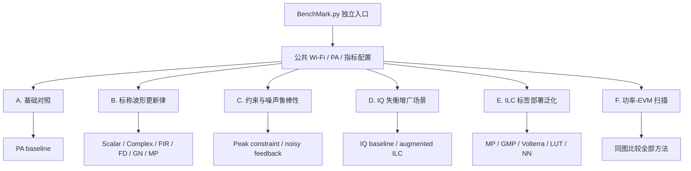

# ILC BenchMark 场景分类、预期与仿真结果

## 1. 文档目的

`tests/BenchMark.py` 是工程中唯一负责“构造测试场景并比较 ILC 性能”的文件。`inc/DpdIlc.py` 只保存可复用的 ILC 更新律、SISO/MIMO 执行函数和标签部署模型，不再生成测试波形、不再选择测试场景，也不再保存 benchmark 报告。

本文件对 benchmark 做分层说明。每一类都按以下顺序展开：

1. 场景如何构造；
2. 哪些变量保持不变；
3. 使用哪些评价指标；
4. 运行前预期看到什么；
5. 固定参考配置下实际得到什么；
6. 如何解释结果。

---

## 2. 场景分类总览



**图 1 说明：**六类测试不是把不同条件下的数字直接混合比较。每个特殊场景都有与自己匹配的 baseline；标称更新律只与标称 PA baseline 比较，IQ 增广 ILC 只与 IQ-imbalance baseline 比较，部署模型只与独立验证帧 baseline 比较。

---

## 3. 参考仿真的公共配置

本文“仿真结果”来自以下可重复命令：

```powershell
python tests\BenchMark.py --format EHT --bandwidth 20 --mcs 7 --symbols 4 --oversampling 3 --guard-interval 0.8 --drive 0.32 --iterations 6 --pa wiener --seed 101 --power-start 0.16 --power-stop 0.40 --power-points 4 --output-dir results\benchmark_reference
```

| 参数 | 参考值 | 作用 |
|---|---:|---|
| 帧格式 | EHT | 使用 802.11be/EHT 帧结构 |
| 带宽 | 20 MHz | 控制有效子载波和采样率 |
| MCS | 7 | 64-QAM、编码率 5/6 |
| 数据符号数 | 4 | 控制每个包的数据长度 |
| 过采样倍数 | 3 | 保留相邻信道，满足 ACLR 计算要求 |
| GI | 0.8 µs | EHT 保护间隔 |
| 标称驱动 RMS | 0.32 | 把 PA 推入可观察的非线性工作区 |
| ILC 记录轮数 | 6 | 第 1 轮是更新前基线，随后执行 5 次有效更新 |
| PA | Wiener | 线性记忆滤波器后接 AM-AM/AM-PM 非线性 |
| 训练种子 | 101 | 固定训练帧 |
| 验证种子 | 198 | 与训练帧独立，数值为训练种子加 97 |
| 功率扫描 RMS | 0.16 至 0.40 | 观察从回退区到较强压缩区的变化 |
| 功率点数 | 4 | 使用几何间隔 |

结果目录包含：

- `all_ilc_metrics.csv`：所有场景和方法的统一指标；
- `all_ilc_metrics.json`：带完整配置元数据的结构化结果；
- `convergence_*.csv`：每个 ILC 每一轮的 Raw MSE、LC-MSE 和 EVM-MSE；
- `convergence_*.png`：每个方法的迭代收敛曲线；
- `all_ilc_power_evm_curve.csv/json/png`：所有方法同图比较的功率-EVM结果。

---

## 4. 指标与改善量的统一方向

所有场景都通过 `Analysis` 计算 SNR、EVM 和 ACLR。EVM 使用数据子载波上的理想星座作为参考；ACLR 使用主信道功率与上下相邻信道功率比较。

EVM dB 定义为：

```math
\mathrm{EVM}_{\mathrm{dB}}
=20\log_{10}\left(\mathrm{EVM}_{\mathrm{rms}}\right).
```

因此 EVM dB 越负越好。benchmark 把 EVM 改善量定义为：

```math
\Delta\mathrm{EVM}_{\mathrm{dB}}
=\mathrm{EVM}_{\mathrm{baseline,dB}}
-\mathrm{EVM}_{\mathrm{method,dB}}.
```

正值表示方法优于同场景 baseline。SNR 和 ACLR 本身越大越好，所以它们的改善量采用“方法减 baseline”。

---

## 5. A类：基础对照场景

### 5.1 场景构造

训练帧乘以 `driveRms=0.32` 后直接进入 Wiener PA，不使用 DPD 或 ILC。该输出是标称波形更新律、峰值约束和噪声反馈场景的物理基准。

### 5.2 控制变量

- Wi-Fi 帧、PA 实例、驱动功率和分析窗口固定；
- 不加入反馈噪声；
- 不修改 PA 输入峰值；
- 不进行任何学习更新。

### 5.3 结果预期

基线必须表现出非零 EVM 和有限 ACLR，否则 PA 工作点过于线性，无法有效区分 ILC 方法。

### 5.4 仿真结果

| 方法 | SNR (dB) | EVM (dB) | EVM (%) | Worst ACLR (dB) |
|---|---:|---:|---:|---:|
| PA baseline | 34.120 | -36.078 | 1.571 | 28.377 |

### 5.5 结果解释

1.571% 的基线 EVM 足以观察迭代改善；28.377 dB 的 ACLR 说明当前工作点已经存在明显带外频谱再生。后续方法必须和这一行在同一训练帧、同一 PA 下比较。

---

## 6. B类：标称波形更新律场景

### 6.1 场景构造

所有更新律反复使用完全相同的训练包和 PA。每种方法拥有相同的6轮记录预算、相同峰值上限和同一个 EVM-MSE 计算器，仅学习率及其算法必须的局部模型不同。

测试方法包括：

1. Scalar P ILC；
2. Complex-gain ILC；
3. FIR ILC；
4. Frequency-domain ILC；
5. Directional Gauss-Newton ILC；
6. Parameter-domain MP ILC。

### 6.2 控制变量

- 训练样本、PA、记录轮数和指标定义相同；
- 不加入反馈噪声；
- 除专门的约束场景外，峰值上限不成为主导限制；
- 每个方法都保存逐轮 MSE 信息。

### 6.3 结果预期

- 所有稳定方法的 EVM 应低于 baseline；
- 标量方法通常收敛较慢；
- 复增益、FIR和频域方法应能补偿相位或线性记忆；
- Directional Gauss-Newton 使用局部有限差分，若局部模型准确，应收敛最快；
- 参数域 MP 只能在所选基函数空间内更新，因此性能取决于模型阶数和记忆深度。

### 6.4 仿真结果

| 方法 | SNR (dB) | EVM (%) | EVM改善 (dB) | Worst ACLR (dB) |
|---|---:|---:|---:|---:|
| PA baseline | 34.120 | 1.571 | 0.000 | 28.377 |
| Scalar P ILC | 38.788 | 0.913 | 4.715 | 28.506 |
| Complex-gain ILC | 41.005 | 0.705 | 6.952 | 28.532 |
| FIR ILC | 41.503 | 0.704 | 6.976 | 28.562 |
| Frequency-domain ILC | 39.494 | 0.700 | 7.013 | 28.498 |
| Directional Gauss-Newton ILC | 67.617 | 0.039 | 32.026 | 28.583 |
| Parameter-domain MP ILC | 43.501 | 0.523 | 9.556 | 28.547 |

### 6.5 逐轮结果示例

频域 ILC 的 EVM-MSE 和 EVM dB 按轮变化如下：

| 轮次 | Raw MSE | LC-MSE | EVM-MSE | EVM (dB) |
|---:|---:|---:|---:|---:|
| 1 | 2.0951e-4 | 7.1728e-5 | 2.4669e-4 | -36.08 |
| 2 | 1.5371e-4 | 5.4550e-5 | 1.7892e-4 | -37.47 |
| 3 | 1.1336e-4 | 4.1966e-5 | 1.2962e-4 | -38.87 |
| 4 | 8.4169e-5 | 3.2744e-5 | 9.3829e-5 | -40.28 |
| 5 | 6.3033e-5 | 2.5982e-5 | 6.7872e-5 | -41.68 |
| 6 | 4.7720e-5 | 2.1020e-5 | 4.9069e-5 | -43.09 |

### 6.6 结果解释

本次参考配置中所有标称方法都改善了 EVM。Directional Gauss-Newton 的优势很大，但这依赖确定性仿真、精确重复波形和当前局部方向的良好条件，不代表存在测量噪声和硬件漂移时仍能保持相同差距。ACLR只改善约0.1至0.2 dB，因为这些更新的主要选择目标是带内EVM，不能把EVM收益直接解释为等量ACLR收益。

---

## 7. C类：约束与噪声鲁棒性场景

### 7.1 C1：峰值约束

#### 构造

把允许的 ILC 输入峰值设为原始训练波形峰值的 1.05 倍。每次频域更新后执行复平面圆盘投影，防止学习结果产生不可实现的峰值。

#### 预期

- 输入峰值必须受控；
- EVM 应优于无 ILC baseline；
- 因自由度减少，EVM通常不如无约束频域ILC。

#### 仿真结果

| 方法 | EVM (%) | EVM改善 (dB) | Worst ACLR (dB) |
|---|---:|---:|---:|
| PA baseline | 1.571 | 0.000 | 28.377 |
| Constrained CFR-ILC | 0.833 | 5.510 | 28.487 |

#### 结论

峰值约束下仍获得5.510 dB的EVM改善，但弱于无约束频域ILC的7.013 dB，符合“可实现性换取部分线性化自由度”的预期。

### 7.2 C2：噪声反馈

#### 构造

ILC在每一轮使用32 dB反馈SNR，重复采集4次并平均，同时把正则化增大到 `1e-2`、学习率降低到0.10。最终指标使用没有额外反馈噪声的PA输出，以便评价学到的输入，而不是把一次随机测量噪声计入最终性能。

#### 预期

- 平均可降低反馈噪声方差；
- 较强正则化应避免学习噪声；
- 收敛速度和最终EVM通常弱于无噪声频域ILC；
- 最终结果仍应优于同一PA baseline。

#### 仿真结果

| 方法 | SNR (dB) | EVM (%) | EVM改善 (dB) | Worst ACLR (dB) |
|---|---:|---:|---:|---:|
| Noisy-feedback baseline | 34.120 | 1.571 | 0.000 | 28.377 |
| Noise-aware ILC | 37.772 | 0.941 | 4.450 | 28.483 |

#### 结论

噪声感知ILC在32 dB反馈环境下仍获得4.450 dB的EVM改善，低于无噪声频域ILC，符合预期。该场景验证的是学习鲁棒性，不应和IQ失衡场景的绝对EVM直接比较。

---

## 8. D类：IQ失衡增广场景

### 8.1 场景构造

基础 Wiener PA 外包一层 `IQImbalancePA`，使输出同时包含原信号分量和共轭镜像分量。普通解析复多项式不能完整表达共轭支路，因此使用同时依赖输入及输入共轭的增广 ILC。

### 8.2 控制变量

- Wi-Fi训练帧、驱动功率和基础PA与标称场景一致；
- baseline与增广ILC使用相同IQ失衡模型；
- 两者都用相同的 `Analysis` 指标路径。

### 8.3 结果预期

- IQ失衡baseline的EVM应明显差于标称baseline；
- 增广ILC应抑制镜像并显著改善EVM；
- 如果只使用普通非共轭模型，通常会留下结构性误差。

### 8.4 仿真结果

| 方法 | SNR (dB) | EVM (%) | EVM改善 (dB) | Worst ACLR (dB) |
|---|---:|---:|---:|---:|
| IQ-imbalance baseline | 26.298 | 4.714 | 0.000 | 28.361 |
| Augmented IQ ILC | 34.548 | 1.822 | 8.255 | 28.540 |

### 8.5 结果解释

IQ失衡使EVM从标称baseline的1.571%恶化到4.714%；增广ILC把EVM降低到1.822%。它显著消除了共轭结构误差，但在当前6轮预算内尚未完全恢复到标称场景最佳值。

---

## 9. E类：ILC标签部署泛化场景

### 9.1 场景构造

先用频域ILC在训练帧上得到逐样点最优输入标签，再分别拟合以下可部署模型：

1. Memory Polynomial；
2. Generalized Memory Polynomial；
3. 简化三阶复 Volterra；
4. 幅度分箱复增益 LUT；
5. 固定随机隐藏层的时延神经模型。

部署测试不再使用训练帧，而是使用种子198生成的独立EHT帧。这样测到的是泛化能力，不是对训练样本的记忆。

### 9.2 控制变量

- 所有模型使用同一组频域ILC标签；
- 所有模型使用同一个独立验证帧；
- 输出经过相同峰值限制后进入同一个PA；
- baseline是该独立验证帧直接进入PA的结果。

### 9.3 结果预期

- 部署模型应优于验证baseline；
- GMP应比MP更适合带交叉记忆的目标；
- Volterra表达能力强，但有限训练量和正则化会影响泛化；
- LUT结构简单，主要描述幅度相关逆特性；
- 小型NN的结果受隐藏维度、随机种子和训练覆盖度影响。

### 9.4 仿真结果

| 方法 | SNR (dB) | EVM (%) | EVM改善 (dB) | ACLR改善 (dB) |
|---|---:|---:|---:|---:|
| Validation baseline | 33.706 | 1.695 | 0.000 | 0.000 |
| ILC label + MP | 39.406 | 0.830 | 6.200 | 0.596 |
| ILC label + GMP | 39.121 | 0.782 | 6.723 | 0.445 |
| ILC label + Volterra | 38.487 | 0.846 | 6.040 | 0.345 |
| ILC label + LUT | 38.836 | 0.951 | 5.022 | 0.780 |
| ILC label + NN | 36.299 | 1.173 | 3.195 | 0.149 |

### 9.5 结果解释

五种部署模型均优于独立验证baseline，说明ILC标签不是只对训练帧有效。当前参考配置中GMP取得最低EVM，说明主支路和交叉记忆项对该Wiener PA逆映射有效。NN结果仍有改善但弱于多项式模型，这与只有4个训练数据符号、固定隐藏层和较小网络规模有关，不能据此推断更充分训练下NN一定较差。

---

## 10. F类：功率-EVM扫描场景

### 10.1 场景构造

驱动RMS在0.16至0.40之间取4个几何间隔点。每个功率点都重新缩放参考帧，并为波形ILC重新运行学习，不能把0.32工作点学到的逐样点输入直接缩放后冒充其他功率点的最优解。

对应的输入相对功率为：

```math
P_{\mathrm{in,dB}}
=20\log_{10}\left(d\right),
```

其中 `d` 是当前 `driveRms`。

### 10.2 结果预期

- PA baseline的EVM随驱动功率升高而恶化；
- 各ILC方法在多个功率点应保持相对收益；
- 峰值约束和噪声反馈方法通常弱于理想无约束方法；
- IQ失衡baseline含有与功率相关性较弱的镜像误差；
- 部署模型在超出训练幅度覆盖范围时可能退化。

### 10.3 全方法端点结果

| 方法 | EVM @ RMS 0.16 (%) | EVM @ RMS 0.40 (%) |
|---|---:|---:|
| PA baseline | 0.665 | 2.657 |
| Scalar P ILC | 0.374 | 1.767 |
| Complex-gain ILC | 0.287 | 1.484 |
| FIR ILC | 0.290 | 1.502 |
| Frequency-domain ILC | 0.294 | 1.442 |
| Directional Gauss-Newton ILC | 0.021 | 0.562 |
| Parameter-domain MP ILC | 0.215 | 1.231 |
| Constrained CFR-ILC | 0.350 | 1.631 |
| Noise-aware ILC | 0.409 | 1.778 |
| IQ-imbalance baseline | 4.545 | 5.103 |
| Augmented IQ ILC | 1.724 | 2.200 |
| ILC label + MP | 0.288 | 1.519 |
| ILC label + GMP | 0.318 | 1.480 |
| ILC label + Volterra | 0.389 | 1.583 |
| ILC label + LUT | 0.535 | 1.652 |
| ILC label + NN | 0.629 | 2.033 |

### 10.4 结果解释

PA baseline从0.665%恶化到2.657%，说明功率扫描确实穿过了更强的非线性区。所有标称波形ILC在高功率端仍优于PA baseline。IQ失衡baseline在全部功率点都受到明显镜像误差限制，增广ILC保持改善。部署模型在高功率端仍有收益，但不同模型之间的差距会随训练幅度覆盖和峰值投影变化。

完整4个功率点和全部方法保存在 `results/benchmark_reference/all_ilc_power_evm_curve.csv`，同图结果保存在 `all_ilc_power_evm_curve.png`。

---

## 11. 如何运行

### 11.1 默认完整测试

```powershell
python tests\BenchMark.py
```

### 11.2 快速测试但保留ACLR

ACLR要求采样率至少覆盖主信道和上下邻道，因此 benchmark 要求过采样倍数不小于3：

```powershell
python tests\BenchMark.py --symbols 2 --oversampling 3 --iterations 3 --skip-power-curve --output-dir results\benchmark_quick
```

### 11.3 切换PHY和PA

```powershell
python tests\BenchMark.py --format HE --bandwidth 80 --mcs 11 --pa gmp --symbols 6 --iterations 8 --output-dir results\he_gmp_benchmark
```

### 11.4 Python调用

```python
from pathlib import Path

from tests.BenchMark import BenchmarkConfig, RunAllIlcBenchmark

benchmarkConfig = BenchmarkConfig(
    frameFormat="EHT",
    bandwidthMhz=20,
    mcs=7,
    numDataSymbols=4,
    oversampling=3,
    numIterations=6,
    outputDirectory=Path("results/custom_benchmark"),
)

benchmarkRows = RunAllIlcBenchmark(benchmarkConfig)
```

---

## 12. 结果适用边界

1. 本文表格是固定随机种子和固定PA参数下的确定性仿真结果，不是802.11标准规定的性能门限。
2. 不同场景必须与自己的baseline比较，不能直接用IQ场景绝对EVM给标称方法排名。
3. Directional Gauss-Newton在无噪声重复仿真中的结果非常好，但真实仪器的噪声、漂移、量化和有限反馈带宽可能降低优势。
4. 当前benchmark是SISO场景集合；MIMO逐PA独立功率控制和MIMO ILC由工程API验证，但需要另行定义串扰、信道矩阵和OTA方向后才能形成公平的MIMO benchmark。
5. ACLR变化小不表示计算失效，而是当前更新目标主要选择带内EVM。若要显著优化ACLR，需要在目标函数中增加邻道功率或频谱模板权重。
