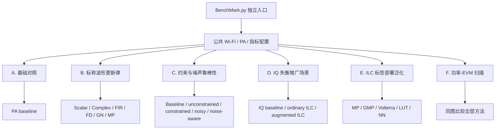
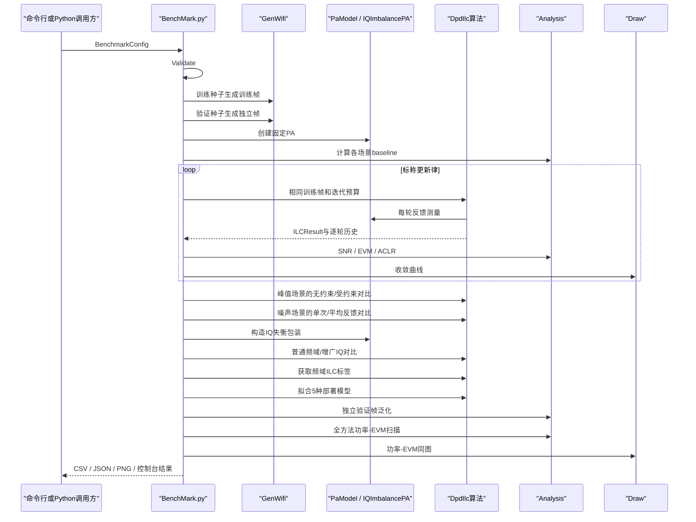
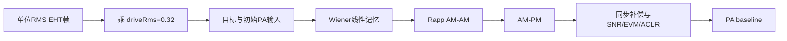
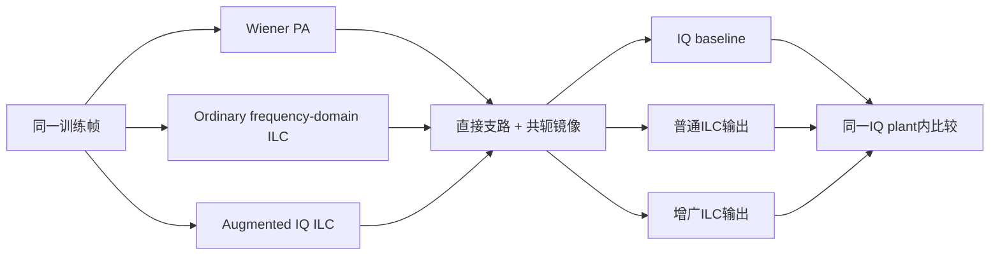
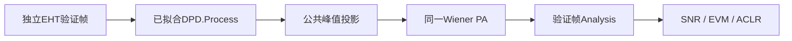

# ILC BenchMark 场景分类、预期与仿真结果

## 1. 文档目的

`tests/BenchMark.py` 是工程中唯一负责“构造测试场景并比较 ILC 性能”的文件。`inc/DpdIlc.py` 只保存可复用的 ILC 更新律、SISO/MIMO 执行函数和标签部署模型，不再生成测试波形、不再选择测试场景，也不再保存 benchmark 报告。

本文件对 benchmark 做分层说明。每一类都按以下顺序展开：

1. 场景如何构造；
2. 哪些变量保持不变；
3. 使用哪些评价指标；
4. 运行前预期看到什么；
5. 固定参考配置下实际得到什么；
6. 如何解释结果。

---

## 2. 场景分类总览



**图 1 说明：**六类测试不是把不同条件下的数字直接混合比较。每个特殊场景都有与自己匹配的baseline，而且至少包含两个可比较对象：标称更新律与标称PA baseline比较；峰值场景同时放入未补偿、无约束和受约束结果；噪声场景同时放入未补偿、单次反馈和噪声感知结果；IQ场景同时放入未补偿、普通频域ILC和增广IQ ILC；部署模型只与独立验证帧baseline比较。

---

## 3. 参考仿真的公共配置

本文“仿真结果”来自以下可重复命令：

```powershell
python tests/BenchMark.py --format EHT --bandwidth 20 --mcs 7 --symbols 4 --oversampling 3 --guard-interval 0.8 --drive 0.32 --iterations 6 --pa wiener --seed 101 --power-start 0.16 --power-stop 0.40 --power-points 4 --output-dir results/benchmark_reference
```

| 参数 | 参考值 | 作用 |
|---|---:|---|
| 帧格式 | EHT | 使用 802.11be/EHT 帧结构 |
| 带宽 | 20 MHz | 控制有效子载波和采样率 |
| MCS | 7 | 64-QAM、编码率 5/6 |
| 数据符号数 | 4 | 控制每个包的数据长度 |
| 过采样倍数 | 3 | 保留相邻信道，满足 ACLR 计算要求 |
| GI | 0.8 µs | EHT 保护间隔 |
| 标称驱动 RMS | 0.32 | 把 PA 推入可观察的非线性工作区 |
| ILC 记录轮数 | 6 | 第 1 轮是更新前基线，随后执行 5 次有效更新 |
| PA | Wiener | 线性记忆滤波器后接 AM-AM/AM-PM 非线性 |
| 训练种子 | 101 | 固定训练帧 |
| 验证种子 | 198 | 与训练帧独立，数值为训练种子加 97 |
| 功率扫描 RMS | 0.16 至 0.40 | 观察从回退区到较强压缩区的变化 |
| 功率点数 | 4 | 使用几何间隔 |

结果目录包含：

- `all_ilc_metrics.csv`：所有场景和方法的统一指标；
- `all_ilc_metrics.json`：带完整配置元数据的结构化结果；
- `convergence_*.csv`：每个 ILC 每一轮的 Raw MSE、LC-MSE 和 EVM-MSE；
- `convergence_*.png`：每个方法的迭代收敛曲线；
- `all_ilc_power_evm_curve.csv/json/png`：所有方法同图比较的功率-EVM结果。

---

## 4. 指标与改善量的统一方向

所有场景都通过 `Analysis` 计算 SNR、EVM 和 ACLR。EVM 使用数据子载波上的理想星座作为参考；ACLR 使用主信道功率与上下相邻信道功率比较。

EVM dB 定义为：

```math
\mathrm{EVM}_{\mathrm{dB}}
=20\log_{10}\left(\mathrm{EVM}_{\mathrm{rms}}\right).
```

因此 EVM dB 越负越好。benchmark 把 EVM 改善量定义为：

```math
\Delta\mathrm{EVM}_{\mathrm{dB}}
=\mathrm{EVM}_{\mathrm{baseline,dB}}
-\mathrm{EVM}_{\mathrm{method,dB}}.
```

正值表示方法优于同场景 baseline。SNR 和 ACLR 本身越大越好，所以它们的改善量采用“方法减 baseline”。

---

## 5. A类：基础对照场景

### 5.1 场景构造

训练帧乘以 `driveRms=0.32` 后直接进入 Wiener PA，不使用 DPD 或 ILC。该输出是标称波形更新律、峰值约束和噪声反馈场景的物理基准。

### 5.2 控制变量

- Wi-Fi 帧、PA 实例、驱动功率和分析窗口固定；
- 不加入反馈噪声；
- 不修改 PA 输入峰值；
- 不进行任何学习更新。

### 5.3 结果预期

基线必须表现出非零 EVM 和有限 ACLR，否则 PA 工作点过于线性，无法有效区分 ILC 方法。

### 5.4 五种baseline的对比

| baseline | 物理差异 | SNR (dB) | EVM (%) | Worst ACLR (dB) | 对比用途 |
|---|---|---:|---:|---:|---|
| PA baseline | 标称训练帧和基础PA | 34.120 | 1.571 | 28.377 | B类的未补偿参考 |
| Peak-constrained baseline | 与PA baseline物理输出相同，单独归入峰值场景 | 34.120 | 1.571 | 28.377 | C1按场景筛选时的未补偿参考 |
| Noisy-feedback baseline | 最终输出与PA baseline相同，学习观测允许有噪声 | 34.120 | 1.571 | 28.377 | C2的未学习参考 |
| IQ-imbalance baseline | 基础PA外增加共轭镜像支路 | 26.298 | 4.714 | 28.361 | D类的未补偿参考 |
| Validation baseline | 独立验证帧直接通过基础PA | 33.706 | 1.695 | 34.919 | E类的泛化参考 |

### 5.5 对比结论

PA baseline的1.571% EVM足以观察迭代改善；28.377 dB ACLR说明当前工作点已经存在带外频谱再生。IQ baseline的EVM明显更差，证明共轭镜像损伤已生效。Validation baseline与训练baseline略有差异，反映两个独立QAM数据包具有不同的幅度统计。

这五行不能作为算法排行榜，因为它们不是全部使用相同输入和plant；它们的价值是为后续每一种方法提供同条件分母。Peak-constrained baseline和Noisy-feedback baseline与PA baseline相同也是有意设计：前者让CSV按峰值场景筛选后仍有完整对照，后者用于隔离学习反馈噪声；最终质量都在干净PA输出上评价。

---

## 6. B类：标称波形更新律场景

### 6.1 场景构造

所有更新律反复使用完全相同的训练包和 PA。每种方法拥有相同的6轮记录预算、相同峰值上限和同一个 EVM-MSE 计算器，仅学习率及其算法必须的局部模型不同。

测试方法包括：

1. Scalar P ILC；
2. Complex-gain ILC；
3. FIR ILC；
4. Frequency-domain ILC；
5. Directional Gauss-Newton ILC；
6. Parameter-domain MP ILC。

### 6.2 控制变量

- 训练样本、PA、记录轮数和指标定义相同；
- 不加入反馈噪声；
- 除专门的约束场景外，峰值上限不成为主导限制；
- 每个方法都保存逐轮 MSE 信息。

### 6.3 结果预期

- 所有稳定方法的 EVM 应低于 baseline；
- 标量方法通常收敛较慢；
- 复增益、FIR和频域方法应能补偿相位或线性记忆；
- Directional Gauss-Newton 使用局部有限差分，若局部模型准确，应收敛最快；
- 参数域 MP 只能在所选基函数空间内更新，因此性能取决于模型阶数和记忆深度。

### 6.4 仿真结果

| 方法 | SNR (dB) | EVM (%) | EVM改善 (dB) | Worst ACLR (dB) |
|---|---:|---:|---:|---:|
| PA baseline | 34.120 | 1.571 | 0.000 | 28.377 |
| Scalar P ILC | 38.788 | 0.913 | 4.715 | 28.506 |
| Complex-gain ILC | 41.005 | 0.705 | 6.952 | 28.532 |
| FIR ILC | 41.503 | 0.704 | 6.976 | 28.562 |
| Frequency-domain ILC | 39.494 | 0.700 | 7.013 | 28.498 |
| Directional Gauss-Newton ILC | 67.617 | 0.039 | 32.026 | 28.583 |
| Parameter-domain MP ILC | 43.501 | 0.523 | 9.556 | 28.547 |

### 6.5 逐轮结果示例

频域 ILC 的 EVM-MSE 和 EVM dB 按轮变化如下：

| 轮次 | Raw MSE | LC-MSE | EVM-MSE | EVM (dB) |
|---:|---:|---:|---:|---:|
| 1 | 2.0951e-4 | 7.1728e-5 | 2.4669e-4 | -36.08 |
| 2 | 1.5371e-4 | 5.4550e-5 | 1.7892e-4 | -37.47 |
| 3 | 1.1336e-4 | 4.1966e-5 | 1.2962e-4 | -38.87 |
| 4 | 8.4169e-5 | 3.2744e-5 | 9.3829e-5 | -40.28 |
| 5 | 6.3033e-5 | 2.5982e-5 | 6.7872e-5 | -41.68 |
| 6 | 4.7720e-5 | 2.1020e-5 | 4.9069e-5 | -43.09 |

### 6.6 结果解释

本次参考配置中所有标称方法都改善了 EVM。Directional Gauss-Newton 的优势很大，但这依赖确定性仿真、精确重复波形和当前局部方向的良好条件，不代表存在测量噪声和硬件漂移时仍能保持相同差距。ACLR只改善约0.1至0.2 dB，因为这些更新的主要选择目标是带内EVM，不能把EVM收益直接解释为等量ACLR收益。

### 6.7 同场景方法优缺点对比

| 方法 | 主要优势 | 主要缺点 | 本场景证据 | 更适合的条件 |
|---|---|---|---|---|
| Scalar P ILC | 结构最简单、每轮成本低 | 不能显式补偿公共相位和频率选择性记忆 | EVM降至0.913%，六种方法中改善最小 | PA近似无记忆、需要快速初始验证 |
| Complex-gain ILC | 可同时处理平均增益与公共相位 | 仍不能描述频率选择性逆 | EVM降至0.705%，明显优于Scalar P | PA记忆较弱但存在公共相位 |
| FIR ILC | 能补偿线性记忆，卷积结构直观 | 滤波器估计和抽头数影响稳定性 | EVM为0.704%，与复增益和频域法接近 | 线性记忆占主导且需要时域实现 |
| Frequency-domain ILC | 每个频点正则化求逆，便于带宽投影 | 需要频响探测，低激励频点需门限保护 | EVM为0.700%，改善7.013 dB | 重复波形、频率选择性记忆明显 |
| Directional Gauss-Newton | 局部方向准确时收敛非常快 | 每轮需要额外PA调用，对噪声和漂移敏感 | EVM为0.039%，但这是确定性无噪仿真 | 高重复性台架、反馈质量高 |
| Parameter-domain MP ILC | 学完即得到有限维可部署参数 | 性能受阶数和记忆深度限制 | EVM为0.523%，优于前三种低成本更新 | 需要直接生成可部署多项式系数 |

这张表把“最终线性化质量”和“工程代价”分开。Directional Gauss-Newton在固定轮数下最好，不等于在相同PA调用次数、相同测量时间或有噪环境中仍然最好。

---

## 7. C类：约束与噪声鲁棒性场景

### 7.1 C1：峰值约束

#### 构造

把允许的 ILC 输入峰值设为原始训练波形峰值的 1.05 倍。每次频域更新后执行复平面圆盘投影，防止学习结果产生不可实现的峰值。

#### 预期

- 输入峰值必须受控；
- EVM 应优于无 ILC baseline；
- 因自由度减少，EVM通常不如无约束频域ILC。

#### 仿真结果

| 方法 | EVM (%) | EVM改善 (dB) | Worst ACLR (dB) |
|---|---:|---:|---:|
| Peak-constrained baseline | 1.571 | 0.000 | 28.377 |
| Unconstrained frequency-domain ILC | 0.700 | 7.013 | 28.498 |
| Constrained CFR-ILC | 0.833 | 5.510 | 28.487 |

#### 结论

峰值约束下仍获得5.510 dB的EVM改善，但弱于无约束频域ILC的7.013 dB，符合“可实现性换取部分线性化自由度”的预期。

### 7.2 C2：噪声反馈

#### 构造

三条链在同一个PA、同一个训练帧和32 dB反馈条件下对比：

1. `Noisy-feedback baseline` 不学习；
2. `Naive noisy-feedback ILC` 每轮只采集1次，学习率0.15、正则化 `1e-3`；
3. `Noise-aware ILC` 每轮采集4次并平均，学习率降低到0.10、正则化增大到 `1e-2`。

两个ILC最终都使用没有额外反馈噪声的PA输出评价，以便测量学到的输入，而不是把某一次随机噪声直接计入最终EVM。

#### 预期

- 平均可降低反馈噪声方差；
- 较强正则化应避免学习噪声；
- 收敛速度和最终EVM通常弱于无噪声频域ILC；
- 最终结果仍应优于同一PA baseline。

#### 仿真结果

| 方法 | SNR (dB) | EVM (%) | EVM改善 (dB) | Worst ACLR (dB) |
|---|---:|---:|---:|---:|
| Noisy-feedback baseline | 34.120 | 1.571 | 0.000 | 28.377 |
| Naive noisy-feedback ILC | 37.938 | 0.896 | 4.872 | 28.474 |
| Noise-aware ILC | 37.772 | 0.941 | 4.450 | 28.483 |

#### 结论

两种方法都明显优于未学习baseline。当前单种子参考运行中，Naive方法的干净输出EVM为0.896%，略优于Noise-aware的0.941%；但Naive的含噪逐轮EVM在第6轮相对第5轮回退，而Noise-aware六轮连续改善。由此得到的正确结论是：平均与较强正则化改善了本次迭代轨迹的稳定性，但没有保证每一个随机种子下的最低最终EVM。要证明统计鲁棒性，需要多种子比较均值、方差和发散率。

| 方法 | 优点 | 缺点 | 当前结果体现 |
|---|---|---|---|
| Baseline | 无学习成本，不会学习噪声 | 保留全部PA失真 | EVM最高，为1.571% |
| Naive noisy-feedback ILC | 更新更积极、采集次数少 | 单次观测方差大，后期可能回退 | 最终EVM最低，但第6轮含噪EVM变差 |
| Noise-aware ILC | 平均降低噪声方差，轨迹更平滑 | 每轮采集4次，更新保守，成本更高 | 六轮单调改善，但最终EVM略高 |

---

## 8. D类：IQ失衡增广场景

### 8.1 场景构造

基础 Wiener PA 外包一层 `IQImbalancePA`，使输出同时包含原信号分量和共轭镜像分量。普通解析复多项式不能完整表达共轭支路，因此使用同时依赖输入及输入共轭的增广 ILC。

### 8.2 控制变量

- Wi-Fi训练帧、驱动功率和基础PA与标称场景一致；
- baseline、普通频域ILC和增广ILC使用相同IQ失衡模型；
- 三者都用相同的 `Analysis` 指标路径。

### 8.3 结果预期

- IQ失衡baseline的EVM应明显差于标称baseline；
- 增广ILC应抑制镜像并显著改善EVM；
- 如果只使用普通非共轭模型，通常会留下结构性误差。

### 8.4 仿真结果

| 方法 | SNR (dB) | EVM (%) | EVM改善 (dB) | Worst ACLR (dB) |
|---|---:|---:|---:|---:|
| IQ-imbalance baseline | 26.298 | 4.714 | 0.000 | 28.361 |
| Frequency-domain ILC on IQ plant | 32.769 | 2.165 | 6.759 | 28.483 |
| Augmented IQ ILC | 34.548 | 1.822 | 8.255 | 28.540 |

### 8.5 结果解释

IQ失衡使EVM从标称baseline的1.571%恶化到4.714%。普通频域ILC虽然没有显式共轭支路，仍可利用逐样点误差把EVM降低到2.165%，说明它能部分抵消综合误差；增广ILC进一步降低到1.822%，相对普通方法多获得1.496 dB EVM改善，证明显式镜像支路与plant结构更匹配。

| 方法 | 优点 | 缺点 | 当前结果体现 |
|---|---|---|---|
| IQ baseline | 清楚量化未补偿镜像损伤 | 不提供线性化能力 | EVM为4.714% |
| 普通频域ILC | 无需IQ专用模型，也能部分校正 | 不能显式区分直接与共轭支路 | EVM为2.165%，仍有结构性残差 |
| 增广IQ ILC | 同时利用误差和误差共轭，结构匹配 | 参数更多，增广矩阵可能病态 | EVM最低，为1.822% |

---

## 9. E类：ILC标签部署泛化场景

### 9.1 场景构造

先用频域ILC在训练帧上得到逐样点最优输入标签，再分别拟合以下可部署模型：

1. Memory Polynomial；
2. Generalized Memory Polynomial；
3. 简化三阶复 Volterra；
4. 幅度分箱复增益 LUT；
5. 固定随机隐藏层的时延神经模型。

部署测试不再使用训练帧，而是使用种子198生成的独立EHT帧。这样测到的是泛化能力，不是对训练样本的记忆。

### 9.2 控制变量

- 所有模型使用同一组频域ILC标签；
- 所有模型使用同一个独立验证帧；
- 输出经过相同峰值限制后进入同一个PA；
- baseline是该独立验证帧直接进入PA的结果。

### 9.3 结果预期

- 部署模型应优于验证baseline；
- GMP应比MP更适合带交叉记忆的目标；
- Volterra表达能力强，但有限训练量和正则化会影响泛化；
- LUT结构简单，主要描述幅度相关逆特性；
- 小型NN的结果受隐藏维度、随机种子和训练覆盖度影响。

### 9.4 仿真结果

| 方法 | SNR (dB) | EVM (%) | EVM改善 (dB) | ACLR改善 (dB) |
|---|---:|---:|---:|---:|
| Validation baseline | 33.706 | 1.695 | 0.000 | 0.000 |
| ILC label + MP | 39.406 | 0.830 | 6.200 | 0.596 |
| ILC label + GMP | 39.121 | 0.782 | 6.723 | 0.445 |
| ILC label + Volterra | 38.487 | 0.846 | 6.040 | 0.345 |
| ILC label + LUT | 38.836 | 0.951 | 5.022 | 0.780 |
| ILC label + NN | 36.299 | 1.173 | 3.195 | 0.149 |

### 9.5 结果解释

五种部署模型均优于独立验证baseline，说明ILC标签不是只对训练帧有效。当前参考配置中GMP取得最低EVM，说明主支路和交叉记忆项对该Wiener PA逆映射有效。NN结果仍有改善但弱于多项式模型，这与只有4个训练数据符号、固定隐藏层和较小网络规模有关，不能据此推断更充分训练下NN一定较差。

### 9.6 同场景部署模型优缺点对比

| 方法 | 主要优势 | 主要缺点 | 当前验证帧结论 |
|---|---|---|---|
| MP | 系数少、实现成熟 | 缺少交叉记忆项 | 0.830%，性能与复杂度均衡 |
| GMP | 能描述包络滞后和超前交叉项 | 基函数更多，矩阵条件数可能变差 | 0.782%，当前EVM最好 |
| Volterra | 表达一般非线性记忆关系 | 项数增长快，当前实现是简化三阶结构 | 0.846%，未超过GMP |
| LUT | 查询速度快、易于硬件实现 | 幅度分箱难以描述动态记忆和相位上下文 | 0.951%，ACLR改善最大 |
| NN | 可扩展到复杂非线性映射 | 依赖数据覆盖、结构和训练预算 | 1.173%，有限样本下收益最小 |

不同模型必须同时看EVM、ACLR、模型规模和推理成本。本次GMP的EVM最佳，而LUT的ACLR改善最大，因此不存在脱离目标指标的单一“最好模型”。

---

## 10. F类：功率-EVM扫描场景

### 10.1 场景构造

驱动RMS在0.16至0.40之间取4个几何间隔点。每个功率点都重新缩放参考帧，并为波形ILC重新运行学习，不能把0.32工作点学到的逐样点输入直接缩放后冒充其他功率点的最优解。

对应的输入相对功率为：

```math
P_{\mathrm{in,dB}}
=20\log_{10}\left(d\right),
```

其中 `d` 是当前 `driveRms`。

### 10.2 结果预期

- PA baseline的EVM随驱动功率升高而恶化；
- 各ILC方法在多个功率点应保持相对收益；
- 峰值约束和噪声反馈方法通常弱于理想无约束方法；
- IQ失衡baseline含有与功率相关性较弱的镜像误差；
- 部署模型在超出训练幅度覆盖范围时可能退化。

### 10.3 全方法端点结果

| 方法 | EVM @ RMS 0.16 (%) | EVM @ RMS 0.40 (%) |
|---|---:|---:|
| PA baseline | 0.665 | 2.657 |
| Scalar P ILC | 0.374 | 1.767 |
| Complex-gain ILC | 0.287 | 1.484 |
| FIR ILC | 0.290 | 1.502 |
| Frequency-domain ILC | 0.294 | 1.442 |
| Directional Gauss-Newton ILC | 0.021 | 0.562 |
| Parameter-domain MP ILC | 0.215 | 1.231 |
| Constrained CFR-ILC | 0.350 | 1.631 |
| Naive noisy-feedback ILC | 0.492 | 1.493 |
| Noise-aware ILC | 0.409 | 1.778 |
| IQ-imbalance baseline | 4.545 | 5.103 |
| Frequency-domain ILC on IQ plant | 2.069 | 2.507 |
| Augmented IQ ILC | 1.724 | 2.200 |
| ILC label + MP | 0.288 | 1.519 |
| ILC label + GMP | 0.318 | 1.480 |
| ILC label + Volterra | 0.389 | 1.583 |
| ILC label + LUT | 0.535 | 1.652 |
| ILC label + NN | 0.629 | 2.033 |

### 10.4 结果解释

PA baseline从0.665%恶化到2.657%，说明功率扫描确实穿过了更强的非线性区。所有标称波形ILC在高功率端仍优于PA baseline。IQ失衡baseline在全部功率点都受到明显镜像误差限制，增广ILC保持改善。部署模型在高功率端仍有收益，但不同模型之间的差距会随训练幅度覆盖和峰值投影变化。

完整4个功率点和全部方法保存在 `results/benchmark_reference/all_ilc_power_evm_curve.csv`，同图结果保存在 `all_ilc_power_evm_curve.png`。

### 10.5 功率维度的优缺点对比

| 方法组 | 低功率端表现 | 高功率端表现 | 优点 | 缺点 |
|---|---|---|---|---|
| PA baseline | 0.665% | 2.657% | 提供真实未补偿趋势 | 压缩增强后快速恶化 |
| 标称逐点波形ILC | 全部优于PA baseline | 全部优于PA baseline | 每个功率点重新学习，可展示算法上限 | 需要逐点标定，不能直接部署 |
| 峰值约束ILC | 0.350% | 1.631% | 峰值可实现性更好 | 比无约束频域ILC保留更多EVM |
| 噪声反馈ILC | 0.409%至0.492% | 1.493%至1.778% | 能在有噪反馈下学习 | 排名随功率、随机噪声和正则化变化 |
| IQ场景方法 | 1.724%至4.545% | 2.200%至5.103% | 增广法持续优于普通法和baseline | 与无IQ损伤方法不能直接排名 |
| 固定部署模型 | 0.288%至0.629% | 1.480%至2.033% | 标称点训练后可直接跨功率推理 | 超出训练幅度覆盖时可能退化 |

功率扫描中的公平比较仍必须在同一方法组内进行：逐点重新学习的ILC曲线表示可达到的校准上限；只训练一次的部署模型曲线表示外推能力，两者的训练预算并不相同。

---

## 11. 如何运行

### 11.1 默认完整测试

```powershell
python tests/BenchMark.py
```

### 11.2 快速测试但保留ACLR

ACLR要求采样率至少覆盖主信道和上下邻道，因此 benchmark 要求过采样倍数不小于3：

```powershell
python tests/BenchMark.py --symbols 2 --oversampling 3 --iterations 3 --skip-power-curve --output-dir results/benchmark_quick
```

### 11.3 切换PHY和PA

```powershell
python tests/BenchMark.py --format HE --bandwidth 80 --mcs 11 --pa gmp --symbols 6 --iterations 8 --output-dir results/he_gmp_benchmark
```

### 11.4 Python调用

```python
from pathlib import Path

from tests.BenchMark import BenchmarkConfig, RunAllIlcBenchmark

benchmarkConfig = BenchmarkConfig(
    frameFormat="EHT",
    bandwidthMhz=20,
    mcs=7,
    numDataSymbols=4,
    oversampling=3,
    numIterations=6,
    outputDirectory=Path("results/custom_benchmark"),
)

benchmarkRows = RunAllIlcBenchmark(benchmarkConfig)
```

---

## 12. 结果适用边界

1. 本文表格是固定随机种子和固定PA参数下的确定性仿真结果，不是802.11标准规定的性能门限。
2. 不同场景必须与自己的baseline比较，不能直接用IQ场景绝对EVM给标称方法排名。
3. Directional Gauss-Newton在无噪声重复仿真中的结果非常好，但真实仪器的噪声、漂移、量化和有限反馈带宽可能降低优势。
4. 当前benchmark是SISO场景集合；MIMO逐PA独立功率控制和MIMO ILC由工程API验证，但需要另行定义串扰、信道矩阵和OTA方向后才能形成公平的MIMO benchmark。
5. ACLR变化小不表示计算失效，而是当前更新目标主要选择带内EVM。若要显著优化ACLR，需要在目标函数中增加邻道功率或频谱模板权重。

---

## 13. BenchMark.py函数级结构与完整执行时序

### 13.1 为什么benchmark必须独立于DpdIlc.py

`inc/DpdIlc.py` 回答“某一种ILC如何计算更新”，`tests/BenchMark.py` 回答“在什么条件下比较哪些算法、使用什么baseline、输出哪些结果”。两者职责不同：

| 层次 | 负责内容 | 不负责内容 |
|---|---|---|
| `inc/DpdIlc.py` | 更新律、峰值投影、反馈测量、迭代记录、标签模型拟合 | 选择测试帧、构造IQ失衡场景、决定报告目录 |
| `tests/BenchMark.py` | 测试帧、PA工作点、特殊损伤、算法组合、结果保存、预期验证 | 重新实现ILC数学更新 |
| `inc/Analysis.py` | 同步补偿、SNR、EVM、ACLR及功率扫描数据 | 决定哪个算法应参加哪个场景 |
| `inc/Draw.py` | 把已经计算好的数据绘图 | 重新计算指标或修改测试信号 |

这种拆分使算法可以被主程序、单元测试或硬件控制程序复用，同时避免生产模块在被导入时隐式创建测试文件。

### 13.2 函数逐项说明

| BenchMark.py入口 | 主要输入 | 返回值或副作用 | 在测试流程中的职责 |
|---|---|---|---|
| `GetProjectRoot` | 无 | 仓库绝对路径 | 让脚本从任意当前目录启动时都能导入 `inc` |
| `BenchmarkConfig.Validate` | 配置对象自身 | 无；非法时抛出异常 | 在长时间仿真开始前检查符号数、过采样、功率范围和迭代数 |
| `BenchmarkRow.ToDict` | 单行结果 | 扁平字典 | 让CSV和JSON使用完全相同的数值 |
| `AddRow` | 方法指标、同场景baseline指标 | 向结果列表追加一行 | 统一SNR、EVM、ACLR改善量的正负方向 |
| `SaveHistory` | 方法名、`ILCResult`、目录 | 每种方法一个CSV和PNG | 保存每一轮Raw MSE、LC-MSE、EVM-MSE和输入峰值 |
| `ReportHistory` | 方法结果、`Analysis` | 控制台表格并调用 `SaveHistory` | 保证控制台和文件使用同一份不可变迭代记录 |
| `EvaluateDeployment` | 拟合DPD、验证帧、PA、幅度上限 | `SignalMetrics` | 在独立帧上执行DPD、限幅、PA和统一分析 |
| `RunIlcCurvePoint` | 当前功率点参考、算法和配置 | 当前功率点PA输出 | 为功率扫描重新绑定EVM-MSE并重新运行波形ILC |
| `RunAllIlcBenchmark` | 可选 `BenchmarkConfig` | 22行 `BenchmarkRow` | 按固定顺序构造A–F类场景并汇总全部结果 |
| `SaveBenchmarkResults` | 结果行、目录、元数据 | 汇总CSV和JSON | 保存绝对指标、改善量及复现配置 |
| `PrintBenchmarkResults` | 全部结果行 | 控制台汇总表 | 快速查看不同场景的SNR、EVM和ACLR |
| `ParseBenchmarkArguments` | 命令行 | 已验证配置 | 把外部参数转换为 `BenchmarkConfig` |
| `Main` | 无 | 进程返回码 | 独立脚本入口，执行benchmark并显示结果目录 |

### 13.3 完整调用时序



**图 2 说明：**训练帧只负责波形ILC和标签生成；验证帧只负责部署模型泛化测试。两个帧由不同随机种子生成，避免把训练样本记忆误认为DPD泛化能力。

### 13.4 RunAllIlcBenchmark内部阶段

伪代码如下：

```text
Validate(config)
Create training waveform with seed
Create validation waveform with seed + 97
Scale both waveforms by driveRms
Create one deterministic PA

Measure nominal PA baseline
Run six nominal ILC update laws
Compare unconstrained and peak-constrained frequency-domain ILC
Compare single-sample and averaged noisy-feedback ILC
Wrap the PA with IQ imbalance
Compare ordinary frequency-domain and augmented IQ ILC

Use the best frequency-domain ILC input as the training label
Fit MP, GMP, Volterra, LUT, and NN predistorters
Evaluate all fitted models on the held-out waveform

Save the 22-row summary
Optionally run every power evaluator on geometric RMS points
Save convergence histories and power-EVM data
```

---

## 14. 默认配置、参考配置和派生波形参数

### 14.1 默认值与本文参考值必须区分

直接运行 `python tests/BenchMark.py` 使用类内默认值。本文结果为了缩短可复现时间并增强非线性可见度，使用了单独的参考配置。

| 参数 | BenchMark.py默认值 | 本文参考值 | 影响 |
|---|---:|---:|---|
| `frameFormat` | EHT | EHT | PHY字段和子载波结构 |
| `bandwidthMhz` | 20 | 20 | FFT基准长度与有效带宽 |
| `mcs` | 7 | 7 | 64-QAM和编码率 |
| `numDataSymbols` | 10 | 4 | 波形长度和统计样本数 |
| `oversampling` | 4 | 3 | 采样率和ACLR可观测频带 |
| `guardIntervalUs` | 0.8 | 0.8 | 每个数据符号的CP长度 |
| `driveRms` | 0.24 | 0.32 | PA压缩程度 |
| `numIterations` | 10 | 6 | 每种ILC记录轮数 |
| `paModelName` | wiener | wiener | 被测PA模型 |
| `seed` | 101 | 101 | 训练帧及方法种子基准 |
| `powerStartRms` | 0.08 | 0.16 | 功率扫描起点 |
| `powerStopRms` | 0.40 | 0.40 | 功率扫描终点 |
| `powerPointCount` | 5 | 4 | 功率曲线点数 |
| `generatePowerEvmCurve` | True | True | 是否输出联合曲线 |

文档中的实测表格只能和“本文参考值”复现结果比较；使用默认值时，结果不同是正常现象。

### 14.2 配置验证规则

`BenchmarkConfig.Validate` 在构造任何波形前检查：

- `numDataSymbols` 必须大于0；
- `oversampling` 必须不小于3，因为ACLR需要同时观察主信道和上下邻道；
- `driveRms` 必须大于0；
- `numIterations` 必须大于0；
- `powerStartRms` 必须大于0；
- `powerStopRms` 必须大于 `powerStartRms`；
- `powerPointCount` 必须不小于2。

随后 `GenWifi` 继续检查PHY相关组合，例如VHT/HE/EHT支持的MCS范围和GI范围。`PaModel` 继续检查模型名称和物理参数。因此验证被分为“场景级”“波形级”“PA级”三层。

### 14.3 本文参考波形的派生参数

由参考配置实际生成的训练帧具有：

| 派生量 | 数值 | 来源 |
|---|---:|---|
| 采样率 | 60 MHz | 20 MHz带宽乘3倍过采样 |
| FFT长度 | 768 | EHT 20 MHz基准256点乘3 |
| CP长度 | 48 samples | 0.8 µs乘60 MHz |
| 单个数据符号长度 | 816 samples | FFT 768加CP 48 |
| 活动子载波 | 242 | EHT 20 MHz满带宽分配 |
| 数据子载波 | 234 | 活动子载波扣除8个导频 |
| 导频子载波 | 8 | EHT 20 MHz导频配置 |
| 数据字段起点 | sample 3216 | 前导和信令字段之后 |
| 数据字段终点 | sample 6480 | 4个数据符号之后 |
| 整帧长度 | 6480 samples | 全部前导、信令、训练和数据字段 |
| 调制 | 64-QAM | MCS 7 |
| 每数据符号编码比特 | 1404 | 234乘每子载波6比特 |
| 每数据符号信息比特 | 1170 | 编码率5/6后的工程值 |

单位RMS波形乘以驱动值构造PA目标：

```math
x_{\mathrm{train}}[n]
=d_{\mathrm{nominal}}x_{\mathrm{unit}}[n],
\qquad
d_{\mathrm{nominal}}=0.32.
```

参考运行中初始PA输入峰值约为0.9840。普通方法的统一幅度上限为：

```math
A_{\max}
=\max\left(
2.0,\,
1.6\max_n|x_{\mathrm{train}}[n]|
\right)
=2.0.
```

因此普通方法不会因为过紧的公共限幅而被不公平地截断；峰值约束方法使用单独的更小上限。

### 14.4 Wiener PA的固定参数

参考运行只传入 `modelName="wiener"`，因此使用 `WienerConfig` 内部默认值：

| PA参数 | 数值 | 物理作用 |
|---|---:|---|
| 线性记忆抽头 | `1`、`0.055-j0.025`、`-0.018+j0.012` | 形成幅频、相频和短记忆 |
| `linearGain` | 1.0 | 小信号标称增益 |
| `saturationAmplitude` | 1.0 | Rapp压缩幅度尺度 |
| `rappSmoothness` | 3.0 | 控制压缩拐点平滑程度 |
| `ampmCoefficient` | 0.18 | 控制幅度相关相位旋转 |

所有标称、约束、噪声和部署场景复用同一个确定性PA参数集合。只有D类额外增加IQ镜像包装。

### 14.5 随机种子分配

| 用途 | 种子 | 为什么分开 |
|---|---:|---|
| 训练Wi-Fi帧 | 101 | 固定所有波形ILC的目标 |
| 验证Wi-Fi帧 | 198 | 与训练帧独立，检查泛化 |
| Scalar P ILC | 102 | 若启用反馈噪声，保持方法内可复现 |
| Complex-gain ILC | 103 | 避免不同方法共享随机序列状态 |
| FIR ILC | 104 | 同上 |
| Frequency-domain ILC | 105 | 同上 |
| Directional Gauss-Newton | 106 | 同上 |
| Parameter-domain MP ILC | 107 | 同上 |
| Constrained CFR-ILC | 108 | 独立约束场景 |
| Noise-aware ILC | 109 | 独立噪声场景 |
| Augmented IQ ILC | 110 | 独立IQ场景 |
| Neural predistorter | 111 | 固定隐藏层随机权重 |
| Naive noisy-feedback ILC | 119 | 与Noise-aware使用独立但固定的噪声序列 |
| Frequency-domain ILC on IQ plant | 120 | 普通IQ对照方法的独立配置 |

在无反馈噪声的方法中，随机种子不会改变确定性PA输出，但仍显式记录，便于后来开启噪声时保持复现。

---

## 15. A类实验卡：baseline如何构造和使用

### 15.1 精确信号链



这里没有单独的无线信道、接收噪声或频偏。`SigProcess` 仍由 `Analysis` 调用，使baseline与其他场景走相同分析入口。

### 15.2 baseline不是一个全局通用数字

benchmark中存在5个baseline行：

| baseline | 对应场景 | 为什么必须单独存在 |
|---|---|---|
| `PA baseline` | 标称更新律 | 原始训练帧直接进入基础PA |
| `Peak-constrained baseline` | 峰值约束 | 与PA baseline物理相同，但让该场景可独立筛选和比较 |
| `Noisy-feedback baseline` | 单次噪声反馈ILC和噪声感知ILC | 最终指标仍在干净PA输出上评价，但学习阶段反馈有噪声 |
| `IQ-imbalance baseline` | 普通频域ILC和增广IQ ILC | plant多了共轭镜像，不能使用标称PA数字 |
| `Validation baseline` | 标签部署模型 | 输入是独立验证帧，数据符号不同 |

`Noisy-feedback baseline` 的数值与 `PA baseline` 相同是有意设计：反馈噪声只污染学习观测，最终部署性能使用干净plant输出评价。这样能判断“噪声是否让算法学坏”，而不是测量某一次随机噪声的瞬时EVM。

### 15.3 baseline验收条件

参考配置下应检查：

- SNR、EVM、ACLR全部为有限数；
- EVM大于0，避免把完全线性plant当作非线性benchmark；
- Worst ACLR取上下邻道中较小值；
- `PA baseline` 与 `Noisy-feedback baseline` 的最终指标相同；
- `Validation baseline` 允许与训练baseline不同，因为QAM数据和峰值分布不同；
- `IQ-imbalance baseline` 应明显差于标称baseline。

如果标称baseline EVM已经接近数值精度，ILC之间的排名主要反映数值噪声；如果EVM极高，则工作点可能过度压缩，局部更新模型不再有效。

---

## 16. B类实验卡：六种标称更新律的准确参数与判定

### 16.1 公共ILC参数

除表中专门覆盖的项目外，所有标称更新律继承：

| `ILCConfig`参数 | 公共值 | 作用 |
|---|---:|---|
| `numIterations` | 6 | 保存6个更新前测量点 |
| `regularization` | `1e-3` | 稳定逆增益或正规方程 |
| `maxAmplitude` | 2.0 | 输入复包络峰值上限 |
| `feedbackSnrDb` | None | 标称场景无反馈噪声 |
| `feedbackAverages` | 1 | 每轮只测一次 |
| `projectionBandwidthFactor` | 1.6 | 频域更新允许一定带外抵消分量 |
| `responseFloorDb` | -45 | 低激励频点响应估计门限 |
| `evmMseEvaluator` | EHT数据子载波EVM-MSE | 最佳轮选择与最终EVM目标一致 |

### 16.2 方法专用参数

| 方法 | 学习率 | 方法专用设置 | 种子 |
|---|---:|---|---:|
| Scalar P ILC | 0.10 | 使用小信号标量增益 | 102 |
| Complex-gain ILC | 0.15 | 使用复数小信号增益 | 103 |
| FIR ILC | 0.15 | FIR学习滤波器长度17 | 104 |
| Frequency-domain ILC | 0.15 | 小信号频响、投影倍率1.6 | 105 |
| Directional Gauss-Newton | 0.65 | 有限差分RMS默认 `1e-3` | 106 |
| Parameter-domain MP ILC | 0.20 | 阶数1/3/5/7，记忆深度3 | 107 |

学习率不同意味着这是一组“各方法采用保守可用参数”的工程比较，不是“强制相同学习率”的理论比较。相同学习率对不同归一化和不同方向尺度没有公平物理意义。

### 16.3 每种方法实际补偿什么

#### Scalar P ILC

使用实标量比例修正误差。它能降低整体非线性误差，但对PA公共相位和频率选择性记忆的处理能力有限，因此预期最慢。

#### Complex-gain ILC

先在低功率工作点估计复增益，再用其逆方向更新。相比Scalar P，它能同时校正平均增益和公共相位。

#### FIR ILC

估计多抽头学习滤波器，用卷积近似PA线性记忆的逆。对于Wiener模型前端的三抽头FIR，FIR ILC应比纯标量方法更合适。

#### Frequency-domain ILC

使用低功率探测估计小信号频率响应，在每个FFT频点构造正则化逆，并通过平滑带宽投影限制更新。它允许生成一定带外预失真分量，但当前最佳轮选择仍以EVM-MSE为主。

#### Directional Gauss-Newton ILC

沿当前误差方向对PA做有限差分，估计雅可比与误差方向的乘积，再求一个复步长。它没有构造完整雅可比矩阵，但每轮需要额外PA调用，因此不能只看迭代轮数判断计算成本。

#### Parameter-domain MP ILC

直接在Memory Polynomial基函数空间更新系数。输入只能落在有限维模型空间内，无法像逐样点波形ILC一样自由，但更新后天然得到可部署参数。

### 16.4 每轮记录与最佳轮选择

第1轮先测量初始输入，再计算第1次更新。因此 `numIterations=6` 表示：

```text
record 1 -> update 1
record 2 -> update 2
record 3 -> update 3
record 4 -> update 4
record 5 -> update 5
record 6 -> update 6, but this updated input is not measured in this run
```

对外返回的 `learnedInput` 不是简单取最后更新后的输入，而是在6个已经测量的候选输入中选择EVM-MSE最小者：

```math
k^\star
=\arg\min_k
\mathrm{MSE}_{\mathrm{EVM},k}.
```

如果没有提供EVM计算器，才回退到LC-NMSE作为选择目标。这个机制防止后期迭代发散时把较差的最后一轮当作结果。

### 16.5 参考运行的收敛审计表

| 方法 | 第1轮EVM (dB) | 第6轮EVM (dB) | 最佳轮 | 历史最大输入峰值 |
|---|---:|---:|---:|---:|
| Scalar P ILC | -36.078 | -40.794 | 6 | 1.0241 |
| Complex-gain ILC | -36.078 | -43.031 | 6 | 1.0404 |
| FIR ILC | -36.078 | -43.054 | 6 | 1.0470 |
| Frequency-domain ILC | -36.078 | -43.092 | 6 | 1.0270 |
| Directional Gauss-Newton | -36.078 | -68.104 | 6 | 1.2349 |
| Parameter-domain MP ILC | -36.078 | -45.634 | 6 | 1.0585 |

本次参考运行中6种方法都在第6轮取得最小EVM-MSE，说明尚未观察到后期反弹。但代码不能假设最佳轮永远是最后一轮。

### 16.6 质量验收与异常含义

| 观察 | 可能含义 | 建议检查 |
|---|---|---|
| Raw MSE下降，EVM不下降 | 公共增益或非数据字段主导Raw MSE | 查看LC-MSE和EVM-MSE |
| EVM下降，ACLR不变 | 更新目标主要改善带内调制质量 | 增加邻道目标或频谱权重 |
| EVM后期变差但最终汇总仍好 | 最佳轮保留机制生效 | 查看完整 `convergence_*.csv` |
| 输入峰值达到2.0 | 公共峰值约束开始主导 | 降低学习率或提高可实现上限 |
| Gauss-Newton突然恶化 | 有限差分方向受噪声或强非线性污染 | 调整差分RMS、正则化和学习率 |
| FIR不优于复增益 | PA记忆弱、滤波器估计不足或轮数太少 | 检查频响和FIR长度 |

### 16.7 B类选择建议

| 工程优先级 | 首选对照 | 理由 |
|---|---|---|
| 最小实现复杂度 | Scalar P与Complex-gain | 用最少结构判断公共增益和相位是否主导 |
| 补偿线性记忆 | FIR与Frequency-domain | 分别从时域和频域观察记忆逆 |
| 最低重复波形EVM | Directional Gauss-Newton | 当前确定性场景精度最高，但必须计入额外PA调用 |
| 直接得到可部署结构 | Parameter-domain MP | 学习结果已经处于有限维模型空间 |

选择方法时不应只拿最终EVM一列排序。测试报告至少应同时附上逐轮历史、最大输入峰值、PA调用预算和对噪声的敏感性。

---

## 17. C类实验卡：峰值约束和反馈噪声

### 17.1 C1峰值约束的精确构造

约束上限不是公共2.0，而是：

```math
A_{\mathrm{CFR}}
=1.05\max_n|x_{\mathrm{train}}[n]|.
```

参考运行初始峰值约为0.9840，因此约束上限约为1.0332。实测6轮历史中的最大输入峰值为1.0196，没有越过约束。

每轮更新后执行复圆盘投影：

```math
u_{\mathrm{projected}}[n]
=
\begin{cases}
u[n], & |u[n]|\le A_{\mathrm{CFR}},\\
A_{\mathrm{CFR}}\frac{u[n]}{|u[n]|}, & |u[n]|>A_{\mathrm{CFR}}.
\end{cases}
```

为保持文档渲染兼容，代码对应含义是：未超限样点保持不变，超限样点只缩短幅度而保留复相位。该场景使用学习率0.12、种子108，其余频域ILC参数与标称场景一致。

> 注意：上式中的分式如果文档平台不支持复杂宏，可直接理解为“把超限复数沿原相位缩回半径为上限的圆周”。工程文档自动检查会阻止不兼容宏进入版本库。

### 17.2 为什么约束场景复用PA baseline

原始训练输入的峰值低于约束上限，因此baseline本身不会被投影改变。约束只影响ILC为了抵消PA失真而额外产生的峰值，所以复用 `PA baseline` 是严格可比的。

### 17.3 C1验收条件

- 每轮 `inputPeak` 不得超过约束上限和浮点容差；
- EVM应优于PA baseline；
- 约束EVM允许弱于无约束频域ILC；
- 如果两者完全相同，说明约束可能从未激活；
- 如果EVM显著恶化，应检查过紧峰值、投影带宽和学习率。

### 17.4 C2噪声反馈的精确构造

该场景的学习反馈为：

```math
y_r[n]
=y_{\mathrm{PA}}[n]+w_r[n],
\qquad
r=1,2,3,4.
```

四次独立反馈平均：

```math
\bar y[n]
=\frac{1}{4}\sum_{r=1}^{4}y_r[n].
```

若每次噪声独立同分布，平均后的噪声方差为：

```math
\mathrm{Var}(\bar w)
=\frac{\mathrm{Var}(w)}{4}.
```

对应理论SNR改善：

```math
\Delta\mathrm{SNR}
=10\log_{10}(4)
\approx6.02\ \mathrm{dB}.
```

因此32 dB单次反馈经过4次平均后，噪声方差层面的等效水平约为38 dB。实际ILC误差还包含PA非线性和模型失配，不能把38 dB直接当作最终输出SNR。

### 17.5 C2参数变化

| 参数 | 标称频域ILC | Naive noisy-feedback | Noise-aware ILC |
|---|---:|---:|---:|
| 学习率 | 0.15 | 0.15 | 0.10 |
| 正则化 | `1e-3` | `1e-3` | `1e-2` |
| 反馈SNR | 无噪 | 32 dB | 32 dB |
| 平均次数 | 1 | 1 | 4 |
| 种子 | 105 | 119 | 109 |

Naive方法只改变反馈是否含噪，因而接近“没有鲁棒化措施”的控制组；Noise-aware同时减小学习率、提高正则化并增加平均次数，代表以采集成本换稳定性的工程方案。

### 17.6 C2收敛与验收

| 方法 | 第1轮含噪EVM (dB) | 第5轮 (dB) | 第6轮 (dB) | 干净最终EVM (%) | 历史最大峰值 |
|---|---:|---:|---:|---:|---:|
| Naive noisy-feedback | -33.69 | -35.88 | -35.78 | 0.896 | 1.0265 |
| Noise-aware | -35.24 | -37.94 | -39.00 | 0.941 | 1.0141 |

Naive方法第6轮相对第5轮回退0.10 dB，最佳轮保留机制因此返回第5轮对应输入。Noise-aware曲线连续下降，但较小学习率使干净最终EVM没有在这个固定种子上超过Naive。含噪逐轮EVM和干净最终EVM使用不同观测条件，不能直接把两列当成同一个数值。

验收时应同时检查：

- 重复运行是否在同一平台得到相同结果；
- EVM改善是否为正；
- 曲线是否存在由噪声造成的小幅非单调；
- 增大平均次数后统计波动是否减小；
- 关闭反馈噪声后是否回到更好的标称结果；
- 最终指标是否使用干净PA输出，而不是含随机反馈噪声的瞬时测量。

### 17.7 C类同场景对比结论

#### C1峰值约束对比

| 方法 | EVM (%) | 最大峰值或约束 | 优点 | 缺点 |
|---|---:|---|---|---|
| PA baseline | 1.571 | 初始峰值约0.9840 | 无学习和实现成本 | EVM最高 |
| 无约束Frequency-domain ILC | 0.700 | 公共上限2.0 | EVM最低 | 允许更大的校正峰值 |
| Constrained CFR-ILC | 0.833 | 上限约1.0332 | 可实现峰值有明确保证 | 相对无约束损失约1.503 dB EVM改善 |

#### C2反馈噪声对比

| 方法 | 每轮PA反馈采集 | 最终EVM (%) | 优点 | 缺点 |
|---|---:|---:|---|---|
| Baseline | 0 | 1.571 | 成本最低 | 不补偿PA |
| Naive | 1 | 0.896 | 本次最终EVM最低，采集成本低 | 轨迹有回退，对随机序列更敏感 |
| Noise-aware | 4 | 0.941 | 本次逐轮曲线单调，正则化更强 | 采集成本约为Naive的4倍，更新较慢 |

所以C类给出的不是“约束方法一定更差”或“平均方法一定更好”的绝对命题，而是性能、峰值可实现性、反馈成本和稳定性之间的可量化折中。

---

## 18. D类实验卡：IQ失衡及增广ILC

### 18.1 plant的准确模型

基础PA输出记为 `y`，IQ包装后的输出为：

```math
y_{\mathrm{IQ}}[n]
=\alpha y[n]+\beta y^*[n].
```

参考运行使用：

```math
\alpha=1,
\qquad
\beta=0.045e^{j0.35}.
```

共轭项把正负频率互换，产生普通解析复模型无法完整表示的镜像。按系数幅度估算的镜像抑制度为：

```math
\mathrm{IRR}
=20\log_{10}
\left(
\frac{|\alpha|}{|\beta|}
\right)
\approx26.94\ \mathrm{dB}.
```

这与参考运行中IQ baseline明显恶化的数量级一致，但EVM还受PA非线性、帧结构和同步处理影响，因此不应要求EVM恰好等于IRR。

### 18.2 增广逆的构造

`RunAugmentedIqIlc` 先使用低幅度探测信号回归直接支路和共轭支路，形成2×2增广矩阵，再计算带正则化的逆。每轮更新同时使用误差和误差共轭：

```math
\Delta u[n]
=L_{\mathrm{direct}}e[n]
+L_{\mathrm{image}}e^*[n].
```

场景参数为学习率0.18、正则化 `1e-3`、种子110、公共峰值上限2.0。

### 18.3 对照关系



普通PA baseline不属于该比较，因为它没有共轭镜像。

### 18.4 收敛审计

| 轮次 | 普通ILC EVM (dB) | 增广ILC EVM (dB) |
|---:|---:|---:|
| 1 | -26.53 | -26.53 |
| 2 | -27.88 | -28.17 |
| 3 | -29.23 | -29.82 |
| 4 | -30.59 | -31.47 |
| 5 | -31.94 | -33.13 |
| 6 | -33.29 | -34.79 |

两种方法最佳轮均为6；历史最大输入峰值分别为1.0034和1.0235。增广方法从第2轮开始持续领先，且差距逐轮扩大，说明共轭更新方向提供了普通解析频域逆没有显式表达的补偿自由度。

### 18.5 D类验收和失败模式

- IQ baseline EVM应明显高于标称baseline；
- 增广ILC必须相对IQ baseline改善；
- 若 `imageCoefficient=0`，增广方法应退化为近似普通复增益更新；
- 若镜像系数过大，增广矩阵可能病态，需要提高正则化；
- 若只改善EVM而镜像频谱仍高，应增加专门的镜像抑制度指标；
- 当前ACLR窗口主要观察邻道总功率，不等价于镜像抑制度。

### 18.6 D类同场景选择结论

| 选择 | 何时使用 | 代价与风险 |
|---|---|---|
| 普通频域ILC | IQ镜像较弱，或希望复用现有频域标定链 | 只能间接抵消镜像，结构性残差较大 |
| 增广IQ ILC | 镜像误差是主要限制，需要同时校正直接和共轭支路 | 需要估计更多系数，矩阵病态时必须增强正则化 |

当前结果中增广方法相对普通方法把EVM从2.165%降至1.822%，收益明确；若把 `imageCoefficient` 设为0后两者仍保持很大差距，则应检查实现或随机控制是否公平。

---

## 19. E类实验卡：ILC标签、模型拟合和独立验证

### 19.1 标签来源

标签不是PA输出，而是频域ILC在训练帧上选出的最佳输入：

```math
u^\star_{\mathrm{train}}[n]
=u_{k^\star}[n].
```

训练对为：

```math
\left(
x_{\mathrm{train}}[n],
u^\star_{\mathrm{train}}[n]
\right).
```

部署模型学习从原始Wi-Fi样本到ILC理想PA输入的映射。若误把PA输出当作标签，模型会学习PA正向特性而不是逆特性。

### 19.2 五种模型的准确配置

| 部署模型 | 基函数或结构 | 参考配置 | 默认正则化 |
|---|---|---|---:|
| MP | GMP拟合器的主支路 | 阶数1/3/5/7，记忆3，交叉记忆0 | `1e-6` |
| GMP | 主支路、lag、lead交叉项 | 阶数1/3/5/7，记忆3，交叉记忆2 | `1e-6` |
| Volterra | 线性记忆和简化三阶复项 | 记忆深度3 | `1e-6` |
| LUT | 幅度分箱复增益 | 64个等宽bin | `1e-8` |
| NN | 时延I/Q/幅度输入、固定随机隐藏层、复输出回归 | 记忆4，隐藏单元32，种子111 | `1e-5` |

所有模型使用相同训练帧、相同ILC标签和相同幅度投影，因此差异主要来自模型结构和正则化。

### 19.3 训练与验证严格分离

| 阶段 | 种子 | 波形用途 | 是否参与拟合 |
|---|---:|---|---|
| 训练 | 101 | 运行频域ILC并形成标签 | 是 |
| 验证 | 198 | 测量模型对新QAM数据的泛化 | 否 |

验证链路为：



如果训练和验证使用相同种子，逐样点记忆或过拟合可能看起来很好，因此独立种子是该场景最关键的控制条件。

### 19.4 公平性控制

- 5个模型读取完全相同的 `frequencyResult.learnedInput`；
- 验证帧完全相同；
- PA参数完全相同；
- 峰值上限完全相同；
- 指标分析对象绑定同一份验证帧元数据；
- baseline是验证帧绕过DPD后直接进入PA；
- 模型拟合耗时不计入EVM指标。

### 19.5 结果深入解读

参考运行中GMP EVM为0.782%，优于MP的0.830%，说明交叉记忆项提供了额外表达能力。Volterra为0.846%，并不表示Volterra理论能力更弱，而是当前采用简化结构、有限训练长度和固定正则化。LUT为0.951%，说明纯幅度分箱能补偿主要压缩，但不能充分描述动态记忆。NN为1.173%，仍优于1.695%的验证baseline，但4个训练数据符号不足以代表“大数据训练”的神经网络性能。

| 模型 | EVM改善 (dB) | ACLR改善 (dB) | 结构优势 | 结构短板 |
|---|---:|---:|---|---|
| MP | 6.200 | 0.596 | 复杂度较低、适合常见硬件流水 | 缺少交叉记忆 |
| GMP | 6.723 | 0.445 | EVM最佳，能描述动态包络交叉项 | 列数更多、求解条件数更敏感 |
| Volterra | 6.040 | 0.345 | 通用非线性记忆表达能力强 | 项数扩张快，当前仅使用简化三阶结构 |
| LUT | 5.022 | 0.780 | ACLR改善最大、推理成本低 | 幅度分箱对记忆和上下文表达有限 |
| NN | 3.195 | 0.149 | 可扩展到非多项式映射 | 当前训练样本少、结果依赖网络和种子 |

### 19.6 E类验收和失败模式

| 问题 | 典型现象 | 排查 |
|---|---|---|
| 训练泄漏 | 验证结果几乎和逐样点ILC一样好 | 检查训练和验证种子是否不同 |
| 幅度覆盖不足 | 高功率点部署EVM快速恶化 | 增加多功率训练标签 |
| GMP病态 | 系数过大或出现NaN | 提高ridge、缩放基函数、减少阶数 |
| LUT空bin | 某些幅度区间突变 | 增加训练样本或减少bin |
| NN欠拟合 | 训练和验证都改善有限 | 增加隐藏单元、记忆深度或训练帧 |
| NN过拟合 | 训练好、验证差 | 增加独立帧和正则化 |
| 峰值投影主导 | 不同模型输出趋同 | 检查投影前后峰值和削顶比例 |

---

## 20. F类实验卡：功率-EVM曲线的逐点行为

### 20.1 几何功率点如何生成

功率扫描不是线性RMS间隔，而是：

```math
d_i
=d_{\min}
\left(
\frac{d_{\max}}{d_{\min}}
\right)^{i/(N-1)},
\qquad
i=0,1,\ldots,N-1.
```

参考配置的4个RMS点为：

| 点 | driveRms | 相对输入功率 (dB) |
|---:|---:|---:|
| 1 | 0.160000 | -15.918 |
| 2 | 0.217153 | -13.265 |
| 3 | 0.294723 | -10.612 |
| 4 | 0.400000 | -7.959 |

几何RMS间隔对应均匀dB间隔，更适合观察PA回退量变化。

### 20.2 三类功率 evaluator行为不同

| evaluator类别 | 每个功率点做什么 | 是否重新训练 |
|---|---|---|
| PA和IQ baseline | 缩放参考后直接过plant | 否 |
| 波形ILC方法 | 为当前缩放参考重新运行ILC | 是 |
| ILC标签部署模型 | 使用标称工作点已经拟合的模型处理当前参考 | 否 |

这一区别非常重要。波形ILC表示“每个功率点单独标定的最佳能力”；部署模型表示“一个标称功率模型跨功率使用的能力”。两类曲线回答的问题不同。

### 20.3 为什么必须重新绑定EVM-MSE

`RunIlcCurvePoint` 为当前缩放参考创建新的 `Analysis`，并把它的 `CalculateEvmAlignedMse` 放入当前 `ILCConfig`。否则最佳轮可能仍按标称功率参考选择，造成功率点与EVM目标不一致。

### 20.4 功率曲线验收

- `driveRms` 必须严格递增；
- `inputPowerDb` 应等间隔；
- 每个方法必须在全部功率点都有EVM dB和EVM百分比；
- EVM百分比必须为正且有限；
- EVM dB与EVM百分比必须满足幅度比换算；
- PA baseline在高功率端通常恶化；
- 部署模型高功率退化不代表逐点ILC失效；
- 曲线图必须把所有方法画在同一坐标系中。

### 20.5 端点对比和方法选择

| 方法或方法组 | RMS 0.16 EVM (%) | RMS 0.40 EVM (%) | 对比结论 |
|---|---:|---:|---|
| PA baseline | 0.665 | 2.657 | 高功率压缩使EVM约增至4倍 |
| Frequency-domain ILC | 0.294 | 1.442 | 全区间优于PA baseline，但每点都重新学习 |
| Constrained CFR-ILC | 0.350 | 1.631 | 以峰值可实现性换取部分EVM |
| Naive noisy-feedback | 0.492 | 1.493 | 低功率受噪声影响较明显，高功率本次优于Noise-aware |
| Noise-aware | 0.409 | 1.778 | 低功率优于Naive，高功率保守更新限制了收益 |
| IQ baseline | 4.545 | 5.103 | 镜像形成与功率相关性较弱的误差底 |
| Ordinary ILC on IQ plant | 2.069 | 2.507 | 可部分抵消，但全区间弱于增广法 |
| Augmented IQ ILC | 1.724 | 2.200 | 全区间在IQ三方法中最好 |
| GMP deployment | 0.318 | 1.480 | 标称训练模型跨功率仍保持收益 |
| NN deployment | 0.629 | 2.033 | 高功率外推弱于多项式模型 |

该表不能把Ordinary IQ ILC和无IQ损伤的Frequency-domain ILC直接排名，因为plant不同；它用于分别观察各场景中方法相对自己的baseline是否保持优势。

### 20.6 计算量估计

令功率点数为 `P`，每种波形ILC迭代数为 `K`，参与逐点学习的方法数为 `M`。主要PA测量次数近似随下式增长：

```math
N_{\mathrm{measure}}
\propto P M K.
```

Directional Gauss-Newton每轮还需要有限差分的额外PA调用，频域ILC还包含一次低功率探测。因此“相同迭代轮数”不等于“相同PA调用预算”或“相同运行时间”。

### 20.7 当前曲线回答和不回答的问题

能够回答：

- 每种方法随驱动功率变化的EVM趋势；
- 同一功率点下逐点ILC和固定部署模型的差距；
- 峰值约束、反馈噪声和IQ镜像对功率趋势的影响。

不能直接回答：

- 真实dBm输出功率，因为模型使用归一化幅度；
- PA效率、漏极效率或EVM与效率联合最优点；
- OTA波束方向上的EVM；
- 不同算法在相同计算时间或相同PA调用次数下的效率。

---

## 21. 结果文件字段与审计方法

### 21.1 all_ilc_metrics.csv

参考运行固定产生22行：

```math
N_{\mathrm{row}}
=7+3+3+3+6
=22.
```

各项依次表示：1个标称baseline加6个标称更新律、峰值场景的baseline加无约束和受约束方法、3个噪声场景行、3个IQ场景行、1个验证baseline加5个部署模型。

| 字段 | 单位或类型 | 含义 |
|---|---|---|
| `methodName` | 字符串 | 方法显示名称 |
| `category` | 字符串 | baseline、ILC update law或ILC label deployment |
| `scenario` | 字符串 | 与哪一种plant和输入条件对应 |
| `snrImprovementDb` | dB | 方法SNR减同场景baseline SNR |
| `evmImprovementDb` | dB | baseline EVM dB减方法EVM dB |
| `aclrImprovementDb` | dB | 方法Worst ACLR减baseline |
| `snrDb` | dB | 同步及复增益补偿后的数据字段SNR |
| `evmDb` | dB | RMS EVM的20对数 |
| `evmPercent` | % | RMS EVM百分比 |
| `aclrLowerDb` | dB | 主信道相对下邻道功率比 |
| `aclrUpperDb` | dB | 主信道相对上邻道功率比 |
| `aclrWorstDb` | dB | 上下邻道中的较小值 |

CSV使用UTF-8 with BOM，便于Windows Excel直接识别中文路径环境。JSON使用UTF-8且保留可读缩进。

### 21.2 all_ilc_metrics.json

JSON顶层包括：

- `metadata`：PHY、带宽、MCS、符号数、过采样、GI、驱动、迭代数、PA、训练/验证种子及功率范围；
- `results`：与CSV逐行一致的22个扁平结果。

审计时应确认CSV与JSON中同名方法的数值一致，不能在保存阶段重新计算指标。

### 21.3 convergence_*.csv

每个实际迭代方法产生一个文件，参考运行共有11个：

1. Scalar P；
2. Complex-gain；
3. FIR；
4. Frequency-domain；
5. Directional Gauss-Newton；
6. Parameter-domain MP；
7. Constrained CFR；
8. Naive noisy-feedback；
9. Noise-aware；
10. Frequency-domain ILC on IQ plant；
11. Augmented IQ。

每个文件字段为：

| 字段 | 含义 |
|---|---|
| `iteration` | 从1开始的测量轮编号 |
| `mse` | 未去公共线性项的Raw MSE |
| `errorRms` | Raw误差RMS |
| `nmseDb` | Raw MSE相对参考功率归一化后的dB |
| `linearCompensatedMse` | 折算回参考尺度的LC-MSE |
| `linearCompensatedNmseDb` | LC-MSE归一化dB |
| `evmAlignedMse` | 完整Wi-Fi数据子载波EVM-MSE |
| `evmDb` | EVM-MSE对应的EVM dB |
| `complexGainMagnitudeDb` | 当前输出相对参考的公共增益 |
| `complexGainPhaseDegrees` | 当前公共相位 |
| `inputPeak` | 当前ILC输入最大复包络幅度 |

参考运行应得到11个收敛CSV和11个同名PNG。

### 21.4 all_ilc_power_evm_curve.csv

这是宽表：

- 前两列为 `driveRms` 和 `inputPowerDb`；
- 每种方法占两列：`方法名 evmDb` 和 `方法名 evmPercent`；
- 参考运行有4行功率点；
- JSON保存相同曲线数据；
- PNG只消费曲线对象，不重新计算EVM。

### 21.5 参考运行文件数量验收

启用功率曲线时，核心产物数量为：

| 类型 | 数量 |
|---|---:|
| 汇总CSV/JSON | 2 |
| 11种方法收敛CSV | 11 |
| 11种方法收敛PNG | 11 |
| 功率曲线CSV/JSON/PNG | 3 |
| 合计 | 27 |

如果关闭 `generatePowerEvmCurve`，只应少3个功率曲线文件，其余场景仍执行。

---

## 22. 公平性、可复现性和统计限制

### 22.1 已控制的公平性条件

- 同类标称算法使用同一训练帧；
- 同类标称算法使用同一个PA参数集合；
- 同类标称算法使用相同记录轮数；
- 所有方法使用同一套 `Analysis` 指标定义；
- 每个特殊场景使用自己的正确baseline；
- 部署模型使用同一标签和同一验证帧；
- 功率曲线在同一横坐标上比较。

### 22.2 尚未统一的成本条件

当前benchmark没有强制：

- 相同PA调用次数；
- 相同浮点运算量；
- 相同运行时间；
- 相同内存占用；
- 相同超参数搜索预算。

因此本benchmark首先比较“固定工程参数和迭代记录数下的线性化质量”，不是算法复杂度排行榜。若要比较效率，应额外记录每种方法PA调用次数、运行时间和峰值内存。

### 22.3 确定性与平台差异

在同一Python、NumPy和BLAS环境中，固定种子应复现相同结果。不同平台可能因以下原因产生末位差异：

- FFT实现和浮点求和顺序；
- 线性代数库的求解顺序；
- CPU向量化和线程调度；
- Matplotlib版本造成的图像像素差异。

验收不应对二进制浮点末位或PNG字节做跨平台完全相等比较，应使用合理数值容差和字段级比较。

### 22.4 一次固定帧不是统计置信区间

本文结果只使用一个训练种子和一个验证种子。要形成统计结论，应：

1. 选取多个训练/验证种子对；
2. 对每种方法计算EVM改善的均值、标准差和分位数；
3. 保持每个种子内的paired comparison，即所有方法共用该种子的波形；
4. 报告失败或发散比例；
5. 对高功率点单独统计峰值投影激活率。

当前文档把固定结果称为“参考仿真”，而不是“算法总体性能置信结论”。

---

## 23. 分层验收清单

### 23.1 运行前

- [ ] 当前目录能够找到 `tests/BenchMark.py`；
- [ ] Python依赖已安装；
- [ ] PHY、MCS和GI组合合法；
- [ ] 过采样倍数不小于3；
- [ ] 输出目录可写；
- [ ] 功率起点小于终点；
- [ ] 训练和验证种子不同。

### 23.2 A类baseline

- [ ] 5个baseline行均存在；
- [ ] 指标无NaN和无穷；
- [ ] IQ baseline明显体现镜像损伤；
- [ ] 验证baseline使用独立帧；
- [ ] Noisy-feedback baseline最终评价不含随机噪声。

### 23.3 B类标称更新律

- [ ] 6种方法都产生6轮历史；
- [ ] 每轮记录Raw、LC和EVM三类MSE；
- [ ] 返回结果对应最佳已测轮；
- [ ] 输入峰值不超过2.0；
- [ ] 参考配置下所有方法EVM改善为正。

### 23.4 C类鲁棒性

- [ ] CFR输入峰值不超过约1.0332；
- [ ] 噪声反馈为32 dB并平均4次；
- [ ] 噪声场景正则化为 `1e-2`；
- [ ] 最终指标来自干净PA输出；
- [ ] Naive和Noise-aware两种ILC均优于噪声场景baseline；
- [ ] 同时比较采集次数、轨迹单调性和最终干净输出EVM。

### 23.5 D类IQ

- [ ] plant同时包含直接和共轭支路；
- [ ] 增广ILC使用误差及其共轭；
- [ ] IQ baseline与普通PA baseline分开；
- [ ] 增广ILC EVM相对IQ baseline改善。

### 23.6 E类部署

- [ ] 5个模型使用同一频域ILC标签；
- [ ] MP与GMP的交叉记忆深度分别为0和2；
- [ ] 验证种子为198；
- [ ] 验证帧未参与拟合；
- [ ] 结果相对Validation baseline计算。

### 23.7 F类功率扫描

- [ ] 4个RMS点严格递增；
- [ ] dB横坐标等间隔；
- [ ] 波形ILC在每个功率点重新学习；
- [ ] 部署模型不在每个点重新拟合；
- [ ] 所有方法同时出现在CSV和PNG中。

---

## 24. 常见问题与定位路径

### 24.1 报错“ACLR analysis requires at least 3x oversampling”

原因：采样率不足以同时覆盖主信道和上下同带宽邻道。解决：把 `--oversampling` 设置为3或更大。

### 24.2 benchmark很慢

主要原因是功率曲线在每个点重新运行多种波形ILC，Directional Gauss-Newton每轮还有额外PA调用。快速检查可使用：

```powershell
python tests/BenchMark.py --symbols 2 --oversampling 3 --iterations 3 --skip-power-curve --output-dir results/benchmark_quick
```

快速配置只能验证流程，不应替代正式参考结果。

### 24.3 汇总结果不是收敛CSV最后一行

这是最佳轮保留机制。汇总使用EVM-MSE最小的已测轮；如果后期恶化，最后一行可以比返回结果差。

### 24.4 EVM改善但ACLR几乎不变

当前选择目标是数据子载波EVM-MSE，频域投影只允许生成带外抵消分量，并没有直接最小化邻道积分功率。要显著优化ACLR，需要联合目标。

### 24.5 IQ场景ACLR没有明显恶化

共轭镜像首先影响镜像频率和带内调制误差，不一定完全落入当前上下邻道积分窗口。应增加image rejection或镜像带功率指标，而不是只依赖ACLR。

### 24.6 Directional Gauss-Newton好得不真实

当前plant确定、无漂移、波形完全重复，有限差分能得到很干净的局部方向。真实反馈噪声、仪器量化、温漂和时变记忆都会降低这种优势。公平比较还必须计入额外PA调用。

### 24.7 部署模型在高功率点退化

模型只在标称 `driveRms=0.32` 的标签上拟合。高功率点可能超出训练幅度覆盖。可使用多功率ILC标签联合拟合，并在输入特征中加入工作点信息。

### 24.8 重复运行数值不同

检查：

- 命令行种子是否一致；
- NumPy和BLAS版本是否变化；
- 是否修改了PA默认参数；
- 输出目录中是否混入旧文件；
- 训练和验证符号数是否一致；
- 是否改变了过采样或功率点数。

---

## 25. 新增测试场景的规范

新增场景时应遵循以下顺序：

1. 明确要隔离的物理损伤，例如量化、削顶、串扰或温漂；
2. 构造只增加该损伤的plant；
3. 创建同plant、同输入条件下的baseline；
4. 选择适用算法，避免让不适用算法参加错误场景；
5. 固定除被测变量外的所有参数；
6. 使用 `AddRow` 统一改善量方向；
7. 若有迭代过程，使用 `ReportHistory` 保存全部MSE；
8. 在 `BenchMark.md` 增加构造、预期、验收和失败模式；
9. 在 `CheckBenchmarkSeparation` 增加场景存在性检查；
10. 使用独立输出文件名，避免覆盖现有结果。

建议的新场景数据结构仍包含：

```text
scenario name
matching baseline
controlled variables
changed impairment
applicable methods
expected direction
absolute metrics
relative improvement
convergence history
reproducibility metadata
```

---

## 26. MIMO benchmark扩展边界

当前 `BenchMark.py` 明确是SISO benchmark。若扩展MIMO，不能简单把SISO结果按链复制。至少要分类定义：

1. 独立PA、无串扰、逐链传导指标；
2. PA输入或输出电耦合；
3. IQ失衡与跨链镜像；
4. 空间映射矩阵和CSD撤销；
5. 信道矩阵条件数；
6. 每空间流EVM；
7. 每端口ACLR与总传导ACLR；
8. 指定OTA方向的阵列合成指标；
9. 每路独立输出功率目标；
10. 多变量或增广MIMO ILC。

MIMO场景的baseline必须使用相同空间映射、相同每链功率和相同信道矩阵。若比较OTA EVM，还必须固定观察方向或接收组合器，否则结果没有唯一物理含义。

---

## 27. 最终阅读顺序建议

第一次运行建议按以下顺序阅读结果：

1. 先看 `all_ilc_metrics.json` 的metadata，确认配置；
2. 再看5个baseline，确认场景有足够损伤且每个汇总场景可独立筛选；
3. 查看6种标称方法的EVM改善；
4. 打开对应 `convergence_*.csv`，检查最佳轮和输入峰值；
5. 单独查看C、D类特殊场景，不与标称绝对值混排；
6. 查看验证帧上的5种部署模型；
7. 最后查看功率-EVM曲线，判断工作点外推；
8. 若EVM和ACLR趋势不一致，回到 `Analysis.md` 检查指标物理含义。

只有当“配置、baseline、收敛、验证、功率曲线”五个层次都一致时，才应对某种ILC方法给出工程结论。
