# ILC BenchMark 场景分类、预期与仿真结果

## 1. 文档目的

`tests/BenchMark.py` 是工程中唯一负责“构造测试场景并比较 ILC 性能”的文件。`inc/lib/DpdIlc.py` 只保存可复用的 ILC 更新律、SISO/MIMO 执行函数和标签部署模型，不再生成测试波形、不再选择测试场景，也不再保存 benchmark 报告。

本文件对 benchmark 做分层说明。每一类都按以下顺序展开：

1. 场景如何构造；
2. 哪些变量保持不变；
3. 使用哪些评价指标；
4. 运行前预期看到什么；
5. 固定参考配置下实际得到什么；
6. 如何解释结果。

---

## 2. 场景分类总览

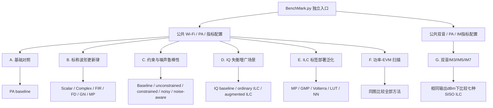
```mermaid
flowchart TB
    entry["BenchMark.py 独立入口"] --> common["公共 Wi-Fi / PA / 指标配置"]
    entry --> toneCommon["公共双音 / PA / IM指标配置"]
    common --> baseline["A. 基础对照"]
    common --> waveform["B. 标称波形更新律"]
    common --> robust["C. 约束与噪声鲁棒性"]
    common --> iq["D. IQ 失衡增广场景"]
    common --> deploy["E. ILC 标签部署泛化"]
    common --> power["F. 功率-EVM 扫描"]
    toneCommon --> tone["G. 双音IM3/IM5/IM7"]

    baseline --> baselineResult["PA baseline"]
    waveform --> waveformResult["Scalar / Complex / FIR / FD / GN / MP"]
    robust --> robustResult["Baseline / unconstrained / constrained / noisy / noise-aware"]
    iq --> iqResult["IQ baseline / ordinary ILC / augmented ILC"]
    deploy --> deployResult["MP / GMP / Volterra / LUT / NN"]
    power --> powerResult["同图比较全部方法"]
    tone --> toneResult["相同输出dBm下比较七种SISO ILC"]
```

**图 1 说明：**七类测试不是把不同条件下的数字直接混合比较。A至F类使用Wi-Fi，G类使用双音。每个特殊场景都有与自己匹配的baseline，而且至少包含两个可比较对象：标称更新律与标称PA baseline比较；峰值场景同时放入未补偿、无约束和受约束结果；噪声场景同时放入未补偿、单次反馈和噪声感知结果；IQ场景同时放入未补偿、普通频域ILC和增广IQ ILC；部署模型只与独立验证帧baseline比较；双音场景只在相同实际PA输出dBm下比较IM3、IM5和IM7。

---

## 3. 参考仿真的公共配置

本文“仿真结果”来自以下可重复命令：

```powershell
python tests/BenchMark.py --format EHT --bandwidth 20 --sample-rate-hz 60000000 --mcs 7 --symbols 4 --guard-interval 0.8 --output-power-dbm 20 --maximum-output-power-dbm 25 --load-resistance-ohm 50 --iterations 6 --pa wiener --seed 101 --power-start-dbm 10 --power-stop-dbm 25 --power-points 4 --output-dir results/benchmark_reference_output
```

| 参数 | 参考值 | 作用 |
|---|---:|---|
| 帧格式 | EHT | 使用 802.11be/EHT 帧结构 |
| 带宽 | 20 MHz | 控制有效子载波和采样率 |
| MCS | 7 | 64-QAM、编码率 5/6 |
| 数据符号数 | 4 | 控制每个包的数据长度 |
| 采样率 | 60 MHz | 20 MHz信道的3倍，保留上下邻道并满足ACLR计算要求 |
| GI | 0.8 µs | EHT 保护间隔 |
| 标称每路输出功率 | 20 dBm | 常见台架工作点，额定极限以下回退 5 dB |
| 每路极限输出功率 | 25 dBm | 定义归一化 PA 的额定饱和驱动点，不允许扫描超过该值 |
| 端口电阻 | 50 Ω | 用于目标输出 dBm 与复包络 RMS 电压的物理换算 |
| ILC 记录轮数 | 6 | 第 1 轮是更新前基线，随后执行 5 次有效更新 |
| PA | Wiener | 线性记忆滤波器后接 AM-AM/AM-PM 非线性 |
| 训练种子 | 101 | 固定训练帧 |
| 验证种子 | 198 | 与训练帧独立，数值为训练种子加 97 |
| 功率扫描 | 10 至 25 dBm/路 | 覆盖 15 dB 输出回退区直至额定极限输出点 |
| 功率点数 | 4 | 使用等 dBm 间隔 |

结果目录包含：

- `all_ilc_metrics.csv`：所有场景和方法的统一指标；
- `all_ilc_metrics.json`：带完整配置元数据的结构化结果；
- `convergence_*.csv`：每个 ILC 每一轮的 Raw MSE、LC-MSE、EVM-MSE和模拟输出功率；
- `convergence_*.png`：每个方法的迭代收敛曲线；
- `all_ilc_power_evm_curve.csv/json/png`：所有方法同图比较的功率-EVM结果。

---

## 4. 指标与改善量的统一方向

A至F类Wi-Fi场景通过 `Analysis` 计算 SNR、EVM 和 ACLR。EVM 使用数据子载波上的理想星座作为参考；ACLR 使用主信道功率与上下相邻信道功率比较。G类双音场景通过 `TwoToneAnalysis` 计算IM3、IM5和IM7，不把离散音调误解释为Wi-Fi星座。

EVM dB 定义为：

```math
\mathrm{EVM}_{\mathrm{dB}}
=20\log_{10}\left(\mathrm{EVM}_{\mathrm{rms}}\right).
```

因此 EVM dB 越负越好。benchmark 把 EVM 改善量定义为：

```math
\Delta\mathrm{EVM}_{\mathrm{dB}}
=\mathrm{EVM}_{\mathrm{baseline,dB}}
-\mathrm{EVM}_{\mathrm{method,dB}}.
```

正值表示方法优于同场景 baseline。SNR 和 ACLR 本身越大越好，所以它们的改善量采用“方法减 baseline”。

---

## 5. A类：基础对照场景

### 5.1 场景构造

训练帧使用 `outputPowerDbm=20` 和 `maximumOutputPowerDbm=25`。5 dB回退对应的0.5623只作为闭环第一次驱动预设。`PowerCalibration` 把原始Wi-Fi波形送入Wiener PA，测量实际有效突发输出功率并在内部更新预设，直到误差进入容限。前后补零和长占空比静默不进入RMS，短暂OFDM过零仍保留。基线输出不做PA后幅度重标定，因此它代表真实20 dBm压缩工作点。

### 5.2 控制变量

- Wi-Fi 帧、PA 实例、驱动功率和分析窗口固定；
- 不加入反馈噪声；
- 不修改 PA 输入峰值；
- 不进行任何学习更新。

### 5.3 结果预期

基线必须表现出非零 EVM 和有限 ACLR，否则 PA 工作点过于线性，无法有效区分 ILC 方法。

### 5.4 五种baseline的对比

| baseline | 物理差异 | SNR (dB) | EVM (%) | Worst ACLR (dB) | 对比用途 |
|---|---|---:|---:|---:|---|
| PA baseline | 标称训练帧和基础PA | 20.788 | 7.292 | 27.333 | B类的未补偿参考 |
| Peak-constrained baseline | 与PA baseline物理输出相同，单独归入峰值场景 | 20.788 | 7.292 | 27.333 | C1按场景筛选时的未补偿参考 |
| Noisy-feedback baseline | 最终输出与PA baseline相同，学习观测允许有噪声 | 20.788 | 7.292 | 27.333 | C2的未学习参考 |
| IQ-imbalance baseline | 基础PA外增加共轭镜像支路 | 19.864 | 8.488 | 27.428 | D类的未补偿参考 |
| Validation baseline | 独立验证帧直接通过基础PA | 20.293 | 7.758 | 26.481 | E类的泛化参考 |

### 5.5 对比结论

PA baseline 的 7.292% EVM 足以观察迭代改善；27.333 dB ACLR 说明 20 dBm 工作点已经存在明显带外频谱再生。IQ baseline 的 EVM 进一步恶化，证明共轭镜像损伤已生效。Validation baseline 与训练 baseline 略有差异，反映两个独立 QAM 数据包具有不同的幅度统计。

这五行不能作为算法排行榜，因为它们不是全部使用相同输入和plant；它们的价值是为后续每一种方法提供同条件分母。Peak-constrained baseline和Noisy-feedback baseline与PA baseline相同也是有意设计：前者让CSV按峰值场景筛选后仍有完整对照，后者用于隔离学习反馈噪声；最终质量都在干净PA输出上评价。

---

## 6. B类：标称波形更新律场景

### 6.1 场景构造

所有更新律反复使用完全相同的训练包和 PA。每种方法拥有相同的6轮记录预算、相同峰值上限和同一个 EVM-MSE 计算器，仅学习率及其算法必须的局部模型不同。

测试方法包括：

1. Scalar P ILC；
2. Complex-gain ILC；
3. FIR ILC；
4. Frequency-domain ILC；
5. Directional Gauss-Newton ILC；
6. Parameter-domain MP ILC。

### 6.2 控制变量

- 训练样本、PA、记录轮数和指标定义相同；
- 不加入反馈噪声；
- 除专门的约束场景外，峰值上限不成为主导限制；
- 每个方法都保存逐轮 MSE 信息。

### 6.3 结果预期

- 所有稳定方法的 EVM 应低于 baseline；
- 标量方法通常收敛较慢；
- 复增益、FIR和频域方法应能补偿相位或线性记忆；
- Directional Gauss-Newton 使用局部有限差分，若局部模型准确，应收敛最快；
- 参数域 MP 只能在所选基函数空间内更新，因此性能取决于模型阶数和记忆深度。

### 6.4 仿真结果

| 方法 | SNR (dB) | EVM (%) | EVM改善 (dB) | Worst ACLR (dB) |
|---|---:|---:|---:|---:|
| PA baseline | 20.788 | 7.292 | 0.000 | 27.333 |
| Scalar P ILC | 21.797 | 6.432 | 1.089 | 27.870 |
| Complex-gain ILC | 22.089 | 6.192 | 1.420 | 28.009 |
| FIR ILC | 22.167 | 6.300 | 1.270 | 28.293 |
| Frequency-domain ILC | 21.709 | 5.996 | 1.699 | 27.171 |
| Directional Gauss-Newton ILC | 21.789 | 6.325 | 1.236 | 27.841 |
| Parameter-domain MP ILC | 22.305 | 5.970 | 1.737 | 28.033 |

### 6.5 逐轮结果示例

频域 ILC 的 EVM-MSE 和 EVM dB 按轮变化如下：

| 轮次 | Raw MSE | LC-MSE | EVM-MSE | EVM (dB) |
|---:|---:|---:|---:|---:|
| 1 | 4.6840e-3 | 3.8139e-3 | 5.3169e-3 | -22.74 |
| 2 | 4.3351e-3 | 3.6180e-3 | 4.8250e-3 | -23.17 |
| 3 | 4.0768e-3 | 3.4758e-3 | 4.4251e-3 | -23.54 |
| 4 | 3.8862e-3 | 3.3742e-3 | 4.0965e-3 | -23.88 |
| 5 | 3.7465e-3 | 3.3036e-3 | 3.8238e-3 | -24.18 |
| 6 | 3.6455e-3 | 3.2569e-3 | 3.5954e-3 | -24.44 |

### 6.6 结果解释

本次参考配置中所有标称方法都改善了 EVM。Directional Gauss-Newton 在第 2 轮达到最佳点，后续由于 20 dBm 工作点的强非线性和峰值投影出现反弹，因此最终汇总采用最佳轮而不是第 6 轮。各方法的 ACLR 变化方向并不完全一致，因为更新的主要选择目标是带内 EVM，不能把 EVM 收益直接解释为等量 ACLR 收益。

### 6.7 同场景方法优缺点对比

| 方法 | 主要优势 | 主要缺点 | 本场景证据 | 更适合的条件 |
|---|---|---|---|---|
| Scalar P ILC | 结构最简单、每轮成本低 | 不能显式补偿公共相位和频率选择性记忆 | EVM降至6.432%，六种方法中改善较小 | PA近似无记忆、需要快速初始验证 |
| Complex-gain ILC | 可同时处理平均增益与公共相位 | 仍不能描述频率选择性逆 | EVM降至6.192%，优于Scalar P | PA记忆较弱但存在公共相位 |
| FIR ILC | 能补偿线性记忆，卷积结构直观 | 滤波器估计和抽头数影响稳定性 | EVM为6.300%，ACLR为本组最佳 | 线性记忆占主导且需要时域实现 |
| Frequency-domain ILC | 每个频点正则化求逆，便于带宽投影 | 需要频响探测，低激励频点需门限保护 | EVM为5.996%，但ACLR略低于baseline | 重复波形、频率选择性记忆明显 |
| Directional Gauss-Newton | 局部方向准确时收敛非常快 | 每轮需要额外PA调用，对强非线性和峰值投影敏感 | 第2轮最好，后期反弹，最佳EVM为6.325% | 高重复性台架、反馈质量高 |
| Parameter-domain MP ILC | 学完即得到有限维可部署参数 | 性能受阶数和记忆深度限制 | EVM为5.970%，本组最低 | 需要直接生成可部署多项式系数 |

这张表把“最终线性化质量”和“工程代价”分开。Directional Gauss-Newton在固定轮数下最好，不等于在相同PA调用次数、相同测量时间或有噪环境中仍然最好。

---

## 7. C类：约束与噪声鲁棒性场景

### 7.1 C1：峰值约束

#### 构造

把允许的 ILC 输入峰值设为原始训练波形峰值的 1.05 倍。每次频域更新后执行复平面圆盘投影，防止学习结果产生不可实现的峰值。

#### 预期

- 输入峰值必须受控；
- EVM 应优于无 ILC baseline；
- 因自由度减少，EVM通常不如无约束频域ILC。

#### 仿真结果

| 方法 | EVM (%) | EVM改善 (dB) | Worst ACLR (dB) |
|---|---:|---:|---:|
| Peak-constrained baseline | 7.292 | 0.000 | 27.333 |
| Unconstrained frequency-domain ILC | 5.996 | 1.699 | 27.171 |
| Constrained CFR-ILC | 6.189 | 1.424 | 27.257 |

#### 结论

峰值约束下仍获得 1.424 dB 的 EVM 改善，但弱于无约束频域 ILC 的 1.699 dB，符合“可实现性换取部分线性化自由度”的预期。

### 7.2 C2：噪声反馈

#### 构造

三条链在同一个PA、同一个训练帧和32 dB反馈条件下对比：

1. `Noisy-feedback baseline` 不学习；
2. `Naive noisy-feedback ILC` 每轮只采集1次，学习率0.15、正则化 `1e-3`；
3. `Noise-aware ILC` 每轮采集4次并平均，学习率降低到0.10、正则化增大到 `1e-2`。

两个ILC最终都使用没有额外反馈噪声的PA输出评价，以便测量学到的输入，而不是把某一次随机噪声直接计入最终EVM。

#### 预期

- 平均可降低反馈噪声方差；
- 较强正则化应避免学习噪声；
- 收敛速度和最终EVM通常弱于无噪声频域ILC；
- 最终结果仍应优于同一PA baseline。

#### 仿真结果

| 方法 | SNR (dB) | EVM (%) | EVM改善 (dB) | Worst ACLR (dB) |
|---|---:|---:|---:|---:|
| Noisy-feedback baseline | 20.788 | 7.292 | 0.000 | 27.333 |
| Naive noisy-feedback ILC | 21.691 | 6.009 | 1.681 | 27.143 |
| Noise-aware ILC | 21.523 | 6.339 | 1.216 | 27.301 |

#### 结论

两种方法都优于未学习 baseline。当前单种子参考运行中，Naive 方法的干净输出 EVM 为 6.009%，优于 Noise-aware 的 6.339%；两者的含噪逐轮 EVM 在 6 轮内都持续下降。由此得到的正确结论是：平均与较强正则化降低反馈波动，但更保守的更新也可能限制固定轮数内的改善量。要证明统计鲁棒性，需要多种子比较均值、方差和发散率。

| 方法 | 优点 | 缺点 | 当前结果体现 |
|---|---|---|---|
| Baseline | 无学习成本，不会学习噪声 | 保留全部PA失真 | EVM最高，为7.292% |
| Naive noisy-feedback ILC | 更新更积极、采集次数少 | 单次观测方差大，后期可能回退 | 本次最终EVM最低，为6.009% |
| Noise-aware ILC | 平均降低噪声方差，轨迹更平滑 | 每轮采集4次，更新保守，成本更高 | 六轮单调改善，最终EVM为6.339% |

---

## 8. D类：IQ失衡增广场景

### 8.1 场景构造

基础 Wiener PA 外包一层 `IQImbalancePA`，使输出同时包含原信号分量和共轭镜像分量。普通解析复多项式不能完整表达共轭支路，因此使用同时依赖输入及输入共轭的增广 ILC。

### 8.2 控制变量

- Wi-Fi训练帧、驱动功率和基础PA与标称场景一致；
- baseline、普通频域ILC和增广ILC使用相同IQ失衡模型；
- 三者都用相同的 `Analysis` 指标路径。

### 8.3 结果预期

- IQ失衡baseline的EVM应明显差于标称baseline；
- 增广ILC应抑制镜像并显著改善EVM；
- 如果只使用普通非共轭模型，通常会留下结构性误差。

### 8.4 仿真结果

| 方法 | SNR (dB) | EVM (%) | EVM改善 (dB) | Worst ACLR (dB) |
|---|---:|---:|---:|---:|
| IQ-imbalance baseline | 19.864 | 8.488 | 0.000 | 27.428 |
| Frequency-domain ILC on IQ plant | 21.337 | 6.435 | 2.405 | 27.189 |
| Augmented IQ ILC | 21.928 | 6.364 | 2.501 | 28.067 |

### 8.5 结果解释

IQ 失衡使 EVM 从标称 baseline 的 7.292% 恶化到 8.488%。普通频域 ILC 虽然没有显式共轭支路，仍可利用逐样点误差把 EVM 降低到 6.435%，说明它能部分抵消综合误差；增广 ILC 进一步降低到 6.364%，相对普通方法多获得约 0.096 dB EVM 改善，同时 Worst ACLR 提高约 0.878 dB，证明显式镜像支路在当前强非线性工作点仍有收益，但优势已不如低功率旧场景显著。

| 方法 | 优点 | 缺点 | 当前结果体现 |
|---|---|---|---|
| IQ baseline | 清楚量化未补偿镜像损伤 | 不提供线性化能力 | EVM为8.488% |
| 普通频域ILC | 无需IQ专用模型，也能部分校正 | 不能显式区分直接与共轭支路 | EVM为6.435%，仍有结构性残差 |
| 增广IQ ILC | 同时利用误差和误差共轭，结构匹配 | 参数更多，增广矩阵可能病态 | EVM最低，为6.364%，ACLR也最好 |

---

## 9. E类：ILC标签部署泛化场景

### 9.1 场景构造

先用频域ILC在训练帧上得到逐样点最优输入标签，再分别拟合以下可部署模型：

1. Memory Polynomial；
2. Generalized Memory Polynomial；
3. 简化三阶复 Volterra；
4. 幅度分箱复增益 LUT；
5. 固定随机隐藏层的时延神经模型。

部署测试不再使用训练帧，而是使用种子198生成的独立EHT帧。这样测到的是泛化能力，不是对训练样本的记忆。

### 9.2 控制变量

- 所有模型使用同一组频域ILC标签；
- 所有模型使用同一个独立验证帧；
- 输出经过相同峰值限制后进入同一个PA；
- baseline是该独立验证帧直接进入PA的结果。

### 9.3 结果预期

- 部署模型应优于验证baseline；
- GMP应比MP更适合带交叉记忆的目标；
- Volterra表达能力强，但有限训练量和正则化会影响泛化；
- LUT结构简单，主要描述幅度相关逆特性；
- 小型NN的结果受隐藏维度、随机种子和训练覆盖度影响。

### 9.4 仿真结果

| 方法 | SNR (dB) | EVM (%) | EVM改善 (dB) | ACLR改善 (dB) |
|---|---:|---:|---:|---:|
| Validation baseline | 20.293 | 7.758 | 0.000 | 0.000 |
| ILC label + MP | 21.337 | 6.681 | 1.298 | 0.424 |
| ILC label + GMP | 21.226 | 6.525 | 1.504 | -0.032 |
| ILC label + Volterra | 21.161 | 6.489 | 1.552 | -0.187 |
| ILC label + LUT | 21.369 | 6.792 | 1.155 | 0.582 |
| ILC label + NN | 20.560 | 7.072 | 0.804 | -0.413 |

### 9.5 结果解释

五种部署模型的 EVM 均优于独立验证 baseline，说明 ILC 标签不是只对训练帧有效。当前参考配置中 Volterra 取得最低 EVM，GMP 紧随其后；LUT 的 ACLR 改善最大。NN 结果仍有改善但弱于多项式模型，这与只有 4 个训练数据符号、固定隐藏层和较小网络规模有关，不能据此推断更充分训练下 NN 一定较差。

### 9.6 同场景部署模型优缺点对比

| 方法 | 主要优势 | 主要缺点 | 当前验证帧结论 |
|---|---|---|---|
| MP | 系数少、实现成熟 | 缺少交叉记忆项 | 6.681%，性能与复杂度均衡 |
| GMP | 能描述包络滞后和超前交叉项 | 基函数更多，矩阵条件数可能变差 | 6.525%，接近当前最佳 |
| Volterra | 表达一般非线性记忆关系 | 项数增长快，当前实现是简化三阶结构 | 6.489%，当前EVM最好 |
| LUT | 查询速度快、易于硬件实现 | 幅度分箱难以描述动态记忆和相位上下文 | 6.792%，ACLR改善最大 |
| NN | 可扩展到复杂非线性映射 | 依赖数据覆盖、结构和训练预算 | 7.072%，有限样本下收益最小 |

不同模型必须同时看 EVM、ACLR、模型规模和推理成本。本次 Volterra 的 EVM 最佳，而 LUT 的 ACLR 改善最大，因此不存在脱离目标指标的单一“最好模型”。

---

## 10. F类：功率-EVM扫描场景

### 10.1 场景构造

每路目标输出功率在 10 dBm 至 25 dBm 之间取 4 个等 dBm 间隔点。25 dBm 是归一化PA的额定极限输出。每个功率点和每种方法都重新执行闭环输入功率校准；波形ILC求值器会在每次试探输入上重新学习，不能把20 dBm工作点学到的逐样点输入直接缩放后冒充其他功率点的最优解。

第 $i$ 个目标输出功率为：

```math
p_i
=p_{\min}
+\frac{i}{N-1}
\left(p_{\max}-p_{\min}\right).
```

`PowerCalibration` 用额定极限计算第一次试探的名义驱动比例：

```math
d_i
=10^{(p_i-p_{\mathrm{max}})/20}.
```

每次试探实际运行“DPD+PA”，按有效突发输出RMS计算实测功率 $p_{i,\mathrm{meas}}^{(k)}$，误差为

```math
e_i^{(k)}
=p_i-p_{i,\mathrm{meas}}^{(k)}.
```

隐藏输入预设按有界dB修正或括区后二分更新，直到绝对误差进入容限。PA输出不施加后置常数增益，所以EVM、SNR和ACLR均来自实际工作点。

### 10.2 结果预期

- PA baseline的EVM随驱动功率升高而恶化；
- 各ILC方法在多个功率点应保持相对收益；
- 峰值约束和噪声反馈方法通常弱于理想无约束方法；
- IQ失衡baseline含有与功率相关性较弱的镜像误差；
- 部署模型在超出训练幅度覆盖范围时可能退化。

### 10.3 全方法端点结果

| 方法 | EVM @ 10 dBm/路 (%) | EVM @ 25 dBm/路 (%) |
|---|---:|---:|
| PA baseline | 0.738 | 19.833 |
| Scalar P ILC | 0.414 | 19.802 |
| Complex-gain ILC | 0.317 | 19.813 |
| FIR ILC | 0.319 | 19.833 |
| Frequency-domain ILC | 0.322 | 19.766 |
| Directional Gauss-Newton ILC | 0.022 | 19.833 |
| Parameter-domain MP ILC | 0.235 | 19.833 |
| Constrained CFR-ILC | 0.385 | 19.766 |
| Naive noisy-feedback ILC | 0.519 | 19.833 |
| Noise-aware ILC | 0.452 | 19.764 |
| IQ-imbalance baseline | 4.571 | 20.346 |
| Frequency-domain ILC on IQ plant | 2.191 | 20.013 |
| Augmented IQ ILC | 1.733 | 20.080 |
| ILC label + MP | 0.374 | 30.398 |
| ILC label + GMP | 0.347 | 30.769 |
| ILC label + Volterra | 0.713 | 19.727 |
| ILC label + LUT | 0.611 | 19.886 |
| ILC label + NN | 3.085 | 20.567 |

### 10.4 结果解释

PA baseline 从 0.738% 恶化到 19.833%，说明扫描从 15 dB 回退区一直到达强压缩的额定极限。10 dBm 低功率端，各标称波形 ILC 均有明显收益；25 dBm 极限点，多数方法受峰值上限、局部逆模型失配和可用驱动余量限制，EVM 与 baseline 接近。MP/GMP 部署模型只在 20 dBm 标签上拟合，在 25 dBm 出现明显外推失效。这个端点不是“25 dBm 一定不可用”的硬件结论，而是当前归一化 PA 参数和固定算法配置下的仿真结果。

完整 4 个功率点和全部方法保存在 `results/benchmark_reference_output/all_ilc_power_evm_curve.csv`，同图结果保存在 `all_ilc_power_evm_curve.png`。

### 10.5 功率维度的优缺点对比

| 方法组 | 低功率端表现 | 高功率端表现 | 优点 | 缺点 |
|---|---|---|---|---|
| PA baseline | 0.738% | 19.833% | 提供真实未补偿趋势 | 到额定极限后快速恶化 |
| 标称逐点波形ILC | 全部优于PA baseline | 约19.77%至19.83% | 每个功率点重新学习，可展示算法上限 | 极限点剩余驱动余量不足，收益饱和 |
| 峰值约束ILC | 0.385% | 19.766% | 峰值可实现性更好 | 极限点与无约束法都接近饱和 |
| 噪声反馈ILC | 0.452%至0.519% | 19.764%至19.833% | 能在有噪反馈下学习 | 排名随功率、随机噪声和正则化变化 |
| IQ场景方法 | 1.733%至4.571% | 20.013%至20.346% | 增广法在低功率端最优 | 极限点由PA压缩主导，与无IQ损伤方法不能直接排名 |
| 固定部署模型 | 0.347%至3.085% | 19.727%至30.769% | 标称点训练后可直接跨功率推理 | MP/GMP在25 dBm明显超出训练覆盖 |

功率扫描中的公平比较仍必须在同一方法组内进行：逐点重新学习的ILC曲线表示可达到的校准上限；只训练一次的部署模型曲线表示外推能力，两者的训练预算并不相同。

---

## 11. 如何运行

### 11.1 默认完整测试

```powershell
python tests/BenchMark.py
```

### 11.2 快速测试但保留ACLR

ACLR要求采样率至少覆盖主信道和上下邻道，因此 benchmark 要求 `sampleRateHz` 不小于3倍信道带宽：

```powershell
python tests/BenchMark.py --symbols 2 --sample-rate-hz 60000000 --iterations 3 --skip-power-curve --output-dir results/benchmark_quick
```

### 11.3 切换PHY和PA

```powershell
python tests/BenchMark.py --format HE --bandwidth 80 --mcs 11 --pa gmp --symbols 6 --iterations 8 --output-dir results/he_gmp_benchmark
```

### 11.4 Python调用

```python
from pathlib import Path

from tests.BenchMark import BenchmarkConfig, RunAllIlcBenchmark

benchmarkConfig = BenchmarkConfig(
    frameFormat="EHT",
    bandwidthMhz=20,
    mcs=7,
    numDataSymbols=4,
    sampleRateHz=60.0e6,
    width=16,
    numIterations=6,
    outputDirectory=Path("results/custom_benchmark"),
)

benchmarkRows = RunAllIlcBenchmark(benchmarkConfig)
```

---

## 12. 结果适用边界

1. 本文表格是固定随机种子和固定PA参数下的确定性仿真结果，不是802.11标准规定的性能门限。
2. 不同场景必须与自己的baseline比较，不能直接用IQ场景绝对EVM给标称方法排名。
3. Directional Gauss-Newton在无噪声重复仿真中的结果非常好，但真实仪器的噪声、漂移、量化和有限反馈带宽可能降低优势。
4. 当前benchmark是SISO场景集合；MIMO逐PA独立功率控制和MIMO ILC由工程API验证，但需要另行定义串扰、信道矩阵和OTA方向后才能形成公平的MIMO benchmark。
5. ACLR变化小不表示计算失效，而是当前更新目标主要选择带内EVM。若要显著优化ACLR，需要在目标函数中增加邻道功率或频谱模板权重。

---

## 13. BenchMark.py函数级结构与完整执行时序

### 13.1 为什么benchmark必须独立于DpdIlc.py

`inc/lib/DpdIlc.py` 回答“某一种ILC如何计算更新”，`tests/BenchMark.py` 回答“在什么条件下比较哪些算法、使用什么baseline、输出哪些结果”。两者职责不同：

| 层次 | 负责内容 | 不负责内容 |
|---|---|---|
| `inc/lib/DpdIlc.py` | 更新律、峰值投影、反馈测量、迭代记录、标签模型拟合 | 选择测试帧、构造IQ失衡场景、决定报告目录 |
| `tests/BenchMark.py` | 测试帧、PA工作点、特殊损伤、算法组合、结果保存、预期验证 | 重新实现ILC数学更新 |
| `inc/lib/Analysis.py` | 同步补偿、SNR、EVM、ACLR及功率扫描数据 | 决定哪个算法应参加哪个场景 |
| `inc/utils/Draw.py` | 把已经计算好的数据绘图 | 重新计算指标或修改测试信号 |

这种拆分使算法可以被主程序、单元测试或硬件控制程序复用，同时避免生产模块在被导入时隐式创建测试文件。

### 13.2 函数逐项说明

| BenchMark.py入口 | 主要输入 | 返回值或副作用 | 在测试流程中的职责 |
|---|---|---|---|
| `GetProjectRoot` | 无 | 仓库绝对路径 | 让脚本从任意当前目录启动时都能导入 `inc` |
| `BenchmarkConfig.Validate` | 配置对象自身 | 无；非法时抛出异常 | 在长时间仿真开始前检查符号数、采样率、统一I/Q位宽、功率范围和迭代数 |
| `BenchmarkRow.ToDict` | 单行结果 | 扁平字典 | 让CSV和JSON使用完全相同的数值 |
| `AddRow` | 方法指标、同场景baseline指标 | 向结果列表追加一行 | 统一SNR、EVM、ACLR改善量的正负方向 |
| `SaveHistory` | 方法名、`ILCResult`、目录 | 每种方法一个CSV和PNG | 保存每一轮Raw MSE、LC-MSE、EVM-MSE、模拟输出功率和输入峰值 |
| `ReportHistory` | 方法结果、`Analysis`、输出目录 | 控制台表格并调用 `SaveHistory` | 保留原生MSE、候选输入和每轮真实PA输出，不做PA后功率重标定 |
| `EvaluateDeployment` | 拟合DPD、验证帧、PA、幅度上限、功率标定器 | 普通指标字典 | 在独立帧上执行DPD和限幅，再闭环调整PA输入直到实测输出达到目标dBm，最后统一分析 |
| `RunIlcCurvePoint` | 当前功率点参考、额定极限、算法和配置 | 当前功率点PA输出 | 为功率扫描创建当前参考的Analysis，保留逐轮真实PA输出并重新运行波形ILC |
| `RunAllIlcBenchmark` | 可选 `BenchmarkConfig` | 22行 `BenchmarkRow` | 按固定顺序构造A–F类场景并汇总全部结果 |
| `SaveBenchmarkResults` | 结果行、目录、元数据 | 汇总CSV和JSON | 保存绝对指标、改善量及复现配置 |
| `PrintBenchmarkResults` | 全部结果行 | 控制台汇总表 | 快速查看不同场景的SNR、EVM和ACLR |
| `ParseBenchmarkArguments` | 命令行 | 已验证配置 | 把外部参数转换为 `BenchmarkConfig` |
| `Main` | 无 | 进程返回码 | 独立脚本入口，执行benchmark并显示结果目录 |

### 13.3 完整调用时序

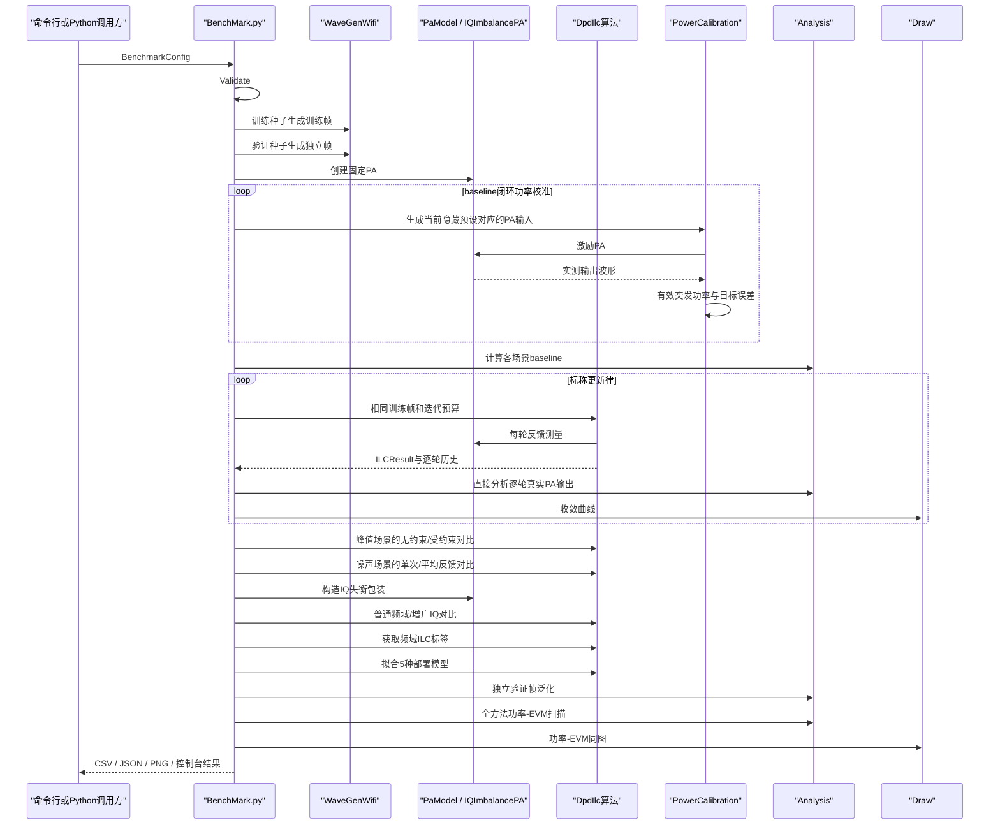
```mermaid
sequenceDiagram
    participant User as "命令行或Python调用方"
    participant BM as "BenchMark.py"
    participant WG as "WaveGenWifi"
    participant PA as "PaModel / IQImbalancePA"
    participant ILC as "DpdIlc算法"
    participant PC as "PowerCalibration"
    participant AN as "Analysis"
    participant DR as "Draw"

    User->>BM: BenchmarkConfig
    BM->>BM: Validate
    BM->>WG: 训练种子生成训练帧
    BM->>WG: 验证种子生成独立帧
    BM->>PA: 创建固定PA
    loop baseline闭环功率校准
        BM->>PC: 生成当前隐藏预设对应的PA输入
        PC->>PA: 激励PA
        PA-->>PC: 实测输出波形
        PC->>PC: 有效突发功率与目标误差
    end
    BM->>AN: 计算各场景baseline

    loop 标称更新律
        BM->>ILC: 相同训练帧和迭代预算
        ILC->>PA: 每轮反馈测量
        ILC-->>BM: ILCResult与逐轮历史
        BM->>AN: 直接分析逐轮真实PA输出
        BM->>DR: 收敛曲线
    end

    BM->>ILC: 峰值场景的无约束/受约束对比
    BM->>ILC: 噪声场景的单次/平均反馈对比
    BM->>PA: 构造IQ失衡包装
    BM->>ILC: 普通频域/增广IQ对比
    BM->>ILC: 获取频域ILC标签
    BM->>ILC: 拟合5种部署模型
    BM->>AN: 独立验证帧泛化
    BM->>AN: 全方法功率-EVM扫描
    BM->>DR: 功率-EVM同图
    BM-->>User: CSV / JSON / PNG / 控制台结果
```

**图 2 说明：**训练帧只负责波形ILC和标签生成；验证帧只负责部署模型泛化测试。两个帧由不同随机种子生成，避免把训练样本记忆误认为DPD泛化能力。

### 13.4 RunAllIlcBenchmark内部阶段

伪代码如下：

```text
Validate(config)
Create training waveform with seed
Create validation waveform with seed + 97
Convert outputPowerDbm and maximumOutputPowerDbm to normalized drive scale
Scale both unit-RMS waveforms by the output-backoff drive scale
Create one deterministic PA

Measure nominal PA baseline and calibrate each PA output to outputPowerDbm
Run six nominal ILC update laws
Calibrate every saved iteration output to the same active-burst target power
Compare unconstrained and peak-constrained frequency-domain ILC
Compare single-sample and averaged noisy-feedback ILC
Wrap the PA with IQ imbalance
Compare ordinary frequency-domain and augmented IQ ILC

Use the best frequency-domain ILC input as the training label
Fit MP, GMP, Volterra, LUT, and NN predistorters
Evaluate all fitted models on the held-out waveform

Save the 22-row summary
Optionally run every power evaluator on equally spaced dBm points
Save convergence histories and power-EVM data
```

---

## 14. 默认配置、参考配置和派生波形参数

### 14.1 默认值与本文参考值必须区分

直接运行 `python tests/BenchMark.py` 使用类内默认值。本文结果为了缩短可复现时间并增强非线性可见度，使用了单独的参考配置。

| 参数 | BenchMark.py默认值 | 本文参考值 | 影响 |
|---|---:|---:|---|
| `frameFormat` | EHT | EHT | PHY字段和子载波结构 |
| `bandwidthMhz` | 20 | 20 | FFT基准长度与有效带宽 |
| `mcs` | 7 | 7 | 64-QAM和编码率 |
| `numDataSymbols` | 10 | 4 | 波形长度和统计样本数 |
| `sampleRateHz` | None，兼容解析为80 MHz | 60 MHz | 用户直接指定复基带采样率 |
| `oversampling` | 4 | 未使用 | 仅在 `sampleRateHz=None` 时兼容推导采样率 |
| `width` | 16 | 16 | 写入WaveGenWifi、PaModel和Analysis的 `parameters`；0为浮点模式 |
| `guardIntervalUs` | 0.8 | 0.8 | 每个数据符号的CP长度 |
| `outputPowerDbm` | 20 | 20 | 每路PA目标输出功率 |
| `maximumOutputPowerDbm` | 25 | 25 | 每路PA额定极限输出功率和0 dB回退参考点 |
| `loadResistanceOhm` | 50 | 50 | dBm与复包络RMS电压换算 |
| `numIterations` | 10 | 6 | 每种ILC记录轮数 |
| `paModelName` | wiener | wiener | 被测PA模型；可选Rapp、Wiener、GMP或Doherty |
| `seed` | 101 | 101 | 训练帧及方法种子基准；允许0至926，验证帧使用 `seed + 97` |
| `powerStartDbm` | 10 | 10 | 每路输出功率扫描起点，单位dBm |
| `powerStopDbm` | 25 | 25 | 每路输出功率扫描终点，单位dBm |
| `powerPointCount` | 5 | 4 | 功率曲线点数 |
| `generatePowerEvmCurve` | True | True | 是否输出联合曲线 |

文档中的实测表格只能和“本文参考值”复现结果比较；使用默认值时，结果不同是正常现象。

### 14.2 配置验证规则

`BenchmarkConfig.Validate` 在构造任何波形前检查：

- `numDataSymbols` 必须大于0；
- 实际 `sampleRateHz` 必须不小于3倍信道带宽，因为ACLR需要同时观察主信道和上下邻道；
- `width` 必须为0至53的整数，0为浮点模式；
- `outputPowerDbm` 和 `maximumOutputPowerDbm` 必须是有限数；
- `outputPowerDbm`、`powerStartDbm` 和 `powerStopDbm` 均不得超过 `maximumOutputPowerDbm`；
- `loadResistanceOhm` 必须大于0；
- `numIterations` 必须大于0；
- `seed` 必须为0至926的整数，使训练seed和自动增加97的验证seed都保持在10 bit范围内；
- `powerStartDbm` 和 `powerStopDbm` 必须是有限数；
- `powerStopDbm` 必须大于 `powerStartDbm`；
- `powerPointCount` 必须不小于2。

随后 `WaveGenWifi` 继续检查PHY相关组合，例如VHT/HE/EHT支持的MCS范围和GI范围。`PaModel` 继续检查模型名称和物理参数。因此验证被分为“场景级”“波形级”“PA级”三层。

### 14.3 本文参考波形的派生参数

由参考配置实际生成的训练帧具有：

| 派生量 | 数值 | 来源 |
|---|---:|---|
| 采样率 | 60 MHz | 由参考命令的 `--sample-rate-hz 60000000` 直接指定 |
| FFT长度 | 768 | EHT 20 MHz基准256点乘3 |
| CP长度 | 48 samples | 0.8 µs乘60 MHz |
| 单个数据符号长度 | 816 samples | FFT 768加CP 48 |
| 活动子载波 | 242 | EHT 20 MHz满带宽分配 |
| 数据子载波 | 234 | 活动子载波扣除8个导频 |
| 导频子载波 | 8 | EHT 20 MHz导频配置 |
| 数据字段起点 | sample 3216 | 前导和信令字段之后 |
| 数据字段终点 | sample 6480 | 4个数据符号之后 |
| 整帧长度 | 6480 samples | 全部前导、信令、训练和数据字段 |
| 调制 | 64-QAM | MCS 7 |
| 每数据符号编码比特 | 1404 | 234乘每子载波6比特 |
| 每数据符号信息比特 | 1170 | 编码率5/6后的工程值 |

单位RMS波形乘以驱动值构造PA目标：

```math
x_{\mathrm{train}}[n]
=d_{\mathrm{nominal}}x_{\mathrm{unit}}[n],
\qquad
d_{\mathrm{nominal}}
=10^{(20-25)/20}
\approx0.562341.
```

参考运行中初始 PA 输入峰值约为 1.7793。普通方法的统一幅度上限为：

```math
A_{\max}
=\max\left(
2.0,\,
1.6\max_n|x_{\mathrm{train}}[n]|
\right)
\approx2.8469.
```

因此普通方法不会因为过紧的公共限幅而被不公平地截断；峰值约束方法使用单独的更小上限。

### 14.4 Wiener PA的固定参数

参考运行只传入 `modelName="wiener"`，因此使用 `WienerConfig` 内部默认值：

| PA参数 | 数值 | 物理作用 |
|---|---:|---|
| 线性记忆抽头 | `1`、`0.055-j0.025`、`-0.018+j0.012` | 形成幅频、相频和短记忆 |
| `linearGain` | 1.0 | 小信号标称增益 |
| `saturationAmplitude` | 1.0 | Rapp压缩幅度尺度 |
| `rappSmoothness` | 3.0 | 控制压缩拐点平滑程度 |
| `ampmCoefficient` | 0.18 | 控制幅度相关相位旋转 |

所有标称、约束、噪声和部署场景复用同一个确定性PA参数集合。只有D类额外增加IQ镜像包装。

### 14.5 随机种子分配

| 用途 | 种子 | 为什么分开 |
|---|---:|---|
| 训练Wi-Fi帧 | 101 | 固定所有波形ILC的目标 |
| 验证Wi-Fi帧 | 198 | 与训练帧独立，检查泛化 |
| Scalar P ILC | 102 | 若启用反馈噪声，保持方法内可复现 |
| Complex-gain ILC | 103 | 避免不同方法共享随机序列状态 |
| FIR ILC | 104 | 同上 |
| Frequency-domain ILC | 105 | 同上 |
| Directional Gauss-Newton | 106 | 同上 |
| Parameter-domain MP ILC | 107 | 同上 |
| Constrained CFR-ILC | 108 | 独立约束场景 |
| Noise-aware ILC | 109 | 独立噪声场景 |
| Augmented IQ ILC | 110 | 独立IQ场景 |
| Neural predistorter | 111 | 固定隐藏层随机权重 |
| Naive noisy-feedback ILC | 119 | 与Noise-aware使用独立但固定的噪声序列 |
| Frequency-domain ILC on IQ plant | 120 | 普通IQ对照方法的独立配置 |

在无反馈噪声的方法中，随机种子不会改变确定性PA输出，但仍显式记录，便于后来开启噪声时保持复现。

---

## 15. A类实验卡：baseline如何构造和使用

### 15.1 精确信号链

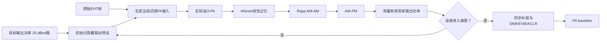
```mermaid
flowchart LR
    power["目标输出功率 20 dBm/路"] --> backoff["初始化隐藏驱动预设"]
    unit["原始EHT帧"] --> scale["生成当前试探PA输入"]
    backoff --> scale
    scale --> target["实际送入PA"]
    target --> memory["Wiener线性记忆"]
    memory --> amam["Rapp AM-AM"]
    amam --> ampm["AM-PM"]
    ampm --> outputCalibration["测量有效突发输出功率"]
    outputCalibration --> decision{"误差进入容限？"}
    decision -->|否| backoff
    decision -->|是| analysis["同步补偿与SNR/EVM/ACLR"]
    analysis --> baseline["PA baseline"]
```

**图 3 说明：**目标输出dBm用于初始化并约束闭环。隐藏预设控制PA压缩深度，最终物理电平由PA实测结果判定。不存在PA后常数增益，因此EVM、SNR和ACLR保留真实工作点特征。这里没有单独的无线信道、接收噪声或频偏；`SigProc` 仍由 `Analysis` 调用，使baseline与其他场景走相同分析入口。

### 15.2 baseline不是一个全局通用数字

benchmark中存在5个baseline行：

| baseline | 对应场景 | 为什么必须单独存在 |
|---|---|---|
| `PA baseline` | 标称更新律 | 原始训练帧直接进入基础PA |
| `Peak-constrained baseline` | 峰值约束 | 与PA baseline物理相同，但让该场景可独立筛选和比较 |
| `Noisy-feedback baseline` | 单次噪声反馈ILC和噪声感知ILC | 最终指标仍在干净PA输出上评价，但学习阶段反馈有噪声 |
| `IQ-imbalance baseline` | 普通频域ILC和增广IQ ILC | plant多了共轭镜像，不能使用标称PA数字 |
| `Validation baseline` | 标签部署模型 | 输入是独立验证帧，数据符号不同 |

`Noisy-feedback baseline` 的数值与 `PA baseline` 相同是有意设计：反馈噪声只污染学习观测，最终部署性能使用干净plant输出评价。这样能判断“噪声是否让算法学坏”，而不是测量某一次随机噪声的瞬时EVM。

### 15.3 baseline验收条件

参考配置下应检查：

- SNR、EVM、ACLR全部为有限数；
- EVM大于0，避免把完全线性plant当作非线性benchmark；
- Worst ACLR取上下邻道中较小值；
- `PA baseline` 与 `Noisy-feedback baseline` 的最终指标相同；
- `Validation baseline` 允许与训练baseline不同，因为QAM数据和峰值分布不同；
- `IQ-imbalance baseline` 应明显差于标称baseline。

如果标称baseline EVM已经接近数值精度，ILC之间的排名主要反映数值噪声；如果EVM极高，则工作点可能过度压缩，局部更新模型不再有效。

---

## 16. B类实验卡：六种标称更新律的准确参数与判定

### 16.1 公共ILC参数

除表中专门覆盖的项目外，所有标称更新律继承：

| `ILCConfig`参数 | 公共值 | 作用 |
|---|---:|---|
| `numIterations` | 6 | 保存6个更新前测量点 |
| `regularization` | `1e-3` | 稳定逆增益或正规方程 |
| `maxAmplitude` | `max(2.0, 1.6 × 初始峰值)` | 输入复包络峰值上限；参考运行约为2.8469 |
| `feedbackSnrDb` | None | 标称场景无反馈噪声 |
| `feedbackAverages` | 1 | 每轮只测一次 |
| `projectionBandwidthFactor` | 1.6 | 频域更新允许一定带外抵消分量 |
| `responseFloorDb` | -45 | 低激励频点响应估计门限 |

EHT数据子载波EVM-MSE评估器不是 `ILCConfig` 参数。Benchmark将 `trainingAnalysis.CalculateEvmAlignedMse` 作为每个SISO ILC入口的独立参数传入，使最佳轮选择与最终EVM目标一致；最终SNR、EVM和ACLR仍由 `trainingAnalysis.Analyze` 独立计算。

### 16.2 方法专用参数

| 方法 | 学习率 | 方法专用设置 | 种子 |
|---|---:|---|---:|
| Scalar P ILC | 0.10 | 使用小信号标量增益 | 102 |
| Complex-gain ILC | 0.15 | 使用复数小信号增益 | 103 |
| FIR ILC | 0.15 | FIR学习滤波器长度17 | 104 |
| Frequency-domain ILC | 0.15 | 小信号频响、投影倍率1.6 | 105 |
| Directional Gauss-Newton | 0.65 | 有限差分RMS默认 `1e-3` | 106 |
| Parameter-domain MP ILC | 0.20 | 阶数1/3/5/7，记忆深度3 | 107 |

学习率不同意味着这是一组“各方法采用保守可用参数”的工程比较，不是“强制相同学习率”的理论比较。相同学习率对不同归一化和不同方向尺度没有公平物理意义。

### 16.3 每种方法实际补偿什么

#### Scalar P ILC

使用实标量比例修正误差。它能降低整体非线性误差，但对PA公共相位和频率选择性记忆的处理能力有限，因此预期最慢。

#### Complex-gain ILC

先在低功率工作点估计复增益，再用其逆方向更新。相比Scalar P，它能同时校正平均增益和公共相位。

#### FIR ILC

估计多抽头学习滤波器，用卷积近似PA线性记忆的逆。对于Wiener模型前端的三抽头FIR，FIR ILC应比纯标量方法更合适。

#### Frequency-domain ILC

使用低功率探测估计小信号频率响应，在每个FFT频点构造正则化逆，并通过平滑带宽投影限制更新。它允许生成一定带外预失真分量，但当前最佳轮选择仍以EVM-MSE为主。

#### Directional Gauss-Newton ILC

沿当前误差方向对PA做有限差分，估计雅可比与误差方向的乘积，再求一个复步长。它没有构造完整雅可比矩阵，但每轮需要额外PA调用，因此不能只看迭代轮数判断计算成本。

#### Parameter-domain MP ILC

直接在Memory Polynomial基函数空间更新系数。输入只能落在有限维模型空间内，无法像逐样点波形ILC一样自由，但更新后天然得到可部署参数。

### 16.4 每轮记录与最佳轮选择

第1轮先测量初始输入，再计算第1次更新。因此 `numIterations=6` 表示：

```text
record 1 -> update 1
record 2 -> update 2
record 3 -> update 3
record 4 -> update 4
record 5 -> update 5
record 6 -> update 6, but this updated input is not measured in this run
```

对外返回的 `learnedInput` 不是简单取最后更新后的输入，而是在6个已经测量的候选输入中选择EVM-MSE最小者：

```math
k^\star
=\arg\min_k
\mathrm{MSE}_{\mathrm{EVM},k}.
```

如果没有提供EVM计算器，才回退到LC-NMSE作为选择目标。这个机制防止后期迭代发散时把较差的最后一轮当作结果。

### 16.5 参考运行的收敛审计表

| 方法 | 第1轮EVM (dB) | 第6轮EVM (dB) | 最佳轮 | 历史最大输入峰值 |
|---|---:|---:|---:|---:|
| Scalar P ILC | -22.743 | -23.833 | 6 | 2.1746 |
| Complex-gain ILC | -22.743 | -24.163 | 6 | 2.3509 |
| FIR ILC | -22.743 | -24.014 | 6 | 2.3784 |
| Frequency-domain ILC | -22.743 | -24.443 | 6 | 2.2381 |
| Directional Gauss-Newton | -22.743 | -23.211 | 2 | 2.8469 |
| Parameter-domain MP ILC | -22.743 | -24.481 | 6 | 2.5088 |

本次参考运行中除 Directional Gauss-Newton 外，其余 5 种方法都在第 6 轮取得最小 EVM-MSE。Directional Gauss-Newton 在第 2 轮最好，随后反弹，说明最佳轮保留机制在强非线性工作点确有必要。

### 16.6 质量验收与异常含义

| 观察 | 可能含义 | 建议检查 |
|---|---|---|
| Raw MSE下降，EVM不下降 | 公共增益或非数据字段主导Raw MSE | 查看LC-MSE和EVM-MSE |
| EVM下降，ACLR不变 | 更新目标主要改善带内调制质量 | 增加邻道目标或频谱权重 |
| EVM后期变差但最终汇总仍好 | 最佳轮保留机制生效 | 查看完整 `convergence_*.csv` |
| 输入峰值达到公共上限 | 公共峰值约束开始主导 | 降低学习率或提高可实现上限 |
| Gauss-Newton突然恶化 | 有限差分方向受噪声或强非线性污染 | 调整差分RMS、正则化和学习率 |
| FIR不优于复增益 | PA记忆弱、滤波器估计不足或轮数太少 | 检查频响和FIR长度 |

### 16.7 B类选择建议

| 工程优先级 | 首选对照 | 理由 |
|---|---|---|
| 最小实现复杂度 | Scalar P与Complex-gain | 用最少结构判断公共增益和相位是否主导 |
| 补偿线性记忆 | FIR与Frequency-domain | 分别从时域和频域观察记忆逆 |
| 最低重复波形EVM | Parameter-domain MP与Frequency-domain | 当前参考点表现最好，同时要结合ACLR与部署复杂度 |
| 直接得到可部署结构 | Parameter-domain MP | 学习结果已经处于有限维模型空间 |

选择方法时不应只拿最终EVM一列排序。测试报告至少应同时附上逐轮历史、最大输入峰值、PA调用预算和对噪声的敏感性。

---

## 17. C类实验卡：峰值约束和反馈噪声

### 17.1 C1峰值约束的精确构造

约束上限不是公共动态上限，而是：

```math
A_{\mathrm{CFR}}
=1.05\max_n|x_{\mathrm{train}}[n]|.
```

参考运行初始峰值约为 1.7793，因此约束上限约为 1.8683。实测 6 轮历史中的最大输入峰值为 1.8683，没有越过约束。

每轮更新后执行复圆盘投影：

```math
u_{\mathrm{projected}}[n]
=
u[n],
\qquad
|u[n]|\le A_{\mathrm{CFR}}.
```

对于超限样点：

```math
u_{\mathrm{projected}}[n]
=
A_{\mathrm{CFR}}\frac{u[n]}{|u[n]|},
\qquad
|u[n]|>A_{\mathrm{CFR}}.
```

为保持文档渲染兼容，代码对应含义是：未超限样点保持不变，超限样点只缩短幅度而保留复相位。该场景使用学习率0.12、种子108，其余频域ILC参数与标称场景一致。

> 注意：上式中的分式如果文档平台不支持复杂宏，可直接理解为“把超限复数沿原相位缩回半径为上限的圆周”。工程文档自动检查会阻止不兼容宏进入版本库。

### 17.2 为什么约束场景复用PA baseline

原始训练输入的峰值低于约束上限，因此baseline本身不会被投影改变。约束只影响ILC为了抵消PA失真而额外产生的峰值，所以复用 `PA baseline` 是严格可比的。

### 17.3 C1验收条件

- 每轮 `inputPeak` 不得超过约束上限和浮点容差；
- EVM应优于PA baseline；
- 约束EVM允许弱于无约束频域ILC；
- 如果两者完全相同，说明约束可能从未激活；
- 如果EVM显著恶化，应检查过紧峰值、投影带宽和学习率。

### 17.4 C2噪声反馈的精确构造

该场景的学习反馈为：

```math
y_r[n]
=y_{\mathrm{PA}}[n]+w_r[n],
\qquad
r=1,2,3,4.
```

四次独立反馈平均：

```math
\bar y[n]
=\frac{1}{4}\sum_{r=1}^{4}y_r[n].
```

若每次噪声独立同分布，平均后的噪声方差为：

```math
\mathrm{Var}(\bar w)
=\frac{\mathrm{Var}(w)}{4}.
```

对应理论SNR改善：

```math
\Delta\mathrm{SNR}
=10\log_{10}(4)
\approx6.02\ \mathrm{dB}.
```

因此32 dB单次反馈经过4次平均后，噪声方差层面的等效水平约为38 dB。实际ILC误差还包含PA非线性和模型失配，不能把38 dB直接当作最终输出SNR。

### 17.5 C2参数变化

| 参数 | 标称频域ILC | Naive noisy-feedback | Noise-aware ILC |
|---|---:|---:|---:|
| 学习率 | 0.15 | 0.15 | 0.10 |
| 正则化 | `1e-3` | `1e-3` | `1e-2` |
| 反馈SNR | 无噪 | 32 dB | 32 dB |
| 平均次数 | 1 | 1 | 4 |
| 种子 | 105 | 119 | 109 |

Naive方法只改变反馈是否含噪，因而接近“没有鲁棒化措施”的控制组；Noise-aware同时减小学习率、提高正则化并增加平均次数，代表以采集成本换稳定性的工程方案。

### 17.6 C2收敛与验收

| 方法 | 第1轮含噪EVM (dB) | 第5轮 (dB) | 第6轮 (dB) | 干净最终EVM (%) | 历史最大峰值 |
|---|---:|---:|---:|---:|---:|
| Naive noisy-feedback | -22.66 | -23.91 | -24.21 | 6.009 | 2.2369 |
| Noise-aware | -22.70 | -23.70 | -23.90 | 6.339 | 2.0654 |

两种方法在本次 6 轮记录内都持续改善。Noise-aware 的轨迹更保守，但较小学习率使干净最终 EVM 没有在这个固定种子上超过 Naive。含噪逐轮 EVM 和干净最终 EVM 使用不同观测条件，不能直接把两列当成同一个数值。

验收时应同时检查：

- 重复运行是否在同一平台得到相同结果；
- EVM改善是否为正；
- 曲线是否存在由噪声造成的小幅非单调；
- 增大平均次数后统计波动是否减小；
- 关闭反馈噪声后是否回到更好的标称结果；
- 最终指标是否使用干净PA输出，而不是含随机反馈噪声的瞬时测量。

### 17.7 C类同场景对比结论

#### C1峰值约束对比

| 方法 | EVM (%) | 最大峰值或约束 | 优点 | 缺点 |
|---|---:|---|---|---|
| PA baseline | 7.292 | 初始峰值约1.7793 | 无学习和实现成本 | EVM最高 |
| 无约束Frequency-domain ILC | 5.996 | 公共上限3.0 | EVM最低 | 允许更大的校正峰值 |
| Constrained CFR-ILC | 6.189 | 上限约1.8683 | 可实现峰值有明确保证 | 相对无约束少约0.275 dB EVM改善 |

#### C2反馈噪声对比

| 方法 | 每轮PA反馈采集 | 最终EVM (%) | 优点 | 缺点 |
|---|---:|---:|---|---|
| Baseline | 0 | 7.292 | 成本最低 | 不补偿PA |
| Naive | 1 | 6.009 | 本次最终EVM最低，采集成本低 | 对随机序列更敏感 |
| Noise-aware | 4 | 6.339 | 本次逐轮曲线单调，正则化更强 | 采集成本约为Naive的4倍，更新较慢 |

所以C类给出的不是“约束方法一定更差”或“平均方法一定更好”的绝对命题，而是性能、峰值可实现性、反馈成本和稳定性之间的可量化折中。

---

## 18. D类实验卡：IQ失衡及增广ILC

### 18.1 plant的准确模型

基础PA输出记为 `y`，IQ包装后的输出为：

```math
y_{\mathrm{IQ}}[n]
=\alpha y[n]+\beta y^*[n].
```

参考运行使用：

```math
\alpha=1,
\qquad
\beta=0.045e^{j0.35}.
```

共轭项把正负频率互换，产生普通解析复模型无法完整表示的镜像。按本工程负 dBc 约定估算的镜像相对电平为：

```math
\mathit{irrDb}
=20\log_{10}
\left(
\frac{|\beta|}{|\alpha|}
\right)
\approx-26.94\ \mathrm{dBc}.
```

这与参考运行中IQ baseline明显恶化的数量级一致，但EVM还受PA非线性、帧结构和同步处理影响，因此不应要求EVM恰好等于IRR。

### 18.2 增广逆的构造

`RunAugmentedIqIlc` 先使用低幅度探测信号回归直接支路和共轭支路，形成2×2增广矩阵，再计算带正则化的逆。每轮更新同时使用误差和误差共轭：

```math
\Delta u[n]
=L_{\mathrm{direct}}e[n]
+L_{\mathrm{image}}e^*[n].
```

场景参数为学习率0.18、正则化 `1e-3`、种子110，并使用与标称方法相同的公共动态峰值上限。

### 18.3 对照关系

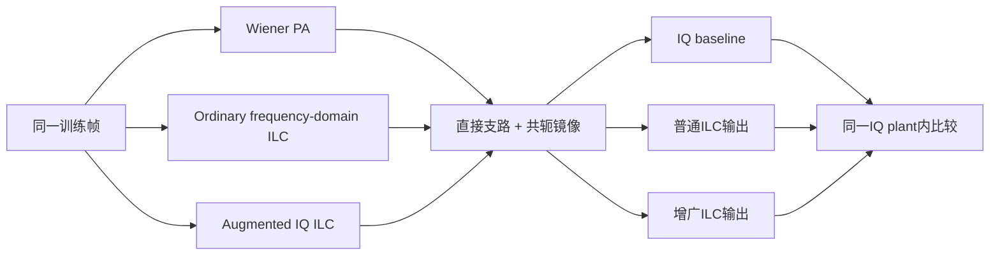
```mermaid
flowchart LR
    train["同一训练帧"] --> basePa["Wiener PA"]
    basePa --> iqWrap["直接支路 + 共轭镜像"]
    iqWrap --> iqBase["IQ baseline"]
    train --> ordinary["Ordinary frequency-domain ILC"]
    ordinary --> iqWrap
    train --> aug["Augmented IQ ILC"]
    aug --> iqWrap
    iqWrap --> ordinaryOut["普通ILC输出"]
    iqWrap --> corrected["增广ILC输出"]
    iqBase --> compare["同一IQ plant内比较"]
    ordinaryOut --> compare
    corrected --> compare
```

普通PA baseline不属于该比较，因为它没有共轭镜像。

### 18.4 收敛审计

| 轮次 | 普通ILC EVM (dB) | 增广ILC EVM (dB) |
|---:|---:|---:|
| 1 | -21.42 | -21.42 |
| 2 | -22.06 | -22.12 |
| 3 | -22.61 | -22.70 |
| 4 | -23.09 | -23.19 |
| 5 | -23.49 | -23.59 |
| 6 | -23.83 | -23.92 |

两种方法最佳轮均为 6；历史最大输入峰值分别为 2.2008 和 2.4038。增广方法从第 2 轮开始持续小幅领先，说明共轭更新方向提供了普通解析频域逆没有显式表达的补偿自由度，但在 20 dBm 强非线性工作点，PA 压缩仍是主要误差来源。

### 18.5 D类验收和失败模式

- IQ baseline EVM应明显高于标称baseline；
- 增广ILC必须相对IQ baseline改善；
- 若 `imageCoefficient=0`，增广方法应退化为近似普通复增益更新；
- 若镜像系数过大，增广矩阵可能病态，需要提高正则化；
- 若只改善EVM而镜像频谱仍高，应增加专门的镜像抑制度指标；
- 当前ACLR窗口主要观察邻道总功率，不等价于镜像抑制度。

### 18.6 D类同场景选择结论

| 选择 | 何时使用 | 代价与风险 |
|---|---|---|
| 普通频域ILC | IQ镜像较弱，或希望复用现有频域标定链 | 只能间接抵消镜像，结构性残差较大 |
| 增广IQ ILC | 镜像误差是主要限制，需要同时校正直接和共轭支路 | 需要估计更多系数，矩阵病态时必须增强正则化 |

当前结果中增广方法相对普通方法把 EVM 从 6.435% 降至 6.364%，并把 Worst ACLR 从 27.189 dB 提高到 28.067 dB；若把 `imageCoefficient` 设为 0 后两者仍保持很大差距，则应检查实现或随机控制是否公平。

---

## 19. E类实验卡：ILC标签、模型拟合和独立验证

### 19.1 标签来源

标签不是PA输出，而是频域ILC在训练帧上选出的最佳输入：

```math
u^\star_{\mathrm{train}}[n]
=u_{k^\star}[n].
```

训练对为：

```math
\left(
x_{\mathrm{train}}[n],
u^\star_{\mathrm{train}}[n]
\right).
```

部署模型学习从原始Wi-Fi样本到ILC理想PA输入的映射。若误把PA输出当作标签，模型会学习PA正向特性而不是逆特性。

### 19.2 五种模型的准确配置

| 部署模型 | 基函数或结构 | 参考配置 | 默认正则化 |
|---|---|---|---:|
| MP | GMP拟合器的主支路 | 阶数1/3/5/7，记忆3，交叉记忆0 | `1e-6` |
| GMP | 主支路、lag、lead交叉项 | 阶数1/3/5/7，记忆3，交叉记忆2 | `1e-6` |
| Volterra | 线性记忆和简化三阶复项 | 记忆深度3 | `1e-6` |
| LUT | 幅度分箱复增益 | 64个等宽bin | `1e-8` |
| NN | 时延I/Q/幅度输入、固定随机隐藏层、复输出回归 | 记忆4，隐藏单元32，种子111 | `1e-5` |

所有模型使用相同训练帧、相同ILC标签和相同幅度投影，因此差异主要来自模型结构和正则化。

### 19.3 训练与验证严格分离

| 阶段 | 种子 | 波形用途 | 是否参与拟合 |
|---|---:|---|---|
| 训练 | 101 | 运行频域ILC并形成标签 | 是 |
| 验证 | 198 | 测量模型对新QAM数据的泛化 | 否 |

验证链路为：


```mermaid
flowchart LR
    valid["独立EHT验证帧"] --> dpd["已拟合DPD.Process"]
    dpd --> limit["公共峰值投影"]
    limit --> pa["同一Wiener PA"]
    pa --> analysis["验证帧Analysis"]
    analysis --> metrics["SNR / EVM / ACLR"]
```

如果训练和验证使用相同种子，逐样点记忆或过拟合可能看起来很好，因此独立种子是该场景最关键的控制条件。

### 19.4 公平性控制

- 5个模型读取完全相同的 `frequencyAnalysisResult.bestInputSignal`，该标签由 `Analysis.AnalyzeIlcHistory` 在ILC结束后按严格EVM选择；
- 验证帧完全相同；
- PA参数完全相同；
- 峰值上限完全相同；
- 指标分析对象绑定同一份验证帧元数据；
- baseline是验证帧绕过DPD后直接进入PA；
- 模型拟合耗时不计入EVM指标。

### 19.5 结果深入解读

参考运行中 Volterra EVM 为 6.489%，略优于 GMP 的 6.525% 和 MP 的 6.681%。这不表示某一结构在理论上始终更强，而是当前强非线性工作点、简化结构、有限训练长度和固定正则化共同作用的结果。LUT 为 6.792%，其 ACLR 改善最大；NN 为 7.072%，仍优于 7.758% 的验证 baseline，但 4 个训练数据符号不足以代表“大数据训练”的神经网络性能。

| 模型 | EVM改善 (dB) | ACLR改善 (dB) | 结构优势 | 结构短板 |
|---|---:|---:|---|---|
| MP | 1.298 | 0.424 | 复杂度较低、适合常见硬件流水 | 缺少交叉记忆 |
| GMP | 1.504 | -0.032 | 能描述动态包络交叉项 | 列数更多、求解条件数更敏感 |
| Volterra | 1.552 | -0.187 | 当前EVM最佳，通用非线性记忆表达能力强 | 项数扩张快，当前仅使用简化三阶结构 |
| LUT | 1.155 | 0.582 | ACLR改善最大、推理成本低 | 幅度分箱对记忆和上下文表达有限 |
| NN | 0.804 | -0.413 | 可扩展到非多项式映射 | 当前训练样本少、结果依赖网络和种子 |

### 19.6 E类验收和失败模式

| 问题 | 典型现象 | 排查 |
|---|---|---|
| 训练泄漏 | 验证结果几乎和逐样点ILC一样好 | 检查训练和验证种子是否不同 |
| 幅度覆盖不足 | 高功率点部署EVM快速恶化 | 增加多功率训练标签 |
| GMP病态 | 系数过大或出现NaN | 提高ridge、缩放基函数、减少阶数 |
| LUT空bin | 某些幅度区间突变 | 增加训练样本或减少bin |
| NN欠拟合 | 训练和验证都改善有限 | 增加隐藏单元、记忆深度或训练帧 |
| NN过拟合 | 训练好、验证差 | 增加独立帧和正则化 |
| 峰值投影主导 | 不同模型输出趋同 | 检查投影前后峰值和削顶比例 |

---

## 20. F类实验卡：功率-EVM曲线的逐点行为

### 20.1 等 dBm 功率点如何生成

功率扫描直接在绝对 dBm 坐标上均匀取点：

```math
p_i
=p_{\min}
+\frac{i}{N-1}
\left(p_{\max}-p_{\min}\right),
\quad
i=0,1,\ldots,N-1.
```

参考配置的 4 个每路目标输出功率点、相对 25 dBm 极限的输出回退量、归一化驱动比例和 50 Ω 目标输出 RMS 电压为：

| 点 | 输出功率 (dBm/路) | 输出回退 (dB) | 归一化驱动比例 | 目标输出RMS (V) |
|---:|---:|---:|---:|---:|
| 1 | 10 | 15 | 0.177828 | 0.707107 |
| 2 | 15 | 10 | 0.316228 | 1.257433 |
| 3 | 20 | 5 | 0.562341 | 2.236068 |
| 4 | 25 | 0 | 1.000000 | 3.976354 |

等 dBm 间隔对应几何名义初始驱动比例和几何 RMS 电压间隔，更适合观察 PA 输出回退量变化。CSV保存的归一化驱动比例仅是闭环初值，不是内部最终预设。`AnalyzePowerEvmCurve` 把每个evaluator当作完整“DPD+PA”被测对象，反复更新输入并重新运行，直到有效突发实测输出落在横轴dBm容限内；绝不对evaluator输出做后级重标定。

### 20.2 三类功率 evaluator行为不同

| evaluator类别 | 每个功率点做什么 | 是否重新训练 |
|---|---|---|
| PA和IQ baseline | 缩放参考后直接过plant | 否 |
| 波形ILC方法 | 为当前缩放参考重新运行ILC | 是 |
| ILC标签部署模型 | 使用标称工作点已经拟合的模型处理当前参考 | 否 |

这一区别非常重要。波形ILC表示“每个功率点单独标定的最佳能力”；部署模型表示“一个标称功率模型跨功率使用的能力”。两类曲线回答的问题不同。

### 20.3 为什么必须重新绑定EVM-MSE

`RunIlcCurvePoint` 为当前缩放参考创建新的 `Analysis`。ILC仍只产生原生MSE与输出历史；运行结束后，Benchmark保留每轮原生MSE、同步估计和候选输入，只把 `outputSignal` 替换为当前有效突发目标dBm版本，再交给 `AnalyzeIlcHistory` 按严格EVM选择最佳轮。这样不会把EVM计算嵌回 `ILCConfig`，也不会让不同占空比或公共输出增益影响功率点比较。

### 20.4 功率曲线验收

- `outputPowerDbmValues` 必须严格递增并等间隔，且不得超过25 dBm额定极限；
- `driveScaleValues` 必须与相对额定极限的输出回退换算一致；
- `targetOutputRmsValues` 必须与目标输出 dBm 和端口电阻换算结果一致；
- 每个evaluator送入Analysis前的有效突发功率必须与当前横轴dBm一致；
- 每个方法必须在全部功率点都有EVM dB和EVM百分比；
- EVM百分比必须为正且有限；
- EVM dB与EVM百分比必须满足幅度比换算；
- PA baseline在高功率端通常恶化；
- 部署模型高功率退化不代表逐点ILC失效；
- 曲线图必须把所有方法画在同一坐标系中。

### 20.5 端点对比和方法选择

| 方法或方法组 | 10 dBm/路 EVM (%) | 25 dBm/路 EVM (%) | 对比结论 |
|---|---:|---:|---|
| PA baseline | 0.738 | 19.833 | 额定极限处强压缩使EVM大幅恶化 |
| Frequency-domain ILC | 0.322 | 19.766 | 低功率收益明显，极限点收益饱和 |
| Constrained CFR-ILC | 0.385 | 19.766 | 低功率以峰值可实现性换取部分EVM |
| Naive noisy-feedback | 0.519 | 19.833 | 低功率受噪声影响，极限点由压缩主导 |
| Noise-aware | 0.452 | 19.764 | 低功率优于Naive，极限点同样饱和 |
| IQ baseline | 4.571 | 20.346 | 低功率有镜像误差底，极限点叠加强压缩 |
| Ordinary ILC on IQ plant | 2.191 | 20.013 | 低功率可部分抵消，极限点改善有限 |
| Augmented IQ ILC | 1.733 | 20.080 | 低功率在IQ三方法中最好 |
| GMP deployment | 0.347 | 30.769 | 标称20 dBm训练，25 dBm明显外推失效 |
| NN deployment | 3.085 | 20.567 | 低功率也受训练覆盖和模型容量限制 |

该表不能把Ordinary IQ ILC和无IQ损伤的Frequency-domain ILC直接排名，因为plant不同；它用于分别观察各场景中方法相对自己的baseline是否保持优势。

### 20.6 计算量估计

令功率点数为 `P`，每种波形ILC迭代数为 `K`，参与逐点学习的方法数为 `M`。主要PA测量次数近似随下式增长：

```math
N_{\mathrm{measure}}
\propto P M K.
```

Directional Gauss-Newton每轮还需要有限差分的额外PA调用，频域ILC还包含一次低功率探测。因此“相同迭代轮数”不等于“相同PA调用预算”或“相同运行时间”。

### 20.7 当前曲线回答和不回答的问题

能够回答：

- 每种方法随驱动功率变化的EVM趋势；
- 同一功率点下逐点ILC和固定部署模型的差距；
- 峰值约束、反馈噪声和IQ镜像对功率趋势的影响。

不能直接回答：

- 未经外部标定的真实硬件dBm；本曲线给出的是由 `maximumOutputPowerDbm` 满量程约定得到的仿真传导功率；
- PA效率、漏极效率或EVM与效率联合最优点；
- OTA波束方向上的EVM；
- 不同算法在相同计算时间或相同PA调用次数下的效率。

---

## 21. 结果文件字段与审计方法

### 21.1 all_ilc_metrics.csv

参考运行固定产生22行：

```math
N_{\mathrm{row}}
=7+3+3+3+6
=22.
```

各项依次表示：1个标称baseline加6个标称更新律、峰值场景的baseline加无约束和受约束方法、3个噪声场景行、3个IQ场景行、1个验证baseline加5个部署模型。

| 字段 | 单位或类型 | 含义 |
|---|---|---|
| `methodName` | 字符串 | 方法显示名称 |
| `category` | 字符串 | baseline、ILC update law或ILC label deployment |
| `scenario` | 字符串 | 与哪一种plant和输入条件对应 |
| `snrImprovementDb` | dB | 方法SNR减同场景baseline SNR |
| `evmImprovementDb` | dB | baseline EVM dB减方法EVM dB |
| `aclrImprovementDb` | dB | 方法Worst ACLR减baseline |
| `snrDb` | dB | 同步及复增益补偿后的数据字段SNR |
| `evmDb` | dB | RMS EVM的20对数 |
| `evmPercent` | % | RMS EVM百分比 |
| `aclrLowerDb` | dB | 主信道相对下邻道功率比 |
| `aclrUpperDb` | dB | 主信道相对上邻道功率比 |
| `aclrWorstDb` | dB | 上下邻道中的较小值 |

CSV使用UTF-8 with BOM，便于Windows Excel直接识别中文路径环境。JSON使用UTF-8且保留可读缩进。

### 21.2 all_ilc_metrics.json

JSON顶层包括：

- `metadata`：PHY、带宽、MCS、符号数、实际采样率、派生采样率带宽比、GI、驱动、迭代数、PA、训练/验证种子及功率范围；
- `results`：与CSV逐行一致的22个扁平结果。

审计时应确认CSV与JSON中同名方法的数值一致，不能在保存阶段重新计算指标。

### 21.3 convergence_*.csv

每个实际迭代方法产生一个文件，参考运行共有11个：

1. Scalar P；
2. Complex-gain；
3. FIR；
4. Frequency-domain；
5. Directional Gauss-Newton；
6. Parameter-domain MP；
7. Constrained CFR；
8. Naive noisy-feedback；
9. Noise-aware；
10. Frequency-domain ILC on IQ plant；
11. Augmented IQ。

每个文件字段为：

| 字段 | 含义 |
|---|---|
| `iteration` | 从1开始的测量轮编号 |
| `mse` | 未去公共线性项的Raw MSE |
| `errorRms` | Raw误差RMS |
| `nmseDb` | Raw MSE相对参考功率归一化后的dB |
| `linearCompensatedMse` | 折算回参考尺度的LC-MSE |
| `linearCompensatedNmseDb` | LC-MSE归一化dB |
| `evmAlignedMse` | 完整Wi-Fi数据子载波EVM-MSE |
| `evmDb` | EVM-MSE对应的EVM dB |
| `complexGainMagnitudeDb` | 当前输出相对参考的公共增益 |
| `complexGainPhaseDegrees` | 当前公共相位 |
| `inputPeak` | 当前ILC输入最大复包络幅度 |

参考运行应得到11个收敛CSV和11个同名PNG。

### 21.4 all_ilc_power_evm_curve.csv

这是宽表：

- 前三列为 `outputPowerDbm`、`normalizedDriveScale` 和 `targetOutputRmsVoltage`；其中 `normalizedDriveScale` 只是闭环初始试探值，最终隐藏预设不写入文件；
- 每种方法占两列：`方法名 evmDb` 和 `方法名 evmPercent`；
- 参考运行有4行功率点；
- JSON保存相同曲线数据；
- PNG只消费曲线对象，不重新计算EVM。

### 21.5 参考运行文件数量验收

启用功率曲线时，核心产物数量为：

| 类型 | 数量 |
|---|---:|
| 汇总CSV/JSON | 2 |
| 11种方法收敛CSV | 11 |
| 11种方法收敛PNG | 11 |
| 功率曲线CSV/JSON/PNG | 3 |
| 合计 | 27 |

如果关闭 `generatePowerEvmCurve`，只应少3个功率曲线文件，其余场景仍执行。

---

## 22. 公平性、可复现性和统计限制

### 22.1 已控制的公平性条件

- 同类标称算法使用同一训练帧；
- 同类标称算法使用同一个PA参数集合；
- 同类标称算法使用相同记录轮数；
- 所有方法使用同一套 `Analysis` 指标定义；
- 每个特殊场景使用自己的正确baseline；
- 部署模型使用同一标签和同一验证帧；
- 功率曲线在同一横坐标上比较。

### 22.2 尚未统一的成本条件

当前benchmark没有强制：

- 相同PA调用次数；
- 相同浮点运算量；
- 相同运行时间；
- 相同内存占用；
- 相同超参数搜索预算。

因此本benchmark首先比较“固定工程参数和迭代记录数下的线性化质量”，不是算法复杂度排行榜。若要比较效率，应额外记录每种方法PA调用次数、运行时间和峰值内存。

### 22.3 确定性与平台差异

在同一Python、NumPy和BLAS环境中，固定种子应复现相同结果。不同平台可能因以下原因产生末位差异：

- FFT实现和浮点求和顺序；
- 线性代数库的求解顺序；
- CPU向量化和线程调度；
- Matplotlib版本造成的图像像素差异。

验收不应对二进制浮点末位或PNG字节做跨平台完全相等比较，应使用合理数值容差和字段级比较。

### 22.4 一次固定帧不是统计置信区间

本文结果只使用一个训练种子和一个验证种子。要形成统计结论，应：

1. 选取多个训练/验证种子对；
2. 对每种方法计算EVM改善的均值、标准差和分位数；
3. 保持每个种子内的paired comparison，即所有方法共用该种子的波形；
4. 报告失败或发散比例；
5. 对高功率点单独统计峰值投影激活率。

当前文档把固定结果称为“参考仿真”，而不是“算法总体性能置信结论”。

---

## 23. 分层验收清单

### 23.1 运行前

- [ ] 当前目录能够找到 `tests/BenchMark.py`；
- [ ] Python依赖已安装；
- [ ] PHY、MCS和GI组合合法；
- [ ] `sampleRateHz` 不小于3倍信道带宽；
- [ ] 输出目录可写；
- [ ] 功率起点小于终点；
- [ ] 训练和验证种子不同。

### 23.2 A类baseline

- [ ] 5个baseline行均存在；
- [ ] 指标无NaN和无穷；
- [ ] IQ baseline明显体现镜像损伤；
- [ ] 验证baseline使用独立帧；
- [ ] Noisy-feedback baseline最终评价不含随机噪声。

### 23.3 B类标称更新律

- [ ] 6种方法都产生6轮历史；
- [ ] 每轮记录Raw、LC和EVM三类MSE；
- [ ] 返回结果对应最佳已测轮；
- [ ] 输入峰值不超过该场景计算得到的公共动态上限；
- [ ] 参考配置下所有方法EVM改善为正。

### 23.4 C类鲁棒性

- [ ] CFR输入峰值不超过约1.8683；
- [ ] 噪声反馈为32 dB并平均4次；
- [ ] 噪声场景正则化为 `1e-2`；
- [ ] 最终指标来自干净PA输出；
- [ ] Naive和Noise-aware两种ILC均优于噪声场景baseline；
- [ ] 同时比较采集次数、轨迹单调性和最终干净输出EVM。

### 23.5 D类IQ

- [ ] plant同时包含直接和共轭支路；
- [ ] 增广ILC使用误差及其共轭；
- [ ] IQ baseline与普通PA baseline分开；
- [ ] 增广ILC EVM相对IQ baseline改善。

### 23.6 E类部署

- [ ] 5个模型使用同一频域ILC标签；
- [ ] MP与GMP的交叉记忆深度分别为0和2；
- [ ] 验证种子为198；
- [ ] 验证帧未参与拟合；
- [ ] 结果相对Validation baseline计算。

### 23.7 F类功率扫描

- [ ] 4个绝对 dBm 点严格递增且等间隔；
- [ ] 每个 dBm 点对应的 RMS 电压与端口电阻换算一致；
- [ ] 波形ILC在每个功率点重新学习；
- [ ] 部署模型不在每个点重新拟合；
- [ ] 所有方法同时出现在CSV和PNG中。

---

## 24. 常见问题与定位路径

### 24.1 报错“sampleRateHz must be at least 3 times bandwidthHz for ACLR analysis”

原因：采样率不足以同时覆盖主信道和上下同带宽邻道。解决：直接设置 `--sample-rate-hz`，并使其不小于3倍信道带宽。

### 24.2 benchmark很慢

主要原因是功率曲线在每个点重新运行多种波形ILC，Directional Gauss-Newton每轮还有额外PA调用。快速检查可使用：

```powershell
python tests/BenchMark.py --symbols 2 --sample-rate-hz 60000000 --iterations 3 --skip-power-curve --output-dir results/benchmark_quick
```

快速配置只能验证流程，不应替代正式参考结果。

### 24.3 汇总结果不是收敛CSV最后一行

这是最佳轮保留机制。汇总使用EVM-MSE最小的已测轮；如果后期恶化，最后一行可以比返回结果差。

### 24.4 EVM改善但ACLR几乎不变

当前选择目标是数据子载波EVM-MSE，频域投影只允许生成带外抵消分量，并没有直接最小化邻道积分功率。要显著优化ACLR，需要联合目标。

### 24.5 IQ场景ACLR没有明显恶化

共轭镜像首先影响镜像频率和带内调制误差，不一定完全落入当前上下邻道积分窗口。应增加image rejection或镜像带功率指标，而不是只依赖ACLR。

### 24.6 Directional Gauss-Newton好得不真实

当前plant确定、无漂移、波形完全重复，有限差分能得到很干净的局部方向。真实反馈噪声、仪器量化、温漂和时变记忆都会降低这种优势。公平比较还必须计入额外PA调用。

### 24.7 部署模型在高功率点退化

模型只在标称 `outputPowerDbm=20` 的标签上拟合。25 dBm 极限点可能超出训练幅度覆盖。可使用多输出功率 ILC 标签联合拟合，并在输入特征中加入目标输出 dBm 或输出回退量信息。

### 24.8 重复运行数值不同

检查：

- 命令行种子是否一致；
- NumPy和BLAS版本是否变化；
- 是否修改了PA默认参数；
- 输出目录中是否混入旧文件；
- 训练和验证符号数是否一致；
- 是否改变了采样率或功率点数。

---

## 25. 新增测试场景的规范

新增场景时应遵循以下顺序：

1. 明确要隔离的物理损伤，例如量化、削顶、串扰或温漂；
2. 构造只增加该损伤的plant；
3. 创建同plant、同输入条件下的baseline；
4. 选择适用算法，避免让不适用算法参加错误场景；
5. 固定除被测变量外的所有参数；
6. 使用 `AddRow` 统一改善量方向；
7. 若有迭代过程，使用 `ReportHistory` 保存全部MSE；
8. 在 `BenchMark.md` 增加构造、预期、验收和失败模式；
9. 在 `CheckBenchmarkSeparation` 增加场景存在性检查；
10. 使用独立输出文件名，避免覆盖现有结果。

建议的新场景数据结构仍包含：

```text
scenario name
matching baseline
controlled variables
changed impairment
applicable methods
expected direction
absolute metrics
relative improvement
convergence history
reproducibility metadata
```

---

## 26. MIMO benchmark扩展边界

当前 `BenchMark.py` 明确是SISO benchmark。若扩展MIMO，不能简单把SISO结果按链复制。至少要分类定义：

1. 独立PA、无串扰、逐链传导指标；
2. PA输入或输出电耦合；
3. IQ失衡与跨链镜像；
4. 空间映射矩阵和CSD撤销；
5. 信道矩阵条件数；
6. 每空间流EVM；
7. 每端口ACLR与总传导ACLR；
8. 指定OTA方向的阵列合成指标；
9. 每路独立输出功率目标；
10. 多变量或增广MIMO ILC。

MIMO场景的baseline必须使用相同空间映射、相同每链功率和相同信道矩阵。若比较OTA EVM，还必须固定观察方向或接收组合器，否则结果没有唯一物理含义。

---

## 27. 最终阅读顺序建议

第一次运行建议按以下顺序阅读结果：

1. 先看 `all_ilc_metrics.json` 的metadata，确认配置；
2. 再看5个baseline，确认场景有足够损伤且每个汇总场景可独立筛选；
3. 查看6种标称方法的EVM改善；
4. 打开对应 `convergence_*.csv`，检查最佳轮和输入峰值；
5. 单独查看C、D类特殊场景，不与标称绝对值混排；
6. 查看验证帧上的5种部署模型；
7. 最后查看功率-EVM曲线，判断工作点外推；
8. 若EVM和ACLR趋势不一致，回到 `Analysis.md` 检查指标物理含义。

只有当“配置、baseline、收敛、验证、功率曲线”五个层次都一致时，才应对某种ILC方法给出工程结论。

---

## 28. G类：双音IM3/IM5/IM7场景

### 28.1 为什么单独分类

G类不构造Wi-Fi帧，也不使用EVM、MCS、GI或Descriptor。它回答：

> 在相同双音、相同PA、相同迭代预算和相同实际PA输出功率下，各种ILC对IM3、IM5和IM7的抑制能力有什么差异？

双音场景仍放在唯一的 `tests/BenchMark.py` 中。生产文件 `inc/lib/DpdIlc.py` 不创建双音、不计算IM指标，也不决定比较哪些方法。

### 28.2 默认配置

| 参数 | 默认值 | 控制变量含义 |
|---|---:|---|
| `sampleRateHz` | `100e6` | 复基带采样率 |
| `toneFrequenciesHz` | `(-2e6, 2e6)` | 对称双音频率 |
| `toneAmplitudes` | `(1.0, 1.0)` | 等幅激励 |
| `tonePhasesDegrees` | `(0.0, 0.0)` | 相同初相位 |
| `numSamples` | `32768` | 重复记录长度 |
| `rmsLevel` | `0.5` | 生成器编码前RMS |
| `width` | `16` | 公开I/Q位宽；0为浮点 |
| `outputPowerDbm` | `20.0` | 每种方法最终实际PA输出功率 |
| `maximumOutputPowerDbm` | `25.0` | 归一化PA满量程功率 |
| `numIterations` | `10` | 所有方法相同的迭代预算 |
| `paModelName` | `"wiener"` | 默认PA；也支持GMP与Doherty载波/峰值双支路模型 |
| `seed` | `211` | ILC反馈随机过程种子基准 |

默认频率对应：

```text
IM7-L  IM5-L  IM3-L   Tone-1   Tone-2   IM3-U  IM5-U  IM7-U
-14     -10     -6       -2       +2       +6     +10    +14 MHz
```

### 28.3 执行流程

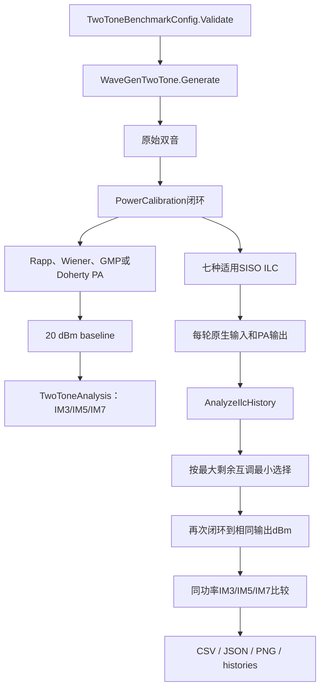
```mermaid
flowchart TD
    config["TwoToneBenchmarkConfig.Validate"] --> generator["WaveGenTwoTone.Generate"]
    generator --> raw["原始双音"]
    raw --> calibration["PowerCalibration闭环"]
    calibration --> pa["Rapp、Wiener、GMP或Doherty PA"]
    pa --> baseline["20 dBm baseline"]
    baseline --> analysis["TwoToneAnalysis：IM3/IM5/IM7"]
    calibration --> methods["七种适用SISO ILC"]
    methods --> histories["每轮原生输入和PA输出"]
    histories --> historyAnalysis["AnalyzeIlcHistory"]
    historyAnalysis --> selected["按最大剩余互调最小选择"]
    selected --> equalPower["再次闭环到相同输出dBm"]
    equalPower --> comparison["同功率IM3/IM5/IM7比较"]
    comparison --> files["CSV / JSON / PNG / histories"]
```

**图示说明：**

1. 第一次闭环只建立未线性化PA baseline工作点。
2. 每一种ILC都从同一参考双音开始，并拥有相同迭代次数。
3. `DpdIlc.py` 每轮只保存原生MSE、输入和PA输出。
4. `TwoToneAnalysis.AnalyzeIlcHistory` 在算法结束后计算每轮IM3、IM5和IM7。
5. 选择出的输入再次通过闭环输入驱动校准，使所有最终方法输出落在相同实际dBm。
6. PA输出从不乘常数伪造目标功率，因此互调对应真实压缩深度。

### 28.4 对比方法和预期

| 方法 | 主要能力 | 双音场景预期优势 | 可能缺点 |
|---|---|---|---|
| PA baseline | 无ILC | 给出原始互调参考 | 不抑制非线性 |
| Scalar P ILC | 样点比例误差更新 | 结构最简单 | 不显式处理记忆和频率选择性 |
| Complex-gain ILC | 正则化公共复增益逆 | 对统一增益和相位更稳定 | 仍是标量学习器 |
| FIR ILC | 截断频率逆响应 | 可处理线性记忆 | FIR长度过短会限制高阶抵消 |
| Frequency-domain ILC | 逐频率正则化更新 | 可形成外侧互调抵消谱 | 依赖投影带宽和低激励频响 |
| Directional Gauss-Newton ILC | 当前方向有限差分Jacobian | 能感知局部非线性斜率 | 每轮PA调用更多，方向是一维近似 |
| Parameter-domain MP ILC | 直接更新1/3/5/7阶MP系数 | 与双音奇数阶结构匹配 | 正则化不合适时高阶互调可反弹 |
| Augmented IQ ILC | 误差与共轭误差双路径 | 有IQ镜像时更有优势 | 标称无IQ失衡时额外自由度可能无收益 |

### 28.5 指标和改善量

每个阶次先取上下侧较差值。以IM3为例：

```math
\mathrm{IM3}_{\mathrm{worst}}
=\max\left(
\mathrm{IM3}_{\mathrm{L}},
\mathrm{IM3}_{\mathrm{U}}
\right).
```

方法相对baseline的改善定义为

```math
\Delta\mathrm{IM3}
=\mathrm{IM3}_{\mathrm{baseline}}
-\mathrm{IM3}_{\mathrm{method}}.
```

由于dBc越负越好，正的 $\Delta\mathrm{IM3}$ 表示改善。IM5和IM7使用相同定义。

不能只看IM3。ILC可能把主要自由度用于抵消最强IM3，同时通过PA高阶项产生新的IM7。因此表格和PNG始终同时展示三种阶次。

### 28.6 运行方式

默认双音基准：

```powershell
python tests/BenchMark.py --two-tone
```

完整显式配置：

```powershell
python tests/BenchMark.py --two-tone --sample-rate-hz 100000000 --tone-lower-hz -2000000 --tone-upper-hz 2000000 --tone-samples 32768 --tone-rms-level 0.5 --width 16 --output-power-dbm 20 --maximum-output-power-dbm 25 --iterations 10 --pa wiener --seed 211 --output-dir results/two_tone_ilc_benchmark
```

Python调用：

```python
from tests.BenchMark import (
    RunTwoToneIlcBenchmark,
    TwoToneBenchmarkConfig,
)

rows = RunTwoToneIlcBenchmark(
    TwoToneBenchmarkConfig(
        sampleRateHz=100.0e6,
        toneFrequenciesHz=(-2.0e6, 2.0e6),
        numSamples=32768,
        width=0,
        outputPowerDbm=20.0,
        numIterations=10,
    )
)
```

### 28.7 输出文件

| 文件 | 内容 |
|---|---|
| `all_ilc_two_tone_metrics.csv` | baseline和七种ILC的绝对IM值、改善量和输出功率 |
| `all_ilc_two_tone_metrics.json` | 相同结果加完整可复现元数据 |
| `all_ilc_two_tone_imd.png` | 所有方法IM3、IM5、IM7较差侧分组柱状图 |
| `histories/*.csv` | 每种方法逐轮NMSE、IM3、IM5、IM7和输出功率 |
| `histories/*.json` | 每种方法最佳轮、最佳指标和完整逐轮记录 |

### 28.8 快速仿真结果

以下结果使用浮点、4096点、20 dBm、Wiener PA和每种方法2轮。该配置用于快速验证结构，不代替默认10轮正式结果。

| 方法 | IM3/dBc | IM5/dBc | IM7/dBc | IM3改善/dB | IM5改善/dB | IM7改善/dB |
|---|---:|---:|---:|---:|---:|---:|
| PA baseline | -33.25 | -45.72 | -68.77 | 0.00 | 0.00 | 0.00 |
| Scalar P ILC | -34.10 | -46.54 | -68.00 | 0.85 | 0.82 | -0.77 |
| Complex-gain ILC | -34.56 | -46.98 | -67.61 | 1.31 | 1.26 | -1.16 |
| FIR ILC | -34.59 | -46.95 | -67.62 | 1.34 | 1.23 | -1.15 |
| Frequency-domain ILC | -34.56 | -46.98 | -67.60 | 1.32 | 1.26 | -1.17 |
| Directional Gauss-Newton ILC | -33.30 | -45.77 | -68.72 | 0.06 | 0.05 | -0.05 |
| Parameter-domain MP ILC | -34.82 | -47.35 | -66.09 | 1.57 | 1.63 | -2.67 |
| Augmented IQ ILC | -33.77 | -46.60 | -67.56 | 0.53 | 0.88 | -1.21 |

快速结果证明了必须分阶次比较：两轮内多数方法已经改善IM3和IM5，但IM7尚未同步改善。正式评估应使用默认10轮，并至少增加输出功率扫描或不同PA模型复测。

### 28.9 G类验收清单

- [ ] 两个基波、IM3、IM5和IM7都位于Nyquist内；
- [ ] baseline和所有方法最终输出功率误差位于闭环容限内；
- [ ] 每种方法使用相同双音、PA和迭代预算；
- [ ] 每轮历史来自真实PA输出，没有PA后常数缩放；
- [ ] IM3、IM5和IM7均同时报告上下侧和较差侧；
- [ ] 改善量为正时代表互调更负；
- [ ] CSV、JSON和PNG中的方法顺序一致；
- [ ] 若IM3改善而IM7恶化，报告保留该事实而不是隐藏。

---

## 29. H类：Rapp/Wiener/GMP/Doherty PA双音特性

### 29.1 分类目的

H类不运行ILC，专门回答PA本身的三个问题：

1. 小信号复增益在带内是否平坦；
2. IM3、侧带不对称和动态迟滞是否随双音间隔变化；
3. IM3、IM5、IM7与动态AM-AM/AM-PM迟滞如何随实际输出功率变化。

它与G类的区别是：G类固定一个PA并比较ILC方法，H类固定测试方法并比较Rapp、Wiener、GMP和Doherty四种PA。Rapp提供严格无记忆对照，用来验证频响、间隔依赖和动态迟滞测量是否能区分静态非线性与记忆。完整公式、参数、参考数值和四张结果图见[PA双音特性分析](./PaAnalyse.md)。

### 29.2 控制变量和对比

| 分支 | 共同条件 | 扫描变量 | 主要输出 | 对比意义 |
|---|---|---|---|---|
| 小信号频响 | RMS 0.05、2 MHz双音间隔 | 中心频率-40至40 MHz | 增益、展开相位、群时延、相位曲率 | 区分线性记忆与带内不平坦 |
| 非线性记忆 | 实测PA输出20 dBm | 双音间隔0.5至12 MHz | IM3/IM5/IM7、IM3上下侧差、动态迟滞 | 区分静态非线性与频率相关记忆 |
| 输出功率特性 | 固定4 MHz双音间隔 | 10、15、20、23、25 dBm | 逐功率互调与动态迟滞 | 观察小信号、压缩区和额定功率附近的变化 |

频响分支故意不做逐频点功率闭环，否则输入缩放会掩盖真实增益起伏。记忆和功率分支则在每个点重新闭环PA输入，使横向比较对应共同实测输出功率；PA输出不会被后级乘常数。

### 29.3 执行流程

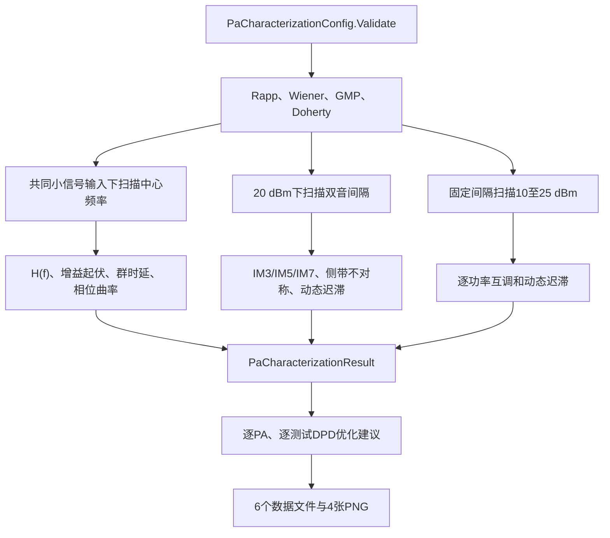
```mermaid
flowchart TD
    config["PaCharacterizationConfig.Validate"] --> models["Rapp、Wiener、GMP、Doherty"]
    models --> frequency["共同小信号输入下扫描中心频率"]
    models --> spacing["20 dBm下扫描双音间隔"]
    models --> power["固定间隔扫描10至25 dBm"]
    frequency --> response["H(f)、增益起伏、群时延、相位曲率"]
    spacing --> memory["IM3/IM5/IM7、侧带不对称、动态迟滞"]
    power --> compression["逐功率互调和动态迟滞"]
    response --> result["PaCharacterizationResult"]
    memory --> result
    compression --> result
    result --> advice["逐PA、逐测试DPD优化建议"]
    advice --> files["6个数据文件与4张PNG"]
```

**图示说明：**三个分支使用相同PA默认参数，但使用与问题匹配的控制变量。频率路径测线性记忆，间隔路径测非线性记忆，功率路径测工作点依赖性；测量完成后按实测阈值生成DPD结构、初始参数、训练和验收建议，结果写入结构化数据，再由`Draw.py`绘图。

### 29.4 运行方式

```powershell
python tests/BenchMark.py --pa-analyse
```

典型显式配置：

```powershell
python tests/BenchMark.py --pa-analyse --sample-rate-hz 200000000 --tone-samples 16384 --width 0 --output-power-dbm 20 --maximum-output-power-dbm 25 --load-resistance-ohm 50 --output-dir results/pa_characterization
```

`--pa-analyse`始终比较四种PA，`--pa`只用于Wi-Fi或G类双音ILC，不会缩小H类被测PA集合。

### 29.5 输出和预期

| 输出 | 预期用途 |
|---|---|
| `pa_frequency_response.csv/.png` | 对比增益与相位的频率选择性 |
| `pa_memory_effect.csv/.png` | 对比间隔敏感度、上下侧不对称和动态迟滞 |
| `pa_power_sweep.csv`、`pa_power_characteristics.png` | 对比10至25 dBm工作点变化 |
| `pa_nonlinearity_comparison.png` | 对比20 dBm标称IM3/IM5/IM7 |
| `pa_dpd_recommendations.csv` | 四种PA在五类测试后的20条DPD结构、参数、训练和验收建议 |
| `pa_characterization_summary.csv`、`pa_characterization.json` | 保存汇总、全部可复现原始点和建议 |

默认预期不是“某一种架构在所有指标上必然最好”，而是：

- Rapp频响、群时延、侧带不对称和动态迟滞接近0，但互调仍随输出功率进入压缩而恶化；
- Wiener与Doherty在Peaking关闭的小信号区频响接近；
- 普通GMP默认 `nonlinearScale=0.135`，三阶及以上只采用 full-reference 稳态系数的13.5%；主记忆和包络交叉项围绕单调静态曲线按阶零和构造，因此20 dBm下只呈现弱记忆：IM3间隔变化0.047 dB、最大侧带不对称0.022 dB、动态AM-AM/AM-PM分别为0.011 dB和0.034度；
- GMP在20.09 dBm的IM3/IM5/IM7为-50.16/-87.23/-129.55 dBc，25.10 dBm时IM3仍为-40.98 dBc；五个默认扫描点都没有越过-30 dBc强失真门限。`nonlinearScale=1.0` 只是显式 full-reference 压力场景；
- 接近25 dBm时，各模型进入不同压缩状态，互调和迟滞明显依赖输出功率；
- Doherty支路之间可能在个别功率点发生复数抵消，因此曲线不强制单调。

每项测试后的具体建议不只依据PA名称，还引用当前仿真的增益起伏、相位曲率、IM3间隔变化、动态迟滞、标称互调和失真拐点。用户修改PA系数或功率点后，应重新运行H类，不能照搬默认结果的阶数、记忆深度或功率锚点。

### 29.6 H类验收清单

- [ ] 四种PA使用相同采样率、双音定义、端口阻抗和额定功率；
- [ ] Rapp的增益波纹、群时延、相位曲率和动态AM-PM接近0，作为无记忆基线；
- [ ] 频响分支使用相同小信号输入，而不是逐频点同输出功率；
- [ ] 记忆分支各间隔点的实测输出功率误差不超过0.25 dB；
- [ ] 功率分支覆盖10、15、20、23、25 dBm并保存目标与实测值；
- [ ] IM3、IM5、IM7和动态AM-AM/AM-PM均随功率输出；
- [ ] 频响、记忆、标称互调和功率特性四张图均由同一份CSV/JSON数据生成；
- [ ] 每种PA都生成频响、间隔记忆、动态迟滞、标称非线性和输出功率五类DPD建议；
- [ ] 报告明确结果属于默认行为模型，不泛化为真实器件架构结论。

---

## 30. I类：PA分析驱动的DPD-GMP分阶段性能测试

### 30.1 分类目的

I类把H类得到的PA结论转换成可执行的GMP DPD改进，并要求每一种修改都具有：

1. 明确的PA特性依据；
2. 唯一的主要修改；
3. 与修改目标一致的验收指标；
4. 修改前后的数值；
5. 自动保存的 `expectationMet` 结果。

生产算法位于 `inc/lib/DpdGmp.py`；I类只在 `tests/BenchMark.py` 中构造波形、功率点和对比阶段。

### 30.2 默认配置

| 参数 | 默认值 |
|---|---:|
| Wi-Fi | EHT、20 MHz、80 MS/s、MCS 7、4个数据符号 |
| Wi-Fi训练seed | 321 |
| Wi-Fi独立验证seed | 987 |
| 双音 | -2 MHz、+2 MHz、8192点 |
| PA | GMP |
| 标称输出功率 | 12 dBm |
| 压力输出功率 | 15 dBm |
| 多功率标签 | 10、12、14 dBm |
| 每个标签ILC轮数 | 8 |
| 公开位宽 | 0 |

定点运行时，Wi-Fi/DPD/DAC输入为FS1，PA/Channel输出默认FS2；`Analysis` 和 `TwoToneAnalysis` 必须使用同一个 `outputFullScaleAmplitude=2.0`。近25 dBm的高PAPR输出若触及FS2，可把PA、Channel和两个分析器统一改为FS4。不能只扩大分析器或把输入DAC量程一并改掉，否则基准不再处于同一物理参考面。

### 30.3 阶段与控制变量

| 阶段 | 相对前一相关阶段的修改 | 主要验收指标 |
|---|---|---|
| PA baseline nominal/stress | 无DPD，分别闭环至12/15 dBm | EVM、ACLR、IM3/5/7参考 |
| Basic DPD-GMP nominal/stress | 1/3/5阶、主记忆3、交叉记忆1、12 dBm ILC标签 | 同功率EVM和IM3；15/12 dBm功率压力与回退收益 |
| Memory-expanded | 增加7阶，主记忆5，交叉记忆3 | 普通标签NMSE |
| Peak-weighted | 包络平方权重，岭系数1e-6 | 峰值加权标签NMSE |
| Regularized | 岭系数由1e-6增至1e-4 | 正则矩阵条件数 |
| Multi-power | 10/12/14 dBm片段权重1/2/1 | 最差功率标签NMSE；独立验证帧ACLR退化不超过0.10 dB |

`seed=321` 的训练帧只用于生成ILC标签和拟合系数；`validationSeed=987` 的独立帧不参与任何回归。所有Wi-Fi射频比较均在独立验证帧上重新闭环完整DPD加PA串联系统的输入，PA输出不做常数缩放。多功率片段分别建立GMP历史，只累加正规方程。

### 30.4 执行流程

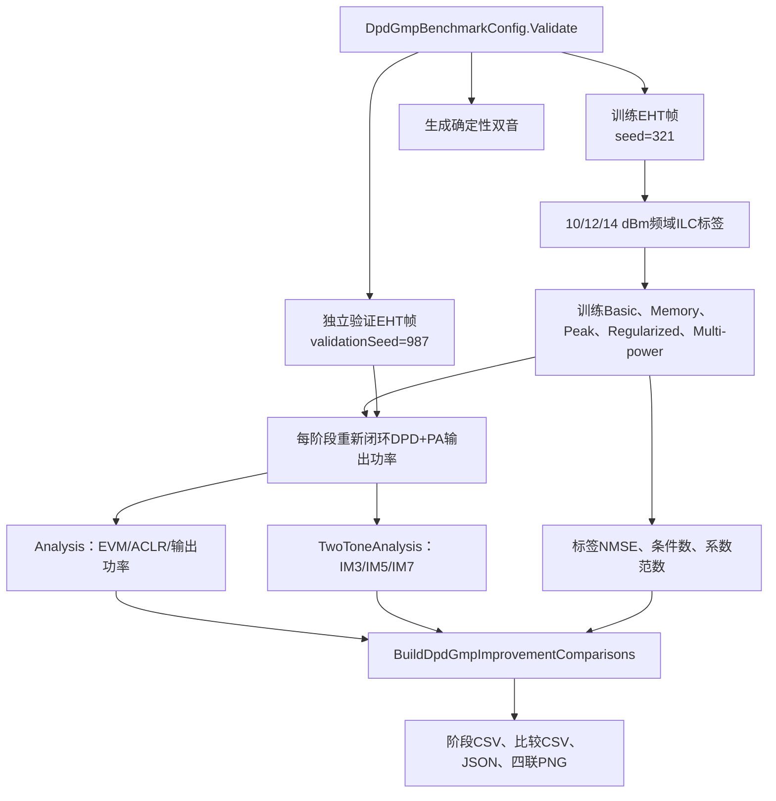
```mermaid
flowchart TD
    config["DpdGmpBenchmarkConfig.Validate"] --> trainingWifi["训练EHT帧<br/>seed=321"]
    config --> validationWifi["独立验证EHT帧<br/>validationSeed=987"]
    config --> tone["生成确定性双音"]
    trainingWifi --> labels["10/12/14 dBm频域ILC标签"]
    labels --> models["训练Basic、Memory、Peak、Regularized、Multi-power"]
    models --> calibrate["每阶段重新闭环DPD+PA输出功率"]
    validationWifi --> calibrate
    calibrate --> wifiMetrics["Analysis：EVM/ACLR/输出功率"]
    calibrate --> toneMetrics["TwoToneAnalysis：IM3/IM5/IM7"]
    models --> fitMetrics["标签NMSE、条件数、系数范数"]
    wifiMetrics --> compare["BuildDpdGmpImprovementComparisons"]
    toneMetrics --> compare
    fitMetrics --> compare
    compare --> files["阶段CSV、比较CSV、JSON、四联PNG"]
```

**图示说明：**ILC只在`seed=321`训练帧上生成监督标签，不在DpdGmp内部计算RF指标。`Analysis`在`validationSeed=987`独立帧上消费PA输出，`TwoToneAnalysis`使用独立双音激励；`Draw`只消费已计算阶段字典。

### 30.5 改进前后预期

| 改进 | 前值 | 后值 | 默认改善 | 预期 |
|---|---:|---:|---:|---|
| 基础DPD独立帧Wi-Fi EVM | -50.524 dB | -56.273 dB | 5.749 dB | EVM降低 |
| 基础DPD双音IM3 | -65.947 dBc | -71.152 dBc | 5.205 dB | IM3降低 |
| 15至12 dBm功率回退 EVM | -54.038 dB | -56.273 dB | 2.235 dB | EVM降低 |
| 扩展结构标签NMSE | -68.094 dB | -71.317 dB | 3.223 dB | NMSE降低 |
| 峰值加权标签NMSE | -72.992 dB | -73.868 dB | 0.876 dB | 峰值目标降低 |
| 增强正则条件数 | `5.435e7` | `5.481e5` | 19.964 dB | 条件数降低 |
| 多功率最差标签NMSE | -62.510 dB | -64.806 dB | 2.296 dB | 最差值降低 |
| 多功率独立帧最差ACLR | 33.062199 dB | 33.062091 dB | 退化0.000108 dB | 退化不超过0.10 dB |

扩展结构、峰值加权和正则化不要求即时EVM都下降，因为三者分别优化标签表达、峰值误差和数值稳定。当前扩展结构额外改善0.405 dB独立帧EVM，与H类测得的弱记忆一致。多功率训练把最差标签NMSE改善2.296 dB，但独立帧最差ACLR下降0.000108 dB，且12 dBm EVM相对单功率正则模型退化0.304 dB；因此它是可量化的折中，不应描述为全面改善。源Wi-Fi波形的ACLR本底约为33 dB，ACLR验收采用“相对单功率正则模型退化不超过0.10 dB”的护栏；本次结果通过只表示没有明显频谱退化，不表示ACLR得到提升。

### 30.6 运行和输出

```powershell
python tests/BenchMark.py --dpd-gmp
python tests/BenchMark.py --dpd-gmp --seed 321 --validation-seed 987
```

| 文件 | 内容 |
|---|---|
| `dpd_gmp_stage_metrics.csv` | 所有阶段的射频、标签、条件数和多功率指标 |
| `dpd_gmp_improvement_comparison.csv` | 每项改进的前后值、方向、改善量和通过状态 |
| `dpd_gmp_benchmark.json` | 完整配置和嵌套结果 |
| `dpd_gmp_performance.png` | EVM、IM3、标签NMSE和条件数四联图 |

`--pa-analyse` 默认在PA特性目录的 `dpd_gmp` 子目录自动运行相同I类测试。只需要PA原始特性而不需要嵌套DPD时，Python配置可设置 `runDpdGmpBenchmark=False`。

### 30.7 I类验收清单

- [ ] 三个ILC标签分别在10、12、14 dBm生成；
- [ ] `seed=321`训练帧与`validationSeed=987`验证帧彼此独立，验证帧不参与系数求解；
- [ ] baseline和每个DPD阶段均按完整plant重新闭环输出功率；
- [ ] Wi-Fi、双音和标签指标由相互独立的分析路径产生；
- [ ] 每项修改只用与其物理目标一致的主指标判定；
- [ ] 扩展结构改善普通标签NMSE；
- [ ] 峰值加权改善显式峰值加权NMSE；
- [ ] 增强岭正则降低条件数；
- [ ] 多功率训练改善最差功率标签NMSE，独立验证帧最差ACLR相对单功率正则模型退化不超过0.10 dB；
- [ ] `expectationMet` 全部为真，否则测试失败并保留实际结果；
- [ ] CSV、JSON、PNG和文档使用相同阶段顺序和数值。

完整原理和改进解释见 [DPD-GMP.md](./DPD-GMP.md) 与 [PaAnalyse.md第12节](./PaAnalyse.md#12-pa特性分析后的dpd-gmp改进与实测对比)。

## 31. J类：通道测量与耦合感知 DPD-GMP

### 31.1 分类目的

J类验证完整闭环：

1. 从探测波形恢复 PA 前和 PA 后 MIMO 冲激响应。
2. 计算平坦度、耦合增益/相位、群时延和条件数。
3. 根据测量结果修改 DPD-GMP 训练目标。
4. 根据 PA 前测量结果修改部署 DAC 波形。
5. 在同一耦合、PA、功率和 Wi-Fi 参考下比较修改前后性能。

### 31.2 场景构造

| 类别 | 设置 |
|---|---|
| Wi-Fi | 两路独立 EHT、20 MHz、80 MS/s、MCS 7 |
| PA | 链 1 为 GMP，链 2 为 Wiener |
| 输出工作点 | 每路 13 dBm |
| PA 前网络 | 双向非对称耦合、FIR、整数和分数时延 |
| PA 后网络 | 另一组双向非对称耦合、FIR和时延 |
| 测量 | 逐源通道单位冲激，64 抽头，2048 点 FFT |
| 接收噪声 | 关闭，保证控制变量 |
| DPD | 1/3/5/7 阶、主记忆 4、交叉记忆 3 |

### 31.3 阶段对比

| 阶段 | PA 后目标去嵌入 | PA 前 DAC 预消除 | 目的 |
|---|---:|---:|---|
| Coupled PA baseline | 否 | 否 | 耦合非线性基线 |
| Independent DPD-GMP | 否 | 否 | 旧的逐路 SISO 方案 |
| Post-deembedded DPD-GMP | 是 | 否 | 单独验证训练目标修改 |
| Coupling-aware DPD-GMP | 是 | 是 | 验证完整测量驱动方案 |

预期不是“所有中间阶段所有指标都单调”。自动断言比较 Independent 与完整 Coupling-aware：

- EVM 降低；
- 波形 NMSE 降低；
- 残余耦合降低；
- 最差 ACLR 相对 Independent 的退化不超过 1.0 dB。

前三项是耦合感知方案必须严格改善的核心目标；ACLR 是退化护栏，而不是强制改善项。原因是 Independent 阶段尚未消除的同带耦合会抬高主信道参考功率，即泄漏比 $P_{\mathrm{adj}}/P_{\mathrm{main}}$ 的分母，从而让 ACLR 数字显得更高。消除同带泄漏后，即使邻道绝对发射没有恶化，归一化 ACLR 也可能轻微下降。

### 31.4 执行流程

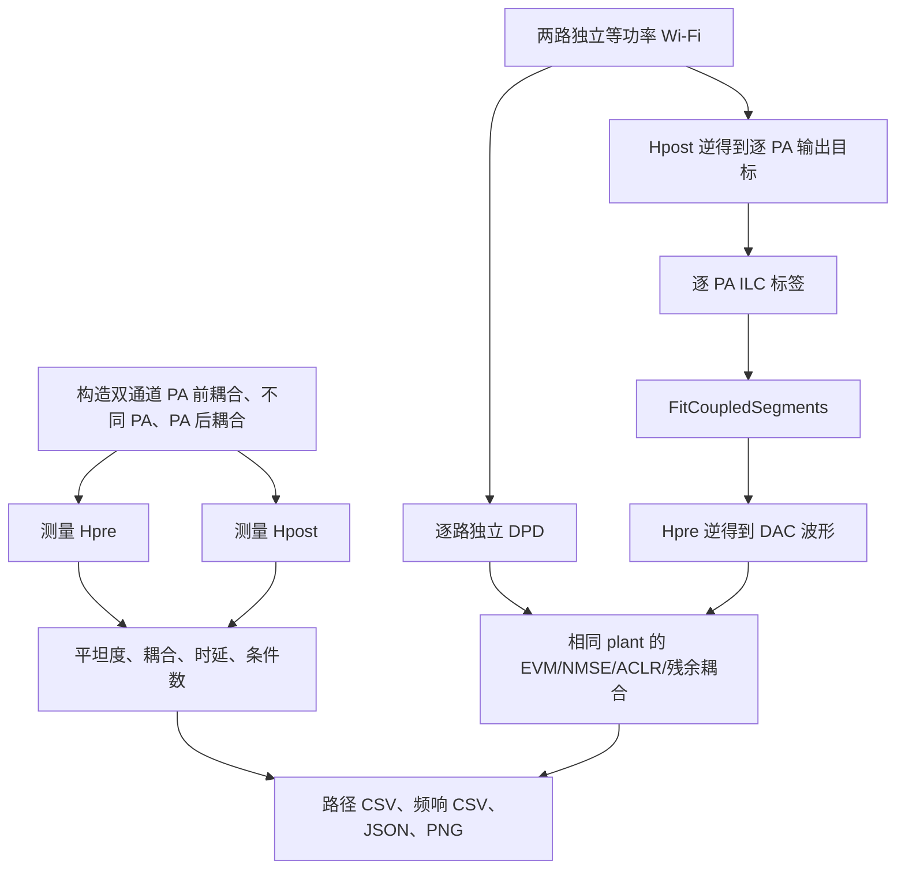
```mermaid
flowchart TD
    plant["构造双通道 PA 前耦合、不同 PA、PA 后耦合"] --> measurePre["测量 Hpre"]
    plant --> measurePost["测量 Hpost"]
    measurePre --> pathMetrics["平坦度、耦合、时延、条件数"]
    measurePost --> pathMetrics
    references["两路独立等功率 Wi-Fi"] --> independent["逐路独立 DPD"]
    references --> postInverse["Hpost 逆得到逐 PA 输出目标"]
    postInverse --> labels["逐 PA ILC 标签"]
    labels --> fit["FitCoupledSegments"]
    fit --> preInverse["Hpre 逆得到 DAC 波形"]
    independent --> compare["相同 plant 的 EVM/NMSE/ACLR/残余耦合"]
    preInverse --> compare
    pathMetrics --> files["路径 CSV、频响 CSV、JSON、PNG"]
    compare --> files
```

图示说明：测量函数不读取 `Channel` 内部路径配置；DPD 只消费实测冲激响应。测试文件只负责编排与保存。

### 31.5 默认结果

| 对比指标 | Independent | Coupling-aware | 改善 |
|---|---:|---:|---:|
| EVM | -5.678 dB | -15.939 dB | 改善 10.261 dB |
| 波形 NMSE | -8.144 dB | -14.460 dB | 改善 6.316 dB |
| 残余耦合 | -8.623 dB | -25.102 dB | 改善 16.479 dB |
| 最差 ACLR | 20.707 dB | 19.876 dB | 变化 -0.831 dB |

该强耦合高 PAPR 场景用于验证相对改进，不是产品 EVM 验收门限。前三项严格改善；ACLR 轻微退化 0.831 dB，但小于 1.0 dB 护栏。四项 `expectationMet` 因而均为真，不能把第四项 PASS 误写成 ACLR 改善。

### 31.6 运行和输出

```powershell
python tests/BenchMark.py --channel-analyse `
    --output-dir results/channel_analysis
```

| 文件 | 内容 |
|---|---|
| `channel_analysis.json` | 配置、测量、训练和性能 |
| `channel_path_measurements.csv` | 每条方向路径的标量测量 |
| `channel_frequency_response.csv` | 带内逐频点幅相 |
| `channel_dpd_comparison.csv` | 四个补偿阶段 |
| `channel_dpd_improvements.csv` | 修改前后、有符号变化、验收方向与 PASS/FAIL |
| `channel_analysis.png` | 通道与 DPD 四联图 |

### 31.7 J类验收清单

- [ ] PA 前和 PA 后测量各包含完整的 $N_{\mathrm{ch}}^2$ 路径；
- [ ] 耦合方向、中心增益、相位和平坦度可在 CSV 中审计；
- [ ] 群时延使用解缠相位斜率而不是只找最大抽头；
- [ ] 全带内最差条件数已保存；
- [ ] 标签使用 PA 后去嵌入目标；
- [ ] 部署波形使用 PA 前因果正则逆；
- [ ] Independent 与 Coupling-aware 使用同一物理 plant；
- [ ] EVM、NMSE、残余耦合严格改善，ACLR 退化不超过 1.0 dB；
- [ ] JSON、CSV、PNG 与 [ChannelAnalyse.md](./ChannelAnalyse.md) 数值一致。

## 32. K类：IQ 检测与增广 DPD-GMP 对比

### 32.1 分类目的

K 类回答三个独立问题：

1. `Analysis` 能否从已知发送/接收波形估计 IRR；
2. 普通 GMP 是否能补偿共轭 IQ 镜像；
3. 增广 GMP 的改善是否在多个相同 PA 输出功率点保持。

该场景随 `--channel-analyse` 一起运行，但与 J 类跨通道耦合结果分开保存。J 类研究 $\mathbf{H}_{d}$ 的非对角直接耦合，K 类研究 $\mathbf{H}_{i}$ 的共轭镜像，不能把两个 baseline 混合排名。

### 32.2 控制变量

| 项目 | 配置 |
|---|---|
| 波形 | EHT，20 MHz，80 MS/s，MCS 7 |
| PA | 近线性 Wiener，单抽头，饱和幅度 1000 |
| IQ 直接系数 | 1 |
| IQ 镜像系数 | $0.08e^{j0.40}$ |
| 输出功率 | 8、11.5、15、18.5、22 dBm |
| 普通/增广 GMP | 阶数 `(1, 3)`，记忆 2，交叉记忆 1 |
| 岭系数 | `1e-9` |
| 对比指标 | EVM、IRR、ACLR、实际输出功率 |

近线性 PA 是有意的控制变量：它使结果能明确归因于“模型有没有 $x^*$ 支路”，而不是由 PA 压缩强弱决定。

### 32.3 测试流程

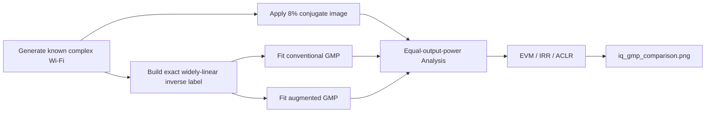
```mermaid
flowchart LR
    tx["Generate known complex Wi-Fi"] --> iq["Apply 8% conjugate image"]
    tx --> label["Build exact widely-linear inverse label"]
    label --> direct["Fit conventional GMP"]
    label --> augmented["Fit augmented GMP"]
    iq --> compare["Equal-output-power Analysis"]
    direct --> compare
    augmented --> compare
    compare --> metrics["EVM / IRR / ACLR"]
    metrics --> curve["iq_gmp_comparison.png"]
```

**图 18 说明：** 三种方法共用同一 Wi-Fi 帧、IQ plant、目标功率和指标函数。普通与增广 GMP 都拟合同一个精确逆标签，因此结果差异来自模型结构，而不是标签质量。

### 32.4 结果预期

- 未补偿 `irrDb` 应接近 $20\log_{10}(0.08)=-21.94$ dBc；
- 普通 GMP 没有独立共轭支路，IRR 不应有显著改善；
- 增广 GMP 应使 `irrDb` 明显下降并变得更负，同时降低由镜像主导的 EVM；
- 五个功率点的趋势应一致；
- 实际输出功率应接近目标，不能通过后级缩放伪造改善。

### 32.5 仿真结果

| 方法 | `irrDb` 范围 | EVM 范围 | 结论 |
|---|---:|---:|---|
| IQ-impaired PA | -21.938 dBc | -21.944 dB | 与理论镜像系数一致 |
| Conventional GMP | -21.938 至 -21.957 dBc | -21.943 至 -21.957 dB | 基本不能消除镜像 |
| Augmented GMP | -193.466 至 -196.802 dBc | -186.376 至 -189.155 dB | 达到无噪声双精度残差底 |

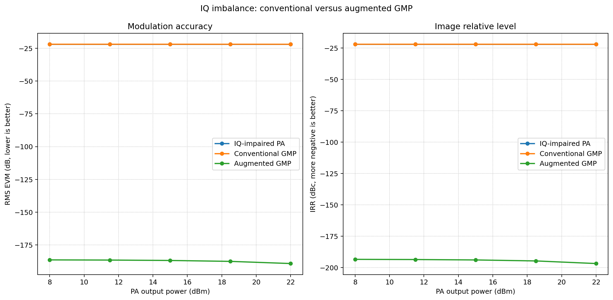

**图 19 说明：** 右图中普通 GMP 与 baseline 重合，而增广 GMP 使 `irrDb` 显著下降、变得更负；左图显示镜像被消除后 EVM 同时下降。极负数值来自理想、无噪声的结构验证，不代表仪器动态范围。

### 32.6 输出与验收

运行：

```powershell
python tests/BenchMark.py --channel-analyse
```

新增输出：

- `iq_gmp_comparison.csv`；
- `iq_gmp_comparison.png`；
- `channel_analysis.json` 的 `iqImbalanceStages`。

验收清单：

- [ ] 三种方法各有五个同功率点；
- [ ] `Analysis` 结果字典含 `irrDb`；
- [ ] baseline `irrDb` 与 -21.94 dBc 理论值一致；
- [ ] 增广 GMP 最接近0的 `irrDb` 仍比普通 GMP 最负的 `irrDb` 至少低 40 dB；
- [ ] 曲线、CSV 和 JSON 使用同一批计算结果；
- [ ] 文档明确区分理想数值残差与真实测量上限。

## 33. L类：DPD-LMS逐样点更新与漂移跟踪

### 33.1 分类目的

L类不是重复PA特性或Wi-Fi EVM场景，而是单独验证逐样点自适应内核的三个实现属性：

1. `updateDecimation=1`时，每个非零输入样点是否确实产生一次系数更新；
2. 逐样点NLMS能否恢复与批量DpdGmp完全相同的已知GMP标签；
3. 等效PA系数发生变化后，逐样点NLMS能否跟踪，而旧批量系数是否保持失配。

该分类使用精确可解的两项GMP标签，消除PA、同步、反馈噪声和功率校准的干扰。其作用是验证算法和程序时序，不代替PA级EVM、ACLR或IM3验收。

### 33.2 控制变量

| 项目 | 配置 |
|---|---|
| 样点数 | 8192 |
| 随机种子 | 907 |
| 参考RMS | 0.25 |
| GMP阶数 | `(1, 3)` |
| 主记忆 | 1 |
| 交叉记忆 | 0 |
| NLMS步长 | 0.10 |
| 特征尺度 | 帧冻结 |
| 系数提交 | 帧提交 |
| 更新抽取 | 1，每个非零样点更新 |
| 输出限幅 | 关闭 |
| 接口 | 浮点 |

静态标签为：

```math
d_0[n]
=
(1.03+j0.01)x[n]
+
(0.18-j0.04)x[n]|x[n]|^2.
```

漂移后标签为：

```math
d_1[n]
=
(0.97-j0.02)x[n]
+
(0.30+j0.06)x[n]|x[n]|^2.
```

两组标签只改变系数，不改变参考样点、长度、功率或基函数结构，所以漂移前后的误差可以直接比较。

### 33.3 对比方法

| 方法 | 训练方式 | 系数变化时刻 | 目的 |
|---|---|---|---|
| Batch DpdGmp | 统计完整帧后求解岭正规方程 | 整批结束一次 | 静态精度参考 |
| Sample NLMS | 按时间顺序逐点执行归一化梯度 | 影子系数每样点 | 验证逐点恢复 |
| Stale Batch | 保留静态标签训练出的旧系数 | 不更新 | 模拟PA漂移后失配 |
| Tracking NLMS | 从旧系数开始处理漂移标签 | 每个样点更新 | 验证连续跟踪能力 |

批量方法会构造特征列统计和正规矩阵；NLMS只保留一行特征、因果历史、特征尺度和两个系数向量。详细程序差异见 [DPD-LMS.md](./DPD-LMS.md#11-逐样点与批量处理的程序实现差异)。

### 33.4 测试流程

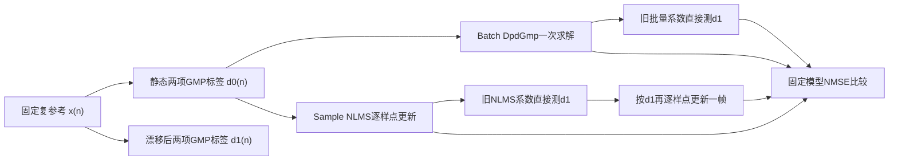
```mermaid
flowchart LR
    reference["固定复参考 x(n)"] --> stationary["静态两项GMP标签 d0(n)"]
    reference --> drift["漂移后两项GMP标签 d1(n)"]
    stationary --> batch["Batch DpdGmp一次求解"]
    stationary --> sample["Sample NLMS逐样点更新"]
    batch --> stale["旧批量系数直接测d1"]
    sample --> before["旧NLMS系数直接测d1"]
    before --> tracking["按d1再逐样点更新一帧"]
    batch --> compare["固定模型NMSE比较"]
    sample --> compare
    stale --> compare
    tracking --> compare
```

**图 20 说明：** Batch和Sample使用同一静态参考及标签。漂移时不重新生成输入，只修改已知线性和三阶系数。旧模型先直接测量漂移NMSE，之后只有NLMS按样点继续更新，因此改善不能归因于数据或结构变化。

### 33.5 结果预期

- 批量和NLMS在静态精确标签上都应达到很低NMSE；
- `updateCountPerFrame`应等于8192；
- 漂移前训练出的Batch和NLMS系数应在新标签上表现出相近失配；
- NLMS处理一帧漂移标签后，NMSE至少改善20 dB；
- CSV和JSON必须保存同一数值。

### 33.6 参考仿真结果

| 指标 | 结果 |
|---|---:|
| Batch静态NMSE | -228.320 dB |
| NLMS静态NMSE | -305.410 dB |
| 旧Batch漂移NMSE | -26.030 dB |
| NLMS跟踪前漂移NMSE | -26.030 dB |
| NLMS跟踪后漂移NMSE | -292.382 dB |
| 跟踪改善 | 266.352 dB |
| 每帧实际更新次数 | 8192 |

极低NMSE来自无噪声、模型结构完全匹配的双精度控制实验，不代表真实PA、反馈ADC或仪表动态范围。这个场景应读取“逐点更新次数正确”和“漂移后能够重新收敛”，不应把约-300 dB解释成产品性能。

### 33.7 运行和输出

```powershell
python tests/BenchMark.py --dpd-lms
```

输出文件：

| 文件 | 内容 |
|---|---|
| `results/dpd_lms_benchmark/dpd_lms_benchmark.csv` | 一行固定对比字段 |
| `results/dpd_lms_benchmark/dpd_lms_benchmark.json` | 配置和相同结果字典 |

### 33.8 L类验收清单

- [ ] 静态和漂移标签使用同一参考样点；
- [ ] Batch和NLMS使用相同 `(1,3)` 结构；
- [ ] `updateCountPerFrame`等于样点数；
- [ ] NLMS静态固定模型NMSE为有限值并明显优于恒等初值；
- [ ] 旧Batch和NLMS在漂移标签上的NMSE接近；
- [ ] NLMS跟踪改善超过20 dB；
- [ ] 结果明确标注为精确标签结构测试；
- [ ] CSV与JSON字段一致。
