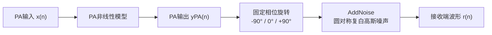
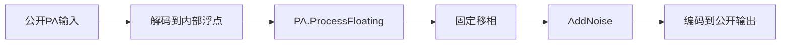
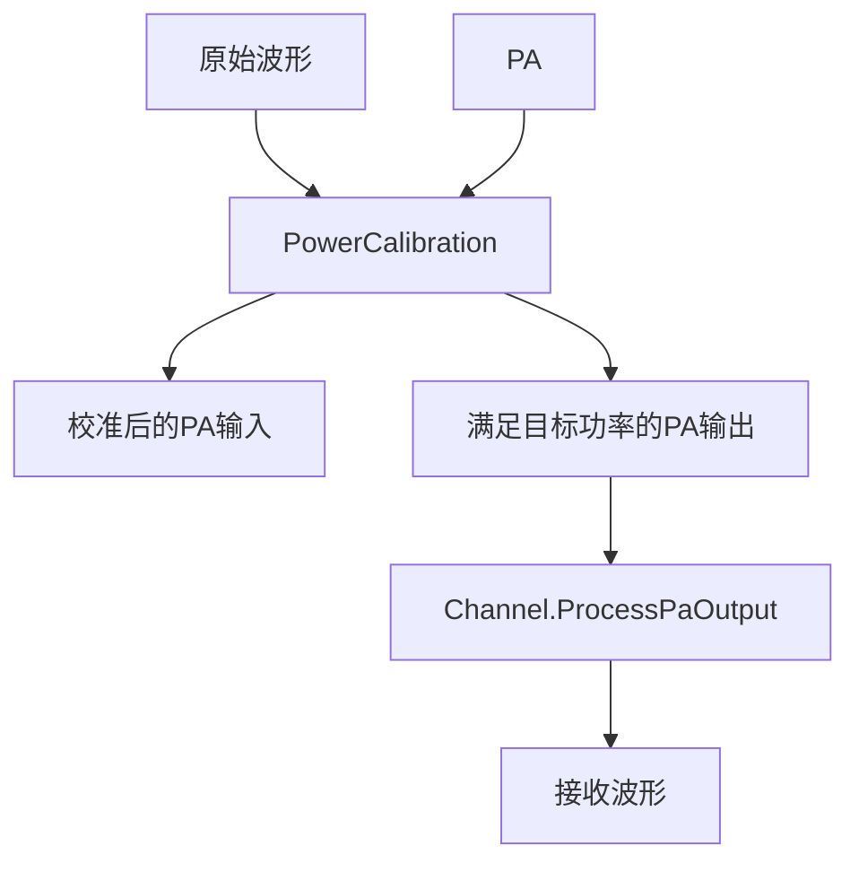

# Channel：PA到接收端链路模型

## 1. 模块边界

`inc/lib/Channel.py` 描述PA输出端到接收机输入端之间的简化链路。当前处理顺序固定为：



图示说明：

- `Channel.Process` 接收PA输入，依次执行PA、移相和加噪。
- `Channel.ProcessPaOutput` 接收已经产生的PA输出，只执行移相和加噪。
- PA输出功率闭环只观察PA输出，不把接收噪声误认为PA发射功率；因此 `PowerCalibration` 应绑定PA，校准完成后再把PA输出送入 `ProcessPaOutput`。
- ILC需要学习整条观测链路时，可把 `Channel` 作为被控对象传给ILC。此时每轮反馈包含相位和接收噪声。

## 2. 固定相位旋转

令PA复包络输出为：

```math
y_{\mathrm{PA}}(n)=I(n)+jQ(n)
```

固定相位旋转为：

```math
y_{\phi}(n)=y_{\mathrm{PA}}(n)\exp(j\phi)
```

当前只支持：

```math
\phi\in\{-90^\circ,0^\circ,+90^\circ\}
```

三个取值可以直接写成I/Q交换关系：

```math
\phi=0^\circ:\quad I_{\phi}=I,\qquad Q_{\phi}=Q
```

```math
\phi=+90^\circ:\quad I_{\phi}=-Q,\qquad Q_{\phi}=I
```

```math
\phi=-90^\circ:\quad I_{\phi}=Q,\qquad Q_{\phi}=-I
```

因为复指数的模为1，所以理想相位旋转不改变瞬时幅度和平均功率：

```math
\left|y_{\phi}(n)\right|
=
\left|y_{\mathrm{PA}}(n)\right|
```

```math
\mathbb{E}\left[\left|y_{\phi}(n)\right|^2\right]
=
\mathbb{E}\left[\left|y_{\mathrm{PA}}(n)\right|^2\right]
```

相位旋转可用来模拟线缆电长度、本振初相、固定移相器或接收通道的公共相位差。它是线性影响，不会自行产生互调或频谱再生。

## 3. 白噪声模型

### 3.1 圆对称复高斯噪声

接收端波形为：

```math
r(n)=y_{\phi}(n)+w(n)
```

白噪声写成：

```math
w(n)=w_{\mathrm{I}}(n)+jw_{\mathrm{Q}}(n)
```

若配置的复包络总RMS为 `noiseAmpMv`，则I、Q两部分相互独立，并分别满足：

```math
w_{\mathrm{I}}(n),w_{\mathrm{Q}}(n)
\sim
\mathcal{N}\left(0,\frac{\sigma_w^2}{2}\right)
```

这里：

```math
\sigma_w
=
\sqrt{\mathbb{E}\left[\left|w(n)\right|^2\right]}
```

因此，`noiseAmpMv=10` 的含义是复包络总RMS电压为10 mV；不是I路10 mV再加Q路10 mV。每个实分量的RMS为：

```math
\sigma_{\mathrm{I}}
=
\sigma_{\mathrm{Q}}
=
\frac{10}{\sqrt{2}}\ \mathrm{mV}
```

白噪声在时间上独立同分布，理想功率谱密度在离散复基带Nyquist区间内为常数。它会抬高噪声底、恶化SNR和EVM，但不会像PA奇数阶非线性那样形成确定的IM3、IM5或IM7谱线。

### 3.2 由毫伏控制

`noiseAmpMv=A` 时，物理RMS电压为：

```math
V_{\mathrm{noise,rms}}=A\times 10^{-3}\ \mathrm{V}
```

在负载阻抗为 $R$ 时，对应噪声功率为：

```math
P_{\mathrm{noise,W}}
=
\frac{V_{\mathrm{noise,rms}}^2}{R}
```

```math
P_{\mathrm{noise,dBm}}
=
10\log_{10}
\left(
\frac{P_{\mathrm{noise,W}}}{10^{-3}}
\right)
```

例如 $R=50\ \Omega$、复包络RMS为10 mV：

```math
P_{\mathrm{noise,W}}
=
\frac{(10\times10^{-3})^2}{50}
=
2\times10^{-6}\ \mathrm{W}
```

```math
P_{\mathrm{noise,dBm}}
\approx
-26.99\ \mathrm{dBm}
```

### 3.3 由dBm控制

`noisePwrDbm=P` 时先换算为RMS电压：

```math
V_{\mathrm{noise,rms}}
=
\sqrt{R\times10^{-3}}\;10^{P/20}
```

所以在50 Ω系统中，`noiseAmpMv=10` 与 `noisePwrDbm=-26.99` 表示相同的噪声强度。两个参数只能有一个不是 `None`：

- 两者都是 `None`：不加噪。
- 只有 `noiseAmpMv` 非 `None`：使用毫伏控制。
- 只有 `noisePwrDbm` 非 `None`：使用dBm控制。
- 两者都非 `None`：物理定义冲突，配置无效。

### 3.4 物理电压到归一化波形

工程规定PA归一化输出RMS等于1时，对应 `maximumOutputPowerDbm`。满量程物理RMS电压为：

```math
V_{\mathrm{FS,rms}}
=
\sqrt{R\times10^{-3}}\;
10^{P_{\mathrm{max,dBm}}/20}
```

加入内部浮点波形的归一化噪声RMS为：

```math
\sigma_{\mathrm{noise,norm}}
=
\frac{V_{\mathrm{noise,rms}}}
       {V_{\mathrm{FS,rms}}}
```

这种换算保证相同的10 mV在浮点接口和16位定点接口中表示同一个物理噪声，而不是把“10”错误地当成归一化幅度或整数码。

## 4. 相位、噪声与ILC

固定相位是确定性线性项。若链路无噪声并且ILC执行公共复增益对齐，则公共相位通常可以被同步步骤准确估计：

```math
\widehat{g}
=
\frac{\boldsymbol{x}^{H}\boldsymbol{y}}
       {\boldsymbol{x}^{H}\boldsymbol{x}}
```

噪声是随机项，不能由确定性预失真完全消除。即使PA非线性已被很好补偿，EVM也会受到噪声底限制。简化地写：

```math
\mathrm{EVM}_{\mathrm{floor}}^2
\approx
\frac{\sigma_w^2}
     {\mathbb{E}[|x(n)|^2]}
```

当 `Channel` 直接作为ILC被控对象时，每一轮会得到新的独立噪声样本。这更接近真实反馈接收机，但也会使逐轮MSE或EVM出现随机波动。固定 `randomSeed` 只保证整次仿真的噪声序列可复现，并不让每轮重复同一段噪声；调用 `ResetRandomGenerator` 才会从序列起点重新开始。

## 5. 参数表

构造接口：

```python
Channel(
    paModel=None,
    parameters=None,
    width=None,
    **parameterOverrides,
)
```

| 参数 | 默认值 | 单位 | 说明 |
|---|---:|---|---|
| `phaseDegrees` | `0` | degree | 仅允许 `-90`、`0`、`90` |
| `noiseAmpMv` | `None` | mV RMS | 复包络总RMS噪声幅度 |
| `noisePwrDbm` | `None` | dBm | 配置端口上的总噪声功率 |
| `loadResistanceOhm` | `50.0` | Ω | dBm与RMS电压换算阻抗 |
| `maximumOutputPowerDbm` | `25.0` | dBm | 归一化PA输出RMS等于1所代表的功率 |
| `randomSeed` | `1701` | 无 | 非负整数可复现；`None` 使用系统熵 |
| `width` | `16` | bit/I或Q | `0` 为浮点，正整数为公开定点码位宽 |

与其他主类相同，默认值都定义在构造函数内部，并通过 `ChainMap` 与调用方配置合并。未知参数会产生警告、被忽略，并且不会中止处理；已识别但数值非法的参数仍会抛出异常。

## 6. 典型使用方式

先根据已有信号选择入口：

| 用户已有数据或目标 | 推荐入口 | 是否再次运行PA |
|---|---|---|
| 已有PA输入，希望模拟完整链路 | `Channel.Process(paInputSignal)` | 是 |
| 已有PA输出或仪器PA采集 | `Channel.ProcessPaOutput(paOutputSignal)` | 否 |
| 只验证移相 | `ProcessPaOutput`，两个噪声参数均为 `None` | 否 |
| 按毫伏添加接收噪声 | `noiseAmpMv` 非 `None` | 取决于所选入口 |
| 按端口功率添加接收噪声 | `noisePwrDbm` 非 `None` | 取决于所选入口 |
| PA输出需要先达到目标dBm | `PowerCalibration` 绑定PA，随后调用 `ProcessPaOutput` | 校准阶段运行 |
| I/Q是定点整数码 | 所有模块使用相同正 `width` | 取决于所选入口 |
| MIMO samples×chains矩阵 | `Process` 绑定 `MimoPaModel` | 是 |

### 6.1 只验证固定移相

不绑定PA时仍可使用 `ProcessPaOutput`。下面把一段已知PA输出旋转90度，不添加噪声：

```python
import numpy as np

from inc.lib.Channel import Channel


paOutputSignal = np.array(
    [0.20 + 0.30j, -0.40 + 0.10j],
    dtype=np.complex128,
)
channel = Channel(
    parameters={
        "phaseDegrees": 90,
        "noiseAmpMv": None,
        "noisePwrDbm": None,
        "width": 0,
    }
)
receivedSignal = channel.ProcessPaOutput(paOutputSignal)

assert np.allclose(receivedSignal, 1j * paOutputSignal)
```

若 `phaseDegrees=-90`，结果为 `-1j * paOutputSignal`；若为0，则在无噪声条件下返回等值副本。

### 6.2 完整PA到接收端链路

```python
import numpy as np

from inc.lib.Channel import Channel
from inc.lib.PaModel import PaModel


paInputSignal = np.array(
    [0.05 + 0.02j, 0.20 - 0.10j, -0.35 + 0.25j],
    dtype=np.complex128,
)
paModel = PaModel(
    parameters={
        "modelName": "gmp",
        "width": 0,
    }
)
channel = Channel(
    paModel=paModel,
    parameters={
        "phaseDegrees": 90,
        "noiseAmpMv": 10.0,
        "noisePwrDbm": None,
        "loadResistanceOhm": 50.0,
        "maximumOutputPowerDbm": 25.0,
        "randomSeed": 1019,
        "width": 0,
    },
)

receivedSignal = channel.Process(paInputSignal)
```

`Process` 内部只跨越一次公开数据边界，实际顺序为：



图示说明：`width=0` 时解码和编码是等值复制；`width>0` 时公开I/Q为整数码，但PA、移相和噪声仍在内部归一化浮点域计算。

### 6.3 功率校准后处理已有PA输出

PA目标输出功率不应把接收噪声计算在内。正确做法是让 `PowerCalibration` 只绑定PA，取得收敛的PA输出后，再调用 `ProcessPaOutput`：

```python
from inc.lib.Channel import Channel
from inc.lib.PaModel import PaModel
from inc.lib.WaveGenWifi import WaveGenWifi
from inc.utils.SigProc import PowerCalibration


wifiWaveform = WaveGenWifi(
    parameters={
        "frameFormat": "EHT",
        "bandwidthMhz": 20,
        "mcs": 7,
        "numDataSymbols": 6,
        "sampleRateHz": 80.0e6,
        "width": 0,
    }
).Generate()
paModel = PaModel(
    parameters={"modelName": "wiener", "width": 0}
)
powerCalibration = PowerCalibration(
    paModel=paModel,
    parameters={
        "outputPowerDbm": 20.0,
        "maximumOutputPowerDbm": 25.0,
        "loadResistanceOhm": 50.0,
        "width": 0,
    },
)

# The returned signal is the calibrated PA input reference.
referenceSignal = powerCalibration.Calibrate(
    wifiWaveform.samples
)
paOutputSignal = powerCalibration.GetLastPaOutput()

channel = Channel(
    paModel=paModel,
    parameters={
        "phaseDegrees": 0,
        "noiseAmpMv": 10.0,
        "noisePwrDbm": None,
        "maximumOutputPowerDbm": 25.0,
        "loadResistanceOhm": 50.0,
        "randomSeed": 1019,
        "width": 0,
    },
)
receivedSignal = channel.ProcessPaOutput(paOutputSignal)

print(powerCalibration.GetLastCalibrationMetrics())
```

对应流程为：



图示说明：功率校准误差只由PA输出决定；相位和接收噪声不会改变隐藏的PA驱动预设。接收端分析则使用经过Channel后的实际波形。

### 6.4 毫伏和dBm两种噪声配置

在50 Ω端口上，10 mV复包络总RMS约等于 `-26.9897 dBm`。使用相同随机种子时，下面两个Channel会产生同一段噪声：

```python
import numpy as np

from inc.lib.Channel import Channel


zeroSignal = np.zeros(10000, dtype=np.complex128)
amplitudeChannel = Channel(
    parameters={
        "noiseAmpMv": 10.0,
        "noisePwrDbm": None,
        "loadResistanceOhm": 50.0,
        "maximumOutputPowerDbm": 25.0,
        "randomSeed": 73,
        "width": 0,
    }
)
powerChannel = Channel(
    parameters={
        "noiseAmpMv": None,
        "noisePwrDbm": -26.989700043360187,
        "loadResistanceOhm": 50.0,
        "maximumOutputPowerDbm": 25.0,
        "randomSeed": 73,
        "width": 0,
    }
)
noiseFromAmplitude = amplitudeChannel.ProcessPaOutput(
    zeroSignal
)
noiseFromPower = powerChannel.ProcessPaOutput(zeroSignal)

assert np.allclose(noiseFromAmplitude, noiseFromPower)
print(amplitudeChannel.ResolveNoiseRmsVolts())
print(amplitudeChannel.ResolveNoiseRmsNormalized())
```

`ResolveNoiseRmsVolts()` 返回0.01 V；`ResolveNoiseRmsNormalized()` 返回加入内部PA归一化波形的噪声RMS。实际使用时只选择 `noiseAmpMv` 或 `noisePwrDbm` 之一。

### 6.5 Channel输出直接送入Analysis

继续使用6.3节得到的 `referenceSignal`、`wifiWaveform` 和 `receivedSignal`：

```python
from inc.lib.Analysis import Analysis


resultAnalysis = Analysis(
    referenceSignal,
    wifiWaveform,
    parameters={
        "maximumOutputPowerDbm": 25.0,
        "loadResistanceOhm": 50.0,
        "width": 0,
    },
)
metrics = resultAnalysis.Analyze(receivedSignal)

print(metrics["outputPowerDbm"])
print(metrics["snrDb"])
print(metrics["evmDb"], metrics["evmPercent"])
print(metrics["aclrWorstDb"])
```

固定移相会由Analysis的公共复增益步骤补偿；随机噪声、PA非线性和记忆失真仍会进入SNR和EVM残差。`Analysis` 的独立使用方式见 [Analysis.md §11](./Analysis.md)。

### 6.6 16位定点接口

定点模式下，输入输出容器仍是 `numpy.complex128`，但每个I/Q分量都是整数码：

```python
import numpy as np

from inc.lib.Channel import Channel
from inc.lib.PaModel import PaModel
from inc.utils.FixedPoint import FixedPoint


fixedPoint = FixedPoint(16)
floatingInput = np.array(
    [0.10 + 0.20j, -0.25 + 0.15j],
    dtype=np.complex128,
)
fixedInput = fixedPoint.EncodeComplex(floatingInput)
paModel = PaModel(
    parameters={"modelName": "wiener", "width": 16}
)
channel = Channel(
    paModel=paModel,
    parameters={
        "phaseDegrees": -90,
        "noiseAmpMv": 10.0,
        "maximumOutputPowerDbm": 25.0,
        "randomSeed": 91,
        "width": 16,
    },
)
fixedOutput = channel.Process(fixedInput)

assert fixedOutput.dtype == np.complex128
assert np.array_equal(
    fixedOutput.real, np.rint(fixedOutput.real)
)
assert np.array_equal(
    fixedOutput.imag, np.rint(fixedOutput.imag)
)
```

10 mV不会被直接当成整数码10。Channel先把物理电压转换为内部归一化RMS，生成浮点噪声，最后统一编码为16位整数码。

### 6.7 运行时更新参数和复现噪声

调用方传入的 `parameters` 字典保持活动状态；修改已识别键后，下一次处理会读取新值。`UpdateParameters` 可写入最高优先级覆盖：

```python
import numpy as np

from inc.lib.Channel import Channel


channelParameters = {
    "phaseDegrees": 0,
    "noiseAmpMv": None,
    "noisePwrDbm": None,
    "randomSeed": 101,
    "width": 0,
}
channel = Channel(parameters=channelParameters)
paOutputSignal = np.ones(1024, dtype=np.complex128)

unchangedSignal = channel.ProcessPaOutput(paOutputSignal)

# A live caller mapping changes the next channel evaluation.
channelParameters["phaseDegrees"] = 90
rotatedSignal = channel.ProcessPaOutput(paOutputSignal)

# UpdateParameters creates a higher-priority local override.
channel.UpdateParameters(noiseAmpMv=5.0)
channel.ResetRandomGenerator()
firstNoisySignal = channel.ProcessPaOutput(paOutputSignal)
channel.ResetRandomGenerator()
repeatedNoisySignal = channel.ProcessPaOutput(paOutputSignal)

assert np.allclose(unchangedSignal, paOutputSignal)
assert np.allclose(rotatedSignal, 1j * paOutputSignal)
assert np.array_equal(
    firstNoisySignal, repeatedNoisySignal
)
```

固定种子保证整次仿真的噪声序列可复现，但连续两次 `Process` 默认会消耗不同的随机样值。只有调用 `ResetRandomGenerator()` 才会从同一种子起点重放。

### 6.8 MIMO矩阵

Channel保留 `samples × chains` 形状，并对每个元素加入独立白噪声。绑定 `MimoPaModel` 后可以处理完整多链矩阵：

```python
from inc.lib.Channel import Channel
from inc.lib.PaModel import MimoPaModel
from inc.lib.WaveGenWifi import WaveGenWifi


wifiWaveform = WaveGenWifi(
    parameters={
        "frameFormat": "EHT",
        "bandwidthMhz": 20,
        "mcs": 5,
        "numDataSymbols": 4,
        "sampleRateHz": 80.0e6,
        "numTransmitAntennas": 2,
        "numSpatialStreams": 2,
        "spatialMapping": "dft",
        "width": 0,
    }
).Generate()
mimoPaModel = MimoPaModel(
    parameters={
        "numTransmitChains": 2,
        "inputPowerDbPerChain": (0.0, -1.0),
        "outputPowerDbPerChain": (0.0, -0.5),
        "width": 0,
    }
)
channel = Channel(
    paModel=mimoPaModel,
    parameters={
        "phaseDegrees": 0,
        "noiseAmpMv": 10.0,
        "randomSeed": 401,
        "width": 0,
    },
)
receivedMatrix = channel.Process(
    0.15 * wifiWaveform.samples
)

assert receivedMatrix.shape == wifiWaveform.samples.shape
```

当前固定相位参数是所有链共用的标量；噪声样值在各链之间独立。如果需要每链独立相位、噪声功率或相关噪声矩阵，应在后续扩展中增加逐链参数，而不能把单个 `phaseDegrees` 误解为逐链序列。

## 7. `SmallestSISO.py`中的设置

最小SISO示例使用：

```python
channel = Channel(
    paModel=paModel,
    parameters={
        "phaseDegrees": 0,
        "noiseAmpMv": 10.0,
        "noisePwrDbm": None,
        "loadResistanceOhm": 50.0,
        "maximumOutputPowerDbm": 25.0,
        "randomSeed": 1019,
        "width": width,
    },
)
```

其执行边界为：

1. `PowerCalibration` 只绑定 `PaModel`，把PA输出校准到目标dBm。
2. baseline PA输出经过 `Channel.ProcessPaOutput` 后交给 `Analysis`。
3. `RunFrequencyDomainIlc` 把 `Channel` 当作完整反馈链路。
4. 最佳ILC输入重新做PA功率校准，再经过同一Channel得到最终接收波形。
5. 输出字典同时保留Channel参数与PA功率闭环结果，避免把接收噪声功率误解为PA发射功率。
