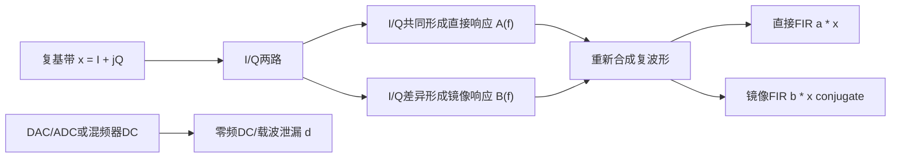
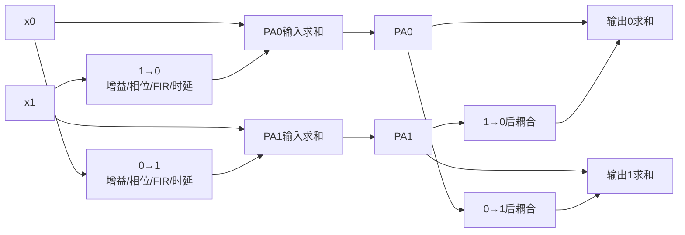
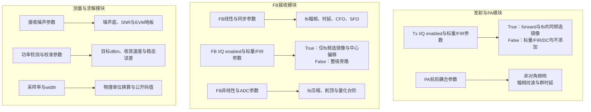
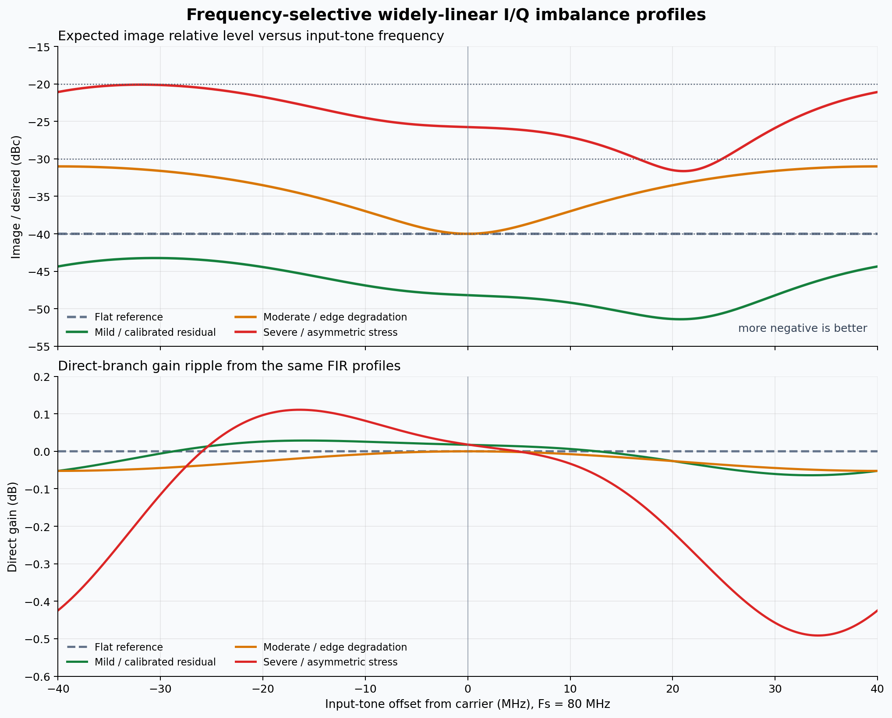
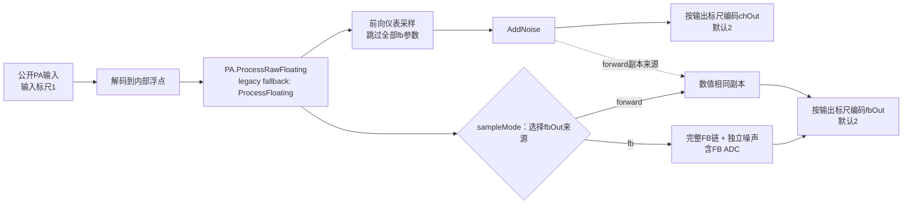
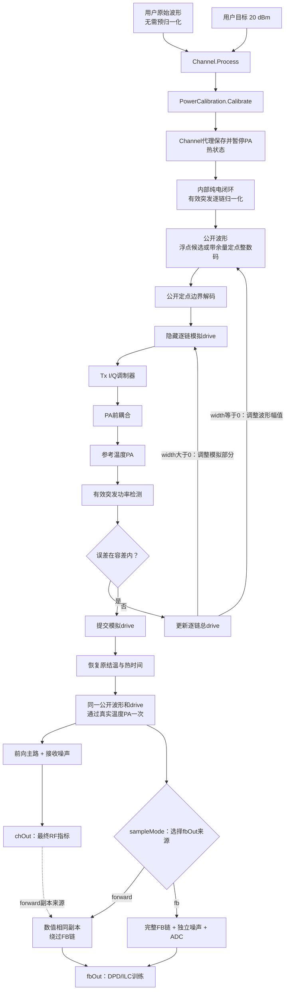
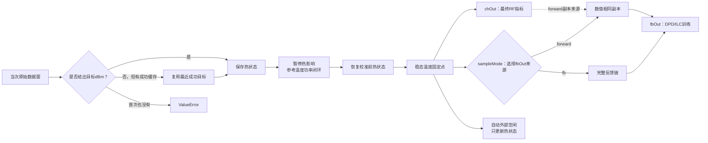

# Channel：PA到接收端链路模型

## 1. 模块边界

`inc/lib/Channel.py` 描述PA前多通道耦合、独立非线性PA、PA后耦合、外部仪表采样和板载反馈接收机。公开入口 `Channel.Process(...)` 固定返回二元组 `chOut, fbOut`：`chOut` 始终是前向主路测量；`sampleMode="forward"` 时 `fbOut` 是 `chOut` 的数值相同副本，`sampleMode="fb"` 时 `fbOut` 才是经过完整反馈接收链的DPD/ILC训练观测。两种模式都只运行一次PA、使用同一段记忆状态和同一个热周期，不能通过分别调用PA来伪造。

公开构造签名为
`Channel(paModel=None, parameters=None, width=None, outputFullScaleAmplitude=None, **parameterOverrides)`。固定点输入DAC标尺保持1.0；固定点 `chOut`/`fbOut` 的 `outputFullScaleAmplitude` 默认2.0，提供6.02 dB分量观测余量。两者位宽相同但幅度标尺可以不同。

`sampleMode` 不改变公开 `Process` 的二元组顺序，但会决定第二项怎样产生：默认 `"forward"` 复制第一项并完全绕过FB专用链；`"fb"` 才执行完整反馈接收机。`ProcessFloating`、`ApplyChannelEffects`、`ProcessPaOutput`、`SmallSignalGain` 等兼容单输出接口仍按它选择旧行为。需要反馈链训练的新代码应显式选择fb模式并解包两路：

```python
channel.UpdateParameters(sampleMode="fb")
chOut, fbOut = channel.Process(rawSignal, outputPowerDbm=20.0)
trainingSignal = fbOut
finalMetrics = resultAnalysis.Analyze(chOut)
```

精确理想的I/Q级、0度公共移相、单位FB线性响应、无FB三阶/限幅和0 dB模拟drive使用单位变换旁路；独立调用辅助函数时仍返回防御性副本，一次公开处理事务内部则允许复用已验证的临时数组，最终 `chOut`、`fbOut` 和用户输入始终内存独立。非理想配置、随机噪声、热状态和闭环校准仍在每次调用中真实执行。旁路条件、状态边界和参考耗时见 [Performance.md](./Performance.md#6-channel理想级旁路)。

为了处理长帧，`Process`、`ProcessFloating`、`ProcessPaOutput`、`ProcessOutputPathsFloating`、`ProcessNormalizedOutputPaths` 和 `CalibratePaInput` 在公开入口只完整校验一次实时ChainMap与输入波形。嵌套级不再对相同数组反复扫描有限值，但PA返回值和公开输出边界仍强制检查；任何异常都通过 `finally` 恢复事务状态。定点功率闭环还会在单次校准内复用drive无关的合法DAC预设及其量化活动RMS，热稳态求解则在一个周期内复用已验证热常数和未合并区间。所有复用都在本次事务结束时失效，下一次调用仍读取外部mapping的新值。具体等价性边界与基准见 [Performance.md](./Performance.md#61-单次channel校验事务)。

一个Channel实例含有随机数、PA记忆、热状态和校准事务，不支持并发调用，也不支持第三方PA回调重入同一实例的公开Channel方法。同一进程需要并行处理多条独立链路时，应为每个worker创建独立的Channel及PA实例；顺序调用同一实例仍按设计连续推进噪声与温度历史。

```mermaid
flowchart LR
    raw["用户原始波形"] --> active["有效突发检测<br/>逐链单位RMS归一化"]
    active --> publicWave["公开数字波形<br/>浮点幅值或定点整数码"]
    publicWave --> decode["公开边界解码<br/>定点码转内部浮点"]
    decode --> analogDrive["隐藏逐链模拟drive<br/>定点默认保留6 dB数字余量"]
    target["用户目标输出功率 dBm"] --> controller["dB域功率闭环控制器"]
    controller -. "浮点：调整公开波形幅值" .-> publicWave
    controller -. "定点：调整模拟drive" .-> analogDrive
    analogDrive --> txIqEnable{"txIqImbalanceEnabled"}
    txIqEnable -->|True| txIq["Tx I/Q调制器<br/>直接/镜像FIR与DC"]
    txIqEnable -->|False| txIqBypass["Tx标量/FIR/DC整级旁路"]
    txIq --> preCoupling["PA前耦合 Hpre(z)"]
    txIqBypass --> preCoupling
    preCoupling --> pa["每路独立PA电模型<br/>Rapp/Wiener/GMP/Doherty"]
    pa --> paOutput["参考温度PA输出"]
    paOutput --> detector["有效突发功率检测"]
    detector -. "误差超出容差时反馈" .-> controller
    detector --> restoreThermal["收敛后恢复热状态"]
    restoreThermal --> thermalPeriod["正式热周期<br/>稳态固定点或瞬态推进"]
    thermalPeriod --> livePaOutput["数据窗PA输出<br/>窗后自动空闲只更新温度"]
    livePaOutput --> postCoupling["PA后耦合 Hpost(z)"]
    postCoupling --> forwardPhase["主路公共固定相位"]
    forwardPhase --> instrument["前向仪表采样<br/>跳过fb专用非理想"]
    instrument --> forwardNoise["AddNoise"]
    forwardNoise --> receiver["chOut：最终RF指标"]
    postCoupling --> sampleMode{"sampleMode：选择fbOut来源"}
    sampleMode -->|forward| forwardCopy["数值相同副本<br/>完全绕过FB专用链"]
    sampleMode -->|fb| feedbackPhase["反馈路公共固定相位"]
    feedbackPhase --> fbAnalog["I/Q前反馈链<br/>频响/增益/非线性/时频偏"]
    receiver -. "forward副本来源" .-> forwardCopy
    fbAnalog --> compMode{"fbIqCompensationMode"}
    compMode -->|none| rawCapture["单位相位响应<br/>I/Q双FIR/DC + 噪声 + ADC"]
    compMode -->|phase_pair| pairCapture["r0/r1 两次I/Q采样<br/>各自噪声与ADC"]
    pairCapture --> separator["直接/镜像分离<br/>拟合并缓存逆FIR"]
    compMode -->|filter| singleCapture["r0 单次I/Q采样<br/>噪声 + ADC"]
    singleCapture --> inverse["应用当前缓存<br/>广义线性逆FIR"]
    forwardCopy --> receiverFb
    rawCapture --> receiverFb["fbOut：DPD/ILC同步与更新"]
    separator --> receiverFb
    inverse --> receiverFb
```



图示说明：

- `txIqImbalanceEnabled=True` 时，Tx直接/镜像FIR或其增益/相位回退系数以及 `txDcOffset` 位于PA之前，属于真实发射链路；无论选择forward还是fb，它们都会改变PA激励和空口输出。设为 `False` 时，标量、FIR和DC即使非理想也被整级旁路。
- `chOut` 用校准仪表直接观测PA主路输出。所有 `fb...` 参数都不会进入该分支，因此不会把板载反馈接收机失真混入最终EVM、SNR、ACLR、IRR和功率，但Tx I/Q不平衡仍然存在。
- `sampleMode="forward"` 时，`fbOut` 是已经加入前向噪声后的 `chOut` 数值副本；它不会重新产生噪声，也不会执行任何 `fb...` 模块。`sampleMode="fb"` 时，第二项才通过板载反馈接收链。`fbIqCompensationMode="none"` 保留历史单路原始采样；`"phase_pair"` 在I/Q变频器输入处依次应用两个实测相位响应并返回分离后的直接项，同时缓存逆FIR；`"filter"` 只采第一状态并应用当前缓存。三种模式都不会改变 `chOut`。
- `prePaCouplingPaths` 在Tx I/Q调制器之后、PA非线性之前，把其他通道的延迟复泄漏叠加到每个PA输入；`postPaCouplingPaths` 在非线性之后混合各PA输出。两者都与forward/fb选择无关。
- `Channel.Process(rawSignal, outputPowerDbm=...)` 是推荐入口。用户只提供任意初始幅度的原始波形和参考温度目标PA输出功率；Channel内部的 `PowerCalibration.Calibrate` 通过Channel热事务代理保存并暂停实际PA热状态，调整逐链总drive并反复观测参考温度的干净PA输出。正位宽模式不会用超量程数字码模拟更大驱动，而是在合法公开码解码后施加隐藏模拟drive。收敛后在 `finally` 中恢复原热状态，再用同一公开波形和已提交drive执行一次真实PA/热周期。随后始终生成 `chOut`，并按 `sampleMode` 复制它或产生完整 `fbOut`；因此校准试探不发热，而两项返回波形都对应同一次温漂历史。
- 启用热模型且使用默认 `thermalRunMode="steady_state"` 时，每次 `Channel.Process` 都重做参考温度功率校准。首次必须显式给出 `outputPowerDbm`；成功后的后续调用可省略，Channel会复用最近成功目标并仍执行校准。未启用热模型或显式选择 `"transient"` 时，`Channel.Process(rawSignal)` 才是无功率校准的单周期PA→采样路径。
- `Channel.ProcessPaOutput` 接收各PA已经产生但尚未经过输出耦合的矩阵，不再次运行PA，依次执行PA后耦合和 `sampleMode` 所选的兼容单输出采样路径。
- 功率闭环由Channel私有持有的 `PowerCalibration` 完成。Channel的 `SuspendThermalModel` 与 `RestoreThermalModel` 只把统一事务代理到实际绑定PA；普通用户不需要构造、配置或调用校准器，也不需要手工开关温度。
- 必须区分两种“校准”：PA功率设定闭环 `PowerCalibration` 仍观察PA后耦合前、所有接收非理想之前的干净物理PA输出，`outputPowerDbm` 绝不是原始 `fbOut` 的表观功率；DPD/ILC校准或训练则使用 `fbOut` 做同步、MSE和系数更新。最终RF验收只把同一轮的 `chOut` 交给 `Analysis`。
- `maximumOutputPowerDbm` 是内置PA的额定输出上限和归一化功率参考，不是任意可移动的显示标尺。内置plant应覆盖不超过该上限的目标；默认 `25 dBm` 上限下，`20 dBm` 必须是可达工作点。
- DPD/ILC把整个Channel作为plant时，内部适配器固定选择二元组第二项 `fbOut` 训练，并保留同一轮的 `chOut` 用于最终评价。需要板载反馈链时必须显式设置 `sampleMode="fb"`；`forward` 模式则明确表示用前向主路的相同副本训练。

### 1.1 `chOut`前向仪表采样

前向模式以高性能VSA作为相对可信的黄金参考。设公共相位为 $\phi_c$，仪表噪声为 $w(n)$：

```math
chOut(n)
=
y_{\mathrm{PA}}(n)\exp(j\phi_c)+w(n).
```

`fb...` 配置不会进入该公式。即使兼容参数 `sampleMode="fb"`，公开 `Process` 返回的第一个数组仍遵循这个主路方程。

### 1.2 `fbOut`训练观测

`sampleMode="forward"` 定义为：

```math
fbOut(n)=chOut(n).
```

这里是数值副本而不是再次计算前向链，因此两项逐样点完全一致，且所有FB增益、FIR、同步误差、I/Q、非线性、限幅和ADC参数均被绕过。

`sampleMode="fb"` 时，反馈模式的内部顺序为：

```text
PA output
  -> common phase
  -> feedback gain/phase and FIR
  -> third-order receiver distortion and envelope clipping
  -> fractional delay/SFO resampling and integer delay
  -> CFO phase ramp
  -> feedback I/Q compensation mode
       none: unity switch response -> I/Q and DC -> AWGN -> ADC
       phase_pair: r0/r1 -> two I/Q, AWGN and ADC captures -> separation
       filter: r0 -> one I/Q, AWGN and ADC capture -> cached inverse FIR
```

用组合算子表示：

```math
fbOut
=
Q_{\mathrm{ADC}}
\left\{
F_{\mathrm{IQ,DC}}
\left[
F_{\mathrm{time,freq}}
\left(
F_{\mathrm{NL}}
\left\{
H_{\mathrm{fb}}[y_{\mathrm{PA}}]
\right\}
\right)
\right]
+w
\right\}.
```

`fbIqCompensationMode="none"` 时上式按原始反馈链直接成立。`"phase_pair"` 和 `"filter"` 则在 $F_{\mathrm{IQ,DC}}$ 之前增加实测相位开关，并分别在ADC之后执行双状态分离或单状态逆滤波。开关位于反馈FIR、接收机前级非线性和时频偏之后，紧邻I/Q变频器输入；因此两个不等幅响应不会被送入前级非线性而改变其工作点。相位对的两次接收采样共享同一个已经求值的PA输出，但各自生成接收噪声并独立量化，PA记忆与热周期不会重复运行。

这条路径故意包含板载观察接收机的非理想。若在 `sampleMode="fb"` 下直接用未经校准的 `fbOut` 更新ILC，算法可能学习PA与反馈链路的组合逆响应；因此同一次 `Process` 返回的 `chOut` 必须作为独立评价路径。若只想验证理想前向闭环，则保留默认 `forward`，此时训练观测就是 `chOut` 的相同副本。

设同步和公共复增益补偿算子为 $S(\cdot)$，则第 $k$ 轮DPD/ILC训练误差使用：

```math
e_{k,\mathrm{train}}(n)
=
x(n)-S\left(fbOut_k(n)\right).
```

最终RF指标使用另一分支：

```math
\mathrm{Metrics}_{k}
=
A\left(chOut_k,x\right),
```

其中 $A$ 表示 `Analysis`。不能把 `fbOut` 的反馈接收机失真计入最终PA EVM，也不能用 `chOut` 绕过实际DPD训练反馈。

#### 0°/90°反馈I/Q补偿参考面

设 `ApplyFeedbackPreIqImpairments` 的输出为 $u[n]$，FB I/Q直接和镜像因果FIR分别为 $h_d[n]$、$h_i[n]$。相位开关在该节点之后、I/Q变频器之前；第 $k$ 个实测开关响应为标量 $r_k$。因为标量相移可与LTI卷积交换，ADC前的确定性部分为：

```math
z_k[n]-d
=
r_k\left(h_d*u\right)[n]
+
r_k^{*}\left(h_i*u^{*}\right)[n].
```

令 $s[n]=(h_d*u)[n]$、$q[n]=(h_i*u^{*})[n]$，0°和90°两路采样形成：

```math
\begin{bmatrix}
z_0[n]-d\\
z_1[n]-d
\end{bmatrix}
=
\begin{bmatrix}
r_0&r_0^{*}\\
r_1&r_1^{*}
\end{bmatrix}
\begin{bmatrix}
s[n]\\
q[n]
\end{bmatrix}.
```

只要 $r_0$、$r_1$ 的相对相位不是0°或180°，`FeedbackIqCalibration.SeparatePhasePair` 就能解出直接项与反馈接收机镜像项。这里分离的是FB变频器产生的频率选择性 $q[n]$；Tx I/Q失配、PA非线性和I/Q前反馈链已经包含在 $u[n]$ 中，不会被误删。直接项仍可能带有 $h_d$ 的幅相和群时延，后续DPD同步只能消除公共复增益，额外频响是否均衡应由训练参考面定义；相位对算法的目标不是伪造理想绝对增益。

`phase_pair` 每次从同一个已完成的PA输出生成两路接收记录，立即返回 $s[n]$，同时拟合从第一相位原始采样到 $s[n]$ 的直接/共轭FIR。`filter` 在后续波形上只生成第一状态记录，再应用该缓存FIR。完整岭回归推导、ABBA抗漂移采样以及独立工具类接口见 [SigProc §14](./SigProc.md#14-090反馈iq分离与单采样补偿)。

#### 1.2.1 I/Q正交调制背景与不平衡产生原理

##### 为什么射频链路需要I/Q两路

数字通信中的复基带信号不是一根物理意义上的“复数电线”，而是用两个实信号共同表示射频载波的幅度和相位：

```math
x(t)=I(t)+jQ(t).
```

$I(t)$ 是同相分量，$Q(t)$ 是正交分量。理想发射机用相差90度的两路本振把它们搬移到载频 $f_c$：

```math
s_{\mathrm{RF}}(t)
=
I(t)\cos(2\pi f_ct)
-
Q(t)\sin(2\pi f_ct).
```

等价地，

```math
s_{\mathrm{RF}}(t)
=
\mathrm{Re}
\left\{
x(t)\exp(j2\pi f_ct)
\right\}.
```

I/Q表示法使QAM、OFDM和任意幅相调制都能在复基带中统一处理。接收机执行相反过程：把射频信号分别与余弦和负正弦本振相乘并低通滤波，恢复 $I(t)$ 和 $Q(t)$。

理想链路需要同时满足：

1. I、Q两路增益完全相同；
2. 两路本振严格相差90度；
3. 两路滤波器和走线具有相同频率响应与群时延；
4. DAC、ADC、混频器和基带放大器没有直流偏置；
5. 参数不随频率、功率、温度和时间变化。

真实硬件不能完全满足这些条件，于是产生I/Q不平衡。

##### I/Q不平衡的主要物理来源

| 误差来源 | 物理原因示例 | 波形上的主要表现 |
|---|---|---|
| 增益不平衡 | I/Q DAC满量程不同、混频器转换增益不同、模拟基带放大器误差 | 星座在一个轴向被拉伸，并产生共轭镜像 |
| 正交相位误差 | 90度本振网络误差、PLL/分频器误差、PCB走线相位差 | 星座发生非正交剪切，并产生共轭镜像 |
| 频率选择性失配 | I/Q滤波器幅相响应不同、封装和走线群时延不同 | IRR随带宽位置变化，需要带记忆的校准模型 |
| 直流偏置 | DAC/ADC偏置、混频器自混频、接收机本振泄漏 | 复基带零频出现尖峰，射频上表现为载波泄漏 |
| 工作点漂移 | 温度、电源、器件老化、输出功率变化 | 校准系数和IRR随时间或工作条件变化 |

Tx和FB可能同时存在这些误差，但物理器件和参考面不同。Tx误差来自发射DAC、模拟基带、上变频混频器和Tx本振网络；FB误差来自耦合器之后的反馈接收机、下变频混频器、反馈ADC及其本振网络。

##### 从实数I/Q失配推导共轭镜像

本工程用一个平坦、无记忆模型描述每个I/Q模块。设I相对于Q的增益比误差为 $g$ dB，采用对称的半增益分配：

```math
G_I=10^{g/40},
\qquad
G_Q=10^{-g/40}.
```

因此两路增益比满足

```math
20\log_{10}\frac{G_I}{G_Q}=g.
```

设Q轴相对于理想正交方向存在相位误差 $\phi$。代码采用的实数支路模型是

```math
I'(t)=G_I I(t),
```

```math
Q'(t)
=
G_Q
\left[
\cos\phi\,Q(t)
+
\sin\phi\,I(t)
\right].
```

由

```math
I(t)=\frac{x(t)+x^*(t)}{2},
```

```math
Q(t)=\frac{x(t)-x^*(t)}{2j},
```

代入 $y(t)=I'(t)+jQ'(t)$，得到

```math
y(t)=\alpha x(t)+\beta x^*(t),
```

其中直接系数为

```math
\alpha
=
\frac{1}{2}
\left(
G_I+G_Q\cos\phi+jG_Q\sin\phi
\right),
```

共轭镜像系数为

```math
\beta
=
\frac{1}{2}
\left(
G_I-G_Q\cos\phi+jG_Q\sin\phi
\right).
```

当 $g=0$ 且 $\phi=0$ 时，$G_I=G_Q=1$、$\alpha=1$、$\beta=0$，输出只含理想直接分量。当任一误差非零时，$\beta$ 一般也非零，因此不能只用一个公共复增益消除该误差。

##### 为什么共轭项称为镜像

用单边复音调观察最直观。若

```math
x(t)=A\exp(j2\pi f_0t),
```

则

```math
x^*(t)=A^*\exp(-j2\pi f_0t).
```

直接项位于复基带 $+f_0$，共轭项位于 $-f_0$，两者关于零频互为镜像。上变频后，它们对应载频两侧的 $f_c+f_0$ 与 $f_c-f_0$。本工程保留 `irrDb` 字段名，但按镜像分量相对直接分量的负 dBc 输出：

```math
\mathit{irrDb}
=
10\log_{10}
\frac{|\beta|^2}{|\alpha|^2}.
```

增益误差主要形成镜像系数的实部，正交相位误差主要形成其虚部。小误差条件下，$\phi$ 使用弧度，有

```math
\beta
\approx
\frac{\ln 10}{40}g
+
j\frac{\phi}{2}.
```

这说明两类误差像两个正交误差分量一样合成。即使分别看起来不大，同时存在时也会让 `irrDb` 上升、变得不够负。

##### DC偏置为什么不属于镜像

加入复直流偏置后，模型为

```math
y(t)
=
\alpha x(t)
+
\beta x^*(t)
+
d.
```

$d$ 在复基带位于零频；Tx上变频后主要表现为载频 $f_c$ 附近的本振泄漏。$\beta x^*$ 则是随输入变化、相对于零频翻转的镜像。两者物理来源和频谱位置不同，所以IRR计算不能把DC功率当作镜像功率，校准时也需要独立的DC补偿项。

##### Channel怎样描述频率选择性I/Q不平衡

旧的增益和相位参数仍提供带内平坦的一抽头模型。实际I/Q滤波器、封装和走线的幅相或群时延不一致时，Channel用广义线性双FIR直接描述测得的完整响应：

```math
y[n]
=
\sum_{k=0}^{K_d-1}a_kx[n-k]
+
\sum_{k=0}^{K_i-1}b_kx^*[n-k]
+
d.
```

第一组FIR描述直接支路幅相和群时延，第二组FIR描述随频率变化的镜像支路。此时单个IRR仍可作为汇总指标，但模型选择和校准还应观察IRR随频率的曲线。

令旧增益/相位换算结果为 $\alpha$、$\beta$。对Tx或FB的每一支路，实际有效抽头按下面规则独立解析：

| 直接FIR配置 | 镜像FIR配置 | 有效 $a[k]$ | 有效 $b[k]$ |
|---|---|---|---|
| `None` | `None` | $(\alpha)$ | $(\beta)$ |
| 非空序列 | `None` | 配置的完整序列 | $(\beta)$ |
| `None` | 非空序列 | $(\alpha)$ | 配置的完整序列 |
| 非空序列 | 非空序列 | 配置的完整序列 | 配置的完整序列 |

非 `None` 序列替代而不是乘上对应标量。`txIqDirectFirTaps` / `txIqImageFirTaps` 控制Tx，`fbIqDirectFirTaps` / `fbIqImageFirTaps` 控制FB；每项接受 `None` 或非空的一维有限复数序列。`...IqCoefficients()` 始终只返回旧标量 $\alpha,\beta$，实际生效的防御性抽头副本应由 `TransmitterIqFilterTaps()` 或 `FeedbackIqFilterTaps()` 查询。硬开关为False时，无论保存了什么标量、FIR和DC，实际响应都固定为 $a=(1)$、$b=(0)$、$d=0$。

对应频率响应为：

```math
A(f)=\sum_k a_k\exp\left(-j2\pi fk/f_s\right),
\qquad
B(f)=\sum_k b_k\exp\left(-j2\pi fk/f_s\right).
```

```math
Y(f)=A(f)X(f)+B(f)X^*(-f)+d\,\delta(f).
```

对位于 $+f_0$ 的单边复音，期望输出位于 $+f_0$、系数为 $A(f_0)$；镜像位于 $-f_0$、系数为 $B(-f_0)$。因此本工程“越负越好”的逐频点定义为：

```math
\mathit{irrDb}(f_0)
=
20\log_{10}
\frac{|B(-f_0)|}{|A(f_0)|}.
```

实现逐链执行因果全卷积并截取到输入记录长度，调用开始前的历史按零处理；不同长度的直接和镜像FIR是合法的。所有MIMO链共用同一对配置抽头。`SmallSignalGain()` 与 `FeedbackDirectSmallSignalGain()` 是零频标量诊断，因此使用直接FIR的DC响应 $A(0)=\sum_k a_k$，不能把它解释成全带宽频响。



图示说明：增益和正交误差使原本独立的I/Q轴发生尺度差和混合，重新合成后必然同时出现 $x$ 与 $x^*$；两路硬件响应不同时，两个系数推广为独立FIR。DC项在卷积之后从另一条物理路径进入，不应与共轭镜像混为一类。

#### 1.2.2 Tx与FB I/Q不平衡不是同一个误差

Tx I/Q不平衡位于数字基带输出与PA输入之间。设理想发送波形为 $x(n)$，Tx调制器输出为：

```math
x_{\mathrm{tx}}(n)
=
\left(a_{\mathrm{tx}}*x\right)(n)
+
\left(b_{\mathrm{tx}}*x^*\right)(n)
+
d_{\mathrm{tx}}.
```

该信号继续经过PA前耦合和非线性PA：

```math
y_{\mathrm{PA}}(n)
=
F_{\mathrm{PA}}
\left\{
H_{\mathrm{pre}}
\left[
x_{\mathrm{tx}}(n)
\right]
\right\}.
```

因此Tx镜像会进入PA并与PA非线性级联，既能在forward仪表中看到，也能在fb接收机中看到。增广GMP或其他广义线性DPD可以在不饱和且模型充分时预先产生反向共轭项补偿它。

FB I/Q不平衡位于PA输出之后，只改变板载观察结果。设进入反馈IQ解调器的波形为 $r(n)$：

```math
z_{\mathrm{fb,IQ}}(n)
=
\left(a_{\mathrm{fb}}*r\right)(n)
+
\left(b_{\mathrm{fb}}*r^*\right)(n)
+
d_{\mathrm{fb}}.
```

如果DPD把 `fb` 镜像项造成的镜像当作空口失真去补偿，它会故意在真实PA输出中生成反向镜像；板载反馈读数可能改善，但forward仪表和真实空口IRR反而变差。所以FB I/Q应先校准或去嵌入，不能和Tx I/Q共用一个参数。

两处I/Q参数都用相同的物理换算。令I/Q增益比误差为 $g$ dB，正交误差为 $\phi$：

```math
G_I
=
10^{g/40},
```

```math
G_Q
=
10^{-g/40}.
```

直接项和镜像项为：

```math
\alpha
=
\frac{1}{2}
\left(
G_I
+
G_Q\cos\phi
+
jG_Q\sin\phi
\right),
```

```math
\beta
=
\frac{1}{2}
\left(
G_I
-
G_Q\cos\phi
+
jG_Q\sin\phi
\right).
```

忽略DC、噪声和其他镜像来源时，本工程的理论 `irrDb` 为：

```math
\mathit{irrDb}
=
10\log_{10}
\left(
\frac{|\beta|^2}{|\alpha|^2}
\right).
```

`Process(inputSignal)` 会先解码公开边界、复用已提交的逐链模拟drive，再执行Tx I/Q，并从同一次PA/热周期返回 `(chOut, fbOut)`；`ProcessPaOutput(paOutputSignal)` 接收的是已经产生的PA输出，因此不会再次执行drive或Tx I/Q，只会执行PA后耦合和 `sampleMode` 所选兼容单输出采样链。`GetLastPaInput()`为兼容旧接口保留名称，现在明确返回定点解码与模拟drive之前的公开数字波形；`GetLastTransmitterOutput()`返回模拟drive和Tx I/Q之后、PA前耦合之前的波形；`GetLastActualPaInput()`返回PA前耦合后真正进入PA的波形。

### 1.3 PA前与PA后多通道耦合

输入和输出矩阵都使用“样点数 × 物理通道数”。这里令 $x_i(n)$ 表示第 $i$ 路已经过公开边界解码、隐藏模拟drive和Tx I/Q的调制器输出，而不是用户传入的原始整数码。PA前耦合后第 $j$ 路实际激励为：

```math
u_j(n)
=
x_j(n)
+
\sum_{i\ne j}
\sum_{k=0}^{K_{\mathrm{pre}}-1}
h^{\mathrm{pre}}_{j,i}(k)x_i(n-k).
```

每一路再经过自己配置的Rapp、Wiener、GMP或Doherty PA：

```math
y_j(n)=F_j\{u_j(n)\}.
```

PA后耦合为：

```math
v_j(n)
=
y_j(n)
+
\sum_{i\ne j}
\sum_{k=0}^{K_{\mathrm{post}}-1}
h^{\mathrm{post}}_{j,i}(k)y_i(n-k).
```

代码始终保留每路单位直通项，用户配置的路径作为额外串扰相加。每条路径使用：

```math
h_{j,i}
=
10^{G_{j,i}/20}
\exp(j\phi_{j,i})
f_{j,i}.
```

$f_{j,i}$ 是可选复FIR；随后再施加独立整数和分数时延。路径方向明确规定为 `sourceChain` 指向 `destinationChain`，因此0到1和1到0可以使用不同增益、相位、FIR及时延。



**图示说明**：PA前耦合改变非线性工作点并产生跨通道包络相关失真；PA后耦合只混合已经生成的失真。当前模型描述线性耦合网络与独立非线性PA的级联。如果天线反射波会改变PA负载，使PA本身直接依赖其他通道输出，则还需要有源负载牵引模型，不能仅用PA后线性相加代替。

### 1.4 耦合条件下的联合功率校准

`outputPowerDbm=(P_0,P_1,...)` 仍表示PA后耦合之前每个物理PA自身的目标输出功率。只有PA前耦合时，调整一路输入会同时改变多个PA输出，Channel默认自动启用联合校准。

令隐藏驱动dB向量为 $\mathbf d$，实测PA功率向量为 $\mathbf p(\mathbf d)$。代码逐路增加 `calibrationProbeStepDb`，以有限差分估计：

```math
J_{m,n}
\approx
\frac{
p_m(\mathbf d+\Delta d\mathbf e_n)-p_m(\mathbf d)
}{
\Delta d
}.
```

联合更新为：

```math
\Delta\mathbf d
=
\left(
\mathbf J^T\mathbf J+\lambda\mathbf I
\right)^{-1}
\mathbf J^T
\left(
\mathbf p_{\mathrm{target}}-\mathbf p
\right).
```

`jointPowerCalibration=None` 表示自动模式：存在PA前耦合时启用Jacobian联合更新，否则沿用较快的逐链闭环。用户也可以显式设为 `True` 或 `False`。PA后耦合不进入功率检测，因此不会改变“每个PA自身输出dBm”的含义。

### 1.5 定点功率校准的数字与模拟参考面

浮点模式没有有限数字满量程，闭环可以把完整的候选drive直接乘到公开浮点波形。定点模式不同：公开接口中的复数容器仍为 `numpy.complex128`，但I和Q必须是位宽允许范围内的整数码。若闭环继续放大这些码，数字输入会先饱和成相同的码序列；再增加迭代次数也不会改变实际PA激励。

本节前半部分的 $Q_W$、$D_W$ 和 $A_{\mathrm{FS}}$ 描述**输入DAC**，其 `fullScaleAmplitude=1.0`。PA输出在进入功率检测或返回调用方时使用另一套相同位宽的scaled full-scale格式：默认 `outputFullScaleAmplitude=2.0`。输出标尺只扩大观测范围，不参与下面输入drive拆分。

Channel因此把正位宽校准分成两个物理阶段：

```mermaid
flowchart LR
    raw["任意幅度原始波形"] --> normalize["有效区逐链归一化"]
    normalize --> headroom["按calibrationDigitalHeadroomDb<br/>配置分量峰值余量"]
    headroom --> encode["公开定点编码 QW"]
    encode --> publicPlane["GetLastPaInput<br/>公开整数码参考面"]
    publicPlane --> decode["定点解码 DW"]
    decode --> drive["隐藏逐链模拟drive"]
    drive --> txIq["Tx I/Q"]
    txIq --> pre["PA前耦合"]
    pre --> physicalPlane["GetLastActualPaInput<br/>物理PA输入参考面"]
    physicalPlane --> pa["逐路PA"]
    pa --> detector["干净PA输出功率检测"]
    detector -. "更新总drive" .-> drive
```



图中 `GetLastPaInput()` 与 `GetLastActualPaInput()` 不表示同一个量：

- `GetLastPaInput()` 返回公开数字边界上的收敛波形。正位宽模式下，它是合法的整数I/Q码，位于定点解码和隐藏模拟drive之前。
- `GetLastTransmitterOutput()` 返回隐藏模拟drive和Tx I/Q模块之后、PA前耦合之前的内部浮点波形。
- `GetLastActualPaInput()` 返回模拟drive、Tx I/Q和PA前耦合都已施加后的内部浮点波形，是真正进入各物理PA的激励。它不受公开定点码范围的限制。

设第 $m$ 路原始有效区RMS为 $r_{x,m}$，归一化波形为：

```math
\widetilde{x}_m(n)=\frac{x_m(n)}{r_{x,m}}.
```

设正位宽为 $W$，公开定点接口允许的最大正归一化分量为 $A_{\mathrm{FS}}$，数字余量为 $H_{\mathrm{d}}$ dB。归一化波形的I/Q分量峰值为：

```math
c_m
=
\max_n
\left(
|\Re\{\widetilde{x}_m(n)\}|,
|\Im\{\widetilde{x}_m(n)\}|
\right).
```

公开数字缩放与整数码为：

```math
a_{\mathrm{d},m}
=
\frac{A_{\mathrm{FS}}10^{-H_{\mathrm{d}}/20}}{c_m},
\qquad
q_m(n)=Q_W\{a_{\mathrm{d},m}\widetilde{x}_m(n)\}.
```

默认 `calibrationDigitalHeadroomDb=6.0`，因此公开波形的最大I或Q分量约为满量程的：

```math
10^{-6/20}\approx 0.5012.
```

量化后重新测量解码波形 $D_W\{q_m\}$ 的有效区RMS，记为 $r_{q,m}$。若闭环当前需要的总drive为 $d_{\mathrm{total},m}$ dB，则隐藏模拟drive为：

```math
d_{\mathrm{analog},m}
=
d_{\mathrm{total},m}
-20\log_{10}(r_{q,m}).
```

进入Tx I/Q模块之前的内部波形为：

```math
x_{\mathrm{drive},m}(n)
=
10^{d_{\mathrm{analog},m}/20}
D_W\{q_m(n)\}.
```

这种分配把量化后的真实RMS也计入模拟drive，避免因为取整产生系统性功率偏差。数字余量仅决定公开码离满量程有多远；它不是PA输出回退，也不会降低用户请求的目标输出功率。余量增大可降低后续数字削顶风险，但会减少有效码字并提高量化噪声；默认6 dB是在峰值余量和定点精度之间的通用起点。

归一化PA输出有效区RMS为 $r_y$ 时，功率定义为：

```math
P_{\mathrm{out,dBm}}
=
P_{\mathrm{max,dBm}}
+20\log_{10}(r_y).
```

这里的 $P_{\mathrm{max,dBm}}$ 就是 `maximumOutputPowerDbm`。默认值 `25.0` 表示内置PA在额定归一化输出RMS等于1时为25 dBm，而20 dBm对应：

```math
r_y
=
10^{(20-25)/20}
\approx
0.5623.
```

所以 `20 dBm <= 25 dBm` 对默认GMP等内置drive-aware plant必须可达，不能因为公开定点码已经饱和而误报不可达。真正的不可达情况包括目标高于额定上限、第三方plant没有模拟drive接口且数字码已到满量程，以及用户自定义PA参数使响应不覆盖目标或出现无法求解的非单调区。

功率校准器会自动读取Channel的输出标尺并按 `FixedPoint(width, channel.outputFullScaleAmplitude)` 解码干净PA输出。默认GMP在20 dBm时的高PAPR分量峰值可超过1；若错误沿用输出标尺1.0，会先发生输出观测削顶，并把当前本征约 -32.15 dB的EVM误测成约 -23.72 dB。默认标尺2.0修复的是这个观测边界，不是通过减小GMP系数来掩盖失真；它在20 dBm无rail，是量化精度与峰值余量的默认折中。接近25 dBm且峰值可能超过2时，可按需把Channel与后续Analysis的输出标尺一起配置成4；当前边界复测实测25.088 dBm、EVM约 -22.09 dB且I/Q rail计数为0，标尺扩展不会改善该点的PA本征失真。

一次 `Channel.Process(rawSignal, outputPowerDbm=target)` 的完整顺序为：

1. 校验目标、位宽、数字余量、迭代参数和逐链维度；任何目标都不得高于 `maximumOutputPowerDbm`。
2. `PowerCalibration.Calibrate` 调用Channel的热事务代理，保存PA温度、热时间、互热offset和热metrics，并在全部校准试探期间暂停温度演化与温度电参数漂移。
3. 只用原始输入的有效突发样点计算逐链RMS，排除前后补零和超过容差的长静默区。
4. 把每路原始波形归一化到有效区单位RMS，并用目标相对额定上限的功率回退作为总drive初值。
5. 浮点模式直接把总drive乘入公开波形；定点模式生成带数字余量的合法整数码，并按量化后的真实RMS计算隐藏模拟drive。
6. 公开波形进入Channel后先解码，再经过逐链模拟drive、Tx I/Q不平衡和DC、PA前耦合，最后进入各路非线性PA。
7. 仅在每个PA自身输出、PA后耦合之前测量有效区功率；公共移相、forward/fb接收链和白噪声都不进入校准误差。
8. 未包围目标时使用有界dB比例更新，形成上下界后使用二分；存在PA前耦合且启用联合校准时使用有限差分Jacobian更新所有链。
9. 全部链进入 `calibrationToleranceDb` 后才原子提交逐链模拟drive，并缓存公开输入、干净PA输出和成功metrics。
10. `finally` 恢复校准前的完整热状态，再用已接受的公开输入与drive正式处理一次；这一次会推进温度并生成 `chOut`。`sampleMode="forward"` 直接复制该结果为 `fbOut`，`"fb"` 才从同一PA后节点执行带独立噪声的完整反馈链。若校准期间活动配置已经关闭温度，恢复不会复活旧启用快照。
11. 若闭环失败，不提交候选drive；异常与失败metrics保留目标、历史最佳测量、误差、轮数和原因，供用户定位真实不可达或第三方接口限制。

## 2. 固定相位旋转

令PA复包络输出为：

```math
y_{\mathrm{PA}}(n)=I(n)+jQ(n)
```

固定相位旋转为：

```math
y_{\phi}(n)=y_{\mathrm{PA}}(n)\exp(j\phi)
```

当前只支持：

```math
\phi\in\{-90^\circ,0^\circ,+90^\circ\}
```

三个取值可以直接写成I/Q交换关系：

```math
\phi=0^\circ:\quad I_{\phi}=I,\qquad Q_{\phi}=Q
```

```math
\phi=+90^\circ:\quad I_{\phi}=-Q,\qquad Q_{\phi}=I
```

```math
\phi=-90^\circ:\quad I_{\phi}=Q,\qquad Q_{\phi}=-I
```

因为复指数的模为1，所以理想相位旋转不改变瞬时幅度和平均功率：

```math
\left|y_{\phi}(n)\right|
=
\left|y_{\mathrm{PA}}(n)\right|
```

```math
\mathbb{E}\left[\left|y_{\phi}(n)\right|^2\right]
=
\mathbb{E}\left[\left|y_{\mathrm{PA}}(n)\right|^2\right]
```

相位旋转可用来模拟线缆电长度、本振初相、固定移相器或接收通道的公共相位差。它是线性影响，不会自行产生互调或频谱再生。

## 3. 白噪声模型

### 3.1 圆对称复高斯噪声

接收端波形为：

```math
r(n)=y_{\phi}(n)+w(n)
```

白噪声写成：

```math
w(n)=w_{\mathrm{I}}(n)+jw_{\mathrm{Q}}(n)
```

若配置的复包络总RMS为 `noiseAmpMv`，则I、Q两部分相互独立，并分别满足：

```math
w_{\mathrm{I}}(n),w_{\mathrm{Q}}(n)
\sim
\mathcal{N}\left(0,\frac{\sigma_w^2}{2}\right)
```

这里：

```math
\sigma_w
=
\sqrt{\mathbb{E}\left[\left|w(n)\right|^2\right]}
```

因此，`noiseAmpMv=10` 的含义是复包络总RMS电压为10 mV；不是I路10 mV再加Q路10 mV。每个实分量的RMS为：

```math
\sigma_{\mathrm{I}}
=
\sigma_{\mathrm{Q}}
=
\frac{10}{\sqrt{2}}\ \mathrm{mV}
```

白噪声在时间上独立同分布，理想功率谱密度在离散复基带Nyquist区间内为常数。它会抬高噪声底、恶化SNR和EVM，但不会像PA奇数阶非线性那样形成确定的IM3、IM5或IM7谱线。

### 3.2 由毫伏控制

`noiseAmpMv=A` 时，物理RMS电压为：

```math
V_{\mathrm{noise,rms}}=A\times 10^{-3}\ \mathrm{V}
```

在负载阻抗为 $R$ 时，对应噪声功率为：

```math
P_{\mathrm{noise,W}}
=
\frac{V_{\mathrm{noise,rms}}^2}{R}
```

```math
P_{\mathrm{noise,dBm}}
=
10\log_{10}
\left(
\frac{P_{\mathrm{noise,W}}}{10^{-3}}
\right)
```

例如 $R=50\ \Omega$、复包络RMS为10 mV：

```math
P_{\mathrm{noise,W}}
=
\frac{(10\times10^{-3})^2}{50}
=
2\times10^{-6}\ \mathrm{W}
```

```math
P_{\mathrm{noise,dBm}}
\approx
-26.99\ \mathrm{dBm}
```

### 3.3 由dBm控制

`noisePwrDbm=P` 时先换算为RMS电压：

```math
V_{\mathrm{noise,rms}}
=
\sqrt{R\times10^{-3}}\;10^{P/20}
```

所以在50 Ω系统中，`noiseAmpMv=10` 与 `noisePwrDbm=-26.99` 表示相同的噪声强度。`noiseAmpMv`、`noisePwrDbm` 和 `noiseSnrDb` 三个参数互斥：

- 三者都是 `None`：不加噪。
- 只有 `noiseAmpMv` 非 `None`：使用毫伏控制。
- 只有 `noisePwrDbm` 非 `None`：使用dBm控制。
- 只有 `noiseSnrDb` 非 `None`：使用有效突发信号与噪声的功率比控制。
- 任意两个或三个同时非 `None`：物理定义冲突，配置无效。

### 3.4 由SNR控制

`noiseSnrDb=S` 表示每一路有效突发信号功率与所加复白噪声功率之比为：

```math
S
=
10\log_{10}
\left(
\frac{P_{\mathrm{signal}}}
     {P_{\mathrm{noise}}}
\right).
```

因为复包络功率与RMS幅度平方成正比，所以每路噪声总RMS为：

```math
\sigma_{w,m}
=
x_{\mathrm{rms},m}
10^{-S/20},
```

其中 $x_{\mathrm{rms},m}$ 是第 $m$ 路移相后信号的有效区RMS。Channel复用PA功率校准的有效突发检测规则：

```math
x_{\mathrm{rms},m}
=
\sqrt{
\frac{
\sum_n M_m(n)\left|x_m(n)\right|^2
}{
\sum_n M_m(n)
}
}.
```

$M_m(n)$ 是该路有效样点掩码。它排除前后补零和长占空比关断区，只填充长度不超过 `activeGapToleranceSamples` 的短低幅空洞。因此，带有补零的30 dB配置仍表示开启期间约30 dB SNR，不会因为记录中有大量零而错误降低噪声。

SISO只有一个噪声RMS；MIMO对每一列独立计算 $x_{\mathrm{rms},m}$，因此幅度较小的链会得到相应较小的噪声RMS，但每路目标SNR相同。`noiseSnrDb` 允许任意有限dB值，包括负SNR。

### 3.5 物理电压到归一化波形

工程把PA归一化输出RMS等于1定义为额定输出上限 `maximumOutputPowerDbm`。对应的额定物理RMS电压为：

```math
V_{\mathrm{FS,rms}}
=
\sqrt{R\times10^{-3}}\;
10^{P_{\mathrm{max,dBm}}/20}
```

加入内部浮点波形的归一化噪声RMS为：

```math
\sigma_{\mathrm{noise,norm}}
=
\frac{V_{\mathrm{noise,rms}}}
       {V_{\mathrm{FS,rms}}}
```

这种换算保证相同的10 mV在浮点接口和16位定点接口中表示同一个物理噪声，而不是把“10”错误地当成归一化幅度或整数码。

## 4. 反馈链路非理想及其对ILC的影响

### 4.1 增益、相位和频率响应

反馈FIR及耦合增益为：

```math
v_m(n)
=
10^{G_{\mathrm{fb}}/20}
\exp(j\phi_{\mathrm{fb}})
\sum_{k=0}^{K-1}h_k y_m(n-k).
```

`fbFirTaps=None` 等价于 $h_0=1$。FIR按每一路独立卷积并保留原记录长度。若DPD不去嵌反馈频响，收敛条件可能变成 $H_{\mathrm{fb}}Y\approx X$，真实主路输出则错误地趋向 $Y\approx X/H_{\mathrm{fb}}$。

### 4.2 反馈接收机非线性和限幅

三阶反馈非线性为：

```math
v_{\mathrm{nl}}(n)
=
v(n)+c_3|v(n)|^2v(n).
```

`fbThirdOrderCoefficient` 是可为复数的 $c_3$，其实部主要改变AM-AM，虚部同时产生AM-PM。`fbClipAmplitude=A` 时再进行复包络径向限幅。若幅度没有超过门限：

```math
v_{\mathrm{clip}}(n)=v_{\mathrm{nl}}(n),
\qquad
|v_{\mathrm{nl}}(n)|\leq A.
```

若幅度超过门限，则只压缩幅度并保留相位：

```math
v_{\mathrm{clip}}(n)
=
A\frac{v_{\mathrm{nl}}(n)}
       {|v_{\mathrm{nl}}(n)|},
\qquad
|v_{\mathrm{nl}}(n)|>A.
```

反馈接收机压缩会让ILC补偿“PA+观察接收机”的组合非线性，因此最终必须使用forward仪表采样独立验证。

### 4.3 时延、CFO和SFO

分数时延与采样频偏使用保持长度的插值模型。正的 `fbFractionalDelaySamples=d` 取源位置 $n-d$；采样偏差为 $\epsilon_{\mathrm{sfo}}=\mathrm{ppm}\times10^{-6}$：

```math
v_{\mathrm{sfo}}(n)
=
v_{\mathrm{clip}}
\left(
n(1+\epsilon_{\mathrm{sfo}})-d
\right).
```

随后加入非负整数时延 $D$，并施加载波偏移：

```math
v_{\mathrm{cfo}}(n)
=
v_{\mathrm{sfo}}(n-D)
\exp
\left(
j2\pi\frac{\Delta f}{f_s}n
\right).
```

超出原采样记录的插值位置补零。`sampleRateHz` 决定CFO相位斜率的物理尺度。

### 4.4 Tx与FB频率选择性I/Q不平衡及直流偏置

I/Q正交调制的硬件背景、实数两支路到共轭镜像的完整推导，以及平坦模型与广义线性FIR模型的边界见 [1.2.1节](#121-iq正交调制背景与不平衡产生原理)。本节只说明这些物理量在代码各模块中的执行位置。

#### 4.4.1 两个模块共用的标量回退与双FIR执行

令I/Q增益不平衡为 $\Delta G$ dB、正交相位误差为 $\theta$：

```math
g_I=10^{\Delta G/40},
\qquad
g_Q=10^{-\Delta G/40}.
```

实现的实分量模型为：

```math
I'(n)=g_I I(n),
```

```math
Q'(n)
=
g_Q
\left[
\cos(\theta)Q(n)+\sin(\theta)I(n)
\right].
```

两组显式FIR都为 `None` 时，等价的广义线性形式为：

```math
v_{\mathrm{iq}}(n)
=
\alpha v(n)+\beta v^*(n)+d.
```

其中 $\alpha$ 是直接分量系数，$\beta$ 是镜像分量系数。代码中的 `ResolveIqImbalanceCoefficients` 只负责旧标量换算；`TransmitterIqCoefficients()` 与 `FeedbackIqCoefficients()` 也只查询这一对标量，不代表显式FIR启用后的实际响应。

实际处理先分别解析有效直接FIR $a[k]$ 和镜像FIR $b[k]$。某项显式配置时，该非空有限复数序列就是对应支路的完整响应；为 `None` 时才回退到 $(\alpha)$ 或 $(\beta)$。两支路可以独立选择，最后执行：

```math
v_{\mathrm{iq}}(n)
=
\sum_{k=0}^{K_d-1}a_kv(n-k)
+
\sum_{k=0}^{K_i-1}b_kv^*(n-k)
+d.
```

`TransmitterIqFilterTaps()` 与 `FeedbackIqFilterTaps()` 返回这两条实际生效FIR的防御性副本。非 `None` FIR不是对 $\alpha$ 或 $\beta$ 的附加级联，因而不能把二者再相乘。最后一项 $d$ 是该模块自身的复直流偏置，只在两次卷积相加后添加一次。

为表示硬开关，令 $s_{\mathrm{tx}}$ 与 $s_{\mathrm{fb}}$ 在启用时等于1、关闭时等于0。任意一处I/Q模块都可以统一写为：

```math
v_{\mathrm{out}}(n)
=
(1-s)v_{\mathrm{in}}(n)
+
s\left[
\left(a*v_{\mathrm{in}}\right)(n)
+
\left(b*v_{\mathrm{in}}^*\right)(n)
+d
\right].
```

因此 $s=0$ 时严格得到 $v_{\mathrm{out}}(n)=v_{\mathrm{in}}(n)$。它不是只把镜像FIR清零：直接FIR衰落和DC项也一起消失。这使用户可以保留一套实测的标量、FIR和DC参数，仅用布尔开关做理想/非理想对照。

#### 4.4.2 Tx I/Q调制器

Tx参数为 `txIqImbalanceEnabled`、旧标量增益/相位、独立直接/镜像FIR和 `txDcOffset`。开关为True时，这一级位于PA之前：

```math
x_{\mathrm{tx}}(n)
=
\left(a_{\mathrm{tx}}*x\right)(n)
+
\left(b_{\mathrm{tx}}*x^*\right)(n)
+
d_{\mathrm{tx}}.
```

因此Tx频选镜像不只是观测误差，还会进入PA非线性。即使PA模型本身只含直接基函数，级联后也可能出现带记忆的 $x^*$、$x|x|^2$ 和 $x^*|x|^2$ 混合失真。forward与fb两种采样都会看到这个物理影响。`txIqImbalanceEnabled=False` 时则令 $s_{\mathrm{tx}}=0$，PA直接接收该模块入口波形，Tx标量、FIR和DC全部不添加。

#### 4.4.3 FB I/Q解调器

FB参数为 `fbIqImbalanceEnabled`、旧标量增益/相位、独立直接/镜像FIR和 `fbDcOffset`。公开 `Process` 只有在 `sampleMode="fb"` 且开关为True时才对 `fbOut` 应用它们；兼容单输出接口同样要求 `sampleMode="fb"` 才能观察该分支：

```math
v_{\mathrm{fb,iq}}(n)
=
\left(a_{\mathrm{fb}}*v_{\mathrm{fb}}\right)(n)
+
\left(b_{\mathrm{fb}}*v_{\mathrm{fb}}^*\right)(n)
+
d_{\mathrm{fb}}.
```

FB镜像不会改变PA或forward参考面的真实输出。训练前应校准或去嵌入它，不能让DPD把FB接收机误差写进发射波形。两处非零I/Q误差都会形成共轭镜像；频率选择性响应更不能只靠公共复增益完全去除。`fbIqImbalanceEnabled=False` 时令 $s_{\mathrm{fb}}=0$，FB I/Q标量、双FIR和DC全部不添加，但同一fb支路中独立的 `fbFirTaps`、时频偏、非线性、噪声和ADC配置仍照常处理。

### 4.5 反馈ADC

`fbAdcWidth` 取 $W$ 时启用反馈ADC，`fbAdcFullScale` 取 $A_{\mathrm{FS}}$ 时定义每个I/Q分量的正负满量程。每个分量先转换成码值：

```math
q
=
\mathrm{clip}
\left(
\mathrm{round}
\left[
\frac{x}{A_{\mathrm{FS}}}2^{W-1}
\right],
-2^{W-1},
2^{W-1}-1
\right),
```

再解码回内部浮点采样：

```math
\widehat{x}
=
A_{\mathrm{FS}}\frac{q}{2^{W-1}}.
```

`fbAdcWidth=None` 表示不启用反馈ADC模型。这个位宽与Channel公开接口 `width` 不同：前者模拟板载反馈ADC内部量化，后者定义Python函数边界的I/Q码格式。

### 4.6 相位、噪声与ILC

固定相位是确定性线性项。若链路无噪声并且ILC执行公共复增益对齐，则公共相位通常可以被同步步骤准确估计：

```math
\widehat{g}
=
\frac{\boldsymbol{x}^{H}\boldsymbol{y}}
       {\boldsymbol{x}^{H}\boldsymbol{x}}
```

噪声是随机项，不能由确定性预失真完全消除。即使PA非线性已被很好补偿，EVM也会受到噪声底限制。简化地写：

```math
\mathrm{EVM}_{\mathrm{floor}}^2
\approx
\frac{\sigma_w^2}
     {\mathbb{E}[|x(n)|^2]}
```

当 `Channel` 直接作为ILC被控对象时，每一轮会得到新的独立噪声样本。这更接近真实反馈接收机，但也会使逐轮MSE或EVM出现随机波动。固定 `randomSeed` 只保证整次仿真的噪声序列可复现，并不让每轮重复同一段噪声；调用 `ResetRandomGenerator` 才会从序列起点重新开始。

## 5. 参数作用位置与可观测量示意图

本节的图片是“参数对应关系示意图”，不是参数遍历曲线，也不代表某一台真实仪表或芯片的指标极限。它们回答三个工程问题：

1. 参数作用在 PA 前、PA 后、前向采样还是反馈采样的哪个位置。
2. 改变参数后，最先应该在幅度、相位、时延、频谱、星座或功率闭环的哪个可观测量中寻找变化。
3. 哪些参数描述物理链路，哪些参数只控制数值求解、测量口径或公开定点接口。

### 5.1 参数在链路中的作用位置

```mermaid
flowchart LR
    input["公开数字Tx输入"] --> decode["公开边界解码"]
    target["outputPowerDbm"] --> calibration["输出功率闭环"]
    calibration --> analogDrive["隐藏逐链模拟drive<br/>calibrationDigitalHeadroomDb"]
    decode --> analogDrive
    analogDrive --> txIqEnable{"txIqImbalanceEnabled"}
    txIqEnable -->|True| txIq["Tx I/Q调制器<br/>标量回退或双FIR / DC"]
    txIqEnable -->|False| txIqBypass["Tx标量/FIR/DC整级旁路"]
    txIq --> pre["PA前耦合<br/>prePaCouplingPaths"]
    txIqBypass --> pre
    pre --> pa["逐路PA电模型"]
    pa --> thermal["周期热调度<br/>thermalRunMode / thermalDutyCycle"]
    thermal --> post["PA后耦合<br/>postPaCouplingPaths"]
    post --> forwardPhase["主路公共移相<br/>phaseDegrees"]
    forwardPhase --> forwardNoise["前向仪表与互斥噪声配置"]
    forwardNoise --> channelOutput["chOut<br/>最终RF指标"]
    post --> sampleMode{"sampleMode：选择fbOut来源"}
    sampleMode -->|forward| forwardCopy["数值相同副本<br/>跳过全部FB模块"]
    sampleMode -->|fb| feedbackPhase["反馈路公共移相<br/>phaseDegrees"]
    feedbackPhase --> fbLinear["FB增益/相位/FIR"]
    channelOutput -. "forward副本来源" .-> forwardCopy
    fbLinear --> fbNonlinear["FB三阶非线性与限幅"]
    fbNonlinear --> fbSync["FB Delay/CFO/SFO"]
    fbSync --> fbIqEnable{"fbIqImbalanceEnabled"}
    fbIqEnable -->|True| fbIq["FB I/Q解调器<br/>标量回退或双FIR / DC"]
    fbIqEnable -->|False| fbIqBypass["FB标量/FIR/DC整级旁路"]
    fbIq --> fbNoise["互斥噪声配置"]
    fbIqBypass --> fbNoise
    fbNoise --> fbAdc["FB ADC"]
    forwardCopy --> feedbackOutput
    fbAdc --> feedbackOutput["fbOut<br/>DPD/ILC训练"]
```



图示说明：

- 主信号从左向右依次经过公开边界解码、已提交的逐链模拟drive、Tx I/Q调制器、PA前耦合、逐路PA、PA后耦合和公共固定移相。功率闭环负责寻找并提交drive，不是一个PA输出后的缩放模块。
- Tx I/Q位于PA之前，因此启用时forward与fb都包含它；FB I/Q位于采样分支内部，启用时只改变fb观测。两个enabled开关分别旁路自己的完整标量/FIR/DC模块，互不联动。
- 公开 `Process` 总是先构造 `chOut`，它在公共移相后进入仪表前向支路，不经过任何 `fb...` 参数。`sampleMode="forward"` 把这个结果直接复制为 `fbOut`；`sampleMode="fb"` 才让第二项经过反馈增益/FIR、非线性/限幅、时延/CFO/SFO、I/Q不平衡/DC和反馈ADC。
- `sampleMode` 不改变 `Process` 的二元组顺序，但决定第二项是前向副本还是板载反馈观测；兼容单输出接口仍返回对应选路。
- 三种白噪声配置描述接收或采样噪声，而不是PA本身的非线性。`forward` 模式只生成一次前向噪声并复制结果；`fb` 模式在前向和反馈路径分别生成独立噪声实现。
- `width` 只定义公开输入输出的整数码位宽；图中模拟drive及所有物理模块仍在内部浮点域计算。
- `calibrationDigitalHeadroomDb` 只配置定点公开码的分量峰值余量；闭环自动把剩余总drive放在解码后的逐链模拟增益中。
- 功率校准参数控制“如何寻找 PA 输入预设值”，不会改变 PA、耦合网络或反馈接收机的物理模型。
- 周期热调度在PA电模型和PA后耦合之间计算温度依赖的幅度、相位、饱和与非线性漂移。数据窗内静默样点和自动外部空闲都更新热状态，但外部空闲不改变公开输出长度。

### 5.2 参数与可观测现象的对应关系



图中各分区的含义如下。

| 分区 | 参数组 | 最直接的可观测现象 |
|---|---|---|
| A | `sourceChain`、`destinationChain`、`gainDb`、`firTaps` | 耦合方向、耦合幅度、带内纹波和陷波 |
| B | 耦合路径 `phaseDegrees`、`integerDelaySamples`、`fractionalDelaySamples` | 中心相位和随频率变化的相位斜率 |
| C-Tx | `txIqImbalanceEnabled`、Tx标量、直接/镜像FIR、`txDcOffset` | True时产生PA前幅相衰落、频选镜像与DC并同时影响forward、fb和PA非线性；False时整级旁路 |
| C-FB | `fbIqImbalanceEnabled`、FB标量、直接/镜像FIR、`fbDcOffset` | True时只在fb观测端产生幅相衰落、频选共轭镜像和中心偏移；False时整级旁路 |
| D | `fbThirdOrderCoefficient`、`fbClipAmplitude`、`fbAdcWidth`、`fbAdcFullScale` | AM/AM 弯曲、硬限幅和量化台阶 |
| E | 反馈时延、CFO、SFO 和 `sampleRateHz` | 波形横向平移、逐样点相位旋转和时间轴伸缩 |
| F | 有效突发检测与三种噪声配置 | 功率统计窗口、噪声底、SNR 和 EVM |
| G | 目标功率与校准求解参数 | 输出功率收敛速度、稳态误差和 MIMO 联合收敛性 |
| H | `thermalRunMode`、`thermalDutyCycle`、稳态容差与迭代上限 | 周期首/数据尾/周期尾温度、自动空闲冷却和收敛诊断 |

### 5.3 调参方向与物理含义

下表中的“增大”均指参数数值增大；对于负 dB 耦合增益，`-20 dB` 大于 `-40 dB`，因此代表更强耦合。

| 参数 | 数值增大时的主要变化 | 不应误解为 |
|---|---|---|
| 耦合 `gainDb` | 泄漏幅度增大，非对角频响更接近主通道 | 不会单独产生额外时延 |
| 耦合 `phaseDegrees` | 整条泄漏路径发生固定复旋转 | 理想固定相位不会改变路径幅度 |
| `integerDelaySamples` | 路径后移整数样点，频域相位斜率变陡 | 理想时延不会制造幅频纹波 |
| `fractionalDelaySamples` | 增加不足一个样点的时延和连续相位斜率 | 不是简单的固定相位偏置 |
| `firTaps` | 决定频率选择性、记忆长度、纹波和可能的陷波 | 不能只用一个中心增益概括 |
| `sourceChain` / `destinationChain` | 改变泄漏的方向和 MIMO 拓扑 | 它们不表示耦合强度 |
| 公共 `phaseDegrees` | 所选观测信号整体旋转 `-90`、`0` 或 `90` 度 | 不改变功率、噪声或非线性 |
| `txIqImbalanceEnabled` | True执行Tx实际双FIR/DC，False让输入原样进入PA前耦合 | 不会关闭FB I/Q、耦合或PA |
| `txIqGainImbalanceDb` | PA前I/Q两轴尺度差增大，Tx镜像和PA级联互调增强 | 开关为False时该值被保留但不生效 |
| `txIqPhaseImbalanceDegrees` | PA前正交误差增大，Tx镜像增强 | 不是公共相位旋转 |
| `txIqDirectFirTaps` | 非None时用完整直接响应替代标量 $\alpha$，可产生PA前幅相纹波和群时延 | 不是与 $\alpha$ 级联；None才回退标量 |
| `txIqImageFirTaps` | 非None时用完整共轭响应替代标量 $\beta$，决定镜像随频率变化 | 不是普通非共轭通道FIR |
| `txDcOffset` | PA输入出现复直流偏置并可能改变PA工作点 | 不会被forward模式跳过 |
| `fbGainDb` | 反馈链路整体幅度变化 | 不等于 PA 增益变化 |
| `fbPhaseDegrees` | 反馈链路整体相位变化 | 不等于 PA AM/PM |
| `fbFirTaps` | 反馈链路出现幅频纹波和群时延变化 | 不属于 PA 记忆效应 |
| `fbIntegerDelaySamples` | 反馈采样整体后移整数样点 | 不改变原始 PA 输出 |
| `fbFractionalDelaySamples` | 增加分数样点时延 | 不等于 SFO |
| `fbCarrierFrequencyOffsetHz` | 每个样点累积相位，星座随时间旋转 | 不只是一个固定相位 |
| `fbSamplingFrequencyOffsetPpm` | 反馈时间轴逐渐伸缩，帧越长累计偏差越大 | 不只是一个固定延迟 |
| `fbIqImbalanceEnabled` | True执行FB实际双FIR/DC，False让时频偏后的波形原样进入后续噪声/ADC | 不会关闭Tx I/Q或其他FB非理想 |
| `fbIqGainImbalanceDb` | I/Q 两轴尺度不一致，镜像泄漏增强 | 开关为False时该值被保留但不生效 |
| `fbIqPhaseImbalanceDegrees` | I/Q 正交性变差，星座倾斜并产生镜像 | 不是公共相位旋转 |
| `fbIqDirectFirTaps` | 非None时用完整直接响应替代标量 $\alpha$，只改变fb幅相和群时延 | 与前置普通 `fbFirTaps` 是不同参考面的两个滤波器 |
| `fbIqImageFirTaps` | 非None时用完整共轭响应替代标量 $\beta$，只污染fb镜像 | 不是PA或Tx镜像 |
| `fbDcOffset` | 星座中心平移并在零频出现直流分量 | 不会随信号幅度同比缩放 |
| `fbThirdOrderCoefficient` | 反馈接收机三阶弯曲和互调增强 | 不应被训练器误认为 PA 三阶项 |
| `fbClipAmplitude` | 阈值减小时更早进入硬限幅 | 不是平滑的 PA 压缩 |
| `fbAdcWidth` | 位宽增大时量化步长减小、量化噪声下降 | 不会恢复已经被模拟限幅的信息 |
| `fbAdcFullScale` | 满量程增大时更不易削顶，但同位宽下量化步长变粗 | 不是“越大越精确” |
| `noiseAmpMv` | 毫伏 RMS 增大时噪声底上升 | 不能与另两种噪声控制同时启用 |
| `noisePwrDbm` | dBm 噪声功率增大时噪声底上升 | 其换算依赖 `loadResistanceOhm` |
| `noiseSnrDb` | 数值增大时添加的噪声减小，EVM 通常改善 | 它不是噪声功率本身 |
| `randomSeed` | 只改变或复现噪声样本实现 | 不改变理论噪声方差 |
| `sampleRateHz` | 改变 Hz、ppm、秒与样点之间的换算 | 不会自动改变 PA 或耦合增益 |
| `thermalDutyCycle` | 数值减小时数据窗后自动空闲变长，周期平均耗散和稳态温度通常下降 | 不会删除数据窗内部静默，也不会给返回数组追加零 |
| `thermalSteadyStateToleranceC` | 数值增大时更易提前停止，但允许更大周期支路温度闭合误差 | 不是测温仪精度 |
| `maximumThermalSteadyStateIterations` | 增大时允许温度依赖热源和MIMO互热进行更多固定点迭代 | 不保证非物理参数一定收敛 |
| `activePowerThresholdDb` | 阈值升高时有效功率统计更集中在突发高幅区 | 不是接收机检测灵敏度模型 |
| `activeGapToleranceSamples` | 数值增大时会闭合更长的突发内部低幅间隙 | 不会补回真实缺失样点 |
| `loadResistanceOhm` | 改变电压、瓦特和 dBm 的换算关系 | 不改变归一化样本本身 |
| `maximumOutputPowerDbm` | 定义归一化PA输出RMS等于1时的额定输出上限；内置plant据此覆盖不高于上限的目标 | 不是可随意抬高以掩盖不可达问题的显示标尺 |
| `calibrationToleranceDb` | 数值增大时更容易提前停止，但允许更大功率误差 | 不改变目标值 |
| `maximumCalibrationIterations` | 数值增大时允许更多闭环尝试 | 不保证病态耦合下一定收敛 |
| `calibrationLearningRate` | 数值增大时单轮校正更激进 | 过大可能来回振荡 |
| `maximumDriveAdjustmentDb` | 数值增大时单轮允许更大的总drive修正 | 不会提高 PA 的物理饱和功率 |
| `calibrationDigitalHeadroomDb` | 数值增大时公开定点码峰值降低、隐藏模拟drive相应增大 | 不是PA输出回退，也不会改变目标dBm |
| `jointPowerCalibration` | 在 MIMO 耦合下选择联合或逐链求解策略 | 它不是耦合开关 |
| `calibrationProbeStepDb` | 增大时 Jacobian 探测更明显，但局部线性近似变粗 | 不是实际输出功率步进 |
| `calibrationRegularization` | 增大时联合求解更稳定、更新更保守 | 过大可能留下功率偏差 |
| `width` | `0` 为物理浮点幅值；正整数使用对应满量程整数 I/Q 码 | 内部 PA 和信道计算仍是浮点 |
| `outputFullScaleAmplitude` | 增大时固定点 `chOut`/`fbOut` 的物理分量范围扩大 | 不改变输入DAC范围、PA非线性或dBm锚点；同位宽下会增大量化步长 |

调用 `Process(inputSignal, outputPowerDbm=...)` 时，`outputPowerDbm` 才是本次运行希望每路 PA 达到的实际输出功率；它不是构造参数。图中 G 区把它作为闭环目标单独画出，是为了避免与 `maximumOutputPowerDbm` 混淆。

## 6. 参数表

构造接口：

```python
Channel(
    paModel=None,
    parameters=None,
    width=None,
    outputFullScaleAmplitude=None,
    **parameterOverrides,
)
```

参数不再按名字简单混排，而是按信号实际经过的物理模块分类。这样可以直接判断某个配置是在改变空口发射，还是只在改变反馈观测。

### 6.1 公共采样与接口模块

| 参数 | 默认值 | 单位 | 说明 |
|---|---:|---|---|
| `sampleMode` | `"forward"` | 无 | 公开 `Process` 始终返回 `(chOut, fbOut)`；`forward` 令第二项成为第一项的数值相同副本并绕过FB链，`fb` 令第二项经过完整反馈链。兼容单输出接口仍按该值选路 |
| `sampleRateHz` | `1.0` | sample/s | CFO、SFO、分数时延和热时间换算使用的真实采样率 |
| `phaseDegrees` | `0` | degree | PA输出后的公共移相，仅允许 `-90`、`0`、`90` |
| `width` | `16` | bit/I或Q | `0`为浮点；正整数为公开边界有符号I/Q码位宽 |
| `outputFullScaleAmplitude` | `2.0` | normalized component | 固定点 `chOut`/`fbOut` 正满码代表的I或Q分量幅度；默认相对单位幅度提供6.02 dB观测余量，输入DAC标尺仍为1.0 |

#### 6.1.1 周期热运行参数

以下参数属于Channel调度器，只在绑定PA启用热模型时改变结果。它们不放入 `ThermalConfig`，因为“同一PA如何按周期发射”是系统场景，不是器件本身的热参数。

| 参数 | 默认值 | 允许值 | 物理含义 |
|---|---:|---|---|
| `thermalRunMode` | `"steady_state"` | `"steady_state"` 或 `"transient"` | 直接解周期稳态，或从当前实时热状态推进一周期 |
| `thermalDutyCycle` | `1.0` | 有限实数 `(0, 1]` | 整个输入数据窗时长占完整周期时长的比例；不扣除窗内静默 |
| `thermalSteadyStateToleranceC` | `1e-4` | 有限正实数 | 各RC支路周期末与周期初温升的允许闭合误差，单位摄氏度 |
| `maximumThermalSteadyStateIterations` | `100` | 正整数 | 温度相关耗散功率及MIMO互热外层固定点的最大求解次数 |

这四个参数的时域定义、稳态方程、查询方法和metrics表见第10节。

### 6.2 Tx I/Q调制器模块

这六个参数定义PA之前的Tx I/Q模块。默认开关为True以保持历史行为；开启时实际解析后的双FIR和DC对forward和fb两种采样模式都生效，并纳入功率校准的真实plant。

| 参数 | 默认值 | 单位 | 说明 |
|---|---:|---|---|
| `txIqImbalanceEnabled` | `True` | boolean | Tx I/Q硬开关；False时标量、双FIR和DC整级旁路 |
| `txIqGainImbalanceDb` | `0.0` | dB | Tx调制器I/Q增益比误差；0为理想 |
| `txIqPhaseImbalanceDegrees` | `0.0` | degree | Tx调制器相对理想90度正交的相位误差 |
| `txIqDirectFirTaps` | `None` | 无 | `None`回退到标量直接系数；否则为直接支路完整有效因果FIR |
| `txIqImageFirTaps` | `None` | 无 | `None`回退到标量镜像系数；否则为共轭支路完整有效因果FIR |
| `txDcOffset` | `0+0j` | normalized | Tx复直流或LO泄漏项；在PA前加入 |

#### 6.2.1 Tx I/Q参数的生效条件

- `txIqImbalanceEnabled=True` 时，`Process(...)` 和内部功率校准都会应用Tx I/Q模块。
- `txIqImbalanceEnabled=False` 时，`ApplyTransmitterIqImbalance` 返回数值相同的复数副本；非零增益、相位、双FIR和DC配置均不添加，功率校准也看到旁路后的plant。
- 开关为True时，`chOut` 与 `fbOut` 都不会跳过Tx I/Q；兼容 `sampleMode` 也不会改变这一物理位置。
- `ProcessPaOutput(...)` 的输入已被定义为PA输出，因此不会再次应用Tx I/Q。
- 两个FIR参数各自接受 `None` 或非空的一维有限复数序列；非None序列替代而不是级联对应标量。两支路可以独立回退。
- 当前开关、标量、双FIR和DC是所有链共用的配置；多链独立Tx误差需要分别构造Channel，或后续扩展为逐链参数序列。

### 6.3 PA前后耦合模块

| 参数 | 默认值 | 单位 | 说明 |
|---|---:|---|---|
| `prePaCouplingPaths` | `None` | 无 | Tx I/Q之后、PA之前的串扰路径序列 |
| `postPaCouplingPaths` | `None` | 无 | PA之后、forward/fb分支之前的串扰路径序列 |

#### 6.3.1 耦合路径子参数

`prePaCouplingPaths` 与 `postPaCouplingPaths` 中每个路径映射支持：

| 路径字段 | 默认值 | 说明 |
|---|---:|---|
| `sourceChain` | `0` | 泄漏源物理通道索引 |
| `destinationChain` | `1` | 泄漏进入的目标通道索引；不能等于源索引 |
| `gainDb` | `-30.0` | 电压耦合增益，使用20对数换算 |
| `phaseDegrees` | `0.0` | 路径固定相位 |
| `integerDelaySamples` | `0` | 非负因果整数时延 |
| `fractionalDelaySamples` | `0.0` | 分数时延，范围 `[-0.5,0.5)` |
| `firTaps` | `None` | 可选非空有限复FIR；`None`为单位抽头 |

路径中的未知字段会立即抛出 `TypeError`，不会继续使用路径默认值；已识别但非法的索引、时延、增益或FIR仍然报错。

### 6.4 FB线性、同步与振荡器模块

以下参数只在 `sampleMode="fb"` 时作用于公开 `Process` 的 `fbOut`；`forward` 模式完全绕过它们。对于兼容单输出接口，同样只有 `sampleMode="fb"` 时才能在返回值中观察它们。

| 参数 | 默认值 | 单位 | 说明 |
|---|---:|---|---|
| `fbGainDb` | `0.0` | dB | 反馈耦合器与接收机电压增益 |
| `fbPhaseDegrees` | `0.0` | degree | 反馈链附加公共相位 |
| `fbFirTaps` | `None` | 无 | 因果复FIR；`None`等价于单位抽头 |
| `fbIntegerDelaySamples` | `0` | sample | 非负整数时延 |
| `fbFractionalDelaySamples` | `0.0` | sample | 分数时延，范围 `[-0.5, 0.5)` |
| `fbCarrierFrequencyOffsetHz` | `0.0` | Hz | 反馈接收机载波频偏 |
| `fbSamplingFrequencyOffsetPpm` | `0.0` | ppm | 反馈接收机采样频偏，绝对值小于一百万 |

### 6.5 FB I/Q解调器模块

这六个参数定义板载反馈I/Q模块，不改变forward仪表看到的真实PA输出。默认开关为True以保持历史行为。

| 参数 | 默认值 | 单位 | 说明 |
|---|---:|---|---|
| `fbIqImbalanceEnabled` | `True` | boolean | FB I/Q硬开关；False时标量、双FIR和DC整级旁路 |
| `fbIqGainImbalanceDb` | `0.0` | dB | FB接收机I/Q增益比误差 |
| `fbIqPhaseImbalanceDegrees` | `0.0` | degree | FB接收机相对理想90度正交的相位误差 |
| `fbIqDirectFirTaps` | `None` | 无 | `None`回退到标量直接系数；否则为直接支路完整有效因果FIR |
| `fbIqImageFirTaps` | `None` | 无 | `None`回退到标量镜像系数；否则为共轭支路完整有效因果FIR |
| `fbDcOffset` | `0+0j` | normalized | FB接收机复直流偏置 |

#### 6.5.1 FB I/Q参数的生效条件

- 公开 `Process` 仅在 `sampleMode="fb"` 且 `fbIqImbalanceEnabled=True` 时对 `fbOut` 应用FB I/Q模块；兼容单输出入口同样需要 `sampleMode="fb"` 才返回这一分支。
- `fbIqImbalanceEnabled=False` 时，`ApplyFeedbackIqImbalance` 返回数值相同的复数副本；非零增益、相位、双FIR和DC配置均不添加，其他FB模块不受影响。
- `chOut` 会完整忽略全部FB I/Q参数，即使开关为True且误差值非理想。
- 两个FIR参数各自接受 `None` 或非空的一维有限复数序列；非None序列替代而不是级联对应标量。两支路可以独立回退。
- 当前开关、标量、双FIR和DC是所有反馈链共用的配置；它们不参与PA输出功率校准。
- `txIqImbalanceEnabled` 与 `fbIqImbalanceEnabled` 相互独立；关闭一个不会改变另一个的行为。
- DPD若使用fb采样训练，应先去嵌入FB镜像；最终EVM与IRR应在forward参考面复测。

#### 6.5.2 0°/90°相位对与缓存逆滤波参数

以下四项只决定如何生成 `sampleMode="fb"` 的反馈训练观测，不改变 `chOut`，也不进入PA输出功率闭环。

| 参数 | 默认值 | 允许值 | 说明 |
|---|---:|---|---|
| `fbIqCompensationMode` | `"none"` | `"none"`、`"phase_pair"`、`"filter"` | 原始单状态、双状态标定并返回直接项、或单状态缓存FIR补偿 |
| `fbPhasePairResponses` | `(1+0j, 0+1j)` | 恰好两个有限非零复数，分离矩阵非奇异 | I/Q变频器输入处标称0°、90°开关的实测复电压响应；允许不等幅与非精确90° |
| `fbIqCompensationFilterLength` | `1` | 正整数 | 缓存广义线性FIR的直接和共轭支路抽头数 |
| `fbIqCompensationRegularization` | `1e-6` | 有限正实数 | 按基函数平均能量缩放的无量纲岭系数 |

三种模式的行为如下：

| 模式 | 每次FB采样数 | 输出 | 缓存要求 |
|---|---:|---|---|
| `none` | 1 | 单位相位响应下的原始FB波形 | 不读取也不建立缓存 |
| `phase_pair` | 2 | 当前相位对分离出的直接项 | 必须显式 `sampleMode="fb"`；成功后建立/覆盖FIR、原始相位对和诊断 |
| `filter` | 1 | 第一相位状态经缓存直接/共轭FIR补偿后的波形 | 必须先在同一有效配置上成功运行 `phase_pair`；forward模式会整条绕过FB补偿 |

`phase_pair` 的两次观测使用同一个已计算完成的PA输出，因此PA、记忆状态和热周期只运行一次；反馈接收机的噪声和ADC则各自执行一次。相位开关旋转的是PA输出的低功率反馈观测支路，并且物理插在 `ApplyFeedbackPreIqImpairments` 之后、I/Q mixer之前：它不是PA输入预旋转，也不是ADC采样后的数字旋转，不会改变PA或I/Q前反馈放大器的工作点。若要降低真实仪表依次采集时的慢漂移，可直接使用 `FeedbackIqCalibration.SeparateAbbaPhasePair` 处理0°、90°、90°、0°四条记录；Channel当前自动模式不生成ABBA序列。

缓存签名包括PA对象身份、`sampleRateHz`、公共 `phaseDegrees`、完整确定性FB链、FB I/Q开关/标量/实际有效双FIR/DC、相位响应、补偿滤波长度/正则化、FB非线性/限幅、ADC和Channel公开 `width`。`UpdateParameters` 修改这些敏感项会立即调用 `ResetFeedbackIqCalibration`；调用方直接修改活动参数映射时，`filter` 会在正式发射和功率校准之前检测签名不一致、清除缓存并报错。`fbIqCompensationMode` 本身故意不进入签名，所以成功标定后可以只从 `phase_pair` 切到 `filter`。噪声强度和随机种子不定义确定性逆响应，因而不自动使缓存失效，但较差SNR会降低标定质量。

`GetLastFeedbackPhasePair()` 仅在成功的 `phase_pair` 之后返回两个原始采样的防御性副本；`GetFeedbackIqCalibrationMetrics()` 返回 `imageToDirectDb`、`fitNmseDb`、岭强度和条件数等诊断，两个dB指标都越负越好。`ResetFeedbackIqCalibration()` 可显式清除缓存。`filter` 缺少有效标定时不会静默退回raw模式，而是要求先标定后滤波。

定点语义与Channel其他入口一致：`width=0` 的相位对与 `fbOut` 使用归一化浮点样值；`width>0` 时公开数组仍为 `numpy.complex128`，但每个I/Q分量是有符号整数码。Channel只在入口解码一次，0°/90°分离和FIR拟合始终使用内部浮点，最后统一编码一次；`GetLastFeedbackPhasePair()` 也按当前Channel位宽返回。`fbPhasePairResponses`、`fbDcOffset`、缓存抽头和metrics仍是归一化物理数值，不写成整数码。

### 6.6 FB非线性与ADC模块

| 参数 | 默认值 | 单位 | 说明 |
|---|---:|---|---|
| `fbThirdOrderCoefficient` | `0+0j` | normalized | 接收机三阶复多项式系数 |
| `fbClipAmplitude` | `None` | normalized | 复包络径向限幅；正数启用 |
| `fbAdcWidth` | `None` | bit/I或Q | 内部ADC位宽2至32；`None`禁用 |
| `fbAdcFullScale` | `1.0` | normalized | 内部ADC每个I/Q分量满量程 |

### 6.7 接收噪声模块

三种噪声强度参数互斥。`sampleMode="forward"` 时公开 `Process` 只生成一次前向噪声，随后复制结果，因而 `chOut` 与 `fbOut` 逐样点相同；`sampleMode="fb"` 时前向与反馈观测支路末端分别生成独立噪声。兼容单输出入口只返回 `sampleMode` 所选支路。

| 参数 | 默认值 | 单位 | 说明 |
|---|---:|---|---|
| `noiseAmpMv` | `None` | mV RMS | 复包络总RMS噪声幅度 |
| `noisePwrDbm` | `None` | dBm | 配置端口上的总噪声功率 |
| `noiseSnrDb` | `None` | dB | 每路有效突发信号功率与复噪声功率之比 |
| `randomSeed` | `1701` | 无 | 非负整数可复现；`None`使用系统熵 |

### 6.8 输出功率检测与校准模块

| 参数 | 默认值 | 单位 | 说明 |
|---|---:|---|---|
| `loadResistanceOhm` | `50.0` | Ω | dBm与RMS电压换算阻抗 |
| `maximumOutputPowerDbm` | `25.0` | dBm | 内置PA的额定输出上限；归一化PA输出有效区RMS等于1时对应此功率 |
| `calibrationToleranceDb` | `0.25` | dB | 内部闭环允许的最大PA输出功率误差 |
| `maximumCalibrationIterations` | `60` | 次 | 内部闭环最多运行PA的次数 |
| `calibrationLearningRate` | `0.8` | 无 | 未括住目标时的dB域修正比例 |
| `maximumDriveAdjustmentDb` | `6.0` | dB/次 | 单轮总drive预设最大调整量 |
| `calibrationDigitalHeadroomDb` | `6.0` | dB | 定点校准公开I/Q分量峰值相对数字满量程的余量；总体范围 `[0, 60]`，低位宽还须满足至少保留一个非零峰值码，校准入口会报告准确上限 |
| `jointPowerCalibration` | `None` | 无 | `None`按PA前耦合自动选择；布尔值强制联合或逐链校准 |
| `calibrationProbeStepDb` | `0.05` | dB | 联合校准估计功率Jacobian的逐路扰动 |
| `calibrationRegularization` | `1e-6` | 无 | 联合校准正规方程的正则化系数 |
| `activePowerThresholdDb` | `-60.0` | dB | 相对峰值的有效突发功率门限 |
| `activeGapToleranceSamples` | `16` | sample | 有效区内部允许闭合的短低幅空洞 |

默认值都定义在构造函数内部，并通过 `ChainMap` 与调用方配置合并。Channel采用严格、区分大小写的参数策略：构造函数映射、直接关键字、`UpdateParameters`、运行期修改的外部活动映射以及耦合路径子字段只要包含未知名称，都会立即抛出 `TypeError`，不会回退到默认值继续运行。

未知名称报错会针对每个错误名称列出全部合法名称，并使用不区分大小写的字符串序列相似度从高到低排序；长度差和字典序只用于相似度相同时的稳定排序。因此拼写最接近的候选位于首位，但完整合法参数表仍保留在同一条异常信息中。已识别但类型错误或数值非法时，`TypeError` 或 `ValueError` 会显示允许的数据类型、离散集合、数值区间或互斥组合。

例如下面的全小写名称不是合法参数：

```python
from inc.lib.Channel import Channel

channel = Channel(
    parameters={
        "txiqgainimbalancedb": 0.5,
        "txiqphaseimbalancedegrees": 2.0,
    }
)
```

构造函数会立即报告这两个未知名称。正确写法是：

```python
channel = Channel(
    parameters={
        "txIqGainImbalanceDb": 0.5,
        "txIqPhaseImbalanceDegrees": 2.0,
    }
)
```

例如 `txiqgainimbalancedb` 的候选列表以 `txIqGainImbalanceDb` 开头，后面继续按相关度列出其余全部Channel参数。若名称正确但值错误：

```python
channel = Channel(
    parameters={
        "fbFractionalDelaySamples": 0.5,
    }
)
```

异常会明确显示允许范围为 `[-0.5, 0.5)` sample。集合参数会显示全部允许值，例如 `sampleMode` 只允许 `"forward"` 或 `"fb"`；互斥参数会显示允许组合，例如三个噪声控制量最多只能有一个非 `None`。

### 6.9 配置值如何进入模型，以及怎样选择

配置参数可分为四类，不能用同一种方式选择：

1. `sampleRateHz`、负载阻抗、实际时延、CFO、SFO和耦合系数属于**测量量**，应优先填写仪器或板级实测结果。
2. Tx/FB I/Q、反馈非线性、ADC和噪声属于**非理想强度**，仿真时可用“理想、典型、压力”三级场景。
3. 功率校准学习率、容差、探测步长和正则化属于**数值求解参数**，应根据收敛曲线调整，不能解释成射频器件指标。
4. `width`、`fbAdcWidth` 和 `fbAdcFullScale` 属于**接口与量化参数**，应匹配真实数字链路，同时保留足够峰值余量。

下面给出的“典型”数值是仿真起点，不是802.11强制限值，也不是所有芯片的统一规格。真实硬件应使用测量值替换。

公共参数先决定整条链路的解释方式：

- `sampleMode="forward"` 或 `"fb"` 不是失真强度数值。它既选择兼容单输出接口的返回参考面，也决定公开 `Process` 的第二项：前者复制 `chOut` 并跳过FB专用链，后者执行完整反馈链。
- `sampleRateHz` 必须等于波形真实采样率。错误配置为真实值的两倍时，同一个 `fbCarrierFrequencyOffsetHz` 产生的逐样点相位会少一半，所有以样点表示的时延也会被错误解释成一半的物理时间。
- 公共 `phaseDegrees` 使输出乘以 $\exp(j\theta)$；`90 degree` 对应乘以 $j$，`-90 degree` 对应乘以 $-j$，功率不变。默认 `0 degree` 最适合不需要外部移相器的场景。
- 公开接口 `width=0` 适合算法浮点归因；`width=12...16` 适合验证定点边界，其中默认16 bit通常作为高精度定点起点。正位宽的归一化LSB为 $2^{-(W-1)}$，位宽每减少1 bit，量化步长翻倍。

#### 6.9.1 Tx与FB I/Q参数如何影响IRR

先判断各自硬开关和FIR回退状态，再解释误差数值。`txIqImbalanceEnabled=False` 或 `fbIqImbalanceEnabled=False` 时，对应模块严格采用单位映射；该模块的增益、相位、双FIR和DC都不会进入波形，因此也不应根据下表预测IRR。两个开关默认均为True，且彼此独立。

下面的标量近似表只适用于对应直接和镜像FIR都为 `None`、因而两支路均回退旧增益/相位系数的情况。任一显式FIR启用后，应查询 `...IqFilterTaps()` 并按 $A(f)$ 与 $B(-f)$ 计算逐频点结果，不能继续用一个 $\alpha,\beta$ 推断全带宽IRR。

增益误差 $g$ 和正交误差 $\phi$ 先变成直接系数 $\alpha$ 与镜像系数 $\beta$。当误差较小时：

```math
\beta
\approx
\frac{\ln(10)}{40}g
+
j\frac{\phi}{2},
```

其中 $g$ 使用dB数值，$\phi$ 必须转换为弧度。忽略DC和其他失真时：

```math
\mathit{irrDb}
\approx
20\log_{10}|\beta|.
```

因此增益误差和相位误差不是简单相加，而是在复平面内形成镜像向量。下面分别只打开一种误差，便于理解单个配置值的影响。

| I/Q增益误差绝对值 | 近似镜像幅度 | 单项 `irrDb` | 使用建议 |
|---:|---:|---:|---|
| `0 dB` | 0 | 理想负无穷 | 理想基线 |
| `0.1 dB` | 0.00576 | 约 -44.8 dBc | 轻微误差 |
| `0.3 dB` | 0.0173 | 约 -35.3 dBc | 典型仿真起点 |
| `0.5 dB` | 0.0288 | 约 -30.8 dBc | 明显镜像 |
| `1.0 dB` | 0.0576 | 约 -24.8 dBc | 压力测试 |

| I/Q正交误差绝对值 | 近似镜像幅度 | 单项 `irrDb` | 使用建议 |
|---:|---:|---:|---|
| `0 degree` | 0 | 理想负无穷 | 理想基线 |
| `1 degree` | 0.00873 | 约 -41.2 dBc | 轻微误差 |
| `2 degree` | 0.0175 | 约 -35.2 dBc | 典型仿真起点 |
| `3 degree` | 0.0262 | 约 -31.6 dBc | 明显镜像 |
| `5 degree` | 0.0436 | 约 -27.2 dBc | 压力测试 |

同时配置增益和相位误差时，应使用完整的 $\alpha$、$\beta$ 公式重新计算，不能把两行IRR直接相加。Tx与FB使用相同换算，但作用位置不同：

- `txIq...` 在PA之前，镜像继续进入PA并产生共轭非线性级联；数值增大时，forward和fb的 `irrDb` 都可能上升、趋近0，EVM也可能变差。
- `fbIq...` 在PA之后，只污染fb观测；数值增大时，forward不变而fb的 `irrDb` 上升、趋近0，EVM变差。
- disabled开关并不清除已保存的非零数值，只在处理、有效FIR查询与标量系数查询时使该级采用 $a=(1)$、$b=(0)$ 且 $d=0$。重新置True会恢复这些参数的物理作用。

下面给出一组可复现的推荐配置。它们在 `sampleRateHz=80e6` 下定义，横轴 $f_0$ 是输入单边复音相对载频的频偏，范围为复基带Nyquist区间 `-40...+40 MHz`。显式FIR是对应支路的完整有效响应；为了避免阅读歧义，使用这些配置时应把旧增益/相位参数置零并把DC置零。

| 配置名 | 直接FIR $a$ | 镜像FIR $b$ | 适用场景 |
|---|---|---|---|
| `flat_reference` | `(1+0j,)` | `(0.010+0j,)` | 平坦 `-40 dBc` 参考线，用于验证逐频计算和测量地板 |
| `mild_frequency_selective` | `(0.999+0j, 0.004-0.003j, -0.001+0.001j)` | `(0.004+0.002j, -0.0015+0.001j, 0.0005-0.0005j)` | 校准后的轻度频选残差；全带最差约 `-43.23 dBc` |
| `moderate_edge_degradation` | `(0.997+0j, 0.003+0j)` | `(0.019+0j, -0.009+0j)` | 中心约 `-40 dBc`、带边退化到约 `-31.00 dBc` 的典型带边压力场景 |
| `severe_asymmetric_stress` | `(0.985+0j, 0.025-0.018j, -0.008+0.006j)` | `(0.050+0.028j, -0.024+0.017j, 0.010-0.008j)` | 未校准宽带链路的非对称压力测试；全带最差约 `-20.10 dBc` |

对应的解析值如下。每个数值都按 $20\log_{10}|B(-f_0)/A(f_0)|$ 计算；最差值是全带内最大的、最接近0的 `irrDb`，不是绝对值最大的数。

| 配置 | `-40 MHz` | `-20 MHz` | `0 MHz` | `+20 MHz` | `+40 MHz` | 全带最好...最差 | 直接支路增益范围 |
|---|---:|---:|---:|---:|---:|---:|---:|
| 平坦参考 | -40.00 | -40.00 | -40.00 | -40.00 | -40.00 | -40.00...-40.00 dBc | 0.000...0.000 dB |
| 轻度频选 | -44.35 | -44.43 | -48.18 | -51.37 | -44.35 | -51.40...-43.23 dBc | -0.064...+0.029 dB |
| 中度带边退化 | -31.00 | -33.52 | -40.00 | -33.52 | -31.00 | -40.00...-31.00 dBc | -0.052...0.000 dB |
| 重度非对称 | -21.08 | -21.74 | -25.76 | -31.50 | -21.08 | -31.63...-20.10 dBc | -0.491...+0.111 dB |



上图上半部分是镜像相对期望信号的电平，越负越好；下半部分是同一直接FIR产生的增益纹波。曲线只表示无噪声、线性I/Q级、DC已经排除且PA旁路或工作在小信号区时的解析预期。实际 `MeasureIrr()` 还会受到PA非线性、同步残差、量化和噪声地板影响。相同抽头在其他采样率下保持相对于 $f_0/f_s$ 的形状，例如把采样率从80 MHz改为160 MHz会把横轴物理频率整体放大两倍。

这些合成配置可同时用于Tx和FB，只需把参数名前缀从 `tx` 换成 `fb`；两者的解析曲线相同，但Tx失配会进入PA，而FB失配只污染反馈观测。真实器件应由扫频或宽带系统辨识得到完整有效响应，并用独立数据验证带边IRR、NMSE和噪声增强后再定阶。直接FIR存在深陷波或响应非最小相位时，有限长因果补偿器一般只能近似其逆，不能只靠增大 `fbIqCompensationFilterLength` 保证完全恢复。图和精确CSV由 [`GenerateIqIrrFigures.py`](./images/channel_iq/GenerateIqIrrFigures.py) 共同生成，避免参数、表格和曲线分离维护。

直流参数的影响由它相对有效信号RMS的比例决定：

```math
L_{\mathrm{DC,dBc}}
\approx
20\log_{10}
\left(
\frac{|d|}{x_{\mathrm{RMS}}}
\right).
```

若内部有效信号RMS约为1，则 `|txDcOffset|=0.001`、`0.01`、`0.03` 分别约对应 -60 dBc、-40 dBc、-30.5 dBc 的直流分量。建议的仿真分级为：

| 场景 | I/Q增益误差 | 正交误差 | DC幅度 |
|---|---:|---:|---:|
| 理想隔离 | `0 dB` | `0 degree` | `0` |
| 轻微误差 | `0.1...0.3 dB` | `1...2 degree` | 信号RMS的 `0.1%...0.3%` |
| 明显误差 | `0.3...0.7 dB` | `2...4 degree` | 信号RMS的 `0.3%...1%` |
| 压力测试 | `0.7...1.5 dB` | `4...8 degree` | 信号RMS的 `1%...3%` |

#### 6.9.2 PA前后耦合参数如何产生影响

耦合路径的 `gainDb` 先转换为电压比例：

```math
c
=
10^{g_{\mathrm{cpl}}/20}.
```

| `gainDb` | 泄漏电压比例 | 泄漏功率比例 | 场景解释 |
|---:|---:|---:|---|
| `-50 dB` | 0.316% | 0.001% | 很弱，接近隔离良好 |
| `-40 dB` | 1.00% | 0.01% | 轻微耦合 |
| `-30 dB` | 3.16% | 0.10% | 推荐的可见耦合起点 |
| `-20 dB` | 10.0% | 1.00% | 强耦合压力测试 |
| `-10 dB` | 31.6% | 10.0% | 极强，联合逆可能病态 |

路径的完整频响为：

```math
C(f)
=
10^{g_{\mathrm{cpl}}/20}
\exp(j\theta)
H_{\mathrm{FIR}}(f)
\exp
\left[
-j2\pi f
\frac{D+\delta}{f_s}
\right].
```

因此各字段的作用分别为：

- `phaseDegrees` 旋转整条耦合路径，不改变单独路径的功率；多条路径叠加时会通过相长或相消改变总幅度。
- `integerDelaySamples=D` 和 `fractionalDelaySamples=delta` 产生随频率线性变化的相位。采样率80 MS/s时，1个样点是12.5 ns，0.25个样点是3.125 ns。
- `firTaps` 决定额外频率选择性；最终耦合强度不是只看 `gainDb`，而是看 $10^{g/20}|H_{\mathrm{FIR}}(f)|$。
- `prePaCouplingPaths` 的泄漏会进入PA非线性，因此可产生跨通道非线性交调；`postPaCouplingPaths` 只混合已经形成的PA输出。

如果没有实测数据，建议先用 `-30 dB`、1至3个样点时延和 `firTaps=None` 验证算法；再用 `-20 dB`、不同方向时延和轻微FIR纹波做压力测试。`-10 dB`附近通常不再是“微弱串扰”，应同时检查MIMO频响矩阵条件数和逆补偿峰值。

#### 6.9.3 FB增益、时延、CFO和SFO如何产生影响

反馈线性路径可简化为：

```math
v_{\mathrm{fb}}(n)
=
10^{G_{\mathrm{fb}}/20}
\exp(j\theta_{\mathrm{fb}})
\left(h_{\mathrm{fb}}*y\right)(n).
```

- `fbGainDb` 每增加6.02 dB，反馈电压约翻倍。它应调到ADC既不削顶又充分使用码宽，而不是越大越好。
- `fbPhaseDegrees` 只增加固定相位，可被公共复增益对齐消除；它本身不等于PA的AM-PM。
- `fbFirTaps` 同时改变幅频平坦度和群时延。单位抽头适合理想基线；第二、第三抽头幅度为主抽头的2%至10%可作为轻度频响失真起点。
- `fbIntegerDelaySamples` 应填写实测整数时延；`fbFractionalDelaySamples` 表示余下不足一个样点的时延，`0.1...0.3`适合验证分数同步能力。

CFO在观测时间 $T$ 内产生的累计相位为：

```math
\Delta\varphi
=
2\pi\Delta f T.
```

| CFO | 100微秒内累计相位 | 影响 |
|---:|---:|---|
| `100 Hz` | 3.6 degree | 轻微公共相位漂移 |
| `1 kHz` | 36 degree | 帧内明显旋转 |
| `5 kHz` | 180 degree | 压力测试 |
| `10 kHz` | 360 degree | 一帧内完整旋转 |

SFO经过 $N$ 个样点后的累计采样位置偏差近似为：

```math
\Delta n
=
N\epsilon_{\mathrm{ppm}}10^{-6}.
```

| SFO | 经过100000个样点的漂移 | 使用建议 |
|---:|---:|---|
| `1 ppm` | 0.1 sample | 轻微误差 |
| `5 ppm` | 0.5 sample | 典型验证起点 |
| `10 ppm` | 1 sample | 明显长帧漂移 |
| `50 ppm` | 5 samples | 压力测试 |

共用参考时钟或本振的反馈链可从接近0开始；独立仪表应填写实际CFO/SFO估计值。盲目设置很大的CFO或SFO会让同步误差主导EVM，掩盖DPD本身的改善。

#### 6.9.4 FB非线性、限幅和ADC如何产生影响

反馈三阶模型为：

```math
v_3(n)
=
v(n)
+
c_3v(n)|v(n)|^2.
```

三阶项相对线性项的幅度约为 $|c_3|A^2$，所以输入幅度翻倍时，相对三阶失真增大约12.04 dB。若峰值幅度 $A=1$：

| `|fbThirdOrderCoefficient|` | 三阶项相对幅度 | 场景解释 |
|---:|---:|---|
| `0` | 无 | 理想反馈接收机 |
| `0.01` | -40.0 dB | 轻微非线性 |
| `0.05` | -26.0 dB | 明显非线性 |
| `0.10` | -20.0 dB | 压力测试 |

系数实部为负时主要表现为压缩，虚部主要形成幅度相关相位。该参数只模拟FB接收机，不能用来代替PA模型的GMP系数。

`fbClipAmplitude` 对应 $A_{\mathrm{clip}}$，并采用径向硬限幅：

```math
v_{\mathrm{clip}}
=
\min
\left(
1,
\frac{A_{\mathrm{clip}}}{|v|}
\right)v.
```

要禁用限幅应使用 `None`。要模拟正常接收机，可把阈值设到无噪反馈峰值的1.05至1.2倍；要做削顶压力测试，可把阈值设到有效样本99.9%分位幅度附近或更低。固定写 `0.9` 是否合适取决于该参考面的实际归一化幅度。

反馈ADC每个I/Q分量的量化步长为：

```math
\Delta_{\mathrm{ADC}}
=
\frac{A_{\mathrm{FS}}}{2^{W-1}}.
```

当 `fbAdcFullScale=1` 时：

| `fbAdcWidth` | 归一化量化步长 | 理想满幅正弦SNR近似 | 使用建议 |
|---:|---:|---:|---|
| `8` | 0.0078125 | 49.9 dB | 粗量化压力测试 |
| `10` | 0.001953 | 62.0 dB | 低成本链路 |
| `12` | 0.000488 | 74.0 dB | 常用仿真起点 |
| `14` | 0.000122 | 86.0 dB | 较高精度反馈 |
| `16` | 0.0000305 | 98.1 dB | 高精度数值参考 |

OFDM具有峰均比且通常保留回退，实际量化SNR会低于表中的满幅正弦近似。`fbAdcFullScale` 太小会削顶，太大又会增大量化步长；建议先调 `fbGainDb`，使I/Q分量99.9%分位约占满量程的70%至85%，再选择12至14 bit作为常规仿真，8 bit用于压力测试。

#### 6.9.5 噪声配置如何限制EVM

三种噪声参数互斥：

- `noiseAmpMv` 直接指定实测复包络总RMS电压，适合已知仪表噪声幅度。
- `noisePwrDbm` 通过 `loadResistanceOhm` 换算电压，适合已知端口噪声功率。
- `noiseSnrDb` 根据每路有效突发功率自动反推噪声，最适合算法仿真。

功率与电压换算为：

```math
V_{n,\mathrm{RMS}}
=
\sqrt{
R
10^{(P_{n,\mathrm{dBm}}-30)/10}
}.
```

`noiseAmpMv=10` 直接表示复噪声总RMS为10 mV；I与Q各自的RMS为 $10/\sqrt{2}$ mV。相同的毫伏数在不同 `maximumOutputPowerDbm` 额定功率参考下对应不同归一化噪声幅度，所以只有在端口阻抗和额定功率都匹配时才能跨工程复用。

当EVM主要受白噪声限制时：

```math
\mathrm{EVM}_{\mathrm{dB,floor}}
\approx
-\mathrm{SNR}_{\mathrm{dB}}.
```

| `noiseSnrDb` | 仅噪声造成的EVM地板近似 | 场景解释 |
|---:|---:|---|
| `45 dB` | `-45 dB` | 高质量反馈 |
| `40 dB` | `-40 dB` | 推荐的功能验证起点 |
| `30 dB` | `-30 dB` | 噪声明显 |
| `25 dB` | `-25 dB` | 压力测试 |
| `20 dB` | `-20 dB` | 噪声可能掩盖DPD改善 |

`randomSeed` 不改变理论噪声功率，只决定随机样本。调试和方法对比应固定种子；蒙特卡洛统计应使用多个不同种子并报告均值和离散程度。

#### 6.9.6 功率校准参数如何改变收敛

闭环首先形成逐链总drive $d_k$。浮点模式把总drive放入公开波形；定点且plant支持模拟drive接口时，公开整数码保持 `calibrationDigitalHeadroomDb` 指定的数字余量，总drive的剩余部分在解码后施加。未形成上下界时，单路总drive更新近似为：

```math
\Delta d_k
=
\mathrm{clip}
\left[
\mu
\left(
P_{\mathrm{target}}-P_k
\right),
-\Delta d_{\max},
\Delta d_{\max}
\right].
```

形成目标上下界后，代码改用二分中点。MIMO联合校准则用有限差分Jacobian和正则化局部逆：

```math
\Delta\boldsymbol{d}
=
\mu
\left(
\boldsymbol{J}^{T}\boldsymbol{J}
+
\lambda\boldsymbol{I}
\right)^{-1}
\boldsymbol{J}^{T}
\boldsymbol{e}.
```

| 参数 | 推荐起点 | 数值增大后的影响 |
|---|---:|---|
| `loadResistanceOhm` | 使用端口实值，射频系统通常50 Ω | 同样电压被换算为更小功率；不是调优旋钮 |
| `maximumOutputPowerDbm` | 使用PA的额定输出上限，内置模型默认25 dBm | 同样归一化输出RMS代表更高物理功率；不能通过虚增该值解决校准失败 |
| `outputPowerDbm`调用参数 | 通常比极限低3至8 dB；0至3 dB回退用于压缩压力测试 | 越接近极限，压缩、EVM和校准难度通常越大 |
| `calibrationToleranceDb` | `0.1...0.25 dB` | 更容易提前停止，但稳态功率误差允许更大 |
| `maximumCalibrationIterations` | `40...80`，默认60 | 只增加最大尝试次数，不保证病态场景收敛 |
| `calibrationLearningRate` | `0.5...0.8`；强耦合可降到 `0.3...0.5` | 更新更快，但过大可能振荡或跨过局部单调区 |
| `maximumDriveAdjustmentDb` | `3...6 dB`；近饱和可收紧到 `1...3 dB` | 单步更激进，过大可能跳入深压缩区 |
| `calibrationDigitalHeadroomDb` | 默认 `6 dB`；通常从 `3...9 dB` 调整 | 公开码离削顶更远、所需模拟drive更高，但低位宽下可用码减少、量化误差增大 |
| `jointPowerCalibration` | `None` | 自动在存在PA前耦合时启用联合求解 |
| `calibrationProbeStepDb` | `0.03...0.1 dB`，默认0.05 dB | 探测信号更明显，但局部线性近似变粗 |
| `calibrationRegularization` | 良态时 `1e-6`；病态时尝试 `1e-4...1e-2` | 联合解更稳定、更保守，但过大会留下功率误差 |
| `activePowerThresholdDb` | 干净突发 `-60 dB`；高噪采集可提高到 `-50...-40 dB` | 排除更多低幅样点，过高会错误删除OFDM有效低幅样点 |
| `activeGapToleranceSamples` | `8...32`，默认16 | 填补更长的短低幅空洞；过大会把真实静默区计入有效突发 |

有效样点门限的实际比较为：

```math
|x(n)|^2
>
P_{\mathrm{peak}}
10^{T_{\mathrm{active}}/10}.
```

因此 `activePowerThresholdDb=-60` 表示保留功率高于峰值百万分之一的样点，而不是接收机灵敏度为 -60 dBm。

##### 收敛失败怎样诊断

校准失败不再只报告“60轮未收敛”。异常信息会同时给出目标功率、历史最佳实测功率、最佳绝对误差、实际迭代次数和失败原因。失败后仍可调用 `GetLastCalibrationMetrics()` 读取最佳试探结果：

| 字典键 | 成功时 | 失败时 |
|---|---|---|
| `targetOutputPowerDbmPerChain` | 已接受的逐链目标 | 本次失败请求的逐链目标 |
| `measuredOutputPowerDbmPerChain` | 收敛试探的逐链功率 | 历史最佳试探的逐链功率 |
| `errorDbPerChain` | 目标减去收敛实测值 | 目标减去历史最佳实测值 |
| `iterationCount` | 收敛所用轮数 | 失败前实际完成的轮数 |
| `converged` | `True` | `False` |
| `analogDriveDbPerChain` | 成对trial/commit协议的已提交逐链模拟drive；浮点路径为0 dB；旧式适配器无此键 | 成对协议的历史最佳试探模拟drive；浮点路径为0 dB；旧式适配器无此键 |
| `failureReason` | 不存在 | 可达范围、非单调响应或定点接口限制的说明 |

```python
try:
    chOut, fbOut = channel.Process(
        rawSignal,
        outputPowerDbm=20.0,
    )
except RuntimeError as error:
    # The exception contains target, best measurement, error, and reason.
    print(error)
    failureMetrics = channel.GetLastCalibrationMetrics()
    assert failureMetrics["converged"] is False
    print(failureMetrics["measuredOutputPowerDbmPerChain"])
    print(failureMetrics["failureReason"])
```

典型判断顺序如下：

1. 先确认 `outputPowerDbm <= maximumOutputPowerDbm`。超过额定上限属于配置错误，不应开始闭环。
2. 若使用内置Rapp、Wiener、GMP、Doherty或内置MIMO plant，正位宽路径会自动使用解码后的模拟drive。默认上限25 dBm时，20 dBm属于必须覆盖的正常目标；出现不可达提示应视为实现或自定义参数问题，而不是通过增大 `maximumOutputPowerDbm` 绕过。
3. 第三方PA通过Channel使用时，推荐提供明确drive-free的 `ProcessRawFloating(inputSignal)`，让Channel在公开码解码并施加模拟drive后直接送入物理PA模型；为兼容旧对象，缺少该方法时仍回退到传统 `ProcessFloating(inputSignal)`。内置PA的公开 `ProcessFloating` 现在会自行应用committed drive，所以Channel内部总是优先选择 `ProcessRawFloating`，避免重复增益。若第三方PA只有定点 `Process`，中间再次编码可能重新削顶。第三方对象若直接绑定 `PowerCalibration`，则应提供配对的 `ProcessCalibrationDrive(inputSignal, driveDbPerChain)` 与 `SetCalibrationDriveDb(driveDbPerChain)`。缺少drive-aware接口时只能沿用全数字调节；连续多轮产生相同满量程公开码后会报告数字饱和或在迭代上限给出最佳实测值。
4. 若数字码仍在变化但最佳功率不再接近目标，检查自定义PA的AM/AM曲线、目标附近是否单调、PA前耦合Jacobian是否病态，以及每路目标是否都落在真实覆盖范围内。单纯增加 `maximumCalibrationIterations` 通常不能修复这些物理或接口问题。

失败metrics用于诊断，不代表接受了该试探工作点。`GetLastPaInput()` 与 `GetLastPaOutput()`仍只返回成功收敛的公开输入和干净PA输出；一次新的失败校准不会把历史成功波形伪装成本次结果。

#### 6.9.7 三套可直接使用的仿真起点

下面三套配置用于算法归因，不代表硬件统一规格。`sampleRateHz`、ADC满量程和功率相关值仍应按实际波形修改。

```python
idealChannelParameters = {
    "sampleMode": "forward",
    "sampleRateHz": 80.0e6,
    "txIqImbalanceEnabled": True,
    "txIqGainImbalanceDb": 0.0,
    "txIqPhaseImbalanceDegrees": 0.0,
    "txDcOffset": 0.0 + 0.0j,
    "noiseSnrDb": None,
    "width": 0,
}

typicalFeedbackParameters = {
    "sampleMode": "fb",
    "sampleRateHz": 80.0e6,
    "txIqImbalanceEnabled": True,
    "txIqGainImbalanceDb": 0.3,
    "txIqPhaseImbalanceDegrees": 2.0,
    "txDcOffset": 0.001 + 0.001j,
    "fbIntegerDelaySamples": 12,
    "fbFractionalDelaySamples": 0.2,
    "fbCarrierFrequencyOffsetHz": 500.0,
    "fbSamplingFrequencyOffsetPpm": 5.0,
    "fbIqImbalanceEnabled": True,
    "fbIqGainImbalanceDb": 0.3,
    "fbIqPhaseImbalanceDegrees": 2.0,
    "fbDcOffset": 0.002 - 0.001j,
    "fbThirdOrderCoefficient": -0.01 + 0.003j,
    "fbAdcWidth": 14,
    "fbAdcFullScale": 1.0,
    "noiseSnrDb": 40.0,
    "width": 0,
}

stressFeedbackParameters = {
    "sampleMode": "fb",
    "sampleRateHz": 80.0e6,
    "txIqImbalanceEnabled": True,
    "txIqGainImbalanceDb": 1.0,
    "txIqPhaseImbalanceDegrees": 5.0,
    "txDcOffset": 0.01 + 0.005j,
    "fbIntegerDelaySamples": 40,
    "fbFractionalDelaySamples": 0.3,
    "fbCarrierFrequencyOffsetHz": 5000.0,
    "fbSamplingFrequencyOffsetPpm": 50.0,
    "fbIqImbalanceEnabled": True,
    "fbIqGainImbalanceDb": 1.0,
    "fbIqPhaseImbalanceDegrees": 5.0,
    "fbDcOffset": 0.01 - 0.005j,
    "fbThirdOrderCoefficient": -0.10 + 0.03j,
    "fbClipAmplitude": 0.8,
    "fbAdcWidth": 8,
    "fbAdcFullScale": 1.0,
    "noiseSnrDb": 25.0,
    "width": 0,
}
```

推荐的调试顺序是一次只打开一个模块：先用理想链验证DPD，再单独加入Tx I/Q、耦合、FB同步、FB I/Q、ADC和噪声。若一次同时打开全部压力参数，只能观察“系统变差”，无法判断是哪一个配置值造成主要退化。

可直接运行的Tx/FB I/Q、DC、固定温度角、动态热阻和占空比隔离场景见 [Example.md](./Example.md)。

### 6.10 主要接口

主要接口为：

| 方法 | 参数 | 返回值或作用 |
|---|---|---|
| `OutputFullScaleAmplitude` / `outputFullScaleAmplitude` | 无 | 返回固定点 `chOut`/`fbOut` 的scaled full-scale分量标尺；默认2.0，供PowerCalibration发现，并随FixedPointArray自动传给Analysis或用于显式接线 |
| `Process(inputSignal, outputPowerDbm=None)` | 原始公开波形；可选共同目标dBm或逐链序列 | 返回 `(chOut, fbOut)`；默认稳态热模式每次都校准后只提交一个稳态周期。`forward` 复制第一项，`fb` 执行完整反馈链；首次必须给目标，后续 `None` 复用最近成功目标 |
| `ProcessOutputPathsFloating(inputSignal)` | 内部归一化浮点波形 | 从一次PA/热周期返回浮点 `(chOut, fbOut)`；`sampleMode` 决定第二项是前向副本还是反馈观测，供ILC适配器使用 |
| `ProcessFloating(inputSignal)` | 内部归一化浮点波形 | 兼容单输出入口，按 `sampleMode` 返回一路；新代码不应用它代替双输出接口 |
| `CalibratePaInput(inputSignal, outputPowerDbm)` | 原始波形、目标功率 | 高级诊断入口；调用内部 `PowerCalibration.Calibrate` 的统一热事务与闭环，返回定点解码与模拟drive之前的公开收敛波形，但不执行正式热态发射 |
| `GetLastPaInput()` | 无 | 兼容名称；返回最近一次收敛的公开数字波形，位于定点解码、模拟drive和Tx I/Q之前 |
| `GetLastTransmitterOutput()` | 无 | 返回模拟drive与Tx I/Q之后、PA前耦合之前的内部浮点波形 |
| `GetLastActualPaInput()` | 无 | 返回模拟drive、Tx I/Q和PA前耦合之后真正进入PA的内部浮点波形 |
| `GetLastPaOutput()` | 无 | 返回最近一次无热参考闭环接受的干净PA输出；启用温度模型后不等于正式热态返回波形 |
| `GetLastCalibrationMetrics()` | 无 | 成功或失败后返回目标、最佳实测dBm、误差、迭代次数、状态和适用的模拟drive；真实热态功率读取 `GetThermalMetrics()` |
| `PrepareThermalTest(...)` | 原始波形、参考目标及可选起始温度 | 高级兼容入口；冻结公开码和当前Channel内已提交的模拟drive，并可复位结温；若要后续无校准重放，需使用瞬态模式 |
| `ProcessBoundPaThermalPeriodFloating(inputSignal)` | 实际PA入口浮点波形 | 向内置SISO/MIMO PA传入Channel热运行模式、占空比、收敛容差和迭代上限；第三方热PA需支持同名协议 |
| `IsThermalModelEnabled()` | 无 | 检查SISO顶层 `enabled` 或MIMO任一链的 `enabled`，不推进状态 |
| `ValidateThermalReferencePlanes()` | 无 | 对每条启用热链严格核对采样率、归一化输出dBm标尺和活动门限；校准或周期处理前不一致即报错，返回启用链metrics元组 |
| `GetActualDutyCycle(inputSignal=None)` | 可选公开数据窗 | 有入参时在真实PA入口参考面预计整周期RF占空比；无入参时读回最近已提交周期；SISO返回浮点，MIMO返回逐链元组 |
| `AdvanceThermalIdle(idleTimeSec)` | 非负秒数 | 只推进周期调度之外的额外空闲；`thermalDutyCycle` 已经自动生成的窗外空闲不应再手动重复 |
| `GetThermalMetrics()` | 无 | 返回占空比、周期时间、首/数据尾/周期尾温度、轨迹、耗散功率、稳态收敛和输出功率诊断 |
| `SuspendThermalModel()` | 无 | 校准器使用的内部代理；要求绑定PA的暂停/恢复接口成对出现，返回PA热快照或在PA无热协议时返回 `None` |
| `RestoreThermalModel(thermalSnapshot)` | 由暂停代理返回的不透明快照 | 校准器在 `finally` 中使用的内部代理；活动配置已关闭温度时保持关闭，不恢复旧启用状态 |
| `ProcessPaOutput(paOutputSignal)` | 已有各PA自身输出 | 兼容单输出入口；不运行PA或功率闭环，执行PA后耦合及 `sampleMode` 所选采样路径 |
| `FormatUnknownParameterError(ownerName, unknownNames, supportedNames)` | 配置上下文、错误名称、全部合法名称 | 对每个错误名称按相关度降序列出全部合法名称并生成严格模式异常文本 |
| `ResolveCouplingPaths(parameterName, chainCount=None)` | 路径参数名、可选链数 | 拒绝未知子键并规范、校验耦合路径 |
| `ApplyCouplingPath(sourceSignal, couplingPath)` | 单路源信号、规范路径 | 应用FIR、整数/分数时延、增益与相位 |
| `ApplyMimoCoupling(inputSignal, parameterName)` | 多路矩阵、路径参数名 | 保留直通并累加所有非对角耦合 |
| `ResolveIqImbalanceCoefficients(gainImbalanceDb, phaseImbalanceDegrees)` | I/Q增益与正交误差 | 只返回旧平坦模型的直接系数和共轭镜像系数 |
| `ApplyIqImbalanceStage(inputSignal, gainImbalanceDb, phaseImbalanceDegrees, dcOffset, stageName, directFirTaps=None, imageFirTaps=None)` | 波形、兼容标量、DC、级名和可选双FIR | 保留旧位置参数；每个非None FIR作为该支路完整有效响应，None独立回退对应标量，因果卷积后加一次DC |
| `ApplyTransmitterIqImbalance(inputSignal)` | Tx数字波形 | Tx开关为True时在PA前应用实际有效双FIR和DC；False时返回数值相同的复数副本 |
| `TransmitterIqCoefficients()` / `FeedbackIqCoefficients()` | 无 | 只返回Tx和FB的旧增益/相位标量系数；对应开关为False时返回理想对，显式FIR启用时不能用它代表实际响应 |
| `TransmitterIqFilterTaps()` / `FeedbackIqFilterTaps()` | 无 | 返回Tx或FB当前实际生效的直接/镜像FIR防御性副本，包括None回退和disabled理想响应 |
| `ApplyPrePaCoupling(inputSignal)` | PA前矩阵 | 生成每个PA真正看到的耦合激励 |
| `ApplyPostPaCoupling(paOutputSignal)` | 各PA自身输出矩阵 | 在采样前混合PA非线性输出 |
| `HasPrePaCoupling()` | 无 | 判断自动联合功率校准是否需要启用 |
| `ProcessBoundPaFloating(inputSignal)` | 实际PA激励 | 只运行绑定PA，不加耦合或采样影响 |
| `ResolveCalibrationDriveDbPerChain(driveDbPerChain, chainCount)` | 逐链drive与链数 | 校验并返回与物理链顺序一致的有限dB元组 |
| `ApplyCalibrationDrive(inputSignal, driveDbPerChain=None)` | 已解码波形；可选逐链试探drive | 在内部浮点域施加显式试探drive或最近一次已提交drive |
| `SetCalibrationDriveDb(driveDbPerChain)` | 收敛的逐链模拟drive | 仅在成功校准后原子提交，供后续正常 `Process` 复用 |
| `ProcessCalibrationDrive(inputSignal, driveDbPerChain)` | 公开试探波形与逐链模拟drive | 解码后依次执行模拟drive、Tx I/Q、PA前耦合和PA，并返回干净PA输出 |
| `ProcessPaBankForCalibration(inputSignal)` | 公开试探波形 | 使用已提交drive执行Tx I/Q、PA前耦合和PA；保留兼容入口 |
| `ApplyFeedbackLinearResponse(inputSignal)` | fb模拟输入 | 应用反馈增益、相位和FIR |
| `ApplyFeedbackNonlinearity(inputSignal)` | fb线性输出 | 应用反馈三阶非线性和包络限幅 |
| `ApplyFeedbackTimingAndFrequency(inputSignal)` | fb模拟波形 | 应用分数/整数时延、CFO和SFO |
| `ApplyFeedbackPreIqImpairments(inputSignal)` | 公共移相后的反馈波形 | 组合反馈线性、非线性及时频偏并停在相位开关与I/Q变频器之前的参考面 |
| `ApplyFeedbackIqImbalance(inputSignal)` | fb时频偏输出 | FB开关为True时应用实际有效双FIR和DC；False时返回数值相同的复数副本 |
| `ApplyFeedbackAdc(inputSignal)` | fb含噪波形 | 应用反馈ADC分量限幅与量化 |
| `ApplyFeedbackAnalogImpairments(inputSignal)` | 公共移相后的PA输出 | 按固定顺序组合全部fb模拟非理想 |
| `ApplyFeedbackChannelEffectsAtResponse(paOutputSignal, phaseResponse)` | PA后耦合输出、实测开关复响应 | 在I/Q输入参考面插入一个相位状态，并执行I/Q、噪声和ADC |
| `ApplyCompensatedFeedbackChannelEffects(paOutputSignal)` | PA后耦合输出 | 按 `none`、`phase_pair` 或 `filter` 产生训练观测 |
| `GetLastFeedbackPhasePair()` | 无 | 返回最近成功相位对的两个公开浮点数组或定点整数码数组副本 |
| `GetFeedbackIqCalibrationMetrics()` | 无 | 返回当前相位分离和逆FIR拟合诊断 |
| `ResetFeedbackIqCalibration()` | 无 | 原子清除相位对、逆FIR及其签名；后续filter必须重新标定 |
| `FeedbackIqCalibrationSignature()` | 无 | 返回覆盖PA身份、确定性FB链、FB I/Q实际双FIR、相位响应、补偿FIR控制、ADC和公开位宽的缓存身份 |
| `ConfigureFeedbackIqCalibration()` / `RequireCurrentFeedbackIqCalibration()` | 无 | 建立内部浮点校准器，或在filter使用前要求已有且未过期的校准器；通常由 `Process` 自动调用 |
| `FeedbackDirectSmallSignalGain()` | 无 | 用普通FB FIR与I/Q直接FIR各自的DC响应之积返回零频直通复小信号系数 |
| `ResolveSnrNoiseRmsPerChain(inputSignal)` | 内部归一化SISO/MIMO信号 | 返回按有效突发SNR推导的逐链复噪声总RMS |
| `ResetRandomGenerator()` | 无 | 按当前种子重放接收噪声序列 |

## 7. 典型使用方式

先根据已有信号选择入口：

| 用户已有数据或目标 | 推荐入口 | 是否再次运行PA |
|---|---|---|
| 同时取得主路和反馈观测 | `chOut, fbOut = Channel.Process(...)` | 内部无热功率闭环多次，恢复热状态后真实PA/热周期一次 |
| 最终EVM/SNR/ACLR/IRR/功率 | 对 `chOut` 调用 `Analysis` | 与 `fb...` 非理想隔离 |
| 理想前向观测训练 | `sampleMode="forward"` 后使用 `fbOut` | `fbOut` 与 `chOut` 数值完全一致 |
| 板载反馈DPD/ILC同步、MSE和系数更新 | 显式 `sampleMode="fb"` 后使用 `fbOut` | 包含板载反馈链非理想 |
| 用0°/90°采样分离FB接收机镜像 | `sampleMode="fb"`、`fbIqCompensationMode="phase_pair"` | PA/热周期一次，FB接收机采样两次并缓存逆FIR |
| 用单路采样实时补偿FB I/Q | 先成功运行 `phase_pair`，再只切到 `fbIqCompensationMode="filter"` | 每轮只采第一相位状态，旧缓存必须仍有效 |
| 兼容代码只取前向一路 | `sampleMode="forward"` 配合单输出兼容接口 | 取决于具体兼容入口 |
| 兼容代码只取反馈一路 | `sampleMode="fb"` 配合单输出兼容接口 | 取决于具体兼容入口 |
| 原始波形和目标PA输出功率 | `Channel.Process(rawSignal, outputPowerDbm=20.0)` | `outputPowerDbm`按干净PA物理输出定义，不是raw FB表观功率 |
| MIMO原始矩阵和逐链目标 | `Channel.Process(rawMatrix, outputPowerDbm=(22.0, 21.0))` | 有PA前耦合时无热联合闭环，随后各PA真实处理一次 |
| 已有精确PA输入，不需要设定功率 | `Channel.Process(paInputSignal)` | 一次 |
| 已有PA输出或仪器PA采集 | `Channel.ProcessPaOutput(paOutputSignal)` | 否 |
| 只验证移相 | `ProcessPaOutput`，三个噪声参数均为 `None` | 否 |
| 按毫伏添加接收噪声 | `noiseAmpMv` 非 `None` | 取决于所选入口 |
| 按端口功率添加接收噪声 | `noisePwrDbm` 非 `None` | 取决于所选入口 |
| 按有效突发SNR添加接收噪声 | `noiseSnrDb` 非 `None` | 取决于所选入口 |
| I/Q是定点整数码 | 所有模块使用相同正 `width` | 取决于所选入口 |
| MIMO samples×chains矩阵 | `Process` 绑定 `MimoPaModel` | 是 |

### 7.1 只验证固定移相

不绑定PA时仍可使用 `ProcessPaOutput`。下面把一段已知PA输出旋转90度，不添加噪声：

```python
import numpy as np

from inc.lib.Channel import Channel


paOutputSignal = np.array(
    [0.20 + 0.30j, -0.40 + 0.10j],
    dtype=np.complex128,
)
channel = Channel(
    parameters={
        "phaseDegrees": 90,
        "noiseAmpMv": None,
        "noisePwrDbm": None,
        "noiseSnrDb": None,
        "width": 0,
    }
)
receivedSignal = channel.ProcessPaOutput(paOutputSignal)

assert np.allclose(receivedSignal, 1j * paOutputSignal)
```

若 `phaseDegrees=-90`，结果为 `-1j * paOutputSignal`；若为0，则在无噪声条件下返回等值副本。

### 7.2 完整PA到前向仪表采样链路

```python
import numpy as np

from inc.lib.Channel import Channel
from inc.lib.PaModel import PaModel


paInputSignal = np.array(
    [0.05 + 0.02j, 0.20 - 0.10j, -0.35 + 0.25j],
    dtype=np.complex128,
)
paModel = PaModel(
    parameters={
        "modelName": "gmp",
        "width": 0,
    }
)
channel = Channel(
    paModel=paModel,
    parameters={
        "sampleRateHz": 80.0e6,
        "phaseDegrees": 90,
        "noiseAmpMv": 10.0,
        "noisePwrDbm": None,
        "noiseSnrDb": None,
        "loadResistanceOhm": 50.0,
        "maximumOutputPowerDbm": 25.0,
        "randomSeed": 1019,
        "width": 0,
    },
)

chOut, fbOut = channel.Process(paInputSignal)
```

`Process` 内部只跨越一次公开输入边界、只执行一次PA/热周期，然后分别编码两路输出：



图示说明：`width=0` 时解码和编码是等值复制；`width>0` 时两路公开I/Q都是整数码，但PA、移相和噪声仍在内部归一化浮点域计算。输入使用标尺1，两个输出共用Channel的 `outputFullScaleAmplitude`，默认2。默认 `sampleMode="forward"` 时只生成一次前向波形并让两项逐样点相同；选择 `"fb"` 才构造第二条反馈链。最终Analysis使用 `chOut`，而DPD/ILC使用 `fbOut`，两者都必须按Channel输出标尺解码；直接FixedPointArray自动携带该值，裸数组需显式配置。

### 7.3 前向仪表与板载反馈同时输出

推荐用一个Channel的一次 `Process` 同时取得两路，并显式设置 `sampleMode="fb"`：`fbOut` 作为板载反馈ILC训练观测，`chOut` 作为独立黄金参考和最终评价。这样两路严格共享同一PA记忆状态和热周期：

```python
from inc.lib.Channel import Channel


channel = Channel(
    paModel=paModel,
    parameters={
        "sampleMode": "fb",
        "sampleRateHz": 160.0e6,
        "fbGainDb": -6.0,
        "fbPhaseDegrees": 18.0,
        "fbFirTaps": (
            1.0 + 0.0j,
            0.08 - 0.04j,
            -0.02 + 0.01j,
        ),
        "fbIntegerDelaySamples": 12,
        "fbFractionalDelaySamples": 0.18,
        "fbCarrierFrequencyOffsetHz": 2500.0,
        "fbSamplingFrequencyOffsetPpm": 8.0,
        "fbIqImbalanceEnabled": True,
        "fbIqGainImbalanceDb": 0.35,
        "fbIqPhaseImbalanceDegrees": 1.5,
        "fbDcOffset": 0.002 - 0.001j,
        "fbThirdOrderCoefficient": -0.015 + 0.004j,
        "fbClipAmplitude": 0.95,
        "fbAdcWidth": 14,
        "fbAdcFullScale": 1.0,
        "noiseSnrDb": 35.0,
        "width": 0,
    },
)

chOut, fbOut = channel.Process(paInputSignal)
# Use fbOut for DPD training and chOut for final Analysis.
```

`chOut` 用于最终EVM、SNR、ACLR、IRR和功率判断；显式 `sampleMode="fb"` 后得到的 `fbOut` 用于训练或验证反馈校准。不能只用未经校准的 `fbOut` 同时训练和评价DPD，否则容易得到“板载反馈EVM很好但主路仪表EVM变差”的虚假结论。

公开双输出调用也读取 `sampleMode`。若切回forward模式，第二项会同步变为第一项的数值副本；兼容单输出调用则继续只返回所选一路：

```python
channel.UpdateParameters(sampleMode="forward")
forwardCaptureFromSameObject = channel.ProcessPaOutput(
    cleanPaOutput
)
```

forward模式会完整跳过所有 `fb...` 非理想，但公共 `phaseDegrees` 和三种互斥噪声控制仍然生效。对公开 `Process` 而言，这些公共效果只计算一次，随后复制，所以 `np.array_equal(chOut, fbOut)` 为True。

### 7.4 用户只提供原始波形与目标输出功率

普通用户不需要主动创建 `PowerCalibration`，也不需要先归一化原始波形。把任意初始幅度的波形和目标dBm直接交给 `Channel.Process`：

```python
from inc.lib.Channel import Channel
from inc.lib.PaModel import PaModel
from inc.lib.WaveGenWifi import WaveGenWifi


wifiWaveform = WaveGenWifi(
    parameters={
        "frameFormat": "EHT",
        "bandwidthMhz": 20,
        "mcs": 7,
        "numDataSymbols": 6,
        "sampleRateHz": 80.0e6,
        "width": 0,
    }
).Generate()
paModel = PaModel(
    parameters={"modelName": "wiener", "width": 0}
)
channel = Channel(
    paModel=paModel,
    parameters={
        "sampleRateHz": wifiWaveform.sampleRateHz,
        "phaseDegrees": 0,
        "noiseAmpMv": 10.0,
        "noisePwrDbm": None,
        "noiseSnrDb": None,
        "maximumOutputPowerDbm": 25.0,
        "calibrationDigitalHeadroomDb": 6.0,
        "loadResistanceOhm": 50.0,
        "randomSeed": 1019,
        "width": 0,
    },
)
chOut, fbOut = channel.Process(
    wifiWaveform.samples,
    outputPowerDbm=20.0,
)

# Optional diagnostics expose three distinct transmitter reference planes.
referenceSignal = channel.GetLastPaInput()
txModulatorOutput = channel.GetLastTransmitterOutput()
actualPaInput = channel.GetLastActualPaInput()
referenceCalibrationPaOutput = channel.GetLastPaOutput()
calibrationMetrics = channel.GetLastCalibrationMetrics()
print(calibrationMetrics)
print(calibrationMetrics.get("analogDriveDbPerChain"))
```

对应流程为：



图示说明：PA功率闭环在暂停热网络后运行参考温度PA，不是在PA输出后乘常数伪造功率。热事务由 `PowerCalibration.Calibrate` 统一管理，Channel只代理到实际PA；直接使用同一个校准器入口也具有相同保护。浮点模式在公开波形中承载总drive；定点模式先生成具有 `calibrationDigitalHeadroomDb` 余量的合法整数码，再在解码后调整隐藏模拟drive。有效区检测会排除前后补零和长静默。功率误差只由PA后耦合之前的无热参考PA输出决定；`outputPowerDbm=20.0` 表示这个干净物理PA参考面达到20 dBm，而不是要求raw `fbOut` 显示20 dBm。进入容差后提交drive、恢复校准前的结温和累计时间，再用相同公开输入和drive执行一次真实温度PA/热周期：默认forward模式复制前向结果，fb模式才执行含 `fbGainDb`、FB FIR、FB非线性、噪声和ADC的接收链。`GetLastPaInput()`保存公开参考面，`GetLastActualPaInput()`保存模拟drive、Tx I/Q和PA前耦合之后的物理参考面。`GetLastPaOutput()` 与 `GetLastCalibrationMetrics()`保留无热参考闭环观测；本次真实热态功率由 `GetThermalMetrics()` 报告。DPD/ILC“校准”是另一件事：它只用二元组第二项做同步、MSE和更新，需要板载反馈时必须配置 `sampleMode="fb"`。

### 7.5 毫伏、dBm和SNR三种噪声配置

在50 Ω端口上，10 mV复包络总RMS约等于 `-26.9897 dBm`。使用相同随机种子时，下面两个Channel会产生同一段噪声：

```python
import numpy as np

from inc.lib.Channel import Channel


zeroSignal = np.zeros(10000, dtype=np.complex128)
amplitudeChannel = Channel(
    parameters={
        "noiseAmpMv": 10.0,
        "noisePwrDbm": None,
        "noiseSnrDb": None,
        "loadResistanceOhm": 50.0,
        "maximumOutputPowerDbm": 25.0,
        "randomSeed": 73,
        "width": 0,
    }
)
powerChannel = Channel(
    parameters={
        "noiseAmpMv": None,
        "noisePwrDbm": -26.989700043360187,
        "noiseSnrDb": None,
        "loadResistanceOhm": 50.0,
        "maximumOutputPowerDbm": 25.0,
        "randomSeed": 73,
        "width": 0,
    }
)
noiseFromAmplitude = amplitudeChannel.ProcessPaOutput(
    zeroSignal
)
noiseFromPower = powerChannel.ProcessPaOutput(zeroSignal)

assert np.allclose(noiseFromAmplitude, noiseFromPower)
print(amplitudeChannel.ResolveNoiseRmsVolts())
print(amplitudeChannel.ResolveNoiseRmsNormalized())
```

`ResolveNoiseRmsVolts()` 返回0.01 V；`ResolveNoiseRmsNormalized()` 返回加入内部PA归一化波形的噪声RMS。

SNR方式不需要端口电压或满量程功率，它根据当前信号有效区计算噪声：

```python
activeSignal = np.exp(
    1j * 2.0 * np.pi * np.arange(100000) / 37.0
)
paddedSignal = np.concatenate(
    (
        np.zeros(1000, dtype=np.complex128),
        activeSignal,
        np.zeros(2000, dtype=np.complex128),
    )
)
snrChannel = Channel(
    parameters={
        "noiseAmpMv": None,
        "noisePwrDbm": None,
        "noiseSnrDb": 30.0,
        "randomSeed": 83,
        "width": 0,
    }
)
snrOutput = snrChannel.ProcessPaOutput(paddedSignal)
```

这里的30 dB针对 `activeSignal` 所在的开启区间。前1000个和后2000个零样点不会降低信号RMS，也不会导致噪声被错误配置得过小。实际使用时三个噪声参数只能选择一个。

### 7.6 Channel输出直接送入Analysis

继续使用7.4节得到的 `referenceSignal`、`wifiWaveform`、`chOut` 和 `fbOut`：

```python
from inc.lib.Analysis import Analysis


resultAnalysis = Analysis(
    referenceSignal,
    wifiWaveform,
    parameters={
        "maximumOutputPowerDbm": 25.0,
        "loadResistanceOhm": 50.0,
        "width": 0,
        "outputFullScaleAmplitude": channel.outputFullScaleAmplitude,
    },
)
metrics = resultAnalysis.Analyze(chOut)

print(metrics["outputPowerDbm"])
print(metrics["snrDb"])
print(metrics["evmDb"], metrics["evmPercent"])
print(metrics["aclrWorstDb"])
```

固定移相会由Analysis的公共复增益步骤补偿；随机噪声、PA非线性和记忆失真仍会进入SNR和EVM残差。浮点模式下输出标尺不改变样值，但保留这项显式接线可让同一示例切换到固定点后仍正确。`Analysis` 的独立使用方式见 [Analysis.md §11](./Analysis.md)。

### 7.7 16位定点接口

定点模式下，输入输出容器仍是 `numpy.complex128`，但每个I/Q分量都是整数码：

```python
import numpy as np

from inc.lib.Channel import Channel
from inc.lib.PaModel import PaModel
from inc.utils.FixedPoint import FixedPoint


inputFormat = FixedPoint(16, fullScaleAmplitude=1.0)
floatingInput = np.array(
    [0.10 + 0.20j, -0.25 + 0.15j],
    dtype=np.complex128,
)
fixedInput = inputFormat.EncodeComplex(floatingInput)
paModel = PaModel(
    parameters={"modelName": "wiener", "width": 16}
)
channel = Channel(
    paModel=paModel,
    parameters={
        "phaseDegrees": -90,
        "noiseAmpMv": 10.0,
        "maximumOutputPowerDbm": 25.0,
        "calibrationDigitalHeadroomDb": 6.0,
        "randomSeed": 91,
        "width": 16,
    },
)
fixedChOut, fixedFbOut = channel.Process(
    fixedInput, outputPowerDbm=20.0
)
outputFormat = FixedPoint(
    16,
    fullScaleAmplitude=channel.outputFullScaleAmplitude,
)
decodedChOut = outputFormat.DecodeComplex(fixedChOut)
calibratedPublicInput = channel.GetLastPaInput()
actualPaInput = channel.GetLastActualPaInput()
calibrationMetrics = channel.GetLastCalibrationMetrics()

assert fixedChOut.dtype == np.complex128
assert np.array_equal(
    fixedChOut.real, np.rint(fixedChOut.real)
)
assert np.array_equal(
    fixedChOut.imag, np.rint(fixedChOut.imag)
)
assert np.array_equal(
    calibratedPublicInput.real,
    np.rint(calibratedPublicInput.real),
)
assert np.array_equal(
    calibratedPublicInput.imag,
    np.rint(calibratedPublicInput.imag),
)
assert calibrationMetrics["converged"] is True
assert abs(
    calibrationMetrics["measuredOutputPowerDbmPerChain"][0]
    - 20.0
) <= 0.25
assert np.all(np.isfinite(decodedChOut))
```

10 mV不会被直接当成整数码10。Channel先把物理电压转换为内部归一化RMS，生成浮点噪声，最后按输出标尺编码为16位整数码。`calibratedPublicInput`也是整数码，并默认保留6 dB分量峰值余量；`actualPaInput`是公开码按输入标尺1解码后再经过隐藏模拟drive、Tx I/Q和PA前耦合的浮点物理参考面，因此不应对它做整数码断言。`decodedChOut` 必须用Channel的输出标尺解码。默认25 dBm额定上限下，20 dBm由内置Wiener、GMP等drive-aware plant正常覆盖。

### 7.8 运行时更新参数和复现噪声

调用方传入的 `parameters` 字典保持活动状态；修改已识别键后，下一次处理会读取新值。`UpdateParameters` 可写入最高优先级覆盖：

```python
import numpy as np

from inc.lib.Channel import Channel


channelParameters = {
    "phaseDegrees": 0,
    "noiseAmpMv": None,
    "noisePwrDbm": None,
    "randomSeed": 101,
    "width": 0,
}
channel = Channel(parameters=channelParameters)
paOutputSignal = np.ones(1024, dtype=np.complex128)

unchangedSignal = channel.ProcessPaOutput(paOutputSignal)

# A live caller mapping changes the next channel evaluation.
channelParameters["phaseDegrees"] = 90
rotatedSignal = channel.ProcessPaOutput(paOutputSignal)

# UpdateParameters creates a higher-priority local override.
channel.UpdateParameters(noiseAmpMv=5.0)
channel.ResetRandomGenerator()
firstNoisySignal = channel.ProcessPaOutput(paOutputSignal)
channel.ResetRandomGenerator()
repeatedNoisySignal = channel.ProcessPaOutput(paOutputSignal)

assert np.allclose(unchangedSignal, paOutputSignal)
assert np.allclose(rotatedSignal, 1j * paOutputSignal)
assert np.array_equal(
    firstNoisySignal, repeatedNoisySignal
)
```

固定种子保证整次仿真的噪声序列可复现，但连续两次 `Process` 默认会消耗不同的随机样值。只有调用 `ResetRandomGenerator()` 才会从同一种子起点重放。

### 7.9 MIMO矩阵

Channel保留 `samples × chains` 形状，并对每个元素加入独立白噪声。绑定 `MimoPaModel` 后可以处理完整多链矩阵：

```python
from inc.lib.Channel import Channel
from inc.lib.PaModel import DohertyConfig, MimoPaModel
from inc.lib.WaveGenWifi import WaveGenWifi


wifiWaveform = WaveGenWifi(
    parameters={
        "frameFormat": "EHT",
        "bandwidthMhz": 20,
        "mcs": 5,
        "numDataSymbols": 4,
        "sampleRateHz": 80.0e6,
        "numTransmitAntennas": 2,
        "numSpatialStreams": 2,
        "spatialMapping": "dft",
        "width": 0,
    }
).Generate()
mimoPaModel = MimoPaModel(
    parameters={
        "numTransmitChains": 2,
        "paParametersPerChain": (
            {
                "modelName": "doherty",
                "dohertyConfig": DohertyConfig(
                    peakingTurnOnAmplitude=0.45,
                    peakingTransitionWidth=0.15,
                ),
            },
            {"modelName": "gmp"},
        ),
        "inputPowerDbPerChain": (0.0, -1.0),
        "outputPowerDbPerChain": (0.0, -0.5),
        "width": 0,
    }
)
channel = Channel(
    paModel=mimoPaModel,
    parameters={
        "sampleRateHz": wifiWaveform.sampleRateHz,
        "prePaCouplingPaths": (
            {
                "sourceChain": 0,
                "destinationChain": 1,
                "gainDb": -28.0,
                "phaseDegrees": 20.0,
                "integerDelaySamples": 2,
                "fractionalDelaySamples": 0.15,
                "firTaps": (1.0 + 0.0j, 0.06 - 0.02j),
            },
            {
                "sourceChain": 1,
                "destinationChain": 0,
                "gainDb": -31.0,
                "phaseDegrees": -15.0,
                "integerDelaySamples": 4,
            },
        ),
        "postPaCouplingPaths": (
            {
                "sourceChain": 0,
                "destinationChain": 1,
                "gainDb": -23.0,
                "phaseDegrees": 35.0,
                "integerDelaySamples": 1,
            },
        ),
        "phaseDegrees": 0,
        "noiseAmpMv": None,
        "noisePwrDbm": None,
        "noiseSnrDb": 30.0,
        "randomSeed": 401,
        "width": 0,
    },
)
chOutMatrix, fbOutMatrix = channel.Process(
    wifiWaveform.samples,
    outputPowerDbm=(22.0, 20.0),
)

assert chOutMatrix.shape == wifiWaveform.samples.shape
assert fbOutMatrix.shape == wifiWaveform.samples.shape
print(channel.GetLastCalibrationMetrics())
```

`outputPowerDbm=(22.0, 20.0)` 按列控制两个PA在输出耦合之前的自身功率。第一路是Doherty，第二路是GMP。PA前存在双向、不对称且不同时延的耦合，所以Channel自动使用联合Jacobian功率闭环；PA后再增加0到1的输出泄漏。传一个标量时，所有链使用同一目标。

当前公共 `phaseDegrees` 和fb接收机参数仍由所有链共用；耦合路径自身的增益、相位、FIR及时延则可以逐方向独立配置。噪声样值在各链之间独立，`noiseSnrDb` 按各路有效信号RMS分别设置强度。

### 7.10 分离配置Tx与FB I/Q不平衡

```python
import numpy as np

from inc.lib.Channel import Channel
from inc.lib.PaModel import PaModel


txSignal = np.exp(
    1j * 2.0 * np.pi * np.arange(4096, dtype=float) / 37.0
)
paModel = PaModel(modelName="gmp", width=0)

channel = Channel(
    paModel=paModel,
    parameters={
        "sampleMode": "fb",
        "txIqImbalanceEnabled": True,
        "txIqGainImbalanceDb": 0.6,
        "txIqPhaseImbalanceDegrees": 2.0,
        "txDcOffset": 0.005 + 0.0j,
        "fbIqImbalanceEnabled": True,
        "fbIqGainImbalanceDb": -0.4,
        "fbIqPhaseImbalanceDegrees": -1.5,
        "fbDcOffset": -0.003 + 0.002j,
        "width": 0,
    },
)
chOut, fbOut = channel.Process(txSignal)

txDirect, txImage = channel.TransmitterIqCoefficients()
fbDirect, fbImage = channel.FeedbackIqCoefficients()
print("Tx image ratio:", abs(txImage / txDirect))
print("FB image ratio:", abs(fbImage / fbDirect))

# Keep all measured impairment values but bypass only the Tx stage.
channel.UpdateParameters(
    txIqImbalanceEnabled=False,
    fbIqImbalanceEnabled=True,
)
print("Tx disabled coefficients:", channel.TransmitterIqCoefficients())
print("FB still enabled coefficients:", channel.FeedbackIqCoefficients())

# Reverse the two independent switches without rewriting gain, phase, or DC.
channel.UpdateParameters(
    txIqImbalanceEnabled=True,
    fbIqImbalanceEnabled=False,
)
print("Tx restored coefficients:", channel.TransmitterIqCoefficients())
print("FB disabled coefficients:", channel.FeedbackIqCoefficients())
```

同一次处理时两个开关都为True，因此 `chOut` 包含Tx I/Q、PA和forward公共效应，但不包含任何FB I/Q；`fbOut` 同时包含Tx与FB两处镜像。这个例子的四个FIR均为 `None`，所以 `...IqCoefficients()` 就是实际一抽头响应。后续两组 `UpdateParameters` 展示硬开关的独立性：关闭的一侧系数查询固定返回 `(1+0j, 0+0j)`，另一侧仍根据原有非零参数计算。实际DPD训练使用 `fbOut`；若已完成独立接收机校准，可先去嵌入FB镜像，再把剩余Tx镜像交给增广GMP。最终EVM和IRR必须用 `chOut` 评价。

下面的独立Tx例子直接使用6.9.1节的四组推荐配置。代码先从实际生效的Channel抽头计算整条解析曲线，再用 `+20 MHz` 单边复音验证Channel时域实现；FB建模只需把四个 `txIq...` 参数名替换为 `fbIq...`：

```python
import numpy as np

from inc.lib.Channel import Channel


recommendedIqProfiles = {
    "flat_reference": {
        "directFirTaps": (1.0 + 0.0j,),
        "imageFirTaps": (0.010 + 0.0j,),
    },
    "mild_frequency_selective": {
        "directFirTaps": (
            0.999 + 0.0j,
            0.004 - 0.003j,
            -0.001 + 0.001j,
        ),
        "imageFirTaps": (
            0.004 + 0.002j,
            -0.0015 + 0.001j,
            0.0005 - 0.0005j,
        ),
    },
    "moderate_edge_degradation": {
        "directFirTaps": (0.997 + 0.0j, 0.003 + 0.0j),
        "imageFirTaps": (0.019 + 0.0j, -0.009 + 0.0j),
    },
    "severe_asymmetric_stress": {
        "directFirTaps": (
            0.985 + 0.0j,
            0.025 - 0.018j,
            -0.008 + 0.006j,
        ),
        "imageFirTaps": (
            0.050 + 0.028j,
            -0.024 + 0.017j,
            0.010 - 0.008j,
        ),
    },
}

sampleRateHz = 80.0e6
selectedProfile = recommendedIqProfiles[
    "moderate_edge_degradation"
]
frequencySelectiveChannel = Channel(
    parameters={
        "sampleRateHz": sampleRateHz,
        "txIqImbalanceEnabled": True,
        "txIqGainImbalanceDb": 0.0,
        "txIqPhaseImbalanceDegrees": 0.0,
        "txIqDirectFirTaps": selectedProfile["directFirTaps"],
        "txIqImageFirTaps": selectedProfile["imageFirTaps"],
        "txDcOffset": 0.0 + 0.0j,
        "width": 0,
    }
)

actualDirectTaps, actualImageTaps = (
    frequencySelectiveChannel.TransmitterIqFilterTaps()
)
frequencyMhz = np.array([-40.0, -20.0, 0.0, 20.0, 40.0])
frequencyHz = frequencyMhz * 1.0e6
directDelays = np.arange(actualDirectTaps.size, dtype=float)
imageDelays = np.arange(actualImageTaps.size, dtype=float)
directResponse = np.sum(
    actualDirectTaps.reshape(1, -1)
    * np.exp(
        -1j
        * 2.0
        * np.pi
        * frequencyHz.reshape(-1, 1)
        * directDelays.reshape(1, -1)
        / sampleRateHz
    ),
    axis=1,
)
imageAtMirrorResponse = np.sum(
    actualImageTaps.reshape(1, -1)
    * np.exp(
        +1j
        * 2.0
        * np.pi
        * frequencyHz.reshape(-1, 1)
        * imageDelays.reshape(1, -1)
        / sampleRateHz
    ),
    axis=1,
)
expectedIrrDb = 20.0 * np.log10(
    np.abs(imageAtMirrorResponse / directResponse)
)
for toneFrequencyMhz, irrDb in zip(frequencyMhz, expectedIrrDb):
    print(f"{toneFrequencyMhz:+.0f} MHz: {irrDb:.2f} dBc")

# Verify one interior frequency against the actual causal convolution.
measurementSamples = 4096
startupSamples = max(
    actualDirectTaps.size, actualImageTaps.size
) - 1
toneFrequencyHz = 20.0e6
sampleIndices = np.arange(
    measurementSamples + startupSamples,
    dtype=float,
)
tone = np.exp(
    1j
    * 2.0
    * np.pi
    * toneFrequencyHz
    * sampleIndices
    / sampleRateHz
)
iqOutput = frequencySelectiveChannel.ApplyTransmitterIqImbalance(
    tone
)[startupSamples:]
tone = tone[startupSamples:]
directCoefficient = np.vdot(tone, iqOutput) / np.vdot(tone, tone)
imageBasis = np.conj(tone)
imageCoefficient = (
    np.vdot(imageBasis, iqOutput)
    / np.vdot(imageBasis, imageBasis)
)
measuredIrrDb = 20.0 * np.log10(
    abs(imageCoefficient / directCoefficient)
)
assert abs(measuredIrrDb - expectedIrrDb[3]) < 1.0e-10

frequencySelectiveChannel.UpdateParameters(
    txIqImbalanceEnabled=False
)
testTone = np.exp(
    1j * 2.0 * np.pi * 5.0e6 * np.arange(100) / sampleRateHz
)
assert np.array_equal(
    frequencySelectiveChannel.ApplyTransmitterIqImbalance(testTone),
    testTone,
)
```

中度配置会依次打印约 `-31.00`、`-33.52`、`-40.00`、`-33.52`、`-31.00 dBc`。解析扫频允许包含DC和Nyquist端点；实际复音投影应选择内点，因为在DC或Nyquist处 $x$ 与 $x^*$ 不是独立基函数。显式双FIR启用时，旧 `TransmitterIqCoefficients()` 仍只返回增益/相位换算的标量，必须使用 `TransmitterIqFilterTaps()` 得到实际响应。最后的断言证明disabled会把标量、FIR和DC一起旁路。运行 `python doc/images/channel_iq/GenerateIqIrrFigures.py` 可用完全相同的四组参数重绘6.9.1节的PNG和CSV。

完成一次功率校准后，可以分别检查三个发送参考面：

```python
calibratedDigitalInput = channel.CalibratePaInput(
    txSignal,
    outputPowerDbm=20.0,
)
txModulatorOutput = channel.GetLastTransmitterOutput()
actualPaInput = channel.GetLastActualPaInput()
```

`calibratedDigitalInput`在定点解码、隐藏模拟drive和Tx I/Q之前；`txModulatorOutput`已经包含模拟drive及Tx I/Q；`actualPaInput`还包含PA前耦合。正位宽时第一项是公开整数码，后两项是内部浮点物理波形，三者不能混作同一个DPD训练标签。

### 7.11 先相位对标定，再用单采样滤波

下面示例先用0°/90°两状态分离FB接收机直接项与镜像项，并拟合缓存逆FIR；之后只修改补偿模式，用第一状态的单次采样继续产生DPD训练反馈。

```python
import numpy as np

from inc.lib.Channel import Channel
from inc.lib.PaModel import PaModel


sampleCount = 8192
sampleIndices = np.arange(sampleCount, dtype=float)
rawSignal = (
    0.35 * np.exp(1j * 2.0 * np.pi * sampleIndices / 37.0)
    + 0.22 * np.exp(1j * 2.0 * np.pi * sampleIndices / 53.0)
)
paModel = PaModel(
    parameters={"modelName": "gmp", "width": 0}
)
channel = Channel(
    paModel=paModel,
    parameters={
        "sampleMode": "fb",
        "fbIqImbalanceEnabled": True,
        "fbIqGainImbalanceDb": 0.0,
        "fbIqPhaseImbalanceDegrees": 0.0,
        "fbIqDirectFirTaps": (
            0.998 + 0.0j,
            0.018 - 0.012j,
            -0.007 + 0.004j,
        ),
        "fbIqImageFirTaps": (
            0.018 + 0.010j,
            -0.009 + 0.006j,
            0.004 - 0.003j,
        ),
        "fbDcOffset": 0.002 - 0.001j,
        "fbIqCompensationMode": "phase_pair",
        "fbPhasePairResponses": (
            1.0 + 0.0j,
            0.02 + 0.98j,
        ),
        "fbIqCompensationFilterLength": 7,
        "fbIqCompensationRegularization": 1.0e-6,
        "noiseSnrDb": 45.0,
        "width": 0,
    },
)

# The PA and thermal period run once; the FB receiver captures two states.
calibrationChOut, separatedFbOut = channel.Process(
    rawSignal,
    outputPowerDbm=20.0,
)
phaseZeroCapture, phaseNinetyCapture = (
    channel.GetLastFeedbackPhasePair()
)
calibrationMetrics = channel.GetFeedbackIqCalibrationMetrics()
print(calibrationMetrics["imageToDirectDb"])
print(calibrationMetrics["fitNmseDb"])

# Preserve the fitted cache: switch only the compensation mode.
channel.UpdateParameters(fbIqCompensationMode="filter")
nextRawSignal = rawSignal * np.exp(1j * 0.17)
measurementChOut, filteredFbOut = channel.Process(
    nextRawSignal,
    outputPowerDbm=20.0,
)

# Train DPD with filteredFbOut; evaluate RF metrics with measurementChOut.
```

`phase_pair` 返回的 `separatedFbOut` 已经是当前双采样分离的直接项 $(h_d*u)[n]$，不必再调用缓存逆FIR；它去除FB镜像支路，但不会把直接FIR $h_d$ 自动均衡成理想 $u[n]$。切到 `filter` 后，每次只取得第一相位状态，再用刚才拟合的直接/共轭抽头重建同一直接参考。两个相位状态的响应使用实测复数；不要求幅度相同，但相对相位不能为0°或180°。

`fbIqCompensationFilterLength=1` 只适合平坦I/Q误差。对示例中的3-tap频选误差，可从7 taps开始，再用未参与拟合的数据比较 `fitNmseDb` 和带边残余IRR。若直接响应存在深陷波或非最小相位，有限长因果逆滤波器只能近似恢复；盲目增加长度可能提高条件数和噪声放大，不能保证完全补偿。

示例中的 `outputPowerDbm=20.0` 仍由 `PowerCalibration` 在参考温度、PA后耦合前的干净PA输出面闭环测量。它既不读取 `phaseZeroCapture`，也不把 `separatedFbOut` 的表观RMS当成发射功率。相位对与filter只服务于DPD反馈训练；`calibrationChOut` 和 `measurementChOut` 始终是最终Analysis参考面。

以下操作会使filter失效，必须重新运行 `phase_pair`：替换PA；修改公共相位、FB普通FIR/增益/时频偏、FB I/Q标量/直接FIR/镜像FIR/DC、相位响应、补偿滤波长度/正则化、FB非线性/限幅、ADC或Channel `width`。`filter` 若发现活动映射被外部直接改动，也会先清除旧缓存再报错，不会继续使用错误参考面的抽头。只有 `fbIqCompensationMode` 可以在标定后从 `phase_pair` 改为 `filter` 而保留缓存。

## 8. `SmallestSISO.py`中的设置

最小SISO示例使用：

```python
channel = Channel(
    paModel=paModel,
    parameters={
        "sampleMode": "forward",
        "sampleRateHz": waveform.sampleRateHz,
        "phaseDegrees": 0,
        "noiseAmpMv": 10.0,
        "noisePwrDbm": None,
        "loadResistanceOhm": 50.0,
        "maximumOutputPowerDbm": 25.0,
        "calibrationDigitalHeadroomDb": 6.0,
        "randomSeed": 1019,
        "width": width,
    },
)
```

其执行边界为：

1. 示例直接调用 `channel.Process(waveform.samples, outputPowerDbm=20.0)`；调用方不创建功率校准器。
2. `Channel` 内部反复调整总drive，直到干净PA输出达到目标。定点模式公开码默认保留6 dB数字余量，剩余drive位于解码后的隐藏模拟级；随后再执行0度移相和10 mV接收噪声。
3. `channel.GetLastPaInput()` 返回定点解码和模拟drive之前的收敛公开数字输入，可作为控制算法的数字参考；`GetLastTransmitterOutput()`返回模拟drive及Tx I/Q之后的调制器输出，`GetLastActualPaInput()`返回PA前耦合后真正进入PA的浮点波形。
4. `RunFrequencyDomainIlc` 把 `Channel` 当作双输出plant，但该最小示例显式使用 `sampleMode="forward"`，所以训练用的 `fbOut` 与 `chOut` 完全一致；若要测试板载反馈非理想，应把该参数改为 `"fb"`。
5. 最佳ILC输入再次通过同一个 `Channel.Process(..., outputPowerDbm=20.0)` 复测目标工作点。
6. 输出字典同时保留Channel参数与内部PA功率闭环结果，避免把接收噪声功率误解为PA发射功率。

## 9. Channel 特性测量与 DPD 联动

`Channel` 负责施加已配置的 PA 前/后耦合，但不会读取这些配置并自动宣称它们是“测量结果”。独立的 `ChannelAnalyse` 使用逐路探测恢复：

- 主路径和耦合路径的冲激响应；
- 带内幅度平坦度；
- 耦合增益和相位；
- 等效群时延；
- MIMO 频响矩阵条件数。

仿真中可以直接测量两个线性子网络：

```python
from inc.lib.ChannelAnalyse import ChannelAnalyse

channelAnalyzer = ChannelAnalyse(
    parameters={
        "sampleRateHz": 80.0e6,
        "channelBandwidthHz": 20.0e6,
        "width": 0,
    }
)

preMeasurement = channelAnalyzer.Measure(
    channel.ApplyPrePaCoupling,
    chainCount=2,
    stageName="pre-PA",
)
postMeasurement = channelAnalyzer.Measure(
    channel.ApplyPostPaCoupling,
    chainCount=2,
    stageName="post-PA",
)
```

真实硬件必须在对应参考面采集；只有最终端口输出时，一般不能唯一分离 PA 前耦合、PA 非线性和 PA 后耦合。`CouplingAwareDpdGmp` 可以使用上述测量结果修改训练目标并预消除 DAC 侧耦合。

完整测量推导、参数表、实验接线边界、Benchmark 和修改前后性能见 [ChannelAnalyse.md](./ChannelAnalyse.md)。

## 10. Channel内置无热校准与温度测试

本节的“稳态”指周期稳态：同一数据窗周期性发送，周期内温度可以先升后降，但周期末回到周期初。这不等于把整帧固定在一个温度上。

`ThermalConfig.enabled=False` 是PA层的硬关闭。Channel会把该链视为无热链，不要求它参与热参考面校验或稳态求解；PA会移除热网络、清除旧热metrics和外部互热offset，并旁路温度造成的增益、相位、饱和与非线性漂移。关闭温度不会清零以前成功校准后提交的模拟drive，因为drive描述输入工作点而 `enabled` 描述热物理，两者彼此独立。若要比较开关温度的波形，必须保持drive一致，或按同一目标功率规则分别校准。

如果在一次校准的暂停区间内把活动配置改成 `enabled=False`，`PowerCalibration` 的 `finally` 仍会调用恢复代理，但PA会以实时关闭配置为准，不会用旧快照重新启用热网络。反过来，构造 `PaModel` 时显式传入的 `thermalConfig=` 位于ChainMap高优先级层；只修改低优先级 `parameters["thermalConfig"]` 不能覆盖它，应使用 `PaModel.UpdateParameters(thermalConfig=...)` 或只保留一个配置来源。

### 10.1 三种占空比不能混用

设输入数组包含 $N$ 个样点，采样率为 $f_s$，整个数据窗时长为：

```math
T_{\mathrm{data}}
=
\frac{N}{f_s}.
```

`thermalDutyCycle` 是用户配置的数据窗占空比 $D_{\mathrm{cfg}}$，它把整个输入数组当作“数据部分”，不扣除其中的零或长静默段。Channel由此自动生成完整周期和数据窗之后的外部空闲：

```math
T_{\mathrm{period}}
=
\frac{T_{\mathrm{data}}}{D_{\mathrm{cfg}}},
\qquad
T_{\mathrm{idle,outer}}
=
T_{\mathrm{data}}
\left(
\frac{1}{D_{\mathrm{cfg}}}-1
\right).
```

PA在整个数据窗的峰值参考下用 `ThermalConfig.activePowerThresholdDb` 分类活动样点。设窗内活动样点比例为 $D_{\mathrm{wave}}$，则真正有RF激励的整周期占空比为：

```math
D_{\mathrm{actual}}
=
D_{\mathrm{cfg}}D_{\mathrm{wave}}.
```

例如用户配置 `thermalDutyCycle=0.4`，而数据窗内只有50%样点为RF活动，则 `configuredDutyCycle=0.4`、`waveformActiveDutyCycle=0.5`，而 `actualDutyCycle=0.2`。窗内静默和窗外空闲都使用 `idleDissipatedPowerW` 更新热网络，因此都可以冷却；外部空闲不向返回波形追加样点。

### 10.2 稳态与瞬态运行模式

`thermalRunMode="transient"` 从当前实时RC状态推进“数据窗+自动外部空闲”一个周期。未稳定时，周期初和周期末温度不同；连续调用会自然趋向周期稳态。

默认 `thermalRunMode="steady_state"` 直接解周期固定点。对第 $i$ 个Foster支路和第 $k$ 个常耗散区间，精确零阶保持推进为：

```math
\theta_{i,k+1}
=
a_{i,k}\theta_{i,k}
+
R_iP_k(1-a_{i,k}),
\qquad
a_{i,k}
=
\exp
\left(
-\frac{\Delta t_k}{\tau_i}
\right).
```

合成一整周期后可写为：

```math
\theta_{i,\mathrm{end}}
=
A_i\theta_{i,\mathrm{start}}+B_i.
```

周期稳态条件与冻结热源下的解为：

```math
\theta_{i,\mathrm{end}}
=
\theta_{i,\mathrm{start}},
\qquad
\theta_{i,\mathrm{start}}
=
\frac{B_i}{1-A_i}.
```

实际耗散功率会因温度改变PA输出而反过来变化，因此 `ProcessThermalPeriodFloating` 会重复“冻结本轮耗散轨迹→解析求周期起点→重放验证首尾”，直到每个支路误差不超过 `thermalSteadyStateToleranceC`。默认容差为 `1e-4` 摄氏度，最多 `100` 轮。试算不改变实时状态或累计时间，只提交收敛的一个周期。MIMO存在互热矩阵时，`MimoPaModel.ProcessThermalPeriodFloating` 再用一层固定点使自热和互热同时收敛。

#### 10.2.1 校准前统一三个参考平面

Channel的功率闭环、周期时长和活动样点统计必须与热PA解释为同一物理量。`ValidateThermalReferencePlanes()` 在功率校准和正式周期处理之前遍历所有启用热链，并执行以下严格校验：

| Channel参数 | 必须等于每路ThermalConfig参数 | 物理含义 |
|---|---|---|
| `sampleRateHz` | `sampleRateHz` | $N/f_s$ 的数据窗时长和全部热时间常数使用同一秒标尺 |
| `maximumOutputPowerDbm` | `referenceOutputPowerDbm` | 归一化输出幅度1对应同一个实际RF功率 |
| `activePowerThresholdDb` | `activePowerThresholdDb` | 有效突发功率测量与热活动/空闲判定使用同一组样点 |

数值只允许浮点舍入级误差。SISO检查一份热配置，MIMO逐链检查；任意一路不一致都会在校准目标或模拟drive提交之前抛出含链号和两个数值的异常。这样不会出现“Channel按80 MHz校准，PA按160 MHz发热”或“功率统计排除的静默样点仍被热模型当成发射”等隐藏参考面错误。

### 10.3 稳态 `Process` 为什么每次都校准

稳态调用的原始波形可能在两次之间改变幅度、峰均比、窗内静默位置或MIMO耦合激励。因此默认稳态模式的每次 `Channel.Process` 都先调用 `ValidateThermalReferencePlanes()`，通过后再暂停热网络并重做参考温度功率校准，最后用当次收敛的公开码和模拟drive求热稳态：



首次稳态热 `Process` 必须显式给出 `outputPowerDbm`。只有一次校准成功后，后续 `Process(rawSignal)` 才可以省略目标；此时不是跳过校准，而是复用最近成功的共同或逐链目标重做校准。未启用热模型或选择瞬态模式时，省略目标才会直接复用已提交drive做一次开环处理。

`CalibratePaInput` 的多轮试探不推进热时间；`GetLastPaOutput()` 和 `GetLastCalibrationMetrics()` 属于参考温度校准面。公开返回的 `chOut`、`fbOut` 和 `GetThermalMetrics()` 属于同一个周期热态正式发射面，因而热态物理PA输出功率可以低于参考温度校准目标，这是温漂而不是校准失败。只有 `sampleMode="fb"` 时，raw `fbOut` 表观功率才会额外受FB增益、频响、非线性和量化影响；无论哪种采样模式，功率设定闭环都不拿接收端输出与 `outputPowerDbm` 比较。

### 10.4 查询实际占空比

```python
channel.UpdateParameters(
    thermalRunMode="steady_state",
    thermalDutyCycle=0.4,
)

# This query includes decoding, committed analog drive, Tx I/Q, and pre-PA
# coupling before classifying activity at the physical PA-input plane.
predictedDutyCycle = channel.GetActualDutyCycle(rawSignal)

# The first steady-state call must provide a target.
chOut, fbOut = channel.Process(rawSignal, outputPowerDbm=22.0)

# A later call may omit the target; the cached 22 dBm target is recalibrated.
nextChOut, nextFbOut = channel.Process(nextRawSignal)
acceptedDutyCycle = channel.GetActualDutyCycle()
thermalMetrics = channel.GetThermalMetrics()
```

SISO查询返回一个浮点值；MIMO返回按物理PA链排列的元组。带入参的 `GetActualDutyCycle(rawSignal)` 先跨过公开定点边界，再应用已提交模拟drive、Tx I/Q和PA前耦合，所以它衡量的是真正PA入口参考面。即使绑定PA没有启用热模型，这个带入参查询仍会按Channel的 `activePowerThresholdDb` 逐链分类，并返回 `thermalDutyCycle` 与窗内活动比例的乘积；它不会因为热metrics关闭而返回伪0。无参形查询不重新处理波形，仅读回最近已提交热周期；在还没有成功处理热周期时会报错。

### 10.5 热metrics字典

SISO `GetThermalMetrics()` 中与周期调度相关的键如下。MIMO在 `chains` 元组中为每个PA保存同样的字典，并在 `mutualHeating` 中额外给出互热稳态收敛信息。

| 键 | 含义 |
|---|---|
| `configuredDutyCycle` | 用户配置的数据窗/周期比例 |
| `waveformActiveDutyCycle` / `activeSampleDutyCycle` | 数据窗内部RF活动样点比例；后者为兼容键 |
| `actualDutyCycle` | `configuredDutyCycle * waveformActiveDutyCycle` |
| `signalDurationSec` / `scheduledIdleDurationSec` / `periodDurationSec` | 数据窗、自动外部空闲和完整周期时长 |
| `periodStartingJunctionTemperatureC` | 周期起点结温 |
| `dataEndingJunctionTemperatureC` | 输入数据窗处理完后、外部空闲之前的结温 |
| `periodEndingJunctionTemperatureC` | 外部空闲结束后的结温；稳态下应与周期起点一致 |
| `temperatureTraceTimeSec` / `temperatureTraceC` / `temperatureTraceRfActive` | 周期分段时刻、结温和区间RF活动标记 |
| `averageDissipatedPowerW` | 包含内外空闲的完整周期平均耗散功率 |
| `dataWindowAverageDissipatedPowerW` | 只在数据窗内平均的耗散功率 |
| `thermalRunMode` | 当次已提交的 `steady_state` 或 `transient` |
| `steadyStateConverged` / `steadyStateIterations` / `steadyStateErrorC` | 仅 `steady_state` 实际收敛时首项为 `True`，并给出迭代次数和最大支路闭合误差；`transient` 的首项固定为 `False`，表示未执行稳态求解而不是处理失败 |
| `outputPowerDbm` | 当次热态数据窗内RF活动样点的PA输出功率 |

`startingJunctionTemperatureC` 和 `endingJunctionTemperatureC` 是兼容键，分别等于周期起点和数据窗结束温度。不要把 `endingJunctionTemperatureC` 误认为包含外部空闲的周期末温度。

### 10.6 额外空闲和高级冻结路径

`thermalDutyCycle` 已经自动完成每个周期的窗外空闲，因此不应再用 `AdvanceThermalIdle` 重复同一段间隔。`AdvanceThermalIdle(idleTimeSec)` 只用于不属于周期调度的额外停顿，例如连续发送100周期后的1 ms停顿。

`PrepareThermalTest` 仍可用于冻结“公开码+当前Channel内已提交模拟drive”并复位起始温度。由于默认稳态 `Process` 会再次校准，真正的无校准冻结重放要显式选择瞬态模式：

```python
channel.UpdateParameters(thermalRunMode="transient")
frozenInput = channel.PrepareThermalTest(
    rawSignal,
    calibrationOutputPowerDbm=22.0,
    initialJunctionTemperatureC=25.0,
    ambientTemperatureC=25.0,
)
for frameIndex in range(100):
    chOut, fbOut = channel.Process(frozenInput)
```

`PowerCalibration.Calibrate` 使用 `try/finally` 保存并恢复热状态，`CalibratePaInput` 只配置目标并调用这个统一入口。Channel新增的 `SuspendThermalModel` 和 `RestoreThermalModel` 是校准器与实际PA之间的代理。绑定的第三方PA如果实现热事务，必须同时提供这两个方法；第三方PA若报告热模型已启用，还必须实现 `ProcessThermalPeriodFloating`，否则Channel会报错，避免静默忽略稳态或占空比语义。

`IQImbalancePA` 包装热PA时会透明代理 `ProcessThermalPeriodFloating`、`SuspendThermalModel`、`RestoreThermalModel`、`GetThermalMetrics`、`CalculateActualDutyCycle`、`ResetThermalState` 和 `AdvanceIdle`。因此Channel仍能识别其内部热状态，校准期间能暂停/恢复它，并从物理PA输入参考面取得占空比；I/Q共轭输出包装本身不建立第二套热状态。

MIMO正式周期使用全链原子事务。`MimoPaModel.ProcessThermalPeriodFloating` 在第一路推进前保存每一路热网络、累计时间、旧输出/耗散和互热metrics；如果后续任意一路越温、异常或固定点不收敛，所有已经推进的链和这些诊断量都会恢复到调用前状态。只有全部链成功后才共同提交，调用方可以安全重试而不会累积半个MIMO周期。

运行中把 `thermalCouplingCPerW` 从非零矩阵更新为全零矩阵时，下一个成功周期会清除所有历史互热offset，再按无互热条件计算；不会把上一配置的邻链温升继续带入输出。清零也服从同一原子事务：该周期若失败，调用前的热offset和metrics会恢复。

热源、Foster方程、不同热模型优缺点、全部 `ThermalConfig` 参数和MIMO互热矩阵见 [PaModel.md第13节](./PaModel.md#13-pa电热模型功率占空比与输出漂移)。
