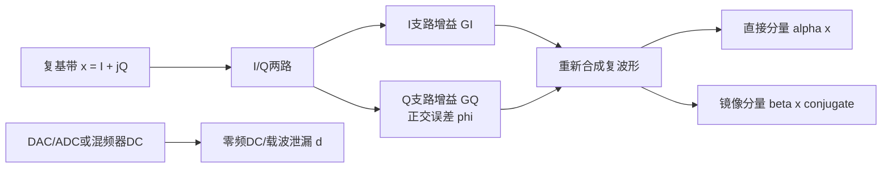
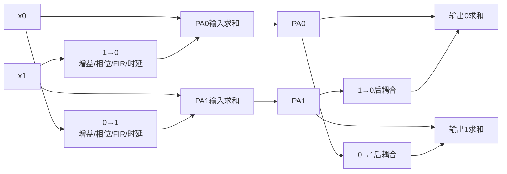
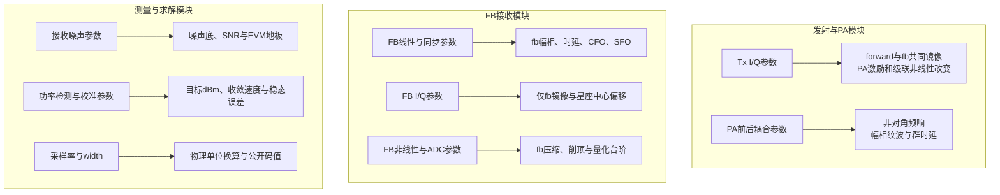
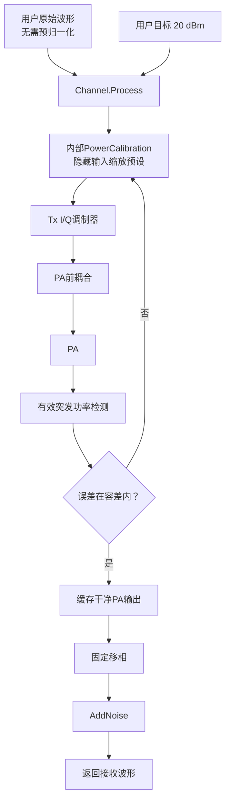
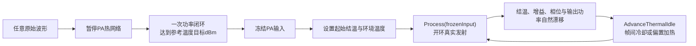

# Channel：PA到接收端链路模型

## 1. 模块边界

`inc/lib/Channel.py` 描述PA前多通道耦合、独立非线性PA、PA后耦合、外部仪表采样和板载反馈接收机。`sampleMode` 决定耦合后的PA输出进入哪条采样路径：

```mermaid
flowchart LR
    raw["用户原始波形"] --> calibration["Channel内部功率闭环<br/>调整PA输入缩放"]
    target["用户目标输出功率 dBm"] --> calibration
    calibration --> txIq["Tx I/Q调制器<br/>增益/相位不平衡与DC"]
    txIq --> preCoupling["PA前耦合 Hpre(z)"]
    preCoupling --> pa["每路独立PA<br/>Wiener/GMP/Doherty"]
    pa --> paOutput["各PA自身输出 yPA(n)"]
    paOutput --> detector["有效突发功率检测"]
    detector -. "误差超出容差时反馈" .-> calibration
    paOutput --> postCoupling["PA后耦合 Hpost(z)"]
    postCoupling --> phase["公共固定相位旋转"]
    phase --> mode{"sampleMode"}
    mode -->|forward| instrument["前向仪表采样<br/>跳过fb专用非理想"]
    mode -->|fb| fbAnalog["板载反馈模拟链<br/>频响/增益/非线性/时频偏/IQ/DC"]
    instrument --> noise["AddNoise"]
    fbAnalog --> noise
    noise --> fbAdc{"fb模式？"}
    fbAdc -->|forward| receiver["仪表采样波形"]
    fbAdc -->|fb| adc["反馈ADC限幅与量化"]
    adc --> receiverFb["反馈采样波形"]
```



图示说明：

- `txIqGainImbalanceDb`、`txIqPhaseImbalanceDegrees` 和 `txDcOffset` 位于PA之前，属于真实发射链路；无论选择forward还是fb，它们都会改变PA激励和空口输出。
- `sampleMode="forward"` 是默认值，表示用校准仪表直接观测PA主路输出。所有 `fb...` 参数都被保留但不生效，因此不会把板载反馈接收机失真混入PA/DPD评价，但Tx I/Q不平衡仍然存在。
- `sampleMode="fb"` 表示通过板载反馈接收链采样；只有此模式会执行 `fbGainDb`、`fbFirTaps`、时延、CFO/SFO、I/Q不平衡、反馈非线性、限幅、DC和ADC量化。
- `prePaCouplingPaths` 在Tx I/Q调制器之后、PA非线性之前，把其他通道的延迟复泄漏叠加到每个PA输入；`postPaCouplingPaths` 在非线性之后混合各PA输出。两者都与forward/fb选择无关。
- `Channel.Process(rawSignal, outputPowerDbm=...)` 是推荐入口。用户只提供任意初始幅度的原始波形和目标PA输出功率；Channel内部调整PA输入、反复观测PA输出并收敛，然后只对最终PA输出执行一次所选采样路径。
- `Channel.Process(rawSignal)` 保留无功率校准的单次PA→采样路径，主要供ILC每轮plant调用。
- `Channel.ProcessPaOutput` 接收各PA已经产生但尚未经过输出耦合的矩阵，不再次运行PA，依次执行PA后耦合和所选采样路径。
- 功率闭环由Channel私有持有的 `PowerCalibration` 完成。普通用户不需要构造、配置或调用校准器。
- PA输出功率闭环只观察所有采样路径非理想之前的干净PA输出，因此不会把仪表或板载反馈接收机的失真误认为PA发射功率。
- 实验室“仪表闭环ILC”把forward模式的Channel作为plant；验证板载反馈算法时把fb模式的Channel作为plant，但最终EVM/ACLR仍应由独立forward模式采样评价。

### 1.1 前向仪表采样

前向模式以高性能VSA作为相对可信的黄金参考。设公共相位为 $\phi_c$，仪表噪声为 $w(n)$：

```math
z_{\mathrm{forward}}(n)
=
y_{\mathrm{PA}}(n)\exp(j\phi_c)+w(n).
```

`fb...` 配置不会进入该公式。这一点允许用同一组反馈非理想参数在forward和fb之间切换并进行公平对比，而不需要删除配置。

### 1.2 板载反馈采样

反馈模式的内部顺序为：

```text
PA output
  -> common phase
  -> feedback gain/phase and FIR
  -> third-order receiver distortion and envelope clipping
  -> fractional delay/SFO resampling and integer delay
  -> CFO phase ramp
  -> IQ gain/phase imbalance and DC offset
  -> AWGN
  -> feedback ADC clipping and quantization
```

用组合算子表示：

```math
z_{\mathrm{fb}}
=
Q_{\mathrm{ADC}}
\left\{
F_{\mathrm{IQ,DC}}
\left[
F_{\mathrm{time,freq}}
\left(
F_{\mathrm{NL}}
\left\{
H_{\mathrm{fb}}[y_{\mathrm{PA}}]
\right\}
\right)
\right]
+w
\right\}.
```

这条路径故意包含板载观察接收机的非理想。若直接用未经校准的 $z_{\mathrm{fb}}$ 更新ILC，算法可能学习PA与反馈链路的组合逆响应；因此工程测试应同时保留forward模式作为独立评价路径。

#### 1.2.1 I/Q正交调制背景与不平衡产生原理

##### 为什么射频链路需要I/Q两路

数字通信中的复基带信号不是一根物理意义上的“复数电线”，而是用两个实信号共同表示射频载波的幅度和相位：

```math
x(t)=I(t)+jQ(t).
```

$I(t)$ 是同相分量，$Q(t)$ 是正交分量。理想发射机用相差90度的两路本振把它们搬移到载频 $f_c$：

```math
s_{\mathrm{RF}}(t)
=
I(t)\cos(2\pi f_ct)
-
Q(t)\sin(2\pi f_ct).
```

等价地，

```math
s_{\mathrm{RF}}(t)
=
\mathrm{Re}
\left\{
x(t)\exp(j2\pi f_ct)
\right\}.
```

I/Q表示法使QAM、OFDM和任意幅相调制都能在复基带中统一处理。接收机执行相反过程：把射频信号分别与余弦和负正弦本振相乘并低通滤波，恢复 $I(t)$ 和 $Q(t)$。

理想链路需要同时满足：

1. I、Q两路增益完全相同；
2. 两路本振严格相差90度；
3. 两路滤波器和走线具有相同频率响应与群时延；
4. DAC、ADC、混频器和基带放大器没有直流偏置；
5. 参数不随频率、功率、温度和时间变化。

真实硬件不能完全满足这些条件，于是产生I/Q不平衡。

##### I/Q不平衡的主要物理来源

| 误差来源 | 物理原因示例 | 波形上的主要表现 |
|---|---|---|
| 增益不平衡 | I/Q DAC满量程不同、混频器转换增益不同、模拟基带放大器误差 | 星座在一个轴向被拉伸，并产生共轭镜像 |
| 正交相位误差 | 90度本振网络误差、PLL/分频器误差、PCB走线相位差 | 星座发生非正交剪切，并产生共轭镜像 |
| 频率选择性失配 | I/Q滤波器幅相响应不同、封装和走线群时延不同 | IRR随带宽位置变化，需要带记忆的校准模型 |
| 直流偏置 | DAC/ADC偏置、混频器自混频、接收机本振泄漏 | 复基带零频出现尖峰，射频上表现为载波泄漏 |
| 工作点漂移 | 温度、电源、器件老化、输出功率变化 | 校准系数和IRR随时间或工作条件变化 |

Tx和FB可能同时存在这些误差，但物理器件和参考面不同。Tx误差来自发射DAC、模拟基带、上变频混频器和Tx本振网络；FB误差来自耦合器之后的反馈接收机、下变频混频器、反馈ADC及其本振网络。

##### 从实数I/Q失配推导共轭镜像

本工程用一个平坦、无记忆模型描述每个I/Q模块。设I相对于Q的增益比误差为 $g$ dB，采用对称的半增益分配：

```math
G_I=10^{g/40},
\qquad
G_Q=10^{-g/40}.
```

因此两路增益比满足

```math
20\log_{10}\frac{G_I}{G_Q}=g.
```

设Q轴相对于理想正交方向存在相位误差 $\phi$。代码采用的实数支路模型是

```math
I'(t)=G_I I(t),
```

```math
Q'(t)
=
G_Q
\left[
\cos\phi\,Q(t)
+
\sin\phi\,I(t)
\right].
```

由

```math
I(t)=\frac{x(t)+x^*(t)}{2},
```

```math
Q(t)=\frac{x(t)-x^*(t)}{2j},
```

代入 $y(t)=I'(t)+jQ'(t)$，得到

```math
y(t)=\alpha x(t)+\beta x^*(t),
```

其中直接系数为

```math
\alpha
=
\frac{1}{2}
\left(
G_I+G_Q\cos\phi+jG_Q\sin\phi
\right),
```

共轭镜像系数为

```math
\beta
=
\frac{1}{2}
\left(
G_I-G_Q\cos\phi+jG_Q\sin\phi
\right).
```

当 $g=0$ 且 $\phi=0$ 时，$G_I=G_Q=1$、$\alpha=1$、$\beta=0$，输出只含理想直接分量。当任一误差非零时，$\beta$ 一般也非零，因此不能只用一个公共复增益消除该误差。

##### 为什么共轭项称为镜像

用单边复音调观察最直观。若

```math
x(t)=A\exp(j2\pi f_0t),
```

则

```math
x^*(t)=A^*\exp(-j2\pi f_0t).
```

直接项位于复基带 $+f_0$，共轭项位于 $-f_0$，两者关于零频互为镜像。上变频后，它们对应载频两侧的 $f_c+f_0$ 与 $f_c-f_0$。因此镜像抑制度定义为直接分量功率与镜像分量功率之比：

```math
\mathit{IRR}_{\mathrm{dB}}
=
10\log_{10}
\frac{|\alpha|^2}{|\beta|^2}.
```

增益误差主要形成镜像系数的实部，正交相位误差主要形成其虚部。小误差条件下，$\phi$ 使用弧度，有

```math
\beta
\approx
\frac{\ln 10}{40}g
+
j\frac{\phi}{2}.
```

这说明两类误差像两个正交误差分量一样合成。即使分别看起来不大，同时存在时也会进一步降低IRR。

##### DC偏置为什么不属于镜像

加入复直流偏置后，模型为

```math
y(t)
=
\alpha x(t)
+
\beta x^*(t)
+
d.
```

$d$ 在复基带位于零频；Tx上变频后主要表现为载频 $f_c$ 附近的本振泄漏。$\beta x^*$ 则是随输入变化、相对于零频翻转的镜像。两者物理来源和频谱位置不同，所以IRR计算不能把DC功率当作镜像功率，校准时也需要独立的DC补偿项。

##### 当前Channel模型的能力边界

当前 `txIqGainImbalanceDb`、`txIqPhaseImbalanceDegrees`、`fbIqGainImbalanceDb` 和 `fbIqPhaseImbalanceDegrees` 都是标量，因此模拟的是带内平坦、无记忆I/Q不平衡。它适合验证参考面、IRR、普通GMP与增广GMP的基本关系。

若实际I/Q误差随频率变化，应扩展为广义线性FIR：

```math
y[n]
=
\sum_{k=0}^{K_d-1}a_kx[n-k]
+
\sum_{k=0}^{K_i-1}b_kx^*[n-k]
+
d.
```

第一组FIR描述直接支路幅相和群时延，第二组FIR描述随频率变化的镜像支路。此时单个IRR仍可作为汇总指标，但模型选择和校准还应观察IRR随频率的曲线。



图示说明：增益和正交误差使原本独立的I/Q轴发生尺度差和混合，重新合成后必然同时出现 $x$ 与 $x^*$；DC项从另一条物理路径进入，不应与共轭镜像混为一类。

#### 1.2.2 Tx与FB I/Q不平衡不是同一个误差

Tx I/Q不平衡位于数字基带输出与PA输入之间。设理想发送波形为 $x(n)$，Tx调制器输出为：

```math
x_{\mathrm{tx}}(n)
=
\alpha_{\mathrm{tx}}x(n)
+
\beta_{\mathrm{tx}}x^*(n)
+
d_{\mathrm{tx}}.
```

该信号继续经过PA前耦合和非线性PA：

```math
y_{\mathrm{PA}}(n)
=
F_{\mathrm{PA}}
\left\{
H_{\mathrm{pre}}
\left[
x_{\mathrm{tx}}(n)
\right]
\right\}.
```

因此Tx镜像会进入PA并与PA非线性级联，既能在forward仪表中看到，也能在fb接收机中看到。增广GMP或其他广义线性DPD可以在不饱和且模型充分时预先产生反向共轭项补偿它。

FB I/Q不平衡位于PA输出之后，只改变板载观察结果。设进入反馈IQ解调器的波形为 $r(n)$：

```math
z_{\mathrm{fb,IQ}}(n)
=
\alpha_{\mathrm{fb}}r(n)
+
\beta_{\mathrm{fb}}r^*(n)
+
d_{\mathrm{fb}}.
```

如果DPD把 `fb` 镜像项造成的镜像当作空口失真去补偿，它会故意在真实PA输出中生成反向镜像；板载反馈读数可能改善，但forward仪表和真实空口IRR反而变差。所以FB I/Q应先校准或去嵌入，不能和Tx I/Q共用一个参数。

两处I/Q参数都用相同的物理换算。令I/Q增益比误差为 $g$ dB，正交误差为 $\phi$：

```math
G_I
=
10^{g/40},
```

```math
G_Q
=
10^{-g/40}.
```

直接项和镜像项为：

```math
\alpha
=
\frac{1}{2}
\left(
G_I
+
G_Q\cos\phi
+
jG_Q\sin\phi
\right),
```

```math
\beta
=
\frac{1}{2}
\left(
G_I
-
G_Q\cos\phi
+
jG_Q\sin\phi
\right).
```

忽略DC、噪声和其他镜像来源时，理论IRR为：

```math
\mathrm{IRR}_{\mathrm{dB}}
=
10\log_{10}
\left(
\frac{|\alpha|^2}{|\beta|^2}
\right).
```

`Process(inputSignal)` 会执行Tx I/Q；`ProcessPaOutput(paOutputSignal)` 接收的是已经产生的PA输出，因此不会再次执行Tx I/Q，只会执行PA后耦合和所选forward/fb采样链。`GetLastPaInput()`为兼容旧接口保留名称，现在明确返回Tx I/Q之前的数字波形；`GetLastTransmitterOutput()`返回Tx I/Q之后、PA前耦合之前的波形；`GetLastActualPaInput()`返回耦合后真正进入PA的波形。

### 1.3 PA前与PA后多通道耦合

输入和输出矩阵都使用“样点数 × 物理通道数”。设第 $i$ 路原始输入为 $x_i(n)$，PA前耦合后第 $j$ 路实际激励为：

```math
u_j(n)
=
x_j(n)
+
\sum_{i\ne j}
\sum_{k=0}^{K_{\mathrm{pre}}-1}
h^{\mathrm{pre}}_{j,i}(k)x_i(n-k).
```

每一路再经过自己配置的Wiener、GMP或Doherty PA：

```math
y_j(n)=F_j\{u_j(n)\}.
```

PA后耦合为：

```math
v_j(n)
=
y_j(n)
+
\sum_{i\ne j}
\sum_{k=0}^{K_{\mathrm{post}}-1}
h^{\mathrm{post}}_{j,i}(k)y_i(n-k).
```

代码始终保留每路单位直通项，用户配置的路径作为额外串扰相加。每条路径使用：

```math
h_{j,i}
=
10^{G_{j,i}/20}
\exp(j\phi_{j,i})
f_{j,i}.
```

$f_{j,i}$ 是可选复FIR；随后再施加独立整数和分数时延。路径方向明确规定为 `sourceChain` 指向 `destinationChain`，因此0到1和1到0可以使用不同增益、相位、FIR及时延。



**图示说明**：PA前耦合改变非线性工作点并产生跨通道包络相关失真；PA后耦合只混合已经生成的失真。当前模型描述线性耦合网络与独立非线性PA的级联。如果天线反射波会改变PA负载，使PA本身直接依赖其他通道输出，则还需要有源负载牵引模型，不能仅用PA后线性相加代替。

### 1.4 耦合条件下的联合功率校准

`outputPowerDbm=(P_0,P_1,...)` 仍表示PA后耦合之前每个物理PA自身的目标输出功率。只有PA前耦合时，调整一路输入会同时改变多个PA输出，Channel默认自动启用联合校准。

令隐藏驱动dB向量为 $\mathbf d$，实测PA功率向量为 $\mathbf p(\mathbf d)$。代码逐路增加 `calibrationProbeStepDb`，以有限差分估计：

```math
J_{m,n}
\approx
\frac{
p_m(\mathbf d+\Delta d\mathbf e_n)-p_m(\mathbf d)
}{
\Delta d
}.
```

联合更新为：

```math
\Delta\mathbf d
=
\left(
\mathbf J^T\mathbf J+\lambda\mathbf I
\right)^{-1}
\mathbf J^T
\left(
\mathbf p_{\mathrm{target}}-\mathbf p
\right).
```

`jointPowerCalibration=None` 表示自动模式：存在PA前耦合时启用Jacobian联合更新，否则沿用较快的逐链闭环。用户也可以显式设为 `True` 或 `False`。PA后耦合不进入功率检测，因此不会改变“每个PA自身输出dBm”的含义。

## 2. 固定相位旋转

令PA复包络输出为：

```math
y_{\mathrm{PA}}(n)=I(n)+jQ(n)
```

固定相位旋转为：

```math
y_{\phi}(n)=y_{\mathrm{PA}}(n)\exp(j\phi)
```

当前只支持：

```math
\phi\in\{-90^\circ,0^\circ,+90^\circ\}
```

三个取值可以直接写成I/Q交换关系：

```math
\phi=0^\circ:\quad I_{\phi}=I,\qquad Q_{\phi}=Q
```

```math
\phi=+90^\circ:\quad I_{\phi}=-Q,\qquad Q_{\phi}=I
```

```math
\phi=-90^\circ:\quad I_{\phi}=Q,\qquad Q_{\phi}=-I
```

因为复指数的模为1，所以理想相位旋转不改变瞬时幅度和平均功率：

```math
\left|y_{\phi}(n)\right|
=
\left|y_{\mathrm{PA}}(n)\right|
```

```math
\mathbb{E}\left[\left|y_{\phi}(n)\right|^2\right]
=
\mathbb{E}\left[\left|y_{\mathrm{PA}}(n)\right|^2\right]
```

相位旋转可用来模拟线缆电长度、本振初相、固定移相器或接收通道的公共相位差。它是线性影响，不会自行产生互调或频谱再生。

## 3. 白噪声模型

### 3.1 圆对称复高斯噪声

接收端波形为：

```math
r(n)=y_{\phi}(n)+w(n)
```

白噪声写成：

```math
w(n)=w_{\mathrm{I}}(n)+jw_{\mathrm{Q}}(n)
```

若配置的复包络总RMS为 `noiseAmpMv`，则I、Q两部分相互独立，并分别满足：

```math
w_{\mathrm{I}}(n),w_{\mathrm{Q}}(n)
\sim
\mathcal{N}\left(0,\frac{\sigma_w^2}{2}\right)
```

这里：

```math
\sigma_w
=
\sqrt{\mathbb{E}\left[\left|w(n)\right|^2\right]}
```

因此，`noiseAmpMv=10` 的含义是复包络总RMS电压为10 mV；不是I路10 mV再加Q路10 mV。每个实分量的RMS为：

```math
\sigma_{\mathrm{I}}
=
\sigma_{\mathrm{Q}}
=
\frac{10}{\sqrt{2}}\ \mathrm{mV}
```

白噪声在时间上独立同分布，理想功率谱密度在离散复基带Nyquist区间内为常数。它会抬高噪声底、恶化SNR和EVM，但不会像PA奇数阶非线性那样形成确定的IM3、IM5或IM7谱线。

### 3.2 由毫伏控制

`noiseAmpMv=A` 时，物理RMS电压为：

```math
V_{\mathrm{noise,rms}}=A\times 10^{-3}\ \mathrm{V}
```

在负载阻抗为 $R$ 时，对应噪声功率为：

```math
P_{\mathrm{noise,W}}
=
\frac{V_{\mathrm{noise,rms}}^2}{R}
```

```math
P_{\mathrm{noise,dBm}}
=
10\log_{10}
\left(
\frac{P_{\mathrm{noise,W}}}{10^{-3}}
\right)
```

例如 $R=50\ \Omega$、复包络RMS为10 mV：

```math
P_{\mathrm{noise,W}}
=
\frac{(10\times10^{-3})^2}{50}
=
2\times10^{-6}\ \mathrm{W}
```

```math
P_{\mathrm{noise,dBm}}
\approx
-26.99\ \mathrm{dBm}
```

### 3.3 由dBm控制

`noisePwrDbm=P` 时先换算为RMS电压：

```math
V_{\mathrm{noise,rms}}
=
\sqrt{R\times10^{-3}}\;10^{P/20}
```

所以在50 Ω系统中，`noiseAmpMv=10` 与 `noisePwrDbm=-26.99` 表示相同的噪声强度。`noiseAmpMv`、`noisePwrDbm` 和 `noiseSnrDb` 三个参数互斥：

- 三者都是 `None`：不加噪。
- 只有 `noiseAmpMv` 非 `None`：使用毫伏控制。
- 只有 `noisePwrDbm` 非 `None`：使用dBm控制。
- 只有 `noiseSnrDb` 非 `None`：使用有效突发信号与噪声的功率比控制。
- 任意两个或三个同时非 `None`：物理定义冲突，配置无效。

### 3.4 由SNR控制

`noiseSnrDb=S` 表示每一路有效突发信号功率与所加复白噪声功率之比为：

```math
S
=
10\log_{10}
\left(
\frac{P_{\mathrm{signal}}}
     {P_{\mathrm{noise}}}
\right).
```

因为复包络功率与RMS幅度平方成正比，所以每路噪声总RMS为：

```math
\sigma_{w,m}
=
x_{\mathrm{rms},m}
10^{-S/20},
```

其中 $x_{\mathrm{rms},m}$ 是第 $m$ 路移相后信号的有效区RMS。Channel复用PA功率校准的有效突发检测规则：

```math
x_{\mathrm{rms},m}
=
\sqrt{
\frac{
\sum_n M_m(n)\left|x_m(n)\right|^2
}{
\sum_n M_m(n)
}
}.
```

$M_m(n)$ 是该路有效样点掩码。它排除前后补零和长占空比关断区，只填充长度不超过 `activeGapToleranceSamples` 的短低幅空洞。因此，带有补零的30 dB配置仍表示开启期间约30 dB SNR，不会因为记录中有大量零而错误降低噪声。

SISO只有一个噪声RMS；MIMO对每一列独立计算 $x_{\mathrm{rms},m}$，因此幅度较小的链会得到相应较小的噪声RMS，但每路目标SNR相同。`noiseSnrDb` 允许任意有限dB值，包括负SNR。

### 3.5 物理电压到归一化波形

工程规定PA归一化输出RMS等于1时，对应 `maximumOutputPowerDbm`。满量程物理RMS电压为：

```math
V_{\mathrm{FS,rms}}
=
\sqrt{R\times10^{-3}}\;
10^{P_{\mathrm{max,dBm}}/20}
```

加入内部浮点波形的归一化噪声RMS为：

```math
\sigma_{\mathrm{noise,norm}}
=
\frac{V_{\mathrm{noise,rms}}}
       {V_{\mathrm{FS,rms}}}
```

这种换算保证相同的10 mV在浮点接口和16位定点接口中表示同一个物理噪声，而不是把“10”错误地当成归一化幅度或整数码。

## 4. 反馈链路非理想及其对ILC的影响

### 4.1 增益、相位和频率响应

反馈FIR及耦合增益为：

```math
v_m(n)
=
10^{G_{\mathrm{fb}}/20}
\exp(j\phi_{\mathrm{fb}})
\sum_{k=0}^{K-1}h_k y_m(n-k).
```

`fbFirTaps=None` 等价于 $h_0=1$。FIR按每一路独立卷积并保留原记录长度。若DPD不去嵌反馈频响，收敛条件可能变成 $H_{\mathrm{fb}}Y\approx X$，真实主路输出则错误地趋向 $Y\approx X/H_{\mathrm{fb}}$。

### 4.2 反馈接收机非线性和限幅

三阶反馈非线性为：

```math
v_{\mathrm{nl}}(n)
=
v(n)+c_3|v(n)|^2v(n).
```

`fbThirdOrderCoefficient` 是可为复数的 $c_3$，其实部主要改变AM-AM，虚部同时产生AM-PM。`fbClipAmplitude=A` 时再进行复包络径向限幅。若幅度没有超过门限：

```math
v_{\mathrm{clip}}(n)=v_{\mathrm{nl}}(n),
\qquad
|v_{\mathrm{nl}}(n)|\leq A.
```

若幅度超过门限，则只压缩幅度并保留相位：

```math
v_{\mathrm{clip}}(n)
=
A\frac{v_{\mathrm{nl}}(n)}
       {|v_{\mathrm{nl}}(n)|},
\qquad
|v_{\mathrm{nl}}(n)|>A.
```

反馈接收机压缩会让ILC补偿“PA+观察接收机”的组合非线性，因此最终必须使用forward仪表采样独立验证。

### 4.3 时延、CFO和SFO

分数时延与采样频偏使用保持长度的插值模型。正的 `fbFractionalDelaySamples=d` 取源位置 $n-d$；采样偏差为 $\epsilon_{\mathrm{sfo}}=\mathrm{ppm}\times10^{-6}$：

```math
v_{\mathrm{sfo}}(n)
=
v_{\mathrm{clip}}
\left(
n(1+\epsilon_{\mathrm{sfo}})-d
\right).
```

随后加入非负整数时延 $D$，并施加载波偏移：

```math
v_{\mathrm{cfo}}(n)
=
v_{\mathrm{sfo}}(n-D)
\exp
\left(
j2\pi\frac{\Delta f}{f_s}n
\right).
```

超出原采样记录的插值位置补零。`sampleRateHz` 决定CFO相位斜率的物理尺度。

### 4.4 Tx与FB I/Q不平衡及直流偏置

I/Q正交调制的硬件背景、实数两支路到共轭镜像的完整推导，以及平坦模型与广义线性FIR模型的边界见 [1.2.1节](#121-iq正交调制背景与不平衡产生原理)。本节只说明这些物理量在代码各模块中的执行位置。

#### 4.4.1 两个模块共用的系数换算

令I/Q增益不平衡为 $\Delta G$ dB、正交相位误差为 $\theta$：

```math
g_I=10^{\Delta G/40},
\qquad
g_Q=10^{-\Delta G/40}.
```

实现的实分量模型为：

```math
I'(n)=g_I I(n),
```

```math
Q'(n)
=
g_Q
\left[
\cos(\theta)Q(n)+\sin(\theta)I(n)
\right].
```

等价的广义线性形式为：

```math
v_{\mathrm{iq}}(n)
=
\alpha v(n)+\beta v^*(n)+d.
```

其中 $\alpha$ 是直接分量系数，$\beta$ 是镜像分量系数。最后一项 $d$ 是该模块自身的复直流偏置。代码中的 `ResolveIqImbalanceCoefficients` 负责把增益误差与正交误差换算成 $\alpha$ 和 $\beta$，Tx与FB模块复用这套数学关系，但不共用参数值或参考面。

#### 4.4.2 Tx I/Q调制器

Tx参数为 `txIqGainImbalanceDb`、`txIqPhaseImbalanceDegrees` 和 `txDcOffset`。它们位于PA之前：

```math
x_{\mathrm{tx}}(n)
=
\alpha_{\mathrm{tx}}x(n)
+
\beta_{\mathrm{tx}}x^*(n)
+
d_{\mathrm{tx}}.
```

因此Tx镜像不只是观测误差，还会进入PA非线性。即使PA模型本身只含直接基函数，级联后也可能出现与 $x^*$、$x|x|^2$ 和 $x^*|x|^2$ 有关的混合失真。forward与fb两种采样都会看到这个物理影响。

#### 4.4.3 FB I/Q解调器

FB参数为 `fbIqGainImbalanceDb`、`fbIqPhaseImbalanceDegrees` 和 `fbDcOffset`。它们只在 `sampleMode="fb"` 时应用：

```math
v_{\mathrm{fb,iq}}(n)
=
\alpha_{\mathrm{fb}}v_{\mathrm{fb}}(n)
+
\beta_{\mathrm{fb}}v_{\mathrm{fb}}^*(n)
+
d_{\mathrm{fb}}.
```

FB镜像不会改变PA或forward参考面的真实输出。训练前应校准或去嵌入它，不能让DPD把FB接收机误差写进发射波形。两处非零I/Q误差都会形成共轭镜像，不能只靠公共复增益完全去除。

### 4.5 反馈ADC

`fbAdcWidth` 取 $W$ 时启用反馈ADC，`fbAdcFullScale` 取 $A_{\mathrm{FS}}$ 时定义每个I/Q分量的正负满量程。每个分量先转换成码值：

```math
q
=
\mathrm{clip}
\left(
\mathrm{round}
\left[
\frac{x}{A_{\mathrm{FS}}}2^{W-1}
\right],
-2^{W-1},
2^{W-1}-1
\right),
```

再解码回内部浮点采样：

```math
\widehat{x}
=
A_{\mathrm{FS}}\frac{q}{2^{W-1}}.
```

`fbAdcWidth=None` 表示不启用反馈ADC模型。这个位宽与Channel公开接口 `width` 不同：前者模拟板载反馈ADC内部量化，后者定义Python函数边界的I/Q码格式。

### 4.6 相位、噪声与ILC

固定相位是确定性线性项。若链路无噪声并且ILC执行公共复增益对齐，则公共相位通常可以被同步步骤准确估计：

```math
\widehat{g}
=
\frac{\boldsymbol{x}^{H}\boldsymbol{y}}
       {\boldsymbol{x}^{H}\boldsymbol{x}}
```

噪声是随机项，不能由确定性预失真完全消除。即使PA非线性已被很好补偿，EVM也会受到噪声底限制。简化地写：

```math
\mathrm{EVM}_{\mathrm{floor}}^2
\approx
\frac{\sigma_w^2}
     {\mathbb{E}[|x(n)|^2]}
```

当 `Channel` 直接作为ILC被控对象时，每一轮会得到新的独立噪声样本。这更接近真实反馈接收机，但也会使逐轮MSE或EVM出现随机波动。固定 `randomSeed` 只保证整次仿真的噪声序列可复现，并不让每轮重复同一段噪声；调用 `ResetRandomGenerator` 才会从序列起点重新开始。

## 5. 参数作用位置与可观测量示意图

本节的图片是“参数对应关系示意图”，不是参数遍历曲线，也不代表某一台真实仪表或芯片的指标极限。它们回答三个工程问题：

1. 参数作用在 PA 前、PA 后、前向采样还是反馈采样的哪个位置。
2. 改变参数后，最先应该在幅度、相位、时延、频谱、星座或功率闭环的哪个可观测量中寻找变化。
3. 哪些参数描述物理链路，哪些参数只控制数值求解、测量口径或公开定点接口。

### 5.1 参数在链路中的作用位置

```mermaid
flowchart LR
    input["公开数字Tx输入"] --> calibration["输出功率闭环"]
    calibration --> txIq["Tx I/Q调制器<br/>txIq... / txDcOffset"]
    txIq --> pre["PA前耦合<br/>prePaCouplingPaths"]
    pre --> pa["逐路PA"]
    pa --> post["PA后耦合<br/>postPaCouplingPaths"]
    post --> phase["公共移相<br/>phaseDegrees"]
    phase --> mode{"sampleMode"}
    mode -->|forward| forwardNoise["前向仪表与互斥噪声配置"]
    mode -->|fb| fbLinear["FB增益/相位/FIR"]
    fbLinear --> fbNonlinear["FB三阶非线性与限幅"]
    fbNonlinear --> fbSync["FB Delay/CFO/SFO"]
    fbSync --> fbIq["FB I/Q解调器<br/>fbIq... / fbDcOffset"]
    fbIq --> fbNoise["互斥噪声配置"]
    fbNoise --> fbAdc["FB ADC"]
    forwardNoise --> output["公开接收波形"]
    fbAdc --> output
```



图示说明：

- 主信号从左向右依次经过功率校准、Tx I/Q调制器、PA前耦合、逐路PA、PA后耦合和公共固定移相。
- Tx I/Q位于PA之前，因此forward与fb都包含它；FB I/Q位于采样分支内部，只改变fb观测。
- `sampleMode="forward"` 在公共移相后进入仪表前向采样支路，不经过任何 `fb...` 参数。
- `sampleMode="fb"` 才会继续经过反馈增益/FIR、非线性/限幅、时延/CFO/SFO、I/Q 不平衡/DC 和反馈 ADC。
- 三种白噪声配置位于所选采样支路的末端，因此它们描述接收或采样噪声，而不是 PA 本身的非线性。
- `width` 只定义公开输入输出的整数码位宽；图中所有物理模块仍在内部浮点域计算。
- 功率校准参数控制“如何寻找 PA 输入预设值”，不会改变 PA、耦合网络或反馈接收机的物理模型。

### 5.2 参数与可观测现象的对应关系



图中各分区的含义如下。

| 分区 | 参数组 | 最直接的可观测现象 |
|---|---|---|
| A | `sourceChain`、`destinationChain`、`gainDb`、`firTaps` | 耦合方向、耦合幅度、带内纹波和陷波 |
| B | 耦合路径 `phaseDegrees`、`integerDelaySamples`、`fractionalDelaySamples` | 中心相位和随频率变化的相位斜率 |
| C-Tx | `txIqGainImbalanceDb`、`txIqPhaseImbalanceDegrees`、`txDcOffset` | PA前星座椭圆化与镜像；同时影响forward、fb和PA非线性 |
| C-FB | `fbIqGainImbalanceDb`、`fbIqPhaseImbalanceDegrees`、`fbDcOffset` | 仅fb观测端的星座椭圆化、共轭镜像和中心偏移 |
| D | `fbThirdOrderCoefficient`、`fbClipAmplitude`、`fbAdcWidth`、`fbAdcFullScale` | AM/AM 弯曲、硬限幅和量化台阶 |
| E | 反馈时延、CFO、SFO 和 `sampleRateHz` | 波形横向平移、逐样点相位旋转和时间轴伸缩 |
| F | 有效突发检测与三种噪声配置 | 功率统计窗口、噪声底、SNR 和 EVM |
| G | 目标功率与校准求解参数 | 输出功率收敛速度、稳态误差和 MIMO 联合收敛性 |

### 5.3 调参方向与物理含义

下表中的“增大”均指参数数值增大；对于负 dB 耦合增益，`-20 dB` 大于 `-40 dB`，因此代表更强耦合。

| 参数 | 数值增大时的主要变化 | 不应误解为 |
|---|---|---|
| 耦合 `gainDb` | 泄漏幅度增大，非对角频响更接近主通道 | 不会单独产生额外时延 |
| 耦合 `phaseDegrees` | 整条泄漏路径发生固定复旋转 | 理想固定相位不会改变路径幅度 |
| `integerDelaySamples` | 路径后移整数样点，频域相位斜率变陡 | 理想时延不会制造幅频纹波 |
| `fractionalDelaySamples` | 增加不足一个样点的时延和连续相位斜率 | 不是简单的固定相位偏置 |
| `firTaps` | 决定频率选择性、记忆长度、纹波和可能的陷波 | 不能只用一个中心增益概括 |
| `sourceChain` / `destinationChain` | 改变泄漏的方向和 MIMO 拓扑 | 它们不表示耦合强度 |
| 公共 `phaseDegrees` | 所选观测信号整体旋转 `-90`、`0` 或 `90` 度 | 不改变功率、噪声或非线性 |
| `txIqGainImbalanceDb` | PA前I/Q两轴尺度差增大，Tx镜像和PA级联互调增强 | 不是反馈接收机误差 |
| `txIqPhaseImbalanceDegrees` | PA前正交误差增大，Tx镜像增强 | 不是公共相位旋转 |
| `txDcOffset` | PA输入出现复直流偏置并可能改变PA工作点 | 不会被forward模式跳过 |
| `fbGainDb` | 反馈链路整体幅度变化 | 不等于 PA 增益变化 |
| `fbPhaseDegrees` | 反馈链路整体相位变化 | 不等于 PA AM/PM |
| `fbFirTaps` | 反馈链路出现幅频纹波和群时延变化 | 不属于 PA 记忆效应 |
| `fbIntegerDelaySamples` | 反馈采样整体后移整数样点 | 不改变原始 PA 输出 |
| `fbFractionalDelaySamples` | 增加分数样点时延 | 不等于 SFO |
| `fbCarrierFrequencyOffsetHz` | 每个样点累积相位，星座随时间旋转 | 不只是一个固定相位 |
| `fbSamplingFrequencyOffsetPpm` | 反馈时间轴逐渐伸缩，帧越长累计偏差越大 | 不只是一个固定延迟 |
| `fbIqGainImbalanceDb` | I/Q 两轴尺度不一致，镜像泄漏增强 | 不是公共复增益 |
| `fbIqPhaseImbalanceDegrees` | I/Q 正交性变差，星座倾斜并产生镜像 | 不是公共相位旋转 |
| `fbDcOffset` | 星座中心平移并在零频出现直流分量 | 不会随信号幅度同比缩放 |
| `fbThirdOrderCoefficient` | 反馈接收机三阶弯曲和互调增强 | 不应被训练器误认为 PA 三阶项 |
| `fbClipAmplitude` | 阈值减小时更早进入硬限幅 | 不是平滑的 PA 压缩 |
| `fbAdcWidth` | 位宽增大时量化步长减小、量化噪声下降 | 不会恢复已经被模拟限幅的信息 |
| `fbAdcFullScale` | 满量程增大时更不易削顶，但同位宽下量化步长变粗 | 不是“越大越精确” |
| `noiseAmpMv` | 毫伏 RMS 增大时噪声底上升 | 不能与另两种噪声控制同时启用 |
| `noisePwrDbm` | dBm 噪声功率增大时噪声底上升 | 其换算依赖 `loadResistanceOhm` |
| `noiseSnrDb` | 数值增大时添加的噪声减小，EVM 通常改善 | 它不是噪声功率本身 |
| `randomSeed` | 只改变或复现噪声样本实现 | 不改变理论噪声方差 |
| `sampleRateHz` | 改变 Hz、ppm、秒与样点之间的换算 | 不会自动改变 PA 或耦合增益 |
| `activePowerThresholdDb` | 阈值升高时有效功率统计更集中在突发高幅区 | 不是接收机检测灵敏度模型 |
| `activeGapToleranceSamples` | 数值增大时会闭合更长的突发内部低幅间隙 | 不会补回真实缺失样点 |
| `loadResistanceOhm` | 改变电压、瓦特和 dBm 的换算关系 | 不改变归一化样本本身 |
| `maximumOutputPowerDbm` | 改变归一化 PA 输出 RMS 等于 1 时代表的物理功率 | 不是每次调用的目标功率 |
| `calibrationToleranceDb` | 数值增大时更容易提前停止，但允许更大功率误差 | 不改变目标值 |
| `maximumCalibrationIterations` | 数值增大时允许更多闭环尝试 | 不保证病态耦合下一定收敛 |
| `calibrationLearningRate` | 数值增大时单轮校正更激进 | 过大可能来回振荡 |
| `maximumDriveAdjustmentDb` | 数值增大时单轮允许更大的驱动修正 | 不会提高 PA 的物理饱和功率 |
| `jointPowerCalibration` | 在 MIMO 耦合下选择联合或逐链求解策略 | 它不是耦合开关 |
| `calibrationProbeStepDb` | 增大时 Jacobian 探测更明显，但局部线性近似变粗 | 不是实际输出功率步进 |
| `calibrationRegularization` | 增大时联合求解更稳定、更新更保守 | 过大可能留下功率偏差 |
| `width` | `0` 为物理浮点幅值；正整数使用对应满量程整数 I/Q 码 | 内部 PA 和信道计算仍是浮点 |

调用 `Process(inputSignal, outputPowerDbm=...)` 时，`outputPowerDbm` 才是本次运行希望每路 PA 达到的实际输出功率；它不是构造参数。图中 G 区把它作为闭环目标单独画出，是为了避免与 `maximumOutputPowerDbm` 混淆。

## 6. 参数表

构造接口：

```python
Channel(
    paModel=None,
    parameters=None,
    width=None,
    **parameterOverrides,
)
```

参数不再按名字简单混排，而是按信号实际经过的物理模块分类。这样可以直接判断某个配置是在改变空口发射，还是只在改变反馈观测。

### 6.1 公共采样与接口模块

| 参数 | 默认值 | 单位 | 说明 |
|---|---:|---|---|
| `sampleMode` | `"forward"` | 无 | `"forward"`为校准仪表采样；`"fb"`为板载反馈接收机采样 |
| `sampleRateHz` | `1.0` | sample/s | CFO、SFO、分数时延和热时间换算使用的真实采样率 |
| `phaseDegrees` | `0` | degree | PA输出后的公共移相，仅允许 `-90`、`0`、`90` |
| `width` | `16` | bit/I或Q | `0`为浮点；正整数为公开边界有符号I/Q码位宽 |

### 6.2 Tx I/Q调制器模块

这三个参数位于PA之前，对forward和fb两种采样模式都生效，并纳入功率校准的真实plant。

| 参数 | 默认值 | 单位 | 说明 |
|---|---:|---|---|
| `txIqGainImbalanceDb` | `0.0` | dB | Tx调制器I/Q增益比误差；0为理想 |
| `txIqPhaseImbalanceDegrees` | `0.0` | degree | Tx调制器相对理想90度正交的相位误差 |
| `txDcOffset` | `0+0j` | normalized | Tx复直流或LO泄漏项；在PA前加入 |

#### 6.2.1 Tx I/Q参数的生效条件

- `Process(...)` 和内部功率校准都会应用Tx I/Q模块。
- `sampleMode="forward"` 与 `sampleMode="fb"` 都不会跳过Tx I/Q。
- `ProcessPaOutput(...)` 的输入已被定义为PA输出，因此不会再次应用Tx I/Q。
- 当前三个Tx I/Q参数是所有链共用的标量；多链独立Tx误差需要分别构造Channel，或后续扩展为逐链参数序列。

### 6.3 PA前后耦合模块

| 参数 | 默认值 | 单位 | 说明 |
|---|---:|---|---|
| `prePaCouplingPaths` | `None` | 无 | Tx I/Q之后、PA之前的串扰路径序列 |
| `postPaCouplingPaths` | `None` | 无 | PA之后、forward/fb分支之前的串扰路径序列 |

#### 6.3.1 耦合路径子参数

`prePaCouplingPaths` 与 `postPaCouplingPaths` 中每个路径映射支持：

| 路径字段 | 默认值 | 说明 |
|---|---:|---|
| `sourceChain` | `0` | 泄漏源物理通道索引 |
| `destinationChain` | `1` | 泄漏进入的目标通道索引；不能等于源索引 |
| `gainDb` | `-30.0` | 电压耦合增益，使用20对数换算 |
| `phaseDegrees` | `0.0` | 路径固定相位 |
| `integerDelaySamples` | `0` | 非负因果整数时延 |
| `fractionalDelaySamples` | `0.0` | 分数时延，范围 `[-0.5,0.5)` |
| `firTaps` | `None` | 可选非空有限复FIR；`None`为单位抽头 |

路径中的未知字段会立即抛出 `TypeError`，不会继续使用路径默认值；已识别但非法的索引、时延、增益或FIR仍然报错。

### 6.4 FB线性、同步与振荡器模块

以下参数只在 `sampleMode="fb"` 时生效。

| 参数 | 默认值 | 单位 | 说明 |
|---|---:|---|---|
| `fbGainDb` | `0.0` | dB | 反馈耦合器与接收机电压增益 |
| `fbPhaseDegrees` | `0.0` | degree | 反馈链附加公共相位 |
| `fbFirTaps` | `None` | 无 | 因果复FIR；`None`等价于单位抽头 |
| `fbIntegerDelaySamples` | `0` | sample | 非负整数时延 |
| `fbFractionalDelaySamples` | `0.0` | sample | 分数时延，范围 `[-0.5, 0.5)` |
| `fbCarrierFrequencyOffsetHz` | `0.0` | Hz | 反馈接收机载波频偏 |
| `fbSamplingFrequencyOffsetPpm` | `0.0` | ppm | 反馈接收机采样频偏，绝对值小于一百万 |

### 6.5 FB I/Q解调器模块

这三个参数只污染板载反馈观测，不改变forward仪表看到的真实PA输出。

| 参数 | 默认值 | 单位 | 说明 |
|---|---:|---|---|
| `fbIqGainImbalanceDb` | `0.0` | dB | FB接收机I/Q增益比误差 |
| `fbIqPhaseImbalanceDegrees` | `0.0` | degree | FB接收机相对理想90度正交的相位误差 |
| `fbDcOffset` | `0+0j` | normalized | FB接收机复直流偏置 |

#### 6.5.1 FB I/Q参数的生效条件

- 只有 `sampleMode="fb"` 才应用FB I/Q模块。
- `sampleMode="forward"` 会完整忽略三个FB I/Q参数，即使它们被设置为非零。
- 当前三个FB I/Q参数是所有反馈链共用的标量；它们不参与PA输出功率校准。
- DPD若使用fb采样训练，应先去嵌入FB镜像；最终EVM与IRR应在forward参考面复测。

### 6.6 FB非线性与ADC模块

| 参数 | 默认值 | 单位 | 说明 |
|---|---:|---|---|
| `fbThirdOrderCoefficient` | `0+0j` | normalized | 接收机三阶复多项式系数 |
| `fbClipAmplitude` | `None` | normalized | 复包络径向限幅；正数启用 |
| `fbAdcWidth` | `None` | bit/I或Q | 内部ADC位宽2至32；`None`禁用 |
| `fbAdcFullScale` | `1.0` | normalized | 内部ADC每个I/Q分量满量程 |

### 6.7 接收噪声模块

三种噪声强度参数互斥，并作用在所选forward或fb观测支路的末端。

| 参数 | 默认值 | 单位 | 说明 |
|---|---:|---|---|
| `noiseAmpMv` | `None` | mV RMS | 复包络总RMS噪声幅度 |
| `noisePwrDbm` | `None` | dBm | 配置端口上的总噪声功率 |
| `noiseSnrDb` | `None` | dB | 每路有效突发信号功率与复噪声功率之比 |
| `randomSeed` | `1701` | 无 | 非负整数可复现；`None`使用系统熵 |

### 6.8 输出功率检测与校准模块

| 参数 | 默认值 | 单位 | 说明 |
|---|---:|---|---|
| `loadResistanceOhm` | `50.0` | Ω | dBm与RMS电压换算阻抗 |
| `maximumOutputPowerDbm` | `25.0` | dBm | 归一化PA输出RMS等于1所代表的功率 |
| `calibrationToleranceDb` | `0.25` | dB | 内部闭环允许的最大PA输出功率误差 |
| `maximumCalibrationIterations` | `60` | 次 | 内部闭环最多运行PA的次数 |
| `calibrationLearningRate` | `0.8` | 无 | 未括住目标时的dB域修正比例 |
| `maximumDriveAdjustmentDb` | `6.0` | dB/次 | 单轮Tx数字输入预设最大调整量 |
| `jointPowerCalibration` | `None` | 无 | `None`按PA前耦合自动选择；布尔值强制联合或逐链校准 |
| `calibrationProbeStepDb` | `0.05` | dB | 联合校准估计功率Jacobian的逐路扰动 |
| `calibrationRegularization` | `1e-6` | 无 | 联合校准正规方程的正则化系数 |
| `activePowerThresholdDb` | `-60.0` | dB | 相对峰值的有效突发功率门限 |
| `activeGapToleranceSamples` | `16` | sample | 有效区内部允许闭合的短低幅空洞 |

默认值都定义在构造函数内部，并通过 `ChainMap` 与调用方配置合并。Channel采用严格、区分大小写的参数策略：构造函数映射、直接关键字、`UpdateParameters`、运行期修改的外部活动映射以及耦合路径子字段只要包含未知名称，都会立即抛出 `TypeError`，不会回退到默认值继续运行。已识别但类型错误或数值非法的参数仍分别抛出 `TypeError` 或 `ValueError`。

例如下面的全小写名称不是合法参数：

```python
from inc.lib.Channel import Channel

channel = Channel(
    parameters={
        "txiqgainimbalancedb": 0.5,
        "txiqphaseimbalancedegrees": 2.0,
    }
)
```

构造函数会立即报告这两个未知名称。正确写法是：

```python
channel = Channel(
    parameters={
        "txIqGainImbalanceDb": 0.5,
        "txIqPhaseImbalanceDegrees": 2.0,
    }
)
```

### 6.9 配置值如何进入模型，以及怎样选择

配置参数可分为四类，不能用同一种方式选择：

1. `sampleRateHz`、负载阻抗、实际时延、CFO、SFO和耦合系数属于**测量量**，应优先填写仪器或板级实测结果。
2. Tx/FB I/Q、反馈非线性、ADC和噪声属于**非理想强度**，仿真时可用“理想、典型、压力”三级场景。
3. 功率校准学习率、容差、探测步长和正则化属于**数值求解参数**，应根据收敛曲线调整，不能解释成射频器件指标。
4. `width`、`fbAdcWidth` 和 `fbAdcFullScale` 属于**接口与量化参数**，应匹配真实数字链路，同时保留足够峰值余量。

下面给出的“典型”数值是仿真起点，不是802.11强制限值，也不是所有芯片的统一规格。真实硬件应使用测量值替换。

公共参数先决定整条链路的解释方式：

- `sampleMode="forward"` 选择空口/仪表参考面，`"fb"` 选择板载反馈参考面；它不是失真强度数值，而是决定哪些FB模块会被执行。
- `sampleRateHz` 必须等于波形真实采样率。错误配置为真实值的两倍时，同一个 `fbCarrierFrequencyOffsetHz` 产生的逐样点相位会少一半，所有以样点表示的时延也会被错误解释成一半的物理时间。
- 公共 `phaseDegrees` 使输出乘以 $\exp(j\theta)$；`90 degree` 对应乘以 $j$，`-90 degree` 对应乘以 $-j$，功率不变。默认 `0 degree` 最适合不需要外部移相器的场景。
- 公开接口 `width=0` 适合算法浮点归因；`width=12...16` 适合验证定点边界，其中默认16 bit通常作为高精度定点起点。正位宽的归一化LSB为 $2^{-(W-1)}$，位宽每减少1 bit，量化步长翻倍。

#### 6.9.1 Tx与FB I/Q参数如何影响IRR

增益误差 $g$ 和正交误差 $\phi$ 先变成直接系数 $\alpha$ 与镜像系数 $\beta$。当误差较小时：

```math
\beta
\approx
\frac{\ln(10)}{40}g
+
j\frac{\phi}{2},
```

其中 $g$ 使用dB数值，$\phi$ 必须转换为弧度。忽略DC和其他失真时：

```math
\mathit{IRR}_{\mathrm{dB}}
\approx
-20\log_{10}|\beta|.
```

因此增益误差和相位误差不是简单相加，而是在复平面内形成镜像向量。下面分别只打开一种误差，便于理解单个配置值的影响。

| I/Q增益误差绝对值 | 近似镜像幅度 | 单项IRR | 使用建议 |
|---:|---:|---:|---|
| `0 dB` | 0 | 理想无穷大 | 理想基线 |
| `0.1 dB` | 0.00576 | 约44.8 dB | 轻微误差 |
| `0.3 dB` | 0.0173 | 约35.3 dB | 典型仿真起点 |
| `0.5 dB` | 0.0288 | 约30.8 dB | 明显镜像 |
| `1.0 dB` | 0.0576 | 约24.8 dB | 压力测试 |

| I/Q正交误差绝对值 | 近似镜像幅度 | 单项IRR | 使用建议 |
|---:|---:|---:|---|
| `0 degree` | 0 | 理想无穷大 | 理想基线 |
| `1 degree` | 0.00873 | 约41.2 dB | 轻微误差 |
| `2 degree` | 0.0175 | 约35.2 dB | 典型仿真起点 |
| `3 degree` | 0.0262 | 约31.6 dB | 明显镜像 |
| `5 degree` | 0.0436 | 约27.2 dB | 压力测试 |

同时配置增益和相位误差时，应使用完整的 $\alpha$、$\beta$ 公式重新计算，不能把两行IRR直接相加。Tx与FB使用相同换算，但作用位置不同：

- `txIq...` 在PA之前，镜像继续进入PA并产生共轭非线性级联；数值增大时，forward和fb的IRR、EVM都可能变差。
- `fbIq...` 在PA之后，只污染fb观测；数值增大时，forward不变而fb的IRR、EVM变差。

直流参数的影响由它相对有效信号RMS的比例决定：

```math
L_{\mathrm{DC,dBc}}
\approx
20\log_{10}
\left(
\frac{|d|}{x_{\mathrm{RMS}}}
\right).
```

若内部有效信号RMS约为1，则 `|txDcOffset|=0.001`、`0.01`、`0.03` 分别约对应 -60 dBc、-40 dBc、-30.5 dBc 的直流分量。建议的仿真分级为：

| 场景 | I/Q增益误差 | 正交误差 | DC幅度 |
|---|---:|---:|---:|
| 理想隔离 | `0 dB` | `0 degree` | `0` |
| 轻微误差 | `0.1...0.3 dB` | `1...2 degree` | 信号RMS的 `0.1%...0.3%` |
| 明显误差 | `0.3...0.7 dB` | `2...4 degree` | 信号RMS的 `0.3%...1%` |
| 压力测试 | `0.7...1.5 dB` | `4...8 degree` | 信号RMS的 `1%...3%` |

#### 6.9.2 PA前后耦合参数如何产生影响

耦合路径的 `gainDb` 先转换为电压比例：

```math
c
=
10^{g_{\mathrm{cpl}}/20}.
```

| `gainDb` | 泄漏电压比例 | 泄漏功率比例 | 场景解释 |
|---:|---:|---:|---|
| `-50 dB` | 0.316% | 0.001% | 很弱，接近隔离良好 |
| `-40 dB` | 1.00% | 0.01% | 轻微耦合 |
| `-30 dB` | 3.16% | 0.10% | 推荐的可见耦合起点 |
| `-20 dB` | 10.0% | 1.00% | 强耦合压力测试 |
| `-10 dB` | 31.6% | 10.0% | 极强，联合逆可能病态 |

路径的完整频响为：

```math
C(f)
=
10^{g_{\mathrm{cpl}}/20}
\exp(j\theta)
H_{\mathrm{FIR}}(f)
\exp
\left[
-j2\pi f
\frac{D+\delta}{f_s}
\right].
```

因此各字段的作用分别为：

- `phaseDegrees` 旋转整条耦合路径，不改变单独路径的功率；多条路径叠加时会通过相长或相消改变总幅度。
- `integerDelaySamples=D` 和 `fractionalDelaySamples=delta` 产生随频率线性变化的相位。采样率80 MS/s时，1个样点是12.5 ns，0.25个样点是3.125 ns。
- `firTaps` 决定额外频率选择性；最终耦合强度不是只看 `gainDb`，而是看 $10^{g/20}|H_{\mathrm{FIR}}(f)|$。
- `prePaCouplingPaths` 的泄漏会进入PA非线性，因此可产生跨通道非线性交调；`postPaCouplingPaths` 只混合已经形成的PA输出。

如果没有实测数据，建议先用 `-30 dB`、1至3个样点时延和 `firTaps=None` 验证算法；再用 `-20 dB`、不同方向时延和轻微FIR纹波做压力测试。`-10 dB`附近通常不再是“微弱串扰”，应同时检查MIMO频响矩阵条件数和逆补偿峰值。

#### 6.9.3 FB增益、时延、CFO和SFO如何产生影响

反馈线性路径可简化为：

```math
v_{\mathrm{fb}}(n)
=
10^{G_{\mathrm{fb}}/20}
\exp(j\theta_{\mathrm{fb}})
\left(h_{\mathrm{fb}}*y\right)(n).
```

- `fbGainDb` 每增加6.02 dB，反馈电压约翻倍。它应调到ADC既不削顶又充分使用码宽，而不是越大越好。
- `fbPhaseDegrees` 只增加固定相位，可被公共复增益对齐消除；它本身不等于PA的AM-PM。
- `fbFirTaps` 同时改变幅频平坦度和群时延。单位抽头适合理想基线；第二、第三抽头幅度为主抽头的2%至10%可作为轻度频响失真起点。
- `fbIntegerDelaySamples` 应填写实测整数时延；`fbFractionalDelaySamples` 表示余下不足一个样点的时延，`0.1...0.3`适合验证分数同步能力。

CFO在观测时间 $T$ 内产生的累计相位为：

```math
\Delta\varphi
=
2\pi\Delta f T.
```

| CFO | 100微秒内累计相位 | 影响 |
|---:|---:|---|
| `100 Hz` | 3.6 degree | 轻微公共相位漂移 |
| `1 kHz` | 36 degree | 帧内明显旋转 |
| `5 kHz` | 180 degree | 压力测试 |
| `10 kHz` | 360 degree | 一帧内完整旋转 |

SFO经过 $N$ 个样点后的累计采样位置偏差近似为：

```math
\Delta n
=
N\epsilon_{\mathrm{ppm}}10^{-6}.
```

| SFO | 经过100000个样点的漂移 | 使用建议 |
|---:|---:|---|
| `1 ppm` | 0.1 sample | 轻微误差 |
| `5 ppm` | 0.5 sample | 典型验证起点 |
| `10 ppm` | 1 sample | 明显长帧漂移 |
| `50 ppm` | 5 samples | 压力测试 |

共用参考时钟或本振的反馈链可从接近0开始；独立仪表应填写实际CFO/SFO估计值。盲目设置很大的CFO或SFO会让同步误差主导EVM，掩盖DPD本身的改善。

#### 6.9.4 FB非线性、限幅和ADC如何产生影响

反馈三阶模型为：

```math
v_3(n)
=
v(n)
+
c_3v(n)|v(n)|^2.
```

三阶项相对线性项的幅度约为 $|c_3|A^2$，所以输入幅度翻倍时，相对三阶失真增大约12.04 dB。若峰值幅度 $A=1$：

| `|fbThirdOrderCoefficient|` | 三阶项相对幅度 | 场景解释 |
|---:|---:|---|
| `0` | 无 | 理想反馈接收机 |
| `0.01` | -40.0 dB | 轻微非线性 |
| `0.05` | -26.0 dB | 明显非线性 |
| `0.10` | -20.0 dB | 压力测试 |

系数实部为负时主要表现为压缩，虚部主要形成幅度相关相位。该参数只模拟FB接收机，不能用来代替PA模型的GMP系数。

`fbClipAmplitude` 对应 $A_{\mathrm{clip}}$，并采用径向硬限幅：

```math
v_{\mathrm{clip}}
=
\min
\left(
1,
\frac{A_{\mathrm{clip}}}{|v|}
\right)v.
```

要禁用限幅应使用 `None`。要模拟正常接收机，可把阈值设到无噪反馈峰值的1.05至1.2倍；要做削顶压力测试，可把阈值设到有效样本99.9%分位幅度附近或更低。固定写 `0.9` 是否合适取决于该参考面的实际归一化幅度。

反馈ADC每个I/Q分量的量化步长为：

```math
\Delta_{\mathrm{ADC}}
=
\frac{A_{\mathrm{FS}}}{2^{W-1}}.
```

当 `fbAdcFullScale=1` 时：

| `fbAdcWidth` | 归一化量化步长 | 理想满幅正弦SNR近似 | 使用建议 |
|---:|---:|---:|---|
| `8` | 0.0078125 | 49.9 dB | 粗量化压力测试 |
| `10` | 0.001953 | 62.0 dB | 低成本链路 |
| `12` | 0.000488 | 74.0 dB | 常用仿真起点 |
| `14` | 0.000122 | 86.0 dB | 较高精度反馈 |
| `16` | 0.0000305 | 98.1 dB | 高精度数值参考 |

OFDM具有峰均比且通常保留回退，实际量化SNR会低于表中的满幅正弦近似。`fbAdcFullScale` 太小会削顶，太大又会增大量化步长；建议先调 `fbGainDb`，使I/Q分量99.9%分位约占满量程的70%至85%，再选择12至14 bit作为常规仿真，8 bit用于压力测试。

#### 6.9.5 噪声配置如何限制EVM

三种噪声参数互斥：

- `noiseAmpMv` 直接指定实测复包络总RMS电压，适合已知仪表噪声幅度。
- `noisePwrDbm` 通过 `loadResistanceOhm` 换算电压，适合已知端口噪声功率。
- `noiseSnrDb` 根据每路有效突发功率自动反推噪声，最适合算法仿真。

功率与电压换算为：

```math
V_{n,\mathrm{RMS}}
=
\sqrt{
R
10^{(P_{n,\mathrm{dBm}}-30)/10}
}.
```

`noiseAmpMv=10` 直接表示复噪声总RMS为10 mV；I与Q各自的RMS为 $10/\sqrt{2}$ mV。相同的毫伏数在不同 `maximumOutputPowerDbm` 标尺下对应不同归一化噪声幅度，所以只有在端口阻抗和满量程功率都匹配时才能跨工程复用。

当EVM主要受白噪声限制时：

```math
\mathrm{EVM}_{\mathrm{dB,floor}}
\approx
-\mathrm{SNR}_{\mathrm{dB}}.
```

| `noiseSnrDb` | 仅噪声造成的EVM地板近似 | 场景解释 |
|---:|---:|---|
| `45 dB` | `-45 dB` | 高质量反馈 |
| `40 dB` | `-40 dB` | 推荐的功能验证起点 |
| `30 dB` | `-30 dB` | 噪声明显 |
| `25 dB` | `-25 dB` | 压力测试 |
| `20 dB` | `-20 dB` | 噪声可能掩盖DPD改善 |

`randomSeed` 不改变理论噪声功率，只决定随机样本。调试和方法对比应固定种子；蒙特卡洛统计应使用多个不同种子并报告均值和离散程度。

#### 6.9.6 功率校准参数如何改变收敛

未形成上下界时，单路驱动更新近似为：

```math
\Delta d_k
=
\mathrm{clip}
\left[
\mu
\left(
P_{\mathrm{target}}-P_k
\right),
-\Delta d_{\max},
\Delta d_{\max}
\right].
```

形成目标上下界后，代码改用二分中点。MIMO联合校准则用有限差分Jacobian和正则化局部逆：

```math
\Delta\boldsymbol{d}
=
\mu
\left(
\boldsymbol{J}^{T}\boldsymbol{J}
+
\lambda\boldsymbol{I}
\right)^{-1}
\boldsymbol{J}^{T}
\boldsymbol{e}.
```

| 参数 | 推荐起点 | 数值增大后的影响 |
|---|---:|---|
| `loadResistanceOhm` | 使用端口实值，射频系统通常50 Ω | 同样电压被换算为更小功率；不是调优旋钮 |
| `maximumOutputPowerDbm` | 使用PA模型满量程对应功率，当前默认25 dBm | 同样归一化RMS代表更高物理功率 |
| `outputPowerDbm`调用参数 | 通常比极限低3至8 dB；0至3 dB回退用于压缩压力测试 | 越接近极限，压缩、EVM和校准难度通常越大 |
| `calibrationToleranceDb` | `0.1...0.25 dB` | 更容易提前停止，但稳态功率误差允许更大 |
| `maximumCalibrationIterations` | `40...80`，默认60 | 只增加最大尝试次数，不保证病态场景收敛 |
| `calibrationLearningRate` | `0.5...0.8`；强耦合可降到 `0.3...0.5` | 更新更快，但过大可能振荡或跨过局部单调区 |
| `maximumDriveAdjustmentDb` | `3...6 dB`；近饱和可收紧到 `1...3 dB` | 单步更激进，过大可能跳入深压缩区 |
| `jointPowerCalibration` | `None` | 自动在存在PA前耦合时启用联合求解 |
| `calibrationProbeStepDb` | `0.03...0.1 dB`，默认0.05 dB | 探测信号更明显，但局部线性近似变粗 |
| `calibrationRegularization` | 良态时 `1e-6`；病态时尝试 `1e-4...1e-2` | 联合解更稳定、更保守，但过大会留下功率误差 |
| `activePowerThresholdDb` | 干净突发 `-60 dB`；高噪采集可提高到 `-50...-40 dB` | 排除更多低幅样点，过高会错误删除OFDM有效低幅样点 |
| `activeGapToleranceSamples` | `8...32`，默认16 | 填补更长的短低幅空洞；过大会把真实静默区计入有效突发 |

有效样点门限的实际比较为：

```math
|x(n)|^2
>
P_{\mathrm{peak}}
10^{T_{\mathrm{active}}/10}.
```

因此 `activePowerThresholdDb=-60` 表示保留功率高于峰值百万分之一的样点，而不是接收机灵敏度为 -60 dBm。

#### 6.9.7 三套可直接使用的仿真起点

下面三套配置用于算法归因，不代表硬件统一规格。`sampleRateHz`、ADC满量程和功率相关值仍应按实际波形修改。

```python
idealChannelParameters = {
    "sampleMode": "forward",
    "sampleRateHz": 80.0e6,
    "txIqGainImbalanceDb": 0.0,
    "txIqPhaseImbalanceDegrees": 0.0,
    "txDcOffset": 0.0 + 0.0j,
    "noiseSnrDb": None,
    "width": 0,
}

typicalFeedbackParameters = {
    "sampleMode": "fb",
    "sampleRateHz": 80.0e6,
    "txIqGainImbalanceDb": 0.3,
    "txIqPhaseImbalanceDegrees": 2.0,
    "txDcOffset": 0.001 + 0.001j,
    "fbIntegerDelaySamples": 12,
    "fbFractionalDelaySamples": 0.2,
    "fbCarrierFrequencyOffsetHz": 500.0,
    "fbSamplingFrequencyOffsetPpm": 5.0,
    "fbIqGainImbalanceDb": 0.3,
    "fbIqPhaseImbalanceDegrees": 2.0,
    "fbDcOffset": 0.002 - 0.001j,
    "fbThirdOrderCoefficient": -0.01 + 0.003j,
    "fbAdcWidth": 14,
    "fbAdcFullScale": 1.0,
    "noiseSnrDb": 40.0,
    "width": 0,
}

stressFeedbackParameters = {
    "sampleMode": "fb",
    "sampleRateHz": 80.0e6,
    "txIqGainImbalanceDb": 1.0,
    "txIqPhaseImbalanceDegrees": 5.0,
    "txDcOffset": 0.01 + 0.005j,
    "fbIntegerDelaySamples": 40,
    "fbFractionalDelaySamples": 0.3,
    "fbCarrierFrequencyOffsetHz": 5000.0,
    "fbSamplingFrequencyOffsetPpm": 50.0,
    "fbIqGainImbalanceDb": 1.0,
    "fbIqPhaseImbalanceDegrees": 5.0,
    "fbDcOffset": 0.01 - 0.005j,
    "fbThirdOrderCoefficient": -0.10 + 0.03j,
    "fbClipAmplitude": 0.8,
    "fbAdcWidth": 8,
    "fbAdcFullScale": 1.0,
    "noiseSnrDb": 25.0,
    "width": 0,
}
```

推荐的调试顺序是一次只打开一个模块：先用理想链验证DPD，再单独加入Tx I/Q、耦合、FB同步、FB I/Q、ADC和噪声。若一次同时打开全部压力参数，只能观察“系统变差”，无法判断是哪一个配置值造成主要退化。

可直接运行的Tx/FB I/Q、DC、固定温度角、动态热阻和占空比隔离场景见 [Example.md](./Example.md)。

### 6.10 主要接口

主要接口为：

| 方法 | 参数 | 返回值或作用 |
|---|---|---|
| `Process(inputSignal, outputPowerDbm=None)` | 原始公开波形；可选共同目标dBm或逐链序列 | 有目标时内部闭环校准PA输入，随后执行 `sampleMode` 选择的采样路径；`None`时只执行一次PA与采样 |
| `CalibratePaInput(inputSignal, outputPowerDbm)` | 原始波形、目标功率 | 高级诊断入口；闭环调整Tx I/Q之前的数字输入并返回收敛值 |
| `GetLastPaInput()` | 无 | 兼容名称；返回最近一次收敛的Tx I/Q之前数字波形 |
| `GetLastTransmitterOutput()` | 无 | 返回Tx I/Q之后、PA前耦合之前的波形 |
| `GetLastActualPaInput()` | 无 | 返回Tx I/Q和PA前耦合之后真正进入PA的波形 |
| `GetLastPaOutput()` | 无 | 返回最近一次内部闭环接受的干净PA输出 |
| `GetLastCalibrationMetrics()` | 无 | 返回目标、实测dBm、误差和迭代次数字典 |
| `ProcessPaOutput(paOutputSignal)` | 已有各PA自身输出 | 不运行PA或功率闭环，执行PA后耦合及所选采样路径 |
| `ResolveCouplingPaths(parameterName, chainCount=None)` | 路径参数名、可选链数 | 拒绝未知子键并规范、校验耦合路径 |
| `ApplyCouplingPath(sourceSignal, couplingPath)` | 单路源信号、规范路径 | 应用FIR、整数/分数时延、增益与相位 |
| `ApplyMimoCoupling(inputSignal, parameterName)` | 多路矩阵、路径参数名 | 保留直通并累加所有非对角耦合 |
| `ResolveIqImbalanceCoefficients(gainImbalanceDb, phaseImbalanceDegrees)` | I/Q增益与正交误差 | 返回广义线性直接系数和共轭镜像系数 |
| `ApplyTransmitterIqImbalance(inputSignal)` | Tx数字波形 | 在PA前应用Tx I/Q增益、相位误差和DC |
| `TransmitterIqCoefficients()` / `FeedbackIqCoefficients()` | 无 | 分别返回Tx和FB当前直接/镜像系数 |
| `ApplyPrePaCoupling(inputSignal)` | PA前矩阵 | 生成每个PA真正看到的耦合激励 |
| `ApplyPostPaCoupling(paOutputSignal)` | 各PA自身输出矩阵 | 在采样前混合PA非线性输出 |
| `HasPrePaCoupling()` | 无 | 判断自动联合功率校准是否需要启用 |
| `ProcessBoundPaFloating(inputSignal)` | 实际PA激励 | 只运行绑定PA，不加耦合或采样影响 |
| `ProcessPaBankForCalibration(inputSignal)` | 公开试探波形 | 执行Tx I/Q、PA前耦合和PA，用于功率闭环 |
| `ApplyFeedbackLinearResponse(inputSignal)` | fb模拟输入 | 应用反馈增益、相位和FIR |
| `ApplyFeedbackNonlinearity(inputSignal)` | fb线性输出 | 应用反馈三阶非线性和包络限幅 |
| `ApplyFeedbackTimingAndFrequency(inputSignal)` | fb模拟波形 | 应用分数/整数时延、CFO和SFO |
| `ApplyFeedbackIqImbalance(inputSignal)` | fb时频偏输出 | 应用I/Q增益/相位误差和DC |
| `ApplyFeedbackAdc(inputSignal)` | fb含噪波形 | 应用反馈ADC分量限幅与量化 |
| `ApplyFeedbackAnalogImpairments(inputSignal)` | 公共移相后的PA输出 | 按固定顺序组合全部fb模拟非理想 |
| `FeedbackDirectSmallSignalGain()` | 无 | 返回fb线性直通分量的复小信号系数 |
| `ResolveSnrNoiseRmsPerChain(inputSignal)` | 内部归一化SISO/MIMO信号 | 返回按有效突发SNR推导的逐链复噪声总RMS |
| `ResetRandomGenerator()` | 无 | 按当前种子重放接收噪声序列 |

## 7. 典型使用方式

先根据已有信号选择入口：

| 用户已有数据或目标 | 推荐入口 | 是否再次运行PA |
|---|---|---|
| 校准仪表采样PA主路 | `sampleMode="forward"` | 取决于Process入口 |
| 板载反馈接收机采样 | `sampleMode="fb"`并配置 `fb...` 参数 | 取决于Process入口 |
| 原始波形和目标PA输出功率 | `Channel.Process(rawSignal, outputPowerDbm=20.0)` | 内部闭环多次，收敛后返回 |
| MIMO原始矩阵和逐链目标 | `Channel.Process(rawMatrix, outputPowerDbm=(22.0, 21.0))` | 有PA前耦合时联合闭环 |
| 已有精确PA输入，不需要设定功率 | `Channel.Process(paInputSignal)` | 一次 |
| 已有PA输出或仪器PA采集 | `Channel.ProcessPaOutput(paOutputSignal)` | 否 |
| 只验证移相 | `ProcessPaOutput`，三个噪声参数均为 `None` | 否 |
| 按毫伏添加接收噪声 | `noiseAmpMv` 非 `None` | 取决于所选入口 |
| 按端口功率添加接收噪声 | `noisePwrDbm` 非 `None` | 取决于所选入口 |
| 按有效突发SNR添加接收噪声 | `noiseSnrDb` 非 `None` | 取决于所选入口 |
| I/Q是定点整数码 | 所有模块使用相同正 `width` | 取决于所选入口 |
| MIMO samples×chains矩阵 | `Process` 绑定 `MimoPaModel` | 是 |

### 7.1 只验证固定移相

不绑定PA时仍可使用 `ProcessPaOutput`。下面把一段已知PA输出旋转90度，不添加噪声：

```python
import numpy as np

from inc.lib.Channel import Channel


paOutputSignal = np.array(
    [0.20 + 0.30j, -0.40 + 0.10j],
    dtype=np.complex128,
)
channel = Channel(
    parameters={
        "phaseDegrees": 90,
        "noiseAmpMv": None,
        "noisePwrDbm": None,
        "noiseSnrDb": None,
        "width": 0,
    }
)
receivedSignal = channel.ProcessPaOutput(paOutputSignal)

assert np.allclose(receivedSignal, 1j * paOutputSignal)
```

若 `phaseDegrees=-90`，结果为 `-1j * paOutputSignal`；若为0，则在无噪声条件下返回等值副本。

### 7.2 完整PA到前向仪表采样链路

```python
import numpy as np

from inc.lib.Channel import Channel
from inc.lib.PaModel import PaModel


paInputSignal = np.array(
    [0.05 + 0.02j, 0.20 - 0.10j, -0.35 + 0.25j],
    dtype=np.complex128,
)
paModel = PaModel(
    parameters={
        "modelName": "gmp",
        "width": 0,
    }
)
channel = Channel(
    paModel=paModel,
    parameters={
        "sampleMode": "forward",
        "sampleRateHz": 80.0e6,
        "phaseDegrees": 90,
        "noiseAmpMv": 10.0,
        "noisePwrDbm": None,
        "noiseSnrDb": None,
        "loadResistanceOhm": 50.0,
        "maximumOutputPowerDbm": 25.0,
        "randomSeed": 1019,
        "width": 0,
    },
)

receivedSignal = channel.Process(paInputSignal)
```

`Process` 内部只跨越一次公开数据边界，实际顺序为：


图示说明：`width=0` 时解码和编码是等值复制；`width>0` 时公开I/Q为整数码，但PA、移相和噪声仍在内部归一化浮点域计算。

### 7.3 前向仪表与板载反馈路径对比

推荐用两个Channel共享同一个PA模型：fb路径作为ILC训练观测，forward路径作为独立黄金参考和最终评价。已经得到一次干净PA输出时，用 `ProcessPaOutput` 分路可以避免PA被重复运行：

```python
from inc.lib.Channel import Channel


forwardChannel = Channel(
    paModel=paModel,
    parameters={
        "sampleMode": "forward",
        "sampleRateHz": 160.0e6,
        "noiseSnrDb": 50.0,
        "width": 0,
    },
)
feedbackChannel = Channel(
    paModel=paModel,
    parameters={
        "sampleMode": "fb",
        "sampleRateHz": 160.0e6,
        "fbGainDb": -6.0,
        "fbPhaseDegrees": 18.0,
        "fbFirTaps": (
            1.0 + 0.0j,
            0.08 - 0.04j,
            -0.02 + 0.01j,
        ),
        "fbIntegerDelaySamples": 12,
        "fbFractionalDelaySamples": 0.18,
        "fbCarrierFrequencyOffsetHz": 2500.0,
        "fbSamplingFrequencyOffsetPpm": 8.0,
        "fbIqGainImbalanceDb": 0.35,
        "fbIqPhaseImbalanceDegrees": 1.5,
        "fbDcOffset": 0.002 - 0.001j,
        "fbThirdOrderCoefficient": -0.015 + 0.004j,
        "fbClipAmplitude": 0.95,
        "fbAdcWidth": 14,
        "fbAdcFullScale": 1.0,
        "noiseSnrDb": 35.0,
        "width": 0,
    },
)

cleanPaOutput = paModel.Process(paInputSignal)
instrumentCapture = forwardChannel.ProcessPaOutput(cleanPaOutput)
feedbackCapture = feedbackChannel.ProcessPaOutput(cleanPaOutput)
```

`instrumentCapture` 用于最终EVM、ACLR和功率判断；`feedbackCapture` 用于训练或验证反馈校准。不能只用未经校准的 `feedbackCapture` 同时训练和评价DPD，否则容易得到“板载反馈EVM很好但主路仪表EVM变差”的虚假结论。

运行时也可以保留一套参数并切换：

```python
feedbackChannel.UpdateParameters(sampleMode="forward")
forwardCaptureFromSameObject = feedbackChannel.ProcessPaOutput(
    cleanPaOutput
)
```

forward模式会完整跳过所有 `fb...` 非理想，但公共 `phaseDegrees` 和三种互斥噪声控制仍然生效。

### 7.4 用户只提供原始波形与目标输出功率

普通用户不需要主动创建 `PowerCalibration`，也不需要先归一化原始波形。把任意初始幅度的波形和目标dBm直接交给 `Channel.Process`：

```python
from inc.lib.Channel import Channel
from inc.lib.PaModel import PaModel
from inc.lib.WaveGenWifi import WaveGenWifi


wifiWaveform = WaveGenWifi(
    parameters={
        "frameFormat": "EHT",
        "bandwidthMhz": 20,
        "mcs": 7,
        "numDataSymbols": 6,
        "sampleRateHz": 80.0e6,
        "width": 0,
    }
).Generate()
paModel = PaModel(
    parameters={"modelName": "wiener", "width": 0}
)
channel = Channel(
    paModel=paModel,
    parameters={
        "sampleMode": "forward",
        "sampleRateHz": wifiWaveform.sampleRateHz,
        "phaseDegrees": 0,
        "noiseAmpMv": 10.0,
        "noisePwrDbm": None,
        "noiseSnrDb": None,
        "maximumOutputPowerDbm": 25.0,
        "loadResistanceOhm": 50.0,
        "randomSeed": 1019,
        "width": 0,
    },
)
receivedSignal = channel.Process(
    wifiWaveform.samples,
    outputPowerDbm=20.0,
)

# Optional diagnostics expose three distinct transmitter reference planes.
referenceSignal = channel.GetLastPaInput()
txModulatorOutput = channel.GetLastTransmitterOutput()
actualPaInput = channel.GetLastActualPaInput()
cleanPaOutput = channel.GetLastPaOutput()
calibrationMetrics = channel.GetLastCalibrationMetrics()
print(calibrationMetrics)
```

对应流程为：



图示说明：闭环每次都重新缩放原始波形并真实运行PA，不是在PA输出后乘常数伪造功率。有效区检测会排除前后补零和长静默。功率误差只由干净PA输出决定；相位和接收噪声在收敛后只执行一次，不会改变隐藏的PA输入预设。

### 7.5 毫伏、dBm和SNR三种噪声配置

在50 Ω端口上，10 mV复包络总RMS约等于 `-26.9897 dBm`。使用相同随机种子时，下面两个Channel会产生同一段噪声：

```python
import numpy as np

from inc.lib.Channel import Channel


zeroSignal = np.zeros(10000, dtype=np.complex128)
amplitudeChannel = Channel(
    parameters={
        "noiseAmpMv": 10.0,
        "noisePwrDbm": None,
        "noiseSnrDb": None,
        "loadResistanceOhm": 50.0,
        "maximumOutputPowerDbm": 25.0,
        "randomSeed": 73,
        "width": 0,
    }
)
powerChannel = Channel(
    parameters={
        "noiseAmpMv": None,
        "noisePwrDbm": -26.989700043360187,
        "noiseSnrDb": None,
        "loadResistanceOhm": 50.0,
        "maximumOutputPowerDbm": 25.0,
        "randomSeed": 73,
        "width": 0,
    }
)
noiseFromAmplitude = amplitudeChannel.ProcessPaOutput(
    zeroSignal
)
noiseFromPower = powerChannel.ProcessPaOutput(zeroSignal)

assert np.allclose(noiseFromAmplitude, noiseFromPower)
print(amplitudeChannel.ResolveNoiseRmsVolts())
print(amplitudeChannel.ResolveNoiseRmsNormalized())
```

`ResolveNoiseRmsVolts()` 返回0.01 V；`ResolveNoiseRmsNormalized()` 返回加入内部PA归一化波形的噪声RMS。

SNR方式不需要端口电压或满量程功率，它根据当前信号有效区计算噪声：

```python
activeSignal = np.exp(
    1j * 2.0 * np.pi * np.arange(100000) / 37.0
)
paddedSignal = np.concatenate(
    (
        np.zeros(1000, dtype=np.complex128),
        activeSignal,
        np.zeros(2000, dtype=np.complex128),
    )
)
snrChannel = Channel(
    parameters={
        "noiseAmpMv": None,
        "noisePwrDbm": None,
        "noiseSnrDb": 30.0,
        "randomSeed": 83,
        "width": 0,
    }
)
snrOutput = snrChannel.ProcessPaOutput(paddedSignal)
```

这里的30 dB针对 `activeSignal` 所在的开启区间。前1000个和后2000个零样点不会降低信号RMS，也不会导致噪声被错误配置得过小。实际使用时三个噪声参数只能选择一个。

### 7.6 Channel输出直接送入Analysis

继续使用7.4节得到的 `referenceSignal`、`wifiWaveform` 和 `receivedSignal`：

```python
from inc.lib.Analysis import Analysis


resultAnalysis = Analysis(
    referenceSignal,
    wifiWaveform,
    parameters={
        "maximumOutputPowerDbm": 25.0,
        "loadResistanceOhm": 50.0,
        "width": 0,
    },
)
metrics = resultAnalysis.Analyze(receivedSignal)

print(metrics["outputPowerDbm"])
print(metrics["snrDb"])
print(metrics["evmDb"], metrics["evmPercent"])
print(metrics["aclrWorstDb"])
```

固定移相会由Analysis的公共复增益步骤补偿；随机噪声、PA非线性和记忆失真仍会进入SNR和EVM残差。`Analysis` 的独立使用方式见 [Analysis.md §11](./Analysis.md)。

### 7.7 16位定点接口

定点模式下，输入输出容器仍是 `numpy.complex128`，但每个I/Q分量都是整数码：

```python
import numpy as np

from inc.lib.Channel import Channel
from inc.lib.PaModel import PaModel
from inc.utils.FixedPoint import FixedPoint


fixedPoint = FixedPoint(16)
floatingInput = np.array(
    [0.10 + 0.20j, -0.25 + 0.15j],
    dtype=np.complex128,
)
fixedInput = fixedPoint.EncodeComplex(floatingInput)
paModel = PaModel(
    parameters={"modelName": "wiener", "width": 16}
)
channel = Channel(
    paModel=paModel,
    parameters={
        "phaseDegrees": -90,
        "noiseAmpMv": 10.0,
        "maximumOutputPowerDbm": 25.0,
        "randomSeed": 91,
        "width": 16,
    },
)
fixedOutput = channel.Process(fixedInput)

assert fixedOutput.dtype == np.complex128
assert np.array_equal(
    fixedOutput.real, np.rint(fixedOutput.real)
)
assert np.array_equal(
    fixedOutput.imag, np.rint(fixedOutput.imag)
)
```

10 mV不会被直接当成整数码10。Channel先把物理电压转换为内部归一化RMS，生成浮点噪声，最后统一编码为16位整数码。

### 7.8 运行时更新参数和复现噪声

调用方传入的 `parameters` 字典保持活动状态；修改已识别键后，下一次处理会读取新值。`UpdateParameters` 可写入最高优先级覆盖：

```python
import numpy as np

from inc.lib.Channel import Channel


channelParameters = {
    "phaseDegrees": 0,
    "noiseAmpMv": None,
    "noisePwrDbm": None,
    "randomSeed": 101,
    "width": 0,
}
channel = Channel(parameters=channelParameters)
paOutputSignal = np.ones(1024, dtype=np.complex128)

unchangedSignal = channel.ProcessPaOutput(paOutputSignal)

# A live caller mapping changes the next channel evaluation.
channelParameters["phaseDegrees"] = 90
rotatedSignal = channel.ProcessPaOutput(paOutputSignal)

# UpdateParameters creates a higher-priority local override.
channel.UpdateParameters(noiseAmpMv=5.0)
channel.ResetRandomGenerator()
firstNoisySignal = channel.ProcessPaOutput(paOutputSignal)
channel.ResetRandomGenerator()
repeatedNoisySignal = channel.ProcessPaOutput(paOutputSignal)

assert np.allclose(unchangedSignal, paOutputSignal)
assert np.allclose(rotatedSignal, 1j * paOutputSignal)
assert np.array_equal(
    firstNoisySignal, repeatedNoisySignal
)
```

固定种子保证整次仿真的噪声序列可复现，但连续两次 `Process` 默认会消耗不同的随机样值。只有调用 `ResetRandomGenerator()` 才会从同一种子起点重放。

### 7.9 MIMO矩阵

Channel保留 `samples × chains` 形状，并对每个元素加入独立白噪声。绑定 `MimoPaModel` 后可以处理完整多链矩阵：

```python
from inc.lib.Channel import Channel
from inc.lib.PaModel import DohertyConfig, MimoPaModel
from inc.lib.WaveGenWifi import WaveGenWifi


wifiWaveform = WaveGenWifi(
    parameters={
        "frameFormat": "EHT",
        "bandwidthMhz": 20,
        "mcs": 5,
        "numDataSymbols": 4,
        "sampleRateHz": 80.0e6,
        "numTransmitAntennas": 2,
        "numSpatialStreams": 2,
        "spatialMapping": "dft",
        "width": 0,
    }
).Generate()
mimoPaModel = MimoPaModel(
    parameters={
        "numTransmitChains": 2,
        "paParametersPerChain": (
            {
                "modelName": "doherty",
                "dohertyConfig": DohertyConfig(
                    peakingTurnOnAmplitude=0.45,
                    peakingTransitionWidth=0.15,
                ),
            },
            {"modelName": "gmp"},
        ),
        "inputPowerDbPerChain": (0.0, -1.0),
        "outputPowerDbPerChain": (0.0, -0.5),
        "width": 0,
    }
)
channel = Channel(
    paModel=mimoPaModel,
    parameters={
        "sampleMode": "forward",
        "sampleRateHz": wifiWaveform.sampleRateHz,
        "prePaCouplingPaths": (
            {
                "sourceChain": 0,
                "destinationChain": 1,
                "gainDb": -28.0,
                "phaseDegrees": 20.0,
                "integerDelaySamples": 2,
                "fractionalDelaySamples": 0.15,
                "firTaps": (1.0 + 0.0j, 0.06 - 0.02j),
            },
            {
                "sourceChain": 1,
                "destinationChain": 0,
                "gainDb": -31.0,
                "phaseDegrees": -15.0,
                "integerDelaySamples": 4,
            },
        ),
        "postPaCouplingPaths": (
            {
                "sourceChain": 0,
                "destinationChain": 1,
                "gainDb": -23.0,
                "phaseDegrees": 35.0,
                "integerDelaySamples": 1,
            },
        ),
        "phaseDegrees": 0,
        "noiseAmpMv": None,
        "noisePwrDbm": None,
        "noiseSnrDb": 30.0,
        "randomSeed": 401,
        "width": 0,
    },
)
receivedMatrix = channel.Process(
    wifiWaveform.samples,
    outputPowerDbm=(22.0, 20.0),
)

assert receivedMatrix.shape == wifiWaveform.samples.shape
print(channel.GetLastCalibrationMetrics())
```

`outputPowerDbm=(22.0, 20.0)` 按列控制两个PA在输出耦合之前的自身功率。第一路是Doherty，第二路是GMP。PA前存在双向、不对称且不同时延的耦合，所以Channel自动使用联合Jacobian功率闭环；PA后再增加0到1的输出泄漏。传一个标量时，所有链使用同一目标。

当前公共 `phaseDegrees` 和fb接收机参数仍由所有链共用；耦合路径自身的增益、相位、FIR及时延则可以逐方向独立配置。噪声样值在各链之间独立，`noiseSnrDb` 按各路有效信号RMS分别设置强度。

### 7.10 分离配置Tx与FB I/Q不平衡

```python
import numpy as np

from inc.lib.Channel import Channel
from inc.lib.PaModel import PaModel


txSignal = np.exp(
    1j * 2.0 * np.pi * np.arange(4096, dtype=float) / 37.0
)
paModel = PaModel(modelName="gmp", width=0)

forwardChannel = Channel(
    paModel=paModel,
    parameters={
        "sampleMode": "forward",
        "txIqGainImbalanceDb": 0.6,
        "txIqPhaseImbalanceDegrees": 2.0,
        "txDcOffset": 0.005 + 0.0j,
        "width": 0,
    },
)
airReference = forwardChannel.Process(txSignal)

feedbackChannel = Channel(
    paModel=paModel,
    parameters={
        "sampleMode": "fb",
        "txIqGainImbalanceDb": 0.6,
        "txIqPhaseImbalanceDegrees": 2.0,
        "txDcOffset": 0.005 + 0.0j,
        "fbIqGainImbalanceDb": -0.4,
        "fbIqPhaseImbalanceDegrees": -1.5,
        "fbDcOffset": -0.003 + 0.002j,
        "width": 0,
    },
)
feedbackCapture = feedbackChannel.Process(txSignal)

txDirect, txImage = feedbackChannel.TransmitterIqCoefficients()
fbDirect, fbImage = feedbackChannel.FeedbackIqCoefficients()
print("Tx image ratio:", abs(txImage / txDirect))
print("FB image ratio:", abs(fbImage / fbDirect))
```

`airReference`包含Tx I/Q、PA和forward公共效应，但不包含任何FB I/Q；`feedbackCapture`同时包含Tx与FB两处镜像。实际DPD训练若使用 `feedbackCapture`，应先用独立接收机校准结果去嵌入FB镜像，再把剩余Tx镜像交给增广GMP。最终EVM和IRR必须在forward参考面评价。

完成一次功率校准后，可以分别检查三个发送参考面：

```python
calibratedDigitalInput = feedbackChannel.CalibratePaInput(
    txSignal,
    outputPowerDbm=20.0,
)
txModulatorOutput = feedbackChannel.GetLastTransmitterOutput()
actualPaInput = feedbackChannel.GetLastActualPaInput()
```

`calibratedDigitalInput`在Tx I/Q之前，`txModulatorOutput`在Tx I/Q之后，`actualPaInput`还包含PA前耦合。三者不能混作同一个DPD训练标签。

## 8. `SmallestSISO.py`中的设置

最小SISO示例使用：

```python
channel = Channel(
    paModel=paModel,
    parameters={
        "sampleMode": "forward",
        "sampleRateHz": waveform.sampleRateHz,
        "phaseDegrees": 0,
        "noiseAmpMv": 10.0,
        "noisePwrDbm": None,
        "loadResistanceOhm": 50.0,
        "maximumOutputPowerDbm": 25.0,
        "randomSeed": 1019,
        "width": width,
    },
)
```

其执行边界为：

1. 示例直接调用 `channel.Process(waveform.samples, outputPowerDbm=20.0)`；调用方不创建功率校准器。
2. `Channel` 内部反复调整PA输入，直到干净PA输出达到目标，再执行0度移相和10 mV接收噪声。
3. `channel.GetLastPaInput()` 返回Tx I/Q之前的收敛数字输入，可作为控制算法的目标参考；`GetLastTransmitterOutput()`返回Tx I/Q之后的调制器输出，`GetLastActualPaInput()`返回耦合后真正进入PA的波形。
4. `RunFrequencyDomainIlc` 把 `Channel` 当作完整反馈链路。
5. 最佳ILC输入再次通过同一个 `Channel.Process(..., outputPowerDbm=20.0)` 复测目标工作点。
6. 输出字典同时保留Channel参数与内部PA功率闭环结果，避免把接收噪声功率误解为PA发射功率。

## 9. Channel 特性测量与 DPD 联动

`Channel` 负责施加已配置的 PA 前/后耦合，但不会读取这些配置并自动宣称它们是“测量结果”。独立的 `ChannelAnalyse` 使用逐路探测恢复：

- 主路径和耦合路径的冲激响应；
- 带内幅度平坦度；
- 耦合增益和相位；
- 等效群时延；
- MIMO 频响矩阵条件数。

仿真中可以直接测量两个线性子网络：

```python
from inc.lib.ChannelAnalyse import ChannelAnalyse

channelAnalyzer = ChannelAnalyse(
    parameters={
        "sampleRateHz": 80.0e6,
        "channelBandwidthHz": 20.0e6,
        "width": 0,
    }
)

preMeasurement = channelAnalyzer.Measure(
    channel.ApplyPrePaCoupling,
    chainCount=2,
    stageName="pre-PA",
)
postMeasurement = channelAnalyzer.Measure(
    channel.ApplyPostPaCoupling,
    chainCount=2,
    stageName="post-PA",
)
```

真实硬件必须在对应参考面采集；只有最终端口输出时，一般不能唯一分离 PA 前耦合、PA 非线性和 PA 后耦合。`CouplingAwareDpdGmp` 可以使用上述测量结果修改训练目标并预消除 DAC 侧耦合。

完整测量推导、参数表、实验接线边界、Benchmark 和修改前后性能见 [ChannelAnalyse.md](./ChannelAnalyse.md)。

## 10. 两阶段PA温度测试

热测试与普通“每次都保证目标dBm”的功率扫描不同。`PrepareThermalTest` 首先暂停PA热网络，在参考温度下调用现有闭环一次，随后返回冻结的PA输入；校准过程不产生虚假热量。正式测试只调用不带 `outputPowerDbm` 的 `Process`：



```python
frozenInput = channel.PrepareThermalTest(
    rawSignal,
    calibrationOutputPowerDbm=22.0,
    initialJunctionTemperatureC=25.0,
    ambientTemperatureC=25.0,
)

for frameIndex in range(100):
    receivedSignal = channel.Process(frozenInput)
    metrics = channel.GetThermalMetrics()
    print(
        frameIndex,
        metrics["junctionTemperatureC"],
        metrics["outputPowerDbm"],
    )
    channel.AdvanceThermalIdle(1.0e-3)
```

三个热接口的作用为：

| 接口 | 是否执行功率闭环 | 是否推进热状态 | 作用 |
|---|---|---|---|
| `PrepareThermalTest(...)` | 是，仅一次 | 否 | 得到参考温度下冻结驱动并设置测试起始温度 |
| `Process(frozenInput)` | 否 | 是 | 真实发射一帧，输出功率允许随温度变化 |
| `AdvanceThermalIdle(idleTimeSec)` | 否 | 是 | RF关闭时按偏置耗散和热网络推进时间 |
| `GetThermalMetrics()` | 否 | 否 | 读取结温、耗散、占空比、有效RF区输出功率和时间；补零不计入输出功率 |

直接调用 `CalibratePaInput` 也会自动暂停并恢复热网络，因此任何功率校准试探都不会改变结温。但温度测试推荐使用 `PrepareThermalTest`，因为它把“校准一次、冻结驱动、复位温度”组合为不易误用的入口。

热源、Foster方程、不同热模型优缺点、全部 `ThermalConfig` 参数和MIMO互热矩阵见 [PaModel.md第13节](./PaModel.md#13-pa电热模型功率占空比与输出漂移)。
