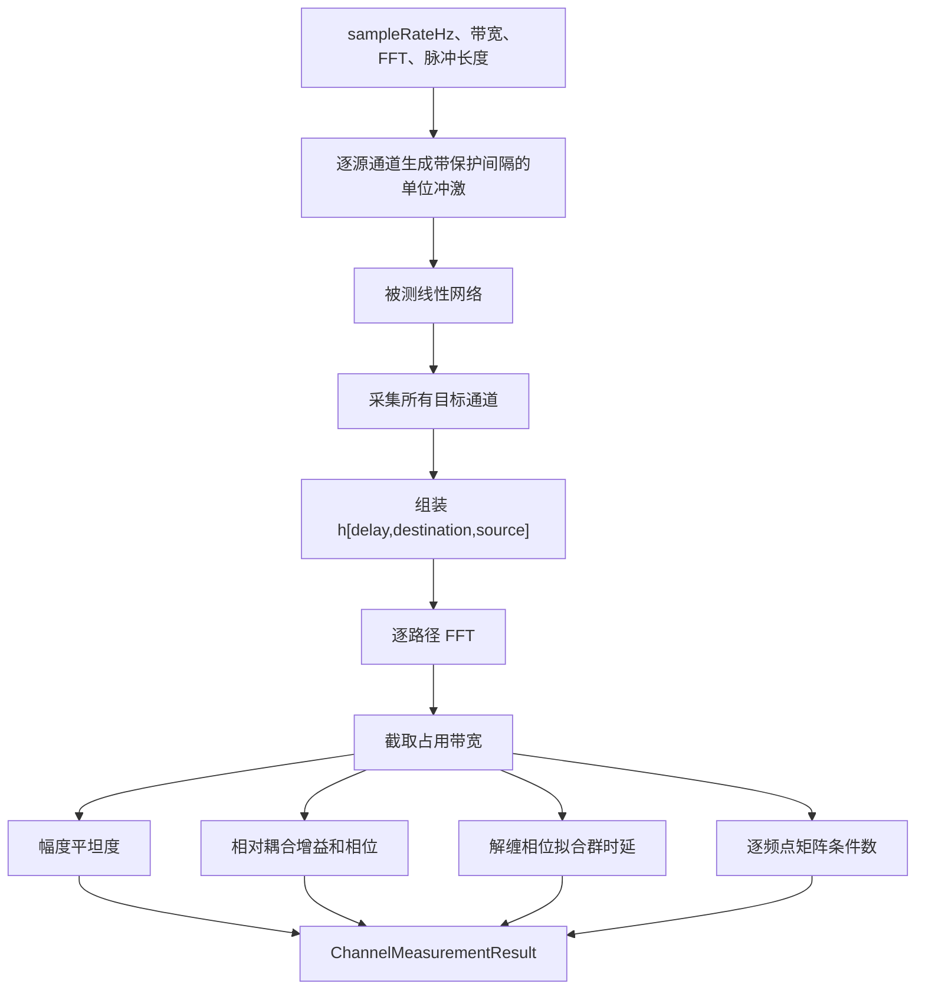
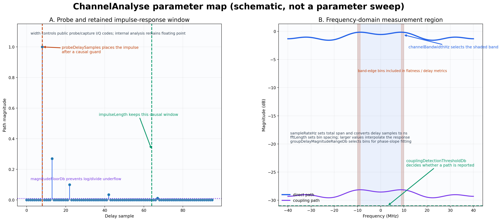
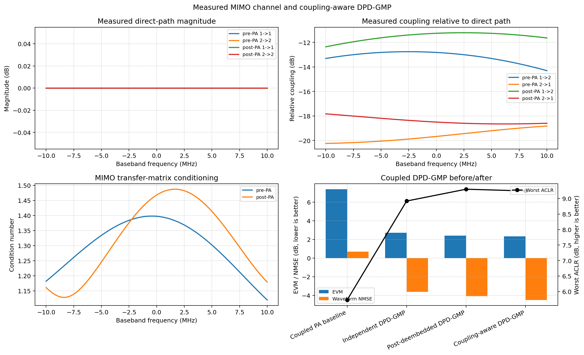

# Channel 特性测量、耦合辨识与耦合感知 DPD-GMP

本文说明 `inc/lib/ChannelAnalyse.py` 的测量原理、可测量边界、公式推导和使用方法，覆盖平坦度、耦合参数、群时延和矩阵条件数，并给出 `tests/BenchMark.py` 中双通道用例的构造、测量结果以及 DPD-GMP 修改前后的性能比较。

这里的 Channel Analyse 与 `Channel.py` 职责不同：

- `Channel.py` 是被测对象，负责模拟 PA 前耦合、不同 PA、PA 后耦合和 forward/fb 接收链路。
- `ChannelAnalyse.py` 是测量工具，只根据探测波形和采集结果估计线性通道特性。
- `DpdGmp.py` 中的 `CouplingAwareDpdGmp` 消费测量结果，完成训练目标去嵌入和实际补偿。
- `tests/BenchMark.py` 只构造场景、保存结果和验证预期，不在测试文件中重新实现物理模型。

## 1. 为什么 DPD 之前必须测量通道

两路发射系统不能简单写成两个互不相关的 SISO PA。设数字基带希望最终观测到的两路信号为

```math
\mathbf{x}(n)=
\begin{bmatrix}
x_0(n)\\
x_1(n)
\end{bmatrix}.
```

实际链路可写为

```math
\mathbf{u}(n)
=
\sum_{\ell=0}^{L_{\mathrm{pre}}-1}
\mathbf{H}_{\mathrm{pre}}(\ell)
\mathbf{z}(n-\ell),
```

```math
v_i(n)=F_i\{u_i(n)\},
```

```math
\mathbf{y}(n)
=
\sum_{\ell=0}^{L_{\mathrm{post}}-1}
\mathbf{H}_{\mathrm{post}}(\ell)
\mathbf{v}(n-\ell).
```

各符号含义如下：

- $\mathbf{z}(n)$ 是送到 DAC 或发射芯片接口的原始数字波形。
- $\mathbf{H}_{\mathrm{pre}}$ 是 PA 之前的耦合网络。
- $\mathbf{u}(n)$ 是各 PA 实际看到的输入。
- $F_i$ 是第 $i$ 路 PA 的非线性和记忆响应。
- $\mathbf{H}_{\mathrm{post}}$ 是 PA 之后的输出耦合网络。
- $\mathbf{y}(n)$ 是仪表、耦合器或接收端最终观测到的波形。

```mermaid
flowchart LR
    desired["最终目标 x"] --> postInverse["测得的 Hpost 逆"]
    postInverse --> paTargets["各 PA 输出目标 q"]
    paTargets --> dpd["逐 PA DPD-GMP"]
    dpd --> paInputs["期望 PA 输入 p"]
    paInputs --> preInverse["测得的 Hpre 逆"]
    preInverse --> dac["DAC 波形 z"]
    dac --> prePhysical["实际 Hpre"]
    prePhysical --> paBank["不同的非线性 PA"]
    paBank --> postPhysical["实际 Hpost"]
    postPhysical --> observed["观测输出 y"]
```



图示说明：`CouplingAwareDpdGmp` 中两个逆网络的位置不能交换。PA 后逆首先决定每个 PA 应该产生什么；逐路 DPD 再求出实现该 PA 输出所需的实际 PA 输入；PA 前逆最后把这个实际 PA 输入转换为 DAC 需要发送的波形。

如果忽略耦合而直接令

```math
z_i(n)=D_i\{x_i(n)\},
```

则 PA $i$ 实际收到的是本路 DPD 输出与其他路泄漏之和。DPD 训练时的输入分布和部署时的输入分布不一致，PA 后的串扰又会被错误地算成 PA 非线性，因此 EVM、NMSE 和残余串扰通常不能达到逐路 SISO 仿真的结果。

## 2. MIMO 通道的可测模型

### 2.1 冲激响应矩阵

线性时不变 MIMO 通道写成

```math
y_j(n)
=
\sum_{i=0}^{N_{\mathrm{ch}}-1}
\sum_{\ell=0}^{L-1}
h_{ji}(\ell)x_i(n-\ell).
```

$h_{ji}(\ell)$ 表示从源通道 $i$ 到观测通道 $j$ 的有向冲激响应。矩阵形式为

```math
\mathbf{H}(\ell)=
\begin{bmatrix}
h_{00}(\ell) & h_{01}(\ell)\\
h_{10}(\ell) & h_{11}(\ell)
\end{bmatrix}.
```

矩阵对角线是主通道，非对角线是通道间耦合。`ChannelMeasurementResult.impulseResponses` 的数组顺序固定为：

```text
delay × destinationChain × sourceChain
```

因此 `impulseResponses[l, j, i]` 就是 $h_{ji}(\ell)$。

### 2.2 为什么逐路探测

测量第 $i$ 个源通道时，只在该通道发送单位冲激：

```math
x_i(n)=\delta(n-n_0),
\qquad
x_k(n)=0,\quad k\ne i.
```

输出为

```math
y_j(n_0+\ell)=h_{ji}(\ell).
```

依次激励所有源通道，就能恢复完整矩阵。`probeDelaySamples` 在冲激前保留一段零样点，避免分数时延插值跨越采集记录左边界而损失能量。

在实际仪表中不一定要发送理想冲激。也可以发送互相正交的 PN 序列、多音或 OFDM 探测波形。对每个频点，最小二乘估计为

```math
\widehat{\mathbf{H}}(f)
=
\mathbf{Y}(f)\mathbf{X}^{H}(f)
\left[
\mathbf{X}(f)\mathbf{X}^{H}(f)
+\lambda\mathbf{I}
\right]^{-1}.
```

注意上式中的矩阵乘法顺序表示右侧正则化逆。工程上更稳定的等价写法是先求

```math
\mathbf{R}_{xx}(f)
=
\mathbf{X}(f)\mathbf{X}^{H}(f)
+\lambda\mathbf{I},
```

再解线性方程

```math
\widehat{\mathbf{H}}(f)\mathbf{R}_{xx}(f)
=
\mathbf{Y}(f)\mathbf{X}^{H}(f).
```

本工程的生产接口直接实现逐路冲激探测；如果仪表已经输出去卷积后的冲激响应矩阵，可把该矩阵交给 `AnalyzeImpulseResponses`，不需要再次生成探测信号。

## 3. 频率响应和平坦度

### 3.1 从冲激响应到频率响应

对每一条路径做离散傅里叶变换：

```math
H_{ji}(f_k)
=
\sum_{\ell=0}^{L-1}
h_{ji}(\ell)
\exp\left(
-j2\pi\frac{k\ell}{N_{\mathrm{FFT}}}
\right).
```

程序只在配置的占用带宽

```math
|f_k|\le \frac{B}{2}
```

内计算平坦度、群时延和矩阵条件数。带外频点不会混入带内指标。

### 3.2 幅度平坦度

路径幅度响应为

```math
A_{ji}(f)=20\log_{10}|H_{ji}(f)|.
```

带内平坦度定义为

```math
R_{ji}
=
\max_{|f|\le B/2} A_{ji}(f)
-
\min_{|f|\le B/2} A_{ji}(f).
```

单位为 dB，越接近 0 表示幅度越平坦。必须同时查看两种平坦度：

- `worstDirectFlatnessDb`：所有对角主路径中最差的平坦度。
- `worstDetectedPathFlatnessDb`：所有检测到的主路径和耦合路径中最差的平坦度。

当前测试场景的主路径被设置为理想直通，所以主路径平坦度为 0 dB；耦合路径包含 FIR，因此 PA 前和 PA 后的最差检测路径平坦度分别为 1.547 dB 和 1.148 dB。这不是公式异常，而是场景构造的物理含义。

### 3.3 耦合增益和相位

为了消除源通道公共增益，源 $i$ 到目标 $j$ 的相对耦合定义为

```math
C_{ji}(f)
=
\frac{H_{ji}(f)}{H_{ii}(f)},
\qquad j\ne i.
```

中心频点耦合增益为

```math
G_{ji,\mathrm{dB}}
=
20\log_{10}|C_{ji}(0)|,
```

耦合相位为

```math
\phi_{ji}
=
\arg C_{ji}(0).
```

例如 $-20$ dB 的耦合表示泄漏电压约为主路电压的

```math
10^{-20/20}=0.1.
```

功率则约为主路功率的 $0.1^2=0.01$，也就是 1%。

### 3.4 检测阈值

噪声底附近的非对角响应不能被当作真实耦合。程序用

```math
\max_{|f|\le B/2}20\log_{10}|C_{ji}(f)|
\ge T_{\mathrm{coupling}}
```

判断路径是否被检测到。默认阈值为 $-70$ dB。低于阈值的路径仍保留在频率响应矩阵中，但 `detected=False`，不会进入“最差已检测耦合”的汇总。

## 4. 相位、群时延和不同方向的时延

路径相位为

```math
\phi_{ji}(f)=\arg H_{ji}(f).
```

纯时延 $\tau$ 对应

```math
H(f)=a\exp(-j2\pi f\tau),
```

因此

```math
\phi(f)=\phi_0-2\pi f\tau.
```

群时延由相位斜率得到：

```math
\tau_g
=
-\frac{1}{2\pi}
\frac{\mathrm{d}\phi(f)}{\mathrm{d}f}.
```

程序先对相位解缠，再在幅度不低于路径峰值 `groupDelayMagnitudeRangeDb` 的频点上做直线拟合。输出同时给出：

```math
D_{\mathrm{sample}}=\tau_g f_s
```

和

```math
D_{\mathrm{ns}}=10^9\tau_g.
```

耦合 FIR 自身也有群时延，所以测得的群时延一般不等于配置的 `integerDelaySamples + fractionalDelaySamples`。例如一个两抽头 FIR 会额外改变相位斜率；测量结果反映的是整条路径的等效时延，正是 DPD 逆网络真正需要的量。

## 5. MIMO 条件数与能否安全求逆

对每个频点做奇异值分解：

```math
\mathbf{H}(f)
=
\mathbf{U}(f)
\mathbf{\Sigma}(f)
\mathbf{V}^{H}(f).
```

矩阵条件数为

```math
\kappa(f)
=
\frac{\sigma_{\max}(f)}
{\sigma_{\min}(f)}.
```

其物理意义是：

- $\kappa$ 接近 1：各空间方向都能稳定区分，逆补偿不会明显放大噪声。
- $\kappa$ 较大：某些通道组合接近线性相关，直接求逆会放大噪声、量化误差和测量误差。
- $\sigma_{\min}$ 接近 0：通道在该频点接近不可逆，必须增加正则化、限制逆增益、减小补偿带宽，或者改进射频隔离。

本工程保存带内条件数的中位值和最差值。正式用例的最差值为：

| 测量位置 | 中位条件数 | 最差条件数 |
|---|---:|---:|
| PA 前 | 1.319 | 1.398 |
| PA 后 | 1.335 | 1.487 |

这些值远离病态区，因此允许使用温和正则化的因果 MIMO 逆。

## 6. `ChannelAnalyse` 的因果测量流程



图示说明：所有指标来自同一份测得的冲激响应，避免平坦度、耦合和时延使用不同采集记录造成不一致。测量类不读取 `Channel.prePaCouplingPaths` 或 `Channel.postPaCouplingPaths` 的私有真值。

### 6.1 参数如何对应测量窗口和频域结果



这是一张测量口径示意图，不是参数遍历结果。左图说明探测脉冲、因果保护间隔和保留冲激响应窗口之间的关系；右图说明采样率、FFT、分析带宽、群时延拟合门限和耦合检测门限如何作用于同一份频率响应。

| 参数 | 图中的位置 | 增大参数时的主要影响 |
|---|---|---|
| `sampleRateHz` | 右图完整横轴 | 可表示的频率范围增大；每个样点代表的物理时间减小。它必须与真实采集率一致，否则 CFO、群时延和带宽都会得到错误物理单位 |
| `channelBandwidthHz` | 右图蓝色带内区域 | 纳入平坦度、耦合和条件数统计的频率范围变宽；带边纹波更可能进入结果 |
| `fftLength` | 右图频率网格 | 频率采样点更密、曲线显示和相位拟合更平滑；对固定长度冲激响应而言主要是零填充插值，不会创造新的测量信息 |
| `impulseLength` | 左图保留窗口 | 可以保留更长的因果记忆和回波；过短会截断真实路径，过长则会收入更多噪声 |
| `probeDelaySamples` | 左图探测脉冲之前的保护区 | 给因果处理器和采集触发留出更长前置保护；它不等于被测通道自身时延 |
| `couplingDetectionThresholdDb` | 右图非对角路径检测线 | 数值提高时，较弱耦合更容易被判为未检测；数值降低时可检出更弱路径，但更容易把噪声当作耦合 |
| `magnitudeFloorDb` | 左图数值地板 | 数值提高时，对极小幅值采用更高的数值下限，避免对数和相位计算失稳；它不抬高真实信号 |
| `groupDelayMagnitudeRangeDb` | 右图相位拟合有效点 | 数值增大时，会把距离路径峰值更远的低幅频点也纳入相位斜率拟合；覆盖更宽但更容易受噪声影响 |
| `width` | 测量类公开边界 | `0` 使用浮点物理幅值；正整数使用对应满量程整数 I/Q 码，内部分析仍在浮点域进行 |

右图两侧的橙色区域只是强调：当 `channelBandwidthHz` 扩大时，带边频点会逐渐进入指标统计。它们不是额外的配置参数，也不表示实现中存在隐藏的“带边裁剪点数”。

因此，参数调整应遵循“先确保单位正确，再扩大窗口”的顺序：

1. 先把 `sampleRateHz` 设置为仪表或仿真波形的真实采样率。
2. 再设置实际需要验收的 `channelBandwidthHz`。
3. 让 `probeDelaySamples` 覆盖触发和因果保护，让 `impulseLength` 覆盖可见回波。
4. 最后根据噪声底调整耦合检测门限和群时延拟合动态范围。

## 7. PA 前和 PA 后耦合如何分别测量

### 7.1 PA 前耦合

实验接线建议为：

1. PA 关闭或工作在不会产生明显非线性的低功率区。
2. 每次只激励一个 DAC/RF 输入。
3. 在各 PA 输入端使用已校准的低扰动耦合器采样。
4. 去除线缆和仪表通道自身的复增益后估计 $\mathbf{H}_{\mathrm{pre}}$。

如果不能在 PA 输入端观测，就无法仅凭最终输出唯一分离 PA 前耦合和 PA 非线性。此时只能辨识端到端模型，不能声称测到了独立的 $\mathbf{H}_{\mathrm{pre}}$。

### 7.2 PA 后耦合

PA 后测量需要获得每个 PA 自身输出与最终端口输出之间的关系。可以使用：

- PA 输出耦合器与最终端口同步采样；
- 校准过的开关矩阵逐路激励；
- 极低功率小信号工作点，使 PA 可近似为已知线性增益，再去嵌入 PA；
- 仿真中直接调用 `Channel.ApplyPostPaCoupling`。

只有端到端观测时，测得的是

```math
\mathbf{H}_{\mathrm{end}}(f)
\approx
\mathbf{H}_{\mathrm{post}}(f)
\mathbf{G}_{\mathrm{PA}}(f)
\mathbf{H}_{\mathrm{pre}}(f).
```

这个乘积一般不能唯一分解为三个矩阵。必须增加内部观测点、已知校准件或结构先验。

## 8. 通道耦合条件下 DPD-GMP 的完整方案与推导

本节把测得的通道参数真正连接到 DPD 的训练与部署。需要始终区分四个参考面：

| 符号 | 参考面 | 物理含义 |
|---|---|---|
| $\mathbf{z}(n)$ | DAC 输出 | 最终需要写入发射芯片或仪表的波形 |
| $\mathbf{u}(n)$ | PA 输入 | PA 前耦合网络作用后的实际驱动 |
| $\mathbf{v}(n)$ | PA 输出 | 各 PA 独立输出、尚未经过 PA 后耦合 |
| $\mathbf{y}(n)$ | 观测端 | 耦合器、仪表或接收端看到的最终波形 |

期望最终端口波形记为 $\mathbf{x}(n)$。完整物理链路为

```math
\mathbf{u}
=
\mathbf{H}_{\mathrm{pre}}\mathbf{z},
```

```math
\mathbf{v}
=
\mathbf{F}\{\mathbf{u}\},
```

```math
\mathbf{y}
=
\mathbf{H}_{\mathrm{post}}\mathbf{v}.
```

这里的矩阵乘法代表 MIMO FIR 卷积，不只是一个常数矩阵；$\mathbf{F}$ 是由各物理 PA 组成的非线性算子：

```math
\mathbf{F}\{\mathbf{u}\}
=
\begin{bmatrix}
F_0\{u_0\}\\
F_1\{u_1\}\\
\vdots\\
F_{N-1}\{u_{N-1}\}
\end{bmatrix}.
```

### 8.1 为什么逐路独立 DPD 会把耦合误认为 PA 失真

逐路独立方案直接令

```math
z_i(n)=D_i\{x_i(n)\}.
```

它隐含假设

```math
\mathbf{H}_{\mathrm{pre}}=\mathbf{I},
\qquad
\mathbf{H}_{\mathrm{post}}=\mathbf{I}.
```

实际第 $i$ 个 PA 的输入却是

```math
u_i(n)
=
\sum_j h_{\mathrm{pre},ij}(n)*z_j(n).
```

其中星号表示线性卷积。于是 PA $i$ 的输入不仅包含本通道 DPD 输出，还包含其他通道的调制波形。即使每个 PA 本身完全线性，最终误差中也会出现

```math
\mathbf{e}_{\mathrm{linear}}
=
\left(
\mathbf{H}_{\mathrm{post}}
\mathbf{H}_{\mathrm{pre}}
-
\mathbf{I}
\right)\mathbf{x}.
```

当 PA 非线性存在时，耦合分量还会进入 PA 的幂次项。例如三阶无记忆 PA

```math
v_i
=
a_{1,i}u_i
+
a_{3,i}u_i|u_i|^2
```

中的 $u_i$ 是多路波形之和。展开 $u_i|u_i|^2$ 后，会产生本通道三阶项、其他通道三阶项以及通道间交调项。独立 DPD 只观察最终端口误差时，会尝试用本路 GMP 系数吸收这些随其他通道数据变化的分量，因此训练系数对特定训练波形过拟合，换帧、换功率或换通道相关性后容易失效。

### 8.2 逆网络和非线性 DPD 为什么不能交换顺序

线性矩阵与非线性算子通常不满足交换律：

```math
\mathbf{D}
\left\{
\mathbf{H}^{-1}\mathbf{x}
\right\}
\ne
\mathbf{H}^{-1}
\mathbf{D}\{\mathbf{x}\}.
```

原因可以从三阶项直接看出。对两个通道，若

```math
r_0=x_0+c x_1,
```

则

```math
r_0|r_0|^2
=
(x_0+c x_1)
|x_0+c x_1|^2.
```

右侧包含 $x_0|x_1|^2$、$x_1|x_0|^2$ 和相位相关交叉项，而“先分别做非线性、再线性混合”不会自动产生完全相同的项。因此补偿顺序必须与物理参考面对应：

```mermaid
flowchart LR
    desired["最终目标 x"] --> postInverse["PA 后网络逆"]
    postInverse --> paTarget["逐 PA 输出目标 q"]
    paTarget --> gmp["逐 PA GMP 逆模型"]
    gmp --> paDrive["期望 PA 输入 p"]
    paDrive --> preInverse["PA 前网络逆"]
    preInverse --> dac["DAC 波形 z"]
    dac --> physicalPre["物理 PA 前耦合"]
    physicalPre --> pa["物理 PA"]
    pa --> physicalPost["物理 PA 后耦合"]
    physicalPost --> output["观测输出 y"]
```



图示说明：先用 PA 后逆决定“每个 PA 应该输出什么”，再用各 PA 的 GMP 逆决定“每个 PA 应该输入什么”，最后用 PA 前逆决定“DAC 应该发送什么”。任何调换都会把信号放到错误的参考面。

### 8.3 第一步：由最终目标推导逐 PA 输出目标

最终要求是

```math
\mathbf{y}\approx\mathbf{x}.
```

因为

```math
\mathbf{y}
=
\mathbf{H}_{\mathrm{post}}\mathbf{v},
```

所以各 PA 在后级耦合之前应产生

```math
\mathbf{q}
=
\mathbf{H}_{\mathrm{post}}^{-1}\mathbf{x}.
```

$\mathbf{q}$ 就是逐 PA 输出目标。它不是仪表最终看到的波形，也不是 DAC 波形。频率选择性耦合存在时，上式应逐频点理解为

```math
\mathbf{Q}(f)
=
\mathbf{H}_{\mathrm{post}}^{-1}(f)
\mathbf{X}(f),
```

工程实现则使用测得的因果冲激响应做正则化反卷积，避免 FFT 循环卷积。

PA 后去嵌入非常重要。若直接让 PA 0 学习最终端口目标 $x_0$，PA 0 的训练误差中会混入 PA 1 通过 $H_{\mathrm{post},01}$ 泄漏过来的分量。该分量与 PA 0 自己的逆模型无关，却会污染 PA 0 的 GMP 系数。

### 8.4 第二步：逐 PA 的 GMP 逆模型

对第 $i$ 个 PA，需要寻找输入 $p_i$，使

```math
F_i\{p_i\}\approx q_i.
```

本工程的 GMP 输入是 PA 输出目标 $q_i$，输出是所需 PA 输入 $p_i$。对奇数非线性阶集合 $\mathcal{P}$，GMP 写成三类基函数之和。

主分支为

```math
D_{i,\mathrm{main}}\{q_i(n)\}
=
\sum_{p\in\mathcal{P}}
\sum_{m=0}^{M-1}
a_{i,p,m}
q_i(n-m)
|q_i(n-m)|^{p-1}.
```

滞后包络交叉分支为

```math
D_{i,\mathrm{lag}}\{q_i(n)\}
=
\sum_{p\in\mathcal{P},\,p>1}
\sum_{m=0}^{M-1}
\sum_{r=1}^{R}
b_{i,p,m,r}
q_i(n-m)
|q_i(n-m-r)|^{p-1}.
```

超前包络交叉分支为

```math
D_{i,\mathrm{lead}}\{q_i(n)\}
=
\sum_{p\in\mathcal{P},\,p>1}
\sum_{m=0}^{M-1}
\sum_{r=1}^{R}
c_{i,p,m,r}
q_i(n-m-r)
|q_i(n-m)|^{p-1}.
```

总输出为

```math
p_i(n)
=
D_i\{q_i(n)\}
=
D_{i,\mathrm{main}}
+
D_{i,\mathrm{lag}}
+
D_{i,\mathrm{lead}}.
```

这三组基函数分别描述：

- 当前或过去复载波对自身包络的非线性响应；
- 当前载波受更早包络状态影响的热、偏置和电记忆；
- 较早载波受较新包络状态关联的等效交叉记忆。

### 8.5 GMP 训练标签如何生成

训练标签 $p_i^{\mathrm{label}}$ 必须位于 PA 输入参考面，并满足

```math
F_i\{p_i^{\mathrm{label}}\}
\approx
q_i.
```

标签可由 ILC、间接学习或经过同步的 PA 输入/输出实测得到。将所有 GMP 基函数按列排列成设计矩阵 $\mathbf{\Phi}_i$，则

```math
\mathbf{p}_i^{\mathrm{label}}
\approx
\mathbf{\Phi}_i\boldsymbol{\theta}_i.
```

带样本权重和恒等先验的岭回归目标为

```math
J_i(\boldsymbol{\theta}_i)
=
\left\|
\mathbf{W}_i^{1/2}
\left(
\mathbf{\Phi}_i\boldsymbol{\theta}_i
-
\mathbf{p}_i^{\mathrm{label}}
\right)
\right\|_2^2
+
\lambda
\left\|
\boldsymbol{\theta}_i
-
\boldsymbol{\theta}_{i,0}
\right\|_2^2.
```

令梯度为零，得到正规方程

```math
\left(
\mathbf{\Phi}_i^{H}
\mathbf{W}_i
\mathbf{\Phi}_i
+
\lambda\mathbf{I}
\right)
\widehat{\boldsymbol{\theta}}_i
=
\mathbf{\Phi}_i^{H}
\mathbf{W}_i
\mathbf{p}_i^{\mathrm{label}}
+
\lambda\boldsymbol{\theta}_{i,0}.
```

这里 $\boldsymbol{\theta}_{i,0}$ 只保留线性直通项，其他项为零。正则化可防止高阶、强相关 GMP 基函数导致系数爆炸。

如果 ILC 最终给出的是 DAC 参考面的标签 $\mathbf{z}^{\mathrm{label}}$，不能直接传给 `FitCoupledSegments`。应先映射到实际 PA 输入参考面：

```math
\mathbf{p}^{\mathrm{label}}
=
\mathbf{H}_{\mathrm{pre}}
\mathbf{z}^{\mathrm{label}}.
```

对应代码为：

```python
paInputLabels = coupledDpd.ApplyMeasuredResponse(
    ilcDacLabels,
    preMeasurement.impulseResponses,
)

trainingResult = coupledDpd.FitCoupledSegments(
    referenceSignals=[desiredPortWaveforms],
    paInputTargetSignals=[paInputLabels],
)
```

上例使用浮点归一化波形。定点公开接口下，应先按本工程定点约定解码到内部归一化值，再进行参考面转换。

### 8.6 第三步：由期望 PA 输入推导 DAC 波形

所有逐 PA GMP 输出组成

```math
\mathbf{p}(n)
=
\begin{bmatrix}
D_0\{q_0(n)\}\\
D_1\{q_1(n)\}\\
\vdots\\
D_{N-1}\{q_{N-1}(n)\}
\end{bmatrix}.
```

因为物理 PA 前网络满足

```math
\mathbf{u}
=
\mathbf{H}_{\mathrm{pre}}\mathbf{z},
```

所以 DAC 波形应为

```math
\mathbf{z}
=
\mathbf{H}_{\mathrm{pre}}^{-1}\mathbf{p}.
```

物理网络作用后

```math
\mathbf{u}
=
\mathbf{H}_{\mathrm{pre}}
\mathbf{H}_{\mathrm{pre}}^{-1}
\mathbf{p}
\approx
\mathbf{p}.
```

因此部署时各 PA 看到的输入仍与训练标签位于同一参考面。PA 前逆只在推理部署阶段作用于 GMP 输出，不应提前重复作用到 PA 输入标签上。

### 8.7 端到端补偿成立的推导

把三步串联：

```math
\mathbf{q}
=
\mathbf{H}_{\mathrm{post}}^{-1}\mathbf{x},
```

```math
\mathbf{p}
=
\mathbf{D}\{\mathbf{q}\},
```

```math
\mathbf{z}
=
\mathbf{H}_{\mathrm{pre}}^{-1}\mathbf{p}.
```

代回物理链路：

```math
\mathbf{y}
=
\mathbf{H}_{\mathrm{post}}
\mathbf{F}
\left\{
\mathbf{H}_{\mathrm{pre}}
\mathbf{H}_{\mathrm{pre}}^{-1}
\mathbf{D}
\left\{
\mathbf{H}_{\mathrm{post}}^{-1}
\mathbf{x}
\right\}
\right\}.
```

若两个线性逆在有效带宽内足够准确，并且

```math
\mathbf{F}\{\mathbf{D}\{\mathbf{q}\}\}
\approx
\mathbf{q},
```

则

```math
\mathbf{y}
\approx
\mathbf{H}_{\mathrm{post}}
\mathbf{q}
=
\mathbf{H}_{\mathrm{post}}
\mathbf{H}_{\mathrm{post}}^{-1}
\mathbf{x}
\approx
\mathbf{x}.
```

这就是当前 `CouplingAwareDpdGmp` 的核心物理闭环。它没有把线性耦合硬塞进 GMP，而是先把线性 MIMO 网络和逐 PA 非线性逆分解到正确参考面。

### 8.8 频率选择性耦合的正则化因果逆

对因果 MIMO FIR：

```math
\mathbf{y}(n)
=
\mathbf{H}(0)\mathbf{x}(n)
+
\sum_{\ell=1}^{L-1}
\mathbf{H}(\ell)\mathbf{x}(n-\ell).
```

已知过去输入后，当前输入可递推求得：

```math
\mathbf{x}(n)
=
\mathbf{H}_{\lambda}^{+}(0)
\left[
\mathbf{y}_{\mathrm{target}}(n)
-
\sum_{\ell=1}^{L-1}
\mathbf{H}(\ell)\mathbf{x}(n-\ell)
\right].
```

对零时延矩阵做奇异值分解：

```math
\mathbf{H}(0)
=
\mathbf{U}
\mathbf{\Sigma}
\mathbf{V}^{H}.
```

第 $r$ 个奇异方向的正则化逆增益为

```math
g_r
=
\min
\left(
\frac{\sigma_r}{\sigma_r^2+\lambda},
\;
10^{G_{\mathrm{max,dB}}/20}
\right).
```

因此

```math
\mathbf{H}_{\lambda}^{+}(0)
=
\mathbf{V}
\begin{bmatrix}
g_0 & 0 & \cdots\\
0 & g_1 & \cdots\\
\vdots & \vdots & \ddots
\end{bmatrix}
\mathbf{U}^{H}.
```

在第 $r$ 个奇异方向上，补偿后的线性增益为

```math
\rho_r
=
\sigma_r g_r.
```

理想逆要求 $\rho_r=1$。正则化或逆增益限幅会使 $\rho_r<1$，留下残余耦合，但同时避免将噪声、测量误差、DAC 量化误差和峰值放大到不可接受的程度。这是“残余耦合”和“数值稳定性”之间的主动权衡，不是算法计算错误。

例如默认 `maximumInverseGainDb=18` 时，任何奇异方向的逆幅度增益不会超过

```math
10^{18/20}\approx 7.94.
```

若测得的最小奇异值远小于 $1/7.94$，就不应期待完全消除该方向；应优先改善隔离度、缩小补偿带宽，或提高正则化并接受一定残差。

### 8.9 耦合路径时延如何进入 DPD 公式

前面的矩阵写法把时延包含在 $\mathbf{H}(\ell)$ 中，但为了观察它的物理影响，需要把每条耦合路径显式展开。设源通道 $j$ 到目标通道 $i$ 的 PA 前耦合路径具有：

- 复耦合系数 $c_{\mathrm{pre},ij}$；
- 整数时延 $d_{\mathrm{pre},ij}$ 个样点；
- 分数时延 $\delta_{\mathrm{pre},ij}$ 个样点；
- 路径自身的短 FIR $g_{\mathrm{pre},ij}(\ell)$。

则第 $i$ 个 PA 的实际输入为

```math
u_i(n)
=
h_{\mathrm{pre},ii}(n)*z_i(n)
+
\sum_{j\ne i}
c_{\mathrm{pre},ij}
\sum_{\ell}
g_{\mathrm{pre},ij}(\ell)
z_j
\left(
n-d_{\mathrm{pre},ij}-\delta_{\mathrm{pre},ij}-\ell
\right).
```

分数样点位置不是直接访问数组，而是由分数时延 FIR 插值得到。若只考虑一条纯延迟耦合路径，其频域响应为

```math
C_{ij}(f)
=
c_{ij}
\exp
\left(
-j2\pi f\tau_{ij}
\right),
```

其中

```math
\tau_{ij}
=
\frac{
d_{ij}+\delta_{ij}
}{
f_s
}.
```

因此耦合时延首先表现为线性相位斜率：

```math
\phi_{ij}(f)
=
\phi_{ij}(0)
-
2\pi f\tau_{ij}.
```

如果只在中心频点测量一个复耦合系数并做常数消除，在偏移中心 $\Delta f$ 的频点仍会留下相位误差

```math
\Delta\phi_{ij}
=
-2\pi\Delta f\tau_{ij}.
```

例如 $\tau_{ij}=10$ ns、信号带宽为 20 MHz，则在正负 10 MHz 带边处，相对中心频点的相位变化幅度为

```math
2\pi
\left(
10\times10^6
\right)
\left(
10\times10^{-9}
\right)
\approx
0.628
\ \mathrm{rad}
\approx
36^\circ.
```

两个带边之间的相位差约为 $72^\circ$。所以即使中心频点耦合消除得很好，使用常数矩阵也会在带边留下明显残差；必须使用包含时延抽头的 MIMO FIR。

#### 8.9.1 时延为什么会形成带内幅度起伏

当一路直达分量与一路延迟耦合分量在同一端口相加时，等效响应可写为

```math
H_{\mathrm{eq}}(f)
=
1
+
c
\exp
\left(
-j2\pi f\tau
\right).
```

其功率增益为

```math
|H_{\mathrm{eq}}(f)|^2
=
1
+
|c|^2
+
2|c|
\cos
\left(
2\pi f\tau-\phi_c
\right).
```

因此时延不仅影响相位，也会通过直达波与耦合波的相长、相消产生频率选择性起伏。时延越大，在给定带宽内余弦变化越快；耦合越强，起伏越明显。这正是通道测量必须同时输出平坦度、耦合相位和群时延的原因。

#### 8.9.2 PA 前时延耦合如何进入非线性项

考虑简化的双通道 PA 前耦合：

```math
u_0(n)
=
z_0(n)
+
c_{01}z_1(n-d_{01}).
```

令

```math
a=z_0(n),
\qquad
b=c_{01}z_1(n-d_{01}),
```

则三阶项可展开为

```math
u_0|u_0|^2
=
a|a|^2
+
b|b|^2
+
2a|b|^2
+
2b|a|^2
+
a^2b^*
+
a^*b^2.
```

其中每一个含 $b$ 的交叉项都带有邻路的延迟样点 $z_1(n-d_{01})$。这说明 PA 前耦合时延会产生“跨通道、跨时间”的非线性失真。单通道 GMP 只使用 $z_0$ 的历史包络，无法从任意独立的 $z_1$ 数据中预测这些项。

当前方案先用 $\mathbf{H}_{\mathrm{pre}}^{-1}$ 使物理 PA 输入恢复为训练时的 $\mathbf{p}$，从源头去除这些延迟邻路分量。若耦合通过负载牵引进入 PA 内部，线性预解耦后交叉项仍存在，则需要 8.13 节所述、包含邻路时延基函数的联合多输入 GMP。

#### 8.9.3 PA 后时延耦合如何影响最终误差

PA 后耦合发生在非线性之后。双通道例子为

```math
y_0(n)
=
v_0(n)
+
c_{\mathrm{post},01}
v_1(n-d_{\mathrm{post},01}).
```

若训练时错误地令 $v_0(n)\approx x_0(n)$，那么第二项会完整保留在最终误差中：

```math
e_0(n)
=
y_0(n)-x_0(n)
\approx
c_{\mathrm{post},01}
v_1(n-d_{\mathrm{post},01}).
```

正确做法是先求

```math
\mathbf{q}
=
\mathbf{H}_{\mathrm{post}}^{-1}\mathbf{x},
```

使各 PA 的输出目标提前包含对延迟泄漏的抵消量。由于该耦合位于 PA 之后且假定为线性，PA 后去嵌入不需要把它错误地建模成 PA 的非线性 GMP 项。

#### 8.9.4 双通道延迟耦合逆的显式递推

设 PA 前网络为

```math
\mathbf{H}_{\mathrm{pre}}(z)
=
\begin{bmatrix}
1 & c_{01}z^{-d_{01}}\\
c_{10}z^{-d_{10}} & 1
\end{bmatrix}.
```

要求物理 PA 输入等于 $\mathbf{p}$：

```math
\mathbf{H}_{\mathrm{pre}}(z)
\mathbf{z}(n)
=
\mathbf{p}(n).
```

逐路展开得到

```math
z_0(n)
=
p_0(n)
-
c_{01}z_1(n-d_{01}),
```

```math
z_1(n)
=
p_1(n)
-
c_{10}z_0(n-d_{10}).
```

这两个式子清楚表明：当前 DAC 样点需要减去其他通道在耦合时延之前发送的历史样点。继续代入会出现多次往返耦合项，例如

```math
c_{01}c_{10}
z_0
\left(
n-d_{01}-d_{10}
\right).
```

在变换域中，精确逆为

```math
\mathbf{H}_{\mathrm{pre}}^{-1}(z)
=
\frac{1}{
1-c_{01}c_{10}z^{-(d_{01}+d_{10})}
}
\begin{bmatrix}
1 & -c_{01}z^{-d_{01}}\\
-c_{10}z^{-d_{10}} & 1
\end{bmatrix}.
```

分母表示耦合在两个方向之间多次往返形成的无限因果序列。`InvertMeasuredResponse` 不显式生成无限长 IIR 系数，而是使用已经求出的历史输入逐样点递推，所以会自然包含这些往返项。

更一般地，程序实际执行

```math
\mathbf{z}(n)
=
\mathbf{H}_{\lambda}^{+}(0)
\left[
\mathbf{p}(n)
-
\sum_{\ell=1}^{L-1}
\mathbf{H}_{\mathrm{pre}}(\ell)
\mathbf{z}(n-\ell)
\right].
```

所有整数时延、分数时延 FIR 和路径频响都包含在 $\mathbf{H}_{\mathrm{pre}}(\ell)$ 中。PA 后目标去嵌入使用完全相同的递推，只是目标从 $\mathbf{p}$ 换成 $\mathbf{x}$，通道从 $\mathbf{H}_{\mathrm{pre}}$ 换成 $\mathbf{H}_{\mathrm{post}}$。

#### 8.9.5 一个带时延的两路样点例子

设

```math
u_0(n)=z_0(n)+0.2z_1(n-2),
```

```math
u_1(n)=z_1(n)+0.1z_0(n-1).
```

为了让 PA 输入目标为 $p_0(n)$ 和 $p_1(n)$，预解耦器计算

```math
z_0(n)=p_0(n)-0.2z_1(n-2),
```

```math
z_1(n)=p_1(n)-0.1z_0(n-1).
```

若 $n<0$ 的历史样点定义为零，则可以从帧首开始因果递推。代回物理网络：

```math
u_0(n)
=
p_0(n)
-
0.2z_1(n-2)
+
0.2z_1(n-2)
=
p_0(n),
```

```math
u_1(n)
=
p_1(n)
-
0.1z_0(n-1)
+
0.1z_0(n-1)
=
p_1(n).
```

这说明预解耦不是简单地在当前样点减去邻路，而是必须按照测得的每条有向时延，从正确的历史位置减去邻路分量。

实际采集时还必须保留各通道共同的绝对时间基准。若在测量后把每个接收通道分别平移到自己的峰值位置，会人为删除通道间相对时延，使构造出的 MIMO 逆在真实硬件上产生错误的抵消相位。

### 8.10 双通道可手算无记忆数值例子

为了直观看到各参考面的区别，考虑无记忆双通道耦合：

```math
\mathbf{H}_{\mathrm{pre}}
=
\begin{bmatrix}
1 & 0.10\\
0.20 & 1
\end{bmatrix},
\qquad
\mathbf{H}_{\mathrm{post}}
=
\begin{bmatrix}
1 & 0.15\\
0.08 & 1
\end{bmatrix}.
```

四条非对角路径分别约为 $-20.00$ dB、$-13.98$ dB、$-16.48$ dB 和 $-21.94$ dB。设最终目标样点为

```math
\mathbf{x}
=
\begin{bmatrix}
1\\
j0.5
\end{bmatrix}.
```

第一步，对 PA 后耦合去嵌入：

```math
\mathbf{H}_{\mathrm{post}}^{-1}
\approx
\begin{bmatrix}
1.0121 & -0.1518\\
-0.0810 & 1.0121
\end{bmatrix},
```

```math
\mathbf{q}
=
\mathbf{H}_{\mathrm{post}}^{-1}\mathbf{x}
\approx
\begin{bmatrix}
1.0121-j0.0759\\
-0.0810+j0.5061
\end{bmatrix}.
```

假设两个 PA 的简化模型为

```math
F_0\{u\}=u+0.08u|u|^2,
\qquad
F_1\{u\}=u+0.12u|u|^2.
```

使用一阶近似逆

```math
D_i\{q\}\approx q-\alpha_i q|q|^2
```

得到期望 PA 输入

```math
\mathbf{p}
\approx
\begin{bmatrix}
0.9287-j0.0697\\
-0.0784+j0.4901
\end{bmatrix}.
```

第二步，对 PA 前耦合预消除：

```math
\mathbf{H}_{\mathrm{pre}}^{-1}
\approx
\begin{bmatrix}
1.0204 & -0.1020\\
-0.2041 & 1.0204
\end{bmatrix},
```

```math
\mathbf{z}
=
\mathbf{H}_{\mathrm{pre}}^{-1}\mathbf{p}
\approx
\begin{bmatrix}
0.9557-j0.1211\\
-0.2696+j0.5143
\end{bmatrix}.
```

把 $\mathbf{z}$ 送入物理 PA 前网络，可恢复

```math
\mathbf{H}_{\mathrm{pre}}\mathbf{z}
\approx
\begin{bmatrix}
0.9287-j0.0697\\
-0.0784+j0.4901
\end{bmatrix}
=
\mathbf{p}.
```

再通过两个 PA 和 PA 后网络，得到

```math
\mathbf{y}_{\mathrm{aware}}
\approx
\begin{bmatrix}
0.9811+j0.0012\\
-0.0013+j0.4987
\end{bmatrix}.
```

因为这里只使用了三阶 PA 的一阶近似逆，仍有少量残差；使用训练后的完整 GMP 会继续降低该残差。

若忽略耦合，各路只对自己的目标做独立三阶逆，并把结果直接送入 DAC，同一个样点约得到

```math
\mathbf{y}_{\mathrm{independent}}
\approx
\begin{bmatrix}
1.0110+j0.1269\\
0.2685+j0.5048
\end{bmatrix}.
```

对这个单样点向量，归一化误差对比如下：

| 方案 | 归一化误差 | 误差 dB | 主要原因 |
|---|---:|---:|---|
| 独立 DPD | 26.59% | -11.51 dB | PA 前串扰进入非线性，PA 后串扰直接叠加 |
| 耦合感知 DPD | 1.71% | -35.36 dB | 仅剩近似 PA 逆和数值舍入残差 |

该例子不是完整 OFDM EVM 测量，只用于展示矩阵去嵌入、GMP 逆和预解耦各自解决什么问题。正式 EVM、ACLR 和 NMSE 必须对完整波形、等输出功率和相同分析配置进行比较。

### 8.11 与当前类接口对应的完整训练和部署例子

下面假设 `preMeasurement` 和 `postMeasurement` 已由 `ChannelAnalyse.Measure` 得到，`desiredPortWaveforms` 是形状为“样点数 × 通道数”的最终端口目标，`ilcDacLabels` 是多通道 ILC 在 DAC 参考面学到的波形。

```python
from inc.lib.DpdGmp import CouplingAwareDpdGmp, DpdGmp

dpdModels = [
    DpdGmp(
        parameters={
            "nonlinearOrders": (1, 3, 5, 7),
            "memoryDepth": 4,
            "crossMemoryDepth": 3,
            "ridgeFactor": 3.0e-5,
            "width": 0,
        }
    )
    for _ in range(2)
]

coupledDpd = CouplingAwareDpdGmp(
    dpdModels=dpdModels,
    preChannelMeasurement=preMeasurement,
    postChannelMeasurement=postMeasurement,
    parameters={
        "inverseRegularization": 1.0e-8,
        "maximumInverseGainDb": 18.0,
        "width": 0,
    },
)

# Convert DAC-reference ILC labels to the actual PA-input reference plane.
paInputLabels = coupledDpd.ApplyMeasuredResponse(
    ilcDacLabels,
    preMeasurement.impulseResponses,
)

trainingResult = coupledDpd.FitCoupledSegments(
    referenceSignals=[desiredPortWaveforms],
    paInputTargetSignals=[paInputLabels],
)

# The returned matrix is the waveform that must be sent to the DAC channels.
dacWaveforms = coupledDpd.Process(desiredPortWaveforms)
```

如果已有标签就是在每个 PA 输入耦合器处采集并同步后的波形，则不需要再次调用 `ApplyMeasuredResponse`，可以直接作为 `paInputTargetSignals`。

训练与部署时必须保持以下一致：

1. 通道顺序与 `impulseResponses[:, destination, source]` 的索引一致。
2. `dpdModels[i]` 对应物理 PA $i$。
3. 训练标签位于 PA 输入参考面，而训练参考经过 PA 后去嵌入后位于 PA 输出参考面。
4. 功率、采样率、带宽、时延和定点缩放约定一致。
5. 测量矩阵更新后重新验证，明显漂移时重新训练或更新系数。

### 8.12 如何根据测量结果选择补偿强度

下表给出工程起始建议，不是所有硬件都必须遵守的固定门限：

| 测量现象 | 风险 | 建议 |
|---|---|---|
| 耦合低于约 -30 dB，条件数接近 1 | 独立 DPD 可能已足够 | 先做独立 DPD 基线，再决定是否启用矩阵逆 |
| 耦合约 -30 dB 到 -15 dB | EVM、NMSE 和波束隔离开始可见受限 | 启用 PA 后去嵌入和 PA 前预解耦 |
| 耦合高于约 -15 dB | PA 输入分布明显改变，逆网络峰值可能升高 | 做多功率训练，限制逆增益并检查 PAPR/削顶 |
| 带内平坦度较差或群时延差明显 | 常数耦合矩阵不足 | 使用完整 MIMO FIR，不要只用中心频点复系数 |
| 最坏条件数明显增大 | 求逆放大噪声和量化误差 | 增大 `inverseRegularization`，降低 `maximumInverseGainDb` |
| 耦合随输出功率明显变化 | 网络或 PA 存在工作点依赖 | 建立多功率测量与系数库，或做在线跟踪 |
| 去除线性耦合后仍有与其他通道包络相关的残差 | 存在非线性交叉耦合 | 升级为联合多输入 GMP |

验收时至少同时检查：

- 每路 EVM 和 NMSE；
- 每路 ACLR；
- 残余交叉投影或通道隔离；
- DAC 和 PA 输入峰值；
- 不同功率、不同帧和不同通道相关性下的稳健性。

只看某一路 EVM 可能掩盖“本路变好但对邻路泄漏更强”的问题。

### 8.13 什么时候需要升级为联合非线性 MIMO GMP

当前 `CouplingAwareDpdGmp` 的适用前提是：

- PA 前和 PA 后耦合是可测的线性时不变网络；
- 去除线性耦合后，各 PA 的非线性可以独立建模；
- 耦合不会通过负载牵引改变 PA 本身的非线性系数。

如果天线失配、负载调制或强反馈使

```math
v_i(n)
=
F_i\{u_0(n),u_1(n),\ldots\},
```

则第 $i$ 路 PA 输出直接依赖其他通道。联合多输入 GMP 可加入三类跨通道项：

```math
u_i(n-m)|u_j(n-r)|^{p-1},
```

```math
u_j(n-m)|u_i(n-r)|^{p-1},
```

```math
u_j(n-m)|u_k(n-r)|^{p-1},
\qquad i\ne j.
```

将本路和跨路基函数拼成联合设计矩阵

```math
\mathbf{\Phi}_{i,\mathrm{joint}}
=
\begin{bmatrix}
\mathbf{\Phi}_{i,\mathrm{self}}
&
\mathbf{\Phi}_{i,\mathrm{cross}}
\end{bmatrix},
```

再用正则化最小二乘联合求解。为了避免系数数量按通道数、阶数和记忆深度快速膨胀，应根据测得的耦合方向和强度只保留显著路径，并用验证集检查跨通道项是否真正改善 EVM、ACLR 和残余耦合。

当前工程实现的是“测得线性 MIMO 网络 + 独立非线性 PA”的分解方案，尚未把上述联合非线性跨通道基函数加入 `DpdGmp`。如果线性去嵌入后残差仍明显依赖邻路包络，应将其识别为模型边界，而不是盲目继续增加单通道 GMP 阶数。

## 9. 类参数和方法

### 9.1 `ChannelAnalyse` 参数

| 参数 | 默认值 | 含义 |
|---|---:|---|
| `sampleRateHz` | `80e6` | 复基带采样率 |
| `channelBandwidthHz` | `20e6` | 计算指标的占用带宽 |
| `fftLength` | `2048` | 频率响应 FFT 长度 |
| `impulseLength` | `64` | 保留的因果冲激响应样点数 |
| `probeDelaySamples` | `8` | 探测冲激前的零保护样点 |
| `couplingDetectionThresholdDb` | `-70.0` | 非对角路径检测阈值 |
| `magnitudeFloorDb` | `-180.0` | 除法和对数使用的幅度下限 |
| `groupDelayMagnitudeRangeDb` | `35.0` | 相对路径峰值的群时延拟合范围 |
| `width` | `16` | `0` 为浮点；大于 0 为公开定点 I/Q 码位宽 |

未知参数会发出警告并被忽略；可识别参数继续运行。

### 9.2 `ChannelAnalyse` 方法

| 方法 | 作用 |
|---|---|
| `GetParameters()` | 返回全部有效参数字典 |
| `UpdateParameters(**overrides)` | 事务式更新参数 |
| `BuildImpulseProbe(chainCount, sourceChain)` | 生成单源宽带冲激 |
| `Measure(channelProcessor, chainCount, stageName)` | 主动探测并返回完整测量结果 |
| `AnalyzeImpulseResponses(impulseResponses, stageName)` | 分析已有冲激响应矩阵 |
| `ProtectMagnitude(inputSignal)` | 对复响应施加安全幅度下限 |
| `MeasurePath(...)` | 计算一条有向路径的增益、相位、平坦度和群时延 |

### 9.3 `CouplingAwareDpdGmp` 参数

| 参数 | 默认值 | 含义 |
|---|---:|---|
| `compensatePrePaCoupling` | `True` | 是否对 DAC 波形做 PA 前耦合逆 |
| `compensatePostPaCoupling` | `True` | 是否对最终目标做 PA 后去嵌入 |
| `inverseRegularization` | `1e-8` | 零时延矩阵逆的岭正则 |
| `maximumInverseGainDb` | `18.0` | 最大逆奇异值增益 |
| `impulseTruncationDb` | `-100.0` | 删除尾部无效冲激抽头的相对门限 |
| `width` | `16` | MIMO 公开接口 I/Q 位宽 |

### 9.4 `CouplingAwareDpdGmp` 关键方法

| 方法 | 作用 |
|---|---|
| `ConfigureChannelMeasurements(pre, post)` | 更新 PA 前/后测量结果 |
| `BuildPaOutputTargets(referenceSignal)` | 用 PA 后逆生成逐 PA 输出目标 |
| `FitCoupledSegments(references, labels, ...)` | 用去嵌入目标和 PA 输入标签训练各路 GMP |
| `BuildDacInput(predistortedPaInput)` | 用 PA 前逆生成实际 DAC 波形 |
| `Process(inputSignal)` | 保持浮点/定点公开约定的完整补偿 |
| `ProcessFloating(inputSignal)` | 内部浮点完整补偿 |
| `ApplyMeasuredResponse(inputSignal, h)` | 对调试波形施加测得的 MIMO FIR |
| `InvertMeasuredResponse(targetSignal, h)` | 正则化因果 MIMO 反卷积 |

## 10. 典型使用方式

### 10.1 测量仿真 Channel 的 PA 前和 PA 后网络

```python
from inc.lib.Channel import Channel
from inc.lib.ChannelAnalyse import ChannelAnalyse

channel = Channel(
    parameters={
        "prePaCouplingPaths": (
            {
                "sourceChain": 0,
                "destinationChain": 1,
                "gainDb": -20.0,
                "phaseDegrees": 30.0,
                "integerDelaySamples": 2,
            },
        ),
        "postPaCouplingPaths": (
            {
                "sourceChain": 1,
                "destinationChain": 0,
                "gainDb": -18.0,
                "phaseDegrees": -40.0,
                "integerDelaySamples": 1,
            },
        ),
        "width": 0,
    }
)

channelAnalyzer = ChannelAnalyse(
    parameters={
        "sampleRateHz": 80.0e6,
        "channelBandwidthHz": 20.0e6,
        "fftLength": 2048,
        "impulseLength": 64,
        "width": 0,
    }
)

preMeasurement = channelAnalyzer.Measure(
    channel.ApplyPrePaCoupling,
    chainCount=2,
    stageName="pre-PA",
)
postMeasurement = channelAnalyzer.Measure(
    channel.ApplyPostPaCoupling,
    chainCount=2,
    stageName="post-PA",
)

coupling01 = preMeasurement.GetPath(
    sourceChain=0,
    destinationChain=1,
)
print(coupling01.ToDict())
print(preMeasurement.ToDict())
```

这里调用的是 `Channel` 的内部浮点线性网络，所以 `ChannelAnalyse.width` 也配置为 0。测量公开定点硬件接口时，应把分析器 `width` 配置为对应位宽。

### 10.2 分析仪表已经恢复的冲激响应

```python
import numpy as np

from inc.lib.ChannelAnalyse import ChannelAnalyse

# Shape: delay x destination x source.
measuredImpulseResponses = np.zeros(
    (64, 2, 2),
    dtype=np.complex128,
)
measuredImpulseResponses[0] = np.eye(2)
measuredImpulseResponses[2, 1, 0] = (
    10.0 ** (-20.0 / 20.0)
    * np.exp(1j * np.deg2rad(30.0))
)

result = ChannelAnalyse(
    parameters={
        "sampleRateHz": 80.0e6,
        "channelBandwidthHz": 20.0e6,
        "width": 0,
    }
).AnalyzeImpulseResponses(
    measuredImpulseResponses,
    stageName="fixture-deembedded capture",
)

print(result.GetPath(0, 1).gainDb)
print(result.GetPath(0, 1).groupDelayNs)
```

### 10.3 构造耦合感知 DPD-GMP

```python
from inc.lib.DpdGmp import CouplingAwareDpdGmp, DpdGmp

dpdModels = (
    DpdGmp(parameters={"width": 0}),
    DpdGmp(parameters={"width": 0}),
)

coupledDpd = CouplingAwareDpdGmp(
    dpdModels,
    preChannelMeasurement=preMeasurement,
    postChannelMeasurement=postMeasurement,
    parameters={
        "inverseRegularization": 1.0e-8,
        "maximumInverseGainDb": 18.0,
        "width": 0,
    },
)

# finalReferences contains desired final port outputs.
# paInputLabels contains ILC-learned actual inputs at the two PA ports.
trainingResult = coupledDpd.FitCoupledSegments(
    referenceSignals=(finalReferences,),
    paInputTargetSignals=(paInputLabels,),
)

rawDacWaveform = coupledDpd.Process(finalReferences)
measuredChOut, measuredFbOut = channel.ProcessOutputPathsFloating(
    rawDacWaveform
)

print(trainingResult.ToDict())
```

关键点：`paInputLabels` 必须是 PA 前耦合之后、各 PA 端实际需要的输入标签。`CouplingAwareDpdGmp` 会在部署阶段自动反解 PA 前网络，用户不应提前手工再反解一次。

## 11. Benchmark 场景构造

运行：

```powershell
python tests/BenchMark.py --channel-analyse `
    --sample-rate-hz 80000000 `
    --bandwidth 20 `
    --output-dir results/channel_analysis
```

独立 Python 调用：

```python
from pathlib import Path

from tests.BenchMark import (
    ChannelAnalysisBenchmarkConfig,
    RunChannelAnalysisBenchmark,
)

result = RunChannelAnalysisBenchmark(
    ChannelAnalysisBenchmarkConfig(
        sampleRateHz=80.0e6,
        outputPowerDbm=13.0,
        outputDirectory=Path("results/channel_analysis"),
    )
)
```

### 11.1 控制变量

| 类别 | 配置 |
|---|---|
| 信号 | 两路独立 seed 的 EHT、20 MHz、MCS 7 Wi-Fi |
| 采样率 | 80 MHz |
| PA | 第 1 路 GMP，第 2 路 Wiener |
| 目标输出功率 | 每路 13 dBm |
| PA 前耦合 | 双向、不对称、不同整数/分数时延和 FIR |
| PA 后耦合 | 双向、不对称、不同整数/分数时延和 FIR |
| 噪声 | 关闭 |
| 反馈非理想 | 关闭 |
| DPD 结构 | 1/3/5/7 阶、主记忆深度 4、交叉记忆深度 3 |
| 训练标签 | 每个 PA 独立运行频域 ILC |

关闭噪声和反馈非理想是为了控制变量，使修改前后的差异只来自通道测量和耦合感知补偿。

实际启用反馈非理想时，Channel必须显式设置 `sampleMode="fb"`，耦合感知DPD的训练矩阵和MSE再取每次双输出plant调用的 `fbOut`，而不是使用默认forward副本绕过板载反馈链；最终EVM、SNR、ACLR、IRR、功率和残余耦合验收则使用同次 `chOut`。两项共享相同的跨通道耦合、PA记忆和热状态，fb模式的第二项从无前向噪声的公共PA后节点进入反馈接收机。这里的 `outputPowerDbm` 仍是PA后耦合前的逐PA干净物理输出目标，不是含FB耦合器增益和接收机失真的raw `fbOut` 表观功率。

### 11.2 测试阶段

| 阶段 | 训练目标 | PA 后去嵌入 | PA 前预消除 |
|---|---|---:|---:|
| Coupled PA baseline | 无 DPD | 否 | 否 |
| Independent DPD-GMP | 每路原始最终参考 | 否 | 否 |
| Post-deembedded DPD-GMP | 测得的逐 PA 输出目标 | 是 | 否 |
| Coupling-aware DPD-GMP | 测得的逐 PA 输出目标 | 是 | 是 |

这个分阶段设计能区分“修改训练目标”的收益和“修改部署 DAC 波形”的收益。

## 12. 仿真测量结果

### 12.1 通道参数

| 位置 | 路径 | 中心增益 | 中心相位 | 带内平坦度 | 等效群时延 |
|---|---|---:|---:|---:|---:|
| PA 前 | 1→1 | 0.000 dB | 0.000° | 0.000 dB | 0.000 ns |
| PA 前 | 1→2 | -12.818 dB | 29.644° | 1.547 dB | 30.787 ns |
| PA 前 | 2→1 | -19.672 dB | -35.737° | 1.419 dB | 7.719 ns |
| PA 前 | 2→2 | 0.000 dB | 0.000° | 0.000 dB | 0.000 ns |
| PA 后 | 1→1 | 0.000 dB | 0.000° | 0.000 dB | 0.000 ns |
| PA 后 | 1→2 | -11.254 dB | -21.248° | 1.148 dB | 16.524 ns |
| PA 后 | 2→1 | -18.499 dB | 51.594° | 0.823 dB | 34.183 ns |
| PA 后 | 2→2 | 0.000 dB | 0.000° | 0.000 dB | 0.000 ns |

配置中的路径增益是在 FIR 和分数时延之前定义的系数；表格是完整路径在中心频点的实测结果，因此二者不应被强行设为相同。完整路径结果才应进入 DPD。

### 12.2 修改前后性能比较

| 阶段 | EVM | 波形 NMSE | 最差 ACLR | 残余耦合 |
|---|---:|---:|---:|---:|
| Coupled PA baseline | -5.793 dB | -7.863 dB | 19.923 dB | -8.992 dB |
| Independent DPD-GMP | -5.678 dB | -8.144 dB | 20.707 dB | -8.623 dB |
| Post-deembedded DPD-GMP | -9.913 dB | -11.051 dB | 19.745 dB | -15.399 dB |
| Coupling-aware DPD-GMP | -15.939 dB | -14.460 dB | 19.876 dB | -25.102 dB |

EVM、波形 NMSE 和残余耦合均为越负越好，ACLR 为越大越好。相对 Independent DPD-GMP，完整耦合感知方案得到：

| 目标指标 | 有符号变化或改善量 | 预期 | 结果 |
|---|---:|---|---|
| EVM | 改善 10.261 dB | 必须降低 | PASS |
| 波形 NMSE | 改善 6.316 dB | 必须降低 | PASS |
| 残余耦合 | 改善 16.479 dB | 必须降低 | PASS |
| 最差 ACLR | 变化 -0.831 dB | 退化不得超过 1.0 dB | PASS，退化 0.831 dB |

该场景故意同时使用较强双向耦合、不同 PA、频率选择性和高 PAPR Wi-Fi，因此绝对 EVM 是压力测试结果，不能当作 802.11 产品验收门限。此处验证的是同一个物理场景、同一个功率和同一组参考下，测量驱动修改是否严格改善 EVM、NMSE 和残余耦合，同时不让 ACLR 出现超过 1.0 dB 的明显退化。

ACLR 的定义是：

```math
\mathrm{ACLR}
=
10\log_{10}\left(\frac{P_{\mathrm{main}}}{P_{\mathrm{adj}}}\right)
=
-10\log_{10}\left(\frac{P_{\mathrm{adj}}}{P_{\mathrm{main}}}\right).
```

Independent 阶段未消除同带通道耦合。对第 $i$ 个接收端口，其主信道功率近似为：

```math
P_{\mathrm{main,ind},i}
=
\mathrm{E}_{B}\left\{
\left|s_i+c_{ji}s_j\right|^2
\right\}.
```

两路独立 seed 使交叉项在足够长的统计窗口内趋近于零，但未消除的 $|c_{ji}s_j|^2$ 仍会抬高主信道参考功率，也就是泄漏比 $P_{\mathrm{adj}}/P_{\mathrm{main}}$ 的分母。Coupling-aware 阶段去掉这部分同带泄漏后，$P_{\mathrm{main}}$ 更接近真正的目标链功率，因此 ACLR 数字可能轻微下降；这不能直接解释为绝对邻道辐射增加。当前结果从 20.707 dB 降至 19.876 dB，变化为 -0.831 dB，所以应如实写成“轻微退化但在 1.0 dB 护栏内通过”，不能称为 ACLR 改善。实际硬件验收还应同时记录邻道绝对功率 dBm 或相对预期目标链功率归一化后的泄漏值。



图像说明：

- 左上图显示主路径幅度；本场景主路径为理想直通，所以四条线重合在 0 dB。
- 右上图显示耦合相对各源主路径的频率响应；曲线斜率和弯曲来自 FIR 与不同分数时延。
- 左下图显示 PA 前和 PA 后 MIMO 矩阵的带内条件数；均低于 1.5，逆补偿稳定。
- 右下图比较无 DPD、独立 DPD、仅 PA 后去嵌入和完整耦合感知 DPD；完整方案得到最低 EVM/NMSE。黑色 ACLR 曲线从 Independent 的 20.707 dB 降至 Coupling-aware 的 19.876 dB，明确表示 0.831 dB 的轻微退化，而不是改善；该变化仍小于 1.0 dB 验收护栏。

## 13. 输出文件

通道基准生成：

| 文件 | 内容 |
|---|---|
| `channel_analysis.json` | 配置、测量汇总、训练诊断、阶段和预期检查 |
| `channel_path_measurements.csv` | 每条有向路径的增益、相位、平坦度和时延 |
| `channel_frequency_response.csv` | 每个带内频点的复响应幅相 |
| `channel_dpd_comparison.csv` | 四个 DPD 阶段的性能 |
| `channel_dpd_improvements.csv` | Independent 与 Coupling-aware 的有符号变化、验收方向和 PASS/FAIL |
| `channel_analysis.png` | 通道和 DPD 性能四联图 |

仓库参考结果位于 `doc/images/channel_analyse/`。

## 14. 测量误差和工程建议

### 14.1 噪声

冲激探测峰值不能超过接收机或耦合器线性范围，同时要高于噪声底。实际测量建议重复 $K$ 次做相干平均：

```math
\widehat{h}_{ji}(\ell)
=
\frac{1}{K}
\sum_{r=1}^{K}
\widehat{h}_{ji}^{(r)}(\ell).
```

独立白噪声幅度标准差大约按 $1/\sqrt{K}$ 下降。

### 14.2 CFO 和采样频偏

多次或长序列测量前必须先补偿 CFO/SFO，否则相位随时间漂移会被误判为通道相位和群时延。可复用 `SigProc` 做整数/分数时延、CFO、SFO 和复增益补偿。

### 14.3 测量参考面

PA 前、PA 后和仪表端的线缆、衰减器、耦合器必须去嵌入到一致参考面。否则 DPD 会补偿测试夹具，而不是产品中的实际网络。

### 14.4 时变耦合

温度、天线驻波、开关状态或用户握持会改变耦合。建议：

- 保存条件数和主要耦合路径的基线；
- 当中心耦合或群时延变化超过门限时重新测量；
- 使用 `UpdateParameters` 或 `ConfigureChannelMeasurements` 更新，而不是沿用旧逆；
- 对快速变化场景采用分段或在线系数更新，并限制逆增益。

### 14.5 接受标准

建议至少同时检查：

1. 所有主路径和主要耦合路径的平坦度。
2. 每个方向的中心耦合增益、相位和群时延。
3. 全带宽最差条件数。
4. 逆补偿后的 DAC 峰值与定点饱和率。
5. Independent 与 Coupling-aware 在同功率下的 EVM、NMSE、ACLR 和残余耦合。
6. 使用独立验证帧和未参与训练的功率点复测，避免只记住训练波形。

## 15. 如何检测通道中存在 IQ 不平衡

### 15.1 普通通道模型为什么不够

普通复基带 MIMO 通道只含直接项：

```math
\mathbf{y}[n]
=
\sum_{\ell}
\mathbf{H}_{d}[\ell]\mathbf{x}[n-\ell].
```

IQ 不平衡会增加共轭项：

```math
\mathbf{y}[n]
=
\sum_{\ell}
\mathbf{H}_{d}[\ell]\mathbf{x}[n-\ell]
+
\sum_{\ell}
\mathbf{H}_{i}[\ell]\mathbf{x}^*[n-\ell].
```

$\mathbf{H}_{d}$ 是直接通道矩阵，$\mathbf{H}_{i}$ 是镜像通道矩阵。$\mathbf{H}_{i}$ 的对角元素表示每路自身 IQ 镜像，非对角元素表示“其他通道的共轭镜像”耦合到当前接收链。

频域形式为

```math
\mathbf{Y}(f)
=
\mathbf{H}_{d}(f)\mathbf{X}(f)
+
\mathbf{H}_{i}(f)\mathbf{X}^*(-f).
```

关键现象是频率翻转：直接项把 $f$ 处激励映射到 $f$，镜像项把 $-f$ 处激励的共轭映射到 $f$。因此只测普通 $\mathbf{Y}(f)/\mathbf{X}(f)$ 会把镜像混入噪声或频响误差。

### 15.2 推荐检测步骤

1. 在每个发射通道发送独立的 proper complex 宽带探测信号，其他通道静默。
2. 按现有 `ChannelAnalyse` 流程先估计整数/分数时延、CFO、SFO 和公共复增益。
3. 在有效数据区联合拟合 $x$ 与 $x^*$，得到直接系数 $\hat a$ 和镜像系数 $\hat b$。
4. 计算 `Analysis.Analyze()` 返回的 `irrDb`。
5. 改变输出功率、中心频率和温度重复测量，判断镜像是固定、频率选择性还是功率相关。
6. 用已知 `irrDb` 足够负的信号直通接收机，单独测量反馈接收机的镜像地板。

对单路时域记录，代码对应的回归为

```math
\begin{bmatrix}
\hat a \\
\hat b
\end{bmatrix}
=
\left(
\mathbf{A}^H\mathbf{A}
+
\lambda\mathbf{I}
\right)^{-1}
\mathbf{A}^H\mathbf{y},
```

```math
\mathbf{A}
=
\begin{bmatrix}
\mathbf{x} & \mathbf{x}^*
\end{bmatrix}.
```

若要得到随频率变化的 $\mathbf{H}_{i}(f)$，应把带宽分成多个子带，或用正负频率独立的多次探测建立同样的局部广义线性回归。单个实双音不适合独立估计，因为实信号满足 $x=x^*$，直接列与共轭列完全重合。

### 15.3 如何区分发射端 IQ 不平衡与反馈接收机 IQ 不平衡

工程中应固定两个独立参考面：公开 `Channel.Process` 或内部 `ProcessOutputPathsFloating` 从同一次PA/热状态同时返回 `chOut` 与 `fbOut`。前者测量真实发射主路；只有显式 `sampleMode="fb"` 时，后者才包含板载反馈接收机，默认forward模式下两项完全相同。对应Channel参数不能混用：

| 物理模块 | Channel参数 | forward可见 | fb可见 | 是否允许DPD补偿 |
|---|---|---:|---:|---|
| Tx I/Q调制器 | `txIqGainImbalanceDb`、`txIqPhaseImbalanceDegrees`、`txDcOffset` | 是 | 是 | 可以，但需要增广模型 |
| FB I/Q解调器 | `fbIqGainImbalanceDb`、`fbIqPhaseImbalanceDegrees`、`fbDcOffset` | 否 | 是 | 不应直接补偿，应先校准或去嵌入 |

- 在fb模式下，同次 `chOut` 和 `fbOut` 都看到相同镜像：优先怀疑Tx发射链。
- 在fb模式下，只有 `fbOut` 看到镜像：优先校准FB链，不能让DPD预补偿该测量误差。
- IRR 随 PA 输出功率变化：可能是 PA 非线性与 IQ 支路的级联效应。
- IRR 与输出功率无关但随频率变化：更像调制器、滤波器或接收机的频率选择性 IQ 失衡。
- 更换独立接收机后镜像系数相位翻转或大幅变化：说明参考面尚未固定。

推荐使用同一段激励做成对采集。先由forward记录拟合Tx与PA级联的直接/镜像响应，再对fb记录去除相同的forward响应，剩余的widely-linear项归因于FB接收机。简化窄带模型可写成：

```math
y_{\mathrm{fwd}}
=
a_{\mathrm{tx}}x+b_{\mathrm{tx}}x^*,
```

```math
y_{\mathrm{fb}}
=
a_{\mathrm{fb}}y_{\mathrm{fwd}}
+
b_{\mathrm{fb}}y_{\mathrm{fwd}}^*.
```

第一步用 $[x,\ x^*]$ 回归得到Tx级联系数；第二步用 $[y_{\mathrm{fwd}},\ y_{\mathrm{fwd}}^*]$ 回归得到FB系数。若只拿fb记录直接对 $x$ 回归，估计值会把Tx与FB两处镜像卷积在一起，无法判断DPD应该补偿哪一部分。

在仿真中可以用 `Channel.GetLastPaInput()`、`GetLastTransmitterOutput()` 与 `GetLastActualPaInput()`分别观察Tx I/Q前、Tx I/Q后和PA耦合后的三个参考面；实际硬件则需要forward仪表或已知 `irrDb` 更负的独立接收机完成同样的参考面分离。

## 16. 检测后的 DPD 推荐与增广 GMP 仿真

### 16.1 选择建议

| 测量现象 | 推荐 |
|---|---|
| `irrDb` 很负且 EVM 主要由 PA 压缩决定 | 保留普通 `DpdGmp` |
| 单路自身镜像明显，且镜像在 DPD 可控发射链内 | 使用 `AugmentedDpdGmp` |
| 镜像随频率变化 | 增加增广 GMP 的 `memoryDepth` 和 `crossMemoryDepth` |
| 非对角 $\mathbf{H}_{i}$ 明显 | 升级为联合 widely-linear MIMO GMP |
| 镜像来自反馈接收机 | 先校准反馈链或采用前向仪表结果，不应由发射 DPD 补偿 |
| 增广训练条件数高或验证集变差 | 增大 `ridgeFactor`、减少阶数/记忆并延长训练帧 |

### 16.2 场景构造

`tests/BenchMark.py --channel-analyse` 现在同时构造一个独立的 IQ 归因场景：

- EHT、20 MHz、80 MS/s、MCS 7；
- 近线性无记忆 PA，用于隔离 IQ 镜像；
- 直接系数 $a=1$；
- 镜像系数幅度 $|b|=0.08$、相位 0.40 rad；
- 输出功率 8、11.5、15、18.5 和 22 dBm；
- 三个同功率方法：未补偿、普通 GMP、增广 GMP；
- 普通和增广模型使用相同训练标签、阶数、记忆、岭系数和功率闭环。

理论未补偿 `irrDb` 为

```math
\mathit{irrDb}
=
20\log_{10}
0.08
\approx
-21.94\ \mathrm{dBc}.
```

### 16.3 仿真结果

| 方法 | 8 dBm `irrDb` | 22 dBm `irrDb` | 8 dBm EVM | 22 dBm EVM |
|---|---:|---:|---:|---:|
| IQ-impaired PA | -21.938 dBc | -21.938 dBc | -21.944 dB | -21.944 dB |
| Conventional GMP | -21.938 dBc | -21.957 dBc | -21.943 dB | -21.957 dB |
| Augmented GMP | -193.466 dBc | -196.802 dBc | -186.376 dB | -189.155 dB |


**图 4 说明：** 左图越低越好，右图也越负越好。普通 GMP 与未补偿曲线几乎重合，说明增加普通非线性阶数不能替代共轭结构；增广 GMP 能表示解析逆中的 $x^*$ 项，因此同时消除镜像和由镜像主导的 EVM。曲线使用无噪声、近线性 PA 和双精度计算，约 `-190 dBc` 的结果只表示残差到达数值精度，不代表实际射频硬件性能。真实链路应由接收机镜像地板、噪声和量化建立可信测量下界。

### 16.4 改进是否符合预期

在所有五个功率点：

- 增广 GMP 相对普通 GMP 的 `irrDb` 降低超过 170 dB，即镜像更负；
- 增广 GMP 的 EVM 降低超过 160 dB；
- 普通 GMP 只有不足 0.02 dB 的 IRR 变化，属于有限样本相关和极弱 PA 数值非线性的影响；
- 未观察到随功率恶化，因为本场景故意把 PA 设置在近线性区。

若把 PA 改为强压缩模型，增广 GMP 的优势仍应在 IRR 上存在，但绝对 EVM 会由压缩、削顶、记忆和训练覆盖共同限制。应另外使用现有 PA 功率扫描评估，而不能把本隔离场景的数值精度结果当作整机指标。

### 16.5 输出文件

- `doc/images/channel_analyse/iq_gmp_comparison.png`：EVM/IRR 双曲线；
- `doc/images/channel_analyse/iq_gmp_comparison.csv`：15 个原始曲线点；
- `doc/images/channel_analyse/channel_analysis.json`：`iqImbalanceStages` 完整记录。
