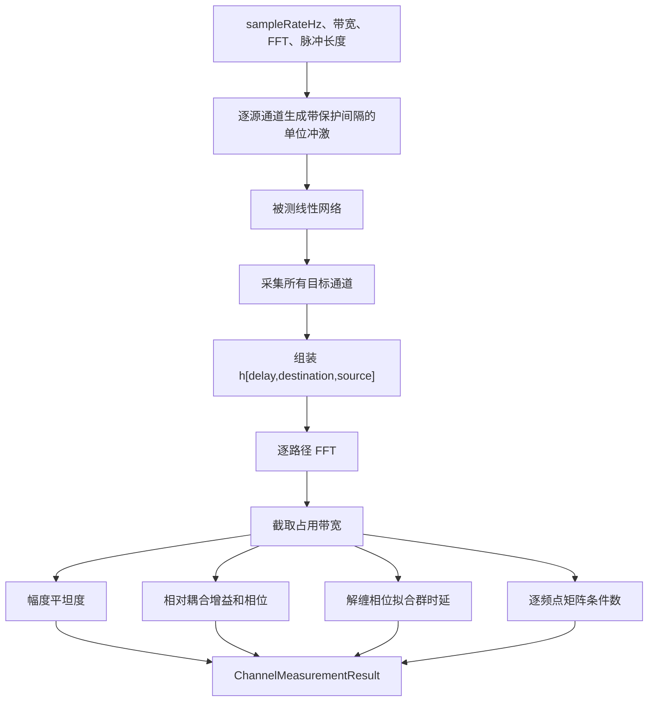

# Channel 特性测量、耦合辨识与耦合感知 DPD-GMP

本文说明 `inc/lib/ChannelAnalyse.py` 的测量原理、可测量边界、公式推导和使用方法，覆盖平坦度、耦合参数、群时延和矩阵条件数，并给出 `tests/BenchMark.py` 中双通道用例的构造、测量结果以及 DPD-GMP 修改前后的性能比较。

这里的 Channel Analyse 与 `Channel.py` 职责不同：

- `Channel.py` 是被测对象，负责模拟 PA 前耦合、不同 PA、PA 后耦合和 forward/fb 接收链路。
- `ChannelAnalyse.py` 是测量工具，只根据探测波形和采集结果估计线性通道特性。
- `DpdGmp.py` 中的 `CouplingAwareDpdGmp` 消费测量结果，完成训练目标去嵌入和实际补偿。
- `tests/BenchMark.py` 只构造场景、保存结果和验证预期，不在测试文件中重新实现物理模型。

## 1. 为什么 DPD 之前必须测量通道

两路发射系统不能简单写成两个互不相关的 SISO PA。设数字基带希望最终观测到的两路信号为

```math
\mathbf{x}(n)=
\begin{bmatrix}
x_0(n)\\
x_1(n)
\end{bmatrix}.
```

实际链路可写为

```math
\mathbf{u}(n)
=
\sum_{\ell=0}^{L_{\mathrm{pre}}-1}
\mathbf{H}_{\mathrm{pre}}(\ell)
\mathbf{z}(n-\ell),
```

```math
v_i(n)=F_i\{u_i(n)\},
```

```math
\mathbf{y}(n)
=
\sum_{\ell=0}^{L_{\mathrm{post}}-1}
\mathbf{H}_{\mathrm{post}}(\ell)
\mathbf{v}(n-\ell).
```

各符号含义如下：

- $\mathbf{z}(n)$ 是送到 DAC 或发射芯片接口的原始数字波形。
- $\mathbf{H}_{\mathrm{pre}}$ 是 PA 之前的耦合网络。
- $\mathbf{u}(n)$ 是各 PA 实际看到的输入。
- $F_i$ 是第 $i$ 路 PA 的非线性和记忆响应。
- $\mathbf{H}_{\mathrm{post}}$ 是 PA 之后的输出耦合网络。
- $\mathbf{y}(n)$ 是仪表、耦合器或接收端最终观测到的波形。

```mermaid
flowchart LR
    desired["最终目标 x"] --> postInverse["测得的 Hpost 逆"]
    postInverse --> paTargets["各 PA 输出目标 q"]
    paTargets --> dpd["逐 PA DPD-GMP"]
    dpd --> paInputs["期望 PA 输入 p"]
    paInputs --> preInverse["测得的 Hpre 逆"]
    preInverse --> dac["DAC 波形 z"]
    dac --> prePhysical["实际 Hpre"]
    prePhysical --> paBank["不同的非线性 PA"]
    paBank --> postPhysical["实际 Hpost"]
    postPhysical --> observed["观测输出 y"]
```



图示说明：`CouplingAwareDpdGmp` 中两个逆网络的位置不能交换。PA 后逆首先决定每个 PA 应该产生什么；逐路 DPD 再求出实现该 PA 输出所需的实际 PA 输入；PA 前逆最后把这个实际 PA 输入转换为 DAC 需要发送的波形。

如果忽略耦合而直接令

```math
z_i(n)=D_i\{x_i(n)\},
```

则 PA $i$ 实际收到的是本路 DPD 输出与其他路泄漏之和。DPD 训练时的输入分布和部署时的输入分布不一致，PA 后的串扰又会被错误地算成 PA 非线性，因此 EVM、NMSE 和残余串扰通常不能达到逐路 SISO 仿真的结果。

## 2. MIMO 通道的可测模型

### 2.1 冲激响应矩阵

线性时不变 MIMO 通道写成

```math
y_j(n)
=
\sum_{i=0}^{N_{\mathrm{ch}}-1}
\sum_{\ell=0}^{L-1}
h_{ji}(\ell)x_i(n-\ell).
```

$h_{ji}(\ell)$ 表示从源通道 $i$ 到观测通道 $j$ 的有向冲激响应。矩阵形式为

```math
\mathbf{H}(\ell)=
\begin{bmatrix}
h_{00}(\ell) & h_{01}(\ell)\\
h_{10}(\ell) & h_{11}(\ell)
\end{bmatrix}.
```

矩阵对角线是主通道，非对角线是通道间耦合。`ChannelMeasurementResult.impulseResponses` 的数组顺序固定为：

```text
delay × destinationChain × sourceChain
```

因此 `impulseResponses[l, j, i]` 就是 $h_{ji}(\ell)$。

### 2.2 为什么逐路探测

测量第 $i$ 个源通道时，只在该通道发送单位冲激：

```math
x_i(n)=\delta(n-n_0),
\qquad
x_k(n)=0,\quad k\ne i.
```

输出为

```math
y_j(n_0+\ell)=h_{ji}(\ell).
```

依次激励所有源通道，就能恢复完整矩阵。`probeDelaySamples` 在冲激前保留一段零样点，避免分数时延插值跨越采集记录左边界而损失能量。

在实际仪表中不一定要发送理想冲激。也可以发送互相正交的 PN 序列、多音或 OFDM 探测波形。对每个频点，最小二乘估计为

```math
\widehat{\mathbf{H}}(f)
=
\mathbf{Y}(f)\mathbf{X}^{H}(f)
\left[
\mathbf{X}(f)\mathbf{X}^{H}(f)
+\lambda\mathbf{I}
\right]^{-1}.
```

注意上式中的矩阵乘法顺序表示右侧正则化逆。工程上更稳定的等价写法是先求

```math
\mathbf{R}_{xx}(f)
=
\mathbf{X}(f)\mathbf{X}^{H}(f)
+\lambda\mathbf{I},
```

再解线性方程

```math
\widehat{\mathbf{H}}(f)\mathbf{R}_{xx}(f)
=
\mathbf{Y}(f)\mathbf{X}^{H}(f).
```

本工程的生产接口直接实现逐路冲激探测；如果仪表已经输出去卷积后的冲激响应矩阵，可把该矩阵交给 `AnalyzeImpulseResponses`，不需要再次生成探测信号。

## 3. 频率响应和平坦度

### 3.1 从冲激响应到频率响应

对每一条路径做离散傅里叶变换：

```math
H_{ji}(f_k)
=
\sum_{\ell=0}^{L-1}
h_{ji}(\ell)
\exp\left(
-j2\pi\frac{k\ell}{N_{\mathrm{FFT}}}
\right).
```

程序只在配置的占用带宽

```math
|f_k|\le \frac{B}{2}
```

内计算平坦度、群时延和矩阵条件数。带外频点不会混入带内指标。

### 3.2 幅度平坦度

路径幅度响应为

```math
A_{ji}(f)=20\log_{10}|H_{ji}(f)|.
```

带内平坦度定义为

```math
R_{ji}
=
\max_{|f|\le B/2} A_{ji}(f)
-
\min_{|f|\le B/2} A_{ji}(f).
```

单位为 dB，越接近 0 表示幅度越平坦。必须同时查看两种平坦度：

- `worstDirectFlatnessDb`：所有对角主路径中最差的平坦度。
- `worstDetectedPathFlatnessDb`：所有检测到的主路径和耦合路径中最差的平坦度。

当前测试场景的主路径被设置为理想直通，所以主路径平坦度为 0 dB；耦合路径包含 FIR，因此 PA 前和 PA 后的最差检测路径平坦度分别为 1.547 dB 和 1.148 dB。这不是公式异常，而是场景构造的物理含义。

### 3.3 耦合增益和相位

为了消除源通道公共增益，源 $i$ 到目标 $j$ 的相对耦合定义为

```math
C_{ji}(f)
=
\frac{H_{ji}(f)}{H_{ii}(f)},
\qquad j\ne i.
```

中心频点耦合增益为

```math
G_{ji,\mathrm{dB}}
=
20\log_{10}|C_{ji}(0)|,
```

耦合相位为

```math
\phi_{ji}
=
\arg C_{ji}(0).
```

例如 $-20$ dB 的耦合表示泄漏电压约为主路电压的

```math
10^{-20/20}=0.1.
```

功率则约为主路功率的 $0.1^2=0.01$，也就是 1%。

### 3.4 检测阈值

噪声底附近的非对角响应不能被当作真实耦合。程序用

```math
\max_{|f|\le B/2}20\log_{10}|C_{ji}(f)|
\ge T_{\mathrm{coupling}}
```

判断路径是否被检测到。默认阈值为 $-70$ dB。低于阈值的路径仍保留在频率响应矩阵中，但 `detected=False`，不会进入“最差已检测耦合”的汇总。

## 4. 相位、群时延和不同方向的时延

路径相位为

```math
\phi_{ji}(f)=\arg H_{ji}(f).
```

纯时延 $\tau$ 对应

```math
H(f)=a\exp(-j2\pi f\tau),
```

因此

```math
\phi(f)=\phi_0-2\pi f\tau.
```

群时延由相位斜率得到：

```math
\tau_g
=
-\frac{1}{2\pi}
\frac{\mathrm{d}\phi(f)}{\mathrm{d}f}.
```

程序先对相位解缠，再在幅度不低于路径峰值 `groupDelayMagnitudeRangeDb` 的频点上做直线拟合。输出同时给出：

```math
D_{\mathrm{sample}}=\tau_g f_s
```

和

```math
D_{\mathrm{ns}}=10^9\tau_g.
```

耦合 FIR 自身也有群时延，所以测得的群时延一般不等于配置的 `integerDelaySamples + fractionalDelaySamples`。例如一个两抽头 FIR 会额外改变相位斜率；测量结果反映的是整条路径的等效时延，正是 DPD 逆网络真正需要的量。

## 5. MIMO 条件数与能否安全求逆

对每个频点做奇异值分解：

```math
\mathbf{H}(f)
=
\mathbf{U}(f)
\mathbf{\Sigma}(f)
\mathbf{V}^{H}(f).
```

矩阵条件数为

```math
\kappa(f)
=
\frac{\sigma_{\max}(f)}
{\sigma_{\min}(f)}.
```

其物理意义是：

- $\kappa$ 接近 1：各空间方向都能稳定区分，逆补偿不会明显放大噪声。
- $\kappa$ 较大：某些通道组合接近线性相关，直接求逆会放大噪声、量化误差和测量误差。
- $\sigma_{\min}$ 接近 0：通道在该频点接近不可逆，必须增加正则化、限制逆增益、减小补偿带宽，或者改进射频隔离。

本工程保存带内条件数的中位值和最差值。正式用例的最差值为：

| 测量位置 | 中位条件数 | 最差条件数 |
|---|---:|---:|
| PA 前 | 1.319 | 1.398 |
| PA 后 | 1.335 | 1.487 |

这些值远离病态区，因此允许使用温和正则化的因果 MIMO 逆。

## 6. `ChannelAnalyse` 的因果测量流程



图示说明：所有指标来自同一份测得的冲激响应，避免平坦度、耦合和时延使用不同采集记录造成不一致。测量类不读取 `Channel.prePaCouplingPaths` 或 `Channel.postPaCouplingPaths` 的私有真值。

## 7. PA 前和 PA 后耦合如何分别测量

### 7.1 PA 前耦合

实验接线建议为：

1. PA 关闭或工作在不会产生明显非线性的低功率区。
2. 每次只激励一个 DAC/RF 输入。
3. 在各 PA 输入端使用已校准的低扰动耦合器采样。
4. 去除线缆和仪表通道自身的复增益后估计 $\mathbf{H}_{\mathrm{pre}}$。

如果不能在 PA 输入端观测，就无法仅凭最终输出唯一分离 PA 前耦合和 PA 非线性。此时只能辨识端到端模型，不能声称测到了独立的 $\mathbf{H}_{\mathrm{pre}}$。

### 7.2 PA 后耦合

PA 后测量需要获得每个 PA 自身输出与最终端口输出之间的关系。可以使用：

- PA 输出耦合器与最终端口同步采样；
- 校准过的开关矩阵逐路激励；
- 极低功率小信号工作点，使 PA 可近似为已知线性增益，再去嵌入 PA；
- 仿真中直接调用 `Channel.ApplyPostPaCoupling`。

只有端到端观测时，测得的是

```math
\mathbf{H}_{\mathrm{end}}(f)
\approx
\mathbf{H}_{\mathrm{post}}(f)
\mathbf{G}_{\mathrm{PA}}(f)
\mathbf{H}_{\mathrm{pre}}(f).
```

这个乘积一般不能唯一分解为三个矩阵。必须增加内部观测点、已知校准件或结构先验。

## 8. 根据测量结果修改 DPD-GMP

### 8.1 旧方案：逐路独立训练

旧方案对每一路分别训练

```math
p_i(n)\approx D_i\{x_i(n)\},
```

并把 $p_i$ 直接送到 DAC。它隐含假设

```math
\mathbf{H}_{\mathrm{pre}}(f)=\mathbf{I},
\qquad
\mathbf{H}_{\mathrm{post}}(f)=\mathbf{I}.
```

存在耦合时，这两个假设都不成立。

### 8.2 第一步：PA 后目标去嵌入

希望最终输出为 $\mathbf{x}$，先求各 PA 自身应产生的输出：

```math
\mathbf{q}
=
\mathbf{H}_{\mathrm{post}}^{-1}\mathbf{x}.
```

之后第 $i$ 路 DPD 的训练输入不再是 $x_i$，而是 $q_i$。这一步防止把“其他 PA 泄漏到本端口的线性分量”错误地塞进本路非线性 GMP 系数。

### 8.3 第二步：逐 PA 生成训练标签

对每个独立 PA，使用 ILC 或实测逆学习得到实际 PA 输入标签 $p_i^{\mathrm{label}}$，使

```math
F_i\{p_i^{\mathrm{label}}\}\approx q_i.
```

随后拟合 GMP：

```math
\widehat{\boldsymbol{\theta}}_i
=
\arg\min_{\boldsymbol{\theta}_i}
\left\|
\mathbf{\Phi}(q_i)\boldsymbol{\theta}_i
-
\mathbf{p}_i^{\mathrm{label}}
\right\|_2^2
+
\lambda
\left\|
\boldsymbol{\theta}_i-\boldsymbol{\theta}_{i,0}
\right\|_2^2.
```

这里的标签必须对应 PA 端实际输入，也就是 PA 前耦合之后的位置。不能把 DAC 波形和 PA 端标签混为一谈。

### 8.4 第三步：PA 前耦合预消除

逐 PA DPD 输出组成

```math
\mathbf{p}(n)=
\begin{bmatrix}
D_0\{q_0(n)\}\\
D_1\{q_1(n)\}
\end{bmatrix}.
```

DAC 波形应改为

```math
\mathbf{z}
=
\mathbf{H}_{\mathrm{pre}}^{-1}\mathbf{p}.
```

物理 PA 前网络作用后：

```math
\mathbf{H}_{\mathrm{pre}}\mathbf{z}
\approx
\mathbf{p}.
```

因此各 PA 在部署时仍能看到训练时定义的输入。

### 8.5 程序中的正则化因果逆

对因果 MIMO FIR：

```math
\mathbf{y}(n)
=
\mathbf{H}(0)\mathbf{x}(n)
+
\sum_{\ell=1}^{L-1}
\mathbf{H}(\ell)\mathbf{x}(n-\ell).
```

已知过去输入后，当前输入可递推求得：

```math
\mathbf{x}(n)
=
\mathbf{H}_{\lambda}^{+}(0)
\left[
\mathbf{y}_{\mathrm{target}}(n)
-
\sum_{\ell=1}^{L-1}
\mathbf{H}(\ell)\mathbf{x}(n-\ell)
\right].
```

零时延矩阵的正则化逆由奇异值分解得到：

```math
\mathbf{H}_{\lambda}^{+}(0)
=
\mathbf{V}
\mathop{\mathrm{diag}}
\left(
\frac{\sigma_r}{\sigma_r^2+\lambda}
\right)
\mathbf{U}^{H}.
```

程序还用 `maximumInverseGainDb` 限制每个逆奇异值，避免弱奇异方向导致 DAC 峰值、噪声和定点误差失控。因果递推不会产生 FFT 循环卷积的首尾串扰。

### 8.6 什么时候需要进一步升级为联合非线性 MIMO DPD

当前 `CouplingAwareDpdGmp` 的假设是：

- PA 前和 PA 后耦合都是可测的线性时不变网络；
- 去除线性耦合后，各 PA 的非线性可独立建模；
- 耦合不会通过负载牵引改变 PA 本身的非线性系数。

如果天线失配、负载调制或强反馈使

```math
v_i(n)
=
F_i\{u_0(n),u_1(n),\ldots\},
```

则必须在 GMP 中加入其他通道包络基函数，例如

```math
u_i(n-m)|u_j(n-r)|^{p-1},
\qquad i\ne j,
```

并联合求解所有通道系数。此时仅做线性矩阵去耦不够。

## 9. 类参数和方法

### 9.1 `ChannelAnalyse` 参数

| 参数 | 默认值 | 含义 |
|---|---:|---|
| `sampleRateHz` | `80e6` | 复基带采样率 |
| `channelBandwidthHz` | `20e6` | 计算指标的占用带宽 |
| `fftLength` | `2048` | 频率响应 FFT 长度 |
| `impulseLength` | `64` | 保留的因果冲激响应样点数 |
| `probeDelaySamples` | `8` | 探测冲激前的零保护样点 |
| `couplingDetectionThresholdDb` | `-70.0` | 非对角路径检测阈值 |
| `magnitudeFloorDb` | `-180.0` | 除法和对数使用的幅度下限 |
| `groupDelayMagnitudeRangeDb` | `35.0` | 相对路径峰值的群时延拟合范围 |
| `width` | `16` | `0` 为浮点；大于 0 为公开定点 I/Q 码位宽 |

未知参数会发出警告并被忽略；可识别参数继续运行。

### 9.2 `ChannelAnalyse` 方法

| 方法 | 作用 |
|---|---|
| `GetParameters()` | 返回全部有效参数字典 |
| `UpdateParameters(**overrides)` | 事务式更新参数 |
| `BuildImpulseProbe(chainCount, sourceChain)` | 生成单源宽带冲激 |
| `Measure(channelProcessor, chainCount, stageName)` | 主动探测并返回完整测量结果 |
| `AnalyzeImpulseResponses(impulseResponses, stageName)` | 分析已有冲激响应矩阵 |
| `ProtectMagnitude(inputSignal)` | 对复响应施加安全幅度下限 |
| `MeasurePath(...)` | 计算一条有向路径的增益、相位、平坦度和群时延 |

### 9.3 `CouplingAwareDpdGmp` 参数

| 参数 | 默认值 | 含义 |
|---|---:|---|
| `compensatePrePaCoupling` | `True` | 是否对 DAC 波形做 PA 前耦合逆 |
| `compensatePostPaCoupling` | `True` | 是否对最终目标做 PA 后去嵌入 |
| `inverseRegularization` | `1e-8` | 零时延矩阵逆的岭正则 |
| `maximumInverseGainDb` | `18.0` | 最大逆奇异值增益 |
| `impulseTruncationDb` | `-100.0` | 删除尾部无效冲激抽头的相对门限 |
| `width` | `16` | MIMO 公开接口 I/Q 位宽 |

### 9.4 `CouplingAwareDpdGmp` 关键方法

| 方法 | 作用 |
|---|---|
| `ConfigureChannelMeasurements(pre, post)` | 更新 PA 前/后测量结果 |
| `BuildPaOutputTargets(referenceSignal)` | 用 PA 后逆生成逐 PA 输出目标 |
| `FitCoupledSegments(references, labels, ...)` | 用去嵌入目标和 PA 输入标签训练各路 GMP |
| `BuildDacInput(predistortedPaInput)` | 用 PA 前逆生成实际 DAC 波形 |
| `Process(inputSignal)` | 保持浮点/定点公开约定的完整补偿 |
| `ProcessFloating(inputSignal)` | 内部浮点完整补偿 |
| `ApplyMeasuredResponse(inputSignal, h)` | 对调试波形施加测得的 MIMO FIR |
| `InvertMeasuredResponse(targetSignal, h)` | 正则化因果 MIMO 反卷积 |

## 10. 典型使用方式

### 10.1 测量仿真 Channel 的 PA 前和 PA 后网络

```python
from inc.lib.Channel import Channel
from inc.lib.ChannelAnalyse import ChannelAnalyse

channel = Channel(
    parameters={
        "prePaCouplingPaths": (
            {
                "sourceChain": 0,
                "destinationChain": 1,
                "gainDb": -20.0,
                "phaseDegrees": 30.0,
                "integerDelaySamples": 2,
            },
        ),
        "postPaCouplingPaths": (
            {
                "sourceChain": 1,
                "destinationChain": 0,
                "gainDb": -18.0,
                "phaseDegrees": -40.0,
                "integerDelaySamples": 1,
            },
        ),
        "width": 0,
    }
)

channelAnalyzer = ChannelAnalyse(
    parameters={
        "sampleRateHz": 80.0e6,
        "channelBandwidthHz": 20.0e6,
        "fftLength": 2048,
        "impulseLength": 64,
        "width": 0,
    }
)

preMeasurement = channelAnalyzer.Measure(
    channel.ApplyPrePaCoupling,
    chainCount=2,
    stageName="pre-PA",
)
postMeasurement = channelAnalyzer.Measure(
    channel.ApplyPostPaCoupling,
    chainCount=2,
    stageName="post-PA",
)

coupling01 = preMeasurement.GetPath(
    sourceChain=0,
    destinationChain=1,
)
print(coupling01.ToDict())
print(preMeasurement.ToDict())
```

这里调用的是 `Channel` 的内部浮点线性网络，所以 `ChannelAnalyse.width` 也配置为 0。测量公开定点硬件接口时，应把分析器 `width` 配置为对应位宽。

### 10.2 分析仪表已经恢复的冲激响应

```python
import numpy as np

from inc.lib.ChannelAnalyse import ChannelAnalyse

# Shape: delay x destination x source.
measuredImpulseResponses = np.zeros(
    (64, 2, 2),
    dtype=np.complex128,
)
measuredImpulseResponses[0] = np.eye(2)
measuredImpulseResponses[2, 1, 0] = (
    10.0 ** (-20.0 / 20.0)
    * np.exp(1j * np.deg2rad(30.0))
)

result = ChannelAnalyse(
    parameters={
        "sampleRateHz": 80.0e6,
        "channelBandwidthHz": 20.0e6,
        "width": 0,
    }
).AnalyzeImpulseResponses(
    measuredImpulseResponses,
    stageName="fixture-deembedded capture",
)

print(result.GetPath(0, 1).gainDb)
print(result.GetPath(0, 1).groupDelayNs)
```

### 10.3 构造耦合感知 DPD-GMP

```python
from inc.lib.DpdGmp import CouplingAwareDpdGmp, DpdGmp

dpdModels = (
    DpdGmp(parameters={"width": 0}),
    DpdGmp(parameters={"width": 0}),
)

coupledDpd = CouplingAwareDpdGmp(
    dpdModels,
    preChannelMeasurement=preMeasurement,
    postChannelMeasurement=postMeasurement,
    parameters={
        "inverseRegularization": 1.0e-8,
        "maximumInverseGainDb": 18.0,
        "width": 0,
    },
)

# finalReferences contains desired final port outputs.
# paInputLabels contains ILC-learned actual inputs at the two PA ports.
trainingResult = coupledDpd.FitCoupledSegments(
    referenceSignals=(finalReferences,),
    paInputTargetSignals=(paInputLabels,),
)

rawDacWaveform = coupledDpd.Process(finalReferences)
measuredOutput = channel.ProcessFloating(rawDacWaveform)

print(trainingResult.ToDict())
```

关键点：`paInputLabels` 必须是 PA 前耦合之后、各 PA 端实际需要的输入标签。`CouplingAwareDpdGmp` 会在部署阶段自动反解 PA 前网络，用户不应提前手工再反解一次。

## 11. Benchmark 场景构造

运行：

```powershell
python tests/BenchMark.py --channel-analyse `
    --sample-rate-hz 80000000 `
    --bandwidth 20 `
    --output-dir results/channel_analysis
```

独立 Python 调用：

```python
from pathlib import Path

from tests.BenchMark import (
    ChannelAnalysisBenchmarkConfig,
    RunChannelAnalysisBenchmark,
)

result = RunChannelAnalysisBenchmark(
    ChannelAnalysisBenchmarkConfig(
        sampleRateHz=80.0e6,
        outputPowerDbm=13.0,
        outputDirectory=Path("results/channel_analysis"),
    )
)
```

### 11.1 控制变量

| 类别 | 配置 |
|---|---|
| 信号 | 两路独立 seed 的 EHT、20 MHz、MCS 7 Wi-Fi |
| 采样率 | 80 MHz |
| PA | 第 1 路 GMP，第 2 路 Wiener |
| 目标输出功率 | 每路 13 dBm |
| PA 前耦合 | 双向、不对称、不同整数/分数时延和 FIR |
| PA 后耦合 | 双向、不对称、不同整数/分数时延和 FIR |
| 噪声 | 关闭 |
| 反馈非理想 | 关闭 |
| DPD 结构 | 1/3/5/7 阶、主记忆深度 4、交叉记忆深度 3 |
| 训练标签 | 每个 PA 独立运行频域 ILC |

关闭噪声和反馈非理想是为了控制变量，使修改前后的差异只来自通道测量和耦合感知补偿。

### 11.2 测试阶段

| 阶段 | 训练目标 | PA 后去嵌入 | PA 前预消除 |
|---|---|---:|---:|
| Coupled PA baseline | 无 DPD | 否 | 否 |
| Independent DPD-GMP | 每路原始最终参考 | 否 | 否 |
| Post-deembedded DPD-GMP | 测得的逐 PA 输出目标 | 是 | 否 |
| Coupling-aware DPD-GMP | 测得的逐 PA 输出目标 | 是 | 是 |

这个分阶段设计能区分“修改训练目标”的收益和“修改部署 DAC 波形”的收益。

## 12. 仿真测量结果

### 12.1 通道参数

| 位置 | 路径 | 中心增益 | 中心相位 | 带内平坦度 | 等效群时延 |
|---|---|---:|---:|---:|---:|
| PA 前 | 1→1 | 0.000 dB | 0.000° | 0.000 dB | 0.000 ns |
| PA 前 | 1→2 | -12.818 dB | 29.644° | 1.547 dB | 30.787 ns |
| PA 前 | 2→1 | -19.672 dB | -35.737° | 1.419 dB | 7.719 ns |
| PA 前 | 2→2 | 0.000 dB | 0.000° | 0.000 dB | 0.000 ns |
| PA 后 | 1→1 | 0.000 dB | 0.000° | 0.000 dB | 0.000 ns |
| PA 后 | 1→2 | -11.254 dB | -21.248° | 1.148 dB | 16.524 ns |
| PA 后 | 2→1 | -18.499 dB | 51.594° | 0.823 dB | 34.183 ns |
| PA 后 | 2→2 | 0.000 dB | 0.000° | 0.000 dB | 0.000 ns |

配置中的路径增益是在 FIR 和分数时延之前定义的系数；表格是完整路径在中心频点的实测结果，因此二者不应被强行设为相同。完整路径结果才应进入 DPD。

### 12.2 修改前后性能比较

| 阶段 | EVM | 波形 NMSE | 最差 ACLR | 残余耦合 |
|---|---:|---:|---:|---:|
| Coupled PA baseline | 7.393 dB | 0.692 dB | 5.732 dB | -12.505 dB |
| Independent DPD-GMP | 2.711 dB | -3.629 dB | 8.919 dB | -12.199 dB |
| Post-deembedded DPD-GMP | 2.420 dB | -4.076 dB | 9.301 dB | -14.066 dB |
| Coupling-aware DPD-GMP | 2.334 dB | -4.487 dB | 9.245 dB | -16.562 dB |

相对 Independent DPD-GMP，完整耦合感知方案得到：

| 目标指标 | 改善量 | 预期 | 结果 |
|---|---:|---|---|
| EVM | 0.376 dB | 越低越好 | PASS |
| 波形 NMSE | 0.858 dB | 越低越好 | PASS |
| 残余耦合 | 4.364 dB | 越低越好 | PASS |
| 最差 ACLR | 0.325 dB | 越高越好 | PASS |

该场景故意同时使用较强双向耦合、不同 PA、频率选择性和高 PAPR Wi-Fi，因此绝对 EVM 是压力测试结果，不能当作 802.11 产品验收门限。此处验证的是同一个物理场景、同一个功率和同一组参考下，测量驱动修改是否按预期改善目标指标。


图像说明：

- 左上图显示主路径幅度；本场景主路径为理想直通，所以四条线重合在 0 dB。
- 右上图显示耦合相对各源主路径的频率响应；曲线斜率和弯曲来自 FIR 与不同分数时延。
- 左下图显示 PA 前和 PA 后 MIMO 矩阵的带内条件数；均低于 1.5，逆补偿稳定。
- 右下图比较无 DPD、独立 DPD、仅 PA 后去嵌入和完整耦合感知 DPD；完整方案得到最低 EVM/NMSE，ACLR 相对独立 DPD 也改善。

## 13. 输出文件

通道基准生成：

| 文件 | 内容 |
|---|---|
| `channel_analysis.json` | 配置、测量汇总、训练诊断、阶段和预期检查 |
| `channel_path_measurements.csv` | 每条有向路径的增益、相位、平坦度和时延 |
| `channel_frequency_response.csv` | 每个带内频点的复响应幅相 |
| `channel_dpd_comparison.csv` | 四个 DPD 阶段的性能 |
| `channel_dpd_improvements.csv` | Independent 与 Coupling-aware 的改善和 PASS/FAIL |
| `channel_analysis.png` | 通道和 DPD 性能四联图 |

仓库参考结果位于 `doc/images/channel_analyse/`。

## 14. 测量误差和工程建议

### 14.1 噪声

冲激探测峰值不能超过接收机或耦合器线性范围，同时要高于噪声底。实际测量建议重复 $K$ 次做相干平均：

```math
\widehat{h}_{ji}(\ell)
=
\frac{1}{K}
\sum_{r=1}^{K}
\widehat{h}_{ji}^{(r)}(\ell).
```

独立白噪声幅度标准差大约按 $1/\sqrt{K}$ 下降。

### 14.2 CFO 和采样频偏

多次或长序列测量前必须先补偿 CFO/SFO，否则相位随时间漂移会被误判为通道相位和群时延。可复用 `SigProc` 做整数/分数时延、CFO、SFO 和复增益补偿。

### 14.3 测量参考面

PA 前、PA 后和仪表端的线缆、衰减器、耦合器必须去嵌入到一致参考面。否则 DPD 会补偿测试夹具，而不是产品中的实际网络。

### 14.4 时变耦合

温度、天线驻波、开关状态或用户握持会改变耦合。建议：

- 保存条件数和主要耦合路径的基线；
- 当中心耦合或群时延变化超过门限时重新测量；
- 使用 `UpdateParameters` 或 `ConfigureChannelMeasurements` 更新，而不是沿用旧逆；
- 对快速变化场景采用分段或在线系数更新，并限制逆增益。

### 14.5 接受标准

建议至少同时检查：

1. 所有主路径和主要耦合路径的平坦度。
2. 每个方向的中心耦合增益、相位和群时延。
3. 全带宽最差条件数。
4. 逆补偿后的 DAC 峰值与定点饱和率。
5. Independent 与 Coupling-aware 在同功率下的 EVM、NMSE、ACLR 和残余耦合。
6. 使用独立验证帧和未参与训练的功率点复测，避免只记住训练波形。
