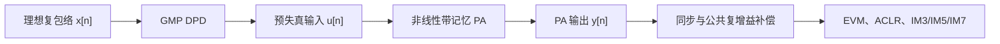

# 基于广义记忆多项式的 DPD 补偿原理与系数更新

本文说明 `inc/lib/DpdGmp.py` 背后的物理与数学原理。重点不是把 GMP 当作普通曲线拟合器，而是回答三个工程问题：

1. PA 为什么会产生带记忆的非线性失真；
2. GMP DPD 如何在 PA 前制造“方向相反”的失真；
3. 系数如何从 ILC 标签、直接波形对或 PA 输入/输出采集逐步更新。

本文中的信号均为离散时间复基带包络。`x[n]` 表示希望 PA 最终输出的理想波形，`u[n]` 表示 DPD 产生的 PA 输入，`y[n]` 表示 PA 输出。

---

## 1. DPD 补偿的物理目标

PA 可写成非线性且带记忆的映射

```math
y[n]=\mathcal P\{u[n]\}.
```

DPD 是放在 PA 前面的数字映射

```math
u[n]=\mathcal D\{x[n]\}.
```

理想串联系统满足

```math
\mathcal P\{\mathcal D\{x[n]\}\}
\mathrel{\approx}
g x[n-d],
```

其中 `g` 是允许由接收端线性补偿的公共复增益，`d` 是允许由同步处理消除的公共时延。DPD 的任务是抵消随幅度、历史和包络变化的部分，而不是用大量高阶系数重复拟合一个公共增益或纯时延。



**图 1 说明：**GMP DPD 在数字域预先产生与 PA 失真相反的幅度、相位和记忆分量。最终性能必须在 PA 的原生输出上测量；不能在 PA 后乘一个常数来伪造目标输出功率。

---

## 2. 为什么需要记忆项

无记忆多项式只依赖当前样点：

```math
u[n]
=
\sum_{p\in\mathcal P}
c_p x[n]|x[n]|^{p-1}.
```

真实 PA 的偏置网络、匹配网络、热效应、载流子动态和数字/模拟滤波会让当前输出同时依赖历史样点。两段瞬时幅度相同的包络，如果一段正在上升、另一段正在下降，PA 输出可能不同。因此逆模型至少需要

```math
x[n],x[n-1],\ldots,x[n-M+1].
```

普通 Memory Polynomial 让复载波样点和自己的包络使用相同延迟。GMP 进一步允许复载波和包络采用不同延迟，从而描述“当前相量受较早或较晚包络状态调制”的交叉记忆。

---

## 3. 本工程使用的 GMP 基函数

设奇数阶集合为

```math
\mathcal P=\{1,3,5,\ldots,P\},
```

主记忆深度为 `M`，交叉记忆深度为 `L`。

### 3.1 主支路

```math
\phi^{\mathrm{main}}_{p,m}[n]
=
x[n-m]|x[n-m]|^{p-1},
```

其中

```math
p\in\mathcal P,
\qquad
0\leq m<M.
```

`p=1,m=0` 是恒等直通项。初始化时仅把这一项的系数设为 1，其余系数设为 0，因此未经训练的 `DpdGmp` 不会无故改变输入。

### 3.2 滞后包络交叉支路

```math
\phi^{\mathrm{lag}}_{p,m,l}[n]
=
x[n-m]|x[n-m-l]|^{p-1},
```

其中

```math
p\in\mathcal P,\quad p>1,
\qquad
0\leq m<M,
\qquad
1\leq l\leq L.
```

这里复载波样点由更早的包络控制，适合描述包络状态滞后。

### 3.3 超前包络交叉支路

本工程采用完全因果的重新定时形式：

```math
\phi^{\mathrm{lead}}_{p,m,l}[n]
=
x[n-m-l]|x[n-m]|^{p-1}.
```

包络相对于复载波“超前”，但两者都只访问当前或历史样点，不需要未来数据。

### 3.4 完整 DPD 输出

```math
u[n]
=
\sum_{p,m}
c^{\mathrm{main}}_{p,m}
\phi^{\mathrm{main}}_{p,m}[n]
+
\sum_{p,m,l}
c^{\mathrm{lag}}_{p,m,l}
\phi^{\mathrm{lag}}_{p,m,l}[n]
+
\sum_{p,m,l}
c^{\mathrm{lead}}_{p,m,l}
\phi^{\mathrm{lead}}_{p,m,l}[n].
```

若阶数数量为 `Q`，则系数总数为

```math
K
=
QM+2(Q-1)ML.
```

这个公式也说明了复杂度风险：把阶数、主记忆和交叉记忆同时加倍，会使系数数量快速增长，并加剧基函数相关性。

---

## 4. 矩阵形式

把 `N` 个样点的全部基函数排成设计矩阵

```math
\boldsymbol{\Phi}
\in
\mathbb C^{N\times K}.
```

系数和目标 PA 输入标签分别写成

```math
\mathbf c
\in
\mathbb C^K,
\qquad
\mathbf d
\in
\mathbb C^N.
```

GMP 预测为

```math
\hat{\mathbf d}
=
\boldsymbol{\Phi}\mathbf c.
```

本工程的系数顺序固定为：

1. 所有阶数和主记忆的 `main` 项；
2. 除一阶外，每个阶数、主记忆位置和交叉延迟对应的一对 `lagging`、`leading` 项。

固定顺序保证训练、保存、恢复和推理时同一个系数始终对应同一个物理基函数。

---

## 5. 三种训练数据来源

### 5.1 ILC 标签学习

先让 ILC 对一条已知波形逐样点学习，得到收敛的 PA 输入

```math
\mathbf u_{\mathrm{ILC}}.
```

再训练 GMP：

```math
\mathbf d=\mathbf u_{\mathrm{ILC}},
\qquad
\boldsymbol{\Phi}=\boldsymbol{\Phi}(\mathbf x).
```

ILC 可以产生高自由度、波形专用的逆响应；GMP 再把这些标签压缩为少量可复用系数。这是 `FitFromIlc` 的用途，也是本工程性能基准采用的推荐路径。

### 5.2 直接监督训练

如果已有“希望的 DPD 输入波形”和“目标 PA 输入波形”，可直接调用 `Fit`：

```math
\mathbf d=\mathbf u_{\mathrm{target}}.
```

它适用于仪表、优化器或其他算法已经提供目标标签的情况。

### 5.3 间接学习

间接学习先把 PA 输出同步并做公共复增益归一化，再拟合后置逆：

```math
\mathcal D_{\mathrm{post}}\{\tilde y[n]\}
\mathrel{\approx}
u[n].
```

辨识完成后把后置逆系数复制到前置 DPD。对应接口为 `FitIndirect`。该方法不需要显式 ILC 标签，但依赖 PA 在训练工作点附近可逆，而且反馈链的噪声、频响和非线性会进入系数。

---

## 6. 加权岭回归

### 6.1 为什么不能直接求普通最小二乘

高阶基函数的量纲和能量差异很大。例如，当归一化包络小于 1 时，

```math
|x|^7\ll |x|.
```

不同延迟和交叉项又可能高度相关。直接计算

```math
\left(
\boldsymbol{\Phi}^{H}\boldsymbol{\Phi}
\right)^{-1}
```

容易放大噪声和数值误差。

### 6.2 列归一化

第 `k` 个基函数的加权 RMS 尺度为

```math
s_k
=
\sqrt{
\frac{
\sum_{n=0}^{N-1}w_n|\Phi_{n,k}|^2
}{
\sum_{n=0}^{N-1}w_n
}
}.
```

令

```math
\mathbf S
=
\mathrm{diag}(s_1,\ldots,s_K),
\qquad
\mathbf Z
=
\boldsymbol{\Phi}\mathbf S^{-1},
\qquad
\tilde{\mathbf c}
=
\mathbf S\mathbf c.
```

则

```math
\boldsymbol{\Phi}\mathbf c
=
\mathbf Z\tilde{\mathbf c}.
```

列归一化让不同阶次进入求解器时具有相近的数值尺度。

### 6.3 带先验中心的岭目标

设当前系数为 `c0`，归一化系数为

```math
\tilde{\mathbf c}_0=\mathbf S\mathbf c_0.
```

本工程求解

```math
J(\tilde{\mathbf c})
=
\left\|
\mathbf W^{1/2}
\left(
\mathbf d-\mathbf Z\tilde{\mathbf c}
\right)
\right\|_2^2
+
\lambda\alpha
\left\|
\tilde{\mathbf c}-\tilde{\mathbf c}_0
\right\|_2^2,
```

其中

```math
\mathbf W
=
\mathrm{diag}(w_0,\ldots,w_{N-1}),
```

而

```math
\alpha
=
\frac{1}{K}
\sum_{k=1}^{K}
\left[
\mathbf Z^H\mathbf W\mathbf Z
\right]_{k,k}.
```

`alpha` 把用户配置的无量纲 `ridgeFactor` 映射到当前数据能量。

对 `J` 关于复系数取驻点，得到正规方程

```math
\left(
\mathbf Z^H\mathbf W\mathbf Z
+
\lambda\alpha\mathbf I
\right)
\tilde{\mathbf c}_{\mathrm{solve}}
=
\mathbf Z^H\mathbf W\mathbf d
+
\lambda\alpha\tilde{\mathbf c}_0.
```

因此

```math
\tilde{\mathbf c}_{\mathrm{solve}}
=
\left(
\mathbf Z^H\mathbf W\mathbf Z
+
\lambda\alpha\mathbf I
\right)^{-1}
\left(
\mathbf Z^H\mathbf W\mathbf d
+
\lambda\alpha\tilde{\mathbf c}_0
\right).
```

代码使用线性方程求解而不是显式构造逆矩阵。

---

## 7. 增量系数更新

一次求解后不一定要完全替换当前系数。设 `mu_c` 为 `coefficientLearningRate`：

```math
\tilde{\mathbf c}_{k+1}
=
\tilde{\mathbf c}_{k}
+
\mu_c
\left(
\tilde{\mathbf c}_{\mathrm{solve}}
-\tilde{\mathbf c}_{k}
\right),
```

其中

```math
0<\mu_c\leq 1.
```

- `mu_c=1` 表示采用本次岭回归解；
- 较小的 `mu_c` 表示缓慢跟踪 PA 漂移，降低新采集噪声造成的系数跳变；
- `UpdateCoefficients` 和 `UpdateCoefficientSegments` 以当前系数为先验；
- `Fit` 和 `FitSegments` 先恢复恒等 DPD，再执行更新。

训练结果中的

```math
\left\|
\tilde{\mathbf c}_{k+1}
-\tilde{\mathbf c}_{k}
\right\|_2
```

用于观察系数变化量，但它不是 EVM 或 ACLR。

---

## 8. 峰值加权

OFDM 大多数样点位于中低幅度，少量峰值却最容易进入 PA 压缩区。普通 MSE 会被数量更多的低幅度样点主导。峰值权重定义为

```math
w_n^{\mathrm{peak}}
=
\left[
\max
\left(
\frac{|x[n]|}{\max_r|x[r]|},
0.05
\right)
\right]^{\gamma},
```

其中 `gamma` 为 `peakWeightExponent`。

- `gamma=0`：所有样点等权；
- `gamma=2`：高包络样点得到更高权重；
- 下限 0.05 防止低幅度样点权重变成严格零。

峰值加权的目标是降低压缩峰值附近的标签误差，不保证全样点普通 NMSE 同时改善。因此基准同时报告普通 `labelNmseDb` 和 `peakWeightedLabelNmseDb`。

---

## 9. 多波形与多功率联合训练

单功率系数只能保证局部工作点性能。对 `B` 个独立片段，联合目标为

```math
J
=
\sum_{b=1}^{B}
\rho_b
\left\|
\mathbf W_b^{1/2}
\left(
\mathbf d_b-\mathbf Z_b\tilde{\mathbf c}
\right)
\right\|_2^2
+
\lambda\alpha
\left\|
\tilde{\mathbf c}-\tilde{\mathbf c}_0
\right\|_2^2.
```

每个片段独立构造 GMP 历史，随后只累加正规方程：

```math
\mathbf R
=
\sum_b
\mathbf Z_b^H\mathbf W_b\mathbf Z_b,
```

```math
\mathbf q
=
\sum_b
\mathbf Z_b^H\mathbf W_b\mathbf d_b.
```

不能先简单拼接波形再建立记忆项，否则前一帧末尾会被错误地当作后一帧开头的物理历史。本工程 `FitSegments` 和 `UpdateCoefficientSegments` 在片段边界重新补零。

默认性能测试使用 10、12、14 dBm 三个 ILC 标签，并采用 1、2、1 的片段权重，使 12 dBm 保持主要工作点，同时改善最差功率点。

---

## 10. 条件数与正则化的物理含义

正则化后的矩阵为

```math
\mathbf R_{\lambda}
=
\mathbf Z^H\mathbf W\mathbf Z
+
\lambda\alpha\mathbf I.
```

条件数为

```math
\kappa
\left(
\mathbf R_{\lambda}
\right)
=
\frac{
\sigma_{\max}
\left(
\mathbf R_{\lambda}
\right)
}{
\sigma_{\min}
\left(
\mathbf R_{\lambda}
\right)
}.
```

条件数越大，采集噪声、量化误差或很小的数据变化越容易造成很大的系数变化。增加 `ridgeFactor` 通常会：

- 降低条件数；
- 降低高阶系数范数和过拟合风险；
- 牺牲一部分训练标签 NMSE。

因此“正则化改进”应以条件数、系数稳定性和独立验证性能为目标，不能只比较训练 NMSE。

---

## 11. PA 特性如何映射为 GMP 改进

| PA 分析发现 | DPD-GMP 的具体改进 | 应验证的目标 |
|---|---|---|
| 中等非线性且局部可逆 | 从 1/3/5 阶、主记忆 3、交叉记忆 1 开始 | 同输出功率 EVM、ACLR、IM3 改善 |
| IM3 随双音间隔变化或上下侧不对称 | 增加主记忆和 lagging/leading 交叉记忆 | 标签 NMSE、间隔扫描 IM3 改善 |
| 峰值压缩主导 OFDM 误差 | 设置 `peakWeightExponent=2` | 峰值加权标签 NMSE 改善 |
| 高阶列相关、系数对噪声敏感 | 增大 `ridgeFactor` | 正则矩阵条件数下降 |
| 特性随输出功率变化 | 用 `FitSegments` 联合多个功率标签 | 最差功率标签 NMSE、EVM或ACLR改善 |
| 深压缩区局部逆不稳定 | 降低目标输出功率，再重新训练和校准 | EVM明显恢复且输入峰值受控 |

这些改进的目标不同。扩大记忆可能改善标签拟合但不显著改变同一帧 EVM；增强岭正则可能让训练 NMSE略差却显著提高稳定性；多功率训练可能牺牲最佳单点 EVM来改善最差工作点。

---

## 12. 本工程默认基准的实测验证

`tests/BenchMark.py --dpd-gmp` 对默认 GMP PA 执行以下阶段。当前默认 PA 的静态系数拟合为单调 Rapp 型曲线，记忆项是零和的小动态残差；因此下文的 `stress` 表示相对于 12 dBm 标称点的较高功率压力点，不再表示模型已经发生多项式折返或不可逆深压缩：

1. 12 dBm 和 15 dBm 无 DPD 基线；
2. 基础 1/3/5 阶 DPD-GMP；
3. 扩展至 1/3/5/7 阶和更深交叉记忆；
4. 增加峰值权重；
5. 增强岭正则；
6. 10/12/14 dBm 联合训练。

每一阶段都重新闭环 PA 输入，使实际 PA 输出落在相同目标功率容限内。性能比较同时使用：

- Wi-Fi EVM 与 ACLR；
- 双音 IM3、IM5、IM7；
- ILC 标签普通 NMSE 与峰值加权 NMSE；
- 正则矩阵条件数；
- 多功率最差标签 NMSE、EVM 与 ACLR。


**图 2 说明：**左上和右上分别比较原生 PA 输出的 Wi-Fi EVM 与双音 IM3；左下比较普通及峰值加权标签 NMSE；右下用对数坐标比较正则矩阵条件数。不同改进针对不同纵轴，不能把条件数改善误写成即时 EVM 改善。

默认参考结果中的关键变化为：

| 改进 | 改进前 | 改进后 | 目标变化 |
|---|---:|---:|---:|
| 基础 DPD-GMP：Wi-Fi EVM | -40.54 dB | -46.46 dB | 改善 5.92 dB |
| 基础 DPD-GMP：双音 IM3 | -48.28 dBc | -54.56 dBc | 改善 6.28 dB |
| 15 dBm 压力点回到 12 dBm：基础 DPD EVM | -39.73 dB | -46.46 dB | 改善 6.73 dB |
| 扩展阶数与记忆：标签 NMSE | -58.18 dB | -60.04 dB | 改善 1.85 dB |
| 峰值加权：峰值标签 NMSE | -61.80 dB | -62.30 dB | 改善 0.51 dB |
| 增强岭正则：条件数 | 约 `5.44e7` | 约 `5.48e5` | 改善约 19.96 dB |
| 多功率联合训练：最差标签 NMSE | -45.43 dB | -47.75 dB | 改善 2.33 dB |
| 多功率联合训练：最差 ACLR | 33.265 dB | 33.275 dB | 改善 0.010 dB |

扩展结构在当前弱记忆默认模型上只把 12 dBm Wi-Fi EVM 从 -46.460 dB 改善到 -46.557 dB，说明标签拟合收益并不等于同量级的射频收益。多功率 ACLR 的 0.010 dB 改善也很小，必须视为当前固定种子的数值结果，而不能据此宣称具有显著裕量。精确机器可读数据位于 `doc/images/pa_analyse/dpd_gmp` 中的 CSV 和 JSON。参考数值只描述当前默认行为模型和固定随机种子，真实 PA 必须重新采集和验收。

---

## 13. 输出限幅与定点边界

高阶逆模型可能在训练范围外快速增大。`maximumOutputMagnitude` 对 DPD 输出包络执行硬限制：

```math
u_{\mathrm{limited}}[n]
=
u[n],
\qquad
|u[n]|\leq A_{\max}.
```

对于超限样点：

```math
u_{\mathrm{limited}}[n]
=
A_{\max}\frac{u[n]}{|u[n]|},
\qquad
|u[n]|>A_{\max}.
```

限幅是安全约束，不是理想线性化方法。若大量样点触发限幅，应降低工作点、改善训练覆盖或重新选择模型，而不是继续增大高阶系数。

`width=0` 时公开接口使用归一化浮点复数。`width>0` 时公开输入输出使用有符号整数 I/Q 码，GMP 内部仍解码为浮点完成基函数与回归，最后再编码。定点模式需要重新测量 EVM 和 ACLR，因为量化、舍入和饱和都可能改变最佳系数。

---

## 14. 适用边界

1. 当前 `DpdGmp` 是 SISO 模型；多通道 PA 前耦合需要矩阵或联合多输入 GMP，不能只复制独立 SISO 系数。
2. GMP 是有限阶、有限记忆的行为逆模型，不保证深饱和 PA 存在稳定逆。
3. ILC 标签只在训练波形、反馈链和工作点附近可靠；部署前必须使用独立帧和独立功率点验证。
4. 反馈链非线性可能被间接学习误认为 PA 失真；仪表前向采样通常更适合生成干净标签。
5. 训练 NMSE、Wi-Fi EVM、ACLR和互调反映不同投影，不要求每一步都同时改善。
6. 系数条件数只描述数值敏感度，不等于射频线性度。

---

## 15. 存在通道间耦合时的 DPD-GMP

本节给出结构摘要；从四个参考面的定义、带时延耦合、GMP 基函数、加权岭回归、因果正则化矩阵逆到双通道数值例子的完整推导，见 [ChannelAnalyse：通道耦合条件下 DPD-GMP 的完整方案与推导](./ChannelAnalyse.md#8-通道耦合条件下-dpd-gmp-的完整方案与推导)。

原始 `DpdGmp` 是 SISO PA 逆模型。若 PA 前和 PA 后分别存在测得的线性 MIMO 网络，完整级联为

```math
\mathbf{y}
=
\mathbf{H}_{\mathrm{post}}
\mathbf{F}
\left(
\mathbf{H}_{\mathrm{pre}}\mathbf{z}
\right).
```

逐路独立训练隐含假设两个通道矩阵都是单位阵。`CouplingAwareDpdGmp` 改成三步：

```math
\mathbf{q}
=
\mathbf{H}_{\mathrm{post}}^{-1}\mathbf{x},
```

```math
p_i=D_i\{q_i\},
```

```math
\mathbf{z}
=
\mathbf{H}_{\mathrm{pre}}^{-1}\mathbf{p}.
```

其中 $\mathbf{q}$ 是 PA 后耦合之前的逐 PA 输出目标，$\mathbf{p}$ 是逐路 GMP 生成的实际 PA 输入目标，$\mathbf{z}$ 才是最终 DAC 波形。

训练时不能直接用最终端口参考 $x_i$ 作为第 $i$ 路 GMP 输入，而应先对 PA 后通道去嵌入：

```math
\widehat{\boldsymbol{\theta}}_i
=
\arg\min_{\boldsymbol{\theta}_i}
\left\|
\mathbf{\Phi}(q_i)\boldsymbol{\theta}_i
-
\mathbf{p}_i^{\mathrm{label}}
\right\|_2^2
+
\lambda
\left\|
\boldsymbol{\theta}_i-\boldsymbol{\theta}_{i,0}
\right\|_2^2.
```

这里的 $\mathbf{p}_i^{\mathrm{label}}$ 是 PA 输入参考面上的 ILC 或逆学习标签。PA 前通道逆只在部署时把这些 PA 输入目标转换为 DAC 波形，不应再次改变训练标签。

该方法适用于“线性耦合网络 + 相互独立的非线性 PA”。若负载牵引使一个 PA 的非线性直接依赖其他通道包络，则需要加入跨通道 GMP 基函数并联合训练，不能仅依赖线性矩阵求逆。

通道冲激响应、平坦度、耦合参数、群时延、条件数、因果正则逆和修改前后性能比较见 [ChannelAnalyse.md](./ChannelAnalyse.md)。

## 16. 增广 GMP：把 IQ 镜像纳入可部署 DPD

### 16.1 普通 GMP 的结构盲区

把第 $q$ 个普通 GMP 基函数统一记为

```math
\phi_q[n]
=
x[n-d_q]
|x[n-e_q]|^{p_q-1}.
```

其中 $d_q\geq 0$ 是复载波样点的因果时延，$e_q\geq 0$ 是包络样点的因果时延。三类支路统一映射为

main 支路：

```math
(d_q,e_q)=(m,m).
```

lagging 支路：

```math
(d_q,e_q)=(m,m+l).
```

leading 支路：

```math
(d_q,e_q)=(m+l,m).
```

这样 leading 项仍是第 3.3 节的重新定时因果形式，不会因为用负交叉时延而错误访问未来样点。普通 DPD 为

```math
u[n]
=
\sum_q a_q\phi_q[n].
```

无论阶数和记忆深度怎样增加，载波因子仍然是 $x$ 而不是 $x^*$。因此它不能一般性地表示 IQ 失衡所需的反向镜像。

### 16.2 直接支路与共轭支路

增广 GMP 使用

```math
u[n]
=
\sum_q a_q\phi_q[n]
+
\sum_q b_q\phi_q^*[n].
```

因为包络绝对值为实数，

```math
\phi_q^*[n]
=
x^*[n-d_q]
|x[n-e_q]|^{p_q-1}.
```

所以共轭支路同时保留：

- 非线性阶数 $p_q$；
- 复载波因果时延 $d_q$；
- 包络因果时延 $e_q$；
- main、lagging 和 leading 三类结构。

一阶、零时延的共轭系数 $b_q$ 主要补偿频率平坦的线性 IQ 镜像；更高阶和更多时延用于补偿 PA 非线性与频率选择性 IQ 不平衡共同产生的镜像记忆。

### 16.3 为什么它能让 `irrDb` 更负

设 PA 后的 IQ 失衡为

```math
y[n]
=
aF(u[n])
+
bF^*(u[n]).
```

在线性、无记忆特例 $F(u)=u$ 中，精确逆输入为

```math
u[n]
=
\frac{
a^*x[n]-b\,x^*[n]
}{
|a|^2-|b|^2
}.
```

该式同时含 $x$ 与 $x^*$。普通 GMP 只能拟合第一项；增广 GMP 的一阶直接和共轭基函数能同时表示两项。当 $F$ 还含有 AM-AM、AM-PM 和记忆时，额外的高阶共轭 GMP 项近似这一逆映射的非线性扩展。

可逆性的必要条件是

```math
|a|>|b|.
```

当镜像路径接近期望路径，分母接近零，逆增益、DPD 峰值和噪声放大都会急剧增加，此时不应依赖 DPD 强行求逆。

### 16.4 联合回归与系数更新

直接基矩阵为 $\mathbf{\Phi}$，增广基矩阵为

```math
\mathbf{\Phi}_{\mathrm{aug}}
=
\begin{bmatrix}
\mathbf{\Phi} & \mathbf{\Phi}^*
\end{bmatrix}.
```

系数向量为

```math
\boldsymbol{\theta}
=
\begin{bmatrix}
\mathbf{c} \\
\mathbf{d}
\end{bmatrix}.
```

当前 `AugmentedDpdGmp` 与普通 `DpdGmp` 使用同一个列归一化、加权岭回归和先验中心：

```math
\widehat{\boldsymbol{\theta}}
=
\left(
\mathbf{\Phi}_{\mathrm{aug}}^H
\mathbf{W}
\mathbf{\Phi}_{\mathrm{aug}}
+
\lambda\mathbf{I}
\right)^{-1}
\left(
\mathbf{\Phi}_{\mathrm{aug}}^H
\mathbf{W}\mathbf{u}_{\mathrm{label}}
+
\lambda\boldsymbol{\theta}_0
\right).
```

增量更新仍为

```math
\boldsymbol{\theta}_{k+1}
=
\boldsymbol{\theta}_k
+
\mu
\left(
\widehat{\boldsymbol{\theta}}
-
\boldsymbol{\theta}_k
\right).
```

初始先验只有直接支路的一阶零时延系数为 1，所有镜像系数为 0。因此训练前的 `AugmentedDpdGmp` 与恒等 DPD 完全一致。

### 16.5 参数数量、条件数与退化风险

若普通 GMP 有 $Q$ 个特征，增广 GMP 有 $2Q$ 个特征。额外自由度会带来三类代价：

1. 法方程规模增大，训练和推理计算量近似增加。
2. $\mathbf{\Phi}$ 与 $\mathbf{\Phi}^*$ 相关时条件数升高。
3. 没有真实镜像时，共轭支路可能拟合反馈噪声并损害验证集 EVM 或 ACLR。

因此应根据 `Analysis` 输出的 `irrDb` 决定是否启用：该字段是镜像相对期望分量的 dBc，越负越好。还应在独立帧和独立功率点比较。若增广模型只改善训练 NMSE，却使验证 EVM、ACLR、峰值或定点饱和率变差，应提高 `ridgeFactor`、减少阶数/记忆、延长训练记录，或者恢复普通 GMP。

### 16.6 与通道耦合的组合

线性跨通道耦合和单路 IQ 镜像是两个不同维度：

```math
\mathbf{y}
=
\mathbf{H}_{d}\mathbf{u}
+
\mathbf{H}_{i}\mathbf{u}^*.
```

$\mathbf{H}_{d}$ 描述直接 MIMO 通道，$\mathbf{H}_{i}$ 描述跨链共轭镜像。只有 $\mathbf{H}_{d}$ 非对角时，现有 `CouplingAwareDpdGmp` 的直接通道去嵌入适用；检测到显著 $\mathbf{H}_{i}$ 时，每路 PA 逆模型应改用 `AugmentedDpdGmp`，并在更强的跨链镜像场景中升级为联合 widely-linear MIMO GMP。测量与选择流程见 [ChannelAnalyse.md](./ChannelAnalyse.md)。
