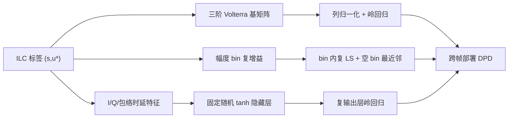
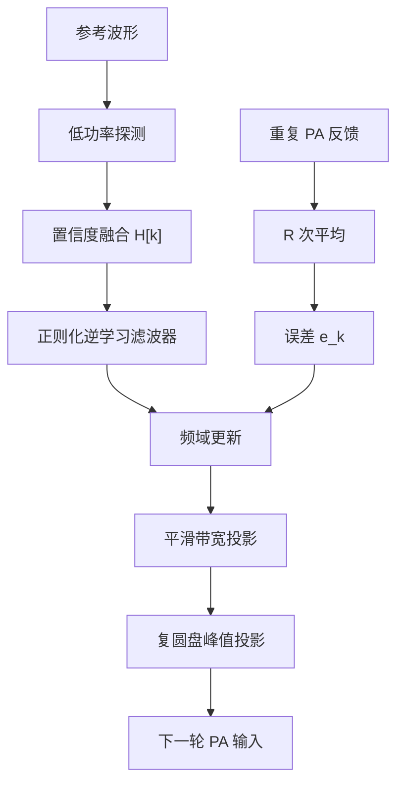

# WiFi 系统中 DPD 的 ILC 方案对比、原理与公式推导

## 1. 统一数学模型

设 WiFi 基带 OFDM 训练波形为

```math
\mathbf{s}=[s[0],s[1],\ldots,s[N-1]]^T
```

DPD 输出（即 PA 输入）为 $\mathbf{u}_k$。第 $k$ 次迭代后，经 PA、反馈采样以及时延、相位和增益校准后的输出为

```math
\mathbf{y}_k=\mathcal{P}(\mathbf{u}_k)+\mathbf{v}_k
```

其中，$\mathcal{P}(\cdot)$ 是 PA 非线性动态系统，$\mathbf{v}_k$ 是反馈噪声、量化误差和同步残差等。目标输出一般设为线性放大版本：

```math
\mathbf{r}=G\mathbf{s}
```

误差为

```math
\mathbf{e}_k=\mathbf{r}-\mathbf{y}_k
```

ILC 的核心是利用上一轮误差修正下一轮 PA 输入：

```math
\boxed{\mathbf{u}_{k+1}=\mathbf{Q}\left(\mathbf{u}_k+\mathbf{L}\mathbf{e}_k\right)}
```

其中，$\mathbf{L}$ 是学习滤波器或学习增益，$\mathbf{Q}$ 是可选的稳定滤波器、限幅器或带宽约束投影。

WiFi OFDM 信号具有高 PAPR，宽带时 PA 记忆效应会增强，因此 DPD/ILC 通常不仅要抑制 AM-AM、AM-PM 非线性，还要处理记忆效应、EVM、频谱再生和邻道泄漏。

## 2. 各类 ILC 方案总览

| 方案 | 更新对象 | 是否需要 PA 模型 | 典型公式 | 优点 | 缺点 | WiFi 适用性 |
|---|---|---|---|---|---|---|
| 标量 P 型 ILC | 每个采样点的 PA 输入 $\mathbf{u}$ | 不需要 | $\mathbf{u}_{k+1}=\mathbf{u}_k+\mu\mathbf{e}_k/G$ | 最简单，容易实现 | 收敛慢，对 PA 相位和记忆效应处理不足 | 初步验证、窄带或弱记忆 PA |
| 复增益归一化 ILC | $\mathbf{u}$ | 仅需线性小信号增益估计 | $L=\mu h^*/(\lvert h\rvert^2+\lambda)$ | 比标量 ILC 稳，可处理复相位 | 不能充分处理频率选择性记忆 | 20/40/80 MHz WLAN |
| 滤波/FIR ILC | $\mathbf{u}$ | 需要线性频响估计 | $\mathbf{u}_{k+1}=\mathbf{Q}(\mathbf{u}_k+\mathbf{l}*\mathbf{e}_k)$ | 可补偿线性记忆效应 | $\mathbf{L}$、$\mathbf{Q}$ 设计较复杂 | 宽带 WiFi |
| 频域/子载波 ILC | OFDM 频域或 FFT bin | 需要频域响应估计 | $U_{k+1}[m]=Q[m](U_k[m]+L[m]E_k[m])$ | 与 OFDM 天然匹配，可按子载波加权 EVM | 对时域非线性记忆仅作等效处理 | 160/320 MHz WiFi 调试 |
| Newton/Gauss-Newton ILC | $\mathbf{u}$ | 需要 PA 雅可比或行为模型 | $\Delta\mathbf{u}=(\mathbf{J}^H\mathbf{J}+\lambda I)^{-1}\mathbf{J}^H\mathbf{e}$ | 收敛快，可处理强非线性和记忆 | 复杂度高，模型失配可能发散 | 离线标定、实验室测量 |
| 参数域 ILC / DLA 式迭代 | DPD 参数 $\boldsymbol\theta$ | 需要 DPD 基函数，有时需要 PA 模型 | $\boldsymbol\theta_{k+1}=\boldsymbol\theta_k+\Delta\boldsymbol\theta$ | 直接得到可部署 DPD | 目标函数非凸，调参困难 | 在线或准在线自适应 |
| ILC 标签 + MP/GMP/Volterra | 先学习 $\mathbf{u}^\star$，再拟合模型 | 不需要精确 PA 模型 | $\hat\theta=(\Phi^H\Phi+\lambda I)^{-1}\Phi^H\mathbf{u}^\star$ | 鲁棒、工程常用 | 依赖训练波形覆盖度 | WiFi DPD 推荐路线之一 |
| ILC 标签 + LUT | LUT 表项 | 不需要 | $c_b=\frac{\sum_{n\in\mathcal B_b}s^*[n]u^\star[n]}{\sum_{n\in\mathcal B_b}\lvert s[n]\rvert^2+\lambda}$ | 实现简单、硬件友好 | 记忆效应处理弱，表大时资源高 | 低成本 WiFi PA |
| ILC 标签 + NN | NN 权重 | 不需要精确 PA 模型 | $\min_\theta\sum_i\lVert F_\theta(\mathbf{s}_i)-\mathbf{u}_i^\star\rVert_2^2$ | 表达能力强，适合强记忆宽带 PA | 训练和硬件部署复杂 | 高阶 WiFi 6/7 宽带 PA |
| 增广 ILC：IQ/MIMO/Crosstalk | 多通道 $\mathbf{u}$ 和 $\mathbf{u}^*$ | 可模型辅助，也可模型无关 | $\underline{\mathbf{u}}_{k+1}=\underline{\mathbf{u}}_k+\mathbf{L}_a\underline{\mathbf{e}}_k$ | 可同时补偿 PA、IQ 不平衡和串扰 | 维度高，反馈链复杂 | MIMO WiFi FEM/模组 |
| 约束/联合 CFR-DPD ILC | $\mathbf{u}$，并限制峰值 | 不一定 | $\mathbf{u}_{k+1}=\Pi_{\mathcal{C}}(\mathbf{u}_k+\mathbf{L}\mathbf{e}_k)$ | 控制 PAPR，保护 DAC/PA | EVM 与 ACLR 之间需要权衡 | 高 PAPR OFDM |
| 噪声/量化感知 ILC | 学习律和反馈链 | 不一定 | $\mathbf{L}=\mu(\mathbf{H}^H\mathbf{H}+\lambda\mathbf{I})^{-1}\mathbf{H}^H$ | 改善反馈 SNR 和收敛稳定性 | 依赖仪表与接收链设置 | 160/320 MHz WiFi 尤其关键 |

> MP、GMP、Volterra、LUT 和 NN 本身是 DPD 模型结构，不是 ILC 更新律。工程中常将两者组合：ILC 负责寻找“理想 PA 输入”，模型负责把理想输入拟合为可部署、可泛化的 DPD。

## 3. 各方案原理与公式推导

### 3.1 标量 P 型 ILC

#### 原理

假设 PA 在当前工作点附近可以近似为复线性增益：

```math
\mathbf{y}_k\approx h\mathbf{u}_k
```

采用最简单的更新：

```math
\boxed{\mathbf{u}_{k+1}=\mathbf{u}_k+\mu\frac{1}{h}\mathbf{e}_k}
```

若只知道目标增益 $G$，也常写为

```math
\mathbf{u}_{k+1}=\mathbf{u}_k+\mu\frac{1}{G}\mathbf{e}_k
```

#### 推导

由

```math
\mathbf{y}_{k+1}\approx h\mathbf{u}_{k+1}
=h\left(\mathbf{u}_k+\mu h^{-1}\mathbf{e}_k\right)
=\mathbf{y}_k+\mu\mathbf{e}_k
```

可得

```math
\mathbf{e}_{k+1}=\mathbf{r}-\mathbf{y}_{k+1}
=(1-\mu)\mathbf{e}_k
```

收敛条件为

```math
\boxed{\lvert 1-\mu\rvert<1}
```

若 $\mu$ 为实数，则

```math
\boxed{0<\mu<2}
```

上述 $0<\mu<2$ 只在逆增益准确、局部模型为 $y=hu$ 且 $\mu$ 为实数时成立。若更新使用估计值 $\hat h$，则误差因子变为 $1-\mu h/\hat h$，实际收敛条件是

```math
\boxed{\left\lvert 1-\mu\frac{h}{\hat h}\right\rvert<1}
```

该方法适合第一版验证，但对宽带 WiFi PA 的记忆效应、频率选择性和强压缩区非线性补偿不足。

### 3.2 复增益归一化 ILC

PA 不仅有增益压缩，也有相位旋转。若

```math
y[n]\approx hu[n],\quad h\in\mathbb{C}
```

则可取学习增益

```math
\boxed{L=\mu\frac{h^*}{\lvert h\rvert^2+\lambda}}
```

更新为

```math
\boxed{u_{k+1}[n]=u_k[n]+Le_k[n]}
```

其中 $\lambda>0$ 用于防止 $\lvert h\rvert$ 很小时噪声被放大。

为求修正量 $\Delta u$，构造正则化最小二乘问题：

```math
\Delta u=\arg\min_{\Delta u}\left\lvert e-h\Delta u\right\rvert^2
+\lambda\left\lvert\Delta u\right\rvert^2
```

对 $\Delta u^*$ 求导并令其为零：

```math
-h^*(e-h\Delta u)+\lambda\Delta u=0
```

因此

```math
\boxed{\Delta u=\mu\frac{h^*}{\lvert h\rvert^2+\lambda}e}
```

该方法比标量 ILC 更稳定，能修正 PA 的平均相位响应；但对于 160/320 MHz WiFi，单个复增益仍不足以描述频率响应和记忆效应。

### 3.3 滤波器型 ILC

将 PA 在当前工作点附近线性化为 LTI 系统：

```math
\mathbf{y}_k\approx\mathbf{H}\mathbf{u}_k
```

其中 $\mathbf{H}$ 是卷积矩阵。更新律为

```math
\boxed{\mathbf{u}_{k+1}=\mathbf{Q}\left(\mathbf{u}_k+\mathbf{L}\mathbf{e}_k\right)}
```

$\mathbf{L}$ 可为 FIR 学习滤波器，$\mathbf{Q}$ 可实现低通、带限、平滑或稳定约束。忽略 $\mathbf{Q}$ 时：

```math
\mathbf{y}_{k+1}\approx\mathbf{H}(\mathbf{u}_k+\mathbf{L}\mathbf{e}_k)
=\mathbf{y}_k+\mathbf{H}\mathbf{L}\mathbf{e}_k
```

所以

```math
\boxed{\mathbf{e}_{k+1}=(\mathbf{I}-\mathbf{H}\mathbf{L})\mathbf{e}_k}
```

收敛条件为

```math
\boxed{\rho(\mathbf{I}-\mathbf{H}\mathbf{L})<1}
```

若近似为循环卷积，FFT 后有

```math
E_{k+1}[\omega]=(1-H[\omega]L[\omega])E_k[\omega]
```

可取正则化逆

```math
\boxed{L[\omega]=\mu\frac{H^*[\omega]}{\lvert H[\omega]\rvert^2+\lambda}}
```

于是

```math
E_{k+1}[\omega]=\left(1-\mu\frac{\lvert H[\omega]\rvert^2}{\lvert H[\omega]\rvert^2+\lambda}\right)E_k[\omega]
```

通常取 $0<\mu<2$，并用 $\lambda$ 抑制深衰落频点的噪声放大。这是宽带 WiFi 中很实用的形式。

### 3.4 频域/子载波 ILC

WiFi 使用 OFDM，EVM 等指标天然在子载波上定义。将误差变换到频域：

```math
E_k[m]=R[m]-Y_k[m]
```

按子载波更新：

```math
\boxed{U_{k+1}[m]=Q[m]\left(U_k[m]+L[m]E_k[m]\right)}
```

若频点 $m$ 的小信号响应为 $H[m]$，则

```math
Y_k[m]\approx H[m]U_k[m]
```

从而

```math
E_{k+1}[m]=(1-H[m]L[m])E_k[m]
```

取

```math
\boxed{L[m]=\mu\frac{H^*[m]}{\lvert H[m]\rvert^2+\lambda}}
```

可实现逐频点收敛。WiFi 中还可使用加权目标函数：

```math
J=\sum_{m\in\mathcal{D}}w_m\lvert E[m]\rvert^2
+\alpha\sum_{m\in\mathcal{A}}\lvert Y[m]\rvert^2
```

其中 $\mathcal{D}$ 为数据子载波，$\mathcal{A}$ 为邻道或频谱模板关注区，$w_m$ 是 EVM 权重，$\alpha$ 是频谱泄漏权重。这样可以兼顾 EVM 与 ACLR/频谱模板。

这里的频域更新必须基于**过采样后的完整 FFT 频带**，并令邻道目标为 $R[m]=0$。如果只更新 WiFi 的已占用子载波，就只能改善带内 EVM，无法生成抵消 PA 频谱再生所需的带外预失真分量。PA 仍是非线性系统，因此 $H[m]$ 只是当前迭代点附近的局部等效响应，而不是完整的非线性 PA 模型。

### 3.5 Newton / Gauss-Newton ILC

把问题写成求根：

```math
\mathbf{F}(\mathbf{u})=\mathcal{P}(\mathbf{u})-\mathbf{r}=0
```

Newton 更新为

```math
\mathbf{u}_{k+1}=\mathbf{u}_k-\mathbf{J}_k^{-1}\mathbf{F}(\mathbf{u}_k)
```

由于 $\mathbf{F}(\mathbf{u}_k)=-\mathbf{e}_k$，因此

```math
\boxed{\mathbf{u}_{k+1}=\mathbf{u}_k+\mathbf{J}_k^{-1}\mathbf{e}_k}
```

其中

```math
\mathbf{J}_k=\left.\frac{\partial\mathcal{P}(\mathbf{u})}{\partial\mathbf{u}}\right|_{\mathbf{u}=\mathbf{u}_k}
```

宽带 PA 的 $\mathbf{J}_k$ 规模大且可能病态，通常求解

```math
\Delta\mathbf{u}_k=\arg\min_{\Delta\mathbf{u}}
\left\lVert\mathbf{e}_k-\mathbf{J}_k\Delta\mathbf{u}\right\rVert_2^2
+\lambda\left\lVert\Delta\mathbf{u}\right\rVert_2^2
```

得到

```math
\boxed{\Delta\mathbf{u}_k=(\mathbf{J}_k^H\mathbf{J}_k+\lambda I)^{-1}\mathbf{J}_k^H\mathbf{e}_k}
```

并更新

```math
\boxed{\mathbf{u}_{k+1}=\mathbf{u}_k+\mu\Delta\mathbf{u}_k}
```

对于非严格复解析的 PA（如存在 IQ 不平衡、偶次项和镜像），使用增广形式：

```math
\delta\mathbf{y}\approx\mathbf{J}_u\delta\mathbf{u}+\mathbf{J}_{u^*}\delta\mathbf{u}^*
```

```math
\begin{bmatrix}\delta\mathbf{y}\\\delta\mathbf{y}^*\end{bmatrix}
=
\underbrace{\begin{bmatrix}
\mathbf{J}_u&\mathbf{J}_{u^*}\\
\mathbf{J}_{u^*}^*&\mathbf{J}_u^*
\end{bmatrix}}_{\mathbf{J}_a}
\begin{bmatrix}\delta\mathbf{u}\\\delta\mathbf{u}^*\end{bmatrix}
```

于是

```math
\boxed{\Delta\underline{\mathbf{u}}=(\mathbf{J}_a^H\mathbf{J}_a+\lambda I)^{-1}\mathbf{J}_a^H\underline{\mathbf{e}}}
```

Newton/Gauss-Newton ILC 收敛快，但需要 PA 行为模型或数值雅可比，适合实验室离线标定。

### 3.6 参数域 ILC / DLA 式迭代

假设 DPD 为线性参数模型：

```math
\mathbf{u}_k=F_{\boldsymbol\theta_k}(\mathbf{s})=\mathbf{\Phi}(\mathbf{s})\boldsymbol\theta_k
```

目标函数为

```math
J(\boldsymbol\theta)=\left\lVert\mathbf{r}-\mathcal{P}(\boldsymbol{\Phi}\boldsymbol\theta)\right\rVert_2^2
```

在当前参数附近线性化：

```math
\mathcal{P}(\boldsymbol{\Phi}(\boldsymbol\theta+\Delta\boldsymbol\theta))
\approx\mathbf{y}_k+\mathbf{J}_k\boldsymbol{\Phi}\Delta\boldsymbol\theta
```

求解

```math
\Delta\boldsymbol\theta=
\arg\min_{\Delta\boldsymbol\theta}
\left\lVert\mathbf{e}_k-\mathbf{J}_k\boldsymbol{\Phi}\Delta\boldsymbol\theta\right\rVert_2^2
+\lambda\left\lVert\Delta\boldsymbol\theta\right\rVert_2^2
```

得到

```math
\boxed{\Delta\boldsymbol\theta=(\boldsymbol{\Phi}^H\mathbf{J}_k^H\mathbf{J}_k\boldsymbol{\Phi}+\lambda\mathbf{I})^{-1}\boldsymbol{\Phi}^H\mathbf{J}_k^H\mathbf{e}_k}
```

若近似 $\mathbf{J}_k\approx GI$，则

```math
\boxed{\Delta\boldsymbol\theta\approx\frac{1}{G}(\boldsymbol{\Phi}^H\boldsymbol{\Phi}+\lambda\mathbf{I})^{-1}\boldsymbol{\Phi}^H\mathbf{e}_k}
```

更新为

```math
\boxed{\boldsymbol\theta_{k+1}=\boldsymbol\theta_k+\mu\Delta\boldsymbol\theta}
```

参数域 ILC 的优点是直接得到可部署模型；缺点是目标函数可能非凸，在强压缩区或反馈噪声大时容易不稳定。

### 3.7 ILC 标签 + MP/GMP/Volterra 拟合

该方法分为两个阶段。

**阶段 1：用波形 ILC 得到理想 PA 输入**

```math
\mathbf{u}^\star\approx\arg\min_{\mathbf{u}}
\left\lVert\mathbf{r}-\mathcal{P}(\mathbf{u})\right\rVert_2^2
```

**阶段 2：训练可泛化 DPD 模型**

```math
F_\theta(\mathbf{s})\approx\mathbf{u}^\star
```

#### MP 模型

Memory Polynomial 为

```math
\boxed{u[n]=\sum_{m=0}^{M}\sum_{p\in\mathcal{P}}
\theta_{p,m}s[n-m]\lvert s[n-m]\rvert^{p-1}}
```

构造基函数矩阵：

```math
\mathbf{u}^\star=\boldsymbol{\Phi}_{\mathrm{MP}}\boldsymbol\theta+\boldsymbol\epsilon
```

岭回归/正则化 LS 解为

```math
\boxed{\hat{\boldsymbol\theta}=(\boldsymbol{\Phi}_{\mathrm{MP}}^H\boldsymbol{\Phi}_{\mathrm{MP}}+\lambda\mathbf{I})^{-1}\boldsymbol{\Phi}_{\mathrm{MP}}^H\mathbf{u}^\star}
```

#### GMP 模型

GMP 加入交叉记忆项：

```math
u[n]=\sum_{m,p}a_{p,m}s[n-m]\lvert s[n-m]\rvert^{p-1}
```

```math
+\sum_{m,l,p}b_{p,m,l}s[n-m]\lvert s[n-m-l]\rvert^{p-1}
```

```math
+\sum_{m,l,p}c_{p,m,l}s[n-m-l]\lvert s[n-m]\rvert^{p-1}
```

统一写成

```math
\mathbf{u}^\star=\boldsymbol{\Phi}_{\mathrm{GMP}}\boldsymbol\theta+\boldsymbol\epsilon
```

其解为

```math
\boxed{\hat{\boldsymbol\theta}=(\boldsymbol{\Phi}_{\mathrm{GMP}}^H\boldsymbol{\Phi}_{\mathrm{GMP}}+\lambda\mathbf{I})^{-1}\boldsymbol{\Phi}_{\mathrm{GMP}}^H\mathbf{u}^\star}
```

GMP 通常比 MP 更适合宽带 WiFi，因为它能描述包络滞后/超前造成的记忆效应。

#### Volterra/DDR 模型

对复基带信号，完整 Volterra 展开必须同时包含 $s$ 和 $s^*$。一种通用写法为

```math
u[n]=\sum_{p=0}^{P}\sum_{q=0}^{Q}
\sum_{\boldsymbol\tau}\sum_{\boldsymbol\kappa}
h_{p,q}[\boldsymbol\tau,\boldsymbol\kappa]
\prod_{i=1}^{p}s[n-\tau_i]
\prod_{j=1}^{q}s^*[n-\kappa_j],qquad p+q\ge 1
```

其中 $\boldsymbol\tau$ 和 $\boldsymbol\kappa$ 分别是非共轭项与共轭项的记忆索引。该模型表达能力强，但复杂度极高；实际带通信号的等效复基带模型还会根据频带选择规则删去大量不会落回工作带内的项，因此工程中常使用 DDR、简化 Volterra 或 GMP。

ILC 标签结合 MP/GMP/Volterra 是 WiFi DPD 中很实用的路线：ILC 提供高质量“教师标签”，参数模型则泛化到其他 WiFi 包、MCS、功率点和温度。

### 3.8 ILC 标签 + LUT 拟合

Memoryless LUT 可写为

```math
u[n]=c_{b(n)}s[n],\qquad b(n)=\operatorname{bin}(\lvert s[n]\rvert)
```

对每个 bin $b$ 求

```math
c_b=\arg\min_c\sum_{n\in\mathcal{B}_b}
\left\lvert u^\star[n]-cs[n]\right\rvert^2+\lambda\lvert c\rvert^2
```

对 $c^*$ 求导并令其为零，得到

```math
\boxed{c_b=\frac{\sum_{n\in\mathcal{B}_b}s^*[n]u^\star[n]}{\sum_{n\in\mathcal{B}_b}\lvert s[n]\rvert^2+\lambda}}
```

若直接迭代更新 LUT，则

```math
\boxed{c_{b,k+1}=c_{b,k}+\mu
\frac{G^*\sum_{n\in\mathcal{B}_b}s^*[n]e_k[n]}
{\lvert G\rvert^2\sum_{n\in\mathcal{B}_b}\lvert s[n]\rvert^2+\lambda}}
```

这里假定 bin 内输出增量满足 $\Delta y[n]\approx G\,\Delta c_b\,s[n]$；上式是该局部模型下的正则化最小二乘更新。LUT 实现简单，但性能依赖表长。对于 160/320 MHz 的宽带记忆效应，单纯 memoryless LUT 通常不足，需要 memory LUT 或 GMP。

### 3.9 ILC 标签 + NN DPD

用 ILC 获得多组训练数据

```math
\{(\mathbf{s}_i,\mathbf{u}_i^\star)\}_{i=1}^{N_t}
```

训练神经网络 DPD：

```math
\boxed{\hat\theta=\arg\min_\theta\sum_i
\left\lVert F_\theta(\mathbf{s}_i)-\mathbf{u}_i^\star\right\rVert_2^2+\lambda R(\theta)}
```

$F_\theta$ 可采用 RVTDNN、ARVTDNN、CNN、GRU/LSTM、TCN、残差 NN、复值 NN 或实值 I/Q 双分支 NN。

ILC 标签训练直接学习

```math
F_\theta(\mathbf{s})\rightarrow\mathbf{u}^\star
```

而端到端 DLA 训练的目标为

```math
\min_\theta\left\lVert\mathbf{r}-\widehat{\mathcal{P}}(F_\theta(\mathbf{s}))\right\rVert_2^2
```

ILC 标签法不需要可微 PA 模型，训练通常更稳定；端到端法更直接，但依赖 PA 模型精度。

### 3.10 增广 ILC：IQ 不平衡、镜像和 MIMO 串扰

若存在 IQ imbalance，输出同时依赖 $\mathbf{u}$ 和 $\mathbf{u}^*$：

```math
\mathbf{y}=\mathcal{P}(\mathbf{u},\mathbf{u}^*)
```

MIMO 中还存在分支串扰：

```math
\mathbf{y}_i=\mathcal{P}_i(\mathbf{u}_1,\ldots,\mathbf{u}_M,
\mathbf{u}_1^*,\ldots,\mathbf{u}_M^*)
```

定义增广向量

```math
\underline{\mathbf{u}}=
\begin{bmatrix}\mathbf{u}_1\\\vdots\\\mathbf{u}_M\\\mathbf{u}_1^*\\\vdots\\\mathbf{u}_M^*\end{bmatrix},
\qquad
\underline{\mathbf{e}}=
\begin{bmatrix}\mathbf{e}_1\\\vdots\\\mathbf{e}_M\\\mathbf{e}_1^*\\\vdots\\\mathbf{e}_M^*\end{bmatrix}
```

ILC 更新为

```math
\boxed{\underline{\mathbf{u}}_{k+1}=\underline{\mathbf{u}}_k+\mathbf{L}_a\underline{\mathbf{e}}_k}
```

局部线性化后

```math
\underline{\mathbf{y}}_{k+1}\approx\underline{\mathbf{y}}_k+\mathbf{H}_a\Delta\underline{\mathbf{u}}_k
```

因此

```math
\underline{\mathbf{e}}_{k+1}=(\mathbf{I}-\mathbf{H}_a\mathbf{L}_a)\underline{\mathbf{e}}_k
```

收敛条件为

```math
\boxed{\rho(\mathbf{I}-\mathbf{H}_a\mathbf{L}_a)<1}
```

正则化逆可取

```math
\boxed{\mathbf{L}_a=\mu\mathbf{H}_a^H(\mathbf{H}_a\mathbf{H}_a^H+\lambda I)^{-1}}
```

这类方法适合 MIMO WiFi 发射机、FEM 模组，以及共享 LO 或电源导致串扰的场景。

### 3.11 约束 ILC / 联合 CFR-DPD ILC

WiFi OFDM 的高 PAPR 可能使 ILC 学到的 $\mathbf{u}^\star$ 峰值过大，造成 DAC 削顶、PA 过压缩或频谱恶化。可加入约束

```math
\lvert u[n]\rvert\le A_{\max}
```

先更新

```math
\mathbf{w}_{k+1}=\mathbf{u}_k+\mathbf{L}\mathbf{e}_k
```

再投影：

```math
\boxed{\mathbf{u}_{k+1}=\Pi_{\mathcal{C}}(\mathbf{w}_{k+1})}
```

其中

```math
\mathcal{C}=\left\{\mathbf{u}:\lvert u[n]\rvert\le A_{\max},\ \forall n\right\}
```

逐点投影的闭式解为

```math
\boxed{u_{k+1}[n]=\min\!\left(\lvert w_{k+1}[n]\rvert,A_{\max}\right)
e^{j\arg(w_{k+1}[n])}}
```

也可使用惩罚函数

```math
J(\mathbf{u})=\left\lVert\mathbf{r}-\mathcal{P}(\mathbf{u})\right\rVert_2^2
+\eta\sum_n\left[\max\!\left(0,\lvert u[n]\rvert-A_{\max}\right)\right]^2
```

对应的梯度式更新为

```math
\boxed{\mathbf{u}_{k+1}=\mathbf{u}_k+\mathbf{L}\mathbf{e}_k
-\mu_c\nabla_{\mathbf{u}^*}J_{\mathrm{CFR}}}
```

该方法适合 1024-QAM/4096-QAM、160/320 MHz 等高 PAPR 场景，需要在 EVM、频谱模板、峰值和 PA 可靠性之间权衡。

### 3.12 噪声/量化感知 ILC

真实反馈为

```math
\mathbf{y}_k^m=\mathbf{y}_k+\boldsymbol\nu_k
```

测得的误差为

```math
\mathbf{e}_k^m=\mathbf{r}-\mathbf{y}_k^m=\mathbf{e}_k-\boldsymbol\nu_k
```

直接更新时

```math
\mathbf{u}_{k+1}=\mathbf{u}_k+\mathbf{L}\mathbf{e}_k^m
=\mathbf{u}_k+\mathbf{L}\mathbf{e}_k-\mathbf{L}\boldsymbol\nu_k
```

噪声会被学习滤波器注入 PA 输入。局部线性化后的误差传播为

```math
\mathbf{e}_{k+1}\approx(\mathbf{I}-\mathbf{H}\mathbf{L})\mathbf{e}_k
+\mathbf{H}\mathbf{L}\boldsymbol\nu_k
```

频域中可使用

```math
\boxed{L[\omega]=\mu\frac{H^*[\omega]}{\lvert H[\omega]\rvert^2+\lambda[\omega]}}
```

其中

```math
\lambda[\omega]\propto\frac{S_\nu[\omega]}{S_e[\omega]}
```

即在噪声大的频点降低学习增益，避免把噪声学入输入。

同一波形重复测量 $R$ 次并平均：

```math
\bar{\mathbf{y}}_k=\frac{1}{R}\sum_{i=1}^{R}\mathbf{y}_{k,i}^m
```

若噪声独立同分布，则

```math
\operatorname{Var}(\bar{\boldsymbol\nu})=\frac{1}{R}\operatorname{Var}(\boldsymbol\nu)
```

可提升反馈 SNR。

对于宽带 OFDM，还需关注 ADC 量化、采样率、分数时延补偿、VSA reference level 和热噪声。下面的对数压缩模型只是说明“非均匀量化会改变不同幅度处的有效量化步长”，并不表示所有 VSA 或反馈 ADC 都采用对数前端：

```math
q=\frac{\log(1+ax)}{\log(1+a)},\qquad x\in[0,1]
```

若 $q$ 被均匀量化为 $M$ 个区间，第 $i$ 个门限满足

```math
q_i=\frac{i}{M}
```

反解得

```math
x_i=\frac{(1+a)^{i/M}-1}{a}
```

等效量化步长为

```math
\Delta_i=x_i-x_{i-1}
=\frac{(1+a)^{(i-1)/M}\left((1+a)^{1/M}-1\right)}{a}
```

当 $i$ 较小时，即低幅度区域，$\Delta_i$ 更小，因此低幅度 OFDM 样本的量化噪声更低。

### 3.13 工程中三种部署模型的精确实现

前面给出了 Volterra、LUT 和神经网络 DPD 的一般形式。本节进一步说明 `DeploymentModels.py` 实际采用的有限结构，避免把一般理论误认为代码已经实现的全部能力。

#### 简化三阶复 Volterra

`BuildVolterraSpecs` 首先生成 $M$ 个线性记忆项：

```math
\phi_m[n]=s[n-m],
\qquad 0\le m<M.
```

然后生成满足 $0\le m_1\le m_2<M$、$0\le m_3<M$ 的三阶基函数：

```math
\phi_{m_1,m_2,m_3}[n]
=s[n-m_1]s[n-m_2]s^*[n-m_3].
```

所以代码实际模型为：

```math
\boxed{
u[n]
=\sum_{m=0}^{M-1}a_m s[n-m]
+\sum_{m_1=0}^{M-1}
 \sum_{m_2=m_1}^{M-1}
 \sum_{m_3=0}^{M-1}
 b_{m_1,m_2,m_3}
 s[n-m_1]s[n-m_2]s^*[n-m_3]
}
```

限制 $m_1\le m_2$ 是因为两个非共轭因子的乘法可交换，去掉重复列不会损失这一结构的表达能力。总特征数为：

```math
N_{\mathrm{feature}}
=M+\frac{M(M+1)}{2}M.
```

`DelaySignal` 对负时间样点补零，对应静止初始条件；`BuildVolterraBasis` 构造矩阵 $\boldsymbol\Phi$；`VolterraPredistorter.Process` 计算 $\boldsymbol\Phi\mathbf c$。

拟合时先对每一列除以其 RMS 尺度 $d_j$：

```math
\widetilde{\boldsymbol\Phi}
=\boldsymbol\Phi\mathbf D^{-1},
\qquad
\mathbf D=\operatorname{diag}(d_1,\ldots,d_P).
```

然后求正则化解：

```math
\widetilde{\mathbf c}
=\left(
\widetilde{\boldsymbol\Phi}^{H}
\widetilde{\boldsymbol\Phi}
+\lambda\bar d\mathbf I
\right)^{-1}
\widetilde{\boldsymbol\Phi}^{H}\mathbf u^*.
```

其中 $\bar d$ 是正规矩阵对角线实部的平均值。最后恢复原始坐标：

```math
\mathbf c=\mathbf D^{-1}\widetilde{\mathbf c}.
```

列归一化防止高阶小幅度基函数在数值上被一阶项淹没；岭正则化则抑制高度相关的 Volterra 列导致的病态放大。

#### 幅度分箱复增益 LUT

`FitLutPredistorter` 把参考幅度区间等宽分为 $B$ 个 bin。第 $b$ 个 bin 的标签集合记为 $\mathcal B_b$，复增益为：

```math
\boxed{
c_b
=\frac{
\sum_{n\in\mathcal B_b}s^*[n]u^*[n]
}{
\sum_{n\in\mathcal B_b}|s[n]|^2+\lambda
}
}
```

部署时 `LUTPredistorter.Process` 根据 $|s[n]|$ 查表并计算：

```math
u[n]=c_{b(n)}s[n].
```

有限训练帧经常没有覆盖某些高幅度 bin。代码使用最近的已填充 bin 系数补空项，相当于零阶保持外推；这样避免空 bin 突然回到单位增益，但不能代替充分的峰值训练覆盖。

#### 固定隐藏层的时延神经 DPD

`BuildNeuralInputs` 对每个时延 $m$ 构造三个实特征：

```math
\mathbf q[n]
=\left[
\Re s[n],\Im s[n],|s[n]|,
\ldots,
\Re s[n-M+1],\Im s[n-M+1],|s[n-M+1]|
\right].
```

每列执行标准化：

```math
\widetilde q_j[n]
=\frac{q_j[n]-\mu_j}{\max(\sigma_j,10^{-9})}.
```

隐藏层权重和偏置使用固定随机种子生成，训练过程中不反向传播：

```math
\mathbf h[n]
=\tanh\left(
\widetilde{\mathbf q}[n]\mathbf W_h+\mathbf b_h
\right).
```

最终设计向量同时包含偏置、线性跳连和非线性隐藏特征：

```math
\boldsymbol\psi[n]
=\left[1,\widetilde{\mathbf q}[n],\mathbf h[n]\right].
```

只有复数输出权重通过岭回归求解：

```math
\boxed{
\mathbf W_o
=\left(
\boldsymbol\Psi^T\boldsymbol\Psi
+\lambda\bar d\mathbf I
\right)^{-1}
\boldsymbol\Psi^T\mathbf u^*
}
```

该结构属于 ELM 风格的随机特征网络。优点是不依赖深度学习框架、结果可复现、求解稳定；局限是隐藏层没有通过梯度训练，因此不等价于完整 RVTDNN、CNN 或循环网络。



**图 4 说明**：三条部署路线共享同一批 ILC 教师标签，但使用不同的函数空间。Volterra 显式枚举多时延乘积，LUT 只按瞬时幅度分段，神经模型用随机非线性特征压缩复杂关系。比较它们时必须使用同一独立验证帧。

### 3.14 代码中 ILC 辅助函数的数值原理

#### 低功率探测与频响置信度融合

`EstimateComplexGain` 和频域 ILC 都先缩小参考 RMS 得到探测波形，使 PA 工作在局部小信号区。频点原始估计为：

```math
\hat H[k]
=\frac{Y_p[k]X_p^*[k]}
       {|X_p[k]|^2+P_{\mathrm{floor}}}.
```

低激励频点容易被数值误差或噪声支配，因此使用置信度：

```math
w[k]
=\frac{|X_p[k]|^2}
       {|X_p[k]|^2+P_{\mathrm{floor}}}.
```

最终响应在逐频点估计和标量复增益之间平滑融合：

```math
\boxed{
H_{\mathrm{local}}[k]
=w[k]\hat H[k]+(1-w[k])\hat g
}
```

这就是 `EstimateFrequencyResponse` 和 `RunFrequencyDomainIlc` 避免频谱零点处除法爆炸的原因。

#### FFT 长度、带宽投影与峰值投影

`NextPowerOfTwo` 选择不小于帧长的最小二次幂 FFT。补零只让离散频率采样更密并提高 FFT 执行效率，不会创造新的物理频率分辨率。

频域 ILC 使用带平滑过渡的投影掩码 $Q[k]$：通带为 1，阻带为 0，过渡带使用半余弦。它限制更新占用带宽，并减少矩形截断引起的长时域振铃。

`LimitAmplitude` 实现复平面圆盘投影：

```math
\boxed{
\Pi_{A}(u)
=\begin{cases}
u,&|u|\le A,\\
A\dfrac{u}{|u|},&|u|>A.
\end{cases}
}
```

它只改变超限样点的幅度，不改变其相位。

#### 重复反馈平均

`MeasurePaOutput` 和 `MeasureOutput` 对 $R$ 次独立反馈求平均。若每次噪声方差为 $\sigma^2$，平均后为：

```math
\operatorname{Var}(\bar w)=\frac{\sigma^2}{R}.
```

对应理想 SNR 提升：

```math
\Delta\operatorname{SNR}=10\log_{10}R.
```

平均不会消除每次都相同的系统性误差、PA 失真或同步偏置。

#### 方向 Gauss-Newton 的一维实现

`RunDirectionalGaussNewtonIlc` 不构造完整雅可比，而只沿当前误差方向做有限差分。令：

```math
\alpha
=\frac{r_{\mathrm{FD}}}
       {\sqrt{\frac{1}{N}\|\mathbf e_k\|_2^2}}.
```

方向雅可比为：

```math
\mathbf j_k
\approx\frac{
\mathcal P(\mathbf u_k+\alpha\mathbf e_k)
-\mathcal P(\mathbf u_k)
}{\alpha}.
```

在 $\Delta\mathbf u=\gamma\mathbf e_k$ 的一维子空间中求正则化 LS：

```math
\boxed{
\gamma
=\frac{\mathbf j_k^H\mathbf e_k}
       {(1+\lambda)\mathbf j_k^H\mathbf j_k}
}
```

最终更新为：

```math
\mathbf u_{k+1}
=\mathbf u_k+\mu\gamma\mathbf e_k.
```

它比全 Jacobian 便宜得多，但只能在当前误差方向寻找步长，并不等价于完整 Gauss-Newton 解。

#### GMP 分块矩阵与两遍岭回归

`BuildFeatureSpecs` 枚举 GMP 主支路、滞后包络支路和超前包络支路；`DelayedSlice` 采用因果零初始条件；`BuildGmpBasisChunk` 只构造当前样本块并缓存重复时延。

`FitGmpPredistorter` 第一遍扫描计算每列 RMS 尺度，第二遍累加：

```math
\mathbf R
=\sum_c\widetilde{\boldsymbol\Phi}_c^H
        \widetilde{\boldsymbol\Phi}_c,
\qquad
\mathbf p
=\sum_c\widetilde{\boldsymbol\Phi}_c^H\mathbf u_c^*.
```

最后求：

```math
\boxed{
\widetilde{\mathbf c}
=(\mathbf R+\lambda\bar d\mathbf I)^{-1}\mathbf p
}
```

这种分块累加与一次性构造完整矩阵在代数上等价，但临时内存从 $O(NP)$ 降为 $O(CP+P^2)$，其中 $C$ 是 chunk 长度、$P$ 是特征数。



**图 5 说明**：辅助函数并非彼此无关的代码细节。低功率探测决定学习逆响应，反馈平均决定噪声地板，带宽投影决定可学习的频谱区域，峰值投影决定硬件可实现范围，它们共同控制 ILC 的收敛性与最终 EVM/ACLR。

## 4. WiFi 系统中的工程选型建议

### 场景 A：追求最佳实验室 DPD 结果

**优先选择：频域/FIR ILC + 正则化 + 多次平均。**

收敛后，再使用 **GMP 或 NN 拟合 ILC 标签**。

ILC 对固定波形效果很好，但真实 WiFi 发射包含不同 packet、MCS、功率和温度，最终仍需要可泛化模型。

### 场景 B：20/40/80 MHz WiFi，PA 记忆效应不强

**可选择：复增益归一化 ILC + MP 拟合。**

该方案复杂度低、LS 稳定，且易于硬件部署。

### 场景 C：160 MHz WiFi 6E 或 320 MHz WiFi 7，PA 记忆效应明显

**推荐：FIR/频域 ILC + GMP 拟合；也可使用 ILC 标签 + 轻量 NN。**

GMP 是传统工程首选；NN 适合强非线性、强记忆和复杂 FEM，但需考虑推理功耗与定点量化。

### 场景 D：MIMO WiFi，存在 IQ imbalance 和分支串扰

**推荐：增广 MIMO ILC + NN 或多变量 GMP。**

需要把 $\mathbf{u}$、$\mathbf{u}^*$ 以及多路发射分支联合建模，而不是对每个 PA 独立进行 SISO DPD。

### 场景 E：高 PAPR 导致 DPD 输入峰值过大

推荐约束 ILC 或 CFR-DPD 联合 ILC：

```math
\boxed{\mathbf{u}_{k+1}=\Pi_{\mathcal C}\!\left(\mathbf{u}_k+\mathbf{L}\mathbf{e}_k\right),
\quad \mathcal C=\left\{\mathbf{u}:\lvert u[n]\rvert\le A_{\max}\right\}}
```

这样可避免 ILC 为追求极低 EVM 而生成不可实现的高峰值输入。

## 5. 总结

WiFi DPD 中，ILC 负责寻找“这个 WiFi 波形应该怎样预失真”；MP、GMP、LUT、Volterra 或 NN 则负责把 ILC 结果变成可部署、可泛化的 DPD 模型。

推荐的工程路线为：

**正则化 FIR/频域 ILC → 得到 $\mathbf{u}^\star$ → GMP 或轻量 NN 拟合 → EVM、ACLR 与频谱模板验证。**

对于 WiFi 7 320 MHz、强记忆 PA 或 MIMO FEM，应进一步加入**反馈噪声/量化优化、增广 IQ/MIMO 建模和 CFR 约束**。
