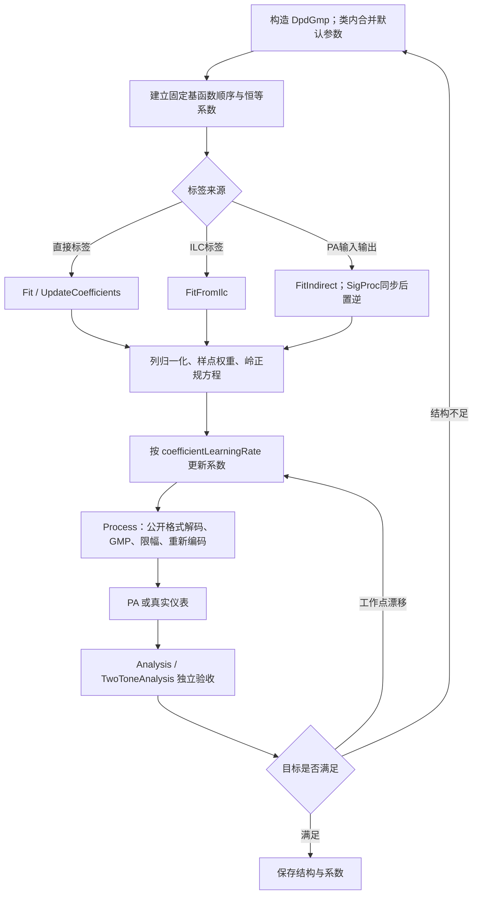

# `DpdGmp.py` 程序使用手册

`inc/lib/DpdGmp.py` 提供独立、面向对象的 SISO GMP 数字预失真器。它负责：

- 构造 main、lagging-envelope、leading-envelope GMP 基函数；
- 从直接标签、ILC 标签或 PA 输入/输出采集训练系数；
- 用岭正则、峰值权重、多片段权重和增量学习更新系数；
- 对新波形执行 DPD；
- 在浮点或定点公开接口下保持一致的复数数组容器。

它不负责生成 Wi-Fi、运行 PA、计算 EVM/ACLR/互调或绘图。这些职责分别属于 `WaveGenWifi`、`PaModel`、`Analysis`、`TwoToneAnalysis` 和 `Draw`。

完整数学推导见 [DPD-GMP 原理文档](./DPD-GMP.md)。

---

## 1. 类与返回对象

### 1.1 `DpdGmp`

```python
DpdGmp(
    parameters=None,
    width=None,
    **parameterOverrides,
)
```

构造函数在类内部建立默认参数，再用 `ChainMap` 叠加外部配置。调用方只传需要修改的键，不需要复制默认参数表。

优先级为：

```text
显式关键字覆盖
    >
parameters 外部映射
    >
类内部默认值
```

未知配置会产生 `UserWarning` 并被忽略，已识别参数继续生效。

### 1.2 `DpdGmpTrainingResult`

所有训练和更新接口返回不可变结果：

| 字段 | 含义 |
|---|---|
| `sampleCount` | 本次训练使用的总样点数 |
| `segmentCount` | 独立片段数 |
| `featureCount` | GMP 系数数量 |
| `beforeNmseDb` | 更新前对本批标签的加权 NMSE |
| `afterNmseDb` | 更新后对本批标签的加权 NMSE |
| `regularizedConditionNumber` | 正则化正规矩阵条件数 |
| `normalizedCoefficientUpdateNorm` | 归一化系数变化的二范数 |

`ToDict()` 返回普通字典，便于保存为 JSON 或 CSV。

---

## 2. 完整参数表

| 参数 | 默认值 | 类型 | 作用 |
|---|---:|---|---|
| `nonlinearOrders` | `(1, 3, 5, 7)` | 递增奇数元组 | GMP 使用的非线性阶数；必须包含 1 |
| `memoryDepth` | `3` | 正整数 | main 支路和每个交叉支路的复载波记忆深度 |
| `crossMemoryDepth` | `2` | 非负整数 | lagging/leading 包络的最大交叉延迟 |
| `ridgeFactor` | `1e-6` | 正数 | 归一化正规方程的岭正则强度 |
| `coefficientLearningRate` | `1.0` | `(0,1]` | 当前系数向本次回归解移动的比例 |
| `chunkSize` | `8192` | 不小于 64 的整数 | 分块构建设计矩阵的样点数 |
| `peakWeightExponent` | `0.0` | 非负数 | 训练时包络峰值权重指数；0 表示关闭 |
| `maximumOutputMagnitude` | `2.0` | 正数或 `None` | 归一化 DPD 输出包络上限；`None` 关闭 |
| `width` | `16` | 0 至 53 的整数 | 0 为浮点接口；正数为公开 I/Q 整数码位宽 |

例如，只覆盖阶数、记忆和浮点模式：

```python
from inc.lib.DpdGmp import DpdGmp

dpd = DpdGmp(
    parameters={
        "nonlinearOrders": (1, 3, 5),
        "memoryDepth": 4,
        "crossMemoryDepth": 2,
        "width": 0,
    }
)
```

外部映射保持活动状态：

```python
dpdParameters = {
    "ridgeFactor": 1.0e-5,
    "width": 0,
}

dpd = DpdGmp(parameters=dpdParameters)
dpdParameters["ridgeFactor"] = 1.0e-4

print(dpd.GetParameters()["ridgeFactor"])
```

结构参数在外部映射中改变后，下一次查询、训练或推理会自动验证新结构并恢复恒等系数，避免旧系数与新基函数错位。若需要立即完成验证和重建，可调用 `UpdateParameters`。

---

## 3. 方法总览

| 方法 | 输入 | 输出 | 用途 |
|---|---|---|---|
| `GetParameters()` | 无 | `dict` | 获取当前解析后的参数快照 |
| `UpdateParameters(**overrides)` | 参数覆盖 | `None` | 更新配置；结构变化时重建并重置系数 |
| `GetFeatureSpecs()` | 无 | `tuple` | 查看每个系数对应的 branch/order/memory/cross 索引 |
| `GetCoefficients()` | 无 | `numpy.ndarray` | 获取系数副本 |
| `SetCoefficients(coefficients)` | 一维复系数 | `None` | 恢复外部保存的系数 |
| `ResetCoefficients()` | 无 | `None` | 恢复恒等 DPD |
| `Process(inputSignal)` | 公开浮点或定点波形 | 同公开格式波形 | 对外推荐的 DPD 推理入口 |
| `ProcessFloating(inputSignal)` | 归一化浮点波形 | 归一化浮点波形 | 内部或已明确解码后的推理入口 |
| `CalculateNmse(reference, target, weights=None)` | 波形对及可选权重 | `float` | 评估当前系数的标签 NMSE |
| `Fit(reference, target, weights=None)` | 一个波形对 | `DpdGmpTrainingResult` | 先重置，再从直接标签训练 |
| `UpdateCoefficients(reference, target, weights=None)` | 一个波形对 | `DpdGmpTrainingResult` | 以当前系数为先验增量更新 |
| `FitSegments(references, targets, segmentWeights=None, sampleWeights=None)` | 多个独立片段 | `DpdGmpTrainingResult` | 先重置，再联合多帧/多功率训练 |
| `UpdateCoefficientSegments(...)` | 多个独立片段 | `DpdGmpTrainingResult` | 用多个片段增量更新当前系数 |
| `FitFromIlc(reference, learnedInput, weights=None)` | 理想波形和 ILC 标签 | `DpdGmpTrainingResult` | 把波形专用 ILC 结果压缩成可部署 GMP |
| `FitIndirect(paInput, paOutput, sampleRateHz, signalProcessingParameters=None, sampleWeights=None)` | PA 输入/输出采集 | `DpdGmpTrainingResult` | 通过同步后的后置逆执行间接学习 |
| `GetLastTrainingResult()` | 无 | 结果或 `None` | 读取最近一次训练诊断 |

---

## 4. 最小直接训练示例

下面先构造一个已知三阶目标映射，再让 `DpdGmp` 拟合：

```python
import numpy as np

from inc.lib.DpdGmp import DpdGmp

randomGenerator = np.random.default_rng(7)
referenceSignal = (
    randomGenerator.standard_normal(4096)
    + 1j * randomGenerator.standard_normal(4096)
)
referenceSignal *= 0.2 / np.sqrt(
    np.mean(np.abs(referenceSignal) ** 2)
)

targetSignal = (
    1.05 * referenceSignal
    + 0.12 * referenceSignal * np.abs(referenceSignal) ** 2
)

dpd = DpdGmp(
    parameters={
        "nonlinearOrders": (1, 3),
        "memoryDepth": 1,
        "crossMemoryDepth": 0,
        "ridgeFactor": 1.0e-8,
        "maximumOutputMagnitude": None,
        "width": 0,
    }
)

trainingResult = dpd.Fit(referenceSignal, targetSignal)
predictedSignal = dpd.Process(referenceSignal)

print(trainingResult.ToDict())
print(dpd.CalculateNmse(referenceSignal, targetSignal))
```

`Fit` 先丢弃旧系数并恢复恒等模型。如果希望保留旧模型并跟踪缓慢变化的 PA，应改用 `UpdateCoefficients`。

---

## 5. 从 ILC 标签训练

这是本工程推荐的仿真流程。ILC 和 EVM 分析仍保持独立：

```python
from inc.lib.Analysis import Analysis
from inc.lib.DpdGmp import DpdGmp
from inc.lib.DpdIlc import ILCConfig, RunFrequencyDomainIlc
from inc.lib.PaModel import PaModel
from inc.lib.WaveGenWifi import WaveGenWifi
from inc.utils.SigProc import PowerCalibration

wifiWaveform = WaveGenWifi(
    parameters={
        "frameFormat": "EHT",
        "bandwidthMhz": 20,
        "sampleRateHz": 80.0e6,
        "mcs": 7,
        "numDataSymbols": 6,
        "seed": 321,
        "width": 0,
    }
).Generate()

paModel = PaModel(
    parameters={
        "modelName": "gmp",
        "width": 0,
    }
)

powerCalibration = PowerCalibration(
    paModel=paModel,
    parameters={
        "outputPowerDbm": 12.0,
        "maximumOutputPowerDbm": 25.0,
        "width": 0,
    },
)
referenceSignal = powerCalibration.Calibrate(wifiWaveform.samples)

ilcResult = RunFrequencyDomainIlc(
    referenceSignal,
    paModel,
    wifiWaveform.sampleRateHz,
    wifiWaveform.bandwidthHz,
    ILCConfig(
        numIterations=8,
        learningRate=0.10,
        regularization=1.0e-3,
        maxAmplitude=1.5,
    ),
)

dpd = DpdGmp(
    parameters={
        "nonlinearOrders": (1, 3, 5, 7),
        "memoryDepth": 5,
        "crossMemoryDepth": 3,
        "ridgeFactor": 1.0e-4,
        "peakWeightExponent": 2.0,
        "maximumOutputMagnitude": 1.5,
        "width": 0,
    }
)
trainingResult = dpd.FitFromIlc(
    referenceSignal,
    ilcResult.learnedInput,
)

predistortedSignal = dpd.Process(referenceSignal)
paOutput = paModel.Process(predistortedSignal)
metrics = Analysis(
    referenceSignal,
    wifiWaveform,
    parameters={
        "maximumOutputPowerDbm": 25.0,
        "width": 0,
    },
).Analyze(paOutput)

print(trainingResult.ToDict())
print(metrics)
```

上例最后一次 `paModel.Process` 没有重新执行输出功率闭环，适合演示接口，不适合做严格等功率比较。正式性能验收应把 `DpdGmp` 和 `PaModel` 作为完整 plant 交给 `PowerCalibration`，参考 `tests/BenchMark.py` 中的 `DpdGmpPaCascade`。

---

## 6. 多功率联合训练

假设已经分别获得 10、12、14 dBm 的理想参考和 ILC 标签：

```python
from inc.lib.DpdGmp import DpdGmp

dpd = DpdGmp(
    parameters={
        "nonlinearOrders": (1, 3, 5, 7),
        "memoryDepth": 5,
        "crossMemoryDepth": 3,
        "ridgeFactor": 1.0e-4,
        "peakWeightExponent": 2.0,
        "width": 0,
    }
)

trainingResult = dpd.FitSegments(
    referenceSignals=(
        reference10Dbm,
        reference12Dbm,
        reference14Dbm,
    ),
    targetSignals=(
        learnedInput10Dbm,
        learnedInput12Dbm,
        learnedInput14Dbm,
    ),
    segmentWeights=(1.0, 2.0, 1.0),
)
```

每个片段独立建立记忆历史，12 dBm 的正规方程贡献为其他单个片段的两倍。`segmentWeights` 不会因为片段内权重归一化而被抵消。

若每个功率还需要独立的逐样点权重：

```python
trainingResult = dpd.FitSegments(
    referenceSignals=referenceSignals,
    targetSignals=learnedInputs,
    segmentWeights=(1.0, 2.0, 1.0),
    sampleWeights=(
        weights10Dbm,
        weights12Dbm,
        weights14Dbm,
    ),
)
```

---

## 7. 增量跟踪示例

```python
from inc.lib.DpdGmp import DpdGmp

dpd = DpdGmp(
    parameters={
        "coefficientLearningRate": 0.2,
        "ridgeFactor": 1.0e-4,
        "width": 0,
    }
)

firstResult = dpd.Fit(firstReference, firstLabel)

for newReference, newLabel in capturePairs:
    updateResult = dpd.UpdateCoefficients(
        newReference,
        newLabel,
    )
    print(
        updateResult.afterNmseDb,
        updateResult.normalizedCoefficientUpdateNorm,
    )
```

若更新范数突然增大，应检查工作点、同步、反馈噪声、定点饱和和训练波形分布，而不是自动接受新系数。

---

## 8. 间接学习示例

```python
from inc.lib.DpdGmp import DpdGmp

dpd = DpdGmp(
    parameters={
        "ridgeFactor": 1.0e-4,
        "coefficientLearningRate": 0.5,
        "width": 0,
    }
)

trainingResult = dpd.FitIndirect(
    paInputSignal=measuredPaInput,
    paOutputSignal=measuredPaOutput,
    sampleRateHz=245.76e6,
    signalProcessingParameters={
        "maxIntegerDelaySamples": 512,
        "enableFractionalDelayCompensation": True,
        "enableCarrierFrequencyOffsetCompensation": True,
        "enableSamplingFrequencyOffsetCompensation": True,
        "enableComplexGainCompensation": True,
    },
)
```

`FitIndirect` 要求 PA 输入和输出数组长度相同。它调用 `SigProc` 对输出执行整数/分数时延、载波频偏、采样频偏和公共复增益补偿，然后拟合“校正后 PA 输出到真实 PA 输入”的后置逆。

真实仪表中应先确认反馈链本身不会产生明显非线性；否则间接学习会把反馈链失真一起写入 DPD 系数。

---

## 9. 峰值权重与显式评估权重

训练时只需配置：

```python
dpd = DpdGmp(
    parameters={
        "peakWeightExponent": 2.0,
        "width": 0,
    }
)
trainingResult = dpd.FitFromIlc(referenceSignal, learnedInput)
```

`CalculateNmse` 不会隐式重用训练峰值权重。若要评估相同峰值目标，需要显式提供权重：

```python
import numpy as np

relativeEnvelope = np.abs(referenceSignal)
relativeEnvelope /= max(
    float(np.max(relativeEnvelope)),
    np.finfo(float).tiny,
)
peakWeights = np.maximum(relativeEnvelope, 0.05) ** 2

peakNmseDb = dpd.CalculateNmse(
    referenceSignal,
    learnedInput,
    peakWeights,
)
```

这种分离可以同时报告普通 NMSE 和峰值加权 NMSE，避免用不同目标函数的结果互相替代。

---

## 10. 系数保存与恢复

```python
import numpy as np

featureSpecs = dpd.GetFeatureSpecs()
coefficients = dpd.GetCoefficients()

np.save("dpd_gmp_coefficients.npy", coefficients)

restoredDpd = DpdGmp(
    parameters=dpd.GetParameters()
)
restoredDpd.SetCoefficients(
    np.load("dpd_gmp_coefficients.npy")
)

assert restoredDpd.GetFeatureSpecs() == featureSpecs
```

恢复时必须使用完全相同的 `nonlinearOrders`、`memoryDepth` 和 `crossMemoryDepth`。仅保存系数而不保存结构元数据，无法知道每个系数对应哪个基函数。

---

## 11. 定点接口示例

`width=16` 时，输入和输出的容器仍为 `numpy.complex128`，但实部和虚部数值是整数码：

```python
from inc.lib.DpdGmp import DpdGmp
from inc.lib.WaveGenWifi import WaveGenWifi

wifiWaveform = WaveGenWifi(
    parameters={
        "frameFormat": "EHT",
        "bandwidthMhz": 20,
        "mcs": 7,
        "numDataSymbols": 4,
        "width": 16,
    }
).Generate()

dpd = DpdGmp(
    parameters={
        "width": 16,
    }
)

outputCodes = dpd.Process(wifiWaveform.samples)
print(outputCodes.dtype)
print(outputCodes[:8])
```

不能把 16 位整数码直接当作归一化浮点值送入 `ProcessFloating`。普通调用始终使用 `Process`，由类在入口解码、内部浮点计算、出口编码。

---

## 12. 基准测试

### 12.1 命令行

```powershell
python tests/BenchMark.py --dpd-gmp
```

指定输出目录：

```powershell
python tests/BenchMark.py --dpd-gmp --output-dir results/dpd_gmp_benchmark
```

### 12.2 Python

```python
from pathlib import Path

from tests.BenchMark import (
    DpdGmpBenchmarkConfig,
    RunDpdGmpBenchmark,
)

result = RunDpdGmpBenchmark(
    DpdGmpBenchmarkConfig(
        optimizedOutputPowerDbm=12.0,
        stressOutputPowerDbm=15.0,
        trainingPowerDbm=(10.0, 12.0, 14.0),
        width=0,
        outputDirectory=Path("results/dpd_gmp_benchmark"),
    )
)

for stage in result.stages:
    print(stage.ToDict())

for comparison in result.comparisons:
    print(comparison.ToDict())
```

输出文件包括：

| 文件 | 内容 |
|---|---|
| `dpd_gmp_stage_metrics.csv` | 每个改进阶段的 Wi-Fi、双音、标签、条件数和多功率指标 |
| `dpd_gmp_improvement_comparison.csv` | 每项措施的改进前后数值、方向和通过状态 |
| `dpd_gmp_benchmark.json` | 完整配置、阶段和比较记录 |
| `dpd_gmp_performance.png` | EVM、IM3、标签 NMSE 和条件数四联图 |

---

## 13. 工作流程



**图 1 说明：**训练层只产生 GMP 系数和数值诊断；射频性能必须由独立分析模块在 PA 输出上计算。重新训练时可保留当前系数做增量更新，也可通过 `Fit` 恢复恒等先验后重新辨识。

---

## 14. 常见错误与处理

| 现象 | 原因 | 处理 |
|---|---|---|
| `featureCount` 与保存系数长度不一致 | 恢复时 GMP 结构不同 | 同时保存和恢复结构参数 |
| 训练 NMSE 很好，独立 EVM 变差 | 过拟合、功率不一致或标签不是同一工作点 | 增大岭正则，做等输出功率独立验证 |
| 高功率 DPD EVM 比基线差 | PA 已进入不稳定或不可逆压缩区 | 输出回退，重新生成该功率附近标签 |
| 系数范数很大且随采集跳变 | 设计矩阵病态或反馈噪声过大 | 增大 `ridgeFactor`，减少冗余项，增加平均 |
| 普通 NMSE 不变，峰值 EVM 改善 | 低幅度样点仍主导普通 NMSE | 同时报告峰值加权 NMSE |
| 多功率训练最佳单点略退化 | 一个系数集在多个工作点之间折中 | 检查最差功率指标；必要时使用分功率系数库 |
| 定点输出仍是 `complex128` | 容器类型固定，但 I/Q 数值是整数码 | 检查实部/虚部是否为整数码，不要只看 dtype |

---

## 15. 使用边界

1. `DpdGmp` 当前只接受一维 SISO 波形。
2. `FitIndirect` 当前要求 PA 输入和输出长度相同；复杂仪表裁剪应先用 `SigProc` 建立共同区间。
3. `maximumOutputMagnitude` 是保护限幅，频繁触发时会引入自己的非线性。
4. `GetLastTrainingResult()` 在构造、重置或手工 `SetCoefficients` 后返回 `None`。
5. 修改结构参数会重置系数；只修改岭系数、学习率、分块长度、峰值权重或限幅不会自动重置。
6. benchmark 的默认参考结果不是硬件保证值，替换 PA 参数或反馈链后应重新运行全部比较。

---

## 16. 通道间耦合场景

### 16.1 类声明

关于为什么 PA 后逆、逐 PA GMP 和 PA 前逆必须采用当前顺序，耦合时延如何进入 PA 非线性项和因果逆，以及训练标签为何必须位于 PA 输入参考面，请阅读 [ChannelAnalyse：通道耦合条件下 DPD-GMP 的完整方案与推导](./ChannelAnalyse.md#8-通道耦合条件下-dpd-gmp-的完整方案与推导)。其中包含两个双通道例子和完整训练代码。

```python
CouplingAwareDpdGmp(
    dpdModels,
    preChannelMeasurement=None,
    postChannelMeasurement=None,
    parameters=None,
    width=None,
    **parameterOverrides,
)
```

`dpdModels` 必须按物理 PA 顺序提供至少两个 `DpdGmp` 对象。两个测量参数既可以是 `ChannelMeasurementResult`，也可以直接是形状为

```text
delay × destination × source
```

的复数冲激响应矩阵。传入 `None` 表示该位置使用单位通道。

### 16.2 参数

| 参数 | 默认值 | 含义 |
|---|---:|---|
| `compensatePrePaCoupling` | `True` | 部署时对 DAC 波形施加 PA 前通道逆 |
| `compensatePostPaCoupling` | `True` | 训练和部署时对最终目标做 PA 后去嵌入 |
| `inverseRegularization` | `1e-8` | 零时延 MIMO 矩阵 SVD 逆的正则系数 |
| `maximumInverseGainDb` | `18.0` | 最大允许逆奇异值增益 |
| `impulseTruncationDb` | `-100.0` | 删除尾部无效抽头的相对幅度门限 |
| `width` | `16` | 公开 MIMO 输入输出位宽；0 为浮点 |

### 16.3 方法

| 方法 | 输入 | 输出或作用 |
|---|---|---|
| `ConfigureChannelMeasurements(pre, post)` | 新的 PA 前/后测量结果 | 更新后续训练和补偿使用的通道 |
| `BuildPaOutputTargets(referenceSignal)` | 最终端口参考矩阵 | PA 后耦合之前的逐 PA 输出目标 |
| `FitCoupledSegments(references, labels, ...)` | 最终参考片段和 PA 输入标签片段 | 按物理链顺序训练所有 GMP |
| `BuildDacInput(predistortedPaInput)` | 逐 PA 实际输入目标 | PA 前网络之前的 DAC 波形 |
| `ProcessFloating(inputSignal)` | 浮点最终端口参考矩阵 | 浮点 DAC 波形 |
| `Process(inputSignal)` | 公开浮点或定点参考矩阵 | 相同公开数据约定的 DAC 波形 |
| `ApplyMeasuredResponse(inputSignal, h)` | 波形和测得的冲激响应 | 调试用因果 MIMO FIR 输出 |
| `InvertMeasuredResponse(targetSignal, h)` | 目标和冲激响应 | 正则化因果反卷积结果 |
| `GetLastTrainingResult()` | 无 | 每路训练诊断或 `None` |

### 16.4 训练和部署示例

```python
from inc.lib.DpdGmp import CouplingAwareDpdGmp, DpdGmp

dpdModels = (
    DpdGmp(parameters={"width": 0}),
    DpdGmp(parameters={"width": 0}),
)

coupledDpd = CouplingAwareDpdGmp(
    dpdModels,
    preChannelMeasurement=preMeasurement,
    postChannelMeasurement=postMeasurement,
    parameters={
        "inverseRegularization": 1.0e-8,
        "maximumInverseGainDb": 18.0,
        "width": 0,
    },
)

# referenceMatrix is the desired final two-port output.
paOutputTargets = coupledDpd.BuildPaOutputTargets(
    referenceMatrix
)

# Run ILC against each physical PA using paOutputTargets[:, chainIndex].
# Stack the learned actual PA-input labels in physical-chain order.
paInputLabels = GeneratePaInputLabels(paOutputTargets)

trainingResult = coupledDpd.FitCoupledSegments(
    referenceSignals=(referenceMatrix,),
    paInputTargetSignals=(paInputLabels,),
)

rawDacMatrix = coupledDpd.Process(referenceMatrix)
measuredMatrix = channel.Process(rawDacMatrix)

print(trainingResult.ToDict())
```

不能把 `rawDacMatrix` 当作训练标签。训练标签所在参考面是 PA 输入端，而 DAC 波形还要经过 PA 前耦合网络。完整测量原理、用例和修改前后结果见 [ChannelAnalyse.md](./ChannelAnalyse.md)。

## 17. `AugmentedDpdGmp` 使用说明

`AugmentedDpdGmp` 与 `DpdGmp` 位于同一个 `inc/lib/DpdGmp.py` 文件中。它继承普通 GMP 的全部配置、定点边界、训练和增量更新接口，但内部基矩阵由“直接 GMP + 共轭 GMP”组成。

### 17.1 最小训练示例

```python
import numpy as np

from inc.lib.DpdGmp import AugmentedDpdGmp

# referenceSignal is the desired complex waveform.
# learnedInput is an ILC or inverse-learning PA-input label. It may contain
# both direct and conjugate components.
augmentedDpd = AugmentedDpdGmp(
    parameters={
        "nonlinearOrders": (1, 3, 5, 7),
        "memoryDepth": 3,
        "crossMemoryDepth": 2,
        "ridgeFactor": 1.0e-5,
        "maximumOutputMagnitude": 2.0,
        "width": 0,
    }
)
trainingResult = augmentedDpd.FitFromIlc(
    referenceSignal,
    learnedInput,
)
predistortedSignal = augmentedDpd.Process(referenceSignal)

print(trainingResult.ToDict())
print(np.linalg.norm(augmentedDpd.GetDirectCoefficients()))
print(np.linalg.norm(augmentedDpd.GetImageCoefficients()))
```

### 17.2 配置参数

`AugmentedDpdGmp` 的参数与第 2 节完全相同：

| 参数 | 默认值 | 增广模型中的含义 |
|---|---:|---|
| `nonlinearOrders` | `(1, 3, 5, 7)` | 直接和共轭两支路共同采用的奇数阶 |
| `memoryDepth` | `3` | 两支路共同采用的载波时延深度 |
| `crossMemoryDepth` | `2` | 两支路共同采用的包络交叉时延深度 |
| `ridgeFactor` | `1e-6` | 联合增广法方程的岭系数 |
| `coefficientLearningRate` | `1.0` | 直接与共轭系数共同使用的更新混合率 |
| `chunkSize` | `8192` | 增广基矩阵的分块样点数 |
| `peakWeightExponent` | `0.0` | 对高包络训练样点的额外权重 |
| `maximumOutputMagnitude` | `2.0` | DPD 输出归一化峰值限制 |
| `width` | `16` | 公共 I/Q 位宽；0 表示浮点 |

由于特征数翻倍，相同 `ridgeFactor` 下增广矩阵可能比普通 GMP 更敏感。工程初值可先把普通 GMP 的岭系数提高 3 至 10 倍，再依据独立验证帧的 EVM、IRR 和 ACLR 调整。

### 17.3 新增诊断方法

| 方法 | 返回值 |
|---|---|
| `BuildBasisChunk(inputSignal, startIndex, stopIndex)` | 直接列在前、共轭列在后的增广基矩阵 |
| `GetDirectCoefficients()` | 普通 main/lagging/leading 系数副本 |
| `GetImageCoefficients()` | 共轭 main/lagging/leading 系数副本 |

继承的方法 `Fit`、`FitSegments`、`UpdateCoefficients`、`FitFromIlc`、`FitIndirect`、`CalculateNmse`、`Process` 和 `GetLastTrainingResult` 的调用方式不变。

### 17.4 结合 `Analysis` 验收

```python
from inc.lib.Analysis import Analysis

measuredOutput = iqImbalancedPa.Process(predistortedSignal)
metrics = Analysis(
    measuredOutput,
    transmittedSignal=referenceSignal,
    sampleRateHz=sampleRateHz,
    channelBandwidthHz=channelBandwidthHz,
    width=0,
).Analyze()

print(metrics["evmDb"])
print(metrics["irrDb"])
print(metrics["aclrWorstDb"])
```

不要只用训练 `afterNmseDb` 判断增广模型。至少还要检查：

1. 独立帧的 `irrDb` 是否稳定提高；
2. `evmDb` 是否同步改善；
3. `aclrWorstDb` 是否没有因过拟合或峰值增加而下降；
4. `GetImageCoefficients()` 的范数是否在重复训练间稳定；
5. 定点模式下是否发生新增削顶。

### 17.5 Benchmark

运行

```powershell
python tests/BenchMark.py --channel-analyse
```

会额外生成：

- `iq_gmp_comparison.csv`；
- `iq_gmp_comparison.png`；
- `channel_analysis.json` 中的 `iqImbalanceStages`。

曲线同时比较 `IQ-impaired PA`、`Conventional GMP` 和 `Augmented GMP`，所有点都由功率闭环校准到相同目标 PA 输出 dBm。
