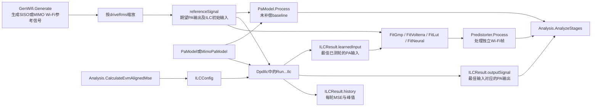
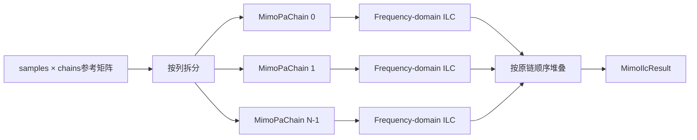

# DpdIlc.py 程序使用手册

## 1. 文档目的

`inc/DpdIlc.py` 集中提供本工程全部可复用的ILC算法、逐轮结果结构、ILC标签部署模型以及独立逐PA的MIMO ILC。本文件只说明程序接口如何使用、参数如何配置、返回值如何解释以及常见问题如何定位。

物理原理和数学推导继续由现有原理文档负责。本手册不会修改或替代 `doc/DPD-ILC.md`。

### 快速导航

- [最小可运行SISO示例](#5-最小可运行siso示例)
- [`ILCConfig` 完整参数](#6-ilcconfig-完整参数)
- [`ILCResult` 和逐轮历史](#7-ilcresult-和逐轮历史)
- [七种ILC入口如何选择](#8-七种ilc入口如何选择)
- [带噪反馈与多次平均](#10-带噪反馈与多次平均)
- [从波形ILC标签拟合可部署DPD](#13-从波形ilc标签拟合可部署dpd)
- [MIMO ILC和每路PA独立功率](#14-mimo-ilc和每路pa独立功率)
- [公开类和函数速查](#17-公开类和函数速查)
- [常见错误与处理](#19-常见错误与处理)
- [使用前检查清单](#22-使用前检查清单)

---

## 2. 模块在工程中的位置



**图1说明：**

- `GenWifi` 决定PHY格式、带宽、MCS、空间流和采样率。
- `PaModel` 或 `MimoPaModel` 是ILC反复测量的plant。
- `DpdIlc.py` 只负责算法，不负责选择benchmark场景或保存整套测试报告。
- `Analysis` 提供严格的Wi-Fi数据子载波EVM-MSE回调，并在ILC结束后计算SNR、EVM和ACLR。
- 波形ILC得到的 `learnedInput` 只对当前重复波形直接有效；拟合部署模型后，才能处理独立的新Wi-Fi帧。

---

## 3. 导入方式

工程公共门面 `inc/__init__.py` 导出了最常用的频域ILC和MIMO接口：

```python
from inc import (
    CalculateIterationMetrics,
    FitMimoGmpPredistorter,
    GMPPredistorter,
    ILCConfig,
    ILCIteration,
    MimoGmpPredistorter,
    MimoIlcResult,
    RunFrequencyDomainIlc,
    RunMimoFrequencyDomainIlc,
)
```

其他更新律和部署模型应直接从 `inc.DpdIlc` 导入：

```python
from inc.DpdIlc import (
    FitGmpPredistorter,
    FitLutPredistorter,
    FitNeuralPredistorter,
    FitVolterraPredistorter,
    ILCConfig,
    RunAugmentedIqIlc,
    RunComplexGainIlc,
    RunDirectionalGaussNewtonIlc,
    RunFirIlc,
    RunFrequencyDomainIlc,
    RunParameterDomainIlc,
    RunScalarPIlc,
)
```

建议业务程序优先调用 `Run...Ilc`、`Fit...Predistorter` 和模型的 `Process` 方法。`Build...`、`Estimate...`、`Measure...` 等函数主要用于扩展新算法或单元测试。

---

## 4. 输入、输出和数组方向

### 4.1 SISO信号

SISO输入是长度为 `N` 的一维复数数组：

```python
referenceSignal.shape == (numSamples,)
```

每个样点是复基带包络：

```math
x[n]=I[n]+jQ[n].
```

### 4.2 MIMO信号

MIMO输入采用“样点数 × 发射链数”方向：

```python
referenceSignal.shape == (numSamples, numTransmitChains)
```

第 `chainIndex` 路PA输入为：

```python
chainSignal = referenceSignal[:, chainIndex]
```

不要传入 `(numTransmitChains, numSamples)`，否则会触发列数检查。

### 4.3 `referenceSignal` 的含义

`referenceSignal` 同时具有两个作用：

1. 它是期望PA输出的时域参考；
2. 它是第1轮ILC的初始PA输入，随后每轮在其基础上学习校正量。

通常先让 `GenWifi` 生成单位RMS波形，再设置工作点：

```python
waveform = wifiGenerator.Generate()
referenceSignal = 0.24 * waveform.samples
```

这里的 `0.24` 是归一化复包络RMS，不是dBm。真实功率换算需要额外的阻抗、满量程和硬件标定信息。

### 4.4 PA对象接口要求

所有ILC入口要求 `paModel` 至少提供：

```python
outputSignal = paModel.Process(inputSignal)
```

`Process` 必须满足：

- 输入和输出样点数量一致；
- 对相同输入可重复测量；
- 输出为有限复数；
- SISO时输入输出均为一维；
- MIMO频域ILC应传入 `MimoPaModel`，不能直接把普通 `PaModel` 用作多列plant。

---

## 5. 最小可运行SISO示例

以下示例生成EHT 20 MHz信号，运行Wiener PA baseline和频域ILC，然后输出SNR、EVM、ACLR以及每轮收敛信息。

```python
from pathlib import Path

from inc.Analysis import Analysis
from inc.DpdIlc import ILCConfig, RunFrequencyDomainIlc
from inc.Draw import Draw
from inc.PaModel import PaModel
from inc.waveGen import GenWifi

wifiGenerator = GenWifi(
    parameters={
        "frameFormat": "EHT",
        "bandwidthMhz": 20,
        "mcs": 7,
        "numDataSymbols": 10,
        "oversampling": 4,
        "seed": 101,
    }
)
waveform = wifiGenerator.Generate()
referenceSignal = 0.24 * waveform.samples

paModel = PaModel(parameters={"modelName": "wiener"})
baselineOutput = paModel.Process(referenceSignal)

resultAnalysis = Analysis(referenceSignal, waveform)
ilcConfig = ILCConfig(
    numIterations=8,
    learningRate=0.15,
    regularization=1e-3,
    maxAmplitude=2.0,
    randomSeed=1019,
    evmMseEvaluator=resultAnalysis.CalculateEvmAlignedMse,
)

ilcResult = RunFrequencyDomainIlc(
    referenceSignal,
    paModel,
    waveform.sampleRateHz,
    waveform.bandwidthHz,
    ilcConfig,
)

stageMetrics = resultAnalysis.AnalyzeStages(
    {
        "PA baseline": baselineOutput,
        "Frequency-domain ILC": ilcResult.outputSignal,
    }
)
resultAnalysis.Print()
resultAnalysis.PrintConvergence(
    ilcResult.history,
    historyName="Frequency-domain ILC",
)

outputDirectory = Path("results/dpd_ilc_usage")
resultAnalysis.SaveConvergence(ilcResult.history, outputDirectory)
Draw().SaveConvergenceCurve(
    ilcResult.history,
    outputDirectory,
    fileStem="frequency_domain_ilc",
)

print(stageMetrics["PA baseline"].ToDict())
print(stageMetrics["Frequency-domain ILC"].ToDict())
print(ilcResult.learnedInput.shape)
```

这个示例中最重要的配置是：

```python
evmMseEvaluator=resultAnalysis.CalculateEvmAlignedMse
```

提供该回调后，每轮都会计算严格的数据子载波EVM-MSE，并按照EVM-MSE保留最佳已测轮。若不提供，算法只能使用线性补偿NMSE选择最佳轮。

---

## 6. `ILCConfig` 完整参数

`ILCConfig` 是不可变dataclass。默认值直接定义在类内部，调用方只需要写出需要修改的参数：

```python
ilcConfig = ILCConfig(
    numIterations=12,
    learningRate=0.10,
)
```

未写出的字段自动使用内部默认值。

| 参数 | 默认值 | 验证规则 | 程序作用 | 调整建议 |
|---|---:|---|---|---|
| `numIterations` | `8` | 不小于1 | 保存的测量轮数 | 先用6至10轮观察趋势 |
| `learningRate` | `0.15` | 大于0且小于2 | 每轮更新步长 | 振荡时减小，收敛过慢时逐步增大 |
| `regularization` | `1e-3` | 大于0 | 稳定逆响应和正规方程 | 噪声大或矩阵病态时增大 |
| `maxAmplitude` | `2.0` | 大于0 | 每次更新后的复包络峰值上限 | 应由DAC、PA或CFR能力决定 |
| `feedbackSnrDb` | `None` | `None`或数值 | 向每次反馈测量加入AWGN | `None` 表示理想反馈 |
| `feedbackAverages` | `1` | 不小于1 | 同一轮重复采集并平均 | 噪声反馈可使用4或更多 |
| `projectionBandwidthFactor` | `1.6` | 大于1 | 频域更新相对信道带宽的允许范围 | 过小会限制带外抵消，过大可能增加峰值 |
| `responseFloorDb` | `-45.0` | 当前不单独限幅 | 低激励FFT频点的响应置信度门限 | 频谱零点不稳定时提高门限 |
| `randomSeed` | `19` | 整数语义 | 反馈噪声随机种子 | 公平比较时每次实验固定 |
| `evmMseEvaluator` | `None` | 可调用对象或 `None` | 计算每轮严格EVM-MSE并选择最佳轮 | Wi-Fi信号建议始终设置 |

### 6.1 验证配置

所有完整ILC入口都会在开始时调用：

```python
ilcConfig.Validate()
```

也可以在长时间运行前显式检查：

```python
ilcConfig = ILCConfig(
    numIterations=10,
    learningRate=0.12,
)
ilcConfig.Validate()
```

### 6.2 复制并修改不可变配置

功率扫描或多场景测试中，可以用 `dataclasses.replace` 复制配置：

```python
from dataclasses import replace

noisyConfig = replace(
    ilcConfig,
    feedbackSnrDb=35.0,
    feedbackAverages=4,
    regularization=1e-2,
)
```

这样不会改变原始 `ilcConfig`。

---

## 7. `ILCResult` 和逐轮历史

每个SISO算法都返回：

```python
ILCResult(
    learnedInput=...,
    outputSignal=...,
    history=...,
)
```

| 字段 | 类型 | 含义 |
|---|---|---|
| `learnedInput` | 一维复数数组 | 最佳已测轮的PA输入，不一定是最后一次更新后的输入 |
| `outputSignal` | 一维复数数组 | `paModel.Process(learnedInput)` 的干净最终输出 |
| `history` | `List[ILCIteration]` | 每个已测轮的完整诊断记录 |

### 7.1 `numIterations` 的准确含义

每一轮顺序为：

```text
Measure current input
Calculate and store metrics
Remember current input if it is the best measured candidate
Calculate update
Generate next input
```

因此 `numIterations=8` 会保存8个已经测量的候选输入。第8轮之后计算出的新输入不会在本次运行中再次测量，也不会直接作为返回结果。

### 7.2 为什么返回结果不一定对应最后一行

若提供 `evmMseEvaluator`，最佳轮满足：

```math
k^\star
=\arg\min_k
\mathrm{MSE}_{\mathrm{EVM},k}.
```

若未提供回调，则使用线性补偿NMSE选择。后期因噪声或步长过大导致指标回退时，`learnedInput` 仍保留更好的早期输入。

### 7.3 `ILCIteration` 字段

| 字段 | 含义 | 趋势解释 |
|---|---|---|
| `iteration` | 从1开始的测量轮编号 | 应严格递增 |
| `mse` | 目标与PA输出直接相减的Raw MSE | 包含公共增益和公共相位影响 |
| `errorRms` | Raw MSE平方根 | 与Raw MSE表达同一误差 |
| `nmseDb` | Raw MSE相对参考功率归一化 | 越负越好 |
| `linearCompensatedMse` | 去除公共复增益后并折回参考尺度的残差功率 | 比Raw MSE更接近波形形状误差 |
| `linearCompensatedNmseDb` | 线性补偿MSE归一化结果 | 未提供Wi-Fi元数据时用于最佳轮选择 |
| `evmAlignedMse` | 数据子载波归一化MSE | 等于RMS EVM的平方 |
| `evmDb` | `10*log10(evmAlignedMse)` | 数值越负越好 |
| `complexGainMagnitudeDb` | 当前PA输出相对参考的公共增益 | 用于区分线性增益漂移 |
| `complexGainPhaseDegrees` | 当前公共相位 | 用于区分线性相位项 |
| `inputPeak` | 当前PA输入最大幅度 | 用于检查峰值约束是否激活 |

EVM百分比可由 `evmAlignedMse` 换算：

```math
\mathrm{EVM}_{\%}
=100\sqrt{\mathrm{MSE}_{\mathrm{EVM}}}.
```

---

## 8. 七种ILC入口如何选择

| 算法入口 | 额外参数 | 主要补偿能力 | 优点 | 局限 |
|---|---|---|---|---|
| `RunScalarPIlc` | 无 | 标量误差比例更新 | 最简单，适合流程验证 | 不显式补偿公共复增益和频率选择性记忆 |
| `RunComplexGainIlc` | 无 | 平均复增益逆 | 可校正平均增益和相位 | 不能完整补偿频率选择性记忆 |
| `RunFirIlc` | `firLength=17` | 有限长时域逆滤波 | 适合线性记忆明显的PA | FIR长度和截断影响效果 |
| `RunFrequencyDomainIlc` | 采样率、信道带宽 | 正则化逐频点逆和带宽投影 | 宽带Wi-Fi的推荐通用入口 | 需要至少2倍过采样和低功率响应探测 |
| `RunDirectionalGaussNewtonIlc` | `finiteDifferenceRms=1e-3` | 当前误差方向上的局部雅可比 | 确定性plant上收敛快 | 每轮额外调用PA，对噪声和漂移敏感 |
| `RunParameterDomainIlc` | 阶数、记忆深度 | 直接更新MP系数空间 | 学习输入天然受模型空间约束 | 表达能力受基函数限制 |
| `RunAugmentedIqIlc` | 无 | 直接支路加共轭误差支路 | 适合IQ镜像或广义线性plant | 增广矩阵病态时需更强正则化 |

### 8.1 统一调用模式

除频域ILC外，其余SISO入口的前三个参数一致：

```python
ilcResult = RunComplexGainIlc(
    referenceSignal,
    paModel,
    ilcConfig,
)
```

频域ILC额外要求采样率和带宽：

```python
ilcResult = RunFrequencyDomainIlc(
    referenceSignal,
    paModel,
    waveform.sampleRateHz,
    waveform.bandwidthHz,
    ilcConfig,
)
```

### 8.2 同一信号比较多种更新律

```python
from inc.DpdIlc import (
    ILCConfig,
    RunComplexGainIlc,
    RunFirIlc,
    RunFrequencyDomainIlc,
    RunScalarPIlc,
)

commonConfig = ILCConfig(
    numIterations=8,
    maxAmplitude=2.0,
    evmMseEvaluator=resultAnalysis.CalculateEvmAlignedMse,
)

scalarResult = RunScalarPIlc(
    referenceSignal,
    paModel,
    commonConfig,
)
complexResult = RunComplexGainIlc(
    referenceSignal,
    paModel,
    commonConfig,
)
firResult = RunFirIlc(
    referenceSignal,
    paModel,
    commonConfig,
    firLength=17,
)
frequencyResult = RunFrequencyDomainIlc(
    referenceSignal,
    paModel,
    waveform.sampleRateHz,
    waveform.bandwidthHz,
    commonConfig,
)
```

公平比较时应保持参考波形、PA、迭代数、峰值限制和指标回调一致。不同算法的更新方向尺度不同，因此“所有方法强制使用相同学习率”不一定公平；应记录每种方法的实际学习率。

---

## 9. 频域ILC使用细节

### 9.1 函数签名

```python
RunFrequencyDomainIlc(
    referenceSignal,
    paModel,
    sampleRateHz,
    channelBandwidthHz,
    config=ILCConfig(),
)
```

### 9.2 采样率约束

程序要求：

```math
f_s\ge2B_{\mathrm{channel}}.
```

低于该条件会抛出：

```text
ValueError: ILC requires at least 2x waveform oversampling
```

如果还要计算上下邻道ACLR，工程的 `Analysis` 通常要求至少3倍过采样，因此完整Wi-Fi仿真建议使用：

```python
oversampling = 3
```

或更高。

### 9.3 峰值约束

`maxAmplitude` 对每个复样点执行圆盘投影：

```math
u_{\mathrm{limited}}[n]
=
\begin{cases}
u[n], & |u[n]|\le A_{\max},\\
A_{\max}\frac{u[n]}{|u[n]|}, & |u[n]|>A_{\max}.
\end{cases}
```

构造相对初始波形的峰值约束：

```python
import numpy as np

constrainedPeak = 1.05 * np.max(np.abs(referenceSignal))
constrainedConfig = ILCConfig(
    numIterations=8,
    learningRate=0.12,
    maxAmplitude=constrainedPeak,
    evmMseEvaluator=resultAnalysis.CalculateEvmAlignedMse,
)
```

运行后应检查：

```python
maximumRecordedPeak = max(
    iterationRecord.inputPeak
    for iterationRecord in ilcResult.history
)
assert maximumRecordedPeak <= constrainedPeak + 1e-12
```

### 9.4 投影带宽

`projectionBandwidthFactor` 决定ILC更新允许占用的频率范围。大于1是因为PA线性化可能需要在主信道外生成抵消分量。

- 数值过小：带外校正自由度不足，ACLR和带边EVM可能受限。
- 数值过大：可能增加带外能量、时域峰值和硬件带宽要求。
- 修改该参数后应同时观察EVM、ACLR和 `inputPeak`。

---

## 10. 带噪反馈与多次平均

### 10.1 基本用法

```python
noiseAwareConfig = ILCConfig(
    numIterations=10,
    learningRate=0.10,
    regularization=1e-2,
    maxAmplitude=2.0,
    feedbackSnrDb=32.0,
    feedbackAverages=4,
    randomSeed=109,
    evmMseEvaluator=resultAnalysis.CalculateEvmAlignedMse,
)

noiseAwareResult = RunFrequencyDomainIlc(
    referenceSignal,
    paModel,
    waveform.sampleRateHz,
    waveform.bandwidthHz,
    noiseAwareConfig,
)
```

每轮反馈是多次独立测量的平均：

```math
\bar y[n]
=\frac{1}{R}
\sum_{r=1}^{R}
\left(y_{\mathrm{PA}}[n]+w_r[n]\right).
```

理想独立噪声下，平均后的噪声方差为单次测量的 `1/R`。

### 10.2 结果解释

- `history` 中的逐轮指标使用当轮含噪平均反馈。
- `ILCResult.outputSignal` 会对最佳输入重新调用一次干净的 `paModel.Process`。
- 因此逐轮含噪EVM与最终干净EVM不是同一种观测条件，数值不要求完全相同。
- `feedbackAverages=4` 约增加到单次反馈4倍的采集调用量。
- 多次平均和较强正则化通常提高稳定性，但不保证每个随机种子的最终EVM都优于更激进的单次反馈方法。

---

## 11. 精确EVM-MSE回调

### 11.1 推荐写法

```python
resultAnalysis = Analysis(referenceSignal, waveform)
ilcConfig = ILCConfig(
    evmMseEvaluator=resultAnalysis.CalculateEvmAlignedMse,
)
```

该回调内部使用Wi-Fi元数据完成同步、频偏与增益补偿，并只在有效数据子载波上计算归一化误差。

### 11.2 不能混用其他参考波形的回调

功率扫描中每个功率点都应创建与当前参考匹配的 `Analysis`：

```python
from dataclasses import replace

pointReference = 0.30 * waveform.samples
pointAnalysis = Analysis(pointReference, waveform)
pointConfig = replace(
    ilcConfig,
    evmMseEvaluator=pointAnalysis.CalculateEvmAlignedMse,
)
```

不要用标称功率参考构造的回调去评价另一个功率点，否则最佳轮选择会与当前参考不一致。

### 11.3 没有Wi-Fi元数据时

如果输入不是 `GenWifi` 生成的帧，可以不设置回调：

```python
ilcConfig = ILCConfig(evmMseEvaluator=None)
```

此时算法根据线性补偿NMSE保留最佳轮。它能去除公共复增益影响，但不能替代PHY数据子载波EVM。

---

## 12. 各专用算法示例

### 12.1 FIR ILC

```python
from inc.DpdIlc import RunFirIlc

firResult = RunFirIlc(
    referenceSignal,
    paModel,
    ilcConfig,
    firLength=17,
)
```

离线ILC已知完整重复波形，因此FIR学习滤波器允许保留零延时附近的因果和反因果抽头。该结果不能直接等同于实时硬件中的严格因果FIR DPD。

### 12.2 Directional Gauss-Newton ILC

```python
from inc.DpdIlc import RunDirectionalGaussNewtonIlc

gaussNewtonConfig = ILCConfig(
    numIterations=8,
    learningRate=0.65,
    regularization=1e-3,
    maxAmplitude=2.0,
    evmMseEvaluator=resultAnalysis.CalculateEvmAlignedMse,
)
gaussNewtonResult = RunDirectionalGaussNewtonIlc(
    referenceSignal,
    paModel,
    gaussNewtonConfig,
    finiteDifferenceRms=1e-3,
)
```

该方法每轮除了通用反馈测量，还会执行有限差分试探和干净基准调用。在相同迭代轮数下，它的PA调用次数高于Scalar、Complex-gain和FIR方法。

### 12.3 参数域Memory Polynomial ILC

```python
from inc.DpdIlc import RunParameterDomainIlc

parameterResult = RunParameterDomainIlc(
    referenceSignal,
    paModel,
    ILCConfig(
        numIterations=10,
        learningRate=0.20,
        regularization=1e-3,
        maxAmplitude=2.0,
        evmMseEvaluator=resultAnalysis.CalculateEvmAlignedMse,
    ),
    nonlinearOrders=(1, 3, 5, 7),
    memoryDepth=3,
)
```

`nonlinearOrders` 应使用正奇数。阶数和记忆深度越大，表达能力与正规方程规模同时增加。

### 12.4 增广IQ ILC

```python
from inc.DpdIlc import RunAugmentedIqIlc
from inc.PaModel import IQImbalancePA, PaModel

iqPaModel = IQImbalancePA(
    PaModel(parameters={"modelName": "wiener"})
)
augmentedResult = RunAugmentedIqIlc(
    referenceSignal,
    iqPaModel,
    ILCConfig(
        numIterations=8,
        learningRate=0.18,
        regularization=1e-3,
        maxAmplitude=2.0,
        evmMseEvaluator=resultAnalysis.CalculateEvmAlignedMse,
    ),
)
```

增广方法同时使用误差和误差共轭，适合含共轭镜像的plant。普通Wiener或GMP PA没有明显IQ镜像时，不应仅因为模型更复杂就默认选择增广方法。

---

## 13. 从波形ILC标签拟合可部署DPD

### 13.1 为什么需要拟合

波形ILC学习的是当前重复包对应的最优输入：

```math
u^\star_{\mathrm{train}}[n].
```

新Wi-Fi包的QAM数据不同，不能直接复用这组逐样点标签。部署模型学习：

```math
x[n]\longrightarrow u^\star[n].
```

训练完成后，使用模型的 `Process` 处理独立帧。

### 13.2 完整训练和独立验证示例

```python
from inc.Analysis import Analysis
from inc.DpdIlc import (
    FitGmpPredistorter,
    ILCConfig,
    LimitAmplitude,
    RunFrequencyDomainIlc,
)
from inc.PaModel import PaModel
from inc.waveGen import GenWifi

trainingGenerator = GenWifi(
    parameters={
        "frameFormat": "EHT",
        "bandwidthMhz": 20,
        "mcs": 7,
        "numDataSymbols": 20,
        "oversampling": 4,
        "seed": 101,
    }
)
validationGenerator = GenWifi(
    parameters={
        "frameFormat": "EHT",
        "bandwidthMhz": 20,
        "mcs": 7,
        "numDataSymbols": 20,
        "oversampling": 4,
        "seed": 198,
    }
)

trainingWaveform = trainingGenerator.Generate()
validationWaveform = validationGenerator.Generate()
trainingReference = 0.24 * trainingWaveform.samples
validationReference = 0.24 * validationWaveform.samples
paModel = PaModel(parameters={"modelName": "wiener"})

trainingAnalysis = Analysis(trainingReference, trainingWaveform)
trainingConfig = ILCConfig(
    numIterations=10,
    learningRate=0.15,
    maxAmplitude=2.0,
    evmMseEvaluator=trainingAnalysis.CalculateEvmAlignedMse,
)
trainingResult = RunFrequencyDomainIlc(
    trainingReference,
    paModel,
    trainingWaveform.sampleRateHz,
    trainingWaveform.bandwidthHz,
    trainingConfig,
)

gmpPredistorter = FitGmpPredistorter(
    trainingReference,
    trainingResult.learnedInput,
    nonlinearOrders=(1, 3, 5, 7),
    memoryDepth=3,
    crossMemoryDepth=2,
    ridgeFactor=1e-6,
)

validationBaseline = paModel.Process(validationReference)
deployedInput = gmpPredistorter.Process(validationReference)
deployedInput = LimitAmplitude(
    deployedInput,
    trainingConfig.maxAmplitude,
)
deployedOutput = paModel.Process(deployedInput)

validationAnalysis = Analysis(
    validationReference,
    validationWaveform,
)
validationAnalysis.AnalyzeStages(
    {
        "Validation baseline": validationBaseline,
        "GMP deployment": deployedOutput,
    }
)
validationAnalysis.Print()
```

训练和验证必须使用不同随机种子。否则结果可能只反映对训练样本的记忆。

### 13.3 部署拟合接口

| 拟合函数 | 默认结构 | 返回模型 | 适合场景 |
|---|---|---|---|
| `FitGmpPredistorter` | 阶数1/3/5/7、记忆3、交叉记忆2 | `GMPPredistorter` | 通用宽带PA记忆非线性 |
| `FitVolterraPredistorter` | 简化三阶、记忆3 | `VolterraPredistorter` | 需要一般三阶交叉项 |
| `FitLutPredistorter` | 64个幅度bin | `LUTPredistorter` | 低推理成本、以无记忆幅度特性为主 |
| `FitNeuralPredistorter` | 记忆4、隐藏单元32 | `NeuralPredistorter` | 数据量足够且映射难以用多项式描述 |

### 13.4 GMP与MP

`FitGmpPredistorter` 通过 `crossMemoryDepth` 同时支持MP和GMP：

```python
mpPredistorter = FitGmpPredistorter(
    trainingReference,
    trainingResult.learnedInput,
    crossMemoryDepth=0,
)

gmpPredistorter = FitGmpPredistorter(
    trainingReference,
    trainingResult.learnedInput,
    crossMemoryDepth=2,
)
```

- `crossMemoryDepth=0`：只有主支路，等效Memory Polynomial。
- `crossMemoryDepth>0`：增加包络超前和滞后交叉项，构成GMP。

### 13.5 其他部署模型示例

```python
from inc.DpdIlc import (
    FitLutPredistorter,
    FitNeuralPredistorter,
    FitVolterraPredistorter,
)

volterraPredistorter = FitVolterraPredistorter(
    trainingReference,
    trainingResult.learnedInput,
    memoryDepth=3,
    ridgeFactor=1e-6,
)
lutPredistorter = FitLutPredistorter(
    trainingReference,
    trainingResult.learnedInput,
    binCount=64,
    ridgeFactor=1e-8,
)
neuralPredistorter = FitNeuralPredistorter(
    trainingReference,
    trainingResult.learnedInput,
    memoryDepth=4,
    hiddenUnitCount=32,
    ridgeFactor=1e-5,
    randomSeed=71,
)

volterraInput = volterraPredistorter.Process(validationReference)
lutInput = lutPredistorter.Process(validationReference)
neuralInput = neuralPredistorter.Process(validationReference)
```

部署模型输出进入PA前仍应执行与训练一致的峰值限制。

---

## 14. MIMO ILC和每路PA独立功率

### 14.1 当前MIMO假设

`RunMimoFrequencyDomainIlc` 将每一列视为一个独立、可重复的SISO PA plant：



**图2说明：**

- 每路使用自己的 `MimoPaChain`。
- 随机种子按链号递增，避免多路反馈噪声完全相同。
- 当前不建模PA之间的电耦合或OTA耦合。
- 每路ILC历史独立保存。
- 当前逐链ILC会把完整MIMO EVM回调清空，因为单列PA输出不能直接执行空间解映射后的完整EVM计算。

### 14.2 完整4×2示例

```python
from inc.Analysis import Analysis
from inc.DpdIlc import (
    FitMimoGmpPredistorter,
    ILCConfig,
    RunMimoFrequencyDomainIlc,
)
from inc.PaModel import MimoPaModel
from inc.waveGen import GenWifi

wifiGenerator = GenWifi(
    parameters={
        "frameFormat": "HE",
        "bandwidthMhz": 40,
        "mcs": 9,
        "numDataSymbols": 10,
        "oversampling": 4,
        "numTransmitAntennas": 4,
        "numSpatialStreams": 2,
        "spatialMapping": "dft",
        "seed": 301,
    }
)
waveform = wifiGenerator.Generate()
referenceSignal = 0.20 * waveform.samples

mimoPaModel = MimoPaModel(
    parameters={
        "numTransmitChains": 4,
        "paParametersPerChain": (
            {"modelName": "wiener"},
            {"modelName": "wiener"},
            {"modelName": "gmp"},
            {"modelName": "gmp"},
        ),
        "outputPowerDbPerChain": (
            0.0,
            -1.0,
            -2.0,
            -3.0,
        ),
        "targetOutputRmsPerChain": (
            None,
            None,
            None,
            None,
        ),
    }
)

mimoConfig = ILCConfig(
    numIterations=8,
    learningRate=0.15,
    regularization=1e-3,
    maxAmplitude=2.0,
    randomSeed=401,
)
mimoResult = RunMimoFrequencyDomainIlc(
    referenceSignal,
    mimoPaModel,
    waveform.sampleRateHz,
    waveform.bandwidthHz,
    mimoConfig,
)

mimoPredistorter = FitMimoGmpPredistorter(
    referenceSignal,
    mimoResult.learnedInput,
    nonlinearOrders=(1, 3, 5, 7),
    memoryDepth=3,
    crossMemoryDepth=2,
    ridgeFactor=1e-6,
)
deployedInput = mimoPredistorter.Process(referenceSignal)
deployedOutput = mimoPaModel.Process(deployedInput)

resultAnalysis = Analysis(referenceSignal, waveform)
resultAnalysis.AnalyzeStages(
    {
        "MIMO PA baseline": mimoPaModel.Process(referenceSignal),
        "MIMO ILC": mimoResult.outputSignal,
        "MIMO GMP deployment": deployedOutput,
    }
)
resultAnalysis.Print()
resultAnalysis.PrintMimo()
```

### 14.3 `MimoIlcResult`

| 字段 | 形状或类型 | 含义 |
|---|---|---|
| `learnedInput` | `(samples, chains)` | 每路最佳已测ILC输入组成的矩阵 |
| `outputSignal` | `(samples, chains)` | 每路最佳输入对应的PA输出 |
| `chainResults` | `Tuple[ILCResult, ...]` | 按物理链顺序保存的SISO结果 |

读取第2路逐轮历史：

```python
chainIndex = 1
secondChainHistory = mimoResult.chainResults[chainIndex].history
```

### 14.4 每路独立输出功率

创建模型时可一次配置：

```python
mimoPaModel = MimoPaModel(
    numTransmitChains=4,
    outputPowerDbPerChain=(0.0, -1.5, -3.0, -4.5),
)
```

运行时可修改单路：

```python
mimoPaModel.SetOutputPowerDb(
    chainIndex=2,
    outputPowerDb=-4.0,
)
```

也可以设置绝对输出RMS：

```python
mimoPaModel.SetTargetOutputRms(
    chainIndex=3,
    targetOutputRms=0.17,
)
```

学习PA非线性时更推荐使用固定 `outputPowerDbPerChain`，并把 `targetOutputRmsPerChain` 设置为 `None`。绝对RMS模式会根据整包当前输出重新缩放，可能掩盖部分AM-AM幅度变化；它更适合完成PA处理后的系统级功率对齐。若必须在ILC过程中启用绝对RMS，应确保每路参考目标的RMS与目标设置一致，并单独验证收敛。

### 14.5 读取每路实际输出RMS

```python
paOutput = mimoPaModel.Process(referenceSignal)
outputRmsPerChain = mimoPaModel.GetOutputRmsPerChain()
print(outputRmsPerChain)
```

`GetOutputRmsPerChain` 返回最近一次完整 `Process` 的结果。只调用 `ProcessChain` 不会更新这组完整矩阵统计。

---

## 15. 功率-EVM扫描中的正确调用

波形ILC在不同工作点通常需要重新学习。固定部署模型则用于观察同一模型跨功率泛化。

```python
import numpy as np
from dataclasses import replace

driveRmsValues = np.geomspace(0.08, 0.40, 7)

def RunPointIlc(
    pointReference,
    driveRms,
):
    """Run point-specific ILC with a matching EVM objective."""

    del driveRms
    pointAnalysis = Analysis(pointReference, waveform)
    pointConfig = replace(
        ilcConfig,
        evmMseEvaluator=pointAnalysis.CalculateEvmAlignedMse,
    )
    return RunFrequencyDomainIlc(
        pointReference,
        paModel,
        waveform.sampleRateHz,
        waveform.bandwidthHz,
        pointConfig,
    ).outputSignal

powerEvmCurve = resultAnalysis.AnalyzePowerEvmCurve(
    driveRmsValues=driveRmsValues,
    methodEvaluators={
        "PA baseline": (
            lambda pointReference, driveRms: paModel.Process(
                pointReference
            )
        ),
        "Frequency-domain ILC": RunPointIlc,
        "Fixed GMP deployment": (
            lambda pointReference, driveRms: paModel.Process(
                gmpPredistorter.Process(pointReference)
            )
        ),
    },
)
```

对比含义：

- `Frequency-domain ILC`：每个功率点重新标定，表示逐点可达到的能力。
- `Fixed GMP deployment`：只用标称功率标签拟合一次，表示模型外推能力。
- 两者训练预算不同，不能只按曲线最低点给出复杂度结论。

---

## 16. 结果保存和绘图

`DpdIlc.py` 返回数据，不直接决定输出目录。保存由 `Analysis` 和 `Draw` 完成：

```python
from pathlib import Path

from inc.Draw import Draw

outputDirectory = Path("results/custom_ilc")

csvPath = resultAnalysis.SaveConvergence(
    ilcResult.history,
    outputDirectory,
)
pngPath = Draw().SaveConvergenceCurve(
    ilcResult.history,
    outputDirectory,
    fileStem="custom_ilc_convergence",
)

print(csvPath)
print(pngPath)
```

控制台打印：

```python
resultAnalysis.PrintConvergence(
    ilcResult.history,
    historyName="Custom ILC",
)
```

基准场景的批量命名、汇总JSON/CSV和全方法功率曲线由 `tests/BenchMark.py` 负责。

---

## 17. 公开类和函数速查

### 17.1 配置与结果

| 名称 | 用途 |
|---|---|
| `ILCConfig` | 所有ILC共享的迭代、正则化、峰值和反馈配置 |
| `ILCIteration` | 一轮Raw、LC、EVM三类误差和输入峰值 |
| `ILCResult` | SISO最佳输入、最终输出和逐轮历史 |
| `MimoIlcResult` | MIMO矩阵结果和逐链SISO结果 |

### 17.2 完整ILC入口

```python
RunScalarPIlc(referenceSignal, paModel, config=ILCConfig())
RunComplexGainIlc(referenceSignal, paModel, config=ILCConfig())
RunFirIlc(referenceSignal, paModel, config=ILCConfig(), firLength=17)
RunFrequencyDomainIlc(
    referenceSignal,
    paModel,
    sampleRateHz,
    channelBandwidthHz,
    config=ILCConfig(),
)
RunDirectionalGaussNewtonIlc(
    referenceSignal,
    paModel,
    config=ILCConfig(),
    finiteDifferenceRms=1e-3,
)
RunParameterDomainIlc(
    referenceSignal,
    paModel,
    config=ILCConfig(),
    nonlinearOrders=(1, 3, 5, 7),
    memoryDepth=3,
)
RunAugmentedIqIlc(referenceSignal, paModel, config=ILCConfig())
RunMimoFrequencyDomainIlc(
    referenceSignal,
    mimoPaModel,
    sampleRateHz,
    channelBandwidthHz,
    config=ILCConfig(),
)
```

### 17.3 部署模型拟合

```python
FitGmpPredistorter(
    referenceSignal,
    learnedInput,
    nonlinearOrders=(1, 3, 5, 7),
    memoryDepth=3,
    crossMemoryDepth=2,
    ridgeFactor=1e-6,
    chunkSize=8192,
)
FitVolterraPredistorter(
    referenceSignal,
    learnedInput,
    memoryDepth=3,
    ridgeFactor=1e-6,
)
FitLutPredistorter(
    referenceSignal,
    learnedInput,
    binCount=64,
    ridgeFactor=1e-8,
)
FitNeuralPredistorter(
    referenceSignal,
    learnedInput,
    memoryDepth=4,
    hiddenUnitCount=32,
    ridgeFactor=1e-5,
    randomSeed=71,
)
FitMimoGmpPredistorter(
    referenceSignal,
    learnedInput,
    nonlinearOrders=(1, 3, 5, 7),
    memoryDepth=3,
    crossMemoryDepth=2,
    ridgeFactor=1e-6,
)
```

所有拟合函数都要求 `referenceSignal` 与 `learnedInput` 样点数一致。MIMO拟合要求两个矩阵形状完全一致。

### 17.4 部署模型推理

| 类 | 推理方法 | 输入 |
|---|---|---|
| `GMPPredistorter` | `Process(inputSignal, chunkSize=16384)` | SISO一维复数数组 |
| `VolterraPredistorter` | `Process(inputSignal)` | SISO一维复数数组 |
| `LUTPredistorter` | `Process(inputSignal)` | SISO一维复数数组 |
| `NeuralPredistorter` | `Process(inputSignal)` | SISO一维复数数组 |
| `MimoGmpPredistorter` | `Process(inputSignal)` | 样点数 × PA链数矩阵 |

---

## 18. 底层辅助函数速查

这些函数可用于开发新算法，但一般业务调用不需要直接使用。

| 函数 | 作用 | 典型调用者 |
|---|---|---|
| `CalculateIterationMetrics` | 构造单轮Raw、LC和EVM诊断 | 所有ILC循环 |
| `NextPowerOfTwo` | 计算不小于输入长度的2次幂FFT长度 | 频域ILC和FIR ILC |
| `LimitAmplitude` | 对每个复样点执行峰值圆盘投影 | 所有完整ILC入口和部署输出 |
| `MeasurePaOutput` | 频域ILC的反馈测量与平均 | `RunFrequencyDomainIlc` |
| `MeasureOutput` | 通用波形更新律的反馈测量与平均 | `RunWaveformUpdate` |
| `SelectionError` | 计算去公共复增益后的归一化残差 | 算法扩展和诊断 |
| `RunWaveformUpdate` | 复用测量、记录、最佳轮和限幅骨架 | Scalar、Complex、FIR、GN、Augmented |
| `EstimateComplexGain` | 低功率估计PA平均复增益 | Complex、Parameter-domain等 |
| `EstimateFrequencyResponse` | 低功率估计正则化频响 | FIR ILC |
| `MemoryPolynomialBasis` | 构造MP设计矩阵 | Parameter-domain ILC |
| `BuildFeatureSpecs` | 枚举GMP主支路和交叉支路 | GMP拟合 |
| `DelayedSlice` | 生成带零填充的延时片段 | 分块GMP基函数 |
| `BuildGmpBasisChunk` | 构造一个GMP设计矩阵分块 | GMP拟合和推理 |
| `DelaySignal` | 生成等长因果整数延时信号 | Volterra和神经输入 |
| `BuildVolterraSpecs` | 枚举简化复Volterra项 | Volterra拟合 |
| `BuildVolterraBasis` | 构造简化三阶复Volterra矩阵 | Volterra拟合和推理 |
| `BuildNeuralInputs` | 构造I/Q/包络时延特征 | 神经DPD拟合和推理 |
| `MimoPaChain` | 把一条MIMO PA链适配为SISO plant | MIMO频域ILC |

### 18.1 自定义更新律

`RunWaveformUpdate` 接收如下更新回调：

```python
def BuildUpdate(
    inputSignal,
    measuredOutput,
    errorSignal,
    iteration,
):
    """Return one additive waveform update."""

    del inputSignal
    del measuredOutput
    del iteration
    return 0.08 * errorSignal
```

完整调用：

```python
from inc.DpdIlc import RunWaveformUpdate

customResult = RunWaveformUpdate(
    referenceSignal,
    paModel,
    ilcConfig,
    BuildUpdate,
)
```

回调只返回“本轮增量”，不要在回调内再次把 `inputSignal` 加进去；通用骨架会执行：

```text
nextInput = LimitAmplitude(inputSignal + updateSignal)
```

---

## 19. 常见错误与处理

### 19.1 `referenceSignal cannot be empty`

原因：传入空数组。

处理：确认已调用 `GenWifi.Generate()`，并且没有错误切片。

### 19.2 `ILC requires at least 2x waveform oversampling`

原因：`sampleRateHz` 小于两倍信道带宽。

处理：提高 `GenWifi` 的 `oversampling`，完整ACLR测试建议不小于3。

### 19.3 EVM在下降，但Raw MSE不按相同趋势下降

Raw MSE还包含公共增益、公共相位、前导字段和带外分量。应同时查看：

1. `linearCompensatedNmseDb`；
2. `evmAlignedMse`；
3. `complexGainMagnitudeDb`；
4. `complexGainPhaseDegrees`。

Wi-Fi性能判断以严格EVM-MSE和最终 `Analysis.Analyze` 结果为主。

### 19.4 最终输出不像最后一轮

这是最佳已测轮保留机制，不是结果错位。用以下代码定位：

```python
bestIteration = min(
    ilcResult.history,
    key=lambda record: (
        record.evmAlignedMse
        if record.evmAlignedMse is not None
        else 10.0 ** (
            record.linearCompensatedNmseDb / 10.0
        )
    ),
)
print(bestIteration.iteration)
```

### 19.5 输入峰值一直等于 `maxAmplitude`

说明峰值投影持续激活。可尝试：

- 减小 `learningRate`；
- 提高硬件允许的 `maxAmplitude`；
- 增加CFR或峰值加权目标；
- 检查 `projectionBandwidthFactor` 是否过大；
- 同时观察EVM改善是否已经进入平台。

不能仅为获得更低仿真EVM而任意放大峰值上限。

### 19.6 带噪曲线波动或发散

依次尝试：

1. 减小 `learningRate`；
2. 增大 `regularization`；
3. 增大 `feedbackAverages`；
4. 固定 `randomSeed` 复现实验；
5. 检查同步、整数时延、分数时延、CFO和SFO补偿；
6. 使用多随机种子统计均值、方差和失败比例。

### 19.7 部署模型训练好但验证差

常见原因：

- 训练帧过短；
- 训练和验证功率范围不一致；
- 阶数或记忆深度不足；
- 高阶基函数病态；
- 峰值投影改变了模型输出；
- 使用了同一帧评价训练效果，却误认为已经验证泛化。

应增加独立帧、多功率标签和合理正则化。

### 19.8 MIMO形状错误

正确形状：

```python
(numSamples, numTransmitChains)
```

同时满足：

```python
referenceSignal.shape[1] == mimoPaModel.numTransmitChains
```

空间流数可以小于发射天线数，但 `waveform.samples` 的列数对应物理发射链数，而不是空间流数。

### 19.9 MIMO每路功率设置后ILC不收敛

检查：

- `outputPowerDbPerChain` 是否让某一路目标增益偏差过大；
- `targetOutputRmsPerChain` 是否在每轮重新归一化并掩盖AM-AM；
- 每路 `paParametersPerChain` 是否使用了过强非线性；
- 每路参考RMS是否与期望PA输出一致；
- 是否需要按链使用不同学习率或峰值限制。

当前 `RunMimoFrequencyDomainIlc` 对所有链共享一份除随机种子外的 `ILCConfig`。若各链差异很大，应分别调用 `RunFrequencyDomainIlc` 和 `MimoPaChain`，为每路提供独立配置。

---

## 20. 推荐工作流程

### 20.1 算法开发阶段

1. 使用固定种子生成一个过采样Wi-Fi帧；
2. 计算PA baseline；
3. 用 `evmMseEvaluator` 运行6至10轮ILC；
4. 检查Raw、LC和EVM三种MSE；
5. 检查每轮输入峰值；
6. 与同场景baseline和至少一种更简单方法比较；
7. 再加入反馈噪声、IQ失衡或峰值约束。

### 20.2 部署模型阶段

1. 在训练帧上得到 `learnedInput`；
2. 使用 `Fit...Predistorter` 拟合；
3. 对模型输出执行同一峰值约束；
4. 在不同种子验证帧上测量；
5. 扫描多个功率点；
6. 同时报告EVM、SNR、ACLR和模型复杂度。

### 20.3 MIMO阶段

1. 确认矩阵方向为样点数 × PA链数；
2. 为每路设置PA模型和相对输出功率；
3. 初始学习阶段优先关闭绝对RMS归一化；
4. 运行逐PA频域ILC；
5. 查看 `chainResults`；
6. 拟合逐路GMP；
7. 用 `Analysis.PrintMimo` 检查逐流EVM和逐链指标；
8. 若存在电耦合或OTA合成需求，需另行定义多变量plant和方向性指标。

---

## 21. 与主程序和benchmark的关系

### 21.1 直接运行完整主程序

普通使用者可以直接运行：

```powershell
python main.py
```

主程序会自动完成波形生成、PA、频域ILC、GMP拟合、分析和绘图。

### 21.2 比较全部ILC方法

需要比较各种方法时运行：

```powershell
python tests/BenchMark.py --format EHT --bandwidth 20 --mcs 7 --iterations 6
```

`tests/BenchMark.py` 负责：

- 构造标称、峰值、噪声、IQ和独立验证场景；
- 保证每个场景有同条件对照；
- 保存每种方法的逐轮历史；
- 输出统一SNR、EVM和ACLR；
- 绘制所有方法的功率-EVM曲线。

不要把benchmark场景编排重新写入 `DpdIlc.py`。生产算法应保持对波形来源、报告目录和场景名称无依赖。

---

## 22. 使用前检查清单

- [ ] `referenceSignal` 是有限复数数组；
- [ ] SISO数组是一维，MIMO数组是样点数 × PA链数；
- [ ] `referenceSignal` 已按目标工作点缩放；
- [ ] `paModel.Process` 输入输出等长；
- [ ] 频域ILC采样率至少为信道带宽的2倍；
- [ ] ACLR分析时过采样倍数不小于3；
- [ ] `ILCConfig.Validate()` 通过；
- [ ] Wi-Fi信号已配置匹配的 `evmMseEvaluator`；
- [ ] `maxAmplitude` 对应真实可实现峰值；
- [ ] 带噪比较固定了随机种子；
- [ ] 每种特殊场景使用自己的baseline；
- [ ] 部署模型使用独立验证帧；
- [ ] MIMO链数与输入矩阵列数一致；
- [ ] MIMO学习阶段已确认绝对RMS归一化是否合适；
- [ ] 最终同时检查EVM、SNR、ACLR、收敛历史和输入峰值。
