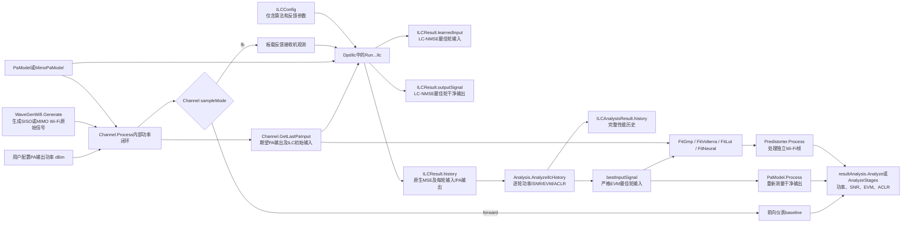
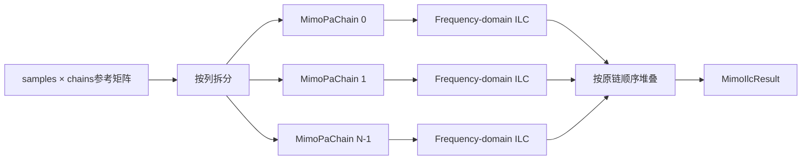

# DpdIlc.py 程序使用手册

## 1. 文档目的

`inc/lib/DpdIlc.py` 集中提供本工程全部可复用的ILC算法、逐轮结果结构、ILC标签部署模型以及独立逐PA的MIMO ILC。本文件只说明程序接口如何使用、参数如何配置、返回值如何解释以及常见问题如何定位。

物理原理和数学推导继续由现有原理文档负责。本手册不会修改或替代 `doc/DPD-ILC.md`。

### 快速导航

- [最小可运行SISO示例](#5-最小可运行siso示例)
- [`ILCConfig` 完整参数](#6-ilcconfig-完整参数)
- [`ILCResult` 和逐轮历史](#7-ilcresult-和逐轮历史)
- [七种ILC入口如何选择](#8-七种ilc入口如何选择)
- [带噪反馈与多次平均](#10-带噪反馈与多次平均)
- [从波形ILC标签拟合可部署DPD](#13-从波形ilc标签拟合可部署dpd)
- [MIMO ILC和每路PA独立功率](#14-mimo-ilc和每路pa独立功率)
- [公开类和函数速查](#17-公开类和函数速查)
- [常见错误与处理](#19-常见错误与处理)
- [使用前检查清单](#22-使用前检查清单)

---

## 2. 模块在工程中的位置


```mermaid
flowchart LR
    power["用户配置PA输出功率 dBm"] --> channelCalibration["Channel.Process内部功率闭环"]
    wave["WaveGenWifi.Generate<br/>生成SISO或MIMO Wi-Fi原始信号"] --> channelCalibration
    pa["PaModel或MimoPaModel"] --> channelCalibration
    channelCalibration --> reference["Channel.GetLastPaInput<br/>期望PA输出及ILC初始输入"]
    channelCalibration --> sampleMode{"Channel sampleMode"}
    sampleMode -->|forward| baseline["前向仪表baseline"]
    sampleMode -->|fb| feedback["板载反馈接收机观测"]
    reference --> ilc["DpdIlc中的Run...Ilc"]
    pa --> ilc
    feedback --> ilc
    config["ILCConfig<br/>仅含算法和反馈参数"] --> ilc
    ilc --> learned["ILCResult.learnedInput<br/>LC-NMSE最佳轮输入"]
    ilc --> output["ILCResult.outputSignal<br/>LC-NMSE最佳轮干净输出"]
    ilc --> history["ILCResult.history<br/>原生MSE及每轮输入/PA输出"]
    history --> analysis["Analysis.AnalyzeIlcHistory<br/>逐轮功率/SNR/EVM/ACLR"]
    analysis --> analyzedHistory["ILCAnalysisResult.history<br/>完整性能历史"]
    analysis --> evmBest["bestInputSignal<br/>严格EVM最佳轮输入"]
    evmBest --> cleanOutput["PaModel.Process<br/>重新测量干净输出"]
    evmBest --> fit["FitGmp / FitVolterra / FitLut / FitNeural"]
    reference --> fit
    fit --> deploy["Predistorter.Process<br/>处理独立Wi-Fi帧"]
    baseline --> metrics["resultAnalysis.Analyze或AnalyzeStages<br/>功率、SNR、EVM、ACLR"]
    cleanOutput --> metrics
    deploy --> metrics
```

**图1说明：**

- `WaveGenWifi` 决定PHY格式、带宽、MCS、空间流和采样率。
- `PaModel` 或 `MimoPaModel` 是ILC反复测量的plant。
- `DpdIlc.py` 只负责算法，不负责选择benchmark场景或保存整套测试报告。
- `ILCConfig` 不保存任何EVM、SNR或ACLR计算器；它只控制学习更新、幅度约束和反馈采集。
- `DpdIlc.py` 不接收任何EVM、SNR或ACLR回调；每轮只计算算法原生MSE并保存对应输入和PA输出。
- ILC返回后，`Analysis.AnalyzeIlcHistory` 才逐轮计算模拟输出功率、SNR、EVM和ACLR，并在分析层按严格EVM选择最佳实测轮。
- 仪表闭环训练可把 `sampleMode="forward"` 的Channel作为plant；板载闭环训练把 `sampleMode="fb"` 的Channel作为plant。无论训练来自哪一路，最终性能都应通过独立forward采样评价，避免把反馈接收机自身的失真误认为PA失真。
- `ILCAnalysisResult.bestInputSignal` 只对当前重复波形直接有效；拟合部署模型后，才能处理独立的新Wi-Fi帧。

---

## 3. 导入方式

工程公共门面 `inc/__init__.py` 导出了最常用的频域ILC和MIMO接口：

```python
from inc import (
    CalculateIterationMetrics,
    FitMimoGmpPredistorter,
    GMPPredistorter,
    ILCConfig,
    ILCIteration,
    MimoGmpPredistorter,
    MimoIlcResult,
    RunFrequencyDomainIlc,
    RunMimoFrequencyDomainIlc,
)
```

其他更新律和部署模型应直接从 `inc.lib.DpdIlc` 导入：

```python
from inc.lib.DpdIlc import (
    FitGmpPredistorter,
    FitLutPredistorter,
    FitNeuralPredistorter,
    FitVolterraPredistorter,
    ILCConfig,
    RunAugmentedIqIlc,
    RunComplexGainIlc,
    RunDirectionalGaussNewtonIlc,
    RunFirIlc,
    RunFrequencyDomainIlc,
    RunParameterDomainIlc,
    RunScalarPIlc,
)
```

建议业务程序优先调用 `Run...Ilc`、`Fit...Predistorter` 和模型的 `Process` 方法。`Build...`、`Estimate...`、`Measure...` 等函数主要用于扩展新算法或单元测试。

---

## 4. 输入、输出和数组方向

### 4.1 SISO信号

SISO输入是长度为 `N` 的一维复数数组：

```python
referenceSignal.shape == (numSamples,)
```

每个样点是复基带包络：

```math
x[n]=I[n]+jQ[n].
```

### 4.2 MIMO信号

MIMO输入采用“样点数 × 发射链数”方向：

```python
referenceSignal.shape == (numSamples, numTransmitChains)
```

第 `chainIndex` 路PA输入为：

```python
chainSignal = referenceSignal[:, chainIndex]
```

不要传入 `(numTransmitChains, numSamples)`，否则会触发列数检查。

### 4.3 `referenceSignal` 的含义

`referenceSignal` 同时具有两个作用：

1. 它是期望PA输出的时域参考；
2. 它是第1轮ILC的初始PA输入，随后每轮在其基础上学习校正量。

通常先让 `WaveGenWifi` 生成原始波形，再把波形和工作点直接交给Channel。调用方不需要创建功率校准器：

```python
from inc.lib.Channel import Channel

waveform = wifiGenerator.Generate()
paOutputPowerDbm = 20.0
channel = Channel(
    paModel=paModel,
    parameters={
        "sampleMode": "forward",
        "sampleRateHz": waveform.sampleRateHz,
        "loadResistanceOhm": 50.0,
        "maximumOutputPowerDbm": 25.0,
    }
)
baselineOutput = channel.Process(
    waveform.samples,
    outputPowerDbm=paOutputPowerDbm,
)
referenceSignal = channel.GetLastPaInput()
```

对调用方公开的工作点是 `paOutputPowerDbm`。20 dBm相对25 dBm额定极限的5 dB回退只作为第一次驱动预设。Channel内部会保存并暂停PA热状态，把重新缩放的数字Tx输入依次送入Tx I/Q、PA前耦合与参考温度 `paModel`，对PA输出的有效Wi-Fi突发测量功率，再更新预设并重试；收敛后恢复原热状态，并用收敛输入真实处理一次。`GetLastPaInput()` 为兼容旧名称保留，返回Tx I/Q之前的收敛数字输入；`GetLastActualPaInput()` 返回正式处理时Tx I/Q和PA前耦合之后真正进入PA的波形；`GetLastPaOutput()` 返回无热参考校准的最后一次PA观测。整个过程不对PA输出做后级常数缩放，因此返回波形的EVM和ACLR反映恢复温度后的实际压缩工作点。

#### 4.3.1 前向仪表和板载反馈如何接入ILC

两种采样方式看到的是同一个PA输出，但观测方程不同。理想化的前向仪表采样为：

```math
z_{\mathrm{forward}}[n]
=
y_{\mathrm{PA}}[n]\exp(j\phi_c)+w_{\mathrm{forward}}[n].
```

板载反馈采样还包含耦合器、反馈接收机和ADC：

```math
z_{\mathrm{fb}}[n]
=
Q_{\mathrm{ADC}}
\left(
F_{\mathrm{fb}}
\left[
y_{\mathrm{PA}}[n]
\right]
+w_{\mathrm{fb}}[n]
\right).
```

这里 $F_{\mathrm{fb}}$ 代表可配置的反馈FIR、增益/相位、时延、CFO/SFO、I/Q不平衡、DC、三阶非线性和限幅。若直接令ILC满足 $z_{\mathrm{fb}}\approx x$，算法学习的是“PA与反馈接收机组合”的逆，而不一定是PA本身的逆。因此推荐同时建立两个Channel：

```python
forwardChannel = Channel(
    paModel=paModel,
    parameters={
        "sampleMode": "forward",
        "sampleRateHz": waveform.sampleRateHz,
        "noiseSnrDb": 50.0,
        "width": 0,
    },
)
feedbackChannel = Channel(
    paModel=paModel,
    parameters={
        "sampleMode": "fb",
        "sampleRateHz": waveform.sampleRateHz,
        "fbGainDb": -6.0,
        "fbFirTaps": (1.0 + 0.0j, 0.08 - 0.03j),
        "fbIntegerDelaySamples": 8,
        "fbCarrierFrequencyOffsetHz": 1500.0,
        "fbIqGainImbalanceDb": 0.25,
        "fbThirdOrderCoefficient": -0.01 + 0.003j,
        "fbAdcWidth": 14,
        "noiseSnrDb": 38.0,
        "width": 0,
    },
)
```

- 仪表闭环ILC：把 `forwardChannel` 作为plant，反馈精度通常更高，但依赖仪表控制和传输时延。
- 板载闭环ILC：把 `feedbackChannel` 作为plant，实时性更好，但必须校准或补偿反馈接收机非理想。
- 最终验收：把选中的DPD输入送入同一个PA，再由 `forwardChannel` 采集，并交给Analysis计算EVM、ACLR和功率。

`phaseDegrees` 和三种噪声控制是两条路径的公共参数；所有以 `fb` 开头的参数只在fb模式生效。完整处理次序和参数定义见 [Channel.md](./Channel.md)。

### 4.4 PA对象接口要求

所有ILC入口要求 `paModel` 至少提供：

```python
outputSignal = paModel.Process(inputSignal)
```

`Process` 必须满足：

- 输入必须是一维复数组；输出允许比输入更长或更短，ILC会先同步并提取到参考网格；
- 同一轮启用 `feedbackAverages` 时，各次反馈采集的长度必须一致；
- 对相同输入可重复测量；
- 输出为有限复数；
- SISO时输入输出均为一维；
- MIMO频域ILC应传入 `MimoPaModel`，不能直接把普通 `PaModel` 用作多列plant。

---

## 5. 最小可运行SISO示例

工程根目录的 `SmallestSISO.py` 生成EHT 20 MHz信号，运行GMP PA baseline和频域ILC，并以完全相同的场景依次比较浮点与16位定点接口。示例直接使用默认GMP系数，不再把非线性系数额外缩放为25%。默认各阶系数和形成单调Rapp型稳态曲线，较小的主记忆、滞后和超前动态项按阶零和，因此连续高幅样点不会因重复计入记忆压缩而快速下坠；20 dBm工作点由`Channel.Process(..., outputPowerDbm=20.0)`内部调整PA输入得到。这个最小示例固定运行4轮，使当前确定性场景中的浮点和16位模式都在局部稳定区同时改善EVM与ACLR；更长迭代及停止准则比较留给Benchmark场景。PA后接入 `sampleMode="forward"`、0度移相和10 mV复包络总RMS白噪声的 `Channel`，表示实验室仪表闭环。下面的最小调用显式写出20 dBm工作点和25 dBm额定极限：

```python
from SmallestSISO import RunSisoMode

floatingResult = RunSisoMode(
    width=0,
    modeName="floating",
    paOutputPowerDbm=20.0,
    maximumOutputPowerDbm=25.0,
)
fixedResult = RunSisoMode(
    width=16,
    modeName="fixed_16",
    paOutputPowerDbm=20.0,
    maximumOutputPowerDbm=25.0,
)

print(floatingResult["baselineMetrics"])
print(floatingResult["selectedIlcMetrics"])
print(fixedResult["baselineMetrics"])
print(fixedResult["selectedIlcMetrics"])
```

也可以直接运行：

```powershell
python SmallestSISO.py
```

脚本的 `RunSisoMode(width=...)` 会把该值分别写入 `WaveGenWifi.parameters`、`PaModel.parameters`、`Channel.parameters` 和 `Analysis.parameters`。`width=0` 为浮点旁路；`width=16` 的公开 I/Q 分量是 `-32768…32767` 的整数码，`numpy.complex128` 只是统一容器。ILC在入口解码整数码，内部FFT、GMP、移相、加噪、同步、学习更新和指标算法仍使用归一化浮点；返回的最佳输入、输出和逐轮波形再编码为公开整数码。两个结果目录分别是 `results/smallest_siso/floating` 和 `results/smallest_siso/fixed_16`，每个目录都包含逐轮MSE/EVM收敛数据和图片。定点公式见 [FixedPoint.md](./FixedPoint.md)，Channel的噪声单位和流程见 [Channel.md](./Channel.md)。

这个示例中，`paOutputPowerDbm` 是工作点，`maximumOutputPowerDbm` 是额定极限。输出回退和归一化驱动关系为：

```math
\mathrm{OBO}
=P_{\max,\mathrm{dBm}}-P_{\mathrm{out,dBm}},
```

```math
a=10^{-\mathrm{OBO}/20}.
```

目标输出RMS电压按端口阻抗换算：

```math
V_{\mathrm{out,RMS}}
=\sqrt{R\,10^{-3}10^{P_{\mathrm{out,dBm}}/10}}.
```

20 dBm相对25 dBm极限具有5 dB输出回退。提高目标输出功率会提高归一化驱动，把PA推向更深压缩；降低目标输出功率则增加回退量。功率闭环只观测PA有效突发，不观测Channel接收噪声；因此10 mV噪声不会反向改变PA隐藏驱动预设。50%占空比的长关断区不会让PA报告功率额外降低3.01 dB。

ILC运行期间完全不计算EVM。`DpdIlc` 仅按线性补偿NMSE保留一个算法原生候选，同时在 `history` 中保存所有已测轮的输入和实际反馈输出。当plant为 `Channel` 时，该反馈就是经过PA和 `sampleMode` 所选采样链路后的波形：forward用于仪表闭环，fb用于含板载反馈接收机非理想的闭环。运行结束后，直接调用 `resultAnalysis.AnalyzeIlcHistory(ilcResult.history)` 可以观察该训练观测，但最终验收应把最佳输入通过独立forward Channel复测，再计算严格的数据子载波EVM、SNR、ACLR和实际接收功率。禁止为了指标好看而替换或缩放 `outputSignal`。若需要在规定dBm工作点复测最佳输入，调用forward Channel的 `Process(bestInputSignal, outputPowerDbm=targetPowerDbm)`；Channel内部校准干净PA输出并在收敛后施加仪表路径影响。

---

## 6. `ILCConfig` 完整参数

`ILCConfig` 是不可变dataclass。默认值直接定义在类内部，调用方只需要写出需要修改的参数：

```python
ilcConfig = ILCConfig(
    numIterations=12,
    learningRate=0.10,
)
```

未写出的字段自动使用内部默认值。

| 参数 | 默认值 | 验证规则 | 程序作用 | 调整建议 |
|---|---:|---|---|---|
| `numIterations` | `8` | 不小于1 | 保存的测量轮数 | 先用6至10轮观察趋势 |
| `learningRate` | `0.15` | 大于0且小于2 | 每轮更新步长 | 振荡时减小，收敛过慢时逐步增大 |
| `regularization` | `1e-3` | 大于0 | 稳定逆响应和正规方程 | 噪声大或矩阵病态时增大 |
| `maxAmplitude` | `2.0` | 大于0 | 每次更新后的复包络峰值上限 | 应由DAC、PA或CFR能力决定 |
| `feedbackSnrDb` | `None` | `None`或数值 | 向每次反馈测量加入AWGN | `None` 表示理想反馈 |
| `feedbackAverages` | `1` | 不小于1 | 同一轮重复采集并平均 | 噪声反馈可使用4或更多 |
| `projectionBandwidthFactor` | `1.6` | 大于1 | 频域更新相对信道带宽的允许范围 | 过小会限制带外抵消，过大可能增加峰值 |
| `responseFloorDb` | `-45.0` | 当前不单独限幅 | 低激励FFT频点的响应置信度门限 | 频谱零点不稳定时提高门限 |
| `randomSeed` | `19` | 整数语义 | 反馈噪声随机种子 | 公平比较时每次实验固定 |
| `feedbackSynchronizationParameters` | `None` | `None`或映射 | 覆盖ILC内部 `SigProc` 的同步参数 | 通常只需限制最大时延或CFO搜索范围 |

所有 `Run...Ilc` 入口均不再接收性能评估回调。旧代码必须删除这类回调参数，并在ILC返回后调用 `Analysis.AnalyzeIlcHistory(...)`。

#### ILC内部同步与复增益对齐

所有波形ILC入口、参数域ILC以及逐PA的MIMO频域ILC都会在每一轮更新之前执行同一条反馈预处理链：

```text
PA feedback capture
  -> integer delay alignment
  -> carrier frequency offset compensation
  -> fractional delay and sampling offset compensation
  -> interpolation onto the reference grid
  -> least-squares complex-gain alignment
  -> ILC error and update
```

令参考波形为 $x[n]$，第 $k$ 轮原始采集为 $y_k[n]$。完成时延、CFO和SFO补偿后得到 $\bar y_k[n]$。公共复增益按最小二乘估计：

```math
\hat g_k
=
\frac{\sum_n x^*[n]\bar y_k[n]}
     {\sum_n |x[n]|^2}.
```

ILC不会把未同步的原始采集直接与参考相减，而是先把反馈映射回参考幅度域：

```math
\tilde y_k[n]
=
\frac{\bar y_k[n]}{\hat g_k}.
```

因此实际学习误差为：

```math
e_k[n]
=
x[n]-\tilde y_k[n].
```

这里不存在“除去增益后幅度单位不一致”的问题：$\hat g_k$ 的单位就是“PA输出幅度除以参考幅度”，所以 $\bar y_k/\hat g_k$ 与 $x$ 处在相同参考尺度。等价的PA输出域残差为：

```math
\hat g_k e_k[n]
=
\hat g_k x[n]-\bar y_k[n].
```

代码在参考域构造误差，并且低功率频响探测也使用相同的同步、复增益归一化域。这样公共线性增益、公共相位、整数或分数时延、CFO和SFO不会被误认为PA非线性；ILC主要学习无法被一个公共复增益解释的波形形状误差。若需要限制实际仪表捕获的搜索范围，可配置：

```python
ilcConfig = ILCConfig(
    feedbackSynchronizationParameters={
        "maxIntegerDelaySamples": 2000,
        "maxCarrierFrequencyOffsetHz": 200.0e3,
        "maxSamplingFrequencyOffsetPpm": 100.0,
        "timingWindowCount": 9,
        "timingWindowLength": 2048,
    },
)
```

该映射未写出的字段继续使用 `SigProc` 的函数内部默认值；未知字段只发出警告并被忽略。`enableIntegerDelayCompensation`、`enableFractionalDelayCompensation`、`enableCarrierFrequencyOffsetCompensation`、`enableSamplingFrequencyOffsetCompensation` 和 `enableComplexGainCompensation` 默认均为 `True`。实际反馈链建议保持这些开关开启。

### 6.1 验证配置

所有完整ILC入口都会在开始时调用：

```python
ilcConfig.Validate()
```

也可以在长时间运行前显式检查：

```python
ilcConfig = ILCConfig(
    numIterations=10,
    learningRate=0.12,
)
ilcConfig.Validate()
```

### 6.2 复制并修改不可变配置

功率扫描或多场景测试中，可以用 `dataclasses.replace` 复制配置：

```python
from dataclasses import replace

noisyConfig = replace(
    ilcConfig,
    feedbackSnrDb=35.0,
    feedbackAverages=4,
    regularization=1e-2,
)
```

这样不会改变原始 `ilcConfig`。

---

## 7. `ILCResult` 和逐轮历史

每个SISO算法都返回：

```python
ILCResult(
    learnedInput=...,
    outputSignal=...,
    history=...,
)
```

| 字段 | 类型 | 含义 |
|---|---|---|
| `learnedInput` | 一维复数数组 | `DpdIlc` 按LC-NMSE选择的算法原生候选 |
| `outputSignal` | 一维复数数组 | `paModel.Process(learnedInput)` 的干净输出 |
| `history` | `List[ILCIteration]` | 每个已测轮的原生诊断、输入和PA反馈输出 |

### 7.1 `numIterations` 的准确含义

每一轮顺序为：

```text
Measure current input
Synchronize delay/CFO/SFO and align common complex gain
Calculate the reference-domain ILC error
Store native MSE diagnostics, input, aligned output, and sync estimates
Remember current input if it has the best LC-NMSE
Calculate update
Generate next input
```

因此 `numIterations=8` 会保存8个已经测量的候选输入。第8轮之后计算出的新输入不会在本次运行中再次测量，也不会直接作为返回结果。

### 7.2 为什么返回结果不一定对应最后一行

`DpdIlc` 内部候选只按线性补偿NMSE选择：

```math
k^\star
=\arg\min_k
\mathrm{NMSE}_{\mathrm{LC},k}.
```

严格EVM最佳轮由 `Analysis.AnalyzeIlcHistory` 在算法返回后另行选择，并保存在 `ILCAnalysisResult.bestIteration`、`bestInputSignal` 和 `bestOutputSignal` 中。两个最佳轮可能不同，这是算法收敛准则与RF性能准则分离后的正常现象。

### 7.3 `ILCIteration` 字段

| 字段 | 含义 | 趋势解释 |
|---|---|---|
| `iteration` | 从1开始的测量轮编号 | 应严格递增 |
| `mse` | 目标与PA输出直接相减的Raw MSE | 包含公共增益和公共相位影响 |
| `errorRms` | Raw MSE平方根 | 与Raw MSE表达同一误差 |
| `nmseDb` | Raw MSE相对参考功率归一化 | 越负越好 |
| `linearCompensatedMse` | 去除公共复增益后并折回参考尺度的残差功率 | 比Raw MSE更接近波形形状误差 |
| `linearCompensatedNmseDb` | 线性补偿MSE归一化结果 | DpdIlc内部最佳轮选择依据 |
| `complexGainMagnitudeDb` | 当前PA输出相对参考的公共增益 | 用于区分线性增益漂移 |
| `complexGainPhaseDegrees` | 当前公共相位 | 用于区分线性相位项 |
| `inputPeak` | 当前PA输入最大幅度 | 用于检查峰值约束是否激活 |
| `inputSignal` | 当前轮PA输入复数组 | 供后续外部选择与复测 |
| `outputSignal` | 当前轮已同步并去公共复增益的参考域反馈 | 与参考等长，供Analysis统一计算RF性能 |
| `integerDelaySamples` | ILC内部估计的整数时延 | 正值表示反馈晚于参考 |
| `fractionalDelaySamples` | ILC内部估计的分数时延 | 与整数时延共同决定重采样位置 |
| `carrierFrequencyOffsetHz` | ILC内部估计的载波频偏 | 单位Hz |
| `samplingFrequencyOffsetPpm` | ILC内部估计的采样频偏 | 单位ppm |
| `feedbackComplexGain` | 同步后参考到反馈的最小二乘复增益 | 保留原始幅度和相位关系供审计 |

`Analysis.AnalyzeIlcHistory` 返回的 `ILCPerformanceIteration` 在上述原生字段之外增加 `outputPowerDbm`、`snrDb`、`evmAlignedMse`、`evmDb`、`evmPercent`、`aclrLowerDb`、`aclrUpperDb` 和 `aclrWorstDb`，并把同步估计展开为 `feedbackIntegerDelaySamples`、`feedbackFractionalDelaySamples`、`feedbackCarrierFrequencyOffsetHz`、`feedbackSamplingFrequencyOffsetPpm`、`feedbackComplexGainMagnitudeDb` 和 `feedbackComplexGainPhaseDegrees`。这些字段也会写入收敛CSV。

---

## 8. 七种ILC入口如何选择

| 算法入口 | 额外参数 | 主要补偿能力 | 优点 | 局限 |
|---|---|---|---|---|
| `RunScalarPIlc` | `sampleRateHz=1.0` | 对统一同步、复增益对齐后的误差做标量比例更新 | 最简单，适合流程验证 | 不补偿频率选择性记忆 |
| `RunComplexGainIlc` | `sampleRateHz=1.0` | 在公共复增益已对齐为1的参考域使用正则化标量逆 | 可抑制过激标量步长 | 与Scalar方法的差异主要来自正则化，不能补偿频率选择性记忆 |
| `RunFirIlc` | `firLength=17` | 有限长时域逆滤波 | 适合线性记忆明显的PA | FIR长度和截断影响效果 |
| `RunFrequencyDomainIlc` | 采样率、信道带宽 | 正则化逐频点逆和带宽投影 | 宽带Wi-Fi的推荐通用入口 | 采样率至少为2倍信道带宽，并执行低功率响应探测 |
| `RunDirectionalGaussNewtonIlc` | `finiteDifferenceRms=1e-3` | 当前误差方向上的局部雅可比 | 确定性plant上收敛快 | 每轮额外调用PA，对噪声和漂移敏感 |
| `RunParameterDomainIlc` | 阶数、记忆深度 | 直接更新MP系数空间 | 学习输入天然受模型空间约束 | 表达能力受基函数限制 |
| `RunAugmentedIqIlc` | 无 | 直接支路加共轭误差支路 | 适合IQ镜像或广义线性plant | 增广矩阵病态时需更强正则化 |

### 8.1 统一调用模式

除频域ILC外，其余SISO入口的前三个参数一致：

```python
ilcResult = RunComplexGainIlc(
    referenceSignal,
    paModel,
    ilcConfig,
    sampleRateHz=waveform.sampleRateHz,
)
```

`RunScalarPIlc`、`RunComplexGainIlc`、`RunFirIlc`、`RunDirectionalGaussNewtonIlc`、`RunParameterDomainIlc` 和 `RunAugmentedIqIlc` 都接受可选的 `sampleRateHz`。默认值 `1.0` 表示归一化离散时间，仅用于兼容没有物理采样率的旧仿真。存在CFO或真实采集反馈时，应像上例一样传入实际采样率，保证频偏估计以Hz解释。

频域ILC额外要求采样率和带宽：

```python
ilcResult = RunFrequencyDomainIlc(
    referenceSignal,
    paModel,
    waveform.sampleRateHz,
    waveform.bandwidthHz,
    ilcConfig,
)
```

### 8.2 同一信号比较多种更新律

```python
from inc.lib.DpdIlc import (
    ILCConfig,
    RunComplexGainIlc,
    RunFirIlc,
    RunFrequencyDomainIlc,
    RunScalarPIlc,
)

commonConfig = ILCConfig(
    numIterations=8,
    maxAmplitude=2.0,
)
scalarResult = RunScalarPIlc(
    referenceSignal,
    paModel,
    commonConfig,
)
complexResult = RunComplexGainIlc(
    referenceSignal,
    paModel,
    commonConfig,
)
firResult = RunFirIlc(
    referenceSignal,
    paModel,
    commonConfig,
    firLength=17,
)
frequencyResult = RunFrequencyDomainIlc(
    referenceSignal,
    paModel,
    waveform.sampleRateHz,
    waveform.bandwidthHz,
    commonConfig,
)

scalarAnalysis = resultAnalysis.AnalyzeIlcHistory(scalarResult.history)
complexAnalysis = resultAnalysis.AnalyzeIlcHistory(complexResult.history)
firAnalysis = resultAnalysis.AnalyzeIlcHistory(firResult.history)
frequencyAnalysis = resultAnalysis.AnalyzeIlcHistory(
    frequencyResult.history
)
```

公平比较时应保持参考波形、PA、迭代数、峰值限制和同一个 `Analysis` 指标定义一致。不同算法的更新方向尺度不同，因此“所有方法强制使用相同学习率”不一定公平；应记录每种方法的实际学习率。

---

## 9. 频域ILC使用细节

### 9.1 函数签名

```python
RunFrequencyDomainIlc(
    referenceSignal,
    paModel,
    sampleRateHz,
    channelBandwidthHz,
    config=ILCConfig(),
)
```

### 9.2 采样率约束

程序要求：

```math
f_s\ge2B_{\mathrm{channel}}.
```

低于该条件会抛出：

```text
ValueError: sampleRateHz must be at least twice channelBandwidthHz
```

如果还要计算上下邻道ACLR，工程的 `Analysis` 要求采样率至少为信道带宽的3倍。以20 MHz信道为例：

```python
sampleRateHz = 60.0e6
```

用户可以直接配置其他兼容OFDM时长的采样率，不要求采样率与带宽之比一定是整数。

### 9.3 峰值约束

`maxAmplitude` 对每个复样点执行圆盘投影：

```math
u_{\mathrm{limited}}[n]
=
u[n],
\qquad
|u[n]|\le A_{\max}.
```

对于超限样点：

```math
u_{\mathrm{limited}}[n]
=
A_{\max}\frac{u[n]}{|u[n]|},
\qquad
|u[n]|>A_{\max}.
```

构造相对初始波形的峰值约束：

```python
import numpy as np

constrainedPeak = 1.05 * np.max(np.abs(referenceSignal))
constrainedConfig = ILCConfig(
    numIterations=8,
    learningRate=0.12,
    maxAmplitude=constrainedPeak,
)
```

运行后应检查：

```python
maximumRecordedPeak = max(
    iterationRecord.inputPeak
    for iterationRecord in ilcResult.history
)
assert maximumRecordedPeak <= constrainedPeak + 1e-12
```

### 9.4 投影带宽

`projectionBandwidthFactor` 决定ILC更新允许占用的频率范围。大于1是因为PA线性化可能需要在主信道外生成抵消分量。

- 数值过小：带外校正自由度不足，ACLR和带边EVM可能受限。
- 数值过大：可能增加带外能量、时域峰值和硬件带宽要求。
- 修改该参数后应同时观察EVM、ACLR和 `inputPeak`。

---

## 10. 带噪反馈与多次平均

### 10.1 基本用法

```python
noiseAwareConfig = ILCConfig(
    numIterations=10,
    learningRate=0.10,
    regularization=1e-2,
    maxAmplitude=2.0,
    feedbackSnrDb=32.0,
    feedbackAverages=4,
    randomSeed=109,
)

noiseAwareResult = RunFrequencyDomainIlc(
    referenceSignal,
    paModel,
    waveform.sampleRateHz,
    waveform.bandwidthHz,
    noiseAwareConfig,
)
noiseAwareAnalysis = resultAnalysis.AnalyzeIlcHistory(
    noiseAwareResult.history
)
```

每轮反馈是多次独立测量的平均：

```math
\bar y[n]
=\frac{1}{R}
\sum_{r=1}^{R}
\left(y_{\mathrm{PA}}[n]+w_r[n]\right).
```

理想独立噪声下，平均后的噪声方差为单次测量的 `1/R`。

如果plant已经是配置了 `noiseAmpMv`、`noisePwrDbm` 或 `noiseSnrDb` 的Channel，应把 `ILCConfig.feedbackSnrDb` 保持为 `None`，否则会同时叠加Channel接收噪声和ILC内部抽象反馈噪声。对于板载反馈实验，Channel还可用 `sampleMode="fb"` 加入反馈接收机的确定性非理想；这些非理想不会被 `feedbackAverages` 消除。

### 10.2 结果解释

- `history` 中的逐轮指标使用当轮含噪平均反馈。
- `ILCResult.outputSignal` 会对最佳输入重新调用一次干净的 `paModel.Process`。
- 因此逐轮含噪EVM与最终干净EVM不是同一种观测条件，数值不要求完全相同。
- `feedbackAverages=4` 约增加到单次反馈4倍的采集调用量。
- 多次平均和较强正则化通常提高稳定性，但不保证每个随机种子的最终EVM都优于更激进的单次反馈方法。

---

## 11. ILC完成后的独立性能评估

### 11.1 推荐写法

```python
resultAnalysis = Analysis(referenceSignal, waveform)
ilcConfig = ILCConfig(numIterations=8, learningRate=0.15)
ilcResult = RunFrequencyDomainIlc(
    referenceSignal,
    paModel,
    waveform.sampleRateHz,
    waveform.bandwidthHz,
    ilcConfig,
)
ilcAnalysisResult = resultAnalysis.AnalyzeIlcHistory(ilcResult.history)
selectedInput = ilcAnalysisResult.bestInputSignal
selectedOutput = paModel.Process(selectedInput)
ilcMetrics = resultAnalysis.Analyze(selectedOutput)

print(ilcMetrics["snrDb"])
print(ilcMetrics["evmDb"])
print(ilcMetrics["aclrWorstDb"])
```

这里有三个明确分离的步骤：

1. `RunFrequencyDomainIlc` 只执行学习并保存每轮输入、PA输出和原生MSE；
2. `resultAnalysis.AnalyzeIlcHistory` 在ILC返回后逐轮计算SNR、EVM和ACLR，并在分析层选择EVM最佳轮；
3. 最佳输入重新送入PA后，`resultAnalysis.Analyze` 对干净最终输出生成普通指标字典。

`ILCConfig` 和所有 `Run...Ilc` 函数都不持有、接收或调用任何 `Analysis` 回调。

### 11.2 每个参考波形使用自己的Analysis上下文

功率扫描中每个功率点都应创建与当前参考匹配的 `Analysis`：

```python
pointReference = 0.30 * waveform.samples
pointAnalysis = Analysis(pointReference, waveform)
pointResult = RunFrequencyDomainIlc(
    pointReference,
    paModel,
    waveform.sampleRateHz,
    waveform.bandwidthHz,
    ilcConfig,
)
pointIlcAnalysis = pointAnalysis.AnalyzeIlcHistory(pointResult.history)
pointOutput = paModel.Process(pointIlcAnalysis.bestInputSignal)
pointMetrics = pointAnalysis.Analyze(pointOutput)
```

不要用标称功率参考构造的 `Analysis` 去评价另一个功率点，否则同步、归一化和最佳轮选择会与当前参考不一致。

### 11.3 没有Wi-Fi元数据时

如果输入不是 `WaveGenWifi` 生成的帧，ILC仍可独立运行：

```python
ilcResult = RunScalarPIlc(
    referenceSignal,
    paModel,
    config=ILCConfig(),
)
```

此时算法根据线性补偿NMSE保留原生最佳轮。没有Wi-Fi帧元数据时不能调用严格的Wi-Fi逐轮EVM分析，但仍可由通用分析器计算适合该波形定义的性能。

---

## 12. 各专用算法示例

### 12.1 FIR ILC

```python
from inc.lib.DpdIlc import RunFirIlc

firResult = RunFirIlc(
    referenceSignal,
    paModel,
    ilcConfig,
    firLength=17,
)
```

离线ILC已知完整重复波形，因此FIR学习滤波器允许保留零延时附近的因果和反因果抽头。该结果不能直接等同于实时硬件中的严格因果FIR DPD。

### 12.2 Directional Gauss-Newton ILC

```python
from inc.lib.DpdIlc import RunDirectionalGaussNewtonIlc

gaussNewtonConfig = ILCConfig(
    numIterations=8,
    learningRate=0.65,
    regularization=1e-3,
    maxAmplitude=2.0,
)
gaussNewtonResult = RunDirectionalGaussNewtonIlc(
    referenceSignal,
    paModel,
    gaussNewtonConfig,
    finiteDifferenceRms=1e-3,
)
```

该方法每轮除了通用反馈测量，还会执行有限差分试探和干净基准调用。在相同迭代轮数下，它的PA调用次数高于Scalar、Complex-gain和FIR方法。

### 12.3 参数域Memory Polynomial ILC

```python
from inc.lib.DpdIlc import RunParameterDomainIlc

parameterResult = RunParameterDomainIlc(
    referenceSignal,
    paModel,
    ILCConfig(
        numIterations=10,
        learningRate=0.20,
        regularization=1e-3,
        maxAmplitude=2.0,
    ),
    nonlinearOrders=(1, 3, 5, 7),
    memoryDepth=3,
)
```

`nonlinearOrders` 应使用正奇数。阶数和记忆深度越大，表达能力与正规方程规模同时增加。

### 12.4 增广IQ ILC

```python
from inc.lib.DpdIlc import RunAugmentedIqIlc
from inc.lib.PaModel import IQImbalancePA, PaModel

iqPaModel = IQImbalancePA(
    PaModel(parameters={"modelName": "wiener"})
)
augmentedResult = RunAugmentedIqIlc(
    referenceSignal,
    iqPaModel,
    ILCConfig(
        numIterations=8,
        learningRate=0.18,
        regularization=1e-3,
        maxAmplitude=2.0,
    ),
)
```

增广方法同时使用误差和误差共轭，适合含共轭镜像的plant。普通Wiener或GMP PA没有明显IQ镜像时，不应仅因为模型更复杂就默认选择增广方法。

---

## 13. 从波形ILC标签拟合可部署DPD

### 13.1 为什么需要拟合

波形ILC学习的是当前重复包对应的最优输入：

```math
u^\star_{\mathrm{train}}[n].
```

新Wi-Fi包的QAM数据不同，不能直接复用这组逐样点标签。部署模型学习：

```math
x[n]\longrightarrow u^\star[n].
```

训练完成后，使用模型的 `Process` 处理独立帧。

### 13.2 完整训练和独立验证示例

```python
import numpy as np

from inc.lib.Analysis import Analysis
from inc.lib.Channel import Channel
from inc.lib.DpdIlc import (
    FitGmpPredistorter,
    ILCConfig,
    LimitAmplitude,
    RunFrequencyDomainIlc,
)
from inc.lib.PaModel import PaModel
from inc.lib.WaveGenWifi import WaveGenWifi

trainingGenerator = WaveGenWifi(
    parameters={
        "frameFormat": "EHT",
        "bandwidthMhz": 20,
        "mcs": 7,
        "numDataSymbols": 20,
        "sampleRateHz": 80.0e6,
        "seed": 101,
    }
)
validationGenerator = WaveGenWifi(
    parameters={
        "frameFormat": "EHT",
        "bandwidthMhz": 20,
        "mcs": 7,
        "numDataSymbols": 20,
        "sampleRateHz": 80.0e6,
        "seed": 198,
    }
)

trainingWaveform = trainingGenerator.Generate()
validationWaveform = validationGenerator.Generate()
trainingReference = 0.24 * trainingWaveform.samples
validationReference = 0.24 * validationWaveform.samples
paModel = PaModel(parameters={"modelName": "wiener"})

trainingAnalysis = Analysis(trainingReference, trainingWaveform)
trainingConfig = ILCConfig(
    numIterations=10,
    learningRate=0.15,
    maxAmplitude=2.0,
)
trainingResult = RunFrequencyDomainIlc(
    trainingReference,
    paModel,
    trainingWaveform.sampleRateHz,
    trainingWaveform.bandwidthHz,
    trainingConfig,
)
trainingIlcAnalysis = trainingAnalysis.AnalyzeIlcHistory(
    trainingResult.history
)

gmpPredistorter = FitGmpPredistorter(
    trainingReference,
    trainingIlcAnalysis.bestInputSignal,
    nonlinearOrders=(1, 3, 5, 7),
    memoryDepth=3,
    crossMemoryDepth=2,
    ridgeFactor=1e-6,
)

validationBaseline = paModel.Process(validationReference)
deployedInput = gmpPredistorter.Process(validationReference)
deployedInput = LimitAmplitude(
    deployedInput,
    trainingConfig.maxAmplitude,
)
deployedOutput = paModel.Process(deployedInput)

validationAnalysis = Analysis(
    validationReference,
    validationWaveform,
)
validationAnalysis.AnalyzeStages(
    {
        "Validation baseline": validationBaseline,
        "GMP deployment": deployedOutput,
    }
)
validationAnalysis.Print()
```

训练和验证必须使用不同随机种子。否则结果可能只反映对训练样本的记忆。

### 13.3 部署拟合接口

| 拟合函数 | 默认结构 | 返回模型 | 适合场景 |
|---|---|---|---|
| `FitGmpPredistorter` | 阶数1/3/5/7、记忆3、交叉记忆2 | `GMPPredistorter` | 通用宽带PA记忆非线性 |
| `FitVolterraPredistorter` | 简化三阶、记忆3 | `VolterraPredistorter` | 需要一般三阶交叉项 |
| `FitLutPredistorter` | 64个幅度bin | `LUTPredistorter` | 低推理成本、以无记忆幅度特性为主 |
| `FitNeuralPredistorter` | 记忆4、隐藏单元32 | `NeuralPredistorter` | 数据量足够且映射难以用多项式描述 |

### 13.4 GMP与MP

`FitGmpPredistorter` 通过 `crossMemoryDepth` 同时支持MP和GMP：

```python
mpPredistorter = FitGmpPredistorter(
    trainingReference,
    trainingIlcAnalysis.bestInputSignal,
    crossMemoryDepth=0,
)

gmpPredistorter = FitGmpPredistorter(
    trainingReference,
    trainingIlcAnalysis.bestInputSignal,
    crossMemoryDepth=2,
)
```

- `crossMemoryDepth=0`：只有主支路，等效Memory Polynomial。
- `crossMemoryDepth>0`：增加包络超前和滞后交叉项，构成GMP。

### 13.5 其他部署模型示例

```python
from inc.lib.DpdIlc import (
    FitLutPredistorter,
    FitNeuralPredistorter,
    FitVolterraPredistorter,
)

volterraPredistorter = FitVolterraPredistorter(
    trainingReference,
    trainingIlcAnalysis.bestInputSignal,
    memoryDepth=3,
    ridgeFactor=1e-6,
)
lutPredistorter = FitLutPredistorter(
    trainingReference,
    trainingIlcAnalysis.bestInputSignal,
    binCount=64,
    ridgeFactor=1e-8,
)
neuralPredistorter = FitNeuralPredistorter(
    trainingReference,
    trainingIlcAnalysis.bestInputSignal,
    memoryDepth=4,
    hiddenUnitCount=32,
    ridgeFactor=1e-5,
    randomSeed=71,
)

volterraInput = volterraPredistorter.Process(validationReference)
lutInput = lutPredistorter.Process(validationReference)
neuralInput = neuralPredistorter.Process(validationReference)
```

部署模型输出进入PA前仍应执行与训练一致的峰值限制。

---

## 14. MIMO ILC和每路PA独立功率

### 14.1 当前MIMO假设

`RunMimoFrequencyDomainIlc` 将每一列视为一个独立、可重复的SISO PA plant：


```mermaid
flowchart LR
    ref["samples × chains参考矩阵"] --> split["按列拆分"]
    split --> chain0["MimoPaChain 0"]
    split --> chain1["MimoPaChain 1"]
    split --> chainN["MimoPaChain N-1"]
    chain0 --> ilc0["Frequency-domain ILC"]
    chain1 --> ilc1["Frequency-domain ILC"]
    chainN --> ilcN["Frequency-domain ILC"]
    ilc0 --> stack["按原链顺序堆叠"]
    ilc1 --> stack
    ilcN --> stack
    stack --> result["MimoIlcResult"]
```

**图2说明：**

- 每路使用自己的 `MimoPaChain`。
- 随机种子按链号递增，避免多路反馈噪声完全相同。
- `Channel` 已能在PA前后模拟线性复FIR耦合，但本函数绕过Channel并逐链调用 `MimoPaChain`，所以该耦合不会进入当前逐链ILC。
- 每路ILC历史独立保存。
- 当前逐链ILC会把完整MIMO EVM回调清空，因为单列PA输出不能直接执行空间解映射后的完整EVM计算。

因此必须区分“仿真plant支持耦合”和“算法联合补偿耦合”：

```math
\mathbf u(n)=\mathbf H_{\mathrm{pre}}(z)\mathbf x(n),
```

```math
\mathbf z(n)
=
\mathbf H_{\mathrm{post}}(z)
\mathbf F\{\mathbf u(n)\}.
```

Channel能够计算这条完整链路，也能在PA前耦合存在时用有限差分功率Jacobian联合校准各PA工作点；但是现有 `RunMimoFrequencyDomainIlc` 仍假设 $\mathbf H_{\mathrm{pre}}$ 和 $\mathbf H_{\mathrm{post}}$ 都是单位对角矩阵。启用耦合后不能用逐链结果宣称已经完成联合MIMO DPD。

真正的联合频域更新需要先估计完整矩阵频响，再计算正则化更新：

```math
\Delta\mathbf U(k)
=
\mu
\mathbf H^H(k)
\left[
\mathbf H(k)\mathbf H^H(k)+\lambda\mathbf I
\right]^{-1}
\mathbf E(k).
```

非线性部署模型还需要加入其他通道包络的交叉基函数。当前版本先保证Doherty、PA前/后耦合、forward/fb观测和联合功率工作点仿真正确，不把尚未实现的联合MIMO ILC隐藏在旧函数名下。

### 14.2 完整4×2示例

```python
from inc.lib.Analysis import Analysis
from inc.lib.DpdIlc import (
    FitMimoGmpPredistorter,
    ILCConfig,
    RunMimoFrequencyDomainIlc,
)
from inc.lib.PaModel import MimoPaModel
from inc.lib.WaveGenWifi import WaveGenWifi

wifiGenerator = WaveGenWifi(
    parameters={
        "frameFormat": "HE",
        "bandwidthMhz": 40,
        "mcs": 9,
        "numDataSymbols": 10,
        "sampleRateHz": 160.0e6,
        "numTransmitAntennas": 4,
        "numSpatialStreams": 2,
        "spatialMapping": "dft",
        "seed": 301,
    }
)
waveform = wifiGenerator.Generate()
targetOutputPowerDbmPerChain = np.asarray(
    (22.0, 21.0, 20.0, 19.0),
    dtype=float,
)
mimoPaModel = MimoPaModel(
    parameters={
        "numTransmitChains": 4,
        "paParametersPerChain": (
            {"modelName": "wiener"},
            {"modelName": "wiener"},
            {"modelName": "gmp"},
            {"modelName": "gmp"},
        ),
        "loadResistanceOhm": 50.0,
        "maximumOutputPowerDbm": 25.0,
    }
)
channel = Channel(
    paModel=mimoPaModel,
    parameters={
        "sampleMode": "forward",
        "sampleRateHz": waveform.sampleRateHz,
        "loadResistanceOhm": 50.0,
        "maximumOutputPowerDbm": 25.0,
    }
)
baselineOutput = channel.Process(
    waveform.samples,
    outputPowerDbm=targetOutputPowerDbmPerChain,
)
referenceSignal = channel.GetLastPaInput()

mimoConfig = ILCConfig(
    numIterations=8,
    learningRate=0.15,
    regularization=1e-3,
    maxAmplitude=2.0,
    randomSeed=401,
)
mimoResult = RunMimoFrequencyDomainIlc(
    referenceSignal,
    mimoPaModel,
    waveform.sampleRateHz,
    waveform.bandwidthHz,
    mimoConfig,
)
resultAnalysis = Analysis(referenceSignal, waveform)
mimoIlcAnalysis = resultAnalysis.AnalyzeMimoIlcHistory(
    tuple(
        chainResult.history
        for chainResult in mimoResult.chainResults
    )
)
selectedMimoOutput = channel.Process(
    mimoIlcAnalysis.bestInputSignal,
    outputPowerDbm=targetOutputPowerDbmPerChain,
)
selectedMimoInput = channel.GetLastPaInput()

mimoPredistorter = FitMimoGmpPredistorter(
    referenceSignal,
    selectedMimoInput,
    nonlinearOrders=(1, 3, 5, 7),
    memoryDepth=3,
    crossMemoryDepth=2,
    ridgeFactor=1e-6,
)
rawDeployedInput = mimoPredistorter.Process(referenceSignal)
deployedOutput = channel.Process(
    rawDeployedInput,
    outputPowerDbm=targetOutputPowerDbmPerChain,
)
physicalAnalysis = Analysis(referenceSignal, waveform)
physicalAnalysis.AnalyzeStages(
    {
        "MIMO PA baseline": baselineOutput,
        "MIMO ILC": selectedMimoOutput,
        "MIMO GMP deployment": deployedOutput,
    }
)
physicalAnalysis.Print()
physicalAnalysis.PrintMimo()
```

### 14.3 `MimoIlcResult`

| 字段 | 形状或类型 | 含义 |
|---|---|---|
| `learnedInput` | `(samples, chains)` | 每路最佳已测ILC输入组成的矩阵 |
| `outputSignal` | `(samples, chains)` | 每路最佳输入对应的PA输出 |
| `chainResults` | `Tuple[ILCResult, ...]` | 按物理链顺序保存的SISO结果 |

读取第2路逐轮历史：

```python
chainIndex = 1
secondChainHistory = mimoResult.chainResults[chainIndex].history
```

### 14.4 每路独立输出功率

推荐把完整MIMO PA绑定到Channel，然后在同一次调用中传原始矩阵和逐链目标功率：

```python
channel = Channel(
    paModel=mimoPaModel,
    parameters={
        "loadResistanceOhm": 50.0,
        "maximumOutputPowerDbm": 25.0,
    },
)
receivedSignal = channel.Process(
    waveform.samples,
    outputPowerDbm=(22.0, 21.0, 20.0, 19.0),
)
paInput = channel.GetLastPaInput()
paOutput = channel.GetLastPaOutput()
```

Channel内部会同时更新各列隐藏驱动预设，但必须等待所有PA链的实测输出误差都进入容限才返回。没有PA前耦合时使用逐链括区/二分；存在 `prePaCouplingPaths` 时，默认有限差分估计功率Jacobian并联合更新所有驱动，因为改变一列也可能影响其他PA功率。`outputPowerDbm` 测量点位于PA后耦合之前，保持“每个物理PA自身输出功率”的含义。普通用户不需要访问内部 `PowerCalibration`。

旧接口也允许直接给 `MimoPaModel` 设置绝对输出功率：

```python
mimoPaModel = MimoPaModel(
    parameters={
        "numTransmitChains": 4,
        "targetOutputPowerDbmPerChain": (
            22.0,
            21.0,
            20.0,
            19.0,
        ),
        "maximumOutputPowerDbm": 25.0,
    }
)
```

运行时可修改单路目标：

```python
mimoPaModel.SetTargetOutputPowerDbm(
    chainIndex=3,
    targetOutputPowerDbm=20.0,
)
```

学习 PA 非线性时，推荐把 `MimoPaModel.targetOutputPowerDbmPerChain` 保持为 `None`。该旧参数会在PA内部直接缩放输出，可能掩盖AM-AM变化。主流程应由 `Channel.Process(..., outputPowerDbm=...)` 在内部调整PA输入并观察真实输出：闭环只在建立或复测目标工作点时运行，ILC内部保存的每轮PA输出不做后级功率重标定。

### 14.5 读取每路实际输出功率

```python
paOutput = mimoPaModel.Process(referenceSignal)
outputPowerDbmPerChain = mimoPaModel.GetOutputPowerDbmPerChain()
print(outputPowerDbmPerChain)
```

`GetOutputPowerDbmPerChain` 返回最近一次完整 `Process` 的结果，按同一个 `loadResistanceOhm` 换算。只调用 `ProcessChain` 不会更新这组完整矩阵统计。旧的 `GetOutputRmsPerChain` 仍可用于检查内部 RMS 电压。

---

## 15. 功率-EVM扫描中的正确调用

波形ILC在不同工作点通常需要重新学习。固定部署模型则用于观察同一模型跨功率泛化。

```python
import numpy as np

outputPowerDbmValues = np.linspace(10.0, 25.0, 7)

def RunPointIlc(
    pointReference,
    outputPowerDbm,
):
    """Run point-specific ILC with a matching EVM objective."""

    del outputPowerDbm
    pointAnalysis = Analysis(pointReference, waveform)
    pointResult = RunFrequencyDomainIlc(
        pointReference,
        paModel,
        waveform.sampleRateHz,
        waveform.bandwidthHz,
        ilcConfig,
    )
    pointIlcAnalysis = pointAnalysis.AnalyzeIlcHistory(
        pointResult.history
    )
    return paModel.Process(pointIlcAnalysis.bestInputSignal)

powerEvmCurve = resultAnalysis.AnalyzePowerEvmCurve(
    outputPowerDbmValues=outputPowerDbmValues,
    methodEvaluators={
        "PA baseline": (
            lambda pointReference, outputPowerDbm: paModel.Process(
                pointReference
            )
        ),
        "Frequency-domain ILC": RunPointIlc,
        "Fixed GMP deployment": (
            lambda pointReference, outputPowerDbm: paModel.Process(
                gmpPredistorter.Process(pointReference)
            )
        ),
    },
)
```

对比含义：

- `Frequency-domain ILC`：每个功率点重新标定，表示逐点可达到的能力。
- `Fixed GMP deployment`：只用标称功率标签拟合一次，表示模型外推能力。
- 两者训练预算不同，不能只按曲线最低点给出复杂度结论。

---

## 16. 结果保存和绘图

`DpdIlc.py` 返回数据，不直接决定输出目录。保存由 `Analysis` 和 `Draw` 完成：

```python
from pathlib import Path

from inc.utils.Draw import Draw

outputDirectory = Path("results/custom_ilc")

csvPath = resultAnalysis.SaveConvergence(
    ilcAnalysisResult.history,
    outputDirectory,
)
pngPath = Draw().SaveConvergenceCurve(
    ilcAnalysisResult.history,
    outputDirectory,
    fileStem="custom_ilc_convergence",
)

print(csvPath)
print(pngPath)
```

控制台打印：

```python
resultAnalysis.PrintConvergence(
    ilcAnalysisResult.history,
    historyName="Custom ILC",
)
```

基准场景的批量命名、汇总JSON/CSV和全方法功率曲线由 `tests/BenchMark.py` 负责。

---

## 17. 公开类和函数速查

### 17.1 配置与结果

| 名称 | 用途 |
|---|---|
| `ILCConfig` | 所有ILC共享的迭代、正则化、峰值和反馈配置 |
| `ILCIteration` | 一轮Raw/LC误差、输入峰值以及该轮输入/PA输出 |
| `ILCResult` | SISO的LC-NMSE候选和全部原生逐轮历史 |
| `MimoIlcResult` | MIMO矩阵结果和逐链SISO结果 |
| `ILCPerformanceIteration` | Analysis计算的逐轮SNR、EVM、ACLR与原生MSE |
| `ILCAnalysisResult` | Analysis选择的EVM最佳轮、输入、输出和完整历史 |

### 17.2 完整ILC入口

```python
RunScalarPIlc(
    referenceSignal,
    paModel,
    config=ILCConfig(),
    sampleRateHz=1.0,
)
RunComplexGainIlc(
    referenceSignal,
    paModel,
    config=ILCConfig(),
    sampleRateHz=1.0,
)
RunFirIlc(
    referenceSignal,
    paModel,
    config=ILCConfig(),
    firLength=17,
    sampleRateHz=1.0,
)
RunFrequencyDomainIlc(
    referenceSignal,
    paModel,
    sampleRateHz,
    channelBandwidthHz,
    config=ILCConfig(),
)
RunDirectionalGaussNewtonIlc(
    referenceSignal,
    paModel,
    config=ILCConfig(),
    finiteDifferenceRms=1e-3,
    sampleRateHz=1.0,
)
RunParameterDomainIlc(
    referenceSignal,
    paModel,
    config=ILCConfig(),
    nonlinearOrders=(1, 3, 5, 7),
    memoryDepth=3,
    sampleRateHz=1.0,
)
RunAugmentedIqIlc(
    referenceSignal,
    paModel,
    config=ILCConfig(),
    sampleRateHz=1.0,
)
RunMimoFrequencyDomainIlc(
    referenceSignal,
    mimoPaModel,
    sampleRateHz,
    channelBandwidthHz,
    config=ILCConfig(),
)
```

上述所有ILC入口都不接受RF性能计算器。SISO完成后调用 `Analysis.AnalyzeIlcHistory(ilcResult.history)`；MIMO完成后把各 `chainResult.history` 传给 `Analysis.AnalyzeMimoIlcHistory(...)`。完整空间解映射后的EVM只在 `Analysis` 中计算。

### 17.3 部署模型拟合

```python
FitGmpPredistorter(
    referenceSignal,
    learnedInput,
    nonlinearOrders=(1, 3, 5, 7),
    memoryDepth=3,
    crossMemoryDepth=2,
    ridgeFactor=1e-6,
    chunkSize=8192,
)
FitVolterraPredistorter(
    referenceSignal,
    learnedInput,
    memoryDepth=3,
    ridgeFactor=1e-6,
)
FitLutPredistorter(
    referenceSignal,
    learnedInput,
    binCount=64,
    ridgeFactor=1e-8,
)
FitNeuralPredistorter(
    referenceSignal,
    learnedInput,
    memoryDepth=4,
    hiddenUnitCount=32,
    ridgeFactor=1e-5,
    randomSeed=71,
)
FitMimoGmpPredistorter(
    referenceSignal,
    learnedInput,
    nonlinearOrders=(1, 3, 5, 7),
    memoryDepth=3,
    crossMemoryDepth=2,
    ridgeFactor=1e-6,
)
```

所有拟合函数都要求 `referenceSignal` 与 `learnedInput` 样点数一致。MIMO拟合要求两个矩阵形状完全一致。

### 17.4 部署模型推理

| 类 | 推理方法 | 输入 |
|---|---|---|
| `GMPPredistorter` | `Process(inputSignal, chunkSize=16384)` | SISO一维复数数组 |
| `VolterraPredistorter` | `Process(inputSignal)` | SISO一维复数数组 |
| `LUTPredistorter` | `Process(inputSignal)` | SISO一维复数数组 |
| `NeuralPredistorter` | `Process(inputSignal)` | SISO一维复数数组 |
| `MimoGmpPredistorter` | `Process(inputSignal)` | 样点数 × PA链数矩阵 |

---

## 18. 底层辅助函数速查

这些函数可用于开发新算法，但一般业务调用不需要直接使用。

| 函数 | 作用 | 典型调用者 |
|---|---|---|
| `CalculateIterationMetrics` | 构造单轮Raw/LC原生诊断并保存该轮输入和PA输出，不计算RF性能 | 所有ILC循环 |
| `NextPowerOfTwo` | 计算不小于输入长度的2次幂FFT长度 | 频域ILC和FIR ILC |
| `LimitAmplitude` | 对每个复样点执行峰值圆盘投影 | 所有完整ILC入口和部署输出 |
| `MeasurePaOutput` | 频域ILC的反馈测量与平均 | `RunFrequencyDomainIlc` |
| `MeasureOutput` | 通用波形更新律的反馈测量与平均 | `RunWaveformUpdate` |
| `SelectionError` | 计算去公共复增益后的归一化残差 | 算法扩展和诊断 |
| `RunWaveformUpdate` | 复用测量、记录、最佳轮和限幅骨架 | Scalar、Complex、FIR、GN、Augmented |
| `EstimateComplexGain` | 低功率估计PA平均复增益 | Complex、Parameter-domain等 |
| `EstimateFrequencyResponse` | 低功率估计正则化频响 | FIR ILC |
| `MemoryPolynomialBasis` | 构造MP设计矩阵 | Parameter-domain ILC |
| `BuildFeatureSpecs` | 枚举GMP主支路和交叉支路 | GMP拟合 |
| `DelayedSlice` | 生成带零填充的延时片段 | 分块GMP基函数 |
| `BuildGmpBasisChunk` | 构造一个GMP设计矩阵分块 | GMP拟合和推理 |
| `DelaySignal` | 生成等长因果整数延时信号 | Volterra和神经输入 |
| `BuildVolterraSpecs` | 枚举简化复Volterra项 | Volterra拟合 |
| `BuildVolterraBasis` | 构造简化三阶复Volterra矩阵 | Volterra拟合和推理 |
| `BuildNeuralInputs` | 构造I/Q/包络时延特征 | 神经DPD拟合和推理 |
| `MimoPaChain` | 把一条MIMO PA链适配为SISO plant | MIMO频域ILC |

### 18.1 自定义更新律

`RunWaveformUpdate` 接收如下更新回调：

```python
def BuildUpdate(
    inputSignal,
    measuredOutput,
    errorSignal,
    iteration,
):
    """Return one additive waveform update."""

    del inputSignal
    del measuredOutput
    del iteration
    return 0.08 * errorSignal
```

完整调用：

```python
from inc.lib.DpdIlc import RunWaveformUpdate

customResult = RunWaveformUpdate(
    referenceSignal,
    paModel,
    ilcConfig,
    BuildUpdate,
    sampleRateHz=waveform.sampleRateHz,
)
```

回调只返回“本轮增量”，不要在回调内再次把 `inputSignal` 加进去；通用骨架会执行：

```text
nextInput = LimitAmplitude(inputSignal + updateSignal)
```

---

## 19. 常见错误与处理

### 19.1 `referenceSignal cannot be empty`

原因：传入空数组。

处理：确认已调用 `WaveGenWifi.Generate()`，并且没有错误切片。

### 19.2 `sampleRateHz must be at least twice channelBandwidthHz`

原因：`sampleRateHz` 小于两倍信道带宽。

处理：直接提高 `WaveGenWifi` 的 `sampleRateHz`；完整ACLR测试要求它不小于3倍信道带宽。

### 19.3 EVM在下降，但Raw MSE不按相同趋势下降

Raw MSE还包含公共增益、公共相位、前导字段和带外分量。应同时查看：

1. `linearCompensatedNmseDb`；
2. `ilcAnalysisResult.history` 中的 `evmAlignedMse`；
3. `complexGainMagnitudeDb`；
4. `complexGainPhaseDegrees`。

Wi-Fi性能判断以严格EVM-MSE和最终 `Analysis.Analyze` 结果为主。

### 19.4 最终输出不像最后一轮

`DpdIlc` 的LC-NMSE候选和 `Analysis` 的严格EVM候选可能不是同一轮。用以下代码定位最终采用的EVM最佳轮：

```python
ilcAnalysisResult = resultAnalysis.AnalyzeIlcHistory(ilcResult.history)
print(ilcAnalysisResult.bestIteration)
```

### 19.5 输入峰值一直等于 `maxAmplitude`

说明峰值投影持续激活。可尝试：

- 减小 `learningRate`；
- 提高硬件允许的 `maxAmplitude`；
- 增加CFR或峰值加权目标；
- 检查 `projectionBandwidthFactor` 是否过大；
- 同时观察EVM改善是否已经进入平台。

不能仅为获得更低仿真EVM而任意放大峰值上限。

### 19.6 带噪曲线波动或发散

依次尝试：

1. 减小 `learningRate`；
2. 增大 `regularization`；
3. 增大 `feedbackAverages`；
4. 固定 `randomSeed` 复现实验；
5. 检查同步、整数时延、分数时延、CFO和SFO补偿；
6. 使用多随机种子统计均值、方差和失败比例。

### 19.7 部署模型训练好但验证差

常见原因：

- 训练帧过短；
- 训练和验证功率范围不一致；
- 阶数或记忆深度不足；
- 高阶基函数病态；
- 峰值投影改变了模型输出；
- 使用了同一帧评价训练效果，却误认为已经验证泛化。

应增加独立帧、多功率标签和合理正则化。

### 19.8 MIMO形状错误

正确形状：

```python
(numSamples, numTransmitChains)
```

同时满足：

```python
referenceSignal.shape[1] == mimoPaModel.numTransmitChains
```

空间流数可以小于发射天线数，但 `waveform.samples` 的列数对应物理发射链数，而不是空间流数。

### 19.9 MIMO每路功率设置后ILC不收敛

检查：

- `outputPowerDbPerChain` 是否让某一路目标增益偏差过大；
- `targetOutputPowerDbmPerChain` 是否在每轮重新归一化并掩盖 AM-AM；
- 每路 `paParametersPerChain` 是否使用了过强非线性；
- 每路参考功率 dBm 是否与期望 PA 输出一致；
- 是否需要按链使用不同学习率或峰值限制。

当前 `RunMimoFrequencyDomainIlc` 对所有链共享一份除随机种子外的 `ILCConfig`。若各链差异很大，应分别调用 `RunFrequencyDomainIlc` 和 `MimoPaChain`，为每路提供独立配置。

---

## 20. 推荐工作流程

### 20.1 算法开发阶段

1. 使用固定种子生成一个过采样Wi-Fi帧；
2. 计算PA baseline；
3. 运行ILC 6至10轮，不传入任何性能回调；
4. 用 `Analysis.AnalyzeIlcHistory` 计算并检查Raw、LC和EVM三种MSE；
5. 检查每轮输入峰值；
6. 与同场景baseline和至少一种更简单方法比较；
7. 再加入反馈噪声、IQ失衡或峰值约束。

### 20.2 部署模型阶段

1. 在训练帧上得到 `learnedInput`；
2. 使用 `Fit...Predistorter` 拟合；
3. 对模型输出执行同一峰值约束；
4. 在不同种子验证帧上测量；
5. 扫描多个功率点；
6. 同时报告EVM、SNR、ACLR和模型复杂度。

### 20.3 MIMO阶段

1. 确认矩阵方向为样点数 × PA链数；
2. 为每路设置PA模型和相对输出功率；
3. 初始学习阶段优先关闭绝对RMS归一化；
4. 运行逐PA频域ILC；
5. 查看 `chainResults`；
6. 拟合逐路GMP；
7. 用 `Analysis.PrintMimo` 检查逐流EVM和逐链指标；
8. 若存在电耦合或OTA合成需求，需另行定义多变量plant和方向性指标。

---

## 21. 与主程序和benchmark的关系

### 21.1 直接运行完整主程序

普通使用者可以直接运行：

```powershell
python main.py
```

主程序会自动完成波形生成、PA、频域ILC、GMP拟合、分析和绘图。

### 21.2 比较全部ILC方法

需要比较各种方法时运行：

```powershell
python tests/BenchMark.py --format EHT --bandwidth 20 --mcs 7 --iterations 6
```

`tests/BenchMark.py` 负责：

- 构造标称、峰值、噪声、IQ和独立验证场景；
- 保证每个场景有同条件对照；
- 保存每种方法的逐轮历史；
- 输出统一SNR、EVM和ACLR；
- 绘制所有方法的功率-EVM曲线。

不要把benchmark场景编排重新写入 `DpdIlc.py`。生产算法应保持对波形来源、报告目录和场景名称无依赖。

---

## 22. 使用前检查清单

- [ ] `referenceSignal` 是有限复数数组；
- [ ] SISO数组是一维，MIMO数组是样点数 × PA链数；
- [ ] `referenceSignal` 已按目标工作点缩放；
- [ ] `paModel.Process` 输入输出等长；
- [ ] 频域ILC采样率至少为信道带宽的2倍；
- [ ] ACLR分析时采样率不小于3倍信道带宽；
- [ ] `ILCConfig.Validate()` 通过；
- [ ] ILC返回后已用匹配参考构造的 `Analysis` 分析全部逐轮输出；
- [ ] `maxAmplitude` 对应真实可实现峰值；
- [ ] 带噪比较固定了随机种子；
- [ ] 每种特殊场景使用自己的baseline；
- [ ] 部署模型使用独立验证帧；
- [ ] MIMO链数与输入矩阵列数一致；
- [ ] MIMO学习阶段已确认绝对RMS归一化是否合适；
- [ ] 最终同时检查EVM、SNR、ACLR、收敛历史和输入峰值。

---

## 23. 双音信号使用ILC

### 23.1 ILC核心为什么不依赖Wi-Fi

所有SISO ILC入口最终只需要：

```text
referenceSignal
paModel.Process(inputSignal)
ILCConfig
sampleRateHz
```

`RunWaveformUpdate` 和其他更新律不读取MCS、FFT长度、GI、空间映射或Wi-Fi字段。Wi-Fi依赖只存在于 `WaveGenWifi` 和 `Analysis` 的严格EVM路径。因此双音可以直接使用同一组ILC，不需要在 `DpdIlc.py` 增加信号类型分支。

### 23.2 频域ILC带宽

双音基波虽然只占两个离散频点，但抵消PA非线性需要在IM3、IM5和IM7位置形成预失真频谱。若频域投影只保留两个基波，更新信号中的互调抵消分量会被删除。

`TwoToneWaveform.ilcBandwidthHz` 默认覆盖最外侧IM7并保留10%双边裕量。调用方式为：

```python
ilcResult = RunFrequencyDomainIlc(
    referenceSignal,
    paModel,
    toneWaveform.sampleRateHz,
    toneWaveform.ilcBandwidthHz,
    ilcConfig,
)
```

### 23.3 各更新律的双音入口

```python
scalarResult = RunScalarPIlc(
    referenceSignal,
    paModel,
    ilcConfig,
    toneWaveform.sampleRateHz,
)

complexResult = RunComplexGainIlc(
    referenceSignal,
    paModel,
    ilcConfig,
    toneWaveform.sampleRateHz,
)

firResult = RunFirIlc(
    referenceSignal,
    paModel,
    ilcConfig,
    17,
    toneWaveform.sampleRateHz,
)

gaussNewtonResult = RunDirectionalGaussNewtonIlc(
    referenceSignal,
    paModel,
    ilcConfig,
    1.0e-3,
    toneWaveform.sampleRateHz,
)

parameterResult = RunParameterDomainIlc(
    referenceSignal,
    paModel,
    ilcConfig,
    (1, 3, 5, 7),
    3,
    toneWaveform.sampleRateHz,
)

augmentedResult = RunAugmentedIqIlc(
    referenceSignal,
    paModel,
    ilcConfig,
    toneWaveform.sampleRateHz,
)
```

### 23.4 指标仍然与ILC分离

双音ILC运行期间只保存原生MSE和波形。完成后调用：

```python
analyzedResult = toneAnalysis.AnalyzeIlcHistory(ilcResult.history)
```

该函数逐轮计算IM3、IM5和IM7，并选择最大剩余互调最小的实测轮。为了公平比较不同方法，最佳输入还要重新通过输入端闭环功率校准：

```python
powerCalibration.Calibrate(analyzedResult.bestInputSignal)
equalPowerOutput = powerCalibration.GetLastPaOutput()
metrics = toneAnalysis.Analyze(equalPowerOutput)
```

这一过程保持预失真波形形状，只改变整体PA输入驱动，使最终实际输出功率回到共同目标；不会在PA输出后乘常数。

完整双音频率推导见 [WaveGenTwoTone.md](./WaveGenTwoTone.md)，IM指标和多方法结果见 [TwoToneAnalysis.md](./TwoToneAnalysis.md) 与 [BenchMark.md](./BenchMark.md) 的G类场景。
