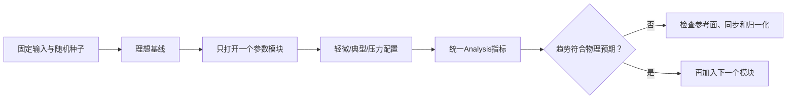
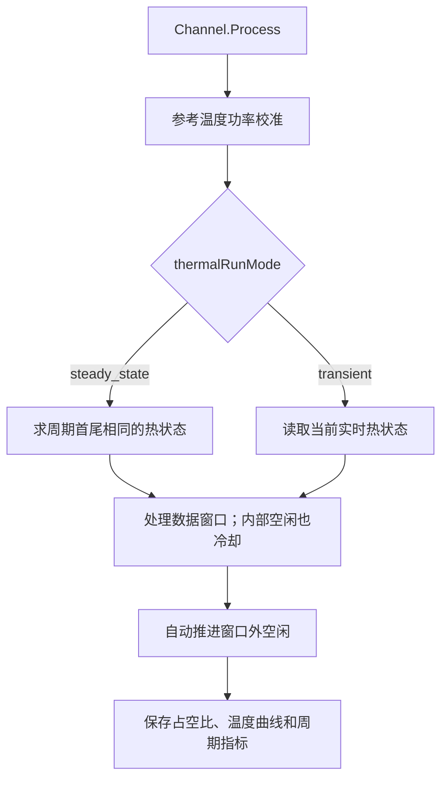

# 最小系统隔离测试示例

## 1. 文档目标

本文件说明如何构造“只打开一个物理非理想”的最小系统。它适合回答以下问题：

- Tx I/Q不平衡本身会把IRR和EVM恶化到什么程度？
- FB I/Q不平衡是否只污染反馈观测，而不会改变forward结果？
- 固定结温从25摄氏度升到85摄氏度时，PA输出怎样变化？
- 相同PA输出功率下，热阻或占空比改变以后，温升和输出漂移怎样变化？
- 用户配置的周期占空比、波形内部空闲比例和真实RF占空比怎样区分？
- 周期稳态和从冷机开始的连续瞬态应怎样分别验证？

最小系统不是完整整机仿真。它的目的，是让输出变化可以归因到一个参数模块。确认单模块行为以后，才能把多个非理想逐个加入完整DPD系统。

## 2. 最小系统的共同规则

每个最小系统都遵守下面的隔离规则：

1. 每次只改变一个模块的参数组，其他非理想使用0或 `None`。
2. 所有对比使用同一个随机种子、同一段输入波形和同一参考面。
3. I/Q测试使用单位PA，排除PA压缩、记忆和温度影响。
4. Tx I/Q测试使用forward参考面，FB I/Q测试直接从已知PA输出进入 `ProcessPaOutput`。
5. 温漂测试只需调用 `Channel.Process(rawSignal, outputPowerDbm=...)`；默认 `steady_state` 会在每次调用时执行参考温度功率校准，再按完整周期稳态温度曲线处理。需要观察冷启动历史时显式选择 `transient`。
6. 参数比较至少包含理想、轻微和压力三档，并给出预期单调趋势。
7. 理想双精度结果可能显示数百dB IRR或极小EVM，这只代表数值残差，不代表真实仪器动态范围。

最小系统的推荐执行顺序为：



## 3. 最小系统A：单独测试Tx I/Q不平衡

### 3.1 系统边界

Tx I/Q误差位于PA之前。为了只观察I/Q镜像，本场景把PA替换为单位映射：

```math
x(n)
\longrightarrow
\alpha_{\mathrm{tx}}x(n)
+
\beta_{\mathrm{tx}}x^*(n)
\longrightarrow
y(n).
```

不添加PA非线性、耦合、噪声、CFO、SFO、FB I/Q或量化。输入使用proper complex随机信号，使 $x$ 和 $x^*$ 在有限样本上尽量独立，便于估计IRR。

### 3.2 参数对比

| 场景 | `txIqImbalanceEnabled` | `txIqGainImbalanceDb` | `txIqPhaseImbalanceDegrees` | `txDcOffset` | 目的 |
|---|---:|---:|---:|---:|---|
| Disabled gate | False | 1.0 | 5.0 | `0.03+0.01j` | 用非零存量参数验证整级硬旁路 |
| Ideal enabled | True | 0.0 | 0.0 | `0+0j` | 启用模块后的数值理想基线 |
| Gain only | True | 0.3 | 0.0 | `0+0j` | 单独观察增益误差 |
| Phase only | True | 0.0 | 2.0 | `0+0j` | 单独观察正交误差 |
| Mild combined | True | 0.3 | 2.0 | `0+0j` | 常用功能验证起点 |
| Stress combined | True | 1.0 | 5.0 | `0+0j` | 明显镜像压力测试 |

### 3.3 最小可运行代码

```python
import numpy as np

from inc.lib.Analysis import Analysis
from inc.lib.Channel import Channel


class IdentityPa:
    """Provide a distortion-free PA boundary for impairment isolation."""

    def __init__(self) -> None:
        """Initialize one floating-point identity PA."""

        self.width = 0

    def Process(self, inputSignal: np.ndarray) -> np.ndarray:
        """Return a defensive complex copy without electrical distortion."""

        return np.asarray(inputSignal, dtype=np.complex128).copy()

    def ProcessFloating(self, inputSignal: np.ndarray) -> np.ndarray:
        """Evaluate the same identity mapping at the floating boundary."""

        return self.Process(inputSignal)

    def SmallSignalGain(self) -> complex:
        """Return the exact direct small-signal gain."""

        return 1.0 + 0.0j


def GenerateProperComplexProbe(
    sampleCount: int,
    randomSeed: int,
) -> np.ndarray:
    """Generate one unit-RMS proper complex probe waveform."""

    randomGenerator = np.random.default_rng(randomSeed)
    probeSignal = (
        randomGenerator.standard_normal(sampleCount)
        + 1j * randomGenerator.standard_normal(sampleCount)
    ) / np.sqrt(2.0)
    return probeSignal / np.sqrt(np.mean(np.abs(probeSignal) ** 2))


def AnalyzeKnownWaveforms(
    referenceSignal: np.ndarray,
    measuredSignal: np.ndarray,
    sampleRateHz: float,
) -> dict:
    """Analyze a measured waveform without descriptor reconstruction."""

    resultAnalysis = Analysis(
        measuredSignal,
        transmittedSignal=referenceSignal,
        sampleRateHz=sampleRateHz,
        width=0,
    )
    return resultAnalysis.Analyze()


def RunTxIqComparison() -> dict:
    """Compare ideal, individual, and combined Tx I/Q impairments."""

    sampleRateHz = 80.0e6
    referenceSignal = GenerateProperComplexProbe(4096, 1001)
    scenarioDefinitions = {
        "Disabled gate": (False, 1.0, 5.0, 0.03 + 0.01j),
        "Ideal enabled": (True, 0.0, 0.0, 0.0 + 0.0j),
        "Gain only": (True, 0.3, 0.0, 0.0 + 0.0j),
        "Phase only": (True, 0.0, 2.0, 0.0 + 0.0j),
        "Mild combined": (True, 0.3, 2.0, 0.0 + 0.0j),
        "Stress combined": (True, 1.0, 5.0, 0.0 + 0.0j),
    }
    comparisonResults = {}

    for scenarioName, (
        iqImbalanceEnabled,
        gainImbalanceDb,
        phaseImbalanceDegrees,
        dcOffset,
    ) in scenarioDefinitions.items():
        channel = Channel(
            paModel=IdentityPa(),
            parameters={
                "sampleMode": "forward",
                "sampleRateHz": sampleRateHz,
                "txIqImbalanceEnabled": iqImbalanceEnabled,
                "txIqGainImbalanceDb": gainImbalanceDb,
                "txIqPhaseImbalanceDegrees": phaseImbalanceDegrees,
                "txDcOffset": dcOffset,
                "noiseSnrDb": None,
                "width": 0,
            },
        )
        measuredSignal = channel.Process(referenceSignal)
        comparisonResults[scenarioName] = AnalyzeKnownWaveforms(
            referenceSignal,
            measuredSignal,
            sampleRateHz,
        )

    return comparisonResults


txIqResults = RunTxIqComparison()
for scenarioName, metrics in txIqResults.items():
    print(
        f"{scenarioName:16s} "
        f"IRR={metrics['irrDb']:8.2f} dB  "
        f"EVM={metrics['evmDb']:8.2f} dB"
    )
```

### 3.4 仿真结果与预期

上述确定性场景的典型结果为：

| 场景 | IRR | EVM | 预期判断 |
|---|---:|---:|---|
| Disabled gate | 约284 dB | 数值零残差 | 非零增益、相位和DC均被硬开关旁路 |
| Ideal enabled | 约284 dB | 数值零残差 | 只表示双精度基线 |
| Gain only | 35.26 dB | -35.26 dB | 与0.3 dB增益误差公式一致 |
| Phase only | 35.16 dB | -35.16 dB | 与2度正交误差公式一致 |
| Mild combined | 32.20 dB | -32.20 dB | 两个镜像向量共同作用 |
| Stress combined | 22.83 dB | -22.83 dB | 镜像明显主导EVM |

这里EVM约等于IRR的负值，是因为系统中只有一个共轭镜像误差。若加入PA非线性、DC、噪声或削顶，该关系将不再严格成立。

### 3.5 隔离成功的判据

- 增益误差或相位误差增大时，IRR应降低、EVM应升高。
- Disabled gate应与Ideal enabled逐样点一致，证明False不是仅关闭镜像项，而是同时旁路增益、相位和DC。
- `sampleMode="forward"` 仍然能看到Tx I/Q误差，因为它位于PA之前。
- `GetLastTransmitterOutput()` 应与单位PA输出一致。
- 如果Ideal场景仍只有二三十dB IRR，应先检查输入是否近似proper complex，以及Analysis是否使用了同一参考波形。

## 4. 最小系统B：单独测试FB I/Q不平衡

### 4.1 系统边界

本场景把输入定义为“已经存在的干净PA输出”，直接调用 `ProcessPaOutput`：

```math
y_{\mathrm{PA}}(n)
\longrightarrow
\alpha_{\mathrm{fb}}y_{\mathrm{PA}}(n)
+
\beta_{\mathrm{fb}}y_{\mathrm{PA}}^*(n)
\longrightarrow
z_{\mathrm{fb}}(n).
```

这样不会再次运行PA，也不会应用Tx I/Q。所有FB增益、FIR、时频偏、非线性、ADC和噪声都保持理想，只改变FB I/Q开关及其三个误差参数。

### 4.2 参数对比与代码

FB的增益和相位配置使用与Tx场景相同的五档值，并额外保留一组非零增益、相位和DC但关闭FB硬开关。把下面代码接在第3.3节公共函数之后即可运行：

```python
def RunFbIqComparison() -> dict:
    """Compare feedback I/Q settings on an already known PA output."""

    sampleRateHz = 80.0e6
    cleanPaOutput = GenerateProperComplexProbe(4096, 1001)
    scenarioDefinitions = {
        "Disabled gate": (False, 1.0, 5.0, 0.03 + 0.01j),
        "Ideal enabled": (True, 0.0, 0.0, 0.0 + 0.0j),
        "Gain only": (True, 0.3, 0.0, 0.0 + 0.0j),
        "Phase only": (True, 0.0, 2.0, 0.0 + 0.0j),
        "Mild combined": (True, 0.3, 2.0, 0.0 + 0.0j),
        "Stress combined": (True, 1.0, 5.0, 0.0 + 0.0j),
    }
    comparisonResults = {}

    for scenarioName, (
        iqImbalanceEnabled,
        gainImbalanceDb,
        phaseImbalanceDegrees,
        dcOffset,
    ) in scenarioDefinitions.items():
        channel = Channel(
            parameters={
                "sampleMode": "fb",
                "sampleRateHz": sampleRateHz,
                "fbIqImbalanceEnabled": iqImbalanceEnabled,
                "fbIqGainImbalanceDb": gainImbalanceDb,
                "fbIqPhaseImbalanceDegrees": phaseImbalanceDegrees,
                "fbDcOffset": dcOffset,
                "fbThirdOrderCoefficient": 0.0 + 0.0j,
                "fbClipAmplitude": None,
                "fbAdcWidth": None,
                "noiseSnrDb": None,
                "width": 0,
            }
        )
        measuredSignal = channel.ProcessPaOutput(cleanPaOutput)
        comparisonResults[scenarioName] = AnalyzeKnownWaveforms(
            cleanPaOutput,
            measuredSignal,
            sampleRateHz,
        )

    return comparisonResults


fbIqResults = RunFbIqComparison()
for scenarioName, metrics in fbIqResults.items():
    print(
        f"{scenarioName:16s} "
        f"IRR={metrics['irrDb']:8.2f} dB  "
        f"EVM={metrics['evmDb']:8.2f} dB"
    )
```

因为Tx与FB模块复用相同的I/Q系数换算，这六档结果应与第3.4节基本一致：Disabled gate与Ideal enabled都应回到逐样点一致的理想输出，其余误差档位遵循相同IRR趋势。但是物理含义不同：

- Tx结果代表真实发射镜像，可以由增广DPD补偿。
- FB结果只是测量镜像，不应直接由发射DPD补偿。
- 把同一组非零 `fbIq...` 参数放入 `sampleMode="forward"` 后，输出应回到Ideal基线。这是区分Tx和FB参考面的关键对照。
- 在 `sampleMode="fb"` 中设置 `fbIqImbalanceEnabled=False` 也应回到Ideal基线，但它只旁路FB增益、相位和DC，不关闭Tx I/Q或其他FB模块。

### 4.3 单独测试DC偏置

IRR描述共轭镜像，不适合度量纯DC。测试 `fbDcOffset` 时应主要观察EVM和零频谱线：

```python
def RunFbDcComparison() -> dict:
    """Compare feedback DC magnitude without adding image imbalance."""

    sampleRateHz = 80.0e6
    cleanPaOutput = GenerateProperComplexProbe(4096, 1001)
    dcMagnitudes = (0.0, 0.001, 0.01, 0.03)
    comparisonResults = {}

    for dcMagnitude in dcMagnitudes:
        channel = Channel(
            parameters={
                "sampleMode": "fb",
                "fbIqImbalanceEnabled": True,
                "fbDcOffset": dcMagnitude + 0.0j,
                "width": 0,
            }
        )
        measuredSignal = channel.ProcessPaOutput(cleanPaOutput)
        comparisonResults[dcMagnitude] = AnalyzeKnownWaveforms(
            cleanPaOutput,
            measuredSignal,
            sampleRateHz,
        )

    return comparisonResults
```

| `|fbDcOffset|` | 约占单位RMS信号 | EVM典型结果 |
|---:|---:|---:|
| 0 | 0% | 数值零残差 |
| 0.001 | 0.1% | 约 -60.01 dB |
| 0.01 | 1% | 约 -40.01 dB |
| 0.03 | 3% | 约 -30.46 dB |

DC增大时EVM按约20对数规律变差，但IRR仍可能很高，因为DC不是 $x^*$ 镜像。只看IRR会漏掉这一类误差。若把 `fbIqImbalanceEnabled` 改成False，同样的非零 `fbDcOffset` 也会被旁路；Tx端使用 `txIqImbalanceEnabled` 遵循相同规则。

## 5. 最小系统C：单独测试固定温度角

### 5.1 测试目的

固定温度角不模拟自热过程，只回答“同一参考温度校准驱动在不同结温下输出怎样变化”。它最适合隔离温度到电参数的映射；示例由 `Channel.Process` 在内部完成无热校准和恢复后真实处理：

```math
T_j
\longrightarrow
G(T_j),\ \phi(T_j),\ A_{\mathrm{sat}}(T_j),\ \eta_{\mathrm{nl}}(T_j)
\longrightarrow
y(n,T_j).
```

本例使用25、55和85摄氏度三点。温度系数故意设置得较明显，用于确认趋势，不代表具体器件规格。

### 5.2 三种热模型的推荐起始配置

`ThermalConfig.Recommended` 会同时设置全部21个热参数并执行合法性校验。下面三套配置都能直接送入 `PaModel`；`sampleRateHz` 必须替换成实际波形采样率：

```python
from inc.lib.PaModel import ThermalConfig


staticThermalConfig = ThermalConfig.Recommended(
    "static",
    sampleRateHz=80.0e6,
)
singleRcThermalConfig = ThermalConfig.Recommended(
    "single_rc",
    sampleRateHz=80.0e6,
)
fosterThermalConfig = ThermalConfig.Recommended(
    "foster",
    sampleRateHz=80.0e6,
)

print(staticThermalConfig)
print(singleRcThermalConfig)
print(fosterThermalConfig)
```

关键动态参数分别为：

| 模型 | 推荐热阻 | 推荐时间常数 | 预期行为 |
|---|---|---|---|
| `static` | `(1.0,)`占位 | `(1.0,)`占位 | 固定在55摄氏度；推荐另扫25/55/85摄氏度 |
| `single_rc` | `(20.0,)` 摄氏度/W | `(20e-3,)` s | 一条平滑指数升温和冷却曲线 |
| `foster` | `(2.0,8.0,20.0)` 摄氏度/W | `(50e-6,5e-3,0.5)` s | 同时包含快、中、慢热响应 |

以下是最小Foster运行例。用户只调用Channel主入口，不需要关闭温度模型或显式执行功率校准：

```python
from inc.lib.Channel import Channel
from inc.lib.PaModel import PaModel, ThermalConfig


fosterThermalConfig = ThermalConfig.Recommended(
    "foster",
    sampleRateHz=80.0e6,
)
fosterPa = PaModel(
    parameters={
        "modelName": "gmp",
        "thermalConfig": fosterThermalConfig,
        "width": 0,
    }
)
fosterChannel = Channel(
    paModel=fosterPa,
    parameters={
        "sampleRateHz": 80.0e6,
        "maximumOutputPowerDbm": 25.0,
        "thermalRunMode": "steady_state",
        "thermalDutyCycle": 0.50,
        "width": 0,
    },
)

receivedSignal = fosterChannel.Process(
    rawSignal,
    outputPowerDbm=20.0,
)
print(fosterChannel.GetThermalMetrics())
```

`thermalDutyCycle=0.50` 表示整个 `rawSignal` 数据窗口占一个周期的50%；其余50%的窗口外空闲由Channel自动推进，不需要再调用 `AdvanceThermalIdle`。若 `rawSignal` 内部还有补零，它们仍属于用户配置的数据窗口，但会被自动识别为空闲并降低 `actualDutyCycle`。

全部公共参数、四个温度电系数、敏感性范围和实测替换规则见 [PaModel.md的完整推荐表](./PaModel.md#1371-三种已实现模型的完整推荐值)。

### 5.3 压力对比使用的公共温度测试工具

下面的固定温度和动态热阻场景故意放大温度电参数，以便自动测试在短记录内稳定观察到趋势。这组放大值不能代替上面的工程推荐起点。

```python
import numpy as np

from inc.lib.Analysis import Analysis
from inc.lib.Channel import Channel
from inc.lib.PaModel import PaModel, ThermalConfig


def GenerateThermalProbe(
    sampleCount: int,
    randomSeed: int,
) -> np.ndarray:
    """Generate one amplitude-varying unit-RMS thermal probe."""

    randomGenerator = np.random.default_rng(randomSeed)
    probeSignal = (
        randomGenerator.standard_normal(sampleCount)
        + 1j * randomGenerator.standard_normal(sampleCount)
    ) / np.sqrt(2.0)
    return probeSignal / np.sqrt(np.mean(np.abs(probeSignal) ** 2))


def CreateThermalChannel(
    sampleRateHz: float,
    modelName: str,
    initialTemperatureC: float,
    thermalResistanceCPerW: float,
    thermalTimeConstantSec: float,
    thermalRunMode: str = "steady_state",
    thermalDutyCycle: float = 1.0,
) -> Channel:
    """Create one isolated SISO thermal PA and its forward channel."""

    thermalConfig = ThermalConfig(
        enabled=True,
        modelName=modelName,
        sampleRateHz=sampleRateHz,
        ambientTemperatureC=25.0,
        initialJunctionTemperatureC=initialTemperatureC,
        referenceTemperatureC=25.0,
        thermalResistancesCPerW=(thermalResistanceCPerW,),
        thermalTimeConstantsSec=(thermalTimeConstantSec,),
        thermalUpdateIntervalSamples=100,
        idleDissipatedPowerW=0.0,
        referenceOutputPowerDbm=25.0,
        gainTemperatureCoefficientDbPerC=-0.08,
        phaseTemperatureCoefficientDegreesPerC=0.10,
        saturationTemperatureCoefficientPerC=-0.004,
        nonlinearityTemperatureCoefficientPerC=0.010,
        maximumJunctionTemperatureC=150.0,
    )
    paModel = PaModel(
        parameters={
            "modelName": "wiener",
            "thermalConfig": thermalConfig,
            "width": 0,
        }
    )
    return Channel(
        paModel=paModel,
        parameters={
            "sampleRateHz": sampleRateHz,
            "maximumOutputPowerDbm": 25.0,
            "calibrationToleranceDb": 0.05,
            "thermalRunMode": thermalRunMode,
            "thermalDutyCycle": thermalDutyCycle,
            "width": 0,
        },
    )
```

### 5.4 固定温度角对比代码

```python
def RunStaticTemperatureComparison() -> dict:
    """Compare one hidden reference calibration at fixed temperatures."""

    sampleRateHz = 100.0e3
    rawSignal = GenerateThermalProbe(2000, 2027)
    temperatureValuesC = (25.0, 55.0, 85.0)
    outputSignals = {}
    thermalMetrics = {}

    for temperatureC in temperatureValuesC:
        channel = CreateThermalChannel(
            sampleRateHz=sampleRateHz,
            modelName="static",
            initialTemperatureC=temperatureC,
            thermalResistanceCPerW=20.0,
            thermalTimeConstantSec=0.02,
        )
        outputSignals[temperatureC] = channel.Process(
            rawSignal,
            outputPowerDbm=20.0,
        )
        thermalMetrics[temperatureC] = channel.GetThermalMetrics()

    coldReference = outputSignals[25.0]
    comparisonResults = {}
    for temperatureC in temperatureValuesC:
        driftMetrics = Analysis(
            outputSignals[temperatureC],
            transmittedSignal=coldReference,
            sampleRateHz=sampleRateHz,
            width=0,
        ).Analyze()
        comparisonResults[temperatureC] = {
            "outputPowerDbm": thermalMetrics[temperatureC][
                "outputPowerDbm"
            ],
            "evmDbVersusCold": driftMetrics["evmDb"],
            "evmPercentVersusCold": driftMetrics["evmPercent"],
        }

    return comparisonResults


staticTemperatureResults = RunStaticTemperatureComparison()
for temperatureC, metrics in staticTemperatureResults.items():
    print(temperatureC, metrics)
```

### 5.4 固定温度角结果

| 结温 | 输出功率 | 相对25摄氏度EVM | EVM百分比 |
|---:|---:|---:|---:|
| 25摄氏度 | 19.97 dBm | 数值零残差 | 0% |
| 55摄氏度 | 16.07 dBm | -21.64 dB | 8.28% |
| 85摄氏度 | 11.82 dBm | -14.92 dB | 17.95% |

这个结果由示例中较强的负增益温度系数、负饱和温度系数和正附加非线性系数共同产生。若只打开 `gainTemperatureCoefficientDbPerC`，公共复增益对齐会消除大部分EVM变化，但绝对输出功率仍会漂移；因此温漂测试必须同时观察输出功率和对齐后EVM。

## 6. 最小系统D：单独测试周期动态自热

### 6.1 测试边界和两种运行模式

动态自热测试仍包含“参考温度功率校准”和“真实温度发射”两个物理阶段，但它们已经封装在 `Channel.Process(rawSignal, outputPowerDbm=...)` 内部。用户不用关闭温度模型、调用校准器或构造空闲波形。

Channel把每次输入看成一个数据窗口，再根据 `thermalDutyCycle` 自动补足窗口外空闲。两种模式的区别如下：

| 模式 | 周期起点 | 一次 `Process` 的含义 | 首尾温度 | 适用场景 |
|---|---|---|---|---|
| `steady_state`，默认 | 自动求周期不动点 | 在收敛的周期温度曲线上处理一个数据窗口 | 周期首尾在容差内相同；数据窗口末端可以更热 | 连续循环工作点、不同功率或占空比的公平对比 |
| `transient` | 当前保存的实时热状态 | 从当前状态推进数据窗口和自动外部空闲各一次 | 未稳定时通常不同 | 冷启动、预热、功率阶跃和突发建立过程 |



图示说明：功率校准试探不推进热时间，也不围绕热态输出追踪目标。真实处理才产生温度相关增益、相位、饱和和非线性漂移。默认稳态模式第一次调用必须提供 `outputPowerDbm`；后续省略时会复用最近成功目标并再次做参考校准。

### 6.2 周期稳态下比较不同热阻

保持时间常数20 ms、配置占空比50%、输入波形、目标功率和温度系数不变，只改变单RC热阻：5、20和40摄氏度/W。默认稳态模式不需要先循环很多帧；一次调用就求出无限周期发送时的极限温度曲线。

```python
def RunSteadyResistanceScenario(
    thermalResistanceCPerW: float,
) -> dict:
    """Measure one converged periodic single-RC operating point."""

    sampleRateHz = 100.0e3
    rawSignal = GenerateThermalProbe(2000, 2027)
    channel = CreateThermalChannel(
        sampleRateHz=sampleRateHz,
        modelName="single_rc",
        initialTemperatureC=25.0,
        thermalResistanceCPerW=thermalResistanceCPerW,
        thermalTimeConstantSec=0.02,
        thermalRunMode="steady_state",
        thermalDutyCycle=0.50,
    )
    channel.Process(rawSignal, outputPowerDbm=20.0)
    thermalMetrics = channel.GetThermalMetrics()
    return {
        "periodStartC": thermalMetrics[
            "periodStartingJunctionTemperatureC"
        ],
        "dataEndC": thermalMetrics["dataEndingJunctionTemperatureC"],
        "periodEndC": thermalMetrics[
            "periodEndingJunctionTemperatureC"
        ],
        "periodAveragePowerW": thermalMetrics[
            "averageDissipatedPowerW"
        ],
        "closureErrorC": thermalMetrics["steadyStateErrorC"],
    }


for thermalResistanceCPerW in (5.0, 20.0, 40.0):
    print(
        thermalResistanceCPerW,
        RunSteadyResistanceScenario(thermalResistanceCPerW),
    )
```

预期对比如下：

| 热阻增大 | 周期起点温度 | 数据窗口末端温度 | 周期平均耗散 | 周期闭合误差 |
|---|---|---|---|---|
| 5 → 20 → 40摄氏度/W | 单调升高 | 单调升高 | 会随温度电漂移略变，不能假定严格不变 | 每组都应小于配置容差 |

热阻越大，相同耗散形成的温升越高；由于本示例同时启用了温度相关电参数，输出和耗散会反过来轻微改变，所以不能用一个固定耗散乘热阻替代完整不动点求解。若结温变化而输出功率和EVM完全不变，应检查四个温度电参数是否全为0。

### 6.3 配置占空比、内部空闲和真实占空比

用户配置的是“数据窗口/完整周期”，不是数组中非零样点的比例。下面的函数把数据窗口后半段改为0，并同时记录三种占空比：

```python
def RunDutyCycleScenario(
    thermalDutyCycle: float,
    waveformActiveDutyCycle: float,
) -> dict:
    """Compare scheduled duty with activity measured inside the waveform."""

    sampleRateHz = 100.0e3
    fullProbe = GenerateThermalProbe(2000, 2027)
    activeSampleCount = int(
        fullProbe.size * waveformActiveDutyCycle
    )
    rawSignal = np.zeros(fullProbe.size, dtype=np.complex128)
    rawSignal[:activeSampleCount] = fullProbe[:activeSampleCount]
    channel = CreateThermalChannel(
        sampleRateHz=sampleRateHz,
        modelName="single_rc",
        initialTemperatureC=25.0,
        thermalResistanceCPerW=20.0,
        thermalTimeConstantSec=0.02,
        thermalRunMode="steady_state",
        thermalDutyCycle=thermalDutyCycle,
    )

    # This pre-processing query predicts activity at the current PA input.
    predictedActualDuty = channel.GetActualDutyCycle(rawSignal)
    channel.Process(rawSignal, outputPowerDbm=20.0)
    thermalMetrics = channel.GetThermalMetrics()
    return {
        "configuredDutyCycle": thermalMetrics["configuredDutyCycle"],
        "waveformActiveDutyCycle": thermalMetrics[
            "waveformActiveDutyCycle"
        ],
        "actualDutyCycle": channel.GetActualDutyCycle(),
        "predictedActualDutyCycle": predictedActualDuty,
        "scheduledIdleDurationSec": thermalMetrics[
            "scheduledIdleDurationSec"
        ],
        "periodDurationSec": thermalMetrics["periodDurationSec"],
        "periodStartC": thermalMetrics[
            "periodStartingJunctionTemperatureC"
        ],
        "dataEndC": thermalMetrics["dataEndingJunctionTemperatureC"],
        "periodEndC": thermalMetrics[
            "periodEndingJunctionTemperatureC"
        ],
    }


dutyCases = (
    (0.50, 1.00),
    (1.00, 0.50),
    (0.50, 0.50),
    (0.25, 1.00),
)
for thermalDutyCycle, waveformActiveDutyCycle in dutyCases:
    print(
        thermalDutyCycle,
        waveformActiveDutyCycle,
        RunDutyCycleScenario(
            thermalDutyCycle,
            waveformActiveDutyCycle,
        ),
    )
```

理想门限下预期关系为：

| `thermalDutyCycle` | 窗口内部活动比例 | `actualDutyCycle` | 物理解释 |
|---:|---:|---:|---|
| 50% | 100% | 50% | 整个数据窗口发射，随后自动外部空闲 |
| 100% | 50% | 50% | 周期没有外部空闲，但数据窗口后半段自身为空闲 |
| 50% | 50% | 25% | 数据窗口内部和窗口外部都存在空闲 |
| 25% | 100% | 25% | 较短的全活动窗口，随后较长外部空闲 |

第一组与第二组、第三组与第四组的真实RF占空比分别相同，但周期长度和热量在周期中的位置不同，所以快速RC支路的峰值温度和温度纹波可以不同。只比较平均占空比无法验证热记忆。

### 6.4 瞬态模式怎样逐周期趋近稳态

下面显式选择 `transient`，每次调用从上次周期终点继续。由于 `thermalDutyCycle=0.40`，每个20 ms数据窗口后都自动推进30 ms窗口外空闲：

```python
def RunTransientWarmup() -> list:
    """Record the causal temperature state over repeated periods."""

    sampleRateHz = 100.0e3
    rawSignal = GenerateThermalProbe(2000, 2027)
    channel = CreateThermalChannel(
        sampleRateHz=sampleRateHz,
        modelName="single_rc",
        initialTemperatureC=25.0,
        thermalResistanceCPerW=20.0,
        thermalTimeConstantSec=0.02,
        thermalRunMode="transient",
        thermalDutyCycle=0.40,
    )
    periodRecords = []
    for periodIndex in range(12):
        channel.Process(rawSignal, outputPowerDbm=20.0)
        thermalMetrics = channel.GetThermalMetrics()
        periodRecords.append(
            {
                "periodIndex": periodIndex,
                "periodStartC": thermalMetrics[
                    "periodStartingJunctionTemperatureC"
                ],
                "dataEndC": thermalMetrics[
                    "dataEndingJunctionTemperatureC"
                ],
                "periodEndC": thermalMetrics[
                    "periodEndingJunctionTemperatureC"
                ],
            }
        )
    return periodRecords


print(RunTransientWarmup())
```

未达到稳态时，本周期 `periodEndC` 会成为下一周期 `periodStartC`，首尾差逐渐减小。最终它应趋近使用相同波形和参数直接运行 `steady_state` 得到的周期极限环。这里不要再调用 `AdvanceThermalIdle(30e-3)`，否则同一外部空闲会计算两次。

### 6.5 绘制一个周期的温度曲线

温度曲线已经保存在指标字典中，不需要重新仿真。每个 `temperatureTraceRfActive[k]` 描述第 `k` 个时间点到第 `k+1` 个时间点之间是否存在RF活动：

```python
import matplotlib.pyplot as plt


def DrawPeriodicTemperature(channel: Channel) -> None:
    """Plot one accepted period and shade RF-active thermal intervals."""

    thermalMetrics = channel.GetThermalMetrics()
    timeMs = 1.0e3 * np.asarray(
        thermalMetrics["temperatureTraceTimeSec"],
        dtype=float,
    )
    temperatureC = np.asarray(
        thermalMetrics["temperatureTraceC"],
        dtype=float,
    )
    intervalActivity = np.asarray(
        thermalMetrics["temperatureTraceRfActive"],
        dtype=bool,
    )

    figure, axis = plt.subplots(figsize=(8.0, 4.0))
    axis.plot(timeMs, temperatureC, marker="o", label="junction")
    for intervalIndex, isActive in enumerate(intervalActivity):
        if isActive:
            axis.axvspan(
                timeMs[intervalIndex],
                timeMs[intervalIndex + 1],
                color="tab:red",
                alpha=0.15,
            )
    axis.set_xlabel("Time within period (ms)")
    axis.set_ylabel("Junction temperature (C)")
    axis.grid(True, alpha=0.3)
    axis.legend()
    figure.tight_layout()
    plt.show()
```

稳态曲线的第一个和最后一个温度点应重合；中间曲线可以先升后降，也可以因内部空闲形成多个局部峰谷。红色背景表示活动热区间，未着色区域可能是输入数组内部空闲，也可能是Channel自动加入的窗口外空闲。

### 6.6 从实际PA测量得到上述参数

本章示例用于隔离参数影响，不应从仿真曲线反向猜测真实器件参数。实际工程应同步测量结温、DC电压电流、输入/输出RF功率和I/Q，先拟合热源效率，再拟合单RC或Foster，最后在已知结温下拟合增益、相位、饱和尺度和附加非线性温度系数。周期测试还必须同时记录用户数据窗口、窗口内部RF活动掩码、完整周期和额外仪表间隔。完整仪表连接、测试时序、NumPy拟合函数、周期稳态验收、static/单RC/Foster回填例和留出数据验收方法见 [PA温度特性测量、模型辨识与参数回填](./PaThermalMeasurement.md)。

## 7. 参数对比时应该记录哪些结果

### 7.1 I/Q最小系统

至少记录：

- `irrDb`：判断共轭镜像强度；
- `evmDb` 和 `evmPercent`：判断镜像或DC对调制误差的贡献；
- Tx测试的 `GetLastTransmitterOutput()`：确认误差位于PA前；
- forward与fb成对结果：区分真实发射误差和反馈接收机误差。

### 7.2 温漂最小系统

至少记录：

- `periodStartingJunctionTemperatureC`、`dataEndingJunctionTemperatureC` 和 `periodEndingJunctionTemperatureC`；
- `configuredDutyCycle`、`waveformActiveDutyCycle` 和 `actualDutyCycle`；
- `dataWindowAverageDissipatedPowerW` 和完整周期的 `averageDissipatedPowerW`；
- `steadyStateConverged`、`steadyStateIterations` 和 `steadyStateErrorC`；
- `temperatureTraceTimeSec`、`temperatureTraceC` 和 `temperatureTraceRfActive`；
- `outputPowerDbm`：观察绝对增益和压缩漂移；
- 相对冷机或第1帧的EVM：观察公共复增益对齐后剩余的非线性形状变化；
- ACLR或双音IM3：需要判断温度相关带外再生时再加入，不能只看功率。

## 8. 如何扩展到其他最小系统

同一方法可以扩展到其他Channel模块。保持所有未测试模块理想，只改变表中的目标参数：

| 最小系统 | 只改变的参数 | 推荐三档对比 | 主要指标 |
|---|---|---|---|
| PA前耦合 | `prePaCouplingPaths` | `None`、-30 dB、-20 dB | 非对角泄漏、EVM、联合校准收敛 |
| PA后耦合 | `postPaCouplingPaths` | `None`、-30 dB、-20 dB | 接收端泄漏、EVM、去嵌入残差 |
| FB同步 | Delay、CFO、SFO | 0、典型值、压力值 | 估计误差、EVM、帧尾残差 |
| FB非线性 | `fbThirdOrderCoefficient` | 0、0.01、0.10幅度 | EVM、ACLR、双音IM3 |
| FB ADC | `fbAdcWidth` | 16、12、8 bit | 量化EVM、削顶率、噪声底 |
| 白噪声 | `noiseSnrDb` | 45、35、25 dB | SNR和EVM地板 |

扩展时不要直接复制完整整机配置。最小系统的价值正是把参考面、输入、随机种子和其他模块固定下来，只让一个配置组产生变化。

## 9. 结果不符合预期时的检查顺序

1. 确认比较使用同一输入数组，而不是相同配置重新生成的另一段随机波形。
2. 确认 `width=0`，先排除公开定点量化；验证通过后再单独加入定点系统。
3. 确认Analysis使用 `transmittedSignal=referenceSignal`，没有进入盲Descriptor解析。
4. Tx I/Q必须通过 `Process`，FB I/Q必须通过fb模式或 `ProcessPaOutput`；不要混淆参考面。
5. 默认稳态模式第一次调用必须传 `outputPowerDbm`；后续即使省略也会复用最近目标并重新执行参考温度校准。该校准不会闭环稳定热态输出。
6. 检查 `thermalDutyCycle` 表示数据窗口占完整周期，而不是数组非零比例；用 `GetActualDutyCycle()` 核对真实RF占空比。
7. 检查是否把自动窗口外空闲又传给 `AdvanceThermalIdle`，从而重复计算冷却时间。
8. 稳态闭合应比较周期起点和周期终点，不要误用数据窗口末端的兼容字段 `endingJunctionTemperatureC`。
9. 检查温度系数是否非零；只有热网络升温而电参数不随温度变化时，波形可能几乎不变。
10. 一次只恢复一个被关闭的模块，直到找到趋势改变的来源。

## 10. 最小系统E：单独验证Rapp无记忆PA

### 10.1 为什么需要这个场景

Rapp是本工程新增的严格无记忆固态PA模型。它只让当前输出依赖当前输入：

```math
y[n]
=
\frac{G x[n]}
{\left(1+\left(\frac{|x[n]|}{A_{\mathrm{sat}}}\right)^{2p}\right)^{1/(2p)}}.
```

因此，只要两段波形在第 $n$ 点的复数值相同，不论此前样点如何变化，Rapp都必须给出完全相同的 $y[n]$。这个场景的目的不是证明Rapp“没有非线性”，而是把**静态压缩**和**动态记忆**拆开：Rapp可以产生明显IM3、IM5和IM7，但不应产生真正的频率响应起伏、群时延或动态迟滞。

### 10.2 三档膝点平滑度对比

固定 `linearGain=1.0`、`saturationAmplitude=1.0`，只改变 `rappSmoothness`：

| `rappSmoothness` | 适合的对照目的 | $|x|=0.5$增益压缩 | $|x|=1.0$增益压缩 | $|x|=1.4$增益压缩 |
|---:|---|---:|---:|---:|
| 1.5 | 很软的膝点，较早出现渐进压缩 | -0.341 dB | -2.007 dB | -3.822 dB |
| 3.0 | 推荐默认值，代表常见平滑SSPA | -0.022 dB | -1.003 dB | -3.103 dB |
| 8.0 | 接近硬限幅，用于压力测试 | 约0 dB | -0.376 dB | -2.925 dB |

这些数值是相对于小信号线性增益 $G$ 的压缩量。`rappSmoothness` 越大，膝点前越接近直线、膝点附近转折越突然；它不会引入记忆或AM-PM。

### 10.3 最小可运行代码：相同当前样点、不同历史

```python
import numpy as np

from inc.lib.PaModel import PaModel, RappConfig, WienerConfig


sampleCount = 256
comparisonIndex = 128
firstHistory = np.zeros(sampleCount, dtype=np.complex128)
secondHistory = np.zeros(sampleCount, dtype=np.complex128)

# Only the preceding sample is different.  The compared current sample is exact.
firstHistory[comparisonIndex - 1] = 0.9 + 0.2j
secondHistory[comparisonIndex - 1] = -0.3 + 0.7j
firstHistory[comparisonIndex] = 0.6 - 0.1j
secondHistory[comparisonIndex] = firstHistory[comparisonIndex]

rappPa = PaModel(
    modelName="rapp",
    rappConfig=RappConfig(
        linearGain=1.0,
        saturationAmplitude=1.0,
        rappSmoothness=3.0,
    ),
    width=0,
)
wienerPa = PaModel(
    modelName="wiener",
    wienerConfig=WienerConfig(linearTaps=(0.90 + 0.0j, 0.10 + 0.0j)),
    width=0,
)

rappFirst = rappPa.Process(firstHistory)
rappSecond = rappPa.Process(secondHistory)
wienerFirst = wienerPa.Process(firstHistory)
wienerSecond = wienerPa.Process(secondHistory)

print("Rapp context difference:", abs(rappFirst[comparisonIndex] - rappSecond[comparisonIndex]))
print("Wiener context difference:", abs(wienerFirst[comparisonIndex] - wienerSecond[comparisonIndex]))
```

预期结果：Rapp差值处于浮点舍入误差量级；Wiener差值明显非零，因为其第二个 `linearTaps` 抽头显式使用 $x[n-1]$。进一步运行 `RunPaCharacterizationBenchmark` 时，还应看到Rapp的频响起伏、群时延和动态迟滞接近零，而其互调随输出功率升高而恶化。这样才能确认测试链既能发现静态非线性，也不会把无记忆模型误判成有记忆。
