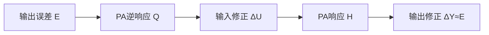
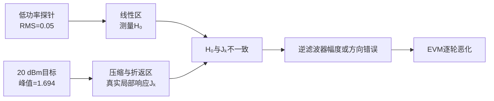
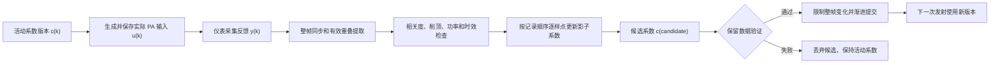
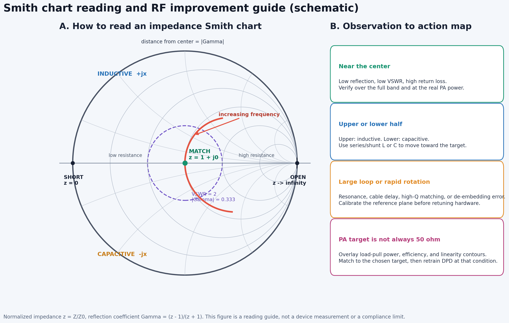

# DPD-ILC 常见问题

本文收集工程使用过程中容易混淆的物理概念、算法边界和诊断方法。文中的功率、幅度和仿真数据采用本工程默认约定。

---

## Q1：低功率小信号逆响应是什么意思？

### 简要回答

低功率小信号逆响应不是把PA输出样值直接取倒数，而是：

> 用幅度很小的测试信号测量PA在接近零输入处的线性传递函数，再对该传递函数求正则化逆，用它预测应该怎样修改PA输入。

这种逆响应只准确描述PA线性区附近的增量关系。如果实际工作信号已经进入深度压缩、AM-AM折返或强AM-PM区域，当前工作点的局部响应可能与小信号响应完全不同，此时固定的小信号逆可能低估更新量，甚至给出错误的更新方向。

### 1. 从线性PA理解逆响应

若PA是线性时不变系统：

```math
y[n]=h[n]*u[n],
```

频域关系为：

```math
Y(f)=H(f)U(f).
```

若希望输出等于目标 $D(f)$，理想输入满足：

```math
U(f)=\frac{D(f)}{H(f)}.
```

因此理想逆响应为：

```math
Q(f)=\frac{1}{H(f)}.
```

直接除法会在 $|H(f)|$ 很小的位置放大噪声和数值误差，所以代码使用带正则化的逆：

```math
Q(f)
=
\frac{H^*(f)}
{|H(f)|^2+\lambda},
```

其中 $\lambda>0$ 是正则化系数。设第 $k$ 轮输出误差为：

```math
E_k(f)=D(f)-Y_k(f).
```

频域ILC更新为：

```math
U_{k+1}(f)
=
U_k(f)+\mu Q(f)E_k(f),
```

其中 $\mu$ 是学习率。在线性模型准确时：

```math
\Delta Y(f)
\approx
H(f)Q(f)E_k(f)
\approx
E_k(f).
```

这意味着输入修正经过PA后，能够在输出端抵消原误差。



**图1说明：**逆响应描述的是“输入变化怎样经过PA转换成输出变化”。它不是输出样值的倒数，而是PA传递关系的逆。

### 2. 什么是小信号响应

以无记忆奇数阶复基带多项式为例：

```math
y
=
a_1x
+a_3x|x|^2
+a_5x|x|^4
+a_7x|x|^6.
```

令测试信号为：

```math
x=\varepsilon s,
\qquad
\varepsilon\ll1.
```

输出变为：

```math
y
=
a_1\varepsilon s
+a_3\varepsilon^3s|s|^2
+a_5\varepsilon^5s|s|^4
+a_7\varepsilon^7s|s|^6.
```

高阶项相对线性项的比例分别满足：

```math
\frac{P_3}{P_1}\propto\varepsilon^2,
\qquad
\frac{P_5}{P_1}\propto\varepsilon^4,
\qquad
\frac{P_7}{P_1}\propto\varepsilon^6.
```

当 $\varepsilon$ 足够小时，高阶非线性项迅速衰减，因此：

```math
y\approx a_1x.
```

若PA带有线性记忆，则：

```math
y[n]
\approx
\sum_m a_{1,m}x[n-m].
```

对应的小信号频率响应为：

```math
H_0(f)
=
\sum_m a_{1,m}
e^{-j2\pi f m/f_s}.
```

下标0表示该响应是在输入接近零的工作点测得。低功率小信号逆响应为：

```math
Q_0(f)
=
\frac{H_0^*(f)}
{|H_0(f)|^2+\lambda}.
```

### 3. 当前频域ILC怎样测量小信号响应

`RunFrequencyDomainIlc` 先根据目标波形产生低幅度探针：

```math
u_{\mathrm{probe}}
=
\frac{A_{\mathrm{probe}}}
{A_{\mathrm{target}}}
u_{\mathrm{target}}.
```

探针RMS使用：

```math
A_{\mathrm{probe}}
=
\min
\left(
0.05,\,
0.25A_{\mathrm{target}}
\right).
```

在 `SmallestSISO.py` 当前20 dBm配置中：

```math
A_{\mathrm{target}}=0.5623,
\qquad
A_{\mathrm{probe}}=0.05.
```

两者相差：

```math
20\log_{10}
\left(
\frac{0.05}{0.5623}
\right)
\approx-21.0\ {\mathrm{dB}}.
```

探针主要测量GMP的一阶线性项和线性记忆：

```math
Y_{\mathrm{probe}}(f)
\approx
H_0(f)U_{\mathrm{probe}}(f).
```

程序据此估计：

```math
\hat H_0(f)
=
\frac{
Y_{\mathrm{probe}}(f)
U_{\mathrm{probe}}^*(f)
}{
|U_{\mathrm{probe}}(f)|^2+\epsilon
}.
```

随后构造固定学习滤波器：

```math
Q_0(f)
=
\mu
\frac{\hat H_0^*(f)}
{|\hat H_0(f)|^2+\lambda}.
```

当前实现只在ILC开始前测量一次 $\hat H_0(f)$，后续所有迭代都复用它。

### 4. 小信号逆与当前工作点局部逆的区别

用实数AM-AM多项式表示PA：

```math
y(A)
=
a_1A+a_3A^3+a_5A^5+a_7A^7.
```

在当前工作点 $A_0$ 附近施加小变化：

```math
A=A_0+\Delta A.
```

定义工作点处的局部斜率：

```math
s(A_0)
=
\frac{dy}{dA}(A_0).
```

输出的一阶变化为：

```math
\Delta y
\approx
s(A_0)\Delta A.
```

将多项式导数代入，得到：

```math
s(A_0)
=
a_1
+3a_3A_0^2
+5a_5A_0^4
+7a_7A_0^6.
```

真正需要的局部逆近似为：

```math
Q_{\mathrm{local}}(A_0)
\approx
\frac{1}{
a_1
+3a_3A_0^2
+5a_5A_0^4
+7a_7A_0^6
}.
```

小信号逆只保留：

```math
Q_0\approx\frac{1}{a_1}.
```

二者只有在 $A_0$ 接近零时才近似相等。

### 5. 三个典型工作区域

在线性区：

```math
\frac{dy}{dA}>0.
```

输入增加，输出也增加，小信号逆通常能够给出正确方向。

在深度压缩区：

```math
0<
\frac{dy}{dA}
\ll a_1.
```

输入增加很多，输出只增加一点。真实局部逆需要更大的修正量，小信号逆会低估更新。

在AM-AM折返区：

```math
\frac{dy}{dA}<0.
```

输入增加，输出反而下降。小信号逆仍然假设输入和输出同方向变化，因此可能给出相反的更新方向。

当：

```math
\frac{dy}{dA}=0
```

时，局部逆理论上趋向无穷：

```math
|Q_{\mathrm{local}}|\rightarrow\infty.
```

这表示PA在该点附近已经失去稳定可逆性。

### 6. 为什么当前20 dBm GMP会出现问题

当前功率回退换算为：

```math
a
=
10^{(20-25)/20}
=
0.5623.
```

Wi-Fi波形具有约9.58 dB PAPR，所以：

```math
u_{\mathrm{RMS}}=0.5623,
\qquad
u_{\mathrm{peak}}=1.6936.
```

当前波形中：

- 约20.9%的样点幅度超过0.7；
- 约13.0%的样点幅度超过0.8；
- 约4.25%的样点幅度超过1.0。

默认GMP的稳态AM-AM结果为：

| 输入幅度 | 输出幅度 | 局部幅度斜率 | 输出相位 |
|---:|---:|---:|---:|
| 0.55 | 0.432 | +0.358 | 4.8度 |
| 0.80 | 0.461 | -0.114 | 12.6度 |
| 1.05 | 0.392 | -0.377 | 28.1度 |
| 1.30 | 0.308 | -0.192 | 58.5度 |
| 1.55 | 0.339 | +0.504 | 100.8度 |

在大约0.8到1.4的范围内，AM-AM局部斜率已经变成负数，而且AM-PM相位快速旋转。当前20 dBm Wi-Fi信号有大量样点进入该区域，所以低功率测得的 $\hat H_0(f)$ 无法描述真实工作点。



**图2说明：**低功率探针和实际目标处在不同的PA工作区。固定小信号逆不是当前高功率工作点的局部逆。

### 7. 复数GMP为什么更加复杂

对于复基带多项式：

```math
y
=
a_1x
+a_3x|x|^2
+a_5x|x|^4
+a_7x|x|^6,
```

工作点 $x_0$ 附近的增量模型为：

```math
\Delta y
\approx
J(x_0)\Delta x
+K(x_0)\Delta x^*.
```

其中：

```math
J(x_0)
=
a_1
+2a_3|x_0|^2
+3a_5|x_0|^4
+4a_7|x_0|^6,
```

```math
K(x_0)
=
a_3x_0^2
+2a_5x_0^2|x_0|^2
+3a_7x_0^2|x_0|^4.
```

因此高功率输出变化不仅依赖 $\Delta x$，还依赖共轭增量 $\Delta x^*$。完整GMP还包含主分支记忆、滞后包络和超前包络，所以局部Jacobian取决于当前整段波形，而不是一个固定的线性频率响应。

当前固定小信号逆只近似：

```math
\Delta y\approx H_0\Delta x.
```

它没有描述：

- 当前幅度相关的 $J(x_0)$；
- 共轭路径 $K(x_0)$；
- GMP包络交叉记忆；
- 不同样点的局部斜率变化；
- 公共增益随输入变化产生的导数。

### 8. 为什么公共复增益补偿不能替代局部逆

设PA输出为：

```math
y=F(u).
```

公共增益补偿后的信号为：

```math
z(u)=\frac{F(u)}{g(u)}.
```

即使当前波形满足 $z(u)\approx u$，局部导数仍为：

```math
\frac{dz}{du}
=
\frac{F'(u)}{g(u)}
-
\frac{F(u)g'(u)}{g^2(u)}.
```

因此：

```math
z(u)\approx u
```

并不代表：

```math
\frac{dz}{du}\approx1.
```

公共复增益补偿解决的是“当前输出和参考的平均幅度、相位是否一致”；逆响应解决的是“输入增加一点以后，输出会向哪个方向变化”。两者是不同的物理问题。

### 9. 当前案例的数值证据

在20 dBm GMP场景中，当前正方向第一步已经使EVM恶化：

| 更新系数 | 第一轮候选EVM |
|---:|---:|
| -0.30 | -11.029 dB |
| -0.15 | -11.052 dB |
| 0 | -10.893 dB |
| +0.15，当前更新方向 | -10.525 dB |
| +0.30 | -9.887 dB |

这说明小信号逆给出的正方向不是当前工作点的下降方向。但不能简单地永久翻转符号，因为PA局部斜率会随着每轮输入变化；固定负方向只在最初少数轮次有效。

功率对照进一步说明了工作区影响：

| 输出配置 | 初始峰值 | 第1轮EVM | 最佳EVM | 最佳轮 |
|---:|---:|---:|---:|---:|
| 10 dBm | 0.536 | -30.824 dB | -38.583 dB | 8 |
| 12 dBm | 0.674 | -26.842 dB | -33.232 dB | 8 |
| 14 dBm | 0.849 | -22.849 dB | -27.009 dB | 8 |
| 15 dBm | 0.952 | -20.854 dB | -23.491 dB | 8 |
| 16 dBm | 1.069 | -18.860 dB | -20.106 dB | 6 |
| 18 dBm | 1.345 | -14.880 dB | -14.975 dB | 2 |
| 20 dBm | 1.694 | -10.893 dB | -10.893 dB | 1 |

低功率时固定小信号逆能够改善EVM；进入18到20 dBm后，PA工作点跨入强非线性和折返区域，最佳轮迅速提前。

### 10. 更合适的局部逆测量

每轮应在当前输入 $u_k$ 附近施加小探测扰动：

```math
u_k^{\mathrm{trial}}
=
u_k+\varepsilon p_k.
```

分别测量：

```math
y_k=F(u_k),
```

```math
y_k^{\mathrm{trial}}
=
F(u_k+\varepsilon p_k).
```

当前方向的局部Jacobian近似为：

```math
J_kp_k
\approx
\frac{
y_k^{\mathrm{trial}}-y_k
}{
\varepsilon
}.
```

再使用当前工作点的正则化局部伪逆：

```math
\Delta u_k
\approx
J_k^\dagger e_k.
```

工程实现还应配合：

1. 回溯线搜索，只接受LC-NMSE或严格EVM代理下降的候选；
2. 信赖域或最大更新RMS限制，避免一步跨过局部可逆区；
3. 连续恶化时提前停止并返回历史最佳轮；
4. 根据PA的P1dB或饱和输入建立独立的输入幅度标定；
5. 调整GMP系数，使目标输入峰值范围内的AM-AM保持单调。

### 11. 一句话总结

低功率小信号逆响应是PA在接近零输入处的切线的正则化倒数；高功率局部逆响应是PA在当前工作点处切线或Jacobian的伪逆。当前20 dBm GMP已经进入AM-AM折返区域，原点附近的切线不能描述当前工作点，所以固定小信号逆会使ILC更新失真并导致EVM变差。

## Q2：DPD 能改善 IRR 吗？

可以，但必须先区分Tx发射端I/Q不平衡和FB反馈接收端I/Q不平衡，而且DPD模型必须能产生与镜像方向相反的共轭分量。

### Tx与FB两种I/Q不平衡的处理边界

| 类型 | 工程参数 | 是否改变真实PA激励/空口 | 推荐处理 |
|---|---|---:|---|
| Tx I/Q | `txIqGainImbalanceDb`、`txIqPhaseImbalanceDegrees`、`txDcOffset` | 是 | 可用模拟校准或增广GMP联合补偿 |
| FB I/Q | `fbIqGainImbalanceDb`、`fbIqPhaseImbalanceDegrees`、`fbDcOffset` | 否，只污染fb观测 | 先做接收机校准或去嵌入，不应由发射DPD直接补偿 |

在本工程中，Tx I/Q位于PA之前，对 `sampleMode="forward"` 和 `sampleMode="fb"` 都生效；FB I/Q只在 `sampleMode="fb"` 生效。若板载fb的EVM/IRR改善但forward仪表变差，通常意味着训练器正在补偿FB接收机自身误差。

若链路可近似为

```math
y[n]=a\,u[n]+b\,u^*[n],
```

则镜像抑制度为

```math
\mathit{IRR}_{\mathrm{dB}}
=
10\log_{10}
\frac{|a|^2}{|b|^2}
=
20\log_{10}
\frac{|a|}{|b|}.
```

普通复数 GMP 的每个基函数都以 $x[n-m]$ 为载波因子，例如

```math
x[n-m]|x[n-m]|^{p-1}.
```

它能补偿 PA 的 AM-AM、AM-PM 和记忆失真，却不能在一般情况下独立产生 $x^*[n-m]$。因此普通 GMP 可能通过重新调整直接支路使 EVM 略有变化，但通常不能消除由 $b$ 决定的镜像误差底。

`AugmentedDpdGmp` 另外加入共轭 GMP 支路：

```math
u[n]
=
\sum_q c_q\phi_q[n]
+
\sum_q d_q\phi_q^*[n].
```

其中 $c_q$ 是直接支路系数，$d_q$ 是镜像支路系数。只要 IQ 不平衡位于 DPD 可观测、可控制的前向链路内，而且没有进入不可逆压缩或饱和区，联合训练就能令 DPD 预先产生反向镜像，从而提高 IRR。

本工程的隔离仿真使用 8% 共轭泄漏，即 $|b|=0.08$。未补偿和普通 GMP 的 IRR 都约为 21.94 dB；增广 GMP 在无噪声、近线性 PA 的归因场景中达到约 193.5 至 196.8 dB。后一个数值是双精度数值残差，不代表真实仪器能达到该动态范围。真实上限通常由接收机自身 IQ 不平衡、噪声、量化、时变漂移和模型失配决定。

## Q3：增广 GMP 会不会反而使 DPD 性能变差？

会。增广 GMP 不是“始终更好”的开关，它用更多自由度换取对共轭失真的可表示性。

直接基矩阵记为 $\mathbf{\Phi}$，增广矩阵为

```math
\mathbf{\Phi}_{\mathrm{aug}}
=
\begin{bmatrix}
\mathbf{\Phi} & \mathbf{\Phi}^*
\end{bmatrix}.
```

参数数量近似翻倍。下列情况可能使验证集 EVM、ACLR 或定点峰值反而变差：

1. 链路没有显著 IQ 镜像，新增支路只拟合反馈噪声。
2. 训练样本过短，或 $x$ 与 $x^*$ 高度相关，增广矩阵条件数很大。
3. 岭系数过小，镜像系数在不同训练帧之间剧烈变化。
4. 训练功率与部署功率不一致，共轭非线性系数无法外推。
5. 新增支路提高 DPD 峰值，导致 DAC 定点饱和或 PA 输入削顶。
6. IQ 不平衡位于观测接收机内部而不是发射链路内；DPD 补偿它会预先破坏真实空口信号。

推荐启用流程是：

1. 先用 `Analysis(...).Analyze()` 读取 `irrDb`，并检查不同功率、频率和时间上的稳定性。
2. IRR 足够高且 EVM 不受镜像限制时保留普通 `DpdGmp`。
3. IRR 明显受限时，用 `AugmentedDpdGmp` 在同一训练集上联合拟合。
4. 使用独立帧、独立功率点比较 EVM、IRR、ACLR、系数范数和峰值。
5. 只有验证集改善且没有增加削顶时才部署增广模型。

可把 40 dB 以上视为通常不紧迫、30 至 40 dB 视为需要结合 MCS/EVM 预算判断、30 dB 以下视为优先检查 IQ 校准与增广模型的工程起点。这些是调试建议，不是 IEEE 802.11 的统一合格限值。

## Q4：反馈数据由仪表一次采集一大段，还能实现逐样点 DPD 训练吗？

### 简要回答

可以。需要区分两个概念：

1. **逐样点更新**：反馈整段回传到软件后，严格按时间顺序逐个样点执行一次 LMS/NLMS 更新。当前 `DpdLms` 已支持。
2. **逐样点实时闭环**：每得到一个反馈样点就立即影响同一次正在发送的后续样点。普通仪表整段采集通常不支持，因为软件收到数据时该段波形已经发送完毕。

因此，仪表“一次返回一大段数组”并不会把算法自动变成批量最小二乘。采集粒度、同步粒度、系数更新粒度和部署提交粒度是四个独立概念：

| 环节 | 推荐粒度 | 原因 |
|---|---|---|
| 仪表采集 | 一帧或一段突发 | VSA、示波器通常在触发后整段回传 |
| 时延、CFO、SFO、公共复增益估计 | 整段 | 这些量不能由单个样点可靠估计 |
| LMS/NLMS 影子系数更新 | 逐样点 | 每个对齐样点构造一行 GMP 特征并更新一次 |
| 活动 DPD 系数提交 | 帧末或下一次发射前 | 避免同一 Wi-Fi 帧内的时变系数恶化 EVM/ACLR |

推荐时序为：

```text
发送并保存实际 PA 输入 u[n]
        |
        v
仪表一次采集整段反馈 y_raw[n]
        |
        v
整段估计时延、CFO、SFO、公共复增益
        |
        v
得到时间对齐的 y_aligned[n] 与 u[n]
        |
        v
按 n=0,1,2,... 顺序逐样点更新影子系数
        |
        v
帧末原子提交活动系数
        |
        v
下一段发射使用新系数
```

### 1. 当前工程可直接使用的接口

真实仪表反馈优先使用间接学习入口：

```python
trainingResult = dpdLms.UpdateIndirect(
    paInputSignal=actualPaInput,
    paOutputSignal=instrumentCapture,
    sampleRateHz=80.0e6,
    signalProcessingParameters={
        "enableIntegerDelayCompensation": True,
        "enableFractionalDelayCompensation": True,
        "enableCarrierFrequencyOffsetCompensation": True,
        "enableSamplingFrequencyOffsetCompensation": True,
        "enableComplexGainCompensation": True,
    },
)
```

`UpdateIndirect` 接收完整数组，但内部不是一次求解一组批量系数。它先用整段反馈完成同步，再把同步后的 PA 输出作为后置逆输入、把实际 PA 输入作为目标，按时间顺序逐样点调用 LMS/NLMS 更新。

若已经有严格对齐的外部训练标签，可以使用：

```python
trainingResult = dpdLms.UpdateFromLabels(
    referenceSignal,
    targetSignal,
)
```

这个接口同样只把完整数组用于边界解码、帧尺度统计和更新前后 NMSE；实际系数仍在内部逐样点变化。可通过：

```python
trainingResult.sampleCount
trainingResult.updateCount
```

确认进入训练的样点数和真实执行的更新次数。`updateDecimation=1` 时，除静默样点或零权重样点外，通常每个有效样点都会更新一次。

### 2. 为什么不能在同一段已采集波形中形成真实逐样点闭环

假设仪表在整段波形发送完成后才返回：

```math
\{y[0],y[1],\ldots,y[N-1]\}.
```

软件当然可以依次计算：

```math
\mathbf c[n+1]
=
\mathbf c[n]
+
\mu
\frac{
\boldsymbol{\phi}^{*}[n]e[n]
}{
\delta+\|\boldsymbol{\phi}[n]\|_2^2
}.
```

但这些新系数不能反过来改变已经通过 PA 的同一段输入样点。它们只能用于下一次仪表激励。因此该系统在物理闭环上仍然是“每段一次反馈”，在学习器内部则是“每段包含很多次逐样点更新”。

这不是算法失效，而是反馈时延决定的因果边界。对于 Wi-Fi DPD，默认使用：

```text
coefficientCommitMode="frame"
```

通常更加合理：影子系数在整段回放期间逐点更新，但活动系数只在帧末一次提交，下一帧使用完整一致的新系数。

### 3. 一次采集的数据很长时怎样避免占用过多内存

有三种工程方式：

#### 方式 A：整段同步后逐点回放

适合常见的有限长度仪表记录，也是当前 `UpdateIndirect` 的直接用法。完整数组主要用于同步；LMS 核本身只保留有限的 GMP 因果历史和系数状态，其样点状态内存不随记录长度增长。

#### 方式 B：先整段同步，再分块逐点训练

若同步后的数据太长，可以把已经对齐的数组切成连续块。分块时必须：

1. 保留 `adaptiveCoefficients`，不能每块重新创建 `DpdLms`。
2. 保留 GMP 的因果样点历史，不能在普通块边界调用会清空历史的 `BeginFrame`。
3. 所有块必须保持原始时间顺序，不能并行打乱。
4. `featureScaleMode="frame"` 时先对完整训练区间统计一次冻结尺度；无法预扫时改用 `featureScaleMode="running"`。
5. 只在真实帧边界或完整训练段末执行 `CommitCoefficients()`。
6. 记录块起止样点、丢样、重叠样点和累计更新数，防止边界样点被重复训练或漏训。

简单地对每个块分别调用一次会重置历史的完整帧入口，会让每个块开头的记忆项错误地从零开始。若外层仪表适配器要做长期分块流式回放，应直接围绕 `UpdateSample` 保存连续状态，或增加一个“不清空历史的块提交接口”。

#### 方式 C：仪表分段采集、每段闭环一次

若仪表允许降低单次记录长度，可以发送较短突发、采集、训练、提交，再发送下一段。这能提高工作点漂移的跟踪速度，但每段仍应足够长，以便可靠估计同步量和覆盖信号幅度分布。分段过短会使 CFO/SFO、公共增益和高阶 GMP 特征尺度估计变差。

### 4. 哪些条件必须满足

整段反馈用于逐样点训练时，至少要保证：

1. 保存的是**实际送入 PA 的数字样点**，而不是只保存未经过当前 DPD 的原始参考。
2. 仪表反馈保持时间顺序，采集中间没有未标记的丢样或重复样点。
3. 使用真实 `sampleRateHz`，并补偿仪表触发延迟、分数时延、CFO 和 SFO。
4. 训练前处理仪表 I/Q 标度、公共相位和公共复增益，但不要用逐样点任意归一化破坏 AM-AM/AM-PM 信息。
5. 反馈接收链的频响、IQ 失衡、限幅和非线性已经校准或去嵌入；否则 DPD 会把仪表自身误差学进发射系数。
6. PA 工作点、增益和温度在一次采集期间没有发生无法忽略的突变。
7. 训练后的活动系数用独立仪表采集重新验证 EVM、ACLR、输出功率和峰值，不能只看在线训练误差。

### 5. 仪表反馈延迟为什么可能导致系数飘飞

必须把两类延迟分开：

| 延迟类型 | 例子 | 能否通过信号同步消除 |
|---|---|---|
| 波形内部时延 | 接收波形相对 PA 输入晚 200 个采样点 | 可以；使用整数时延和分数时延估计 |
| 仪表墙钟延迟 | 仪表在发送结束 100 ms 后才返回整帧 | 不可以；只能采用延迟训练和下一帧提交 |

墙钟延迟本身不会必然导致系数飘飞。只要反馈与当时真正送入 PA 的输入一一对应，软件可以在反馈回来后按照原始时间顺序逐点更新。

间接学习的 NLMS 更新为：

```math
\mathbf c[n+1]
=
\mathbf c[n]
+
\frac{
\mu\boldsymbol{\phi}^{*}[n]e[n]
}{
\delta+\|\boldsymbol{\phi}[n]\|_2^2
}.
```

误差为：

```math
e[n]
=
u_k[n]
-
\boldsymbol{\phi}^{T}(\bar y_k[n])\mathbf c[n].
```

其中：

- $u_k[n]$ 是第 $k$ 次发送时真正送入 PA 的数字样点；
- $y_k[n]$ 是这次发送对应的仪表反馈；
- $\bar y_k[n]$ 是完成时延、CFO、SFO 和公共复增益补偿后的反馈。

如果仪表返回的是第 $k$ 次采集，程序却将它与第 $k+1$ 次输入或由最新系数重新生成的波形比较，那么特征和目标不再属于同一个物理实验。此时：

```math
\boldsymbol{\phi}^{*}(\bar y_k[n])e[n]
```

不再可靠地指向代价函数下降方向。错误梯度在很多样点上连续累积后，即使每次更新都受 `maximumSampleUpdateNorm` 限制，整帧总变化仍可能很大，这就是延迟反馈场景中常见的系数飘飞。

因此最重要的规则是：

> 仪表反馈必须与发送时保存的实际 PA 输入绑定。不能等反馈回来以后，用当前最新系数重新生成一份输入作为训练目标。

### 6. 推荐的防飘飞闭环

安全流程不是“反馈一回来就直接覆盖活动系数”，而是：



**图示说明：** 仪表等待期间活动系数不变；逐样点更新发生在对齐记录的离线回放阶段；候选系数只有通过整帧质量和性能检查后才用于下一次发射。一次捕获的反馈、实际 PA 输入、活动系数版本和工作点信息始终作为同一条记录保存。

#### 6.1 捕获记录必须带版本

每次仪表激励至少保存：

```text
captureId
coefficientVersion
actualPaInput
outputPowerDbm
sampleRateHz
timestamp
```

如果能够读取温度、偏置或负载状态，也应一并保存。反馈到达后根据 `captureId` 找到原始 `actualPaInput`，而不是使用当前参考或当前 DPD 输出。

#### 6.2 没有有效反馈时冻结系数

反馈超时、重复、全零、削顶严重、捕获编号不匹配或公共重叠长度不足时，应满足：

```math
\mathbf c_{\mathrm{shadow}}
=
\mathbf c_{\mathrm{active}}.
```

不能把上一帧反馈重复用于下一次更新，也不能把缺失反馈替换为零样点继续运行 LMS。

#### 6.3 更新前执行质量门控

开始逐样点回放前至少检查：

1. 归一化互相关峰值是否超过配置门限；
2. 有效重叠样点数是否足够覆盖 GMP 记忆和输入幅度分布；
3. 整数与分数时延估计是否处于允许范围；
4. CFO、SFO 和公共复增益是否为有限值；
5. 仪表 ADC 或反馈放大器是否发生削顶；
6. 实测输出功率是否仍处于训练工作点；
7. 捕获年龄、温度和偏置变化是否低于允许范围。

波形内部时延可以通过同步修正，但捕获已经过时不能通过数学对齐修复。如果 PA 的变化时间小于仪表闭环等待时间，应丢弃旧捕获、降低自适应带宽，或者改用高速板载反馈链。

#### 6.4 同时限制单样点变化和整帧累计变化

`maximumSampleUpdateNorm`只能限制一次样点更新：

```math
\|\Delta\mathbf c[n]\|_2
\leq
R_{\mathrm{sample}}.
```

还应增加候选系数相对活动系数的整帧信任域：

```math
\|
\mathbf c_{\mathrm{candidate}}
-
\mathbf c_{\mathrm{active}}
\|_2
\leq
R_{\mathrm{frame}}.
```

如果候选变化超出范围，应投影回安全边界：

```math
\mathbf c_{\mathrm{safe}}
=
\mathbf c_{\mathrm{active}}
+
R_{\mathrm{frame}}
\frac{
\Delta\mathbf c
}{
\|\Delta\mathbf c\|_2
}.
```

这样既能阻止一个反馈毛刺造成单次跳变，也能阻止很多方向一致的错误小步进在整帧内累积成大偏移。

#### 6.5 使用独立数据验证并允许回滚

逐样点训练结束后，不应只读取在线误差。在线 NMSE 使用不断变化的影子系数，不能代表最终固定部署模型。

应使用没有参加当前更新的保留区间，分别评估活动系数和候选系数：

```math
J_{\mathrm{candidate}}
<
J_{\mathrm{active}}
-
\Delta J_{\min}.
```

同时要求：

- 候选标签 NMSE 有足够改善；
- 独立采集的 EVM 和 ACLR 没有恶化；
- 输出功率仍满足目标；
- 峰值和系数范数处于安全范围；
- 同步质量和反馈链状态有效。

任何条件失败都应恢复训练前的活动系数。不能仅因为训练循环已经结束就自动接受候选系数。

#### 6.6 通过验证后仍可渐进提交

延迟大或反馈噪声强时，可以将候选变化按比例合入：

```math
\mathbf c_{\mathrm{next}}
=
\mathbf c_{\mathrm{active}}
+
\alpha
\left(
\mathbf c_{\mathrm{candidate}}
-
\mathbf c_{\mathrm{active}}
\right),
```

其中：

```math
0<\alpha\leq1.
```

较小的 $\alpha$ 会降低闭环跟踪速度，但能减小旧反馈、测量噪声和工作点轻微变化对下一次发射的冲击。

### 7. 当前 `DpdLms` 已有保护和实现边界

当前实现已经具备：

- NLMS 特征能量归一化；
- `maximumSampleUpdateNorm` 单样点更新投影；
- `maximumSampleWeight` 异常样点权重上限；
- `leakageFactor` 向恒等 DPD 的缓慢泄漏；
- `featureScaleMode="frame"` 的帧内冻结尺度；
- 活动系数和影子系数分离；
- `coefficientCommitMode="frame"` 的帧末完整向量提交；
- `UpdateIndirect` 在逐样点训练前完成整帧同步。

这些保护能够降低单个异常样点和帧内时变系数的风险，但默认帧模式会在 `UpdateIndirect` 完成后提交候选系数。因此它尚未等价于完整的仪表安全控制器。

真实仪表闭环还应由外层控制流程或后续接口增加：

1. `captureId` 和 `coefficientVersion` 绑定；
2. 手动提交模式；
3. 同步质量、削顶、功率和捕获时效门控；
4. 整帧累计系数信任域；
5. 保留数据候选验证；
6. 失败回滚和渐进提交。

在这些条件具备之前，应保存训练前系数，完成独立验证后再决定保留候选还是调用 `SetCoefficients` 恢复旧值。默认帧提交只能防止同一 Wi-Fi 帧内的系数调制，不能单独证明整帧候选一定安全。

### 8. 不应采用的做法

- 不要因为输入是完整数组，就改用 `DpdGmp.UpdateCoefficients` 并声称仍是逐样点 LMS；后者是批量岭回归。
- 不要把未同步的 `instrumentCapture[n]` 与 `actualPaInput[n]` 按相同数组下标直接配对。
- 不要在每个小块开头清空 GMP 历史或重置系数。
- 不要为了“立即生效”默认使用样点提交模式；Wi-Fi 帧内系数变化可能产生额外调制和频谱再生。
- 不要直接用 PA 输出误差执行普通 LMS，除非实现了 PA 局部 Jacobian 或 Filtered-X 路径。当前 `DpdLms` 的真实反馈方案是间接学习。

### 9. 什么时候才需要真正的流式反馈硬件

如果目标是：

- 在同一长波形内部实时跟踪 PA 温漂；
- 一个反馈样点到达后立即影响后续发射样点；
- 在 80、320 或 640 MS/s 下持续运行且不等待仪表回传；

那么普通整段回传仪表不够，需要板载反馈 ADC、FPGA/DSP 流水线、与反馈时延匹配的 PA 输入 FIFO，以及持续运行的时延/CFO/SFO 跟踪器。这时 `UpdateSample` 可以作为逐样点算法黄金参考，但 Python 仪表闭环不等于实时硬件实现。

### 10. 一句话总结

仪表整段采集与逐样点 DPD 训练并不冲突：先绑定捕获版本和实际 PA 输入，再用整段数据完成可靠同步，在软件中严格按时间顺序逐样点更新影子系数，经过整帧信任域和独立性能验证后才用于下一次发射。没有有效反馈时必须冻结，验证失败时必须回滚。它实现的是逐样点学习，但不是同一段波形内的零延迟逐样点闭环。

## Q5：史密斯圆图怎么看，能观测什么信息，又能据此提出什么改善方案？

### 简要回答

史密斯圆图把复阻抗或复导纳映射到反射系数平面。读图时最重要的三件事是：

1. **离中心多远**：表示反射有多强，也决定回波损耗和驻波比。
2. **位于哪个方向**：表示阻抗偏高、偏低、偏感性还是偏容性。
3. **扫频轨迹如何移动**：反映谐振、带宽、Q 值、电长度、夹具时延和多重反射。

它可以指导匹配网络、去嵌入、稳定化、隔离和负载牵引，但不能单独替代增益、稳定因子、噪声系数、功率、效率、EVM、ACLR 或完整多端口 S 参数测量。



图示是阅读方法示意，不是某个器件的真实测量结果，也不是合格限值。红色曲线仅用于表示一个由容性区域经过匹配点再进入感性区域的示例扫频轨迹。

### 1. 史密斯圆图实际画的是什么

设系统参考阻抗为 $Z_0$，常见矢量网络分析仪端口使用 $50\ \Omega$。被测阻抗为：

```math
Z=R+jX.
```

先归一化：

```math
z
=
\frac{Z}{Z_0}
=
r+jx.
```

然后映射为反射系数：

```math
\Gamma
=
\frac{z-1}{z+1}.
```

反向换算为：

```math
z
=
\frac{1+\Gamma}{1-\Gamma},
```

```math
Z
=
Z_0
\frac{1+\Gamma}{1-\Gamma}.
```

因此，史密斯圆图不是一张经验图，而是复阻抗平面经过分式变换后得到的反射系数平面。若写成：

```math
\Gamma=u+jv,
```

则等电阻圆满足：

```math
\left(
u-\frac{r}{1+r}
\right)^2
+
v^2
=
\left(
\frac{1}{1+r}
\right)^2.
```

等电抗圆满足：

```math
\left(u-1\right)^2
+
\left(
v-\frac{1}{x}
\right)^2
=
\left(
\frac{1}{x}
\right)^2.
```

这些圆弧使读图者可以直接从 $\Gamma$ 找到归一化电阻 $r$ 和电抗 $x$。

### 2. 圆图上的关键位置怎样理解

| 圆图位置 | 反射系数 | 归一化阻抗 | 物理含义 |
|---|---:|---:|---|
| 圆心 | $\Gamma=0$ | $z=1$ | 与参考阻抗完全匹配 |
| 最左端 | $\Gamma=-1$ | $z=0$ | 理想短路 |
| 最右端 | $\Gamma=1$ | $z$ 趋于无穷 | 理想开路 |
| 水平轴上半径方向 | 纯实数 | $x=0$ | 纯电阻负载 |
| 水平轴左半段 | 实数且为负 | $0<r<1$ | 电阻低于参考阻抗 |
| 水平轴右半段 | 实数且为正 | $r>1$ | 电阻高于参考阻抗 |
| 上半圆 | 虚部为正 | $x>0$ | 感性阻抗 |
| 下半圆 | 虚部为负 | $x<0$ | 容性阻抗 |
| 外圆 | $\lvert\Gamma\rvert=1$ | 纯无功、开路或短路边界 | 理想无耗无功负载全反射 |

对于被动一端口，在校准参考面正确时通常满足：

```math
\left|\Gamma\right|
\leq
1.
```

如果明显跑到单位圆外，不应马上增加匹配元件。应先检查：

- 被测件是否为有源器件并呈现负阻；
- 偏置是否导致振荡或潜在不稳定；
- 校准、端口延伸和夹具去嵌入是否正确；
- VNA 接收机是否被大信号压缩；
- 测量参考面和端口方向是否设置错误。

### 3. 距离圆心能够得到哪些数值

圆图上某点到圆心的距离就是：

```math
\rho
=
\left|\Gamma\right|.
```

由此可以得到回波损耗：

```math
R_{\mathrm{L}}
=
-20
\log_{10}
\left|\Gamma\right|,
```

电压驻波比：

```math
\mathrm{VSWR}
=
\frac{1+\left|\Gamma\right|}
       {1-\left|\Gamma\right|},
```

以及只考虑反射、不考虑器件耗散时的失配损耗：

```math
L_{\mathrm{M}}
=
-10
\log_{10}
\left(
1-\left|\Gamma\right|^2
\right).
```

因此：

- 越靠近圆心，反射越小、回波损耗越大、VSWR 越接近 1。
- 越靠近外圆，反射越大、驻波越严重、负载电压电流峰值越容易增加。
- 同一个以圆心为中心的圆是等 $\lvert\Gamma\rvert$ 圆，也就是等 VSWR 圆。

图中的紫色虚线是 `VSWR=2` 的例子，对应：

```math
\left|\Gamma\right|
=
\frac{2-1}{2+1}
=
\frac{1}{3}.
```

### 4. 扫频轨迹应该怎样看

VNA 通常不是只画一个频点，而是把从低频到高频的每个 $S_{11}$ 或 $S_{22}$ 点连成轨迹。必须打开频率标记或颜色渐变，否则只看一条曲线无法判断移动方向。

#### 4.1 穿过水平轴

轨迹穿过水平轴表示该频点的净电抗为零，常见于串联或并联谐振附近。但“穿过水平轴”不等于“已经匹配”：

- 穿过圆心：谐振时同时满足 $R=Z_0$。
- 在圆心左侧穿过：谐振时电阻仍低于 $Z_0$。
- 在圆心右侧穿过：谐振时电阻仍高于 $Z_0$。

#### 4.2 轨迹只在很窄频段接近圆心

这通常意味着匹配网络加载 Q 较高，中心频点很好，但带宽较窄。改善手段包括：

- 降低匹配网络的加载 Q；
- 使用两级或多级匹配；
- 使用分布式渐变阻抗、宽带变压器或传输线网络；
- 减少封装、焊盘和走线引入的寄生谐振；
- 在允许效率损失时使用小阻尼换取带宽。

被动无损网络的可实现匹配带宽受负载性质限制，不能同时要求任意宽带宽、零反射和零损耗。工程上应以实际业务带宽内的最差回波损耗、效率和线性度共同验收。

#### 4.3 轨迹快速绕圆旋转

快速旋转可能来自：

- 电缆或夹具电长度；
- 端口参考面离器件过远；
- 高 Q 谐振；
- 多条反射路径叠加；
- 去嵌入模型错误。

反射相位为 $\phi(f)$ 时，可定义反射群时延：

```math
\tau_{\Gamma}
=
-\frac{1}{2\pi}
\frac{d\phi(f)}{df}.
```

若只增加一段单程时延为 $\tau_{\mathrm{line}}$ 的理想传输线，反射需要往返一次，因此：

```math
\phi_{\mathrm{measured}}(f)
=
\phi_{\mathrm{load}}(f)
-
4\pi
f
\tau_{\mathrm{line}}.
```

此时史密斯轨迹会绕圆旋转，但 $\lvert\Gamma\rvert$ 在理想无损情况下不变。正确改善顺序是先做 VNA 校准、端口延伸或夹具去嵌入，再决定是否修改匹配网络。把纯电缆时延误判为器件失配，会得到错误元件值。

### 5. 根据圆图现象选择改善方案

| 观测现象 | 优先判断 | 推荐改善方案 | 改善后怎样验证 |
|---|---|---|---|
| 整个频带都靠近圆心 | 已有较好宽带匹配 | 不要为单点更居中而提高 Q；优先保留裕量 | 检查带内最差回波损耗、效率、EVM 和温漂 |
| 轨迹在上半圆 | 净感性 | 在目标频点用容性补偿；再处理剩余实部变换 | 目标频带向选定阻抗移动 |
| 轨迹在下半圆 | 净容性 | 在目标频点用感性补偿；再处理剩余实部变换 | 目标频带向选定阻抗移动 |
| 落在水平轴左侧 | 纯电阻但低于 $Z_0$ | 使用 L 型、变压器或传输线阻抗变换 | 实部提高并接近目标 |
| 落在水平轴右侧 | 纯电阻但高于 $Z_0$ | 使用 L 型、变压器或传输线阻抗变换 | 实部降低并接近目标 |
| 单频很好、带边很差 | 高 Q 窄带匹配 | 降 Q、增加匹配级数或使用宽带分布式网络 | 带内轨迹整体收缩，而非只优化中心点 |
| 轨迹快速旋转但半径近似不变 | 线缆/夹具时延 | SOLT/TRL 校准、端口延伸、夹具去嵌入 | 去嵌入后旋转减少且器件轨迹稳定 |
| 曲线出现环、尖点或多个谐振 | 多重反射或寄生模式 | 缩短走线、改善接地、去耦、阻尼并修正封装模型 | 环和尖点减弱，带内群时延更平滑 |
| 被动器件明显超出外圆 | 校准错误或存在有源行为 | 先复核校准和动态范围；有源件再检查稳定性 | 重测后满足物理边界或能解释负阻来源 |
| 偏置/温度变化时轨迹明显漂移 | 器件工作点敏感 | 改善偏置去耦和热设计；必要时使用可调匹配 | 多温度、多功率轨迹和性能均满足裕量 |
| 其他端口接不同负载时本端轨迹变化 | 多端口耦合 | 改善隔离、地回流、屏蔽、正交布局或中和网络 | 同时检查 $S_{11}$、$S_{22}$、$S_{21}$ 和 $S_{12}$ |

串联元件直接改变阻抗：

```math
z_{\mathrm{new}}
=
z
+
jx_{\mathrm{series}}.
```

因此串联电感沿等电阻圆向感性方向移动，串联电容沿等电阻圆向容性方向移动。并联元件应先换到导纳：

```math
y
=
\frac{1}{z}
=
g+jb.
```

对于同一参考阻抗，导纳反射系数与阻抗反射系数相差半圈：

```math
\Gamma_y
=
-\Gamma_z.
```

在导纳圆图上加入并联电纳更直观：

```math
y_{\mathrm{new}}
=
y
+
jb_{\mathrm{shunt}}.
```

实际 L 型匹配通常交替使用一次串联移动和一次并联移动，把当前阻抗送到目标点。元件寄生和传输线效应显著时，必须使用真实器件模型或电磁模型重新验证，不能只按理想圆图读数下单。

### 6. PA 输出端为什么不一定以圆心为目标

对普通接收机、滤波器或 50 $\Omega$ 级联接口，圆心通常是期望目标。但 PA 晶体管内部参考面上的最佳负载一般不等于 50 $\Omega$，而且以下目标对应的最佳负载可能不同：

- 最大输出功率；
- 最大漏极效率或功率附加效率；
- 最佳增益；
- 最佳 EVM、ACLR 或互调；
- 最佳可靠性和电压电流裕量。

因此 PA 设计应把基波和必要谐波的负载牵引等高线叠加到史密斯圆图上，再选择功率、效率、线性度和鲁棒性的折中目标 $Z_{\mathrm{opt}}$。输出匹配网络的任务是把外部 50 $\Omega$ 变换到晶体管参考面所需的 $Z_{\mathrm{opt}}$，不是把晶体管内部负载强行拉到圆心。

还必须区分：

- 小信号 $S_{22}$：使用很小激励测得，适合观察线性化工作点附近的输出匹配。
- 大信号负载牵引：在真实偏置、频率和输出功率下改变负载，适合确定 PA 的实际最佳负载。
- 谐波负载牵引：同时控制二次、三次等谐波阻抗，用于波形塑形、效率和非线性优化。

仅凭小信号 $S_{22}$ 不能证明 PA 在 20 至 25 dBm 输出时仍工作在最佳负载。

### 7. 史密斯圆图与 DPD 应怎样配合

DPD 可以在负载基本固定、PA 稳定工作的条件下补偿 AM/AM、AM/PM 和记忆非线性，但不能把真实端口失配“变成”硬件匹配。严重失配可能：

- 改变 PA 负载线、增益、压缩点和效率；
- 增加晶体管电压或电流峰值；
- 触发保护或稳定性问题；
- 让同一组 DPD 系数随天线姿态、温度和频率失效；
- 通过延迟反射形成长记忆，使短记忆 DPD 无法覆盖。

若反射路径相对主路径的延迟为 $\tau_{\mathrm{reflection}}$，采样率为 $f_{\mathrm{s}}$，DPD 或反馈模型至少需要检查约：

```math
M_{\mathrm{reflection}}
\geq
\left\lceil
\tau_{\mathrm{reflection}}
f_{\mathrm{s}}
\right\rceil
```

个样点的记忆跨度。这里给出的是覆盖延迟的最低工程量级，不代表 GMP 的最佳 `memoryDepth`；非线性交叉记忆、滤波器群时延和同步滤波还会增加所需跨度。

推荐流程为：

1. 在真实参考面、频带、偏置、温度和功率下测量阻抗轨迹。
2. 先修正校准、去嵌入、振荡、严重失配和过强耦合。
3. 对 PA 使用负载牵引选择 $Z_{\mathrm{opt}}$，而不是默认选择圆心。
4. 固定硬件匹配后，在实际负载和输出功率下重新采集 DPD 训练数据。
5. 若负载会随场景变化，使用多负载、多功率训练、系数库或负载状态感知 DPD。
6. 用独立数据共同验收 EVM、ACLR、输出功率、效率、峰值和稳定性，不能只验收 $S_{11}$ 或 $S_{22}$。

如果多通道天线或 PA 之间存在耦合，单独看每个端口的史密斯圆图不够。应在其他端口使用真实终端条件，测量完整 S 参数矩阵或主动反射系数，再把测得的频率选择性耦合转换为本工程 `Channel` 的 FIR 和耦合路径，用 `ChannelAnalyse` 验证通道矩阵，最后决定是否使用耦合感知 DPD-GMP。

### 8. 一个可手算的例子

假设：

```math
Z_0=50\ \Omega,
```

```math
Z=35+j20\ \Omega.
```

归一化阻抗为：

```math
z
=
0.7+j0.4.
```

反射系数约为：

```math
\Gamma
\approx
-0.115+j0.262.
```

因此：

```math
\left|\Gamma\right|
\approx
0.286,
```

```math
\mathrm{VSWR}
\approx
1.80,
```

```math
R_{\mathrm{L}}
\approx
10.9\ \mathrm{dB}.
```

该点位于上半圆，因此负载呈感性；同时实部只有 $35\ \Omega$，低于 $50\ \Omega$。若只在单一频率 $f_0$ 消除电抗，可先加入电抗为 $-20\ \Omega$ 的串联电容：

```math
C
=
\frac{1}
{2\pi f_0\,20}.
```

若：

```math
f_0=3.5\ \mathrm{GHz},
```

则理想值约为：

```math
C
\approx
2.27\ \mathrm{pF}.
```

这一步只消除了 $+j20\ \Omega$，剩余仍是 $35\ \Omega$，所以还需要并联元件、另一只串联元件、变压器或传输线完成实部变换。最后必须把元件寄生、焊盘和走线模型加入仿真，并在真实参考面重新测量整个频带，不能只验证中心频点。

### 9. 一句话总结

史密斯圆图先用“半径”读反射强度，再用“方向”读阻抗性质，最后用“扫频轨迹”读谐振、带宽和电长度；普通接口以圆心为匹配目标，PA 内部端口则应以负载牵引得到的最佳负载为目标。硬件先解决参考面、稳定性、严重失配和耦合，再在真实负载与功率下重新训练 DPD。
