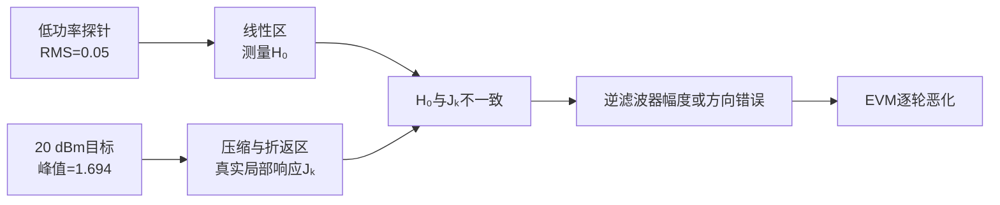

# DPD-ILC 常见问题

本文收集工程使用过程中容易混淆的物理概念、算法边界和诊断方法。文中的功率、幅度和仿真数据采用本工程默认约定。

---

## Q1：低功率小信号逆响应是什么意思？

### 简要回答

低功率小信号逆响应不是把PA输出样值直接取倒数，而是：

> 用幅度很小的测试信号测量PA在接近零输入处的线性传递函数，再对该传递函数求正则化逆，用它预测应该怎样修改PA输入。

这种逆响应只准确描述PA线性区附近的增量关系。如果实际工作信号已经进入深度压缩、AM-AM折返或强AM-PM区域，当前工作点的局部响应可能与小信号响应完全不同，此时固定的小信号逆可能低估更新量，甚至给出错误的更新方向。

### 1. 从线性PA理解逆响应

若PA是线性时不变系统：

```math
y[n]=h[n]*u[n],
```

频域关系为：

```math
Y(f)=H(f)U(f).
```

若希望输出等于目标 $D(f)$，理想输入满足：

```math
U(f)=\frac{D(f)}{H(f)}.
```

因此理想逆响应为：

```math
Q(f)=\frac{1}{H(f)}.
```

直接除法会在 $|H(f)|$ 很小的位置放大噪声和数值误差，所以代码使用带正则化的逆：

```math
Q(f)
=
\frac{H^*(f)}
{|H(f)|^2+\lambda},
```

其中 $\lambda>0$ 是正则化系数。设第 $k$ 轮输出误差为：

```math
E_k(f)=D(f)-Y_k(f).
```

频域ILC更新为：

```math
U_{k+1}(f)
=
U_k(f)+\mu Q(f)E_k(f),
```

其中 $\mu$ 是学习率。在线性模型准确时：

```math
\Delta Y(f)
\approx
H(f)Q(f)E_k(f)
\approx
E_k(f).
```

这意味着输入修正经过PA后，能够在输出端抵消原误差。


**图1说明：**逆响应描述的是“输入变化怎样经过PA转换成输出变化”。它不是输出样值的倒数，而是PA传递关系的逆。

### 2. 什么是小信号响应

以无记忆奇数阶复基带多项式为例：

```math
y
=
a_1x
+a_3x|x|^2
+a_5x|x|^4
+a_7x|x|^6.
```

令测试信号为：

```math
x=\varepsilon s,
\qquad
\varepsilon\ll1.
```

输出变为：

```math
y
=
a_1\varepsilon s
+a_3\varepsilon^3s|s|^2
+a_5\varepsilon^5s|s|^4
+a_7\varepsilon^7s|s|^6.
```

高阶项相对线性项的比例分别满足：

```math
\frac{P_3}{P_1}\propto\varepsilon^2,
\qquad
\frac{P_5}{P_1}\propto\varepsilon^4,
\qquad
\frac{P_7}{P_1}\propto\varepsilon^6.
```

当 $\varepsilon$ 足够小时，高阶非线性项迅速衰减，因此：

```math
y\approx a_1x.
```

若PA带有线性记忆，则：

```math
y[n]
\approx
\sum_m a_{1,m}x[n-m].
```

对应的小信号频率响应为：

```math
H_0(f)
=
\sum_m a_{1,m}
e^{-j2\pi f m/f_s}.
```

下标0表示该响应是在输入接近零的工作点测得。低功率小信号逆响应为：

```math
Q_0(f)
=
\frac{H_0^*(f)}
{|H_0(f)|^2+\lambda}.
```

### 3. 当前频域ILC怎样测量小信号响应

`RunFrequencyDomainIlc` 先根据目标波形产生低幅度探针：

```math
u_{\mathrm{probe}}
=
\frac{A_{\mathrm{probe}}}
{A_{\mathrm{target}}}
u_{\mathrm{target}}.
```

探针RMS使用：

```math
A_{\mathrm{probe}}
=
\min
\left(
0.05,\,
0.25A_{\mathrm{target}}
\right).
```

在 `SmallestSISO.py` 当前20 dBm配置中：

```math
A_{\mathrm{target}}=0.5623,
\qquad
A_{\mathrm{probe}}=0.05.
```

两者相差：

```math
20\log_{10}
\left(
\frac{0.05}{0.5623}
\right)
\approx-21.0\ {\mathrm{dB}}.
```

探针主要测量GMP的一阶线性项和线性记忆：

```math
Y_{\mathrm{probe}}(f)
\approx
H_0(f)U_{\mathrm{probe}}(f).
```

程序据此估计：

```math
\hat H_0(f)
=
\frac{
Y_{\mathrm{probe}}(f)
U_{\mathrm{probe}}^*(f)
}{
|U_{\mathrm{probe}}(f)|^2+\epsilon
}.
```

随后构造固定学习滤波器：

```math
Q_0(f)
=
\mu
\frac{\hat H_0^*(f)}
{|\hat H_0(f)|^2+\lambda}.
```

当前实现只在ILC开始前测量一次 $\hat H_0(f)$，后续所有迭代都复用它。

### 4. 小信号逆与当前工作点局部逆的区别

用实数AM-AM多项式表示PA：

```math
y(A)
=
a_1A+a_3A^3+a_5A^5+a_7A^7.
```

在当前工作点 $A_0$ 附近施加小变化：

```math
A=A_0+\Delta A.
```

定义工作点处的局部斜率：

```math
s(A_0)
=
\frac{dy}{dA}(A_0).
```

输出的一阶变化为：

```math
\Delta y
\approx
s(A_0)\Delta A.
```

将多项式导数代入，得到：

```math
s(A_0)
=
a_1
+3a_3A_0^2
+5a_5A_0^4
+7a_7A_0^6.
```

真正需要的局部逆近似为：

```math
Q_{\mathrm{local}}(A_0)
\approx
\frac{1}{
a_1
+3a_3A_0^2
+5a_5A_0^4
+7a_7A_0^6
}.
```

小信号逆只保留：

```math
Q_0\approx\frac{1}{a_1}.
```

二者只有在 $A_0$ 接近零时才近似相等。

### 5. 三个典型工作区域

在线性区：

```math
\frac{dy}{dA}>0.
```

输入增加，输出也增加，小信号逆通常能够给出正确方向。

在深度压缩区：

```math
0<
\frac{dy}{dA}
\ll a_1.
```

输入增加很多，输出只增加一点。真实局部逆需要更大的修正量，小信号逆会低估更新。

在AM-AM折返区：

```math
\frac{dy}{dA}<0.
```

输入增加，输出反而下降。小信号逆仍然假设输入和输出同方向变化，因此可能给出相反的更新方向。

当：

```math
\frac{dy}{dA}=0
```

时，局部逆理论上趋向无穷：

```math
|Q_{\mathrm{local}}|\rightarrow\infty.
```

这表示PA在该点附近已经失去稳定可逆性。

### 6. 为什么当前20 dBm GMP会出现问题

当前功率回退换算为：

```math
a
=
10^{(20-25)/20}
=
0.5623.
```

Wi-Fi波形具有约9.58 dB PAPR，所以：

```math
u_{\mathrm{RMS}}=0.5623,
\qquad
u_{\mathrm{peak}}=1.6936.
```

当前波形中：

- 约20.9%的样点幅度超过0.7；
- 约13.0%的样点幅度超过0.8；
- 约4.25%的样点幅度超过1.0。

默认GMP的稳态AM-AM结果为：

| 输入幅度 | 输出幅度 | 局部幅度斜率 | 输出相位 |
|---:|---:|---:|---:|
| 0.55 | 0.432 | +0.358 | 4.8度 |
| 0.80 | 0.461 | -0.114 | 12.6度 |
| 1.05 | 0.392 | -0.377 | 28.1度 |
| 1.30 | 0.308 | -0.192 | 58.5度 |
| 1.55 | 0.339 | +0.504 | 100.8度 |

在大约0.8到1.4的范围内，AM-AM局部斜率已经变成负数，而且AM-PM相位快速旋转。当前20 dBm Wi-Fi信号有大量样点进入该区域，所以低功率测得的 $\hat H_0(f)$ 无法描述真实工作点。



**图2说明：**低功率探针和实际目标处在不同的PA工作区。固定小信号逆不是当前高功率工作点的局部逆。

### 7. 复数GMP为什么更加复杂

对于复基带多项式：

```math
y
=
a_1x
+a_3x|x|^2
+a_5x|x|^4
+a_7x|x|^6,
```

工作点 $x_0$ 附近的增量模型为：

```math
\Delta y
\approx
J(x_0)\Delta x
+K(x_0)\Delta x^*.
```

其中：

```math
J(x_0)
=
a_1
+2a_3|x_0|^2
+3a_5|x_0|^4
+4a_7|x_0|^6,
```

```math
K(x_0)
=
a_3x_0^2
+2a_5x_0^2|x_0|^2
+3a_7x_0^2|x_0|^4.
```

因此高功率输出变化不仅依赖 $\Delta x$，还依赖共轭增量 $\Delta x^*$。完整GMP还包含主分支记忆、滞后包络和超前包络，所以局部Jacobian取决于当前整段波形，而不是一个固定的线性频率响应。

当前固定小信号逆只近似：

```math
\Delta y\approx H_0\Delta x.
```

它没有描述：

- 当前幅度相关的 $J(x_0)$；
- 共轭路径 $K(x_0)$；
- GMP包络交叉记忆；
- 不同样点的局部斜率变化；
- 公共增益随输入变化产生的导数。

### 8. 为什么公共复增益补偿不能替代局部逆

设PA输出为：

```math
y=F(u).
```

公共增益补偿后的信号为：

```math
z(u)=\frac{F(u)}{g(u)}.
```

即使当前波形满足 $z(u)\approx u$，局部导数仍为：

```math
\frac{dz}{du}
=
\frac{F'(u)}{g(u)}
-
\frac{F(u)g'(u)}{g^2(u)}.
```

因此：

```math
z(u)\approx u
```

并不代表：

```math
\frac{dz}{du}\approx1.
```

公共复增益补偿解决的是“当前输出和参考的平均幅度、相位是否一致”；逆响应解决的是“输入增加一点以后，输出会向哪个方向变化”。两者是不同的物理问题。

### 9. 当前案例的数值证据

在20 dBm GMP场景中，当前正方向第一步已经使EVM恶化：

| 更新系数 | 第一轮候选EVM |
|---:|---:|
| -0.30 | -11.029 dB |
| -0.15 | -11.052 dB |
| 0 | -10.893 dB |
| +0.15，当前更新方向 | -10.525 dB |
| +0.30 | -9.887 dB |

这说明小信号逆给出的正方向不是当前工作点的下降方向。但不能简单地永久翻转符号，因为PA局部斜率会随着每轮输入变化；固定负方向只在最初少数轮次有效。

功率对照进一步说明了工作区影响：

| 输出配置 | 初始峰值 | 第1轮EVM | 最佳EVM | 最佳轮 |
|---:|---:|---:|---:|---:|
| 10 dBm | 0.536 | -30.824 dB | -38.583 dB | 8 |
| 12 dBm | 0.674 | -26.842 dB | -33.232 dB | 8 |
| 14 dBm | 0.849 | -22.849 dB | -27.009 dB | 8 |
| 15 dBm | 0.952 | -20.854 dB | -23.491 dB | 8 |
| 16 dBm | 1.069 | -18.860 dB | -20.106 dB | 6 |
| 18 dBm | 1.345 | -14.880 dB | -14.975 dB | 2 |
| 20 dBm | 1.694 | -10.893 dB | -10.893 dB | 1 |

低功率时固定小信号逆能够改善EVM；进入18到20 dBm后，PA工作点跨入强非线性和折返区域，最佳轮迅速提前。

### 10. 更合适的局部逆测量

每轮应在当前输入 $u_k$ 附近施加小探测扰动：

```math
u_k^{\mathrm{trial}}
=
u_k+\varepsilon p_k.
```

分别测量：

```math
y_k=F(u_k),
```

```math
y_k^{\mathrm{trial}}
=
F(u_k+\varepsilon p_k).
```

当前方向的局部Jacobian近似为：

```math
J_kp_k
\approx
\frac{
y_k^{\mathrm{trial}}-y_k
}{
\varepsilon
}.
```

再使用当前工作点的正则化局部伪逆：

```math
\Delta u_k
\approx
J_k^\dagger e_k.
```

工程实现还应配合：

1. 回溯线搜索，只接受LC-NMSE或严格EVM代理下降的候选；
2. 信赖域或最大更新RMS限制，避免一步跨过局部可逆区；
3. 连续恶化时提前停止并返回历史最佳轮；
4. 根据PA的P1dB或饱和输入建立独立的输入幅度标定；
5. 调整GMP系数，使目标输入峰值范围内的AM-AM保持单调。

### 11. 一句话总结

低功率小信号逆响应是PA在接近零输入处的切线的正则化倒数；高功率局部逆响应是PA在当前工作点处切线或Jacobian的伪逆。当前20 dBm GMP已经进入AM-AM折返区域，原点附近的切线不能描述当前工作点，所以固定小信号逆会使ILC更新失真并导致EVM变差。

## Q2：DPD 能改善 IRR 吗？

可以，但前提是 DPD 的模型结构能够产生与 IQ 镜像方向相反的共轭分量。

若链路可近似为

```math
y[n]=a\,u[n]+b\,u^*[n],
```

则镜像抑制度为

```math
\mathit{IRR}_{\mathrm{dB}}
=
10\log_{10}
\frac{|a|^2}{|b|^2}
=
20\log_{10}
\frac{|a|}{|b|}.
```

普通复数 GMP 的每个基函数都以 $x[n-m]$ 为载波因子，例如

```math
x[n-m]|x[n-m]|^{p-1}.
```

它能补偿 PA 的 AM-AM、AM-PM 和记忆失真，却不能在一般情况下独立产生 $x^*[n-m]$。因此普通 GMP 可能通过重新调整直接支路使 EVM 略有变化，但通常不能消除由 $b$ 决定的镜像误差底。

`AugmentedDpdGmp` 另外加入共轭 GMP 支路：

```math
u[n]
=
\sum_q c_q\phi_q[n]
+
\sum_q d_q\phi_q^*[n].
```

其中 $c_q$ 是直接支路系数，$d_q$ 是镜像支路系数。只要 IQ 不平衡位于 DPD 可观测、可控制的前向链路内，而且没有进入不可逆压缩或饱和区，联合训练就能令 DPD 预先产生反向镜像，从而提高 IRR。

本工程的隔离仿真使用 8% 共轭泄漏，即 $|b|=0.08$。未补偿和普通 GMP 的 IRR 都约为 21.94 dB；增广 GMP 在无噪声、近线性 PA 的归因场景中达到约 193.5 至 196.8 dB。后一个数值是双精度数值残差，不代表真实仪器能达到该动态范围。真实上限通常由接收机自身 IQ 不平衡、噪声、量化、时变漂移和模型失配决定。

## Q3：增广 GMP 会不会反而使 DPD 性能变差？

会。增广 GMP 不是“始终更好”的开关，它用更多自由度换取对共轭失真的可表示性。

直接基矩阵记为 $\mathbf{\Phi}$，增广矩阵为

```math
\mathbf{\Phi}_{\mathrm{aug}}
=
\begin{bmatrix}
\mathbf{\Phi} & \mathbf{\Phi}^*
\end{bmatrix}.
```

参数数量近似翻倍。下列情况可能使验证集 EVM、ACLR 或定点峰值反而变差：

1. 链路没有显著 IQ 镜像，新增支路只拟合反馈噪声。
2. 训练样本过短，或 $x$ 与 $x^*$ 高度相关，增广矩阵条件数很大。
3. 岭系数过小，镜像系数在不同训练帧之间剧烈变化。
4. 训练功率与部署功率不一致，共轭非线性系数无法外推。
5. 新增支路提高 DPD 峰值，导致 DAC 定点饱和或 PA 输入削顶。
6. IQ 不平衡位于观测接收机内部而不是发射链路内；DPD 补偿它会预先破坏真实空口信号。

推荐启用流程是：

1. 先用 `Analysis(...).Analyze()` 读取 `irrDb`，并检查不同功率、频率和时间上的稳定性。
2. IRR 足够高且 EVM 不受镜像限制时保留普通 `DpdGmp`。
3. IRR 明显受限时，用 `AugmentedDpdGmp` 在同一训练集上联合拟合。
4. 使用独立帧、独立功率点比较 EVM、IRR、ACLR、系数范数和峰值。
5. 只有验证集改善且没有增加削顶时才部署增广模型。

可把 40 dB 以上视为通常不紧迫、30 至 40 dB 视为需要结合 MCS/EVM 预算判断、30 dB 以下视为优先检查 IQ 校准与增广模型的工程起点。这些是调试建议，不是 IEEE 802.11 的统一合格限值。
