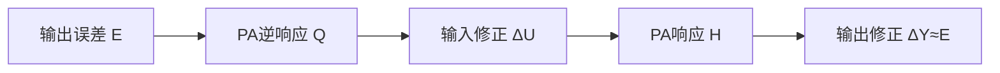
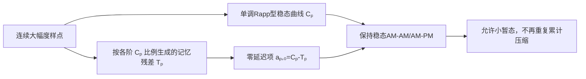
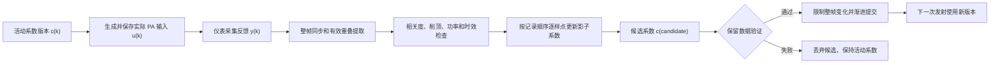

# DPD-ILC 常见问题

本文收集工程使用过程中容易混淆的物理概念、算法边界和诊断方法。文中的功率、幅度和仿真数据采用本工程默认约定。

---

## Q1：低功率小信号逆响应是什么意思？

### 简要回答

低功率小信号逆响应不是把PA输出样值直接取倒数，而是：

> 用幅度很小的测试信号测量PA在接近零输入处的线性传递函数，再对该传递函数求正则化逆，用它预测应该怎样修改PA输入。

这种逆响应只准确描述PA线性区附近的增量关系。如果实际工作信号已经进入深度压缩、AM-AM折返或强AM-PM区域，当前工作点的局部响应可能与小信号响应完全不同，此时固定的小信号逆可能低估更新量，甚至给出错误的更新方向。

### 1. 从线性PA理解逆响应

若PA是线性时不变系统：

```math
y[n]=h[n]*u[n],
```

频域关系为：

```math
Y(f)=H(f)U(f).
```

若希望输出等于目标 $D(f)$，理想输入满足：

```math
U(f)=\frac{D(f)}{H(f)}.
```

因此理想逆响应为：

```math
Q(f)=\frac{1}{H(f)}.
```

直接除法会在 $|H(f)|$ 很小的位置放大噪声和数值误差，所以代码使用带正则化的逆：

```math
Q(f)
=
\frac{H^*(f)}
{|H(f)|^2+\lambda},
```

其中 $\lambda>0$ 是正则化系数。设第 $k$ 轮输出误差为：

```math
E_k(f)=D(f)-Y_k(f).
```

频域ILC更新为：

```math
U_{k+1}(f)
=
U_k(f)+\mu Q(f)E_k(f),
```

其中 $\mu$ 是学习率。在线性模型准确时：

```math
\Delta Y(f)
\approx
H(f)Q(f)E_k(f)
\approx
E_k(f).
```

这意味着输入修正经过PA后，能够在输出端抵消原误差。



**图1说明：**逆响应描述的是“输入变化怎样经过PA转换成输出变化”。它不是输出样值的倒数，而是PA传递关系的逆。

### 2. 什么是小信号响应

以无记忆奇数阶复基带多项式为例：

```math
y
=
a_1x
+a_3x|x|^2
+a_5x|x|^4
+a_7x|x|^6.
```

令测试信号为：

```math
x=\varepsilon s,
\qquad
\varepsilon\ll1.
```

输出变为：

```math
y
=
a_1\varepsilon s
+a_3\varepsilon^3s|s|^2
+a_5\varepsilon^5s|s|^4
+a_7\varepsilon^7s|s|^6.
```

高阶项相对线性项的比例分别满足：

```math
\frac{P_3}{P_1}\propto\varepsilon^2,
\qquad
\frac{P_5}{P_1}\propto\varepsilon^4,
\qquad
\frac{P_7}{P_1}\propto\varepsilon^6.
```

当 $\varepsilon$ 足够小时，高阶非线性项迅速衰减，因此：

```math
y\approx a_1x.
```

若PA带有线性记忆，则：

```math
y[n]
\approx
\sum_m a_{1,m}x[n-m].
```

对应的小信号频率响应为：

```math
H_0(f)
=
\sum_m a_{1,m}
e^{-j2\pi f m/f_s}.
```

下标0表示该响应是在输入接近零的工作点测得。低功率小信号逆响应为：

```math
Q_0(f)
=
\frac{H_0^*(f)}
{|H_0(f)|^2+\lambda}.
```

### 3. 当前频域ILC怎样测量小信号响应

`RunFrequencyDomainIlc` 先根据目标波形产生低幅度探针：

```math
u_{\mathrm{probe}}
=
\frac{A_{\mathrm{probe}}}
{A_{\mathrm{target}}}
u_{\mathrm{target}}.
```

探针RMS使用：

```math
A_{\mathrm{probe}}
=
\min
\left(
0.05,\,
0.25A_{\mathrm{target}}
\right).
```

例如某次迭代参考波形的归一化RMS为0.5623时：

```math
A_{\mathrm{target}}=0.5623,
\qquad
A_{\mathrm{probe}}=0.05.
```

两者相差：

```math
20\log_{10}
\left(
\frac{0.05}{0.5623}
\right)
\approx-21.0\ {\mathrm{dB}}.
```

这里的0.25只是“小信号探针最多取目标RMS四分之一”的保护系数，不是PA非线性系数缩放。当前 `SmallestSISO.py` 直接使用默认GMP系数，不再把三阶、五阶、七阶或交叉记忆系数统一乘以25%。探针主要测量GMP的一阶线性项和线性记忆：

```math
Y_{\mathrm{probe}}(f)
\approx
H_0(f)U_{\mathrm{probe}}(f).
```

程序据此估计：

```math
\hat H_0(f)
=
\frac{
Y_{\mathrm{probe}}(f)
U_{\mathrm{probe}}^*(f)
}{
|U_{\mathrm{probe}}(f)|^2+\epsilon
}.
```

随后构造固定学习滤波器：

```math
Q_0(f)
=
\mu
\frac{\hat H_0^*(f)}
{|\hat H_0(f)|^2+\lambda}.
```

当前实现只在ILC开始前测量一次 $\hat H_0(f)$，后续所有迭代都复用它。

### 4. 小信号逆与当前工作点局部逆的区别

用实数AM-AM多项式表示PA：

```math
y(A)
=
a_1A+a_3A^3+a_5A^5+a_7A^7.
```

在当前工作点 $A_0$ 附近施加小变化：

```math
A=A_0+\Delta A.
```

定义工作点处的局部斜率：

```math
s(A_0)
=
\frac{dy}{dA}(A_0).
```

输出的一阶变化为：

```math
\Delta y
\approx
s(A_0)\Delta A.
```

将多项式导数代入，得到：

```math
s(A_0)
=
a_1
+3a_3A_0^2
+5a_5A_0^4
+7a_7A_0^6.
```

真正需要的局部逆近似为：

```math
Q_{\mathrm{local}}(A_0)
\approx
\frac{1}{
a_1
+3a_3A_0^2
+5a_5A_0^4
+7a_7A_0^6
}.
```

小信号逆只保留：

```math
Q_0\approx\frac{1}{a_1}.
```

二者只有在 $A_0$ 接近零时才近似相等。

### 5. 三个典型工作区域

在线性区：

```math
\frac{dy}{dA}>0.
```

输入增加，输出也增加，小信号逆通常能够给出正确方向。

在深度压缩区：

```math
0<
\frac{dy}{dA}
\ll a_1.
```

输入增加很多，输出只增加一点。真实局部逆需要更大的修正量，小信号逆会低估更新。

在AM-AM折返区：

```math
\frac{dy}{dA}<0.
```

输入增加，输出反而下降。小信号逆仍然假设输入和输出同方向变化，因此可能给出相反的更新方向。

当：

```math
\frac{dy}{dA}=0
```

时，局部逆理论上趋向无穷：

```math
|Q_{\mathrm{local}}|\rightarrow\infty.
```

这表示PA在该点附近已经失去稳定可逆性。

### 6. 为什么旧默认GMP会让连续大幅度平台快速掉下去

先考虑一段由较低幅度突然切换到恒定大幅度的复包络：

```math
x[n]
=
A e^{j\theta}.
```

在理想化的零历史边界上，第一个大幅度样点只有零延迟主项生效：

```math
y_{\mathrm{first}}
=
e^{j\theta}
\sum_p a_{p,0}A^p.
```

经过主记忆和交叉记忆所需的若干样点后，同一阶次的所有恒包络基函数都变成
$A^p e^{j\theta}$，稳态输出为：

```math
y_{\mathrm{settled}}
=
e^{j\theta}
\sum_p C_p A^p,
```

```math
C_p
=
\sum_m a_{p,m}
+
\sum_{m,l}b_{p,m,l}
+
\sum_{m,l}c_{p,m,l}.
```

旧默认生成器把三阶、五阶和七阶静态非线性按约0.34的延迟比例继续复制到
后续主抽头。三阶系数主要指向压缩方向，因此连续大样点到来后，第二、第三个
样点会依次叠加更多负三阶向量。结果不是“PA保持压缩后的高平台”，而是输出
在两三个样点内再次明显下沉。旧配置的恒幅检查曾得到：

| 输入平台幅度 | 首点到稳态的幅度变化 |
|---:|---:|
| 0.80 | -1.37 dB |
| 1.00 | -2.45 dB |
| 1.30 | -3.80 dB |

这不是GMP公式必然产生的现象，也不是 `DelaySignal` 把样点错位；根因是旧演示
系数把静态压缩在多个延迟抽头中重复累计，而且没有约束首点与稳态之间的动态
残差。真实PA可能因偏置网络、陷阱效应或电热记忆产生突发内增益下垂，但如果
没有实测依据，不能默认用数dB、仅持续两三个采样点的下降代表这种物理效应。

当前默认生成器使用三组相关约束修复这个问题。第一，完整默认结构的稳态每阶
系数改为：

| 阶次 | 当前 $C_p$ |
|---:|---:|
| 1 | $1.261692+j0.014052$ |
| 3 | $-0.291144+j0.054204$ |
| 5 | $0.031812-j0.022452$ |
| 7 | $-0.000168+j0.002784$ |

这些系数由 $0\leq A\leq2$ 内的有界Rapp型响应拟合得到。令

```math
P(A)
=
\sum_p C_p A^p.
```

当前默认值在拟合区间内满足：

```math
\frac{d|P(A)|}{dA}
=
\frac{
\Re\left\{P^*(A)P'(A)\right\}
}{
|P(A)|
}
>0.
```

因此AM-AM可以进入深压缩，但在声明的拟合范围内不会折返。第二，非线性主
记忆尾项按各阶 $C_p$ 的6%起始比例衰减，交叉项也不再使用与阶次无关的绝对
系数。对 $p>1$ 且 $C_p\neq0$：

```math
b_{p,m,l}
=
C_p(-0.060+j0.025)(0.22)^m(0.42)^l,
```

```math
c_{p,m,l}
=
C_p(0.040-j0.018)(0.22)^m(0.42)^l.
```

这样五阶、七阶交叉记忆会随本阶稳态贡献一起减小，不会被固定绝对交叉系数在
$A^5$、$A^7$ 基函数上重新放大。随后把所有非零延迟主项和交叉项合成：

```math
T_p
=
\sum_{m=1}^{M-1}a_{p,m}
+
\sum_{m,l}b_{p,m,l}
+
\sum_{m,l}c_{p,m,l},
```

再令：

```math
a_{p,0}
=
C_p-T_p.
```

这样默认记忆深度只改变平台建立过程、频响和动态迟滞，不会把稳态 $C_p$
重复相加，也不会因为增大 `memoryDepth` 或 `crossMemoryDepth` 而移动静态曲线。
默认高阶主支路第一条延迟尾项约为对应 $C_p$ 的6%，而不是旧值的34%。

完整默认 `(1, 3, 5, 7)` 在“8个前置零样点 + 16个恒幅样点”的验证结果为：

| 输入幅度 | 平台纹波 |
|---:|---:|
| 0.25 | 0.3065 dB |
| 0.50 | 0.2997 dB |
| 0.90 | 0.2780 dB |
| 1.20 | 0.2513 dB |
| 1.50 | 0.2148 dB |
| 1.70 | 0.2320 dB |
| 2.00 | 0.2615 dB |

这里的平台纹波定义为：

```math
R_{\mathrm{plateau}}
=
20\log_{10}
\left(
\frac{\max_n |y[n]|}{\min_n |y[n]|}
\right).
```

因此0.25至2.0验证扫描的最大值为0.3065 dB，不超过0.307 dB；首点相对稳态
均值的最大绝对偏差为0.1673 dB。

第三，非默认 `nonlinearOrders` 不能简单从四阶拟合中删列，因为被删除的高阶
项可能正用于阻止低阶多项式折返。若集合包含一阶项，生成器保留 $C_1$，并在
必要时用同一个 $0\leq\gamma\leq1$ 缩小所有非线性稳态系数：

```math
\widetilde C_1=C_1,
\qquad
\widetilde C_p=\gamma C_p,
\quad p>1.
```

$\gamma$ 由0至2幅度网格上的单调性搜索确定，并在触发缩放时保留2%数值余量。
参考表中没有定义的9阶及更高阶默认系数为0。若集合不含一阶项，则只把最低
请求阶次设为1，其余默认系数设为0，提供确定、单调但没有正常小信号增益的
数值后备路径。显式传入的实测系数字典不受这项默认保护影响。



**图2说明：**静态曲线规定平台最终落在哪里；记忆残差只规定怎样到达该平台。
零延迟补偿使两部分可以独立调整。

### 7. 复数GMP为什么更加复杂

对于复基带多项式：

```math
y
=
a_1x
+a_3x|x|^2
+a_5x|x|^4
+a_7x|x|^6,
```

工作点 $x_0$ 附近的增量模型为：

```math
\Delta y
\approx
J(x_0)\Delta x
+K(x_0)\Delta x^*.
```

其中：

```math
J(x_0)
=
a_1
+2a_3|x_0|^2
+3a_5|x_0|^4
+4a_7|x_0|^6,
```

```math
K(x_0)
=
a_3x_0^2
+2a_5x_0^2|x_0|^2
+3a_7x_0^2|x_0|^4.
```

因此高功率输出变化不仅依赖 $\Delta x$，还依赖共轭增量 $\Delta x^*$。完整GMP还包含主分支记忆、滞后包络和超前包络，所以局部Jacobian取决于当前整段波形，而不是一个固定的线性频率响应。

当前固定小信号逆只近似：

```math
\Delta y\approx H_0\Delta x.
```

它没有描述：

- 当前幅度相关的 $J(x_0)$；
- 共轭路径 $K(x_0)$；
- GMP包络交叉记忆；
- 不同样点的局部斜率变化；
- 公共增益随输入变化产生的导数。

### 8. 为什么公共复增益补偿不能替代局部逆

设PA输出为：

```math
y=F(u).
```

公共增益补偿后的信号为：

```math
z(u)=\frac{F(u)}{g(u)}.
```

即使当前波形满足 $z(u)\approx u$，局部导数仍为：

```math
\frac{dz}{du}
=
\frac{F'(u)}{g(u)}
-
\frac{F(u)g'(u)}{g^2(u)}.
```

因此：

```math
z(u)\approx u
```

并不代表：

```math
\frac{dz}{du}\approx1.
```

公共复增益补偿解决的是“当前输出和参考的平均幅度、相位是否一致”；逆响应解决的是“输入增加一点以后，输出会向哪个方向变化”。两者是不同的物理问题。

### 9. 修复后仍看到掉幅时应该检查什么

默认系数消除了旧的重复压缩，但GMP是记忆模型，不能要求每个输出样点都与当前
输入样点严格成比例。建议按下面顺序隔离问题：

| 检查项 | 方法 | 结论 |
|---|---|---|
| 恒幅平台首点与稳态 | 对多个 $A$ 生成足够长的平台，计算 $20\log_{10}(|y_{\mathrm{settled}}|/|y_{\mathrm{first}}|)$ | 快速数dB变化通常表示自定义记忆系数过强；小暂态可以是预期电记忆 |
| 静态单调性 | 使用长恒包络记录的末样点扫描 $0\leq A\leq2$ | 默认曲线应单调；自定义字典必须重新验证 |
| 拟合范围 | 查看最大内部浮点输入幅度，而不是只看公开整数码或目标dBm | $|x|>2$ 是默认多项式外推，不能引用区间内保证 |
| 非默认阶次集合 | 分别检查最终各阶稳态系数，而不是直接套用完整四阶表 | 默认生成器可能共同缩小非线性项；未知高阶为0；无一阶集合只启用最低阶后备项 |
| 自定义字典 | 检查三个系数字典是否有延迟高阶项同相累加 | 自定义字典不会自动获得默认生成器的总和补偿约束 |
| 定点边界 | 比较 `width=0` 与定点模式的内部峰值和削顶计数 | 只有定点版本下降通常是量化或削顶，不是GMP记忆 |
| 温度路径 | 暂时使用 `thermalConfig.enabled=False` 做归因对照 | 慢速跨帧下降属于热状态，不应写进几个采样点的GMP尾项 |

输出功率dBm不能直接代替归一化输入幅度。Channel闭环会调整隐藏模拟驱动，使PA
输出达到目标功率；判断是否超出GMP拟合区间时，应检查实际送入裸PA内核的浮点
包络峰值。`SmallestSISO.py` 当前直接使用默认GMP，不再用统一25%系数缩放掩盖
工作区问题。

### 10. 更合适的局部逆测量

每轮应在当前输入 $u_k$ 附近施加小探测扰动：

```math
u_k^{\mathrm{trial}}
=
u_k+\varepsilon p_k.
```

分别测量：

```math
y_k=F(u_k),
```

```math
y_k^{\mathrm{trial}}
=
F(u_k+\varepsilon p_k).
```

当前方向的局部Jacobian近似为：

```math
J_kp_k
\approx
\frac{
y_k^{\mathrm{trial}}-y_k
}{
\varepsilon
}.
```

再使用当前工作点的正则化局部伪逆：

```math
\Delta u_k
\approx
J_k^\dagger e_k.
```

工程实现还应配合：

1. 回溯线搜索，只接受LC-NMSE或严格EVM代理下降的候选；
2. 信赖域或最大更新RMS限制，避免一步跨过局部可逆区；
3. 连续恶化时提前停止并返回历史最佳轮；
4. 根据PA的P1dB或饱和输入建立独立的输入幅度标定；
5. 调整GMP系数，使目标输入峰值范围内的AM-AM保持单调。

### 11. 一句话总结

低功率小信号逆响应是PA在接近零输入处切线的正则化倒数；高功率局部逆响应是PA在当前工作点处切线或Jacobian的伪逆。当前默认GMP在 $0\leq|x|\leq2$ 内保持AM-AM单调，非线性主记忆与交叉记忆均按各阶稳态系数比例生成，并通过每阶系数总和约束避免连续平台重复累计压缩；非默认阶次还会自适应保持该区间单调。但深压缩区的局部斜率仍可能远小于小信号斜率。因此固定小信号逆仍需配合线搜索、信赖域和历史最佳轮，不能把“无折返”误解成“所有功率下都近似线性或容易求逆”。

## Q2：IRR 是什么，为什么要使用，怎样计算，适用于哪些场景？

### 1. IRR 的定义

IRR 是 Image Rejection Ratio，即镜像抑制度。标准资料通常把它写成“期望功率/镜像功率”的正 dB 数值；本工程为了和 EVM、IM3/IM5/IM7 保持统一的“失真越负越好”方向，保留字段名 `irrDb`，但输出“镜像功率/期望功率”的负 dBc 数值。

理想复基带信号写成

```math
x[n]=I[n]+jQ[n].
```

理想 I/Q 链路只应对 $x[n]$ 产生响应。I、Q 两路存在增益误差或相位偏离 $90$ 度时，输出可写成广义线性模型：

```math
y[n]
=
a x[n]
+
b x^*[n]
+
d
+
w[n].
```

其中：

- $a x[n]$ 是期望的直接分量；
- $b x^*[n]$ 是 I/Q 不平衡产生的共轭镜像分量；
- $d$ 是直流偏置或本振泄漏，不能当作镜像；
- $w[n]$ 是噪声以及未建模误差。

因此本工程返回的有符号镜像相对电平为

```math
\mathit{irrDb}
=
10\log_{10}\frac{|b|^2}{|a|^2}
=
20\log_{10}\frac{|b|}{|a|}.
```

传统正值定义与本工程结果只差一个负号：

```math
\mathit{IRR}_{\mathrm{traditional,dB}}
=
-\mathit{irrDb}.
```

例如 `irrDb=-30 dBc` 表示镜像功率比直接分量低 30 dB；`irrDb=-40 dBc` 表示低 40 dB，所以后者更好。

### 2. 为什么 EVM、ACLR 之外还需要 IRR

EVM 是总误差指标。PA 非线性、记忆效应、IQ 镜像、噪声、削顶、定时误差、载波频偏和采样频偏都可能使 EVM 变差，所以仅看到 EVM 变差时，无法判断是否应启用共轭补偿。

IRR 的价值是把 $x^*[n]$ 这一类具有明确物理来源的误差单独量化：

| 观测结果 | 更可能的判断 | 推荐动作 |
|---|---|---|
| `irrDb` 接近 0，且 EVM dB 接近 `irrDb` | IQ 镜像可能主导 EVM | 检查 I/Q 校准，并比较普通 GMP 与增广 GMP |
| `irrDb` 很负，但 EVM 差 | 误差主要不是线性 IQ 镜像 | 检查 PA 非线性、噪声、同步、削顶和模型阶数 |
| FB 模式 `irrDb` 较高、forward 仪表 `irrDb` 更负 | 反馈接收机自身存在 IQ 不平衡 | 校准或去嵌入 FB 链路，不要让 Tx DPD 补偿它 |
| `irrDb` 随频率上升、变得不够负 | IQ 不平衡具有频率选择性 | 使用带记忆的共轭支路或频率相关 IQ 校准 |
| `irrDb` 随功率或温度上升、趋近 0 | IQ 链路或 PA 与 IQ 失真级联后发生漂移 | 按功率和温度重新测量并分区训练 |

ACLR 观察相邻信道总泄漏，IM3、IM5 和 IM7 观察特定非线性互调阶次，它们也不能唯一指出共轭镜像。因此工程上应联合观察 EVM、IRR、ACLR、输出功率和噪声，而不是用 IRR 代替所有指标。

### 3. 增益误差和相位误差怎样产生镜像

本工程使用 I、Q 两路互为倒数的半增益配置。设 I 相对于 Q 的增益误差为 $g_{\mathrm{dB}}$，Q 轴相对于理想正交位置的相位误差为 $\phi$，则

```math
G_I=10^{g_{\mathrm{dB}}/40},
\qquad
G_Q=10^{-g_{\mathrm{dB}}/40}.
```

把失配后的实数 I/Q 映射重新写成 $x$ 和 $x^*$ 的组合，可得与 `Channel.ResolveIqImbalanceCoefficients` 一致的系数：

```math
a
=
\frac{1}{2}
\left(
G_I+G_Q\cos\phi+jG_Q\sin\phi
\right),
```

```math
b
=
\frac{1}{2}
\left(
G_I-G_Q\cos\phi+jG_Q\sin\phi
\right).
```

理想情况下 $g_{\mathrm{dB}}=0$ 且 $\phi=0$，于是 $a=1$、$b=0$，本工程的理论 `irrDb` 趋于负无穷。误差较小时，使用弧度表示 $\phi$，有

```math
b
\approx
\frac{\ln 10}{40}g_{\mathrm{dB}}
+
j\frac{\phi}{2}.
```

同时 $a\approx1$，所以

```math
\mathit{irrDb}
\approx
20\log_{10}
\sqrt{
\left(
\frac{\ln 10}{40}g_{\mathrm{dB}}
\right)^2
+
\left(
\frac{\phi}{2}
\right)^2
}.
```

这个近似式说明增益误差和相位误差像两个互相正交的误差分量一样合成，不能简单把它们各自对应的 dBc 直接相加。单一误差的典型理论值如下：

| 失配条件 | 理论 `irrDb` |
|---|---:|
| 仅 0.1 dB 增益误差 | 约 -44.8 dBc |
| 仅 0.3 dB 增益误差 | 约 -35.3 dBc |
| 仅 0.5 dB 增益误差 | 约 -30.8 dBc |
| 仅 1.0 dB 增益误差 | 约 -24.8 dBc |
| 仅 1 度相位误差 | 约 -41.2 dBc |
| 仅 2 度相位误差 | 约 -35.2 dBc |
| 仅 3 度相位误差 | 约 -31.6 dBc |
| 仅 5 度相位误差 | 约 -27.2 dBc |

这些数值是当前数学模型的无噪声结果，用来解释参数影响，不是仪表合格限值。

### 4. 已知参考波形时的时域计算方法

这是宽带 Wi-Fi、调制信号和本工程 `Analysis` 使用的推荐方法。计算前应先完成整数时延、分数时延、CFO、SFO 和公共复增益补偿，再从有效信号区间取出参考 $x$ 与测量 $y$。

构造回归矩阵

```math
\mathbf A
=
\begin{bmatrix}
x[0] & x^*[0] \\
x[1] & x^*[1] \\
\cdots & \cdots \\
x[N-1] & x^*[N-1]
\end{bmatrix},
\qquad
\mathbf c
=
\begin{bmatrix}
a \\
b
\end{bmatrix}.
```

正则化最小二乘估计为

```math
\hat{\mathbf c}
=
\left(
\mathbf A^H\mathbf A+\lambda\mathbf I
\right)^{-1}
\mathbf A^H\mathbf y.
```

然后计算

```math
\widehat{\mathit{irrDb}}
=
10\log_{10}
\frac{|\hat b|^2}{|\hat a|^2}.
```

小的 $\lambda$ 只用于避免矩阵接近奇异。参考信号必须具有足够的复数激励：纯实信号满足 $x=x^*$，两列无法区分；单个实数余弦本身同时含正、负频率，也不适合用来辨认哪个分量是镜像。Wi-Fi 复基带波形、复数伪随机信号或单边复指数更合适。

公共复增益补偿不会改变 IRR，因为把 $a$ 和 $b$ 同时除以同一个非零复数后，两者功率比不变。不过同步必须先完成，否则时延或频偏会把镜像结构扩散到其他残差中，使估计失真。

### 5. 单音频谱计算方法

对于单边复指数测试信号

```math
x[n]=A\exp\left(j2\pi f_0n/f_s\right),
```

直接响应出现在 $+f_0$，共轭镜像出现在 $-f_0$。分别积分两个频点或两个窄频带内的功率，可得

```math
\mathit{irrDb}
=
10\log_{10}
\frac{P(-f_0)}{P(+f_0)}.
```

频域法直观，适合频率扫描和仪表测量。使用时应保证：

1. 输入是单边复数音调，而不是本来就含对称频谱的实数余弦；
2. 正、负频率使用相同窗函数和积分带宽；
3. 对底噪作相同处理，镜像接近底噪时只应报告测量下限；
4. 宽带 OFDM 的负频率上原本也承载有效子载波，不能直接把全部负频率功率都当作镜像。

### 6. 怎样避免 PA 非线性使 IRR 测量失真

#### 6.1 为什么一个高功率点不能给出纯 IQ IRR

线性 IQ 不平衡可以写成

```math
y[n]
=
a_1x[n]
+
b_1x^*[n].
```

此时希望测量的是一阶直接系数与一阶镜像系数的比值：

```math
\mathit{irrDb}_{\mathrm{linear}}
=
20\log_{10}
\frac{|b_1|}{|a_1|}.
```

IQ 不平衡位于 PA 之前或反馈接收机自身存在非线性时，实际输出还可能含有高阶直接项和高阶共轭项：

```math
y[n]
=
a_1x[n]
+
b_1x^*[n]
+
a_3x[n]|x[n]|^2
+
b_3x^*[n]|x[n]|^2
+
a_5x[n]|x[n]|^4
+
b_5x^*[n]|x[n]|^4
+
w[n].
```

对幅度为 $A$ 的单边复单音，镜像方向的复幅度近似为

```math
Y_{\mathrm{image}}(A)
=
b_1A
+
b_3A^3
+
b_5A^5
+
\cdots.
```

因此只测一个高功率点时，无法判断镜像是由 $b_1$ 表示的线性 IQ 失衡产生，还是由 $b_3$、$b_5$ 等非线性共轭项产生。此时得到的只能称为该功率、波形和温度条件下的**有效 IRR**，不能直接称为器件的线性 IQ IRR。

#### 6.2 先明确要测哪一种 IRR

工程上应把两个结果分开保存：

| 指标 | 测量条件 | 物理含义 |
|---|---|---|
| 线性 IRR | PA 小信号区，或直接在 PA 前测量 | I/Q 增益和正交相位误差形成的一阶镜像 |
| 工作点有效 IRR | 实际输出功率、PAPR、温度和反馈链路条件 | 线性镜像、PA 共轭非线性、噪声和接收机误差的合成结果 |

在 PA 输出端进行小信号测量只能排除明显的 PA 非线性，结果仍可能包含 PA、滤波器和通道在 $+f_0$ 与 $-f_0$ 处的线性频响不对称。若目标是纯 Tx 调制器 IRR，应优先在 PA 前测量，或者先测量并去嵌这部分线性频响。

官方器件资料通常由 I/Q 增益误差和相位误差计算 IRR，这对应的是线性定义，而不是把所有 PA 失真都折算成 IQ 不平衡。[LTC5585 数据手册的 IRR 定义与测量说明](https://www.analog.com/media/en/technical-documentation/data-sheets/5585fb.pdf)

#### 6.3 使用单边复单音或单边稀疏多音

隔离线性镜像时优先使用

```math
x[n]
=
A\exp\left(
j2\pi f_0n/f_s
\right),
\qquad
f_0\ne0.
```

期望分量位于 $+f_0$，镜像位于 $-f_0$。测试时应满足：

1. 不使用 DC 复常数、纯实余弦或本来就含对称频谱的信号；
2. 使用相干采样，使记录长度内包含整数个音调周期；
3. 令镜像频点避开 LO 泄漏、固定杂散、谐波、互调产物和采样混叠位置；
4. 对 $+f_0$ 和 $-f_0$ 使用相同的窗函数、RBW和积分带宽；
5. 分别发送 $+f_0$ 和 $-f_0$ 复测。真正的 IQ 镜像会随激励翻转，固定杂散通常不会按相同规律翻转。

宽带频率扫描可以使用单边稀疏多音：一侧子载波激活，镜像侧对应子载波关闭。这样镜像落在原本为空的频点上，不会与有效数据重叠。[Rohde & Schwarz 单边活动载波的镜像测试示例](https://scdn.rohde-schwarz.com/ur/pws/dl_downloads/dl_application/application_notes/1gp76/1GP76_1E.pdf)

普通记忆无关 PA 项 $x|x|^{p-1}$ 对理想单个复音主要仍落在原来的复频率，因此单边复单音比双音或宽带调制信号更容易隔离 IQ 镜像。但是，当 IQ 失衡已经同时产生两个边带时，PA 仍可能对两个边带重新混频并改变镜像，所以还必须配合功率扫描。

#### 6.4 用功率扫描辨认非线性阶次

不要只在标称工作功率测一次。建议从明显低于压缩区的位置开始，每次把输入或目标输出功率提高 `2` 至 `3 dB`，同时记录期望功率、镜像功率、IRR、EVM、ACLR、IM3和增益压缩。

如果输入功率增加 `1 dB`，频谱镜像功率的典型斜率为：

| 镜像功率斜率 | 更可能的来源 |
|---:|---|
| 约 `1 dB/dB` | 一阶线性 IQ 镜像 |
| 约 `3 dB/dB` | 三阶非线性镜像开始主导 |
| 约 `5 dB/dB` | 五阶非线性镜像开始主导 |
| 斜率随功率连续变化 | 多个阶次、压缩、记忆或噪声共同影响 |

上述斜率来自 $p$ 阶复幅度与输入幅度的 $p$ 次方关系。对本工程的时域拟合结果，等价判断是：线性区的 `imageAmplitudeRatio` 和 `irrDb` 应形成近似不随功率变化的平台；若它们随功率明显变化，高阶项已经被吸收到等效镜像系数中。

可将下面的条件作为实验室调试起点：

1. 主路径增益相对小信号增益的变化不超过约 `0.1 dB`；
2. 输入再降低 `3 dB` 后，IRR 变化不超过约 `0.5 dB`；
3. 输入和输出均未削顶；
4. 落入镜像积分带宽的 IM3、IM5 或固定杂散至少比待测镜像低约 `10 dB`。

这些数值是为了寻找线性测量平台的工程建议，不是统一标准限值。如果降低功率后 IRR 仍继续变化，应继续降低功率；如果镜像先掉入噪声底，则需要改善测量动态范围，不能继续相信该点的 IRR。

平均输出功率低于 PA 最大输出功率并不自动表示线性。调制信号的峰值功率近似为

```math
P_{\mathrm{peak,dBm}}
\approx
P_{\mathrm{average,dBm}}
+
\mathit{PAPR}_{\mathrm{dB}}.
```

因此平均输出 `20 dBm`、额定输出参考为 `25 dBm` 时，高 PAPR Wi-Fi 峰值仍可能进入压缩区。额定输出参考不是瞬时硬削顶阈值，是否压缩仍应由实测 AM-AM、增益压缩和峰值行为判断。提取基础 IQ IRR 时应改用低功率单音或进一步降低调制信号平均功率；`20 dBm` 工作点则保留为有效 IRR 测量。

#### 6.5 同时控制噪声和仪表镜像地板

功率不能无限降低，因为镜像进入噪声底后，测得的将是接收机噪声而不是真实镜像。建议满足：

1. 待测镜像至少高于同一RBW内的噪声底约 `10 dB`；
2. 信号源和分析仪自身镜像至少比待测件镜像低约 `10 dB`，等价地说仪表链路 `irrDb` 至少比待测件 `irrDb` 更负约 `10 dB`；
3. 使用更长的相干记录、重复平均或更窄RBW提高动态范围；
4. 先做直通或旁路测量，保存信号源加分析仪的系统 IRR 地板；
5. 镜像没有可靠高于底噪时，只报告“`irrDb` 小于某个上界”，例如“`irrDb < -60 dBc`”，不能给出更精确数值。

如果需要扣除噪声，必须在线性功率域计算：

```math
P_{\mathrm{image,corr}}
=
\max\left(
P_{\mathrm{image,meas}}
-
P_{\mathrm{noise}},
0
\right).
```

不能直接用两个 dBm 数值相减得到校正后的镜像功率。Analog Devices 的镜像校准流程同样建议重复读取并平均，而且明确区分有效音调和仅有噪声的情况。[ADI AN-1258 镜像校准流程](https://www.analog.com/en/resources/app-notes/an-1258.html)

#### 6.6 分离 Tx、PA、forward 和 FB 参考面

| 目标 | 推荐连接方式 | 结果含义 |
|---|---|---|
| Tx I/Q 线性 IRR | 在 PA 前测量，或让 PA 工作在小信号区 | 尽量排除 PA 非线性 |
| PA 后有效 IRR | 用已校准的 forward 仪表测 PA 输出 | 包含 Tx IQ、PA 非线性和仪表残差 |
| FB 接收机 IRR | 用镜像 `irrDb` 足够负的干净信号直接注入 FB 输入，绕过 PA | 单独识别反馈接收机镜像 |
| 端到端 IRR | 正常 Tx、PA、耦合器和 FB 全链路工作 | 只能作为系统结果，不能由一次采集唯一分解各模块 |

如果 forward `irrDb` 很负而 FB `irrDb` 更接近 0，问题更可能位于反馈接收机。此时不能让发射 DPD 去抵消 FB 自身镜像，否则可能改善训练观测却破坏真实空口信号。

#### 6.7 当前 `MeasureIrr` 的判断边界

当前 `Analysis.MeasureIrr()` 在同步后拟合

```math
y[n]
\approx
a x[n]
+
b x^*[n].
```

因此它返回的是这一阶广义线性模型下的等效系数。测量时应同时检查：

- `irrDb`：镜像系数相对直接系数的功率，单位 dBc，越负越好；
- `imageAmplitudeRatio`：镜像与直接分量的等效幅度比；
- `residualPowerRatio`：两项模型不能解释的残差功率比例；
- `regressionConditionNumberPerChain`：$x$ 与 $x^*$ 是否能够可靠分离。

`residualPowerRatio` 随功率快速增大，通常说明 PA 非线性、记忆、削顶或同步残差已经使线性 IRR 模型不完整。但是残差较小也不能单独证明没有非线性：对单个恒包络音调，$x^*|x|^2$ 与 $x^*$ 只是相差一个常数，高阶共轭项会被直接吸收到 $b$ 中。必须同时观察 IRR 的低功率平台和功率扫描结果。

若需要从调制波形中严格区分一阶镜像和高阶镜像，可扩展为增广回归矩阵：

```math
\mathbf{\Phi}
=
\begin{bmatrix}
x
&
x^*
&
x|x|^2
&
x^*|x|^2
&
x|x|^4
&
x^*|x|^4
&
\cdots
\end{bmatrix}.
```

用 $a_1$ 和 $b_1$ 计算线性 IRR，把 $b_3$、$b_5$ 等单独报告为非线性镜像。该方法需要具有幅度变化的训练波形或多个功率点联合拟合；单个恒包络单音内各阶基函数共线，不能从一次采集中唯一分离阶次。增广拟合还应使用正则化和独立验证数据，避免把噪声拟合成高阶镜像。

#### 6.8 推荐的最终记录格式

一次完整工程测试至少同时保存：

| 结果 | 推荐名称 | 说明 |
|---|---|---|
| 小信号平台 IRR | `linearIrrDb` | 镜像相对直接分量的 dBc；越负越好 |
| 实际工作点 IRR | `effectiveIrrDb` | 同样使用负 dBc，并明确记录功率、PAPR、频率、温度和参考面 |
| 拟合残差 | `residualPowerRatio` | 判断一阶广义线性模型是否充分 |
| 回归条件数 | `regressionConditionNumberPerChain` | 判断参考波形是否可辨识 |
| 非线性指标 | IM3、IM5、IM7、ACLR、EVM | 判断有效 `irrDb` 上升、变得不够负是否与压缩或互调同步发生 |
| 测量地板 | source、forward 或 FB IRR floor | 给出当前系统可声明的最负 dBc 边界 |

表中的 `linearIrrDb` 和 `effectiveIrrDb` 是推荐的外部记录字段，不是当前 `MeasureIrr()` 返回字典中的键。当前接口仍返回 `irrDb`；调用方应根据该次测量属于小信号平台还是实际工作点，把它保存到相应的外部字段中。

一句话总结：用低功率单边复音测量线性 IRR，用多功率扫描识别镜像斜率，用工作功率测量有效 IRR，并统一用负 dBc 记录；数值越负越好。还需用噪声地板、参考面分离、拟合残差和非线性指标共同判断，不能把一个高功率点的 $a x+b x^*$ 拟合结果直接解释成纯 IQ 幅相失衡。

### 7. 本工程中的计算示例

向 `Analysis` 同时提供接收波形和发送波形时，发送波形直接作为参考，不会重新解析 Wi-Fi seed：

```python
from inc.lib.Analysis import Analysis

resultAnalysis = Analysis(
    receivedSignal,
    transmittedSignal=transmittedSignal,
    sampleRateHz=80.0e6,
    width=0,
)
metrics = resultAnalysis.Analyze()

print(metrics["evmDb"])
print(metrics["irrDb"])
```

若已有显式参考波形和相应的 `WifiWaveform` 描述，可只调用 IRR 接口：

```python
resultAnalysis = Analysis(
    referenceSignal,
    wifiWaveform,
    width=0,
)
irrDb = resultAnalysis.CalculateIrr(measuredSignal)
```

工程测量更推荐读取完整字典：

```python
irrMeasurement = resultAnalysis.MeasureIrr(measuredSignal)
print(irrMeasurement["irrDb"])
print(irrMeasurement["imageAmplitudeRatio"])
print(irrMeasurement["residualPowerRatio"])
print(irrMeasurement["regressionConditionNumberPerChain"])
```

`CalculateIrr` 与 `MeasureIrr` 都会先执行同步；已经调用 `PrepareMeasuredSignal` 得到校正波形时，应改用 `CalculatePreparedIrr` 或 `MeasurePreparedIrr`，避免重复同步。条件数很大说明 $x$ 与 $x^*$ 难以区分，残差较大说明常数直接项/镜像项不能解释主要失真，此时不应只看IRR数值。

仿真时还可以直接读取 `Channel` 使用的理论 Tx 系数：

```python
import numpy as np

from inc.lib.Channel import Channel

channel = Channel(
    parameters={
        "txIqGainImbalanceDb": 0.5,
        "txIqPhaseImbalanceDegrees": 2.0,
    }
)
directCoefficient, imageCoefficient = (
    channel.TransmitterIqCoefficients()
)
theoreticalIrrDb = 10.0 * np.log10(
    abs(imageCoefficient) ** 2
    / abs(directCoefficient) ** 2
)
```

理论系数适合验证仿真配置；从测量波形拟合得到的 `irrDb` 才包含噪声、PA、同步残差、反馈接收机和量化等实际影响。

### 8. IRR 的典型应用场景

| 场景 | IRR 用于回答的问题 | 注意事项 |
|---|---|---|
| Tx 调制器校准 | 发射 I/Q 增益和正交相位是否失配 | Tx IRR 影响真实 PA 激励和空口信号 |
| FB 接收链路校准 | 反馈解调器是否把镜像带入 DPD 训练数据 | FB IRR 差时应先去嵌入，避免 DPD 误补偿 |
| DPD 模型选择 | 是否需要普通 GMP 之外的共轭基函数 | 镜像显著时比较 `DpdGmp` 与 `AugmentedDpdGmp` |
| 频率扫描 | IQ 失配是否随带宽位置变化 | 频率相关失配需要带记忆或分频段补偿 |
| 功率和温度扫描 | 镜像是否随工作点或温漂变化 | 训练集应覆盖实际功率、占空比和温度范围 |
| MIMO 多链路 | 哪一路射频链的镜像最差 | 应先逐链报告，再根据目标决定是否汇总 |
| 生产测试 | 器件差异是否超过校准预算 | 固定参考面、带宽、功率和底噪条件 |
| 直接变频接收机 | 接收端 I/Q 解调的镜像抑制能力是否足够 | 需用已知 RF 单边激励并校准信号源镜像 |

直流偏置或本振泄漏位于零频附近，不属于 $x^*$ 镜像；检查 IRR 时也应单独检查 DC。PA 非线性还可能产生与信号相关的高阶共轭项，此时一个常数 $b$ 给出的 IRR 是整体诊断量，不能完整代替增广 GMP 的模型阶次分析。

### 9. 怎样判断结果

本工程可把以下负 dBc 范围作为调试起点：

- `-40 dBc` 或更负：IQ 镜像通常不是当前最紧迫的问题；
- `-40` 至 `-30 dBc`：结合目标 MCS、EVM 预算和测量底噪判断；
- 高于 `-30 dBc`、即更接近 0：优先检查 IQ 校准、参考面和是否需要增广模型。

这些范围不是 IEEE 802.11 的统一合格线。可测 `irrDb` 下界由信号源、接收机、ADC 位宽、噪声和记录长度共同决定。无噪声双精度仿真可能得到低于 `-100 dBc` 的数值，它只表示镜像已经落到数值残差附近，不表示硬件能达到同样性能。

### 10. 常见计算错误

1. 未同步就拟合 $a$ 和 $b$，把时延、CFO 或 SFO 误认为镜像。
2. 用实数波形建立 $[x,x^*]$ 回归矩阵，导致两列相同、系数不可辨识。
3. 把 OFDM 的全部负频率功率都当作镜像，而忽略负频率本来就有有效子载波。
4. 把 DC 或本振泄漏算入镜像积分带宽。
5. 不区分 Tx 与 FB 参考面，使 DPD 为了改善反馈 IRR 而破坏真实空口信号。
6. 镜像已低于底噪时仍把计算出的极负数值当作真实硬件性能。
7. 只看 IRR，不同时检查 EVM、ACLR、功率、噪声和削顶。

一句话总结：IRR 是专门观察共轭镜像的归因指标；已知参考时应在同步后拟合 $x$ 与 $x^*$ 的响应，单音测试时应比较对称频点功率，并始终明确测量参考面属于 Tx、forward 还是 FB。

## Q3：DPD 能改善 IRR 吗？

可以，但必须先区分Tx发射端I/Q不平衡和FB反馈接收端I/Q不平衡，而且DPD模型必须能产生与镜像方向相反的共轭分量。

### Tx与FB两种I/Q不平衡的处理边界

| 类型 | 工程参数 | 是否改变真实PA激励/空口 | 推荐处理 |
|---|---|---:|---|
| Tx I/Q | `txIqGainImbalanceDb`、`txIqPhaseImbalanceDegrees`、`txDcOffset` | 是 | 可用模拟校准或增广GMP联合补偿 |
| FB I/Q | `fbIqGainImbalanceDb`、`fbIqPhaseImbalanceDegrees`、`fbDcOffset` | 否，只污染fb观测 | 先做接收机校准或去嵌入，不应由发射DPD直接补偿 |

在本工程中，Tx I/Q位于PA之前，对 `sampleMode="forward"` 和 `sampleMode="fb"` 都生效；FB I/Q只在 `sampleMode="fb"` 生效。若板载fb的EVM/IRR改善但forward仪表变差，通常意味着训练器正在补偿FB接收机自身误差。

若链路可近似为

```math
y[n]=a\,u[n]+b\,u^*[n],
```

则本工程返回的镜像相对电平为

```math
\mathit{irrDb}
=
10\log_{10}
\frac{|b|^2}{|a|^2}
=
20\log_{10}
\frac{|b|}{|a|}.
```

普通复数 GMP 的每个基函数都以 $x[n-m]$ 为载波因子，例如

```math
x[n-m]|x[n-m]|^{p-1}.
```

它能补偿 PA 的 AM-AM、AM-PM 和记忆失真，却不能在一般情况下独立产生 $x^*[n-m]$。因此普通 GMP 可能通过重新调整直接支路使 EVM 略有变化，但通常不能消除由 $b$ 决定的镜像误差底。

`AugmentedDpdGmp` 另外加入共轭 GMP 支路：

```math
u[n]
=
\sum_q c_q\phi_q[n]
+
\sum_q d_q\phi_q^*[n].
```

其中 $c_q$ 是直接支路系数，$d_q$ 是镜像支路系数。只要 IQ 不平衡位于 DPD 可观测、可控制的前向链路内，而且没有进入不可逆压缩或饱和区，联合训练就能令 DPD 预先产生反向镜像，从而让 `irrDb` 下降并变得更负。

本工程的隔离仿真使用 8% 共轭泄漏，即 $|b|=0.08$。未补偿和普通 GMP 的 `irrDb` 都约为 `-21.94 dBc`；增广 GMP 在无噪声、近线性 PA 的归因场景中达到约 `-193.5` 至 `-196.8 dBc`。后一个量级是双精度数值残差，不代表真实仪器能达到该动态范围。真实下界通常由接收机自身 IQ 不平衡、噪声、量化、时变漂移和模型失配决定。

## Q4：增广 GMP 会不会反而使 DPD 性能变差？

会。增广 GMP 不是“始终更好”的开关，它用更多自由度换取对共轭失真的可表示性。

直接基矩阵记为 $\mathbf{\Phi}$，增广矩阵为

```math
\mathbf{\Phi}_{\mathrm{aug}}
=
\begin{bmatrix}
\mathbf{\Phi} & \mathbf{\Phi}^*
\end{bmatrix}.
```

参数数量近似翻倍。下列情况可能使验证集 EVM、ACLR 或定点峰值反而变差：

1. 链路没有显著 IQ 镜像，新增支路只拟合反馈噪声。
2. 训练样本过短，或 $x$ 与 $x^*$ 高度相关，增广矩阵条件数很大。
3. 岭系数过小，镜像系数在不同训练帧之间剧烈变化。
4. 训练功率与部署功率不一致，共轭非线性系数无法外推。
5. 新增支路提高 DPD 峰值，导致 DAC 定点饱和或 PA 输入削顶。
6. IQ 不平衡位于观测接收机内部而不是发射链路内；DPD 补偿它会预先破坏真实空口信号。

推荐启用流程是：

1. 先用 `Analysis(...).Analyze()` 读取 `irrDb`，并检查不同功率、频率和时间上的稳定性。
2. `irrDb` 足够负且 EVM 不受镜像限制时保留普通 `DpdGmp`。
3. `irrDb` 过于接近 0、镜像明显受限时，用 `AugmentedDpdGmp` 在同一训练集上联合拟合。
4. 使用独立帧、独立功率点比较 EVM、IRR、ACLR、系数范数和峰值。
5. 只有验证集改善且没有增加削顶时才部署增广模型。

可把 `-40 dBc` 或更负视为通常不紧迫、`-40` 至 `-30 dBc` 视为需要结合 MCS/EVM 预算判断、高于 `-30 dBc`（更接近0）视为优先检查 IQ 校准与增广模型的工程起点。这些是调试建议，不是 IEEE 802.11 的统一合格限值。

## Q5：反馈数据由仪表一次采集一大段，还能实现逐样点 DPD 训练吗？

### 简要回答

可以。需要区分两个概念：

1. **逐样点更新**：反馈整段回传到软件后，严格按时间顺序逐个样点执行一次 LMS/NLMS 更新。当前 `DpdLms` 已支持。
2. **逐样点实时闭环**：每得到一个反馈样点就立即影响同一次正在发送的后续样点。普通仪表整段采集通常不支持，因为软件收到数据时该段波形已经发送完毕。

因此，仪表“一次返回一大段数组”并不会把算法自动变成批量最小二乘。采集粒度、同步粒度、系数更新粒度和部署提交粒度是四个独立概念：

| 环节 | 推荐粒度 | 原因 |
|---|---|---|
| 仪表采集 | 一帧或一段突发 | VSA、示波器通常在触发后整段回传 |
| 时延、CFO、SFO、公共复增益估计 | 整段 | 这些量不能由单个样点可靠估计 |
| LMS/NLMS 影子系数更新 | 逐样点 | 每个对齐样点构造一行 GMP 特征并更新一次 |
| 活动 DPD 系数提交 | 帧末或下一次发射前 | 避免同一 Wi-Fi 帧内的时变系数恶化 EVM/ACLR |

推荐时序为：

```text
发送并保存实际 PA 输入 u[n]
        |
        v
仪表一次采集整段反馈 y_raw[n]
        |
        v
整段估计时延、CFO、SFO、公共复增益
        |
        v
得到时间对齐的 y_aligned[n] 与 u[n]
        |
        v
按 n=0,1,2,... 顺序逐样点更新影子系数
        |
        v
帧末原子提交活动系数
        |
        v
下一段发射使用新系数
```

### 1. 当前工程可直接使用的接口

真实仪表反馈优先使用间接学习入口：

```python
trainingResult = dpdLms.UpdateIndirect(
    paInputSignal=actualPaInput,
    paOutputSignal=instrumentCapture,
    sampleRateHz=80.0e6,
    signalProcessingParameters={
        "enableIntegerDelayCompensation": True,
        "enableFractionalDelayCompensation": True,
        "enableCarrierFrequencyOffsetCompensation": True,
        "enableSamplingFrequencyOffsetCompensation": True,
        "enableComplexGainCompensation": True,
    },
)
```

`UpdateIndirect` 接收完整数组，但内部不是一次求解一组批量系数。它先用整段反馈完成同步，再把同步后的 PA 输出作为后置逆输入、把实际 PA 输入作为目标，按时间顺序逐样点调用 LMS/NLMS 更新。

若已经有严格对齐的外部训练标签，可以使用：

```python
trainingResult = dpdLms.UpdateFromLabels(
    referenceSignal,
    targetSignal,
)
```

这个接口同样只把完整数组用于边界解码、帧尺度统计和更新前后 NMSE；实际系数仍在内部逐样点变化。可通过：

```python
trainingResult.sampleCount
trainingResult.updateCount
```

确认进入训练的样点数和真实执行的更新次数。`updateDecimation=1` 时，除静默样点或零权重样点外，通常每个有效样点都会更新一次。

### 2. 为什么不能在同一段已采集波形中形成真实逐样点闭环

假设仪表在整段波形发送完成后才返回：

```math
\{y[0],y[1],\ldots,y[N-1]\}.
```

软件当然可以依次计算：

```math
\mathbf c[n+1]
=
\mathbf c[n]
+
\mu
\frac{
\boldsymbol{\phi}^{*}[n]e[n]
}{
\delta+\|\boldsymbol{\phi}[n]\|_2^2
}.
```

但这些新系数不能反过来改变已经通过 PA 的同一段输入样点。它们只能用于下一次仪表激励。因此该系统在物理闭环上仍然是“每段一次反馈”，在学习器内部则是“每段包含很多次逐样点更新”。

这不是算法失效，而是反馈时延决定的因果边界。对于 Wi-Fi DPD，默认使用：

```text
coefficientCommitMode="frame"
```

通常更加合理：影子系数在整段回放期间逐点更新，但活动系数只在帧末一次提交，下一帧使用完整一致的新系数。

### 3. 一次采集的数据很长时怎样避免占用过多内存

有三种工程方式：

#### 方式 A：整段同步后逐点回放

适合常见的有限长度仪表记录，也是当前 `UpdateIndirect` 的直接用法。完整数组主要用于同步；LMS 核本身只保留有限的 GMP 因果历史和系数状态，其样点状态内存不随记录长度增长。

#### 方式 B：先整段同步，再分块逐点训练

若同步后的数据太长，可以把已经对齐的数组切成连续块。分块时必须：

1. 保留 `adaptiveCoefficients`，不能每块重新创建 `DpdLms`。
2. 保留 GMP 的因果样点历史，不能在普通块边界调用会清空历史的 `BeginFrame`。
3. 所有块必须保持原始时间顺序，不能并行打乱。
4. `featureScaleMode="frame"` 时先对完整训练区间统计一次冻结尺度；无法预扫时改用 `featureScaleMode="running"`。
5. 只在真实帧边界或完整训练段末执行 `CommitCoefficients()`。
6. 记录块起止样点、丢样、重叠样点和累计更新数，防止边界样点被重复训练或漏训。

简单地对每个块分别调用一次会重置历史的完整帧入口，会让每个块开头的记忆项错误地从零开始。若外层仪表适配器要做长期分块流式回放，应直接围绕 `UpdateSample` 保存连续状态，或增加一个“不清空历史的块提交接口”。

#### 方式 C：仪表分段采集、每段闭环一次

若仪表允许降低单次记录长度，可以发送较短突发、采集、训练、提交，再发送下一段。这能提高工作点漂移的跟踪速度，但每段仍应足够长，以便可靠估计同步量和覆盖信号幅度分布。分段过短会使 CFO/SFO、公共增益和高阶 GMP 特征尺度估计变差。

### 4. 哪些条件必须满足

整段反馈用于逐样点训练时，至少要保证：

1. 保存的是**实际送入 PA 的数字样点**，而不是只保存未经过当前 DPD 的原始参考。
2. 仪表反馈保持时间顺序，采集中间没有未标记的丢样或重复样点。
3. 使用真实 `sampleRateHz`，并补偿仪表触发延迟、分数时延、CFO 和 SFO。
4. 训练前处理仪表 I/Q 标度、公共相位和公共复增益，但不要用逐样点任意归一化破坏 AM-AM/AM-PM 信息。
5. 反馈接收链的频响、IQ 失衡、限幅和非线性已经校准或去嵌入；否则 DPD 会把仪表自身误差学进发射系数。
6. PA 工作点、增益和温度在一次采集期间没有发生无法忽略的突变。
7. 训练后的活动系数用独立仪表采集重新验证 EVM、ACLR、输出功率和峰值，不能只看在线训练误差。

### 5. 仪表反馈延迟为什么可能导致系数飘飞

必须把两类延迟分开：

| 延迟类型 | 例子 | 能否通过信号同步消除 |
|---|---|---|
| 波形内部时延 | 接收波形相对 PA 输入晚 200 个采样点 | 可以；使用整数时延和分数时延估计 |
| 仪表墙钟延迟 | 仪表在发送结束 100 ms 后才返回整帧 | 不可以；只能采用延迟训练和下一帧提交 |

墙钟延迟本身不会必然导致系数飘飞。只要反馈与当时真正送入 PA 的输入一一对应，软件可以在反馈回来后按照原始时间顺序逐点更新。

间接学习的 NLMS 更新为：

```math
\mathbf c[n+1]
=
\mathbf c[n]
+
\frac{
\mu\boldsymbol{\phi}^{*}[n]e[n]
}{
\delta+\|\boldsymbol{\phi}[n]\|_2^2
}.
```

误差为：

```math
e[n]
=
u_k[n]
-
\boldsymbol{\phi}^{T}(\bar y_k[n])\mathbf c[n].
```

其中：

- $u_k[n]$ 是第 $k$ 次发送时真正送入 PA 的数字样点；
- $y_k[n]$ 是这次发送对应的仪表反馈；
- $\bar y_k[n]$ 是完成时延、CFO、SFO 和公共复增益补偿后的反馈。

如果仪表返回的是第 $k$ 次采集，程序却将它与第 $k+1$ 次输入或由最新系数重新生成的波形比较，那么特征和目标不再属于同一个物理实验。此时：

```math
\boldsymbol{\phi}^{*}(\bar y_k[n])e[n]
```

不再可靠地指向代价函数下降方向。错误梯度在很多样点上连续累积后，即使每次更新都受 `maximumSampleUpdateNorm` 限制，整帧总变化仍可能很大，这就是延迟反馈场景中常见的系数飘飞。

因此最重要的规则是：

> 仪表反馈必须与发送时保存的实际 PA 输入绑定。不能等反馈回来以后，用当前最新系数重新生成一份输入作为训练目标。

### 6. 推荐的防飘飞闭环

安全流程不是“反馈一回来就直接覆盖活动系数”，而是：



**图示说明：** 仪表等待期间活动系数不变；逐样点更新发生在对齐记录的离线回放阶段；候选系数只有通过整帧质量和性能检查后才用于下一次发射。一次捕获的反馈、实际 PA 输入、活动系数版本和工作点信息始终作为同一条记录保存。

#### 6.1 捕获记录必须带版本

每次仪表激励至少保存：

```text
captureId
coefficientVersion
actualPaInput
outputPowerDbm
sampleRateHz
timestamp
```

如果能够读取温度、偏置或负载状态，也应一并保存。反馈到达后根据 `captureId` 找到原始 `actualPaInput`，而不是使用当前参考或当前 DPD 输出。

#### 6.2 没有有效反馈时冻结系数

反馈超时、重复、全零、削顶严重、捕获编号不匹配或公共重叠长度不足时，应满足：

```math
\mathbf c_{\mathrm{shadow}}
=
\mathbf c_{\mathrm{active}}.
```

不能把上一帧反馈重复用于下一次更新，也不能把缺失反馈替换为零样点继续运行 LMS。

#### 6.3 更新前执行质量门控

开始逐样点回放前至少检查：

1. 归一化互相关峰值是否超过配置门限；
2. 有效重叠样点数是否足够覆盖 GMP 记忆和输入幅度分布；
3. 整数与分数时延估计是否处于允许范围；
4. CFO、SFO 和公共复增益是否为有限值；
5. 仪表 ADC 或反馈放大器是否发生削顶；
6. 实测输出功率是否仍处于训练工作点；
7. 捕获年龄、温度和偏置变化是否低于允许范围。

波形内部时延可以通过同步修正，但捕获已经过时不能通过数学对齐修复。如果 PA 的变化时间小于仪表闭环等待时间，应丢弃旧捕获、降低自适应带宽，或者改用高速板载反馈链。

#### 6.4 同时限制单样点变化和整帧累计变化

`maximumSampleUpdateNorm`只能限制一次样点更新：

```math
\|\Delta\mathbf c[n]\|_2
\leq
R_{\mathrm{sample}}.
```

还应增加候选系数相对活动系数的整帧信任域：

```math
\|
\mathbf c_{\mathrm{candidate}}
-
\mathbf c_{\mathrm{active}}
\|_2
\leq
R_{\mathrm{frame}}.
```

如果候选变化超出范围，应投影回安全边界：

```math
\mathbf c_{\mathrm{safe}}
=
\mathbf c_{\mathrm{active}}
+
R_{\mathrm{frame}}
\frac{
\Delta\mathbf c
}{
\|\Delta\mathbf c\|_2
}.
```

这样既能阻止一个反馈毛刺造成单次跳变，也能阻止很多方向一致的错误小步进在整帧内累积成大偏移。

#### 6.5 使用独立数据验证并允许回滚

逐样点训练结束后，不应只读取在线误差。在线 NMSE 使用不断变化的影子系数，不能代表最终固定部署模型。

应使用没有参加当前更新的保留区间，分别评估活动系数和候选系数：

```math
J_{\mathrm{candidate}}
<
J_{\mathrm{active}}
-
\Delta J_{\min}.
```

同时要求：

- 候选标签 NMSE 有足够改善；
- 独立采集的 EVM 和 ACLR 没有恶化；
- 输出功率仍满足目标；
- 峰值和系数范数处于安全范围；
- 同步质量和反馈链状态有效。

任何条件失败都应恢复训练前的活动系数。不能仅因为训练循环已经结束就自动接受候选系数。

#### 6.6 通过验证后仍可渐进提交

延迟大或反馈噪声强时，可以将候选变化按比例合入：

```math
\mathbf c_{\mathrm{next}}
=
\mathbf c_{\mathrm{active}}
+
\alpha
\left(
\mathbf c_{\mathrm{candidate}}
-
\mathbf c_{\mathrm{active}}
\right),
```

其中：

```math
0<\alpha\leq1.
```

较小的 $\alpha$ 会降低闭环跟踪速度，但能减小旧反馈、测量噪声和工作点轻微变化对下一次发射的冲击。

### 7. 当前 `DpdLms` 已有保护和实现边界

当前实现已经具备：

- NLMS 特征能量归一化；
- `maximumSampleUpdateNorm` 单样点更新投影；
- `maximumSampleWeight` 异常样点权重上限；
- `leakageFactor` 向恒等 DPD 的缓慢泄漏；
- `featureScaleMode="frame"` 的帧内冻结尺度；
- 活动系数和影子系数分离；
- `coefficientCommitMode="frame"` 的帧末完整向量提交；
- `UpdateIndirect` 在逐样点训练前完成整帧同步。

这些保护能够降低单个异常样点和帧内时变系数的风险，但默认帧模式会在 `UpdateIndirect` 完成后提交候选系数。因此它尚未等价于完整的仪表安全控制器。

真实仪表闭环还应由外层控制流程或后续接口增加：

1. `captureId` 和 `coefficientVersion` 绑定；
2. 手动提交模式；
3. 同步质量、削顶、功率和捕获时效门控；
4. 整帧累计系数信任域；
5. 保留数据候选验证；
6. 失败回滚和渐进提交。

在这些条件具备之前，应保存训练前系数，完成独立验证后再决定保留候选还是调用 `SetCoefficients` 恢复旧值。默认帧提交只能防止同一 Wi-Fi 帧内的系数调制，不能单独证明整帧候选一定安全。

### 8. 不应采用的做法

- 不要因为输入是完整数组，就改用 `DpdGmp.UpdateCoefficients` 并声称仍是逐样点 LMS；后者是批量岭回归。
- 不要把未同步的 `instrumentCapture[n]` 与 `actualPaInput[n]` 按相同数组下标直接配对。
- 不要在每个小块开头清空 GMP 历史或重置系数。
- 不要为了“立即生效”默认使用样点提交模式；Wi-Fi 帧内系数变化可能产生额外调制和频谱再生。
- 不要直接用 PA 输出误差执行普通 LMS，除非实现了 PA 局部 Jacobian 或 Filtered-X 路径。当前 `DpdLms` 的真实反馈方案是间接学习。

### 9. 什么时候才需要真正的流式反馈硬件

如果目标是：

- 在同一长波形内部实时跟踪 PA 温漂；
- 一个反馈样点到达后立即影响后续发射样点；
- 在 80、320 或 640 MS/s 下持续运行且不等待仪表回传；

那么普通整段回传仪表不够，需要板载反馈 ADC、FPGA/DSP 流水线、与反馈时延匹配的 PA 输入 FIFO，以及持续运行的时延/CFO/SFO 跟踪器。这时 `UpdateSample` 可以作为逐样点算法黄金参考，但 Python 仪表闭环不等于实时硬件实现。

### 10. 一句话总结

仪表整段采集与逐样点 DPD 训练并不冲突：先绑定捕获版本和实际 PA 输入，再用整段数据完成可靠同步，在软件中严格按时间顺序逐样点更新影子系数，经过整帧信任域和独立性能验证后才用于下一次发射。没有有效反馈时必须冻结，验证失败时必须回滚。它实现的是逐样点学习，但不是同一段波形内的零延迟逐样点闭环。

## Q6：史密斯圆图怎么看，能观测什么信息，又能据此提出什么改善方案？

### 简要回答

史密斯圆图把复阻抗或复导纳映射到反射系数平面。读图时最重要的三件事是：

1. **离中心多远**：表示反射有多强，也决定回波损耗和驻波比。
2. **位于哪个方向**：表示阻抗偏高、偏低、偏感性还是偏容性。
3. **扫频轨迹如何移动**：反映谐振、带宽、Q 值、电长度、夹具时延和多重反射。

它可以指导匹配网络、去嵌入、稳定化、隔离和负载牵引，但不能单独替代增益、稳定因子、噪声系数、功率、效率、EVM、ACLR 或完整多端口 S 参数测量。


图示是阅读方法示意，不是某个器件的真实测量结果，也不是合格限值。红色曲线仅用于表示一个由容性区域经过匹配点再进入感性区域的示例扫频轨迹。

### 1. 史密斯圆图实际画的是什么

设系统参考阻抗为 $Z_0$，常见矢量网络分析仪端口使用 $50\ \Omega$。被测阻抗为：

```math
Z=R+jX.
```

先归一化：

```math
z
=
\frac{Z}{Z_0}
=
r+jx.
```

然后映射为反射系数：

```math
\Gamma
=
\frac{z-1}{z+1}.
```

反向换算为：

```math
z
=
\frac{1+\Gamma}{1-\Gamma},
```

```math
Z
=
Z_0
\frac{1+\Gamma}{1-\Gamma}.
```

因此，史密斯圆图不是一张经验图，而是复阻抗平面经过分式变换后得到的反射系数平面。若写成：

```math
\Gamma=u+jv,
```

则等电阻圆满足：

```math
\left(
u-\frac{r}{1+r}
\right)^2
+
v^2
=
\left(
\frac{1}{1+r}
\right)^2.
```

等电抗圆满足：

```math
\left(u-1\right)^2
+
\left(
v-\frac{1}{x}
\right)^2
=
\left(
\frac{1}{x}
\right)^2.
```

这些圆弧使读图者可以直接从 $\Gamma$ 找到归一化电阻 $r$ 和电抗 $x$。

### 2. 圆图上的关键位置怎样理解

| 圆图位置 | 反射系数 | 归一化阻抗 | 物理含义 |
|---|---:|---:|---|
| 圆心 | $\Gamma=0$ | $z=1$ | 与参考阻抗完全匹配 |
| 最左端 | $\Gamma=-1$ | $z=0$ | 理想短路 |
| 最右端 | $\Gamma=1$ | $z$ 趋于无穷 | 理想开路 |
| 水平轴上半径方向 | 纯实数 | $x=0$ | 纯电阻负载 |
| 水平轴左半段 | 实数且为负 | $0<r<1$ | 电阻低于参考阻抗 |
| 水平轴右半段 | 实数且为正 | $r>1$ | 电阻高于参考阻抗 |
| 上半圆 | 虚部为正 | $x>0$ | 感性阻抗 |
| 下半圆 | 虚部为负 | $x<0$ | 容性阻抗 |
| 外圆 | $\lvert\Gamma\rvert=1$ | 纯无功、开路或短路边界 | 理想无耗无功负载全反射 |

对于被动一端口，在校准参考面正确时通常满足：

```math
\left|\Gamma\right|
\leq
1.
```

如果明显跑到单位圆外，不应马上增加匹配元件。应先检查：

- 被测件是否为有源器件并呈现负阻；
- 偏置是否导致振荡或潜在不稳定；
- 校准、端口延伸和夹具去嵌入是否正确；
- VNA 接收机是否被大信号压缩；
- 测量参考面和端口方向是否设置错误。

### 3. 距离圆心能够得到哪些数值

圆图上某点到圆心的距离就是：

```math
\rho
=
\left|\Gamma\right|.
```

由此可以得到回波损耗：

```math
R_{\mathrm{L}}
=
-20
\log_{10}
\left|\Gamma\right|,
```

电压驻波比：

```math
\mathrm{VSWR}
=
\frac{1+\left|\Gamma\right|}
       {1-\left|\Gamma\right|},
```

以及只考虑反射、不考虑器件耗散时的失配损耗：

```math
L_{\mathrm{M}}
=
-10
\log_{10}
\left(
1-\left|\Gamma\right|^2
\right).
```

因此：

- 越靠近圆心，反射越小、回波损耗越大、VSWR 越接近 1。
- 越靠近外圆，反射越大、驻波越严重、负载电压电流峰值越容易增加。
- 同一个以圆心为中心的圆是等 $\lvert\Gamma\rvert$ 圆，也就是等 VSWR 圆。

图中的紫色虚线是 `VSWR=2` 的例子，对应：

```math
\left|\Gamma\right|
=
\frac{2-1}{2+1}
=
\frac{1}{3}.
```

### 4. 扫频轨迹应该怎样看

VNA 通常不是只画一个频点，而是把从低频到高频的每个 $S_{11}$ 或 $S_{22}$ 点连成轨迹。必须打开频率标记或颜色渐变，否则只看一条曲线无法判断移动方向。

#### 4.1 穿过水平轴

轨迹穿过水平轴表示该频点的净电抗为零，常见于串联或并联谐振附近。但“穿过水平轴”不等于“已经匹配”：

- 穿过圆心：谐振时同时满足 $R=Z_0$。
- 在圆心左侧穿过：谐振时电阻仍低于 $Z_0$。
- 在圆心右侧穿过：谐振时电阻仍高于 $Z_0$。

#### 4.2 轨迹只在很窄频段接近圆心

这通常意味着匹配网络加载 Q 较高，中心频点很好，但带宽较窄。改善手段包括：

- 降低匹配网络的加载 Q；
- 使用两级或多级匹配；
- 使用分布式渐变阻抗、宽带变压器或传输线网络；
- 减少封装、焊盘和走线引入的寄生谐振；
- 在允许效率损失时使用小阻尼换取带宽。

被动无损网络的可实现匹配带宽受负载性质限制，不能同时要求任意宽带宽、零反射和零损耗。工程上应以实际业务带宽内的最差回波损耗、效率和线性度共同验收。

#### 4.3 轨迹快速绕圆旋转

快速旋转可能来自：

- 电缆或夹具电长度；
- 端口参考面离器件过远；
- 高 Q 谐振；
- 多条反射路径叠加；
- 去嵌入模型错误。

反射相位为 $\phi(f)$ 时，可定义反射群时延：

```math
\tau_{\Gamma}
=
-\frac{1}{2\pi}
\frac{d\phi(f)}{df}.
```

若只增加一段单程时延为 $\tau_{\mathrm{line}}$ 的理想传输线，反射需要往返一次，因此：

```math
\phi_{\mathrm{measured}}(f)
=
\phi_{\mathrm{load}}(f)
-
4\pi
f
\tau_{\mathrm{line}}.
```

此时史密斯轨迹会绕圆旋转，但 $\lvert\Gamma\rvert$ 在理想无损情况下不变。正确改善顺序是先做 VNA 校准、端口延伸或夹具去嵌入，再决定是否修改匹配网络。把纯电缆时延误判为器件失配，会得到错误元件值。

### 5. 根据圆图现象选择改善方案

| 观测现象 | 优先判断 | 推荐改善方案 | 改善后怎样验证 |
|---|---|---|---|
| 整个频带都靠近圆心 | 已有较好宽带匹配 | 不要为单点更居中而提高 Q；优先保留裕量 | 检查带内最差回波损耗、效率、EVM 和温漂 |
| 轨迹在上半圆 | 净感性 | 在目标频点用容性补偿；再处理剩余实部变换 | 目标频带向选定阻抗移动 |
| 轨迹在下半圆 | 净容性 | 在目标频点用感性补偿；再处理剩余实部变换 | 目标频带向选定阻抗移动 |
| 落在水平轴左侧 | 纯电阻但低于 $Z_0$ | 使用 L 型、变压器或传输线阻抗变换 | 实部提高并接近目标 |
| 落在水平轴右侧 | 纯电阻但高于 $Z_0$ | 使用 L 型、变压器或传输线阻抗变换 | 实部降低并接近目标 |
| 单频很好、带边很差 | 高 Q 窄带匹配 | 降 Q、增加匹配级数或使用宽带分布式网络 | 带内轨迹整体收缩，而非只优化中心点 |
| 轨迹快速旋转但半径近似不变 | 线缆/夹具时延 | SOLT/TRL 校准、端口延伸、夹具去嵌入 | 去嵌入后旋转减少且器件轨迹稳定 |
| 曲线出现环、尖点或多个谐振 | 多重反射或寄生模式 | 缩短走线、改善接地、去耦、阻尼并修正封装模型 | 环和尖点减弱，带内群时延更平滑 |
| 被动器件明显超出外圆 | 校准错误或存在有源行为 | 先复核校准和动态范围；有源件再检查稳定性 | 重测后满足物理边界或能解释负阻来源 |
| 偏置/温度变化时轨迹明显漂移 | 器件工作点敏感 | 改善偏置去耦和热设计；必要时使用可调匹配 | 多温度、多功率轨迹和性能均满足裕量 |
| 其他端口接不同负载时本端轨迹变化 | 多端口耦合 | 改善隔离、地回流、屏蔽、正交布局或中和网络 | 同时检查 $S_{11}$、$S_{22}$、$S_{21}$ 和 $S_{12}$ |

串联元件直接改变阻抗：

```math
z_{\mathrm{new}}
=
z
+
jx_{\mathrm{series}}.
```

因此串联电感沿等电阻圆向感性方向移动，串联电容沿等电阻圆向容性方向移动。并联元件应先换到导纳：

```math
y
=
\frac{1}{z}
=
g+jb.
```

对于同一参考阻抗，导纳反射系数与阻抗反射系数相差半圈：

```math
\Gamma_y
=
-\Gamma_z.
```

在导纳圆图上加入并联电纳更直观：

```math
y_{\mathrm{new}}
=
y
+
jb_{\mathrm{shunt}}.
```

实际 L 型匹配通常交替使用一次串联移动和一次并联移动，把当前阻抗送到目标点。元件寄生和传输线效应显著时，必须使用真实器件模型或电磁模型重新验证，不能只按理想圆图读数下单。

### 6. PA 输出端为什么不一定以圆心为目标

对普通接收机、滤波器或 50 $\Omega$ 级联接口，圆心通常是期望目标。但 PA 晶体管内部参考面上的最佳负载一般不等于 50 $\Omega$，而且以下目标对应的最佳负载可能不同：

- 最大输出功率；
- 最大漏极效率或功率附加效率；
- 最佳增益；
- 最佳 EVM、ACLR 或互调；
- 最佳可靠性和电压电流裕量。

因此 PA 设计应把基波和必要谐波的负载牵引等高线叠加到史密斯圆图上，再选择功率、效率、线性度和鲁棒性的折中目标 $Z_{\mathrm{opt}}$。输出匹配网络的任务是把外部 50 $\Omega$ 变换到晶体管参考面所需的 $Z_{\mathrm{opt}}$，不是把晶体管内部负载强行拉到圆心。

还必须区分：

- 小信号 $S_{22}$：使用很小激励测得，适合观察线性化工作点附近的输出匹配。
- 大信号负载牵引：在真实偏置、频率和输出功率下改变负载，适合确定 PA 的实际最佳负载。
- 谐波负载牵引：同时控制二次、三次等谐波阻抗，用于波形塑形、效率和非线性优化。

仅凭小信号 $S_{22}$ 不能证明 PA 在 20 至 25 dBm 输出时仍工作在最佳负载。

### 7. 史密斯圆图与 DPD 应怎样配合

DPD 可以在负载基本固定、PA 稳定工作的条件下补偿 AM/AM、AM/PM 和记忆非线性，但不能把真实端口失配“变成”硬件匹配。严重失配可能：

- 改变 PA 负载线、增益、压缩点和效率；
- 增加晶体管电压或电流峰值；
- 触发保护或稳定性问题；
- 让同一组 DPD 系数随天线姿态、温度和频率失效；
- 通过延迟反射形成长记忆，使短记忆 DPD 无法覆盖。

若反射路径相对主路径的延迟为 $\tau_{\mathrm{reflection}}$，采样率为 $f_{\mathrm{s}}$，DPD 或反馈模型至少需要检查约：

```math
M_{\mathrm{reflection}}
\geq
\left\lceil
\tau_{\mathrm{reflection}}
f_{\mathrm{s}}
\right\rceil
```

个样点的记忆跨度。这里给出的是覆盖延迟的最低工程量级，不代表 GMP 的最佳 `memoryDepth`；非线性交叉记忆、滤波器群时延和同步滤波还会增加所需跨度。

推荐流程为：

1. 在真实参考面、频带、偏置、温度和功率下测量阻抗轨迹。
2. 先修正校准、去嵌入、振荡、严重失配和过强耦合。
3. 对 PA 使用负载牵引选择 $Z_{\mathrm{opt}}$，而不是默认选择圆心。
4. 固定硬件匹配后，在实际负载和输出功率下重新采集 DPD 训练数据。
5. 若负载会随场景变化，使用多负载、多功率训练、系数库或负载状态感知 DPD。
6. 用独立数据共同验收 EVM、ACLR、输出功率、效率、峰值和稳定性，不能只验收 $S_{11}$ 或 $S_{22}$。

如果多通道天线或 PA 之间存在耦合，单独看每个端口的史密斯圆图不够。应在其他端口使用真实终端条件，测量完整 S 参数矩阵或主动反射系数，再把测得的频率选择性耦合转换为本工程 `Channel` 的 FIR 和耦合路径，用 `ChannelAnalyse` 验证通道矩阵，最后决定是否使用耦合感知 DPD-GMP。

### 8. 一个可手算的例子

假设：

```math
Z_0=50\ \Omega,
```

```math
Z=35+j20\ \Omega.
```

归一化阻抗为：

```math
z
=
0.7+j0.4.
```

反射系数约为：

```math
\Gamma
\approx
-0.115+j0.262.
```

因此：

```math
\left|\Gamma\right|
\approx
0.286,
```

```math
\mathrm{VSWR}
\approx
1.80,
```

```math
R_{\mathrm{L}}
\approx
10.9\ \mathrm{dB}.
```

该点位于上半圆，因此负载呈感性；同时实部只有 $35\ \Omega$，低于 $50\ \Omega$。若只在单一频率 $f_0$ 消除电抗，可先加入电抗为 $-20\ \Omega$ 的串联电容：

```math
C
=
\frac{1}
{2\pi f_0\,20}.
```

若：

```math
f_0=3.5\ \mathrm{GHz},
```

则理想值约为：

```math
C
\approx
2.27\ \mathrm{pF}.
```

这一步只消除了 $+j20\ \Omega$，剩余仍是 $35\ \Omega$，所以还需要并联元件、另一只串联元件、变压器或传输线完成实部变换。最后必须把元件寄生、焊盘和走线模型加入仿真，并在真实参考面重新测量整个频带，不能只验证中心频点。

### 9. 一句话总结

史密斯圆图先用“半径”读反射强度，再用“方向”读阻抗性质，最后用“扫频轨迹”读谐振、带宽和电长度；普通接口以圆心为匹配目标，PA 内部端口则应以负载牵引得到的最佳负载为目标。硬件先解决参考面、稳定性、严重失配和耦合，再在真实负载与功率下重新训练 DPD。

## Q7：计算功率谱时，整段FFT与分段加窗FFT有什么区别？

### 简要回答

整段单次FFT优先保留频率分辨率，适合确定性单音、很近的杂散或需要分开相邻谱线的场景；分段、加窗、重叠并平均的Welch方法牺牲一部分频率分辨率，换取更低频谱泄漏和更小的随机估计方差，更适合Wi-Fi、噪声底、ACLR和不同DPD方法的稳定比较。

这不是“哪个FFT更准确”的简单问题，而是三项资源之间的交换：

```text
长记录长度 N
    ├── 全部用于频率分辨率：整段单次FFT
    └── 分给多个统计样本：分段Welch平均

窗函数
    ├── 矩形窗：主瓣窄、旁瓣高
    └── Hann窗：主瓣宽、旁瓣低
```

本工程 `Analysis.AveragePeriodogram` 用于ACLR时选择第二条路线：最多取 `maxSegmentLength` 点、向下取2的整数次幂、使用Hann窗、50%重叠并平均。双音IM3、IM5和IM7则使用已知频率处的精确复数投影，不依赖最近FFT栅格。这两种选择分别服务于“随机宽带功率谱”和“确定性窄带谱线”。

### 1. 整段单次FFT的数学定义

设复基带记录为 $x[n]$，总长度为 $N$，采样率为 $f_s$。整段DFT为

```math
X_N[k]
=
\sum_{n=0}^{N-1}
x[n]
\exp\left(-j2\pi kn/N\right),
\qquad k=0,1,\ldots,N-1.
```

若不显式加窗，相当于乘以长度为 $N$ 的矩形窗。对应的双边周期图功率谱密度估计为

```math
\widehat S_{\mathrm{rect}}[k]
=
\frac{|X_N[k]|^2}{Nf_s}.
```

频率栅格间隔为

```math
\Delta f_{\mathrm{full}}
=
\frac{f_s}{N}.
```

$N$ 越长，频率栅格越密，两个相邻窄带分量越有可能被分开。这是整段FFT最直接的优势。

但是有限记录相当于在时域截断信号。时域相乘对应频域卷积，因此周期图的平均形状不是“真实功率谱本身”，而是与窗函数功率响应卷积：

```math
\mathbb E
\left\{
\widehat S(f)
\right\}
\approx
S_x(f)
*
\frac{|W(f)|^2}
{f_s\sum_n |w[n]|^2}.
```

这里 $W(f)$ 是窗函数 $w[n]$ 的频率响应，星号表示频域卷积。矩形窗的主瓣较窄，但第一旁瓣只比主瓣低约13.3 dB；一个很强且没有正好落在FFT栅格上的载波，可能通过旁瓣把能量泄漏到许多频点，掩盖邻近弱杂散或抬高邻道估计。

### 2. 为什么整段FFT的曲线仍然可能很“毛”

对确定性单音，长FFT可以给出清楚的谱线；但Wi-Fi OFDM、调制信号和噪声通常被看作随机过程。单次周期图的每个频点只有一次随机功率样本。即使 $N$ 很大，其近似相对方差仍可写为

```math
\mathrm{Var}
\left\{
\widehat S_{\mathrm{rect}}(f)
\right\}
\approx
S_x^2(f).
```

因此标准差与谱值本身处于同一数量级。增加 $N$ 会让频率栅格更细，却不会像多次独立平均那样使每个频点的相对随机起伏自动趋近于零。这就是“整段FFT频率分辨率很好，但噪声谱看起来仍很抖”的原因。

这里必须区分：

- **FFT点数增加**：主要增加频率采样密度；
- **有效观测时间增加**：提高分辨相近真实频率的能力；
- **独立或近似独立的功率谱平均次数增加**：降低随机方差；
- **末尾补零**：只在原有频谱之间插值，不增加真实分辨率，也不增加独立统计信息。

### 3. 分段加窗FFT，也就是Welch方法

把总记录分成长度为 $L$ 的片段，相邻片段起点间隔为 $D$。可用片段数为

```math
K
=
1+
\left\lfloor
\frac{N-L}{D}
\right\rfloor.
```

第 $r$ 段加窗后的DFT为

```math
X_r[k]
=
\sum_{n=0}^{L-1}
w[n]
x[n+rD]
\exp\left(-j2\pi kn/L\right).
```

定义窗能量

```math
U
=
\sum_{n=0}^{L-1}|w[n]|^2.
```

Welch功率谱密度估计为

```math
\widehat S_{\mathrm{Welch}}[k]
=
\frac{1}{K}
\sum_{r=0}^{K-1}
\frac{|X_r[k]|^2}{f_s U}.
```

其中除以 $U$ 是功率归一化，避免不同窗函数仅仅因为自身能量不同而改变结果。若最终只计算主信道功率与邻信道功率的比值，所有频点共同的 $1/f_s$ 和频率积分步长会相消；本工程 `AveragePeriodogram` 因此保留相对功率标尺，ACLR比值不受影响。

若各段完全独立，Welch估计的方差近似为

```math
\mathrm{Var}
\left\{
\widehat S_{\mathrm{Welch}}(f)
\right\}
\approx
\frac{S_x^2(f)}{K}.
```

其相对标准差约为

```math
\frac{\sigma_{\widehat S}}{S_x}
\approx
\frac{1}{\sqrt K}.
```

重叠片段并不完全独立，所以实际有效平均次数 $K_{\mathrm{eff}}$ 小于片段数 $K$。可用近似关系表达：

```math
K_{\mathrm{eff}}
\approx
\frac{K}
{1+2\sum_{m=1}^{K-1}
\left(1-m/K\right)\rho_m^2},
```

其中 $\rho_m$ 表示相隔 $m$ 段的加窗数据相关程度。50%重叠配合Hann窗是一种常用折中：它重用矩形截断时权重很低的边缘样点，提高数据利用率，同时不会像过高重叠那样制造大量几乎重复的片段。

### 4. 加窗究竟改善了什么，又牺牲了什么

窗函数通过压低记录两端，使首尾截断不连续减小。代价是主瓣变宽，即强谱线的能量被分布到更宽的频率范围。

| 性质 | 矩形窗 | Hann窗 |
|---|---:|---:|
| 峰值到第一零点的宽度 | 约 $f_s/N$ | 约 $2f_s/L$ |
| 完整主瓣宽度 | 约 $2f_s/N$ | 约 $4f_s/L$ |
| 第一旁瓣 | 约 -13.3 dB | 约 -31.5 dB |
| 最大栅栏损失 | 约 3.92 dB | 约 1.42 dB |
| 等效噪声带宽 | $f_s/N$ | 约 $1.5f_s/L$ |

栅栏损失指单音恰好位于两个FFT栅格中间时，直接读取最高一个频点所得到的幅度损失。等效噪声带宽为

```math
B_{\mathrm{ENBW}}
=
f_s
\frac{\sum_n w^2[n]}
{\left(\sum_n w[n]\right)^2}.
```

因此Hann窗不是无条件“更准”：它用更宽的主瓣换取更低旁瓣和更小栅栏损失。两个距离非常近的等幅音调可能在矩形长FFT中可分辨，却在较短Hann分段中合成一个宽峰；另一方面，一个强载波旁边的弱杂散，可能在矩形窗高旁瓣下被掩盖，却能在Hann窗下显现。

### 5. 频带功率不能只读取一个FFT点

对带宽为 $B$ 的主信道或邻信道，正确方法是对频带内PSD积分：

```math
P_B
=
\int_B S_x(f)\,df
\approx
\sum_{k\in B}
\widehat S[k]\Delta f.
```

ACLR再由两个积分功率形成：

```math
\mathrm{ACLR}_{\mathrm{dB}}
=
10\log_{10}
\frac{P_{\mathrm{main}}}
{P_{\mathrm{adjacent}}}.
```

只比较单个FFT峰值会同时受到窗函数主瓣、音调是否落在栅格上和FFT长度影响，不适合代表宽带Wi-Fi功率。对确定性单音幅度，还要区分两种归一化：PSD或噪声功率使用窗能量 $U$，谱线复幅度则应使用相干增益

```math
G_{\mathrm{coherent}}
=
\frac{1}{L}
\sum_{n=0}^{L-1}w[n].
```

把噪声功率归一化和单音幅度归一化混用，会造成稳定的幅度偏差。

### 6. 一个数值例子

假设采样率为160 MHz，总记录长度为1048576点。整段FFT的栅格间隔为

```math
\Delta f_{\mathrm{full}}
=
\frac{160\times10^6}{1048576}
\approx
152.59\ \mathrm{Hz}.
```

若Welch片段长度取16384点、Hann窗、50%重叠，则

```math
\Delta f_{\mathrm{Welch}}
=
\frac{160\times10^6}{16384}
=
9765.625\ \mathrm{Hz},
```

```math
K
=
1+
\left\lfloor
\frac{1048576-16384}{8192}
\right\rfloor
=
127.
```

整段FFT拥有约64倍更密的频率栅格，适合分开非常接近的谱线。Welch得到127个重叠片段；若先忽略片段相关性，其随机谱标准差约降到单次周期图的

```math
\frac{1}{\sqrt{127}}
\approx
8.9\%.
```

真实标准差会因50%重叠而略高，但仍远小于一次周期图。代价是Hann分段的完整主瓣宽度约为39.1 kHz，不能再声称具有152.59 Hz的真实分辨能力。

### 7. 优缺点对比

| 比较项 | 整段单次FFT | 分段加窗Welch FFT |
|---|---|---|
| 频率栅格 | 最密，$f_s/N$ | 较疏，$f_s/L$ |
| 相近谱线分辨 | 最好，尤其记录长且相干采样时 | 受分段长度和窗主瓣限制 |
| 随机谱方差 | 高，曲线容易抖动 | 通过多段平均显著降低 |
| 截断泄漏 | 无窗时较严重 | Hann窗旁瓣较低 |
| 强载波旁弱杂散 | 可能被矩形窗旁瓣掩盖 | 通常更容易观察，但极近杂散可能落入宽主瓣 |
| 噪声底和ACLR | 单次结果波动较大 | 更稳定，适合方法间比较 |
| 瞬态时间信息 | 整段混合在一起 | 可先看各段再决定是否平均，能发现时变性 |
| 平稳性要求 | 默认整段代表同一过程 | 平均前应确认各段属于同一工作状态 |
| 内存 | 需要保存和变换全部 $N$ 点 | 可按长度 $L$ 流式处理 |
| 计算量 | 约 $N\log_2N$ | 约 $K L\log_2L$；重叠会增加运算 |
| 最适合 | 精确音调、近端杂散、频率与相位估计 | OFDM平均谱、噪声底、ACLR、DPD方法比较 |

### 8. 最小代码对比

以下示例使用同一复基带数组分别计算整段矩形窗周期图和工程内置Welch相对功率谱：

```python
import numpy as np

from inc.lib.Analysis import AveragePeriodogram


sampleCount = samples.size
fullFrequencyHz = np.fft.fftshift(
    np.fft.fftfreq(sampleCount, d=1.0 / sampleRateHz)
)
fullSpectrum = np.fft.fftshift(np.fft.fft(samples))
fullPeriodogram = np.abs(fullSpectrum) ** 2 / sampleCount

welchFrequencyHz, welchPeriodogram = AveragePeriodogram(
    samples,
    sampleRateHz,
    maxSegmentLength=16384,
)
```

这两个数组的FFT长度、频率间隔和窗函数不同，不能逐点相减来判断“误差”。正确比较方式包括：

- 比较同一物理频带积分后的功率或ACLR；
- 比较噪声底均值和重复采集方差；
- 比较两个近邻谱线是否仍能分开；
- 比较强载波旁的泄漏旁瓣；
- 若需要绝对PSD每Hz单位，再对两者使用一致的 $f_s$、窗能量和频率步长归一化。

### 9. 在DPD和PA测试中怎样选择

推荐按测量对象选择，而不是全工程固定一种方法：

1. **Wi-Fi ACLR、噪声底、功率谱包络**：使用Welch。保持所有对比方法的片段长度、窗、重叠率、有效数据字段和采样率完全一致。
2. **双音IM3、IM5、IM7**：已知理论频率时，优先使用本工程 `TwoToneAnalysis` 的精确频率投影；它避免把音调强行归入最近FFT点。
3. **两个非常接近的杂散**：使用更长片段或整段加窗FFT。若只把短FFT补零到很长，图会更平滑，但不会获得新的分辨能力。
4. **测量随机噪声地板**：增加有效平均次数比单纯增加FFT点数更重要；同时记录窗的ENBW，才能把每Hz噪声密度与每个FFT点功率区分开。
5. **突发Wi-Fi或有占空比信号**：先提取同一种有效信号区间，再做Welch。把大量前后补零一起平均会改变占空比功率定义并人为压低谱线。
6. **观察温漂、功率爬升或DPD系数变化**：不要立刻平均全部片段。应先保存逐段功率谱或瀑布图，确认过程近似平稳后再平均。
7. **法规或仪表一致性测量**：还必须匹配规定的RBW、VBW、检测器、窗/滤波器、扫频时间和积分带宽；普通FFT或本工程ACLR不能自动等同于认证仪表结果。

### 10. 一句话总结

整段FFT把整条记录主要用于“看得更细”，Welch把同一记录主要用于“看得更稳”；窗函数再用更宽主瓣换取更低泄漏。确定性窄带谱线优先长记录或精确频率投影，随机宽带功率、噪声底和ACLR优先分段加窗平均，任何比较都必须保持记录区间、窗、分段长度和归一化方式一致。
