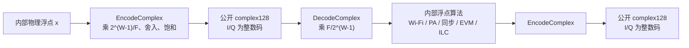
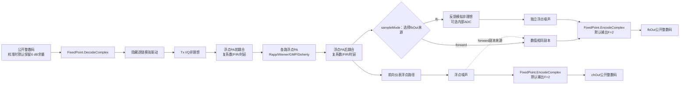
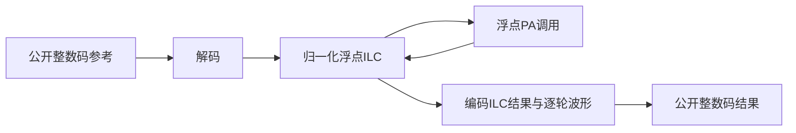

# 定点 I/Q 接口的码值、缩放与模块边界

## 1. 最重要的接口约定

本工程的浮点模式和定点模式都返回 `numpy.complex128`，但二者的数值含义不同。统一转换器的公开构造签名为
`FixedPoint(width: int = 16, fullScaleAmplitude: float = 1.0)`；下文把 `fullScaleAmplitude` 记为 $F$：

| 模式 | `width` | `complex128` 中保存的数值 |
|---|---:|---|
| 浮点 | 0 | 归一化物理复包络，通常在单位幅度附近 |
| 定点 | 大于0 | I、Q 两个分量的有符号整数码；$F$ 决定这些码代表的物理分量幅度 |

`complex128` 只是统一的复数数组容器，并不表示定点模式仍返回归一化小数。例如：

- 14 位定点的 I/Q 码范围是 `-8192` 至 `8191`；
- 16 位定点的 I/Q 码范围是 `-32768` 至 `32767`；
- 14 位正满量程附近应看到 `8191`，而不是 `0.9998779`；
- $F=1$ 时，只有模块内部计算时，`8191` 才会被解码为约 `0.9998779`；
- $F=2$ 时，同一个 `8191` 代表约 `1.9997559`。码范围没有变化，变化的是码与物理幅度之间的标尺。



**图 1 说明**：定点码只存在于模块公开边界。模块内部仍采用浮点计算，但这不改变公开输入输出必须是整数码的约定。发送DAC输入默认使用 $F=1$；`PaModel`、`MimoPaModel` 和 `Channel` 的固定点输出默认使用 $F_{out}=2$，提供6.02 dB分量观测余量。它是 **scaled full-scale** 标尺，不应在 $F$ 任意可配时笼统称为Q1.15或Q2.14。

## 2. 位宽和码值范围

设每个 I 或 Q 分量的总位宽为 $W$，其中一位是符号位。整数码 $q$ 的范围为：

```math
-2^{W-1} \le q \le 2^{W-1}-1
```

定义缩放因子：

```math
S_W=2^{W-1}
```

代码范围只由 $W$ 决定；解码后物理可表示范围还由 $F$ 决定：

```math
-F\leq x\leq F-\Delta,
\qquad
\Delta=\frac{F}{S_W}.
```

常见位宽如下：

| 位宽 | 缩放因子 | 最小码 | 最大码 |
|---:|---:|---:|---:|
| 8 | 128 | -128 | 127 |
| 12 | 2048 | -2048 | 2047 |
| 14 | 8192 | -8192 | 8191 |
| 16 | 32768 | -32768 | 32767 |

正负范围不完全对称，是因为二进制补码包含一个额外的负数码。

## 3. 从物理浮点量编码为整数码

对物理实分量 $x_{\mathrm{I}}$，编码公式为：

```math
q_{\mathrm{I}}=
\min\left(
2^{W-1}-1,
\max\left(
-2^{W-1},
\mathrm{round}\left(\frac{S_W x_{\mathrm{I}}}{F}\right)
\right)
\right)
```

Q 分量独立使用同一公式。复数公开样值为：

```math
q=q_{\mathrm{I}}+j q_{\mathrm{Q}}
```

工程使用 NumPy 的最近整数舍入规则，并在超出范围时饱和。例如14位、默认 $F=1$ 时：

```math
x_{\mathrm{I}}=1
\quad\Longrightarrow\quad
S_W x_{\mathrm{I}}=8192
\quad\Longrightarrow\quad
q_{\mathrm{I}}=8191
```

因此正的 `1.0` 会饱和为 `8191`，负的 `-1.0` 可以精确表示为 `-8192`。

## 4. 从整数码解码到内部浮点量

模块拿到公开码后，先舍入和饱和，再执行：

```math
\hat x_{\mathrm{I}}=F\frac{q_{\mathrm{I}}}{S_W},
\qquad
\hat x_{\mathrm{Q}}=F\frac{q_{\mathrm{Q}}}{S_W}
```

对应的复包络为：

```math
\hat x=\hat x_{\mathrm{I}}+j\hat x_{\mathrm{Q}}
```

14位最大正码在默认 $F=1$ 时的解码结果为：

```math
\frac{8191}{8192}=0.9998779296875
```

这个小于 1 的数只用于模块内部计算，不作为定点模式的公开输出。

## 5. 三个转换函数不能混用

| 函数 | 输入含义 | 输出含义 | 典型位置 |
|---|---|---|---|
| `EncodeComplex` | 当前 $F$ 标尺下的物理浮点量 | 公开整数码 | 模块输出边界 |
| `QuantizeCodes` | 可能含小数或越界的码值 | 舍入并饱和后的整数码 | 模块输入校验 |
| `DecodeComplex` | 公开整数码 | 当前 $F$ 标尺下的物理浮点量 | 模块输入边界 |
| `QuantizeComplex` | 当前 $F$ 标尺下的物理浮点量 | 公开整数码 | `EncodeComplex` 的兼容别名 |

如果调用者对公开定点波形乘一个驱动比例，例如：

```python
driveCodes = 0.5 * waveform.samples
```

数组暂时可能出现半整数码。进入 `PaModel.Process` 或 `Analysis` 时，边界会先用 `QuantizeCodes` 的规则将其舍入成有效码，再解码到内部浮点域。

这种写法只适合调用方主动做数字回退。比例大于1时仍受有符号I/Q码满量程限制，不能用来模拟DAC之后的可变增益放大器。`PowerCalibration` 的内置定点路径不会靠不断放大公开整数码寻找PA功率；它先产生具有数字余量的合法码，再在解码后的浮点域调整隐藏模拟驱动。

## 6. 可运行的 14 位示例

```python
import numpy as np

from inc.utils.FixedPoint import FixedPoint

fixedFormat = FixedPoint(width=14)
physicalSignal = np.array(
    [1.0 + 0.5j, -1.0 - 0.25j],
    dtype=np.complex128,
)

codeSignal = fixedFormat.EncodeComplex(physicalSignal)
decodedSignal = fixedFormat.DecodeComplex(codeSignal)

print(codeSignal)
# [ 8191.+4096.j -8192.-2048.j]

print(codeSignal.dtype)
# complex128

print(decodedSignal)
# [ 0.99987793+0.5j -1.0-0.25j]
```

这个例子同时证明：

1. 定点输出仍用 `complex128`；
2. I/Q 数值是整数码；
3. 正满量程为 `8191`；
4. 解码后的内部浮点量才小于或等于 1。

同一位宽也可以承载更宽的输出观测范围。下面的16位scaled full-scale格式把分量幅度2映射到正满码附近：

```python
from inc.utils.FixedPoint import FixedPoint

inputDacFormat = FixedPoint(width=16, fullScaleAmplitude=1.0)
paOutputFormat = FixedPoint(width=16, fullScaleAmplitude=2.0)

outputCodes = paOutputFormat.EncodeComplex([1.60 + 0.25j])
decodedOutput = paOutputFormat.DecodeComplex(outputCodes)

assert outputCodes.real[0] < 32767
assert abs(decodedOutput[0].real - 1.60) < 2.0 / 32768
```

这里输入DAC标尺仍为1；只扩大PA输出观测标尺。若把同一个1.60分量错误地按 $F=1$ 编码，它会削顶到32767，增加位宽也不会扩大这个物理范围。

## 7. WaveGenWifi、PaModel、Channel 和 Analysis 的边界

### 7.1 WaveGenWifi

`WaveGenWifi` 在内部用浮点完成比特生成、QAM、空间映射、IFFT、循环前缀和整包归一化。`Generate()` 返回之前才调用 `EncodeComplex`。

```python
from inc.lib.WaveGenWifi import WaveGenWifi

waveform = WaveGenWifi(
    parameters={
        "frameFormat": "EHT",
        "bandwidthMhz": 20,
        "sampleRateHz": 80.0e6,
        "numDataSymbols": 2,
        "width": 14,
    }
).Generate()

assert waveform.samples.dtype.name == "complex128"
assert waveform.samples.real.max() <= 8191
assert waveform.samples.real.min() >= -8192
```

### 7.2 PaModel

公开构造签名为
`PaModel(modelName=None, rappConfig=None, wienerConfig=None, gmpConfig=None, piecewiseGmpConfig=None, dohertyConfig=None, thermalConfig=None, parameters=None, width=None, outputFullScaleAmplitude=None, **parameterOverrides)`。输入DAC格式固定使用 `FixedPoint(width, 1.0)`；固定点输出格式使用 `FixedPoint(width, paModel.outputFullScaleAmplitude)`，内置默认值为2.0。

`PaModel.Process` 的流程为：


**图 2 说明**：PA 内部幂次、记忆抽头和包络交叉项不直接对 `8191` 做运算，而是对解码后的约 `0.9999` 做运算；否则高阶项会产生完全错误的数量级。直接使用 `PaModel` 做过一次成功的闭环校准后，`SetCalibrationDriveDb` 会提交模拟驱动，后续公开 `Process` 自动复用该驱动；底层 `ProcessFloating` 仍以调用者提供的实际浮点PA输入为准，不重复施加驱动。

### 7.3 Channel

公开构造签名为
`Channel(paModel=None, parameters=None, width=None, outputFullScaleAmplitude=None, **parameterOverrides)`。`Channel.Process(inputSignal, outputPowerDbm=...)` 在定点公开边界保留整数I/Q码：输入DAC仍用 $F=1$，`chOut` 与 `fbOut` 默认用 `outputFullScaleAmplitude=2.0`。提供目标功率时，Channel先保存并暂停PA热状态。内部 `PowerCalibration` 把原始有效区归一化波形缩放成合法公开码，并用 `calibrationDigitalHeadroomDb=6.0` 默认保留6 dB每分量峰值余量；码值解码以后，闭环才调整隐藏的逐链模拟驱动，然后执行Tx I/Q、PA前耦合和参考温度各路PA。PA输出经过scaled full-scale公开边界量化再解码，功率检测器只统计有效突发，因此输入和输出量化误差都进入闭环，但驱动增加不再要求生成越界整数码。该功率检测器观察的是接收分叉前的干净物理PA输出，不是raw `fbOut` 定点码的表观功率。

成功后，Channel提交模拟驱动，恢复原热状态，并用同一公开码和已提交驱动通过真实温度PA/热周期一次；PA后耦合节点随后生成 `chOut`。`sampleMode="forward"` 把同一浮点结果复制为第二项，`"fb"` 才执行完整反馈链；两项再分别编码成相同公开定点格式并以二元组返回，因此forward模式的两个公开数组仍逐样点相同。校准试探不发热，两项都对应同一次温漂。目标为 `None` 时，`Channel.Process` 解码公开输入，应用最近一次已经提交的模拟驱动，再执行单次耦合PA并返回两项；从未校准时该驱动为0 dB。`Channel.ProcessPaOutput` 是按 `sampleMode` 选一路的兼容入口，用于已有逐PA输出。



**图 3 说明**：6 dB数字余量属于公开码的构造条件，不是PA输出回退，也不是额外衰减PA输出。公开码解码后，隐藏模拟驱动位于Tx I/Q和PA之前；耦合复增益、FIR和分数时延滤波也都在内部浮点域计算，两项各自在公开出口量化一次。forward模式复制同一个含噪浮点结果，确定性公开编码后仍严格相同；fb模式才从无前向噪声的PA后节点进入反馈链，并生成自己的接收噪声。因此启用校准或耦合不会改变调用方看到的数据类型。例如16位接口中的10 mV噪声不是码值10。模块先用 `maximumOutputPowerDbm` 和 `loadResistanceOhm` 求出归一化RMS，再乘以32768并舍入成最终公开噪声码。浮点和定点模式因此代表相同物理耦合与噪声。

完成校准后，三个发送参考面有明确区别：

- `GetLastPaInput()` 返回隐藏模拟驱动之前的公开数字波形；定点模式下I/Q仍是合法整数码。
- `GetLastTransmitterOutput()` 返回经过隐藏模拟驱动和Tx I/Q之后、PA前耦合之前的内部浮点波形。
- `GetLastActualPaInput()` 返回进一步经过PA前耦合后真正进入各路PA的内部浮点波形。

即使 `GetLastPaInput()` 的定点码在多次闭环试探中保持不变，后两个参考面仍可随 `analogDriveDbPerChain` 改变。三者不能作为同一个DPD训练标签互换。

`width` 与 `fbAdcWidth` 是两个不同边界：

- `width` 定义Channel函数公开输入和输出的I/Q整数码；默认16，设为0时公开接口旁路量化。
- `fbAdcWidth` 只在 `sampleMode="fb"` 的 `fbOut` 内模拟板载反馈ADC；默认 `None`，表示不增加该内部量化。forward模式完全绕过它，兼容单输出接口也只有fb模式时返回这一路。
- 当 `sampleMode="fb"` 且两个位宽同时启用时，`fbOut` 先在反馈链内部按 `fbAdcWidth` 量化并解码回浮点，随后在函数出口再按公开 `width` 编码；`chOut` 只经过公开 `width`。这样可以独立研究反馈ADC精度和软件接口位宽。

### 7.4 Analysis

`Analysis` 的公开构造签名为
`Analysis(referenceSignal=None, waveform=None, parameters=None, parseParameters=None, transmittedSignal=None, signalProcessingParameters=None, sampleRateHz=None, channelBandwidthHz=None, width=None, outputFullScaleAmplitude=None, **parameterOverrides)`。它接收公开整数码后先解码，再执行：

- 整数和分数时延估计；
- CFO、SFO 与复增益补偿；
- OFDM 解调；
- SNR、EVM 和 ACLR 计算。

显式参考、发送辅助和盲解析三条路径都只解码一次。`ParseWifi` 的公开结果仍是输入DAC整数码，交给 `Analysis` 后再统一解码。为兼容外部仪表和旧数组，Analysis默认 `outputFullScaleAmplitude=1.0`，无法仅从裸整数数组推断plant标尺；分析固定点PA输出时必须显式传入：

```python
fixedPa = PaModel(modelName="gmp", width=16)
paOutput = fixedPa.Process(fixedInputCodes)
metrics = Analysis(
    fixedReferenceCodes,
    wifiWaveform,
    width=16,
    outputFullScaleAmplitude=fixedPa.outputFullScaleAmplitude,
).Analyze(paOutput)
```

## 8. ILC 为什么也要隐藏码值

ILC 的 `maxAmplitude=2.0`、误差 $e[n]$ 和学习率都定义在归一化物理域。如果直接把 `32767` 当成物理幅度，峰值限制会把整包错误地裁剪到 2，PA 高阶项也会失真。

工程使用内部 PA 适配器：



**图 3 说明**：MSE、NMSE和学习更新都在物理归一化域对 `fbOut` 计算；Channel需要板载反馈训练时必须显式配置 `sampleMode="fb"`，否则第二项只是前向副本。`ILCResult.learnedInput`、保存 `chOut` 的 `outputSignal`、保存训练观测的 `feedbackOutputSignal` 以及逐轮两项波形在返回调用方时分别重新编码为整数码。最终Analysis只解码和分析 `chOut`。

## 9. 量化误差与饱和

忽略饱和时，一个分量的物理量化步长为：

```math
\Delta=\frac{F}{2^{W-1}}
```

在误差近似均匀且与信号不相关时，每个实分量的量化噪声方差近似为：

```math
\sigma_q^2\approx\frac{\Delta^2}{12}
```

复 I/Q 样值包含两个分量，因此复误差功率近似为：

```math
P_q\approx\frac{\Delta^2}{6}
```

饱和误差不同于小量化噪声。当内部物理分量超过范围时：

```math
x_{\mathrm{I}}>F-\Delta
\quad\Longrightarrow\quad
q_{\mathrm{I}}=2^{W-1}-1
```

OFDM 具有较高 PAPR，即使整包 RMS 已归一化，瞬时 I 或 Q 仍可能超过当前 $F$。增加位宽会减小 $\Delta$，但不会扩大由 $F$ 定义的物理范围；需要更大观测动态范围时，应显式增大输出 `fullScaleAmplitude`，而不能只增加总位宽。扩大 $F$ 会按同比例增大量化步长，因此仍应选择能覆盖峰值的最小合理值。

## 10. dBm 与整数码的关系

定点码不是伏特，也不是dBm。`maximumOutputPowerDbm` 定义每路PA输出参考面的额定功率上限，同时规定**解码后归一化输出有效区RMS等于1**时的dBm映射。它不表示16位码 `32767` 本身等于25 dBm，也不表示校准器会在PA输出端追加增益。默认输出 $F=2$ 时，满码附近代表分量幅度2，而功率标定的单位RMS锚点仍是1；两者必须分开。

设额定上限为 $P_{\max}$，目标输出功率为 $P_{\mathrm{target}}$，则功率检测器期望的归一化**输出**RMS为：

```math
A_{\mathrm{target}}
=
10^{(P_{\mathrm{target}}-P_{\max})/20}.
```

当 $P_{\max}=25\ \mathrm{dBm}$、$P_{\mathrm{target}}=20\ \mathrm{dBm}$ 时：

```math
A_{\mathrm{target}}
=
10^{-5/20}
\approx
0.5623.
```

这个0.5623是目标PA输出RMS，不是应直接乘到PA输入的驱动比例。PA的线性增益、AM-AM压缩、AM-PM和记忆项都会改变输入输出映射；闭环必须实际运行PA，再根据测得输出反求驱动。

50 Ω 端口的复包络 RMS 电压与 dBm 的关系为：

```math
P_{\mathrm{W}}=10^{(P_{\mathrm{dBm}}-30)/10}
```

```math
V_{\mathrm{RMS}}=\sqrt{P_{\mathrm{W}}R}
```

### 10.1 定点数字余量和隐藏模拟驱动

设单位有效区RMS波形为 $\bar{x}_m[n]$，位宽为 $W$，正最大归一化分量为：

```math
C_{\max}
=
1-2^{1-W}.
```

`calibrationDigitalHeadroomDb` 记为 $H_{\mathrm{dig}}$，其幅度比例为：

```math
h
=
10^{-H_{\mathrm{dig}}/20}.
```

默认 $H_{\mathrm{dig}}=6\ \mathrm{dB}$，所以 $h\approx0.5012$。代码先求每路I/Q分量峰值：

```math
C_m
=
\max_n
\left(
\max
\left(
\left|\mathrm{Re}\left(\bar{x}_m[n]\right)\right|,
\left|\mathrm{Im}\left(\bar{x}_m[n]\right)\right|
\right)
\right).
```

数字缩放和公开码为：

```math
s_m
=
\frac{C_{\max}h}{C_m},
\qquad
q_m[n]
=
Q_W\left(s_m\bar{x}_m[n]\right).
```

$Q_W$ 表示编码、舍入和饱和。随后公开码只解码一次：

```math
z_m[n]
=
D_W\left(q_m[n]\right),
```

其中 $D_W$ 表示 `DecodeComplex`。校准器根据量化后的有效区RMS $A_{z,m}$，把第 $k$ 次总候选驱动 $d_m^{(k)}$ 分配为解码后的模拟驱动：

```math
g_m^{(k)}
=
d_m^{(k)}
-20\log_{10}\left(A_{z,m}\right),
```

```math
u_m^{(k)}[n]
=
10^{g_m^{(k)}/20}z_m[n].
```

$u_m^{(k)}[n]$ 才是隐藏模拟驱动之后、Tx I/Q之前的信号。它随后进入Tx I/Q、PA前耦合和PA。公开码 $q_m[n]$ 始终合法，而闭环仍能提高实际PA激励。因此，增加 `width` 只会改善量化分辨率，不会扩展归一化码范围；设置25 dBm额定上限时，20 dBm不应再仅因为固定点码已经达到满量程而不可达。

数字余量是峰值余量，不是输出功率回退。余量过小会让高PAPR的OFDM峰值接近削顶；余量过大会减少有效码利用率、提高量化噪声。默认6 dB是两者之间的通用起点。低位宽还必须保证缩放后的峰值至少能量化成一个非零码；闭环校验会根据位宽报告允许的准确上限。浮点模式没有整数码边界，因而忽略 `calibrationDigitalHeadroomDb`。

### 10.2 推荐校准顺序

推荐顺序为：

1. 根据 $P_{\max}$ 和 $P_{\mathrm{target}}$ 计算目标PA输出RMS，而不是假定PA输入驱动。
2. 根据有效突发和 `calibrationDigitalHeadroomDb` 生成合法公开整数码。
3. 解码公开码，并在解码后施加隐藏的逐链模拟驱动。
4. 依次运行Tx I/Q、PA前耦合和真实非线性PA，测量PA自身的有效突发输出功率。
5. 根据功率误差更新模拟驱动；MIMO PA前耦合场景使用Jacobian联合更新。
6. 收敛后提交模拟驱动，后续正常 `Process` 自动复用；PA输出不做后级常数缩放。
7. Analysis直接分析实际返回波形，使用plant的输出 $F$ 解码，并使用相同的 $P_{\max}$ 映射报告dBm。`PowerCalibration` 会自动读取绑定plant的输出标尺；独立Analysis必须由调用方显式传入。

闭环异常会报告目标功率、最佳实测输出、最佳误差、迭代次数和失败原因。只要至少有一次有效测量，`GetLastCalibrationMetrics()` 还会返回 `converged=False`、`failureReason`，以及可用时的 `analogDriveDbPerChain`。内置 `PaModel`、`MimoPaModel` 和 `Channel` 提供解码后模拟驱动接口；只实现传统 `Process` 的第三方定点plant仍走兼容的全数字路径，如果公开码连续停在同一个满量程值，错误信息会明确指出缺少模拟驱动接口。

物理电压标定后的数组不再是定点I/Q码，不能重新送入配置了正 `width` 的 `Analysis`。EVM和ACLR使用真实PA公开输出码；功率报告把同一波形解码后的有效区RMS映射为dBm，不生成一个经过PA后缩放的替代波形。

## 11. 浮点与定点最小 SISO 示例

运行：

```powershell
python SmallestSISO.py
```

脚本分别执行：

- `width=0`：公开数值和内部数值均为浮点物理量；
- `width=16`：公开数值为 `-32768` 至 `32767` 的整数码；输入按 $F=1$ 解码，PA/Channel输出默认按 $F=2$ 解码。

输出目录为：

- `results/smallest_siso/floating`
- `results/smallest_siso/fixed_16`

脚本会显示波形峰值、I/Q最小和最大码、基线 EVM、ILC 最佳 EVM 和逐轮 MSE。定点模式下 `waveformMinimumI/MaximumI/MinimumQ/MaximumQ` 应落在16位码范围内；复数幅度 `waveformPeakAmplitude` 可以大于 `32767`，因为它等于 $\sqrt{I^2+Q^2}$。这些都是公开码值，不应再解释为小于 1 的归一化幅度。

## 12. 使用检查表

1. 同一条信号链的 `WaveGenWifi`、`PaModel`、`Channel`、`ParseWifi` 和 `Analysis` 必须使用相同 `width`；输入DAC保持 $F=1$，PA/Channel输出与Analysis之间还必须使用相同的 `outputFullScaleAmplitude`。
2. `width=0` 表示浮点模式；正值表示公开整数码模式。
3. 不要通过 `dtype` 判断模式，应读取 `width` 或 `GetFormatInfo()`。
4. 定点公开数据的实部和虚部都应等于各自的最近整数。
5. 14 位最大正码是 `8191`，16 位最大正码是 `32767`。
6. 只有内部算法或显式调用匹配 $F$ 的 `DecodeComplex` 后，码值才恢复成正确物理幅度。
7. 物理电压标定数据不能伪装成定点码重新送入定点接口。
8. `maximumOutputPowerDbm` 是PA输出参考面的额定上限，不是公开整数码的功率标签。
9. 定点闭环默认保留6 dB数字峰值余量，并在解码后调整隐藏模拟驱动；不要通过制造越界码代替该驱动级。
10. `GetLastPaInput()` 是模拟驱动前的公开数字参考，真正的PA激励应查看 `GetLastActualPaInput()`。
11. 内置PA、MIMO PA和Channel固定输出默认 `outputFullScaleAmplitude=2.0`；Analysis和TwoToneAnalysis为兼容旧数据默认1.0，分析plant输出时应显式传入plant标尺。
12. 约25 dBm的高PAPR输出若分量峰值仍接近2，可按需把输出标尺设为4；这增加观测余量，也会把量化步长扩大一倍。
