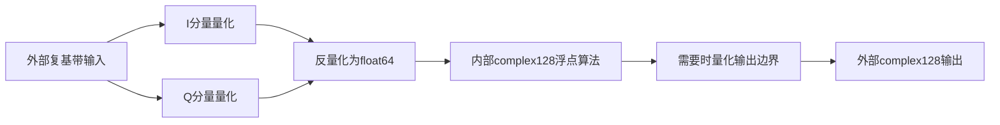
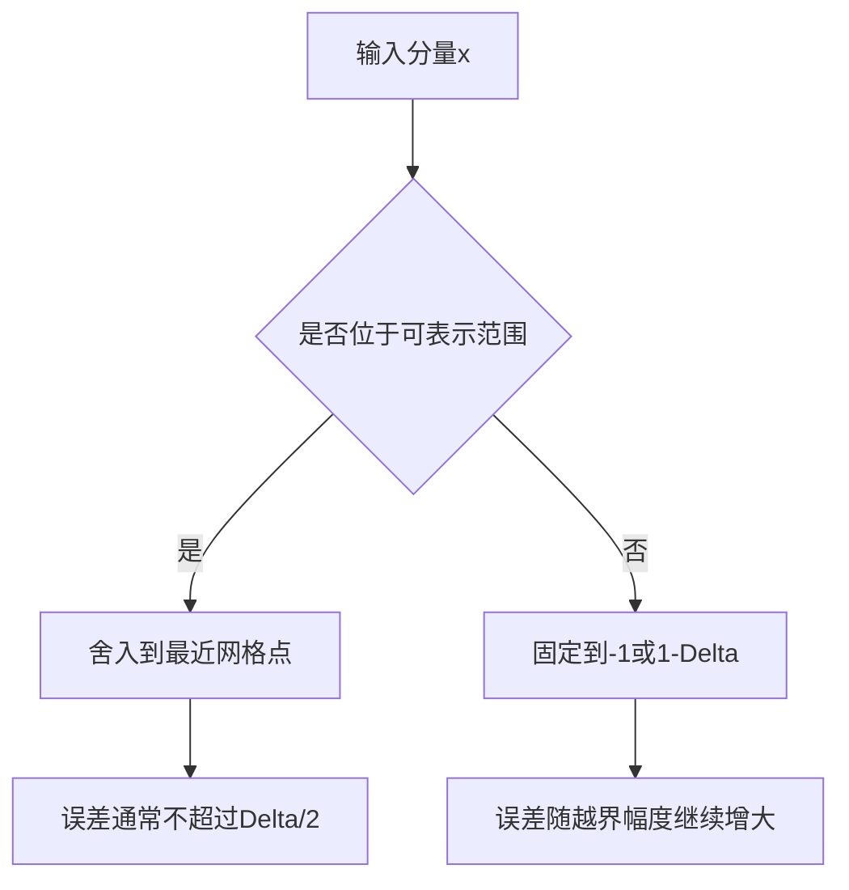
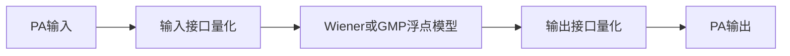

# 定点接口物理原理、数学推导与使用方法

本文说明 `inc/utils/FixedPoint.py` 以及 `WaveGenWifi`、`PaModel`、`Analysis` 的统一位宽接口。这里模拟的是模块边界上的有限精度，不是把FFT、PA模型或同步算法本身改写成整数运算。

## 1. 为什么只量化模块边界

真实数字发射机和接收机通常在DAC、ADC、FPGA或ASIC接口处使用有限位宽。有限位宽会引入量化误差和饱和，但算法验证阶段仍希望：

- 浮点和定点模式使用相同的 Python 调用方式；
- 两种模式返回相同的数组形状和 `numpy.complex128` 类型；
- 可以单独观察接口位宽造成的EVM变化；
- 不把FFT、非线性PA和同步算法的定点实现误差混在一起。

因此工程采用以下边界模型：



**图1说明**：I和Q分别通过同一个实数量化器。反量化只改变数值所在的网格，不把数组变成整数类型；内部算法始终收到 `complex128`。

## 2. `width` 的定义

设总位宽为 $W$。

- $W=0$：浮点旁路，不做舍入和饱和；
- $W>0$：每个I或Q分量使用一个符号位和 $F=W-1$ 个小数位；
- 默认 $W=16$，即每个分量采用Q1.15；
- 当前实现允许 $0\leq W\leq53$，因为更高位宽已不能由 `float64` 精确表达每一个整数码。

小数位数与量化尺度为：

```math
F=W-1
```

```math
S=2^F
```

量化步长为：

```math
\Delta=\frac{1}{S}=2^{-F}
```

有符号整数码范围是：

```math
-S\leq k\leq S-1
```

所以反量化后的分量范围是：

```math
-1\leq x_q\leq 1-\Delta
```

当 $W=16$ 时：

```math
\Delta=2^{-15}=0.000030517578125
```

最大正数是 $0.999969482421875$，最小负数是 $-1$。

## 3. 舍入、饱和与反量化

对一个实数输入 $x$，先缩放并取最接近整数：

```math
k_r={\rm round}(Sx)
```

然后把整数码限制在合法范围：

```math
k_q=\min\left(S-1,\max\left(-S,k_r\right)\right)
```

最后反量化：

```math
x_q=\frac{k_q}{S}
```

NumPy的 `rint` 在恰好位于两个整数中间时采用偶数舍入。例如缩放值为 $2.5$ 时取 $2$，缩放值为 $3.5$ 时取 $4$。这种规则可以避免大量半步样值始终向同一方向偏移。

对于复样值：

```math
z=I+jQ
```

量化结果为：

```math
z_q=Q_W(I)+jQ_W(Q)
```

其中 $Q_W$ 表示上述实数量化器。I和Q独立饱和，因此复数幅度的最大值不是1，而是接近 $\sqrt{2}$；限制的是每个笛卡尔分量。

## 4. 量化噪声为什么影响EVM

没有饱和且输入跨越多个量化码时，常用均匀量化误差近似：

```math
e_q=x_q-x
```

```math
E[e_q]\mathrel{\approx}0
```

```math
E[e_q^2]\mathrel{\approx}\frac{\Delta^2}{12}
```

I和Q各自含有量化误差，所以复误差功率近似为：

```math
E[|e_{q,c}|^2]\mathrel{\approx}\frac{\Delta^2}{6}
```

若参考复信号功率为 $P_x$，只考虑一次理想量化边界，则归一化误差近似为：

```math
{\rm NMSE}_q\mathrel{\approx}\frac{\Delta^2}{6P_x}
```

对应EVM近似为：

```math
{\rm EVM}_{rms}\mathrel{\approx}\frac{\Delta}{\sqrt{6P_x}}
```

```math
{\rm EVM}_{dB}\mathrel{\approx}20\log_{10}({\rm EVM}_{rms})
```

这是无饱和、误差近似白噪声时的估计。OFDM高峰超过范围后会发生削顶，误差不再均匀，也不再与信号独立；此时EVM和ACLR可能显著恶化。

## 5. 量化和饱和是两种不同误差



**图2说明**：增加位宽只会减小舍入步长；如果信号尺度没有先归一化，正负饱和界限仍接近 $\pm1$，仅增加位宽不能解决削顶。

对OFDM波形尤其要关注峰均比。即使整包RMS等于1，瞬时I或Q分量仍可能超过1。因此默认16位模式既模拟细小量化噪声，也会如实模拟Q1.15接口范围不足造成的饱和。

## 6. 三个主要类的边界位置

### 6.1 `WaveGenWifi`

`WaveGenWifi` 先用浮点完成比特生成、QAM、空间映射、IFFT、循环前缀和整包RMS归一化，最后只对 `WifiWaveform.samples` 量化。

`referenceDataSymbols` 等理想接收元数据保持浮点，因为它们代表理想星座，而不是发送采样接口。

### 6.2 `PaModel`

`PaModel.Process` 的顺序为：



**图3说明**：输入量化误差会经过PA非线性，输出端再叠加一次有限精度。`MimoPaModel` 对整个输入矩阵采用相同位宽，每一路内部PA仍独立进行浮点运算。

### 6.3 `Analysis`

`Analysis` 对参考和测量波形采用相同位宽，然后使用浮点完成：

- 公共区间搜索；
- 整数与分数时延补偿；
- CFO、SFO和公共复增益补偿；
- OFDM解调；
- SNR、EVM和ACLR计算。

盲分析模式会把同一位宽传给 `ParseWifi`，保证Parser重建的 `WaveGenWifi` 参考和接收输入位于同一个量化网格。

## 7. 为什么对外数据类型保持一致

定点模式返回整数数组会迫使调用方区分缩放、符号扩展和复数I/Q布局，也会破坏现有PA与分析接口。工程改为返回反量化后的 `complex128`：

```math
z_{\rm public}=\frac{k_I}{S}+j\frac{k_Q}{S}
```

调用方仍可直接使用NumPy、绘图、PA和Analysis函数。要检查一个数组是否位于 $W$ 位网格，只需验证：

```math
S\mathop{\rm Re}(z)\in\mathbb Z
```

```math
S\mathop{\rm Im}(z)\in\mathbb Z
```

## 8. 典型调用

### 8.1 浮点模式

```python
from inc.lib.Analysis import Analysis
from inc.lib.PaModel import PaModel
from inc.lib.WaveGenWifi import WaveGenWifi

wifiGenerator = WaveGenWifi(parameters={"width": 0})
wifiWaveform = wifiGenerator.Generate()
paModel = PaModel(
    parameters={"modelName": "gmp", "width": 0}
)
paOutput = paModel.Process(0.5 * wifiWaveform.samples)
metrics = Analysis(
    0.5 * wifiWaveform.samples,
    wifiWaveform,
    parameters={"width": 0},
).Analyze(paOutput)
print(metrics)
```

### 8.2 默认16位定点模式

```python
from inc.lib.Analysis import Analysis
from inc.lib.PaModel import PaModel
from inc.lib.WaveGenWifi import WaveGenWifi

wifiGenerator = WaveGenWifi(parameters={"width": 16})
wifiWaveform = wifiGenerator.Generate()
paModel = PaModel(
    parameters={"modelName": "gmp", "width": 16}
)
paOutput = paModel.Process(0.5 * wifiWaveform.samples)
metrics = Analysis(
    0.5 * wifiWaveform.samples,
    wifiWaveform,
    parameters={"width": 16},
).Analyze(paOutput)
print(metrics)
```

所有主类都优先推荐把 `width` 写入 `parameters`。省略该键时与配置 `"width": 16` 等效；直接 `width=` 参数只作为兼容便捷入口保留。

### 8.3 直接使用量化工具

```python
import numpy as np

from inc.utils.FixedPoint import FixedPoint

fixedFormat = FixedPoint(width=16)
quantizedSignal = fixedFormat.QuantizeComplex(
    np.array([0.1 + 0.2j, 1.2 - 1.4j])
)
print(fixedFormat.GetFormatInfo())
print(quantizedSignal.dtype)
```

## 9. 最小SISO浮点与定点对比

工程根目录的 `SmallestSISO.py` 使用相同帧、相同GMP PA、相同20 dBm目标工作点和相同ILC参数运行两次：

```powershell
python SmallestSISO.py
```

第一次使用 `width=0`，第二次使用 `width=16`。结果分别写入：

- `results/smallest_siso/floating`
- `results/smallest_siso/fixed_16`

每个目录包含逐轮收敛CSV和PNG。程序最后输出：

```text
Fixed 16-bit minus floating selected EVM: ... dB
```

该差值同时包含接口量化、可能的饱和以及这些误差经过PA和ILC反馈后的影响。

固定16位结果有时反而显示更好的EVM。这不表示有限精度优于浮点精度：Q1.15在波形发生器出口削掉OFDM高峰，可能像一个粗糙的峰值抑制器一样降低PAPR，使后面的PA进入较浅非线性区。脚本同时输出 `waveformPeakAmplitude` 和 `waveformPaprDb`，应结合这两个字段判断EVM改善是否来自削峰。要公平研究纯量化噪声，应先给浮点和定点路径设置相同的峰值归一化或CFR，再比较EVM。

## 10. dBm与归一化定点值不能直接混用

Q1.15的数值是归一化接口量，不自动表示伏特。20 dBm在50欧姆端口对应：

```math
P=0.1\ {\rm W}
```

```math
V_{rms}=\sqrt{PR}=\sqrt{0.1\times50}\mathrel{\approx}2.236\ {\rm V}
```

若直接把以伏特表示、峰值大于1的波形送入Q1.15量化器，必然发生饱和。推荐流程是：

1. 用 `PowerCalibration.OutputPowerToDriveScale` 把目标dBm转换为归一化PA驱动；
2. 在归一化域完成WaveGenWifi、PA、ILC和Analysis；
3. 仅在最终功率报告时用 `ScaleSignalToOutputPower` 转换到物理RMS电压。

## 11. 使用边界

1. 本实现是定点接口仿真，不是逐运算定点FFT或定点GMP实现。
2. `width` 是每个I或Q分量的位宽，不是一个复样值合计的位宽。
3. 位宽增加不会扩大Q1范围，只会减小量化步长。
4. 默认16位可能削顶单位RMS OFDM高峰；这是当前归一化格式的预期行为。
5. 浮点和定点返回值都是 `complex128`，不能通过 `dtype` 判断模式，应读取实例的 `width` 或 `GetFormatInfo()`。
