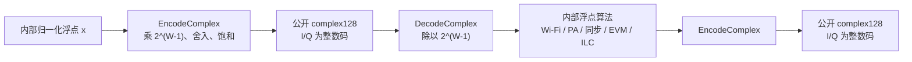
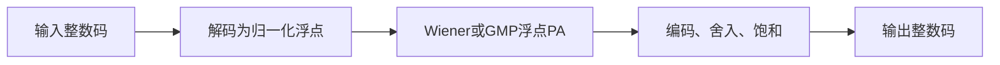
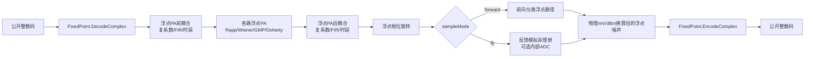
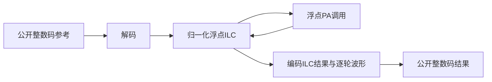

# 定点 I/Q 接口的码值、缩放与模块边界

## 1. 最重要的接口约定

本工程的浮点模式和定点模式都返回 `numpy.complex128`，但二者的数值含义不同：

| 模式 | `width` | `complex128` 中保存的数值 |
|---|---:|---|
| 浮点 | 0 | 归一化物理复包络，通常在单位幅度附近 |
| 定点 | 大于0 | I、Q 两个分量的有符号整数码 |

`complex128` 只是统一的复数数组容器，并不表示定点模式仍返回归一化小数。例如：

- 14 位定点的 I/Q 码范围是 `-8192` 至 `8191`；
- 16 位定点的 I/Q 码范围是 `-32768` 至 `32767`；
- 14 位正满量程附近应看到 `8191`，而不是 `0.9998779`；
- 只有模块内部计算时，`8191` 才会被解码为约 `0.9998779`。



**图 1 说明**：定点码只存在于模块公开边界。模块内部仍采用浮点计算，但这不改变公开输入输出必须是整数码的约定。

## 2. 位宽和码值范围

设每个 I 或 Q 分量的总位宽为 $W$，其中一位是符号位。整数码 $q$ 的范围为：

```math
-2^{W-1} \le q \le 2^{W-1}-1
```

定义缩放因子：

```math
S_W=2^{W-1}
```

常见位宽如下：

| 位宽 | 缩放因子 | 最小码 | 最大码 |
|---:|---:|---:|---:|
| 8 | 128 | -128 | 127 |
| 12 | 2048 | -2048 | 2047 |
| 14 | 8192 | -8192 | 8191 |
| 16 | 32768 | -32768 | 32767 |

正负范围不完全对称，是因为二进制补码包含一个额外的负数码。

## 3. 从物理浮点量编码为整数码

对归一化实分量 $x_{\mathrm{I}}$，编码公式为：

```math
q_{\mathrm{I}}=
\min\left(
2^{W-1}-1,
\max\left(
-2^{W-1},
\mathrm{round}\left(S_W x_{\mathrm{I}}\right)
\right)
\right)
```

Q 分量独立使用同一公式。复数公开样值为：

```math
q=q_{\mathrm{I}}+j q_{\mathrm{Q}}
```

工程使用 NumPy 的最近整数舍入规则，并在超出范围时饱和。例如 14 位模式下：

```math
x_{\mathrm{I}}=1
\quad\Longrightarrow\quad
S_W x_{\mathrm{I}}=8192
\quad\Longrightarrow\quad
q_{\mathrm{I}}=8191
```

因此正的 `1.0` 会饱和为 `8191`，负的 `-1.0` 可以精确表示为 `-8192`。

## 4. 从整数码解码到内部浮点量

模块拿到公开码后，先舍入和饱和，再执行：

```math
\hat x_{\mathrm{I}}=\frac{q_{\mathrm{I}}}{S_W},
\qquad
\hat x_{\mathrm{Q}}=\frac{q_{\mathrm{Q}}}{S_W}
```

对应的复包络为：

```math
\hat x=\hat x_{\mathrm{I}}+j\hat x_{\mathrm{Q}}
```

14 位最大正码解码结果为：

```math
\frac{8191}{8192}=0.9998779296875
```

这个小于 1 的数只用于模块内部计算，不作为定点模式的公开输出。

## 5. 三个转换函数不能混用

| 函数 | 输入含义 | 输出含义 | 典型位置 |
|---|---|---|---|
| `EncodeComplex` | 归一化物理浮点量 | 公开整数码 | 模块输出边界 |
| `QuantizeCodes` | 可能含小数或越界的码值 | 舍入并饱和后的整数码 | 模块输入校验 |
| `DecodeComplex` | 公开整数码 | 归一化物理浮点量 | 模块输入边界 |
| `QuantizeComplex` | 归一化物理浮点量 | 公开整数码 | `EncodeComplex` 的兼容别名 |

如果调用者对公开定点波形乘一个驱动比例，例如：

```python
driveCodes = 0.5 * waveform.samples
```

数组暂时可能出现半整数码。进入 `PaModel.Process` 或 `Analysis` 时，边界会先用 `QuantizeCodes` 的规则将其舍入成有效码，再解码到内部浮点域。

## 6. 可运行的 14 位示例

```python
import numpy as np

from inc.utils.FixedPoint import FixedPoint

fixedFormat = FixedPoint(width=14)
physicalSignal = np.array(
    [1.0 + 0.5j, -1.0 - 0.25j],
    dtype=np.complex128,
)

codeSignal = fixedFormat.EncodeComplex(physicalSignal)
decodedSignal = fixedFormat.DecodeComplex(codeSignal)

print(codeSignal)
# [ 8191.+4096.j -8192.-2048.j]

print(codeSignal.dtype)
# complex128

print(decodedSignal)
# [ 0.99987793+0.5j -1.0-0.25j]
```

这个例子同时证明：

1. 定点输出仍用 `complex128`；
2. I/Q 数值是整数码；
3. 正满量程为 `8191`；
4. 解码后的内部浮点量才小于或等于 1。

## 7. WaveGenWifi、PaModel、Channel 和 Analysis 的边界

### 7.1 WaveGenWifi

`WaveGenWifi` 在内部用浮点完成比特生成、QAM、空间映射、IFFT、循环前缀和整包归一化。`Generate()` 返回之前才调用 `EncodeComplex`。

```python
from inc.lib.WaveGenWifi import WaveGenWifi

waveform = WaveGenWifi(
    parameters={
        "frameFormat": "EHT",
        "bandwidthMhz": 20,
        "sampleRateHz": 80.0e6,
        "numDataSymbols": 2,
        "width": 14,
    }
).Generate()

assert waveform.samples.dtype.name == "complex128"
assert waveform.samples.real.max() <= 8191
assert waveform.samples.real.min() >= -8192
```

### 7.2 PaModel

`PaModel.Process` 的流程为：



**图 2 说明**：PA 内部幂次、记忆抽头和包络交叉项不直接对 `8191` 做运算，而是对解码后的约 `0.9999` 做运算；否则高阶项会产生完全错误的数量级。

### 7.3 Channel

`Channel.Process(inputSignal, outputPowerDbm=...)` 在定点公开边界保留整数I/Q码。提供目标功率时，Channel先保存并暂停PA热状态，内部 `PowerCalibration` 每轮以同一公开位宽产生PA输入码，随后在浮点域执行PA前耦合和参考温度各路PA，并测量解码后的有效突发功率；收敛后恢复原热状态，把收敛输入码重新解码并通过真实温度PA、PA后耦合与 `sampleMode` 采样路径一次，再编码返回。这样校准量化误差被正确计入，校准试探不发热，正式返回波形仍包含温漂。目标为 `None` 时，`Channel.Process` 只解码一次并执行单次耦合PA与采样链路。`Channel.ProcessPaOutput` 用于已有逐PA输出，同样只解码和编码一次，并从PA后耦合开始处理。



**图 3 说明**：耦合复增益、FIR和分数时延滤波都在解码后的内部浮点域计算，最后只在公开出口量化一次，因此启用耦合不会改变调用方看到的数据类型。例如16位接口中的10 mV噪声不是码值10。模块先用 `maximumOutputPowerDbm` 和 `loadResistanceOhm` 求出归一化RMS，再乘以32768并舍入成最终公开噪声码。浮点和定点模式因此代表相同物理耦合与噪声。

`width` 与 `fbAdcWidth` 是两个不同边界：

- `width` 定义Channel函数公开输入和输出的I/Q整数码；默认16，设为0时公开接口旁路量化。
- `fbAdcWidth` 只在 `sampleMode="fb"` 时模拟板载反馈ADC；默认 `None`，表示不增加该内部量化。
- 当两者同时启用时，信号先在反馈链内部按 `fbAdcWidth` 量化并解码回浮点，随后在函数出口再按公开 `width` 编码。这样可以独立研究反馈ADC精度和软件接口位宽。

### 7.4 Analysis

`Analysis` 接收公开整数码后先解码，再执行：

- 整数和分数时延估计；
- CFO、SFO 与复增益补偿；
- OFDM 解调；
- SNR、EVM 和 ACLR 计算。

显式参考、发送辅助和盲解析三条路径都只解码一次。`ParseWifi` 的公开结果仍是整数码，交给 `Analysis` 后再统一解码。

## 8. ILC 为什么也要隐藏码值

ILC 的 `maxAmplitude=2.0`、误差 $e[n]$ 和学习率都定义在归一化物理域。如果直接把 `32767` 当成物理幅度，峰值限制会把整包错误地裁剪到 2，PA 高阶项也会失真。

工程使用内部 PA 适配器：



**图 3 说明**：MSE、NMSE 和学习更新都在物理归一化域计算；`ILCResult.learnedInput`、`ILCResult.outputSignal` 以及逐轮输入输出在返回调用方时重新编码为整数码。

## 9. 量化误差与饱和

忽略饱和时，一个分量的物理量化步长为：

```math
\Delta=\frac{1}{2^{W-1}}
```

在误差近似均匀且与信号不相关时，每个实分量的量化噪声方差近似为：

```math
\sigma_q^2\approx\frac{\Delta^2}{12}
```

复 I/Q 样值包含两个分量，因此复误差功率近似为：

```math
P_q\approx\frac{\Delta^2}{6}
```

饱和误差不同于小量化噪声。当内部物理分量超过范围时：

```math
x_{\mathrm{I}}>1-\Delta
\quad\Longrightarrow\quad
q_{\mathrm{I}}=2^{W-1}-1
```

OFDM 具有较高 PAPR，即使整包 RMS 已归一化，瞬时 I 或 Q 仍可能超过范围。增加位宽会减小 $\Delta$，但不会把归一化可表示范围扩展到远大于 1；需要更大动态范围时，应另行定义整数位和小数位分配，而不能只增加当前接口的总位宽。

## 10. dBm 与整数码的关系

定点码不是伏特，也不是 dBm。目标输出功率只决定 PA 的归一化驱动工作点和最终报告标定。

50 Ω 端口的复包络 RMS 电压与 dBm 的关系为：

```math
P_{\mathrm{W}}=10^{(P_{\mathrm{dBm}}-30)/10}
```

```math
V_{\mathrm{RMS}}=\sqrt{P_{\mathrm{W}}R}
```

推荐顺序为：

1. 用输出回退量计算归一化驱动比例；
2. 对公开整数码乘该比例；
3. 在模块边界舍入码值并解码；
4. 在归一化浮点域完成 PA、ILC 和 Analysis；
5. 仅在功率报告阶段把 PA 输出按 RMS 标定为目标 dBm。

物理电压标定后的数组不再是定点 I/Q 码，不能重新送入配置了正 `width` 的 `Analysis`。EVM 和 ACLR 对公共常数增益不敏感，因此性能分析使用未做物理电压标定的 PA 码值；功率报告单独使用标定副本。

## 11. 浮点与定点最小 SISO 示例

运行：

```powershell
python SmallestSISO.py
```

脚本分别执行：

- `width=0`：公开数值和内部数值均为浮点物理量；
- `width=16`：公开数值为 `-32768` 至 `32767` 的整数码，内部仍为归一化浮点。

输出目录为：

- `results/smallest_siso/floating`
- `results/smallest_siso/fixed_16`

脚本会显示波形峰值、I/Q最小和最大码、基线 EVM、ILC 最佳 EVM 和逐轮 MSE。定点模式下 `waveformMinimumI/MaximumI/MinimumQ/MaximumQ` 应落在16位码范围内；复数幅度 `waveformPeakAmplitude` 可以大于 `32767`，因为它等于 $\sqrt{I^2+Q^2}$。这些都是公开码值，不应再解释为小于 1 的归一化幅度。

## 12. 使用检查表

1. 同一条信号链的 `WaveGenWifi`、`PaModel`、`Channel`、`ParseWifi` 和 `Analysis` 必须使用相同 `width`。
2. `width=0` 表示浮点模式；正值表示公开整数码模式。
3. 不要通过 `dtype` 判断模式，应读取 `width` 或 `GetFormatInfo()`。
4. 定点公开数据的实部和虚部都应等于各自的最近整数。
5. 14 位最大正码是 `8191`，16 位最大正码是 `32767`。
6. 只有内部算法或显式调用 `DecodeComplex` 后，样值才恢复到单位幅度附近。
7. 物理电压标定数据不能伪装成定点码重新送入定点接口。
