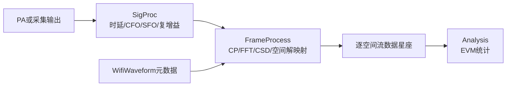
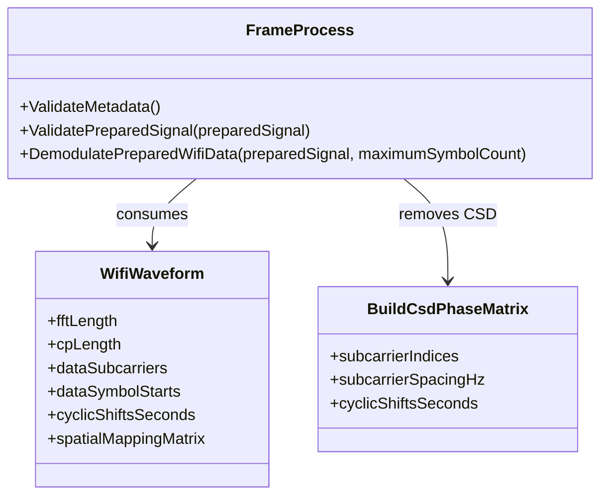

# Wi-Fi 帧处理的物理原理与代码映射

本文对应 `inc/utils/FrameProcess.py`。该模块负责已经完成时延、频偏和公共复增益校正后的 Wi-Fi 帧处理，包括循环前缀删除、FFT、数据子载波选择、循环移位分集撤销和空间流解映射。

## 1. 模块边界



**图 1 说明：**`SigProc` 负责连续时间和采样网格上的同步误差，`FrameProcess` 负责 Wi-Fi OFDM 帧结构，`Analysis` 只对处理结果计算指标。三者不依赖 PA 模型或波形生成器实现。

## 2. 循环移位分集相位

物理链 $m$ 的循环移位为 $\tau_m$。中心化子载波索引为 $k$，子载波间隔为 $\Delta f$，时移在频域对应相位

```math
D_{k,m}
=\exp\left(
-j2\pi k\Delta f\tau_m
\right).
```

`BuildCsdPhaseMatrix` 同时为所有子载波和物理链计算 $D_{k,m}$。发送端乘 $D_{k,m}$，接收端乘其共轭：

```math
D_{k,m}^{*}
=\exp\left(
j2\pi k\Delta f\tau_m
\right).
```

因为 $|D_{k,m}|=1$，CSD 只改变相位，不改变每个子载波的功率。

## 3. 删除循环前缀和 FFT

设 FFT 长度为 $N$，循环前缀长度为 $N_{\mathrm{CP}}$。对于数据符号起点 $n_s$，有效 OFDM 样点为

```math
y_s[n]
=y[n_s+N_{\mathrm{CP}}+n],
\quad
n=0,1,\ldots,N-1.
```

代码使用单位化 FFT：

```math
Y_s[k]
=\frac{1}{\sqrt{N}}
\sum_{n=0}^{N-1}
y_s[n]\exp\left(
-j\frac{2\pi kn}{N}
\right).
```

单位化 FFT 与发送端单位化 IFFT 配对，使频域和时域能量标尺一致，EVM 不会因 FFT 长度改变而产生额外比例。

## 4. CSD 撤销和空间解映射

发送端空间映射写为

```math
\mathbf Y_k
=\mathbf S_k\mathbf Q^{T}\mathbf D_k,
```

其中：

- $\mathbf S_k$ 是空间流行向量；
- $\mathbf Q$ 是物理天线乘空间流的列正交映射矩阵；
- $\mathbf D_k$ 是由 CSD 相位组成的对角矩阵。

满足

```math
\mathbf Q^{H}\mathbf Q
=\mathbf I.
```

因此接收端先撤销 CSD，再使用映射矩阵的共轭得到

```math
\widehat{\mathbf S}_k
=\mathbf Y_k\mathbf D_k^{H}\mathbf Q^{*}.
```

这正是 `FrameProcess.DemodulatePreparedWifiData` 中执行的矩阵顺序。SISO 输出形状为“符号数乘数据音调数”，MIMO 输出额外包含空间流维度。

## 5. 类和函数结构



**图 2 说明：**`FrameProcess` 只消费 `WifiWaveform` 数据契约。`WaveGenWifi` 也调用同一个 `BuildCsdPhaseMatrix` 施加发送端 CSD，因此发送和接收使用完全一致的符号、单位和相位约定。

## 6. 典型调用

```python
from inc.utils.FrameProcess import FrameProcess

frameProcessor = FrameProcess(wifiWaveform)
spatialStreamSymbols = frameProcessor.DemodulatePreparedWifiData(
    synchronizedSignal
)
```

`synchronizedSignal` 必须已经位于参考采样网格上，并与 `wifiWaveform.samples` 形状一致。时延、CFO、SFO 和公共复增益应先由 `SigProc.Process` 校正。

## 7. 使用边界

1. 本模块撤销已知发送端 CSD 和空间映射，不估计未知 OTA MIMO 信道。
2. 不执行导频相位跟踪、相位噪声估计或信道均衡。
3. `maximumSymbolCount` 只用于局部调试；正式 EVM 应处理全部数据符号。
4. 输入不足一个完整有效 OFDM 符号时会拒绝处理，而不是静默补零。
