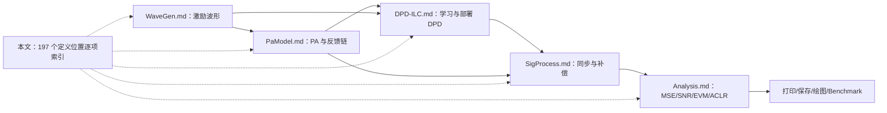

# 全工程函数与物理原理覆盖审计

本文是 `main.py` 和 `inc/*.py` 的函数级原理索引。它回答两个问题：

1. 每个函数使用了什么物理、数学或数值原理；
2. 如果函数本身不执行物理计算，它依赖哪一个上游原理，以及为什么不应为它虚构独立的物理含义。

本次审计共检查 `inc` 中 191 个函数/方法定义位置，以及 `main.py` 中 3 个入口函数。`DpdIlc.BuildUpdate` 在五个算法内部各有一个闭包定义，因此定义位置数大于唯一函数名数；原先分散的 ILC、MIMO ILC、部署模型和 benchmark 已统一到 `DpdIlc.py`。

## 1. 分类规则

| 类型 | 含义 | 文档要求 |
|---|---|---|
| P：物理/信号模型 | OFDM、PA、同步、EVM、ACLR、ILC、MIMO 等 | 必须给出物理假设、公式、单位和适用边界 |
| N：数值实现 | FFT、插值、最小二乘、正则化、投影、分块矩阵等 | 必须说明它与物理模型的对应关系、稳定性和误差来源 |
| E：工程编排 | 参数校验、Getter、序列化、打印、保存、绘图 | 没有独立物理定律；必须说明它不改变数值结果，并指向产生数据的 P/N 函数 |

不能因为函数名中含有 `Process` 就认为它必然有新的物理模型。例如 `WienerPA.Process` 实现 PA 方程，属于 P；`Draw.SavePowerEvmCurve` 只保存已计算数据，属于 E。

**图 1 说明**：五份专题文档负责详细推导，本文负责证明所有函数都能落到某一条原理链。最右侧的报告函数只消费结果，不重新定义物理指标。

## 2. `main.py`：入口和参数解析

| 函数 | 类型 | 原理或职责 | 详细依据 |
|---|---|---|---|
| `main.ParseFloatSequence` | E | 把每 PA 的 dB 配置解析为有限实数序列；不改变功率定义 | [PaModel.md：多路输出功率](./PaModel.md) |
| `main.ParseOptionalFloatSequence` | E | 把绝对 RMS 目标解析为正数或 `None`；`None` 表示不做绝对归一化 | [PaModel.md：多路输出功率](./PaModel.md) |
| `main.Main` | E | 按“波形→PA→ILC→部署 DPD→同步→指标→绘图”编排；物理计算由被调用模块完成 | [README 工作流](../README.md)、图 1 |

## 3. `waveGen.py`：Wi-Fi 波形函数

详细物理推导统一见 [WaveGen.md](./WaveGen.md)。

| 函数/方法 | 类型 | 原理或职责 | 对应章节 |
|---|---|---|---|
| `waveGen.NormalizeFrameFormat` | E | 把 11ac/11ax/11be 别名规范为 VHT/HE/EHT，不改变波形 | WaveGen §8.1 |
| `GenWifi.__init__`, `GenWifi.GetParameters`, `GenWifi.UpdateParameters`, `GenWifi.Validate` | E | ChainMap 配置、单位和合法域校验；保证后续公式输入有效 | WaveGen §12–14 |
| `GenWifi.FrameFormat`, `GenWifi.BandwidthMhz`, `GenWifi.Mcs`, `GenWifi.NumDataSymbols`, `GenWifi.GuardIntervalUs`, `GenWifi.Oversampling`, `GenWifi.Seed`, `GenWifi.NumTransmitAntennas`, `GenWifi.NumSpatialStreams`, `GenWifi.SpatialMapping`, `GenWifi.SpatialMappingMatrix`, `GenWifi.CyclicShiftEnabled` | E | 返回已验证配置，不做额外物理变换 | WaveGen §12 |
| `GenWifi.GetMcsInfo` | P/E | 返回调制阶数、名义码率和每音调比特数 | WaveGen §5 |
| `GenWifi.Generate`, `waveGen.GenerateWifiWaveform` | P/E | 组装完整 VHT/HE/EHT 复基带帧并保存解调元数据 | WaveGen §2、§8、§10 |
| `waveGen.ActiveTones`, `waveGen.PilotTones` | P | 依据 FFT 网格选择活动、数据和导频子载波 | WaveGen §4 |
| `waveGen.GrayToBinary`, `waveGen.QamModulate` | P/N | Gray 标号转自然坐标，构造单位平均功率 BPSK/QAM | WaveGen §6 |
| `waveGen.PilotSequence` | P/N | 生成可复现 BPSK 导频符号；用于相位/信道参考，本仿真不执行接收端导频跟踪 | WaveGen §4、§11 |
| `waveGen.OfdmSymbol` | P/N | 子载波映射、IFFT、能量归一化和循环前缀 | WaveGen §3、§7 |
| `waveGen.TrainingField` | P/N | 在 bonded 20 MHz 子信道上构造传统训练激励 | WaveGen §8.5 |
| `waveGen.BuildSpatialMappingMatrix`, `waveGen.SpatialMapTones` | P/N | 构造列正交映射矩阵并完成空间流到天线映射 | WaveGen §8.7 |
| `waveGen.GetLtfSymbolCount`, `waveGen.BuildLtfTrainingMatrix` | P/N | 选择训练符号数并用正交矩阵分离空间流 | WaveGen §8.6、§8.9 |
| `waveGen.GetCyclicShifts`, `waveGen.BuildCsdPhaseMatrix` | P/N | 时移在频域表示为线性相位，形成循环移位分集 | WaveGen §8.8 |
| `waveGen.BuildMimoOfdmSymbol` | P/N | 合并 QAM、导频、空间映射、CSD、IFFT 和 CP | WaveGen §3、§8.7–§8.9 |
| `waveGen.MapCommonFieldToAntennas` | P/E | 把公共前导复制到物理链并施加链级 CSD，保持公共字段含义 | WaveGen §8.8、§8.10 |
| `waveGen.AppendField` | E | 内部闭包：顺序拼接字段并记录切片，不改变字段采样值 | WaveGen §8.2–§8.5 |

## 4. `PaModel.py`：PA、噪声和多路功率函数

详细物理推导统一见 [PaModel.md](./PaModel.md)。

| 函数/方法 | 类型 | 原理或职责 | 对应章节 |
|---|---|---|---|
| `WienerConfig.Validate`, `GMPConfig.Validate` | E | 检查饱和幅度、阶次、记忆和系数合法性 | PaModel §3.6、§4 |
| `WienerPA.__init__`, `GMPPA.__init__` | E | 保存已验证模型参数，不另引入物理过程 | PaModel §3、§4 |
| `WienerPA.Process` | P/N | FIR 线性记忆→Rapp AM-AM→幅度相关 AM-PM | PaModel §3.1–§3.4 |
| `WienerPA.SmallSignalGain` | P/N | 取零幅度极限，返回线性 FIR 直流复增益 | PaModel §3.5 |
| `GMPPA.Process` | P/N | 计算主、滞后包络和超前包络 GMP 支路 | PaModel §4.2–§4.6 |
| `GMPPA.SmallSignalGain` | P/N | 只保留一阶主支路得到小信号增益 | PaModel §4.7 |
| `PaModel.__init__`, `PaModel.ResolveConfiguration`, `PaModel.SynchronizeModel` | E | ChainMap 覆盖解析并构造选定 Wiener/GMP 内核 | PaModel §12 |
| `PaModel.ModelName`, `PaModel.GetParameters`, `PaModel.UpdateParameters` | E | 查询或更新配置；更新后重建模型以保持状态一致 | PaModel §12 |
| `PaModel.Process`, `PaModel.SmallSignalGain` | E/P | 统一分派到选定物理 PA 的同名计算 | PaModel §9、§12 |
| `MimoPaModel.__init__`, `MimoPaModel.ResolveNumericSequence`, `MimoPaModel.ResolvePaParametersPerChain`, `MimoPaModel.ValidateParameters`, `MimoPaModel.SynchronizeModels` | E | 把标量/序列配置扩展到每条物理链并构造独立 PA | PaModel §10 |
| `MimoPaModel.NumTransmitChains`, `MimoPaModel.GetParameters`, `MimoPaModel.UpdateParameters` | E | 返回或更新多路配置，不改变功率定义 | PaModel §10、§12 |
| `MimoPaModel.SetOutputPowerDb`, `MimoPaModel.SetTargetOutputRms` | P/E | 设置相对幅度比例或绝对 RMS 目标；dB 幅度比例为 $10^{P_{dB}/20}$ | PaModel §10 |
| `MimoPaModel.Process`, `MimoPaModel.ProcessChain` | P/N | 每列通过独立 PA，再执行相对/绝对输出 RMS 校准 | PaModel §10、§10.2 |
| `MimoPaModel.GetOutputRmsPerChain` | E | 返回最近一次实际链输出 RMS | PaModel §10 |
| `IQImbalancePA.__init__`, `IQImbalancePA.Process`, `IQImbalancePA.SmallSignalGain` | P/N | 广义线性模型 $y=\alpha v+\beta v^*$ 及其直接支路小信号增益 | PaModel §7 |
| `PaModel.AsComplexVector` | N | 把输入约束为有限一维复包络；不改变样值 | PaModel §2 |
| `PaModel.DelaySignal` | N | 因果整数延迟并对历史补零 | PaModel §4 |
| `PaModel.DefaultGmpCoefficients` | E/N | 生成稳定的演示系数，不代表实测器件 | PaModel §11 |
| `PaModel.AddAwgn` | P/N | 按目标复基带 SNR 设置圆对称复高斯噪声方差 | PaModel §8 |

## 5. `DpdIlc.py`：全部 ILC、部署模型和基准函数

详细推导统一见 [DPD-ILC.md](./DPD-ILC.md)，MSE 选优见 [Analysis.md §5.5–§5.10](./Analysis.md)。

| 函数/方法 | 类型 | 原理或职责 | 对应章节 |
|---|---|---|---|
| `ILCConfig.Validate` | E | 校验学习率、正则化、峰值、平均次数和投影带宽 | DPD-ILC §3.3、§3.11–§3.12 |
| `DpdIlc.CalculateIterationMetrics` | N/P | 计算 Raw MSE、复增益正交残差和严格 EVM-MSE | Analysis §5.5–§5.10 |
| `DpdIlc.NextPowerOfTwo` | N | 选择零填充 FFT 长度；提高采样密度/效率但不创造物理分辨率 | DPD-ILC §3.14 |
| `DpdIlc.LimitAmplitude` | N/P | 把复样点投影到峰值圆盘，模拟 DAC/PA 输入约束 | DPD-ILC §3.11、§3.14 |
| `DpdIlc.MeasurePaOutput` | P/N | 重复 PA 反馈、添加 AWGN 并平均，噪声方差降为 $1/R$ | DPD-ILC §3.12、§3.14 |
| `DpdIlc.RunFrequencyDomainIlc` | P/N | 小信号频响探测、正则化逆、带宽投影、峰值投影和 EVM 选优 | DPD-ILC §3.4、§3.14 |
| `DpdIlc.BuildFeatureSpecs` | N | 枚举 GMP 主/滞后/超前包络基函数 | DPD-ILC §3.7、§3.14 |
| `DpdIlc.DelayedSlice`, `DpdIlc.GetDelayed` | N | 因果零填充延迟和块内缓存；保持基函数时序一致 | DPD-ILC §3.14 |
| `DpdIlc.BuildGmpBasisChunk` | N/P | 在有限块内计算 GMP 基矩阵 | DPD-ILC §3.7、§3.14 |
| `GMPPredistorter.Process` | P/N | 计算 $\mathbf u=\boldsymbol\Phi_{GMP}\mathbf c$，分块只改变内存不改变代数 | DPD-ILC §3.7、§3.14 |
| `DpdIlc.FitGmpPredistorter` | N | 两遍列归一化、分块累加正规矩阵和岭回归 | DPD-ILC §3.7、§3.14 |

### 5.1 各 ILC 更新律

| 函数/方法 | 类型 | 原理或职责 | 对应章节 |
|---|---|---|---|
| `DpdIlc.MeasureOutput` | P/N | 重复带噪反馈平均 | DPD-ILC §3.12、§3.14 |
| `DpdIlc.SelectionError` | N | 去除公共复增益后的归一化正交残差；是无帧元数据时的 EVM 代理 | Analysis §5.6–§5.7 |
| `DpdIlc.RunWaveformUpdate` | E/N | 统一执行“测量→三级 MSE→最佳轮保留→更新→峰值投影” | Analysis §5.9、DPD-ILC §3 |
| `DpdIlc.EstimateComplexGain` | P/N | 低功率探测下的最小二乘复增益 | Analysis §3、DPD-ILC §3.14 |
| `DpdIlc.RunScalarPIlc` 及其 `DpdIlc.BuildUpdate` | P/N | $\Delta u=\mu e$ | DPD-ILC §3.1 |
| `DpdIlc.RunComplexGainIlc` 及其 `DpdIlc.BuildUpdate` | P/N | $\Delta u=\mu h^*e/(|h|^2+\lambda)$ | DPD-ILC §3.2 |
| `DpdIlc.NextPowerOfTwo`, `DpdIlc.EstimateFrequencyResponse` | N/P | FFT 长度及低功率逐频点/标量增益置信度融合 | DPD-ILC §3.3、§3.14 |
| `DpdIlc.RunFirIlc` 及其 `DpdIlc.BuildUpdate` | P/N | 正则化逆频响 IFFT 后截成双边离线 FIR，卷积误差更新 | DPD-ILC §3.3 |
| `DpdIlc.RunDirectionalGaussNewtonIlc` 及其 `DpdIlc.BuildUpdate` | P/N | 沿误差方向有限差分雅可比的一维正则化步长 | DPD-ILC §3.5、§3.14 |
| `DpdIlc.MemoryPolynomialBasis`, `DpdIlc.RunParameterDomainIlc` | P/N | MP 基矩阵、归一化正规矩阵和直接系数迭代 | DPD-ILC §3.6–§3.7 |
| `DpdIlc.RunAugmentedIqIlc` 及其 `DpdIlc.BuildUpdate` | P/N | 从 $[u,u^*]$ 回归得到 2×2 增广逆，联合使用 $e$ 和 $e^*$ | DPD-ILC §3.10 |

上表中的五个 `BuildUpdate` 是不同闭包：虽然名字相同，公式分别由所在行明确给出。

### 5.2 Volterra、LUT 和神经部署模型

| 函数/方法 | 类型 | 原理或职责 | 对应章节 |
|---|---|---|---|
| `DpdIlc.DelaySignal` | N | 因果整数记忆，负时间补零 | DPD-ILC §3.13 |
| `DpdIlc.BuildVolterraSpecs` | N/P | 枚举一阶项和 $s[n-m_1]s[n-m_2]s^*[n-m_3]$ 三阶项 | DPD-ILC §3.7、§3.13 |
| `DpdIlc.BuildVolterraBasis` | N/P | 构造简化复 Volterra 设计矩阵 | DPD-ILC §3.13 |
| `VolterraPredistorter.Process` | P/N | 计算 $\boldsymbol\Phi_V\mathbf c$ | DPD-ILC §3.13 |
| `DpdIlc.FitVolterraPredistorter` | N | 列 RMS 归一化和复岭回归 | DPD-ILC §3.13 |
| `LUTPredistorter.Process` | P/N | 按输入幅度选 bin 并乘复增益 | DPD-ILC §3.8、§3.13 |
| `DpdIlc.FitLutPredistorter` | N | 每 bin 正则化复 LS，空 bin 用最近已填充系数 | DPD-ILC §3.8、§3.13 |
| `DpdIlc.BuildNeuralInputs` | N/P | 构造多时延 I/Q/包络实特征 | DPD-ILC §3.9、§3.13 |
| `NeuralPredistorter.Process` | P/N | 标准化→固定 tanh 隐藏层→复线性输出 | DPD-ILC §3.13 |
| `DpdIlc.FitNeuralPredistorter` | N | ELM 随机特征初始化和复输出层岭回归 | DPD-ILC §3.9、§3.13 |

### 5.3 逐 PA 的独立 MIMO ILC/DPD

| 函数/方法 | 类型 | 原理或职责 | 对应章节 |
|---|---|---|---|
| `MimoPaChain.__init__`, `MimoPaChain.Process` | E/P | 把第 $m$ 个独立 PA 暴露为 SISO 植物，不改变该链模型 | PaModel §10.2 |
| `MimoGmpPredistorter.__init__`, `MimoGmpPredistorter.Process` | E/P | 每个矩阵列使用自己的 GMP DPD | PaModel §10.2、DPD-ILC §3.7 |
| `DpdIlc.RunMimoFrequencyDomainIlc` | P/E | 在“链间无耦合”假设下逐列运行频域 ILC并使用独立噪声种子 | PaModel §10.1–§10.2 |
| `DpdIlc.FitMimoGmpPredistorter` | N/E | 对每组 $(x_m,u_m^*)$ 标签独立岭回归 | PaModel §10.2 |

若存在天线耦合、电源耦合或串扰，上述逐链分解不成立，必须使用 DPD-ILC §3.10 的联合增广 MIMO 模型。

## 6. `SigProcess.py`：同步和补偿函数

详细推导统一见 [SigProcess.md](./SigProcess.md)。

| 函数/方法 | 类型 | 原理或职责 | 对应章节 |
|---|---|---|---|
| `SignalProcessingResult.ToDict` | E | 只序列化估计标量，不重新计算同步 | SigProcess §9 |
| `SigProcess.__init__`, `SigProcess.ValidateSignal`, `SigProcess.GetParameters`, `SigProcess.UpdateParameters`, `SigProcess.ValidateParameters` | E | 保存参考、解析 ChainMap、检查单位和有限性 | SigProcess §9–§10 |
| `SigProcess.ResolveMaximumIntegerDelay` | N/E | 把自动/外部时延边界转换为有限相关搜索半径 | SigProcess §3、§12 |
| `SigProcess.EstimateIntegerDelay` | P/N | FFT 互相关并按重叠能量归一化，最大相关峰给出整数时延 | SigProcess §3 |
| `SigProcess.ExtractIntegerAligned` | N | 按估计时延提取重叠样点并对缺失位置补零 | SigProcess §3 |
| `SigProcess.EstimateCarrierFrequencyOffset` | P/N | 分块复增益相位随时间的斜率估计 CFO | SigProcess §4.1 |
| `SigProcess.CompensateCarrierFrequencyOffset` | P/N | 乘 $e^{-j2\pi\hat f n/f_s}$ 撤销载波相位斜率 | SigProcess §4.2 |
| `SigProcess.RefineCorrelationPeak` | N | 对相关峰邻点做抛物线插值得到亚采样峰位置 | SigProcess §5 |
| `SigProcess.EstimateTimingOffsets` | P/N | 多窗口局部相关位置的截距给分数时延、斜率给 SFO | SigProcess §5–§6 |
| `SigProcess.InterpolateSignal` | N/P | 加窗 sinc/Lanczos 重采样，实现分数时延和采样率校正 | SigProcess §7 |
| `SigProcess.EstimateComplexGain` | N/P | 最小二乘正交投影得到公共复增益 | SigProcess §8、Analysis §3 |
| `SigProcess.ResolveEstimationSlice` | E | 把数据字段或调用方切片限制到有效参考范围 | SigProcess §9、Analysis §4.4 |
| `SigProcess.Process` | E/P | 按整数时延→CFO→分数时延/SFO→重采样→复增益的顺序执行 | SigProcess §2 |

## 7. `Analysis.py`：指标与每轮 MSE 函数

详细推导统一见 [Analysis.md](./Analysis.md)。

| 函数/方法 | 类型 | 原理或职责 | 对应章节 |
|---|---|---|---|
| `SignalMetrics.ToDict`, `MimoSignalMetrics.ToDict`, `PowerEvmCurve.ToDict` | E | 把已经计算的指标转为 JSON/CSV 类型，不改变数值 | Analysis §10 |
| `Analysis.AveragePeriodogram` | N/P | Hann 窗、50% 重叠的 Welch PSD 平均 | Analysis §6.2 |
| `Analysis.__init__`, `Analysis.GetParameters`, `Analysis.UpdateParameters`, `Analysis.ValidateParameters` | E | 保存参考和元数据，解析指标/同步参数并校验 | Analysis §1–§2、§11 |
| `Analysis.PrepareMeasuredSignal` | E/P | 对每条物理链调用完整 `SigProcess` | Analysis §2、§9 |
| `Analysis.GetLastSignalProcessingResult`, `Analysis.GetLastSignalProcessingResults`, `Analysis.GetLastMimoMetrics`, `Analysis.GetStageSignalProcessingResults`, `Analysis.GetStageMimoMetrics` | E | 返回缓存的不可变结果，不重新估计 | Analysis §9–§10 |
| `Analysis.ValidatePreparedSignal` | E | 确保 prepared 数据与参考网格形状和有限性一致 | Analysis §2 |
| `Analysis.CalculateSnr`, `Analysis.CalculatePreparedSnr` | P/N | 数据字段参考功率/校正残差功率 | Analysis §4 |
| `Analysis.DemodulateWifiData`, `Analysis.DemodulatePreparedWifiData` | P/N | 去 CP、单位化 FFT、数据音调选择、撤销 CSD/空间映射 | Analysis §5.1、§9.1 |
| `Analysis.CalculateEvm`, `Analysis.CalculatePreparedEvm` | P/N | 数据星座 RMS EVM 及 dB/% 换算 | Analysis §5.2 |
| `Analysis.CalculateEvmAlignedMse`, `Analysis.CalculatePreparedEvmAlignedMse` | P/N | 与 EVM 接收链一致的归一化符号 MSE，严格等于 EVM² | Analysis §5.8 |
| `Analysis.CalculatePreparedSnrPerChain` | P/N | 每条物理 PA 链独立能量比 | Analysis §9.2 |
| `Analysis.CalculatePreparedEvmPerSpatialStream` | P/N | 空间解映射后逐流星座误差能量比 | Analysis §9.1 |
| `Analysis.IntegrateAclr` | P/N | 等宽主/邻道 PSD 积分并取较差邻道 | Analysis §6.1、§6.3 |
| `Analysis.CalculateAclr`, `Analysis.CalculatePreparedAclr`, `Analysis.CalculatePreparedAclrPerChain` | P/N | 数据字段 Welch PSD 的汇总/逐链 ACLR | Analysis §6、§9.3 |
| `Analysis.Analyze`, `Analysis.AnalyzeStages` | E | 让 SNR/EVM/ACLR 共用一次同步结果并保存阶段映射 | Analysis §1 |
| `Analysis.AnalyzePowerEvmCurve` | P/E | 在共同 RMS 驱动点和参考下公平比较各方法 EVM | Analysis §8 |
| `Analysis.SavePowerEvmCurveData`, `Analysis.Print`, `Analysis.PrintMimo`, `Analysis.Save`, `Analysis.SaveConvergence`, `Analysis.PrintConvergence` | E | 展示/序列化既有结果，不改变物理指标 | Analysis §10–§11 |

## 8. `Draw.py`：图形函数

这些函数全部属于 E 类。它们只改变视觉表示，不参与 MSE、EVM 或功率计算。

| 函数/方法 | 原理或职责 | 数据来源 |
|---|---|---|
| `Draw.__init__`, `Draw.GetParameters`, `Draw.UpdateParameters`, `Draw.ValidateParameters` | ChainMap 图形参数、尺寸、DPI、文字和文件名校验 | README 的 Draw 参数表 |
| `Draw.ValidatePowerEvmCurve` | 检查横坐标、方法数组长度及有限性 | `Analysis.AnalyzePowerEvmCurve` |
| `Draw.CreatePowerEvmFigure`, `Draw.SavePowerEvmCurve` | 在同一坐标绘制/保存多方法 EVM；不重算 EVM | Analysis §8 |
| `Draw.ValidateConvergenceHistory` | 检查轮次递增和 Raw/LC/EVM 序列完整性 | Analysis §5.10 |
| `Draw.CreateConvergenceFigure`, `Draw.SaveConvergenceCurve` | 同轴绘制 Raw NMSE、LC-NMSE 和 EVM-MSE/EVM dB | Analysis §5.5–§5.10 |

图上的连线只帮助阅读离散采样点，不表示功率点或迭代轮次之间存在连续物理轨迹。

## 9. `DpdIlc.py`：统一基准编排与报告函数

这些函数主要属于 E 类；其科学原则是控制变量和独立验证，而不是新的 PA 方程。

| 函数/方法 | 类型 | 原理或职责 | 依据 |
|---|---|---|---|
| `BenchmarkRow.ToDict` | E | 序列化一个方法的指标和相对改善量 | Analysis §10 |
| `DpdIlc.AddRow` | E | 相对同场景 baseline 计算 SNR/EVM/ACLR 改善 | Analysis §4–§8 |
| `DpdIlc.SaveHistory`, `DpdIlc.ReportHistory` | E | 打印并保存每种 ILC 的同一组三级 MSE 和图 | Analysis §5.10 |
| `DpdIlc.EvaluateDeployment` | E/P | 固定 DPD→峰值投影→PA→统一 Analysis，使用独立验证帧 | DPD-ILC §3.7–§3.13 |
| `DpdIlc.RunIlcCurvePoint` | E | 在当前功率点重新构造正确参考和 EVM-MSE evaluator | Analysis §8 |
| `DpdIlc.RunAllIlcBenchmark` | E | 固定波形、PA、迭代预算和指标定义；训练帧与验证帧种子分离 | DPD-ILC §3.7、Analysis §8 |
| `DpdIlc.SaveBenchmarkResults`, `DpdIlc.PrintBenchmarkResults` | E | 输出统一表格/文件，不重新计算指标 | Analysis §10 |

## 10. 审计结论与维护规则

审计结果如下：

- 所有具有物理或信号处理含义的函数均可追溯到专题文档中的公式和边界；
- 所有纯配置、查询、序列化、保存和绘图函数均被明确标为 E 类，没有为其虚构物理原理；
- `DpdIlc.py` 中的简化 Volterra、幅度 LUT 和 ELM 风格神经网络以前只有一般模型说明，本次已在 DPD-ILC §3.13 补充代码精确方程；
- ILC 的低功率频响融合、方向 Gauss-Newton、峰值/带宽投影、反馈平均和 GMP 分块岭回归以前缺少实现级推导，本次已在 DPD-ILC §3.14 补齐；
- prepared 指标、每链/每流指标、每轮三级 MSE、绘图和 benchmark 的函数级入口均已在本文建立索引。

以后新增 `inc` 函数时，应同时完成以下至少一项：

1. 若引入新物理模型，在对应专题文档增加公式、单位、假设和边界；
2. 若只是现有公式的新数值实现，在专题文档说明数值稳定性和近似；
3. 若只是工程编排，在本文标为 E 类并指向其数据来源。

仅增加 docstring 不视为完成物理原理文档。
