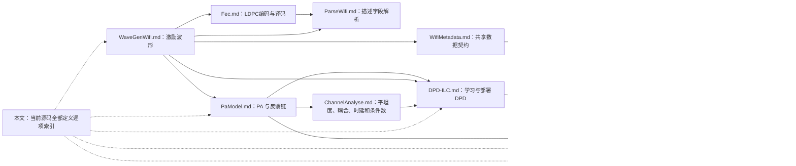

# 全工程函数与物理原理覆盖审计

本文是 `main.py` 和 `inc/**/*.py` 的函数级原理索引。它回答两个问题：

1. 每个函数使用了什么物理、数学或数值原理；
2. 如果函数本身不执行物理计算，它依赖哪一个上游原理，以及为什么不应为它虚构独立的物理含义。

本次审计检查 `main.py` 和 `inc/**/*.py` 中的全部函数/方法定义位置。Wi-Fi生成、帧解析、PA、Analysis、DPD-ILC、通道测量和DpdGmp核心业务模块位于 `inc/lib`，配套处理工具位于 `inc/utils`。`DpdIlc.BuildUpdate` 在多个算法内部各有闭包定义，因此定义位置数大于唯一函数名数；可复用ILC与MIMO ILC统一位于 `DpdIlc.py`，可部署且可增量更新的GMP及耦合感知封装位于`DpdGmp.py`，场景构造与benchmark报告独立位于 `tests/BenchMark.py`。文档不固化容易随提交失效的定义总数，自动化审计按当前源码逐项核对名称。

## 1. 分类规则

| 类型 | 含义 | 文档要求 |
|---|---|---|
| P：物理/信号模型 | OFDM、PA、同步、EVM、ACLR、ILC、MIMO 等 | 必须给出物理假设、公式、单位和适用边界 |
| N：数值实现 | FFT、插值、最小二乘、正则化、投影、分块矩阵等 | 必须说明它与物理模型的对应关系、稳定性和误差来源 |
| E：工程编排 | 参数校验、Getter、序列化、打印、保存、绘图 | 没有独立物理定律；必须说明它不改变数值结果，并指向产生数据的 P/N 函数 |

不能因为函数名中含有 `Process` 就认为它必然有新的物理模型。例如 `WienerPA.Process` 实现 PA 方程，属于 P；`Draw.SavePowerEvmCurve` 只保存已计算数据，属于 E。

```mermaid
flowchart LR
    wave["WaveGenWifi.md：激励波形"] --> pa["PaModel.md：PA 与反馈链"]
    wave --> fec["Fec.md：LDPC编码与译码"]
    fec --> parser["ParseWifi.md：描述字段解析"]
    wave --> parser
    pa --> ilc["DPD-ILC.md：学习与部署 DPD"]
    wave --> ilc
    ilc --> sync["SigProc.md：同步、补偿与功率标定"]
    wave --> metadata["WifiMetadata.md：共享数据契约"]
    metadata --> frame["FrameProcess.md：OFDM与空间解映射"]
    frame --> analysis
    pa --> sync
    pa --> channelMeasure["ChannelAnalyse.md：平坦度、耦合、时延和条件数"]
    channelMeasure --> ilc
    sync --> analysis["Analysis.md：MSE/SNR/EVM/ACLR/Mask"]
    analysis --> report["打印/保存/绘图"]
    audit["本文：当前源码全部定义逐项索引"] -.-> wave
    audit -.-> pa
    audit -.-> ilc
    audit -.-> sync
    audit -.-> analysis
```

**图 1 说明**：各专题文档负责详细推导，本文负责证明所有函数都能落到某一条原理链。FEC只执行编码域计算，ParseWifi负责把LDPC与OFDM描述字段连接起来；最右侧的报告函数只消费结果，不重新定义物理指标。

## 2. `main.py`：入口和参数解析

| 函数 | 类型 | 原理或职责 | 详细依据 |
|---|---|---|---|
| `main.ParseFloatSequence` | E | 把每 PA 的 dB 配置解析为有限实数序列；不改变功率定义 | [PaModel.md：多路输出功率](./PaModel.md) |
| `main.ParseOptionalFloatSequence` | E | 兼容旧接口：把 RMS 电压目标解析为正数或 `None`；新调用应使用 dBm 目标 | [PaModel.md：多路输出功率](./PaModel.md) |
| `main.ParseOptionalDbmSequence` | E | 把每PA的绝对dBm目标解析为有限实数或 `None`；允许负dBm | [PaModel.md：多路输出功率](./PaModel.md) |
| `main.EvaluateIlcPowerPoint` | P/E | 在当前功率参考上运行SISO或MIMO频域ILC，以每轮前向chOut的严格Wi-Fi EVM选择最佳输入并重放PA；反馈LC-NMSE只用于学习和诊断，不决定功率曲线报告样点 | DpdIlc §15、Analysis §8.3–§8.6 |
| `main.Main` | E | 按“波形→PA→ILC→部署 DPD→同步→指标→绘图”编排；物理计算由被调用模块完成 | [README 工作流](../README.md)、图 1 |

### 2.1 `ConfigUtils.py`：未知配置容错

| 函数/方法 | 类型 | 原理或职责 | 详细依据 |
|---|---|---|---|
| `ConfigUtils.FindUnknownParameterNames` | E | 比较调用方键和类内默认键集合，稳定列出无法识别的配置名；不改变任何物理量 | [README 配置容错](../README.md) |
| `ConfigUtils.WarnUnknownParameters` | E | 通过标准 `UserWarning` 一次报告一组被忽略配置，不中断仿真 | [README 配置容错](../README.md) |
| `ConfigUtils.FilterRecognizedParameters` | E | 为构造函数直接覆盖和 `UpdateParameters` 复制已识别键、忽略未知键 | [README 配置容错](../README.md) |
| `RecognizedParameterView.__init__`, `RecognizedParameterView.WarnForNewUnknownParameters` | E | 保留外部字典动态更新语义，并对运行期间新加入的未知键只警告一次 | [README 配置容错](../README.md) |
| `RecognizedParameterView.__getitem__`, `RecognizedParameterView.__iter__`, `RecognizedParameterView.__len__` | E | 实现只暴露已识别键的实时只读映射视图，供各类内部 `ChainMap` 使用 | [README 配置容错](../README.md) |

### 2.2 `FixedPoint.py`：统一I/Q位宽边界

| 函数/方法 | 类型 | 原理或职责 | 详细依据 |
|---|---|---|---|
| `FixedPoint.__init__` | E | 校验0至53位接口配置及正有限 `fullScaleAmplitude`；0为浮点旁路，正数使用scaled full-scale码值映射 | [FixedPoint.md §1–§2](./FixedPoint.md) |
| `FixedPoint.IsFloatingPoint`, `FixedPoint.GetFormatInfo` | E | 返回当前模式、scaled full-scale、物理量化步长、代码范围和物理可表示范围，不改变信号 | [FixedPoint.md §2](./FixedPoint.md) |
| `FixedPoint.QuantizeComplex` | N/P | 兼容入口，调用编码逻辑把当前full-scale下的物理I/Q映射为有符号整数码，并保持 `complex128` 容器类型 | [FixedPoint.md](./FixedPoint.md) |

## 3. `WaveGenWifi.py`：Wi-Fi 波形函数

详细物理推导统一见 [WaveGenWifi.md](./WaveGenWifi.md)。

| 函数/方法 | 类型 | 原理或职责 | 对应章节 |
|---|---|---|---|
| `WaveGenWifi.NormalizeFrameFormat` | E | 把 11ac/11ax/11be 别名规范为 VHT/HE/EHT，不改变波形 | WaveGenWifi §8.1 |
| `WaveGenWifi.__init__`, `WaveGenWifi.GetParameters`, `WaveGenWifi.UpdateParameters`, `WaveGenWifi.Validate` | E | ChainMap 配置、未知键警告后忽略、已识别值合法域校验；保证后续公式输入有效 | WaveGenWifi §12–14 |
| `WaveGenWifi.Width`, `WaveGenWifi.FrameFormat`, `WaveGenWifi.BandwidthMhz`, `WaveGenWifi.Mcs`, `WaveGenWifi.NumDataSymbols`, `WaveGenWifi.GuardIntervalUs`, `WaveGenWifi.SampleRateHz`, `WaveGenWifi.Oversampling`, `WaveGenWifi.Seed`, `WaveGenWifi.NumTransmitAntennas`, `WaveGenWifi.NumSpatialStreams`, `WaveGenWifi.SpatialMapping`, `WaveGenWifi.SpatialMappingMatrix`, `WaveGenWifi.CyclicShiftEnabled` | E | 返回已验证配置；采样率由 `sampleRateHz` 直接决定，旧 `oversampling` 只在未配置采样率时用于兼容推导，位宽定义输出接口量化 | WaveGenWifi §12、FixedPoint §2 |
| `WaveGenWifi.ResolveMcsTable`, `WaveGenWifi.GetMcsInfo` | P/E | 在方法内部构造不可变 MCS 表并返回调制阶数、名义码率和每音调比特数，不保留模块级查表变量 | WaveGenWifi §5 |
| `WaveGenWifi.Generate`, `WaveGenWifi.GenerateWifiWaveform` | P/E | 组装完整 VHT/HE/EHT 复基带帧、归一化浮点待输出波形、量化公开样值并保存解调元数据 | WaveGenWifi §2、§8、§10、FixedPoint §6 |
| `WaveGenWifi.ActiveTones`, `WaveGenWifi.PilotTones` | P | 依据 FFT 网格选择活动、数据和导频子载波 | WaveGenWifi §4 |
| `WaveGenWifi.GrayToBinary`, `WaveGenWifi.QamModulate` | P/N | Gray 标号转自然坐标，构造单位平均功率 BPSK/QAM | WaveGenWifi §6 |
| `WaveGenWifi.PilotSequence` | P/N | 生成可复现 BPSK 导频符号；用于相位/信道参考，本仿真不执行接收端导频跟踪 | WaveGenWifi §4、§11 |
| `WaveGenWifi.OfdmSymbol` | P/N | 子载波映射、IFFT、能量归一化和循环前缀 | WaveGenWifi §3、§7 |
| `WaveGenWifi.TrainingField` | P/N | 在 bonded 20 MHz 子信道上构造传统训练激励 | WaveGenWifi §8.5 |
| `WaveGenWifi.BuildSpatialMappingMatrix`, `WaveGenWifi.SpatialMapTones` | P/N | 构造列正交映射矩阵并完成空间流到天线映射 | WaveGenWifi §8.7 |
| `WaveGenWifi.GetLtfSymbolCount`, `WaveGenWifi.BuildLtfTrainingMatrix` | P/N | 选择训练符号数并用正交矩阵分离空间流 | WaveGenWifi §8.6、§8.9 |
| `WaveGenWifi.GetCyclicShifts` | P/N | 返回各物理链的格式相关循环移位；相位矩阵由独立 FrameProcess 模块构造 | WaveGenWifi §8.8、FrameProcess §2 |
| `WaveGenWifi.BuildMimoOfdmSymbol` | P/N | 合并 QAM、导频、空间映射、CSD、IFFT 和 CP | WaveGenWifi §3、§8.7–§8.9 |
| `WaveGenWifi.MapCommonFieldToAntennas` | P/E | 把公共前导复制到物理链并施加链级 CSD，保持公共字段含义 | WaveGenWifi §8.8、§8.10 |
| `WaveGenWifi.AppendField` | E | 内部闭包：顺序拼接字段并记录切片，不改变字段采样值 | WaveGenWifi §8.2–§8.5 |

### 3.1 `inc/lib/Fec.py`：前向纠错编码与译码

详细数学推导和独立调用方法见 [Fec.md](./Fec.md)。

| 函数/方法 | 类型 | 原理或职责 | 对应章节 |
|---|---|---|---|
| `Fec.BuildDescriptorLdpcMatrices`, `Fec.TripleScore` | N | 确定性构造35×90稀疏校验矩阵；内部邻域评分先避免四环对应的重复行对，再平衡校验节点度数 | Fec §3 |
| `Fec.EncodeDescriptorLdpc` | N | 对55 bit信息执行系统短码LDPC累加编码，生成90 bit零综合码字 | Fec §4、§6.2 |
| `Fec.DecodeDescriptorLdpc` | N | 对90个软BPSK值执行纯NumPy normalized min-sum迭代译码；每个校验节点一次求最小/第二小幅度并向量化生成全部外信息，避免逐边删除数组且保持重复最小值语义；兼容Python 3.9至3.12 | Fec §5、§6.3，Performance §7.1 |

### 3.2 `inc/lib/ParseWifi.py`：接收帧解析与参考恢复

详细原理、限制和调用方法见 [ParseWifi.md](./ParseWifi.md)。

| 函数/方法 | 类型 | 原理或职责 | 对应章节 |
|---|---|---|---|
| `ParseWifi.IntegerToBits`, `ParseWifi.BitsToInteger` | N | 在固定宽度整数与MSB优先比特序列之间无损转换 | ParseWifi §3 |
| `ParseWifi.CalculateDescriptorCrc` | N | 按CRC-16-CCITT多项式验证描述字段的时序、采样率和内容 | ParseWifi §3.3 |
| `ParseWifi.CachedDescriptorLdpcPhysicalLayout`, `ParseWifi.DescriptorLdpcPhysicalLayout` | P/N | 在两个52音调描述符号中各放置七个已知BPSK导频，并把LDPC码字偶/奇位分散到不同符号；前者只缓存不可变布局字节，后者每次返回以这些字节为底层所有者的新只读NumPy视图，外部不能污染缓存 | ParseWifi §3.4，Performance §7.2 |
| `ParseWifi.DecodeWifiDescriptorPayload`, `ParseWifi.BuildDecodedDescriptorParameters` | E/N | 恢复55 bit新版载荷并统一校验格式、带宽、MCS、GI、空间流、映射和10 bit随机种子 | ParseWifi §3.2、§5.3 |
| `ParseWifi.BuildWifiDescriptorBits`, `ParseWifi.DecodeWifiDescriptorBits` | E/N | 打包新版LDPC描述或自动分派新版LDPC/旧版CRC硬判决恢复 | ParseWifi §3 |
| `ParseWifi.DecodeLegacyWifiDescriptorBits` | E/N | 保留对历史32 bit seed、CRC-16顺序描述波形的接收兼容 | ParseWifi §3.5 |
| `ParseWifi.DecodeWifiDescriptorLdpcValues` | N | 从104个均衡后软BPSK值中去导频、撤销跨符号交织、LDPC译码并恢复10 bit seed载荷 | ParseWifi §5.3 |
| `ParseWifi.DecodeWifiDescriptorBitsWithCorrection` | N | 用magic/版本/保留位先验、软判决可靠度和CRC综合值执行有限meet-in-the-middle位翻转搜索；仍要求完整CRC与字段语义合法 | ParseWifi §5.3 |
| `ParseWifi.BuildWifiDescriptorField` | P/N | 把104个描述比特映射到两个重复发送的52音调BPSK传统OFDM符号 | ParseWifi §4 |
| `ParseWifi.__init__`, `ParseWifi.GetParameters`, `ParseWifi.UpdateParameters`, `ParseWifi.ValidateParameters` | E | 在类内建立ChainMap默认参数，警告并忽略未知键，再验证接收时钟、搜索范围和自定义空间映射 | ParseWifi §7 |
| `ParseWifi.ResolveSampleRates` | E | 使用显式接收时钟，或产生按顺序尝试的常见复基带采样率 | ParseWifi §5.2 |
| `ParseWifi.ValidateReceivedSignal` | E/N | 自动从NumPy数组或 `WifiWaveform.samples` 取样，并检查SISO向量或samples×chains矩阵的形状与有限性 | ParseWifi §5.1 |
| `ParseWifi.ScoreDescriptorCandidate` | P/N | 重生成LDPC或历史CRC有效候选的完整确定性帧，以逐链归一化相关和捕获长度一致性排除错误随机种子或错误帧长 | ParseWifi §5.3 |
| `ParseWifi.DecodeDescriptorAt` | P/N | 对候选时刻去CP和FFT；新版路径逐符号导频均衡后调用FEC软译码，历史路径保留magic公共增益和CRC有限软纠错 | ParseWifi §5.3 |
| `ParseWifi.FindDescriptor` | P/N | 联合搜索采样率、包起点和VHT/HE/EHT描述字段位置，并用相关峰细化边界 | ParseWifi §5.4 |
| `ParseWifi.EstimatePacketStartFromReference` | P/N | 兼容接口：调用不等长重叠估计后，只返回接收包起点和置信度 | ParseWifi §6.1 |
| `ParseWifi.EstimateSignalOverlap` | P/N | 对发送端外部补零进行能量裁边，枚举允许发送或接收裁剪的有符号时延，并在逐链公共区间上计算能量归一化相关；发送与接收总长度不要求相等 | ParseWifi §6.1 |
| `ParseWifi.BuildDetectedParameters` | E | 可选输入为 `WifiWaveform` 时直接读取中性元数据并转换为统一解析结果 | ParseWifi §6.2 |
| `ParseWifi.Parse` | P/E | 自动区分 `WifiWaveform`、NumPy发送样值或无发送参考三种模式，统一返回对齐接收帧、参考和元数据 | ParseWifi §5–§6 |

### 3.3 `WaveGenTwoTone.py` 与 `TwoToneAnalysis.py`：双音生成和互调分析

完整公式、单位和边界见 [WaveGenTwoTone.md](./WaveGenTwoTone.md) 与 [TwoToneAnalysis.md](./TwoToneAnalysis.md)。

| 函数/方法 | 类型 | 原理或职责 | 对应章节 |
|---|---|---|---|
| `TwoToneWaveform.IntermodulationFrequencies` | P | 按一般奇数阶双音组合公式返回下侧和上侧互调频率 | WaveGenTwoTone §3 |
| `WaveGenTwoTone.__init__`, `WaveGenTwoTone.Width`, `WaveGenTwoTone.GetParameters`, `WaveGenTwoTone.UpdateParameters`, `WaveGenTwoTone.ValidateParameters` | E | 在类内建立ChainMap默认层，未知配置警告后忽略，并校验采样、双音、长度、RMS、位宽及IM7防混叠边界 | WaveGenTwoTone §6–§7 |
| `WaveGenTwoTone.ResolvePair` | E/N | 把幅度、相位或频率配置解析为有限双元素浮点元组 | WaveGenTwoTone §7 |
| `WaveGenTwoTone.ResolveIntermodulationFrequencies` | P | 在不生成样点时按奇数阶系数计算两个互调频率 | WaveGenTwoTone §3 |
| `WaveGenTwoTone.ResolveIlcBandwidthHz` | P/E | 优先采用显式带宽，否则按最远IM7绝对频率构造带10%保护的双边ILC更新范围 | WaveGenTwoTone §6 |
| `WaveGenTwoTone.Generate` | P/N/E | 叠加两个复指数、按有限记录RMS缩放、在公开边界定点编码并返回完整频率元数据 | WaveGenTwoTone §2、§4–§5 |
| `TwoToneILCIteration.ToDict` | E | 把原生NMSE和独立IM指标合并为CSV/JSON标量记录 | TwoToneAnalysis §9 |
| `TwoToneAnalysis.__init__`, `TwoToneAnalysis.Width`, `TwoToneAnalysis.OutputFullScaleAmplitude`, `TwoToneAnalysis.GetParameters`, `TwoToneAnalysis.UpdateParameters`, `TwoToneAnalysis.ValidateParameters` | E | 保存双音频率元数据并以ChainMap管理窗、暂态、活动功率检测、被测信号位宽及独立输出scaled full-scale；显式接收位宽可不同于发送元数据位宽，输出标尺兼容默认1 | TwoToneAnalysis §3、§5、§7；Analysis §11.4 |
| `TwoToneAnalysis.BuildAnalysisWindow` | N | 构造Hann或矩形窗并保证正相干增益 | TwoToneAnalysis §2 |
| `TwoToneAnalysis.CalculateToneCoefficient` | P/N | 在已知物理频率执行加窗复投影并除以窗相干增益，避免最近FFT格点误差 | TwoToneAnalysis §2 |
| `TwoToneAnalysis.CalculateOutputPowerDbm` | P/N | 显式接收位宽优先；省略时可自动识别典型16位整数测量码，再按被测输出scaled full-scale解码，去除PA首尾暂态和长补零/空闲后计算活动RMS并按额定单位RMS锚点换算dBm | TwoToneAnalysis §3、§5；Analysis §11.4 |
| `TwoToneAnalysis.Analyze` | P/N/E | 使用与功率路径相同的测量位宽解析，计算两个基波及IM3/IM5/IM7上下侧和较差侧dBc，并在同一普通字典中返回模拟输出 `outputPowerDbm` | TwoToneAnalysis §1、§4–§5 |
| `TwoToneAnalysis.AnalyzeIlcHistory` | P/E | 对每轮原生PA输出独立计算互调，并选择IM3/IM5/IM7最大剩余值最小的实测轮 | TwoToneAnalysis §4、§6 |
| `TwoToneAnalysis.Print`, `TwoToneAnalysis.SaveIlcHistory` | E | 打印或序列化已经计算的互调结果，不重新运行PA或ILC | TwoToneAnalysis §9–§10 |

## 4. `PaModel.py`：PA、噪声和多路功率函数

详细物理推导统一见 [PaModel.md](./PaModel.md)。

| 函数/方法 | 类型 | 原理或职责 | 对应章节 |
|---|---|---|---|
| `RappConfig.Validate`, `WienerConfig.Validate`, `GMPConfig.Validate`, `PiecewiseGMPConfig.Validate`, `DohertyConfig.Validate` | E | 检查无记忆Rapp增益/饱和/平滑度，以及Wiener、GMP阶次/记忆/0至1非线性强度、分段边界/区域、Doherty分支开启、合路和系数合法性 | PaModel §2.2、§3.6、§4、§4.8、§4.10 |
| `RappPA.__init__`, `WienerPA.__init__`, `GMPPA.__init__`, `PiecewiseGMPPA.__init__`, `DohertyPA.__init__`, `DohertyPA.BuildBranchModel` | E | 保存已验证模型参数；分段GMP解析显式区域或构造三套默认稀疏GMP并预计算区域系数差；Doherty按配置为载波与峰值支路构造Wiener或GMP内核 | PaModel §2.2、§3、§4、§4.8、§4.10 |
| `RappPA.Process` | P/N | 对每个复样点独立执行经典Rapp SSPA AM-AM软压缩并原样保留相位；无FIR、时延、历史包络或状态 | PaModel §2.2.2–§2.2.3 |
| `RappPA.SmallSignalGain` | P/N | 取零幅度极限，返回正实数 `linearGain` | PaModel §2.2.4 |
| `WienerPA.Process` | P/N | FIR 线性记忆→Rapp AM-AM→幅度相关 AM-PM | PaModel §3.1–§3.4 |
| `WienerPA.SmallSignalGain` | P/N | 取零幅度极限，返回线性 FIR 直流复增益 | PaModel §3.5 |
| `GMPPA.Process` | P/N | 计算主、滞后包络和超前包络GMP支路；每次调用只构造一次实际系数需要的唯一延迟波形及delay/order包络幂，并保持原支路与系数累加顺序 | PaModel §4.2–§4.6，Performance §5 |
| `GMPPA.SmallSignalGain` | P/N | 只保留一阶主支路得到小信号增益 | PaModel §4.7 |
| `PiecewiseGMPPA.Process` | P/N | 用两个五次smootherstep形成low/middle/high单位分解；共享所有区域需要的延迟与包络幂，并按首区系数及相邻差分输出连续分段GMP响应 | PaModel §4.10、Performance §5.1 |
| `PiecewiseGMPPA.SmallSignalGain` | P/N | 原点位于第一过渡区以下，直接返回low区域GMP的一阶直流复增益 | PaModel §4.10 |
| `DohertyPA.PeakingActivation` | P/N | 对输入包络执行带有限过渡宽度的平滑峰值支路开启函数，避免硬开关产生不连续谱再生 | PaModel §4.8 |
| `DohertyPA.Process` | P/N | 组合连续工作的载波支路、包络门控的峰值支路、支路时延/复合路系数及简化负载调制 | PaModel §4.8 |
| `DohertyPA.SmallSignalGain` | P/N | 在零包络极限关闭峰值支路，只返回载波支路与载波合路系数构成的复增益 | PaModel §4.8 |
| `PaModel.__init__`, `PaModel.ResolveConfiguration`, `PaModel.SynchronizeModel` | E | ChainMap 覆盖解析、未知键警告后忽略，并构造选定Rapp、Wiener、GMP、分段GMP或Doherty内核 | PaModel §12 |
| `PaModel.ModelName`, `PaModel.Width`, `PaModel.OutputFullScaleAmplitude`, `PaModel.GetParameters`, `PaModel.UpdateParameters` | E | 查询或更新配置；输出标尺默认2并独立于输入DAC标尺1，更新后重建模型以保持状态一致 | PaModel §10.3、§12，FixedPoint §7 |
| `PaModel.Process`, `PaModel.ProcessFloating`, `PaModel.ProcessOutputPathsFloating`, `PaModel.SmallSignalGain` | E/P | 公开Process按输入标尺1解码、应用已提交模拟驱动并按输出scaled full-scale编码；双输出浮点协议在解码后应用同一post-DAC drive并复制裸PA的chOut/fbOut，供ILC保持校准工作点；raw ProcessFloating保持drive-free以避免Channel重复增益 | PaModel §9–§10.3、§12 |
| `PaModel.ResolveCalibrationDriveDb`, `PaModel.SetCalibrationDriveDb`, `PaModel.ProcessCalibrationDrive` | P/N/E | 校验单路PA的解码后模拟驱动；校准试探以显式驱动运行且不改状态，只有闭环收敛后才原子提交供后续公开Process复现 | PaModel §9、SigProc §13.2 |
| `ThermalConfig.Recommended` | P/E | 为静态、单RC和三支Foster生成完整可运行的25 dBm级仿真起始配置，应用调用方实测覆盖后执行全部字段校验；推荐值不是器件规格 | PaModel §13.7.1–§13.7.6、PaThermalMeasurement §1–§12 |
| `ThermalConfig.Validate` | P/E | 校验静态、单RC或Foster热网络、耗散功率效率模型、参考功率和温度漂移系数 | PaModel §13 |
| `_ThermalRuntime.FromValidatedConfig` | N/P | 在一次波形周期入口把已验证的不可变热配置规范为模型名、活动门限、功率换算、效率常数和只读RC支路数组；缓存只活到本次周期结束，不跨调用保留温度或输出 | PaModel §13、Performance §6.3 |
| `ThermalNetwork.__init__`, `ThermalNetwork.ResolveBranches`, `ThermalNetwork.Reset`, `ThermalNetwork.CurrentTemperatureC`, `ThermalNetwork.Advance`, `ThermalNetwork.GetMetrics` | P/N/E | 只接受 `enabled=True` 的热配置，再用RC热阻抗的精确零阶保持离散解积累或释放热量，保存环境温度、各热节点温升和物理时间；禁用必须由PaModel入口旁路 | PaModel §13.2–§13.7 |
| `ThermalNetwork.CalculateAdvancedState`, `ThermalNetwork.CalculatePeriodicSteadyState` | P/N | 前者在不修改实时热状态的情况下计算一段常功耗的RC精确推进；后者把整周期的分段仿射合成并解出周期首尾一致的支路温升，短周期用 `expm1` 避免相减损失 | PaModel §13.2–§13.4、Channel §10 |
| `ThermalNetwork.CalculateAdvancedStateResolved`, `ThermalNetwork.CalculatePeriodicSteadyStateResolved` | P/N | 保留公开热状态、功率、时长和周期数组校验，使用同一周期已选择的只读RC支路常数完成逐段精确推进与周期固定点解析，避免每个区间重复解析配置 | PaModel §13.2–§13.4、Performance §6.3 |
| `PaModel.ResolveThermalConfig`, `PaModel.SynchronizeThermalModel`, `PaModel.SuspendThermalModel`, `PaModel.RestoreThermalModel` | E/N | 解析可选热模型；`enabled=False` 硬删除热网络、metrics和互热offset；显式挂起保证纯电校准期间同步配置也不能重建热网络；恢复只在当前仍启用同一配置时接受旧快照，实时关闭不能被复活 | PaModel §13.1、§13.6–§13.8 |
| `PaModel.ProcessAtTemperatureFloating`, `PaModel.ApplyTemperatureDrift` | P/N | 在启用且未挂起时按指定结温调制基础PA输出的复增益、饱和尺度和非线性强度；禁用或校准挂起时直接旁路，不推进热状态 | PaModel §13.5–§13.7 |
| `PaModel.ApplyTemperatureDriftResolved`, `PaModel.EstimateDissipatedPowerWResolved` | P/N | 在一个热周期内复用已验证配置与预计算功率/效率常数，仍对每个原始活动或空闲区间分别计算温漂输出和平均耗散功率 | PaModel §13.3–§13.7、Performance §6.3 |
| `PaModel.EstimateDissipatedPowerW`, `PaModel.BuildThermalActiveMask`, `PaModel.BuildThermalIntervals`, `PaModel.CalculateActiveDutyCycle`, `PaModel.CalculateActualDutyCycle` | P/N | 由归一化RF输出、参考dBm、功率相关效率和静态偏置热估计耗散功率；活动掩码在整个数据窗参考峰值下仅计算一次，分段边界同时保留热更新节拍与内部活动/空闲转换；实际周期RF占空比是配置数据窗占空比与窗内活动比的乘积 | PaModel §13.1、§13.3、Channel §10 |
| `PaModel.BuildThermalActiveMaskResolved`, `PaModel.BuildThermalIntervalsResolved` | P/N | 使用本周期已换算的活动门限和更新步长构造一次完整活动掩码与未合并区间边界，供全部稳态试探和验证轮复用 | PaModel §13.1、§13.3、Performance §6.3 |
| `PaModel.SimulateThermalPeriod`, `PaModel.ProcessThermalPeriodFloating` | P/N | 对“数据窗内活/空闲段+自动周期外空闲段”作无副作用温度轨迹仿真；瞬态模式从实时状态推进一周期，稳态模式对温度相关热源迭代解周期固定点，只提交最终周期 | PaModel §13.3–§13.7、Channel §10 |
| `PaModel.SimulateThermalPeriodResolved` | P/N | 复用本周期热常数和同一组未合并区间，但保持逐段温漂、耗散、RC推进、温度上限检查、轨迹与能量累计顺序不变 | PaModel §13.3–§13.7、Performance §6.3 |
| `PaModel.ProcessThermalFloating`, `PaModel.ResetThermalState`, `PaModel.AdvanceIdle`, `PaModel.SetExternalTemperatureOffsetC`, `PaModel.GetThermalMetrics` | P/N/E | 保留直接PA调用的连续瞬态兼容路径，并支持冷启动、额外空闲冷却、相邻PA热耦合和结构化诊断；关闭热模型时外部互热设置不积累隐藏offset，metrics明确返回禁用状态 | PaModel §13.4–§13.8、Channel §10 |
| `MimoPaModel.__init__`, `MimoPaModel.ResolveNumericSequence`, `MimoPaModel.ResolvePaParametersPerChain`, `MimoPaModel.ValidateParameters`, `MimoPaModel.ResolveThermalCouplingMatrix`, `MimoPaModel.UpdateMutualHeating`, `MimoPaModel.SynchronizeModels` | E | 警告并忽略未知键，把已识别标量/序列配置扩展到每条物理链并构造独立PA；可把逐链耗散功率通过非对角热阻矩阵映射为相邻链温升 | PaModel §10、§13.8 |
| `MimoPaModel.NumTransmitChains`, `MimoPaModel.Width`, `MimoPaModel.OutputFullScaleAmplitude`, `MimoPaModel.GetParameters`, `MimoPaModel.UpdateParameters` | E | 返回或更新多路配置；所有输出列共享默认2的scaled full-scale，输入矩阵仍为标尺1，不改变单位RMS功率定义 | PaModel §10、§12、FixedPoint §7 |
| `MimoPaModel.SetOutputPowerDb`, `MimoPaModel.SetTargetOutputRms`, `MimoPaModel.SetTargetOutputPowerDbm` | P/E | 设置相对幅度比例、旧RMS目标或基于端口阻抗的绝对dBm目标；dB幅度比例为 $10^{P_{dB}/20}$ | PaModel §10 |
| `MimoPaModel.Process`, `MimoPaModel.ProcessFloating`, `MimoPaModel.ProcessOutputPathsFloating`, `MimoPaModel.ProcessChain` | P/N | 公开矩阵入口完成编解码并应用逐链drive；双输出浮点协议对每列应用已提交post-DAC drive并复制裸PA bank输出；raw浮点入口保持drive-free，供Channel避免重复增益和公开接口量化 | PaModel §10、§10.2–§10.3 |
| `MimoPaModel.ProcessThermalPeriodFloating`, `MimoPaModel.CalculateActualDutyCycle` | P/N/E | 以公共周期调度处理各物理PA的内部空闲、外部空闲和实际占空比；稳态且存在互热时再用外层固定点使每链自热与互热同时收敛；整个MIMO周期采用全链事务，任一路失败即恢复全部热状态、累计时间和旧metrics；互热矩阵动态改为全零时在下个成功周期清除旧offset | PaModel §13.8、Channel §10 |
| `MimoPaModel.ResolveCalibrationDriveDbPerChain`, `MimoPaModel.SetCalibrationDriveDb`, `MimoPaModel.ProcessCalibrationDrive` | P/N/E | 校验、试探并在收敛后提交逐PA解码后模拟驱动，使MIMO定点码满量程与PA额定输出功率解耦 | PaModel §10、SigProc §13.2–§13.3 |
| `MimoPaModel.GetOutputRmsPerChain`, `MimoPaModel.GetOutputPowerDbmPerChain` | E/P | 返回最近一次实际链输出RMS，并可通过端口阻抗换算为dBm | PaModel §10 |
| `MimoPaModel.SuspendThermalModel`, `MimoPaModel.RestoreThermalModel`, `MimoPaModel.ResetThermalState`, `MimoPaModel.AdvanceIdle`, `MimoPaModel.GetThermalMetrics` | P/E | 按物理PA链保存、恢复、复位和推进独立热状态；为MIMO无热校准和逐链温度诊断提供一致接口 | PaModel §13.8 |
| `IQImbalancePA.__init__`, `IQImbalancePA.OutputFullScaleAmplitude`, `IQImbalancePA.Process`, `IQImbalancePA.ProcessFloating`, `IQImbalancePA.ProcessOutputPathsFloating`, `IQImbalancePA.SmallSignalGain` | P/N | 广义线性模型 $y=\alpha v+\beta v^*$；输出标尺透明代理被包装plant并对第三方默认1，双输出协议优先透传内部plant的committed drive与chOut/fbOut再分别加I/Q变换，raw浮点入口保持drive-free | PaModel §7、§10.3 |
| `IQImbalancePA.SetCalibrationDriveDb`, `IQImbalancePA.ProcessCalibrationDrive` | P/N/E | 要求内部plant的试探/提交drive协议成对存在并透明代理；第三方plant无协议时由包装器校验、保存并在raw处理前施加后备drive，I/Q输出映射不回灌PA功率检测参考面 | PaModel §7、§10.3、SigProc §13.2–§13.3 |
| `IQImbalancePA.ProcessThermalPeriodFloating`, `IQImbalancePA.SuspendThermalModel`, `IQImbalancePA.RestoreThermalModel`, `IQImbalancePA.GetThermalMetrics`, `IQImbalancePA.CalculateActualDutyCycle`, `IQImbalancePA.ResetThermalState`, `IQImbalancePA.AdvanceIdle` | P/N/E | 在输出端施加广义线性I/Q包装，同时透明代理物理PA的周期热处理、状态事务、诊断、占空比、复位和额外空闲；包装器不建立第二份热状态或修改PA输入活动参考面 | PaModel §7、§13.5–§13.8、Channel §10 |
| `PaModel.AsComplexVector` | N | 把输入约束为有限一维复包络；不改变样值 | PaModel §2 |
| `PaModel.DelaySignal` | N | 因果整数延迟并对历史补零 | PaModel §4 |
| `PaModel.DefaultGmpCoefficients` | E/N | 用 $0\leq|x|\leq2$ 内单调的有界Rapp型拟合确定参考稳态复系数，默认以0.135缩放三阶及以上项；非线性主记忆和lag/lead交叉项按各阶有效 $C_p$ 比例衰减，再回调零延迟主项保持每阶总和；含一阶的非默认阶次集合必要时进一步共同缩小非线性项，未知高阶为0，无一阶集合只启用最低阶后备项；不代表实测器件 | PaModel §4.9.4、§11 |
| `PaModel.AddAwgn` | P/N | 按目标复基带 SNR 设置圆对称复高斯噪声方差 | PaModel §8 |

### 4.1 `Channel.py`：PA到接收端链路

完整物理定义、单位换算和调用方式见 [Channel.md](./Channel.md)。

| 函数/方法 | 类型 | 原理或职责 | 对应章节 |
|---|---|---|---|
| `Channel.__init__`, `Channel.Width`, `Channel.OutputFullScaleAmplitude`, `Channel.SampleMode`, `Channel.FormatUnknownParameterError`, `Channel.GetParameters`, `Channel.UpdateParameters`, `Channel.ValidateParameters` | E | 在类内建立ChainMap默认层；未知名称按字符串相似度对全部合法名称降序提示后报错，非法值显示允许集合、类型或区间；同时校验Tx/FB I/Q标量及双FIR、周期热运行模式/占空比/收敛条件、公共相位/噪声、PA前后耦合、反馈链参数、联合功率闭环、随机种子、公开位宽和默认2的输出scaled full-scale。SampleMode还决定公开Process第二项是chOut副本还是完整FB观测 | Channel §1、§5–§6、§10 |
| `Channel.SetPaModel` | E | 绑定必须提供公开Process入口的PA对象，并在PA更换时清除私有功率校准状态 | Channel §1、§6 |
| `Channel.ResolveCouplingPaths`, `Channel.HasPrePaCoupling` | P/E | 把每条源链到目的链的复增益、整数/分数时延和FIR规范为有限参数，并判断PA输入功率是否存在链间耦合依赖 | Channel §1.3、§5 |
| `Channel.ApplyCouplingPath`, `Channel.ApplyMimoCoupling` | P/N | 对单条串扰路径依次执行FIR、分数时延、整数时延和复系数，再把所有间接路径与隐含单位直通路径线性叠加 | Channel §1.3 |
| `Channel.ResolveIqImbalanceCoefficients`, `Channel.ApplyIqImbalanceStage` | P/N | 前者保留旧增益/相位到标量 $\alpha,\beta$ 的精确换算；后者保留旧位置参数并允许末尾双FIR覆盖，每个非None序列作为对应支路完整有效因果响应，None独立回退标量，逐链执行 $a*x+b*x^*$ 后添加一次DC | Channel §1.2.1、§4.4、§6.2、§6.5，Performance §6 |
| `Channel.TransmitterIqCoefficients`, `Channel.FeedbackIqCoefficients` | P/N/E | 只返回Tx/FB由旧增益/相位换算的标量直接与镜像系数；各自enabled为False时报告理想系数对，显式FIR启用时不能把此结果当成实际全带响应 | Channel §1.2.1、§4.4、§6.2、§6.5 |
| `Channel.TransmitterIqFilterTaps`, `Channel.FeedbackIqFilterTaps`, `Channel.ApplyTransmitterIqImbalance` | P/N/E | 分别解析实际生效的Tx/FB直接与共轭FIR并返回防御性副本：每支路非None时替代标量、None时回退一抽头；Tx开启时在PA前执行频选双FIR/DC并同时进入forward和fb，关闭时使用单位/零抽头并返回数值相同副本 | Channel §1.2.1、§4.4、§6.2、§6.5、§7.10 |
| `Channel.ApplyPrePaCoupling`, `Channel.ApplyPostPaCoupling` | P/N | 分别在Tx I/Q之后、非线性PA之前和干净PA输出之后应用不同耦合矩阵；前者改变PA实际激励，后者只改变观测到的多路叠加 | Channel §1.3 |
| `Channel.ProcessBoundPaFloating`, `Channel.ProcessPaBankForCalibration` | P/N/E | 在内部浮点域运行绑定PA；兼容校准回调采用“已提交模拟驱动→Tx I/Q→PA前耦合→各路PA”，并返回尚未经过PA后耦合和接收噪声的逐PA输出 | Channel §1.3–§1.4、§6 |
| `Channel.ResolveCalibrationDriveDbPerChain`, `Channel.ApplyCalibrationDrive`, `Channel.SetCalibrationDriveDb`, `Channel.ProcessCalibrationDrive` | P/N/E | 在公开码解码后、Tx I/Q与PA前耦合之前校验和应用逐链模拟驱动；所有drive为0 dB时返回独立副本；探测迭代不改状态，收敛时原子提交，校准参考面排除PA后耦合与接收链 | Channel §1.4、§5–§6.3，Performance §6 |
| `Channel.ResolveCalibrationTargets`, `Channel.ConfigurePowerCalibration` | P/E | 把SISO共同目标或MIMO逐链dBm序列规范化，并配置内部 `PowerCalibration`；存在PA前耦合时默认启用有限差分雅可比联合功率闭环 | Channel §1.4、§5–§6.3 |
| `Channel.CalibratePaInput`, `Channel.GetLastPaInput`, `Channel.GetLastTransmitterOutput`, `Channel.GetLastActualPaInput`, `Channel.GetLastPaOutput`, `Channel.GetLastCalibrationMetrics` | P/N/E | 对任意初始幅度原始波形配置目标，在一次Channel校验事务中调用 `PowerCalibration.Calibrate` 的统一热事务与参考温度功率闭环；分别保留Tx I/Q前后、耦合后PA输入和无热校准输出参考面 | Channel §1、§6.2、§6.3、§6.8、§10，Performance §6.1–§6.2 |
| `Channel.SuspendThermalModel`, `Channel.RestoreThermalModel` | E/N | 把 `PowerCalibration` 的暂停/恢复事务代理到实际绑定PA；要求协议成对出现，无热对象使用 `None` 快照，实时 `enabled=False` 由PA保持为硬关闭 | Channel §6.10、§10、PaModel §13.7 |
| `Channel.PrepareThermalTest`, `Channel.AdvanceThermalIdle`, `Channel.GetThermalMetrics`, `Channel.IsThermalModelEnabled`, `Channel.GetActualDutyCycle` | P/N/E | 普通流程由 `Process(rawSignal, outputPowerDbm)` 自动完成参考温度校准与周期热发射；高级接口用于冻结/复位起始温度、模拟调度之外的额外空闲、查询热模型启用状态及在PA真实入口参考面计算或读回实际周期RF占空比；热模型关闭时带输入占空比查询仍按Channel活动门限逐链分类 | Channel §10、PaModel §13.6–§13.8 |
| `Channel.ValidateThermalReferencePlanes` | P/E | 在校准和周期处理前逐条要求Channel `sampleRateHz`、`maximumOutputPowerDbm`、`activePowerThresholdDb` 分别等于启用热PA的 `sampleRateHz`、`referenceOutputPowerDbm`、`activePowerThresholdDb`，避免时间、瓦特和活动区跨模块失配 | Channel §10.2.1、PaModel §13.5.1 |
| `GenerateThermalFigures.ConfigurePlotStyle`, `GenerateThermalFigures.CalculateStepRise`, `GenerateThermalFigures.CalculateEfficiency`, `GenerateThermalFigures.SimulatePulseTemperature`, `GenerateThermalFigures.SaveThermalNetworkEffects`, `GenerateThermalFigures.SaveHeatSourceEffects`, `GenerateThermalFigures.SaveElectricalDriftEffects`, `GenerateThermalFigures.SaveOperatingScenarioEffects`, `GenerateThermalFigures.SaveBoundaryParameterEffects`, `GenerateThermalFigures.GenerateThermalFigures` | P/N/V | 由RC/Foster解析式、效率方程、脉冲热状态和温度电参数方程可重复生成PaModel §13中的五组参数效果图 | PaModel §13.3–§13.8 |
| `Channel.SynchronizeRandomGenerator`, `Channel.ResetRandomGenerator` | N/E | 在外部活动参数改变种子时同步随机状态，并支持从固定种子重放同一白噪声序列 | Channel §4–§5 |
| `Channel.ValidateSignal`, `Channel.PrepareSignal` | N/E | 前者保留独立公开校验契约；后者在一次已验证Channel事务中保留常数时间形状检查并复用有限值证明，对外部PA返回值和最终公开输出仍强制重新扫描，避免嵌套理想级反复遍历整段波形 | Channel §1、§6、Performance §6.1 |
| `Channel.ResolveNoiseRmsVolts`, `Channel.ResolveNoiseRmsNormalized` | P/N | 把毫伏或dBm噪声换成复包络总RMS电压，再按PA满量程dBm映射到内部归一化单位 | Channel §3.2–§3.3、§3.5 |
| `Channel.ResolveSnrNoiseRmsPerChain` | P/N | 按逐链有效突发信号RMS与 `10^{-SNR/20}` 计算复噪声总RMS，排除补零和长占空比静默 | Channel §3.4 |
| `Channel.ApplyPhaseRotation` | P/N | 计算PA输出乘以单位复指数，当前相位仅为-90、0或+90度；0度时返回独立副本 | Channel §2，Performance §6 |
| `Channel.AddNoise` | P/N | 在毫伏、绝对dBm或有效突发SNR三种互斥控制中选择一种，生成I/Q各占总方差一半的圆对称复白高斯噪声并叠加到旋转后波形 | Channel §3.1–§3.5 |
| `Channel.ResolveFeedbackFirTaps`, `Channel.ApplyFeedbackLinearResponse` | P/N | 将可选反馈FIR规范为非空有限复抽头，并按每链执行因果卷积、反馈电压增益和附加相位；单抽头1、0 dB和0度时返回独立副本 | Channel §1.2、§4.1，Performance §6 |
| `Channel.ApplyFeedbackNonlinearity` | P/N | 使用 $v+c_3|v|^2v$ 模拟观察接收机三阶AM-AM/AM-PM，并可执行保持相位的复包络径向限幅；三阶系数为0且无限幅时返回独立副本 | Channel §4.2，Performance §6 |
| `Channel.ApplyFeedbackTimingAndFrequency` | P/N | 通过插值模拟分数时延和SFO，补入整数时延，再按真实采样率施加CFO相位斜坡 | Channel §4.3 |
| `Channel.ApplyFeedbackIqImbalance` | P/N/E | 仅在fb模式且 `fbIqImbalanceEnabled=True` 时使用实际直接FIR、共轭镜像FIR和复直流偏置；False时标量/FIR/DC整级旁路，forward模式始终跳过该接收机误差 | Channel §4.4、§6.5 |
| `Channel.ApplyFeedbackPreIqImpairments` | P/N/E | 依次执行反馈增益/FIR、接收机三阶与限幅、时延/SFO/CFO，并停在I/Q变频器输入参考面；0°/90°相位开关在这一节点插入，因此不会把开关幅度误差送入前级非线性 | Channel §1.2、§4.1–§4.4、§6.5.2 |
| `Channel.FeedbackIqCalibrationSignature`, `Channel.ResetFeedbackIqCalibration` | E | 用PA对象身份、公共相位、完整确定性FB链、FB I/Q实际双FIR/DC、0°/90°实测响应、补偿FIR控制和公开位宽形成缓存身份；任何敏感项改变时原子清除相位对、滤波器和诊断，补偿模式本身不进入身份，因而允许标定后只把 `phase_pair` 切换为 `filter` | Channel §1.2、§6.5.2、§7.11 |
| `Channel.ConfigureFeedbackIqCalibration`, `Channel.RequireCurrentFeedbackIqCalibration` | P/N/E | 把Channel已解码的浮点FB参考面映射到 `FeedbackIqCalibration(width=0)`；前者建立相位分离与岭回归配置，后者在单采样滤波前检查缓存存在且与当前链路签名一致，拒绝缺失或陈旧逆响应 | Channel §1.2、§6.5.2、§7.11；SigProc §14 |
| `Channel.GetLastFeedbackPhasePair`, `Channel.GetFeedbackIqCalibrationMetrics` | N/E | 在一次成功的 `phase_pair` 处理后，以Channel当前浮点或定点公开约定返回两路原始相位采样的防御性副本，并返回镜像比、拟合NMSE和矩阵条件数等防御性诊断；无标定或缓存失效时明确报错 | Channel §6.5.2、§7.11；SigProc §14 |
| `Channel.ApplyFeedbackAdc` | P/N | 对反馈接收机内部I/Q分量执行独立满量程限幅、舍入与有限位宽量化，再解码回内部浮点域 | Channel §4.5 |
| `Channel.ApplyFeedbackAnalogImpairments` | P/E | 依次组合反馈增益/FIR、非线性/限幅、时频偏和I/Q/DC，保证可重复的物理处理顺序 | Channel §1.2、§4 |
| `Channel.FeedbackDirectSmallSignalGain` | P/N | 返回普通反馈FIR和I/Q直接FIR各自DC响应、反馈增益及相位组成的零频小信号复增益；不把镜像、DC、噪声和量化当成确定性标量增益 | Channel §1.2.1、§4、§4.6 |
| `Channel.ApplyFeedbackChannelEffectsAtResponse` | P/N/E | 先执行公共相位和全部I/Q前反馈非理想，再乘有限非零的实测相位开关复响应，随后执行FB实际直接/镜像FIR、DC、独立噪声和ADC；开关紧邻I/Q变频器输入且不改变 `chOut` | Channel §1.2、§4.4、§6.5.2 |
| `Channel.ApplyCompensatedFeedbackChannelEffects` | P/N/E | `none`执行单次原始FB采样；`phase_pair`对同一个已求值PA输出执行两次0°/90°接收采样、在频选I/Q下分离 $h_d*u$ 与 $h_i*u^*$ 并拟合缓存逆FIR；`filter`只采第一相位状态并应用当前缓存的广义线性逆滤波器 | Channel §1.2、§6.5.2、§7.11；SigProc §14 |
| `Channel.ApplyForwardChannelEffects`, `Channel.ApplyFeedbackChannelEffects`, `Channel.ApplyChannelEffects` | P/E | 主路从公共PA后节点执行公共相位与测量噪声；原始反馈入口使用单位相位响应执行完整FB模拟链、独立噪声与ADC，兼容入口再按sampleMode选择前向或带补偿反馈；公开Process在forward时复制主路，在fb时执行所选反馈补偿模式 | Channel §1–§4、§6.5.2 |
| `Channel.ProcessPaOutput` | E/N | 在一个校验事务中把已有逐PA公开输出解码后先执行PA后耦合，再执行一次forward/fb采样链路并编码；功率闭环因此不包含接收噪声或PA后串扰 | Channel §1、§1.3、§6.2，Performance §6.1 |
| `Channel.ProcessBoundPaThermalPeriodFloating`, `Channel.ProcessCoupledPaFloating`, `Channel.ProcessFloating`, `Channel.ProcessOutputPathsFloating`, `Channel.ProcessNormalizedOutputPaths`, `Channel.Process` | P/N/E | 内部周期入口先验证三个跨模块热参考面；公共核心只提交一次PA热周期和PA后耦合，并始终生成chOut。公开固定点输入按标尺1解码，chOut/fbOut按Channel输出标尺编码；归一化公共语义入口在非稳态模式走浮点双输出快路径，稳态热模式则跨过定点边界调用Process，为每个ILC候选复校缓存目标功率；forward复制chOut，fb生成完整反馈观测 | Channel §1、§1.3–§1.5、§3.4、§6.1–§6.8、§10 |
| `Channel.SmallSignalGain` | P/N | forward模式返回已提交SISO模拟drive、Tx I/Q直接FIR的DC响应、PA小信号增益与公共相位之积；fb模式再乘反馈零频直通小信号系数；DC、镜像、噪声和量化不伪装成标量增益 | Channel §1.2.1、§2、§4、§6.2、§6.5 |

### 4.2 `ChannelAnalyse.py`：MIMO通道测量

完整测量推导、参考面和耦合感知DPD联动见 [ChannelAnalyse.md](./ChannelAnalyse.md)。

| 函数/方法 | 类型 | 原理或职责 | 对应章节 |
|---|---|---|---|
| `ChannelPathMeasurement.ToDict` | E | 序列化一条有向路径的增益、相位、平坦度、群时延和检测状态，不重新估计 | ChannelAnalyse §3–§4 |
| `ChannelMeasurementResult.ToDict` | E | 序列化配置与标量汇总，完整复冲激/频响数组留在内存或独立CSV中 | ChannelAnalyse §9、§13 |
| `ChannelMeasurementResult.GetPath` | E | 按源链和目标链返回已测路径，不执行插值或重新计算 | ChannelAnalyse §2 |
| `ChannelAnalyse.__init__`, `ChannelAnalyse.Width`, `ChannelAnalyse.GetParameters`, `ChannelAnalyse.UpdateParameters`, `ChannelAnalyse.ValidateParameters` | E | 在类内建立ChainMap默认参数，未知键警告后忽略，并校验采样率、带宽、FFT、冲激记录、检测门限和公开位宽 | ChannelAnalyse §6、§9 |
| `ChannelAnalyse.BuildImpulseProbe` | P/N | 在单一源链保护间隔后放置单位冲激，以正交时分探测恢复所有有向路径 | ChannelAnalyse §2.2 |
| `ChannelAnalyse.Measure` | P/N/E | 逐源激励被测可调用网络，采集全部目标链并组装“时延×目标×源”因果冲激响应矩阵 | ChannelAnalyse §2、§6 |
| `ChannelAnalyse.AnalyzeImpulseResponses` | P/N | 对每条冲激响应做FFT，在占用带宽内计算路径指标，并以逐频点SVD得到MIMO条件数 | ChannelAnalyse §3–§5 |
| `ChannelAnalyse.ProtectMagnitude` | N | 对复频响施加保持相位的幅度下限，防止相对耦合除法和对数溢出 | ChannelAnalyse §3.3、§3.4 |
| `ChannelAnalyse.MeasurePath` | P/N | 计算中心增益/相位、峰峰幅度平坦度，并对有效频点解缠相位斜率拟合群时延 | ChannelAnalyse §3–§4 |

## 5. `DpdIlc.py`：全部 ILC、部署模型和基准函数

详细推导统一见 [DPD-ILC.md](./DPD-ILC.md)，MSE 选优见 [Analysis.md §5.5–§5.10](./Analysis.md)。

| 函数/方法 | 类型 | 原理或职责 | 对应章节 |
|---|---|---|---|
| `ILCConfig.Validate` | E | 校验学习率、正则化、峰值、平均次数、投影带宽和可选反馈同步映射；不保存EVM、SNR或ACLR计算器 | DpdIlc §6、DPD-ILC §3.3、§3.11–§3.12 |
| `DpdIlc.CalculateIterationMetrics` | N/P | 用同步fbOut计算Raw MSE、复增益正交残差和输入峰值；同一记录另存原始chOut供Analysis计算RF指标，并保留原始fbOut与反馈同步估计 | DpdIlc §6–§7、Analysis §5.5 |
| `DpdIlc.NextPowerOfTwo` | N | 选择零填充 FFT 长度；提高采样密度/效率但不创造物理分辨率 | DPD-ILC §3.14 |
| `DpdIlc.LimitAmplitude` | N/P | 把复样点投影到峰值圆盘，模拟 DAC/PA 输入约束 | DPD-ILC §3.11、§3.14 |
| `DpdIlc.MeasurePaOutputs`, `DpdIlc.MeasurePaOutput` | P/N | 从同一次plant调用取得chOut与fbOut；可选反馈SNR只叠加到fbOut，重复捕获对两路分别平均。兼容单输出PA映射为两路相同，单输出封装只返回fbOut | DpdIlc §4、DPD-ILC §3.12、§3.14 |
| `DpdIlc.RunFrequencyDomainIlc` | P/N | 每轮只对fbOut进行时延、CFO、SFO与公共复增益对齐，再执行小信号频响逆、带宽投影、峰值投影和LC-NMSE候选保留；并行chOut仅用于独立RF性能验收 | DpdIlc §6–§7、DPD-ILC §3.4、§3.14 |
| `DpdIlc.BuildFeatureSpecs` | N | 枚举 GMP 主/滞后/超前包络基函数 | DPD-ILC §3.7、§3.14 |
| `DpdIlc.DelayedSlice`, `DpdIlc.GetDelayed` | N | 因果零填充延迟和块内缓存；保持基函数时序一致 | DPD-ILC §3.14 |
| `DpdIlc.BuildGmpBasisChunk` | N/P | 在有限块内计算 GMP 基矩阵 | DPD-ILC §3.7、§3.14 |
| `GMPPredistorter.Process` | P/N | 计算 $\mathbf u=\boldsymbol\Phi_{GMP}\mathbf c$，分块只改变内存不改变代数 | DPD-ILC §3.7、§3.14 |
| `DpdIlc.FitGmpPredistorter` | N | 两遍列归一化、分块累加正规矩阵和岭回归 | DPD-ILC §3.7、§3.14 |

### 5.1 各 ILC 更新律

| 函数/方法 | 类型 | 原理或职责 | 对应章节 |
|---|---|---|---|
| `DpdIlc.MeasureOutput` | P/N | 复用支持变长采集的重复带噪反馈平均 | DpdIlc §4、DPD-ILC §3.12、§3.14 |
| `DpdIlc.SelectionError` | N | 去除公共复增益后的归一化正交残差；是无帧元数据时的 EVM 代理 | Analysis §5.6–§5.7 |
| `DpdIlc.RunWaveformUpdate` | E/N | 统一执行“同次采集chOut/fbOut→仅对fbOut同步和求MSE→最佳轮保留→更新→峰值投影”，chOut随迭代记录供Analysis独立验收 | DpdIlc §6–§7、Analysis §5.9、DPD-ILC §3 |
| `DpdIlc.EstimateComplexGain` | P/N | 低功率探测反馈先同步，再恢复PA输出域并估计最小二乘复增益 | DpdIlc §6、Analysis §3、DPD-ILC §3.14 |
| `DpdIlc.RunScalarPIlc` 及其 `DpdIlc.BuildUpdate` | P/N | $\Delta u=\mu e$ | DPD-ILC §3.1 |
| `DpdIlc.RunComplexGainIlc` 及其 `DpdIlc.BuildUpdate` | P/N | 公共复增益先由统一反馈链对齐为1，再按 $\Delta u=\mu e/(1+\lambda)$ 执行正则化标量逆 | DpdIlc §6、DPD-ILC §3.2 |
| `DpdIlc.NextPowerOfTwo`, `DpdIlc.EstimateFrequencyResponse` | N/P | FFT 长度及同步、复增益归一化参考域中的低功率逐频点/标量响应置信度融合 | DpdIlc §6、DPD-ILC §3.3、§3.14 |
| `DpdIlc.RunFirIlc` 及其 `DpdIlc.BuildUpdate` | P/N | 正则化逆频响 IFFT 后截成双边离线 FIR，卷积误差更新 | DPD-ILC §3.3 |
| `DpdIlc.RunDirectionalGaussNewtonIlc` 及其 `DpdIlc.BuildUpdate` | P/N | 沿误差方向有限差分雅可比的一维正则化步长 | DPD-ILC §3.5、§3.14 |
| `DpdIlc.MemoryPolynomialBasis`, `DpdIlc.RunParameterDomainIlc` | P/N | MP 基矩阵、归一化正规矩阵和直接系数迭代 | DPD-ILC §3.6–§3.7 |
| `DpdIlc.RunAugmentedIqIlc` 及其 `DpdIlc.BuildUpdate` | P/N | 从 $[u,u^*]$ 回归得到 2×2 增广逆，联合使用 $e$ 和 $e^*$ | DPD-ILC §3.10 |

上表中的五个 `BuildUpdate` 是不同闭包：虽然名字相同，公式分别由所在行明确给出。

### 5.2 Volterra、LUT 和神经部署模型

| 函数/方法 | 类型 | 原理或职责 | 对应章节 |
|---|---|---|---|
| `DpdIlc.DelaySignal` | N | 因果整数记忆，负时间补零 | DPD-ILC §3.13 |
| `DpdIlc.BuildVolterraSpecs` | N/P | 枚举一阶项和 $s[n-m_1]s[n-m_2]s^*[n-m_3]$ 三阶项 | DPD-ILC §3.7、§3.13 |
| `DpdIlc.BuildVolterraBasis` | N/P | 构造简化复 Volterra 设计矩阵 | DPD-ILC §3.13 |
| `VolterraPredistorter.Process` | P/N | 计算 $\boldsymbol\Phi_V\mathbf c$ | DPD-ILC §3.13 |
| `DpdIlc.FitVolterraPredistorter` | N | 列 RMS 归一化和复岭回归 | DPD-ILC §3.13 |
| `LUTPredistorter.Process` | P/N | 按输入幅度选 bin 并乘复增益 | DPD-ILC §3.8、§3.13 |
| `DpdIlc.FitLutPredistorter` | N | 每 bin 正则化复 LS，空 bin 用最近已填充系数 | DPD-ILC §3.8、§3.13 |
| `DpdIlc.BuildNeuralInputs` | N/P | 构造多时延 I/Q/包络实特征 | DPD-ILC §3.9、§3.13 |
| `NeuralPredistorter.Process` | P/N | 标准化→固定 tanh 隐藏层→复线性输出 | DPD-ILC §3.13 |
| `DpdIlc.FitNeuralPredistorter` | N | ELM 随机特征初始化和复输出层岭回归 | DPD-ILC §3.9、§3.13 |

### 5.3 逐 PA 的独立 MIMO ILC/DPD

| 函数/方法 | 类型 | 原理或职责 | 对应章节 |
|---|---|---|---|
| `MimoPaChain.__init__`, `MimoPaChain.Process` | E/P | 把第 $m$ 个独立 PA 暴露为 SISO 植物，不改变该链模型 | PaModel §10.2 |
| `MimoGmpPredistorter.__init__`, `MimoGmpPredistorter.Process` | E/P | 每个矩阵列使用自己的 GMP DPD | PaModel §10.2、DPD-ILC §3.7 |
| `DpdIlc.RunMimoFrequencyDomainIlc` | P/E | 在“链间无耦合”假设下逐列运行频域 ILC并使用独立噪声种子 | PaModel §10.1–§10.2 |
| `DpdIlc.FitMimoGmpPredistorter` | N/E | 对每组 $(x_m,u_m^*)$ 标签独立岭回归 | PaModel §10.2 |

若存在天线耦合、电源耦合或串扰，上述逐链分解不成立，必须使用 DPD-ILC §3.10 的联合增广 MIMO 模型。

### 5.4 `DpdGmp.py`：独立可部署GMP数字预失真器

完整物理模型、加权岭回归和系数更新推导见 [DPD-GMP.md](./DPD-GMP.md)，API示例见 [DpdGmp.md](./DpdGmp.md)。

| 函数/方法 | 类型 | 原理或职责 | 对应章节 |
|---|---|---|---|
| `DpdGmpTrainingResult.ToDict` | E | 把样点/片段/特征数量、更新前后标签NMSE、正则条件数、归一化系数变化量和区域平滑诊断复制为普通字典，不重新训练 | DpdGmp §1.2 |
| `DpdGmp.__init__`, `DpdGmp.Width`, `DpdGmp.GetParameters`, `DpdGmp.UpdateParameters`, `DpdGmp.ValidateParameters` | E | 在类内建立ChainMap默认参数，警告并忽略未知键，验证奇数阶、记忆、岭系数、学习率、峰值权重、限幅和公开位宽；结构变化时安全恢复恒等系数 | DpdGmp §1–§2 |
| `DpdGmp.ResolveStructure`, `DpdGmp.SynchronizeStructure`, `DpdGmp.RebuildStructure`, `DpdGmp.ResetCoefficients` | N/E | 按固定main/lagging/leading顺序解析结构；活动外部映射改变阶数或记忆时验证并重建；把零时延一阶main项设为1，其余项设为0，形成恒等DPD先验 | DPD-GMP §3–§4、DpdGmp §2 |
| `DpdGmp.GetFeatureSpecs`, `DpdGmp.GetCoefficients`, `DpdGmp.SetCoefficients`, `DpdGmp.GetLastTrainingResult` | E | 返回不可外部篡改的结构、系数或诊断副本；恢复系数时要求数量与基函数一一对应 | DpdGmp §3、§10 |
| `DpdGmp.PreparePublicSignal` | N/E | 在公开边界把浮点波形或有符号整数I/Q码解码为有限一维归一化复信号，避免重复缩放 | DpdGmp §11、FixedPoint §6 |
| `DpdGmp.LimitMagnitude` | P/N | 保持相位地把DPD复包络投影到配置圆盘，模拟DAC/PA输入峰值保护；频繁触发表示模型或工作点不合适 | DPD-GMP §13 |
| `DpdGmp.BuildBasisChunk`, `DpdGmp.BuildAdditionalRegularizationMatrix`, `DpdGmp.CalculateRegionSmoothnessPenalty` | N/E | 普通GMP构造活动main/lagging/leading列，并为子类求解器提供零附加正则和零区域差异默认值；普通模型行为保持兼容 | DPD-GMP §3–§6、DpdGmp §3 |
| `DpdGmp.ProcessFloating`, `DpdGmp.Process` | P/N/E | 分块构造GMP基矩阵并乘当前系数；公开入口执行一次解码、内部浮点GMP/限幅和一次重新编码 | DPD-GMP §3–§4、DpdGmp §11 |
| `DpdGmp.BuildSampleWeights` | N/P | 组合显式样点权重、归一化包络峰值权重和保留绝对贡献的片段权重；片段权重在片段内归一化之后施加，避免被均值除法抵消 | DPD-GMP §8–§9 |
| `DpdGmp.CalculateNmse` | N | 用调用方显式权重计算当前GMP预测相对目标标签的归一化残差功率；不会隐式复用训练峰值权重 | DPD-GMP §8、DpdGmp §9 |
| `DpdGmp.Fit`, `DpdGmp.UpdateCoefficients` | N | 对单一波形执行两遍列RMS归一化、复加权岭正规方程和学习率混合；Fit先恢复恒等先验，Update保留当前系数先验 | DPD-GMP §6–§7 |
| `DpdGmp.FitSegments`, `DpdGmp.UpdateCoefficientSegments` | N/P | 对多帧或多功率片段独立建立记忆并累加正规方程，防止简单拼接在边界制造不存在的PA历史 | DPD-GMP §9、DpdGmp §6 |
| `DpdGmp.FitFromIlc` | P/N | 用原始理想波形建立GMP基函数，以ILC收敛PA输入为监督标签，把波形专用逆压缩成可复用系数 | DPD-GMP §5.1、DpdGmp §5 |
| `DpdGmp.FitIndirect` | P/N/E | 调用SigProc同步并公共复增益归一化PA输出，以校正输出为后置逆输入、真实PA输入为目标，再把后置逆系数用于前置DPD | DPD-GMP §5.3、DpdGmp §8 |
| `PiecewiseDpdGmp.__init__`, `PiecewiseDpdGmp.ResolveEnvelopeConfiguration`, `PiecewiseDpdGmp.ValidateParameters`, `PiecewiseDpdGmp.UpdateParameters`, `PiecewiseDpdGmp.SynchronizeStructure`, `PiecewiseDpdGmp.RebuildStructure` | E/N | 在普通GMP配置上增加两个包络边界、过渡宽度和区域平滑强度；以low/middle/high区域优先顺序建立三份共同基函数，并在每区初始化恒等映射 | DPD-GMP §17、DpdGmp §18 |
| `PiecewiseDpdGmp.CalculateEnvelopeWeights`, `PiecewiseDpdGmp.BuildBasisChunk` | P/N | 用同一C2 smootherstep生成非负单位分解，普通GMP列只计算一次，再拼接三个区域加权副本供训练与部署共同使用 | DPD-GMP §17.2、DpdGmp §18 |
| `PiecewiseDpdGmp.BuildAdditionalRegularizationMatrix`, `PiecewiseDpdGmp.CalculateRegionSmoothnessPenalty` | N | 把相邻区域原始复系数一阶差分正确映射到列归一化求解变量，增加半正定平滑矩阵，并报告差分平方和而不施加逐项单调或同号约束 | DPD-GMP §17.3–§17.4、DpdGmp §18 |
| `PiecewiseDpdGmp.GetRegionCoefficients` | E | 按名称返回low、middle或high区域普通GMP顺序的独立系数副本 | DpdGmp §18.3 |
| `CouplingAwareDpdGmpTrainingResult.ToDict` | E | 按物理链序列化每路GMP训练诊断和PA前/后补偿开关，不重新训练 | DpdGmp §16 |
| `CouplingAwareDpdGmp.__init__`, `CouplingAwareDpdGmp.Width`, `CouplingAwareDpdGmp.ChainCount`, `CouplingAwareDpdGmp.GetParameters`, `CouplingAwareDpdGmp.UpdateParameters`, `CouplingAwareDpdGmp.ValidateParameters` | E | 保存逐PA模型、测量结果和ChainMap逆补偿参数，警告并忽略未知键，校验正则、逆增益和公开位宽 | DpdGmp §16 |
| `CouplingAwareDpdGmp.ConfigureChannelMeasurements`, `CouplingAwareDpdGmp.ResolveImpulseResponses` | N/E | 接受测量对象或原始MIMO冲激张量，校验“时延×目标×源”形状，并按相对能量删除无效尾部抽头；None变为单位通道 | ChannelAnalyse §8–§9 |
| `CouplingAwareDpdGmp.PreparePublicMatrix` | N/E | 在公开边界一次解码完整MIMO波形，保留样点×物理链形状 | DpdGmp §16 |
| `CouplingAwareDpdGmp.ApplyMeasuredResponse` | P/N | 按测得的因果MIMO FIR执行所有源到目标路径的线性卷积，不使用循环卷积 | ChannelAnalyse §2、§8.5 |
| `CouplingAwareDpdGmp.InvertMeasuredResponse` | N/P | 对零时延矩阵做正则化、限逆增益SVD，再逐样点递推减去已知历史，得到稳定因果MIMO反卷积 | ChannelAnalyse §5、§8.5 |
| `CouplingAwareDpdGmp.BuildPaOutputTargets` | P/N | 用测得的PA后通道逆把最终端口参考转换为逐PA输出目标，避免把线性串扰拟合为非线性 | ChannelAnalyse §8.2 |
| `CouplingAwareDpdGmp.BuildDacInput` | P/N | 用测得的PA前通道逆把逐PA实际输入目标转换为DAC波形，使物理耦合后恢复训练参考面 | ChannelAnalyse §8.4 |
| `CouplingAwareDpdGmp.ProcessFloating`, `CouplingAwareDpdGmp.Process` | P/N/E | 依次执行PA后目标去嵌入、逐PA浮点GMP和PA前DAC预消除，并在公开入口只做一次解码和编码 | DPD-GMP §15、DpdGmp §16 |
| `CouplingAwareDpdGmp.FitCoupledSegments` | P/N | 对最终参考做PA后去嵌入，再以实际PA输入ILC标签逐链运行多片段GMP岭回归；PA前逆留到部署 | ChannelAnalyse §8.2–§8.4 |
| `CouplingAwareDpdGmp.GetLastTrainingResult` | E | 返回最近一次不可变逐链训练诊断或None | DpdGmp §16 |

## 6. `SigProc.py`：同步、补偿和功率标定函数

详细推导统一见 [SigProc.md](./SigProc.md)。

| 函数/方法 | 类型 | 原理或职责 | 对应章节 |
|---|---|---|---|
| `FeedbackIqCalibration.__init__`, `FeedbackIqCalibration.Width`, `FeedbackIqCalibration.GetParameters`, `FeedbackIqCalibration.UpdateParameters`, `FeedbackIqCalibration.ValidateParameters` | E | 在类内用ChainMap保存两路实测相位响应、公共DC、双支路FIR长度、尺度归一化岭系数和公开位宽；未知键警告并忽略，已识别非法值报错，事务更新成功后使旧拟合失效 | SigProc §14.2、§14.5 |
| `FeedbackIqCalibration.Invalidate`, `FeedbackIqCalibration.CalibrationSignature`, `FeedbackIqCalibration.RequireCurrentCalibration` | N/E | 成组清除直接/共轭FIR与诊断；用相位响应、公共DC、滤波长度、正则化和位宽形成不可变身份，并在系数读取或应用前拒绝缺失以及因活动参数映射改变而陈旧的拟合 | SigProc §14.5 |
| `FeedbackIqCalibration.ValidateSignal`, `FeedbackIqCalibration.DecodeSignal`, `FeedbackIqCalibration.EncodeSignal`, `FeedbackIqCalibration.ResolvePhaseResponses` | N/E | 校验有限SISO向量或samples-by-chains矩阵；在公开浮点/整数I/Q码与内部归一化复数之间各转换一次，并返回两个经过验证的实测开关响应 | SigProc §14.2、§14.4 |
| `FeedbackIqCalibration.SeparateFloatingPhasePair`, `FeedbackIqCalibration.SeparatePhasePair` | P/N/E | 两路采样各减相同接收机DC，再逐样点求解由实测0°/90°响应构成的二乘二直接/共轭混合矩阵；公开版本只在边界解码和编码，浮点版本供Channel内部复用 | SigProc §14.1、§14.3–§14.4 |
| `FeedbackIqCalibration.SeparateAbbaPhasePair` | P/N/E | 对0°、90°、90°、0°四次等形状采样分别平均外侧A和内侧B，再进行相位对分离，以对称采样抵消序列中点附近的一阶增益与相位漂移 | SigProc §14.1、§14.3 |
| `FeedbackIqCalibration.BuildWidelyLinearBasis` | P/N | 为每条链构造零填充因果直接抽头和共轭抽头，把多链记录纵向堆叠，从而估计一个共享FB接收机逆滤波器 | SigProc §14.1、§14.3 |
| `FeedbackIqCalibration.Calibrate` | P/N/E | 先由相位对得到直接参考，再以第一相位原始采样及其共轭构造广义线性FIR，按正规矩阵平均对角能量缩放岭项并求解；原子缓存两组抽头和镜像比、拟合NMSE、条件数等诊断 | SigProc §14.1、§14.3 |
| `FeedbackIqCalibration.Apply` | P/N/E | 在确认标定仍有效后，对单次第一相位采样减去同一公共DC，分别与直接和共轭FIR做因果卷积并求和，最后按配置位宽返回直接观测估计 | SigProc §14.3–§14.5 |
| `FeedbackIqCalibration.GetFilterTaps`, `FeedbackIqCalibration.GetCalibrationMetrics` | N/E | 只在当前完整标定存在时返回直接/共轭抽头以及镜像比、拟合NMSE、岭强度和条件数的防御性副本，防止外部修改内部缓存 | SigProc §14.3、§14.5 |
| `PowerCalibration.__init__`, `PowerCalibration.LoadResistanceOhm`, `PowerCalibration.MaximumOutputPowerDbm`, `PowerCalibration.Width`, `PowerCalibration.OutputFullScaleAmplitude`, `PowerCalibration.GetParameters`, `PowerCalibration.UpdateParameters`, `PowerCalibration.Validate`, `PowerCalibration.SetPaModel` | E | 用ChainMap保存50 Ω端口、默认25 dBm额定输出极限、统一/逐链目标dBm、独立或联合闭环参数、有效区检测阈值和公开I/Q位宽；绑定对象或绑定方法并从协议所有者发现位宽、输出scaled full-scale、成对drive接口和成对热事务接口，第三方无输出标尺时回退1，普通lambda不隐式代理闭包热状态，活动校准事务期间拒绝重绑 | SigProc §13 |
| `PowerCalibration.DbmToRms`, `PowerCalibration.RmsToDbm` | P/N | 按 $P=V_{\mathrm{RMS}}^2/R$ 在绝对 dBm 功率与复包络 RMS 电压之间双向换算 | SigProc §13 |
| `PowerCalibration.OutputPowerToDriveScale`, `PowerCalibration.NormalizedRmsToOutputPowerDbm` | P | 在目标dBm与相对额定满量程的归一化RMS之间双向换算 | SigProc §13 |
| `PowerCalibration.FindActiveSampleMask`, `PowerCalibration.CalculateActiveRmsPerChain` | P/N | 以逐链峰值相对门限识别突发有效样点，按布尔转换定位完整False区间并只闭合短过零间隙，排除前后补零和长占空比静默区，再按有效样点能量计算RMS | SigProc §13.1，Performance §3.3 |
| `PowerCalibration.PrepareDrivePreset`, `PowerCalibration.EvaluateDrivePreset` | P/N/E | 浮点模式直接缩放波形；支持协议的定点plant在单次校准事务内按输入标尺1、位宽、余量和活动区定义复用带数字余量的合法公开码及量化RMS，每轮向plant传独立副本并把剩余逐链增益放到解码后模拟驱动，再按自动发现的plant输出标尺解码真实输出并测量有效功率 | SigProc §13.2–§13.3、Performance §6.2 |
| `PowerCalibration.Calibrate` | P/N/E | 局部捕获原owner的成对热方法，统一执行“热暂停→纯电闭环→`finally` 向同一owner恢复”；拒绝嵌套校准和事务中重绑，直接绑定热PA或Channel都不让trial推进温度，实时禁用配置不能被旧快照复活 | SigProc §13.2–§13.4 |
| `PowerCalibration.CalibrateElectricalOnly` | P/N/E | 仅供 `Calibrate` 事务内调用的数值内核：无耦合时用有界dB修正/二分，有PA前耦合时用功率Jacobian联合更新，仅在收敛后提交drive；事务外调用硬性抛出 `RuntimeError`，防止绕过热隔离 | SigProc §13.2–§13.3 |
| `PowerCalibration.GetLastPaInput`, `PowerCalibration.GetLastPaOutput`, `PowerCalibration.GetLastCalibrationMetrics` | E | 返回最近收敛公开输入、参考温度PA输出和成功/失败诊断；温度开关不清除独立保存的已提交drive | SigProc §13.2–§13.4 |
| `PowerCalibration.CalibrateFixedColumn`, `PowerCalibration.CalibrateWaveformToOutputPower`, `PowerCalibration.CalibrateWaveformToOutputPowers` | P/N/E | 兼容性底层接口：不经过PA闭环，直接消除任意初始RMS归一化并重建目标dBm波形；定点模式通过量化后RMS搜索补偿取整并维持公开整数I/Q码接口，不应用于真实PA工作点设定 | SigProc §13.2–§13.4 |
| `PowerCalibration.ScaleSignalToOutputPower`, `PowerCalibration.ScaleSignalToOutputPowers` | P/E | 按有效区RMS施加逐链常数增益，把物理电压波形标定到目标dBm且不把补零或长静默计入平均 | SigProc §13.4 |
| `SignalProcessingResult.ToDict`, `SignalOverlapResult.ToDict` | E | 只序列化估计标量或重叠坐标，不重新计算同步与相关 | SigProc §9 |
| `SigProc.__init__`, `SigProc.ValidateSignal`, `SigProc.GetParameters`, `SigProc.UpdateParameters`, `SigProc.ValidateParameters` | E | 保存参考、解析ChainMap、警告并忽略未知键、检查已识别配置的单位和有限性 | SigProc §9–§10 |
| `SigProc.ResolveMaximumIntegerDelay` | N/E | 把自动/外部时延边界转换为有限相关搜索半径 | SigProc §3、§12 |
| `SigProc.CalculateRangeEnergies` | N | 条件良好时使用累计差并估计消减上界；仅对可疑半开区间用成对二叉树累加互不重叠的非负局部功率和，避免强突发后小噪声窗口发生灾难性消减 | SigProc §3.3，Performance §3.1–§3.2 |
| `SigProc.EstimateSignalOverlap` | P/N | 对可能裁剪、补零或不等长的发送与接收波形搜索有符号时延；三段FFT批量生成完整/正探针/负探针相关，分层区间树生成逐候选能量，Cauchy-Schwarz约束抑制零窗舍入伪峰，并保持分数、重叠长度和最早测量起点的并列次序 | SigProc §3.3，Performance §3.2 |
| `SigProc.EstimateIntegerDelay` | P/N | FFT互相关后向量化生成搜索半径内全部重叠边界，并用分层区间树计算能量；`argmax`在升序lag上保持原来的第一个并列峰语义 | SigProc §3，Performance §3.1 |
| `SigProc.ExtractIntegerAligned` | N | 按估计时延提取重叠样点并对缺失位置补零 | SigProc §3 |
| `SigProc.EstimateCarrierFrequencyOffset` | P/N | 分块复增益相位随时间的斜率估计 CFO | SigProc §4.1 |
| `SigProc.CompensateCarrierFrequencyOffset` | P/N | 乘 $e^{-j2\pi\hat f n/f_s}$ 撤销载波相位斜率；频偏严格为0 Hz时直接返回独立副本 | SigProc §4.2，Performance §3.4 |
| `SigProc.RefineCorrelationPeak` | N | 对相关峰邻点做抛物线插值得到亚采样峰位置 | SigProc §5 |
| `SigProc.EstimateTimingOffsets` | P/N | 多窗口局部相关位置的截距给分数时延、斜率给 SFO | SigProc §5–§6 |
| `SigProc.InterpolateSignal` | N/P | 加窗 sinc/Lanczos 重采样，实现分数时延和采样率校正 | SigProc §7 |
| `SigProc.EstimateComplexGain` | N/P | 最小二乘正交投影得到公共复增益 | SigProc §8、Analysis §3 |
| `SigProc.ResolveEstimationSlice` | E | 把数据字段或调用方切片限制到有效参考范围 | SigProc §9、Analysis §4.4 |
| `SigProc.Process` | E/P | 按整数时延→CFO→分数时延/SFO→重采样→复增益的顺序执行 | SigProc §2 |

## 7. `FrameProcess.py` 与 `WifiMetadata.py`：帧处理和共享数据

详细推导见 [FrameProcess.md](./FrameProcess.md)，数据契约见 [WifiMetadata.md](./WifiMetadata.md)。

| 函数/方法 | 类型 | 原理或职责 | 对应章节 |
|---|---|---|---|
| `FrameProcess.BuildCsdPhaseMatrix` | P/N | 按 $\exp(-j2\pi k\Delta f\tau_m)$ 构造逐音调逐链 CSD 相位矩阵 | FrameProcess §2 |
| `FrameProcess.__init__`, `FrameProcess.ValidateMetadata` | E | 保存并验证独立 `WifiWaveform` 数据契约 | FrameProcess §1、§5 |
| `FrameProcess.ValidatePreparedSignal` | E | 检查校正后信号形状、链数和有限性 | FrameProcess §5–§7 |
| `FrameProcess.DemodulatePreparedWifiData` | P/N | 去 CP、单位化 FFT、选择数据音调、撤销 CSD 和空间映射 | FrameProcess §3–§4 |

## 8. `Analysis.py`：指标与每轮 MSE 函数

详细推导统一见 [Analysis.md](./Analysis.md)。

| 函数/方法 | 类型 | 原理或职责 | 对应章节 |
|---|---|---|---|
| `Analysis.Analyze`, `Analysis.GetLastMimoMetrics` | E | 直接返回普通指标字典，调用方使用固定键读取模拟输出功率、SNR、EVM、ACLR和MIMO明细 | Analysis §3.1、§10 |
| `PowerEvmCurve.ToDict`, `ILCPerformanceIteration.ToDict` | E | 把曲线或逐轮记录转为 JSON/CSV 类型，不改变数值 | Analysis §10 |
| `Analysis.AveragePeriodogram` | N/P | Hann窗、50%重叠的Welch PSD平均；先按原顺序累计未移位功率，最后只执行一次固定频率bin移位 | Analysis §6.2，Performance §4.2 |
| `Analysis.__init__`, `Analysis.GetParameters`, `Analysis.UpdateParameters`, `Analysis.ValidateParameters` | E | 显式参考直接使用参考，Reference为`None`时复用`WifiWaveform.samples`；发送辅助直接相关并截取公共区间，可从兼容 `parseParameters` 转交采样率/带宽但不调用Parser；仅盲模式调用ParseWifi；分别建立输入标尺1和兼容默认1的待测输出scaled full-scale格式；未知键警告后忽略，已识别指标/同步参数继续校验 | Analysis §1–§3.1、§11、ParseWifi §8 |
| `Analysis.GetParsedWifiFrame`, `Analysis.GetAnalysisMode`, `Analysis.Width`, `Analysis.OutputFullScaleAmplitude`, `Analysis.GetSignalOverlapResult` | E | 返回盲模式解析结果、三态路径名、位宽、待测输出标尺或发送辅助重叠坐标；未产生对应结果时返回 `None` | Analysis §1、§3.1、§11、ParseWifi §8、SigProc §3.3、FixedPoint §7 |
| `Analysis.PrepareMeasuredSignal` | E/P | 对每条物理链调用完整 `SigProc` | Analysis §2、§9 |
| `Analysis.GetLastSignalProcessingResult`, `Analysis.GetLastSignalProcessingResults`, `Analysis.GetLastMimoMetrics`, `Analysis.GetStageSignalProcessingResults`, `Analysis.GetStageMimoMetrics` | E | 返回缓存的不可变结果，不重新估计 | Analysis §9–§10 |
| `Analysis.ValidatePreparedSignal` | E | 确保 prepared 数据与参考网格形状和有限性一致 | Analysis §2 |
| `Analysis.CalculateOutputPower` | P/N | 先按待测输出scaled full-scale解码，恢复同步后、公共复增益补偿前的幅度，以解码后单位RMS对应额定dBm标定每链功率，并在线性功率域汇总MIMO端口 | Analysis §3.1、§9.4 |
| `Analysis.CalculateSnr`, `Analysis.CalculatePreparedSnr` | P/N | 数据字段参考功率/校正残差功率 | Analysis §4 |
| `Analysis.DemodulateWifiData`, `Analysis.DemodulatePreparedWifiData` | E/P | 把校正信号委托给 `FrameProcess` 完成 Wi-Fi OFDM 与空间解映射 | Analysis §5.1、FrameProcess §3–§4 |
| `Analysis.CalculateEvm`, `Analysis.CalculatePreparedEvm` | P/N | 数据星座 RMS EVM 及 dB/% 换算 | Analysis §5.2 |
| `Analysis.CalculateEvmAlignedMse`, `Analysis.CalculatePreparedEvmAlignedMse` | P/N | 与 EVM 接收链一致的归一化符号 MSE，严格等于 EVM² | Analysis §5.8 |
| `Analysis.CalculatePreparedSnrPerChain` | P/N | 每条物理 PA 链独立能量比 | Analysis §9.2 |
| `Analysis.CalculatePreparedEvmPerSpatialStream` | P/N | 空间解映射后逐流星座误差能量比；一次MIMO `Analyze`内与汇总EVM共享参考和测量网格，但下一次公开调用重新解调以响应公开参考或元数据修改 | Analysis §9.1，Performance §4.1–§4.2 |
| `Analysis.IntegrateAclr` | P/N | 等宽主/邻道 PSD 积分并取较差邻道 | Analysis §6.1、§6.3 |
| `Analysis.CalculatePreparedAclrDetails` | P/N | 对每条物理链只计算一次数据字段Welch PSD，由同一组频谱同时积分逐链ACLR并在功率域求和后积分汇总ACLR | Analysis §6、§9.3，Performance §4.2 |
| `Analysis.CalculateAclr`, `Analysis.CalculatePreparedAclr`, `Analysis.CalculatePreparedAclrPerChain` | P/N | 数据字段Welch PSD的汇总/逐链ACLR，并统一复用 `CalculatePreparedAclrDetails` 的频谱实现 | Analysis §6、§9.3，Performance §4.2 |
| `Analysis.ResolveWifiSpectralMaskTemplate` | P/E | 在函数内部按VHT/HE/EHT及20/40/80/160 MHz选择对称相对发射Mask折点，额外允许查询EHT 320 MHz模板；返回0/-20/-28/-40 dBr、100 kHz RBW、格式相关VBW及包含一个RBW边界护带的最低采样率，不引入模块级配置变量 | Analysis §16.1–§16.3、§16.7 |
| `Analysis.CalculatePreparedWifiSpectralMask` | P/N | 接受调用方显式准备且已匹配Analysis参考网格的信号，不执行同步；按Wi-Fi数据字段或NumPy活动区门控，每条传导链独立计算Hann-Welch频谱，以FFT bin频率区间和居中100 kHz矩形RBW窗口的重叠比例作为线性功率权重，边缘bin允许分数权重并使等效RBW在浮点容差内等于100 kHz；RBW卷积在 `fftshift` 频谱两端按离散时间频谱周期回绕，不用零填充，因而靠近正负奈奎斯特接缝的完整窗口不会丢功率。随后按每链带内峰值归一化dBr并计算limit-minus-measurement Margin。返回的总PASS仅表示relative dBr预检，`assessmentType` 固定为 `relativeDbrPrecheck`，`certificationResult` 固定为 `None` | Analysis §16.1、§16.4–§16.8 |
| `Analysis.MeasureWifiSpectralMask` | E/P | 对原始公开capture只执行定点接口解码、整数重叠定位和Data字段门控，再委托频谱内核；不进入EVM所用的CFO、分数时延、SFO、复增益补偿或插值重采样链，并与普通 `Analyze` 分离；继承相同的relative预检而非认证结果语义 | Analysis §16.1、§16.5–§16.8 |
| `Analysis.Analyze`, `Analysis.AnalyzeStages` | E | 让输出功率/SNR/EVM/ACLR共用一次同步结果并保存阶段映射；MIMO汇总/逐流EVM共享一次测量解调，汇总/逐链ACLR共享每链一次PSD | Analysis §1、§3.1，Performance §4 |
| `Analysis.BuildTwoToneWaveform`, `Analysis.AnalyzeTwoTone` | P/E | 保留已有双音频率元数据，或从原始NumPy/list样值、采样率和两个明确频率构造受验证元数据；省略位宽时把整数且超出归一化范围的记录识别为默认16位，其余raw记录按浮点处理，浮点发送元数据也允许自动识别典型16位接收码，显式接收位宽可不同于发送元数据位宽；随后一次返回基波、IM3/IM5/IM7及模拟输出功率字典，不进入Wi-Fi解析路径 | Analysis §11.4、TwoToneAnalysis §2、§5、§8.1–§8.2 |
| `Analysis.CalculateIntermodulationOrder`, `Analysis.CalculateIm3`, `Analysis.CalculateIm5`, `Analysis.CalculateIm7` | P/E | 选择3、5或7阶互调，接受元数据或原始NumPy/list输入，返回上下侧物理频率、同侧基波归一化dBc、绝对互调dBFS及同一次分析的 `outputPowerDbm`；非法阶次或缺失原始样值物理频率直接拒绝 | TwoToneAnalysis §4–§5、§8.1–§8.2 |
| `Analysis.AnalyzeIlcHistory` | P/E | 在ILC返回后逐轮分析已保存的SISO对齐输出，复制反馈同步估计，并在Analysis中按严格EVM在线维护最佳实测轮；直接复用该轮已算指标且只保留最佳输入/输出副本，不做第二次最佳轮分析 | DpdIlc §7、Analysis §5.10，Performance §4.3 |
| `Analysis.AnalyzeMimoIlcHistory` | P/E | 按轮组合各PA链输出，以完整MIMO空间解映射统一计算性能并在Analysis中选择最佳轮 | Analysis §9 |
| `Analysis.AnalyzePowerEvmCurve` | P/E | 把每个方法求值器视为完整“DPD+PA”被测对象，在共同目标dBm点反复更新输入并重新运行方法，直到PA实测有效突发输出进入容限；不对方法输出做后级缩放，只调用EVM路径而不附带计算SNR/IRR/ACLR。主程序ILC求值器另按每点chOut严格EVM选轮；绝对噪声和满量程量化地板仍如实进入传导曲线 | Analysis §8，Performance §4.3 |
| `Analysis.SavePowerEvmCurveData`, `Analysis.Print`, `Analysis.PrintMimo`, `Analysis.Save`, `Analysis.SaveConvergence`, `Analysis.PrintConvergence` | E | 展示/序列化既有结果，不改变物理指标 | Analysis §10–§11 |

## 9. `Draw.py`：图形函数

这些函数全部属于 E 类。它们只改变视觉表示，不参与 MSE、EVM 或功率计算。

| 函数/方法 | 原理或职责 | 数据来源 |
|---|---|---|
| `Draw.__init__`, `Draw.GetParameters`, `Draw.UpdateParameters`, `Draw.ValidateParameters` | E | ChainMap图形参数解析；未知键警告后忽略，已识别尺寸、DPI、文字和文件名继续校验 | README 的 Draw 参数表 |
| `Draw.ValidatePowerEvmCurve` | 检查横坐标、方法数组长度及有限性 | `Analysis.AnalyzePowerEvmCurve` |
| `Draw.CreatePowerEvmFigure`, `Draw.SavePowerEvmCurve` | 在同一坐标绘制/保存多方法 EVM；不重算 EVM | Analysis §8 |
| `Draw.ValidateConvergenceHistory` | 检查轮次递增和 Raw/LC/EVM 序列完整性 | Analysis §5.10 |
| `Draw.CreateConvergenceFigure`, `Draw.SaveConvergenceCurve` | 同轴绘制 Raw NMSE、LC-NMSE 和 EVM-MSE/EVM dB | Analysis §5.5–§5.10 |
| `Draw.ValidateTwoToneMetrics` | 检查每个方法的IM3/IM5/IM7较差侧字段和有限性 | TwoToneAnalysis §10 |
| `Draw.CreateTwoToneImdFigure`, `Draw.SaveTwoToneImdComparison` | 以分组柱状图绘制/保存全部方法的IM3、IM5和IM7，不重新计算互调 | TwoToneAnalysis §10 |
| `Draw.ValidatePaSeries`, `Draw.ValidatePaSummary` | 检查PA频率点、间隔点、功率点和汇总字段的存在性与有限性 | PaAnalyse §7、§10 |
| `Draw.CreatePaFrequencyResponseFigure`, `Draw.SavePaFrequencyResponse` | 绘制/保存小信号复增益幅相，不重新运行PA或频率投影 | PaAnalyse §2 |
| `Draw.CreatePaMemoryEffectFigure`, `Draw.SavePaMemoryEffect` | 绘制/保存IM3间隔变化、侧带不对称与动态AM-AM/AM-PM迟滞 | PaAnalyse §3–§4 |
| `Draw.CreatePaNonlinearityComparisonFigure`, `Draw.SavePaNonlinearityComparison` | 绘制/保存共同20 dBm工作点的IM3/IM5/IM7柱状图 | PaAnalyse §5 |
| `Draw.CreatePaPowerCharacteristicsFigure`, `Draw.SavePaPowerCharacteristics` | 绘制/保存互调和动态迟滞随实测输出功率的变化 | PaAnalyse §6 |
| `Draw.ValidateDpdGmpStages` | 检查DPD-GMP阶段名、EVM、ACLR、IM3和可选标签/条件数字段，不填造baseline缺失值 | PaAnalyse §12 |
| `Draw.CreateDpdGmpPerformanceFigure`, `Draw.SaveDpdGmpPerformance` | 绘制/保存DPD-GMP的同功率EVM、IM3、标签NMSE和对数条件数四联图，不重新训练或计算指标 | PaAnalyse §12、DPD-GMP §12 |
| `Draw.ValidateChannelAnalysis` | 检查通道频率网格、方阵响应和各DPD阶段EVM/NMSE/ACLR/残余耦合字段，不修改测量 | ChannelAnalyse §12–§13 |
| `Draw.CreateChannelAnalysisFigure`, `Draw.SaveChannelAnalysis` | 绘制/保存主路频响、相对耦合频响、MIMO条件数及耦合感知DPD前后性能，不重新测量或训练 | ChannelAnalyse §12–§13 |

图上的连线只帮助阅读离散采样点，不表示功率点或迭代轮次之间存在连续物理轨迹。

## 10. `tests/BenchMark.py`：统一基准编排与报告函数

这些函数主要属于 E 类；其科学原则是控制变量和独立验证，而不是新的 PA 方程。

| 函数/方法 | 类型 | 原理或职责 | 依据 |
|---|---|---|---|
| `BenchMark.BenchmarkRow.ToDict` | E | 序列化一个方法的指标和相对改善量 | BenchMark §4 |
| `BenchMark.AddRow` | E | 相对同场景baseline计算SNR/EVM/ACLR改善 | BenchMark §4–§9 |
| `BenchMark.SaveHistory`, `BenchMark.ReportHistory` | E | 保留原生MSE与候选输入，只把逐轮PA输出按有效突发目标dBm重标定后打印并保存每种ILC的同一组三级MSE和图 | BenchMark §6 |
| `BenchMark.EvaluateDeployment` | E/P | 固定DPD→峰值投影→PA→有效突发功率重标定→统一Analysis，使用独立验证帧 | BenchMark §9 |
| `BenchMark.RunIlcCurvePoint` | E | 在当前功率点重新构造正确参考、有效区目标dBm输出和EVM-MSE分析上下文 | BenchMark §10 |
| `BenchMark.RunAllIlcBenchmark` | E | 固定波形、PA、迭代预算和指标定义；按类别构造全部场景 | BenchMark §2–§10 |
| `BenchMark.SaveBenchmarkResults`, `BenchMark.PrintBenchmarkResults` | E | 输出统一表格/文件，不重新计算指标 | BenchMark §3–§4 |
| `BenchMark.TwoToneBenchmarkConfig.Validate` | E | 复用双音生成器、PA功率校准和迭代约束验证完整双音场景 | BenchMark 双音G类 |
| `BenchMark.TwoToneBenchmarkRow.ToDict`, `BenchMark.AddTwoToneRow` | E | 序列化IM指标，并以baseline减方法dBc得到正向改善量 | BenchMark 双音G类 |
| `BenchMark.RunTwoToneIlcBenchmark` | E/P | 在相同双音、PA、迭代预算和实际输出dBm下比较全部适用SISO ILC | BenchMark 双音G类 |
| `BenchMark.SaveTwoToneBenchmarkResults`, `BenchMark.PrintTwoToneBenchmarkResults` | E | 保存和打印已计算的IM3/IM5/IM7比较，不修改数值 | BenchMark 双音G类 |
| `BenchMark.PaCharacterizationConfig.Validate` | E | 校验频响、双音间隔、功率扫描、Nyquist、位宽和PA模型集合 | PaAnalyse §8 |
| `BenchMark.PaFrequencyResponsePoint.ToDict`, `BenchMark.PaMemoryEffectPoint.ToDict`, `BenchMark.PaPowerSweepPoint.ToDict`, `BenchMark.PaCharacterizationSummary.ToDict`, `BenchMark.PaDpdRecommendation.ToDict`, `BenchMark.PaCharacterizationResult.ToDict` | E | 把频响、记忆、功率、汇总和DPD建议转换为普通标量字典 | PaAnalyse §10 |
| `BenchMark.CalculateDynamicHysteresis` | P/N | 在相同包络幅度箱中比较上升/下降支路，计算动态AM-AM与AM-PM迟滞RMS | PaAnalyse §4 |
| `BenchMark.MeasurePaFrequencyResponse` | P/N | 用共同小信号双音扫描并在精确频率投影输入/输出，得到复频响 | PaAnalyse §2 |
| `BenchMark.MeasurePaMemoryEffect` | P/N | 在共同20 dBm输出下扫描双音间隔，测量IM3/IM5/IM7、侧带不对称和动态迟滞 | PaAnalyse §3–§4 |
| `BenchMark.MeasurePaPowerSweep` | P/N | 固定双音间隔、逐点闭环到目标dBm，测量互调和动态迟滞随实测功率变化 | PaAnalyse §6 |
| `BenchMark.SummarizePaCharacterization` | N/E | 由原始点汇总增益起伏、群时延、相位曲率、间隔敏感度和标称互调 | PaAnalyse §2、§11 |
| `BenchMark.BuildPaDpdRecommendations` | E/P | 根据实测频响、记忆、迟滞、互调和功率拐点，为每种PA的每类测试生成DPD结构、初始参数、训练和验收建议 | PaAnalyse §2.4、§3.4、§4.1、§5.1、§6.1 |
| `BenchMark.RunPaCharacterizationBenchmark` | E/P | 对Rapp、Wiener、GMP和Doherty运行共同频响、记忆与功率扫描；Rapp作为无记忆零频响/零迟滞对照，并调用独立绘图层 | PaAnalyse §7 |
| `GeneratePaModelFigures.CalculateRappGain`, `ConfigureAxes`, `PlotRappPanel`, `PlotWienerPanel`, `PlotGmpPanel`, `PlotDohertyPanel`, `GeneratePaModelFigures` | P | 由各模型的参数关系生成非遍历式增益曲线示意图；图中直接标注Rapp膝点、Wiener线性记忆、GMP包络记忆和Doherty双工作区 | PaModel §4.9 |
| `BenchMark.SavePaCharacterizationResults`, `BenchMark.PrintPaCharacterizationResults`, `BenchMark.PrintPaDpdRecommendations` | E | 保存或打印既有PA特性与DPD建议，不修改测量值 | PaAnalyse §9–§10 |
| `ChannelAnalysisBenchmarkConfig.Validate` | E | 校验Wi-Fi、通道测量、输出功率、位宽和ILC标签预算 | BenchMark §31 |
| `ChannelDpdStageResult.ToDict`, `ChannelDpdImprovement.ToDict`, `ChannelAnalysisBenchmarkResult.ToDict` | E | 序列化通道测量、DPD阶段、改善和训练诊断，不重新计算 | ChannelAnalyse §11–§13 |
| `BenchMark.BuildChannelAnalysisPaBank`, `BenchMark.BuildChannelAnalysisPlant` | E/P | 构造不同PA以及双向非对称、带FIR和不同时延的PA前/后耦合控制场景 | ChannelAnalyse §11 |
| `BenchMark.GenerateChannelAnalysisReferences` | E/P | 生成两路独立seed、相同格式和相同目标dBm的Wi-Fi参考 | ChannelAnalyse §11 |
| `BenchMark.GenerateChannelPaInputLabels` | P/E | 对PA后去嵌入目标逐PA运行频域ILC，得到PA输入参考面的监督标签 | ChannelAnalyse §8.3 |
| `BenchMark.BuildChannelDpdModels` | E | 为各物理PA构造相同结构但独立系数的DpdGmp对象 | ChannelAnalyse §11 |
| `BenchMark.EvaluateChannelDpdStage` | P/E | 通过同一耦合非线性plant，汇总逐链Wi-Fi EVM/ACLR、公共增益对齐NMSE和残余跨路投影 | ChannelAnalyse §11–§12 |
| `BenchMark.BuildChannelDpdImprovements` | E | 以Independent为前值、Coupling-aware为后值，要求EVM/NMSE/残余耦合严格降低，同时保留ACLR有符号变化并执行不超过1.0 dB的退化护栏 | ChannelAnalyse §12 |
| `BenchMark.SaveChannelAnalysisResults`, `BenchMark.PrintChannelAnalysisResults` | E | 保存或显示既有路径、频响、阶段和改善值，不参与测量或训练 | ChannelAnalyse §13 |
| `BenchMark.RunChannelAnalysisBenchmark` | E/P | 编排“测Hpre/Hpost→去嵌入训练→PA前预消除→同plant前后比较”的完整闭环 | BenchMark §31、ChannelAnalyse §11–§12 |

## 11. 审计结论与维护规则

审计结果如下：

- 所有具有物理或信号处理含义的函数均可追溯到专题文档中的公式和边界；
- 所有纯配置、查询、序列化、保存和绘图函数均被明确标为 E 类，没有为其虚构物理原理；
- `DpdIlc.py` 中的简化 Volterra、幅度 LUT 和 ELM 风格神经网络以前只有一般模型说明，本次已在 DPD-ILC §3.13 补充代码精确方程；
- 独立`DpdGmp.py`的恒等先验、因果main/lagging/leading基函数、峰值与片段权重、列归一化岭回归、增量系数混合和多功率片段边界均已在DPD-GMP文档建立公式与函数索引；
- `ChannelAnalyse.py` 的逐路冲激探测、路径平坦度、相对耦合、相位斜率群时延和MIMO条件数，以及 `CouplingAwareDpdGmp` 的PA后目标去嵌入与PA前因果正则逆，均已在ChannelAnalyse文档建立公式和实测比较；
- ILC 的低功率频响融合、方向 Gauss-Newton、峰值/带宽投影、反馈平均和 GMP 分块岭回归以前缺少实现级推导，本次已在 DPD-ILC §3.14 补齐；
- prepared指标、每链/每流指标、Wi-Fi逐链相对发射频谱Mask、每轮三级MSE和绘图的生产函数入口均已在本文建立索引；benchmark函数的场景含义、预期和实测结果在 `BenchMark.md` 分类说明。

以后新增 `inc` 函数时，应同时完成以下至少一项：

1. 若引入新物理模型，在对应专题文档增加公式、单位、假设和边界；
2. 若只是现有公式的新数值实现，在专题文档说明数值稳定性和近似；
3. 若只是工程编排，在本文标为 E 类并指向其数据来源。

仅增加 docstring 不视为完成物理原理文档。

## 12. Fixed-point public-code boundary audit

| Function or method | Type | Principle or responsibility | Reference |
|---|---|---|---|
| `FixedPoint.QuantizeCodes` | N/E | Round and saturate public I/Q integer codes independently; `complex128` is only the common storage container. | [FixedPoint.md](./FixedPoint.md) |
| `FixedPoint.EncodeComplex` | N | Multiply physical components by $2^{W-1}/F$ and map them to signed integer codes for the selected scaled full-scale $F$. | [FixedPoint.md](./FixedPoint.md) |
| `FixedPoint.DecodeComplex` | N | Multiply public integer codes by $F/2^{W-1}$ only at an internal floating-processing boundary. | [FixedPoint.md](./FixedPoint.md) |
| `PaModel.ProcessFloating`, `PaModel.ProcessOutputPathsFloating` | P/E | Keep the raw floating PA kernel drive-free, while the dual-output boundary applies the committed post-DAC drive and returns independent chOut/fbOut copies for calibrated ILC. | [PaModel.md](./PaModel.md) |
| `MimoPaModel.ProcessChainFloating`, `MimoPaModel.ProcessOutputPathsFloating` | P/E | Keep raw chain processing drive-free, while the dual-output matrix boundary applies each committed analog drive and preserves vector/matrix orientation. | [PaModel.md](./PaModel.md) |
| `IQImbalancePA.Width`, `IQImbalancePA.ProcessFloating`, `IQImbalancePA.ProcessOutputPathsFloating` | P/E | Inherit the wrapped PA width; preserve raw drive-free processing, or propagate the wrapped plant's committed-drive dual outputs before applying direct and conjugate image paths. | [PaModel.md](./PaModel.md) |
| `DpdIlc.ResolvePaWidth`, `DpdIlc.ResolvePaOutputFullScaleAmplitude` | E | Read the PA interface width and output scaled full-scale; preserve width zero and output scale one for third-party floating or legacy PA models, while validating both values through the common fixed-point convention. | [DpdIlc.md](./DpdIlc.md) |
| `NormalizedPaAdapter.__init__`, `NormalizedPaAdapter.Process`, `NormalizedPaAdapter.ProcessOutputs` | E/P | Hide integer-code transport from ILC; first honor Channel's normalized public-semantics protocol for steady-state candidate recalibration, then prefer committed-drive `ProcessOutputPathsFloating`, raw floating, or public Process fallbacks. Preserve chOut/fbOut roles and nested adapters. | [DpdIlc.md](./DpdIlc.md) |
| `DpdIlc.EncodeIlcResult` | E/N | Encode selected and per-iteration waveform fields as public integer codes without altering normalized-domain MSE values. | [DpdIlc.md](./DpdIlc.md) |
| `MimoPaChain.Width`, `MimoPaChain.OutputFullScaleAmplitude` | E | Expose the parent MIMO PA width and output scaled full-scale to the per-chain SISO ILC adapter. | [DpdIlc.md](./DpdIlc.md) |

## 16. 增广 GMP 与 IRR 新增函数索引

| 函数或方法 | 类型 | 原理或职责 | 对应文档 |
|---|---|---|---|
| `DpdGmp.BuildBasisChunk` | P/N | 按活动 main、lagging 和 leading 规格构造直接 GMP 基矩阵；子类通过覆盖此入口复用同一个归一化岭回归求解器。 | DPD-GMP §16 |
| `AugmentedDpdGmp.RebuildStructure`, `AugmentedDpdGmp.BuildBasisChunk` | P/N/E | 联合编号直接 GMP 基与其共轭副本；共轭支路保留阶数、信号时延和包络交叉时延，用于表达 IQ 镜像及其非线性记忆。 | DPD-GMP §16 |
| `AugmentedDpdGmp.GetDirectCoefficients`, `AugmentedDpdGmp.GetImageCoefficients` | E | 分别返回直接支路与镜像支路系数副本，便于诊断而不允许外部静默修改模型。 | DpdGmp §17 |
| `Analysis.MeasureIrr`, `Analysis.MeasurePreparedIrr`, `Analysis.CalculateIrr`, `Analysis.CalculatePreparedIrr` | P/N | 在统一同步和公共复增益补偿后联合拟合直接项与共轭项，以镜像功率/期望功率计算总 `irrDb` 和逐链 `irrDb`；单位为 dBc，越负越好。完整测量字典同时给出系数、镜像幅度比、残差与条件数，微小岭项保护数值求解。 | Analysis §15 |
| `Draw.CreateIqGmpComparisonFigure`, `Draw.SaveIqGmpComparison` | E | 绘制并保存普通 GMP 与增广 GMP 的同功率 EVM、IRR 双面板曲线，不重新训练模型或计算指标。 | ChannelAnalyse §16 |

## 17. DPD-LMS逐样点更新函数索引

| 函数或方法 | 类型 | 原理或职责 | 对应文档 |
|---|---|---|---|
| `DpdLmsTrainingResult.ToDict` | E | 序列化样点数、实际更新次数、三种NMSE、系数步进和提交状态，不重新计算训练。 | DpdLms §1.2 |
| `DpdLms.__init__` | E/N | 扩展DpdGmp类内默认值，通过ChainMap叠加逐样点配置，建立活动/影子恒等系数及匹配GMP结构的历史、尺度和统计数组。 | DpdLms §1–§2 |
| `DpdLms.ValidateLmsParameters` | E | 校验LMS/NLMS模式、步长、分母、泄漏、尺度、遗忘、抽取、提交、权重和步进保护边界。 | DpdLms §2 |
| `DpdLms.UpdateParameters`, `DpdLms.SynchronizeStructure` | E | 事务式应用本地或活动映射修改；结构改变时同时重建活动系数、影子系数、历史和尺度，防止旧系数错配新特征。 | DpdLms §10 |
| `DpdLms.InitializeAdaptiveState`, `DpdLms.ResetAdaptiveState` | E/N | 根据最大GMP因果时延分配历史，初始化帧/运行特征尺度、恒等先验和在线误差统计；可选择从活动系数恢复影子。 | DPD-LMS §6、§8 |
| `DpdLms.ResetCoefficients`, `DpdLms.SetCoefficients` | E | 同步修改活动和影子完整向量，并清除所有可能跨帧泄漏的自适应状态。 | DpdLms §3 |
| `DpdLms.CalculateFeatureScale`, `DpdLms.PrepareFeatureScale` | N | 分块统计每个GMP特征的帧RMS，设置数值下限，不构造正规矩阵或改变系数。 | DPD-LMS §5.1 |
| `DpdLms.BeginFrame` | E/N | 清除独立帧因果历史和在线统计；帧模式安装冻结尺度，运行模式初始化指数特征功率。 | DpdLms §4、DPD-LMS §5 |
| `DpdLms.BuildFeatureVector` | P/N | 从最新样点位于索引0的有限历史构造一行main、lagging和leading GMP特征，与批量BuildGmpBasisChunk的零填充和延迟定义一致。 | DPD-LMS §2、§6 |
| `DpdLms.ResolveFeatureScale` | N | 帧模式返回冻结RMS；运行模式按遗忘因子更新逐特征指数功率并转换尺度。 | DPD-LMS §5.2 |
| `DpdLms.UpdateSampleFloating` | P/N | 用更新前影子系数预测一个样点，计算复误差，在归一化坐标中执行LMS/NLMS、恒等泄漏和步进投影，再按配置进行样点提交。 | DPD-LMS §3–§8 |
| `DpdLms.UpdateSample` | E/N | 对一个公开浮点或定点复样点各解码/编码一次，把内部更新保持在归一化浮点域。 | DpdLms §4、§9 |
| `DpdLms.CommitCoefficients` | E | 校验后原子复制完整影子向量为活动部署向量，避免帧模式暴露部分更新。 | DPD-LMS §8 |
| `DpdLms.EvaluateNmseWithCoefficients` | N | 用固定指定系数分块推理并应用部署限幅，计算显式权重标签NMSE，不执行自适应。 | DPD-LMS §11.1 |
| `DpdLms.UpdateFromLabels` | P/N/E | 完成边界解码、权重和帧尺度准备后，严格按时间顺序逐样点更新；帧末提交并分别报告固定前、在线和固定后NMSE。 | DpdLms §5–§6 |
| `DpdLms.UpdateIndirect` | P/N/E | 先用SigProc对任意长度反馈采集做整帧时延、CFO、SFO和公共增益补偿，再以对齐PA输出为特征输入、实际PA输入为目标逐点训练后置逆。 | DPD-LMS §9、DpdLms §7 |
| `DpdLms.GetAdaptiveCoefficients`, `DpdLms.GetLastLmsTrainingResult` | E | 返回影子系数副本或最近不可变训练摘要，不允许调用方静默修改模型。 | DpdLms §1、§3 |
