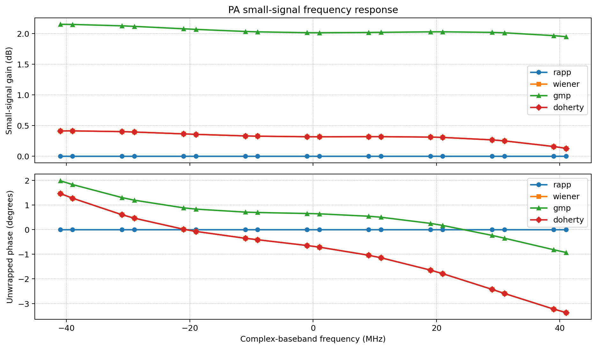
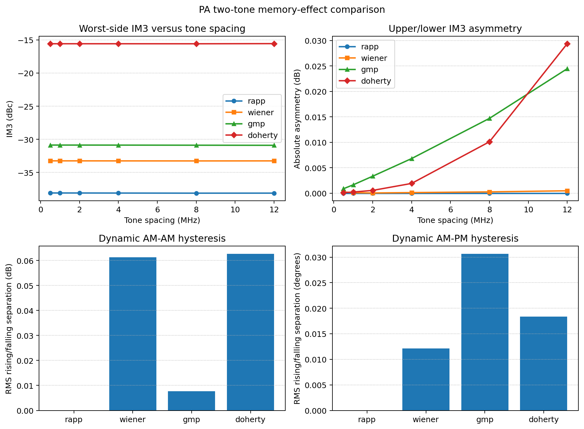
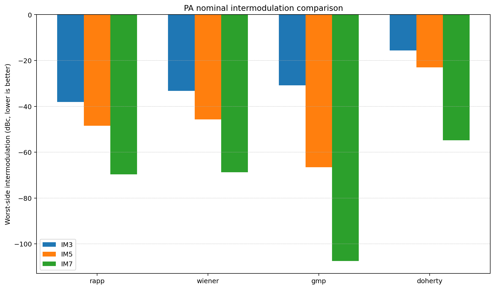
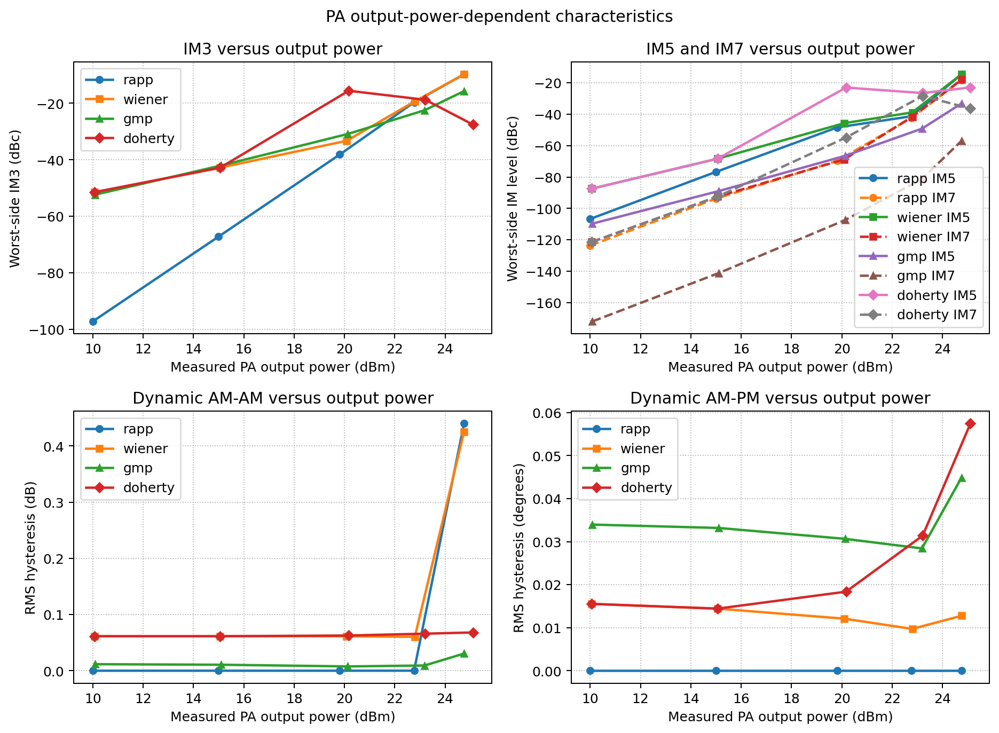
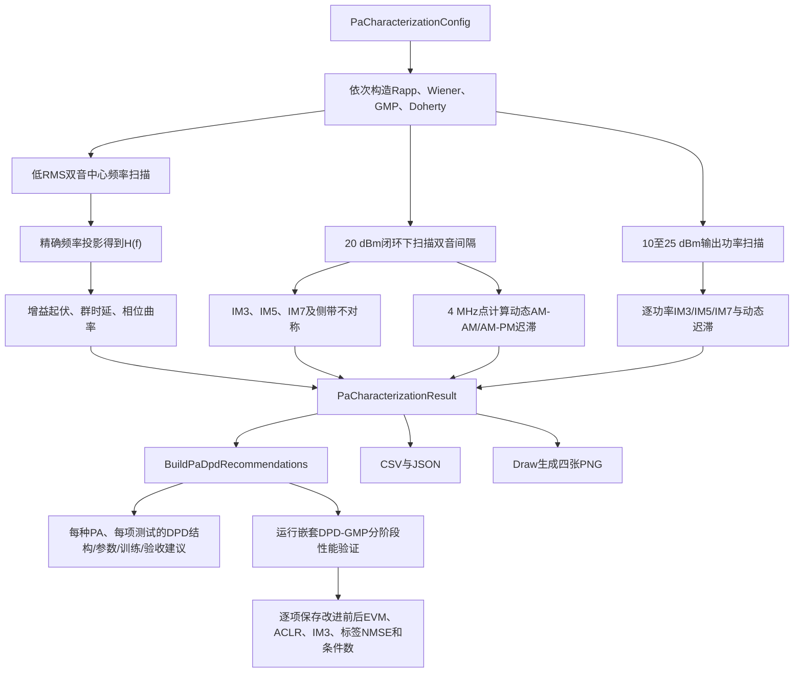
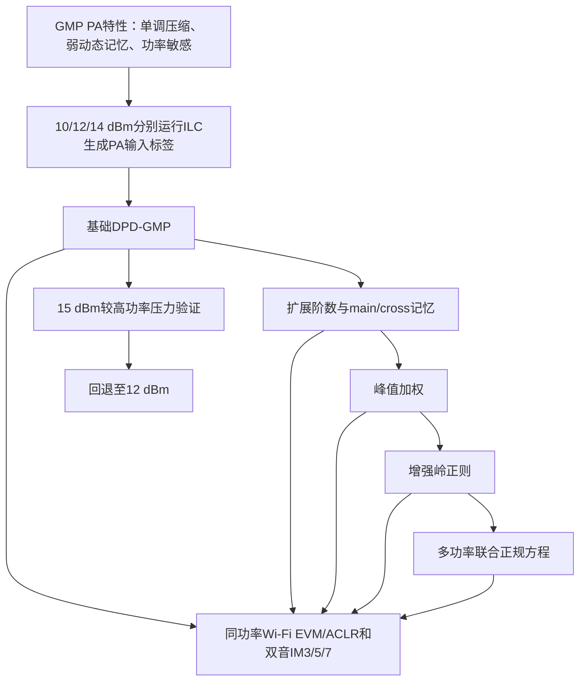
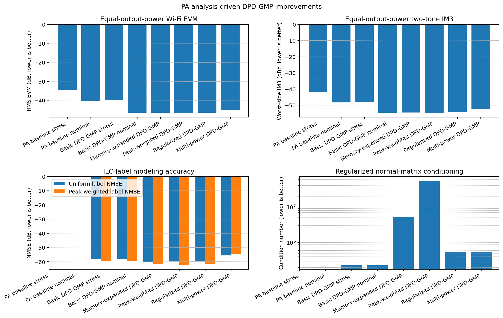

# PA双音特性分析：频率响应、记忆效应与非线性

本文说明 `tests/BenchMark.py` 中 `RunPaCharacterizationBenchmark` 的测试原理、流程、参数、输出文件和参考仿真结果。PA特性测量核心不运行ILC，也不把某个PA当成其他PA的参考；它用相同的双音激励与功率定义分别测量Rapp、Wiener、GMP和Doherty模型，从而回答四个问题。Rapp是严格无记忆的固态PA参考模型，用于验证其余模型测得的频响、迟滞和间隔敏感性是否确实来自记忆。特性测量完成后，默认再运行一条相互独立的DPD-GMP/ILC标签性能基准，把测量结论转换为逐项可验证的改进：

1. 小信号复增益是否随频率变化？
2. 非线性互调是否随双音间隔变化，并出现上下侧带不对称？
3. 同一输入包络幅度在上升和下降过程中是否产生不同的AM-AM或AM-PM响应？
4. 从低输出功率进入压缩区和额定功率附近时，上述非线性与记忆指标如何变化？

这些量分别反映线性记忆、频域非平坦性、非线性记忆和动态迟滞。测试得到的是本工程默认行为模型的特性，不是某一颗真实PA器件的保证值。

---

## 1. 为什么用双音测试PA

双音复基带信号为

```math
x[n]
=
A_1\exp\left(
j2\pi f_1\frac{n}{f_s}+j\phi_1
\right)
+
A_2\exp\left(
j2\pi f_2\frac{n}{f_s}+j\phi_2
\right).
```

它同时提供两类信息：

- 两个已知离散频率可以像两根“探针”一样测量复增益；
- 两个音调相加会形成周期性包络，非线性PA会产生IM3、IM5和IM7，并让包络经历反复上升与下降。

与宽带随机信号相比，双音的每个频率和互调位置都可以精确投影，不需要把能量归入最近FFT栅格；与单音相比，它能暴露非线性记忆和侧带不对称。

---

## 2. 小信号频率响应

### 2.1 扫描方法

频响测试把输入RMS设为0.05，使Doherty峰值支路保持关闭，并尽量让所有模型工作在线性小信号区。对每个中心频率 $f_c$，产生间隔固定为 $\Delta f_{\mathrm{FR}}$ 的两个音调：

```math
f_1=f_c-\frac{\Delta f_{\mathrm{FR}}}{2},
\qquad
f_2=f_c+\frac{\Delta f_{\mathrm{FR}}}{2}.
```

该测试不执行输出功率闭环。如果每个频点都强制得到相同输出功率，闭环会反向改变输入幅度，从而掩盖真实增益起伏。所有PA使用相同小信号输入RMS，频率响应才可直接比较。

### 2.2 精确频率投影

对长度为 $N$ 的稳态记录和窗函数 $w[n]$，频率 $f$ 处的复系数为

```math
C_z(f)
=
\frac{
\sum_{n=0}^{N-1}
w[n]z[n]\exp\left(-j2\pi f n/f_s\right)
}{
\sum_{n=0}^{N-1}w[n]
}.
```

输入和输出分别投影后，小信号复频响为

```math
H(f)
=
\frac{C_y(f)}{C_x(f)}.
```

增益和相位为

```math
G_{\mathrm{dB}}(f)
=
20\log_{10}|H(f)|,
```

```math
\phi(f)=\mathrm{unwrap}\left(\angle H(f)\right).
```

代码把每个双音中心的两个实际音调都保存为频响点，因此默认9个中心产生18个频率样点。

### 2.3 增益起伏、群时延和相位非线性

增益峰峰值定义为

```math
G_{\mathrm{ripple}}
=
\max_f G_{\mathrm{dB}}(f)
-\min_f G_{\mathrm{dB}}(f).
```

对展开相位做一次直线拟合

```math
\phi_{\mathrm{fit}}(f)=a f+b.
```

平均群时延为

```math
\tau_g=-\frac{a}{2\pi}.
```

从相位中减去直线后，剩余峰峰值表示相位曲率：

```math
\phi_{\mathrm{NL}}
=
\max_f\left(
\phi(f)-\phi_{\mathrm{fit}}(f)
\right)
-
\min_f\left(
\phi(f)-\phi_{\mathrm{fit}}(f)
\right).
```

群时延主要反映平均斜率；相位非线性则反映不能被单一纯时延解释的频率选择性。



**图1说明：**上图比较增益，下图比较展开相位。Rapp曲线理想平坦且相位为0，是无记忆基准；Wiener与Doherty在小信号区重合，是因为Doherty的Peaking支路尚未开启，其小信号响应只由Carrier支路决定。GMP的一阶记忆系数不同，因此增益和相位轨迹不同。

### 2.4 小信号频响测试后的DPD建议

频响测试首先决定DPD是否需要独立线性均衡器，以及线性均衡器应与非线性模型串联还是联合辨识。默认结果对应以下初始设计：

| PA | 测试结论 | 针对性DPD结构与初始参数 | 训练和验收建议 |
|---|---|---|---|
| Rapp | 增益起伏、群时延和相位曲率在浮点误差内均为0；基础PA没有需要均衡的频响 | 使用无延迟的幅度LUT或奇数阶静态多项式，不添加FIR；只有外部Channel或实测链路出现频响时才另加线性均衡器 | 先验证低功率频响接近常数，再跳过FIR辨识，直接训练静态AM-AM逆；若加入延迟项后验证性能没有改善，应删除这些不可观测自由度 |
| Wiener | 增益起伏0.285 dB，相位曲率0.629度；存在短FIR线性记忆，但带内变化较平缓 | 先使用5抽头复FIR逆均衡，再串联奇数阶Memory Polynomial；中心抽头归一化，其余抽头做能量正则化 | 在RMS 0.05小信号下先估计并冻结FIR，再到目标功率训练非线性项。独立频扫要求剩余增益起伏不超过0.10 dB、相位曲率不超过0.50度 |
| GMP | 增益起伏0.201 dB、群时延0.080 ns、相位曲率0.570度；存在可测但较浅的一阶动态记忆 | 先使用3至5抽头复FIR，或保留GMP的一阶主记忆项；只有独立验证仍有系统性残差时才扩到7抽头 | 用多音或宽带波形覆盖带边，采用岭正则联合求解线性项和非线性项；必须保留未参与拟合的带边频点做验证 |
| Doherty | 小信号结果与Wiener重合，只代表Carrier支路，不能代表Peaking开启后的复增益 | 低功率使用5抽头Carrier逆均衡作为初始化；Peaking开启后切换为功率条件化FIR加分段非线性DPD | 至少分别在Peaking关闭和开启两个功率区重新辨识，不能把小信号逆响应直接用于全部输出功率 |

这里不建议盲目增加FIR长度。抽头过多会使线性均衡器与GMP的一阶记忆列高度相关，从而增大条件数并放大反馈噪声。应从表中给出的初始长度开始，只在独立验证频扫仍存在系统性幅相残差时增加抽头。

---

## 3. 双音间隔扫描与频谱记忆效应

### 3.1 为什么改变音调间隔

无记忆非线性只依赖当前输入幅度。只要输入幅度统计与输出功率相同，改变双音间隔不会显著改变归一化互调。带记忆PA还依赖历史样值：

```math
y[n]
=
\mathcal P
\left(
x[n],x[n-1],x[n-2],\ldots
\right).
```

双音间隔越大，包络变化越快。若热效应、偏置网络、电路储能或行为模型的记忆抽头有影响，IM3会随间隔改变。

本测试使用对称双音

```math
f_1=-\frac{\Delta f}{2},
\qquad
f_2=+\frac{\Delta f}{2}.
```

对应IM3位置为

```math
f_{\mathrm{IM3,L}}
=
2f_1-f_2
=
-\frac{3\Delta f}{2},
```

```math
f_{\mathrm{IM3,U}}
=
2f_2-f_1
=
+\frac{3\Delta f}{2}.
```

IM5和IM7按相同奇数阶组合产生。`TwoToneAnalysis` 在精确频率上投影并报告相对于邻近基波的dBc：

```math
\mathrm{IM3}_{L}
=
10\log_{10}
\left(
\frac{|C_y(f_{\mathrm{IM3,L}})|^2}
{|C_y(f_1)|^2}
\right).
```

上侧公式相同，只需替换为上侧频率和上侧基波。

### 3.2 保持实际输出功率一致

非线性强度随PA工作点显著变化。若不同间隔或不同PA的输出功率不一致，IM3差异可能只是压缩程度不同，而不是记忆差异。因此每一个间隔点都执行输入驱动闭环：

```math
e_P^{(k)}
=
P_{\mathrm{target}}
-P_{\mathrm{measured}}^{(k)}.
```

闭环重新产生PA输入、运行PA并测量输出，直到

```math
\left|e_P^{(k)}\right|
\leq
0.25\ \mathrm{dB}.
```

默认目标是20 dBm，额定归一化参考是25 dBm。闭环只调整PA输入，不会在PA输出后乘常数伪造功率。

### 3.3 IM3间隔变化和上下侧带不对称

每个间隔取较差的一侧：

```math
\mathrm{IM3}_{\mathrm{worst}}
=
\max
\left(
\mathrm{IM3}_{L},
\mathrm{IM3}_{U}
\right).
```

间隔敏感度为

```math
\Delta_{\mathrm{spacing}}
=
\max_{\Delta f}
\mathrm{IM3}_{\mathrm{worst}}
-
\min_{\Delta f}
\mathrm{IM3}_{\mathrm{worst}}.
```

上下侧带不对称为

```math
A_{\mathrm{IM3}}(\Delta f)
=
\mathrm{IM3}_{U}(\Delta f)
-
\mathrm{IM3}_{L}(\Delta f).
```

纯静态、完全对称的无记忆多项式通常给出接近0 dB的不对称；频率选择性记忆和包络交叉项会使两侧经历不同的复增益。

### 3.4 双音间隔测试后的DPD建议

间隔扫描决定是否需要GMP交叉记忆项，以及记忆深度是否必须覆盖更快的包络变化。默认20 dBm结果给出：

| PA | 测试结论 | 针对性DPD结构与初始参数 | 训练和验收建议 |
|---|---|---|---|
| Rapp | IM3间隔变化0.031 dB、最大上下侧差约0 dB；微小变化来自有限记录投影而不是模型状态 | 使用严格无记忆LUT或主记忆深度1、交叉深度0的静态多项式 | 多个间隔只用于验证“不随间隔变化”，不应把所有间隔重复用于估计延迟项；验收要求IM3间隔变化和侧带不对称均小于0.10 dB |
| Wiener | IM3间隔变化0.013 dB，最大不对称接近0 dB，非线性部分近似无记忆 | 使用奇数阶1/3/5/7、主记忆深度3的Memory Polynomial；初始不加入lagging/leading包络交叉项 | 用最小、4 MHz和最大间隔训练，并用其余间隔验证。若剩余IM3间隔变化仍小于0.5 dB，不应为了模型复杂度加入GMP交叉项 |
| GMP | IM3间隔变化0.038 dB、最大不对称0.024 dB；默认零和记忆残差只产生弱频率相关记忆 | 从1/3/5阶、主记忆深度3、交叉深度1的浅GMP开始；不要仅因模型名为GMP就直接扩到深度5至7 | 各间隔保持相同实际输出功率，用未参与拟合的中间间隔验证；只有残余间隔变化或侧带差稳定超过测量重复性时才增加lagging/leading深度，且IM5/IM7不能恶化超过1 dB |
| Doherty | IM3间隔变化0.022 dB、不对称0.029 dB；默认支路没有明显额外时延，但存在工作区切换 | 使用每个工作区奇数阶1/3/5/7、深度3的浅记忆模型，并在Carrier/Peaking区域之间使用连续平滑门控 | 除间隔扫描外增加Peaking开启附近的功率点；若真实硬件支路存在时延，再按实测结果增加支路专用记忆，不能仅依据本默认模型省略 |

关键原则是先由“间隔变化”和“侧带不对称”证明交叉记忆项确有必要，再增加模型自由度。当前默认GMP的0.038 dB与0.024 dB都很小，能证明实现中存在动态项，但不足以支持“必须使用深交叉记忆”的结论。否则GMP矩阵会包含大量弱可观测列，使ILC标签拟合和直接学习都更容易过拟合。

---

## 4. 动态AM-AM/AM-PM迟滞

仅看IM3仍可能遗漏时域记忆。默认在4 MHz双音间隔处，把实际PA输入与输出解码到内部浮点域，并定义瞬时复增益：

```math
g[n]=\frac{y[n]}{x[n]}.
```

输入归一化包络为

```math
a[n]
=
\frac{|x[n]|}{\max_m|x[m]|}.
```

代码排除包络低于峰值10%的样点，避免在双音过零处放大数值误差；再根据包络斜率把样点分为上升和下降两组：

```math
s[n]
=
\frac{d a[n]}{d n}.
```

对同一个幅度分箱 $b$，分别计算上升和下降轨迹的增益与相位。增益迟滞差为

```math
\Delta G_b
=
\mathrm{median}
\left(
20\log_{10}|g[n]|
\right)_{s[n]>0}
-
\mathrm{median}
\left(
20\log_{10}|g[n]|
\right)_{s[n]<0}.
```

相位使用单位复数的圆均值，避免正负180度边界错误。最终动态AM-AM和AM-PM分数为各有效幅度分箱差值的RMS：

```math
H_G
=
\sqrt{
\frac{1}{B}
\sum_{b=1}^{B}
\left(\Delta G_b\right)^2
},
```

```math
H_{\phi}
=
\sqrt{
\frac{1}{B}
\sum_{b=1}^{B}
\left(\Delta\phi_b\right)^2
}.
```

无记忆模型在同一幅度下只有一条轨迹，因此两个分数接近0。带记忆模型的上升与下降轨迹分离，形成动态迟滞环。



**图2说明：**左上为IM3随双音间隔的变化，右上为上下侧IM3绝对不对称；下方两图分别为动态AM-AM和AM-PM迟滞。Rapp提供接近0的无记忆数值基线；默认GMP仍能测到交叉记忆造成的非零侧带差和相位迟滞，但零和小记忆系数使这些效应保持在较弱水平，并非四项指标都最大。

### 4.1 动态迟滞测试后的DPD建议

频谱间隔变化描述“输出频谱是否依赖包络速度”，动态迟滞进一步回答“同一瞬时幅度是否因为上升或下降历史而需要不同逆响应”。因此两者应分别指导DPD：

| PA | 测试结论 | 针对性DPD结构与初始参数 | 训练和验收建议 |
|---|---|---|---|
| Rapp | 20 dBm下动态AM-AM约0.000002 dB、AM-PM约0度；上升和下降轨迹理论上完全重合 | 只使用当前样点幅度的静态逆，主记忆深度1、交叉深度0，关闭递归或包络状态支路 | 用相同幅度分箱验证上下行轨迹重合。若测得明显迟滞，应先检查Channel、热状态、同步和分箱误差，不能把它归因于基础Rapp方程 |
| Wiener | 动态AM-AM为0.061 dB、AM-PM为0.012度，迟滞很弱 | 保持静态逆加深度2至3的Memory Polynomial；所有延迟非线性项使用较强岭正则 | 对每个幅度箱平衡上升和下降样本。若验证迟滞仍低于0.10 dB和1度，不引入递归状态或大量交叉项 |
| GMP | 动态AM-AM为0.008 dB、AM-PM为0.031度，默认20 dBm下只有弱动态迟滞 | 保留浅lagging/leading支路用于捕获已知动态残差；不建议在没有验证收益时加入深交叉记忆或递归状态 | 训练集按幅度箱和包络方向均衡抽样；若浅模型的独立验证已低于0.10 dB和1度，就停止增加记忆自由度 |
| Doherty | 动态AM-AM为0.063 dB、AM-PM为0.018度；默认模型迟滞弱，但Peaking切换可能在真实硬件产生方向相关性 | 使用Carrier-only和Carrier+Peaking两个系数专家，以连续门函数平滑混合；初始每个专家深度3 | 在Peaking门限附近提高样本密度，并约束两套模型在边界处的函数值和一阶斜率连续，避免DPD自身制造迟滞环 |

对于当前默认GMP，20 dBm迟滞已远低于0.10 dB和1度门限，不能从这组数据推出还需要递归包络状态；应让扩展结构在独立EVM、间隔扫描或标签NMSE上证明收益。对于Doherty，重点仍不是无条件加深记忆，而是防止区域切换不连续。

---

## 5. 标称非线性比较

在4 MHz双音间隔和20 dBm实际PA输出功率下，比较四种PA的较差侧IM3、IM5和IM7：



**图3说明：**数值越负表示互调抑制越好。这里比较的是工程默认参数，不是四类PA模型的普遍优劣。Rapp展示纯静态软压缩；Doherty在20 dBm处已经开启Peaking支路，因此其互调不能由小信号Carrier响应单独预测。

### 5.1 标称非线性测试后的DPD建议

20 dBm标称点用于决定非线性阶数、是否需要分段模型，以及该工作点是否已经深到不适合直接求逆。

| PA | 测试结论 | 针对性DPD结构与初始参数 | 训练和验收建议 |
|---|---|---|---|
| Rapp | IM3/IM5/IM7为-38.11/-48.43/-69.73 dBc，属于温和静态压缩且没有AM-PM | 使用单调幅度LUT，或1/3/5/7阶、深度1的静态多项式；不需要共轭或延迟支路 | 对输入幅度分箱均衡采样，在饱和斜率趋近0之前停止求逆；同功率验收要求IM3至少改善10 dB且IM5/IM7不退化超过1 dB |
| Wiener | IM3/IM5/IM7分别为-33.25/-45.73/-68.77 dBc，属于中等非线性且阶次衰减正常 | 采用1/3/5/7阶、深度3的Memory Polynomial或GMP；若独立验证中IM7始终远低于目标，可删去7阶降低复杂度 | 在20 dBm辨识，再加入23至25 dBm峰值样本；同功率验收要求IM3至少改善10 dB，IM5/IM7不得恶化超过1 dB |
| GMP | IM3/IM5/IM7为-30.87/-66.53/-107.45 dBc；20 dBm属于中等、单调的Rapp型压缩，且高阶互调按阶次快速衰减 | 从正则化1/3/5阶、主深度3、交叉深度1的浅GMP开始，并保留输入峰值投影；只有标签或独立射频验证表明欠拟合时再加入7阶和更深记忆 | 可在12至20 dBm建立局部逆，再用独立帧按相同输出功率验证；当前12 dBm基准实测IM3改善6.28 dB，不能把未实测的20 dBm改善写成既定结论 |
| Doherty | IM3/IM5/IM7为-15.57/-23.03/-54.83 dBc，Peaking开启使全局单多项式难以同时拟合两个区域 | 使用Carrier/Peaking分段DPD，例如平滑LUT负责主AM-AM/AM-PM，再由每区1/3/5/7阶GMP修正残差 | 对Peaking开启前、过渡区和开启后平衡取样，联合优化两区并惩罚边界不连续；验收需同时观察三个互调阶次，不能只优化IM3 |

所有互调改善都必须在相同实测PA输出功率下比较。若把PA输出乘一个常数后再比较，虽然基波和互调的绝对电平一起变化，但并没有改变PA内部压缩状态，不能证明DPD有效。

---

## 6. 输出功率扫描

单一20 dBm工作点不能代表完整AM-AM/AM-PM与互调特性。功率扫描固定双音间隔为4 MHz，依次把每个PA闭环到

```math
P_{\mathrm{target}}
\in
\left\{
10,\ 15,\ 20,\ 23,\ 25
\right\}
\ \mathrm{dBm}.
```

每个功率点都重新运行PA输入闭环，并保存实际测得的 $P_{\mathrm{measured}}$。因此横坐标使用实际输出功率，而不是只使用用户给出的目标值。每个点重新计算：

- 较差侧IM3、IM5和IM7；
- 动态AM-AM迟滞 $H_G$；
- 动态AM-PM迟滞 $H_{\phi}$。

功率升高时，PA包络进入更强压缩区。一般会观察到互调接近基波、AM-AM压缩增强、AM-PM变化增大；但带多个非线性支路的行为模型也可能在某些功率点发生系数抵消，所以曲线不要求严格单调。



**图4说明：**左上为IM3，右上为IM5和IM7；下方为动态AM-AM和AM-PM迟滞。Rapp的互调随压缩增强，但AM-PM始终为0；Wiener在接近25 dBm时压缩迅速增强；GMP的IM3从10至25 dBm单调接近基波，而按每阶稳态系数比例缩放的动态项使AM-AM和AM-PM迟滞在整个扫描内保持较弱；Doherty在Peaking开启前与Wiener一致，开启后形成独立的功率变化轨迹。Rapp在25 dBm出现的非零AM-AM“迟滞”来自固定宽度幅度分箱内的曲线陡峭度和有限样点分布，不是模型获得了历史状态。

### 6.1 输出功率测试后的DPD建议

功率扫描用于决定单一系数集是否足够、系数锚点放在哪里，以及最大部署功率是否已经越过稳定可逆区。

| PA | 测试结论 | 针对性DPD结构与初始参数 | 训练和验收建议 |
|---|---|---|---|
| Rapp | 约22.77 dBm跨过-30 dBc IM3门限；25 dBm时IM3约-9.74 dBc，接近饱和后逆函数斜率病态 | 在整个可逆功率范围共享一个静态LUT或深度1多项式；只把10/15/20/23/25 dBm作为覆盖与验收锚点，不为固定Rapp参数建立无意义的记忆系数库 | 对接近膝点的幅度箱加权并限制最大驱动；若目标输出已经进入近饱和区，应执行输出回退，而不是用更高阶或更大输入峰值强行求逆 |
| Wiener | 首个明显强失真点约22.80 dBm；25 dBm时IM3升到-9.74 dBc、动态AM-AM增至0.425 dB | 使用功率条件化Memory Polynomial，在10、15、20、23、25 dBm建立系数锚点并在锚点间插值；23 dBm以上加强峰值限制 | 20 dBm作为主训练点，22至25 dBm增加样本权重。若25 dBm的DPD输入峰值或EVM发散，应把额定部署点限制在可验证区而不是外推系数 |
| GMP | 首个强失真采样点为23.18 dBm，此时IM3为-22.48 dBc；25 dBm附近IM3为-15.70 dBc、动态AM-PM仅0.045度，且IM3功率趋势单调 | 10至20 dBm可先验证一个浅GMP系数集；若部署范围覆盖23至25 dBm，再使用按实测输出功率和包络RMS索引的系数库并约束相邻系数平滑 | 先在12或20 dBm建立稳定模型，再逐级验证23和25 dBm；只有跨功率独立EVM或ACLR确实退化时才引入多功率模型，不能由PA名称直接推定必须分库 |
| Doherty | 约20.17 dBm进入强失真，IM3随后呈非单调变化，说明Carrier与Peaking的复数合成和负载调制发生区域变化 | 使用Carrier-only与Carrier+Peaking混合专家，在约19、20、21 dBm加密系数锚点，再覆盖23和25 dBm；门函数应与Peaking实际开启点对齐 | 所有功率点联合训练但对过渡区加权，约束相邻功率系数和输出斜率连续；不能把25 dBm处偶然IM3抵消误认为宽带EVM也会改善 |

统一验收规则是：在每个配置功率点重新闭环到相同实测dBm，双音侧要求IM3/IM5/IM7不退化，Wi-Fi侧要求EVM和最差ACLR同时改善，且DPD输入峰值不超过硬件和定点接口允许范围。系数只能在已经测量的功率范围内插值，不应向范围外外推。

---

## 7. 测试流程



**图5说明：**频响路径保持共同低功率输入，避免功率闭环掩盖增益起伏；非线性与记忆路径保持共同实际输出功率，避免工作点差异污染IM对比。功率扫描则主动改变共同工作点，观察特性随输出功率的变化。测量完成后，Benchmark按照实测阈值和PA架构生成DPD结构、初始参数、训练方法与验收门限，并在 `dpd_gmp` 子目录运行可量化的DpdGmp改进验证；`Draw.py`仍只读取结果并生成图像。

---

## 8. 默认测试参数

| 参数 | 默认值 | 作用 |
|---|---:|---|
| `sampleRateHz` | 200 MHz | 复基带采样率 |
| `frequencyCentersHz` | -40 MHz至+40 MHz，共9点 | 小信号双音中心频率 |
| `frequencyToneSpacingHz` | 2 MHz | 频响扫描时两个探针的间隔 |
| `memoryToneSpacingsHz` | 0.5、1、2、4、8、12 MHz | 非线性记忆扫描 |
| `dynamicToneSpacingHz` | 4 MHz | 动态迟滞统计点 |
| `powerSweepDbm` | 10、15、20、23、25 dBm | 固定4 MHz双音间隔的输出功率扫描点 |
| `numSamples` | 16384 | 每次双音记录长度 |
| `settlingSamples` | 256 | 频率投影前从两端丢弃的样点 |
| `smallSignalRmsLevel` | 0.05 | 小信号频响的共同输入RMS |
| `nonlinearRmsLevel` | 0.5 | 功率闭环前的双音初始RMS |
| `outputPowerDbm` | 20 dBm | 每个记忆扫描点的实际PA输出目标 |
| `maximumOutputPowerDbm` | 25 dBm | 归一化满量程功率参考 |
| `loadResistanceOhm` | 50 Ω | dBm/RMS换算端口 |
| `width` | 0 | 文档参考结果使用浮点公开接口 |
| `paModelNames` | Rapp、Wiener、GMP、Doherty | 被测PA集合 |
| `runDpdGmpBenchmark` | `True` | PA特性测试结束后运行嵌套DPD-GMP改进测试 |

---

## 9. 典型使用方式

### 9.1 命令行

```powershell
python tests/BenchMark.py --pa-analyse --output-dir results/pa_characterization
```

`--pa-analyse` 固定比较全部四种PA，而不是只测试 `--pa` 选中的单一模型。可以继续使用 `--sample-rate-hz`、`--tone-samples`、`--width`、`--output-power-dbm`、`--maximum-output-power-dbm` 和 `--load-resistance-ohm` 覆盖共同测试条件。

### 9.2 Python接口

```python
from pathlib import Path

from tests.BenchMark import (
    PaCharacterizationConfig,
    RunPaCharacterizationBenchmark,
)

result = RunPaCharacterizationBenchmark(
    PaCharacterizationConfig(
        outputPowerDbm=20.0,
        powerSweepDbm=(10.0, 15.0, 20.0, 23.0, 25.0),
        width=0,
        outputDirectory=Path("results/pa_characterization"),
    )
)

for summary in result.summaries:
    print(summary.ToDict())

for recommendation in result.recommendations:
    print(recommendation.ToDict())
```

---

## 10. 输出文件

| 文件 | 内容 |
|---|---|
| `pa_frequency_response.csv` | 每个PA、每个实际音调频率的增益和展开相位 |
| `pa_memory_effect.csv` | 每个PA、每个双音间隔的实际输出功率和IM3/IM5/IM7 |
| `pa_power_sweep.csv` | 每个PA、每个目标/实际输出功率的互调和动态迟滞 |
| `pa_characterization_summary.csv` | 每个PA的一行汇总特征 |
| `pa_dpd_recommendations.csv` | 每种PA在频响、间隔记忆、动态迟滞、标称非线性和输出功率测试后的DPD结构、参数、训练与验收建议 |
| `pa_characterization.json` | 完整配置、全部原始点、汇总结果和DPD建议 |
| `pa_frequency_response.png` | 小信号增益/相位双图 |
| `pa_memory_effect.png` | IM3间隔变化、侧带不对称和动态迟滞四图 |
| `pa_nonlinearity_comparison.png` | 标称IM3/IM5/IM7分组柱状图 |
| `pa_power_characteristics.png` | IM3/IM5/IM7和动态迟滞随实际输出功率变化的四联图 |
| `dpd_gmp/dpd_gmp_stage_metrics.csv` | DPD-GMP各改进阶段的射频与训练指标 |
| `dpd_gmp/dpd_gmp_improvement_comparison.csv` | 每项改进措施的前后数值、方向和通过状态 |
| `dpd_gmp/dpd_gmp_benchmark.json` | DPD-GMP完整配置、阶段和比较记录 |
| `dpd_gmp/dpd_gmp_performance.png` | DPD-GMP的EVM、IM3、标签NMSE和条件数四联图 |

本文引用的可复现数据和图表保存在 `doc/images/pa_analyse`。

---

## 11. 测试结果

以下结果由默认配置生成。所有非线性指标均在20 dBm目标下测量；各间隔点实际功率误差均不超过0.25 dB。

| PA模型 | 平均小信号增益(dB) | 增益起伏(dB) | 群时延(ns) | 相位曲率(度) | IM3间隔变化(dB) | 最大IM3不对称(dB) | 动态AM-AM迟滞(dB) | 动态AM-PM迟滞(度) |
|---|---:|---:|---:|---:|---:|---:|---:|---:|
| Rapp | 0.000 | 0.000 | 0.000 | 0.000 | 0.031 | 0.000 | 0.000002 | 0.000 |
| Wiener | 0.315 | 0.285 | 0.148 | 0.629 | 0.013 | 0.000 | 0.061 | 0.012 |
| GMP | 2.044 | 0.201 | 0.080 | 0.570 | 0.038 | 0.024 | 0.008 | 0.031 |
| Doherty | 0.315 | 0.285 | 0.148 | 0.629 | 0.022 | 0.029 | 0.063 | 0.018 |

4 MHz标称点的互调结果为：

| PA模型 | 实际输出功率(dBm) | IM3(dBc) | IM5(dBc) | IM7(dBc) |
|---|---:|---:|---:|---:|
| Rapp | 19.818 | -38.112 | -48.428 | -69.728 |
| Wiener | 20.095 | -33.254 | -45.730 | -68.770 |
| GMP | 20.129 | -30.873 | -66.535 | -107.454 |
| Doherty | 20.169 | -15.573 | -23.033 | -54.832 |

### 11.1 不同输出功率的参考结果

下表列出10、20和25 dBm三个代表点；完整五点结果位于 `pa_power_sweep.csv`。

| PA模型 | 目标功率(dBm) | 实际功率(dBm) | IM3(dBc) | IM5(dBc) | IM7(dBc) | 动态AM-AM(dB) | 动态AM-PM(度) |
|---|---:|---:|---:|---:|---:|---:|---:|
| Rapp | 10 | 9.999 | -97.174 | -106.716 | -123.623 | 0.000 | 0.000 |
| Rapp | 20 | 19.818 | -38.112 | -48.428 | -69.728 | 0.000002 | 0.000 |
| Rapp | 25 | 24.753 | -9.744 | -14.584 | -18.115 | 0.440 | 0.000 |
| Wiener | 10 | 10.063 | -51.463 | -87.443 | -121.364 | 0.061 | 0.016 |
| Wiener | 20 | 20.095 | -33.254 | -45.730 | -68.770 | 0.061 | 0.012 |
| Wiener | 25 | 24.754 | -9.743 | -14.578 | -18.099 | 0.425 | 0.013 |
| GMP | 10 | 10.087 | -52.342 | -109.684 | -171.989 | 0.012 | 0.034 |
| GMP | 20 | 20.129 | -30.874 | -66.537 | -107.458 | 0.008 | 0.031 |
| GMP | 25 | 24.753 | -15.700 | -33.177 | -57.005 | 0.031 | 0.045 |
| Doherty | 10 | 10.063 | -51.463 | -87.443 | -121.364 | 0.061 | 0.016 |
| Doherty | 20 | 20.169 | -15.574 | -23.032 | -54.839 | 0.063 | 0.018 |
| Doherty | 25 | 25.109 | -27.537 | -22.932 | -36.415 | 0.068 | 0.057 |

目标与实测最大绝对误差约为0.247 dB，满足默认0.25 dB闭环容限。Doherty在25 dBm处IM3比20 dBm更低，是Carrier、Peaking、合路系数和负载调制项在当前默认参数下发生复数抵消的结果；这不是“提高功率必然改善线性度”的一般规律。

### 11.2 结果解释

- Rapp输出逐样点独立、相位不变，因此频响、群时延、AM-PM迟滞和侧带不对称构成接近0的数值基线。它仍然是非线性模型，所以输出功率升高时IM3/IM5/IM7会明显恶化。
- Wiener含有短FIR线性记忆，因此频响并非完全平坦，但默认非线性是FIR之后的无记忆Rapp/AM-PM映射。它的IM3随间隔变化和上下侧不对称都很小。
- GMP默认配置把单调Rapp型稳态系数作为每一阶所有支路的系数和，再叠加较小的零和主记忆、滞后和超前残差。因此连续高幅平台的稳态响应不会随记忆深度重复压缩；间隔依赖、侧带不对称和动态迟滞都保持为弱但可测的非零量。
- Doherty小信号时Peaking关闭，所以频响与Carrier所用默认Wiener一致。20 dBm时Peaking参与合成并产生比单支路Wiener更强的互调；当前默认Peaking没有额外时延，故记忆指标仍较小。
- 默认GMP在20 dBm处为中等非线性，IM3为-30.87 dBc；到约23.18 dBm才进入本基准定义的强失真采样点。该结果只说明当前默认系数的行为，不表示GMP结构天然优于或劣于Wiener、Doherty。用实测PA拟合系数替换默认系数后，应重新生成全部表格。

---

## 12. PA特性分析后的DPD-GMP改进与实测对比

前面的PA分析不能停留在“建议增加阶数”这一层。`RunPaCharacterizationBenchmark` 默认继续调用 `RunDpdGmpBenchmark`，对默认GMP PA执行一条可复现的闭环：



**图6说明：**每个模型阶段都在DPD加PA的完整串联系统上重新闭环输入，PA输出不做事后缩放。扩展结构、峰值加权、正则化和多功率训练分别针对不同问题，因此各自使用与设计目标一致的验收指标。

### 12.1 共同测试条件

| 条目 | 默认值 |
|---|---:|
| PA | `PaModel(modelName="gmp", width=0)` |
| Wi-Fi | EHT、20 MHz、80 MS/s、MCS 7、4个数据符号、seed 321 |
| 双音 | -2 MHz和+2 MHz、8192点 |
| ILC标签功率 | 10、12、14 dBm |
| 标称优化功率 | 12 dBm |
| 较高功率压力点 | 15 dBm |
| ILC迭代 | 8轮 |
| 满量程功率 | 25 dBm |
| 端口 | 50 Ω |

12 dBm是当前基准的标称训练点，15 dBm是同一系数结构的较高功率压力点。第6节的新功率扫描显示默认GMP到20.13 dBm时IM3仍为-30.87 dBc，首个强失真采样点在23.18 dBm；因此12和15 dBm都处于单调、可稳定求逆的区域。二者的比较用于量化功率回退带来的误差裕量，不再用来证明15 dBm已经深压缩。

### 12.2 全阶段结果



**图7说明：**左上为同输出功率Wi-Fi EVM，右上为同输出功率双音IM3，左下为ILC标签普通/峰值加权NMSE，右下为正则矩阵条件数。两条PA baseline没有标签和系数，所以后两类值为空。条件数使用对数坐标。

| 阶段 | 实测输出(dBm) | EVM(dB) | ACLR(dB) | IM3(dBc) | 12 dBm标签NMSE(dB) |
|---|---:|---:|---:|---:|---:|
| PA baseline stress | 15.108 | -34.646 | 32.712 | -42.041 | — |
| PA baseline nominal | 12.095 | -40.545 | 33.332 | -48.280 | — |
| Basic DPD-GMP stress | 15.095 | -39.732 | 33.077 | -48.039 | -58.183 |
| Basic DPD-GMP nominal | 12.086 | -46.460 | 33.487 | -54.562 | -58.183 |
| Memory-expanded DPD-GMP | 12.086 | -46.557 | 33.480 | -54.498 | -60.035 |
| Peak-weighted DPD-GMP | 12.086 | -46.580 | 33.479 | -54.706 | -59.724 |
| Regularized DPD-GMP | 12.086 | -46.485 | 33.475 | -54.271 | -59.563 |
| Multi-power DPD-GMP | 12.088 | -45.007 | 33.475 | -52.534 | -55.607 |

这张表不能按单一纵轴从上到下选“最好模型”。后续阶段有意改变目标：Memory-expanded追求结构表达能力，Peak-weighted追求峰值误差，Regularized追求数值稳定，Multi-power追求多个工作点的最差性能。

### 12.3 改进一：建立基础局部逆

**PA依据：**默认GMP的稳态AM-AM在声明的归一化幅度范围内单调，12 dBm也远低于23.18 dBm强失真采样点，因此局部映射可稳定求逆。

**具体方法：**

```python
basicDpd = DpdGmp(
    parameters={
        "nonlinearOrders": (1, 3, 5),
        "memoryDepth": 3,
        "crossMemoryDepth": 1,
        "ridgeFactor": 1.0e-5,
        "peakWeightExponent": 0.0,
        "maximumOutputMagnitude": 1.5,
        "width": 0,
    }
)
basicDpd.FitFromIlc(reference12Dbm, learnedInput12Dbm)
```

**前后比较：**

| 目标指标 | PA baseline 12 dBm | Basic DPD-GMP 12 dBm | 改善 | 是否符合预期 |
|---|---:|---:|---:|---|
| Wi-Fi EVM | -40.545 dB | -46.460 dB | 5.915 dB | 是，EVM更负 |
| 双音IM3 | -48.280 dBc | -54.562 dBc | 6.281 dB | 是，IM3更负 |
| ACLR | 33.332 dB | 33.487 dB | 0.156 dB | 是，ACLR更高 |

Wi-Fi训练的系数在没有双音重训练的情况下仍改善IM3，说明模型学到的是PA局部逆，而不只是记住一组Wi-Fi样点。

### 12.4 改进二：较高功率压力点执行输出回退

**PA依据：**功率扫描中15.10 dBm的IM3为-42.01 dBc，仍未进入深压缩，但相较12 dBm有更大的非线性误差。降低输出功率会同时增加局部斜率裕量和峰值余量，因此应能进一步降低EVM。

**具体方法：**保持基础DPD结构不变，只把完整DPD加PA串联系统的目标输出由15 dBm降到12 dBm，再由 `PowerCalibration` 重新调整DPD之前的输入。不能把15 dBm PA输出直接缩小后冒充12 dBm结果。

**前后比较：**

| 指标 | Basic DPD 15 dBm | Basic DPD 12 dBm | 改善 | 是否符合预期 |
|---|---:|---:|---:|---|
| Wi-Fi EVM | -39.732 dB | -46.460 dB | 6.728 dB | 是 |
| ACLR | 33.077 dB | 33.487 dB | 0.411 dB | 是 |

在15 dBm处，基础DPD仍把同功率PA baseline的EVM从-34.646 dB改善到-39.732 dB，说明该点可由当前受限结构稳定补偿。回到12 dBm后的额外改善证明的是功率回退收益，而不是15 dBm不可逆。

### 12.5 改进三：扩展非线性和交叉记忆

**PA依据：**默认GMP的IM3间隔变化只有0.038 dB、最大上下侧不对称0.024 dB、动态AM-PM迟滞0.031度，属于弱记忆。扩展结构在这里是受控的模型容量实验，而不是由强迟滞强制得出的结构需求。

**具体方法：**

```text
nonlinearOrders:    (1,3,5) -> (1,3,5,7)
memoryDepth:        3 -> 5
crossMemoryDepth:   1 -> 3
ridgeFactor:        保持1e-5
training power:     保持12 dBm
```

系数数量按

```math
K=QM+2(Q-1)ML
```

从较小结构扩展到能表示更多lagging/leading包络历史的结构。

**前后比较：**

| 目标指标 | Basic | Memory-expanded | 改善 | 是否符合预期 |
|---|---:|---:|---:|---|
| 12 dBm标签NMSE | -58.183 dB | -60.035 dB | 1.852 dB | 是，表达能力提高 |
| Wi-Fi EVM | -46.460 dB | -46.557 dB | 0.097 dB | 小幅改善 |

本项预期是“更准确描述ILC标签”，不是保证射频指标同比例下降。标签NMSE改善1.852 dB，而EVM只改善0.097 dB，符合默认记忆较弱的测量事实，也说明继续增加结构的边际射频收益已经很小。

### 12.6 改进四：对OFDM峰值加权

**PA依据：**功率扫描显示高包络区压缩显著，但普通MSE主要由数量更多的中低幅度样点决定。

**具体方法：**保持扩展结构，设置

```python
peakWeightExponent = 2.0
ridgeFactor = 1.0e-6
```

每个样点的附加权重为

```math
w_n
=
\left[
\max
\left(
\frac{|x[n]|}{\max_r|x[r]|},
0.05
\right)
\right]^2.
```

**前后比较：**

| 目标指标 | Memory-expanded | Peak-weighted | 改善 | 是否符合预期 |
|---|---:|---:|---:|---|
| 峰值加权标签NMSE | -61.796 dB | -62.305 dB | 0.508 dB | 是 |
| 普通标签NMSE | -60.035 dB | -59.724 dB | -0.311 dB | 允许的权衡 |

峰值目标改善而普通目标略退化，方向与加权方法完全一致。若只看普通NMSE，会错误判断峰值加权无效。

### 12.7 改进五：增强岭正则以降低系数敏感度

**PA依据：**扩展后的高阶、主记忆和交叉记忆列高度相关，峰值加权又减少了低幅度样点的有效贡献，因此正规方程容易病态。

**具体方法：**保持结构和峰值权重不变，只把

```text
ridgeFactor: 1e-6 -> 1e-4
```

正则矩阵为

```math
\mathbf R_{\lambda}
=
\mathbf Z^H\mathbf W\mathbf Z
+
\lambda\alpha\mathbf I.
```

**前后比较：**

| 目标指标 | Peak-weighted | Regularized | 改善 | 是否符合预期 |
|---|---:|---:|---:|---|
| 条件数 | `5.435e7` | `5.481e5` | 降低约99.2倍，19.964 dB | 是 |
| 系数稳定目标 | 弱正则 | 强正则 | 对噪声更不敏感 | 是 |
| Wi-Fi EVM | -46.580 dB | -46.485 dB | -0.095 dB | 允许的小幅代价 |

本项设计目标是稳定性。训练误差或即时EVM的小幅牺牲不能否定条件数降低；应进一步用重复采集和定点量化验证系数方差。

### 12.8 改进六：多功率联合训练

**PA依据：**第6节表明默认GMP的IM3随功率单调变化。10、12、14 dBm虽然都处于可逆区，但联合训练仍可检验一个系数集能否改善跨功率最差标签误差；是否值得采用必须由收益与单点代价共同决定。

**具体方法：**分别运行三个功率的ILC，得到独立标签；不拼接波形历史，只累加三个片段的正规方程：

```python
multiPowerDpd.FitSegments(
    referenceSignals=(
        reference10Dbm,
        reference12Dbm,
        reference14Dbm,
    ),
    targetSignals=(
        learnedInput10Dbm,
        learnedInput12Dbm,
        learnedInput14Dbm,
    ),
    segmentWeights=(1.0, 2.0, 1.0),
)
```

12 dBm权重为2，保留主工作点优先级；10和14 dBm各为1，用于限制工作范围边缘的误差。

**前后比较：**

| 目标指标 | 单功率Regularized | Multi-power | 改善 | 是否符合预期 |
|---|---:|---:|---:|---|
| 10/12/14 dBm最差标签NMSE | -45.427 dB | -47.753 dB | 2.326 dB | 是 |
| 10/12/14 dBm最差ACLR | 33.265 dB | 33.275 dB | 0.010 dB | 是，但裕量很小 |
| 10/12/14 dBm最差EVM | -42.170 dB | -41.015 dB | -1.154 dB | 跨功率EVM折中 |
| 12 dBm EVM | -46.485 dB | -45.007 dB | -1.478 dB | 单点性能折中 |

多功率模型改善了预先声明的最差标签NMSE，最差ACLR也仅提高0.010 dB；与此同时最差EVM和12 dBm单点EVM都退化。这不是“全面更好”，而是当前1/2/1权重下的明确折中。这说明下一步有两种选择：

1. 若系统必须使用一个系数集覆盖全部功率，保留联合训练并调整1/2/1权重；
2. 若允许按功率切换系数，建立10、12、14 dBm系数库并在相邻锚点平滑插值，可避免单一系数集的折中。

### 12.9 自动验收规则

`dpd_gmp_improvement_comparison.csv` 对每项措施保存：

- 改进名称；
- 前后阶段；
- 唯一目标指标；
- 改进前值和改进后值；
- 预期方向；
- 正向改善量；
- `expectationMet` 布尔结果；
- 可直接复现的参数变化说明。

默认八项检查全部为 `True`。任何PA参数、采样率、训练功率或随机种子变化后，都必须重新运行，而不能继续引用本文默认数值。

完整系数更新推导见 [DPD-GMP.md](./DPD-GMP.md)，类参数和调用方式见 [DpdGmp.md](./DpdGmp.md)。

---

## 13. 测试边界

1. 频响是复基带等效响应，不包含射频载波、匹配网络S参数或天线响应。
2. 双音间隔扫描能够显示记忆，但不能唯一判断记忆来自热效应、偏置网络、陷波器、负载调制还是数字滤波；需要结合器件结构和更多测试。
3. 当前Doherty是行为级Carrier/Peaking模型，不求解晶体管电流、四分之一波长阻抗变换器或有源负载牵引。
4. 动态迟滞分数依赖选择的输出功率、双音间隔和幅度分箱，适合在相同配置下比较，不应脱离测试条件单独引用。
5. 实际仪表测试应保证两个基波和IM7都位于采集带宽内，并把反馈链自身的频响、噪声和非线性从PA结果中分离。
6. 功率闭环容限会导致横坐标与目标值存在小偏差，所以曲线和CSV均保留实测功率；比较非常接近的功率点时应进一步收紧容限并增加仪表平均。
