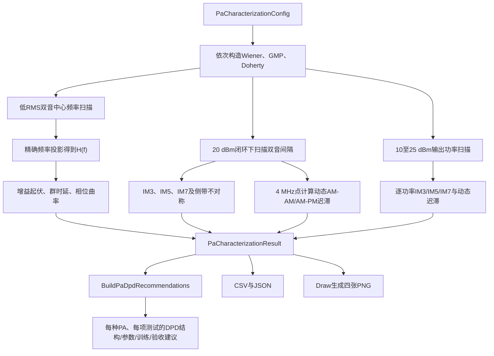

# PA双音特性分析：频率响应、记忆效应与非线性

本文说明 `tests/BenchMark.py` 中 `RunPaCharacterizationBenchmark` 的测试原理、流程、参数、输出文件和参考仿真结果。该场景不运行ILC，也不把某个PA当成其他PA的参考；它用相同的双音激励与功率定义分别测量Wiener、GMP和Doherty模型，从而回答三个问题：

1. 小信号复增益是否随频率变化？
2. 非线性互调是否随双音间隔变化，并出现上下侧带不对称？
3. 同一输入包络幅度在上升和下降过程中是否产生不同的AM-AM或AM-PM响应？
4. 从低输出功率进入压缩区和额定功率附近时，上述非线性与记忆指标如何变化？

这些量分别反映线性记忆、频域非平坦性、非线性记忆和动态迟滞。测试得到的是本工程默认行为模型的特性，不是某一颗真实PA器件的保证值。

---

## 1. 为什么用双音测试PA

双音复基带信号为

```math
x[n]
=
A_1\exp\left(
j2\pi f_1\frac{n}{f_s}+j\phi_1
\right)
+
A_2\exp\left(
j2\pi f_2\frac{n}{f_s}+j\phi_2
\right).
```

它同时提供两类信息：

- 两个已知离散频率可以像两根“探针”一样测量复增益；
- 两个音调相加会形成周期性包络，非线性PA会产生IM3、IM5和IM7，并让包络经历反复上升与下降。

与宽带随机信号相比，双音的每个频率和互调位置都可以精确投影，不需要把能量归入最近FFT栅格；与单音相比，它能暴露非线性记忆和侧带不对称。

---

## 2. 小信号频率响应

### 2.1 扫描方法

频响测试把输入RMS设为0.05，使Doherty峰值支路保持关闭，并尽量让所有模型工作在线性小信号区。对每个中心频率 $f_c$，产生间隔固定为 $\Delta f_{\mathrm{FR}}$ 的两个音调：

```math
f_1=f_c-\frac{\Delta f_{\mathrm{FR}}}{2},
\qquad
f_2=f_c+\frac{\Delta f_{\mathrm{FR}}}{2}.
```

该测试不执行输出功率闭环。如果每个频点都强制得到相同输出功率，闭环会反向改变输入幅度，从而掩盖真实增益起伏。所有PA使用相同小信号输入RMS，频率响应才可直接比较。

### 2.2 精确频率投影

对长度为 $N$ 的稳态记录和窗函数 $w[n]$，频率 $f$ 处的复系数为

```math
C_z(f)
=
\frac{
\sum_{n=0}^{N-1}
w[n]z[n]\exp\left(-j2\pi f n/f_s\right)
}{
\sum_{n=0}^{N-1}w[n]
}.
```

输入和输出分别投影后，小信号复频响为

```math
H(f)
=
\frac{C_y(f)}{C_x(f)}.
```

增益和相位为

```math
G_{\mathrm{dB}}(f)
=
20\log_{10}|H(f)|,
```

```math
\phi(f)=\mathrm{unwrap}\left(\angle H(f)\right).
```

代码把每个双音中心的两个实际音调都保存为频响点，因此默认9个中心产生18个频率样点。

### 2.3 增益起伏、群时延和相位非线性

增益峰峰值定义为

```math
G_{\mathrm{ripple}}
=
\max_f G_{\mathrm{dB}}(f)
-\min_f G_{\mathrm{dB}}(f).
```

对展开相位做一次直线拟合

```math
\phi_{\mathrm{fit}}(f)=a f+b.
```

平均群时延为

```math
\tau_g=-\frac{a}{2\pi}.
```

从相位中减去直线后，剩余峰峰值表示相位曲率：

```math
\phi_{\mathrm{NL}}
=
\max_f\left(
\phi(f)-\phi_{\mathrm{fit}}(f)
\right)
-
\min_f\left(
\phi(f)-\phi_{\mathrm{fit}}(f)
\right).
```

群时延主要反映平均斜率；相位非线性则反映不能被单一纯时延解释的频率选择性。


**图1说明：**上图比较增益，下图比较展开相位。Wiener与Doherty在小信号区重合，是因为Doherty的Peaking支路尚未开启，其小信号响应只由Carrier支路决定。GMP的一阶记忆系数不同，因此增益和相位轨迹不同。

### 2.4 小信号频响测试后的DPD建议

频响测试首先决定DPD是否需要独立线性均衡器，以及线性均衡器应与非线性模型串联还是联合辨识。默认结果对应以下初始设计：

| PA | 测试结论 | 针对性DPD结构与初始参数 | 训练和验收建议 |
|---|---|---|---|
| Wiener | 增益起伏0.285 dB，相位曲率0.629度；存在短FIR线性记忆，但带内变化较平缓 | 先使用5抽头复FIR逆均衡，再串联奇数阶Memory Polynomial；中心抽头归一化，其余抽头做能量正则化 | 在RMS 0.05小信号下先估计并冻结FIR，再到目标功率训练非线性项。独立频扫要求剩余增益起伏不超过0.10 dB、相位曲率不超过0.50度 |
| GMP | 增益起伏0.229 dB，相位曲率0.749度；线性频响不差，但后续测试显示线性与非线性记忆会耦合 | 使用7抽头复FIR或频域均衡器，并与GMP联合辨识；不要只对每个频点做独立标量增益补偿 | 用多音或宽带波形覆盖带边，采用岭正则联合求解FIR和GMP；必须保留未参与拟合的带边频点做验证 |
| Doherty | 小信号结果与Wiener重合，只代表Carrier支路，不能代表Peaking开启后的复增益 | 低功率使用5抽头Carrier逆均衡作为初始化；Peaking开启后切换为功率条件化FIR加分段非线性DPD | 至少分别在Peaking关闭和开启两个功率区重新辨识，不能把小信号逆响应直接用于全部输出功率 |

这里不建议盲目增加FIR长度。抽头过多会使线性均衡器与GMP的一阶记忆列高度相关，从而增大条件数并放大反馈噪声。应从表中给出的初始长度开始，只在独立验证频扫仍存在系统性幅相残差时增加抽头。

---

## 3. 双音间隔扫描与频谱记忆效应

### 3.1 为什么改变音调间隔

记忆less非线性只依赖当前输入幅度。只要输入幅度统计与输出功率相同，改变双音间隔不会显著改变归一化互调。带记忆PA还依赖历史样值：

```math
y[n]
=
\mathcal P
\left(
x[n],x[n-1],x[n-2],\ldots
\right).
```

双音间隔越大，包络变化越快。若热效应、偏置网络、电路储能或行为模型的记忆抽头有影响，IM3会随间隔改变。

本测试使用对称双音

```math
f_1=-\frac{\Delta f}{2},
\qquad
f_2=+\frac{\Delta f}{2}.
```

对应IM3位置为

```math
f_{\mathrm{IM3,L}}
=
2f_1-f_2
=
-\frac{3\Delta f}{2},
```

```math
f_{\mathrm{IM3,U}}
=
2f_2-f_1
=
+\frac{3\Delta f}{2}.
```

IM5和IM7按相同奇数阶组合产生。`TwoToneAnalysis` 在精确频率上投影并报告相对于邻近基波的dBc：

```math
\mathrm{IM3}_{L}
=
10\log_{10}
\left(
\frac{|C_y(f_{\mathrm{IM3,L}})|^2}
{|C_y(f_1)|^2}
\right).
```

上侧公式相同，只需替换为上侧频率和上侧基波。

### 3.2 保持实际输出功率一致

非线性强度随PA工作点显著变化。若不同间隔或不同PA的输出功率不一致，IM3差异可能只是压缩程度不同，而不是记忆差异。因此每一个间隔点都执行输入驱动闭环：

```math
e_P^{(k)}
=
P_{\mathrm{target}}
-P_{\mathrm{measured}}^{(k)}.
```

闭环重新产生PA输入、运行PA并测量输出，直到

```math
\left|e_P^{(k)}\right|
\leq
0.25\ \mathrm{dB}.
```

默认目标是20 dBm，额定归一化参考是25 dBm。闭环只调整PA输入，不会在PA输出后乘常数伪造功率。

### 3.3 IM3间隔变化和上下侧带不对称

每个间隔取较差的一侧：

```math
\mathrm{IM3}_{\mathrm{worst}}
=
\max
\left(
\mathrm{IM3}_{L},
\mathrm{IM3}_{U}
\right).
```

间隔敏感度为

```math
\Delta_{\mathrm{spacing}}
=
\max_{\Delta f}
\mathrm{IM3}_{\mathrm{worst}}
-
\min_{\Delta f}
\mathrm{IM3}_{\mathrm{worst}}.
```

上下侧带不对称为

```math
A_{\mathrm{IM3}}(\Delta f)
=
\mathrm{IM3}_{U}(\Delta f)
-
\mathrm{IM3}_{L}(\Delta f).
```

纯静态、完全对称的无记忆多项式通常给出接近0 dB的不对称；频率选择性记忆和包络交叉项会使两侧经历不同的复增益。

### 3.4 双音间隔测试后的DPD建议

间隔扫描决定是否需要GMP交叉记忆项，以及记忆深度是否必须覆盖更快的包络变化。默认20 dBm结果给出：

| PA | 测试结论 | 针对性DPD结构与初始参数 | 训练和验收建议 |
|---|---|---|---|
| Wiener | IM3间隔变化0.013 dB，最大不对称接近0 dB，非线性部分近似无记忆 | 使用奇数阶1/3/5/7、主记忆深度3的Memory Polynomial；初始不加入lagging/leading包络交叉项 | 用最小、4 MHz和最大间隔训练，并用其余间隔验证。若剩余IM3间隔变化仍小于0.5 dB，不应为了模型复杂度加入GMP交叉项 |
| GMP | IM3间隔变化1.284 dB、最大不对称1.618 dB，属于强频率相关非线性记忆 | 使用完整双向GMP：奇数阶1/3/5/7/9，主记忆深度5至7，滞后与超前包络交叉深度各3至5 | 各间隔保持相同实际输出功率并等权训练；用未参与拟合的中间间隔选记忆深度。验收要求IM3间隔变化和上下侧差均小于0.5 dB，且IM5/IM7不能恶化超过1 dB |
| Doherty | IM3间隔变化0.022 dB、不对称0.029 dB；默认支路没有明显额外时延，但存在工作区切换 | 使用每个工作区奇数阶1/3/5/7、深度3的浅记忆模型，并在Carrier/Peaking区域之间使用连续平滑门控 | 除间隔扫描外增加Peaking开启附近的功率点；若真实硬件支路存在时延，再按实测结果增加支路专用记忆，不能仅依据本默认模型省略 |

关键原则是先由“间隔变化”和“侧带不对称”证明交叉记忆项确有必要，再增加模型自由度。否则GMP矩阵会包含大量弱可观测列，使ILC标签拟合和直接学习都更容易过拟合。

---

## 4. 动态AM-AM/AM-PM迟滞

仅看IM3仍可能遗漏时域记忆。默认在4 MHz双音间隔处，把实际PA输入与输出解码到内部浮点域，并定义瞬时复增益：

```math
g[n]=\frac{y[n]}{x[n]}.
```

输入归一化包络为

```math
a[n]
=
\frac{|x[n]|}{\max_m|x[m]|}.
```

代码排除包络低于峰值10%的样点，避免在双音过零处放大数值误差；再根据包络斜率把样点分为上升和下降两组：

```math
s[n]
=
\frac{d a[n]}{d n}.
```

对同一个幅度分箱 $b$，分别计算上升和下降轨迹的增益与相位。增益迟滞差为

```math
\Delta G_b
=
\mathrm{median}
\left(
20\log_{10}|g[n]|
\right)_{s[n]>0}
-
\mathrm{median}
\left(
20\log_{10}|g[n]|
\right)_{s[n]<0}.
```

相位使用单位复数的圆均值，避免正负180度边界错误。最终动态AM-AM和AM-PM分数为各有效幅度分箱差值的RMS：

```math
H_G
=
\sqrt{
\frac{1}{B}
\sum_{b=1}^{B}
\left(\Delta G_b\right)^2
},
```

```math
H_{\phi}
=
\sqrt{
\frac{1}{B}
\sum_{b=1}^{B}
\left(\Delta\phi_b\right)^2
}.
```

无记忆模型在同一幅度下只有一条轨迹，因此两个分数接近0。带记忆模型的上升与下降轨迹分离，形成动态迟滞环。


**图2说明：**左上为IM3随双音间隔的变化，右上为上下侧IM3绝对不对称；下方两图分别为动态AM-AM和AM-PM迟滞。默认GMP的主支路和包络交叉记忆使四类记忆指标都明显高于另外两种默认配置。

### 4.1 动态迟滞测试后的DPD建议

频谱间隔变化描述“输出频谱是否依赖包络速度”，动态迟滞进一步回答“同一瞬时幅度是否因为上升或下降历史而需要不同逆响应”。因此两者应分别指导DPD：

| PA | 测试结论 | 针对性DPD结构与初始参数 | 训练和验收建议 |
|---|---|---|---|
| Wiener | 动态AM-AM为0.061 dB、AM-PM为0.012度，迟滞很弱 | 保持静态逆加深度2至3的Memory Polynomial；所有延迟非线性项使用较强岭正则 | 对每个幅度箱平衡上升和下降样本。若验证迟滞仍低于0.10 dB和1度，不引入递归状态或大量交叉项 |
| GMP | 动态AM-AM为0.952 dB、AM-PM为7.631度，必须显式描述包络历史和方向 | GMP至少保留3个lagging与3个leading包络延迟；可增加一个低维包络状态支路，并在损失中显式提高相位残差权重 | 训练集按幅度箱和包络方向均衡抽样，防止低幅度密集样本淹没压缩区。独立相位和间隔验证要求AM-AM低于0.10 dB、AM-PM低于1度 |
| Doherty | 动态AM-AM为0.063 dB、AM-PM为0.018度；默认模型迟滞弱，但Peaking切换可能在真实硬件产生方向相关性 | 使用Carrier-only和Carrier+Peaking两个系数专家，以连续门函数平滑混合；初始每个专家深度3 | 在Peaking门限附近提高样本密度，并约束两套模型在边界处的函数值和一阶斜率连续，避免DPD自身制造迟滞环 |

对于GMP，单纯提高多项式阶数不能解决7.6度的动态AM-PM；必须增加时间状态或包络交叉记忆。对于Doherty，重点不是无条件加深记忆，而是防止区域切换不连续。

---

## 5. 标称非线性比较

在4 MHz双音间隔和20 dBm实际PA输出功率下，比较三种PA的较差侧IM3、IM5和IM7：


**图3说明：**数值越负表示互调抑制越好。这里比较的是工程默认参数，不是三类PA架构的普遍优劣。Doherty在20 dBm处已经开启Peaking支路，因此其互调不能由小信号Carrier响应单独预测。

### 5.1 标称非线性测试后的DPD建议

20 dBm标称点用于决定非线性阶数、是否需要分段模型，以及该工作点是否已经深到不适合直接求逆。

| PA | 测试结论 | 针对性DPD结构与初始参数 | 训练和验收建议 |
|---|---|---|---|
| Wiener | IM3/IM5/IM7分别为-33.25/-45.73/-68.77 dBc，属于中等非线性且阶次衰减正常 | 采用1/3/5/7阶、深度3的Memory Polynomial或GMP；若独立验证中IM7始终远低于目标，可删去7阶降低复杂度 | 在20 dBm辨识，再加入23至25 dBm峰值样本；同功率验收要求IM3至少改善10 dB，IM5/IM7不得恶化超过1 dB |
| GMP | IM3约-0.70 dBc，已接近基波，20 dBm处属于严重非线性，直接学习全局逆容易病态或发散 | 先使用强正则的1/3/5/7/9阶GMP、主深度5、交叉深度3，并实施输入峰值投影；不能依靠无约束高阶多项式硬求饱和区逆 | 首先把训练工作点从20 dBm回退约5 dB建立稳定逆，再小步升功率；每一步只有在独立EVM与互调同时改善时才接受。若20 dBm仍不可逆，应保留输出回退而不是继续增大阶数 |
| Doherty | IM3/IM5/IM7为-15.57/-23.03/-54.83 dBc，Peaking开启使全局单多项式难以同时拟合两个区域 | 使用Carrier/Peaking分段DPD，例如平滑LUT负责主AM-AM/AM-PM，再由每区1/3/5/7阶GMP修正残差 | 对Peaking开启前、过渡区和开启后平衡取样，联合优化两区并惩罚边界不连续；验收需同时观察三个互调阶次，不能只优化IM3 |

所有互调改善都必须在相同实测PA输出功率下比较。若把PA输出乘一个常数后再比较，虽然基波和互调的绝对电平一起变化，但并没有改变PA内部压缩状态，不能证明DPD有效。

---

## 6. 输出功率扫描

单一20 dBm工作点不能代表完整AM-AM/AM-PM与互调特性。功率扫描固定双音间隔为4 MHz，依次把每个PA闭环到

```math
P_{\mathrm{target}}
\in
\left\{
10,\ 15,\ 20,\ 23,\ 25
\right\}
\ \mathrm{dBm}.
```

每个功率点都重新运行PA输入闭环，并保存实际测得的 $P_{\mathrm{measured}}$。因此横坐标使用实际输出功率，而不是只使用用户给出的目标值。每个点重新计算：

- 较差侧IM3、IM5和IM7；
- 动态AM-AM迟滞 $H_G$；
- 动态AM-PM迟滞 $H_{\phi}$。

功率升高时，PA包络进入更强压缩区。一般会观察到互调接近基波、AM-AM压缩增强、AM-PM变化增大；但带多个非线性支路的行为模型也可能在某些功率点发生系数抵消，所以曲线不要求严格单调。


**图4说明：**左上为IM3，右上为IM5和IM7；下方为动态AM-AM和AM-PM迟滞。Wiener在接近25 dBm时压缩迅速增强；GMP从15 dBm到20 dBm出现强烈非线性和记忆；Doherty在Peaking开启前与Wiener一致，开启后形成独立的功率变化轨迹。

### 6.1 输出功率测试后的DPD建议

功率扫描用于决定单一系数集是否足够、系数锚点放在哪里，以及最大部署功率是否已经越过稳定可逆区。

| PA | 测试结论 | 针对性DPD结构与初始参数 | 训练和验收建议 |
|---|---|---|---|
| Wiener | 首个明显强失真点约22.80 dBm；25 dBm时IM3升到-9.74 dBc、动态AM-AM增至0.425 dB | 使用功率条件化Memory Polynomial，在10、15、20、23、25 dBm建立系数锚点并在锚点间插值；23 dBm以上加强峰值限制 | 20 dBm作为主训练点，22至25 dBm增加样本权重。若25 dBm的DPD输入峰值或EVM发散，应把额定部署点限制在可验证区而不是外推系数 |
| GMP | 约14.83 dBm已经跨过-30 dBc IM3门限，20 dBm后AM-PM超过7度；一个20 dBm系数集不能覆盖全部功率 | 使用按实测输出功率和包络RMS索引的多工作点GMP系数库，覆盖全部10/15/20/23/25 dBm点；相邻系数增加平滑正则 | 先在10和15 dBm建立稳定模型，再逐级提升；20 dBm以上若不能同时改善EVM、ACLR和IM3/5/7，应采用输出回退并停止外推 |
| Doherty | 约20.17 dBm进入强失真，IM3随后呈非单调变化，说明Carrier与Peaking的复数合成和负载调制发生区域变化 | 使用Carrier-only与Carrier+Peaking混合专家，在约19、20、21 dBm加密系数锚点，再覆盖23和25 dBm；门函数应与Peaking实际开启点对齐 | 所有功率点联合训练但对过渡区加权，约束相邻功率系数和输出斜率连续；不能把25 dBm处偶然IM3抵消误认为宽带EVM也会改善 |

统一验收规则是：在每个配置功率点重新闭环到相同实测dBm，双音侧要求IM3/IM5/IM7不退化，Wi-Fi侧要求EVM和最差ACLR同时改善，且DPD输入峰值不超过硬件和定点接口允许范围。系数只能在已经测量的功率范围内插值，不应向范围外外推。

---

## 7. 测试流程



**图5说明：**频响路径保持共同低功率输入，避免功率闭环掩盖增益起伏；非线性与记忆路径保持共同实际输出功率，避免工作点差异污染IM对比。功率扫描则主动改变共同工作点，观察特性随输出功率的变化。测量完成后，Benchmark按照实测阈值和PA架构生成DPD结构、初始参数、训练方法与验收门限；`Draw.py`仍只读取结果并生成图像。

---

## 8. 默认测试参数

| 参数 | 默认值 | 作用 |
|---|---:|---|
| `sampleRateHz` | 200 MHz | 复基带采样率 |
| `frequencyCentersHz` | -40 MHz至+40 MHz，共9点 | 小信号双音中心频率 |
| `frequencyToneSpacingHz` | 2 MHz | 频响扫描时两个探针的间隔 |
| `memoryToneSpacingsHz` | 0.5、1、2、4、8、12 MHz | 非线性记忆扫描 |
| `dynamicToneSpacingHz` | 4 MHz | 动态迟滞统计点 |
| `powerSweepDbm` | 10、15、20、23、25 dBm | 固定4 MHz双音间隔的输出功率扫描点 |
| `numSamples` | 16384 | 每次双音记录长度 |
| `settlingSamples` | 256 | 频率投影前从两端丢弃的样点 |
| `smallSignalRmsLevel` | 0.05 | 小信号频响的共同输入RMS |
| `nonlinearRmsLevel` | 0.5 | 功率闭环前的双音初始RMS |
| `outputPowerDbm` | 20 dBm | 每个记忆扫描点的实际PA输出目标 |
| `maximumOutputPowerDbm` | 25 dBm | 归一化满量程功率参考 |
| `loadResistanceOhm` | 50 Ω | dBm/RMS换算端口 |
| `width` | 0 | 文档参考结果使用浮点公开接口 |
| `paModelNames` | Wiener、GMP、Doherty | 被测PA集合 |

---

## 9. 典型使用方式

### 9.1 命令行

```powershell
python tests/BenchMark.py --pa-analyse --output-dir results/pa_characterization
```

`--pa-analyse` 固定比较全部三种PA，而不是只测试 `--pa` 选中的单一模型。可以继续使用 `--sample-rate-hz`、`--tone-samples`、`--width`、`--output-power-dbm`、`--maximum-output-power-dbm` 和 `--load-resistance-ohm` 覆盖共同测试条件。

### 9.2 Python接口

```python
from pathlib import Path

from tests.BenchMark import (
    PaCharacterizationConfig,
    RunPaCharacterizationBenchmark,
)

result = RunPaCharacterizationBenchmark(
    PaCharacterizationConfig(
        outputPowerDbm=20.0,
        powerSweepDbm=(10.0, 15.0, 20.0, 23.0, 25.0),
        width=0,
        outputDirectory=Path("results/pa_characterization"),
    )
)

for summary in result.summaries:
    print(summary.ToDict())

for recommendation in result.recommendations:
    print(recommendation.ToDict())
```

---

## 10. 输出文件

| 文件 | 内容 |
|---|---|
| `pa_frequency_response.csv` | 每个PA、每个实际音调频率的增益和展开相位 |
| `pa_memory_effect.csv` | 每个PA、每个双音间隔的实际输出功率和IM3/IM5/IM7 |
| `pa_power_sweep.csv` | 每个PA、每个目标/实际输出功率的互调和动态迟滞 |
| `pa_characterization_summary.csv` | 每个PA的一行汇总特征 |
| `pa_dpd_recommendations.csv` | 每种PA在频响、间隔记忆、动态迟滞、标称非线性和输出功率测试后的DPD结构、参数、训练与验收建议 |
| `pa_characterization.json` | 完整配置、全部原始点、汇总结果和DPD建议 |
| `pa_frequency_response.png` | 小信号增益/相位双图 |
| `pa_memory_effect.png` | IM3间隔变化、侧带不对称和动态迟滞四图 |
| `pa_nonlinearity_comparison.png` | 标称IM3/IM5/IM7分组柱状图 |
| `pa_power_characteristics.png` | IM3/IM5/IM7和动态迟滞随实际输出功率变化的四联图 |

本文引用的可复现数据和图表保存在 `doc/images/pa_analyse`。

---

## 11. 测试结果

以下结果由默认配置生成。所有非线性指标均在20 dBm目标下测量；各间隔点实际功率误差均不超过0.25 dB。

| PA模型 | 平均小信号增益(dB) | 增益起伏(dB) | 群时延(ns) | 相位曲率(度) | IM3间隔变化(dB) | 最大IM3不对称(dB) | 动态AM-AM迟滞(dB) | 动态AM-PM迟滞(度) |
|---|---:|---:|---:|---:|---:|---:|---:|---:|
| Wiener | 0.315 | 0.285 | 0.148 | 0.629 | 0.013 | 0.000 | 0.061 | 0.012 |
| GMP | 0.228 | 0.229 | 0.095 | 0.749 | 1.284 | 1.618 | 0.952 | 7.631 |
| Doherty | 0.315 | 0.285 | 0.148 | 0.629 | 0.022 | 0.029 | 0.063 | 0.018 |

4 MHz标称点的互调结果为：

| PA模型 | 实际输出功率(dBm) | IM3(dBc) | IM5(dBc) | IM7(dBc) |
|---|---:|---:|---:|---:|
| Wiener | 20.095 | -33.254 | -45.730 | -68.770 |
| GMP | 19.833 | -0.697 | -15.457 | -18.189 |
| Doherty | 20.169 | -15.573 | -23.033 | -54.832 |

### 11.1 不同输出功率的参考结果

下表列出10、20和25 dBm三个代表点；完整五点结果位于 `pa_power_sweep.csv`。

| PA模型 | 目标功率(dBm) | 实际功率(dBm) | IM3(dBc) | IM5(dBc) | IM7(dBc) | 动态AM-AM(dB) | 动态AM-PM(度) |
|---|---:|---:|---:|---:|---:|---:|---:|
| Wiener | 10 | 10.063 | -51.463 | -87.443 | -121.364 | 0.061 | 0.016 |
| Wiener | 20 | 20.095 | -33.254 | -45.730 | -68.770 | 0.061 | 0.012 |
| Wiener | 25 | 24.754 | -9.743 | -14.578 | -18.099 | 0.425 | 0.013 |
| GMP | 10 | 9.861 | -36.752 | -82.832 | -136.085 | 0.019 | 0.071 |
| GMP | 20 | 19.806 | -0.683 | -15.427 | -18.194 | 0.952 | 7.627 |
| GMP | 25 | 25.224 | -2.516 | -15.679 | -18.220 | 1.068 | 8.371 |
| Doherty | 10 | 10.063 | -51.463 | -87.443 | -121.364 | 0.061 | 0.016 |
| Doherty | 20 | 20.169 | -15.574 | -23.032 | -54.839 | 0.063 | 0.018 |
| Doherty | 25 | 25.109 | -27.537 | -22.932 | -36.415 | 0.068 | 0.057 |

目标与实测最大绝对误差为0.246 dB，满足默认0.25 dB闭环容限。Doherty在25 dBm处IM3比20 dBm更低，是Carrier、Peaking、合路系数和负载调制项在当前默认参数下发生复数抵消的结果；这不是“提高功率必然改善线性度”的一般规律。

### 11.2 结果解释

- Wiener含有短FIR线性记忆，因此频响并非完全平坦，但默认非线性是FIR之后的记忆less Rapp/AM-PM映射。它的IM3随间隔变化和上下侧不对称都很小。
- GMP默认配置直接包含主支路记忆、滞后包络和超前包络交叉项，因此IM3随间隔明显变化，且上下侧不对称随间隔扩大；动态AM-PM迟滞也最明显。
- Doherty小信号时Peaking关闭，所以频响与Carrier所用默认Wiener一致。20 dBm时Peaking参与合成并产生比单支路Wiener更强的互调；当前默认Peaking没有额外时延，故记忆指标仍较小。
- 默认GMP在20 dBm处非常强非线性，IM3接近基波。该结果说明默认系数在此工作点的行为，不表示GMP结构天然比Wiener或Doherty更差。用实测PA拟合系数替换默认系数后，应重新生成全部表格。

---

## 12. 测试边界

1. 频响是复基带等效响应，不包含射频载波、匹配网络S参数或天线响应。
2. 双音间隔扫描能够显示记忆，但不能唯一判断记忆来自热效应、偏置网络、陷波器、负载调制还是数字滤波；需要结合器件结构和更多测试。
3. 当前Doherty是行为级Carrier/Peaking模型，不求解晶体管电流、四分之一波长阻抗变换器或有源负载牵引。
4. 动态迟滞分数依赖选择的输出功率、双音间隔和幅度分箱，适合在相同配置下比较，不应脱离测试条件单独引用。
5. 实际仪表测试应保证两个基波和IM7都位于采集带宽内，并把反馈链自身的频响、噪声和非线性从PA结果中分离。
6. 功率闭环容限会导致横坐标与目标值存在小偏差，所以曲线和CSV均保留实测功率；比较非常接近的功率点时应进一步收紧容限并增加仪表平均。
