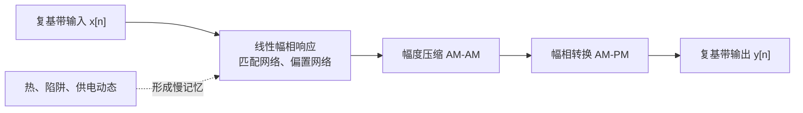
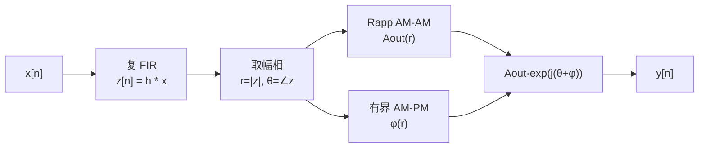
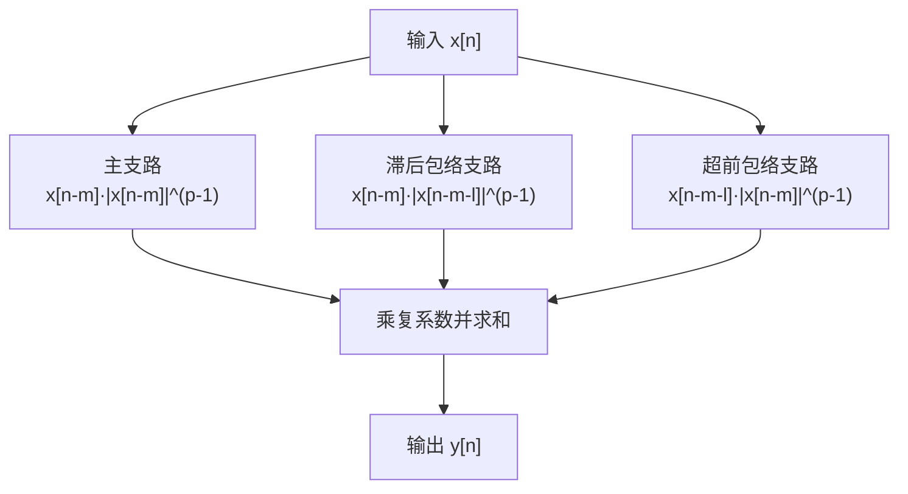
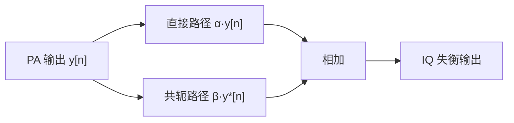
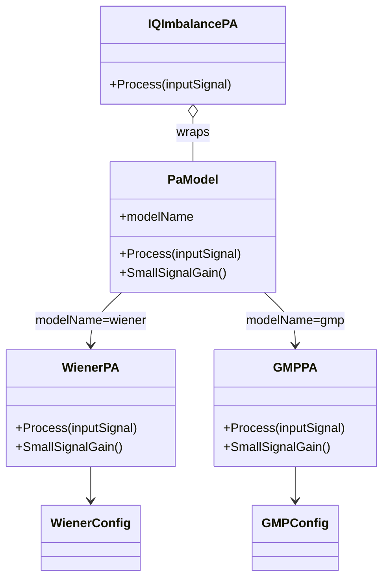

# 功率放大器模型：Wiener、GMP 的物理原理与公式推导

本文解释 `inc/PaModel.py` 中功率放大器（Power Amplifier，PA）模型的物理意义、数学来源、参数作用和适用边界。工程支持两类模型：

- **Wiener 模型**：线性记忆滤波器后接无记忆非线性，直观、参数少；
- **GMP 模型**：主记忆多项式加包络超前/滞后交叉项，表达能力更强。

> 这两种都是复基带“行为模型”，描述输入波形和输出波形之间的关系。它们不是晶体管电路模型，不能直接预测漏极电压、电流、结温、效率或器件可靠性。

---

## 1. PA 为什么会产生失真

理想线性 PA 应满足

```math
y(t)=Gx(t),
```

其中 $G$ 是固定复增益。真实器件受供电电压、最大电流、晶体管跨导和匹配网络限制，无法无限放大。当输入幅度增加时会出现：

1. **AM-AM 失真**：输出幅度不再按比例增长，进入增益压缩和饱和；
2. **AM-PM 失真**：输出相位随输入幅度变化；
3. **记忆效应**：当前输出不只取决于当前输入，还取决于过去若干采样点；
4. **频谱再生**：带内信号的非线性混频分量落入邻道。



**图 1 说明**：PA 的频率选择性和动态状态产生记忆，器件电流/电压上限产生幅度压缩，寄生电容和工作点变化又使相位随包络变化。本工程用数学模块等效这些现象，而不逐个模拟晶体管。

---

## 2. 复包络模型为什么成立

射频输入写成

```math
v_{\mathrm{in,RF}}(t)=\Re\left\{x(t)e^{j2\pi f_ct}\right\},
```

输出写成

```math
v_{\mathrm{out,RF}}(t)=\Re\left\{y(t)e^{j2\pi f_ct}\right\}.
```

$x(t)$ 和 $y(t)$ 是相对载波变化较慢的复包络。只要模型正确保留包络的幅度、相位和记忆，PA 在载波附近产生的带内失真与邻道频谱再生就能在基带中观察，不需要显式生成 GHz 载波。

复系数同时包含增益与相移：

```math
c=|c|e^{j\angle c}.
```

因此 GMP 中一个复系数的实部/虚部组合能够共同表达 AM-AM 和 AM-PM 行为。

---

## 3. Wiener PA 模型

### 3.1 结构

Wiener 模型是“线性动态系统在前、静态非线性在后”的级联：



**图 2 说明**：FIR 先让不同频率成分经历不同增益和相位，并引入采样记忆；随后非线性根据滤波后瞬时包络 $r$ 决定输出幅度和额外相位。因为顺序不能交换，所以它表达的是一种特定类型的动态非线性。

### 3.2 第一步：线性记忆

长度为 $M$ 的因果复 FIR 为

```math
z[n]=\sum_{m=0}^{M-1}h[m]x[n-m].
```

其频率响应为

```math
H(e^{j\omega})=\sum_{m=0}^{M-1}h[m]e^{-j\omega m}.
```

如果只有 $h[0]$，模型无记忆；存在 $h[1],h[2],\ldots$ 时，当前输出混入过去输入。复抽头的幅度控制记忆强度，相角控制不同延迟支路的相位。

默认抽头为

```math
\left[1,\ 0.055-j0.025,\ -0.018+j0.012\right].
```

这是一个温和且稳定的仿真记忆响应，不对应某个特定实测器件。

### 3.3 第二步：Rapp AM-AM 压缩

令

```math
r[n]=|z[n]|,\qquad \rho[n]=\frac{r[n]}{A_{\mathrm{sat}}}.
```

代码使用平滑 Rapp 特性：

```math
A_{\mathrm{out}}(r)
=\frac{G r}{\left(1+\rho^{2p}\right)^{1/(2p)}}.
```

其中：

- $G$：小信号线性增益；
- $A_{\mathrm{sat}}$：进入饱和的幅度标尺；
- $p$：压缩拐点的平滑度。

#### 小信号极限

当 $r\ll A_{\mathrm{sat}}$ 时，$\rho^{2p}\ll1$，利用

```math
(1+\epsilon)^a\approx1+a\epsilon
```

可得

```math
A_{\mathrm{out}}(r)\approx Gr.
```

因此原点附近近似线性。

#### 大信号极限

当 $r\gg A_{\mathrm{sat}}$ 时，$1+\rho^{2p}\approx\rho^{2p}$，所以

```math
\begin{aligned}
A_{\mathrm{out}}(r)
&\approx\frac{Gr}{(\rho^{2p})^{1/(2p)}}\\
&=\frac{Gr}{\rho}=GA_{\mathrm{sat}}.
\end{aligned}
```

输出幅度趋近固定上限 $GA_{\mathrm{sat}}$。

```text
输出幅度
 ^                         ─────  G·Asat
 |                    ____/
 |                 __/
 |              __/
 |           __/
 |__________/____________________________> 输入幅度
          约 Asat 附近进入压缩
```

**图 3 说明**：小信号区斜率近似为 $G$；输入接近 $A_{\mathrm{sat}}$ 后增益下降；大信号区趋向饱和。$p$ 越大，拐点越“硬”；$p$ 越小，压缩过渡越平滑。

#### 瞬时增益

将输出幅度除以输入幅度，可以直接看到增益压缩：

```math
G_{\mathrm{inst}}(r)
=\frac{A_{\mathrm{out}}(r)}{r}
=\frac{G}{(1+\rho^{2p})^{1/(2p)}}.
```

$r$ 增大时，分母增大，因此瞬时增益单调下降。

### 3.4 第三步：AM-PM 转换

代码使用有界相位旋转：

```math
\phi(r)=c_{\phi}\frac{\rho^2}{1+\rho^2}.
```

在小信号区

```math
\phi(r)\approx c_{\phi}\rho^2\rightarrow0,
```

在强压缩区

```math
\phi(r)\rightarrow c_{\phi}.
```

所以 $c_{\phi}$ 是最大附加相位，单位为弧度。完整输出为

```math
y[n]=A_{\mathrm{out}}(r[n])
e^{j(\angle z[n]+\phi(r[n]))}.
```

AM-PM 会使外圈星座点相对内圈发生旋转。对高阶 QAM，即便幅度误差不大，这种幅度相关相位也可能显著恶化 EVM。

### 3.5 小信号复增益

在低幅度、近直流包络下，非线性近似为 $G$，FIR 的直流增益为 $\sum_mh[m]$，因此

```math
G_{\mathrm{small}}=G\sum_{m=0}^{M-1}h[m].
```

这就是 `WienerPA.SmallSignalGain` 的返回值。

### 3.6 Wiener 参数的直观作用

| 参数 | 增大后的主要效果 |
|---|---|
| `linearTaps` 的尾抽头 | 频率选择性和记忆增强，补偿难度增加 |
| `linearGain` | 小信号输出整体增大，饱和上限也按比例增大 |
| `saturationAmplitude` | 压缩拐点向更高输入移动 |
| `rappSmoothness` | 压缩膝点更陡、更接近硬限幅 |
| `ampmCoefficient` | 强信号的最大相位旋转增大 |

---

## 4. GMP：广义记忆多项式模型

### 4.1 从无记忆多项式开始

简单实多项式可以写为

```math
y=a_1x+a_2x^2+a_3x^3+\cdots.
```

对载波附近的复包络，常使用

```math
y[n]=\sum_{p\in\mathcal P}a_p x[n]|x[n]|^{p-1},
```

并通常选择正奇数阶

```math
\mathcal P=\{1,3,5,7,\ldots\}.
```

为什么基函数是 $x\lvert x\rvert^{p-1}$？令 $x=re^{j\theta}$，则

```math
x|x|^{p-1}=r^pe^{j\theta}.
```

它把幅度变成 $r^p$，但仍保留载波包络的相位因子 $e^{j\theta}$，因此输出仍位于目标载波附近。偶次项在真实通带展开中主要对应直流或偶次谐波，通常不作为带内复包络的主要基函数。

### 4.2 加入记忆：Memory Polynomial

让每个阶次使用多个延迟样本：

```math
y_{\mathrm{MP}}[n]
=\sum_{p\in\mathcal P}\sum_{m=0}^{M-1}
a_{p,m}x[n-m]|x[n-m]|^{p-1}.
```

这里同一支路的“载波项”和“包络项”具有相同延迟。它能描述不少宽带 PA，但不能充分表达“当前复载波受过去包络控制”或“过去复载波受当前包络控制”的动态交互。

### 4.3 GMP 的三类基函数

GMP 在主支路之外增加滞后与超前交叉项：

```math
\begin{aligned}
y[n]={}&
\underbrace{\sum_{p,m}a_{p,m}x[n-m]|x[n-m]|^{p-1}}_{\text{主支路}}\\
&+\underbrace{\sum_{p,m,l}b_{p,m,l}
x[n-m]|x[n-m-l]|^{p-1}}_{\text{滞后包络交叉项}}\\
&+\underbrace{\sum_{p,m,l}c_{p,m,l}
x[n-m-l]|x[n-m]|^{p-1}}_{\text{超前包络交叉项}}.
\end{aligned}
```

其中 $m=0,\ldots,M-1$，$l=1,\ldots,L$。



**图 4 说明**：三类支路共享输入，却用不同的“复载波样本”和“包络样本”组合。主支路描述同一时刻/延迟的非线性；交叉支路描述包络动态对其他延迟样本的调制。这是 GMP 比普通记忆多项式表达力更强的关键。

### 4.4 三类支路的通俗理解

- **主支路**：过去某个样本的幅度决定它自己的压缩程度；
- **滞后包络项**：当前/较新的复样本受到更早包络状态影响，可类比偏置或温度状态尚未恢复；
- **超前包络项**：较早的复样本与较新的包络状态组合，是离散基函数展开中补足动态相关性的对称结构，不表示物理系统能预知未来。

“超前”是相对两条支路的索引命名。代码仍然只访问 $n$ 及其过去样本，是严格因果的。

### 4.5 各阶次的作用

| 阶次 $p$ | 基函数 | 主要意义 |
|---:|---|---|
| 1 | $x$ | 线性增益和线性频率响应 |
| 3 | $x\lvert x\rvert^2$ | 首要压缩与三阶互调，通常最重要 |
| 5 | $x\lvert x\rvert^4$ | 修正更深压缩和五阶再生 |
| 7 | $x\lvert x\rvert^6$ | 拟合更高幅度区域 |

阶次并非越高越好。高阶基函数在大幅度处增长很快，可能带来矩阵病态、过拟合和数值不稳定。默认集合 `(1, 3, 5, 7)` 是表达能力与稳定性之间的折中。

### 4.6 默认 GMP 基函数数量

默认配置为：

```math
|\mathcal P|=4,\quad M=3,\quad L=2.
```

主支路数量为

```math
K_{\mathrm{main}}=4\times3=12.
```

交叉项不为一阶项生成默认系数，因此使用 3 个非线性阶次；滞后和超前两类共

```math
K_{\mathrm{cross}}=2\times3\times3\times2=36.
```

总计

```math
K=12+36=48
```

个默认复基函数。用户传入自定义字典时，实际项数由字典内容决定，缺失项视为零。

### 4.7 小信号增益

当 $\lvert x\rvert\rightarrow0$ 时，$p>1$ 的项比一阶项衰减得更快：

```math
|x|^p\ll|x|,\qquad p>1.
```

因此小信号只剩一阶主项：

```math
y[n]\approx\sum_m a_{1,m}x[n-m].
```

对缓慢变化或直流复包络，

```math
G_{\mathrm{small}}=\sum_m a_{1,m},
```

对应 `GMPPA.SmallSignalGain`。

---

## 5. 非线性为什么会产生邻道频谱再生

考虑两个复音调

```math
x(t)=A_1e^{j2\pi f_1t}+A_2e^{j2\pi f_2t}.
```

三阶项 $x\lvert x\rvert^2$ 展开后，除原频率外还会产生

```math
2f_1-f_2,\qquad 2f_2-f_1
```

等三阶互调分量。若 $f_1$、$f_2$ 位于信道边缘，新分量可能落到信道外。

OFDM 可看成几百到几千个音调之和。三阶、五阶项会对这些音调做大量组合，形成连续的带外“裙边”：

```text
功率谱密度
 ^              原信道
 |             __________
 |            /          \
 |      _____/            \_____
 |_____/                         \_____> 频率
      下邻道       主信道          上邻道
       ↑ 非线性频谱再生落入相邻信道 ↑
```

**图 5 说明**：线性 PA 只改变信号整体增益与相位；非线性相当于波形自身混频，能量从主信道扩展到两侧。ACLR 正是衡量主信道功率与这些邻道泄漏功率之比。

记忆效应还会使上下邻道不完全对称，因为不同频率组合经历的复增益不同。

---

## 6. GMP 与 Volterra 思想的关系

具有有限记忆的弱非线性系统可以用 Volterra 级数表示。离散三阶项的一般形式包含三重求和：

```math
y_3[n]=\sum_{m_1}\sum_{m_2}\sum_{m_3}
h_3[m_1,m_2,m_3]
x[n-m_1]x[n-m_2]x^*[n-m_3].
```

完整 Volterra 模型的参数数量随阶次和记忆深度迅速增长。GMP 选择其中最有代表性的“对角项”和少量相邻交叉项，把复杂度压缩到线性可估计的基函数集合：

```math
\mathbf y=\mathbf\Phi\mathbf c.
```

这里 $\mathbf\Phi$ 的每一列是一种 GMP 基函数，$\mathbf c$ 是复系数。模型对输入是非线性的，但对未知系数是线性的，因此可以用最小二乘、岭回归等方法从实测输入/输出辨识。

---

## 7. IQ 失衡模型

理想复基带只有直接项 $y$。I/Q 两路增益或相位不匹配时，可用广义线性模型表示：

```math
y_{\mathrm{IQ}}[n]=\alpha y[n]+\beta y^*[n].
```

其中：

- $\alpha$ 是期望的直接路径；
- $\beta$ 是共轭镜像路径；
- $y^*$ 会把频率 $+f$ 映射到 $-f$，因此产生镜像频谱。



**图 6 说明**：当 $\beta=0$ 时没有镜像；$\lvert\beta\rvert$ 越大，镜像越强。`IQImbalancePA` 把任意基础 PA 包装成这一形式，可测试普通复多项式 DPD 对非解析共轭失真的处理边界。

---

## 8. 反馈 AWGN 模型

ILC 依赖每轮 PA 反馈。测量链噪声用复白高斯噪声表示。若信号平均功率为

```math
P_s=E[|y|^2]
```

且目标信噪比为 $\mathrm{SNR}_{\mathrm{dB}}$，则

```math
P_n=\frac{P_s}{10^{\mathrm{SNR}_{\mathrm{dB}}/10}}.
```

复噪声写成

```math
w=w_I+jw_Q,
```

其中独立实部、虚部满足

```math
w_I,w_Q\sim\mathcal N\left(0,\frac{P_n}{2}\right).
```

所以 $E[\lvert w\rvert^2]=P_n$。`AddAwgn` 实现的正是这一缩放。这里的 AWGN 表示反馈接收机热噪声/量化噪声的简化等效，不包含相位噪声、频偏、非线性 ADC 或相关噪声。

---

## 9. 两类模型的选择

| 对比项 | Wiener | GMP |
|---|---|---|
| 结构 | FIR 后接静态非线性 | 多阶、多延迟、交叉包络基函数并联 |
| 参数数量 | 少 | 较多 |
| 物理直觉 | 很直观 | 需要基函数理解 |
| 动态非线性表达力 | 中等、结构受限 | 强 |
| 系数辨识 | 非线性参数拟合可能较复杂 | 对系数线性，可最小二乘 |
| 计算量 | 较低 | 随阶次/记忆/交叉深度增加 |
| 适合用途 | 算法原理验证、可解释压缩曲线 | 宽带 PA 行为拟合、DPD 基函数验证 |

建议：先用 Wiener 模型观察 ILC 收敛和压缩机制，再用 GMP 检查算法面对宽带动态非线性时的稳健性。

---

## 10. 默认参数不是器件测量结果

`GMPConfig` 在未给系数字典时生成一组稳定、压缩型、带轻微记忆的复系数。其作用是让工程开箱即用，并为所有 ILC 方法提供一致的非线性对象。它们不代表某个具体 PA 的工作频率、工艺、输出功率或温度。

若要拟合真实器件，通常需要：

1. 采集严格同步的 PA 输入 $x[n]$ 和输出 $y[n]$；
2. 校正时延、采样频偏、载波频偏和固定复增益；
3. 构造 GMP 回归矩阵 $\mathbf\Phi$；
4. 适当归一化各列，并用正则化最小二乘求系数；
5. 用独立验证波形检查 NMSE、EVM、ACLR 和功率外推；
6. 若系数随温度/功率变化明显，应建立分区模型或自适应更新。

岭回归形式为

```math
\hat{\mathbf c}
=\left(\mathbf\Phi^H\mathbf\Phi+\lambda\mathbf I\right)^{-1}
\mathbf\Phi^H\mathbf y.
```

$\lambda>0$ 可以缓和高阶基函数相关造成的病态问题，但过大也会引入欠拟合。

---

## 11. 代码结构与调用方式



**图 7 说明**：`PaModel` 是统一面向对象入口，内部选择 Wiener 或 GMP。`IQImbalancePA` 可以包装任意具有 `Process` 接口的 PA；反馈噪声则由独立的 `AddAwgn` 在测量链上添加。

```python
from collections import ChainMap

from inc.PaModel import (
    GMPConfig,
    PaModel,
    WienerConfig,
    paModelDefaultParameters,
)

paOverrides = {
    "modelName": "wiener",
    "wienerConfig": WienerConfig(
        saturationAmplitude=1.0,
        rappSmoothness=3.0,
        ampmCoefficient=0.18,
    ),
}
paParameters = ChainMap(paOverrides, paModelDefaultParameters)
paModel = PaModel(parameters=paParameters)
wienerOutput = paModel.Process(inputSignal)

paOverrides.update(
    {
        "modelName": "gmp",
        "gmpConfig": GMPConfig(
            nonlinearOrders=(1, 3, 5, 7),
            memoryDepth=3,
            crossMemoryDepth=2,
        ),
    }
)
# Process detects the live mapping change and rebuilds the selected PA.
gmpOutput = paModel.Process(inputSignal)
```

直接构造参数或 `UpdateParameters(...)` 位于最高优先级，外部映射位于中间层，`paModelDefaultParameters` 是只读后备层。`GetParameters()` 返回当前解析结果的字典快照。

---

## 12. 使用边界和常见误解

1. **行为拟合好不等于电路正确**：相同输入范围内波形拟合好，不能推出器件效率、稳定性或可靠性。
2. **外推风险**：模型只应在训练/设定的幅度、带宽和温度范围内使用；高阶多项式在范围外可能快速发散。
3. **采样率必须覆盖带外再生**：若只按 1x 信道带宽采样，非线性频谱会混叠回带内。本工程默认 4x 过采样。
4. **Wiener 结构有限**：真实 PA 可能更接近 Hammerstein、Wiener-Hammerstein 或多分支结构。
5. **GMP 不是任意强非线性的万能模型**：深饱和、迟滞、长期热记忆可能需要分段、动态状态或神经网络模型。
6. **记忆深度以采样点计**：改变采样率后，相同 `memoryDepth` 对应的物理时间会变化。

---

## 13. 参考资料

- [C. Rapp, “Effects of HPA-Nonlinearity on a 4-DPSK/OFDM-Signal,” 1991](https://elib.dlr.de/33776/)
- [D. R. Morgan 等, “A Generalized Memory Polynomial Model for Digital Predistortion of RF Power Amplifiers,” IEEE TSP, 2006](https://doi.org/10.1109/TSP.2006.879264)

本工程的 Rapp AM-AM、有界 AM-PM 和默认 GMP 系数是面向教学与算法比较的组合实现；具体公式和默认值以 `inc/PaModel.py` 为准。
