# 功率放大器模型：Rapp、Wiener、GMP、分段GMP、Doherty与电热特性的物理原理

本文解释 `inc/lib/PaModel.py` 中功率放大器（Power Amplifier，PA）模型的物理意义、数学来源、参数作用和适用边界。工程支持五类模型：

- **Rapp 模型**：面向固态功率放大器的经典无记忆AM-AM模型；输出样点只依赖同一时刻输入样点；
- **Wiener 模型**：线性记忆滤波器后接无记忆非线性，直观、参数少；
- **GMP 模型**：主记忆多项式加包络超前/滞后交叉项，表达能力更强；
- **分段 GMP 模型**：低、中、高瞬时包络区使用独立 GMP，并通过平滑权重联合输出；
- **Doherty 模型**：载波PA和峰值PA并联，通过包络门控、支路时延、复合成与简化负载调制描述Doherty架构。

> Rapp、Wiener、GMP、分段GMP和Doherty是复基带“行为电模型”。可选 `ThermalConfig` 在它们外面增加耗散功率、结温和温度参数漂移；它是可辨识的系统级电热模型，不等同于晶体管级可靠性仿真。

> **性能说明**：`GMPPA.Process()`在每次调用内只构造一次实际系数需要的唯一延迟波形和唯一包络幂，同时严格保留原系数项累加顺序与因果补零。它不缓存PA输出或热状态。实现推导和参考耗时见 [Performance.md](./Performance.md#5-pamodel的gmp路径)。

---

## 1. PA 为什么会产生失真

理想线性 PA 应满足

```math
y(t)=Gx(t),
```

其中 $G$ 是固定复增益。真实器件受供电电压、最大电流、晶体管跨导和匹配网络限制，无法无限放大。当输入幅度增加时会出现：

1. **AM-AM 失真**：输出幅度不再按比例增长，进入增益压缩和饱和；
2. **AM-PM 失真**：输出相位随输入幅度变化；
3. **记忆效应**：当前输出不只取决于当前输入，还取决于过去若干采样点；
4. **频谱再生**：带内信号的非线性混频分量落入邻道。

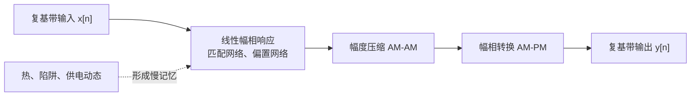
```mermaid
flowchart LR
    A["复基带输入 x[n]"] --> B["线性幅相响应<br/>匹配网络、偏置网络"]
    B --> C["幅度压缩 AM-AM"]
    C --> D["幅相转换 AM-PM"]
    D --> E["复基带输出 y[n]"]
    F["热、陷阱、供电动态"] -. "形成慢记忆" .-> B
```

**图 1 说明**：PA 的频率选择性和动态状态产生记忆，器件电流/电压上限产生幅度压缩，寄生电容和工作点变化又使相位随包络变化。本工程用数学模块等效这些现象，而不逐个模拟晶体管。

---

## 2. 复包络模型为什么成立

射频输入写成

```math
v_{\mathrm{in,RF}}(t)=\sqrt{2}\Re\left\{x(t)e^{j2\pi f_ct}\right\},
```

输出写成

```math
v_{\mathrm{out,RF}}(t)=\sqrt{2}\Re\left\{y(t)e^{j2\pi f_ct}\right\}.
```

$x(t)$ 和 $y(t)$ 是相对载波变化较慢的复包络。只要模型正确保留包络的幅度、相位和记忆，PA 在载波附近产生的带内失真与邻道频谱再生就能在基带中观察，不需要显式生成 GHz 载波。

复系数同时包含增益与相移：

```math
c=|c|e^{j\angle c}.
```

因此 GMP 中一个复系数的实部/虚部组合能够共同表达 AM-AM 和 AM-PM 行为。

### 2.1 dBm与复包络RMS的物理标定

本工程把复包络RMS定义为端口的等效RMS电压：

```math
V_{\mathrm{RMS}}
=\sqrt{\frac{1}{N}\sum_{n=0}^{N-1}|x[n]|^2}.
```

对于阻值为 $R$ 的纯电阻端口，平均功率为：

```math
P_{\mathrm{W}}
=\frac{V_{\mathrm{RMS}}^2}{R}.
```

dBm以1 mW为参考，因此：

```math
P_{\mathrm{dBm}}
=10\log_{10}\left(
\frac{V_{\mathrm{RMS}}^2}
{R\cdot10^{-3}}
\right).
```

反向换算为：

```math
V_{\mathrm{RMS}}
=\sqrt{
R\cdot10^{-3}\cdot10^{P_{\mathrm{dBm}}/10}
}.
```

`PowerCalibration` 定义在 `inc/utils/SigProc.py`，`PaModel.py` 只导入并复用它。该类实现这两个方向的换算，`loadResistanceOhm` 默认是50 Ω，也允许用户修改。以50 Ω为例：

- `0 dBm` 等于1 mW，对应约 `0.223607 V RMS`；
- `0.24 V RMS` 对应约 `0.6145 dBm`；
- `-10 dBm` 对应约 `0.070711 V RMS`。

这个阻抗标定非常重要。若只把旧的归一化RMS数值改写成“dBm”标签而不引入 $R$，得到的不是绝对功率。当前主程序和功率-EVM横轴使用每路PA输出功率：默认工作点20 dBm、默认额定极限25 dBm。

---

## 2.2 Rapp无记忆固态PA模型

### 2.2.1 为什么选择Rapp，而不是把模型只叫作“无记忆模型”

“无记忆”只描述输出不依赖过去样点，并不是唯一的模型名称。常见经典名称包括：

- **Rapp模型**：为固态功率放大器SSPA描述平滑AM-AM压缩，经典形式不包含AM-PM；
- **Saleh模型**：主要为行波管功率放大器TWTA描述AM-AM和AM-PM。

本工程面向Wi-Fi和一般固态射频PA，因此新增模型采用 `modelName="rapp"`，对应类为 `RappPA`，配置类为 `RappConfig`。Rapp模型作为“没有频响、没有时延、没有动态迟滞”的基线，特别适合把纯静态非线性与Wiener、GMP、Doherty中的记忆或架构效应分开。

原始Rapp SSPA公式可见IEEE 802.16工作组的[系统损伤模型提案](https://www.ieee802.org/16/tg1/phy/pres/802161pp-00_15.pdf)。Saleh模型的来源和TWTA适用对象见[Saleh 1981年IEEE论文](https://doi.org/10.1109/TCOM.1981.1094911)。

### 2.2.2 数学模型

令输入复包络为

```math
x[n]=r[n]\exp(j\theta[n]).
```

工程使用带显式小信号增益的Rapp幅度函数：

```math
A_{\mathrm{out}}(r)
=
\frac{G r}
{\left[
1+\left(r/A_{\mathrm{sat}}\right)^{2p}
\right]^{1/(2p)}}.
```

完整复输出为

```math
y[n]
=
A_{\mathrm{out}}(r[n])\exp(j\theta[n]).
```

这里：

- $G$ 对应 `linearGain`，决定原点附近的电压增益；
- $A_{\mathrm{sat}}$ 对应 `saturationAmplitude`，决定压缩膝点的输入幅度标尺；
- $p$ 对应 `rappSmoothness`，决定压缩过渡的平滑程度。

经典Rapp模型保持输入相位，所以

```math
\angle y[n]-\angle x[n]=0.
```

它只产生AM-AM，不产生AM-PM。若测试需要幅度相关相位，应使用Wiener、GMP或其他含复系数的模型。

### 2.2.3 为什么它严格无记忆

无记忆的数学定义是存在一个静态函数 $F$，满足

```math
y[n]=F(x[n]).
```

Rapp输出没有 $x[n-1]$、延迟抽头、滤波器状态、历史包络或支路时延。因此只改变 $x[k]$ 且 $k\ne n$ 时，$y[n]$ 不变：

```math
\frac{\partial y[n]}{\partial x[k]}=0,
\qquad k\ne n.
```

这带来四个可直接验收的结果：

1. 小信号频响在所有基带频率上相同，增益波纹为0；
2. 相位响应为常数，群时延为0；
3. 相同输出功率下改变双音间隔，理想IM3、IM5、IM7不会系统性变化；
4. 相同瞬时幅度的包络上升点与下降点输出相同，动态AM-AM和AM-PM迟滞为0。

有限记录、窗泄漏、频率投影误差和幅度分箱会留下很小的非零数值，因此Benchmark使用接近0的容差，而不是要求浮点结果逐位等于0。

### 2.2.4 小信号、压缩和饱和极限

当 $r$ 很小时，分母接近1：

```math
A_{\mathrm{out}}(r)\approx Gr.
```

当 $r$ 很大时：

```math
A_{\mathrm{out}}(r)\rightarrow GA_{\mathrm{sat}}.
```

相对于小信号增益的压缩量为

```math
C_{\mathrm{dB}}(r)
=
-\frac{10}{p}
\log_{10}
\left[
1+\left(r/A_{\mathrm{sat}}\right)^{2p}
\right].
```

当 $r=A_{\mathrm{sat}}$ 时，压缩量为

```math
C_{\mathrm{dB}}(A_{\mathrm{sat}})
=
-\frac{3.0103}{p}\ {\rm dB}.
```

默认 $p=3$，所以 `saturationAmplitude` 对应的位置约为1.003 dB压缩点。

### 2.2.5 参数范围、推荐值和具体影响

| 参数 | 代码约束 | 建议起点 | 增大后发生什么 |
|---|---|---:|---|
| `linearGain` | 有限且大于0 | `1.0` | 小信号增益提高，渐近饱和输出也同比提高；膝点在输入幅度轴上的位置不变 |
| `saturationAmplitude` | 有限且大于0 | `1.0` | 压缩膝点右移，渐近饱和输出同比提高；小信号斜率不变 |
| `rappSmoothness` | 有限且大于0 | `2`至`3` | 线性增益保持更久、膝点更陡；过大时更接近硬限幅并增加高阶谱再生 |

经验上，`rappSmoothness=2`至`3`适合作为常见SSPA软压缩起点；更小值模拟更早、更圆滑的压缩，更大值适合研究接近硬限幅的边界。模型参数必须根据实测AM-AM曲线拟合，默认值不代表某一具体器件。

### 2.2.6 最小调用示例

```python
import numpy as np

from inc.lib.PaModel import PaModel, RappConfig


paInput = 0.7 * np.exp(1j * np.linspace(0.0, 2.0 * np.pi, 4096))
rappPa = PaModel(
    parameters={
        "modelName": "rapp",
        "rappConfig": RappConfig(
            linearGain=1.0,
            saturationAmplitude=1.0,
            rappSmoothness=3.0,
        ),
        "width": 0,
    }
)
paOutput = rappPa.Process(paInput)
```

---

## 3. Wiener PA 模型

### 3.1 结构

Wiener 模型是“线性动态系统在前、静态非线性在后”的级联：

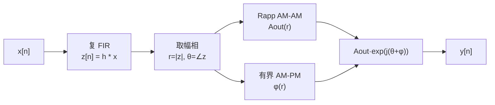
```mermaid
flowchart LR
    A["x[n]"] --> B["复 FIR<br/>z[n] = h * x"]
    B --> C["取幅相<br/>r=|z|, θ=∠z"]
    C --> D["Rapp AM-AM<br/>Aout(r)"]
    C --> E["有界 AM-PM<br/>φ(r)"]
    D --> F["Aout·exp(j(θ+φ))"]
    E --> F
    F --> G["y[n]"]
```

**图 2 说明**：FIR 先让不同频率成分经历不同增益和相位，并引入采样记忆；随后非线性根据滤波后瞬时包络 $r$ 决定输出幅度和额外相位。因为顺序不能交换，所以它表达的是一种特定类型的动态非线性。

### 3.2 第一步：线性记忆

长度为 $M$ 的因果复 FIR 为

```math
z[n]=\sum_{m=0}^{M-1}h[m]x[n-m].
```

其频率响应为

```math
H(e^{j\omega})=\sum_{m=0}^{M-1}h[m]e^{-j\omega m}.
```

如果只有零时延抽头 $h[0]$，模型无记忆；存在一个或多个非零时延抽头时，当前输出会混入过去输入。复抽头的幅度控制记忆强度，相角控制不同延迟支路的相位。

默认抽头为

```math
\left[1,\ 0.055-j0.025,\ -0.018+j0.012\right].
```

这是一个温和且稳定的仿真记忆响应，不对应某个特定实测器件。

### 3.3 第二步：Rapp AM-AM 压缩

令

```math
r[n]=|z[n]|,\qquad \rho[n]=\frac{r[n]}{A_{\mathrm{sat}}}.
```

代码使用平滑 Rapp 特性：

```math
A_{\mathrm{out}}(r)
=\frac{G r}{\left(1+\rho^{2p}\right)^{1/(2p)}}.
```

其中：

- $G$：小信号线性增益；
- $A_{\mathrm{sat}}$：进入饱和的幅度标尺；
- $p$：压缩拐点的平滑度。

#### 小信号极限

当 $r\ll A_{\mathrm{sat}}$ 时，$\rho^{2p}\ll1$，利用

```math
(1+\epsilon)^a\approx1+a\epsilon
```

可得

```math
A_{\mathrm{out}}(r)\approx Gr.
```

因此原点附近近似线性。

#### 大信号极限

当 $r\gg A_{\mathrm{sat}}$ 时，$1+\rho^{2p}\approx\rho^{2p}$，所以

```math
A_{\mathrm{out}}(r)
\approx
\frac{Gr}{(\rho^{2p})^{1/(2p)}}
=
\frac{Gr}{\rho}
=
GA_{\mathrm{sat}}.
```

输出幅度趋近固定上限 $GA_{\mathrm{sat}}$。

```text
输出幅度
 ^                         ─────  G·Asat
 |                    ____/
 |                 __/
 |              __/
 |           __/
 |__________/____________________________> 输入幅度
          约 Asat 附近进入压缩
```

**图 3 说明**：小信号区斜率近似为 $G$；输入接近 $A_{\mathrm{sat}}$ 后增益下降；大信号区趋向饱和。$p$ 越大，拐点越“硬”；$p$ 越小，压缩过渡越平滑。

#### 瞬时增益

将输出幅度除以输入幅度，可以直接看到增益压缩：

```math
G_{\mathrm{inst}}(r)
=\frac{A_{\mathrm{out}}(r)}{r}
=\frac{G}{(1+\rho^{2p})^{1/(2p)}}.
```

$r$ 增大时，分母增大，因此瞬时增益单调下降。

### 3.4 第三步：AM-PM 转换

代码使用有界相位旋转：

```math
\phi(r)=c_{\phi}\frac{\rho^2}{1+\rho^2}.
```

在小信号区

```math
\phi(r)\approx c_{\phi}\rho^2\rightarrow0,
```

在强压缩区

```math
\phi(r)\rightarrow c_{\phi}.
```

所以 $c_{\phi}$ 是最大附加相位，单位为弧度。完整输出为

```math
y[n]=A_{\mathrm{out}}(r[n])
e^{j(\angle z[n]+\phi(r[n]))}.
```

AM-PM 会使外圈星座点相对内圈发生旋转。对高阶 QAM，即便幅度误差不大，这种幅度相关相位也可能显著恶化 EVM。

### 3.5 小信号复增益

在低幅度、近直流包络下，非线性近似为 $G$，FIR 的直流增益为 $\sum_mh[m]$，因此

```math
G_{\mathrm{small}}=G\sum_{m=0}^{M-1}h[m].
```

这就是 `WienerPA.SmallSignalGain` 的返回值。

### 3.6 Wiener 参数的直观作用

| 参数 | 增大后的主要效果 |
|---|---|
| `linearTaps` 的尾抽头 | 频率选择性和记忆增强，补偿难度增加 |
| `linearGain` | 小信号输出整体增大，饱和上限也按比例增大 |
| `saturationAmplitude` | 压缩拐点向更高输入移动 |
| `rappSmoothness` | 压缩膝点更陡、更接近硬限幅 |
| `ampmCoefficient` | 强信号的最大相位旋转增大 |

---

## 4. GMP：广义记忆多项式模型

### 4.1 从无记忆多项式开始

简单实多项式可以写为

```math
y=a_1x+a_2x^2+a_3x^3+\cdots.
```

对载波附近的复包络，常使用

```math
y[n]=\sum_{p\in\mathcal P}a_p x[n]|x[n]|^{p-1},
```

并通常选择正奇数阶

```math
\mathcal P=\{1,3,5,7,\ldots\}.
```

为什么基函数是 $x\lvert x\rvert^{p-1}$？令 $x=re^{j\theta}$，则

```math
x|x|^{p-1}=r^pe^{j\theta}.
```

它把幅度变成 $r^p$，但仍保留载波包络的相位因子 $e^{j\theta}$，因此输出仍位于目标载波附近。偶次项在真实通带展开中主要对应直流或偶次谐波，通常不作为带内复包络的主要基函数。

### 4.2 加入记忆：Memory Polynomial

让每个阶次使用多个延迟样本：

```math
y_{\mathrm{MP}}[n]
=\sum_{p\in\mathcal P}\sum_{m=0}^{M-1}
a_{p,m}x[n-m]|x[n-m]|^{p-1}.
```

这里同一支路的“载波项”和“包络项”具有相同延迟。它能描述不少宽带 PA，但不能充分表达“当前复载波受过去包络控制”或“过去复载波受当前包络控制”的动态交互。

### 4.3 GMP 的三类基函数

GMP 在主支路之外增加滞后与超前交叉项。先分别定义三类分量：

```math
y_{\mathrm{main}}[n]
=
\sum_{p,m}a_{p,m}x[n-m]|x[n-m]|^{p-1}.
```

```math
y_{\mathrm{lag}}[n]
=
\sum_{p,m,l}b_{p,m,l}
x[n-m]|x[n-m-l]|^{p-1}.
```

```math
y_{\mathrm{lead}}[n]
=
\sum_{p,m,l}c_{p,m,l}
x[n-m-l]|x[n-m]|^{p-1}.
```

总输出为

```math
y[n]
=
y_{\mathrm{main}}[n]
+
y_{\mathrm{lag}}[n]
+
y_{\mathrm{lead}}[n].
```

其中两个离散索引的取值范围为：

```math
m\in\{0,1,\ldots,M-1\},
\qquad
l\in\{1,2,\ldots,L\}.
```

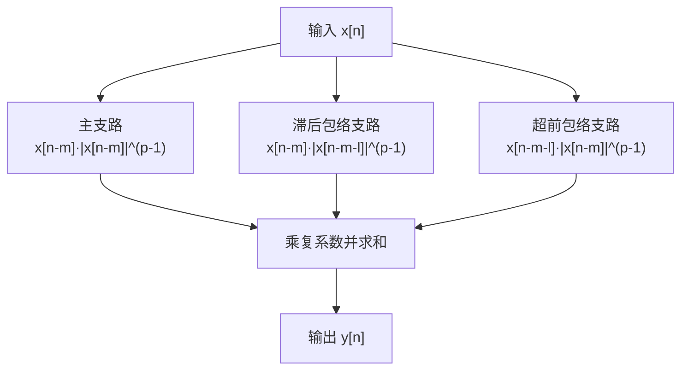
```mermaid
flowchart TB
    A["输入 x[n]"] --> B["主支路<br/>x[n-m]·|x[n-m]|^(p-1)"]
    A --> C["滞后包络支路<br/>x[n-m]·|x[n-m-l]|^(p-1)"]
    A --> D["超前包络支路<br/>x[n-m-l]·|x[n-m]|^(p-1)"]
    B --> E["乘复系数并求和"]
    C --> E
    D --> E
    E --> F["输出 y[n]"]
```

**图 4 说明**：三类支路共享输入，却用不同的“复载波样本”和“包络样本”组合。主支路描述同一时刻/延迟的非线性；交叉支路描述包络动态对其他延迟样本的调制。这是 GMP 比普通记忆多项式表达力更强的关键。

### 4.4 三类支路的通俗理解

- **主支路**：过去某个样本的幅度决定它自己的压缩程度；
- **滞后包络项**：当前/较新的复样本受到更早包络状态影响，可类比偏置或温度状态尚未恢复；
- **超前包络项**：较早的复样本与较新的包络状态组合，是离散基函数展开中补足动态相关性的对称结构，不表示物理系统能预知未来。

“超前”是相对两条支路的索引命名。代码仍然只访问 $n$ 及其过去样本，是严格因果的。

### 4.5 各阶次的作用

| 阶次 $p$ | 基函数 | 主要意义 |
|---:|---|---|
| 1 | $x$ | 线性增益和线性频率响应 |
| 3 | $x\lvert x\rvert^2$ | 首要压缩与三阶互调，通常最重要 |
| 5 | $x\lvert x\rvert^4$ | 修正更深压缩和五阶再生 |
| 7 | $x\lvert x\rvert^6$ | 拟合更高幅度区域 |

阶次并非越高越好。高阶基函数在大幅度处增长很快，可能带来矩阵病态、过拟合和数值不稳定。默认集合 `(1, 3, 5, 7)` 是表达能力与稳定性之间的折中。

### 4.6 默认 GMP 基函数数量

默认配置为：

```math
|\mathcal P|=4,\quad M=3,\quad L=2.
```

主支路数量为

```math
K_{\mathrm{main}}=4\times3=12.
```

交叉项不为一阶项生成默认系数，因此使用 3 个非线性阶次；滞后和超前两类共

```math
K_{\mathrm{cross}}=2\times3\times3\times2=36.
```

总计

```math
K=12+36=48
```

个默认复基函数。用户传入自定义字典时，实际项数由字典内容决定，缺失项视为零。

### 4.7 小信号增益

当 $\lvert x\rvert\rightarrow0$ 时，$p>1$ 的项比一阶项衰减得更快：

```math
|x|^p\ll|x|,\qquad p>1.
```

因此小信号只剩一阶主项：

```math
y[n]\approx\sum_m a_{1,m}x[n-m].
```

对缓慢变化或直流复包络，

```math
G_{\mathrm{small}}=\sum_m a_{1,m},
```

对应 `GMPPA.SmallSignalGain`。

---

## 4.8 Doherty载波/峰值双支路模型

### 4.8.1 为什么需要两条PA支路

传统单路PA为了容纳Wi-Fi等高PAPR信号，平均工作点通常远离饱和区，效率较低。Doherty架构让Carrier PA持续工作，让Peaking PA只在包络较高时逐渐开启，并通过合成网络改变Carrier看到的等效负载：

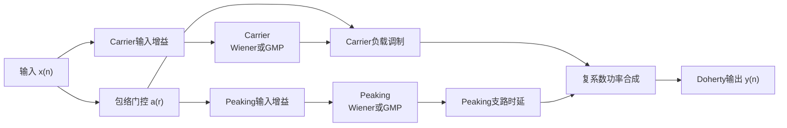
```mermaid
flowchart LR
    input["输入 x(n)"] --> carrierGain["Carrier输入增益"]
    input --> activation["包络门控 a(r)"]
    activation --> peakingGain["Peaking输入增益"]
    carrierGain --> carrierPa["Carrier<br/>Wiener或GMP"]
    peakingGain --> peakingPa["Peaking<br/>Wiener或GMP"]
    activation --> load["Carrier负载调制"]
    carrierPa --> load
    peakingPa --> delay["Peaking支路时延"]
    load --> combine["复系数功率合成"]
    delay --> combine
    combine --> output["Doherty输出 y(n)"]
```

**图 5 说明**：低包络区只有Carrier支路贡献输出；包络跨过开启门限后，Peaking支路平滑导通，同时Carrier支路乘以包络相关的负载调制因子。两条支路可以分别选择Wiener或GMP，因此可以具有不同压缩、记忆和AM-PM特性。

令输入包络为

```math
r(n)=|x(n)|.
```

归一化开启位置为

```math
t(n)
=
\frac{r(n)-r_{\mathrm{on}}}
     {\Delta r}.
```

代码先把 $t(n)$ 限制在0到1，再使用连续光滑的三次门控：

```math
a(n)
=
t^2(n)\left[3-2t(n)\right].
```

门限以下 $a(n)=0$，过渡区以上 $a(n)=1$。两条支路的输入为：

```math
u_c(n)=g_c x(n),
```

```math
u_p(n)=g_p a(n)x(n).
```

Carrier与Peaking的非线性行为分别记为 $F_c$ 和 $F_p$。简化负载调制及复功率合成为：

```math
y(n)
=
c_c
\left[
1+\lambda a(n)
\right]
F_c\{u_c(n)\}
+
c_p
F_p\{u_p(n-D_p)\}.
```

其中：

- $r_{\mathrm{on}}$ 对应 `peakingTurnOnAmplitude`；
- $\Delta r$ 对应 `peakingTransitionWidth`；
- $D_p$ 对应 `peakingDelaySamples`；
- $c_c$ 和 $c_p$ 是两路复合成系数；
- $\lambda$ 是 `loadModulationStrength`。

小信号极限下 $a(n)=0$，所以Peaking支路关闭，Doherty小信号增益只有Carrier贡献：

```math
G_{\mathrm{Doherty,small}}
=
c_c g_c G_{c,\mathrm{small}}.
```

该模型能够研究支路开启拐点、支路幅相失配、记忆差异和负载调制对EVM/ACLR的影响，但不直接输出漏极效率，也没有求解晶体管阻抗、反射波或电磁合成网络。

### 4.8.2 典型调用

```python
from inc.lib.PaModel import (
    DohertyConfig,
    GMPConfig,
    PaModel,
    WienerConfig,
)


dohertyConfig = DohertyConfig(
    carrierModelName="wiener",
    peakingModelName="gmp",
    carrierWienerConfig=WienerConfig(
        saturationAmplitude=1.0,
        rappSmoothness=3.0,
        ampmCoefficient=0.12,
    ),
    peakingGmpConfig=GMPConfig(
        nonlinearOrders=(1, 3, 5, 7),
        memoryDepth=3,
        crossMemoryDepth=2,
    ),
    peakingTurnOnAmplitude=0.45,
    peakingTransitionWidth=0.15,
    peakingDelaySamples=1,
    loadModulationStrength=0.10,
)
dohertyPa = PaModel(
    parameters={
        "modelName": "doherty",
        "dohertyConfig": dohertyConfig,
        "width": 0,
    }
)
paOutput = dohertyPa.Process(paInput)
```

---

## 4.9 配置时如何读取和调节增益曲线

这一节直接回答配置 `PaModel` 时最常见的两个问题：

1. 当前参数对应的增益曲线是什么；
2. 修改某个配置值后，曲线会向上、向右、变陡，还是只改变相位和记忆。

### 4.9.1 先区分三条容易混淆的曲线

对幅度为 $r$ 的恒包络复输入，忽略启动暂态后定义输出幅度为

```math
A_{\mathrm{out}}(r)=|y(r)|.
```

AM-AM 曲线直接画 $A_{\mathrm{out}}(r)$ 对 $r$。电压增益曲线为

```math
G_v(r)=\frac{A_{\mathrm{out}}(r)}{r},
```

对应的 dB 增益为

```math
G_{\mathrm{dB}}(r)=20\log_{10}G_v(r).
```

如果低功率增益为 $G_{v,0}$，增益压缩量定义为

```math
C_{\mathrm{dB}}(r)
=
20\log_{10}
\frac{G_v(r)}{G_{v,0}}.
```

线性区内 $C_{\mathrm{dB}}$ 接近 0 dB；进入压缩后它为负数。因而：

- **AM-AM 曲线**回答“输出幅度有多大”；
- **增益曲线**回答“每个输入幅度被放大多少倍”；
- **增益压缩曲线**去掉了小信号增益，最适合比较压缩膝点；
- **AM-PM 曲线**回答“相位额外旋转多少”，不能从 AM-AM 曲线推断。

下图是**参数与曲线位置关系的结构示意图**，不是选取若干参数值后的遍历结果。图中只保留一条代表性曲线，并把配置字段直接标在它主要控制的曲线区域；箭头表示该参数控制“高度、膝点位置、曲率、轨迹宽度或支路开启区”，不表示某个固定数值的定量仿真结果。

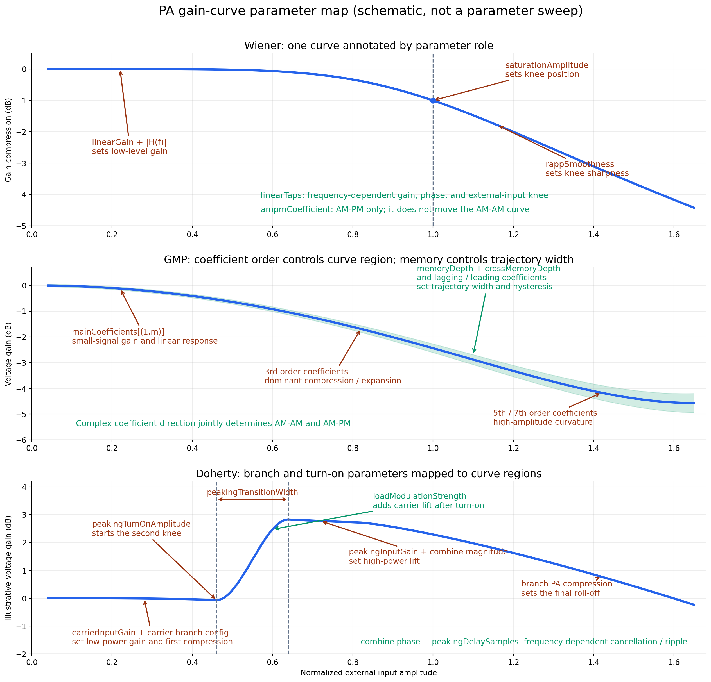

**图 6 说明**：Rapp图把三个静态参数分别映射到低功率增益、膝点位置和膝点陡峭度，并明确标出“无频响、无迟滞、无AM-PM”；Wiener图在相同压缩核心外增加FIR与AM-PM；GMP图把一阶、三阶和更高阶系数映射到低、中、高幅度曲线区域，并用阴影表示记忆参数引起的动态轨迹宽度；Doherty图把Carrier区、Peaking开启门限、开启过渡宽度、高功率增益抬升和最终压缩区分开标注。绿色文字对应不会简单移动静态曲线、却会改变频响、AM-PM、迟滞或支路抵消的参数。

### 4.9.2 Rapp曲线的精确参数关系

Rapp没有前置FIR，外部输入幅度 $r$ 直接进入静态压缩函数：

```math
G_{v,\mathrm{Rapp}}(r)
=
\frac{G}
{\left[1+\left(r/A_{\mathrm{sat}}\right)^{2p}\right]^{1/(2p)}}.
```

因此：

| Rapp配置 | 是否改变小信号增益 | 对曲线的具体影响 | 不会产生的效果 |
|---|---|---|---|
| `linearGain` | 是 | 整条增益曲线上移或下移，饱和输出按相同比例变化 | 不产生频率选择性、时延或AM-PM |
| `saturationAmplitude` | 否 | 膝点沿输入幅度轴左右移动，并改变饱和输出幅度 | 不改变原点附近斜率 |
| `rappSmoothness` | 否 | 控制软压缩到硬膝点的曲率 | 不改变小信号增益和最终饱和上限 |

Rapp参数和Wiener压缩核心参数名称相同，但二者不能混为一谈：Rapp没有 `linearTaps` 和 `ampmCoefficient`，所以它的频响、群时延、动态迟滞和AM-PM理论值均为0。它最适合作为PA测试中识别“纯静态非线性”的对照组。

### 4.9.3 Wiener 曲线的精确参数关系

Wiener 模型先经过 FIR。令某个频率处的外部输入幅度为 $A$，FIR 频率响应为 $H$, 则进入 Rapp 非线性模块的幅度为

```math
r=|H|A.
```

Rapp 电压增益为

```math
G_v(r)
=
\frac{G}
{\left[1+\left(r/A_{\mathrm{sat}}\right)^{2p}\right]^{1/(2p)}}.
```

相对于小信号增益 $G$ 的压缩量为

```math
C_{\mathrm{dB}}(r)
=
-\frac{10}{p}
\log_{10}
\left[
1+\left(\frac{r}{A_{\mathrm{sat}}}\right)^{2p}
\right].
```

在 $r=A_{\mathrm{sat}}$ 处：

```math
C_{\mathrm{dB}}(A_{\mathrm{sat}})
=
-\frac{3.0103}{p}\ {\rm dB}.
```

默认 `rappSmoothness=3.0` 时，这一点约为 1.003 dB 压缩点。因此默认 `saturationAmplitude=1.0` 可以近似理解为“FIR 输出幅度等于 1 时到达 1 dB 压缩”。

更一般地，若希望求正数形式的 $C$ dB 压缩点，则

```math
r_C
=
A_{\mathrm{sat}}
\left(10^{Cp/10}-1\right)^{1/(2p)}.
```

外部输入端看到的压缩点还要除以该频率处的 FIR 幅频响应：

```math
A_C
=
\frac{r_C}{|H|}.
```

这解释了为什么 `linearTaps` 虽然位于非线性之前，也会让不同频率的外部输入在不同幅度开始压缩。

| Wiener 配置 | 是否改变小信号增益 | 对增益曲线的具体影响 | 不会直接改变的量 |
|---|---|---|---|
| `linearGain` | 是 | 乘以 $k$ 时整条内部增益曲线上移 $20\log_{10}k$ dB，饱和输出幅度也由 $GA_{\mathrm{sat}}$ 同比例变化 | 以 FIR 输出幅度表示的压缩膝点位置 |
| `saturationAmplitude` | 否 | 增大时膝点向右移动，渐近饱和输出 $GA_{\mathrm{sat}}$ 同时增大 | 原点附近斜率 $G$ |
| `rappSmoothness` | 否 | 增大时线性增益保持更久，随后更突然地压缩；减小时压缩提前且更圆滑 | 小信号增益和渐近饱和输出 |
| `linearTaps` | 是，而且随频率变化 | 改变 $H$ 的幅相响应；某频率的 $|H|$ 越大，该频率相对外部输入越早进入压缩 | Rapp 模块自身以 $r/A_{\mathrm{sat}}$ 表示的归一化形状 |
| `ampmCoefficient` | 否 | 不改变当前代码中的 AM-AM 或增益幅度曲线，只增加幅度相关相位旋转 | 输出幅度；但 EVM 仍可能明显变化 |

几个调参结论可以直接从上式得到：

- 想让整条增益曲线提高 3 dB，可把 `linearGain` 乘以约 1.412；
- 想让压缩点在输入幅度轴上向右移动 20%，可把 `saturationAmplitude` 乘以 1.2；
- 想保留相同小信号增益但让膝点更硬，只增大 `rappSmoothness`；
- 想只增加 AM-PM 而保持 AM-AM 不变，只修改 `ampmCoefficient`；
- 想模拟带内不同子载波具有不同增益和压缩点，应修改 `linearTaps`，而不是只修改 `linearGain`。

### 4.9.4 GMP 曲线由哪些系数决定

对已经越过启动暂态的恒包络输入

```math
x[n]=re^{j\theta},
```

所有延迟样本的幅度与相位相同。此时同一阶次的主项、滞后项和超前项可以合并为

```math
C_p
=
\sum_m a_{p,m}
+
\sum_{m,l}b_{p,m,l}
+
\sum_{m,l}c_{p,m,l}.
```

稳态输出和等效复增益分别为

```math
y
=
e^{j\theta}
\sum_p C_p r^p,
```

```math
G_{\mathrm{GMP}}(r)
=
\frac{y}{x}
=
\sum_p C_p r^{p-1}.
```

因此 GMP 的幅度增益和 AM-PM 为

```math
G_v(r)
=
\left|
\sum_p C_p r^{p-1}
\right|,
```

```math
\phi(r)
=
\angle
\left(
\sum_p C_p r^{p-1}
\right).
```

`DefaultGmpCoefficients` 先保存一组全强度参考拟合 $C_p^{ref}$。普通
`GMPConfig` 默认 `nonlinearScale=0.135`，只缩放 $p>1$ 的参考项：

```math
C_1=C_1^{ref},
\qquad
C_p=0.135C_p^{ref},\quad p>1.
```

默认 `(1, 3, 5, 7)`、`memoryDepth=3`、`crossMemoryDepth=2` 在恒包络稳态下的
参考系数和实际有效系数为：

| 阶次 | 全强度参考 $C_p^{ref}$ | 默认有效 $C_p$ | 对默认曲线的主要作用 |
|---:|---:|---:|---|
| 1 | $1.261692+j0.014052$ | $1.261692+j0.014052$ | 小信号复增益 |
| 3 | $-0.291144+j0.054204$ | $-0.03930444+j0.00731754$ | 主要软压缩和轻度 AM-PM |
| 5 | $0.031812-j0.022452$ | $0.00429462-j0.00303102$ | 修正压缩膝点及中高幅度相位 |
| 7 | $-0.000168+j0.002784$ | $-0.00002268+j0.00037584$ | 保持拟合区间高幅度端平滑 |

这些数值不是器件测量值。全强度参考是在 $0\leq r\leq2$ 的归一化输入幅度
范围内对有界Rapp型AM-AM和轻度AM-PM曲线拟合得到的；默认0.135强度保留可测
功率趋势，同时避免20 dBm基线过度失真。`nonlinearScale=1.0` 可恢复全强度
压力参考，但不应再把它称为普通默认。显式提供三个系数字典时，调用方数值是
最终执行值，不会再乘 `nonlinearScale`。该区间内的默认输出幅度保持单调：

```math
\frac{d}{dr}
\left|
\sum_p C_p r^p
\right|
>0,
\qquad 0\leq r\leq2.
```

例如，默认稳态截面为：

| 输入幅度 $r$ | 输出幅度 | 局部幅度斜率 | 输出相位 |
|---:|---:|---:|---:|
| 0.55 | 0.6877 | 1.2281 | 0.73度 |
| 0.80 | 0.9907 | 1.1952 | 0.81度 |
| 1.00 | 1.2268 | 1.1653 | 0.87度 |
| 1.30 | 1.5699 | 1.1232 | 0.93度 |
| 1.70 | 2.0121 | 1.0965 | 0.92度 |
| 2.00 | 2.3438 | 1.1237 | 0.92度 |

输出斜率始终为正，曲线呈温和压缩而没有出现“输入继续增大、输出反而
减小”的多项式折返。幅度超过 2 属于拟合区间之外的外推，代码不会声称该
区域仍满足单调性、器件精度或稳定可逆性。

默认生成器还显式解耦“稳态曲线”和“记忆动态”。对 $p>1$ 且 $C_p\neq0$
的阶次，先定义交叉衰减：

```math
d_{m,l}
=
(0.22)^m(0.42)^l.
```

默认滞后与超前交叉系数分别为：

```math
b_{p,m,l}
=
C_p(-0.060+j0.025)d_{m,l},
```

```math
c_{p,m,l}
=
C_p(0.040-j0.018)d_{m,l}.
```

交叉项因此按照各自阶次的稳态 $C_p$ 同比例缩放，而不是让三阶、五阶、七阶
共用同一组绝对系数。由于高阶基函数在大幅度处按 $r^p$ 增长，这项比例约束
可以避免很小的高阶稳态项被过大的绝对交叉系数重新放大；若某阶默认
$C_p=0$，该阶不会生成默认交叉项。

再对每个阶次定义全部非零延迟主项及交叉项之和：

```math
T_p
=
\sum_{m=1}^{M-1}a_{p,m}
+
\sum_{m,l}b_{p,m,l}
+
\sum_{m,l}c_{p,m,l}.
```

零延迟主项不是再复制一份静态压缩系数，而是取剩余量：

```math
a_{p,0}
=
C_p-T_p.
```

因此恒包络进入稳态后必然满足：

```math
\sum_m a_{p,m}
+
\sum_{m,l}b_{p,m,l}
+
\sum_{m,l}c_{p,m,l}
=
C_p.
```

这项约束保证默认配置改变 `memoryDepth` 或 `crossMemoryDepth` 时，只改变暂态、
频响和包络历史依赖，不会悄悄移动上述稳态 AM-AM/AM-PM 曲线。默认高阶主
支路的第一条延迟尾项约为对应 $C_p$ 的 6%，后续继续快速衰减；它足以形成
可测的电记忆，又不会把同一份压缩逐个延迟抽头重复累加。

对完整默认阶次 `(1, 3, 5, 7)`，先放置8个零样点，再发送16个恒幅样点，
并采用默认三阶主记忆和二阶交叉记忆。在0.25至2.0的输入幅度扫描中定义平台
纹波：

```math
R_{\mathrm{plateau}}
=
20\log_{10}
\left(
\frac{\max_n |y[n]|}{\min_n |y[n]|}
\right).
```

七个验证幅度0.25、0.50、0.90、1.20、1.50、1.70和2.00的最大平台纹波约为
0.3084 dB；首点相对第7个样点以后稳态均值的最大绝对偏差约为0.1704 dB。
这个测试限制的是默认演示系数的短时动态，不是对任意实测
自定义字典强加物理限制。

**非默认阶次集合。**生成器先把调用方的 `nonlinearScale` 作用于三阶及以上
参考项。完整四阶拟合中的高阶项可能负责抵消低阶项的折返，直接删除某一阶
不能保证剩余多项式仍单调。因此 `DefaultGmpCoefficients` 对包含一阶项的
非默认集合保留 $C_1$，必要时再用同一个安全系数 $\gamma$ 缩小所有已经过
`nonlinearScale` 处理的非线性稳态项：

```math
\widetilde C_1=C_1,
\qquad
\widetilde C_p=\gamma C_p,
\quad p>1,
```

其中 $0\leq\gamma\leq1$，由0至2幅度网格上的单调性搜索确定；需要缩放时再
保留2%的数值余量。完整 `(1, 3, 5, 7)` 已经单调，所以 $\gamma=1$，但这不
撤销前一级默认0.135强度。参考表没有定义的9阶及更高阶默认稳态系数为0，不再使用可能在
大幅度处失控的经验外推系数。

如果请求的默认阶次集合不含一阶项，模型没有有意义的小信号增益。生成器只把
最低请求阶次设为1，其余请求阶次设为0：

```math
\widetilde C_{p_{\min}}=1,
\qquad
\widetilde C_p=0,
\quad p>p_{\min}.
```

这只能作为单调、确定的数值后备值。真实PA若确实需要无一阶支路或未知高阶项，
应传入实测的三个系数字典；显式字典不会被上述默认单调化规则改写。

| GMP 配置 | 使用默认系数时的影响 | 提供自定义系数时的影响 |
|---|---|---|
| `nonlinearOrders` | 决定生成哪些奇数阶；含一阶的非默认子集会共同缩小非线性 $C_p$ 以保持0至2内单调，未知高阶默认值为0；不含一阶时只启用最低阶后备项 | 数值曲线由三个系数字典中的实际键和值决定，默认单调化不会改写显式字典 |
| `memoryDepth` | 增加主项延迟抽头；默认一阶尾抽头改变小信号频响，高阶尾抽头改变动态压缩，零延迟项会自动回调以保持稳态 $C_p$ 不变 | 自定义字典是最终执行项；只改深度不会自动创建或删除调用方给出的键 |
| `crossMemoryDepth` | 增加滞后/超前包络项并回调默认零延迟主项；增强动态 AM-AM、AM-PM 和迟滞，但不改变默认稳态曲线 | 自定义 `laggingCoefficients`、`leadingCoefficients` 的实际内容决定执行项 |
| `nonlinearScale` | 默认0.135；在默认系数生成时统一缩放三阶及以上参考项，一阶不变；1.0恢复全强度压力参考 | 显式系数字典是最终值，不重复乘该比例 |
| `mainCoefficients[(1,m)]` | 直接决定小信号 FIR 增益和频率响应 | 实部、虚部共同决定幅度与相位，不能把虚部简单理解成“只影响相位” |
| `mainCoefficients[(p,m)]`, $p>1$ | 决定静态曲率和对应阶次的记忆 | 负实方向的三阶项常产生压缩，正实方向常产生扩张，但最终结果取决于所有复向量之和 |
| `laggingCoefficients` | 对恒包络稳态并入 $C_p$，对调制包络形成历史依赖 | 增大后通常加宽同一输入幅度对应的增益散点或迟滞环 |
| `leadingCoefficients` | 对恒包络稳态并入 $C_p$，对调制包络补充另一类动态相关性 | 影响动态轨迹；代码仍是因果延迟，并不读取未来样本 |

三个系数字典分别判断是否为 `None`。因此，同阶动态项严格零和、恒包络稳态系数保持为 $C_p$ 的保证适用于三个字典全部采用默认值的完整组合；只覆盖其中一部分时，自定义项与其余默认项会共同求和，稳态曲线可能随之移动。例如只自定义 `mainCoefficients`，却让 `laggingCoefficients=None` 和 `leadingCoefficients=None`，只要 `crossMemoryDepth>0`，代码仍会生成默认交叉项。若需要严格的无记忆自定义曲线，`mainCoefficients` 中应只保留 `memoryIndex=0` 的键，并采用下面两种方式之一关闭交叉项：把 `crossMemoryDepth=0`；或者把 `laggingCoefficients={}` 与 `leadingCoefficients={}` 显式传入。两种方式不要求同时使用。把 `memoryDepth=1` 写入配置可以表达并校验调用方意图，但它不会主动删除自定义字典中已经存在的延迟键。

GMP 最重要的使用边界是：**具有记忆时不存在一条能完整描述宽带 PA 的唯一增益曲线**。静态扫幅只给出恒包络稳态截面。对 Wi-Fi 波形，同一个当前幅度 $|x[n]|$ 会因为过去包络不同而得到不同增益，所以 AM-AM 图会形成一条有宽度的轨迹带。此时应同时查看：

- 恒包络静态增益曲线；
- 上升包络与下降包络的增益差；
- 不同双音间隔下的 IM3、IM5、IM7；
- 带内频响和群时延；
- Wi-Fi EVM 与 ACLR。

这些动态测试在 [PaAnalyse.md](./PaAnalyse.md) 中给出。

### 4.9.5 Doherty 曲线为什么有两个膝点

忽略支路时延并把两条支路的复电压增益记为 $G_c(r)$ 和 $G_p(r)$。Doherty 的稳态总复增益近似为

```math
G_D(r)
=
c_c
\left[1+\lambda a(r)\right]
g_c G_c(g_c r)
+
c_p
g_p a(r)
G_p\left(g_p a(r)r\right).
```

低于 `peakingTurnOnAmplitude` 时 $a(r)=0$，只有 Carrier 支路；进入过渡区后，Peaking 支路逐渐加入，同时 Carrier 的简化负载调制因子从 1 增长到 $1+\lambda$。所以 Doherty 增益曲线通常包含：

1. Carrier 单独工作的低功率区；
2. Peaking 开启和负载调制形成的第二膝点；
3. 两支路共同工作并可能共同压缩的高功率区。

| Doherty 配置 | 对低功率区的影响 | 对过渡区和高功率区的影响 |
|---|---|---|
| `carrierModelName` 与 Carrier 配置 | 决定小信号增益、第一压缩膝点、Carrier 记忆 | Carrier 在全幅度区持续贡献 |
| `peakingModelName` 与 Peaking 配置 | Peaking 关闭时无影响 | 决定开启后的压缩、AM-PM 和记忆 |
| `carrierInputGain` | 增大时小信号增益提高，同时 Carrier 相对外部输入更早压缩 | 也改变与 Peaking 的幅相平衡 |
| `peakingInputGain` | 无影响 | 增大时 Peaking 贡献更强，但它自身也更早进入压缩 |
| `peakingTurnOnAmplitude` | 不改变门限以下曲线 | 增大时第二膝点向右移动，减小时 Peaking 更早开启 |
| `peakingTransitionWidth` | 不改变远低于门限的曲线 | 增大时开启更平滑、更宽；减小时开启更突然 |
| `carrierCombineCoefficient` | 其幅度直接缩放低功率增益，相位旋转 Carrier 输出 | 参与两支路矢量合成 |
| `peakingCombineCoefficient` | Peaking 关闭时无影响 | 幅度决定 Peaking 权重；相位失配可造成高功率增益下凹甚至局部抵消 |
| `loadModulationStrength` | 门限以下无影响 | 增大时 Carrier 在 Peaking 开启区获得更强的增益抬升 |
| `peakingDelaySamples` | 恒包络稳态且暂态丢弃后基本不改变静态曲线 | 对调制和多音信号形成频率相关相位差，可能造成增益波纹、动态迟滞和合成抵消 |

`peakingDelaySamples` 是一个典型例子：静态 AM-AM 曲线可能看不出它的影响，但 Wi-Fi EVM、带内平坦度和 ACLR 会变差。因此不能只凭一张静态增益曲线判断 Doherty 配置是否合理。

### 4.9.6 哪些外部配置只移动工作点，不改变 PA 方程

工程还存在若干与功率有关的配置。它们和 PA 曲线参数必须分开理解：

| 外部配置 | 实际作用 | 是否改变归一化 PA 曲线 |
|---|---|---|
| `Channel.Process(..., outputPowerDbm=...)` | 闭环调整PA输入缩放，直到接收非理想之前的干净PA自身有效输出达到目标dBm；正式一次PA/热周期再返回 `(chOut, fbOut)` | 否；它让波形沿同一条曲线移动到不同工作点 |
| `maximumOutputPowerDbm` | 定义归一化输出与绝对 dBm 的标尺，并限制允许目标 | 否 |
| `inputPowerDbPerChain` | 在每路 PA 前乘电压比例，改变驱动和压缩深度 | 否；改变外部输入轴上的工作点 |
| `outputPowerDbPerChain` | PA 后施加常数相对增益 | 不改变内部压缩，只让观察到的 AM-AM 曲线竖直缩放 |
| `targetOutputPowerDbmPerChain` | `MimoPaModel` 的兼容性 PA 后绝对缩放接口 | 不改变内部压缩；主测试流程应优先用 Channel 闭环 |
| `width` | 在 PA 公开输入和输出边界量化 I/Q 码值 | 不改变内部浮点方程，但会让低幅度曲线出现量化台阶，过大码值还会剪切 |

例如把 `outputPowerDbm` 从15 dBm改为22 dBm，不是把 `linearGain` 改大，而是由Channel自动增加PA驱动，使波形在同一条增益曲线上向压缩区移动。因此输出功率升高时，测得增益、EVM和ACLR可以同时恶化。这个目标始终定义在PA后耦合前、反馈接收机之前的干净物理输出面；即使 `fbGainDb=-6 dB`，也不会把raw `fbOut` 的表观功率当成PA少了6 dB而继续推高驱动。

### 4.9.7 典型调参目标与推荐配置

| 目标 | 首选配置 | 调整方向 | 同时检查 |
|---|---|---|---|
| 提高Rapp小信号增益 | `linearGain` | 增大 | 饱和输出同步提高 |
| 把Rapp压缩点右移 | `saturationAmplitude` | 增大 | 膝点和饱和幅度同步变化 |
| 让Rapp膝点更硬 | `rappSmoothness` | 增大 | IM5、IM7和接近饱和时的可逆性 |
| 提高 Wiener 小信号增益 | `linearGain` | 增大 | 饱和输出也会同倍增加 |
| 把 Wiener 压缩点右移 | `saturationAmplitude` | 增大 | 输出归一化标尺和目标 dBm 的映射 |
| 让 Wiener 膝点更硬 | `rappSmoothness` | 增大 | 高 PAPR 波形峰值是否突然剪切 |
| 增加 AM-PM 但保持 AM-AM | `ampmCoefficient` | 增大绝对值 | EVM、相位随幅度曲线 |
| 增加 GMP 压缩 | 三阶及更高阶复系数 | 增强与一阶项相反方向的合成分量 | 高幅度外推稳定性 |
| 增加 GMP 记忆 | `memoryDepth`、`crossMemoryDepth` 或对应自定义系数 | 增大有效延迟范围 | 采样率变化后的物理记忆时间 |
| 让 Doherty 更早开启 Peaking | `peakingTurnOnAmplitude` | 减小 | 低中功率增益隆起和线性度 |
| 平滑 Doherty 第二膝点 | `peakingTransitionWidth` | 增大 | Peaking 开启是否过慢 |
| 增强高功率 Doherty 输出 | `peakingInputGain`、`peakingCombineCoefficient`、`loadModulationStrength` | 适量增大 | 两支路相位、时延和各自压缩 |
| 消除 Doherty 高功率增益下凹 | 两个复合成系数与 `peakingDelaySamples` | 先校相位和时延，再调幅度 | 不同频率下的矢量合成 |

下面给出三个与实际曲线关系明确的配置例子。代码注释使用英文，并显式选择 `width=0`，避免定点量化掩盖模型本身的增益曲线。

```python
from inc.lib.PaModel import (
    DohertyConfig,
    GMPConfig,
    PaModel,
    RappConfig,
    WienerConfig,
)


# Build a strictly memoryless SSPA reference with no AM-PM or delay.
rappPa = PaModel(
    parameters={
        "modelName": "rapp",
        "rappConfig": RappConfig(
            linearGain=1.0,
            saturationAmplitude=1.0,
            rappSmoothness=3.0,
        ),
        "width": 0,
    }
)


# Move the Wiener compression knee 20 percent to the right without
# changing its low-level voltage gain.
wienerPa = PaModel(
    parameters={
        "modelName": "wiener",
        "wienerConfig": WienerConfig(
            linearGain=1.0,
            saturationAmplitude=1.2,
            rappSmoothness=3.0,
            ampmCoefficient=0.18,
        ),
        "width": 0,
    }
)

# Build a transparent memoryless GMP curve. The negative real cubic
# coefficient bends the complex gain toward compression.
gmpPa = PaModel(
    parameters={
        "modelName": "gmp",
        "gmpConfig": GMPConfig(
            nonlinearOrders=(1, 3, 5),
            memoryDepth=1,
            crossMemoryDepth=0,
            mainCoefficients={
                (1, 0): 1.0 + 0.0j,
                (3, 0): -0.55 + 0.12j,
                (5, 0): 0.10 - 0.04j,
            },
            laggingCoefficients={},
            leadingCoefficients={},
        ),
        "width": 0,
    }
)

# Move the Doherty peaking turn-on point earlier while retaining
# independent branch nonlinearities.
dohertyPa = PaModel(
    parameters={
        "modelName": "doherty",
        "dohertyConfig": DohertyConfig(
            carrierModelName="wiener",
            peakingModelName="wiener",
            peakingTurnOnAmplitude=0.35,
            peakingTransitionWidth=0.15,
            peakingInputGain=1.0,
            peakingCombineCoefficient=0.5 + 0.0j,
            loadModulationStrength=0.10,
        ),
        "width": 0,
    }
)
```

### 4.9.8 用当前配置直接测出增益曲线

下面的最小示例不依赖 Wi-Fi、ILC 或 Analysis，只使用恒包络扫幅直接测量当前 PA 对象的静态增益。每个幅度生成 64 个相同复样本，并取最后一个样本，以避开 FIR 和整数支路时延的启动暂态。

```python
import numpy as np

from inc.lib.PaModel import PaModel, WienerConfig


paModel = PaModel(
    parameters={
        "modelName": "wiener",
        "wienerConfig": WienerConfig(
            linearGain=1.0,
            saturationAmplitude=1.0,
            rappSmoothness=3.0,
            ampmCoefficient=0.18,
        ),
        "width": 0,
    }
)

inputAmplitudes = np.linspace(0.02, 1.60, 160)
outputAmplitudes = []
gainDbValues = []
phaseDegrees = []

for inputAmplitude in inputAmplitudes:
    steadyInput = np.full(64, inputAmplitude + 0.0j)
    steadyOutput = paModel.Process(steadyInput)
    complexGain = steadyOutput[-1] / steadyInput[-1]
    outputAmplitudes.append(abs(steadyOutput[-1]))
    gainDbValues.append(20.0 * np.log10(abs(complexGain)))
    phaseDegrees.append(np.degrees(np.angle(complexGain)))

print("Small-signal complex gain:", paModel.SmallSignalGain())
print("Input amplitudes:", inputAmplitudes)
print("Output amplitudes:", np.asarray(outputAmplitudes))
print("Gain in dB:", np.asarray(gainDbValues))
print("AM-PM in degrees:", np.asarray(phaseDegrees))
```

若测 GMP 或 Doherty 的**动态**增益，不应只把输入换成 Wi-Fi 后逐点相除，因为包络零点会放大数值噪声，时延也会造成错误配对。应使用 [PaAnalyse.md](./PaAnalyse.md) 中的包络分箱、上升/下降轨迹、频响和双音测试。

---

## 4.10 分段 GMP：幅度相关工作区的平滑组合

### 4.10.1 为什么单一 GMP 有时过于理想

普通 GMP 在整个输入幅度范围内使用同一组复系数。若 PA 的小信号区、压缩
过渡区和高峰值区由不同工作机制主导，例如 Doherty 峰值支路开启、包络跟踪
电源变化或偏置状态变化，一个全局多项式往往需要更高阶数才能兼顾所有区域。
更高阶数会增加基函数相关性，并可能让训练区外的响应振荡。

`PiecewiseGMPPA` 把归一化瞬时输入包络

```math
r[n]=|x[n]|
```

划分为 low、middle、high 三个重叠区域，每个区域拥有完整的 GMP 系数集。
这里的“低、中、高”是一个 OFDM 帧内逐样点变化的包络区，不是把不同平均
输出功率 dBm 的三次采集直接拼成三个区域。

### 4.10.2 $C^2$ 软门控

默认边界为 $b_1=0.25$、$b_2=0.60$，完整过渡宽度为
$\Delta_1=0.12$、$\Delta_2=0.18$。对每个边界先计算

```math
z_i(r)
=
\mathrm{clip}
\left(
\frac{r-(b_i-\Delta_i/2)}{\Delta_i},
0,
1
\right),
```

再使用

```math
S(z)=6z^5-15z^4+10z^3.
```

三个权重为

```math
w_L=1-S(z_1),
```

```math
w_M=S(z_1)[1-S(z_2)],
```

```math
w_H=S(z_1)S(z_2).
```

它们非负且逐样点和为 1。`smootherstep` 在过渡两端的一阶、二阶导数均为
零，因此区域系数不同也不会形成硬切换。设第 $q$ 区 GMP 为 $F_q(x)$，输出为

```math
y[n]
=
w_L(r[n])F_L(x)[n]
+w_M(r[n])F_M(x)[n]
+w_H(r[n])F_H(x)[n].
```

实现没有把三套 `GMPPA.Process` 简单串行运行。它先收集所有区域实际使用的
延迟和包络幂，只计算一次共同基函数，再把区域系数写成“第一区系数加相邻差分”
进行累加，所以仍保持因果补零和确定性，同时避免三次重复构造大数组。

### 4.10.3 默认区域与自定义区域

默认 `regionConfigs=None` 时，三个区域共同采用 `(1,3,5)` 阶、主记忆深度 2、
交叉记忆深度 1。低区稍接近线性，中区保持基准压缩，高区增加 AM-PM 和动态
记忆强度；默认恒包络 AM-AM 在 $0\leq r\leq2$ 内保持不折返。默认值用于构造
比纯全局 GMP 更难、但仍可逆的无噪行为 plant，不代表某一颗器件的实测系数。

调用方也可以给每个区域提供独立 `GMPConfig`：

```python
from inc.lib.PaModel import (
    GMPConfig,
    PaModel,
    PiecewiseGMPConfig,
)

regionConfigs = (
    GMPConfig(
        nonlinearOrders=(1, 3, 5),
        memoryDepth=2,
        crossMemoryDepth=1,
    ),
    GMPConfig(
        nonlinearOrders=(1, 3, 5, 7),
        memoryDepth=3,
        crossMemoryDepth=2,
    ),
    GMPConfig(
        nonlinearOrders=(1, 3, 5, 7),
        memoryDepth=4,
        crossMemoryDepth=2,
    ),
)

piecewisePa = PaModel(
    modelName="piecewise_gmp",
    piecewiseGmpConfig=PiecewiseGMPConfig(
        regionBoundaries=(0.25, 0.60),
        transitionWidths=(0.12, 0.18),
        regionConfigs=regionConfigs,
    ),
    width=0,
)

paOutput = piecewisePa.Process(paInput)
```

`regionBoundaries` 必须严格递增，`transitionWidths` 必须逐项为正，且显式
`regionConfigs` 的数量必须等于边界数加一。允许过渡区重叠，因为层级权重仍
保持非负和单位和。

### 4.10.4 系数能否单调

不要求同一 GMP 项在 low、middle、high 之间单调，也不要求复系数同号。
复数没有自然全序；相位参考旋转、相关基函数之间的抵消、列归一化和区域样本
分布都可能让单个系数变号，而总 AM-AM/AM-PM 仍平滑。应约束和验收的是稳态
输出幅度不折返、相位连续且斜率有界、过渡区没有异常谱再生，以及独立帧上的
EVM/ACLR。论文依据、相邻区域差分正则和慢状态插值方案见
[FAQ Q10](./FAQ.md#q10分段gmp的低中高功率系数能否保持单调系数正负号必须相同吗)。

---

## 5. 非线性为什么会产生邻道频谱再生

考虑两个复音调

```math
x(t)=A_1e^{j2\pi f_1t}+A_2e^{j2\pi f_2t}.
```

三阶项 $x\lvert x\rvert^2$ 展开后，除原频率外还会产生

```math
2f_1-f_2,\qquad 2f_2-f_1
```

等三阶互调分量。若 $f_1$、$f_2$ 位于信道边缘，新分量可能落到信道外。

OFDM 可看成几百到几千个音调之和。三阶、五阶项会对这些音调做大量组合，形成连续的带外“裙边”：

```text
功率谱密度
 ^              原信道
 |             __________
 |            /          \
 |      _____/            \_____
 |_____/                         \_____> 频率
      下邻道       主信道          上邻道
       ↑ 非线性频谱再生落入相邻信道 ↑
```

**图 5 说明**：线性 PA 只改变信号整体增益与相位；非线性相当于波形自身混频，能量从主信道扩展到两侧。ACLR 正是衡量主信道功率与这些邻道泄漏功率之比。

记忆效应还会使上下邻道不完全对称，因为不同频率组合经历的复增益不同。

---

## 6. GMP 与 Volterra 思想的关系

具有有限记忆的弱非线性系统可以用 Volterra 级数表示。离散三阶项的一般形式包含三重求和：

```math
y_3[n]=\sum_{m_1}\sum_{m_2}\sum_{m_3}
h_3[m_1,m_2,m_3]
x[n-m_1]x[n-m_2]x^*[n-m_3].
```

完整 Volterra 模型的参数数量随阶次和记忆深度迅速增长。GMP 选择其中最有代表性的“对角项”和少量相邻交叉项，把复杂度压缩到线性可估计的基函数集合：

```math
\mathbf y=\mathbf\Phi\mathbf c.
```

这里 $\mathbf\Phi$ 的每一列是一种 GMP 基函数，$\mathbf c$ 是复系数。模型对输入是非线性的，但对未知系数是线性的，因此可以用最小二乘、岭回归等方法从实测输入/输出辨识。

---

## 7. IQ 失衡模型

理想复基带只有直接项 $y$。I/Q 两路增益或相位不匹配时，可用广义线性模型表示：

```math
y_{\mathrm{IQ}}[n]=\alpha y[n]+\beta y^*[n].
```

其中：

- $\alpha$ 是期望的直接路径；
- $\beta$ 是共轭镜像路径；
- $y^*$ 会把频率 $+f$ 映射到 $-f$，因此产生镜像频谱。

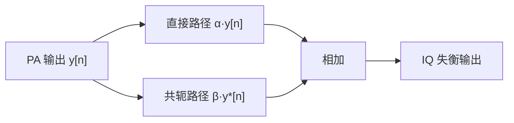
```mermaid
flowchart LR
    A["PA 输出 y[n]"] --> B["直接路径 α·y[n]"]
    A --> C["共轭路径 β·y*[n]"]
    B --> D["相加"]
    C --> D
    D --> E["IQ 失衡输出"]
```

**图 6 说明**：当 $\beta=0$ 时没有镜像；$\lvert\beta\rvert$ 越大，镜像越强。`IQImbalancePA` 把任意基础 PA 的输出包装成这一形式，可测试普通复多项式 DPD 对非解析共轭失真的处理边界；它是归因仿真用的代数包装器，并不声明镜像位于Tx调制器还是FB接收机。需要真实参考面时，应使用Channel的 `txIq...` 参数把误差放在PA前，或使用 `fbIq...` 参数把误差只放在反馈采样支路。

当被包装对象启用电热模型时，`IQImbalancePA` 保持包装器透明：`ProcessThermalPeriodFloating` 先让物理PA按完整周期求温度相关输出，再在输出参考面叠加直接项和共轭项；`SuspendThermalModel`、`RestoreThermalModel`、`GetThermalMetrics`、`CalculateActualDutyCycle`、`ResetThermalState` 和 `AdvanceIdle` 都代理到被包装PA。这样功率校准试探仍能暂停并恢复同一份热状态，Channel也能透过包装器识别热模型、读取metrics和调度占空比。共轭包装器没有独立热容，且输出镜像不会反向改变已经在物理PA输出参考面计算的耗散功率。包装器还实现成对的 `ProcessCalibrationDrive` 与 `SetCalibrationDriveDb`：内部plant支持时分别代理未提交试探和最终提交，否则由包装器保存并施加后备drive；二者必须同时存在，避免试探与正式处理参考面不一致。`ProcessOutputPathsFloating` 再优先调用内部plant同名协议以保留已提交的post-DAC模拟驱动和两条观测路径，然后分别对 `chOut` 与 `fbOut` 应用广义线性I/Q变换；`ProcessFloating` 仍保持不额外应用隐藏驱动的raw语义。

---

## 8. 反馈 AWGN 模型

ILC 依赖每轮 PA 反馈。测量链噪声用复白高斯噪声表示。若信号平均功率为

```math
P_s=E[|y|^2]
```

且目标信噪比为 $\mathrm{SNR}_{\mathrm{dB}}$，则

```math
P_n=\frac{P_s}{10^{\mathrm{SNR}_{\mathrm{dB}}/10}}.
```

复噪声写成

```math
w=w_I+jw_Q,
```

其中独立实部、虚部满足

```math
w_I,w_Q\sim\mathcal N\left(0,\frac{P_n}{2}\right).
```

所以 $E[\lvert w\rvert^2]=P_n$。`AddAwgn` 实现的正是这一缩放。这里的 AWGN 表示反馈接收机热噪声/量化噪声的简化等效，不包含相位噪声、频偏、非线性 ADC 或相关噪声。

---

## 9. 五类模型的选择

| 对比项 | Rapp | Wiener | GMP | 分段GMP | Doherty |
|---|---|---|---|---|---|
| 结构 | 单样点静态AM-AM | FIR后接静态非线性 | 多阶、多延迟、交叉包络基函数并联 | 多区域GMP经软门控联合 | Carrier与Peaking两条行为PA并联合成 |
| 参数数量 | 最少，3个 | 少 | 较多 | 约为各区域非零项之和 | 取决于两条支路模型 |
| 物理直觉 | 纯SSPA软压缩 | 很直观 | 需要基函数理解 | 对应幅度相关工作区 | 直接对应双支路开启和合成 |
| 动态非线性表达力 | 无 | 中等、结构受限 | 强 | 强，并能表达区域变化 | 两支路可各自使用Wiener或GMP |
| 系数辨识 | 静态AM-AM拟合 | 非线性参数拟合可能较复杂 | 对系数线性，可最小二乘 | 联合最小二乘并做区域平滑 | 需要分别辨识支路及开启/合成参数 |
| 计算量 | 最低 | 较低 | 随阶次/记忆/交叉深度增加 | 共享基函数后高于稀疏单一GMP | 约为两条所选支路之和 |
| 适合用途 | 无记忆基线、静态压缩和算法归因 | 算法原理验证、可解释压缩曲线 | 宽带PA行为拟合、DPD基函数验证 | Doherty、ET等幅度分区行为和模型失配验证 | Doherty架构、支路失配和开启区研究 |

建议：先用Rapp隔离纯静态压缩，再用Wiener观察简单线性记忆和AM-PM；用
GMP验证基础宽带动态非线性；需要让PA与普通全局GMP DPD存在可控结构失配时
使用分段GMP；需要研究载波/峰值支路物理开启与合成时再使用Doherty。

---

## 10. 多路 MIMO PA 与每路独立输出功率

MIMO 数字基带数组采用“样点 × 物理发射链”的形状：

```math
\mathbf X=
\begin{bmatrix}
x_1[0]&\cdots&x_{N_{TX}}[0]\\
\vdots&\ddots&\vdots\\
x_1[N-1]&\cdots&x_{N_{TX}}[N-1]
\end{bmatrix}.
```

`MimoPaModel` 为第 $m$ 列建立独立的 `PaModel`。在当前独立 PA 假设下：

```math
z_m[n]
=b_m\,f_m\!\left(a_m x_m[n]\right),
```

其中 $f_m(\cdot)$ 可以是该路自己的Rapp、Wiener、GMP、分段GMP或Doherty模型，输入和输出幅度标尺分别为

```math
a_m=10^{G_{\mathrm{in},m}/20},
\qquad
b_m=10^{G_{\mathrm{out},m}/20}.
```

这里 dB 量对应功率比，但复包络代码乘的是幅度，所以使用 $20\log_{10}$：

```math
G_{\mathrm{out},m}
=10\log_{10}\frac{P_m}{P_{m,0}}
=20\log_{10}\frac{r_m}{r_{m,0}},
```

$r_m$ 是复包络 RMS。比如 `outputPowerDbPerChain=(0,-3,-6)` 会让三路幅度相对比例约为 $1:0.708:0.501$，功率比例约为 $1:0.501:0.251$。

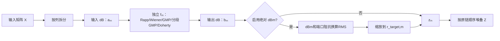
```mermaid
flowchart LR
    matrix["输入矩阵 X"] --> split["按列拆分"]
    split --> in0["输入 dB：aₘ"]
    in0 --> pa0["独立 fₘ：Rapp/Wiener/GMP/分段GMP/Doherty"]
    pa0 --> out0["输出 dB：bₘ"]
    out0 --> target{"启用绝对 dBm?"}
    target -->|否| column["zₘ"]
    target -->|是| convert["dBm和端口阻抗换算RMS"]
    convert --> normalize["缩放到 r_target,m"]
    normalize --> column
    column --> stack["按原链顺序堆叠 Z"]
```

**图 7 说明**：输入dB改变非线性PA工作点；输出dB是PA后的相对线性校准。`MimoPaModel` 内部绝对输出dBm目标属于兼容接口，会在最后一级直接缩放输出。主流程不使用它设定物理工作点，而由 `Channel.Process(rawSignal, outputPowerDbm=...)` 内部的 `PowerCalibration` 反复调整PA输入并测量实际输出；20 dBm相对25 dBm极限的5 dB回退只作为闭环初值。

若设绝对目标 $r_{\mathrm{target},m}$，代码先算未经绝对校准的

```math
r_m=\sqrt{\frac{1}{N}\sum_n|z_m[n]|^2},
```

再输出

```math
y_m[n]=\frac{r_{\mathrm{target},m}}{r_m}z_m[n].
```

PA后常数标定只适合兼容旧数据或模拟已知线性增益，不能用于比较相同绝对输出功率下的真实失真。此类比较必须调用 `Channel.Process(rawSignal, outputPowerDbm=...)`，由其内部校准器在PA输入端闭环，使压缩深度、EVM和ACLR随实际驱动共同变化。

Python接口优先使用 `targetOutputPowerDbmPerChain` 和 `SetTargetOutputPowerDbm`。`targetOutputRmsPerChain` 与 `SetTargetOutputRms` 仅保留为旧接口；同一条链不能同时设置RMS和dBm目标。`GetOutputPowerDbmPerChain` 返回最近一次完整处理后按相同端口阻抗换算的实际功率。

### 10.1 独立 PA 假设的边界

`MimoPaModel`本身仍满足

```math
y_m[n]=F_m\{x_m[n]\},
```

而没有 $x_q,q\ne m$ 的交叉项。因此它负责每一路不同的器件结构、记忆、驱动和输出功率。PA前后电气串扰由 `Channel.prePaCouplingPaths` 和 `Channel.postPaCouplingPaths` 建模：

```math
\mathbf u(n)=\mathbf H_{\mathrm{pre}}(z)\mathbf x(n),
```

```math
\mathbf z(n)=\mathbf H_{\mathrm{post}}(z)\mathbf y(n).
```

PA前耦合会改变每个PA的非线性激励，PA后耦合会混合已经产生的失真。这个分层可以描述线性耦合网络与独立非线性PA的级联。若天线反射波会反向改变PA负载，使PA本身成为多输入非线性函数，则更一般模型为

```math
y_m[n]=F_m\{x_1[n],\ldots,x_{N_{TX}}[n]\},
```

这需要有源负载牵引、矩阵Volterra/GMP或多输入神经模型，不应误认为普通PA后线性耦合。

### 10.2 每路 ILC/DPD

`MimoPaModel.ProcessChain` 暴露单个 $F_m$。`RunMimoFrequencyDomainIlc` 对每一路分别运行相同频域 ILC：

```math
U_m^{(i+1)}[k]
=Q_f[k]\left(U_m^{(i)}[k]+L_m^{(i)}[k]E_m^{(i)}[k]\right).
```

因此各PA有独立学习输入、反馈随机种子和收敛历史。`FitMimoGmpPredistorter` 再对每路 $(x_m,u_m^*)$ 标签独立拟合GMP。这只适用于关闭耦合或耦合可以忽略的传导测试；启用Channel的PA前/后耦合后，当前 `RunMimoFrequencyDomainIlc` 不能把联合plant拆成独立SISO，需要后续完整矩阵频响/Jacobian的联合MIMO ILC。

### 10.3 定点码满量程与PA模拟驱动

`maximumOutputPowerDbm=25.0` 表示PA输出参考面的额定上限，不表示16位DAC正码 `32767` 本身就是25 dBm。数字码经过DAC后，工程链路通常还有可调衰减器、VGA或射频驱动级。若闭环只在定点编码前不断放大OFDM波形，高峰均比会先使I/Q码削顶，PA驱动不再随预设增长；这会把本来低于额定上限的20 dBm错误判断为不可达。

还要把输入DAC标尺与PA输出观测标尺分开。`PaModel` 和 `MimoPaModel` 的固定点输入仍使用 `FixedPoint(width, 1.0)`；固定点输出默认使用 `FixedPoint(width, outputFullScaleAmplitude=2.0)`，比单位幅度多6.02 dB分量观测余量。这个scaled full-scale只防止PA高PAPR输出在软件观测边界削顶，不改变PA方程、输入drive或“解码后RMS等于1对应25 dBm”的功率锚点。接近25 dBm且输出峰值仍接近2时，可按需把输出标尺配置成4，但量化步长也会随之增大。

本工程因此为 `PaModel` 与 `MimoPaModel` 提供配套的内部校准协议：

- `ProcessCalibrationDrive(inputSignal, driveDbPerChain)` 使用本轮显式模拟驱动进行一次试探，但不修改已提交状态；
- `SetCalibrationDriveDb(driveDbPerChain)` 只在所有目标均收敛后提交驱动；
- `ResolveCalibrationDriveDb` 或 `ResolveCalibrationDriveDbPerChain` 严格检查链数和有限值；
- 普通用户仍只调用 `Channel.Process(rawSignal, outputPowerDbm=...)`，不需要直接调用这些方法。

设第 $m$ 路公开整数码为 $q_m[n]$，用 $D_W$ 表示按位宽进行解码，并定义

```math
x_{q,m}[n]=D_W\left(q_m[n]\right).
```

若解码波形 $x_{q,m}$ 的有效RMS为 $r_{q,m}$，闭环当前希望得到的总输入驱动为 $d_m$ dB，则解码后的模拟驱动为

```math
g_m=d_m-20\log_{10}(r_{q,m}).
```

实际进入Tx I/Q与PA前耦合网络的信号为

```math
u_m[n]=10^{g_m/20}x_{q,m}[n].
```

因此其有效RMS仍为 $10^{d_m/20}$。公开码保持在合法范围并保留默认6 dB数字余量，模拟驱动承担其余幅度；定点量化误差仍在每轮闭环中真实存在。直接用 `PowerCalibration(paModel=paModel, ...)` 时，公开 `Calibrate` 会自动暂停并恢复PA热状态，收敛驱动会提交到该PA对象。

三个处理入口的参考面必须明确区分：

| 入口 | 输入/输出边界 | 是否应用已提交模拟驱动 | 典型调用方 |
|---|---|---:|---|
| `Process` | 公开浮点或定点码，输出仍为公开格式 | 是 | 普通用户、最终重放 |
| `ProcessOutputPathsFloating` | 已解码归一化浮点，返回 `(chOut, fbOut)` | 是 | `NormalizedPaAdapter` 的浮点ILC内部plant |
| `ProcessFloating` | raw归一化浮点物理内核 | 否 | 已经管理真实输入标尺的Channel或模型内部调用 |

定点闭环可能对10、15和20 dBm产生完全相同的公开码；这不是功率点丢失，因为不同的 `analogDriveDbPerChain` 已保存在解码后的post-DAC模拟级。`PaModel.ProcessOutputPathsFloating` 应用单路已提交驱动后只运行一次裸内核，并返回数值相同但存储独立的两份观测；裸PA没有独立反馈接收机。`MimoPaModel.ProcessOutputPathsFloating` 对每列应用各自驱动，再调用一次矩阵raw内核并保持输入的一维/二维形状。`ProcessFloating` 刻意不读取这些驱动，避免Channel在已经显式乘过驱动后重复放大。

---

## 11. 默认参数不是器件测量结果

`GMPConfig` 在未给系数字典时生成一组压缩型、带轻微记忆的复系数。全强度稳态参考来自 $0\leq|x|\leq2$ 内的有界 Rapp 型曲线拟合；普通默认 `nonlinearScale=0.135` 只把三阶及以上参考项缩到13.5%，一阶小信号项保持不变，并在这个声明的归一化范围内验证 AM-AM 单调。默认非线性主记忆尾项和交叉项都按各阶有效稳态 $C_p$ 比例生成，再调整每阶零延迟主系数，使记忆项总和不会改变稳态曲线；一阶线性尾项仍使用独立的小信号FIR系数。非默认阶次子集会在需要时进一步共同缩小非线性项，未知高阶默认值为0；无一阶集合只保留最低阶的单调数值后备项。其作用是让工程开箱即用，并为所有 ILC 方法提供一致、可解释的非线性对象；它们不代表某个具体 PA 的工作频率、工艺、输出功率或温度，也不保证幅度超过 2 后的多项式外推仍符合真实器件。

若要拟合真实器件，通常需要：

1. 采集严格同步的 PA 输入 $x[n]$ 和输出 $y[n]$；
2. 校正时延、采样频偏、载波频偏和固定复增益；
3. 构造 GMP 回归矩阵 $\mathbf\Phi$；
4. 适当归一化各列，并用正则化最小二乘求系数；
5. 用独立验证波形检查 NMSE、EVM、ACLR 和功率外推；
6. 若系数随温度/功率变化明显，应建立分区模型或自适应更新。

岭回归形式为

```math
\hat{\mathbf c}
=\left(\mathbf\Phi^H\mathbf\Phi+\lambda\mathbf I\right)^{-1}
\mathbf\Phi^H\mathbf y.
```

$\lambda>0$ 可以缓和高阶基函数相关造成的病态问题，但过大也会引入欠拟合。

### 11.1 无噪声功率区分与独立帧验证

下面是默认普通GMP的确定性无噪声回归点，不是某颗真实器件的规格。测试固定为EHT 20 MHz、80 Msps、MCS 5、2个数据symbol、`seed=91`、`maximumOutputPowerDbm=25`；每个功率点都新建波形对应格式、PA、功率校准器和Analysis，先从PA输入闭环到目标功率，再直接分析 `GetLastPaOutput()`，不在PA后补乘常数。EVM dB越负越好。

| 每路目标输出功率 | 浮点本征 `width=0` | 16位固定输出，$F_{out}=2$ |
|---:|---:|---:|
| 1 dBm | 约 -51.5 dB | 约 -51.5 dB |
| 16 dBm | 约 -47.6 dB | 约 -47.6 dB |
| 20 dBm | 约 -42.1 dB | 约 -42.1 dB |

推荐把精确回归断言写成以 `(-52, -48, -42)` dB为中心的正负1.5 dB窗口，并额外要求相邻功率点至少恶化2 dB、1至20 dBm总变化超过8 dB。功率闭环容差设为0.05 dB时，每点Analysis报告功率可要求距目标不超过0.10 dB。这样既能捕获模型强度或参考面回归，又不会把FFT、同步和平台差异钉死到最后一位小数。

16位结果必须用两个不同标尺：发送参考和DAC输入使用 `FixedPoint(16, 1.0)`，PA输出使用 `FixedPoint(16, paModel.outputFullScaleAmplitude)`，Analysis显式配置同一个 `outputFullScaleAmplitude`。默认输出标尺2.0时，20 dBm高PAPR输出不会碰到每分量正负满码，固定点结果因此与浮点本征结果接近。

若沿用旧输出标尺1.0，20 dBm原始输出分量峰值可达约1.60，输出编码会把超出正负1的样点夹到码轨；此时测得约 -24 dB EVM是**输出观测削顶**，不是GMP本征非线性，也不是 `nonlinearScale=0.135` 太强。增加位宽仍不改变正负1范围，继续减小GMP系数则会错误地掩盖参考面问题。正确修复是恢复默认输出标尺2.0，并让PowerCalibration和Analysis按该标尺解码；接近25 dBm的更高PAPR实验若峰值接近2，可按需把PA/Channel输出标尺与分析标尺一起设为4。

量程边界复测进一步说明了这个取舍：默认输出标尺2.0在20 dBm无rail并保持上述约 -42.1 dB；接近额定上限时会出现少量rail。显式把plant和Analysis标尺同时设为4.0后，25 dBm测试实测25.095 dBm、EVM约 -35.72 dB，I/Q rail计数为0。因而2.0是默认20 dBm精度与余量的折中，4.0是近25 dBm高PAPR场景的按需设置，不应把默认值无条件扩大。

同一默认GMP的当前双音特性产物在20 dBm给出IM3/IM5/IM7约 `-50.16/-87.23/-129.55 dBc`；扫功率没有旧的strong-distortion阈值，最高实测25.10 dBm点IM3约 `-40.98 dBc`。这些数值应以 `doc/images/pa_analyse` 下重新生成的CSV/JSON为准。

低功率无噪声EVM接近线性是高阶项按 $|x|^{p-1}$ 快速衰减的正常结果。普通GMP默认模型承担稳定、单调、连续平台、功率可达且适合算法回归的基线职责；需要更复杂的plant时，应使用实测系数、自定义 `GMPConfig`、`PiecewiseGMPPA`，或显式增加温度、频率选择性I/Q和反馈链失配，同时保留这组普通GMP回归点作为参考。

---

## 12. 代码结构与调用方式

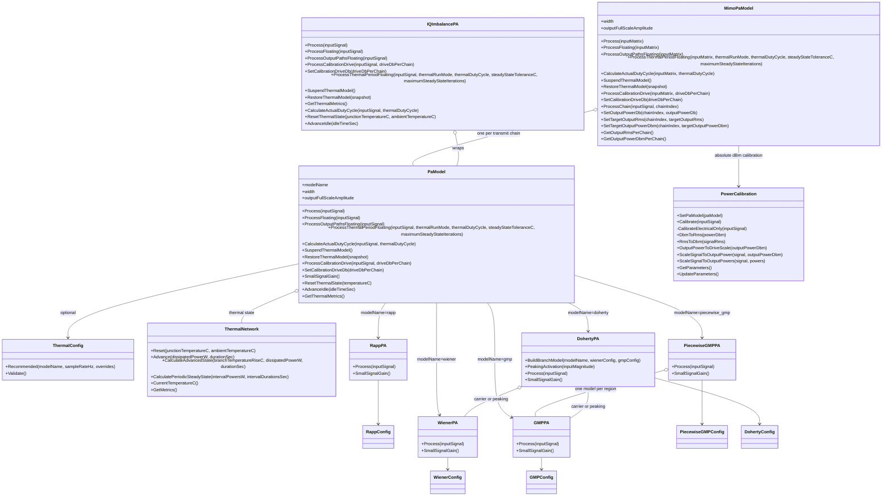
```mermaid
classDiagram
    class PaModel {
        +modelName
        +width
        +outputFullScaleAmplitude
        +Process(inputSignal)
        +ProcessFloating(inputSignal)
        +ProcessOutputPathsFloating(inputSignal)
        +ProcessThermalPeriodFloating(inputSignal, thermalRunMode, thermalDutyCycle, steadyStateToleranceC, maximumSteadyStateIterations)
        +CalculateActualDutyCycle(inputSignal, thermalDutyCycle)
        +SuspendThermalModel()
        +RestoreThermalModel(snapshot)
        +ProcessCalibrationDrive(inputSignal, driveDbPerChain)
        +SetCalibrationDriveDb(driveDbPerChain)
        +SmallSignalGain()
        +ResetThermalState(temperatureC)
        +AdvanceIdle(idleTimeSec)
        +GetThermalMetrics()
    }
    class ThermalConfig {
        +Recommended(modelName, sampleRateHz, overrides)
        +Validate()
    }
    class ThermalNetwork {
        +Reset(junctionTemperatureC, ambientTemperatureC)
        +Advance(dissipatedPowerW, durationSec)
        +CalculateAdvancedState(branchTemperatureRiseC, dissipatedPowerW, durationSec)
        +CalculatePeriodicSteadyState(intervalPowersW, intervalDurationsSec)
        +CurrentTemperatureC()
        +GetMetrics()
    }
    class PowerCalibration {
        +SetPaModel(paModel)
        +Calibrate(inputSignal)
        -CalibrateElectricalOnly(inputSignal)
        +DbmToRms(powerDbm)
        +RmsToDbm(signalRms)
        +OutputPowerToDriveScale(outputPowerDbm)
        +ScaleSignalToOutputPower(signal, outputPowerDbm)
        +ScaleSignalToOutputPowers(signal, powers)
        +GetParameters()
        +UpdateParameters()
    }
    class RappConfig
    class RappPA {
        +Process(inputSignal)
        +SmallSignalGain()
    }
    class WienerConfig
    class WienerPA {
        +Process(inputSignal)
        +SmallSignalGain()
    }
    class GMPConfig
    class GMPPA {
        +Process(inputSignal)
        +SmallSignalGain()
    }
    class PiecewiseGMPConfig
    class PiecewiseGMPPA {
        +Process(inputSignal)
        +SmallSignalGain()
    }
    class DohertyConfig
    class DohertyPA {
        +BuildBranchModel(modelName, wienerConfig, gmpConfig)
        +PeakingActivation(inputMagnitude)
        +Process(inputSignal)
        +SmallSignalGain()
    }
    class IQImbalancePA {
        +Process(inputSignal)
        +ProcessFloating(inputSignal)
        +ProcessOutputPathsFloating(inputSignal)
        +ProcessCalibrationDrive(inputSignal, driveDbPerChain)
        +SetCalibrationDriveDb(driveDbPerChain)
        +ProcessThermalPeriodFloating(inputSignal, thermalRunMode, thermalDutyCycle, steadyStateToleranceC, maximumSteadyStateIterations)
        +SuspendThermalModel()
        +RestoreThermalModel(snapshot)
        +GetThermalMetrics()
        +CalculateActualDutyCycle(inputSignal, thermalDutyCycle)
        +ResetThermalState(junctionTemperatureC, ambientTemperatureC)
        +AdvanceIdle(idleTimeSec)
    }
    class MimoPaModel {
        +width
        +outputFullScaleAmplitude
        +Process(inputMatrix)
        +ProcessFloating(inputMatrix)
        +ProcessOutputPathsFloating(inputMatrix)
        +ProcessThermalPeriodFloating(inputMatrix, thermalRunMode, thermalDutyCycle, steadyStateToleranceC, maximumSteadyStateIterations)
        +CalculateActualDutyCycle(inputMatrix, thermalDutyCycle)
        +SuspendThermalModel()
        +RestoreThermalModel(snapshot)
        +ProcessCalibrationDrive(inputMatrix, driveDbPerChain)
        +SetCalibrationDriveDb(driveDbPerChain)
        +ProcessChain(inputSignal, chainIndex)
        +SetOutputPowerDb(chainIndex, outputPowerDb)
        +SetTargetOutputRms(chainIndex, targetOutputRms)
        +SetTargetOutputPowerDbm(chainIndex, targetOutputPowerDbm)
        +GetOutputRmsPerChain()
        +GetOutputPowerDbmPerChain()
    }
    MimoPaModel o-- PaModel : one per transmit chain
    PaModel --> ThermalConfig : optional
    PaModel o-- ThermalNetwork : thermal state
    MimoPaModel --> PowerCalibration : absolute dBm calibration
    PaModel --> RappPA : modelName=rapp
    PaModel --> WienerPA : modelName=wiener
    PaModel --> GMPPA : modelName=gmp
    PaModel --> PiecewiseGMPPA : modelName=piecewise_gmp
    PaModel --> DohertyPA : modelName=doherty
    RappPA --> RappConfig
    WienerPA --> WienerConfig
    GMPPA --> GMPConfig
    PiecewiseGMPPA --> PiecewiseGMPConfig
    PiecewiseGMPPA o-- GMPPA : one model per region
    DohertyPA --> DohertyConfig
    DohertyPA o-- WienerPA : carrier or peaking
    DohertyPA o-- GMPPA : carrier or peaking
    IQImbalancePA o-- PaModel : wraps
```

**图 8 说明**：`PaModel` 是统一面向对象入口，内部选择Rapp、Wiener、GMP、分段GMP或Doherty。分段GMP共享基函数并按包络权重混合区域系数；Doherty的Carrier和Peaking又各自选择Wiener或GMP。`ThermalConfig.Recommended` 为static、single_rc和foster返回完整可运行的模型专用起点，`Validate` 继续负责物理边界校验。`MimoPaModel` 按物理链持有多个 `PaModel`，并提供内部浮点矩阵入口；它把公共周期作为原子热事务，任何一路处理或互热迭代失败都会恢复全部PA的周期前状态和旧metrics。`IQImbalancePA` 不只代理普通 `Process`，还透明代理周期热处理、热状态暂停/恢复、metrics、实际占空比、复位和额外空闲，因此用它包装热PA不会让Channel误判为无热模型。`PowerCalibration` 位于 `SigProc.py`，可以绑定任意具有 `Process` 接口的PA或完整耦合plant，通过闭环输入驱动校准设置真实输出dBm；普通用户由Channel间接使用它，`Analysis` 无需因此导入 `PaModel.py`。

需要区分实验室前向仪表与板载反馈接收机时，完整Channel会在同一次PA计算和同一个热周期上公开返回 `(chOut, fbOut)`。前者始终跳过反馈专用非理想，用于最终EVM、SNR、ACLR、IRR和功率评价；默认 `sampleMode="forward"` 时后者只是前者的数值相同副本。显式设置 `sampleMode="fb"` 后，第二项才从公共PA后节点增加反馈FIR、时频偏、I/Q/DC、接收机非线性、限幅、独立噪声和ADC量化，用于板载反馈DPD/ILC同步、MSE和更新。兼容单输出入口仍按该参数选路。反馈链参数属于观察接收机，不属于PA模型系数，不能写入Wiener或GMP来混合拟合。

```python
from inc.lib.PaModel import (
    DohertyConfig,
    GMPConfig,
    PaModel,
    RappConfig,
    WienerConfig,
)

paOverrides = {
    "modelName": "rapp",
    "width": 16,
    "rappConfig": RappConfig(
        saturationAmplitude=1.0,
        rappSmoothness=3.0,
    ),
}
paModel = PaModel(parameters=paOverrides)
rappOutput = paModel.Process(inputSignal)

paOverrides.update({
    "modelName": "wiener",
    "wienerConfig": WienerConfig(
        saturationAmplitude=1.0,
        rappSmoothness=3.0,
        ampmCoefficient=0.18,
    ),
})
wienerOutput = paModel.Process(inputSignal)

paOverrides.update(
    {
        "modelName": "gmp",
        "gmpConfig": GMPConfig(
            nonlinearOrders=(1, 3, 5, 7),
            memoryDepth=3,
            crossMemoryDepth=2,
        ),
    }
)
# Process detects the live mapping change and rebuilds the selected PA.
gmpOutput = paModel.Process(inputSignal)

paOverrides.update(
    {
        "modelName": "doherty",
        "dohertyConfig": DohertyConfig(
            carrierModelName="wiener",
            peakingModelName="gmp",
            peakingTurnOnAmplitude=0.45,
        ),
    }
)
dohertyOutput = paModel.Process(inputSignal)
```

`PaModel` 的公开构造签名为
`PaModel(modelName=None, rappConfig=None, wienerConfig=None, gmpConfig=None, piecewiseGmpConfig=None, dohertyConfig=None, thermalConfig=None, parameters=None, width=None, outputFullScaleAmplitude=None, **parameterOverrides)`。`width=0` 旁路码值转换；默认 `width=16`。定点输入DAC标尺固定为1.0，固定点输出 `outputFullScaleAmplitude` 默认2.0。`Process` 在定点模式下接收I/Q整数码，按输入标尺解码后先应用最近一次成功功率校准提交的模拟驱动，再使用选定电模型计算，最后按输出标尺把结果编码回整数码。未运行功率校准时该驱动为0 dB，所以原有直接调用行为不变。公开返回容器始终是 `numpy.complex128`：

```python
from inc.lib.PaModel import PaModel
from inc.utils.FixedPoint import FixedPoint

floatingPa = PaModel(
    parameters={"modelName": "gmp", "width": 0}
)
fixedPa = PaModel(
    parameters={"modelName": "gmp", "width": 16}
)

inputFormat = FixedPoint(width=16, fullScaleAmplitude=1.0)
outputFormat = FixedPoint(
    width=16,
    fullScaleAmplitude=fixedPa.outputFullScaleAmplitude,
)
fixedInputCodes = inputFormat.EncodeComplex(inputSignal)

floatingOutput = floatingPa.Process(inputSignal)
fixedOutputCodes = fixedPa.Process(fixedInputCodes)
fixedOutputForInspection = outputFormat.DecodeComplex(fixedOutputCodes)

assert fixedOutputCodes.real.max() <= 32767
assert fixedOutputCodes.real.min() >= -32768
assert floatingOutput.dtype == fixedOutputCodes.dtype
assert fixedOutputForInspection.dtype == floatingOutput.dtype
```

这种边界模型包含“输入码值舍入误差经过非线性放大”和“PA输出再次编码量化”两部分，但PA内部幂次、记忆抽头与包络交叉项仍使用归一化浮点。公开16位最大正码是 `32767`；完整码值推导见 [FixedPoint.md](./FixedPoint.md)。

`MimoPaModel` 的公开构造签名为
`MimoPaModel(parameters=None, width=None, outputFullScaleAmplitude=None, **parameterOverrides)`；默认同样使用输入标尺1.0和所有输出列共享的标尺2.0。

多路调用只传需要修改的覆盖值，默认值仍在类内部：

```python
from inc.lib.PaModel import MimoPaModel

mimoPaModel = MimoPaModel(
    parameters={"width": 16},
    numTransmitChains=4,
    paParametersPerChain=(
        {"modelName": "rapp"},
        {"modelName": "wiener"},
        {"modelName": "doherty"},
        {"modelName": "gmp"},
    ),
    targetOutputPowerDbmPerChain=(22.0, 21.0, 20.0, 19.0),
    maximumOutputPowerDbm=25.0,
    loadResistanceOhm=50.0,
)
mimoOutput = mimoPaModel.Process(mimoInput)
print(mimoPaModel.GetOutputPowerDbmPerChain())

# Change only the second physical PA after construction.
mimoPaModel.SetTargetOutputPowerDbm(
    chainIndex=1,
    targetOutputPowerDbm=21.0,
)
```

`PaModel` 在构造函数内部建立参数层：直接构造参数或 `UpdateParameters(...)` 位于最高优先级，调用方的外部覆盖字典位于中间层，类内不可变默认值是后备层。调用方不需要显式创建 `ChainMap`；`GetParameters()` 返回当前解析结果的字典快照。这个优先级对 `thermalConfig` 同样有效：如果构造时已经写了 `thermalConfig=enabledConfig`，后来只把较低层 `parameters["thermalConfig"]` 改为禁用不会覆盖它；应调用 `UpdateParameters(thermalConfig=disabledConfig)`，或从一开始只在活动映射中维护这个键。`PaModel` 与 `MimoPaModel` 都会对未知键发出 `UserWarning`、忽略该键并继续运行；已识别但不合法的模型名、系数对象或功率参数仍会抛出异常。

---

## 13. PA电热模型：功率、占空比与输出漂移

PA的“热”不是给电模型附加一个随机温度误差，而是一条有明确能量来源、时间尺度和反馈方向的慢动态链。晶体管把直流能量的一部分变成RF输出，其余主要变成热；热量经过芯片、封装、PCB和散热器逐级扩散，结温再改变器件跨导、阈值、电容、膝点和饱和能力。因此，相同瞬时输入幅度在“冷机”和“热机”状态下可以产生不同输出，这就是电热记忆。

从能量与信号的角度，可以把本工程的模型分成四层：

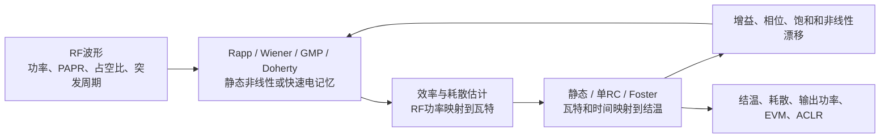
```mermaid
flowchart LR
    waveform["RF波形<br/>功率、PAPR、占空比、突发周期"] --> electrical["Rapp / Wiener / GMP / Doherty<br/>静态非线性或快速电记忆"]
    electrical --> heat["效率与耗散估计<br/>RF功率映射到瓦特"]
    heat --> network["静态 / 单RC / Foster<br/>瓦特和时间映射到结温"]
    network --> drift["增益、相位、饱和和非线性漂移"]
    drift --> electrical
    network --> metrics["结温、耗散、输出功率、EVM、ACLR"]
```

四层的物理时间尺度不同：

| 现象 | 常见时间尺度 | 本工程中的位置 | 能否由短波形直接识别 |
|---|---:|---|---|
| 瞬时AM-AM、AM-PM | 亚采样到若干采样 | Rapp/Wiener/GMP/分段GMP/Doherty电模型 | 可以 |
| 匹配网络与偏置电记忆 | 数ns到数us | FIR或GMP记忆项 | 可以，但需要足够带宽 |
| 芯片和封装快热 | 数us到数ms | Foster快速支路 | 需要连续突发或功率阶跃 |
| PCB、底板和散热器慢热 | 数ms到数s以上 | Foster慢速支路 | 需要更长采集和明确空闲时间 |
| 环境温度变化 | 秒到分钟 | `ambientTemperatureC`外部边界 | 一般需要温箱或温度记录 |

因此不能把GMP的几个采样点记忆深度当成热记忆。采样点GMP负责快速电效应，Foster状态负责跨帧保留的慢温度效应；两者可以同时存在。

### 13.1 完整因果链路

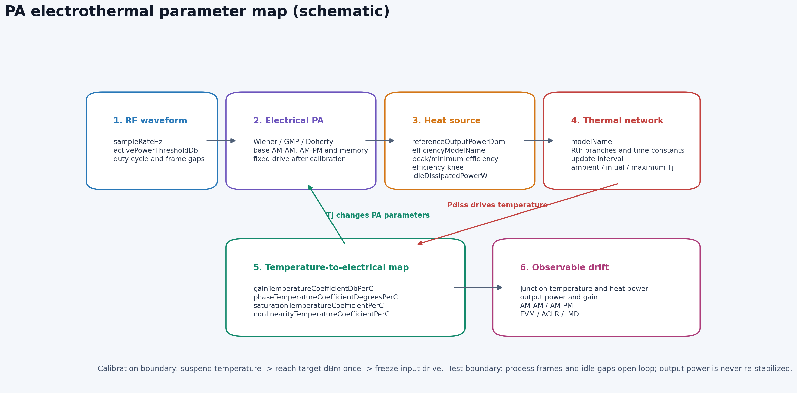

图示说明：现有Rapp、Wiener、GMP、分段GMP或Doherty仍先计算基础电响应；归一化输出通过参考dBm和效率模型换成耗散功率，热网络将其积累为结温，结温再调制下一热更新区间的增益、相位、饱和尺度和非线性强度。即使基础Rapp电模型严格无记忆，外接热网络后，结温状态也会让整个电热系统具有慢记忆。

本工程在公开功率校准入口中严格分离两个阶段，调用方只看见一次函数调用：

1. **无热参考校准阶段**：`PowerCalibration.Calibrate` 通过绑定对象的成对热事务保存当前热支路、结温、累计时间、互热offset和metrics，暂停温度影响，并让内部纯电闭环只使用参考温度电参数。校准不会增加真实热时间或结温，也不会根据当前热态增益修正驱动。Channel提供 `SuspendThermalModel` 与 `RestoreThermalModel` 代理，把事务继续转交给实际绑定PA；直接把 `PaModel` 交给 `PowerCalibration` 也采用同一规则。
2. **正式温度处理阶段**：Channel在公开 `Calibrate` 返回后，用收敛输入真实发射一次。只要活动配置仍启用温度，热状态已在 `finally` 中原样恢复，热网络只在这次正式处理期间推进，输出功率可以随温度自然变化；若校准过程中已把活动配置改成 `enabled=False`，旧启用快照不会被恢复。

因此普通温度测试可以直接重复调用：

```python
chOut, fbOut = channel.Process(
    rawSignal,
    outputPowerDbm=22.0,
)
```

这里的22 dBm是参考温度校准目标，不是当前热态输出的闭环设定值。升温后的实际功率应读取 `Channel.GetThermalMetrics()["outputPowerDbm"]`；它允许偏离22 dBm。需要在同一个Channel实例中冻结并复用“公开码+已提交模拟drive”或复位起始温度时，才使用高级兼容接口 `PrepareThermalTest`；其返回数组本身不包含模拟drive状态。

### 13.2 常见热模型的优缺点比较

#### 13.2.1 所有集总热模型的共同物理起点

真实器件内部温度由热传导方程决定：

```math
\rho c_p
\frac{\partial T}{\partial t}
=
\nabla
\left(
k\nabla T
\right)
+
q_v.
```

其中，`rho`表示材料密度，`cp`表示比热容，`k`表示导热系数，`qv`表示单位体积热源。这个偏微分方程能够描述芯片不同位置的温度，但需要器件几何、材料和边界条件；行为级DPD仿真通常没有这些信息，也不适合在每个RF样点上运行三维热仿真。

集总热模型把空间温度场压缩成少量状态。热—电类比为：

| 热学量 | 电学类比 | 单位 |
|---|---|---|
| 温差 | 电压 | 摄氏度或K |
| 热流率、耗散功率 | 电流 | W |
| 热阻 | 电阻 | 摄氏度/W |
| 热容 | 电容 | J/摄氏度 |
| 环境温度 | 参考电位 | 摄氏度 |

热阻和热容定义为：

```math
R_{\mathrm{th}}
=
\frac{\Delta T}{P_{\mathrm{heat}}},
```

```math
C_{\mathrm{th}}
=
\frac{\Delta E_{\mathrm{heat}}}{\Delta T}.
```

两者乘积给出热时间常数：

```math
\tau
=
R_{\mathrm{th}}C_{\mathrm{th}}.
```

本节后续模型的区别，本质上是“保留多少温度状态、这些状态怎样连接，以及输出波形怎样依赖这些状态”。

#### 13.2.2 静态温度角模型

静态温度角不求解发热过程，而是直接指定测试期间的结温：

```math
T_j(t)
=
T_{\mathrm{corner}}.
```

代码中 `modelName="static"` 使用 `initialJunctionTemperatureC` 作为该温度角。`Advance`仍会累计物理时间，但不会根据耗散功率改变温度。它相当于假设温箱、热台或理想温控器已经把PA固定在目标温度。

典型辨识流程是分别在25、85和125摄氏度等稳态温度下采集同一功率、同一波形的I/Q数据，然后拟合每个温度角的增益、相位、AM-AM和AM-PM。静态温度角能回答“同一PA在不同温度下有什么差异”，但不能回答“波形需要发射多久才升到该温度”。

优点是最简单、结果易复现、适合电参数温度系数验证；缺点是没有功率到温度的因果关系、没有冷却、没有占空比效应，也没有热迟滞。若用户只给一个固定温度且不关心升温过程，应优先使用它。

#### 13.2.3 单RC热模型

单RC把整个器件和散热路径压缩成一个结温状态。能量平衡为：

```math
C_{\mathrm{th}}
\frac{dT_j(t)}{dt}
=
P_{\mathrm{diss}}(t)
-
\frac{T_j(t)-T_{\mathrm{ambient}}}
{R_{\mathrm{th}}}.
```

令温升为：

```math
\theta(t)
=
T_j(t)-T_{\mathrm{ambient}},
```

可得到：

```math
\tau
\frac{d\theta(t)}{dt}
+
\theta(t)
=
R_{\mathrm{th}}P_{\mathrm{diss}}(t).
```

当耗散功率从0阶跃到常数 `P0` 时：

```math
\theta(t)
=
R_{\mathrm{th}}P_0
\left(
1-e^{-t/\tau}
\right).
```

断开发热后的冷却过程为：

```math
\theta(t)
=
\theta(0)e^{-t/\tau}.
```

因此 `Rth`决定最终温升，`tau`决定上升与冷却速度。代码用 `modelName="single_rc"` 并要求 `thermalResistancesCPerW` 和 `thermalTimeConstantsSec` 各只有一个值。

单RC适合热阶跃近似为一条指数曲线的器件，也适合先验证功率—温度—输出漂移闭环是否正确。它的局限是把芯片、封装、PCB和散热器混成一个状态；如果实测曲线在对数时间轴上有多个膝点，单RC不可能同时拟合快热和慢热。

#### 13.2.4 Foster多支路热模型

Foster模型把测得的瞬态热阻表示成多个一阶模态的和。第 `i` 个状态满足：

```math
\tau_i
\frac{d\theta_i(t)}{dt}
+
\theta_i(t)
=
R_iP_{\mathrm{diss}}(t).
```

总结温为：

```math
T_j(t)
=
T_{\mathrm{ambient}}
+
\sum_{i=1}^{K}\theta_i(t).
```

单位功率阶跃对应的瞬态热阻为：

```math
Z_{\mathrm{th}}(t)
=
\sum_{i=1}^{K}
R_i
\left(
1-e^{-t/\tau_i}
\right).
```

每个模态可以解释为一个快、中或慢时间尺度，但Foster并联支路通常不应直接解释为某一层真实材料。例如最快支路可能主要反映芯片内部扩散，最慢支路可能主要反映散热器，但拟合出来的支路是数学模态，不保证与物理层一一对应。

本工程 `modelName="foster"` 对每个更新区间使用精确零阶保持离散解：

```math
\theta_i[n+1]
=
e^{-\Delta t/\tau_i}\theta_i[n]
+
R_i
\left(
1-e^{-\Delta t/\tau_i}
\right)
P_{\mathrm{diss}}[n].
```

它同时支持帧内加热、跨帧状态保持与 `AdvanceIdle` 冷却，是当前工程推荐的动态热模型。优点是易从热瞬态曲线拟合、少量状态即可覆盖多个数量级时间；缺点是支路缺少直接空间含义，在改变散热结构或边界条件后不能可靠外推。

#### 13.2.5 Cauer梯形热网络

Cauer模型用串联热阻和对地热容形成梯形网络。节点可按顺序代表结区、芯片、封装、PCB和散热器。以三个温度节点为例，第一节点满足：

```math
C_1
\frac{dT_1}{dt}
=
P_{\mathrm{diss}}
-
\frac{T_1-T_2}{R_1},
```

中间节点满足：

```math
C_2
\frac{dT_2}{dt}
=
\frac{T_1-T_2}{R_1}
-
\frac{T_2-T_3}{R_2},
```

最后节点通过最后一级热阻与环境连接：

```math
C_3
\frac{dT_3}{dt}
=
\frac{T_2-T_3}{R_2}
-
\frac{T_3-T_{\mathrm{ambient}}}{R_3}.
```

热量必须依次经过各节点，所以Cauer网络更接近真实分层热流，适合研究更换散热器、PCB铜层或界面材料的影响。其代价是参数提取更复杂；只测一个结温输出时，多组内部参数可能产生相近曲线，必须结合结构热仿真或多个温度传感点。

当前代码没有直接实现Cauer状态更新。若只有结温瞬态数据，可先把拟合的Cauer网络转换成等效Foster极点后使用；若要观察封装或PCB内部节点温度，则应新增专门的Cauer网络类，不能用一个Foster支路名称假装成物理层。

#### 13.2.6 温度条件化GMP电热模型

RC、Foster和Cauer负责预测温度，但还需要把温度连接到RF输出。比当前公共漂移层更高精度的方法，是让GMP系数直接依赖结温：

```math
y(n)
=
\sum_{p,m}
c_{p,m}(T_j)
x(n-m)
\left|x(n-m)\right|^{p-1}
+
y_{\mathrm{cross}}(n,T_j).
```

最简单的系数温度模型为一次插值：

```math
c_{p,m}(T_j)
=
c_{p,m,0}
+
c_{p,m,1}
\left(
T_j-T_{\mathrm{ref}}
\right).
```

也可以在若干温度角分别训练GMP系数，再按温度插值。这样不仅公共增益会变化，不同阶次、不同记忆延迟和交叉项都能拥有独立温度斜率，因此能表示温度相关AM-AM、AM-PM和非线性记忆。

它的优点是RF波形拟合精度高，适合给DPD生成温度相关训练数据；缺点是参数数目约随温度基函数数量成倍增加，要求多温度、同参考面、同功率定义的I/Q数据。温度与输入包络高度相关时，普通最小二乘还可能无法区分“电记忆项”和“温度项”，需要多种突发周期与占空比来提高可辨识性。

当前 `ApplyTemperatureDrift` 是温度条件化GMP的低阶近似：它在完整Rapp/Wiener/GMP/分段GMP/Doherty输出外统一施加增益、相位、饱和和附加压缩。若实测表明不同GMP阶次具有明显不同的温度斜率，才建议升级为逐系数温度条件化。

#### 13.2.7 神经网络电热模型

神经网络模型把当前波形、历史包络、温度或隐状态共同映射到输出。例如状态空间形式为：

```math
\mathbf h[n+1]
=
F
\left(
\mathbf h[n],
x[n],
P_{\mathrm{diss}}[n]
\right),
```

```math
y[n]
=
G
\left(
x[n],
\mathbf h[n]
\right).
```

隐状态可以由循环神经网络、门控单元或神经常微分方程实现。若同时输入物理Foster温度，网络只学习Foster没有解释的RF残差，通常比完全黑盒方式更节省数据，这类结构可称为物理引导混合模型。

优势是能表示强非线性、多时间尺度、复杂迟滞和难以手写的温度相关记忆；风险是需要大量覆盖功率、带宽、温度、占空比和突发周期的数据，且可能在训练范围外发散。对于DPD闭环，网络还必须保证因果性、数值有界和可实时计算。推荐顺序是先使用Foster加现有漂移层，再尝试温度条件化GMP，只有两者验证误差仍不满足要求时才使用神经网络。

#### 13.2.8 模型之间的选择关系

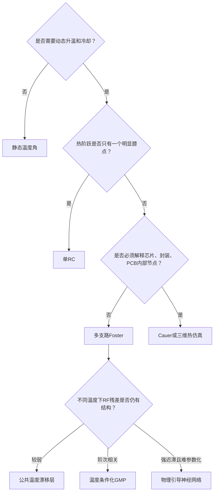
```mermaid
flowchart TD
    start{"是否需要动态升温和冷却？"}
    start -->|否| static["静态温度角"]
    start -->|是| knee{"热阶跃是否只有一个明显膝点？"}
    knee -->|是| single["单RC"]
    knee -->|否| physical{"是否必须解释芯片、封装、PCB内部节点？"}
    physical -->|否| foster["多支路Foster"]
    physical -->|是| cauer["Cauer或三维热仿真"]
    foster --> residual{"不同温度下RF残差是否仍有结构？"}
    residual -->|较弱| drift["公共温度漂移层"]
    residual -->|阶次相关| tgmp["温度条件化GMP"]
    residual -->|强迟滞且难参数化| neural["物理引导神经网络"]
```

这不是按复杂度越高越好的排序。模型选择应以独立验证集上的结温误差、输出功率漂移、对齐后EVM/NMSE和带外误差为依据，并优先保留参数可辨识、能够解释且足够简单的结构。

| 热模型 | 主要优点 | 主要缺点 | 参数获取 | 本工程状态与推荐场景 |
|---|---|---|---|---|
| 静态温度角 | 最简单；适合25、85、125摄氏度等温箱定点比较 | 不由信号功率和占空比产生动态温升；没有热迟滞 | 温箱稳态测量 | `modelName="static"`；用于温度角，不用于自热瞬态 |
| 单RC | 参数少、计算快、容易从一次阶跃拟合 | 只能表达一个时间尺度，难以同时拟合芯片快热和散热器慢热 | 一条指数阶跃曲线 | `modelName="single_rc"`；适合最小验证或只有一个时间常数的数据 |
| 多极点Foster | 多个并行RC可直接拟合瞬态热阻；速度快；适合行为仿真 | RC支路不一一对应真实物理层，外推边界依赖测量质量 | 热瞬态或数据手册瞬态热阻曲线 | `modelName="foster"`；默认推荐，也是本工程完整动态实现 |
| Cauer梯形网络 | 节点可对应芯片、封装、PCB和散热器；适合层间热流解释 | 参数提取和Foster/Cauer转换更复杂；测量不足时不唯一 | 结构热仿真或分层测温 | 当前未直接实现；可先离线转成等效Foster接入 |
| 温度条件化GMP | 直接拟合不同结温下的复系数，能描述真实AM-AM、AM-PM和记忆漂移 | 需要多个温度、功率和波形数据集；系数插值可能病态 | 多温度同步I/Q采集 | 当前用低阶温度漂移层近似；高精度版本可替换 `ApplyTemperatureDrift` |
| 神经网络电热模型 | 可表达强非线性、复杂迟滞和多状态耦合 | 数据量大、可解释性弱、外推和稳定性难保证 | 大规模带温度标签训练集 | 不作为首版默认；适合Foster加GMP仍无法达到NMSE目标时 |

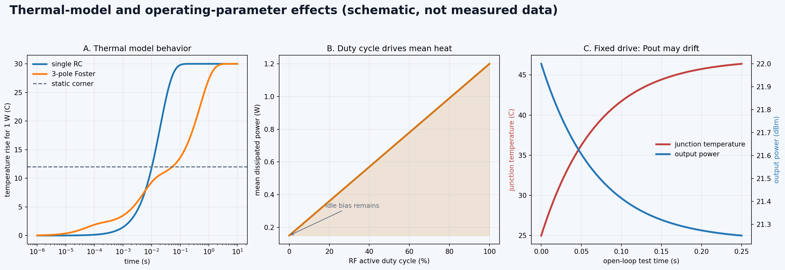

这是一张总览图：图A说明单RC只有一个拐点，多极点Foster可同时呈现快、中、慢时间尺度，静态角只规定某个温度而没有因果升温曲线；图B说明静态偏置热始终存在，有效RF占空比提高会增加平均耗散功率；图C说明驱动冻结以后，结温上升可以导致输出功率自然漂移。后续各节给出按参数逐项变化的高清效果图。所有曲线都用于说明参数关系，不是器件测量结果或标准限值。

### 13.3 热源和效率模型

物理耗散功率为：

```math
P_{\mathrm{diss}}(t)
=
P_{\mathrm{DC}}(t)
+
P_{\mathrm{RF,in}}(t)
-
P_{\mathrm{RF,out}}(t).
```

当前行为模型没有漏极电压和电流，因此用效率近似：

```math
P_{\mathrm{diss}}(t)
=
P_{\mathrm{idle}}
+
P_{\mathrm{RF,out}}(t)
\left(
\frac{1}{\eta(t)}-1
\right).
```

`referenceOutputPowerDbm` 规定归一化输出功率1对应的物理功率：

```math
P_{\mathrm{RF,out}}[n]
=
10^{(P_{\mathrm{ref,dBm}}-30)/10}
\left|y[n]\right|^2.
```

`efficiencyModelName="constant"` 直接使用 `peakDrainEfficiency`。`"power_dependent"` 使用平滑功率相关效率：

```math
\eta(P)
=
\eta_{\min}
+
(\eta_{\max}-\eta_{\min})
\frac{P/P_{\mathrm{knee}}}
{1+P/P_{\mathrm{knee}}}.
```

这不是某个工艺的固定效率曲线。应使用实测DC电压、电流和RF输出功率拟合 `minimumDrainEfficiency`、`peakDrainEfficiency` 和 `efficiencyKneeOutputPowerDbm`。

#### 13.3.1 热源参数效果图

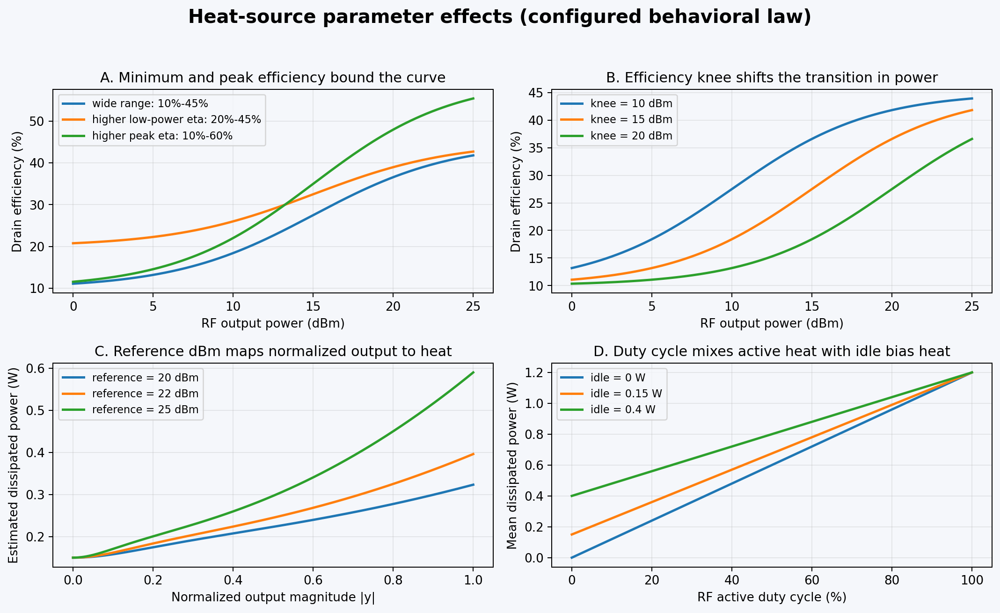

四幅子图分别对应代码中的四组直接参数：

- **图A：`minimumDrainEfficiency`与`peakDrainEfficiency`**。提高低功率效率会主要压低低功率区的估算热量；提高峰值效率会主要压低高功率区热量。效率越高，同一RF输出所需要转换成热的功率越少。
- **图B：`efficiencyKneeOutputPowerDbm`**。膝点提高会把效率上升区向右移动，因此同一个中等输出功率会被认为效率更低、发热更多。膝点不是PA的1 dB压缩点，而是本热源效率曲线的过渡位置。
- **图C：`referenceOutputPowerDbm`**。它规定归一化波形的物理瓦特标尺。波形数值完全不变时，提高这个参数会提高估计RF瓦特数和耗散功率，因此它必须与Channel使用的满量程功率定义一致。
- **图D：`idleDissipatedPowerW`与占空比**。占空比为0时只剩空闲偏置耗散；占空比为100%时由开启耗散主导。提高空闲耗散会显著影响低占空比和长帧间隔场景，但不会改变RF开启时设置的目标输出功率。

如果能够同步测量漏极电压和电流，推荐先直接计算：

```math
P_{\mathrm{DC}}(n)
=
V_{\mathrm{DD}}(n) I_{\mathrm{DD}}(n),
```

```math
\eta(n)
=
\frac{P_{\mathrm{RF,out}}(n)}
{P_{\mathrm{DC}}(n)},
```

再拟合效率参数。若没有DC测量，只凭I/Q波形不能唯一确定耗散功率，此时热参数只能作为假设或由温度漂移间接辨识。

### 13.4 两层占空比、内部空闲和周期边界

Channel把调用方传入的完整数组看成一个**数据窗口**。用户配置的 `thermalDutyCycle` 只描述该窗口占完整发送周期的比例：

```math
D_{\mathrm{configured}}
=
\frac{T_{\mathrm{data}}}{T_{\mathrm{period}}},
\qquad
0<D_{\mathrm{configured}}\leq 1.
```

这里的 `Tdata` 包含数组内部的前后补零、包间静默和任何低于活动门限的样点。Channel不会因为这些内部空闲而缩短用户配置的数据窗口。由配置得到的完整周期和窗口外空闲时间分别为：

```math
T_{\mathrm{period}}
=
\frac{T_{\mathrm{data}}}{D_{\mathrm{configured}}},
```

```math
T_{\mathrm{idle,outer}}
=
T_{\mathrm{data}}
\left(
\frac{1}{D_{\mathrm{configured}}}-1
\right).
```

PA输入功率再通过 `activePowerThresholdDb` 在整个数据窗口上统一分类。活动样点在数据窗口中的比例为：

```math
D_{\mathrm{waveform}}
=
\frac{N_{\mathrm{active}}}{N_{\mathrm{data}}}.
```

所以完整发送周期内真正有RF活动的占空比是：

```math
D_{\mathrm{actual}}
=
D_{\mathrm{configured}}
D_{\mathrm{waveform}}.
```

例如用户配置 `thermalDutyCycle=0.4`，输入数组内部只有一半样点是有效RF，则 `configuredDutyCycle=0.4`、`waveformActiveDutyCycle=0.5`，而 `actualDutyCycle=0.2`。这三个量不能互相替代。

内部空闲和窗口外空闲都完整推进热时间，并使用 `idleDissipatedPowerW`。区别只是内部空闲已经存在于输入数组中，窗口外空闲由Channel根据 `thermalDutyCycle` 自动补入热状态而不向公开输出追加零样点：


```mermaid
flowchart LR
    input["输入数据窗口"] --> classify["按全窗口峰值判定活动样点"]
    classify --> internal["内部活动区升温；内部空闲区冷却"]
    internal --> outer["自动推进窗口外空闲"]
    outer --> next["下一个周期起点"]
```

图示说明：公开输入和输出始终只包含数据窗口；最右侧的窗口外空闲仅存在于热状态时间轴。`thermalUpdateIntervalSamples` 的规则边界和每次活动状态跳变都会切分热区间，因此即使内部空闲短于一个常规热更新块，也会单独按空闲耗散推进。

长时间平均耗散应按完整周期计算：

```math
\overline{P}_{\mathrm{period}}
=
\frac{
E_{\mathrm{data}}+
P_{\mathrm{idle}}T_{\mathrm{idle,outer}}
}{T_{\mathrm{period}}}.
```

当活动区耗散近似为常数时，才可进一步近似为：

```math
\overline{P}_{\mathrm{period}}
\mathrel{\approx}
D_{\mathrm{actual}}P_{\mathrm{on}}
+
\left(1-D_{\mathrm{actual}}\right)P_{\mathrm{idle}}.
```

`activePowerThresholdDb` 只决定某个样点使用活动耗散还是空闲耗散，不会删除任何物理时间。Channel提供两种真实占空比查询方式：

```python
# Query before processing.  Activity is measured at the actual PA input.
predictedActualDuty = channel.GetActualDutyCycle(rawSignal)

# Query the accepted result after one complete thermal period.
chOut, fbOut = channel.Process(rawSignal, outputPowerDbm=20.0)
acceptedActualDuty = channel.GetActualDutyCycle()
```

带输入的查询会经过当前已提交的模拟驱动、Tx I/Q误差和PA前耦合后，在实际PA输入参考面分类；无参数查询读取最近一次已接受周期的 `actualDutyCycle`。第一次调用前尚未完成目标功率校准，因此需要精确复现最终工作点时，应以后者为准。SISO返回浮点数，MIMO返回按物理PA顺序排列的元组。即使未启用热模型，带输入的查询仍然可用：Channel用自己的 `activePowerThresholdDb` 对真实PA入口逐链分类，再乘 `thermalDutyCycle`，不会因为不存在热metrics而错误返回0。无参数查询仍要求已经提交过带周期metrics的热处理。

### 13.5 单RC与Foster热网络

每个Foster支路满足：

```math
\tau_i
\frac{d\theta_i(t)}{dt}
+
\theta_i(t)
=
R_i P_{\mathrm{diss}}(t).
```

在一个热更新区间内把耗散功率视为常数，代码使用精确零阶保持解：

```math
\theta_i[n+1]
=
a_i\theta_i[n]
+
R_i(1-a_i)P_{\mathrm{diss}}[n],
```

```math
a_i
=
\exp
\left(
-\frac{\Delta t}{\tau_i}
\right).
```

总结温为：

```math
T_j[n]
=
T_{\mathrm{ambient}}
+
\sum_i\theta_i[n].
```

`thermalResistancesCPerW` 决定稳态温升；`thermalTimeConstantsSec` 决定达到稳态的速度。两者必须一一对应。`thermalUpdateIntervalSamples` 只决定每隔多少RF样点更新一次慢热状态：减小它可提高帧内温漂分辨率但增加计算量；它不改变物理时间常数。

#### 13.5.1 `steady_state`与`transient`运行模式

周期调度属于 `Channel`，不属于 `ThermalConfig`。相关参数如下：

| Channel参数 | 默认值 | 合法范围 | 作用 |
|---|---:|---|---|
| `thermalRunMode` | `"steady_state"` | `"steady_state"`或 `"transient"` | 选择周期稳态求解或从当前热状态推进一个周期 |
| `thermalDutyCycle` | `1.0` | 大于0且小于等于1 | 数据窗口时长除以完整周期时长 |
| `thermalSteadyStateToleranceC` | `1.0e-4` | 有限正数 | 周期首尾每条RC支路允许的最大闭合误差，单位摄氏度 |
| `maximumThermalSteadyStateIterations` | `100` | 正整数 | 温度依赖耗散和MIMO互热的最大不动点迭代次数 |

Channel和热PA必须对同一批样点使用同一时间、功率和活动参考面。每次周期处理或功率校准之前，`Channel.ValidateThermalReferencePlanes` 会逐条检查所有已启用热链：

| Channel参数 | 必须等于ThermalConfig参数 | 不一致造成的物理错误 |
|---|---|---|
| `sampleRateHz` | `sampleRateHz` | 同一 $N$ 点数据窗会被解释为不同物理时长，热时间常数和外部空闲均失真 |
| `maximumOutputPowerDbm` | `referenceOutputPowerDbm` | 归一化幅度1会映射到不同RF瓦特数，校准功率和耗散功率不在同一标尺 |
| `activePowerThresholdDb` | `activePowerThresholdDb` | Channel有效突发功率与热模型RF开关判定会选取不同样点 |

这里是严格相等语义，仅允许数值浮点舍入误差；MIMO要求每一条启用热链都分别满足。校验在闭环校准提交目标或模拟drive之前执行，因此配置错误不会留下部分更新的校准状态。

默认 `steady_state` 表示输入波形会按同一周期无限重复。对于第 `i` 条RC支路和周期内第 `k` 个恒定平均耗散区间：

```math
\theta_{i,k+1}
=
a_{i,k}\theta_{i,k}
+
R_i\left(1-a_{i,k}\right)P_k,
```

```math
a_{i,k}
=
\exp\left(-\frac{\Delta t_k}{\tau_i}\right).
```

把一个完整周期的全部内部活动、内部空闲和窗口外空闲区间依次合成，可以写成：

```math
\theta_{i,\mathrm{end}}
=
A_i\theta_{i,\mathrm{start}}+B_i,
```

```math
A_i
=
\prod_k a_{i,k}.
```

周期稳态要求首尾状态相同：

```math
\theta_{i,\mathrm{start}}^{*}
=
\theta_{i,\mathrm{end}}^{*}
=
\frac{B_i}{1-A_i}.
```

如果耗散功率轨迹已经给定，上式就是每条单RC或Foster支路的解析周期解。实际PA输出又依赖温度，所以代码使用外层不动点迭代：先按候选温度生成温度漂移后的输出和耗散轨迹，再用上式更新周期起始状态，直到所有支路首尾闭合：

```math
e_T
=
\max_i
\left|
\theta_{i,\mathrm{end}}
-
\theta_{i,\mathrm{start}}
\right|
\leq
\varepsilon_T.
```

这里的容差就是 `thermalSteadyStateToleranceC`。求解试探不会增加实时累计时间；只有最终接受的一个周期会写入热状态并把 `elapsedTimeSec` 增加 `periodDurationSec`。稳态下 `periodStartingJunctionTemperatureC` 与 `periodEndingJunctionTemperatureC` 在容差内相同，但 `dataEndingJunctionTemperatureC` 通常更高，因为随后还要经过自动窗口外空闲才返回周期起点。

`transient` 则从当前实时热状态只推进一个完整周期，不求首尾闭合。冷启动时首尾温度一般不同；连续调用会逐周期趋近极限环。这个模式适合研究开机升温、突发开始、功率阶跃和预热历史。每次调用仍会自动推进由 `thermalDutyCycle` 定义的窗口外空闲，不要再次用 `AdvanceThermalIdle` 重复加入同一段空闲；只有仪表保存、换频或触发等待等**周期之外**的额外停顿才单独调用该函数。

Channel的稳态功率校准规则也与普通直接处理不同：热模型开启且 `thermalRunMode="steady_state"` 时，第一次 `Channel.Process` 必须给出 `outputPowerDbm`。Channel先暂停温度影响，在参考电模型上重新执行闭环功率校准，再恢复热模型并沿周期稳态温度曲线处理一次。后续调用即使省略 `outputPowerDbm`，也会复用最近成功目标并再次校准。校准本身不参与热时间，也不会把热态输出闭环稳定到目标功率，因此热增益和压缩漂移仍能被观察。

直接调用 `PaModel.ProcessThermalFloating` 为兼容原有接口，仍代表 `transient` 且占空比为1的连续数据窗口；需要周期调度时应通过Channel，或显式调用 `ProcessThermalPeriodFloating`。

#### 13.5.2 热网络参数效果图

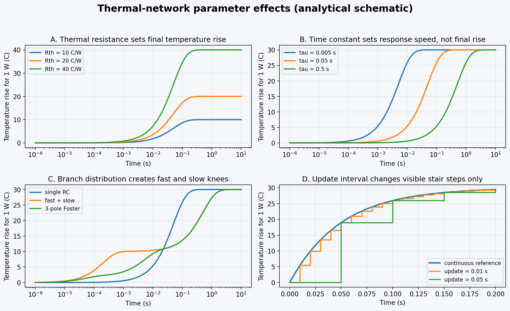

- **图A：只改变热阻**。对于1 W恒定耗散，最终温升就是热阻的数值；热阻翻倍，稳态温升翻倍。热阻控制纵轴终点，不负责定义到达终点的速度。
- **图B：只改变时间常数**。三条曲线最终都达到30摄氏度温升，但时间常数越大，到达稳态越慢。单RC在一个时间常数时达到最终温升的约63.2%。
- **图C：改变Foster支路分配**。总热阻相同并不代表瞬态相同。快速支路决定突发刚开始时的陡升，中速支路影响帧或子帧尺度，慢速支路决定长时间热浸泡。
- **图D：改变 `thermalUpdateIntervalSamples` 对应的更新时间**。粗更新会出现台阶，但每个台阶仍使用精确零阶保持解；只要平均耗散估计合理，它不会有意改变稳态温升。若更新间隔已经接近最小热时间常数，帧内峰值温度和非线性漂移会被低估。

单RC参数可由一次已知耗散功率阶跃近似提取。稳态热阻为：

```math
R_{\mathrm{th}}
=
\frac{T_{j,\infty}-T_{j,0}}
{P_{\mathrm{diss,step}}}.
```

时间常数可从63.2%交点读取：

```math
T_j(\tau)-T_{j,0}
=
0.632
\left(
T_{j,\infty}-T_{j,0}
\right).
```

多极点Foster不应逐个凭感觉设置。可对测得的瞬态热阻曲线做非负拟合：

```math
Z_{\mathrm{th}}(t)
=
\sum_{i=1}^{K}
R_i
\left(
1-e^{-t/\tau_i}
\right).
```

拟合时建议先在对数时间轴观察有几个明显膝点，再逐步增加支路数；若增加支路后验证误差不再明显下降，应停止增加，避免多个相近时间常数互相抵消。工程上可先令热更新时间满足：

```math
\Delta t_{\mathrm{thermal}}
\mathrel{\leq}
\frac{\tau_{\min}}{10}.
```

换算成配置样点数为：

```math
N_{\mathrm{update}}
\mathrel{\leq}
\frac{f_s\tau_{\min}}{10}.
```

这是分辨最快热节点的经验起点，不是稳定性限制；代码的指数更新本身在更大步长下仍保持数值稳定。

### 13.6 温度怎样修改现有电模型

当前首版采用可解释的公共温度漂移层。复增益为：

```math
G(T)
=
10^{k_G(T-T_{\mathrm{ref}})/20}
\exp
\left[
j k_{\phi}(T-T_{\mathrm{ref}})
\right].
```

其中 `gainTemperatureCoefficientDbPerC` 以dB/摄氏度配置，`phaseTemperatureCoefficientDegreesPerC` 在代码中先从度转换为弧度。

饱和尺度和额外非线性强度分别由：

```math
s(T)
=
1
+
k_s(T-T_{\mathrm{ref}}),
```

```math
q(T)
=
\max
\left[
0,
k_q(T-T_{\mathrm{ref}})
\right]
```

控制。基础输出 $y_0$ 最终变为：

```math
y_T
=
G(T)
\frac{y_0}
{1+q(T)|y_0/s(T)|^2}.
```

因此它可以直接包裹：

- Wiener：温度调制整体增益、相位、饱和和压缩；
- GMP：温度调制完整GMP输出，相当于低阶温度条件化系数近似；
- Doherty：温度调制载波/峰值合成后的公共电热漂移。

如果要精确描述Doherty两支路温差，应把carrier和peaking拆为两个独立 `PaModel` 热节点，再拟合各自耗散和合成参数。本实现优先保证与当前统一Doherty接口兼容。

#### 13.6.1 温度到电参数的效果图

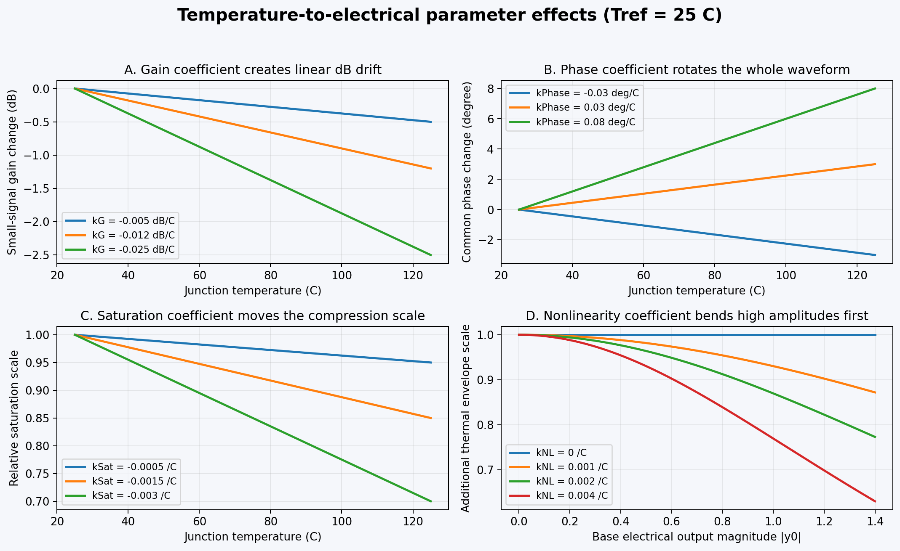

- **图A：`gainTemperatureCoefficientDbPerC`**。该参数直接规定每升高1摄氏度增益改变多少dB。冻结PA输入时，若压缩深度变化不大，输出功率漂移的一阶近似就是同样的dB斜率。
- **图B：`phaseTemperatureCoefficientDegreesPerC`**。正值表示温度升高时公共相位正向旋转，负值相反。若Analysis启用公共复增益补偿，这一项会被大部分消除，因此它可能在原始MSE中明显、在对齐后EVM中不明显。
- **图C：`saturationTemperatureCoefficientPerC`**。负值使饱和尺度随温度降低，压缩膝点向较小幅度移动；正值则反向。它会改变峰值样点，通常比公共增益更容易恶化EVM和ACLR。
- **图D：`nonlinearityTemperatureCoefficientPerC`**。低幅样点接近不变，高幅样点优先被压缩，因此它改变的是波形形状，而不只是整体增益。该参数过大时会与基础Wiener/GMP高阶项重复计入非线性。

公共增益和相位漂移主要构成可校正线性项：

```math
y(n,T)
\mathrel{\approx}
g(T)y_0(n).
```

而饱和和非线性温漂产生与包络相关的残差：

```math
e_{\mathrm{thermal}}(n,T)
=
y(n,T)-g(T)y_0(n).
```

因此判断温度模型是否真的影响调制质量时，应同时记录：未补偿输出功率与相位、复增益补偿后的EVM/NMSE、ACLR或双音IMD。只观察输出功率无法区分公共增益下降和非线性增强；只观察对齐后EVM又可能漏掉系统预算关心的绝对增益漂移。

### 13.7 `ThermalConfig`完整参数

| 参数 | 默认值 | 单位 | 物理作用 |
|---|---:|---:|---|
| `enabled` | `False` | 无 | 硬总开关；关闭时删除活动热网络、清除热metrics和旧互热offset，并旁路全部温度电参数漂移 |
| `modelName` | `"foster"` | 无 | `static`、`single_rc`或`foster` |
| `sampleRateHz` | `80e6` | Hz | 把样点数转换为真实发热时间 |
| `ambientTemperatureC` | `25` | 摄氏度 | 环境或冷板温度 |
| `initialJunctionTemperatureC` | `25` | 摄氏度 | 新热网络的起始结温 |
| `referenceTemperatureC` | `25` | 摄氏度 | 温度系数等于零偏移时的电模型温度 |
| `thermalResistancesCPerW` | `(2,8,20)` | 摄氏度/W | 各Foster支路稳态热阻 |
| `thermalTimeConstantsSec` | `(50e-6,5e-3,0.5)` | s | 各支路快、中、慢热时间常数 |
| `thermalUpdateIntervalSamples` | `256` | sample | 帧内热状态更新粒度 |
| `idleDissipatedPowerW` | `0.15` | W | RF关闭时的偏置耗散 |
| `efficiencyModelName` | `"power_dependent"` | 无 | 常效率或功率相关效率 |
| `peakDrainEfficiency` | `0.45` | 比例 | 高功率效率上界参数 |
| `minimumDrainEfficiency` | `0.10` | 比例 | 低功率效率下界参数 |
| `efficiencyKneeOutputPowerDbm` | `15` | dBm | 效率曲线过渡功率 |
| `referenceOutputPowerDbm` | `25` | dBm | 归一化输出功率1对应的物理RF功率 |
| `activePowerThresholdDb` | `-60` | dB | 相对峰值的RF开启判定门限 |
| `gainTemperatureCoefficientDbPerC` | `-0.012` | dB/摄氏度 | 结温升高时的增益漂移 |
| `phaseTemperatureCoefficientDegreesPerC` | `0.03` | 度/摄氏度 | 结温升高时的公共相位漂移 |
| `saturationTemperatureCoefficientPerC` | `-0.0015` | 1/摄氏度 | 饱和尺度漂移 |
| `nonlinearityTemperatureCoefficientPerC` | `0.002` | 1/摄氏度 | 额外压缩强度漂移 |
| `maximumJunctionTemperatureC` | `150` | 摄氏度 | 仿真安全上限；超过即停止 |

类字段默认值首先保证 `foster` 配置完整，但 `enabled=False`；它们不是所有模型都能直接复用的推荐。例如只把 `modelName` 改为 `single_rc` 会因为默认存在三组热阻和时间常数而校验失败。普通用户应优先调用 `ThermalConfig.Recommended(modelName, sampleRateHz=...)` 获取一套完整、已校验的模型起始值。

`enabled=False` 是硬关闭，不只是停止RC状态推进。`PaModel.SynchronizeThermalModel` 会移除活动 `ThermalNetwork`，清空上一次热metrics，并把MIMO邻链留下的外部互热温升归零；`SetExternalTemperatureOffsetC` 在关闭状态下也不会积累隐藏offset；`ApplyTemperatureDrift` 再次检查开关并直接返回基础电模型输出。底层 `ThermalNetwork` 只接受 `enabled=True` 的配置，直接用禁用配置构造它会报错；正确关闭方式是把禁用的 `ThermalConfig` 绑定到 `PaModel`，由统一入口旁路所有温度效应。以后重新启用时会按新配置建立新热网络，不会复用关闭前的互热offset。

暂停和关闭也有明确优先级。校准开始时保存的快照只在当前活动配置仍是同一份启用配置时恢复；如果校准期间通过活动映射或 `UpdateParameters` 改成 `enabled=False` 或 `None`，`RestoreThermalModel` 保持关闭并丢弃旧启用快照，不能把温度效应“复活”。

温度开关不会清零以前成功功率校准提交的模拟drive。这是有意的：`enabled` 控制热网络与温度漂移，drive控制PA输入工作点，两者是正交状态。若关闭温度后输出仍不同于一个全新PA对象，应先确认二者的已提交drive是否相同；公平对比应复用同一个drive，或对两边执行相同目标功率校准。

下面所有“推荐值”都是本工程针对约25 dBm归一化行为PA设计的**可运行仿真起点**，不是GaN、LDMOS或GaAs器件规格。封装、PCB、散热器、偏置和环境会共同改变热阻与温度；正式测试必须由热瞬态、DC效率和多温度I/Q数据替换这些起点。Analog Devices的RF热管理说明也强调热流路径必须包含封装、PCB和散热边界，不能只复制一个通用热阻；器件允许结温则必须以具体数据手册为准。

#### 13.7.1 三种已实现模型的完整推荐值

| 参数 | `static`推荐起点 | `single_rc`推荐起点 | `foster`推荐起点 | 使用说明 |
|---|---|---|---|---|
| `enabled` | `True` | `True` | `True` | 只有显式打开才产生温度影响 |
| `modelName` | `"static"` | `"single_rc"` | `"foster"` | 必须使用代码支持的精确名称 |
| `sampleRateHz` | 实际波形采样率；示例 `80e6` | 实际波形采样率；示例 `80e6` | 实际波形采样率；示例 `80e6` | 不能按信号带宽或过采样倍数猜测 |
| `ambientTemperatureC` | `25.0` | `25.0` | `25.0` | 正式仿真改为冷板、壳体或环境实测值 |
| `initialJunctionTemperatureC` | `55.0`；推荐另扫 `25/55/85` | 冷启动 `25.0` | 冷启动 `25.0` | 动态模型冷启动通常等于环境温度 |
| `referenceTemperatureC` | `25.0` | `25.0` | `25.0` | 必须等于基础PA系数提取温度 |
| `thermalResistancesCPerW` | `(1.0,)`占位 | `(20.0,)` | `(2.0, 8.0, 20.0)` | 静态模型不由热阻推进；动态模型必须实测替换 |
| `thermalTimeConstantsSec` | `(1.0,)`占位 | `(20.0e-3,)` | `(50.0e-6, 5.0e-3, 0.5)` | Foster三项分别作为快、中、慢起点 |
| `thermalUpdateIntervalSamples` | `256` | `256` | `256` | 80 MHz时为3.2微秒，能分辨50微秒快速支路 |
| `idleDissipatedPowerW` | `0.15` | `0.15` | `0.15` | 无静态偏置的理想模型可设为 `0.0` |
| `efficiencyModelName` | `"power_dependent"` | `"power_dependent"` | `"power_dependent"` | 静态模型中只影响耗散诊断，不改变固定结温 |
| `peakDrainEfficiency` | `0.45` | `0.45` | `0.45` | 高输出功率效率起点 |
| `minimumDrainEfficiency` | `0.10` | `0.10` | `0.10` | 低输出功率效率起点，不得超过峰值效率 |
| `efficiencyKneeOutputPowerDbm` | `15.0` | `15.0` | `15.0` | 推荐先取参考输出功率减10 dB |
| `referenceOutputPowerDbm` | `25.0` | `25.0` | `25.0` | 应与Channel的 `maximumOutputPowerDbm` 一致 |
| `activePowerThresholdDb` | `-60.0` | `-60.0` | `-60.0` | 纯仿真波形起点；真实采集按噪声底调整 |
| `gainTemperatureCoefficientDbPerC` | `-0.012` | `-0.012` | `-0.012` | 每升高1摄氏度的公共增益dB斜率 |
| `phaseTemperatureCoefficientDegreesPerC` | `0.03` | `0.03` | `0.03` | 符号必须由实测相位随温度方向决定 |
| `saturationTemperatureCoefficientPerC` | `-0.0015` | `-0.0015` | `-0.0015` | 负值表示升温后压缩膝点降低 |
| `nonlinearityTemperatureCoefficientPerC` | `0.0020` | `0.0020` | `0.0020` | 正值表示升温后附加包络压缩增强 |
| `maximumJunctionTemperatureC` | `150.0` | `150.0` | `150.0` | 正式值取器件额定结温与项目降额上限中的较小者 |

`static` 的热阻和时间常数是数据结构校验所需的正数占位值；该模型始终保持 `initialJunctionTemperatureC`，不会由功率、效率、热阻或时间常数生成动态升温。推荐的 `55` 摄氏度只是中间温度角；常规对比使用 `25/55/85` 摄氏度，只有器件额定范围允许时才增加更高压力温度角。

三套推荐配置可直接构造：

```python
from inc.lib.PaModel import ThermalConfig


staticThermalConfig = ThermalConfig.Recommended(
    "static",
    sampleRateHz=80.0e6,
)
singleRcThermalConfig = ThermalConfig.Recommended(
    "single_rc",
    sampleRateHz=80.0e6,
)
fosterThermalConfig = ThermalConfig.Recommended(
    "foster",
    sampleRateHz=80.0e6,
)

# Measured values can replace any recommended starting field explicitly.
measuredSingleRcConfig = ThermalConfig.Recommended(
    "single_rc",
    sampleRateHz=80.0e6,
    thermalResistancesCPerW=(12.5,),
    thermalTimeConstantsSec=(8.0e-3,),
    peakDrainEfficiency=0.52,
)
```

#### 13.7.2 推荐范围与替换规则

模型和时间离散参数建议如下：

| 参数 | 推荐起点或对比档位 | 何时必须替换 | 过小或过大的后果 |
|---|---|---|---|
| `thermalResistancesCPerW`，单RC | `(20.0,)`；趋势检查 `(5.0,) / (20.0,) / (40.0,)` | 有稳态温升与耗散功率测量时 | 太小低估稳态温升；太大夸大热压缩 |
| `thermalTimeConstantsSec`，单RC | `(0.02,)`；趋势检查 `(0.005,) / (0.02,) / (0.1,)` | 有功率阶跃升温或冷却曲线时 | 太小使PA几乎瞬时升温；太大使短测试看不到变化 |
| `thermalResistancesCPerW`，Foster | `(2.0, 8.0, 20.0)` | 有瞬态热阻曲线时执行非负多指数拟合 | 总和决定长期温升，分配决定各时间尺度幅度 |
| `thermalTimeConstantsSec`，Foster | `(50e-6, 5e-3, 0.5)` | 有快、中、慢热瞬态测量时 | 支路过密会病态，缺少快支路会漏掉突发内温漂 |
| `sampleRateHz` | 与送入PA的样值采样率完全一致 | 任何采样率变化后 | 错误采样率会按同比例缩放全部热时间 |
| `thermalUpdateIntervalSamples` | `256`；每个最小时间常数至少10个更新点 | 改变采样率或最小时间常数后 | 太大低估快速温度纹波；太小只增加计算量 |

更新时间应满足：

```math
\frac{N_{\mathrm{update}}}{f_s}
\le
\frac{\tau_{\min}}{10}.
```

温度边界参数建议如下：

| 参数 | 推荐起点 | 工程替换规则 |
|---|---|---|
| `ambientTemperatureC` | `25.0` | 使用实际冷板、壳体或环境传感器值；温箱扫描逐点修改 |
| `initialJunctionTemperatureC` | 动态冷启动等于环境温度；静态角使用 `25/55/85` | 预热设备使用测试开始时估计或测得结温 |
| `referenceTemperatureC` | `25.0` | 等于基础Rapp/Wiener/GMP/分段GMP/Doherty系数采集温度，不等于任意环境温度 |
| `maximumJunctionTemperatureC` | 无器件资料时仿真起点 `150.0` | 使用数据手册额定结温并加入项目降额；该值是停止边界，不是温控器 |

热源与效率参数建议如下：

| 参数 | 推荐起点 | 推荐范围或实测方法 |
|---|---|---|
| `idleDissipatedPowerW` | `0.15 W` | 理想无偏置可用 `0`；真实值用RF关闭时的直流电压乘电流 |
| `efficiencyModelName` | `"power_dependent"` | 只有效率随功率近似平坦时才选 `"constant"` |
| `minimumDrainEfficiency` | `0.10` | 低功率DC/RF扫描拟合；行为压力检查可用 `0.05...0.20` |
| `peakDrainEfficiency` | `0.45` | 接近额定输出实测；行为检查可用 `0.35...0.60`，且必须大于等于最小效率 |
| `efficiencyKneeOutputPowerDbm` | `15 dBm` | 初值取 `referenceOutputPowerDbm - 10 dB`，再由效率曲线转折拟合 |
| `referenceOutputPowerDbm` | `25 dBm` | 必须等于归一化输出功率1所代表的实际端口功率，并与Channel满量程定义一致 |
| `activePowerThresholdDb` | 纯仿真 `-60 dB` | 真实采集把门限放在噪声底以上约6至10 dB，并检查占空比是否符合帧结构 |

温度到电参数的推荐值是用于确认趋势的温和起点：

| 参数 | 推荐起点 | 建议敏感性范围 | 必须使用的辨识数据 |
|---|---:|---:|---|
| `gainTemperatureCoefficientDbPerC` | `-0.012` | `-0.005...-0.030` | 多温度小信号或线性区增益 |
| `phaseTemperatureCoefficientDegreesPerC` | `0.03` | `-0.10...0.10` | 同一参考面多温度复增益相位 |
| `saturationTemperatureCoefficientPerC` | `-0.0015` | `-0.0005...-0.0030` | 多温度AM-AM膝点或饱和尺度 |
| `nonlinearityTemperatureCoefficientPerC` | `0.0020` | `0.0005...0.0050` | 多温度复增益对齐后EVM、ACLR或IMD残差 |

这些范围用于敏感性扫描，不是代码合法范围。特别是相位系数的符号、增益系数是否始终为负、饱和尺度是否随温度下降，都必须由被测PA决定。若只想验证热网络而不希望电响应漂移，可把四个温度系数全部设为 `0.0`。

MIMO互热参数 `thermalCouplingCPerW` 不属于 `ThermalConfig`，但同样需要推荐起点：无测量时使用 `None`，表示不假设互热；两路功能演示可使用非对角 `2.0` 摄氏度/W；`5...10` 摄氏度/W只作为明显压力测试。正式值由“加热源链的耗散功率”和“相邻受热链的稳态温升”相除得到，并保持对角线为零。

#### 13.7.3 尚未直接实现模型的建议辨识起点

下表覆盖前文讨论但尚不能填入 `ThermalConfig.modelName` 的扩展模型。它们是后续实现或离线拟合的初始化建议，不能直接传给当前代码。

| 模型 | 建议参数起点 | 推荐数据与验收 |
|---|---|---|
| Cauer梯形网络 | `3`个热节点；时间尺度先覆盖 `50e-6/5e-3/0.5 s`；总热阻由稳态温升除以耗散功率给出 | 用结构热仿真或分层测温拟合；必须通过网络综合把Foster转换成Cauer，不能直接把并联Foster支路当作物理层 |
| 温度条件化GMP | 温度点 `25/55/85` 摄氏度；奇数阶 `(1,3,5,7)`；主记忆深度 `3`；滞后和超前包络各 `1`；一次温度基函数；岭系数 `1e-6...1e-4` | 至少覆盖3个功率和3种占空比；独立温度验证集要求EVM、ACLR和IMD同时不退化 |
| 物理引导神经电热模型 | 保留3支Foster物理状态；单层GRU或状态网络宽度 `24`；按热更新区间形成 `64...256`步序列；学习率 `1e-3`；梯度裁剪 `1.0` | 只学习Foster与温度条件化GMP的残差；使用未见功率、温度和突发周期验证有界性与外推趋势 |

推荐的复杂度升级顺序是 `single_rc` → `foster` → 温度条件化GMP → 物理引导神经网络。只有当前层级在独立数据上的结温、输出功率、EVM和带外残差仍具有稳定结构时，才增加下一层参数。

#### 13.7.4 参数增大时会发生什么

| 参数增大 | 曲线或状态的直接变化 | 常见可观测结果 | 主要辨识数据 |
|---|---|---|---|
| `sampleRateHz` | 同样样点数代表更短物理时间 | 每帧温升变小，但真实相同持续时间不应改变 | 仪表实际采样率 |
| `ambientTemperatureC` | 整条结温轨迹向上移动 | 冷启动温度更高，更早进入热压缩 | 环境、底板或温箱温度 |
| `initialJunctionTemperatureC` | 只改变瞬态起点 | 前几帧输出不同，足够长时间后趋于同一稳态 | 测试开始时结温估计 |
| `referenceTemperatureC` | 改变“零电漂移”的基准点 | 同一结温对应的增益/相位偏移变化 | 基础PA系数提取时温度 |
| `thermalResistancesCPerW` | 对应支路的最终温升增大 | 稳态增益和输出功率漂移增大 | 已知功率阶跃的稳态温升 |
| `thermalTimeConstantsSec` | 对应支路响应变慢 | 热迟滞变长、冷却变慢，但最终温升不变 | 功率阶跃上升与冷却曲线 |
| `thermalUpdateIntervalSamples` | 可见温度台阶变粗 | 过大时漏掉帧内热纹波 | 最小时间常数与采样率 |
| `idleDissipatedPowerW` | RF关闭阶段平衡温度升高 | 长空闲后不再完全冷却到环境温度 | 静态偏置DC功率 |
| `minimumDrainEfficiency` | 低功率耗散降低 | 低输出功率和低占空比温升下降 | 低功率DC/RF效率 |
| `peakDrainEfficiency` | 高功率耗散降低 | 高输出功率温升下降 | 接近额定输出的DC/RF效率 |
| `efficiencyKneeOutputPowerDbm` | 效率转折向高功率移动 | 中功率区效率降低、热量增加 | 效率随输出功率扫描 |
| `referenceOutputPowerDbm` | 同一归一化样值映射到更多瓦特 | 所有RF开启区的估算热量增加 | 端口满量程和阻抗标定 |
| `activePowerThresholdDb` | 更多低幅样点被判为空闲 | 估算占空比与耗散可能降低 | 波形开启区定义与噪声底 |
| `gainTemperatureCoefficientDbPerC` | 增益随温度的dB斜率变得更正 | 冻结驱动下输出功率随温度上升 | 多温度小信号增益 |
| `phaseTemperatureCoefficientDegreesPerC` | 公共相位斜率变得更正 | 原始MSE和相位漂移增加 | 多温度复增益相位 |
| `saturationTemperatureCoefficientPerC` | 饱和尺度随温度的斜率变得更正 | 热压缩减弱；负值增大绝对值则更早压缩 | 多温度AM-AM膝点 |
| `nonlinearityTemperatureCoefficientPerC` | 高幅附加压缩增强 | EVM、ACLR和IMD通常恶化 | 多温度对齐后非线性残差 |
| `maximumJunctionTemperatureC` | 只放宽仿真停止上限 | 不改变上限以内的任何曲线 | 器件额定值和降额策略 |

注意“增大”是数值方向。例如 `gainTemperatureCoefficientDbPerC` 从 `-0.025` 增大到 `-0.005`，意味着负温漂变弱；不能只比较绝对值。

#### 13.7.5 采样、门限、参考点和安全上限效果图

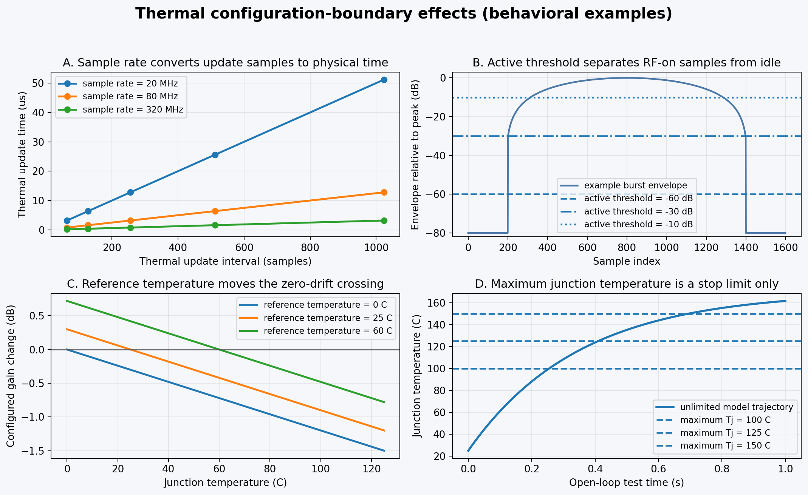

- **图A：`sampleRateHz`和 `thermalUpdateIntervalSamples`**共同决定一次热更新对应的真实时间。更新样点数不变时，采样率越高，物理更新时间越短；因此把同一配置直接搬到不同采样率会改变热过程。
- **图B：`activePowerThresholdDb`**相对于当前波形峰值判定RF开启区。门限提高会把更多低包络样点当成空闲并使用 `idleDissipatedPowerW`；门限过低则可能把噪声底或数值残留当成RF开启。
- **图C：`referenceTemperatureC`**移动所有温度电系数的零交点，但不改变热网络预测的真实结温。它应等于基础Rapp/Wiener/GMP/分段GMP/Doherty系数采集或拟合时的温度。
- **图D：`maximumJunctionTemperatureC`**只是仿真停止边界，不会剪切、压低或稳定其下的结温曲线。降低上限只会使同一发热轨迹更早报错，不能代替功率降额或温控模型。

时间换算关系为：

```math
\Delta t_{\mathrm{thermal}}
=
\frac{N_{\mathrm{update}}}{f_s}.
```

如果波形包含前后补零，门限判定会让这些样点使用空闲耗散，但样点所对应的时间仍完整推进。这样补零既不会虚构RF输出功率，又能正确表示实际静默时间。

#### 13.7.6 如何用实测结果替换推荐值

推荐值只用于把仿真流程跑通，不能代表具体器件。实际PA应先统一结温、冷板或壳体边界与RF/DC功率参考面，再按“热源效率 → 单RC/Foster热网络 → 四个温度电参数 → MIMO互热”的顺序辨识；不要同时自由调整热阻和增益温度系数去拟合同一条输出功率曲线。测试台连接、TSEP和红外测温边界、耗散功率定义、单RC/Foster非负拟合、效率拟合、三温度点I/Q回归、完整 `ThermalConfig` 回填和独立验证见 [PA温度特性测量、模型辨识与参数回填](./PaThermalMeasurement.md)。

#### 13.7.7 周期热指标怎样读取

`Channel.GetThermalMetrics()` 在SISO下直接返回PA热指标字典；MIMO下的逐链指标位于 `chains` 元组。周期调度新增或重新明确的字段如下：

| 指标 | 含义 |
|---|---|
| `thermalRunMode` | 本次接受周期使用的 `steady_state` 或 `transient` 模式 |
| `configuredDutyCycle` | Channel配置的数据窗口占完整周期比例 |
| `waveformActiveDutyCycle` | 数据窗口内部按PA输入门限测得的RF活动比例 |
| `activeSampleDutyCycle` | `waveformActiveDutyCycle` 的兼容字段，数值相同 |
| `actualDutyCycle` | 完整周期真实RF活动比例，等于前两项乘积 |
| `signalDurationSec` | 输入数据窗口样点数除以热模型采样率 |
| `scheduledIdleDurationSec` | Channel自动推进的窗口外空闲时长 |
| `periodDurationSec` | 数据窗口与自动窗口外空闲的总时长 |
| `periodStartingJunctionTemperatureC` | 完整周期起点结温 |
| `dataEndingJunctionTemperatureC` | 输入数据窗口处理完成时的结温 |
| `periodEndingJunctionTemperatureC` | 自动窗口外空闲结束后的结温 |
| `startingJunctionTemperatureC` | 周期起点结温的兼容字段 |
| `endingJunctionTemperatureC` | 数据窗口结束结温的兼容字段，不是完整周期终点 |
| `periodStartingTemperatureRisePerBranchC` | 周期起点各RC支路相对边界温升 |
| `dataEndingTemperatureRisePerBranchC` | 数据窗口结束时各支路温升 |
| `periodEndingTemperatureRisePerBranchC` | 完整周期结束时各支路温升 |
| `dataWindowAverageDissipatedPowerW` | 只在数据窗口内平均的耗散功率 |
| `averageDissipatedPowerW` | 包含自动窗口外空闲的完整周期平均耗散功率 |
| `steadyStateConverged` | 仅在 `steady_state` 模式确实收敛时为 `True`；`transient` 固定为 `False`，表示“未执行稳态求解/不适用”，不是瞬态处理失败 |
| `steadyStateIterations` | 本次非线性稳态求解迭代次数；静态或无需迭代时可为0 |
| `steadyStateErrorC` | 最终周期热状态闭合误差 |
| `temperatureTraceTimeSec` | 从周期起点开始的分段时间坐标 |
| `temperatureTraceC` | 与时间坐标对应的周期结温曲线 |
| `temperatureTraceRfActive` | 每个相邻温度点之间的区间是否包含RF活动 |

稳态验收不要比较 `dataEndingJunctionTemperatureC` 和周期起点，因为数据发送结束时本来就可以处于温度峰值。正确检查是：

```python
thermalMetrics = channel.GetThermalMetrics()
closureErrorC = abs(
    thermalMetrics["periodEndingJunctionTemperatureC"]
    - thermalMetrics["periodStartingJunctionTemperatureC"]
)
assert thermalMetrics["steadyStateConverged"]
assert closureErrorC <= channel.parameters[
    "thermalSteadyStateToleranceC"
]
```

结温标量的首尾差可能因不同Foster支路误差相消而显得很小，因此严格诊断还应查看 `steadyStateErrorC`；它使用支路级闭合误差。

### 13.8 MIMO热耦合

`MimoPaModel.parameters["thermalCouplingCPerW"]` 可配置链数乘链数的非负矩阵。行表示受热PA，列表示热源PA：

```math
\Delta\mathbf T_{\mathrm{mutual}}
=
\mathbf R_{\mathrm{th,mutual}}
\mathbf P_{\mathrm{diss}}.
```

对角线强制为零，因为每个 `PaModel` 已经通过自己的Foster网络计算自热。互热矩阵表示完整周期平均耗散产生的稳态温度偏移，本身没有动态时间常数。在 `steady_state` 模式下，`MimoPaModel` 会把逐链周期平均耗散与互热温升一起放入外层不动点迭代；只有自热周期和互热温升同时收敛后才接受结果。在 `transient` 模式下，互热保持因果的一周期滞后：本周期平均耗散更新下一周期使用的相邻温升。若需要互热本身也具有多个时间常数，应把每个非对角路径扩展为独立Foster网络。

一次MIMO周期是原子热事务：进入逐链处理前保存所有PA热状态、累计时间、最近输出RMS、耗散功率和互热metrics。若后续任一PA因温度上限、模型异常或稳态不收敛而失败，已经处理过的前序PA也全部回滚，旧metrics同时恢复，再向调用方传播原异常。只有所有链和互热固定点都成功时才共同提交一个周期，避免失败调用留下“部分链前进一周期、部分链未前进”的非物理状态。

`thermalCouplingCPerW` 可以在运行中更新。若从非零互热矩阵改为全零矩阵，下一个成功周期会先把每路历史 `mutualHeatingTemperatureRiseC` 清为0，再按无互热条件处理；旧邻链温升不会泄漏到新配置。把某一路 `ThermalConfig.enabled` 改为 `False` 时，该路也会立即清除自身保存的外部互热offset，后续互热更新不会在关闭对象中暗中积累。若矩阵清零周期失败，原子回滚仍恢复调用前的热offset和metrics；直到一次新配置周期完整成功才提交清零结果。

#### 13.8.1 运行条件和互热参数效果图

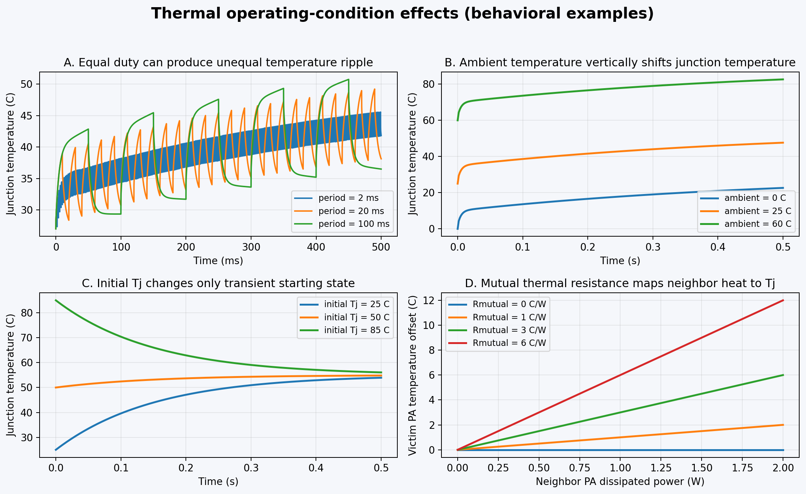

- **图A**比较相同50%占空比、不同突发周期。平均耗散相同不保证峰值结温和温度纹波相同，因为快速热节点能否在一次开启或关闭期间充分响应取决于脉冲周期。
- **图B**显示环境温度是结温的外部基线。环境温度变化不会改变热阻和时间常数，但会改变同一耗散下的绝对结温及电参数漂移。
- **图C**显示初始结温只改变起始状态。当测试持续时间不足时，初始条件会显著影响结果；不能把不同预热状态的数据直接比较。
- **图D**显示 `thermalCouplingCPerW` 的基本含义：相邻PA的完整周期平均耗散功率乘互热阻，就是受热PA的附加温升。稳态模式联合求解这个偏移；瞬态模式在下一周期应用它。该参数适合没有独立时间常数的慢速板级互热，不用于描述采样级串扰。

两路PA的例子为：

```math
\Delta T_1
=
R_{12}P_{\mathrm{diss},2},
```

```math
\Delta T_2
=
R_{21}P_{\mathrm{diss},1}.
```

`R12`与`R21`不必相等，因为芯片位置、铜皮、散热器压力和气流方向可能不对称。若测得互热存在明显上升和冷却时间常数，当前稳态矩阵只能拟合最终温升，后续应把每条非对角路径扩展为动态Foster支路。

### 13.9 推荐调用方式

```python
import numpy as np

from inc.lib.Channel import Channel
from inc.lib.PaModel import PaModel, ThermalConfig


thermalConfig = ThermalConfig(
    enabled=True,
    modelName="foster",
    sampleRateHz=80.0e6,
    ambientTemperatureC=25.0,
    initialJunctionTemperatureC=25.0,
    thermalResistancesCPerW=(2.0, 8.0, 20.0),
    thermalTimeConstantsSec=(50.0e-6, 5.0e-3, 0.5),
    idleDissipatedPowerW=0.15,
    gainTemperatureCoefficientDbPerC=-0.012,
)
paModel = PaModel(
    parameters={
        "modelName": "gmp",
        "thermalConfig": thermalConfig,
        "width": 0,
    }
)
channel = Channel(
    paModel=paModel,
    parameters={
        "sampleRateHz": 80.0e6,
        "maximumOutputPowerDbm": 25.0,
        "thermalRunMode": "steady_state",
        "thermalDutyCycle": 0.40,
        "thermalSteadyStateToleranceC": 1.0e-4,
        "maximumThermalSteadyStateIterations": 100,
        "width": 0,
    },
)

# The data window may contain internal zeros.  They are not removed from the
# configured 40 percent window, but they do reduce actual RF-active duty.
rawSignalWithIdle = rawSignal.copy()
rawSignalWithIdle[rawSignalWithIdle.size // 2 :] = 0.0

# The first steady-state call requires a power target.  Channel calibrates at
# the reference temperature and then evaluates the accepted waveform on the
# converged periodic temperature curve.
chOut, fbOut = channel.Process(
    rawSignalWithIdle,
    outputPowerDbm=22.0,
)
thermalMetrics = channel.GetThermalMetrics()

print("configured", thermalMetrics["configuredDutyCycle"])
print("inside data window", thermalMetrics["waveformActiveDutyCycle"])
print("actual full period", channel.GetActualDutyCycle())
print(
    "period start/data end/period end",
    thermalMetrics["periodStartingJunctionTemperatureC"],
    thermalMetrics["dataEndingJunctionTemperatureC"],
    thermalMetrics["periodEndingJunctionTemperatureC"],
)
```

调用方没有关闭温度模型，也没有显式构造功率校准器或外部空闲波形。默认稳态模式下，每次 `Process` 都在参考电模型上重新校准，然后只把最终接受周期计入热时间。`GetLastCalibrationMetrics()` 报告参考校准结果，`GetThermalMetrics()` 报告完整周期平均耗散、三层占空比、首尾温度、温度曲线和自然漂移后的有效RF区输出功率。有效区定义与 `activePowerThresholdDb` 一致，因此前后补零不会把活动区输出功率读数拉低，却会正确降低真实占空比并产生冷却。EVM、ACLR仍由独立 `Analysis` 使用返回的数据窗口计算。

若需要观察从冷机开始的逐周期温升，只需把Channel参数改为：

```python
transientChannelParameters = {
    "sampleRateHz": 80.0e6,
    "maximumOutputPowerDbm": 25.0,
    "thermalRunMode": "transient",
    "thermalDutyCycle": 0.40,
    "width": 0,
}
```

此时连续调用的周期首尾温度可以不同；每次调用已经包含60%的自动窗口外空闲。不要再手动加入同一段空闲。

固定温度角、周期稳态与连续瞬态、配置占空比与内部空闲的最小隔离系统、可运行代码和温度曲线绘图见 [Example.md](./Example.md)。

## 14. 使用边界和常见误解

1. **行为拟合好不等于电路正确**：相同输入范围内波形拟合好，不能推出器件效率、稳定性或可靠性。
2. **外推风险**：模型只应在训练/设定的幅度、带宽和温度范围内使用；高阶多项式在范围外可能快速发散。
3. **采样率必须覆盖带外再生**：若只按 1x 信道带宽采样，非线性频谱会混叠回带内。本工程默认 4x 过采样。
4. **Wiener 结构有限**：真实 PA 可能更接近 Hammerstein、Wiener-Hammerstein 或多分支结构。
5. **GMP 不是任意强非线性的万能模型**：深饱和、迟滞、长期热记忆可能需要分段、动态状态或神经网络模型。
6. **记忆深度以采样点计**：改变采样率后，相同 `memoryDepth` 对应的物理时间会变化。

---

## 15. 参考资料

- [C. Rapp, “Effects of HPA-Nonlinearity on a 4-DPSK/OFDM-Signal,” 1991](https://elib.dlr.de/33776/)
- [D. R. Morgan 等, “A Generalized Memory Polynomial Model for Digital Predistortion of RF Power Amplifiers,” IEEE TSP, 2006](https://doi.org/10.1109/TSP.2006.879264)
- [Y. Mancuso 与 R. Quéré, “Behavioral Thermal Modeling for Microwave Power Amplifier Design,” IEEE TMTT, 2007](https://doi.org/10.1109/TMTT.2007.907715)
- [S. A. Bassam 等, “Black-box Modeling and Compensation of Bursty Communication Signals in RF Power Amplifiers with Power-Dependent Parameters,” 2014](https://arxiv.org/abs/1410.8119)
- [Analog Devices AN-1604, “Thermal Management Calculations for RF Amplifiers in LFCSP and Flange Packages”](https://www.analog.com/en/resources/app-notes/an-1604.html)
- [Analog Devices AN-2591, “When It Comes to Long-Term Reliability of RF Amplifier ICs, Focus First on Die Junction Temperature”](https://www.analog.com/en/resources/app-notes/an-2591.html)
- [Qorvo, “GaN Thermal Analysis for High-Performance Systems”](https://www.qorvo.com/-/media/files/qorvopublic/white-papers/qorvo-gan-thermal-analysis-for-high-performance-systems-white-paper.pdf)

本工程的独立Rapp PA遵循经典无记忆SSPA假设；Wiener中的Rapp AM-AM、有界AM-PM和默认GMP系数是面向教学与算法比较的组合实现。具体公式和默认值以 `inc/lib/PaModel.py` 为准。
