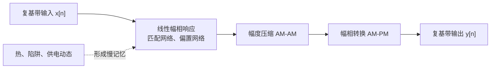
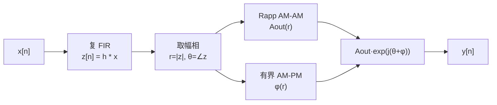
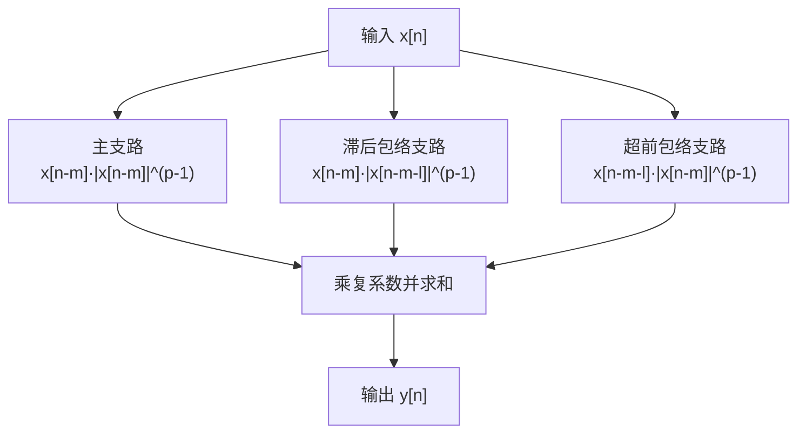
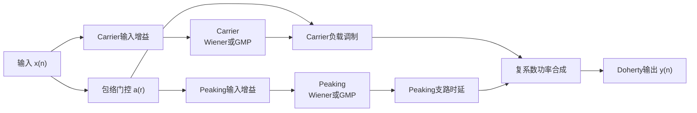
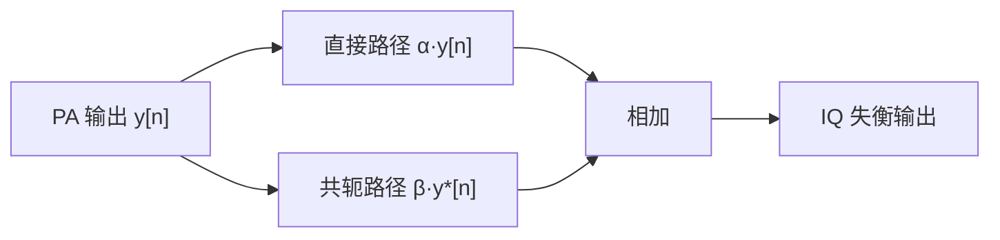
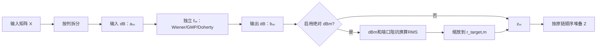
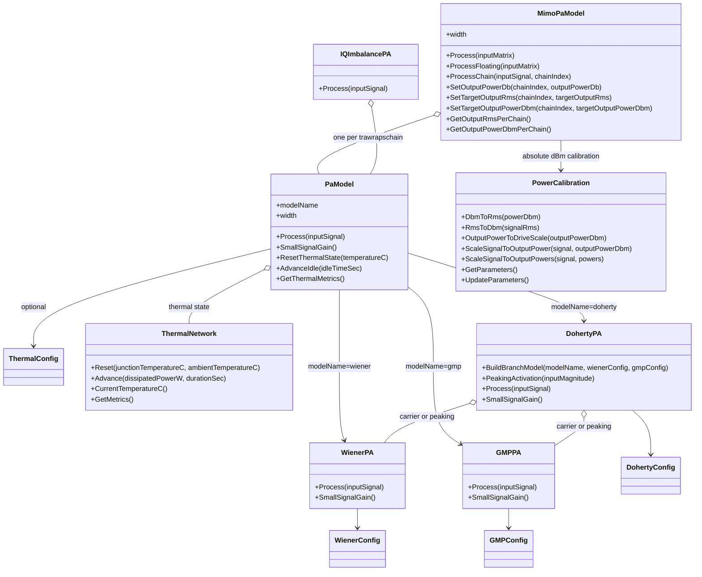

# 功率放大器模型：Wiener、GMP、Doherty与电热特性的物理原理

本文解释 `inc/lib/PaModel.py` 中功率放大器（Power Amplifier，PA）模型的物理意义、数学来源、参数作用和适用边界。工程支持三类模型：

- **Wiener 模型**：线性记忆滤波器后接无记忆非线性，直观、参数少；
- **GMP 模型**：主记忆多项式加包络超前/滞后交叉项，表达能力更强；
- **Doherty 模型**：载波PA和峰值PA并联，通过包络门控、支路时延、复合成与简化负载调制描述Doherty架构。

> Wiener、GMP和Doherty是复基带“行为电模型”。可选 `ThermalConfig` 在它们外面增加耗散功率、结温和温度参数漂移；它是可辨识的系统级电热模型，不等同于晶体管级可靠性仿真。

---

## 1. PA 为什么会产生失真

理想线性 PA 应满足

```math
y(t)=Gx(t),
```

其中 $G$ 是固定复增益。真实器件受供电电压、最大电流、晶体管跨导和匹配网络限制，无法无限放大。当输入幅度增加时会出现：

1. **AM-AM 失真**：输出幅度不再按比例增长，进入增益压缩和饱和；
2. **AM-PM 失真**：输出相位随输入幅度变化；
3. **记忆效应**：当前输出不只取决于当前输入，还取决于过去若干采样点；
4. **频谱再生**：带内信号的非线性混频分量落入邻道。


```mermaid
flowchart LR
    A["复基带输入 x[n]"] --> B["线性幅相响应<br/>匹配网络、偏置网络"]
    B --> C["幅度压缩 AM-AM"]
    C --> D["幅相转换 AM-PM"]
    D --> E["复基带输出 y[n]"]
    F["热、陷阱、供电动态"] -. "形成慢记忆" .-> B
```

**图 1 说明**：PA 的频率选择性和动态状态产生记忆，器件电流/电压上限产生幅度压缩，寄生电容和工作点变化又使相位随包络变化。本工程用数学模块等效这些现象，而不逐个模拟晶体管。

---

## 2. 复包络模型为什么成立

射频输入写成

```math
v_{\mathrm{in,RF}}(t)=\sqrt{2}\Re\left\{x(t)e^{j2\pi f_ct}\right\},
```

输出写成

```math
v_{\mathrm{out,RF}}(t)=\sqrt{2}\Re\left\{y(t)e^{j2\pi f_ct}\right\}.
```

$x(t)$ 和 $y(t)$ 是相对载波变化较慢的复包络。只要模型正确保留包络的幅度、相位和记忆，PA 在载波附近产生的带内失真与邻道频谱再生就能在基带中观察，不需要显式生成 GHz 载波。

复系数同时包含增益与相移：

```math
c=|c|e^{j\angle c}.
```

因此 GMP 中一个复系数的实部/虚部组合能够共同表达 AM-AM 和 AM-PM 行为。

### 2.1 dBm与复包络RMS的物理标定

本工程把复包络RMS定义为端口的等效RMS电压：

```math
V_{\mathrm{RMS}}
=\sqrt{\frac{1}{N}\sum_{n=0}^{N-1}|x[n]|^2}.
```

对于阻值为 $R$ 的纯电阻端口，平均功率为：

```math
P_{\mathrm{W}}
=\frac{V_{\mathrm{RMS}}^2}{R}.
```

dBm以1 mW为参考，因此：

```math
P_{\mathrm{dBm}}
=10\log_{10}\left(
\frac{V_{\mathrm{RMS}}^2}
{R\cdot10^{-3}}
\right).
```

反向换算为：

```math
V_{\mathrm{RMS}}
=\sqrt{
R\cdot10^{-3}\cdot10^{P_{\mathrm{dBm}}/10}
}.
```

`PowerCalibration` 定义在 `inc/utils/SigProc.py`，`PaModel.py` 只导入并复用它。该类实现这两个方向的换算，`loadResistanceOhm` 默认是50 Ω，也允许用户修改。以50 Ω为例：

- `0 dBm` 等于1 mW，对应约 `0.223607 V RMS`；
- `0.24 V RMS` 对应约 `0.6145 dBm`；
- `-10 dBm` 对应约 `0.070711 V RMS`。

这个阻抗标定非常重要。若只把旧的归一化RMS数值改写成“dBm”标签而不引入 $R$，得到的不是绝对功率。当前主程序和功率-EVM横轴使用每路PA输出功率：默认工作点20 dBm、默认额定极限25 dBm。

---

## 3. Wiener PA 模型

### 3.1 结构

Wiener 模型是“线性动态系统在前、静态非线性在后”的级联：


```mermaid
flowchart LR
    A["x[n]"] --> B["复 FIR<br/>z[n] = h * x"]
    B --> C["取幅相<br/>r=|z|, θ=∠z"]
    C --> D["Rapp AM-AM<br/>Aout(r)"]
    C --> E["有界 AM-PM<br/>φ(r)"]
    D --> F["Aout·exp(j(θ+φ))"]
    E --> F
    F --> G["y[n]"]
```

**图 2 说明**：FIR 先让不同频率成分经历不同增益和相位，并引入采样记忆；随后非线性根据滤波后瞬时包络 $r$ 决定输出幅度和额外相位。因为顺序不能交换，所以它表达的是一种特定类型的动态非线性。

### 3.2 第一步：线性记忆

长度为 $M$ 的因果复 FIR 为

```math
z[n]=\sum_{m=0}^{M-1}h[m]x[n-m].
```

其频率响应为

```math
H(e^{j\omega})=\sum_{m=0}^{M-1}h[m]e^{-j\omega m}.
```

如果只有零时延抽头 $h[0]$，模型无记忆；存在一个或多个非零时延抽头时，当前输出会混入过去输入。复抽头的幅度控制记忆强度，相角控制不同延迟支路的相位。

默认抽头为

```math
\left[1,\ 0.055-j0.025,\ -0.018+j0.012\right].
```

这是一个温和且稳定的仿真记忆响应，不对应某个特定实测器件。

### 3.3 第二步：Rapp AM-AM 压缩

令

```math
r[n]=|z[n]|,\qquad \rho[n]=\frac{r[n]}{A_{\mathrm{sat}}}.
```

代码使用平滑 Rapp 特性：

```math
A_{\mathrm{out}}(r)
=\frac{G r}{\left(1+\rho^{2p}\right)^{1/(2p)}}.
```

其中：

- $G$：小信号线性增益；
- $A_{\mathrm{sat}}$：进入饱和的幅度标尺；
- $p$：压缩拐点的平滑度。

#### 小信号极限

当 $r\ll A_{\mathrm{sat}}$ 时，$\rho^{2p}\ll1$，利用

```math
(1+\epsilon)^a\approx1+a\epsilon
```

可得

```math
A_{\mathrm{out}}(r)\approx Gr.
```

因此原点附近近似线性。

#### 大信号极限

当 $r\gg A_{\mathrm{sat}}$ 时，$1+\rho^{2p}\approx\rho^{2p}$，所以

```math
A_{\mathrm{out}}(r)
\approx
\frac{Gr}{(\rho^{2p})^{1/(2p)}}
=
\frac{Gr}{\rho}
=
GA_{\mathrm{sat}}.
```

输出幅度趋近固定上限 $GA_{\mathrm{sat}}$。

```text
输出幅度
 ^                         ─────  G·Asat
 |                    ____/
 |                 __/
 |              __/
 |           __/
 |__________/____________________________> 输入幅度
          约 Asat 附近进入压缩
```

**图 3 说明**：小信号区斜率近似为 $G$；输入接近 $A_{\mathrm{sat}}$ 后增益下降；大信号区趋向饱和。$p$ 越大，拐点越“硬”；$p$ 越小，压缩过渡越平滑。

#### 瞬时增益

将输出幅度除以输入幅度，可以直接看到增益压缩：

```math
G_{\mathrm{inst}}(r)
=\frac{A_{\mathrm{out}}(r)}{r}
=\frac{G}{(1+\rho^{2p})^{1/(2p)}}.
```

$r$ 增大时，分母增大，因此瞬时增益单调下降。

### 3.4 第三步：AM-PM 转换

代码使用有界相位旋转：

```math
\phi(r)=c_{\phi}\frac{\rho^2}{1+\rho^2}.
```

在小信号区

```math
\phi(r)\approx c_{\phi}\rho^2\rightarrow0,
```

在强压缩区

```math
\phi(r)\rightarrow c_{\phi}.
```

所以 $c_{\phi}$ 是最大附加相位，单位为弧度。完整输出为

```math
y[n]=A_{\mathrm{out}}(r[n])
e^{j(\angle z[n]+\phi(r[n]))}.
```

AM-PM 会使外圈星座点相对内圈发生旋转。对高阶 QAM，即便幅度误差不大，这种幅度相关相位也可能显著恶化 EVM。

### 3.5 小信号复增益

在低幅度、近直流包络下，非线性近似为 $G$，FIR 的直流增益为 $\sum_mh[m]$，因此

```math
G_{\mathrm{small}}=G\sum_{m=0}^{M-1}h[m].
```

这就是 `WienerPA.SmallSignalGain` 的返回值。

### 3.6 Wiener 参数的直观作用

| 参数 | 增大后的主要效果 |
|---|---|
| `linearTaps` 的尾抽头 | 频率选择性和记忆增强，补偿难度增加 |
| `linearGain` | 小信号输出整体增大，饱和上限也按比例增大 |
| `saturationAmplitude` | 压缩拐点向更高输入移动 |
| `rappSmoothness` | 压缩膝点更陡、更接近硬限幅 |
| `ampmCoefficient` | 强信号的最大相位旋转增大 |

---

## 4. GMP：广义记忆多项式模型

### 4.1 从无记忆多项式开始

简单实多项式可以写为

```math
y=a_1x+a_2x^2+a_3x^3+\cdots.
```

对载波附近的复包络，常使用

```math
y[n]=\sum_{p\in\mathcal P}a_p x[n]|x[n]|^{p-1},
```

并通常选择正奇数阶

```math
\mathcal P=\{1,3,5,7,\ldots\}.
```

为什么基函数是 $x\lvert x\rvert^{p-1}$？令 $x=re^{j\theta}$，则

```math
x|x|^{p-1}=r^pe^{j\theta}.
```

它把幅度变成 $r^p$，但仍保留载波包络的相位因子 $e^{j\theta}$，因此输出仍位于目标载波附近。偶次项在真实通带展开中主要对应直流或偶次谐波，通常不作为带内复包络的主要基函数。

### 4.2 加入记忆：Memory Polynomial

让每个阶次使用多个延迟样本：

```math
y_{\mathrm{MP}}[n]
=\sum_{p\in\mathcal P}\sum_{m=0}^{M-1}
a_{p,m}x[n-m]|x[n-m]|^{p-1}.
```

这里同一支路的“载波项”和“包络项”具有相同延迟。它能描述不少宽带 PA，但不能充分表达“当前复载波受过去包络控制”或“过去复载波受当前包络控制”的动态交互。

### 4.3 GMP 的三类基函数

GMP 在主支路之外增加滞后与超前交叉项。先分别定义三类分量：

```math
y_{\mathrm{main}}[n]
=
\sum_{p,m}a_{p,m}x[n-m]|x[n-m]|^{p-1}.
```

```math
y_{\mathrm{lag}}[n]
=
\sum_{p,m,l}b_{p,m,l}
x[n-m]|x[n-m-l]|^{p-1}.
```

```math
y_{\mathrm{lead}}[n]
=
\sum_{p,m,l}c_{p,m,l}
x[n-m-l]|x[n-m]|^{p-1}.
```

总输出为

```math
y[n]
=
y_{\mathrm{main}}[n]
+
y_{\mathrm{lag}}[n]
+
y_{\mathrm{lead}}[n].
```

其中两个离散索引的取值范围为：

```math
m\in\{0,1,\ldots,M-1\},
\qquad
l\in\{1,2,\ldots,L\}.
```


```mermaid
flowchart TB
    A["输入 x[n]"] --> B["主支路<br/>x[n-m]·|x[n-m]|^(p-1)"]
    A --> C["滞后包络支路<br/>x[n-m]·|x[n-m-l]|^(p-1)"]
    A --> D["超前包络支路<br/>x[n-m-l]·|x[n-m]|^(p-1)"]
    B --> E["乘复系数并求和"]
    C --> E
    D --> E
    E --> F["输出 y[n]"]
```

**图 4 说明**：三类支路共享输入，却用不同的“复载波样本”和“包络样本”组合。主支路描述同一时刻/延迟的非线性；交叉支路描述包络动态对其他延迟样本的调制。这是 GMP 比普通记忆多项式表达力更强的关键。

### 4.4 三类支路的通俗理解

- **主支路**：过去某个样本的幅度决定它自己的压缩程度；
- **滞后包络项**：当前/较新的复样本受到更早包络状态影响，可类比偏置或温度状态尚未恢复；
- **超前包络项**：较早的复样本与较新的包络状态组合，是离散基函数展开中补足动态相关性的对称结构，不表示物理系统能预知未来。

“超前”是相对两条支路的索引命名。代码仍然只访问 $n$ 及其过去样本，是严格因果的。

### 4.5 各阶次的作用

| 阶次 $p$ | 基函数 | 主要意义 |
|---:|---|---|
| 1 | $x$ | 线性增益和线性频率响应 |
| 3 | $x\lvert x\rvert^2$ | 首要压缩与三阶互调，通常最重要 |
| 5 | $x\lvert x\rvert^4$ | 修正更深压缩和五阶再生 |
| 7 | $x\lvert x\rvert^6$ | 拟合更高幅度区域 |

阶次并非越高越好。高阶基函数在大幅度处增长很快，可能带来矩阵病态、过拟合和数值不稳定。默认集合 `(1, 3, 5, 7)` 是表达能力与稳定性之间的折中。

### 4.6 默认 GMP 基函数数量

默认配置为：

```math
|\mathcal P|=4,\quad M=3,\quad L=2.
```

主支路数量为

```math
K_{\mathrm{main}}=4\times3=12.
```

交叉项不为一阶项生成默认系数，因此使用 3 个非线性阶次；滞后和超前两类共

```math
K_{\mathrm{cross}}=2\times3\times3\times2=36.
```

总计

```math
K=12+36=48
```

个默认复基函数。用户传入自定义字典时，实际项数由字典内容决定，缺失项视为零。

### 4.7 小信号增益

当 $\lvert x\rvert\rightarrow0$ 时，$p>1$ 的项比一阶项衰减得更快：

```math
|x|^p\ll|x|,\qquad p>1.
```

因此小信号只剩一阶主项：

```math
y[n]\approx\sum_m a_{1,m}x[n-m].
```

对缓慢变化或直流复包络，

```math
G_{\mathrm{small}}=\sum_m a_{1,m},
```

对应 `GMPPA.SmallSignalGain`。

---

## 4.8 Doherty载波/峰值双支路模型

### 4.8.1 为什么需要两条PA支路

传统单路PA为了容纳Wi-Fi等高PAPR信号，平均工作点通常远离饱和区，效率较低。Doherty架构让Carrier PA持续工作，让Peaking PA只在包络较高时逐渐开启，并通过合成网络改变Carrier看到的等效负载：


```mermaid
flowchart LR
    input["输入 x(n)"] --> carrierGain["Carrier输入增益"]
    input --> activation["包络门控 a(r)"]
    activation --> peakingGain["Peaking输入增益"]
    carrierGain --> carrierPa["Carrier<br/>Wiener或GMP"]
    peakingGain --> peakingPa["Peaking<br/>Wiener或GMP"]
    activation --> load["Carrier负载调制"]
    carrierPa --> load
    peakingPa --> delay["Peaking支路时延"]
    load --> combine["复系数功率合成"]
    delay --> combine
    combine --> output["Doherty输出 y(n)"]
```

**图 5 说明**：低包络区只有Carrier支路贡献输出；包络跨过开启门限后，Peaking支路平滑导通，同时Carrier支路乘以包络相关的负载调制因子。两条支路可以分别选择Wiener或GMP，因此可以具有不同压缩、记忆和AM-PM特性。

令输入包络为

```math
r(n)=|x(n)|.
```

归一化开启位置为

```math
t(n)
=
\frac{r(n)-r_{\mathrm{on}}}
     {\Delta r}.
```

代码先把 $t(n)$ 限制在0到1，再使用连续光滑的三次门控：

```math
a(n)
=
t^2(n)\left[3-2t(n)\right].
```

门限以下 $a(n)=0$，过渡区以上 $a(n)=1$。两条支路的输入为：

```math
u_c(n)=g_c x(n),
```

```math
u_p(n)=g_p a(n)x(n).
```

Carrier与Peaking的非线性行为分别记为 $F_c$ 和 $F_p$。简化负载调制及复功率合成为：

```math
y(n)
=
c_c
\left[
1+\lambda a(n)
\right]
F_c\{u_c(n)\}
+
c_p
F_p\{u_p(n-D_p)\}.
```

其中：

- $r_{\mathrm{on}}$ 对应 `peakingTurnOnAmplitude`；
- $\Delta r$ 对应 `peakingTransitionWidth`；
- $D_p$ 对应 `peakingDelaySamples`；
- $c_c$ 和 $c_p$ 是两路复合成系数；
- $\lambda$ 是 `loadModulationStrength`。

小信号极限下 $a(n)=0$，所以Peaking支路关闭，Doherty小信号增益只有Carrier贡献：

```math
G_{\mathrm{Doherty,small}}
=
c_c g_c G_{c,\mathrm{small}}.
```

该模型能够研究支路开启拐点、支路幅相失配、记忆差异和负载调制对EVM/ACLR的影响，但不直接输出漏极效率，也没有求解晶体管阻抗、反射波或电磁合成网络。

### 4.8.2 典型调用

```python
from inc.lib.PaModel import (
    DohertyConfig,
    GMPConfig,
    PaModel,
    WienerConfig,
)


dohertyConfig = DohertyConfig(
    carrierModelName="wiener",
    peakingModelName="gmp",
    carrierWienerConfig=WienerConfig(
        saturationAmplitude=1.0,
        rappSmoothness=3.0,
        ampmCoefficient=0.12,
    ),
    peakingGmpConfig=GMPConfig(
        nonlinearOrders=(1, 3, 5, 7),
        memoryDepth=3,
        crossMemoryDepth=2,
    ),
    peakingTurnOnAmplitude=0.45,
    peakingTransitionWidth=0.15,
    peakingDelaySamples=1,
    loadModulationStrength=0.10,
)
dohertyPa = PaModel(
    parameters={
        "modelName": "doherty",
        "dohertyConfig": dohertyConfig,
        "width": 0,
    }
)
paOutput = dohertyPa.Process(paInput)
```

---

## 4.9 配置时如何读取和调节增益曲线

这一节直接回答配置 `PaModel` 时最常见的两个问题：

1. 当前参数对应的增益曲线是什么；
2. 修改某个配置值后，曲线会向上、向右、变陡，还是只改变相位和记忆。

### 4.9.1 先区分三条容易混淆的曲线

对幅度为 $r$ 的恒包络复输入，忽略启动暂态后定义输出幅度为

```math
A_{\mathrm{out}}(r)=|y(r)|.
```

AM-AM 曲线直接画 $A_{\mathrm{out}}(r)$ 对 $r$。电压增益曲线为

```math
G_v(r)=\frac{A_{\mathrm{out}}(r)}{r},
```

对应的 dB 增益为

```math
G_{\mathrm{dB}}(r)=20\log_{10}G_v(r).
```

如果低功率增益为 $G_{v,0}$，增益压缩量定义为

```math
C_{\mathrm{dB}}(r)
=
20\log_{10}
\frac{G_v(r)}{G_{v,0}}.
```

线性区内 $C_{\mathrm{dB}}$ 接近 0 dB；进入压缩后它为负数。因而：

- **AM-AM 曲线**回答“输出幅度有多大”；
- **增益曲线**回答“每个输入幅度被放大多少倍”；
- **增益压缩曲线**去掉了小信号增益，最适合比较压缩膝点；
- **AM-PM 曲线**回答“相位额外旋转多少”，不能从 AM-AM 曲线推断。

下图是**参数与曲线位置关系的结构示意图**，不是选取若干参数值后的遍历结果。图中只保留一条代表性曲线，并把配置字段直接标在它主要控制的曲线区域；箭头表示该参数控制“高度、膝点位置、曲率、轨迹宽度或支路开启区”，不表示某个固定数值的定量仿真结果。


**图 6 说明**：Wiener 图把 `linearGain`、`saturationAmplitude` 和 `rappSmoothness` 分别映射到低功率增益、压缩膝点及膝点陡峭度；GMP 图把一阶、三阶和更高阶系数映射到低、中、高幅度曲线区域，并用阴影表示记忆参数引起的动态轨迹宽度；Doherty 图把 Carrier 区、Peaking 开启门限、开启过渡宽度、高功率增益抬升和最终压缩区分开标注。绿色文字对应不会简单移动静态曲线、却会改变频响、AM-PM、迟滞或支路抵消的参数。

### 4.9.2 Wiener 曲线的精确参数关系

Wiener 模型先经过 FIR。令某个频率处的外部输入幅度为 $A$，FIR 频率响应为 $H$, 则进入 Rapp 非线性模块的幅度为

```math
r=|H|A.
```

Rapp 电压增益为

```math
G_v(r)
=
\frac{G}
{\left[1+\left(r/A_{\mathrm{sat}}\right)^{2p}\right]^{1/(2p)}}.
```

相对于小信号增益 $G$ 的压缩量为

```math
C_{\mathrm{dB}}(r)
=
-\frac{10}{p}
\log_{10}
\left[
1+\left(\frac{r}{A_{\mathrm{sat}}}\right)^{2p}
\right].
```

在 $r=A_{\mathrm{sat}}$ 处：

```math
C_{\mathrm{dB}}(A_{\mathrm{sat}})
=
-\frac{3.0103}{p}\ {\rm dB}.
```

默认 `rappSmoothness=3.0` 时，这一点约为 1.003 dB 压缩点。因此默认 `saturationAmplitude=1.0` 可以近似理解为“FIR 输出幅度等于 1 时到达 1 dB 压缩”。

更一般地，若希望求正数形式的 $C$ dB 压缩点，则

```math
r_C
=
A_{\mathrm{sat}}
\left(10^{Cp/10}-1\right)^{1/(2p)}.
```

外部输入端看到的压缩点还要除以该频率处的 FIR 幅频响应：

```math
A_C
=
\frac{r_C}{|H|}.
```

这解释了为什么 `linearTaps` 虽然位于非线性之前，也会让不同频率的外部输入在不同幅度开始压缩。

| Wiener 配置 | 是否改变小信号增益 | 对增益曲线的具体影响 | 不会直接改变的量 |
|---|---|---|---|
| `linearGain` | 是 | 乘以 $k$ 时整条内部增益曲线上移 $20\log_{10}k$ dB，饱和输出幅度也由 $GA_{\mathrm{sat}}$ 同比例变化 | 以 FIR 输出幅度表示的压缩膝点位置 |
| `saturationAmplitude` | 否 | 增大时膝点向右移动，渐近饱和输出 $GA_{\mathrm{sat}}$ 同时增大 | 原点附近斜率 $G$ |
| `rappSmoothness` | 否 | 增大时线性增益保持更久，随后更突然地压缩；减小时压缩提前且更圆滑 | 小信号增益和渐近饱和输出 |
| `linearTaps` | 是，而且随频率变化 | 改变 $H$ 的幅相响应；某频率的 $|H|$ 越大，该频率相对外部输入越早进入压缩 | Rapp 模块自身以 $r/A_{\mathrm{sat}}$ 表示的归一化形状 |
| `ampmCoefficient` | 否 | 不改变当前代码中的 AM-AM 或增益幅度曲线，只增加幅度相关相位旋转 | 输出幅度；但 EVM 仍可能明显变化 |

几个调参结论可以直接从上式得到：

- 想让整条增益曲线提高 3 dB，可把 `linearGain` 乘以约 1.412；
- 想让压缩点在输入幅度轴上向右移动 20%，可把 `saturationAmplitude` 乘以 1.2；
- 想保留相同小信号增益但让膝点更硬，只增大 `rappSmoothness`；
- 想只增加 AM-PM 而保持 AM-AM 不变，只修改 `ampmCoefficient`；
- 想模拟带内不同子载波具有不同增益和压缩点，应修改 `linearTaps`，而不是只修改 `linearGain`。

### 4.9.3 GMP 曲线由哪些系数决定

对已经越过启动暂态的恒包络输入

```math
x[n]=re^{j\theta},
```

所有延迟样本的幅度与相位相同。此时同一阶次的主项、滞后项和超前项可以合并为

```math
C_p
=
\sum_m a_{p,m}
+
\sum_{m,l}b_{p,m,l}
+
\sum_{m,l}c_{p,m,l}.
```

稳态输出和等效复增益分别为

```math
y
=
e^{j\theta}
\sum_p C_p r^p,
```

```math
G_{\mathrm{GMP}}(r)
=
\frac{y}{x}
=
\sum_p C_p r^{p-1}.
```

因此 GMP 的幅度增益和 AM-PM 为

```math
G_v(r)
=
\left|
\sum_p C_p r^{p-1}
\right|,
```

```math
\phi(r)
=
\angle
\left(
\sum_p C_p r^{p-1}
\right).
```

默认 `(1, 3, 5, 7)`、`memoryDepth=3`、`crossMemoryDepth=2` 在恒包络稳态下合并后的系数约为：

| 阶次 | 合并系数 $C_p$ | 对默认曲线的主要作用 |
|---:|---:|---|
| 1 | $1.02475-j0.01100$ | 小信号复增益 |
| 3 | $-0.87292+j0.29155$ | 主要压缩和 AM-PM |
| 5 | $0.25421-j0.13484$ | 修正中高幅度曲率 |
| 7 | $-0.03144+j0.02188$ | 限制高幅度端的曲线形状 |

这些数值来自 `DefaultGmpCoefficients` 的实际默认字典，而不是器件测量值。

| GMP 配置 | 使用默认系数时的影响 | 提供自定义系数时的影响 |
|---|---|---|
| `nonlinearOrders` | 决定生成哪些奇数阶；加入高阶会增加高幅度曲线自由度 | 数值曲线由三个系数字典中的实际键和值决定，不能只靠该元组改变已有字典 |
| `memoryDepth` | 增加主项延迟抽头；默认一阶尾抽头改变小信号频响，高阶尾抽头改变动态压缩 | 自定义字典是最终执行项；只改深度不会自动创建或删除调用方给出的键 |
| `crossMemoryDepth` | 增加滞后/超前包络项，增强动态 AM-AM、AM-PM 和迟滞 | 自定义 `laggingCoefficients`、`leadingCoefficients` 的实际内容决定执行项 |
| `mainCoefficients[(1,m)]` | 直接决定小信号 FIR 增益和频率响应 | 实部、虚部共同决定幅度与相位，不能把虚部简单理解成“只影响相位” |
| `mainCoefficients[(p,m)]`, $p>1$ | 决定静态曲率和对应阶次的记忆 | 负实方向的三阶项常产生压缩，正实方向常产生扩张，但最终结果取决于所有复向量之和 |
| `laggingCoefficients` | 对恒包络稳态并入 $C_p$，对调制包络形成历史依赖 | 增大后通常加宽同一输入幅度对应的增益散点或迟滞环 |
| `leadingCoefficients` | 对恒包络稳态并入 $C_p$，对调制包络补充另一类动态相关性 | 影响动态轨迹；代码仍是因果延迟，并不读取未来样本 |

三个系数字典分别判断是否为 `None`。例如只自定义 `mainCoefficients`，却让 `laggingCoefficients=None` 和 `leadingCoefficients=None`，代码仍会生成默认交叉项。若需要严格的无记忆自定义曲线，必须同时设置 `memoryDepth=1`、`crossMemoryDepth=0`，并把两个交叉系数字典显式设为 `{}`。

GMP 最重要的使用边界是：**具有记忆时不存在一条能完整描述宽带 PA 的唯一增益曲线**。静态扫幅只给出恒包络稳态截面。对 Wi-Fi 波形，同一个当前幅度 $|x[n]|$ 会因为过去包络不同而得到不同增益，所以 AM-AM 图会形成一条有宽度的轨迹带。此时应同时查看：

- 恒包络静态增益曲线；
- 上升包络与下降包络的增益差；
- 不同双音间隔下的 IM3、IM5、IM7；
- 带内频响和群时延；
- Wi-Fi EVM 与 ACLR。

这些动态测试在 [PaAnalyse.md](./PaAnalyse.md) 中给出。

### 4.9.4 Doherty 曲线为什么有两个膝点

忽略支路时延并把两条支路的复电压增益记为 $G_c(r)$ 和 $G_p(r)$。Doherty 的稳态总复增益近似为

```math
G_D(r)
=
c_c
\left[1+\lambda a(r)\right]
g_c G_c(g_c r)
+
c_p
g_p a(r)
G_p\left(g_p a(r)r\right).
```

低于 `peakingTurnOnAmplitude` 时 $a(r)=0$，只有 Carrier 支路；进入过渡区后，Peaking 支路逐渐加入，同时 Carrier 的简化负载调制因子从 1 增长到 $1+\lambda$。所以 Doherty 增益曲线通常包含：

1. Carrier 单独工作的低功率区；
2. Peaking 开启和负载调制形成的第二膝点；
3. 两支路共同工作并可能共同压缩的高功率区。

| Doherty 配置 | 对低功率区的影响 | 对过渡区和高功率区的影响 |
|---|---|---|
| `carrierModelName` 与 Carrier 配置 | 决定小信号增益、第一压缩膝点、Carrier 记忆 | Carrier 在全幅度区持续贡献 |
| `peakingModelName` 与 Peaking 配置 | Peaking 关闭时无影响 | 决定开启后的压缩、AM-PM 和记忆 |
| `carrierInputGain` | 增大时小信号增益提高，同时 Carrier 相对外部输入更早压缩 | 也改变与 Peaking 的幅相平衡 |
| `peakingInputGain` | 无影响 | 增大时 Peaking 贡献更强，但它自身也更早进入压缩 |
| `peakingTurnOnAmplitude` | 不改变门限以下曲线 | 增大时第二膝点向右移动，减小时 Peaking 更早开启 |
| `peakingTransitionWidth` | 不改变远低于门限的曲线 | 增大时开启更平滑、更宽；减小时开启更突然 |
| `carrierCombineCoefficient` | 其幅度直接缩放低功率增益，相位旋转 Carrier 输出 | 参与两支路矢量合成 |
| `peakingCombineCoefficient` | Peaking 关闭时无影响 | 幅度决定 Peaking 权重；相位失配可造成高功率增益下凹甚至局部抵消 |
| `loadModulationStrength` | 门限以下无影响 | 增大时 Carrier 在 Peaking 开启区获得更强的增益抬升 |
| `peakingDelaySamples` | 恒包络稳态且暂态丢弃后基本不改变静态曲线 | 对调制和多音信号形成频率相关相位差，可能造成增益波纹、动态迟滞和合成抵消 |

`peakingDelaySamples` 是一个典型例子：静态 AM-AM 曲线可能看不出它的影响，但 Wi-Fi EVM、带内平坦度和 ACLR 会变差。因此不能只凭一张静态增益曲线判断 Doherty 配置是否合理。

### 4.9.5 哪些外部配置只移动工作点，不改变 PA 方程

工程还存在若干与功率有关的配置。它们和 PA 曲线参数必须分开理解：

| 外部配置 | 实际作用 | 是否改变归一化 PA 曲线 |
|---|---|---|
| `Channel.Process(..., outputPowerDbm=...)` | 闭环调整 PA 输入缩放，直到 PA 自身有效输出达到目标 dBm | 否；它让波形沿同一条曲线移动到不同工作点 |
| `maximumOutputPowerDbm` | 定义归一化输出与绝对 dBm 的标尺，并限制允许目标 | 否 |
| `inputPowerDbPerChain` | 在每路 PA 前乘电压比例，改变驱动和压缩深度 | 否；改变外部输入轴上的工作点 |
| `outputPowerDbPerChain` | PA 后施加常数相对增益 | 不改变内部压缩，只让观察到的 AM-AM 曲线竖直缩放 |
| `targetOutputPowerDbmPerChain` | `MimoPaModel` 的兼容性 PA 后绝对缩放接口 | 不改变内部压缩；主测试流程应优先用 Channel 闭环 |
| `width` | 在 PA 公开输入和输出边界量化 I/Q 码值 | 不改变内部浮点方程，但会让低幅度曲线出现量化台阶，过大码值还会剪切 |

例如把 `outputPowerDbm` 从 15 dBm 改为 22 dBm，不是把 `linearGain` 改大，而是由 Channel 自动增加 PA 驱动，使波形在同一条增益曲线上向压缩区移动。因此输出功率升高时，测得增益、EVM 和 ACLR 可以同时恶化。

### 4.9.6 典型调参目标与推荐配置

| 目标 | 首选配置 | 调整方向 | 同时检查 |
|---|---|---|---|
| 提高 Wiener 小信号增益 | `linearGain` | 增大 | 饱和输出也会同倍增加 |
| 把 Wiener 压缩点右移 | `saturationAmplitude` | 增大 | 输出归一化标尺和目标 dBm 的映射 |
| 让 Wiener 膝点更硬 | `rappSmoothness` | 增大 | 高 PAPR 波形峰值是否突然剪切 |
| 增加 AM-PM 但保持 AM-AM | `ampmCoefficient` | 增大绝对值 | EVM、相位随幅度曲线 |
| 增加 GMP 压缩 | 三阶及更高阶复系数 | 增强与一阶项相反方向的合成分量 | 高幅度外推稳定性 |
| 增加 GMP 记忆 | `memoryDepth`、`crossMemoryDepth` 或对应自定义系数 | 增大有效延迟范围 | 采样率变化后的物理记忆时间 |
| 让 Doherty 更早开启 Peaking | `peakingTurnOnAmplitude` | 减小 | 低中功率增益隆起和线性度 |
| 平滑 Doherty 第二膝点 | `peakingTransitionWidth` | 增大 | Peaking 开启是否过慢 |
| 增强高功率 Doherty 输出 | `peakingInputGain`、`peakingCombineCoefficient`、`loadModulationStrength` | 适量增大 | 两支路相位、时延和各自压缩 |
| 消除 Doherty 高功率增益下凹 | 两个复合成系数与 `peakingDelaySamples` | 先校相位和时延，再调幅度 | 不同频率下的矢量合成 |

下面给出三个与实际曲线关系明确的配置例子。代码注释使用英文，并显式选择 `width=0`，避免定点量化掩盖模型本身的增益曲线。

```python
from inc.lib.PaModel import (
    DohertyConfig,
    GMPConfig,
    PaModel,
    WienerConfig,
)


# Move the Wiener compression knee 20 percent to the right without
# changing its low-level voltage gain.
wienerPa = PaModel(
    parameters={
        "modelName": "wiener",
        "wienerConfig": WienerConfig(
            linearGain=1.0,
            saturationAmplitude=1.2,
            rappSmoothness=3.0,
            ampmCoefficient=0.18,
        ),
        "width": 0,
    }
)

# Build a transparent memoryless GMP curve. The negative real cubic
# coefficient bends the complex gain toward compression.
gmpPa = PaModel(
    parameters={
        "modelName": "gmp",
        "gmpConfig": GMPConfig(
            nonlinearOrders=(1, 3, 5),
            memoryDepth=1,
            crossMemoryDepth=0,
            mainCoefficients={
                (1, 0): 1.0 + 0.0j,
                (3, 0): -0.55 + 0.12j,
                (5, 0): 0.10 - 0.04j,
            },
            laggingCoefficients={},
            leadingCoefficients={},
        ),
        "width": 0,
    }
)

# Move the Doherty peaking turn-on point earlier while retaining
# independent branch nonlinearities.
dohertyPa = PaModel(
    parameters={
        "modelName": "doherty",
        "dohertyConfig": DohertyConfig(
            carrierModelName="wiener",
            peakingModelName="wiener",
            peakingTurnOnAmplitude=0.35,
            peakingTransitionWidth=0.15,
            peakingInputGain=1.0,
            peakingCombineCoefficient=0.5 + 0.0j,
            loadModulationStrength=0.10,
        ),
        "width": 0,
    }
)
```

### 4.9.7 用当前配置直接测出增益曲线

下面的最小示例不依赖 Wi-Fi、ILC 或 Analysis，只使用恒包络扫幅直接测量当前 PA 对象的静态增益。每个幅度生成 64 个相同复样本，并取最后一个样本，以避开 FIR 和整数支路时延的启动暂态。

```python
import numpy as np

from inc.lib.PaModel import PaModel, WienerConfig


paModel = PaModel(
    parameters={
        "modelName": "wiener",
        "wienerConfig": WienerConfig(
            linearGain=1.0,
            saturationAmplitude=1.0,
            rappSmoothness=3.0,
            ampmCoefficient=0.18,
        ),
        "width": 0,
    }
)

inputAmplitudes = np.linspace(0.02, 1.60, 160)
outputAmplitudes = []
gainDbValues = []
phaseDegrees = []

for inputAmplitude in inputAmplitudes:
    steadyInput = np.full(64, inputAmplitude + 0.0j)
    steadyOutput = paModel.Process(steadyInput)
    complexGain = steadyOutput[-1] / steadyInput[-1]
    outputAmplitudes.append(abs(steadyOutput[-1]))
    gainDbValues.append(20.0 * np.log10(abs(complexGain)))
    phaseDegrees.append(np.degrees(np.angle(complexGain)))

print("Small-signal complex gain:", paModel.SmallSignalGain())
print("Input amplitudes:", inputAmplitudes)
print("Output amplitudes:", np.asarray(outputAmplitudes))
print("Gain in dB:", np.asarray(gainDbValues))
print("AM-PM in degrees:", np.asarray(phaseDegrees))
```

若测 GMP 或 Doherty 的**动态**增益，不应只把输入换成 Wi-Fi 后逐点相除，因为包络零点会放大数值噪声，时延也会造成错误配对。应使用 [PaAnalyse.md](./PaAnalyse.md) 中的包络分箱、上升/下降轨迹、频响和双音测试。

---

## 5. 非线性为什么会产生邻道频谱再生

考虑两个复音调

```math
x(t)=A_1e^{j2\pi f_1t}+A_2e^{j2\pi f_2t}.
```

三阶项 $x\lvert x\rvert^2$ 展开后，除原频率外还会产生

```math
2f_1-f_2,\qquad 2f_2-f_1
```

等三阶互调分量。若 $f_1$、$f_2$ 位于信道边缘，新分量可能落到信道外。

OFDM 可看成几百到几千个音调之和。三阶、五阶项会对这些音调做大量组合，形成连续的带外“裙边”：

```text
功率谱密度
 ^              原信道
 |             __________
 |            /          \
 |      _____/            \_____
 |_____/                         \_____> 频率
      下邻道       主信道          上邻道
       ↑ 非线性频谱再生落入相邻信道 ↑
```

**图 5 说明**：线性 PA 只改变信号整体增益与相位；非线性相当于波形自身混频，能量从主信道扩展到两侧。ACLR 正是衡量主信道功率与这些邻道泄漏功率之比。

记忆效应还会使上下邻道不完全对称，因为不同频率组合经历的复增益不同。

---

## 6. GMP 与 Volterra 思想的关系

具有有限记忆的弱非线性系统可以用 Volterra 级数表示。离散三阶项的一般形式包含三重求和：

```math
y_3[n]=\sum_{m_1}\sum_{m_2}\sum_{m_3}
h_3[m_1,m_2,m_3]
x[n-m_1]x[n-m_2]x^*[n-m_3].
```

完整 Volterra 模型的参数数量随阶次和记忆深度迅速增长。GMP 选择其中最有代表性的“对角项”和少量相邻交叉项，把复杂度压缩到线性可估计的基函数集合：

```math
\mathbf y=\mathbf\Phi\mathbf c.
```

这里 $\mathbf\Phi$ 的每一列是一种 GMP 基函数，$\mathbf c$ 是复系数。模型对输入是非线性的，但对未知系数是线性的，因此可以用最小二乘、岭回归等方法从实测输入/输出辨识。

---

## 7. IQ 失衡模型

理想复基带只有直接项 $y$。I/Q 两路增益或相位不匹配时，可用广义线性模型表示：

```math
y_{\mathrm{IQ}}[n]=\alpha y[n]+\beta y^*[n].
```

其中：

- $\alpha$ 是期望的直接路径；
- $\beta$ 是共轭镜像路径；
- $y^*$ 会把频率 $+f$ 映射到 $-f$，因此产生镜像频谱。


```mermaid
flowchart LR
    A["PA 输出 y[n]"] --> B["直接路径 α·y[n]"]
    A --> C["共轭路径 β·y*[n]"]
    B --> D["相加"]
    C --> D
    D --> E["IQ 失衡输出"]
```

**图 6 说明**：当 $\beta=0$ 时没有镜像；$\lvert\beta\rvert$ 越大，镜像越强。`IQImbalancePA` 把任意基础 PA 包装成这一形式，可测试普通复多项式 DPD 对非解析共轭失真的处理边界。

---

## 8. 反馈 AWGN 模型

ILC 依赖每轮 PA 反馈。测量链噪声用复白高斯噪声表示。若信号平均功率为

```math
P_s=E[|y|^2]
```

且目标信噪比为 $\mathrm{SNR}_{\mathrm{dB}}$，则

```math
P_n=\frac{P_s}{10^{\mathrm{SNR}_{\mathrm{dB}}/10}}.
```

复噪声写成

```math
w=w_I+jw_Q,
```

其中独立实部、虚部满足

```math
w_I,w_Q\sim\mathcal N\left(0,\frac{P_n}{2}\right).
```

所以 $E[\lvert w\rvert^2]=P_n$。`AddAwgn` 实现的正是这一缩放。这里的 AWGN 表示反馈接收机热噪声/量化噪声的简化等效，不包含相位噪声、频偏、非线性 ADC 或相关噪声。

---

## 9. 三类模型的选择

| 对比项 | Wiener | GMP | Doherty |
|---|---|---|---|
| 结构 | FIR后接静态非线性 | 多阶、多延迟、交叉包络基函数并联 | Carrier与Peaking两条行为PA并联合成 |
| 参数数量 | 少 | 较多 | 取决于两条支路模型 |
| 物理直觉 | 很直观 | 需要基函数理解 | 直接对应双支路开启和合成 |
| 动态非线性表达力 | 中等、结构受限 | 强 | 两支路可各自使用Wiener或GMP |
| 系数辨识 | 非线性参数拟合可能较复杂 | 对系数线性，可最小二乘 | 需要分别辨识支路及开启/合成参数 |
| 计算量 | 较低 | 随阶次/记忆/交叉深度增加 | 约为两条所选支路之和 |
| 适合用途 | 算法原理验证、可解释压缩曲线 | 宽带PA行为拟合、DPD基函数验证 | Doherty架构、支路失配和开启区研究 |

建议：先用Wiener观察ILC收敛和压缩机制，再用GMP检查宽带动态非线性，最后用Doherty研究载波/峰值支路切换、失配和合成对DPD的影响。

---

## 10. 多路 MIMO PA 与每路独立输出功率

MIMO 数字基带数组采用“样点 × 物理发射链”的形状：

```math
\mathbf X=
\begin{bmatrix}
x_1[0]&\cdots&x_{N_{TX}}[0]\\
\vdots&\ddots&\vdots\\
x_1[N-1]&\cdots&x_{N_{TX}}[N-1]
\end{bmatrix}.
```

`MimoPaModel` 为第 $m$ 列建立独立的 `PaModel`。在当前独立 PA 假设下：

```math
z_m[n]
=b_m\,f_m\!\left(a_m x_m[n]\right),
```

其中 $f_m(\cdot)$ 可以是该路自己的Wiener、GMP或Doherty模型，输入和输出幅度标尺分别为

```math
a_m=10^{G_{\mathrm{in},m}/20},
\qquad
b_m=10^{G_{\mathrm{out},m}/20}.
```

这里 dB 量对应功率比，但复包络代码乘的是幅度，所以使用 $20\log_{10}$：

```math
G_{\mathrm{out},m}
=10\log_{10}\frac{P_m}{P_{m,0}}
=20\log_{10}\frac{r_m}{r_{m,0}},
```

$r_m$ 是复包络 RMS。比如 `outputPowerDbPerChain=(0,-3,-6)` 会让三路幅度相对比例约为 $1:0.708:0.501$，功率比例约为 $1:0.501:0.251$。


```mermaid
flowchart LR
    matrix["输入矩阵 X"] --> split["按列拆分"]
    split --> in0["输入 dB：aₘ"]
    in0 --> pa0["独立 fₘ：Wiener/GMP/Doherty"]
    pa0 --> out0["输出 dB：bₘ"]
    out0 --> target{"启用绝对 dBm?"}
    target -->|否| column["zₘ"]
    target -->|是| convert["dBm和端口阻抗换算RMS"]
    convert --> normalize["缩放到 r_target,m"]
    normalize --> column
    column --> stack["按原链顺序堆叠 Z"]
```

**图 7 说明**：输入dB改变非线性PA工作点；输出dB是PA后的相对线性校准。`MimoPaModel` 内部绝对输出dBm目标属于兼容接口，会在最后一级直接缩放输出。主流程不使用它设定物理工作点，而由 `Channel.Process(rawSignal, outputPowerDbm=...)` 内部的 `PowerCalibration` 反复调整PA输入并测量实际输出；20 dBm相对25 dBm极限的5 dB回退只作为闭环初值。

若设绝对目标 $r_{\mathrm{target},m}$，代码先算未经绝对校准的

```math
r_m=\sqrt{\frac{1}{N}\sum_n|z_m[n]|^2},
```

再输出

```math
y_m[n]=\frac{r_{\mathrm{target},m}}{r_m}z_m[n].
```

PA后常数标定只适合兼容旧数据或模拟已知线性增益，不能用于比较相同绝对输出功率下的真实失真。此类比较必须调用 `Channel.Process(rawSignal, outputPowerDbm=...)`，由其内部校准器在PA输入端闭环，使压缩深度、EVM和ACLR随实际驱动共同变化。

Python接口优先使用 `targetOutputPowerDbmPerChain` 和 `SetTargetOutputPowerDbm`。`targetOutputRmsPerChain` 与 `SetTargetOutputRms` 仅保留为旧接口；同一条链不能同时设置RMS和dBm目标。`GetOutputPowerDbmPerChain` 返回最近一次完整处理后按相同端口阻抗换算的实际功率。

### 10.1 独立 PA 假设的边界

`MimoPaModel`本身仍满足

```math
y_m[n]=F_m\{x_m[n]\},
```

而没有 $x_q,q\ne m$ 的交叉项。因此它负责每一路不同的器件结构、记忆、驱动和输出功率。PA前后电气串扰由 `Channel.prePaCouplingPaths` 和 `Channel.postPaCouplingPaths` 建模：

```math
\mathbf u(n)=\mathbf H_{\mathrm{pre}}(z)\mathbf x(n),
```

```math
\mathbf z(n)=\mathbf H_{\mathrm{post}}(z)\mathbf y(n).
```

PA前耦合会改变每个PA的非线性激励，PA后耦合会混合已经产生的失真。这个分层可以描述线性耦合网络与独立非线性PA的级联。若天线反射波会反向改变PA负载，使PA本身成为多输入非线性函数，则更一般模型为

```math
y_m[n]=F_m\{x_1[n],\ldots,x_{N_{TX}}[n]\},
```

这需要有源负载牵引、矩阵Volterra/GMP或多输入神经模型，不应误认为普通PA后线性耦合。

### 10.2 每路 ILC/DPD

`MimoPaModel.ProcessChain` 暴露单个 $F_m$。`RunMimoFrequencyDomainIlc` 对每一路分别运行相同频域 ILC：

```math
U_m^{(i+1)}[k]
=Q_f[k]\left(U_m^{(i)}[k]+L_m^{(i)}[k]E_m^{(i)}[k]\right).
```

因此各PA有独立学习输入、反馈随机种子和收敛历史。`FitMimoGmpPredistorter` 再对每路 $(x_m,u_m^*)$ 标签独立拟合GMP。这只适用于关闭耦合或耦合可以忽略的传导测试；启用Channel的PA前/后耦合后，当前 `RunMimoFrequencyDomainIlc` 不能把联合plant拆成独立SISO，需要后续完整矩阵频响/Jacobian的联合MIMO ILC。

---

## 11. 默认参数不是器件测量结果

`GMPConfig` 在未给系数字典时生成一组稳定、压缩型、带轻微记忆的复系数。其作用是让工程开箱即用，并为所有 ILC 方法提供一致的非线性对象。它们不代表某个具体 PA 的工作频率、工艺、输出功率或温度。

若要拟合真实器件，通常需要：

1. 采集严格同步的 PA 输入 $x[n]$ 和输出 $y[n]$；
2. 校正时延、采样频偏、载波频偏和固定复增益；
3. 构造 GMP 回归矩阵 $\mathbf\Phi$；
4. 适当归一化各列，并用正则化最小二乘求系数；
5. 用独立验证波形检查 NMSE、EVM、ACLR 和功率外推；
6. 若系数随温度/功率变化明显，应建立分区模型或自适应更新。

岭回归形式为

```math
\hat{\mathbf c}
=\left(\mathbf\Phi^H\mathbf\Phi+\lambda\mathbf I\right)^{-1}
\mathbf\Phi^H\mathbf y.
```

$\lambda>0$ 可以缓和高阶基函数相关造成的病态问题，但过大也会引入欠拟合。

---

## 12. 代码结构与调用方式


```mermaid
classDiagram
    class PaModel {
        +modelName
        +width
        +Process(inputSignal)
        +SmallSignalGain()
        +ResetThermalState(temperatureC)
        +AdvanceIdle(idleTimeSec)
        +GetThermalMetrics()
    }
    class ThermalConfig
    class ThermalNetwork {
        +Reset(junctionTemperatureC, ambientTemperatureC)
        +Advance(dissipatedPowerW, durationSec)
        +CurrentTemperatureC()
        +GetMetrics()
    }
    class PowerCalibration {
        +DbmToRms(powerDbm)
        +RmsToDbm(signalRms)
        +OutputPowerToDriveScale(outputPowerDbm)
        +ScaleSignalToOutputPower(signal, outputPowerDbm)
        +ScaleSignalToOutputPowers(signal, powers)
        +GetParameters()
        +UpdateParameters()
    }
    class WienerConfig
    class WienerPA {
        +Process(inputSignal)
        +SmallSignalGain()
    }
    class GMPConfig
    class GMPPA {
        +Process(inputSignal)
        +SmallSignalGain()
    }
    class DohertyConfig
    class DohertyPA {
        +BuildBranchModel(modelName, wienerConfig, gmpConfig)
        +PeakingActivation(inputMagnitude)
        +Process(inputSignal)
        +SmallSignalGain()
    }
    class IQImbalancePA {
        +Process(inputSignal)
    }
    class MimoPaModel {
        +width
        +Process(inputMatrix)
        +ProcessFloating(inputMatrix)
        +ProcessChain(inputSignal, chainIndex)
        +SetOutputPowerDb(chainIndex, outputPowerDb)
        +SetTargetOutputRms(chainIndex, targetOutputRms)
        +SetTargetOutputPowerDbm(chainIndex, targetOutputPowerDbm)
        +GetOutputRmsPerChain()
        +GetOutputPowerDbmPerChain()
    }
    MimoPaModel o-- PaModel : one per transmit chain
    PaModel --> ThermalConfig : optional
    PaModel o-- ThermalNetwork : thermal state
    MimoPaModel --> PowerCalibration : absolute dBm calibration
    PaModel --> WienerPA : modelName=wiener
    PaModel --> GMPPA : modelName=gmp
    PaModel --> DohertyPA : modelName=doherty
    WienerPA --> WienerConfig
    GMPPA --> GMPConfig
    DohertyPA --> DohertyConfig
    DohertyPA o-- WienerPA : carrier or peaking
    DohertyPA o-- GMPPA : carrier or peaking
    IQImbalancePA o-- PaModel : wraps
```

**图 8 说明**：`PaModel` 是统一面向对象入口，内部选择Wiener、GMP或Doherty。Doherty的Carrier和Peaking又各自选择Wiener或GMP。`MimoPaModel` 按物理链持有多个 `PaModel`，并提供内部浮点矩阵入口。`PowerCalibration` 位于 `SigProc.py`，可以绑定任意具有 `Process` 接口的PA或完整耦合plant，通过闭环输入驱动校准设置真实输出dBm；普通用户由Channel间接使用它，`Analysis` 无需因此导入 `PaModel.py`。

如果需要区分实验室前向仪表与板载反馈接收机，应把同一份干净PA输出交给两个独立Channel。`sampleMode="forward"` 跳过反馈专用非理想，用于最终主路EVM/ACLR评价；`sampleMode="fb"` 可增加反馈FIR、时频偏、I/Q/DC、接收机非线性、限幅和ADC量化，用于模拟板载闭环。反馈链参数属于观察接收机，不属于PA模型系数，不能写入Wiener或GMP来混合拟合。

```python
from inc.lib.PaModel import (
    DohertyConfig,
    GMPConfig,
    PaModel,
    WienerConfig,
)

paOverrides = {
    "modelName": "wiener",
    "width": 16,
    "wienerConfig": WienerConfig(
        saturationAmplitude=1.0,
        rappSmoothness=3.0,
        ampmCoefficient=0.18,
    ),
}
paModel = PaModel(parameters=paOverrides)
wienerOutput = paModel.Process(inputSignal)

paOverrides.update(
    {
        "modelName": "gmp",
        "gmpConfig": GMPConfig(
            nonlinearOrders=(1, 3, 5, 7),
            memoryDepth=3,
            crossMemoryDepth=2,
        ),
    }
)
# Process detects the live mapping change and rebuilds the selected PA.
gmpOutput = paModel.Process(inputSignal)

paOverrides.update(
    {
        "modelName": "doherty",
        "dohertyConfig": DohertyConfig(
            carrierModelName="wiener",
            peakingModelName="gmp",
            peakingTurnOnAmplitude=0.45,
        ),
    }
)
dohertyOutput = paModel.Process(inputSignal)
```

`PaModel` 的公开构造签名为
`PaModel(modelName=None, wienerConfig=None, gmpConfig=None, dohertyConfig=None, thermalConfig=None, parameters=None, width=None, **parameterOverrides)`。`width=0` 旁路码值转换；默认 `width=16`。`Process` 在定点模式下接收I/Q整数码，解码成归一化浮点后使用Wiener、GMP或Doherty模型计算，最后把结果编码回整数码。公开返回容器始终是 `numpy.complex128`：

```python
from inc.lib.PaModel import PaModel
from inc.utils.FixedPoint import FixedPoint

floatingPa = PaModel(
    parameters={"modelName": "gmp", "width": 0}
)
fixedPa = PaModel(
    parameters={"modelName": "gmp", "width": 16}
)

fixedFormat = FixedPoint(width=16)
fixedInputCodes = fixedFormat.EncodeComplex(inputSignal)

floatingOutput = floatingPa.Process(inputSignal)
fixedOutputCodes = fixedPa.Process(fixedInputCodes)
fixedOutputForInspection = fixedFormat.DecodeComplex(fixedOutputCodes)

assert fixedOutputCodes.real.max() <= 32767
assert fixedOutputCodes.real.min() >= -32768
assert floatingOutput.dtype == fixedOutputCodes.dtype
assert fixedOutputForInspection.dtype == floatingOutput.dtype
```

这种边界模型包含“输入码值舍入误差经过非线性放大”和“PA输出再次编码量化”两部分，但PA内部幂次、记忆抽头与包络交叉项仍使用归一化浮点。公开16位最大正码是 `32767`；完整码值推导见 [FixedPoint.md](./FixedPoint.md)。

多路调用只传需要修改的覆盖值，默认值仍在类内部：

```python
from inc.lib.PaModel import MimoPaModel

mimoPaModel = MimoPaModel(
    parameters={"width": 16},
    numTransmitChains=4,
    paParametersPerChain=(
        {"modelName": "wiener"},
        {"modelName": "doherty"},
        {"modelName": "gmp"},
        {"modelName": "gmp"},
    ),
    targetOutputPowerDbmPerChain=(22.0, 21.0, 20.0, 19.0),
    maximumOutputPowerDbm=25.0,
    loadResistanceOhm=50.0,
)
mimoOutput = mimoPaModel.Process(mimoInput)
print(mimoPaModel.GetOutputPowerDbmPerChain())

# Change only the second physical PA after construction.
mimoPaModel.SetTargetOutputPowerDbm(
    chainIndex=1,
    targetOutputPowerDbm=21.0,
)
```

`PaModel` 在构造函数内部建立参数层：直接构造参数或 `UpdateParameters(...)` 位于最高优先级，调用方的外部覆盖字典位于中间层，类内不可变默认值是后备层。调用方不需要显式创建 `ChainMap`；`GetParameters()` 返回当前解析结果的字典快照。`PaModel` 与 `MimoPaModel` 都会对未知键发出 `UserWarning`、忽略该键并继续运行；已识别但不合法的模型名、系数对象或功率参数仍会抛出异常。

---

## 13. PA电热模型：功率、占空比与输出漂移

### 13.1 完整因果链路


图示说明：现有 Wiener、GMP 或 Doherty 仍先计算基础电响应；归一化输出通过参考dBm和效率模型换成耗散功率，热网络将其积累为结温，结温再调制下一热更新区间的增益、相位、饱和尺度和非线性强度。这个慢反馈形成电热记忆。

本工程严格区分两个阶段：

1. **功率校准阶段**：`Channel.CalibratePaInput` 和 `Channel.PrepareThermalTest` 都会暂停热网络，所有试探使用参考温度电参数，校准不会增加热时间或结温。
2. **开环温度测试阶段**：冻结校准得到的PA输入，调用 `Channel.Process(frozenInput)` 时不再传 `outputPowerDbm`。热网络随实际发射推进，输出功率可以随温度自然变化。

因此温度测试中禁止每帧重新调用：

```python
channel.Process(rawSignal, outputPowerDbm=22.0)
```

这会重新标定驱动，掩盖需要观察的热增益和输出功率漂移。

### 13.2 常见热模型的优缺点比较

| 热模型 | 主要优点 | 主要缺点 | 参数获取 | 本工程状态与推荐场景 |
|---|---|---|---|---|
| 静态温度角 | 最简单；适合25、85、125摄氏度等温箱定点比较 | 不由信号功率和占空比产生动态温升；没有热迟滞 | 温箱稳态测量 | `modelName="static"`；用于温度角，不用于自热瞬态 |
| 单RC | 参数少、计算快、容易从一次阶跃拟合 | 只能表达一个时间尺度，难以同时拟合芯片快热和散热器慢热 | 一条指数阶跃曲线 | `modelName="single_rc"`；适合最小验证或只有一个时间常数的数据 |
| 多极点Foster | 多个并行RC可直接拟合瞬态热阻；速度快；适合行为仿真 | RC支路不一一对应真实物理层，外推边界依赖测量质量 | 热瞬态或数据手册瞬态热阻曲线 | `modelName="foster"`；默认推荐，也是本工程完整动态实现 |
| Cauer梯形网络 | 节点可对应芯片、封装、PCB和散热器；适合层间热流解释 | 参数提取和Foster/Cauer转换更复杂；测量不足时不唯一 | 结构热仿真或分层测温 | 当前未直接实现；可先离线转成等效Foster接入 |
| 温度条件化GMP | 直接拟合不同结温下的复系数，能描述真实AM-AM、AM-PM和记忆漂移 | 需要多个温度、功率和波形数据集；系数插值可能病态 | 多温度同步I/Q采集 | 当前用低阶温度漂移层近似；高精度版本可替换 `ApplyTemperatureDrift` |
| 神经网络电热模型 | 可表达强非线性、复杂迟滞和多状态耦合 | 数据量大、可解释性弱、外推和稳定性难保证 | 大规模带温度标签训练集 | 不作为首版默认；适合Foster加GMP仍无法达到NMSE目标时 |


图A说明单RC只有一个拐点，多极点Foster可同时呈现快、中、慢时间尺度，静态角只规定某个温度而没有因果升温曲线。图B说明静态偏置热始终存在，有效RF占空比提高会增加平均耗散功率。图C说明驱动冻结以后，结温上升可以导致输出功率自然漂移。这些曲线只用于说明参数关系，不是器件测量结果或标准限值。

### 13.3 热源和效率模型

物理耗散功率为：

```math
P_{\mathrm{diss}}(t)
=
P_{\mathrm{DC}}(t)
+
P_{\mathrm{RF,in}}(t)
-
P_{\mathrm{RF,out}}(t).
```

当前行为模型没有漏极电压和电流，因此用效率近似：

```math
P_{\mathrm{diss}}(t)
=
P_{\mathrm{idle}}
+
P_{\mathrm{RF,out}}(t)
\left(
\frac{1}{\eta(t)}-1
\right).
```

`referenceOutputPowerDbm` 规定归一化输出功率1对应的物理功率：

```math
P_{\mathrm{RF,out}}[n]
=
10^{(P_{\mathrm{ref,dBm}}-30)/10}
\left|y[n]\right|^2.
```

`efficiencyModelName="constant"` 直接使用 `peakDrainEfficiency`。`"power_dependent"` 使用平滑功率相关效率：

```math
\eta(P)
=
\eta_{\min}
+
(\eta_{\max}-\eta_{\min})
\frac{P/P_{\mathrm{knee}}}
{1+P/P_{\mathrm{knee}}}.
```

这不是某个工艺的固定效率曲线。应使用实测DC电压、电流和RF输出功率拟合 `minimumDrainEfficiency`、`peakDrainEfficiency` 和 `efficiencyKneeOutputPowerDbm`。

### 13.4 占空比为何自然进入温度

长时间平均耗散近似为：

```math
\overline{P}_{\mathrm{diss}}
=
D P_{\mathrm{on}}
+
(1-D)P_{\mathrm{idle}},
```

其中 $D$ 是RF有效样点占空比。与RF输出功率校准不同，温度计算不会删除补零和帧间静默：静默样点仍消耗时间，并按 `idleDissipatedPowerW` 加热或冷却。因此相同有效功率下：

- 占空比更高，平均耗散通常更高；
- 突发更长，快速热节点更接近稳态；
- 空闲更长，结温下降更多；
- 相同占空比但不同脉冲周期可以具有不同峰值温度和温度纹波。

`activePowerThresholdDb` 只用于区分RF开启和空闲，以便选择耗散公式并输出 `activeSampleDutyCycle`，不是删除热时间的门限。

### 13.5 单RC与Foster热网络

每个Foster支路满足：

```math
\tau_i
\frac{d\theta_i(t)}{dt}
+
\theta_i(t)
=
R_i P_{\mathrm{diss}}(t).
```

在一个热更新区间内把耗散功率视为常数，代码使用精确零阶保持解：

```math
\theta_i[n+1]
=
a_i\theta_i[n]
+
R_i(1-a_i)P_{\mathrm{diss}}[n],
```

```math
a_i
=
\exp
\left(
-\frac{\Delta t}{\tau_i}
\right).
```

总结温为：

```math
T_j[n]
=
T_{\mathrm{ambient}}
+
\sum_i\theta_i[n].
```

`thermalResistancesCPerW` 决定稳态温升；`thermalTimeConstantsSec` 决定达到稳态的速度。两者必须一一对应。`thermalUpdateIntervalSamples` 只决定每隔多少RF样点更新一次慢热状态：减小它可提高帧内温漂分辨率但增加计算量；它不改变物理时间常数。

### 13.6 温度怎样修改现有电模型

当前首版采用可解释的公共温度漂移层。复增益为：

```math
G(T)
=
10^{k_G(T-T_{\mathrm{ref}})/20}
\exp
\left[
j k_{\phi}(T-T_{\mathrm{ref}})
\right].
```

其中 `gainTemperatureCoefficientDbPerC` 以dB/摄氏度配置，`phaseTemperatureCoefficientDegreesPerC` 在代码中先从度转换为弧度。

饱和尺度和额外非线性强度分别由：

```math
s(T)
=
1
+
k_s(T-T_{\mathrm{ref}}),
```

```math
q(T)
=
\max
\left[
0,
k_q(T-T_{\mathrm{ref}})
\right]
```

控制。基础输出 $y_0$ 最终变为：

```math
y_T
=
G(T)
\frac{y_0}
{1+q(T)|y_0/s(T)|^2}.
```

因此它可以直接包裹：

- Wiener：温度调制整体增益、相位、饱和和压缩；
- GMP：温度调制完整GMP输出，相当于低阶温度条件化系数近似；
- Doherty：温度调制载波/峰值合成后的公共电热漂移。

如果要精确描述Doherty两支路温差，应把carrier和peaking拆为两个独立 `PaModel` 热节点，再拟合各自耗散和合成参数。本实现优先保证与当前统一Doherty接口兼容。

### 13.7 `ThermalConfig`完整参数

| 参数 | 默认值 | 单位 | 物理作用 |
|---|---:|---:|---|
| `enabled` | `False` | 无 | 总开关；关闭时与原PA行为一致 |
| `modelName` | `"foster"` | 无 | `static`、`single_rc`或`foster` |
| `sampleRateHz` | `80e6` | Hz | 把样点数转换为真实发热时间 |
| `ambientTemperatureC` | `25` | 摄氏度 | 环境或冷板温度 |
| `initialJunctionTemperatureC` | `25` | 摄氏度 | 新热网络的起始结温 |
| `referenceTemperatureC` | `25` | 摄氏度 | 温度系数等于零偏移时的电模型温度 |
| `thermalResistancesCPerW` | `(2,8,20)` | 摄氏度/W | 各Foster支路稳态热阻 |
| `thermalTimeConstantsSec` | `(50e-6,5e-3,0.5)` | s | 各支路快、中、慢热时间常数 |
| `thermalUpdateIntervalSamples` | `256` | sample | 帧内热状态更新粒度 |
| `idleDissipatedPowerW` | `0.15` | W | RF关闭时的偏置耗散 |
| `efficiencyModelName` | `"power_dependent"` | 无 | 常效率或功率相关效率 |
| `peakDrainEfficiency` | `0.45` | 比例 | 高功率效率上界参数 |
| `minimumDrainEfficiency` | `0.10` | 比例 | 低功率效率下界参数 |
| `efficiencyKneeOutputPowerDbm` | `15` | dBm | 效率曲线过渡功率 |
| `referenceOutputPowerDbm` | `25` | dBm | 归一化输出功率1对应的物理RF功率 |
| `activePowerThresholdDb` | `-60` | dB | 相对峰值的RF开启判定门限 |
| `gainTemperatureCoefficientDbPerC` | `-0.012` | dB/摄氏度 | 结温升高时的增益漂移 |
| `phaseTemperatureCoefficientDegreesPerC` | `0.03` | 度/摄氏度 | 结温升高时的公共相位漂移 |
| `saturationTemperatureCoefficientPerC` | `-0.0015` | 1/摄氏度 | 饱和尺度漂移 |
| `nonlinearityTemperatureCoefficientPerC` | `0.002` | 1/摄氏度 | 额外压缩强度漂移 |
| `maximumJunctionTemperatureC` | `150` | 摄氏度 | 仿真安全上限；超过即停止 |

这些默认值只用于展示方向，绝不代表某个GaN、LDMOS或GaAs器件。正式测试必须由热瞬态、DC效率和多温度I/Q数据提取。

### 13.8 MIMO热耦合

`MimoPaModel.parameters["thermalCouplingCPerW"]` 可配置链数乘链数的非负矩阵。行表示受热PA，列表示热源PA：

```math
\Delta\mathbf T_{\mathrm{mutual}}
=
\mathbf R_{\mathrm{th,mutual}}
\mathbf P_{\mathrm{diss}}.
```

对角线强制为零，因为每个 `PaModel` 已经通过自己的Foster网络计算自热。当前互热矩阵是逐帧低速稳态近似：本帧测得的逐链平均耗散决定下一帧的相邻温升。若需要互热本身也具有多个时间常数，应把每个非对角路径扩展为独立Foster网络。

### 13.9 推荐调用方式

```python
import numpy as np

from inc.lib.Channel import Channel
from inc.lib.PaModel import PaModel, ThermalConfig


thermalConfig = ThermalConfig(
    enabled=True,
    modelName="foster",
    sampleRateHz=80.0e6,
    ambientTemperatureC=25.0,
    initialJunctionTemperatureC=25.0,
    thermalResistancesCPerW=(2.0, 8.0, 20.0),
    thermalTimeConstantsSec=(50.0e-6, 5.0e-3, 0.5),
    idleDissipatedPowerW=0.15,
    gainTemperatureCoefficientDbPerC=-0.012,
)
paModel = PaModel(
    parameters={
        "modelName": "gmp",
        "thermalConfig": thermalConfig,
        "width": 0,
    }
)
channel = Channel(
    paModel=paModel,
    parameters={
        "sampleRateHz": 80.0e6,
        "maximumOutputPowerDbm": 25.0,
        "width": 0,
    },
)

# Calibration ignores temperature and returns one frozen drive waveform.
frozenInput = channel.PrepareThermalTest(
    rawSignal,
    calibrationOutputPowerDbm=22.0,
    initialJunctionTemperatureC=25.0,
    ambientTemperatureC=25.0,
)

frameRecords = []
for frameIndex in range(20):
    receivedSignal = channel.Process(frozenInput)
    frameRecords.append(
        {
            "frameIndex": frameIndex,
            **channel.GetThermalMetrics(),
        }
    )
    channel.AdvanceThermalIdle(idleTimeSec=1.0e-3)

assert np.array_equal(frozenInput, frozenInput.copy())
```

测试阶段没有提供 `outputPowerDbm`，所以不会重新调整输入。`GetThermalMetrics()` 可返回结温、平均耗散、RF占空比、有效RF区输出功率和累计物理时间；有效区定义与 `activePowerThresholdDb` 一致，因此前后补零不会把输出功率读数拉低。EVM、ACLR仍由独立 `Analysis` 使用每帧输出计算。

## 14. 使用边界和常见误解

1. **行为拟合好不等于电路正确**：相同输入范围内波形拟合好，不能推出器件效率、稳定性或可靠性。
2. **外推风险**：模型只应在训练/设定的幅度、带宽和温度范围内使用；高阶多项式在范围外可能快速发散。
3. **采样率必须覆盖带外再生**：若只按 1x 信道带宽采样，非线性频谱会混叠回带内。本工程默认 4x 过采样。
4. **Wiener 结构有限**：真实 PA 可能更接近 Hammerstein、Wiener-Hammerstein 或多分支结构。
5. **GMP 不是任意强非线性的万能模型**：深饱和、迟滞、长期热记忆可能需要分段、动态状态或神经网络模型。
6. **记忆深度以采样点计**：改变采样率后，相同 `memoryDepth` 对应的物理时间会变化。

---

## 15. 参考资料

- [C. Rapp, “Effects of HPA-Nonlinearity on a 4-DPSK/OFDM-Signal,” 1991](https://elib.dlr.de/33776/)
- [D. R. Morgan 等, “A Generalized Memory Polynomial Model for Digital Predistortion of RF Power Amplifiers,” IEEE TSP, 2006](https://doi.org/10.1109/TSP.2006.879264)
- [Y. Mancuso 与 R. Quéré, “Behavioral Thermal Modeling for Microwave Power Amplifier Design,” IEEE TMTT, 2007](https://doi.org/10.1109/TMTT.2007.907715)
- [S. A. Bassam 等, “Black-box Modeling and Compensation of Bursty Communication Signals in RF Power Amplifiers with Power-Dependent Parameters,” 2014](https://arxiv.org/abs/1410.8119)

本工程的 Rapp AM-AM、有界 AM-PM 和默认 GMP 系数是面向教学与算法比较的组合实现；具体公式和默认值以 `inc/lib/PaModel.py` 为准。
