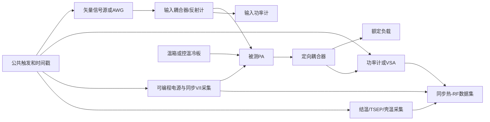

# PA温度特性测量、模型辨识与参数回填

本文说明如何在实际工程中测量PA的静态与动态温度特性，以及如何把测量结果转换为本工程当前支持的 `static`、`single_rc` 和 `foster` 参数。目标不是用壳温曲线“看起来像”结温，而是建立可复现的参考面：

```text
电功率和RF功率 -> 耗散功率 -> 结温动态 -> RF增益/相位/压缩漂移
```

最终必须分别验证两类误差：

- 热模型误差：预测结温是否跟随测量结温；
- 电模型误差：在结温正确时，输出功率、相位、EVM、ACLR和IMD是否跟随测量。

如果结温都没有测准，仅靠调节温度电系数也能把某一条输出功率曲线拟合好，但得到的参数通常不能外推到另一功率、占空比或散热条件。

当前代码真正可直接选择的热拓扑只有三种：

| 实测现象 | 选择模型 | 由测量替换的核心参数 |
|---|---|---|
| 只比较若干固定结温角，不关心升温时间 | `static` | 实测结温、参考温度和四个温度电参数 |
| 热阶跃只有一个主要膝点 | `single_rc` | 一个稳态热阻、一个时间常数、初始结温和热源效率 |
| 对数时间曲线上有快、中、慢多个膝点 | `foster` | 2至4组非负热阻与时间常数、初始结温和热源效率 |

Cauer、温度条件化GMP和神经电热模型在现有文档中有原理说明，但目前不能作为 `ThermalConfig.modelName` 直接传入。若Foster已经准确预测结温，而RF残差仍随温度和包络呈稳定结构，才考虑升级电模型；不要用增加热支路来拟合纯电非线性残差。

## 1. 首先确定测量的是哪一种温度

PA上常见的温度参考面并不等价：

| 温度 | 典型测量方式 | 能否直接写入 `junctionTemperatureC` | 主要用途 |
|---|---|---|---|
| 环境温度 | 温箱或进风口传感器 | 否 | 外部边界条件 |
| 冷板/散热器温度 | 热电偶、RTD | 只有热网络以该点为边界时才可作为 `ambientTemperatureC` | 动态热模型边界 |
| 封装壳温 | 壳底热电偶、校准红外 | 否 | 结合结到壳热阻反演结温 |
| 芯片表面平均温度 | 红外、热反射 | 通常不能直接等同于热点结温 | 热分布和趋势 |
| 结温或沟道热点温度 | 片上传感器、TSEP、微拉曼、厂商热模型 | 是 | 拟合单RC/Foster和可靠性边界 |

`ambientTemperatureC` 在代码中更准确的物理含义是“热网络边界温度”，不一定是实验室空气温度。若边界传感器安装在冷板，就拟合结到冷板的热阻抗；若边界是壳底，就拟合结到壳的热阻抗；只有把整个封装、PCB和散热器都纳入模型时，才可以使用环境温度和结到环境热阻。结到壳、结到板和结到环境的热阻不能混用。

Qorvo的GaN热分析资料指出，普通红外成像的空间分辨率远大于栅长，得到的面积平均表面温度可能明显低于真正沟道热点。因此红外非常适合观察热点位置和相对变化，但未经校准时不能直接当作 `junctionTemperatureC`。

推荐优先级为：

1. 使用器件内部温度传感器，并先在温箱中标定电压或码值到温度的关系。
2. 使用温度敏感电参数TSEP，例如低检测电流下的二极管压降、晶体管正向压降或已验证的阈值参数。
3. 使用厂商提供的结温监测节点、微拉曼或热反射测量。
4. 只有壳温时，使用与实际PCB、焊接、散热器和风冷边界一致的热阻或热阻抗反演结温。
5. 只有未校准红外表面温度时，把结果用于趋势检查，不将其作为绝对结温标签。

## 2. 推荐测试系统与参考面



图示说明：RF输入、RF输出、DC电压电流和温度必须共享触发或可对齐时间戳。若温度通道比RF通道慢，应保存每个传感器自身的采样时刻，不能简单按数组下标拼接。

建议仪器包括：

- 矢量信号源或AWG，用于连续波、双音、调制波形和功率阶跃；
- 额定功率负载、定向耦合器和功率计/VSA；
- 可编程漏极/集电极电源，以及同步电压、电流采集；
- 温箱或控温冷板；
- 结温传感器、TSEP测量通道、热电偶或经过发射率标定的红外系统；
- 公共触发和紧急关断，包括过流、过温、失配和负载保护。

所有RF功率必须先去嵌入电缆、衰减器和耦合器损耗。PA输入功率、PA输出功率和VSA I/Q必须落在同一传导参考面。输入端存在明显失配时应记录前向功率和反射功率；相位温漂测量还要让信号源与接收机共享频率参考，并单独标定温箱内电缆的相位漂移。温度模型拟合期间不要让自动功率控制环根据热态输出持续修改PA驱动，否则真正的热增益漂移会被控制环抵消。

## 3. 建议保存的数据字段

每条测量记录至少包含：

| 字段 | 单位 | 说明 |
|---|---:|---|
| `timeSec` | s | 相对功率阶跃或帧开始的时间 |
| `sampleRateHz` | Hz | RF复基带实际采样率 |
| `inputSignal`、`outputSignal` | complex | 已去嵌入、可同步的PA端口波形 |
| `inputPowerDbm`、`outputPowerDbm` | dBm | 有效RF开启区平均功率 |
| `supplyVoltageV`、`supplyCurrentA` | V、A | 每路偏置电源同步值 |
| `ambientTemperatureC` | 摄氏度 | 明确是环境、冷板还是壳体边界 |
| `junctionTemperatureC` | 摄氏度 | 经校准的结温或沟道温度标签 |
| `configuredDutyCycle`、`pulsePeriodSec` | 比例、s | 数据窗口占完整周期的比例，以及完整周期长度 |
| `waveformActiveDutyCycle` | 比例 | 数据窗口内部实际RF活动样点比例，内部补零也计入窗口总时长 |
| `actualDutyCycle` | 比例 | 完整周期真实RF活动比例，等于前两种占空比相乘 |
| `signalDurationSec`、`scheduledIdleDurationSec` | s | 区分完整输入数据窗口与其后的Channel自动调度空闲 |
| `frameIndex`、`repeatIndex` | 无 | 用于重复性和漂移统计 |
| `calibrationState` | 无 | 电缆、功率计、TSEP和温度校准版本 |

原始数据不能只保存“最终温度”和“最终输出功率”。单RC需要完整上升/冷却曲线，Foster还需要覆盖多个数量级的时间。建议温度采样时刻在对数时间轴上分布得更密，例如从微秒或仪器允许的最短时间一直延伸到稳态。

## 4. 测量顺序

### 4.1 步骤A：标定温度传感器或TSEP

若使用TSEP，先关闭会产生明显自热的RF和主功率路径，在温箱内设置多个已知温度点。每个温度点充分稳定后，用很小的检测电流测量传感电压，拟合：

```math
T_j
=
a_0+a_1V_s+a_2V_s^2.
```

一次函数通常可作为起点；只有残差随温度呈稳定弯曲时才加入二次项。检测电流必须足够小，使一次读取产生的自热远小于温度测量不确定度。动态测试时需要测量从加热状态切换到检测状态的延迟，因为该延迟决定能够辨识的最短热时间常数。

如果器件具有片上温度输出，同样需要在温箱中标定。Analog Devices的PA温度监测资料展示了利用片上检测器参考节点获得与芯片温度相关电压的方式，但具体电压斜率仍是器件相关参数。

### 4.2 步骤B：静态温度角RF测量

推荐温度点起步为 `25/55/85` 摄氏度；只有器件和夹具额定范围允许时才加入更高温度。每个温度点执行：

1. 等待温度稳定，并记录环境、冷板、壳温和结温。
2. 用低占空比短脉冲完成小信号复增益测量，减少测量本身引入的额外自热。
3. 扫描输入功率，采集AM-AM、AM-PM、输出功率、DC功率和I/Q。
4. 在目标Wi-Fi或双音工作点采集EVM、ACLR、IM3、IM5和IM7。
5. 每个温度点至少重复三次，并在升温和降温方向各测一次，以识别温箱迟滞和夹具漂移。

静态测量用于提取 `referenceTemperatureC` 和四个温度电参数，不用于提取热阻或时间常数。

### 4.3 步骤C：耗散功率与效率扫描

对每一个RF功率点同步测量所有电源的电压和电流。物理耗散功率为：

```math
P_{\mathrm{diss}}
=
\sum_k V_k I_k
+
P_{\mathrm{RF,in,accepted}}
-
P_{\mathrm{RF,out,delivered}}.
```

输入接受功率等于前向功率减去反射功率。输出传递功率用于物理能量平衡时应覆盖实际进入负载的带内、邻带与显著谐波功率；若仪表只能测有限带宽，必须记录该带宽并在所有功率点保持一致。若PA增益很高，RF输入瓦特项通常较小，但在低增益或大驱动测试中仍应保留。RF关闭时的总DC功率作为 `idleDissipatedPowerW` 的实测起点。

当前代码的耗散近似为：

```math
P_{\mathrm{diss}}
=
P_{\mathrm{idle}}
+
P_{\mathrm{out}}
\left(
\frac{1}{\eta}-1
\right).
```

因此与代码一致的增量效率应按下式计算：

```math
\eta
=
\frac{P_{\mathrm{out}}}
{P_{\mathrm{DC}}+P_{\mathrm{RF,in}}-P_{\mathrm{idle}}}.
```

若直接使用包含静态偏置功率的总漏极效率，同时又设置非零 `idleDissipatedPowerW`，会重复计算空闲耗散。两种一致做法只能选择一种：

- 推荐：保留实测 `idleDissipatedPowerW`，用扣除空闲功率后的增量效率拟合；
- 兼容：把 `idleDissipatedPowerW=0`，再用总效率拟合。

`referenceOutputPowerDbm` 也必须从真实端口功率标定，不能默认认为归一化波形的均方值一定为1。若有效RF区的模型输出为 `yNormalized`，则：

```math
P_{\mathrm{ref,dBm}}
=
P_{\mathrm{measured,dBm}}
-
10\log_{10}
\left(
\frac{1}{N_{\mathrm{active}}}
\sum_{n\in\mathrm{active}}
|y_{\mathrm{normalized}}[n]|^2
\right).
```

只有有效RF区均方值恰好为1时，`referenceOutputPowerDbm` 才等于该次实测平均输出dBm。效率拟合应优先最小化最终耗散功率误差，而不只是效率百分比误差，因为热网络真正接收的是耗散功率。

真实调制信号的漏极效率应在一个热更新时间窗内由平均DC功率和平均RF功率计算。当前代码为每个复包络样点应用平滑效率曲线，再在窗口内求平均，因此这些效率参数属于“复现窗口平均耗散”的行为参数，不应解释为晶体管在每个RF瞬时样点上的可直接测量效率。建议先用CW功率扫描确定起点，再用目标Wi-Fi占空比下的窗口平均耗散做小范围修正和独立验证。

### 4.4 步骤D：动态功率阶跃和脉冲测量

使用固定数字驱动建立两个稳定功率状态。令阶跃前后耗散功率为 `P0` 和 `P1`，在时刻0切换后记录结温上升曲线；随后关闭或降低功率，记录冷却曲线。推荐至少覆盖：

- 一个小功率阶跃，用于检查热模型近似线性区域；
- 一个额定工作点阶跃，用于拟合主要模型；
- 多个占空比，例如10%、50%和100%；
- 多个脉冲周期，使快、中、慢热支路都被激励；
- 独立验证阶跃，不参与参数拟合。

若只能在RF关闭后用TSEP读取结温，可先测冷却曲线，再根据线性时不变热网络的关系转换为热阻抗曲线。切换延迟以内的数据应剔除或标记为不可观测，不能用插值伪造快速热支路。

测试开始前若PA已经带偏置并达到热平衡，`initialJunctionTemperatureC` 应填写实测初始结温，而不是直接等于边界温度。仿真中的 `thermalDutyCycle` 会自动推进每个周期固有的窗口外空闲，不能再用 `Channel.AdvanceThermalIdle` 重复加入这段时间。只有仪表保存、换帧、换频或触发等待等**周期之外**的额外停顿，才调用 `AdvanceThermalIdle(actualGapSec)`。

### 4.5 步骤E：测量周期稳态、内部空闲和真实占空比

周期测试必须先定义三个互不混淆的时间比例。用户配置占空比是整个输入数据窗口与完整周期之比：

```math
D_{\mathrm{configured}}
=
\frac{T_{\mathrm{data}}}{T_{\mathrm{period}}}.
```

`Tdata` 包含窗口内部的前后补零、包间静默和门控关闭样点。数据窗口内部测得的RF活动比例为：

```math
D_{\mathrm{waveform}}
=
\frac{N_{\mathrm{active}}}{N_{\mathrm{data}}}.
```

完整周期的真实RF占空比才是：

```math
D_{\mathrm{actual}}
=
D_{\mathrm{configured}}
D_{\mathrm{waveform}}.
```

例如仪表每40 ms重复发送一个20 ms数据窗口，窗口内部只有前10 ms有RF，则配置占空比为50%，窗口内部活动比例为50%，真实RF占空比为25%。把25%直接写入 `thermalDutyCycle` 会错误地再追加60 ms窗口外空闲，使周期从40 ms变成80 ms。

推荐的实测步骤为：

1. 保存未裁剪的完整数据窗口，并记录周期触发的相邻时间差。
2. 在PA输入参考面测量包络，以噪声底以上6至10 dB为活动门限起点，生成内部活动掩码。
3. 分别记录数据窗口时长、内部活动时长和窗口外空闲时长。
4. 连续发送同一周期，直到相邻周期相同相位点的温差小于传感器重复性门限。
5. 同步采集一个完整稳态周期的结温、DC电源、PA输入和PA输出；不能只保存周期平均值。
6. 再从冷机或已知预热状态采集多个瞬态周期，用于验证模型怎样趋近同一个极限环。

在代码中，默认 `thermalRunMode="steady_state"` 会直接求这个周期极限环；`transient` 会从当前状态逐周期推进。Channel配置与验收骨架为：

```python
channel = Channel(
    paModel=fittedPa,
    parameters={
        "sampleRateHz": 80.0e6,
        "maximumOutputPowerDbm": 25.0,
        "thermalRunMode": "steady_state",
        "thermalDutyCycle": 0.50,
        "thermalSteadyStateToleranceC": 1.0e-4,
        "maximumThermalSteadyStateIterations": 100,
        "width": 0,
    },
)
predictedChOut, predictedFbOut = channel.Process(
    measuredDataWindow,
    outputPowerDbm=20.0,
)
thermalMetrics = channel.GetThermalMetrics()
measuredActualDuty = channel.GetActualDutyCycle()
```

第一次稳态调用必须给出 `outputPowerDbm`。Channel每次稳态处理都会先在参考温度电模型上重新执行PA功率设定闭环，再用收敛的周期温度曲线处理一次PA并同时返回 `(predictedChOut, predictedFbOut)`；两路共享同一热轨迹。PA功率目标定义在干净PA物理输出面，不是raw反馈波形的表观功率。功率闭环试探不推进热时间，也不会把热态输出重新稳定到目标功率。验收EVM、SNR、ACLR和功率时使用 `predictedChOut`；DPD/ILC训练使用 `predictedFbOut`。温度验收比较 `periodStartingJunctionTemperatureC` 和 `periodEndingJunctionTemperatureC`，而不是数据窗口结束字段 `dataEndingJunctionTemperatureC`。后者在发送结束时本来就可能位于温度峰值。

单RC或每条Foster支路在一个冻结耗散周期内可写为：

```math
\theta_{i,\mathrm{end}}
=
A_i\theta_{i,\mathrm{start}}+B_i.
```

周期稳态支路状态为：

```math
\theta_i^{*}
=
\frac{B_i}{1-A_i}.
```

代码还会迭代更新温度相关PA输出、耗散轨迹和MIMO互热，直到支路级 `steadyStateErrorC` 小于 `thermalSteadyStateToleranceC`。因此测量数据也应按周期相位对齐比较完整温度曲线，而不能只用一个平均结温拟合。

## 5. 静态温度角模型怎样调整

`static` 不根据功率推进温度。它只需要把测得的温度角写入 `initialJunctionTemperatureC`：

```python
from inc.lib.PaModel import ThermalConfig


hotStaticConfig = ThermalConfig.Recommended(
    "static",
    sampleRateHz=80.0e6,
    ambientTemperatureC=85.0,
    initialJunctionTemperatureC=85.0,
    referenceTemperatureC=25.0,
)
```

`thermalResistancesCPerW=(1.0,)` 和 `thermalTimeConstantsSec=(1.0,)` 在静态模型中只是合法占位，不要用它们调节固定温度结果。静态模型与实测不一致时，调整顺序为：

1. `initialJunctionTemperatureC`：等于该次测量的结温，不是温箱设定值或壳温。
2. `referenceTemperatureC`：等于基础PA电模型系数的提取温度。
3. 四个温度电参数：拟合增益、相位、饱和尺度和非线性残差。
4. 如果不同功率下需要完全不同的温度斜率，当前公共漂移层不足，应升级为温度条件化GMP。

## 6. 单RC模型怎样从阶跃数据拟合

对耗散功率阶跃 `deltaP=P1-P0`，去掉阶跃前温度后有：

```math
\Delta T(t)
=
R_{\mathrm{th}}
\Delta P
\left(
1-e^{-t/\tau}
\right).
```

稳态热阻和63.2%时间可给出第一组解析估计：

```math
R_{\mathrm{th}}
=
\frac{\Delta T_{\mathrm{steady}}}{\Delta P},
```

```math
\Delta T(\tau)
=
0.632
\Delta T_{\mathrm{steady}}.
```

更稳健的方法是在对数时间轴上搜索 `tau`，对每个候选值用最小二乘求热阻。下面只依赖NumPy，可直接替换为仪器导出的数组：

```python
import numpy as np

from inc.lib.PaModel import ThermalConfig


def FitSingleRc(
    timeSec: np.ndarray,
    junctionTemperatureC: np.ndarray,
    powerBeforeW: float,
    powerAfterW: float,
) -> tuple:
    """Fit one thermal resistance and time constant to a heating step.

    Processing details:
        Algorithm: Remove the pre-step temperature, search positive time
        constants on a logarithmic grid, solve the optimal resistance for
        every candidate by scalar least squares, and select the minimum-MSE
        positive model.

    Args:
        timeSec: Nonnegative measurement times beginning at the power step.
        junctionTemperatureC: Calibrated junction temperature samples.
        powerBeforeW: Mean dissipated power before the step.
        powerAfterW: Mean dissipated power after the step.

    Returns:
        result: Tuple containing thermal resistance, time constant, and RMSE.
    """

    measuredTime = np.asarray(timeSec, dtype=float)
    measuredTemperature = np.asarray(junctionTemperatureC, dtype=float)
    powerStepW = float(powerAfterW - powerBeforeW)
    if powerStepW <= 0.0:
        raise ValueError("powerAfterW must exceed powerBeforeW")
    if measuredTime.ndim != 1 or measuredTemperature.shape != measuredTime.shape:
        raise ValueError("time and temperature must be equal-length vectors")
    temperatureRiseC = measuredTemperature - measuredTemperature[0]
    positiveTimes = measuredTime[measuredTime > 0.0]
    if positiveTimes.size < 3:
        raise ValueError("at least three positive measurement times are required")
    minimumTau = max(float(np.min(positiveTimes)) / 10.0, 1.0e-12)
    maximumTau = max(float(np.max(positiveTimes)) * 10.0, minimumTau * 10.0)
    candidateTaus = np.logspace(
        np.log10(minimumTau),
        np.log10(maximumTau),
        2000,
    )
    bestResult = None
    for candidateTau in candidateTaus:
        unitResponse = powerStepW * (
            1.0 - np.exp(-measuredTime / candidateTau)
        )
        denominator = float(np.vdot(unitResponse, unitResponse).real)
        resistance = max(
            0.0,
            float(np.vdot(unitResponse, temperatureRiseC).real)
            / max(denominator, np.finfo(float).tiny),
        )
        predictedRise = resistance * unitResponse
        rmseC = float(
            np.sqrt(np.mean((predictedRise - temperatureRiseC) ** 2))
        )
        if bestResult is None or rmseC < bestResult[2]:
            bestResult = (resistance, float(candidateTau), rmseC)
    return bestResult


# Example values represent one measured 2.0 W heating step from a
# 0.5 W pre-biased steady state.
measuredTimeSec = np.array(
    [0.0, 1e-3, 2e-3, 5e-3, 10e-3, 20e-3, 50e-3, 100e-3]
)
measuredJunctionTemperatureC = np.array(
    [36.00, 38.82, 41.31, 47.15, 53.12, 58.03, 59.95, 60.00]
)
fittedResistance, fittedTau, temperatureRmseC = FitSingleRc(
    measuredTimeSec,
    measuredJunctionTemperatureC,
    powerBeforeW=0.5,
    powerAfterW=2.5,
)

singleRcConfig = ThermalConfig.Recommended(
    "single_rc",
    sampleRateHz=80.0e6,
    ambientTemperatureC=30.0,
    initialJunctionTemperatureC=36.0,
    thermalResistancesCPerW=(fittedResistance,),
    thermalTimeConstantsSec=(fittedTau,),
    idleDissipatedPowerW=0.5,
)
print(fittedResistance, fittedTau, temperatureRmseC)
```

该示例应得到接近 `12.0` 摄氏度/W和 `8 ms` 的结果。`initialJunctionTemperatureC=36` 摄氏度保留了0.5 W偏置下的已预热起点。若稳态温升正确但上升过快，应增大 `thermalTimeConstantsSec`；若上升形状正确但最终温升偏小，应增大 `thermalResistancesCPerW`。不要用热阻去修正时间轴，也不要用时间常数去修正稳态终点。

## 7. Foster模型怎样从多时间尺度数据拟合

对同一个功率阶跃，瞬态热阻为：

```math
Z_{\mathrm{th}}(t)
=
\frac{\Delta T(t)}{\Delta P}
=
\sum_i
R_i
\left(
1-e^{-t/\tau_i}
\right).
```

推荐辨识流程：

1. 把上升和冷却数据换算成 `Zth(t)`，并按对数时间绘图。
2. 根据明显膝点选择2至4个初始时间常数；当前推荐起点是 `50 us/5 ms/0.5 s`。
3. 固定时间常数，用非负最小二乘求各支路热阻。
4. 在对数尺度上逐支路移动时间常数，每次重新求非负热阻，以温度RMSE最小为准。
5. 保持时间常数有足够间隔，避免两个相近支路用一正一负互相抵消。
6. 用未参与拟合的脉冲周期和占空比验证。

下面示例在给定时间常数起点下用投影梯度求非负热阻。若实测膝点位置不同，应先修改 `candidateTausSec`，再比较残差：

```python
import numpy as np

from inc.lib.PaModel import ThermalConfig


def FitFosterResistances(
    timeSec: np.ndarray,
    junctionTemperatureC: np.ndarray,
    powerBeforeW: float,
    powerAfterW: float,
    candidateTausSec: np.ndarray,
) -> tuple:
    """Fit nonnegative Foster resistances for selected time constants.

    Processing details:
        Algorithm: Convert the measured heating step to transient thermal
        impedance, construct one exponential step basis per candidate time
        constant, initialize by unconstrained least squares, and apply projected
        gradient iterations so every fitted thermal resistance remains
        nonnegative.

    Args:
        timeSec: Nonnegative measurement times beginning at the power step.
        junctionTemperatureC: Calibrated junction temperature samples.
        powerBeforeW: Mean dissipated power before the step.
        powerAfterW: Mean dissipated power after the step.
        candidateTausSec: Positive, increasing Foster time constants.

    Returns:
        result: Tuple containing resistance vector, time constants, and RMSE.
    """

    measuredTime = np.asarray(timeSec, dtype=float)
    measuredTemperature = np.asarray(junctionTemperatureC, dtype=float)
    timeConstants = np.asarray(candidateTausSec, dtype=float)
    powerStepW = float(powerAfterW - powerBeforeW)
    if powerStepW <= 0.0:
        raise ValueError("powerAfterW must exceed powerBeforeW")
    if np.any(timeConstants <= 0.0) or np.any(np.diff(timeConstants) <= 0.0):
        raise ValueError("candidateTausSec must be positive and increasing")
    thermalImpedance = (
        measuredTemperature - measuredTemperature[0]
    ) / powerStepW
    basisMatrix = 1.0 - np.exp(
        -measuredTime[:, None] / timeConstants[None, :]
    )
    resistanceValues = np.maximum(
        np.linalg.lstsq(basisMatrix, thermalImpedance, rcond=None)[0],
        0.0,
    )
    gramMatrix = basisMatrix.T @ basisMatrix
    gradientOffset = basisMatrix.T @ thermalImpedance
    stepSize = 1.0 / max(
        float(np.linalg.norm(gramMatrix, ord=2)),
        np.finfo(float).tiny,
    )
    for _ in range(4000):
        gradient = gramMatrix @ resistanceValues - gradientOffset
        resistanceValues = np.maximum(
            resistanceValues - stepSize * gradient,
            0.0,
        )
    predictedTemperature = measuredTemperature[0] + powerStepW * (
        basisMatrix @ resistanceValues
    )
    rmseC = float(
        np.sqrt(np.mean((predictedTemperature - measuredTemperature) ** 2))
    )
    return resistanceValues, timeConstants, rmseC


# This synthetic teaching record represents measured data with fast, medium,
# and slow thermal knees. Replace both arrays with instrument exports.
fosterTimeSec = np.concatenate(
    (np.array([0.0]), np.logspace(-5, 0.5, 160))
)
knownResistances = np.array([1.5, 6.0, 14.5])
knownTausSec = np.array([100e-6, 6e-3, 0.4])
fosterPowerBeforeW = 0.5
fosterPowerAfterW = 2.5
fosterInitialTemperatureC = 36.0
fosterTemperatureC = fosterInitialTemperatureC + (
    fosterPowerAfterW - fosterPowerBeforeW
) * np.sum(
    knownResistances[None, :] * (
        1.0 - np.exp(-fosterTimeSec[:, None] / knownTausSec[None, :])
    ),
    axis=1,
)

fittedResistances, fittedTaus, fosterRmseC = FitFosterResistances(
    fosterTimeSec,
    fosterTemperatureC,
    powerBeforeW=fosterPowerBeforeW,
    powerAfterW=fosterPowerAfterW,
    candidateTausSec=knownTausSec,
)
fosterConfig = ThermalConfig.Recommended(
    "foster",
    sampleRateHz=80.0e6,
    ambientTemperatureC=25.0,
    initialJunctionTemperatureC=fosterInitialTemperatureC,
    thermalResistancesCPerW=tuple(fittedResistances),
    thermalTimeConstantsSec=tuple(fittedTaus),
    idleDissipatedPowerW=fosterPowerBeforeW,
)
print(fittedResistances, fittedTaus, fosterRmseC)
```

该教学例应恢复接近 `(1.5, 6.0, 14.5)` 摄氏度/W和 `(100 us, 6 ms, 0.4 s)` 的三支参数；这里只演示固定候选时间常数后的非负热阻求解，真实数据还要扫描和细化时间常数。短到无法观察的时间常数不应被拟合。若TSEP切换延迟为100微秒，声称从该数据准确拟合10微秒支路是不可信的。Foster支路是数学模态，不应直接命名为“芯片层”“焊料层”或“散热器层”；需要物理层温度时应使用Cauer或结构热仿真。

热更新间隔还必须足够短。推荐至少让最小时间常数包含10次更新：

```math
N_{\mathrm{update}}
\le
\frac{f_s\tau_{\min}}{10}.
```

例如80 MHz采样率和100微秒最小时间常数对应 `Nupdate<=800`，因此默认256合适；若拟合得到更快支路，则应相应减小 `thermalUpdateIntervalSamples`。

## 8. 效率参数怎样拟合

当前效率函数为：

```math
\eta(P)
=
\eta_{\min}
+
\left(
\eta_{\max}-\eta_{\min}
\right)
\frac{P/P_k}{1+P/P_k}.
```

可以遍历膝点功率，并对每个膝点线性求 `etaMin` 和 `etaMax`：

```python
import numpy as np


def FitEfficiencyModel(
    outputPowerDbm: np.ndarray,
    dcPowerW: np.ndarray,
    idleDissipatedPowerW: float,
    inputPowerDbm: np.ndarray = None,
) -> tuple:
    """Fit the project's incremental power-dependent efficiency curve.

    Processing details:
        Algorithm: Convert measured RF powers to watts, subtract idle DC
        dissipation, calculate incremental efficiency, scan knee powers, and
        solve minimum and peak efficiency by bounded linear least squares.

    Args:
        outputPowerDbm: Measured active-region RF output powers.
        dcPowerW: Sum of measured supply voltage-current products.
        idleDissipatedPowerW: Measured RF-off DC power.
        inputPowerDbm: Optional measured RF input powers.

    Returns:
        result: Minimum efficiency, peak efficiency, knee dBm, and RMSE.
    """

    outputDbm = np.asarray(outputPowerDbm, dtype=float)
    measuredDcPower = np.asarray(dcPowerW, dtype=float)
    outputPowerW = 10.0 ** ((outputDbm - 30.0) / 10.0)
    inputPowerW = (
        np.zeros_like(outputPowerW)
        if inputPowerDbm is None
        else 10.0 ** ((np.asarray(inputPowerDbm) - 30.0) / 10.0)
    )
    incrementalAvailablePower = (
        measuredDcPower + inputPowerW - float(idleDissipatedPowerW)
    )
    measuredEfficiency = outputPowerW / np.maximum(
        incrementalAvailablePower,
        np.finfo(float).tiny,
    )
    bestResult = None
    for kneeDbm in np.linspace(float(np.min(outputDbm)) - 10.0,
                               float(np.max(outputDbm)) + 5.0,
                               600):
        kneePowerW = 10.0 ** ((kneeDbm - 30.0) / 10.0)
        transition = outputPowerW / (outputPowerW + kneePowerW)
        designMatrix = np.column_stack((1.0 - transition, transition))
        efficiencyEndpoints = np.linalg.lstsq(
            designMatrix,
            measuredEfficiency,
            rcond=None,
        )[0]
        minimumEfficiency = float(np.clip(efficiencyEndpoints[0], 1e-4, 0.99))
        peakEfficiency = float(np.clip(efficiencyEndpoints[1],
                                       minimumEfficiency,
                                       0.99))
        predictedEfficiency = (
            (1.0 - transition) * minimumEfficiency
            + transition * peakEfficiency
        )
        rmse = float(
            np.sqrt(np.mean((predictedEfficiency - measuredEfficiency) ** 2))
        )
        if bestResult is None or rmse < bestResult[3]:
            bestResult = (
                minimumEfficiency,
                peakEfficiency,
                float(kneeDbm),
                rmse,
            )
    return bestResult
```

将结果依次写入 `minimumDrainEfficiency`、`peakDrainEfficiency` 和 `efficiencyKneeOutputPowerDbm`。若效率拟合后温度误差仍明显随RF功率变化，应先检查DC/RF功率去嵌入和空闲功率是否重复计算，再考虑热阻随温度或功率变化；不要立即增加Foster支路。

下面的教学数据由 `etaMin=0.12`、`etaMax=0.48`、18 dBm膝点和0.5 W空闲耗散生成，用于确认拟合接口；实际使用时直接替换为功率扫描结果：

```python
measuredOutputPowerDbm = np.array([10.0, 15.0, 20.0, 23.0, 25.0])
measuredOutputPowerW = 10.0 ** (
    (measuredOutputPowerDbm - 30.0) / 10.0
)
knownKneePowerW = 10.0 ** ((18.0 - 30.0) / 10.0)
knownTransition = measuredOutputPowerW / (
    measuredOutputPowerW + knownKneePowerW
)
knownEfficiency = 0.12 + (0.48 - 0.12) * knownTransition
measuredDcPowerW = 0.5 + measuredOutputPowerW / knownEfficiency

fittedMinimumEfficiency, fittedPeakEfficiency, fittedKneeDbm, efficiencyRmse = (
    FitEfficiencyModel(
        measuredOutputPowerDbm,
        measuredDcPowerW,
        idleDissipatedPowerW=0.5,
    )
)
print(
    fittedMinimumEfficiency,
    fittedPeakEfficiency,
    fittedKneeDbm,
    efficiencyRmse,
)
```

## 9. 四个温度电参数怎样从I/Q测量提取

在每个温度点，先用 `SigProc` 或等效仪表算法补偿整数/分数时延、CFO、SFO，并确保所有捕获位于同一参考采样网格。对参考输入 `x` 和PA输出 `y_T` 计算公共复增益：

```math
g(T)
=
\frac{x^H y_T}{x^H x}.
```

### 9.1 增益和相位系数

令参考温度的复增益为 `gRef`，对温度做线性回归：

```math
G_{\mathrm{dB}}(T)
=
20\log_{10}
\left|
\frac{g(T)}{g_{\mathrm{ref}}}
\right|,
```

```math
\phi(T)
=
\angle
\left(
\frac{g(T)}{g_{\mathrm{ref}}}
\right).
```

- `gainTemperatureCoefficientDbPerC` 等于 `GdB` 对温差的斜率；
- `phaseTemperatureCoefficientDegreesPerC` 等于展开相位后对温差的斜率。

必须先展开相位，避免 `179` 度到 `-179` 度被错误解释为大幅反向跳变。

### 9.2 饱和尺度与附加非线性为什么要联合拟合

当前温度层并不是直接修改基础Rapp/Wiener/GMP/Doherty内部的 `Asat`。它在基础输出 `y0` 之后增加一个温度相关包络尺度：

```math
s(T)
=
\max
\left(
0.05,
1
+
k_s
\left(
T-T_{\mathrm{ref}}
\right)
\right).
```

该尺度只通过后面的附加压缩分母生效；当 `nonlinearityTemperatureCoefficientPerC=0` 时，单独修改 `saturationTemperatureCoefficientPerC` 不会改变输出。因此不能只把实测P1dB或 `Asat(T)/Asat(Tref)` 的斜率直接填入该参数，必须和附加非线性系数一起对多温度AM-AM数据拟合。

### 9.3 附加非线性系数

去掉公共复增益后，当前代码的完整附加压缩为：

```math
a_{\mathrm{nl}}
=
\frac{1}
{1+q(T)(|y_0|/s(T))^2},
```

```math
q(T)
=
\max
\left(
0,
k_{\mathrm{nl}}
\left(
T-T_{\mathrm{ref}}
\right)
\right).
```

令去掉公共增益后的实测幅度比为：

```math
r(n,T)
=
\frac{|y_T(n)|}
{|g(T)/g(T_{\mathrm{ref}})|\,|y_0(n)|}.
```

则每个有效高幅样点满足：

```math
\frac{1/r(n,T)-1}{|y_0(n)|^2}
=
\frac{k_{\mathrm{nl}}\Delta T}
{(1+k_s\Delta T)^2}.
```

实际拟合可对 `kS` 做一维网格搜索。固定 `kS` 后，右侧只剩一个线性未知量 `kNl`，用非负加权最小二乘求解；再选择所有温度和幅度箱综合RMSE最小的组合。应按包络幅度分箱后给各箱相近权重，避开接近零幅度和已经深度削顶的样点，防止OFDM大量低幅样点淹没峰值区信息。

当前实现把负的 `q(T)` 截断为0，并把 `s(T)` 下限限制为0.05。因此如果实测PA升温后非线性反而减弱，或者温度引起明显的幅度相关AM-PM，当前四标量层无法对称表示。此时应把无法辨识的附加系数设为0，并使用温度条件化GMP或扩展当前漂移层。

### 9.4 三温度点数值例子

| 结温 | 相对增益 | 相对相位 | 温度包络尺度 `s(T)` | 附加非线性量 `q` |
|---:|---:|---:|---:|---:|
| 25摄氏度 | 0.00 dB | 0.00度 | 1.000 | 0.000 |
| 55摄氏度 | -0.36 dB | 0.90度 | 0.955 | 0.060 |
| 85摄氏度 | -0.72 dB | 1.80度 | 0.910 | 0.120 |

相对于25摄氏度参考点，线性斜率为：

```python
import numpy as np

from inc.lib.PaModel import ThermalConfig


measuredTemperaturesC = np.array([25.0, 55.0, 85.0])
temperatureDeltaC = measuredTemperaturesC - 25.0

gainCoefficient = np.polyfit(
    temperatureDeltaC,
    np.array([0.0, -0.36, -0.72]),
    1,
)[0]
phaseCoefficient = np.polyfit(
    temperatureDeltaC,
    np.array([0.0, 0.90, 1.80]),
    1,
)[0]
saturationCoefficient = np.polyfit(
    temperatureDeltaC,
    np.array([1.000, 0.955, 0.910]) - 1.0,
    1,
)[0]
nonlinearityCoefficient = np.polyfit(
    temperatureDeltaC,
    np.array([0.000, 0.060, 0.120]),
    1,
)[0]

fittedThermalConfig = ThermalConfig.Recommended(
    "foster",
    sampleRateHz=80.0e6,
    gainTemperatureCoefficientDbPerC=float(gainCoefficient),
    phaseTemperatureCoefficientDegreesPerC=float(phaseCoefficient),
    saturationTemperatureCoefficientPerC=float(saturationCoefficient),
    nonlinearityTemperatureCoefficientPerC=float(
        nonlinearityCoefficient
    ),
)
```

该例会得到接近本工程推荐起点的 `-0.012 dB/摄氏度`、`0.03度/摄氏度`、`-0.0015/摄氏度` 和 `0.002/摄氏度`。

## 10. MIMO互热怎样测量

测量 `thermalCouplingCPerW` 时，每次只加热一条源链：

1. 所有PA达到共同冷态或稳定偏置状态。
2. 源链 `j` 施加已知耗散功率阶跃，其他链保持RF关闭但偏置状态不变。
3. 记录每条受热链 `i` 的结温变化。
4. 源链自身温升用于拟合自身RC/Foster；相邻链稳态附加温升用于互热矩阵。

```math
R_{i,j}
=
\frac{
\Delta T_i
}{
\Delta P_{\mathrm{diss},j}
}.
```

对角线保持0，因为自身热阻已经位于每个 `PaModel` 内。必须轮流加热每条链；`R12` 和 `R21` 可能因布局、铜皮、风向和散热器压力不同而不相等。

例如源链1增加2 W耗散后，链2稳态升温4摄氏度，则 `R21=2摄氏度/W`。两路配置为：

```python
measuredR12 = 3.0
measuredR21 = 2.0
mimoThermalCoupling = (
    (0.0, measuredR12),
    (measuredR21, 0.0),
)
```

当前互热矩阵表示完整周期平均耗散产生的稳态偏移。在 `steady_state` 模式下，代码会把每条PA的周期自热和非对角互热放入外层不动点迭代；在 `transient` 模式下，本周期平均耗散因果地更新下一周期使用的互热偏移。如果相邻链温升表现出明显动态时间常数，只调大互热矩阵不能匹配上升曲线，需要为非对角热路径增加动态Foster状态。

## 11. 按残差现象调整哪一个参数

| 测量与模型残差 | 优先调整 | 不应优先调整 |
|---|---|---|
| 所有功率点稳态温升都按相同比例偏小 | 增大热阻总和 | 时间常数、相位系数 |
| 最终温升正确但模型升温太快 | 增大对应时间常数 | 热阻总和 |
| 早期温升不足、长期温升正确 | 增大快速支路热阻或减小其时间常数 | 慢支路总热阻 |
| 低占空比误差大、连续波正确 | 分开检查 `thermalDutyCycle`、窗口内部活动比例、空闲耗散、活动门限和快速热支路 | 公共增益系数 |
| 平均温度正确但周期内峰谷位置错误 | 检查内部空闲位置、周期长度和快速热时间常数 | 只调整热阻总和 |
| 稳态周期首尾不闭合 | 检查支路级 `steadyStateErrorC`、容差和迭代上限 | 比较数据窗口末端与周期起点 |
| 温度误差随RF输出功率系统变化 | 重新拟合效率、膝点和功率标尺 | 立即增加Foster支路数 |
| 结温正确但输出功率温漂错误 | 增益温度系数 | 热阻 |
| 结温和公共增益正确但EVM/ACLR错误 | 饱和与非线性温度系数 | 环境温度 |
| 单一温度能拟合、其他温度出现弯曲残差 | 增加温度二次项或温度条件化GMP | 继续强迫一阶系数 |
| 单RC在对数时间上出现多个膝点残差 | 改用2至4支Foster | 把一个时间常数调到极端值 |
| 相邻PA温度被低估 | 测量并增加对应非对角互热系数 | 增大受热PA自身热阻 |

推荐的联合辨识顺序必须固定：

1. 固定RF功率参考面、采样率和温度边界。
2. 用DC/RF测量拟合空闲功耗与效率。
3. 用结温阶跃拟合单RC或Foster。
4. 在预测结温已经准确后拟合四个温度电参数。
5. 最后拟合MIMO互热。

如果同时自由调整效率、热阻和增益温度系数，会出现不可辨识性：更多估算热量、更小热阻、更大增益斜率可能生成相似的输出功率曲线，却预测完全不同的真实结温。

## 12. 独立验收方法

拟合数据和验收数据必须分离。建议把一个功率阶跃、一组“配置占空比加内部活动比例”、一种周期长度和一个温度点完全留作验证。至少比较：

| 类别 | 指标 | 本工程建议起始门限 |
|---|---|---:|
| 温度 | 结温RMSE | 小于传感器不确定度的1至2倍；常见仿真起点为1至3摄氏度 |
| 温度 | 稳态温升误差 | 小于10% |
| 动态 | 63.2%上升时间误差 | 小于15% |
| 周期 | 稳态周期首尾支路闭合 | `steadyStateErrorC` 小于配置容差 |
| 周期 | 真实RF占空比 | 与触发和PA输入包络测量之差小于测试定义容差 |
| 周期 | 峰值温度及其周期相位 | 小于传感器不确定度的1至2倍，并且峰值位置一致 |
| RF绝对量 | 输出功率漂移误差 | 小于0.2至0.5 dB |
| RF公共相位 | 展开相位漂移误差 | 小于1至2度 |
| 调制质量 | EVM误差 | 小于1 dB或项目预算 |
| 带外 | ACLR/IMD误差 | 小于2至3 dB或项目预算 |

这些只是模型验收起点，不是行业合格线。门限必须结合温度传感器精度、VSA重复性、目标DPD改善量和器件可靠性预算制定。

下面把前述教学测量结果合并成一份完整配置。实际工程必须把每个数替换为同一器件、同一偏置、同一频段和同一散热边界下的测量结果：

```python
from inc.lib.PaModel import ThermalConfig


finalThermalConfig = ThermalConfig.Recommended(
    "foster",
    sampleRateHz=80.0e6,
    ambientTemperatureC=25.0,
    initialJunctionTemperatureC=36.0,
    referenceTemperatureC=25.0,
    thermalResistancesCPerW=(1.5, 6.0, 14.5),
    thermalTimeConstantsSec=(100.0e-6, 6.0e-3, 0.4),
    thermalUpdateIntervalSamples=256,
    idleDissipatedPowerW=0.5,
    efficiencyModelName="power_dependent",
    minimumDrainEfficiency=0.12,
    peakDrainEfficiency=0.48,
    efficiencyKneeOutputPowerDbm=18.0,
    referenceOutputPowerDbm=25.0,
    gainTemperatureCoefficientDbPerC=-0.012,
    phaseTemperatureCoefficientDegreesPerC=0.03,
    saturationTemperatureCoefficientPerC=-0.0015,
    nonlinearityTemperatureCoefficientPerC=0.002,
)
```

最终验证代码骨架为：

```python
from inc.lib.Channel import Channel
from inc.lib.PaModel import PaModel


fittedPa = PaModel(
    parameters={
        "modelName": "gmp",
        "thermalConfig": finalThermalConfig,
        "width": 0,
    }
)
fittedChannel = Channel(
    paModel=fittedPa,
    parameters={
        "sampleRateHz": finalThermalConfig.sampleRateHz,
        "maximumOutputPowerDbm": (
            finalThermalConfig.referenceOutputPowerDbm
        ),
        "thermalRunMode": "steady_state",
        "thermalDutyCycle": 0.50,
        "thermalSteadyStateToleranceC": 1.0e-4,
        "maximumThermalSteadyStateIterations": 100,
        "width": 0,
    },
)

for validationFrame in validationFrames:
    predictedChOut, predictedFbOut = fittedChannel.Process(
        validationFrame["inputSignal"],
        outputPowerDbm=validationFrame["referenceOutputPowerDbm"],
    )
    predictedThermalMetrics = fittedChannel.GetThermalMetrics()
    predictedActualDuty = fittedChannel.GetActualDutyCycle()
    # Compare predictedChOut and predictedThermalMetrics against a held-out
    # measured period. Use predictedFbOut only for DPD-training validation.
    assert predictedThermalMetrics["steadyStateConverged"]
    assert predictedThermalMetrics["steadyStateErrorC"] <= 1.0e-4
```

把 `thermalDutyCycle=0.50` 替换为每条留出记录的“完整数据窗口时长/完整周期时长”。如果 `validationFrame["inputSignal"]` 内部有空闲，保持这些样点原位；不要裁掉以后再把较小的真实占空比写回 `thermalDutyCycle`。用 `predictedActualDuty` 与PA输入包络实测占空比比较，并用 `temperatureTraceTimeSec` 和 `temperatureTraceC` 对齐整条周期温度曲线。

## 13. 一手资料与工程边界

- [Infineon：Transient thermal measurements and thermal equivalent circuit models](https://www.infineon.com/dgdl/Infineon-Thermal_equivalent_circuit_models-ApplicationNotes-v01_02-EN.pdf?fileId=db3a30431a5c32f2011aa65358394dd2)：说明通过加热、冷却、TSEP标定和温度曲线计算热阻抗的方法。
- [Analog Devices AN-1604：Thermal Management Calculations for RF Amplifiers](https://www.analog.com/en/resources/app-notes/an-1604.html)：说明RF放大器结温、壳温、PCB和散热路径的参考面。
- [Analog Devices AN-2578：Using the VREF Pin of RF Power Detectors to Monitor Die Temperature](https://www.analog.com/en/resources/app-notes/an-2578.html)：给出片上温度相关监测节点的工程例子。
- [Qorvo：GaN Device Channel Temperature, Thermal Resistance, and Reliability Estimates](https://forum.qorvo.com/uploads/short-url/xBOBWWecEVz4R41ix19lz0gvIky.pdf)：说明GaN沟道温度、热阻和可靠性估计边界。
- [Qorvo：Understanding Thermal Analysis of RF Devices](https://forum.qorvo.com/uploads/short-url/qjim2ECv7A3QE17tkqAakrZB1jq.pdf)：说明红外表面温度、热点分辨率和系统散热结构限制。

测量结温和高功率PA存在器件损坏风险。所有测试必须遵循器件数据手册的最大结温、电压、电流、输入功率、负载失配和占空比限制，并配置硬件级保护；本文中的温度点、功率和验收门限不能覆盖器件额定值。
