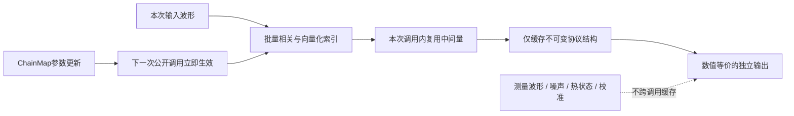
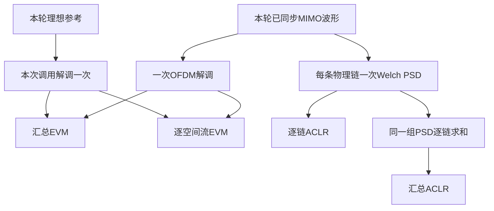

# Analysis、Channel 与 PaModel 性能优化说明

## 1. 优化目标与等价性边界

本轮优化面向长波形、MIMO和重复ILC评估中最耗时的数组运算。原则是保持物理模型、每一路数组形状、定点边界和指标定义不变，只减少Python逐样点循环、重复FFT、重复OFDM解调、重复延迟构造以及理想模块的无效运算。后续Channel接口升级为一次返回 `(chOut, fbOut)` 是有意的公开契约变更，不属于数值近似；两项仍共享一次PA计算和热周期。默认 `sampleMode="forward"` 通过复制已完成的 `chOut` 避免重复接收处理，`"fb"` 才额外执行完整反馈链。



**图说明**：优化只复用数学上不随本次测量改变的量，或同一次公开调用中已经得到的中间结果。含随机性、热历史或用户可变输入的结果不会作为下一次调用的答案复用。

以下不变量仍然成立：

- `SigProc`同步仍按相同的归一化相关、搜索边界和并列候选规则选取时延；
- `Analysis`仍先同步，再计算输出功率、SNR、EVM、IRR和ACLR；
- GMP仍按原来的主支路、滞后包络支路、超前包络支路顺序累加系数项；
- `Channel`公开输出和独立调用的辅助函数返回独立数组，不会把调用方输入数组直接暴露为输出；同一次内部事务才允许临时别名复用；
- 定点模式仍只在公开边界编码和解码，模块内部仍使用浮点复数处理；
- 用户通过外部活动映射或 `UpdateParameters()` 修改ChainMap后，下一次公开调用使用新值。

---

## 2. 参考性能

下表是在Windows、Python 3.9.6、NumPy 1.22.0开发环境上的典型中位耗时。每项使用相同固定随机种子、相同波形和相同参数比较；先预热，再用 `time.perf_counter()` 取多次执行的中位数。数值用于说明量级，不是实时期限、跨机器保证或仪表吞吐承诺。

| 场景 | 优化前 | 优化后典型值 | 主要收益来源 |
|---|---:|---:|---|
| SISO `Analysis.Analyze` | 65.9 ms | 约20至23 ms | 时延搜索向量化、零CFO旁路、减少重复指标中间量 |
| 2链MIMO `Analysis.Analyze` | 135 ms | 约42至46 ms | 理想参考只解调一次、测量网格一次解调、每链只做一次PSD |
| 发送辅助 `Analysis`构造 | 3850 ms | 约13 ms | `EstimateSignalOverlap`批量FFT相关和稳定区间能量 |
| 盲解析 `Analysis`构造 | 1000 ms | 约107 ms | 描述字段布局缓存、LDPC校验更新和同步路径优化 |
| 默认GMP长波形处理 | 57.6 ms | 13.9 ms | 唯一延迟波形与包络幂复用 |
| 默认理想双输出 `Channel.Process` | 58.3 ms | 约19至20 ms | 一次GMP/热路径和前向接收后直接复制chOut为fbOut，并复用理想I/Q、零相位和零驱动旁路 |
| 首次闭环PA功率校准 | 268 ms | 72 ms | 每次探测中的GMP及理想Channel级旁路 |

表中MIMO场景为EHT、20 MHz、MCS 7、20个数据symbol、80 Msps和2×2 DFT空间映射；典型值约42至46 ms。主要收益来自在一次 `Analyze()` 中避免重复解调和重复PSD；参考和测量网格会在下一次公开调用重新计算，防止调用方修改公开参考或Wi-Fi元数据后命中陈旧缓存。若帧长度、带宽、FFT实现、PA阶数、耦合路径、热模型或校准迭代数改变，绝对耗时会随之改变。

在上述优化版本之上，Channel事务、定点校准和热周期又做了一轮专门剖析。下表使用同一台开发机的Python 3.9.6、NumPy 1.22.0；无线场景为EHT 80 MHz、MCS 9、20个data symbol、4倍过采样，SISO为104,192点，2×2 MIMO为108,544×2，PA为GMP、forward、无热模型。这里的“优化前”专指本轮改动前的同一代码基线，因此不要与上表更早的工程初始基线混为一组：

| 本轮Channel场景 | 本轮优化前 | 本轮优化后 | 加速比 |
|---|---:|---:|---:|
| SISO、浮点、无校准 | 101.3 ms | 82.8 ms | 1.22× |
| SISO、16位、无校准 | 124.0 ms | 99.0 ms | 1.25× |
| 2×2、浮点、无校准 | 194.5 ms | 177.5 ms | 1.10× |
| 2×2、16位、无校准 | 260.5 ms | 209.0 ms | 1.25× |
| SISO、16位、首次20 dBm校准 | 576.1 ms | 489.9 ms | 1.18× |
| 2×2、16位、首次20 dBm校准 | 1291.9 ms | 1063.6 ms | 1.21× |

GMP本身占长帧普通调用的大部分时间，所以端到端增益小于纯Channel外壳。把PA替换为不做运算的Identity测试体后，同样的验证、理想级和双输出路径中，浮点SISO为13.0→3.9 ms（3.33×），浮点2×2为27.2→7.9 ms（3.44×），16位SISO为32.5→15.8 ms（2.05×），16位2×2为63.5→31.7 ms（2.01×）。这些Identity数字用于隔离软件外壳成本，不代表真实PA吞吐量。

---

## 3. `SigProc`同步路径

### 3.1 整数时延搜索向量化

对候选整数时延 $l$，每条链的归一化相关分数为：

```math
\rho(l)
=
\frac{|R_{xy}(l)|}
{\sqrt{E_x(l)E_y(l)}}.
```

旧实现逐个候选时延在Python中计算重叠起点、终点和能量。新实现一次生成全部候选lag向量并通过数组索引计算所有重叠边界。数值条件良好时使用快速累计能量差；程序同时估计该减法的浮点消减上界。只有可疑小窗口才用成对求和树重新计算，并把区间分解为互不重叠的局部节点：

```math
E_x[a,b)
=
\sum_{q\in\mathcal T(a,b)} S_q.
```

这里的每个 $S_q$ 只对该树节点内部的非负样点功率做成对累加，不通过两个很大的全局累计值相减。因此正常波形保留快速向量路径；强突发后面只有极低噪声时，可疑尾部窗口自动回退到稳定路径，不会因灾难性消减而被错误压低。

互相关本身仍由FFT卷积得到。候选lag保持升序，最终使用 `numpy.argmax`；当多个分数完全相同时，它返回第一个最大值，因此保留原实现“最先出现者胜出”的并列语义。

### 3.2 不等长发送辅助的三段FFT

`EstimateSignalOverlap()`允许发送波形或接收波形被前后补零、裁剪，并允许两者长度不同。搜索窗口有三类：

1. 边缘候选使用实际可用的完整重叠长度；
2. 非负lag的中心候选使用参考波形起始处的固定探针；
3. 负lag的中心候选使用测量波形起始处的固定探针。

因此实现分别构造完整重叠相关、正lag固定探针相关和负lag固定探针相关三段FFT，而不是对每个候选lag调用一次 `vdot`。参考和测量能量都由同一个混合区间求和器批量取得；只有检测到消减风险的范围才构造非负求和树。

每条链的平方分数使用：

```math
s_c(l)
=
\frac{|R_c(l)|^2}
{E_{x,c}(l)E_{y,c}(l)}.
```

浮点FFT在理论零相关处可能留下极小残差。实现先施加Cauchy-Schwarz上界：

```math
|R_c(l)|^2
\leq
E_{x,c}(l)E_{y,c}(l),
```

再进行归一化，避免两个零能量窗口被极小数除法错误放大。多链分数仍取链平均；并列时仍依次比较分数、重叠长度和更早的测量起点。

### 3.3 有效信号短空洞识别

功率标定需要忽略前后补零，同时允许有效突发内部存在短暂低幅度空洞。旧实现遍历每一对相邻活动样点；新实现对首个和末个活动样点之间的布尔掩码求差，只定位完整的连续False区间，再填充长度不超过 `gapToleranceSamples` 的内部空洞。

这不会把前导或尾随静默误判为有效区，也不会改变长内部静默的占空比含义。工作量从“与活动样点数近似成正比”变成“与掩码长度的向量扫描以及空洞段数成正比”。

### 3.4 零CFO快路径

当CFO估计值严格为0 Hz时，补偿因子原本为全1序列：

```math
c[n]
=
\exp\left(-j2\pi\frac{0}{f_s}n\right)
=1.
```

现在直接返回输入的独立复数副本，不再生成样点索引、复指数相位坡度和一次全数组乘法。非零CFO仍走原来的补偿方程。

---

## 4. `Analysis`指标路径

### 4.1 Wi-Fi参考与测量网格的调用内复用

带 `WifiWaveform` 元数据的EVM需要对理想参考执行去CP、FFT、撤销CSD和空间解映射。一次MIMO `Analyze()`只分别解调参考和测量波形一次，汇总EVM与逐空间流EVM共同使用这两个局部网格。

参考和测量网格都不跨公开调用缓存。每次 `Analyze(measuredSignal)` 都重新同步和解调，因此调用方直接修改公开参考、Wi-Fi元数据或测量数组后，结果不会使用陈旧网格。收益来自删除同一次调用内的重复工作，而不是假设公开对象永远不可变。

### 4.2 MIMO一次解调与每链一次PSD

一次MIMO `Analyze()`同时需要汇总EVM、逐空间流EVM、汇总ACLR和逐链ACLR。优化后的数据流为：



**图说明**：逐流和汇总EVM共享同一对星座网格；逐链和汇总ACLR共享同一组频谱。汇总ACLR仍先在功率域把各链PSD相加，再积分主信道和邻信道，不是对逐链dB结果求平均。

`AveragePeriodogram()`仍按原顺序累加每个未移位FFT的功率，只把固定的 `fftshift` 从每个分段移到平均完成之后执行一次。每个频点内部的浮点累加次序不变。

`CalculatePreparedAclrDetails()`一次返回：

- 汇总的lower、upper和worst ACLR；
- 按物理链排序的lower、upper和worst ACLR元组。

已有 `CalculatePreparedAclr()` 和 `CalculatePreparedAclrPerChain()`继续保留，并复用该统一实现。

### 4.3 只算调用方真正需要的指标

`AnalyzePowerEvmCurve()`的目标是功率-EVM曲线。每个功率点现在只调用 `CalculateEvm()`，不再附带计算SNR、IRR、ACLR和结果字典中其余指标。EVM仍使用同一同步和星座定义。

`AnalyzeIlcHistory()`仍逐轮完整分析以形成每轮MSE、EVM、SNR和ACLR记录，但在循环中同步维护严格EVM最优候选。最终直接复用该轮已经得到的指标，不再对最佳输出额外执行第二次完整 `Analyze()`；同时只复制当前最佳输入和输出，不再保存一份额外的全历史波形副本。

---

## 5. `PaModel`的GMP路径

GMP中的多项式项会反复引用同一个延迟波形和同一个包络幂。例如主支路和交叉支路都可能需要 $x[n-m]$，多个系数也可能共同需要 $|x[n-m]|^{p-1}$。

每次 `GMPPA.Process()`现在先从实际非零系数字典收集唯一键：

```math
\mathcal{D}
=
\{m\}\cup\{m+k\},
```

```math
\mathcal{E}
=
\{(m,p)\}\cup\{(m+k,p)\}.
```

然后每个唯一延迟只构造一次：

```math
x_m[n]
=
x[n-m],
```

每个唯一包络幂只构造一次：

```math
a_{m,p}[n]
=
|x_m[n]|^{p-1}.
```

这些数组只在本次 `Process()`调用中存在。系数项仍按三个原有字典的迭代顺序累加，因此没有把多项式改写为可能改变浮点加法次序的大矩阵乘法；因果补零边界也仍由同一个 `DelaySignal()`定义。

Wiener、Rapp和Doherty的物理方程没有因为GMP优化而改变。Doherty内部若选用GMP载波或峰值支路，会自然获得相同的单次调用复用收益。

### 5.1 分段GMP PA与DPD

`PiecewiseGMPPA` 不逐区域调用完整 `GMPPA.Process()`。构造时先求所有区域
非零项键的并集，并把每个键保存为“第一区系数 + 相邻区域系数差”。处理时：

1. 只计算一次输入包络和两个 smootherstep 门控；
2. 只构造一次所有区域共同需要的唯一延迟波形；
3. 只构造一次唯一的延迟包络幂；
4. 对同一基函数累加首区系数，再乘累计门控累加相邻差分。

默认分段PA每区采用较稀疏的 `(1,3,5)` 阶、主记忆2、交叉记忆1，所以即使
存在三组区域系数，也不等同于把默认全阶GMP的耗时简单乘三。若调用方给每区
配置更深、且彼此不同的稠密基函数，耗时仍由全部非零键的并集决定。

`PiecewiseDpdGmp.BuildBasisChunk()`先建立一次普通 GMP 块
$\boldsymbol{\Phi}$，再按 low、middle、high 权重生成三组列。它避免三次重复
时延和幂运算，但联合求解的特征数仍为普通 GMP 的三倍，正规矩阵存储和求解
成本会随特征数增加。相邻区域平滑项只增加一个小型半正定矩阵
$\mathbf D^H\mathbf D$，不会增加波形长度方向的扫描次数。

加速建议如下：

- 先用独立验证帧确定确实需要分段，再增加阶数或记忆；
- 优先增大 `chunkSize` 到内存可承受范围，减少块调度开销；
- 训练多个功率点时使用 `FitSegments` 累积正规方程，不拼接大矩阵；
- 推理只保留部署所需阶数，诊断用的冗余高阶不要留在主路；
- `regionSmoothnessFactor` 只改变小矩阵求解，不会让逐样点推理变慢。

---

## 6. `Channel`理想级旁路

Channel包含很多可配置模块。默认或校准探测中，若某一级精确等于单位变换，则不需要执行完整波形运算：

| 模块 | 严格旁路条件 | 跳过的运算 |
|---|---|---|
| 通用I/Q级 | 增益失衡0 dB、相位失衡0度、DC为0 | 共轭数组和三次全波形线性组合 |
| 公共移相 | `phaseDegrees=0` | 复指数构造和全波形复乘 |
| FB线性响应 | 单抽头1、`fbGainDb=0`、`fbPhaseDegrees=0` | 每链卷积、增益和相位乘法 |
| FB非线性 | 三阶系数0且无包络限幅 | 包络平方、三阶乘积和限幅 |
| 模拟校准驱动 | 所有逐链drive均为0 dB | drive数组和逐链广播乘法 |

独立调用上述公开辅助函数时，每条快路径仍返回数值相同但内存独立的数组。在一次 `Process`、`ProcessFloating`、`ProcessPaOutput`、`ProcessOutputPathsFloating`、`ProcessNormalizedOutputPaths` 或 `CalibratePaInput` 的内部事务中，已经验证过的中间数组可以暂时以只读约定继续传递，直到真正需要运算；公开返回边界始终重新建立独立数组，forward模式的 `chOut` 与 `fbOut` 也不共享可写内存。模块的enabled开关语义保持不变：关闭的模块仍旁路；开启但参数恰好理想的模块使用更便宜的单位变换。

这些快路径不会跳过以下有状态行为：

- 白噪声生成；
- 热模型状态推进和周期稳态求解；
- PA功率测量；
- 闭环校准误差判断；
- 非单位耦合、反馈FIR、时频偏、量化或限幅。

因此开启噪声、温度或非理想反馈后，每次调用仍产生它在物理上应有的新结果。

### 6.1 单次Channel校验事务

旧路径的每个内部级都会再次执行完整 `ValidateParameters()`，并对同一长波形反复做 `isfinite` 全数组扫描和防御性复制。新路径在公开入口读取并验证一次当前ChainMap，随后用 `PrepareSignal()` 在嵌套级只保留维度和空数组检查。以下边界仍重新执行完整有限值证明：

- 直接传给浮点公共入口的用户波形；
- 内置或第三方PA返回的波形；
- 独立调用双输出浮点入口时的最终 `chOut`、`fbOut`；
- 定点公开边界的解码、编码和饱和检查。

事务使用 `try/finally` 恢复内部深度，因此PA异常、数值溢出或参数错误不会让下一次调用跳过公开校验。配置只保证在公开调用之间可变：如果调用方在一次处理正在进行时从回调中修改活动mapping，本次调用不承诺切换到半新半旧的配置；下一次公开调用会完整读取和校验新值。

### 6.2 定点闭环校准预设复用

支持post-DAC模拟drive的定点plant在一次闭环中不会随候选drive改变公开DAC码：公开码由单位活动RMS输入、位宽、数字余量和波形峰值唯一决定，候选差异全部放在解码后的模拟drive。因此一次 `PowerCalibration.Calibrate()` 只生成和量化这组码一次，并复用其量化后活动RMS；每个PA探测仍真实执行。

缓存键包含归一化输入对象、位宽、`calibrationDigitalHeadroomDb`、`activePowerThresholdDb` 和 `activeGapToleranceSamples`。传给plant的每次试探都是缓存码的新副本，第三方回调修改自己的输入缓冲区不会污染下一轮。成功、失败、热状态恢复异常和下一次校准开始都会清空缓存，所以不同波形或不同活动区定义不会继承旧预设。

### 6.3 热稳态周期局部常数

稳态热求解会用同一数据窗反复执行trial与verification。热配置是不可变的 `ThermalConfig`，现在每个顶层周期只把它验证和解析一次，并局部复用模型名、活动门限、功率/效率换算、只读Foster支路数组以及原始热区间边界。活动段、内部空闲段和周期外空闲段没有合并；每段温漂、耗散功率、RC推进、温度上限检查、轨迹和能量累计顺序都保持不变。

在16,384点、520个原始热区间、两轮稳态求解的固定场景中，中位耗时为235.8→129.5 ms，即1.82×，profile调用数由522,874降至170,668；输出字节、温度轨迹和全部关键热metrics逐位一致。实际收益随 `thermalUpdateIntervalSamples`、活动/空闲切换数和稳态迭代数变化。

---

## 7. `Fec`与`ParseWifi`

### 7.1 LDPC校验节点的两个最小值

normalized min-sum的每条校验边需要“除去本边后的最小输入幅度”。旧实现为每条边调用一次删除和最小值计算。新实现对一个校验节点只求一次最小值和第二小值：

- 当前边不是唯一最小值时，外信息幅度使用最小值；
- 当前边是唯一最小值时，外信息幅度使用第二小值；
- 最小值重复出现时，去掉其中一个后仍使用相同最小值；
- 只有一条边时，外信息幅度为0。

符号乘积、归一化系数0.5、变量节点更新、硬判决和停止条件均不变。该优化避免了Tanner图每条边的一次数组分配。

### 7.2 描述字段物理布局只读缓存

`CachedDescriptorLdpcPhysicalLayout()`生成的导频位置、导频bit、非导频物理位置和码字偶奇交织顺序只由固定工程协议决定。第一次调用后只缓存四段不可变 `bytes`；`DescriptorLdpcPhysicalLayout()`每次从这些字节创建新的只读NumPy视图。

缓存的是协议布局字节，不是接收数据、软bit、译码结果、随机seed或解析候选。返回视图的底层所有者是不可变字节，因此即使调用方尝试重新打开数组写权限，也不能污染后续解析。

---

## 8. 缓存、状态与ChainMap规则

为了避免“加速后结果没有跟着输入变化”的错误，本工程明确不跨调用缓存：

- `Analysis`的测量同步结果、测量OFDM网格和最终metrics；
- `Channel.AddNoise()`产生的噪声样值；
- PA温度状态、周期边界状态和随温度变化的输出；
- 闭环功率校准的测量结果或跨校准事务的探测波形；同一次定点drive闭环只允许复用第6.2节定义的drive无关公开码；
- `PaModel.Process()`的输出波形；
- ParseWifi的接收候选分数和LDPC译码结果。

允许跨调用复用的内容只有真正不可变的结构，例如固定LDPC矩阵和固定描述字段物理布局字节。

`Analysis`的参考Wi-Fi网格不属于这类跨调用缓存，因为 `referenceSignal` 与 `WifiWaveform` 是公开对象，调用方可以修改它们。实现只在一次 `Analyze()` 内共享参考与测量网格。

各主类继续把调用方配置与类内默认值组织为ChainMap。若调用方保留并修改传入的活动mapping，或调用 `UpdateParameters()`，新参数在下一次公开计算入口生效。优化没有缓存依赖旧参数的最终结果，因此不要求手动清缓存。

`Channel`实例包含随机数发生器、热状态、PA记忆、功率校准状态和本次处理事务，因此同一个实例不支持并发调用，也不支持第三方PA回调重入同一实例的公开Channel方法。多线程或多任务并行仿真应为每个worker创建独立的Channel及PA实例；这也可避免不同任务共享噪声序列或温度历史。

---

## 9. 用户侧加速建议

### 9.1 只需要EVM时不要调用完整`Analyze`

```python
evmDb, evmPercent = resultAnalysis.CalculateEvm(receivedSignal)
```

完整 `Analyze()`还会计算输出功率、SNR、IRR和Welch ACLR。只需要单一指标时，使用对应的 `CalculateEvm()`、`CalculateSnr()`或 `CalculateAclr()`能避免无关工作。

### 9.2 已知参考时避免盲解析

最快且最稳健的是显式参考模式：

```python
resultAnalysis = Analysis(referenceSamples, wifiWaveform)
metrics = resultAnalysis.Analyze(receivedSignal)
```

如果只有发送样值而没有完整元数据，使用发送辅助模式：

```python
resultAnalysis = Analysis(
    receivedSignal,
    transmittedSignal=transmittedSamples,
    sampleRateHz=sampleRateHz,
    channelBandwidthHz=bandwidthHz,
)
metrics = resultAnalysis.Analyze()
```

这两种模式都避免恢复Descriptor和seed。只有确实没有发送参考时，才使用 `Analysis(receivedSignal)`的盲解析路径。

### 9.3 关闭补偿前必须确认测量条件

纯仿真中，如果已经确定两路波形不存在整数/分数时延、CFO、SFO和公共复增益差异，可以通过 `signalProcessingParameters`关闭对应估计以减少处理量。参数名和示例见 [SigProc.md](./SigProc.md)。

真实仪表采集不应仅为了缩短耗时而关闭未知误差的补偿。未补偿的定时、载波或采样频偏会被误计入EVM和SNR，速度更快但结果失去物理意义。更安全的做法是根据已知仪表触发范围收紧最大时延搜索区间，并保留必要的补偿。

### 9.4 复用对象，但每轮传入新测量值

对于相同帧参考的功率扫描或ILC迭代，可以复用一个 `Analysis`实例，减少对象构造并保持统一配置；每轮仍会重新读取并解调当前参考和测量波形：

```python
resultAnalysis = Analysis(referenceSamples, wifiWaveform)

for receivedSignal in receivedSignals:
    metrics = resultAnalysis.Analyze(receivedSignal)
```

不要把上一轮metrics当作下一轮测量结果，也不要假设带噪Channel或热PA可由输出缓存替代。`Channel`与 `PaModel`需要按每轮实际输入继续执行。

---

## 10. 性能结果怎样验收

性能修改应同时满足数值回归和耗时回归：

1. 使用固定输入比较优化前后输出形状、有限性和指标容差；
2. 对并列相关峰验证整数lag仍选择最先出现的候选；
3. 对补零、裁剪、零能量窗口和MIMO逐链输入验证重叠坐标；
4. 对GMP比较每个复样点，不只比较平均功率；
5. 对带噪、热稳态和闭环校准验证连续调用仍会重新执行有状态路径；
6. 对Channel异常验证事务深度恢复，并验证公开双输出和独立辅助函数不与输入共享可写内存；
7. 对定点校准验证预设每个事务只构造一次、plant获得独立副本且成功/失败均清空缓存；
8. 预热后报告中位数，并把波形长度、链数、Python、NumPy和机器环境写入记录。

运行全工程测试可同时检查代码行为、函数原理覆盖、GitHub数学公式兼容性、图片链接和文档Python示例：

```powershell
python tests/TestProject.py
```

性能测试容易受CPU调频、后台进程、FFT后端和首次缓存预热影响。判断优化是否有效时应观察多次中位数和热点调用次数，不应把某一次最短耗时当作实时保证。
