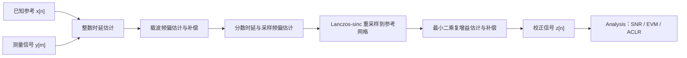
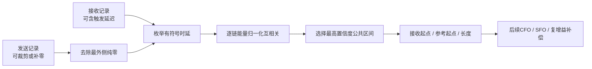
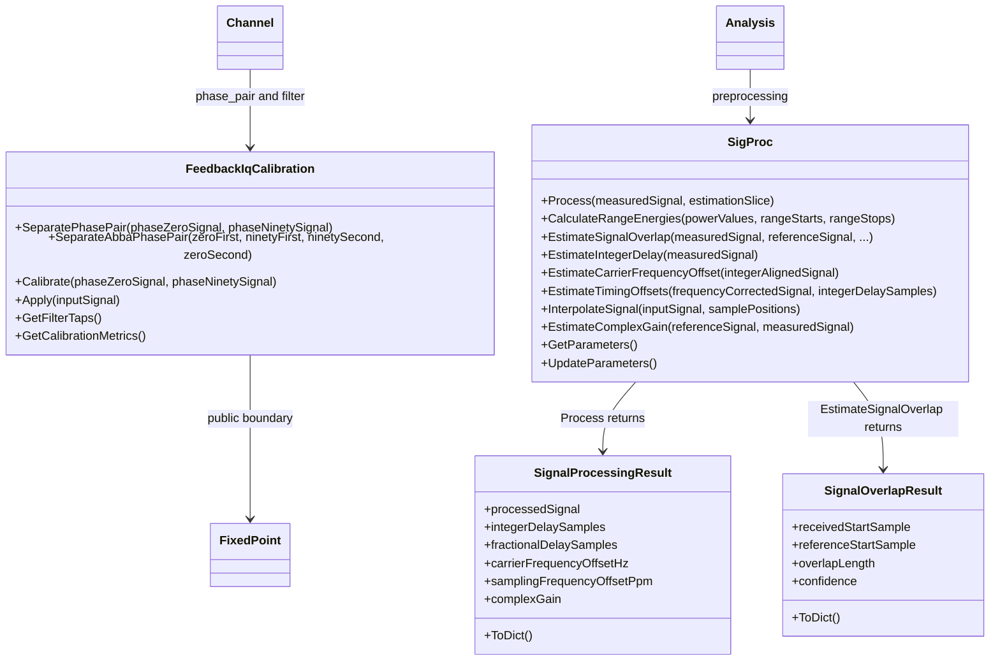
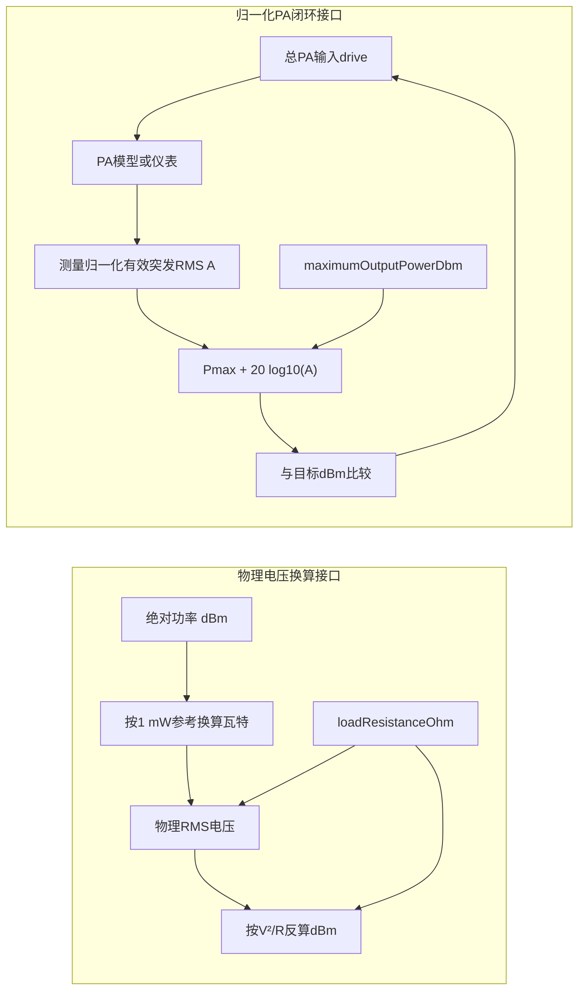
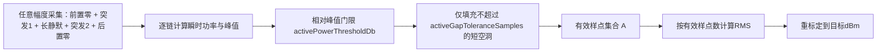
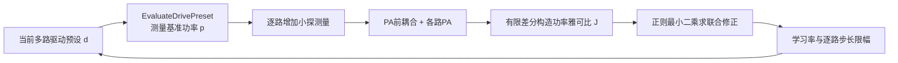
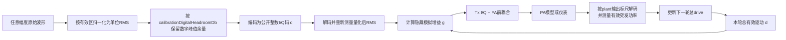

# 信号同步、补偿与功率标定的物理原理和推导

本文对应 `inc/utils/SigProc.py`。该模块位于“测量/仿真输出”和“性能指标计算”之间，专门处理整数时延、分数时延、载波频偏、采样频偏、公共复增益、dBm/RMS功率标定，以及0°/90°反馈I/Q相位对分离与广义线性逆滤波。`Analysis` 只消费校正后的信号并计算 SNR、EVM、ACLR，避免把同步误差或板载反馈接收机镜像错误地解释为 PA 非线性。

整数lag搜索现已批量向量化，并保留第一个并列峰的选择语义；不等长重叠搜索使用三段FFT相关、无全局差分的分层区间能量与Cauchy-Schwarz边界；有效突发短空洞按连续False区间处理；0 Hz CFO使用独立副本快路径。公式、等价性边界和参考耗时见 [Performance.md](./Performance.md#3-sigproc同步路径)。

---

## 1. 统一信号模型

设理想离散复基带参考为 $x[n]$，测量设备得到 $y[m]$。一个便于理解的模型是：

```math
y[m]
=g\,x\!\left(
\frac{m-d_{\mathrm{int}}-d_{\mathrm{frac}}}{1+\epsilon}
\right)
\exp\!\left(j2\pi\frac{\Delta f}{F_s}m\right)
+v[m].
```

其中：

- $d_{\mathrm{int}}$：整数时延，单位为样点；
- $d_{\mathrm{frac}}$：分数时延，规范化到 $[-0.5,0.5)$ 样点；
- $\Delta f$：载波频偏，单位 Hz；
- $F_s$：标称复采样率；
- $\epsilon$：采样率相对误差；
- $g$：固定复增益，包含幅度缩放和公共相位旋转；
- $v[m]$：噪声、PA 非线性以及模型未覆盖的残差。

采样频偏通常用 ppm 表示：

```math
\epsilon_{\mathrm{ppm}}=10^6\epsilon.
```

这里的目标不是把 $v[m]$ 也消除，而是只消除不应计入 PA/DPD 性能的确定性同步误差。

当Channel显式配置 `sampleMode="fb"` 且波形取自 `Channel.Process(...)` 的第二个输出 `fbOut` 时，$v[m]$ 还可能包含板载反馈接收机的频率选择性响应、I/Q镜像、DC、三阶非线性、限幅和ADC量化。默认 `sampleMode="forward"` 下第二项只是 `chOut` 的数值相同副本，不包含这些FB专用误差。SigProc可以估计整数/分数时延、CFO、SFO和单一公共复增益，但不会假装能够用一个标量消除所有反馈链非理想：

- 反馈FIR需要额外的频率响应校准或均衡；
- I/Q不平衡包含共轭镜像项，需要广义线性校准；
- 接收机非线性、限幅和ADC量化通常不可由同步恢复；
- 因此板载fb波形适合ILC反馈或反馈链诊断，最终PA性能仍应由独立forward仪表波形评价。

---

## 2. 处理工作流



**图 1 说明：**整数时延先给出粗对齐；载波频偏补偿避免随时间旋转的相位破坏局部相关；随后从多个时间窗口的相关峰位置估计固定分数时延和随时间累积的采样偏差；重采样后再估计公共复增益。三个性能指标使用同一份 $z[n]$，因此比较条件完全一致。

---

## 3. 整数时延估计

### 3.1 互相关

对候选时延 $d$，定义复互相关：

```math
R_{yx}[d]
=\sum_{n\in\Omega_d}y[n+d]x^*[n],
```

$\Omega_d$ 是参考与测量在该时延下的重叠区间。若 $y$ 是延迟后的 $x$，正确的 $d$ 会让两者相位和波形最一致，$|R_{yx}[d]|$ 最大。

直接求和的复杂度接近 $O(ND)$。代码利用“相关等于一个信号和另一个信号共轭反转后的卷积”，通过 FFT 计算完整线性相关，复杂度约为：

```math
O(N\log N).
```

### 3.2 能量归一化

不同候选时延的重叠长度不同，所以不能直接比较相关幅度。代码使用归一化分数：

```math
\rho[d]
=\frac{|R_{yx}[d]|}
{\sqrt{
\left(\sum_{n\in\Omega_d}|x[n]|^2\right)
\left(\sum_{n\in\Omega_d}|y[n+d]|^2\right)
}}.
```

最终整数时延为：

```math
\hat d_{\mathrm{int}}
=\arg\max_{|d|\le d_{\max}}\rho[d].
```

正时延表示测量信号比参考晚到；校正时参考样点 $n$ 从测量位置 $n+\hat d_{\mathrm{int}}$ 读取。

---

### 3.3 不等长发送与接收波形的公共区间估计

`SigProc.EstimateSignalOverlap` 用于已知发送样值的辅助分析。它解决的问题不是“恢复Wi-Fi参数”，而是“两个可能被裁剪或补零的记录中，哪两段样值来自同一物理时间区间”。因此该函数不读取Descriptor、seed、MCS、GI或Data，也不调用波形生成器。

设发送参考为 $x_m[n]$，接收记录为 $y_m[n]$，其中 $m$ 表示物理链。候选有符号时延为 $d$。当 $d\geq0$ 时，接收记录在发送参考之后开始；当 $d<0$ 时，接收记录从发送参考内部开始，说明发送参考的前部已被裁剪。每个候选的起点为：

```math
n_y(d)=\max(0,d),
```

```math
n_x(d)=\max(0,-d).
```

对应公共长度为：

```math
L(d)=\min
\left(
N_y-n_y(d),
N_x-n_x(d)
\right).
```

算法先删除发送参考最外侧的纯零填充，再在允许的有符号时延范围内枚举候选。第 $m$ 条链的归一化相关功率为：

```math
C_m(d)=
\frac{
\left|
\sum_{k=0}^{L_p-1}
x_m^*[n_x(d)+k]y_m[n_y(d)+k]
\right|^2
}{
\left(
\sum_{k=0}^{L_p-1}|x_m[n_x(d)+k]|^2
\right)
\left(
\sum_{k=0}^{L_p-1}|y_m[n_y(d)+k]|^2
\right)
},
```

其中 $L_p$ 不超过 `maximumProbeLength`。多链得分采用算术平均：

```math
C(d)=
\frac{1}{M}
\sum_{m=0}^{M-1}C_m(d).
```

返回置信度为：

```math
\rho(d)=\sqrt{C(d)}.
```

窗口能量由 `CalculateRangeEnergies()` 计算。数值条件良好时它使用快速累计差，同时估计减法的浮点消减上界；只有可疑范围才构造二叉成对求和树，把区间拆成若干互不重叠的局部节点直接相加。因此普通波形保持向量化速度，强突发之后即使只有极低幅噪声，也不会因为两个大数相减丢失尾部窗口的有效数字。三段FFT相关仍负责批量计算分子，Cauchy-Schwarz上界负责限制FFT舍入误差。

由于分子和分母具有相同的幅度平方量纲，公共复增益和每链固定功率缩放不会改变理想情况下的相关置信度。若多个候选得分相同，算法依次偏好更长公共区间和更早的接收起点。结果保存为 `SignalOverlapResult`：

| 字段 | 含义 |
|---|---|
| `receivedStartSample` | 接收记录公共区间的首样点 |
| `referenceStartSample` | 发送参考公共区间的首样点 |
| `overlapLength` | 两路可直接对应的样点数 |
| `confidence` | 0到1的归一化相关幅度 |

```python
from inc.utils.SigProc import SigProc

overlap = SigProc.EstimateSignalOverlap(
    measuredSignal=receivedSignal,
    referenceSignal=transmitSignal,
    maximumMeasuredOffsetSamples=2000,
    maximumProbeLength=32768,
    minimumConfidence=0.12,
)

referenceOverlap = transmitSignal[
    overlap.referenceStartSample:
    overlap.referenceStartSample + overlap.overlapLength
]
receivedOverlap = receivedSignal[
    overlap.receivedStartSample:
    overlap.receivedStartSample + overlap.overlapLength
]
print(overlap.ToDict())
```

**图示说明：**



该图强调公共区间估计只决定“比较哪两段样值”。CFO、分数时延、SFO和公共复增益仍由后续 `SigProc.Process` 估计与补偿；重叠估计不能替代完整同步。

## 4. 载波频偏估计与补偿

### 4.1 为什么使用分块复增益相位

如果只有载波频偏和固定增益，则局部窗口内的最小二乘复增益近似为：

```math
g_b\approx g\exp\!\left(
j2\pi\frac{\Delta f}{F_s}n_b
\right),
```

$n_b$ 是第 $b$ 个窗口的中心样点。于是窗口增益相位满足近似直线：

```math
\phi_b=\mathrm{unwrap}(\angle g_b)
\approx\phi_0+\omega n_b,
```

其中：

```math
\omega=2\pi\frac{\Delta f}{F_s}.
```

每个窗口的复增益由下式得到：

```math
\hat g_b
=\frac{\mathbf x_b^H\mathbf y_b}
{\mathbf x_b^H\mathbf x_b}.
```

对解缠后的 $\angle\hat g_b$ 做加权直线拟合，获得斜率 $\hat\omega$：

```math
\widehat{\Delta f}
=\frac{F_s}{2\pi}\hat\omega.
```

使用分块平均而不是相邻单样点相位差，可以抑制 PA 记忆和非线性引起的快速相位扰动，降低把 PA 失真误判成 CFO 的风险。

### 4.2 补偿

测量索引为 $m$ 时，CFO 补偿为：

```math
y_c[m]
=y[m]\exp\!\left(
-j2\pi\frac{\widehat{\Delta f}}{F_s}m
\right).
```

---

## 5. 分数时延估计

整数对齐后，真实相关峰通常位于两个离散样点之间。若整数峰位于 $k$，相邻三个归一化相关幅度分别为 $p_{-1}$、$p_0$、$p_{+1}$，用抛物线顶点近似分数偏移：

```math
\delta
=\frac{1}{2}
\frac{p_{-1}-p_{+1}}
{p_{-1}-2p_0+p_{+1}}.
```

代码将 $\delta$ 限制在 $[-0.5,0.5]$，防止低信噪比或平坦相关峰产生不合理外推。

仅使用整帧一个相关峰无法区分“固定分数时延”和“随时间逐渐增加的采样误差”，因此代码在多个时间窗口分别得到局部时延。

---

## 6. 采样频偏估计

如果测量设备的采样率与标称采样率略有差异，局部时延会随参考样点位置近似线性变化：

```math
d(n)=d_0+\epsilon n.
```

对多个窗口得到的 $(n_b,d_b)$ 做加权直线拟合：

```math
\hat d_b=\hat d_0+\hat\epsilon n_b.
```

其中截距 $\hat d_0$ 是分数时延，斜率换算为 ppm：

```math
\widehat{\epsilon}_{\mathrm{ppm}}
=10^6\hat\epsilon.
```

直观理解：40 ppm 表示每一百万个参考样点，测量网格会累计约 40 个样点的相对漂移。

---

## 7. 重采样与分数时延补偿

校正后的第 $n$ 个输出应从测量信号的浮点位置读取：

```math
m(n)
=\hat d_{\mathrm{int}}
+\hat d_{\mathrm{frac}}
+n\left(1+\frac{\widehat{\epsilon}_{\mathrm{ppm}}}{10^6}\right).
```

由于 $m(n)$ 通常不是整数，需要插值。代码使用有限长度 Lanczos-sinc 核：

```math
h(t)
=\mathrm{sinc}(t)
\mathrm{sinc}\!\left(\frac{t}{L}\right),
\qquad |t|<L.
```

插值输出为：

```math
z_0[n]
=\frac{
\sum_k y_c[k]h(m(n)-k)
}{
\sum_k h(m(n)-k)
}.
```

有限支持 $L$ 控制计算量和精度。过采样 Wi-Fi 信号的有效带宽低于 Nyquist 边缘，sinc 类插值通常明显优于简单线性插值。

---

## 8. 公共复增益估计与补偿

重采样完成后，在指定估计区间内寻找使 $g\mathbf x$ 最接近 $\mathbf z_0$ 的复数：

```math
\hat g
=\arg\min_g\|\mathbf z_0-g\mathbf x\|_2^2.
```

Wirtinger 求导得到：

```math
\boxed{
\hat g
=\frac{\mathbf x^H\mathbf z_0}
{\mathbf x^H\mathbf x}
}
```

最终补偿信号是：

```math
z[n]=\frac{z_0[n]}{\hat g}.
```

`Analysis` 默认把 Wi-Fi 数据字段作为复增益估计区间，使性能评价关注非线性形状误差，而不是测试链路的固定幅相标定差。

---

## 9. 类结构和结果



**图 2 说明：**`SigProc` 持有参考信号、采样率和估计配置；`Process` 返回不可变的 `SignalProcessingResult`。静态公共区间估计返回不可变的 `SignalOverlapResult`，因此Analysis和ParseWifi可以复用同一相关算法。样点数组用于后续指标计算，两个结果类的 `ToDict()` 都只输出适合 JSON/CSV 记录的标量。独立的 `FeedbackIqCalibration` 不参与Analysis同步；它利用I/Q变频器之前的两种相位开关状态，把反馈接收机产生的共轭镜像从物理直接观测中分离，并为后续单状态采样拟合逆滤波器。

---

## 10. 可配置参数

所有默认值都定义在 `SigProc.__init__` 内部，调用方只传需要覆盖的键。未知键通过 `UserWarning` 报告后被忽略，信号处理继续使用其余已识别配置；已识别配置如果类型、单位或范围非法，仍会抛出异常。

| 参数 | 默认值 | 物理含义 |
|---|---:|---|
| `enableIntegerDelayCompensation` | `True` | 是否估计并补偿粗整数时延 |
| `enableFractionalDelayCompensation` | `True` | 是否估计并补偿亚样点时延 |
| `enableCarrierFrequencyOffsetCompensation` | `True` | 是否估计并补偿 CFO |
| `enableSamplingFrequencyOffsetCompensation` | `True` | 是否估计并补偿采样频偏 |
| `enableComplexGainCompensation` | `True` | 是否估计并除去公共复增益 |
| `maxIntegerDelaySamples` | `None` | 整数时延搜索半径；`None` 自动选择 |
| `maxCarrierFrequencyOffsetHz` | `None` | CFO 限幅；`None` 使用内部安全范围 |
| `maxSamplingFrequencyOffsetPpm` | `200.0` | 允许的采样频偏绝对值上限 |
| `timingWindowCount` | `9` | 时变延迟拟合使用的窗口数 |
| `timingWindowLength` | `2048` | 每个相关/CFO 窗口的样点数 |
| `interpolationHalfLength` | `12` | Lanczos-sinc 插值单侧支持长度 |

---

## 11. 典型调用

直接使用工具类：

```python
from inc.utils.SigProc import SigProc

signalProcessor = SigProc(
    referenceSignal,
    sampleRateHz,
    parameters={
        "maxIntegerDelaySamples": 256,
        "maxCarrierFrequencyOffsetHz": 200000.0,
        "maxSamplingFrequencyOffsetPpm": 100.0,
    },
)
processingResult = signalProcessor.Process(measuredSignal)
correctedSignal = processingResult.processedSignal
print(processingResult.ToDict())
```

通过 `Analysis` 自动调用：

```python
from inc.lib.Analysis import Analysis

resultAnalysis = Analysis(
    referenceSignal,
    wifiWaveform,
    signalProcessingParameters={
        "maxIntegerDelaySamples": 256,
        "maxSamplingFrequencyOffsetPpm": 100.0,
    },
)
metrics = resultAnalysis.Analyze(measuredSignal)
processingResult = resultAnalysis.GetLastSignalProcessingResult()
```

---

## 12. 使用边界

1. 估计是数据辅助的，要求参考信号与测量信号来自同一帧；未知载荷的接收机同步需要使用标准前导结构。
2. 默认整数时延自动搜索有 4096 样点上限；更长线缆、缓存或仪器触发延迟需要显式增大 `maxIntegerDelaySamples`。
3. CFO 相位解缠要求相邻估计窗口之间的相位变化不过度模糊；极大 CFO 应先使用前导重复结构做粗频偏估计。
4. 单一线性采样频偏模型不描述采样时钟抖动或随时间变化的非线性漂移。
5. 公共复增益只消除统一幅相误差，不等于频率选择性信道均衡；真实 OTA MIMO 测量仍需要信道估计和均衡。
6. 对Channel的 `fbOut`，同步可以补偿配置的时延、CFO、SFO和一部分公共增益/相位，但不能自动校正反馈FIR、I/Q镜像、三阶失真、限幅或ADC量化；这些残差应与同次返回的 `chOut` 主路结果分开解释。
6. 插值会改变记录边缘；测量采集应在帧前后保留足够保护样点，避免时延补偿后丢失有效数据。

---

## 13. PA输出dBm、输出回退与复包络标定

`PowerCalibration` 与同步类放在同一个 `SigProc.py` 中，但职责彼此独立。它负责dBm/RMS换算、根据额定输出功率产生第一次输入驱动预设，并闭环调整PA输入；PA非线性仍由绑定的PA模型或仪表实现。它不会在PA输出端乘常数增益来伪造目标功率。若绑定对象同时提供 `SuspendThermalModel` 与 `RestoreThermalModel`，公开入口 `Calibrate` 还会统一包围一个“暂停热效应—纯电闭环—恢复热状态”的事务。因此通过Channel使用和直接绑定热PA使用都在参考温度电模型上校准。普通业务代码仍推荐调用 `chOut, fbOut = Channel.Process(rawSignal, outputPowerDbm=...)`，由Channel在内部组合本工具。

公开构造签名为
`PowerCalibration(loadResistanceOhm=None, maximumOutputPowerDbm=None, paModel=None, parameters=None, width=None, **parameterOverrides)`。它没有要求调用方重复传输出标尺：`SetPaModel` 会从绑定对象或绑定方法所有者自动读取 `outputFullScaleAmplitude`；没有该属性的第三方plant兼容回退到1.0。输入DAC仍使用 `fullScaleAmplitude=1.0`。

这里的 `outputPowerDbm` 只表示PA后耦合前、接收链非理想之前的干净物理PA输出功率。`PowerCalibration` 不读取raw `fbOut` 的表观RMS，也不会把 `fbGainDb`、反馈FIR、反馈非线性、噪声或ADC量化误当成发射功率误差。用户口中的“DPD校准”是后续学习过程：它把 `fbOut` 交给本文件的同步工具计算训练误差；最终EVM、SNR、ACLR、IRR和功率则对 `chOut` 计算。

工程约定复包络 RMS 幅度等于纯电阻端口上的 RF RMS 电压。设端口电阻为 $R$，RMS 电压为 $V_{\mathrm{RMS}}$，则端口平均功率为

```math
P_{\mathrm{W}}
=\frac{V_{\mathrm{RMS}}^2}{R}.
```

dBm 使用 1 mW 作为参考：

```math
P_{\mathrm{dBm}}
=10\log_{10}\left(
\frac{P_{\mathrm{W}}}{10^{-3}}
\right).
```

因此从 dBm 到 RMS 电压的换算为

```math
V_{\mathrm{RMS}}
=\sqrt{
R\,10^{-3}10^{P_{\mathrm{dBm}}/10}
}.
```

反向换算为

```math
P_{\mathrm{dBm}}
=10\log_{10}\left(
\frac{V_{\mathrm{RMS}}^2}{R\,10^{-3}}
\right).
```



**图 3 说明：**左侧是 `DbmToRms`、`RmsToDbm` 等物理电压接口，只有这条路径使用 `loadResistanceOhm`。右侧是 `Calibrate` 实际采用的归一化PA闭环：它把归一化输出RMS $A$ 按 $P_{\max}+20\log_{10}(A)$ 映射为dBm，不使用端口电阻。两者共享dBm单位但参考面不同，不能把归一化样点直接当作伏特。右侧箭头回路表示每次都重新激励PA并观测实际输出，而不是对已有输出做离线缩放。若plant支持热事务，这个闭环整体位于暂停与 `finally` 恢复之间，图中没有把温度画成另一条反馈环。业务用户只看见Channel的“原始波形+目标dBm”接口；该工具位于 `SigProc.py` 后，`Analysis` 不再需要为了功率换算而导入 `PaModel.py`。其 `ChainMap` 参数同样遵循“未知键警告并忽略、已识别非法值继续报错”的规则。

默认每路PA极限输出功率为

```math
P_{\max}=25\ \mathrm{dBm}.
```

这里必须区分三个容易混淆的量：

1. $P_{\max}$ 是归一化PA输出有效区RMS等于1时对应的物理功率，也是API允许请求的额定输出上限；
2. 目标输出功率决定的是目标PA输出RMS，而不是PA输入必须使用的固定缩放倍数；
3. 闭环的总输入驱动 $d_m$ 是控制器不断更新的内部状态，它只有第一次试探时才由输出回退给出近似初值。

目标输出 $P_{\mathrm{target}}$ 对应的输出回退为

```math
\mathrm{OBO}
=
P_{\max}-P_{\mathrm{target}}.
```

目标归一化输出有效区RMS为

```math
A_{y,\mathrm{target}}
=
10^{(P_{\mathrm{target}}-P_{\max})/20}
=
10^{-\mathrm{OBO}/20}.
```

默认20 dBm工作点相对25 dBm额定上限有5 dB输出回退，因此 $A_{y,\mathrm{target}}\approx0.5623$。这个0.5623描述的是目标PA输出RMS。闭环可以把第一次总输入驱动初始化为

```math
d_m^{(0)}
=
P_{m,\mathrm{target}}-P_{\max},
```

因此本例的初值是 $-5$ dB，但不能把 $10^{d_m^{(0)}/20}$ 当成最终PA输入缩放，更不能假定非线性PA经过该缩放后必然输出20 dBm。AM-AM压缩、记忆效应、Tx I/Q误差、PA前耦合和量化都会改变实际输入输出关系；控制器必须根据每次实测功率继续更新 $d_m$。

`Calibrate(inputSignal)` 是底层校准器的统一公开入口。`SetPaModel` 除了绑定 `Process(inputSignal)`，还会识别可选且必须成对出现的 `SuspendThermalModel` 与 `RestoreThermalModel`。若传入 `paModel.Process` 这类绑定方法，它会从方法的 `__self__` 自动发现位宽、成对drive协议和成对热事务协议；普通lambda没有可追溯的协议所有者，无法自动管理其闭包背后的热状态，因此热PA应优先传对象或绑定方法。`Calibrate` 开始时把当时绑定owner的暂停/恢复方法捕获到本地，取得热快照并暂停温度效应，再调用内部数值内核 `CalibrateElectricalOnly`；事务期间 `SetPaModel` 会拒绝重绑，嵌套 `Calibrate` 也会被拒绝。最后无论收敛、校验失败还是plant抛出异常，都用原owner的本地恢复方法在 `finally` 中归还快照，避免把PA A的快照错误交给PA B。数值内核重复执行“生成PA输入—实际激励PA—测量有效突发功率—更新隐藏预设”，直到每一路误差均不超过 `calibrationToleranceDb`。

`CalibrateElectricalOnly` 只是为了让热事务边界和闭环数值实现分离的内部内核。它不会自行暂停或恢复温度，并且会硬性拒绝事务外直接调用，提示用户改用 `Calibrate`。Channel内部构造 `PowerCalibration`、把自己的热代理接口交给校准器，并将 `Channel.Process` 的目标功率写入该工具；直接使用 `PowerCalibration(paModel=thermalPa)` 也会经过同一个公开热事务。普通用户只传原始波形与目标dBm，不需要感知该内核或读写每轮驱动预设。

浮点模式下，闭环返回最终PA输入波形；定点模式下，闭环返回带数字余量的公开整数码，并由同一个Channel保存与其配对的隐藏模拟增益。`GetLastPaOutput()` 返回收敛判定所使用的最后一次PA实测输出；定点时该数组是plant输出标尺下的整数码，校准器已按自动发现的标尺解码后才测功率。代码不会在PA后把输出乘常数来伪造目标dBm，因此AM-AM压缩、AM-PM、EVM和ACLR均对应真实驱动工作点。`outputPowerDbmPerChain` 不为 `None` 时逐列独立闭环，否则所有链使用共同的 `outputPowerDbm`。

`PowerCalibration` 的完整配置如下。所有默认值都定义在构造函数内部，并通过 `ChainMap` 允许调用方只覆盖需要修改的项目。直接构造参数和 `UpdateParameters(...)` 位于高优先级覆盖层；它们会覆盖 `parameters` 传入的低层活动映射，而不是与同名键合并。

| 参数 | 默认值 | 含义 |
|---|---:|---|
| `loadResistanceOhm` | `50.0` | 物理电压接口使用的端口阻抗 |
| `maximumOutputPowerDbm` | `25.0` | 归一化PA输出有效区RMS等于1时对应的额定上限 |
| `outputPowerDbm` | `20.0` | 未提供逐链目标时使用的共同输出功率 |
| `outputPowerDbmPerChain` | `None` | 可选逐PA输出功率目标序列 |
| `calibrationToleranceDb` | `0.25` | 所有链均须满足的绝对功率误差容限 |
| `maximumCalibrationIterations` | `60` | 单次闭环允许的最大试探轮数 |
| `calibrationLearningRate` | `0.8` | 未建立上下界时的比例修正系数，以及联合修正的步长系数 |
| `maximumDriveAdjustmentDb` | `6.0` | 单轮单链允许的最大驱动变化 |
| `calibrationDigitalHeadroomDb` | `6.0` | 定点公开码相对I/Q满量程保留的峰值余量，总体范围为0至60 dB；低位宽还必须保证峰值至少量化成一个非零码，非法组合会报告该位宽的准确上限 |
| `enableJointCalibration` | `False` | 是否用有限差分雅可比联合更新多链驱动 |
| `calibrationProbeStepDb` | `0.05` | 联合模式构造功率雅可比时的单链探测步长 |
| `calibrationRegularization` | `1e-6` | 联合最小二乘的对角正则系数 |
| `activePowerThresholdDb` | `-60.0` | 相对峰值的有效突发功率门限 |
| `activeGapToleranceSamples` | `16` | 仍并入有效突发的最大内部低功率空洞长度 |
| `width` | `16` | 公开I/Q位宽；0为浮点，闭环定点校准要求至少2 bit |

只读属性 `OutputFullScaleAmplitude` / `outputFullScaleAmplitude` 返回当前plant输出码标尺；它不是独立配置层。重新 `SetPaModel` 时会重新发现该属性，避免旧plant标尺泄漏到新对象。

### 13.1 有效信号区间与占空比

不能直接使用整个采集记录的样点数作为RMS分母。假设真正的Wi-Fi突发只有 $N_{\mathrm{on}}$ 个样点，但采集前后带有 $N_{\mathrm{off}}$ 个零样点，则整段RMS为

```math
A_{\mathrm{capture}}
=
\sqrt{
\frac{
\sum_{n\in\mathcal A}|x[n]|^2
}{
N_{\mathrm{on}}+N_{\mathrm{off}}
}
}.
```

它比突发有效区RMS

```math
A_{\mathrm{active}}
=
\sqrt{
\frac{
\sum_{n\in\mathcal A}|x[n]|^2
}{
N_{\mathrm{on}}
}
}
```

低

```math
\Delta P
=
10\log_{10}
\left(
\frac{N_{\mathrm{on}}}
{N_{\mathrm{on}}+N_{\mathrm{off}}}
\right)
\ \mathrm{dB}.
```

例如占空比为 $D=N_{\mathrm{on}}/(N_{\mathrm{on}}+N_{\mathrm{off}})=0.5$ 时，整段平均功率比有效突发功率低约3.01 dB。这两个数都可能有物理意义，但本工程的PA工作点和Wi-Fi EVM需要使用“突发开启期间的平均功率”，因此校准和Analysis均采用 $A_{\mathrm{active}}$。

第 $m$ 路的瞬时功率和峰值为

```math
p_m[n]=|x_m[n]|^2,
\qquad
p_{m,\max}=\max_n p_m[n].
```

以 `activePowerThresholdDb` 为相对峰值门限，初始有效掩码定义为

```math
M_m[n]
=
1,
\qquad
p_m[n]>
p_{m,\max}10^{T_{\mathrm{active}}/10}.
```

未超过门限时：

```math
M_m[n]
=
0,
\qquad
p_m[n]\le
p_{m,\max}10^{T_{\mathrm{active}}/10}.
```

默认 $T_{\mathrm{active}}=-60\ \mathrm{dB}$。OFDM样值会正常穿过零点，因此不能把每一个低幅样点都视为关断。`activeGapToleranceSamples=16` 会填充长度不超过16个样点的内部空洞；前置补零、后置补零以及更长的内部静默区仍保持无效。每一路MIMO信号独立建立掩码。

真实仪表捕获的静默区可能含有噪声而不是精确零。如果静默噪声高于默认峰值下60 dB门限，应把 `activePowerThresholdDb` 调高到略高于静默噪声底，例如 `-40.0`；门限仍必须低于有效Wi-Fi突发的正常包络。门限过低会把噪声占空区计入，门限过高则会删掉真实低包络样点。



**图 4 说明：**短空洞通常是OFDM过零或瞬时低包络，仍属于有效突发；长空洞表示占空比关断，不进入功率分母。缩放仍作用于整条波形，所以原来的零样点继续为零，时间位置和占空比均不改变。

### 13.2 PA闭环输入功率校准

输入波形不需要事先归一化。对第 $m$ 路原始波形 $x_m[n]$，先按有效集合 $\mathcal A_m$ 计算

```math
A_{x,m}
=
\sqrt{
\frac{
\sum_n M_m[n]|x_m[n]|^2
}{
\sum_n M_m[n]
}
}.
```

保持波形形状不变的单位有效RMS波形为

```math
\bar{x}_m[n]
=
\frac{x_m[n]}{A_{x,m}}.
```

第 $k$ 次试探使用总有效驱动 $d_m^{(k)}$，单位为dB。它定义了进入Tx I/Q模块之前的期望有效区RMS：

```math
A_{u,m}^{(k)}
=
10^{d_m^{(k)}/20}.
```

在浮点模式下，这个定义直接对应

```math
u_m^{(k)}[n]
=
10^{d_m^{(k)}/20}\bar{x}_m[n].
```

在定点模式下，总有效驱动会拆成“安全公开数字码”和“解码后的隐藏模拟增益”，详细推导见13.3节。无论采用哪一种公开接口，真正进入Tx I/Q、PA前耦合和PA的波形仍记为 $u_m^{(k)}[n]$。绑定plant的输出为

```math
y_m^{(k)}[n]
=
\mathcal{P}_m\left\{
u_m^{(k)}[n]
\right\}.
```

若 $y_m^{(k)}$ 是固定点公开码，`EvaluateDrivePreset` 先用
`FixedPoint(width, outputFullScaleAmplitude)` 解码；该标尺由绑定plant自动
提供，内置PA、MIMO PA和Channel默认2.0，第三方兼容默认1.0。以下公式中的
$y_m^{(k)}$ 均指正确解码后的浮点PA输出，而不是整数码本身。

仅在输出有效集合上计算RMS，并映射为实测功率：

```math
A_{y,m}^{(k)}
=
\sqrt{
\frac{
\sum_n M_{y,m}^{(k)}[n]
\left|y_m^{(k)}[n]\right|^2
}{
\sum_n M_{y,m}^{(k)}[n]
}
},
```

```math
P_{m,\mathrm{meas}}^{(k)}
=
P_{\max}
+20\log_{10}
\left(
A_{y,m}^{(k)}
\right).
```

功率误差定义为

```math
e_m^{(k)}
=
P_{m,\mathrm{target}}
-P_{m,\mathrm{meas}}^{(k)}.
```

尚未在目标两侧获得试探点时，采用有界比例更新：

```math
d_m^{(k+1)}
=
d_m^{(k)}
+\mathrm{clip}
\left(
\mu e_m^{(k)},
-\Delta_{\max},
\Delta_{\max}
\right).
```

上式中的 `clip` 表示把修正量限制在正负 `maximumDriveAdjustmentDb` 之间。默认 $\mu=0.8$、$\Delta_{\max}=6$ dB。

一旦已知一个“输出偏低”的下界 $d_{m,L}$ 和一个“输出偏高”的上界 $d_{m,U}$，后续改用二分：

```math
d_m^{(k+1)}
=
\frac{
d_{m,L}+d_{m,U}
}{2}.
```

收敛条件是所有PA链同时满足

```math
\left|
e_m^{(k)}
\right|
\leq
\epsilon_P,
```

其中默认 $\epsilon_P=0.25$ dB，最多试探60次；用户可按仪表重复性和目标精度收紧容限。收敛后的 $d_m$ 保存在类内部并作为下一次同目标校准的初值。用户无需设置隐藏模拟增益；实现成对trial/commit协议的适配器会在 `GetLastCalibrationMetrics()` 中返回 `analogDriveDbPerChain`。浮点协议路径的该值为0 dB，表示总drive已由公开浮点波形承担；没有该协议的旧式适配器不返回此键。

校准采用trial/commit事务。每一轮 `ProcessCalibrationDrive` 都显式携带本轮候选增益，只产生一次临时PA观测，不修改Channel中已经生效的驱动状态。只有当所有PA链同时满足容限后，`SetCalibrationDriveDb` 才原子提交最终逐链增益，然后缓存被接受的公开输入和PA输出。联合模式为构造雅可比而产生的额外探测也只是trial，不能提前提交。若某次新校准失败，之前已经成功提交的工作点保持不变，因此一次失败的功率请求不会破坏后续不带功率参数的正常传输或ILC测试。

失败并不等价于“目标值大于 `maximumOutputPowerDbm`”。超过额定上限的请求在参数校验阶段直接拒绝；不超过上限的请求仍可能因为真实PA饱和、固定增益仪表适配器、输出采集限幅、极低位宽量化或非单调工作区而不可达。达到迭代上限后函数抛出包含目标功率、最佳实测功率和最佳绝对误差的异常；`GetLastCalibrationMetrics()` 保留本次最佳观测并返回 `converged=False` 与可读的 `failureReason`，成对trial/commit协议存在时还返回最佳 `analogDriveDbPerChain`。成功时 `converged=True`，且不包含失败原因。实现不会通过修改 $P_{\max}$、放大PA输出数组或把失败的最后一次trial误记为新工作点来伪造收敛。

热状态事务与drive提交事务是两条正交状态轴：

1. `Calibrate` 调用 `SuspendThermalModel` 后，热网络、结温、累计热时间、互热offset和热metrics不随trial推进；
2. `CalibrateElectricalOnly` 只求解电驱动，所有PA链收敛后仍会提交新的公开波形与模拟drive；
3. `finally` 调用 `RestoreThermalModel`。若校准期间活动配置已经改成 `ThermalConfig(enabled=False)` 或 `None`，这个实时关闭决定优先，旧的启用快照不会被复活；
4. 若校准失败，热状态同样恢复，而未收敛的候选drive不会提交。

所以“关闭温度”不等于“清零以前成功提交的功率drive”。前者决定是否计算自热、互热和温度漂移，后者决定PA前的工作点。比较温度开关前后电响应时，应让两次测试使用同一个已提交drive，或分别在相同目标功率规则下重新校准；不能把带历史drive的对象与全新0 dB drive对象直接比较后把差异归因于温度。

该闭环假设目标附近的有效突发平均输出功率随输入驱动单调不减，这对正常AM-AM曲线成立。若真实仪表反馈噪声大于功率容限，应先增加仪表平均次数或放宽 `calibrationToleranceDb`；若PA存在热记忆或迟滞，应保证每轮测量使用相同等待时间和采集条件，否则二分上下界可能不再代表同一静态映射。

#### 13.2.1 PA前耦合下的联合功率校准

逐链二分隐含“第 $j$ 路驱动只改变第 $j$ 路PA功率”的假设。PA前存在串扰时，第 $j$ 路数字驱动会同时进入多路PA，因此全部PA输出功率应写成驱动向量的联合函数：

```math
\mathbf p
=
\mathbf F(\mathbf d),
```

其中

```math
\mathbf d
=
\begin{bmatrix}
d_0 & d_1 & \cdots & d_{M-1}
\end{bmatrix}^{T}
```

是各路隐藏驱动预设，$\mathbf p$ 是在PA后耦合和接收噪声之前测得的逐PA有效突发功率。若仍独立修正，每一路控制器会把其他路引起的功率变化误认为本路误差，可能出现来回振荡或收敛到错误工作点。

联合模式用小的dB探测步长 $\delta$ 对每一路驱动做有限差分，建立局部功率雅可比矩阵：

```math
J_{i,j}
\approx
\frac{
F_i(\mathbf d+\delta\mathbf e_j)-F_i(\mathbf d)
}{
\delta
}.
```

$J_{i,j}$ 表示第 $j$ 路驱动增加1 dB时，第 $i$ 个PA输出功率大约变化多少dB。对目标误差

```math
\mathbf e
=
\mathbf p_{\mathrm{target}}-\mathbf p
```

采用带正则的最小二乘修正：

```math
\Delta\mathbf d
=
\left(
\mathbf J^{H}\mathbf J+\lambda\mathbf I
\right)^{-1}
\mathbf J^{H}\mathbf e.
```

代码中的功率雅可比为实矩阵，式中的共轭转置等价于普通转置。$\lambda$ 防止强耦合导致矩阵接近奇异；随后仍按 `maximumDriveAdjustmentDb` 对每个分量限幅，并乘 `calibrationLearningRate`，避免一次线性化跨越过大的非线性区间。



**图 5 说明：**每个探测点都重新生成PA输入并真实调用绑定plant。Channel提供的校准plant只包含PA前耦合和各路PA，因此目标功率定义为每个PA自身的输出功率；PA后耦合、forward/fb接收链与噪声不进入闭环。这样不会让接收端串扰或随机噪声改变PA工作点。

相关参数为：

| 参数 | 默认值 | 含义 |
|---|---:|---|
| `enableJointCalibration` | `False` | 启用有限差分雅可比联合更新；Channel检测到PA前耦合时默认自动启用 |
| `calibrationProbeStepDb` | `0.05` | 构造雅可比时单路驱动的dB探测步长 |
| `calibrationRegularization` | `1e-6` | 联合最小二乘的对角正则系数 |
| `calibrationLearningRate` | `0.8` | 联合修正与独立比例修正共用的更新学习率 |
| `maximumDriveAdjustmentDb` | `6.0` | 每轮每路允许的最大dB修正量 |

`PrepareDrivePreset(normalizedInput, driveDb, interfaceFormat)` 负责构造安全公开波形和逐链解码后模拟增益。`EvaluateDrivePreset(normalizedInput, driveDb, inputWasVector, interfaceFormat)` 是内部统一观测入口：它调用一次绑定plant的trial接口，并返回本次公开PA输入、PA输出、逐路实测dBm和模拟增益向量，但不提交候选增益。普通用户仍只调用 `Channel.Process(rawSignal, outputPowerDbm=...)`，不需要直接构造雅可比、管理驱动向量或调用trial/commit接口。

### 13.3 定点接口

`width=0` 时输入输出均为浮点复包络。`width>0` 时输入和输出均为公开整数I/Q码，容器类型仍为 `numpy.complex128`。模块内部仍使用浮点运算，但固定字长边界上的数值是诸如8191、-16384一类原始码，而不是小于1的归一化浮点数。输入和输出共享位宽，却不强制共享幅度标尺：输入DAC固定为1.0；内置PA/Channel输出默认 `outputFullScaleAmplitude=2.0`。这种可配格式统一称为scaled full-scale，不把任意比例称为Q2.14。

#### 13.3.1 为什么不能在定点编码之前不断放大

若先生成单位有效RMS OFDM波形，再把总驱动直接乘到波形上并编码，公开I/Q接口只允许每个分量落在

```math
-2^{w-1}
\leq
q_I,q_Q
\leq
2^{w-1}-1.
```

输入DAC解码后的正向满量程为

```math
r_w
=
1-2^{-(w-1)}.
```

隐藏模拟增益校准要求 $w\geq2$，因为1位带符号接口没有正向非零码，无法构造保留余量的复基带波形。

OFDM具有较高峰均比。即使有效区RMS尚未达到目标，部分I/Q峰值也可能先超过 $r_w$。此后继续增加编码前驱动只会让更多样点饱和为最大码，公开波形不再按预期增大。控制器会观察到一个由数字削顶产生的假功率平台，并可能错误报告“20 dBm不可达”。增加迭代次数只能重复同一批饱和码；增加位宽只改善量化步长，也不会改变归一化范围 $[-1,1)$，因此两者都不能从根本上修复该问题。

正确结构把总有效驱动拆成两部分：

- 一个带峰值余量、始终合法的公开定点数字基波形；
- 一个在公开码解码之后、Tx I/Q和PA之前施加的隐藏逐链模拟增益。

这等价于真实系统中的“DAC码加后级可调驱动增益”。对外接口仍是相同位宽的整数码，用户只需向 `Channel.Process` 提供原始波形和目标dBm。

#### 13.3.2 安全公开码和6 dB数字余量

对第 $m$ 路单位有效RMS波形 $\bar{x}_m[n]$，先找I/Q分量的最大绝对值：

```math
C_m
=
\max_n
\left(
\max
\left(
\left|\mathrm{Re}\left(\bar{x}_m[n]\right)\right|,
\left|\mathrm{Im}\left(\bar{x}_m[n]\right)\right|
\right)
\right).
```

设 `calibrationDigitalHeadroomDb` 为 $H$，安全的解码后分量峰值为

```math
L_w
=
r_w 10^{-H/20}.
```

数字基波形缩放为

```math
s_m
=
\frac{L_w}{C_m}
.
```

这里不再额外限制 $s_m\leq1$。$\bar{x}_m$ 只是单位有效区 RMS 的内部基准，
不是必须保持原幅度的公开码；当其分量峰值低于安全上限时，校准器可以向上缩放以利用更多量化码。
无论向上还是向下缩放，公开码的分量峰值都保持在 $L_w$，总有效驱动再由解码后的模拟级补足。

记 $E_w$ 为定点编码器，$D_w$ 为定点解码器，则公开整数码和真正解码回内部的数字波形分别为

```math
q_m[n]
=
E_w\left(s_m\bar{x}_m[n]\right),
```

```math
x_{q,m}[n]
=
D_w\left(q_m[n]\right).
```

默认 $H=6$ dB。对16位接口，$r_w\approx0.999969$，所以 $L_w\approx0.50117$，即公开I/Q峰值约占半量程。这为ILC或DPD产生的接近两倍峰值扩展保留空间，同时仍充分利用16位量化精度。需要更大预失真峰值余量时可增大 `calibrationDigitalHeadroomDb`；增大余量会降低数字码幅度和有效量化信噪比，因此不应无条件设得很大。

对 $W$ 位有符号码，正峰值码为 $2^{W-1}-1$。为了让缩放后的最大分量经舍入后至少保留一个非零码，余量还必须满足

```math
H
<
20\log_{10}\left(
2\left(2^{W-1}-1\right)
\right).
```

例如2 bit时必须小于约6.0206 dB，8 bit时必须小于约48.0967 dB；16 bit的该上限高于接口统一设置的60 dB，因此16 bit仍使用0至60 dB总体范围。非法的位宽与余量组合会在PA试探之前直接报出相应允许区间，而不会等到整帧量化为零后再报告“无有效样点”。

取整后不能直接把理论缩放 $s_m$ 当成实际RMS，尤其在低位宽下误差会很明显。实现必须对解码后的整数码重新测量有效区RMS：

```math
A_{q,m}
=
\sqrt{
\frac{
\sum_n M_m[n]\left|x_{q,m}[n]\right|^2
}{
\sum_n M_m[n]
}
}.
```

第 $k$ 轮总有效驱动仍由 $d_m^{(k)}$ 定义。解码后的隐藏模拟增益为

```math
G_m^{(k)}
=
\frac{
10^{d_m^{(k)}/20}
}{
A_{q,m}
},
```

其dB形式为

```math
g_m^{(k)}
=
d_m^{(k)}
-20\log_{10}\left(A_{q,m}\right).
```

真正进入Tx I/Q模块的候选波形为

```math
u_m^{(k)}[n]
=
G_m^{(k)}x_{q,m}[n].
```

因此公开码 $q_m[n]$ 在各轮之间保持安全且不因驱动增加而削顶，而 $u_m^{(k)}[n]$ 的有效区RMS仍严格对应总驱动 $10^{d_m^{(k)}/20}$。量化造成的细微波形误差没有被隐藏：它已经包含在 $x_{q,m}[n]$ 中，并随真实trial一起通过Tx I/Q、PA前耦合和PA。



**图 6 说明：**数字基波形只负责提供合法、带余量的公开码；隐藏模拟增益负责改变真实PA驱动。闭环调节的是两者合成后的总有效drive。PA输出仍跨越公开定点边界，输出量化和输出采集削顶都会进入实测反馈。图中的trial在收敛前不会改变Channel已提交的模拟增益。

PA输出边界使用plant自己的scaled full-scale。默认 $F_{out}=2$ 相对单位幅度提供6.02 dB分量观测余量，但 `maximumOutputPowerDbm` 的功率锚点仍是解码后输出有效区RMS等于1。默认GMP 20 dBm高PAPR输出的原始分量峰值约1.58：错误使用 $F_{out}=1$ 时会削顶并把当前本征约 -32.15 dB EVM测成约 -23.72 dB；使用默认2.0后不会碰轨，因此2.0是20 dBm精度与余量的默认折中。接近25 dBm且峰值较高时可按需把plant输出标尺配置为4，同时让Analysis或TwoToneAnalysis使用同一个值；当前边界复测实测25.088 dBm、EVM约 -22.09 dB且I/Q rail计数为0。扩大标尺只恢复观测范围，不会改善PA本征失真。

收敛后，`GetLastPaInput()` 返回的是公开数字部分 $q_m[n]$。要复现同一功率，必须继续通过完成本次校准的同一个Channel处理，因为该Channel同时保存了已提交的隐藏模拟增益。`GetLastActualPaInput()` 返回经过隐藏增益、Tx I/Q和PA前耦合后的真实PA输入，更适合检查物理工作点。把 `GetLastPaInput()` 单独复制给另一个未校准的裸PA对象，不能保证复现相同输出功率。

采用该结构后，内置默认GMP在 `width=16`、`maximumOutputPowerDbm=25` 时不会再因为数字输入满量程假平台而错误判定20 dBm不可达。真正不可达的外部PA或仪表仍会按13.2节所述返回失败指标并抛出异常；隐藏模拟增益不是PA输出后级缩放，也不会绕过真实PA的非线性。

兼容接口 `CalibrateWaveformToOutputPower` 不经过PA闭环。它的定点取整使“缩放后再量化”的RMS成为分段常数函数，底层 `CalibrateFixedColumn` 因此使用二分搜索寻找量化前比例 $c$：

```math
\widehat c
=
\arg\min_{c\geq0}
\left|
\sqrt{
\frac{
\sum_n M[n]
\left|
Q_w(c\,x[n])
\right|^2
}{
\sum_n M[n]
}
}
-A_{\mathrm{target}}
\right|.
```

其中 $Q_w$ 表示按位宽 $w$ 取整、饱和并重新解码的算子。实现要求量化后的功率误差不大于0.01 dB；目标不可达到时抛出异常，使用码值边界时发出削顶警告。

### 13.4 归一化满量程与物理电压两种接口

`Calibrate` 是本工程设置PA工作点的闭环接口：它绑定PA，调整PA输入，并用PA实测输出判断收敛。归一化输出有效区RMS等于1对应 `maximumOutputPowerDbm`。

绑定对象若提供成对热事务接口，`Calibrate` 会自动暂停并恢复温度状态；直接调用时也不需要用户手工关闭温度。`CalibrateElectricalOnly` 是该公开入口内部调用的数值内核，不属于用户API，事务外调用会直接抛出 `RuntimeError`。

`CalibrateWaveformToOutputPower` 和 `CalibrateWaveformToOutputPowers` 仅作为兼容性数值接口保留。它们直接把给定数组缩放到目标归一化RMS，不调用PA，也不能用于验证真实AM-AM压缩点。主程序、`SmallestSISO.py`、Benchmark和功率-EVM扫描均不再使用这两个接口。

`ScaleSignalToOutputPower` 和 `ScaleSignalToOutputPowers` 用于已经采用物理伏特单位的复包络：它们按端口阻抗把目标dBm转换为RMS电压。两组接口都使用相同的有效区掩码，但不能混淆数值尺度。

50 Ω 端口上，0 dBm 等于 1 mW，对应

```math
V_{\mathrm{RMS}}
=\sqrt{50\times10^{-3}}
\approx0.223607\ \mathrm{V}.
```

归一化公开波形的典型调用：

```python
import numpy as np

from inc.utils.FixedPoint import FixedPoint
from inc.utils.SigProc import PowerCalibration

powerCalibration = PowerCalibration(
    paModel=paModel,
    parameters={
        "loadResistanceOhm": 50.0,
        "maximumOutputPowerDbm": 25.0,
        "outputPowerDbm": 20.0,
        "calibrationDigitalHeadroomDb": 6.0,
        "activePowerThresholdDb": -60.0,
        "activeGapToleranceSamples": 16,
        "width": 16,
    },
)
paInput = powerCalibration.Calibrate(waveform.samples)
paOutput = powerCalibration.GetLastPaOutput()
calibrationMetrics = powerCalibration.GetLastCalibrationMetrics()
decodedOutput = FixedPoint(
    16,
    powerCalibration.outputFullScaleAmplitude,
).DecodeComplex(paOutput)
measuredRms = powerCalibration.CalculateActiveRmsPerChain(
    decodedOutput
)[0]
measuredPowerDbm = (
    powerCalibration.NormalizedRmsToOutputPowerDbm(measuredRms)
)
```

`powerCalibration.outputFullScaleAmplitude` 从当前绑定plant读取；因此这个示例既适用于内置默认2.0，也适用于显式配置4.0或兼容第三方1.0。直接返回的工程FixedPointArray携带同一标尺，独立Analysis/TwoToneAnalysis可自动读取；若转换成裸ndarray/list或从不保留元数据的外部文件恢复，则需要显式传入同一个值。

若这里的 `paModel` 启用了 `ThermalConfig`，上述 `Calibrate` 会在参考温度电模型上运行全部trial，并在返回或抛出异常之前恢复原来的结温、累计时间和互热状态。把示例中的调用替换为 `CalibrateElectricalOnly` 会因缺少外层事务而直接得到 `RuntimeError`。

MIMO只需把类内目标改为逐链序列，函数调用不变：

```python
powerCalibration.UpdateParameters(
    outputPowerDbmPerChain=(22.0, 21.0, 20.0, 19.0)
)
calibratedMimoInput = powerCalibration.Calibrate(rawMimoInput)
measuredMimoOutput = powerCalibration.GetLastPaOutput()
```

如果输入是物理电压，则改用：

```python
physicalOutput = powerCalibration.ScaleSignalToOutputPower(
    voltageWaveform,
    outputPowerDbm=20.0,
)
activeVoltageRms = powerCalibration.CalculateActiveRmsPerChain(
    physicalOutput
)[0]
measuredPowerDbm = powerCalibration.RmsToDbm(activeVoltageRms)
```

---

## 14. 0°/90°反馈I/Q分离与单采样补偿

`FeedbackIqCalibration` 解决的是板载反馈接收机自身的I/Q镜像，不是Tx I/Q校准，也不改写PA输出。硬件或Channel在反馈I/Q变频器输入之前设置两个已测复响应 $r_0$、$r_1$。Channel旋转的是PA输出的低功率反馈观测支路：开关位于I/Q前反馈放大、非线性和时频偏之后，既不是PA输入预旋转，也不是ADC之后的数字旋转。把开关之前的物理观测记为 $u[n]$；它可以包含Tx I/Q镜像、PA非线性和前级反馈频响。若FB I/Q变频器的直接、共轭因果FIR为 $h_d[n]$、$h_i[n]$，则定义直接观测 $s[n]=(h_d*u)[n]$、接收机镜像 $q[n]=(h_i*u^*)[n]$。平坦模型只是 $h_d=(\alpha)$、$h_i=(\beta)$ 的一抽头特例。两次采样共有的接收机DC为 $d$，于是：

```math
z_0[n]-d
=
r_0s[n]+r_0^{*}q[n],
```

```math
z_1[n]-d
=
r_1s[n]+r_1^{*}q[n].
```

逐样点写成二乘二系统：

```math
\begin{bmatrix}
z_0[n]-d\\
z_1[n]-d
\end{bmatrix}
=
\begin{bmatrix}
r_0&r_0^{*}\\
r_1&r_1^{*}
\end{bmatrix}
\begin{bmatrix}
s[n]\\
q[n]
\end{bmatrix}.
```

只要两个响应的相对相位不是0°或180°，混合矩阵就可逆。理想配置 $r_0=1$、$r_1=j$ 时，有：

```math
s[n]
=
\frac{z_0[n]-d-j\left(z_1[n]-d\right)}{2},
```

```math
q[n]
=
\frac{z_0[n]-d+j\left(z_1[n]-d\right)}{2}.
```

因此该方法不会错误地假设PA输出“没有镜像”。Tx端或PA已经产生的频谱内容包含在 $u[n]$ 中，会随 $r_k$ 旋转并通过直接观测 $s[n]=(h_d*u)[n]$ 保留下来；只有I/Q变频器内部产生的频率选择性共轭响应随 $r_k^{*}$ 旋转并落入 $q[n]$。`phase_pair` 分离的是两条接收机支路，不会顺便把 $h_d$ 均衡成理想 $u[n]$。

### 14.1 从相位对标定到单状态FIR

相位对适合周期标定，但实时训练通常希望每次只采一路。`Calibrate` 先用上式得到直接参考 $s[n]$，再以第一状态的去DC原始采样 $v_0[n]=z_0[n]-d$ 构造因果广义线性FIR：

```math
\widehat{s}[n]
=
\sum_{l=0}^{L-1}a_lv_0[n-l]
+
\sum_{l=0}^{L-1}b_lv_0^{*}[n-l].
```

直接抽头 $a_l$ 恢复普通频响，共轭抽头 $b_l$ 抵消镜像频响。这里的目标仍是相位对给出的 $s=h_d*u$，不是未知的I/Q前波形 $u$。把所有样点写入矩阵 $A$，系数向量记为 $c$，求解尺度归一化岭回归：

```math
c
=
\left(A^{H}A+\lambda_s I\right)^{-1}A^{H}s,
```

```math
\lambda_s
=
\lambda
\frac{1}{2L}
\sum_k
\left[A^{H}A\right]_{k,k}.
```

`regularization` 给出无量纲的 $\lambda$；实现再按输入基函数的平均能量缩放，使同一推荐值能覆盖不同波形幅度。SISO直接拟合；MIMO把各列样本纵向堆叠，估计一组所有链共用的反馈接收机抽头，再逐列应用。若每条链拥有不同I/Q接收机，应分别构造校准对象。

`SeparateAbbaPhasePair` 支持0°、90°、90°、0°的ABBA采样。它分别平均首尾0°记录和中间两次90°记录，使围绕序列中点近似线性的增益/相位漂移一阶抵消；Channel的自动 `phase_pair` 模式目前执行普通两状态采样，ABBA需要用户把四次仪表记录直接交给该类。

### 14.2 `FeedbackIqCalibration`参数

构造签名为：

```python
FeedbackIqCalibration(
    parameters=None,
    width=None,
    **parameterOverrides,
)
```

| 参数 | 默认值 | 允许值 | 物理含义 |
|---|---:|---|---|
| `phaseResponses` | `(1+0j, 0+1j)` | 恰好两个有限非零复数，分离矩阵非奇异 | 标称0°和90°开关在I/Q变频器输入处的实测复电压响应；不要求幅度相等 |
| `commonDcOffset` | `0+0j` | 一个有限复数 | 两路采样共有、以内部归一化幅度表示的反馈接收机DC |
| `filterLength` | `1` | 正整数 | 直接和共轭支路各自的因果FIR抽头数；频率选择性I/Q误差需要大于1 |
| `regularization` | `1e-6` | 有限正实数 | 尺度归一化岭系数；增大可降低病态拟合和噪声放大，但会增加偏差 |
| `width` | `16` | 整数0至53 | 公开I/Q边界；0为归一化浮点，正值为有符号整数码 |

`filterLength=1` 只适合平坦I/Q失配。建议先用它和 `regularization=1e-6` 验证参考面；对Channel中的3-tap直接/镜像响应可从 `filterLength=7` 开始，再用未参与拟合的数据比较 `fitNmseDb` 与带边残余IRR。抽头过多而训练样本不足会使条件数和噪声增强升高；直接响应含深陷波或非最小相位时，有限长因果逆只能近似，增加长度不能保证完全恢复。`phaseResponses` 应填开关的实测复响应而不是只写标称角度；两响应越接近共线，`phaseMatrixConditionNumber` 越大，噪声增强越明显。

所有默认值都位于构造函数内部并通过ChainMap解析。未知键会发出警告并忽略，已识别但类型或范围非法的值会报错。`UpdateParameters(...)` 是事务更新：验证失败会恢复旧配置，成功写入任何已识别项都会使已有FIR失效。

### 14.3 主要方法与诊断

| 方法 | 输入 | 返回值或作用 |
|---|---|---|
| `SeparatePhasePair(phaseZeroSignal, phaseNinetySignal)` | 两个同形状公开SISO/MIMO数组 | 返回公开约定下的 `(directSignal, imageSignal)` |
| `SeparateAbbaPhasePair(zeroFirst, ninetyFirst, ninetySecond, zeroSecond)` | 四个同形状公开数组 | 返回抑制一阶漂移后的直接项和镜像项 |
| `Calibrate(phaseZeroSignal, phaseNinetySignal)` | 原始两状态公开采样 | 拟合并缓存广义线性FIR，返回诊断字典 |
| `Apply(inputSignal)` | 第一相位状态的单路原始采样 | 应用当前直接/共轭FIR并返回补偿后的直接观测 |
| `GetFilterTaps()` | 无 | 返回 `(directFilterTaps, conjugateFilterTaps)` 防御性副本 |
| `GetCalibrationMetrics()` | 无 | 返回当前标定诊断的防御性字典 |
| `Invalidate()` | 无 | 同时清除两组抽头、签名与诊断 |
| `GetParameters()` / `UpdateParameters(...)` | 无 / 关键字覆盖 | 查询解析后配置或事务更新 |

诊断中的 `imageToDirectDb` 定义为镜像功率除以直接功率，越负越好；`fitNmseDb` 是单状态FIR相对相位对直接参考的拟合NMSE，也越负越好。`phaseMatrixConditionNumber` 反映相位对几何条件，`normalMatrixConditionNumber` 反映正则化后FIR求解条件。`ridgeStrength` 是输入尺度换算后的实际岭强度。

独立使用示例：

```python
from inc.utils.SigProc import FeedbackIqCalibration


feedbackCalibration = FeedbackIqCalibration(
    parameters={
        "phaseResponses": (1.0 + 0.0j, 0.02 + 0.98j),
        "commonDcOffset": 0.002 - 0.001j,
        "filterLength": 3,
        "regularization": 1.0e-6,
        "width": 0,
    }
)
directSignal, imageSignal = feedbackCalibration.SeparatePhasePair(
    phaseZeroCapture,
    phaseNinetyCapture,
)
metrics = feedbackCalibration.Calibrate(
    phaseZeroCapture,
    phaseNinetyCapture,
)
correctedSingleCapture = feedbackCalibration.Apply(nextZeroCapture)
directTaps, conjugateTaps = feedbackCalibration.GetFilterTaps()
print(metrics["imageToDirectDb"], metrics["fitNmseDb"])
```

### 14.4 定点公开边界

`width=0` 时输入输出为归一化浮点复数。`width>0` 时容器仍为 `numpy.complex128`，但每个I/Q分量是有符号整数码；例如16位的正常样值量级可以是8191，而不是小于1的小数。`SeparatePhasePair`、`SeparateAbbaPhasePair`、`Calibrate` 和 `Apply` 均在入口解码一次，内部保持双精度浮点矩阵计算，在出口按同一位宽编码一次。两种模式的数组类型和形状一致，数值约定不同。

`commonDcOffset`、`phaseResponses`、FIR抽头和诊断始终使用内部归一化物理数值，不改写成整数码。Channel调用该类时，Channel已经解码自己的公开边界，所以内部固定构造 `FeedbackIqCalibration(width=0)`；最终 `fbOut` 只由Channel统一编码一次，避免重复量化。

### 14.5 缓存有效性和使用限制

`Apply`、`GetFilterTaps` 和 `GetCalibrationMetrics` 都要求先成功执行 `Calibrate`。以下任一情况会让缓存失效或在使用时被判为陈旧：

- 修改 `phaseResponses`、`commonDcOffset`、`filterLength`、`regularization` 或 `width`；
- `UpdateParameters(...)` 成功写入任何已识别配置；
- 直接修改构造时传入的活动参数映射，使当前签名与拟合签名不同；
- 显式调用 `Invalidate()`。

相位对的两个数组必须形状相同，且应来自同一PA输出波形和相同时间参考。两次采样之间的随机噪声与ADC量化可以独立，但强削顶、严重接收机非线性、快速漂移或错误的开关响应都会降低分离精度。`filter`只能重建已经标定过的确定性I/Q逆响应；它不能凭一组旧抽头补偿后来改变的反馈FIR、CFO、ADC满量程或公开位宽。

Channel集成提供三种模式：`none`保留单路原始反馈；`phase_pair`对同一个已经计算完成的PA输出做两次接收采样、返回 $h_d*u$ 并缓存FIR；`filter`只采第一状态并应用缓存。正确顺序是先显式设置 `sampleMode="fb"` 和 `fbIqCompensationMode="phase_pair"` 完成一次标定，再只把补偿模式切到 `"filter"`。Channel会把PA身份、公共相位、确定性反馈链、FB I/Q标量、`fbIqDirectFirTaps`、`fbIqImageFirTaps`、DC、相位响应、补偿滤波控制、ADC和公开位宽纳入签名；任一敏感配置改变后必须重新执行相位对标定。

这套反馈I/Q标定与PA输出功率标定位于不同参考面。`PowerCalibration` 始终观察PA后耦合前、相位开关和所有接收非理想之前的干净PA物理输出；0°/90°采样不会改变 `outputPowerDbm` 目标，也不会用补偿后的 `fbOut` 反推PA功率。DPD训练使用补偿后的 `fbOut`，最终EVM、SNR、ACLR、IRR和输出功率仍使用同一轮的 `chOut`。
