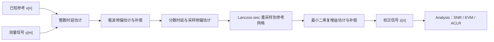
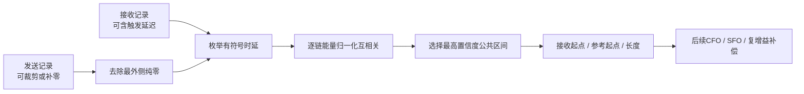
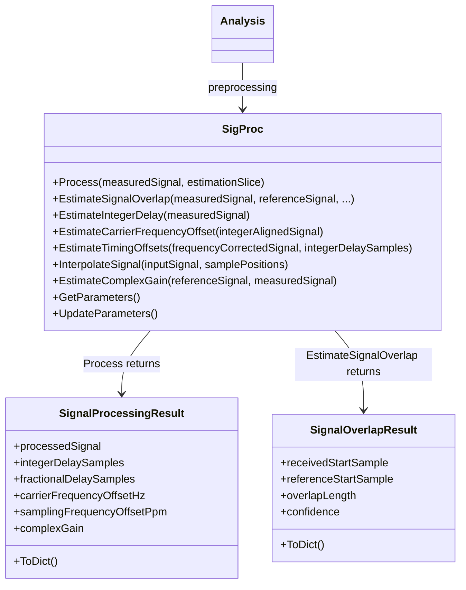
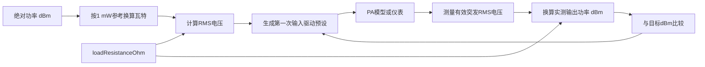
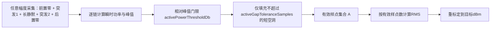
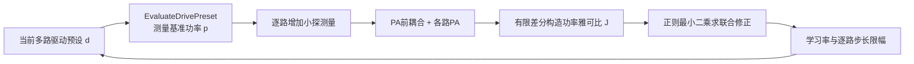

# 信号同步、补偿与功率标定的物理原理和推导

本文对应 `inc/utils/SigProc.py`。该模块位于“测量/仿真输出”和“性能指标计算”之间，专门处理整数时延、分数时延、载波频偏、采样频偏、公共复增益和 dBm/RMS 功率标定。`Analysis` 只消费校正后的信号并计算 SNR、EVM、ACLR，避免把同步误差错误地解释为 PA 非线性。

---

## 1. 统一信号模型

设理想离散复基带参考为 $x[n]$，测量设备得到 $y[m]$。一个便于理解的模型是：

```math
y[m]
=g\,x\!\left(
\frac{m-d_{\mathrm{int}}-d_{\mathrm{frac}}}{1+\epsilon}
\right)
\exp\!\left(j2\pi\frac{\Delta f}{F_s}m\right)
+v[m].
```

其中：

- $d_{\mathrm{int}}$：整数时延，单位为样点；
- $d_{\mathrm{frac}}$：分数时延，规范化到 $[-0.5,0.5)$ 样点；
- $\Delta f$：载波频偏，单位 Hz；
- $F_s$：标称复采样率；
- $\epsilon$：采样率相对误差；
- $g$：固定复增益，包含幅度缩放和公共相位旋转；
- $v[m]$：噪声、PA 非线性以及模型未覆盖的残差。

采样频偏通常用 ppm 表示：

```math
\epsilon_{\mathrm{ppm}}=10^6\epsilon.
```

这里的目标不是把 $v[m]$ 也消除，而是只消除不应计入 PA/DPD 性能的确定性同步误差。

当波形来自 `Channel(sampleMode="fb")` 时，$v[m]$ 还可能包含板载反馈接收机的频率选择性响应、I/Q镜像、DC、三阶非线性、限幅和ADC量化。SigProc可以估计整数/分数时延、CFO、SFO和单一公共复增益，但不会假装能够用一个标量消除所有反馈链非理想：

- 反馈FIR需要额外的频率响应校准或均衡；
- I/Q不平衡包含共轭镜像项，需要广义线性校准；
- 接收机非线性、限幅和ADC量化通常不可由同步恢复；
- 因此板载fb波形适合ILC反馈或反馈链诊断，最终PA性能仍应由独立forward仪表波形评价。

---

## 2. 处理工作流



**图 1 说明：**整数时延先给出粗对齐；载波频偏补偿避免随时间旋转的相位破坏局部相关；随后从多个时间窗口的相关峰位置估计固定分数时延和随时间累积的采样偏差；重采样后再估计公共复增益。三个性能指标使用同一份 $z[n]$，因此比较条件完全一致。

---

## 3. 整数时延估计

### 3.1 互相关

对候选时延 $d$，定义复互相关：

```math
R_{yx}[d]
=\sum_{n\in\Omega_d}y[n+d]x^*[n],
```

$\Omega_d$ 是参考与测量在该时延下的重叠区间。若 $y$ 是延迟后的 $x$，正确的 $d$ 会让两者相位和波形最一致，$|R_{yx}[d]|$ 最大。

直接求和的复杂度接近 $O(ND)$。代码利用“相关等于一个信号和另一个信号共轭反转后的卷积”，通过 FFT 计算完整线性相关，复杂度约为：

```math
O(N\log N).
```

### 3.2 能量归一化

不同候选时延的重叠长度不同，所以不能直接比较相关幅度。代码使用归一化分数：

```math
\rho[d]
=\frac{|R_{yx}[d]|}
{\sqrt{
\left(\sum_{n\in\Omega_d}|x[n]|^2\right)
\left(\sum_{n\in\Omega_d}|y[n+d]|^2\right)
}}.
```

最终整数时延为：

```math
\hat d_{\mathrm{int}}
=\arg\max_{|d|\le d_{\max}}\rho[d].
```

正时延表示测量信号比参考晚到；校正时参考样点 $n$ 从测量位置 $n+\hat d_{\mathrm{int}}$ 读取。

---

### 3.3 不等长发送与接收波形的公共区间估计

`SigProc.EstimateSignalOverlap` 用于已知发送样值的辅助分析。它解决的问题不是“恢复Wi-Fi参数”，而是“两个可能被裁剪或补零的记录中，哪两段样值来自同一物理时间区间”。因此该函数不读取Descriptor、seed、MCS、GI或Data，也不调用波形生成器。

设发送参考为 $x_m[n]$，接收记录为 $y_m[n]$，其中 $m$ 表示物理链。候选有符号时延为 $d$。当 $d\geq0$ 时，接收记录在发送参考之后开始；当 $d<0$ 时，接收记录从发送参考内部开始，说明发送参考的前部已被裁剪。每个候选的起点为：

```math
n_y(d)=\max(0,d),
```

```math
n_x(d)=\max(0,-d).
```

对应公共长度为：

```math
L(d)=\min
\left(
N_y-n_y(d),
N_x-n_x(d)
\right).
```

算法先删除发送参考最外侧的纯零填充，再在允许的有符号时延范围内枚举候选。第 $m$ 条链的归一化相关功率为：

```math
C_m(d)=
\frac{
\left|
\sum_{k=0}^{L_p-1}
x_m^*[n_x(d)+k]y_m[n_y(d)+k]
\right|^2
}{
\left(
\sum_{k=0}^{L_p-1}|x_m[n_x(d)+k]|^2
\right)
\left(
\sum_{k=0}^{L_p-1}|y_m[n_y(d)+k]|^2
\right)
},
```

其中 $L_p$ 不超过 `maximumProbeLength`。多链得分采用算术平均：

```math
C(d)=
\frac{1}{M}
\sum_{m=0}^{M-1}C_m(d).
```

返回置信度为：

```math
\rho(d)=\sqrt{C(d)}.
```

由于分子和分母具有相同的幅度平方量纲，公共复增益和每链固定功率缩放不会改变理想情况下的相关置信度。若多个候选得分相同，算法依次偏好更长公共区间和更早的接收起点。结果保存为 `SignalOverlapResult`：

| 字段 | 含义 |
|---|---|
| `receivedStartSample` | 接收记录公共区间的首样点 |
| `referenceStartSample` | 发送参考公共区间的首样点 |
| `overlapLength` | 两路可直接对应的样点数 |
| `confidence` | 0到1的归一化相关幅度 |

```python
from inc.utils.SigProc import SigProc

overlap = SigProc.EstimateSignalOverlap(
    measuredSignal=receivedSignal,
    referenceSignal=transmitSignal,
    maximumMeasuredOffsetSamples=2000,
    maximumProbeLength=32768,
    minimumConfidence=0.12,
)

referenceOverlap = transmitSignal[
    overlap.referenceStartSample:
    overlap.referenceStartSample + overlap.overlapLength
]
receivedOverlap = receivedSignal[
    overlap.receivedStartSample:
    overlap.receivedStartSample + overlap.overlapLength
]
print(overlap.ToDict())
```

**图示说明：**



该图强调公共区间估计只决定“比较哪两段样值”。CFO、分数时延、SFO和公共复增益仍由后续 `SigProc.Process` 估计与补偿；重叠估计不能替代完整同步。

## 4. 载波频偏估计与补偿

### 4.1 为什么使用分块复增益相位

如果只有载波频偏和固定增益，则局部窗口内的最小二乘复增益近似为：

```math
g_b\approx g\exp\!\left(
j2\pi\frac{\Delta f}{F_s}n_b
\right),
```

$n_b$ 是第 $b$ 个窗口的中心样点。于是窗口增益相位满足近似直线：

```math
\phi_b=\mathrm{unwrap}(\angle g_b)
\approx\phi_0+\omega n_b,
```

其中：

```math
\omega=2\pi\frac{\Delta f}{F_s}.
```

每个窗口的复增益由下式得到：

```math
\hat g_b
=\frac{\mathbf x_b^H\mathbf y_b}
{\mathbf x_b^H\mathbf x_b}.
```

对解缠后的 $\angle\hat g_b$ 做加权直线拟合，获得斜率 $\hat\omega$：

```math
\widehat{\Delta f}
=\frac{F_s}{2\pi}\hat\omega.
```

使用分块平均而不是相邻单样点相位差，可以抑制 PA 记忆和非线性引起的快速相位扰动，降低把 PA 失真误判成 CFO 的风险。

### 4.2 补偿

测量索引为 $m$ 时，CFO 补偿为：

```math
y_c[m]
=y[m]\exp\!\left(
-j2\pi\frac{\widehat{\Delta f}}{F_s}m
\right).
```

---

## 5. 分数时延估计

整数对齐后，真实相关峰通常位于两个离散样点之间。若整数峰位于 $k$，相邻三个归一化相关幅度分别为 $p_{-1}$、$p_0$、$p_{+1}$，用抛物线顶点近似分数偏移：

```math
\delta
=\frac{1}{2}
\frac{p_{-1}-p_{+1}}
{p_{-1}-2p_0+p_{+1}}.
```

代码将 $\delta$ 限制在 $[-0.5,0.5]$，防止低信噪比或平坦相关峰产生不合理外推。

仅使用整帧一个相关峰无法区分“固定分数时延”和“随时间逐渐增加的采样误差”，因此代码在多个时间窗口分别得到局部时延。

---

## 6. 采样频偏估计

如果测量设备的采样率与标称采样率略有差异，局部时延会随参考样点位置近似线性变化：

```math
d(n)=d_0+\epsilon n.
```

对多个窗口得到的 $(n_b,d_b)$ 做加权直线拟合：

```math
\hat d_b=\hat d_0+\hat\epsilon n_b.
```

其中截距 $\hat d_0$ 是分数时延，斜率换算为 ppm：

```math
\widehat{\epsilon}_{\mathrm{ppm}}
=10^6\hat\epsilon.
```

直观理解：40 ppm 表示每一百万个参考样点，测量网格会累计约 40 个样点的相对漂移。

---

## 7. 重采样与分数时延补偿

校正后的第 $n$ 个输出应从测量信号的浮点位置读取：

```math
m(n)
=\hat d_{\mathrm{int}}
+\hat d_{\mathrm{frac}}
+n\left(1+\frac{\widehat{\epsilon}_{\mathrm{ppm}}}{10^6}\right).
```

由于 $m(n)$ 通常不是整数，需要插值。代码使用有限长度 Lanczos-sinc 核：

```math
h(t)
=\mathrm{sinc}(t)
\mathrm{sinc}\!\left(\frac{t}{L}\right),
\qquad |t|<L.
```

插值输出为：

```math
z_0[n]
=\frac{
\sum_k y_c[k]h(m(n)-k)
}{
\sum_k h(m(n)-k)
}.
```

有限支持 $L$ 控制计算量和精度。过采样 Wi-Fi 信号的有效带宽低于 Nyquist 边缘，sinc 类插值通常明显优于简单线性插值。

---

## 8. 公共复增益估计与补偿

重采样完成后，在指定估计区间内寻找使 $g\mathbf x$ 最接近 $\mathbf z_0$ 的复数：

```math
\hat g
=\arg\min_g\|\mathbf z_0-g\mathbf x\|_2^2.
```

Wirtinger 求导得到：

```math
\boxed{
\hat g
=\frac{\mathbf x^H\mathbf z_0}
{\mathbf x^H\mathbf x}
}
```

最终补偿信号是：

```math
z[n]=\frac{z_0[n]}{\hat g}.
```

`Analysis` 默认把 Wi-Fi 数据字段作为复增益估计区间，使性能评价关注非线性形状误差，而不是测试链路的固定幅相标定差。

---

## 9. 类结构和结果



**图 2 说明：**`SigProc` 持有参考信号、采样率和估计配置；`Process` 返回不可变的 `SignalProcessingResult`。静态公共区间估计返回不可变的 `SignalOverlapResult`，因此Analysis和ParseWifi可以复用同一相关算法。样点数组用于后续指标计算，两个结果类的 `ToDict()` 都只输出适合 JSON/CSV 记录的标量。

---

## 10. 可配置参数

所有默认值都定义在 `SigProc.__init__` 内部，调用方只传需要覆盖的键。未知键通过 `UserWarning` 报告后被忽略，信号处理继续使用其余已识别配置；已识别配置如果类型、单位或范围非法，仍会抛出异常。

| 参数 | 默认值 | 物理含义 |
|---|---:|---|
| `enableIntegerDelayCompensation` | `True` | 是否估计并补偿粗整数时延 |
| `enableFractionalDelayCompensation` | `True` | 是否估计并补偿亚样点时延 |
| `enableCarrierFrequencyOffsetCompensation` | `True` | 是否估计并补偿 CFO |
| `enableSamplingFrequencyOffsetCompensation` | `True` | 是否估计并补偿采样频偏 |
| `enableComplexGainCompensation` | `True` | 是否估计并除去公共复增益 |
| `maxIntegerDelaySamples` | `None` | 整数时延搜索半径；`None` 自动选择 |
| `maxCarrierFrequencyOffsetHz` | `None` | CFO 限幅；`None` 使用内部安全范围 |
| `maxSamplingFrequencyOffsetPpm` | `200.0` | 允许的采样频偏绝对值上限 |
| `timingWindowCount` | `9` | 时变延迟拟合使用的窗口数 |
| `timingWindowLength` | `2048` | 每个相关/CFO 窗口的样点数 |
| `interpolationHalfLength` | `12` | Lanczos-sinc 插值单侧支持长度 |

---

## 11. 典型调用

直接使用工具类：

```python
from inc.utils.SigProc import SigProc

signalProcessor = SigProc(
    referenceSignal,
    sampleRateHz,
    parameters={
        "maxIntegerDelaySamples": 256,
        "maxCarrierFrequencyOffsetHz": 200000.0,
        "maxSamplingFrequencyOffsetPpm": 100.0,
    },
)
processingResult = signalProcessor.Process(measuredSignal)
correctedSignal = processingResult.processedSignal
print(processingResult.ToDict())
```

通过 `Analysis` 自动调用：

```python
from inc.lib.Analysis import Analysis

resultAnalysis = Analysis(
    referenceSignal,
    wifiWaveform,
    signalProcessingParameters={
        "maxIntegerDelaySamples": 256,
        "maxSamplingFrequencyOffsetPpm": 100.0,
    },
)
metrics = resultAnalysis.Analyze(measuredSignal)
processingResult = resultAnalysis.GetLastSignalProcessingResult()
```

---

## 12. 使用边界

1. 估计是数据辅助的，要求参考信号与测量信号来自同一帧；未知载荷的接收机同步需要使用标准前导结构。
2. 默认整数时延自动搜索有 4096 样点上限；更长线缆、缓存或仪器触发延迟需要显式增大 `maxIntegerDelaySamples`。
3. CFO 相位解缠要求相邻估计窗口之间的相位变化不过度模糊；极大 CFO 应先使用前导重复结构做粗频偏估计。
4. 单一线性采样频偏模型不描述采样时钟抖动或随时间变化的非线性漂移。
5. 公共复增益只消除统一幅相误差，不等于频率选择性信道均衡；真实 OTA MIMO 测量仍需要信道估计和均衡。
6. 对 `sampleMode="fb"` 的Channel波形，同步可以补偿配置的时延、CFO、SFO和一部分公共增益/相位，但不能自动校正反馈FIR、I/Q镜像、三阶失真、限幅或ADC量化；这些残差应与forward仪表结果分开解释。
6. 插值会改变记录边缘；测量采集应在帧前后保留足够保护样点，避免时延补偿后丢失有效数据。

---

## 13. PA输出dBm、输出回退与复包络标定

`PowerCalibration` 与同步类放在同一个 `SigProc.py` 中，但职责彼此独立。它负责dBm/RMS换算、根据额定输出功率产生第一次输入驱动预设，并闭环调整PA输入；PA非线性仍由绑定的PA模型或仪表实现。它不会在PA输出端乘常数增益来伪造目标功率。普通业务代码不需要主动构造该类；推荐通过 `Channel.Process(rawSignal, outputPowerDbm=...)` 使用，Channel在内部组合本工具。

工程约定复包络 RMS 幅度等于纯电阻端口上的 RF RMS 电压。设端口电阻为 $R$，RMS 电压为 $V_{\mathrm{RMS}}$，则端口平均功率为

```math
P_{\mathrm{W}}
=\frac{V_{\mathrm{RMS}}^2}{R}.
```

dBm 使用 1 mW 作为参考：

```math
P_{\mathrm{dBm}}
=10\log_{10}\left(
\frac{P_{\mathrm{W}}}{10^{-3}}
\right).
```

因此从 dBm 到 RMS 电压的换算为

```math
V_{\mathrm{RMS}}
=\sqrt{
R\,10^{-3}10^{P_{\mathrm{dBm}}/10}
}.
```

反向换算为

```math
P_{\mathrm{dBm}}
=10\log_{10}\left(
\frac{V_{\mathrm{RMS}}^2}{R\,10^{-3}}
\right).
```



**图 3 说明：**`PowerCalibration` 为Channel、主程序、`Analysis` 和 Benchmark 提供同一个端口阻抗基准。箭头回路表示每次都重新生成PA输入并重新观测实际PA输出，而不是对已有输出做离线缩放。业务用户只看见Channel的“原始波形+目标dBm”接口；该工具位于 `SigProc.py` 后，`Analysis` 不再需要为了功率换算而导入 `PaModel.py`。其 `ChainMap` 参数同样遵循“未知键警告并忽略、已识别非法值继续报错”的规则。

默认每路PA极限输出功率为

```math
P_{\max}=25\ \mathrm{dBm}.
```

目标输出 $P_{\mathrm{out}}$ 对应的输出回退与归一化驱动为

```math
\mathrm{OBO}=P_{\max}-P_{\mathrm{out}},
```

```math
a=10^{-\mathrm{OBO}/20}.
```

默认20 dBm工作点对应5 dB名义回退和 $a\approx0.5623$。这个数只作为闭环第一次试探的驱动预设，不能假定经过非线性PA后一定正好得到20 dBm。

`Calibrate(inputSignal)` 是底层校准器的统一入口。Channel内部构造 `PowerCalibration`、绑定具有 `Process(inputSignal)` 接口的PA模型或仪表适配器，并把调用 `Channel.Process` 时给出的目标功率写入该工具。函数内部重复执行“生成PA输入—实际激励PA—测量有效突发功率—更新隐藏预设”，直到每一路误差均不超过 `calibrationToleranceDb`。普通用户只传原始波形与目标dBm，不需要感知该调用或读写每轮驱动预设。

闭环返回的是最终PA输入波形；`GetLastPaOutput()` 返回收敛判定所使用的最后一次PA实测输出。代码不会在PA后把输出乘常数来伪造目标dBm，因此AM-AM压缩、AM-PM、EVM和ACLR均对应真实驱动工作点。`outputPowerDbmPerChain` 不为 `None` 时逐列独立闭环，否则所有链使用共同的 `outputPowerDbm`。

### 13.1 有效信号区间与占空比

不能直接使用整个采集记录的样点数作为RMS分母。假设真正的Wi-Fi突发只有 $N_{\mathrm{on}}$ 个样点，但采集前后带有 $N_{\mathrm{off}}$ 个零样点，则整段RMS为

```math
A_{\mathrm{capture}}
=
\sqrt{
\frac{
\sum_{n\in\mathcal A}|x[n]|^2
}{
N_{\mathrm{on}}+N_{\mathrm{off}}
}
}.
```

它比突发有效区RMS

```math
A_{\mathrm{active}}
=
\sqrt{
\frac{
\sum_{n\in\mathcal A}|x[n]|^2
}{
N_{\mathrm{on}}
}
}
```

低

```math
\Delta P
=
10\log_{10}
\left(
\frac{N_{\mathrm{on}}}
{N_{\mathrm{on}}+N_{\mathrm{off}}}
\right)
\ \mathrm{dB}.
```

例如占空比为 $D=N_{\mathrm{on}}/(N_{\mathrm{on}}+N_{\mathrm{off}})=0.5$ 时，整段平均功率比有效突发功率低约3.01 dB。这两个数都可能有物理意义，但本工程的PA工作点和Wi-Fi EVM需要使用“突发开启期间的平均功率”，因此校准和Analysis均采用 $A_{\mathrm{active}}$。

第 $m$ 路的瞬时功率和峰值为

```math
p_m[n]=|x_m[n]|^2,
\qquad
p_{m,\max}=\max_n p_m[n].
```

以 `activePowerThresholdDb` 为相对峰值门限，初始有效掩码定义为

```math
M_m[n]
=
1,
\qquad
p_m[n]>
p_{m,\max}10^{T_{\mathrm{active}}/10}.
```

未超过门限时：

```math
M_m[n]
=
0,
\qquad
p_m[n]\le
p_{m,\max}10^{T_{\mathrm{active}}/10}.
```

默认 $T_{\mathrm{active}}=-60\ \mathrm{dB}$。OFDM样值会正常穿过零点，因此不能把每一个低幅样点都视为关断。`activeGapToleranceSamples=16` 会填充长度不超过16个样点的内部空洞；前置补零、后置补零以及更长的内部静默区仍保持无效。每一路MIMO信号独立建立掩码。

真实仪表捕获的静默区可能含有噪声而不是精确零。如果静默噪声高于默认峰值下60 dB门限，应把 `activePowerThresholdDb` 调高到略高于静默噪声底，例如 `-40.0`；门限仍必须低于有效Wi-Fi突发的正常包络。门限过低会把噪声占空区计入，门限过高则会删掉真实低包络样点。



**图 4 说明：**短空洞通常是OFDM过零或瞬时低包络，仍属于有效突发；长空洞表示占空比关断，不进入功率分母。缩放仍作用于整条波形，所以原来的零样点继续为零，时间位置和占空比均不改变。

### 13.2 PA闭环输入功率校准

输入波形不需要事先归一化。对第 $m$ 路原始波形 $x_m[n]$，先按有效集合 $\mathcal A_m$ 计算

```math
A_{x,m}
=
\sqrt{
\frac{
\sum_n M_m[n]|x_m[n]|^2
}{
\sum_n M_m[n]
}
}.
```

保持波形形状不变的单位有效RMS波形为

```math
\bar{x}_m[n]
=
\frac{x_m[n]}{A_{x,m}}.
```

第 $k$ 次试探使用隐藏驱动预设 $d_m^{(k)}$，单位为dB：

```math
u_m^{(k)}[n]
=
10^{d_m^{(k)}/20}\bar{x}_m[n].
```

把 $u_m^{(k)}[n]$ 真正送入PA或仪表适配器，得到

```math
y_m^{(k)}[n]
=
\mathcal{P}_m\left\{
u_m^{(k)}[n]
\right\}.
```

仅在输出有效集合上计算RMS，并映射为实测功率：

```math
A_{y,m}^{(k)}
=
\sqrt{
\frac{
\sum_n M_{y,m}^{(k)}[n]
\left|y_m^{(k)}[n]\right|^2
}{
\sum_n M_{y,m}^{(k)}[n]
}
},
```

```math
P_{m,\mathrm{meas}}^{(k)}
=
P_{\max}
+20\log_{10}
\left(
A_{y,m}^{(k)}
\right).
```

功率误差定义为

```math
e_m^{(k)}
=
P_{m,\mathrm{target}}
-P_{m,\mathrm{meas}}^{(k)}.
```

尚未在目标两侧获得试探点时，采用有界比例更新：

```math
d_m^{(k+1)}
=
d_m^{(k)}
+\mathrm{clip}
\left(
\mu e_m^{(k)},
-\Delta_{\max},
\Delta_{\max}
\right).
```

上式中的 `clip` 表示把修正量限制在正负 `maximumDriveAdjustmentDb` 之间。默认 $\mu=0.8$、$\Delta_{\max}=6$ dB。

一旦已知一个“输出偏低”的下界 $d_{m,L}$ 和一个“输出偏高”的上界 $d_{m,U}$，后续改用二分：

```math
d_m^{(k+1)}
=
\frac{
d_{m,L}+d_{m,U}
}{2}.
```

收敛条件是所有PA链同时满足

```math
\left|
e_m^{(k)}
\right|
\leq
\epsilon_P,
```

其中默认 $\epsilon_P=0.25$ dB，最多试探60次；用户可按仪表重复性和目标精度收紧容限。收敛后的 $d_m$ 保存在类内部并作为下一次同目标校准的初值，但 `GetLastCalibrationMetrics()` 只返回目标、实测功率、残差和迭代次数，不把隐藏预设暴露给用户。若PA饱和、定点满量程或仪表限幅导致目标不可达，函数在达到迭代上限后明确报错，而不是对PA输出做后级缩放。

该闭环假设目标附近的有效突发平均输出功率随输入驱动单调不减，这对正常AM-AM曲线成立。若真实仪表反馈噪声大于功率容限，应先增加仪表平均次数或放宽 `calibrationToleranceDb`；若PA存在热记忆或迟滞，应保证每轮测量使用相同等待时间和采集条件，否则二分上下界可能不再代表同一静态映射。

#### 13.2.1 PA前耦合下的联合功率校准

逐链二分隐含“第 $j$ 路驱动只改变第 $j$ 路PA功率”的假设。PA前存在串扰时，第 $j$ 路数字驱动会同时进入多路PA，因此全部PA输出功率应写成驱动向量的联合函数：

```math
\mathbf p
=
\mathbf F(\mathbf d),
```

其中

```math
\mathbf d
=
\begin{bmatrix}
d_0 & d_1 & \cdots & d_{M-1}
\end{bmatrix}^{T}
```

是各路隐藏驱动预设，$\mathbf p$ 是在PA后耦合和接收噪声之前测得的逐PA有效突发功率。若仍独立修正，每一路控制器会把其他路引起的功率变化误认为本路误差，可能出现来回振荡或收敛到错误工作点。

联合模式用小的dB探测步长 $\delta$ 对每一路驱动做有限差分，建立局部功率雅可比矩阵：

```math
J_{i,j}
\approx
\frac{
F_i(\mathbf d+\delta\mathbf e_j)-F_i(\mathbf d)
}{
\delta
}.
```

$J_{i,j}$ 表示第 $j$ 路驱动增加1 dB时，第 $i$ 个PA输出功率大约变化多少dB。对目标误差

```math
\mathbf e
=
\mathbf p_{\mathrm{target}}-\mathbf p
```

采用带正则的最小二乘修正：

```math
\Delta\mathbf d
=
\left(
\mathbf J^{H}\mathbf J+\lambda\mathbf I
\right)^{-1}
\mathbf J^{H}\mathbf e.
```

代码中的功率雅可比为实矩阵，式中的共轭转置等价于普通转置。$\lambda$ 防止强耦合导致矩阵接近奇异；随后仍按 `maximumDriveAdjustmentDb` 对每个分量限幅，并乘 `calibrationLearningRate`，避免一次线性化跨越过大的非线性区间。



**图 5 说明：**每个探测点都重新生成PA输入并真实调用绑定plant。Channel提供的校准plant只包含PA前耦合和各路PA，因此目标功率定义为每个PA自身的输出功率；PA后耦合、forward/fb接收链与噪声不进入闭环。这样不会让接收端串扰或随机噪声改变PA工作点。

相关参数为：

| 参数 | 默认值 | 含义 |
|---|---:|---|
| `enableJointCalibration` | `False` | 启用有限差分雅可比联合更新；Channel检测到PA前耦合时默认自动启用 |
| `calibrationProbeStepDb` | `0.05` | 构造雅可比时单路驱动的dB探测步长 |
| `calibrationRegularization` | `1e-6` | 联合最小二乘的对角正则系数 |
| `calibrationLearningRate` | `0.8` | 联合修正与独立比例修正共用的更新学习率 |
| `maximumDriveAdjustmentDb` | `6.0` | 每轮每路允许的最大dB修正量 |

`EvaluateDrivePreset(normalizedInput, driveDb, inputWasVector, interfaceFormat)` 是内部统一观测入口。它按给定驱动向量产生公开位宽PA输入，调用一次绑定plant，返回本次PA输入、PA输出和逐路实测dBm。普通用户仍只调用 `Channel.Process(rawSignal, outputPowerDbm=...)`，不需要直接构造雅可比或管理驱动向量。

### 13.3 定点接口

`width=0` 时输入输出均为浮点复包络。`width>0` 时输入和输出均为公开整数I/Q码，容器类型仍为 `numpy.complex128`。闭环每一轮先把隐藏驱动预设作用于内部浮点波形，再编码为整数码送入PA；PA返回的整数码重新解码后才计算实测功率。因此量化、DAC满量程和削顶都真实进入反馈结果。若定点接口无法达到目标功率，闭环会在迭代上限后报错。

兼容接口 `CalibrateWaveformToOutputPower` 不经过PA闭环。它的定点取整使“缩放后再量化”的RMS成为分段常数函数，底层 `CalibrateFixedColumn` 因此使用二分搜索寻找量化前比例 $c$：

```math
\widehat c
=
\arg\min_{c\geq0}
\left|
\sqrt{
\frac{
\sum_n M[n]
\left|
Q_w(c\,x[n])
\right|^2
}{
\sum_n M[n]
}
}
-A_{\mathrm{target}}
\right|.
```

其中 $Q_w$ 表示按位宽 $w$ 取整、饱和并重新解码的算子。实现要求量化后的功率误差不大于0.01 dB；目标不可达到时抛出异常，使用码值边界时发出削顶警告。

### 13.4 归一化满量程与物理电压两种接口

`Calibrate` 是本工程设置PA工作点的闭环接口：它绑定PA，调整PA输入，并用PA实测输出判断收敛。归一化输出有效区RMS等于1对应 `maximumOutputPowerDbm`。

`CalibrateWaveformToOutputPower` 和 `CalibrateWaveformToOutputPowers` 仅作为兼容性数值接口保留。它们直接把给定数组缩放到目标归一化RMS，不调用PA，也不能用于验证真实AM-AM压缩点。主程序、`SmallestSISO.py`、Benchmark和功率-EVM扫描均不再使用这两个接口。

`ScaleSignalToOutputPower` 和 `ScaleSignalToOutputPowers` 用于已经采用物理伏特单位的复包络：它们按端口阻抗把目标dBm转换为RMS电压。两组接口都使用相同的有效区掩码，但不能混淆数值尺度。

50 Ω 端口上，0 dBm 等于 1 mW，对应

```math
V_{\mathrm{RMS}}
=\sqrt{50\times10^{-3}}
\approx0.223607\ \mathrm{V}.
```

归一化公开波形的典型调用：

```python
import numpy as np

from inc.utils.FixedPoint import FixedPoint
from inc.utils.SigProc import PowerCalibration

powerCalibration = PowerCalibration(
    paModel=paModel,
    parameters={
        "loadResistanceOhm": 50.0,
        "maximumOutputPowerDbm": 25.0,
        "outputPowerDbm": 20.0,
        "activePowerThresholdDb": -60.0,
        "activeGapToleranceSamples": 16,
        "width": 16,
    },
)
paInput = powerCalibration.Calibrate(waveform.samples)
paOutput = powerCalibration.GetLastPaOutput()
calibrationMetrics = powerCalibration.GetLastCalibrationMetrics()
decodedOutput = FixedPoint(16).DecodeComplex(paOutput)
measuredRms = powerCalibration.CalculateActiveRmsPerChain(
    decodedOutput
)[0]
measuredPowerDbm = (
    powerCalibration.NormalizedRmsToOutputPowerDbm(measuredRms)
)
```

MIMO只需把类内目标改为逐链序列，函数调用不变：

```python
powerCalibration.UpdateParameters(
    outputPowerDbmPerChain=(22.0, 21.0, 20.0, 19.0)
)
calibratedMimoInput = powerCalibration.Calibrate(rawMimoInput)
measuredMimoOutput = powerCalibration.GetLastPaOutput()
```

如果输入是物理电压，则改用：

```python
physicalOutput = powerCalibration.ScaleSignalToOutputPower(
    voltageWaveform,
    outputPowerDbm=20.0,
)
activeVoltageRms = powerCalibration.CalculateActiveRmsPerChain(
    physicalOutput
)[0]
measuredPowerDbm = powerCalibration.RmsToDbm(activeVoltageRms)
```
