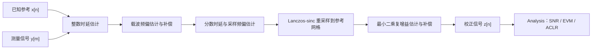
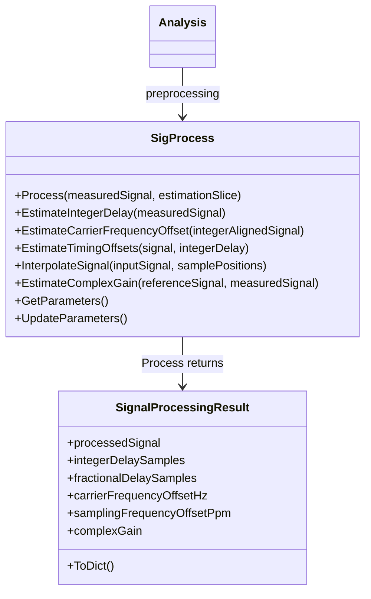

# 信号同步与补偿的物理原理和推导

本文对应 `inc/SigProcess.py`。该模块位于“测量/仿真输出”和“性能指标计算”之间，专门处理整数时延、分数时延、载波频偏、采样频偏和公共复增益。`Analysis` 只消费校正后的信号并计算 SNR、EVM、ACLR，避免把同步误差错误地解释为 PA 非线性。

---

## 1. 统一信号模型

设理想离散复基带参考为 $x[n]$，测量设备得到 $y[m]$。一个便于理解的模型是：

```math
y[m]
=g\,x\!\left(
\frac{m-d_{\mathrm{int}}-d_{\mathrm{frac}}}{1+\epsilon}
\right)
\exp\!\left(j2\pi\frac{\Delta f}{F_s}m\right)
+v[m].
```

其中：

- $d_{\mathrm{int}}$：整数时延，单位为样点；
- $d_{\mathrm{frac}}$：分数时延，规范化到 $[-0.5,0.5)$ 样点；
- $\Delta f$：载波频偏，单位 Hz；
- $F_s$：标称复采样率；
- $\epsilon$：采样率相对误差；
- $g$：固定复增益，包含幅度缩放和公共相位旋转；
- $v[m]$：噪声、PA 非线性以及模型未覆盖的残差。

采样频偏通常用 ppm 表示：

```math
\epsilon_{\mathrm{ppm}}=10^6\epsilon.
```

这里的目标不是把 $v[m]$ 也消除，而是只消除不应计入 PA/DPD 性能的确定性同步误差。

---

## 2. 处理工作流



**图 1 说明：**整数时延先给出粗对齐；载波频偏补偿避免随时间旋转的相位破坏局部相关；随后从多个时间窗口的相关峰位置估计固定分数时延和随时间累积的采样偏差；重采样后再估计公共复增益。三个性能指标使用同一份 $z[n]$，因此比较条件完全一致。

---

## 3. 整数时延估计

### 3.1 互相关

对候选时延 $d$，定义复互相关：

```math
R_{yx}[d]
=\sum_{n\in\Omega_d}y[n+d]x^*[n],
```

$\Omega_d$ 是参考与测量在该时延下的重叠区间。若 $y$ 是延迟后的 $x$，正确的 $d$ 会让两者相位和波形最一致，$|R_{yx}[d]|$ 最大。

直接求和的复杂度接近 $O(ND)$。代码利用“相关等于一个信号和另一个信号共轭反转后的卷积”，通过 FFT 计算完整线性相关，复杂度约为：

```math
O(N\log N).
```

### 3.2 能量归一化

不同候选时延的重叠长度不同，所以不能直接比较相关幅度。代码使用归一化分数：

```math
\rho[d]
=\frac{|R_{yx}[d]|}
{\sqrt{
\left(\sum_{n\in\Omega_d}|x[n]|^2\right)
\left(\sum_{n\in\Omega_d}|y[n+d]|^2\right)
}}.
```

最终整数时延为：

```math
\hat d_{\mathrm{int}}
=\arg\max_{|d|\le d_{\max}}\rho[d].
```

正时延表示测量信号比参考晚到；校正时参考样点 $n$ 从测量位置 $n+\hat d_{\mathrm{int}}$ 读取。

---

## 4. 载波频偏估计与补偿

### 4.1 为什么使用分块复增益相位

如果只有载波频偏和固定增益，则局部窗口内的最小二乘复增益近似为：

```math
g_b\approx g\exp\!\left(
j2\pi\frac{\Delta f}{F_s}n_b
\right),
```

$n_b$ 是第 $b$ 个窗口的中心样点。于是窗口增益相位满足近似直线：

```math
\phi_b=\operatorname{unwrap}(\angle g_b)
\approx\phi_0+\omega n_b,
```

其中：

```math
\omega=2\pi\frac{\Delta f}{F_s}.
```

每个窗口的复增益由下式得到：

```math
\hat g_b
=\frac{\mathbf x_b^H\mathbf y_b}
{\mathbf x_b^H\mathbf x_b}.
```

对解缠后的 $\angle\hat g_b$ 做加权直线拟合，获得斜率 $\hat\omega$：

```math
\widehat{\Delta f}
=\frac{F_s}{2\pi}\hat\omega.
```

使用分块平均而不是相邻单样点相位差，可以抑制 PA 记忆和非线性引起的快速相位扰动，降低把 PA 失真误判成 CFO 的风险。

### 4.2 补偿

测量索引为 $m$ 时，CFO 补偿为：

```math
y_c[m]
=y[m]\exp\!\left(
-j2\pi\frac{\widehat{\Delta f}}{F_s}m
\right).
```

---

## 5. 分数时延估计

整数对齐后，真实相关峰通常位于两个离散样点之间。若整数峰位于 $k$，相邻三个归一化相关幅度分别为 $p_{-1}$、$p_0$、$p_{+1}$，用抛物线顶点近似分数偏移：

```math
\delta
=\frac{1}{2}
\frac{p_{-1}-p_{+1}}
{p_{-1}-2p_0+p_{+1}}.
```

代码将 $\delta$ 限制在 $[-0.5,0.5]$，防止低信噪比或平坦相关峰产生不合理外推。

仅使用整帧一个相关峰无法区分“固定分数时延”和“随时间逐渐增加的采样误差”，因此代码在多个时间窗口分别得到局部时延。

---

## 6. 采样频偏估计

如果测量设备的采样率与标称采样率略有差异，局部时延会随参考样点位置近似线性变化：

```math
d(n)=d_0+\epsilon n.
```

对多个窗口得到的 $(n_b,d_b)$ 做加权直线拟合：

```math
\hat d_b=\hat d_0+\hat\epsilon n_b.
```

其中截距 $\hat d_0$ 是分数时延，斜率换算为 ppm：

```math
\widehat{\epsilon}_{\mathrm{ppm}}
=10^6\hat\epsilon.
```

直观理解：40 ppm 表示每一百万个参考样点，测量网格会累计约 40 个样点的相对漂移。

---

## 7. 重采样与分数时延补偿

校正后的第 $n$ 个输出应从测量信号的浮点位置读取：

```math
m(n)
=\hat d_{\mathrm{int}}
+\hat d_{\mathrm{frac}}
+n\left(1+rac{\widehat{\epsilon}_{\mathrm{ppm}}}{10^6}\right).
```

由于 $m(n)$ 通常不是整数，需要插值。代码使用有限长度 Lanczos-sinc 核：

```math
h(t)
=\operatorname{sinc}(t)
\operatorname{sinc}\!\left(\frac{t}{L}\right),
\qquad |t|<L.
```

插值输出为：

```math
z_0[n]
=\frac{
\sum_k y_c[k]h(m(n)-k)
}{
\sum_k h(m(n)-k)
}.
```

有限支持 $L$ 控制计算量和精度。过采样 Wi-Fi 信号的有效带宽低于 Nyquist 边缘，sinc 类插值通常明显优于简单线性插值。

---

## 8. 公共复增益估计与补偿

重采样完成后，在指定估计区间内寻找使 $g\mathbf x$ 最接近 $\mathbf z_0$ 的复数：

```math
\hat g
=\arg\min_g\|\mathbf z_0-g\mathbf x\|_2^2.
```

Wirtinger 求导得到：

```math
\boxed{
\hat g
=\frac{\mathbf x^H\mathbf z_0}
{\mathbf x^H\mathbf x}
}
```

最终补偿信号是：

```math
z[n]=\frac{z_0[n]}{\hat g}.
```

`Analysis` 默认把 Wi-Fi 数据字段作为复增益估计区间，使性能评价关注非线性形状误差，而不是测试链路的固定幅相标定差。

---

## 9. 类结构和结果



**图 2 说明：**`SigProcess` 持有参考信号、采样率和估计配置；`Process` 返回不可变的 `SignalProcessingResult`。样点数组用于后续指标计算，`ToDict()` 只输出适合 JSON/CSV 记录的标量估计。

---

## 10. 可配置参数

所有默认值都定义在 `SigProcess.__init__` 内部，调用方只传需要覆盖的键。

| 参数 | 默认值 | 物理含义 |
|---|---:|---|
| `enableIntegerDelayCompensation` | `True` | 是否估计并补偿粗整数时延 |
| `enableFractionalDelayCompensation` | `True` | 是否估计并补偿亚样点时延 |
| `enableCarrierFrequencyOffsetCompensation` | `True` | 是否估计并补偿 CFO |
| `enableSamplingFrequencyOffsetCompensation` | `True` | 是否估计并补偿采样频偏 |
| `enableComplexGainCompensation` | `True` | 是否估计并除去公共复增益 |
| `maxIntegerDelaySamples` | `None` | 整数时延搜索半径；`None` 自动选择 |
| `maxCarrierFrequencyOffsetHz` | `None` | CFO 限幅；`None` 使用内部安全范围 |
| `maxSamplingFrequencyOffsetPpm` | `200.0` | 允许的采样频偏绝对值上限 |
| `timingWindowCount` | `9` | 时变延迟拟合使用的窗口数 |
| `timingWindowLength` | `2048` | 每个相关/CFO 窗口的样点数 |
| `interpolationHalfLength` | `12` | Lanczos-sinc 插值单侧支持长度 |

---

## 11. 典型调用

直接使用工具类：

```python
from inc.SigProcess import SigProcess

signalProcessor = SigProcess(
    referenceSignal,
    sampleRateHz,
    parameters={
        "maxIntegerDelaySamples": 256,
        "maxCarrierFrequencyOffsetHz": 200000.0,
        "maxSamplingFrequencyOffsetPpm": 100.0,
    },
)
processingResult = signalProcessor.Process(measuredSignal)
correctedSignal = processingResult.processedSignal
print(processingResult.ToDict())
```

通过 `Analysis` 自动调用：

```python
from inc.Analysis import Analysis

resultAnalysis = Analysis(
    referenceSignal,
    wifiWaveform,
    parameters={
        "signalProcessingParameters": {
            "maxIntegerDelaySamples": 256,
            "maxSamplingFrequencyOffsetPpm": 100.0,
        }
    },
)
metrics = resultAnalysis.Analyze(measuredSignal)
processingResult = resultAnalysis.GetLastSignalProcessingResult()
```

---

## 12. 使用边界

1. 估计是数据辅助的，要求参考信号与测量信号来自同一帧；未知载荷的接收机同步需要使用标准前导结构。
2. 默认整数时延自动搜索有 4096 样点上限；更长线缆、缓存或仪器触发延迟需要显式增大 `maxIntegerDelaySamples`。
3. CFO 相位解缠要求相邻估计窗口之间的相位变化不过度模糊；极大 CFO 应先使用前导重复结构做粗频偏估计。
4. 单一线性采样频偏模型不描述采样时钟抖动或随时间变化的非线性漂移。
5. 公共复增益只消除统一幅相误差，不等于频率选择性信道均衡；真实 OTA MIMO 测量仍需要信道估计和均衡。
6. 插值会改变记录边缘；测量采集应在帧前后保留足够保护样点，避免时延补偿后丢失有效数据。
