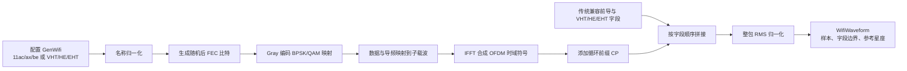
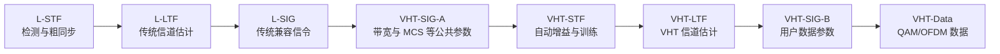
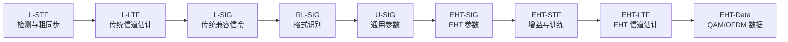
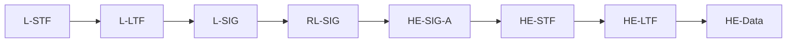

# VHT/HE/EHT Wi-Fi 帧生成：物理原理、公式推导与代码映射

本文解释 `inc/waveGen.py` 中 `GenWifi` 的物理意义和数学实现。阅读目标不是只知道“代码怎样运行”，而是理解一串随机比特为什么能变成具有 Wi-Fi 带宽、频谱形状、峰均比和帧结构的复基带波形。

> **实现边界**：本工程生成的是用于 PA/DPD/ILC 仿真的 **VHT/HE/EHT PHY 激励波形**。它保留带宽、子载波间隔、MCS、OFDM、保护间隔和字段时长等关键特征，但没有实现完整 BCC/LDPC 编码、标准交织、逐比特 SIG 编码和逐采样标准训练序列，因此不能替代协议一致性测试仪或标准接收机。

---

## 1. 从射频到复基带

真实天线端信号是以载波频率 $f_c$ 振荡的实信号。工程中通常只保存变化较慢的复包络 $x(t)$：

```math
v_{\mathrm{RF}}(t)=\Re\left\{x(t)e^{j2\pi f_c t}\right\}
```

令

```math
x(t)=I(t)+jQ(t),
```

则 $I(t)$ 和 $Q(t)$ 分别是同相、正交两路基带信号。复基带模型省略了每秒几十亿次的载波振荡，却保留了幅度、相位、带宽、调制误差和非线性频谱再生等 PA/DPD 关心的信息。

---

## 2. `GenWifi` 的整体信号链



**图 1 说明**：横向路径展示数据字段从比特到时域采样点的转换；下方路径表示前导和信令字段。两条路径拼成完整帧后统一归一化。`WifiWaveform` 不只保存波形，还保存 EVM 解调所需的 FFT 长度、CP 长度、数据子载波位置和原始 QAM 符号。

---

## 3. OFDM 为什么能够在同一带宽内放很多子载波

### 3.1 单个子载波

在有效符号时长 $T_u$ 内，第 $k$ 个复指数子载波写成

```math
\phi_k(t)=e^{j2\pi k\Delta f t},\qquad 0\le t<T_u.
```

若选择

```math
\Delta f=\frac{1}{T_u},
```

任意两个不同子载波 $k\ne l$ 的内积为

```math
\begin{aligned}
\int_0^{T_u}\phi_k(t)\phi_l^*(t)\,dt
&=\int_0^{T_u}e^{j2\pi(k-l)t/T_u}\,dt\\
&=\left.\frac{T_u e^{j2\pi(k-l)t/T_u}}{j2\pi(k-l)}\right|_0^{T_u}\\
&=0.
\end{aligned}
```

这就是“正交”的来源：每个子载波的频谱虽然相互重叠，但在一个完整有效符号内，其他子载波贡献的正负面积刚好抵消。

### 3.2 离散 OFDM 公式

设频域网格有 $N$ 个点，$X[k]$ 是第 $k$ 个子载波上的 QAM 符号。能量归一化 IFFT 为

```math
x[n]=\frac{1}{\sqrt N}\sum_{k=0}^{N-1}X[k]e^{j2\pi kn/N},
\qquad n=0,1,\ldots,N-1.
```

对应 FFT 为

```math
X[k]=\frac{1}{\sqrt N}\sum_{n=0}^{N-1}x[n]e^{-j2\pi kn/N}.
```

这一对变换保持总能量，即 Parseval 关系：

```math
\sum_n|x[n]|^2=\sum_k|X[k]|^2.
```

代码中的 NumPy `ifft` 自带 $1/N$，所以 `OfdmSymbol` 再乘 $\sqrt N$；`Analysis` 解调时则将 `fft` 除以 $\sqrt N$。二者恰好互逆。

### 3.3 三代 Wi-Fi 的子载波间隔和符号时长

VHT（802.11ac）沿用传统 OFDM 的子载波间隔：

```math
\Delta f_{\mathrm{VHT}}=312.5\ \mathrm{kHz},
\qquad
T_{u,\mathrm{VHT}}=\frac{1}{\Delta f_{\mathrm{VHT}}}=3.2\ \mu\mathrm{s}.
```

HE（802.11ax）和 EHT（802.11be）把子载波间隔缩小到四分之一：

```math
\Delta f_{\mathrm{HE/EHT}}=78.125\ \mathrm{kHz},
\qquad
T_{u,\mathrm{HE/EHT}}=12.8\ \mu\mathrm{s}.
```

因此相同带宽下，HE/EHT 的基础 FFT 点数是 VHT 的四倍。更密的子载波有利于 OFDMA 资源细分，较长的有效符号也让固定长度的多径延迟占比更小。

VHT 的基础 FFT 和音调规划为：

| 配置带宽 | 基础 FFT 点数 | 活动音调数 | 导频数 | 数据音调数 |
|---:|---:|---:|---:|---:|
| 20 MHz | 64 | 56 | 4 | 52 |
| 40 MHz | 128 | 114 | 6 | 108 |
| 80 MHz | 256 | 242 | 8 | 234 |
| 160 MHz | 512 | 484 | 16 | 468 |

HE/EHT 的基础 FFT 和音调规划为：

| 配置带宽 | 基础 FFT 点数 | 活动音调数 | 导频数 | 数据音调数 |
|---:|---:|---:|---:|---:|
| 20 MHz | 256 | 242 | 8 | 234 |
| 40 MHz | 512 | 484 | 16 | 468 |
| 80 MHz | 1024 | 996 | 16 | 980 |
| 160 MHz | 2048 | 1992 | 32 | 1960 |

例如 80 MHz 时：

```math
\frac{80\ \mathrm{MHz}}{256}=312.5\ \mathrm{kHz}
\quad\text{(VHT)},
\qquad
\frac{80\ \mathrm{MHz}}{1024}=78.125\ \mathrm{kHz}
\quad\text{(HE/EHT)}.
```

当过采样倍数为 $L$ 时：

```math
f_s=L\,B,\qquad N_{\mathrm{FFT}}=L\,N_{\mathrm{base}},
```

所以

```math
\frac{f_s}{N_{\mathrm{FFT}}}=\frac{B}{N_{\mathrm{base}}}
```

仍然等于所选格式的基础子载波间隔。换句话说，过采样增加的是频谱观察范围和时域采样密度，不会改变 VHT 的 312.5 kHz 或 HE/EHT 的 78.125 kHz 物理间隔。

---

## 4. 子载波分配的物理含义

频域网格以直流为中心。索引 $k<0$ 表示负频率，$k>0$ 表示正频率；直流和保护音调不承载数据。代码通过

```math
i_{\mathrm{FFT}}=k\bmod N_{\mathrm{FFT}}
```

将中心化索引放到 NumPy FFT 数组中。负索引因取模而落在数组末端，这正符合离散傅里叶变换的存储顺序。

```text
负频率保护区 | 活动子载波 | DC 附近空音调 | 活动子载波 | 正频率保护区
             <-------------  信道占用带宽  ------------->
```

**图 2 说明**：活动子载波不会铺满整个 FFT 网格。两侧保护区给模拟滤波器和频谱模板留出过渡带；直流附近留空可以减轻本振泄漏和直流偏置影响。活动音调中再划分为数据音调与导频音调。

HE/EHT 的满带宽活动索引为：

- 20 MHz：$-122\ldots-2$ 与 $2\ldots122$；
- 40 MHz：$-244\ldots-3$ 与 $3\ldots244$；
- 80 MHz：$-500\ldots-3$ 与 $3\ldots500$；
- 160 MHz：两个中心相隔 1024 个子载波的 996-tone 分配。

VHT 使用较粗的 312.5 kHz 网格，20/40/80 MHz 分别形成 56/114/242 个活动音调；160 MHz 由两个 80 MHz 图样平移得到，共 484 个活动音调。代码为 VHT 使用 4/6/8/16 个导频，为 HE/EHT 使用 8/16/16/32 个导频。

导频是接收端已知的 BPSK 符号，真实系统用它们跟踪残余相位和频率漂移。本仿真把导频作为宽带激励的一部分，但 EVM 当前只在数据子载波上计算。

> **导频实现边界**：VHT 使用格式专用的对称导频位置；当前 HE/EHT 80 MHz 导频由程序对称选点，160 MHz 由两个 80 MHz 图样平移得到。所有格式都满足数量、对称性和边缘留量要求，适合 PA 激励，但本工程不宣称复现标准的逐符号导频极性序列。

---

## 5. MCS：调制阶数和编码率分别控制什么

MCS 把两个概念绑在一起：

1. **调制阶数**决定每个数据子载波一次携带多少比特；
2. **编码率**决定编码后比特中有多少是有效信息，剩余部分用于纠错冗余。

若 QAM 阶数为 $M$，每个子载波每符号携带

```math
b=\log_2M
```

个编码比特。若每个 OFDM 符号有 $N_d$ 个数据子载波，则

```math
N_{\mathrm{CBPS}}=N_d\log_2M,
```

名义信息比特数为

```math
N_{\mathrm{DBPS}}\approx\left\lfloor R_cN_{\mathrm{CBPS}}\right\rfloor,
```

其中 $R_c$ 是编码率。

### 5.1 工程支持的 MCS 表

| MCS | 调制 | $M$ | 每子载波比特数 | 编码率 | VHT | HE | EHT |
|---:|---|---:|---:|---:|:---:|:---:|:---:|
| 0 | BPSK | 2 | 1 | 1/2 | ✓ | ✓ | ✓ |
| 1 | QPSK | 4 | 2 | 1/2 | ✓ | ✓ | ✓ |
| 2 | QPSK | 4 | 2 | 3/4 | ✓ | ✓ | ✓ |
| 3 | 16-QAM | 16 | 4 | 1/2 | ✓ | ✓ | ✓ |
| 4 | 16-QAM | 16 | 4 | 3/4 | ✓ | ✓ | ✓ |
| 5 | 64-QAM | 64 | 6 | 2/3 | ✓ | ✓ | ✓ |
| 6 | 64-QAM | 64 | 6 | 3/4 | ✓ | ✓ | ✓ |
| 7 | 64-QAM | 64 | 6 | 5/6 | ✓ | ✓ | ✓ |
| 8 | 256-QAM | 256 | 8 | 3/4 | ✓ | ✓ | ✓ |
| 9 | 256-QAM | 256 | 8 | 5/6 | ✓ | ✓ | ✓ |
| 10 | 1024-QAM | 1024 | 10 | 3/4 | — | ✓ | ✓ |
| 11 | 1024-QAM | 1024 | 10 | 5/6 | — | ✓ | ✓ |
| 12 | 4096-QAM | 4096 | 12 | 3/4 | — | — | ✓ |
| 13 | 4096-QAM | 4096 | 12 | 5/6 | — | — | ✓ |

高阶 QAM 的星座点更密，同样的幅度或相位误差更容易越过判决边界。因此高 MCS 通常对 PA 非线性、噪声和 IQ 失衡更敏感。

> 本工程直接生成统计等价的“后 FEC 编码比特”。`codeRate` 和 `informationBitsPerSymbol` 用作配置与元数据，没有实际运行 LDPC 编码器。因此这里适合研究 RF 波形质量，不适合研究译码后的 PER/BER 编码增益。

---

## 6. Gray 编码 QAM 的推导

### 6.1 为什么使用 Gray 编码

Gray 编码让几何上相邻的星座点尽量只相差一个比特。轻微噪声使判决跳到相邻点时，通常只错一个比特，而不是同时错多个比特。

### 6.2 从比特到二维星座

对方形 $M$-QAM，每个轴有

```math
L=\sqrt M
```

个电平。将 $b=\log_2M$ 个比特一分为二，前一半控制 I，后一半控制 Q。Gray 整数先转换成自然二进制整数 $n\in[0,L-1]$，再映射为等间隔 PAM 电平：

```math
a(n)=2n-(L-1).
```

例如 16-QAM 的单轴电平为

```math
\{-3,-1,+1,+3\}.
```

未归一化复符号为

```math
s_0=a_I+ja_Q.
```

### 6.3 单位平均功率归一化

$L$-PAM 的平均平方电平为

```math
E[a^2]=\frac{L^2-1}{3}=\frac{M-1}{3}.
```

I、Q 两轴独立，因此

```math
E[|s_0|^2]=E[a_I^2]+E[a_Q^2]
=\frac{2}{3}(M-1).
```

于是归一化符号

```math
s=\frac{a_I+ja_Q}{\sqrt{\frac{2}{3}(M-1)}}
```

满足

```math
E[|s|^2]=1.
```

这项归一化非常重要：切换 16-QAM、1024-QAM 或 4096-QAM 时，平均星座功率基本不变，PA 输入功率扫描才具有可比性。BPSK 则直接使用 $+1$ 和 $-1$。

---

## 7. 循环前缀和保护间隔为什么能抵抗多径

无线多径信道可近似为有限冲激响应：

```math
y[n]=\sum_{m=0}^{L_h-1}h[m]x[n-m].
```

直接发送 OFDM 符号时，线性卷积会让前一个符号尾部进入当前符号，破坏正交性。发送端把有效符号最后 $N_{\mathrm{CP}}$ 个样点复制到前面：

```math
x_{\mathrm{CP}}
=\left[x[N-N_{\mathrm{CP}}],\ldots,x[N-1],x[0],\ldots,x[N-1]\right].
```

只要

```math
N_{\mathrm{CP}}\ge L_h-1,
```

接收端丢弃 CP 后，保留下来的有效区间就等价于循环卷积。FFT 会把循环卷积变成逐子载波乘法：

```math
Y[k]=H[k]X[k].
```

于是复杂的时域多径被拆成许多独立的“单抽头”子信道。

本工程的数据符号 CP 点数为

```math
N_{\mathrm{CP}}=\operatorname{round}(T_{\mathrm{GI}}f_s),
```

支持的 GI 和总数据符号时长取决于 PHY 代际：

| PHY | GI | 有效时长 $T_u$ | 总符号时长 $T_s=T_u+T_{GI}$ |
|---|---:|---:|---:|
| VHT | 0.4 µs | 3.2 µs | 3.6 µs |
| VHT | 0.8 µs | 3.2 µs | 4.0 µs |
| HE/EHT | 0.8 µs | 12.8 µs | 13.6 µs |
| HE/EHT | 1.6 µs | 12.8 µs | 14.4 µs |
| HE/EHT | 3.2 µs | 12.8 µs | 16.0 µs |

更长 GI 能容纳更长时延扩展，但相同时间内可发送的数据符号更少，因此存在抗多径能力与效率之间的折中。

---

## 8. 标准代际、PHY 名称和帧字段

### 8.1 11ac/11ax/11be 与 VHT/HE/EHT 的关系

`802.11ac`、`802.11ax` 和 `802.11be` 是 IEEE 标准修订代际；VHT、HE 和 EHT 是对应的物理层格式名称。工程把两类名称视为等效输入：

| IEEE 代际 | PHY 名称 | 常见商业名称 | `GenWifi` 可用输入 |
|---|---|---|---|
| 802.11ac | VHT | Wi-Fi 5 | `11ac`、`802.11ac`、`VHT` |
| 802.11ax | HE | Wi-Fi 6/6E | `11ax`、`802.11ax`、`HE` |
| 802.11be | EHT | Wi-Fi 7 | `11be`、`802.11be`、`EHT` |

`NormalizeFrameFormat` 不区分大小写地完成映射，后续 MCS、GI、FFT、音调和字段选择只使用规范名称 `VHT/HE/EHT`。因此输入 `11ax` 生成后的 `WifiWaveform.frameFormat` 为 `HE`。

### 8.2 VHT 激励帧



**图 3 说明**：VHT 前三段保持传统设备可检测的兼容性，随后进入 VHT 专用 SIG、训练和数据字段。本工程实现单用户单空间流激励的字段顺序和时长；VHT-LTF 固定采用 3.2 µs 有效段加 0.8 µs GI，而 VHT-Data 可选择 0.4 或 0.8 µs GI。

### 8.3 EHT 激励帧



**图 4 说明**：EHT 帧先发送传统设备可识别的兼容前缀，再发送 EHT 专用信令和训练字段，最后进入数据字段。当前代码复现字段顺序和持续时间，用确定性随机 BPSK 形成宽带训练激励；它不声称逐采样复制标准规定的训练序列内容。

### 8.4 HE 激励帧



**图 5 说明**：HE 与 EHT 共享传统兼容前缀，差异主要位于格式专用信令和训练字段。代码选择 HE 时使用 HE-SU 字段顺序；选择 EHT 时使用单用户满带宽 EHT 激励顺序。

### 8.5 当前字段时长构造

`TrainingField` 用 64 点传统 OFDM 基准，在每个 20 MHz 子信道放置 52 个 BPSK 音调；多带宽时按 bonded 20 MHz 分段扩展。传统符号的有效时长约为 3.2 µs，CP 为 0.8 µs，合计 4 µs。

VHT 中，L-STF/L-LTF/L-SIG 分别占 8/8/4 µs，VHT-SIG-A 占 8 µs，VHT-STF、单流 VHT-LTF 和 VHT-SIG-B 各占 4 µs。

代码中的主要 EHT 前导时长为：

| 字段 | 4 µs 单元数 | 仿真时长 |
|---|---:|---:|
| L-STF | 2 | 8 µs |
| L-LTF | 2 | 8 µs |
| L-SIG | 1 | 4 µs |
| RL-SIG | 1 | 4 µs |
| U-SIG | 2 | 8 µs |
| EHT-SIG | 1 | 4 µs |
| EHT-STF | 1 | 4 µs |

HE 中将 U-SIG/EHT-SIG 换成 8 µs 的 HE-SIG-A，随后是 4 µs 的 HE-STF。

### 8.6 HE/EHT-LTF 压缩模式

当 GI 为 1.6 µs 时，代码采用 2x LTF：FFT 长度减半，同时仅使用每隔一个活动音调，物理子载波位置仍保持一致。时长为

```math
T_{\mathrm{LTF}}=6.4+1.6=8.0\ \mu\mathrm{s}.
```

GI 为 0.8 或 3.2 µs 时使用完整 FFT，对应

```math
T_{\mathrm{LTF}}=12.8+T_{\mathrm{GI}},
```

即 13.6 µs 或 16.0 µs。

---

## 9. 为什么 Wi-Fi OFDM 对 PA 特别苛刻

一个时域采样点是许多子载波的向量和：

```math
x[n]=\frac{1}{\sqrt N}\sum_{k\in\mathcal K}X[k]e^{j2\pi kn/N}.
```

大多数时刻，各子载波相位部分抵消；某些时刻，大量相位偶然接近，瞬时幅度会很大。因此 OFDM 具有较高峰均功率比：

```math
\mathrm{PAPR}
=10\log_{10}\frac{\max_n|x[n]|^2}{E[|x[n]|^2]}.
```

```text
幅度
 ^                   瞬时峰值
 |                      /\
 |   /\    /\          /  \       /\
 |__/  \__/  \________/    \_____/  \____> 时间
 |---------------- 平均 RMS 参考线 ----------------
```

**图 5 说明**：平均功率看似温和，但少量尖峰会进入 PA 压缩区。若为了避免所有峰值而大幅回退，功率效率会降低；若回退不足，星座误差和邻道泄漏会增大。这正是 DPD/ILC 要解决的核心矛盾。

在理想的 $N$ 子载波同相极端情况下，峰值幅度可随 $N$ 增长；实际随机 QAM 很少达到理论上界，但子载波越多、观测帧越长，遇到高峰的概率通常越高。

---

## 10. 整包 RMS 归一化与功率扫描

生成帧拼接完成后，代码计算

```math
x_{\mathrm{rms}}=\sqrt{\frac{1}{N_s}\sum_{n=0}^{N_s-1}|x[n]|^2}
```

并使用

```math
x_{\mathrm{norm}}[n]=\frac{x[n]}{x_{\mathrm{rms}}}.
```

因此输出整包满足

```math
\mathrm{RMS}\{x_{\mathrm{norm}}\}=1.
```

主程序再乘 `driveRms`：

```math
x_d[n]=d\,x_{\mathrm{norm}}[n].
```

这使 `driveRms=d` 具有直观含义。相对输入功率横坐标为

```math
P_{\mathrm{in,dB}}=10\log_{10}(d^2)=20\log_{10}d.
```

注意归一化是针对**整包**，不同字段的局部 RMS 可能不同。这种选择保证不同配置生成的整包在统一 PA 标尺下可比较。

---

## 11. 随机种子和可复现性

`seed` 控制数据、导频和训练激励。相同配置与相同种子会生成相同波形，便于：

- 比较不同 ILC 方法时使用完全相同的输入；
- 回归测试时复现实验；
- 区分算法变化和随机数据变化。

工程还为每个前导字段派生局部随机种子，因此仅改变数据符号数量不会无意中改变前导字段。

---

## 12. 参数如何影响物理波形

| `GenWifi` 参数 | 物理作用 | 常见观察 |
|---|---|---|
| `frameFormat` | 选择 VHT/HE/EHT 的字段、FFT、GI 和 MCS 上限 | `11ac/11ax/11be` 会分别归一化为 VHT/HE/EHT |
| `bandwidthMhz` | 改变 FFT、活动音调数和采样率 | 同带宽下 HE/EHT 的 FFT 点数为 VHT 的四倍 |
| `mcs` | 改变星座密度与名义编码率 | 高阶 QAM 的 EVM 容限更严格 |
| `numDataSymbols` | 改变数据观测长度 | 更长帧更容易包含罕见高峰，PSD 也更稳定 |
| `guardIntervalUs` | 改变 CP 和 LTF 模式 | GI 越长，抗长多径能力越强，效率越低 |
| `oversampling` | 扩大可观察频率范围 | ACLR 至少需要 3x，本工程默认 4x |
| `seed` | 控制随机激励 | 固定 seed 可保证公平比较 |

---

## 13. 公式与代码的对应关系

| 物理步骤 | 代码入口 | 主要输出 |
|---|---|---|
| 配置验证 | `GenWifi.Validate` | 合法格式、带宽、MCS、GI、过采样 |
| 名称归一化 | `NormalizeFrameFormat` | `11ac→VHT`、`11ax→HE`、`11be→EHT` |
| MCS 查询 | `GenWifi.GetMcsInfo` | 调制阶数、编码率、每音调比特数 |
| 星座映射 | `QamModulate` | 单位平均功率 BPSK/QAM |
| 活动/导频音调 | `ActiveTones`、`PilotTones` | 中心化子载波索引 |
| OFDM 调制 | `OfdmSymbol` | IFFT 有效符号和 CP |
| 前导激励 | `TrainingField` | 4 µs 传统速率宽带字段 |
| 帧拼接 | `GenerateWifiWaveform` | `fieldSlices`、数据起点、完整帧 |
| RMS 归一化 | `GenerateWifiWaveform` 末尾 | 单位 RMS `samples` |

最典型的调用方式使用 `ChainMap` 将外部覆盖参数叠加在内置默认值之前：

```python
from collections import ChainMap

from inc.waveGen import GenWifi, genWifiDefaultParameters

wifiOverrides = {
    "frameFormat": "11ac",
    "bandwidthMhz": 80,
    "mcs": 9,
    "numDataSymbols": 20,
    "guardIntervalUs": 0.4,
}
wifiParameters = ChainMap(
    wifiOverrides,
    genWifiDefaultParameters,
)
wifiGenerator = GenWifi(parameters=wifiParameters)
wifiWaveform = wifiGenerator.Generate()

# The same instance now switches to the equivalent 802.11ax/HE input name.
wifiOverrides["frameFormat"] = "HE"
wifiOverrides["guardIntervalUs"] = 0.8
updatedWaveform = wifiGenerator.Generate()
```

`GenWifi` 内部再建立“构造函数直接覆盖 → 外部映射 → 只读默认值”的 ChainMap。`UpdateParameters(...)` 可写入最高优先级层，`GetParameters()` 可取得当前解析结果的字典快照。

---

## 14. 使用时必须记住的边界

1. 波形适合 PA、DPD、ILC、EVM 和频谱再生研究，不是标准一致性向量。
2. 未实现完整 MAC 帧、SERVICE/TAIL/PAD、加扰、LDPC/BCC、交织和译码。
3. 前导字段强调字段顺序、持续时间和宽带激励，不是标准逐比特/逐采样训练序列。
4. 当前系统假设单用户、满带宽，不实现多用户 RU 调度和多空间流 MIMO。
5. 不包含无线多径、载波频偏、采样频偏和相位噪声；如需研究接收机，需要另外加入这些模型。
6. EVM 分析使用生成时保存的理想 QAM 符号，因此发送和测量波形必须保持采样级对齐。

---

## 15. 参考资料

- [IEEE 802.11ac-2013：Very High Throughput 修订标准](https://standards.ieee.org/ieee/802.11ac/4473/)
- [IEEE 802.11ax-2021：High-Efficiency WLAN 修订标准](https://standards.ieee.org/ieee/802.11ax/7180/)
- [IEEE 802.11be-2024：Extremely High Throughput 修订标准](https://standards.ieee.org/ieee/802.11be/7516/)
- [IEEE Standards Board：802.11be-2024 批准信息](https://standards.ieee.org/about/sasb/sba/26sep2024/)

以上标准链接用于说明 VHT/HE/EHT 的标准来源；本文中的具体“工程实现边界”以 `inc/waveGen.py` 为准。
