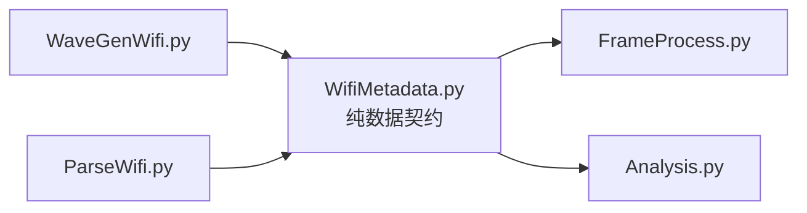

# Wi-Fi 共享元数据的数据契约

本文对应 `inc/WifiMetadata.py`。该模块不生成波形，也不计算指标，只定义 `MCSInfo` 和 `WifiWaveform` 两个跨模块数据结构。

## 1. 为什么需要独立元数据模块

重构前，`WifiWaveform` 定义在 `WaveGenWifi.py` 中，导致 `Analysis.py` 为了读取 FFT 长度、字段边界和子载波索引而依赖整个生成器模块。独立后，依赖关系变为：



**图 1 说明：**生成器产生数据对象；仅接收路径中的ParseWifi也会恢复或复用该对象。帧处理和分析只消费数据对象。`Analysis` 不直接导入 `WaveGenWifi.py`，因此接收处理和发送波形算法可以独立演进。

## 2. `MCSInfo`

`MCSInfo` 保存：

| 字段 | 含义 |
|---|---|
| `index` | MCS 索引 |
| `modulation` | BPSK、QPSK 或 QAM 名称 |
| `qamOrder` | 星座点数 |
| `codeRate` | 名义编码率 |
| `bitsPerSubcarrier` | 每个数据子载波的未编码比特数 |

它是不可变数据类，防止波形生成后意外修改 MCS 解释。

## 3. `WifiWaveform`

字段按用途分为六类：

| 分类 | 主要字段 | 使用者 |
|---|---|---|
| 样点和时钟 | `samples`、`sampleRateHz`、`bandwidthHz` | PA、SigProc、Analysis |
| OFDM 参数 | `fftLength`、`cpLength`、`symbolLength` | FrameProcess |
| 音调位置 | `activeSubcarriers`、`dataSubcarriers`、`pilotSubcarriers` | FrameProcess、Analysis |
| 帧边界 | `fieldSlices`、`dataSymbolStarts`、`dataFieldName` | Analysis、FrameProcess |
| MIMO 信息 | `numTransmitAntennas`、`numSpatialStreams`、`spatialMappingMatrix`、`cyclicShiftsSeconds` | FrameProcess |
| 确定性重建 | `seed`、`cyclicShiftEnabled` | WaveGenWifi、ParseWifi |

`samples` 的形状约定为：

```math
N_{\mathrm{sample}}
```

用于 SISO；MIMO 使用

```math
N_{\mathrm{sample}}
\times
N_{\mathrm{TX}}.
```

行始终表示时间，列始终表示物理发射链。

`seed` 和 `cyclicShiftEnabled` 记录生成原始理想帧所需的离散配置。它们不是接收机估计出来的连续信道参数，而是让 `ParseWifi` 在没有发送样值时，能够根据描述字段重建与发送端一致的参考数据、导频、训练字段和循环移位分集状态。若可选发送输入本身就是 `WifiWaveform`，Parser直接读取这些字段；调用方不需要改用另一套函数接口。

## 4. 数据所有权

- `WaveGenWifi.Generate` 创建并填充 `WifiWaveform`。
- `ParseWifi.Parse` 从接收帧恢复或复用 `WifiWaveform`，作为仅接收Analysis路径的数据契约。
- `FrameProcess` 和 `Analysis` 不修改元数据内容。
- 数组字段按“生成后只读”的约定使用。
- 若未来接入外部 VSA 数据，可直接构造兼容的 `WifiWaveform` 元数据，而无需调用 `WaveGenWifi`。

## 5. 使用边界

`WifiWaveform` 是工程仿真的共享数据契约，不是 IEEE 标准 PPDU 配置对象。它保留本工程 EVM、ACLR 和 MIMO 解映射所需的信息，但不表示完整 MAC 帧、LDPC 状态或标准一致性测试向量。
